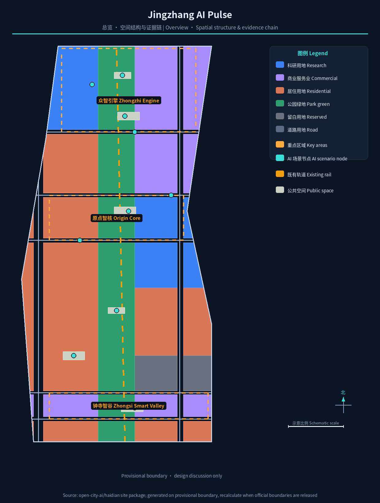
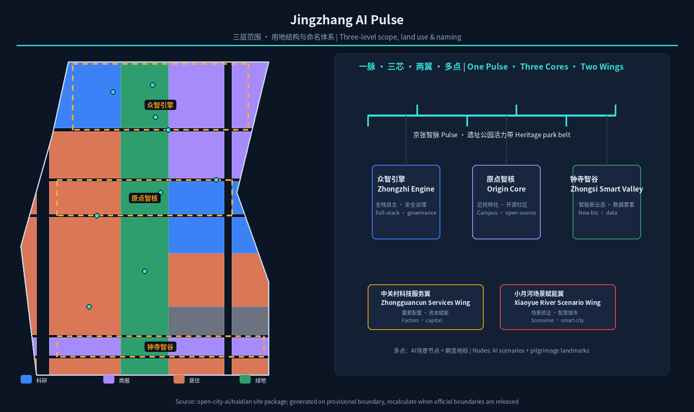
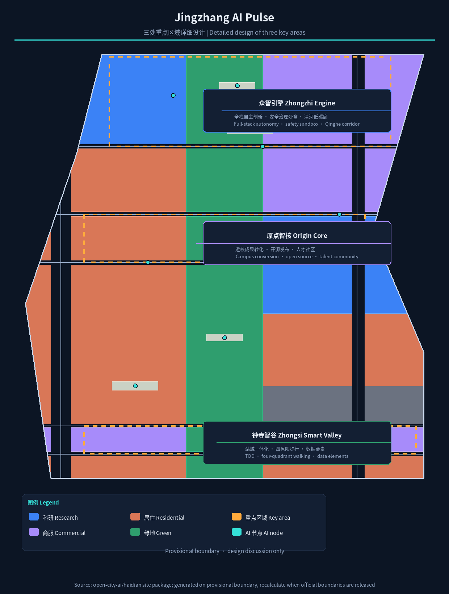
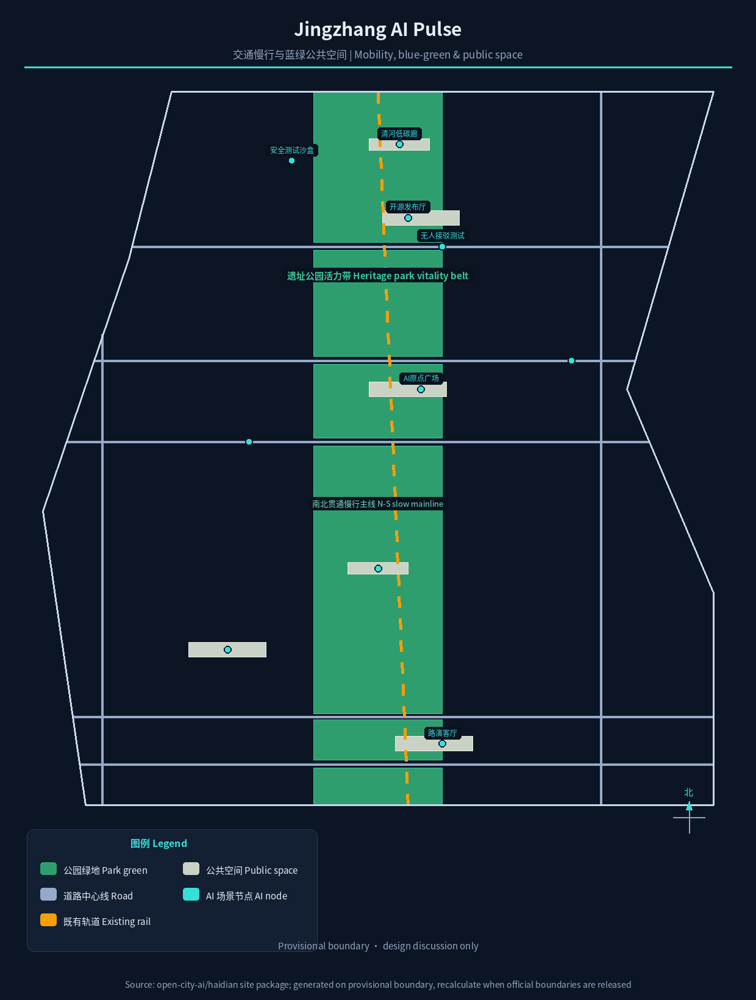
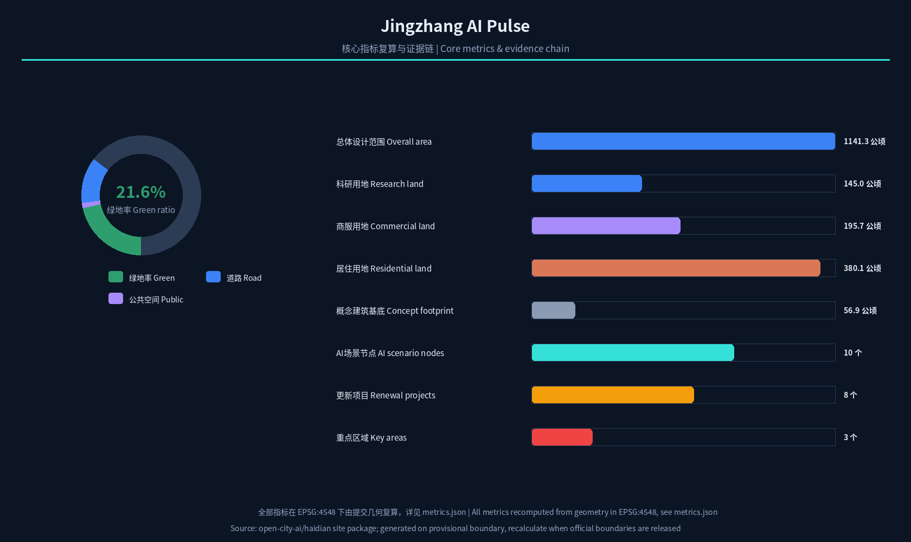

# Jingzhang AI Pulse: Overall Concept and Detailed Design for the Centennial Jing-Zhang AI Innovation Belt

## Design Basis and Source List

This proposal takes the Qualification Pre-announcement for the International Urban Design Solicitation of the Centennial Jing-Zhang AI Innovation Belt, issued by the Haidian Branch of the Beijing Municipal Commission of Planning and Natural Resources, as its primary governing basis; its three-tier scope, three key areas, design tasks, language and deliverable depth define the boundary of all work [standard:PROJECT-OFFICIAL-ANNOUNCEMENT]. The open-call taskbook for global AI agents adds the three positionings, five functions, three areas and two wings, six mandatory tasks and a unified boundary clause, all addressed item by item here [source:AGENT-TASKBOOK] [standard:PROJECT-AGENT-OPEN-CALL-TASKBOOK]. The site package files—`design_brief.json`, `allowed_design_space.json`, enums, planning limits, source list and `data/source_registry.json`—provide machine-readable rules and data boundaries; this document does not repeat machine indexes, and complete coverage relations are recorded in `sources.json` and the three compliance matrices [source:SITE-PACKAGE].

Source use follows the graded source registry [source:SOURCE-REGISTRY]: official announcement areas and textual boundary descriptions support scope and task judgements; the agent-facing taskbook is cleared user material used for task coverage; the provisional boundary is used only for generation, display and self-check. This proposal does not upgrade background or provisional material into statutory controls, formal scoring evidence or implementation commitments [data:geometry/site_boundary.geojson#SITE-001].

As of the retrieval date of this draft (2026-08-10), the repository has not yet published organizer-authorized exact `SITE_BOUNDARY` and three-`KEY_AREA` official polygons. This proposal uses the maintainer-registered provisional boundary (`provisional_constraint`, `official_boundary=false`) and continuously labels it in the narrative, metrics, assumptions and visualization as required. All areas, ratios and geometric conclusions are recalculated in EPSG:4548 [metric:site_area_sqm]; when official polygons are released, the site boundary, key areas, land use, buildings, roads, green/public space, phasing and all metrics must be recomputed as a whole [depth:risk_missing_data].

## Three-Level Scope Framework

The proposal implements the announcement's three-tier scope level by level: the coordinated research area of about 43.6 square kilometres studies the AI industry ecology, innovation chain and future urban form; the overall design area of about 11.4 square kilometres reaches the urban design depth of a regulatory detailed plan; and the key detailed-design area of about 368.4 hectares provides integrated implementation-plan-depth design for the three key areas [standard:PROJECT-OFFICIAL-ANNOUNCEMENT] [depth:three_level_scope_framework]. The spatial anchors of the three tiers are expressed by the submitted provisional boundary layers, and areas and partition structure are reproducible from geometry [data:geometry/site_boundary.geojson#SITE-001] [data:geometry/key_areas.geojson#PROV-KEY-001].

The three tiers are not isolated drawing sets but a decision chain of "industry strategy—spatial structure—district deepening". The coordinated layer answers "what ecosystem to build", the overall layer answers "where and how to renew", and the key-area layer answers "how exactly and what first". The overall spatial structure—One Pulse, Three Cores, Two Wings, Multiple Nodes—is precisely the spatial translation of this decision chain: the Pulse is the heritage park vitality belt (a composite of the railway heritage corridor and the AI innovation spine), the Three Cores are the Zhongzhi Engine (Zhongzhiyuan acceleration area), the Origin Core (Beijing AI Origin Community) and the Zhongsi Smart Valley (Dazhongsi cluster), the Two Wings are the Zhongguancun Technology Services Wing and the Xiaoyue River Scenario Empowerment Wing, and the Multiple Nodes are AI scenario and pilgrimage-landmark nodes distributed along the belt [depth:overall_spatial_structure]. The spatial structure is illustrated below, and the three key areas are expressed as independent features in `geometry/key_areas.geojson` [data:geometry/key_areas.geojson#PROV-KEY-002] [data:geometry/key_areas.geojson#PROV-KEY-003].

## Coordinated Research Area: Industry and Future City Research

The core judgement for the coordinated research area is that the Jing-Zhang AI Innovation Belt should not be a "cluster of parks" but should organize Haidian's university originators, leading enterprises, open-source communities, scenario openness and the century-old railway heritage into a continuously iterable "AI innovation chain". The proposal puts forward a five-stage chain—"university origin—open-source collaboration—enterprise conversion—public experience—international communication"—as the underlying logic of the three-areas-two-wings synergy loop [source:AGENT-TASKBOOK]. Within the three areas, the AI Origin Community undertakes campus-adjacent conversion and talent agglomeration (corresponding to the world-class AI innovation ecosystem), Zhongzhiyuan undertakes the full-stack independent innovation system and safety-governance display (corresponding to global discourse on AI governance), and Dazhongsi undertakes intelligent-native new business forms and data-element circulation (corresponding to AI+ scenario empowerment) [standard:PROJECT-AGENT-OPEN-CALL-TASKBOOK]. The two wings respectively host Zhongguancun technology services and capital/factor allocation, and Xiaoyue River scenario validation and smart-city experiments.

Drawing on globally transferable innovation ecosystems, the proposal selects and summarizes six cases: Kendall Square in Boston, built around MIT, forms a self-circulating "research institution + venture capital + small startups" loop; one-north in Singapore is known for government coordination, mixed functions and one-stop service platforms; King's Cross in London uses railway-heritage renewal to drive the knowledge economy; Hudson Yards in New York validates an incremental model of "public space first, smart infrastructure as the underpinning"; Shenzhen Bay Science and Technology Ecological Park organizes "ecology + industry + community" as one; and Zhongguancun Software Park in Beijing is known for dense synergy between leading enterprises and small innovative actors [source:AGENT-TASKBOOK]. Their shared lessons—campus-adjacent origination, public space that stimulates encounter, hub-driven passenger flow, and operator-first governance—are translated into spatial and operational mechanisms in this chapter, with detail recorded under agent.2 in `compliance_matrix.json` [depth:existing_conditions_diagnosis].

The naming and visual identity system is a major output of the coordinated layer. The proposal proposes the main name "Jingzhang AI Pulse" (京张智脉) with a three-tier naming system: the belt-level main brand, three district sub-brands ("Zhongzhi Engine / Origin Core / Zhongsi Smart Valley"), the two wings, and node-level marks corresponding to the pilgrimage landmarks. The logo direction is "rail translated into pulse": a north-bound railway line gradually dissolves into a waveform circuit, symbolizing the evolution of a century-old engineering heritage into an AI innovation form, with a gradient from deep blue (heritage and rationality) to electric cyan (computation and the future) [depth:overall_spatial_structure]. All names, typefaces and graphics must complete trademark and copyright clearance before formal use; this draft provides only directional concepts.

## Overall Design Area: Urban Renewal and Regulatory-Plan-Level Urban Design

The overall design area is summarized by three words—"relieve, stitch, weave": relieve means distinguishing retention, renovation and demolition for low-efficiency industrial and dilapidated spaces along the belt; stitch means opening the urban gaps on both sides of the railway corridor created by historical fragmentation; weave means weaving slow mobility, blue-green space, public transport and public services into a continuous network [depth:retain_renovate_demolish]. In spatial structure, the proposal uses the submitted land-use partition as the skeleton and forms a pattern of "central green pulse, functional flanks, transverse repair" across the 11.4-square-kilometre area: the central green pulse is the heritage park vitality belt (about 2.35 square kilometres of park and buffer green, green ratio about 21.6%) [metric:green_ratio] [data:geometry/land_use.geojson#LU-001], the flanks organize research, industry-service and residential functions by district, and transverse channels such as Chengfu Road and Zhichun Road stitch the east and west [data:geometry/roads.geojson#ROAD-005].

Urban renewal follows a regulatory-plan-depth logic of "define constraints first, then discuss transformation". Building footprints are expressed as concept footprints (about 107 representative parcels, building density about 5.0%) [metric:building_footprint_area_sqm] [metric:building_density], and three judgement types are clearly distinguished: spatial indicators reproducible from submitted geometry; control indicators such as floor-area ratio, building height, building density, setbacks and road red lines that require official regulatory conditions—all currently listed as "pending official regulatory-plan confirmation" [metric:floor_area_ratio] [standard:MOHURD-CONTROL-DETAILED-PLANNING]; and ownership, investment and engineering conditions to be confirmed in the implementation stage [depth:development_intensity_controls]. This chapter gives no pseudo-precise statutory control values, to avoid disguising conceptual advice as approved conclusions.

## Detailed Design of Key Areas

The three key areas are the "spatial verifiers" of the proposal, each designed at integrated-implementation-plan urban design depth, corresponding to the three provisional features in `geometry/key_areas.geojson` [depth:three_key_area_detailed_design]. Areas use the official announced values as reference; submitted geometry is recalculated on the provisional boundary, and no precise-area conclusions are made before official polygons are released [metric:key_area_count].

**Zhongzhi Engine (Zhongzhiyuan AI Autonomous Innovation Acceleration Area)**: positioned as a "garden-style full-stack autonomous innovation district". The spatial move is to organize a low-carbon innovation exchange corridor along the Qinghe riverfront, arrange an open test field and safety-governance display node in the middle, and configure industry display, standards workshops and computing-power experience facilities along the belt [data:geometry/key_areas.geojson#PROV-KEY-001]. The design emphasizes green space carrying open testing and "visible standards governance", translating safety evaluation and model red-team testing into bookable, visitable public scenarios [depth:three_key_area_detailed_design].

**Origin Core (Beijing AI Origin Community)**: positioned as a "campus-adjacent conversion and talent community". Centered on the former Qinghuayuan station site and the university boundary, the design organizes slow-mobility stitching among campus, park and neighbourhood, and adds outcome-release halls, open-source collaboration spaces, talent-service stations and residential amenities [data:geometry/key_areas.geojson#PROV-KEY-002]. The "AI Origin Plaza" is set here as the public anchor for release events, honour display and open-source activities, echoing the world-class AI innovation ecosystem among the five functions [source:AGENT-TASKBOOK].

**Zhongsi Smart Valley (Dazhongsi AI Industry Cluster)**: positioned as an "urban intelligent-economy and international exchange district". With transit-oriented development anchored on Dazhongsi station, the design organizes walking connectivity across the four quadrants around the station, intelligent-terminal display, content consumption and a data-element reception hall [data:geometry/key_areas.geojson#PROV-KEY-003]. Four-quadrant walking connectivity around the intersection is the highest-priority public-space move, accompanied by an international pitch lounge and honour-display system serving enterprises, developers and global visitors [depth:three_key_area_detailed_design].

## AI Innovation Ecosystem, Personas, and AI+ Scenarios

The proposal treats talent and enterprise demand profiles as the premise of scenario design, summarizing five user types: open-source developers, startup teams, leading-enterprise visitors, surrounding residents and university faculty and students. Their spatial responses fall respectively on the open-source release hall and code wall at the Origin Core, the shared test field at the Zhongzhi Engine, the international pitch lounge at Zhongsi Smart Valley, community service nodes along the belt, and the campus slow-mobility stitching zone [source:AGENT-TASKBOOK]. Personas are used only for spatial and operational design; no personal behaviour traces are collected, and privacy boundaries are stated in each scenario card [depth:risk_missing_data].

Twelve AI scenario cards are arranged along "One Pulse, Multiple Nodes", all mapped to spatial layers and operating entities; three of them are industry test-and-validation scenarios:

| No. | Scenario card | Spatial carrier | Users | Data and privacy boundary |
| --- | --- | --- | --- | --- |
| S01 | Open-source release hall | Origin Core · AI Origin Plaza | Developers/startups | Only aggregated participation data |
| S02 | Safety governance sandbox | Zhongzhi Engine · test field | Model developers/regulators | Red-team test data desensitized |
| S03 | LLM safety test field (test & validation) | North of Zhongzhi Engine | Industry clients/standards bodies | Authorized management of test samples |
| S04 | AI driverless shuttle test (test & validation) | South slow-mobility belt of Zhongzhi Engine | Mobility firms/public | No ride data retention |
| S05 | Robot delivery test (test & validation) | Along Xiaoyue River Wing | Logistics firms/residents | Desensitized delivery traces |
| S06 | Edge-computing station | Public nodes along the belt | Developers/SMEs | Compute services require separate authorization |
| S07 | AI slow-mobility navigation | Heritage park vitality belt | All pedestrians | No personal trajectory collection |
| S08 | Heritage AI cultural guide | Jing-Zhang heritage park | Tourists/residents | Location-aggregated heat only |
| S09 | Dazhongsi AI pitch lounge | Zhongsi Smart Valley front of station | Enterprises/investors/media | Meeting content published only with authorization |
| S10 | AI health kiosk | Community service nodes | Residents/elderly | Medical data never leaves the neighbourhood |
| S11 | AI legal service workstation | Public services along the belt | Residents/startups | Case information confidential |
| S12 | Global AI week public route | One-Pulse public space system | Global visitors | Anonymous aggregation of participation data |

All scenarios adhere to "experienceable, displayable, reviewable" as the baseline, prohibiting excessive surveillance and designs that cannot be humanly reviewed [data:geometry/public_space.geojson#PUBLIC-001]. Scenario-space-operation mapping and layer evidence are recorded under agent.3 in `compliance_matrix.json` and displayed in a linked view in `visual/index.html` [metric:scenario_node_count].

## Land Use, Building Scale, and Retain-Renovate-Demolish Strategy

The land-use plan follows the national land-use classification logic and completely partitions the overall design area into research, industry-service, residential, green, road and reserved land uses, forming a seamless, non-overlapping zoning [standard:MNR-LAND-USE-CLASSIFICATION-GUIDE] [data:geometry/land_use.geojson#LU-001]. In the submitted partition, research land is about 144.97 ha, industry and commercial-service land about 195.69 ha, residential land about 380.11 ha, park and buffer green about 235.32 ha, road land about 142.27 ha and reserved land about 42.93 ha, all recomputed in EPSG:4548 [metric:land_use_area_0802] [metric:land_use_area_05] [metric:land_use_area_1401]. Reserved land is concentrated in the southern transition section, providing flexibility for future functions [metric:land_use_area_16].

The building strategy is expressed in five categories—retain, renovate, renew, new-build and pending—and makes no parcel-level ownership or demolish-rebuild conclusions. Current-condition judgements rely on public-source clues; a formal retain-renovate-demolish list will be compiled after the existing-building survey and ownership data are supplied [depth:retain_renovate_demolish]. The footprints here are concept footprints (107 representative parcels), used to express the relationship of massing, density and public space; they are not an existing-building survey and not an approval basis [data:geometry/buildings.geojson#BLDG-001]. Building height, FAR, setbacks and character controls are registered in `standard_matrix.json` as pending official regulatory conditions [depth:development_intensity_controls].

## Transport, Rail, Municipal Infrastructure, and Public Services

Transport organization follows the principle of "rail first, slow-mobility as a network, car demand relieved". The belt leverages the existing rail corridor background and multiple stations to strengthen "transit-oriented integration": Dazhongsi station and the area around Qinghua East Road West station are coupled with key-area centres, with interchange and shared parking organized around stations [data:geometry/roads.geojson#RAIL-002]. The road system is expressed in submitted geometry as two north-south corridors and five transverse repair roads (including the conceptual Chengfu Road, Zhichun Road and Qinghua East Road), forming a microcirculation skeleton [data:geometry/roads.geojson#ROAD-005] [data:geometry/roads.geojson#ROAD-004]. The slow-mobility system forms a north-south mainline along the heritage park vitality belt, focusing on resolving gaps across major roads, and stitches east-west through node plazas and crossing links [depth:traffic_rail_slow_parking].

Municipal and new infrastructure follow the model of "traditional municipal as the baseline, new facilities as empowerment": traditional utilities such as energy and drainage follow the existing municipal framework and await pipeline data confirmation [standard:MOHURD-URBAN-DESIGN-MEASURES]; new facilities use distributed energy, edge computing and multi-function smart poles as prototypes, co-located with public service nodes [depth:municipal_new_infrastructure]. Public services are configured in three categories—innovation service platforms, talent life services and community services—with service radii and scales calibrated against population and employment data in the implementation stage [data:geometry/public_space.geojson#PUBLIC-001]. All matters involving road red lines, pipelines and engineering feasibility are listed as pending professional confirmation, and no engineering conclusions are given [depth:risk_missing_data].

## Blue-Green Network, Public Space, and Urban Character

The blue-green network takes the heritage park vitality belt as its skeleton (park and buffer green totalling about 235.32 ha in submitted geometry, green ratio about 21.6%) [metric:green_ratio] [data:geometry/green_space.geojson#GREEN-001]. A continuous walking-and-cycling mainline is planned along the belt, linking public nodes such as the Qinghe low-carbon innovation corridor, the south-gate plaza of the heritage park, the AI Origin Plaza and community vitality plazas [data:geometry/public_space.geojson#PUBLIC-001] [data:geometry/green_space.geojson#GREEN-002]. Public space emphasizes "AI perceptible, usable by everyone": plazas and green space reserve flexible interfaces for sensors, displays and interactive devices while keeping a low-intrusion design [standard:MOHURD-URBAN-DESIGN-MEASURES].

The proposal puts forward three AI pilgrimage landmarks and honour-display nodes as conceptual public anchors to be deepened by professional teams [depth:blue_green_public_space]: the **AI Origin Monument / Zero-Point Ruler** at the AI Origin Plaza, using "0/1" start scale to symbolize the origin of innovation and carrying the developer honour wall; the **Jing-Zhang Future Rail**, a digital rail installation in the heritage park that translates the railway into an interactive timeline and contributor display belt; and the **Zhongsi Smart Tower**, a public art and information tower in front of Dazhongsi station connecting the AI clock, community releases and the global-event countdown. The honour-display system is organized in three levels—"contributor honour wall, annual AI event plaques, open-source milestone track"—all requiring cleared design and avoiding over-entertainment [source:AGENT-TASKBOOK]. The urban character is based on "a composed industrial-heritage base, a bright innovation interface, and a human-scaled street grain"; building massing and roof forms follow district-level guidance without pseudo-precise control lines [standard:MOHURD-URBAN-DESIGN-MEASURES].

## Renewal Projects, Implementation Policy, and Phasing

The renewal project list is compiled on the principle of "operable, phased, assessable". This draft proposes eight conceptual project types: heritage-park gap stitching, the Qinghe innovation interface, the Origin conversion street, four-quadrant walking connectivity around Dazhongsi station, edge-computing and public service nodes, three test-and-validation fields, the Global AI Week public route, and the honour-display system [data:geometry/phasing.geojson#PHASE-001]. Each project type requires ownership, investment, approval and operator confirmation in the implementation stage; this draft makes no government commitments [depth:renewal_project_list].

Phasing is organized as "near-term start, mid-term push, long-term deepening" [data:geometry/phasing.geojson#PHASE-001] [data:geometry/phasing.geojson#PHASE-002] [data:geometry/phasing.geojson#PHASE-003]: the near term uses the AI Origin Community as the start area, first implementing the Origin Plaza, open-source release hall, AI health kiosk and slow-mobility gap stitching, rapidly validating through lightweight facilities and operational events; the mid term advances Zhongsi Smart Valley and the southern communities, completing transit-oriented integration and the pitch lounge; the long term deepens the Zhongzhiyuan acceleration area, completing the safety-test sandbox, computing station and Qinghe innovation corridor [depth:phasing_implementation]. Implementation policy recommendations cover renewal coordination, space supply, industry services, public participation, data governance and property-rights collaboration, all as conceptual recommendations [standard:PROJECT-AGENT-OPEN-CALL-TASKBOOK].

Long-term operation is an organic part of the proposal rather than an attached slogan. The proposal puts forward an annual event system (spring developer conference, summer AI carnival, autumn release week, winter global AI dialogue) under the event brand "Jingzhang AI PULSE" [source:AGENT-TASKBOOK]; the developer community forms a positive feedback loop through open-source contribution, the honour system and priority access to compute and scenario resources; scenario open operation adopts an "apply—review—publicize—retrospect" mechanism, fairly open to enterprises and developers; the public experience route is linked with global events to serve international communication and conversion. All events, recruitment and funding arrangements are expressed as conceptual recommendations or deepening directions [depth:phasing_implementation].

## Metrics, Area Recalculation, and Compliance Matrix

The indicator system is managed in three categories: spatial indicators reproducible from submitted geometry, control indicators requiring official regulatory-plan support, and performance indicators requiring continuous operational-data calibration. Spatial indicators are registered in `metrics.json` and reconciled by `scripts/spatial_review.py`, including the overall design area (about 1141.28 ha) [metric:site_area_sqm], green ratio (about 21.6%) [metric:green_ratio], public-space ratio (about 1.4%) [metric:public_space_ratio], road ratio (about 12.5%) [metric:road_ratio], building density (about 5.0%) [metric:building_density] and each land-use area [metric:land_use_area_0802]. Control indicators (FAR, building height, building density, setbacks) are listed as unknown for lack of official regulatory conditions, with reasons and preconditions [metric:floor_area_ratio] [metric:total_floor_area_sqm]. Performance indicators (AI innovation index, talent density, scenario usage frequency, etc.) are recorded in `compliance_matrix.json` as operational deepening directions.

The compliance matrix covers all mandatory tasks in sections 1.3, 1.4 and 1.5 of the announcement and the six agent tasks agent.1—agent.6, mapping each task to report sections, layers, metrics, drawings, HTML, sources, assumptions and self-checks [source:AGENT-TASKBOOK] [standard:PROJECT-AGENT-OPEN-CALL-TASKBOOK]. The professional-standards matrix covers the five formally mandatory standards, and the design-depth matrix covers all fifteen mandatory depth items as complete [depth:metrics_recalculation]. The recalculation logic and evidence chain are visualized below; full values are in `metrics.json` [metric:green_space_area_sqm] [metric:public_space_area_sqm].

## Risk, Copyright, and Compliance

**Bilingual requirement.** The primary document of this proposal is Chinese, with a complete English counterpart `proposal.en.md`; the report HTML, visualization HTML, A3/A0 drawings and the five figures all provide corresponding English copies [depth:risk_missing_data]. Figures, typefaces, logo directions and case materials must complete clearance before formal use; sources and authorization status are registered in `sources.json` and `report/copyright_statement.md`.

**Data and precision risks.** Submitted geometry is based on the provisional boundary; areas and ratios are for design discussion only and must not be used as official red lines, approval basis or precise-area basis; they must be recomputed as a whole when official polygons are released [data:geometry/site_boundary.geojson#SITE-001] [metric:site_area_sqm]. Regulatory indicators, road red lines, pipelines, ownership and engineering conditions await official material confirmation; no approved values are given before they are obtained [metric:floor_area_ratio] [depth:risk_missing_data].

**Boundary and compliance.** All spatial implementation suggestions are "conceptual recommendations / reference schemes / material for professional teams to deepen", replacing neither formal planning nor constituting government-approved conclusions [standard:PROJECT-AGENT-OPEN-CALL-TASKBOOK]. The proposal does not claim official approval, approved regulatory plans, final land ownership, final construction scale or guaranteed implementation; AI scenarios follow the principles of data minimization, explainability and human review, prohibiting excessive surveillance and privacy infringement [source:AGENT-TASKBOOK].

## References

- Qualification Pre-announcement for the International Urban Design Solicitation of the Centennial Jing-Zhang AI Innovation Belt (Haidian Branch, Beijing Municipal Commission of Planning and Natural Resources, 2026-05-09)
- Excerpt of the open-call taskbook "Centennial Jing-Zhang AI Innovation Belt Urban Design Open Call for Global AI Agents" (user-provided cleared document, 2026-05-18)
- Haidian "1+X+1" modern industrial system layout (Haidian District People's Government, 2026-03-02)
- "Three Areas and Two Wings" to build a world-class AI agglomeration (Beijing Municipal Science and Technology Commission, Zhongguancun Administrative Committee, 2026-04-03)
- Measures for the Administration of Urban Design (MOHURD, 2017)
- Measures for the Compilation and Approval of Regulatory Detailed Plans for Cities and Towns (MOHURD)
- Guidelines for Land-Sea Classification for Territorial Spatial Survey, Planning and Use Control (Ministry of Natural Resources, 2023)
- Interim Measures for the Administration of Generative AI Services (CAC et al., 2023)
- Repository `brief/site-package/` site package and `data/source_registry.json` source registry
- Public material on global innovation ecosystems (Kendall Square, one-north, King's Cross, Hudson Yards, Shenzhen Bay, Zhongguancun Software Park)
- Full machine indexes are in `sources.json`, `metrics.json`, `compliance_matrix.json`, `standard_matrix.json` and `design_depth_matrix.json`

These materials jointly support the spatial structure and metrics judgements of this proposal; citation relations are authoritative in `sources.json` and the three matrices [source:SITE-PACKAGE] [standard:PROJECT-OFFICIAL-ANNOUNCEMENT].
