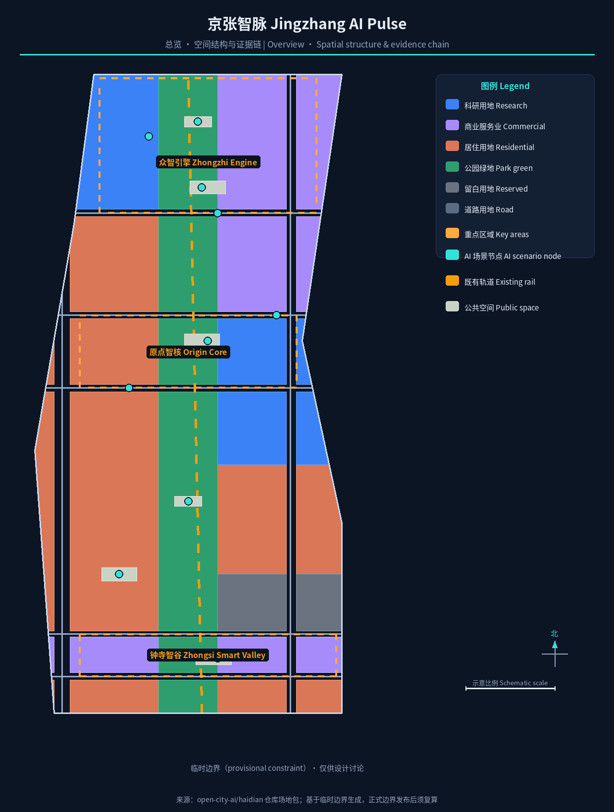
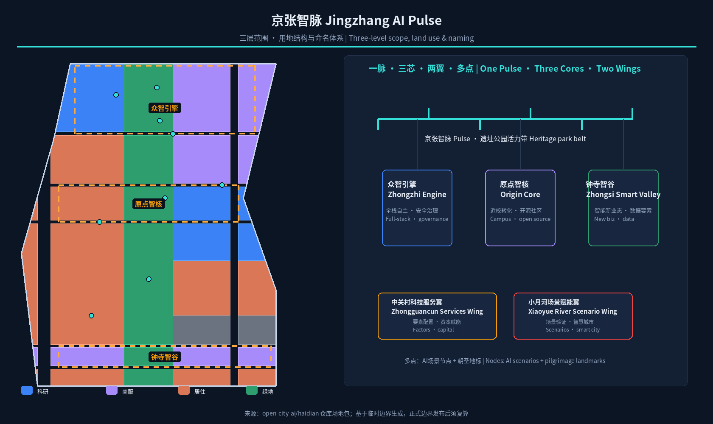
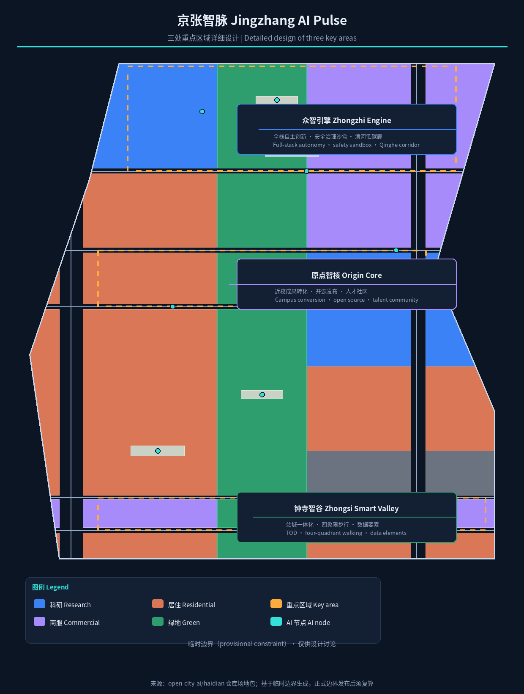
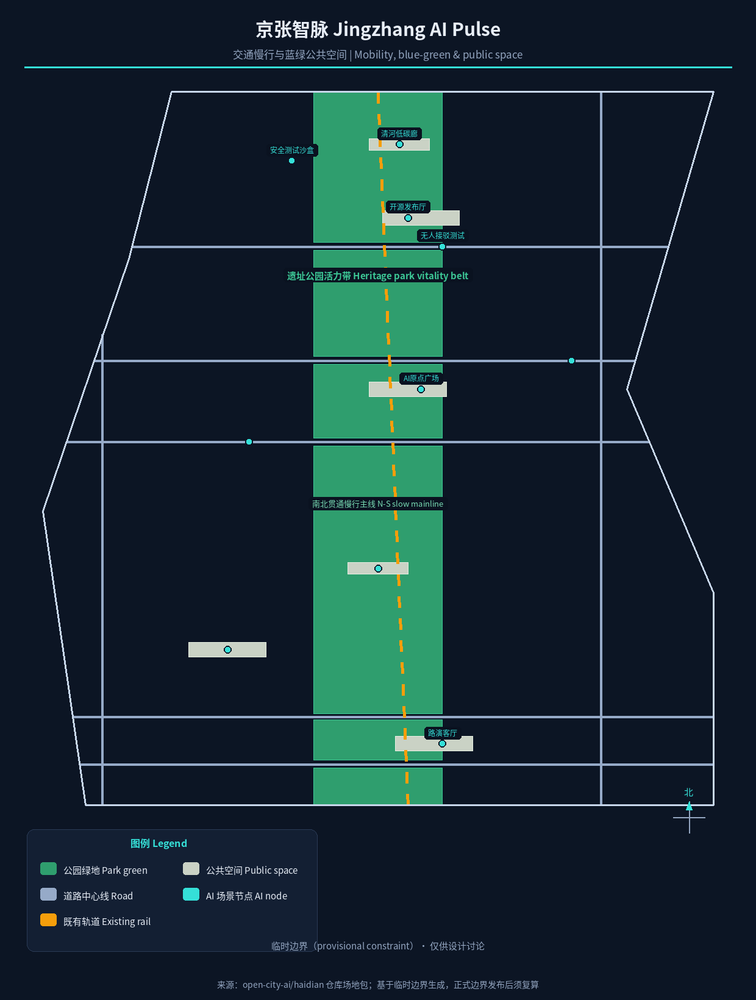
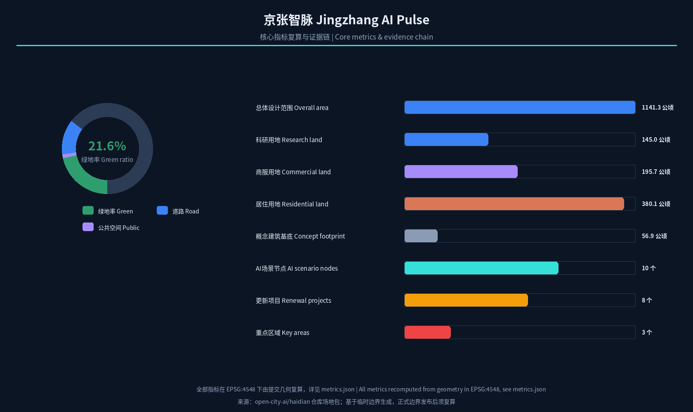

# 京张智脉：百年京张AI创新带总体概念与精细化设计

## 设计依据与资料清单

本方案以北京市规划和自然资源委员会海淀分局发布的《百年京张AI创新带城市设计国际方案征集资格预审公告》为第一主控依据，其界定的三层范围、三处重点区域、设计任务、语言和成果深度是全部工作的边界 [standard:PROJECT-OFFICIAL-ANNOUNCEMENT]。面向全球智能体的开源征集任务书补充了三大定位、五大功能、三区两翼、六项必做任务和统一边界条款，本方案逐条落实 [source:AGENT-TASKBOOK] [standard:PROJECT-AGENT-OPEN-CALL-TASKBOOK]。场地包中的 `design_brief.json`、`allowed_design_space.json`、枚举、规划限值、来源清单与 `data/source_registry.json` 提供了机器可读的规则与资料边界，本文不再逐条抄录机器索引，完整覆盖关系见 `sources.json` 与三个合规矩阵 [source:SITE-PACKAGE]。

资料使用遵循来源登记表的分级 [source:SOURCE-REGISTRY]：官方公告面积与边界文字说明用于范围与任务判断；面向智能体任务书为清权用户资料，用于任务覆盖；临时粗略边界仅用于方案生成、展示与自检。本方案不把背景资料或临时资料升级为法定控制、正式评分依据或实施承诺 [data:geometry/site_boundary.geojson#SITE-001]。

截至本稿检索日（2026-08-10），仓库尚未发布经组织方授权的精确 `SITE_BOUNDARY` 与三处 `KEY_AREA` 官方多边形。本方案采用维护者登记的临时边界（`provisional_constraint`、`official_boundary=false`），并按要求在正文、指标、假设与可视化中持续标注。所有面积、比例与几何结论均按 EPSG:4548 投影复算 [metric:site_area_sqm]；正式多边形发布后，site boundary、key areas、land use、buildings、roads、green/public space、phasing 与全部指标必须整体重算 [depth:risk_missing_data]。

## 三层范围工作框架

方案按公告三层范围逐级落实：统筹研究范围约 43.6 平方公里，研究AI产业生态、创新链与未来城市形态；总体设计范围约 11.4 平方公里，达到控制性详细规划的城市设计深度；重点区域范围约 368.4 公顷，对三处重点片区进行规划综合实施方案深度设计 [standard:PROJECT-OFFICIAL-ANNOUNCEMENT] [depth:three_level_scope_framework]。三层的空间落点以提交的临时边界图层表达，面积与分区结构可从几何复算 [data:geometry/site_boundary.geojson#SITE-001] [data:geometry/key_areas.geojson#PROV-KEY-001]。

三层不是割裂的图纸层级，而是一条“产业战略—空间结构—片区深化”的决策链。统筹层回答“建什么样的生态”，总体层回答“落到哪块地、怎么改”，重点层回答“具体怎么做、先做什么”。本方案的总体空间结构——一脉、三芯、两翼、多点——正是这条决策链的空间转译：一脉为京张遗址公园活力带（铁路遗产廊道与AI创新主轴复合），三芯为众智引擎（众智园加速区）、原点智核（AI原点社区）、钟寺智谷（大钟寺集聚区），两翼为中关村科技服务翼与小月河场景赋能翼，多点为沿带分布的AI场景节点与朝圣地标 [depth:overall_spatial_structure]。空间结构示意见下文，三处重点片区在 `geometry/key_areas.geojson` 中独立成图 [data:geometry/key_areas.geojson#PROV-KEY-002] [data:geometry/key_areas.geojson#PROV-KEY-003]。

## 统筹研究范围产业与未来城市研究

统筹研究范围的核心判断是：京张AI创新带不是“园区拼盘”，而是把海淀的高校策源、头部企业、开源社区、场景开放与百年铁路遗产组织成一条可持续迭代的“AI创新链”。方案提出“高校策源—开源协作—企业转化—公共体验—国际传播”五段式创新链，作为三区两翼协同回路的底层逻辑 [source:AGENT-TASKBOOK]。三区中，AI原点社区承担近校成果转化与人才集聚（对应世界级AI创新生态），众智园承担全栈自主创新体系与安全治理展示（对应AI治理全球话语权），大钟寺承担智能原生新业态与数据要素流通（对应AI+场景赋能） [standard:PROJECT-AGENT-OPEN-CALL-TASKBOOK]。两翼分别承接中关村科技服务与资本要素配置、小月河场景验证与智慧城市试验。

对照全球可借鉴的创新生态，本方案选取并概括六个可转化的案例：美国波士顿肯德尔广场依托MIT形成“研究机构+风投+小微初创”自循环；新加坡纬壹科技园以政府统筹、功能混合和一站服务平台著称；英国伦敦国王十字站区以铁路遗产更新带动知识经济；美国纽约哈德逊城市广场验证了“公共空间先行、智慧基础设施托底”的增量开发模式；中国深圳湾科技生态园以“生态+产业+社区”一体组织；北京中关村软件园以龙头企业与中小创新主体密集协同见长 [source:AGENT-TASKBOOK]。这些案例的共同经验——近校策源、公共空间激发交往、轨道枢纽引流、运营主体前置——被转译为本章的空间与运营机制，具体经验条目进入 `compliance_matrix.json` 的 agent.2 覆盖项 [depth:existing_conditions_diagnosis]。

命名与视觉识别体系是统筹层的重要产出。方案提出主名称“京张智脉”（英文 Jingzhang AI Pulse），命名体系分三级：一带主品牌“京张智脉”，三区子品牌“众智引擎 / 原点智核 / 钟寺智谷”，两翼为“中关村科技服务翼、小月河场景赋能翼”，节点级标识对应朝圣地标。Logo方向以“铁轨转译为脉冲”为核心：一条自南向北的轨道线逐步离散为波形电路线，象征百年工程遗产向AI创新形态的演进，辅以深蓝（历史与理性）到电光青（计算与未来）的渐变 [depth:overall_spatial_structure]。所有命名、字体与图形均需在正式使用前完成商标与版权清权，本稿仅提供方向性概念。

## 总体设计范围城市更新与控规深度城市设计

总体设计范围以“减负、缝合、织网”三词概括更新策略：减负即对沿带低效产业空间和破旧建筑进行留改拆甄别，缝合即打通铁路廊道两侧因历史割裂形成的城市断点，织网即把慢行、蓝绿、公共交通与公共服务编织为连续网络 [depth:retain_renovate_demolish]。空间结构上，本方案以提交几何的用地分区为骨架，在11.4平方公里范围内形成“中心绿脉、两侧功能、横向织补”的格局：中心绿脉为京张遗址公园活力带（约2.35平方公里公园绿地与防护绿地，绿地率约21.6%）[metric:green_ratio] [data:geometry/land_use.geojson#LU-001]，两侧按片区组织科研、产业服务与居住功能，横向以成府路、知春路等通道缝合东西 [data:geometry/roads.geojson#ROAD-005]。

城市更新遵循“先定约束、再谈改造”的控规深度逻辑。本稿对建筑基底采用概念示意表达（约107个代表性地块，建筑密度约5.0%）[metric:building_footprint_area_sqm] [metric:building_density]，并明确区分三类判断：可由提交几何复算的用地与比例指标；需要官方控规条件支撑的容积率、建筑高度、建筑密度、退线与道路红线指标，目前全部列为“待正式控规条件确认” [metric:floor_area_ratio] [standard:MOHURD-CONTROL-DETAILED-PLANNING]；需要实施阶段确认的权属、投资与工程条件 [depth:development_intensity_controls]。本章不给出任何伪精确的法定控制数值，以避免把概念建议伪装为审定结论。

## 重点区域详细设计

三处重点区域是方案的“空间验算器”，均以规划综合实施方案深度开展详细设计，分别对应 `geometry/key_areas.geojson` 中的三个 provisional 特征 [depth:three_key_area_detailed_design]。三区面积以官方公告数值为参照，提交几何按临时边界复算，正式多边形发布前不作精确面积结论 [metric:key_area_count]。

**众智引擎（众智园AI自主创新加速区）**：定位为“花园型全栈自主创新街区”。空间动作为依托清河界面组织低碳创新交往廊，在中部布置开放测试场与安全治理展示节点，沿带配置产业展示、标准工作坊与算力体验设施 [data:geometry/key_areas.geojson#PROV-KEY-001]。设计强调绿色空间承载开放测试与“可见的标准治理”，把安全评测、模型红队测试转译为可预约、可参观的公共场景 [depth:three_key_area_detailed_design]。

**原点智核（北京AI原点社区）**：定位为“近校型成果转化与人才社区”。围绕清华园站旧址与高校边界，组织校区—园区—街区慢行缝合，补足成果发布厅、开源协作空间、人才服务驿站与居住生活配套 [data:geometry/key_areas.geojson#PROV-KEY-002]。此处设置“AI原点广场”作为发布、荣誉展示与开源活动的公共锚点，呼应五大功能中的世界级AI创新生态 [source:AGENT-TASKBOOK]。

**钟寺智谷（大钟寺AI产业聚集区）**：定位为“城市型智能经济与国际交往街区”。以大钟寺站一体化开发为支点，围绕站前四象限组织步行连通、智能终端展示、内容消费与数据要素会客厅 [data:geometry/key_areas.geojson#PROV-KEY-003]。路口四象限步行连通是本区最优先的公共空间动作，配套国际路演客厅与荣誉展示系统，服务企业、开发者与全球访客 [depth:three_key_area_detailed_design]。

## AI 创新生态、人才画像与 AI+ 场景

本方案将人才与企业需求画像作为场景设计的前提，归纳五类用户：开源开发者、初创团队、头部企业访客、周边居民与高校师生，其空间响应分别落在原点智核的开源发布厅与代码墙、众智引擎的共享测试场、钟寺智谷的国际路演客厅、沿带的社区服务节点与校区慢行缝合带 [source:AGENT-TASKBOOK]。画像仅用于空间与运营设计，不采集个人行为轨迹，隐私边界在每张场景卡中明示 [depth:risk_missing_data]。

沿“一脉多点”布置十二张AI场景卡，全部映射到空间图层与运营主体，其中三张为产业测试验证场景：

| 编号 | 场景卡 | 空间载体 | 服务对象 | 数据与隐私边界 |
| --- | --- | --- | --- | --- |
| S01 | 开源发布厅 | 原点智核·AI原点广场 | 开发者/初创团队 | 仅聚合统计参与数据 |
| S02 | 安全治理沙盒 | 众智引擎·测试场 | 模型开发者/监管机构 | 红队测试数据脱敏 |
| S03 | 大模型安全测试场（测试验证） | 众智引擎北部 | 产业客户/标准机构 | 测试样本授权管理 |
| S04 | AI无人接驳测试（测试验证） | 众智引擎南侧慢行带 | 出行企业/公众 | 行驶数据不留存 |
| S05 | 机器人配送测试（测试验证） | 小月河场景赋能翼沿线 | 物流企业/居民 | 配送轨迹脱敏 |
| S06 | 端侧算力驿站 | 沿带公共节点 | 开发者/中小企业 | 算力服务另行授权 |
| S07 | AI慢行导航 | 遗址公园活力带 | 全体行人 | 不采集个人轨迹 |
| S08 | 遗址AI文化导览 | 京张遗址公园 | 游客/市民 | 仅位置聚合热力 |
| S09 | 大钟寺AI路演客厅 | 钟寺智谷站前 | 企业/投资人/媒体 | 会议内容授权发布 |
| S10 | AI健康问诊亭 | 社区服务节点 | 居民/老人 | 医疗数据不出街区 |
| S11 | AI法律服务工作站 | 沿带公共服务 | 居民/初创企业 | 案件信息保密 |
| S12 | 全球AI活动周公共路线 | 一脉公共空间系统 | 全球访客 | 参与数据匿名聚合 |

以上场景均以“可体验、可展示、可复核”为底线，禁止过度监控与无法人工复核的设计 [data:geometry/public_space.geojson#PUBLIC-001]。场景-空间-运营映射及图层证据进入 `compliance_matrix.json` 的 agent.3 覆盖项，并在 `visual/index.html` 中联动展示 [metric:scenario_node_count]。

## 用地、建筑规模与拆改留方案

用地方案依据国土空间用地用海分类逻辑，将总体设计范围完整划分为科研、产业服务、居住、绿地、道路与留白等用地，形成无缝无重叠的分区 [standard:MNR-LAND-USE-CLASSIFICATION-GUIDE] [data:geometry/land_use.geojson#LU-001]。提交分区中科研用地约144.97公顷、产业与商业服务用地约195.69公顷、居住用地约380.11公顷、公园绿地与防护绿地约235.32公顷、道路用地约142.27公顷、留白用地约42.93公顷，全部数值由EPSG:4548投影复算 [metric:land_use_area_0802] [metric:land_use_area_05] [metric:land_use_area_1401]。留白用地集中于南段过渡区，为远期功能预留弹性 [metric:land_use_area_16]。

建筑策略按“保留、改造、更新、新建、待确认”五类表述，不对具体地块做权属或拆改留结论。现状判定以公开资料为线索，正式拆改留清单待现状建筑调查与权属资料补充后编制 [depth:retain_renovate_demolish]。本稿的建筑基底为概念示意（107个代表性地块），用于表达体量、密度与公共空间的关系，不是现状建筑普查，也不作为审批依据 [data:geometry/buildings.geojson#BLDG-001]。建筑高度、容积率、退线与风貌控制均在 `standard_matrix.json` 中登记为待官方控规条件确认 [depth:development_intensity_controls]。

## 交通、轨道、市政与公共服务设施

交通组织以“轨道为先、慢行成网、小汽车减负”为原则。带内依托既有的轨道交通廊道背景与多个站点，强化“站城一体化”：大钟寺站、清华东路西口一带站点与重点片区中心耦合，站点周边组织接驳与共享停车 [data:geometry/roads.geojson#RAIL-002]。道路系统在提交几何中表达为两条南北向通道与五条横向织补路（含成府路、知春路、清华东路等概念织补），构成微循环骨架 [data:geometry/roads.geojson#ROAD-005] [data:geometry/roads.geojson#ROAD-004]。慢行系统依托遗址公园活力带形成南北贯通主线，重点解决跨主干路断点，东西向通过节点广场与过街联系缝合 [depth:traffic_rail_slow_parking]。

市政与新型基础设施按“传统市政保底、新型设施赋能”组织：能源与排水等传统设施遵循既有市政框架并待管线资料确认 [standard:MOHURD-URBAN-DESIGN-MEASURES]；新型设施以分布式能源、端侧算力与“多杆合一”智能灯杆为原型，与公共服务节点复合布局 [depth:municipal_new_infrastructure]。公共服务设施按创新服务平台、人才生活服务、社区服务三类配置，服务半径与规模在实施阶段结合人口与岗位数据校核 [data:geometry/public_space.geojson#PUBLIC-001]。本章所有涉及道路红线、管线与工程可行性的事项均列为待专业确认，不给出工程结论 [depth:risk_missing_data]。

## 蓝绿空间、公共空间与城市风貌

蓝绿空间以京张遗址公园活力带为骨架（提交几何中的公园绿地与防护绿地合计约235.32公顷，绿地率约21.6%）[metric:green_ratio] [data:geometry/green_space.geojson#GREEN-001]。带内规划连续的步行骑行主线，串联清河低碳创新廊、遗址公园南门广场、AI原点广场与社区活力广场等公共节点 [data:geometry/public_space.geojson#PUBLIC-001] [data:geometry/green_space.geojson#GREEN-002]。公共空间强调“AI可感知、人人都可使用”：广场与绿地预留传感器、显示与交互装置的柔性接口，但保持低侵入设计 [standard:MOHURD-URBAN-DESIGN-MEASURES]。

本方案提出三处AI朝圣地标与荣誉展示节点，作为概念性、可被专业团队深化的公共锚点 [depth:blue_green_public_space]：**AI原点纪念碑/零点标尺**——设于AI原点广场，以“0/1”起始刻度隐喻创新原点，并承载开发者荣誉墙；**京张未来轨道**——遗址公园内的数字轨道装置，把铁轨转译为可互动的时间轴与贡献者展示带；**钟寺智塔**——大钟寺站前的公共艺术与信息塔，连接AI时钟、社区发布与全球活动倒计时。荣誉展示体系分“贡献者名人墙、年度AI事件铭牌、开源里程碑轨迹”三级，全部要求清权设计，不得过度娱乐化 [source:AGENT-TASKBOOK]。城市风貌以“沉稳的工业遗产底、明亮的创新界面、人性化街区尺度”为基调，建筑体量与屋顶形态按片区提出引导方向，不作伪精确控制线 [standard:MOHURD-URBAN-DESIGN-MEASURES]。

## 更新项目清单、实施政策与分期计划

更新项目清单以“可运营、可分期、可评估”为编制原则，本稿提出八类概念项目：遗址公园断点缝合、清河创新界面、原点成果转化街、大钟寺站四象限步行连通、端侧算力与公共服务节点、三处测试验证场、全球AI活动周公共路线、荣誉展示系统 [data:geometry/phasing.geojson#PHASE-001]。每类项目均需在实施阶段落实权属、投资、审批与运营主体，本稿不作出政府承诺 [depth:renewal_project_list]。

分期按“近期启动、中期推进、远期深化”组织 [data:geometry/phasing.geojson#PHASE-001] [data:geometry/phasing.geojson#PHASE-002] [data:geometry/phasing.geojson#PHASE-003]：近期以AI原点社区为启动区，先行落地原点广场、开源发布厅、AI健康问诊亭与慢行断点缝合，以轻量设施和运营活动快速验证；中期推进大钟寺智谷与南段社区，完成站城一体化与路演客厅建设；远期深化众智园加速区，建成安全测试沙盒、算力驿站与清河创新廊 [depth:phasing_implementation]。实施政策建议覆盖更新统筹、空间供给、产业服务、公共参与、数据治理与产权协同，均为概念建议 [standard:PROJECT-AGENT-OPEN-CALL-TASKBOOK]。

长期运营是本方案的有机组成而非附属口号。方案提出年度活动体系（春季开发者大会、夏季AI嘉年华、秋季成果发布周、冬季全球AI对话）与活动品牌“京张AI PULSE” [source:AGENT-TASKBOOK]；开发者社区以开源贡献、荣誉体系与算力/场景优先体验形成正反馈；场景开放运营采用“申请—审核—公示—复盘”机制，面向企业与开发者公平开放；公共体验路线与全球活动联动，服务国际传播与招引转化。所有活动、招商与资金安排均表述为概念建议或深化方向 [depth:phasing_implementation]。

## 指标体系、面积复算与合规矩阵

指标体系分为三类并分别管理：可由提交几何复算的空间指标、需官方控规支撑的管控指标、需运营数据持续校准的绩效指标。空间指标已在 `metrics.json` 中登记并由 `scripts/spatial_review.py` 对账，包括总体设计范围面积（约1141.28公顷）[metric:site_area_sqm]、绿地率（约21.6%）[metric:green_ratio]、公共空间比例（约1.4%）[metric:public_space_ratio]、道路比例（约12.5%）[metric:road_ratio]、建筑密度（约5.0%）[metric:building_density] 与各用地面积 [metric:land_use_area_0802]。管控指标（容积率、建筑高度、建筑密度、退线）因缺少官方控规条件列为 unknown，附原因与前置条件 [metric:floor_area_ratio] [metric:total_floor_area_sqm]。绩效指标（AI创新指数、人才密度、场景使用频次等）作为运营深化方向写入 `compliance_matrix.json`。

合规矩阵覆盖公告 1.3、1.4、1.5 全部必选任务与 agent.1—agent.6 六项任务，每条任务映射到报告章节、图层、指标、图纸、HTML、来源、假设与自检项 [source:AGENT-TASKBOOK] [standard:PROJECT-AGENT-OPEN-CALL-TASKBOOK]。专业标准矩阵覆盖五项正式必读标准，设计深度矩阵覆盖十五项必选深度项且全部为 complete [depth:metrics_recalculation]。指标复算逻辑与证据链在下图中可视化，完整数值见 `metrics.json` [metric:green_space_area_sqm] [metric:public_space_area_sqm]。

## 风险、版权与合规说明

**双语言要求。** 本方案主文件为中文，提供完整英文对照 `proposal.en.md`；报告HTML、可视化HTML、A3/A0图纸与五张图件均提供对应英文副本 [depth:risk_missing_data]。图件、字体、Logo方向与案例素材在正式使用前完成清权，来源与授权状态在 `sources.json` 与 `report/copyright_statement.md` 中登记。

**数据与精度风险。** 提交几何基于临时边界，面积与比例仅用于方案讨论，不得作为官方红线、审批依据或精确面积依据；正式多边形发布后须整体重算 [data:geometry/site_boundary.geojson#SITE-001] [metric:site_area_sqm]。控规指标、道路红线、管线、权属与工程条件待正式资料确认，未取得前不给出审定数值 [metric:floor_area_ratio] [depth:risk_missing_data]。

**边界与合规。** 所有空间落地建议均为“概念建议/参考方案/可供专业团队深化研究”，不替代正式规划，不构成政府审定结论 [standard:PROJECT-AGENT-OPEN-CALL-TASKBOOK]。方案不承诺官方批准、审定控规、最终土地权属、最终建设规模或保证实施；AI场景遵循数据最小化、可解释、人工复核原则，禁止过度监控与隐私侵害 [source:AGENT-TASKBOOK]。

## 参考资料

- 百年京张AI创新带城市设计国际方案征集资格预审公告（北京市规划和自然资源委员会海淀分局，2026-05-09）
- 面向全球智能体开展“百年京张AI创新带城市设计开源征集”任务书摘录（用户提供清权资料，2026-05-18）
- 海淀区“1+X+1”现代化产业体系建设布局（海淀区人民政府，2026-03-02）
- “三区两翼”打造世界级AI集聚地（北京市科委、中关村管委会，2026-04-03）
- 城市设计管理办法（住建部，2017）
- 城市、镇控制性详细规划编制审批办法（住建部）
- 国土空间调查、规划、用途管制用地用海分类指南（自然资源部，2023）
- 生成式人工智能服务管理暂行办法（国家网信办等，2023）
- 仓库 `brief/site-package/` 场地包与 `data/source_registry.json` 资料登记表
- 面向全球的创新生态案例公开资料（肯德尔广场、纬壹、国王十字、哈德逊广场、深圳湾、中关村软件园）
- 完整机器索引见 `sources.json`、`metrics.json`、`compliance_matrix.json`、`standard_matrix.json` 与 `design_depth_matrix.json`

以上材料共同支撑本方案的空间结构与指标判断，引用关系以 `sources.json` 与三个矩阵为准 [source:SITE-PACKAGE] [standard:PROJECT-OFFICIAL-ANNOUNCEMENT]。