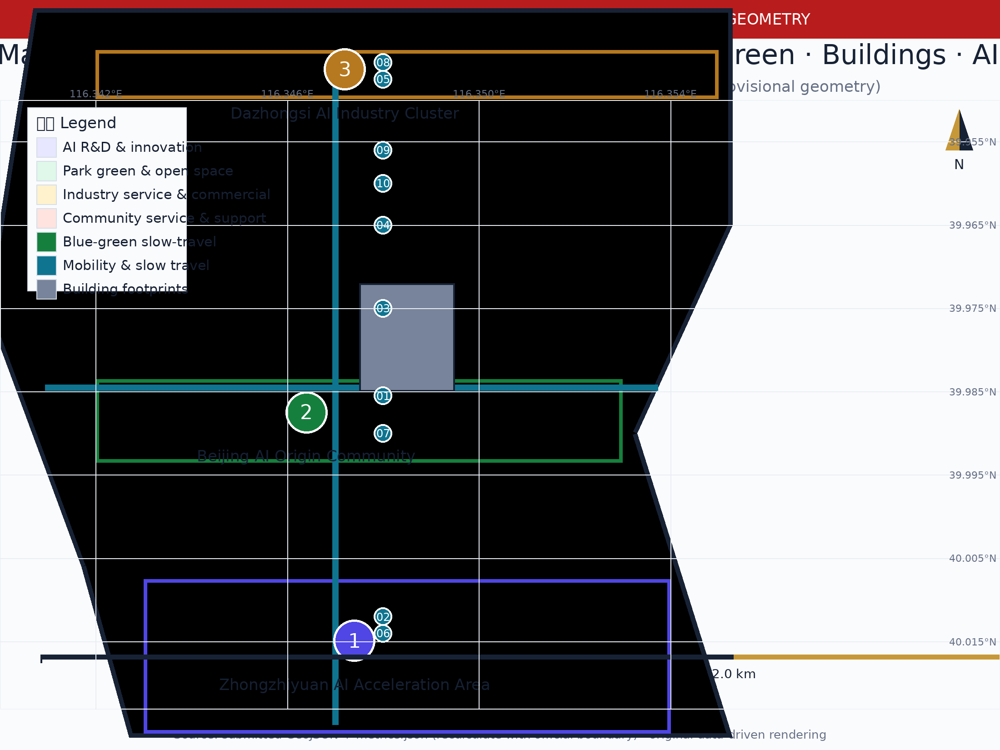
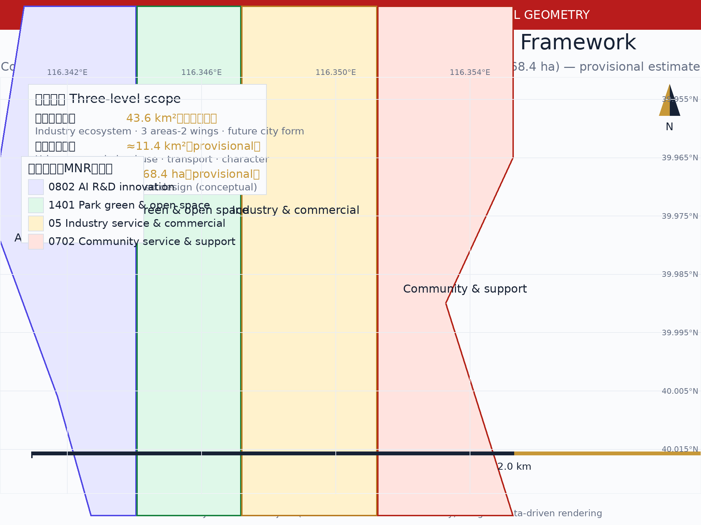
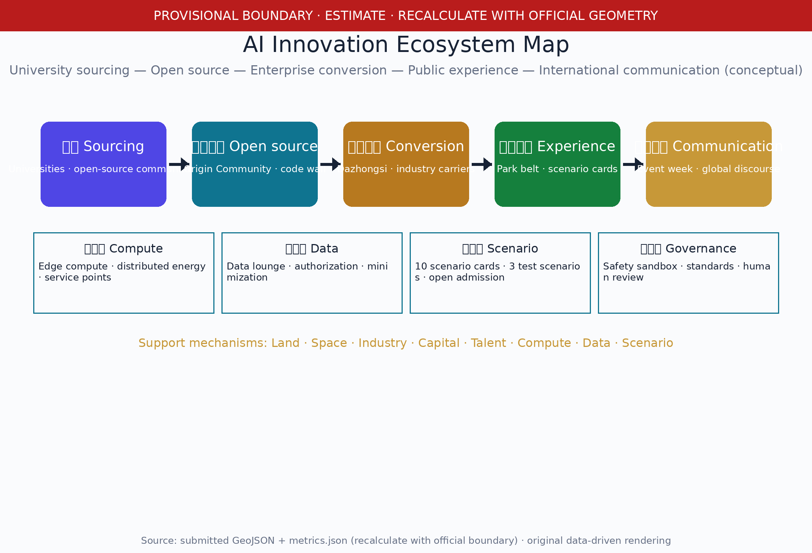
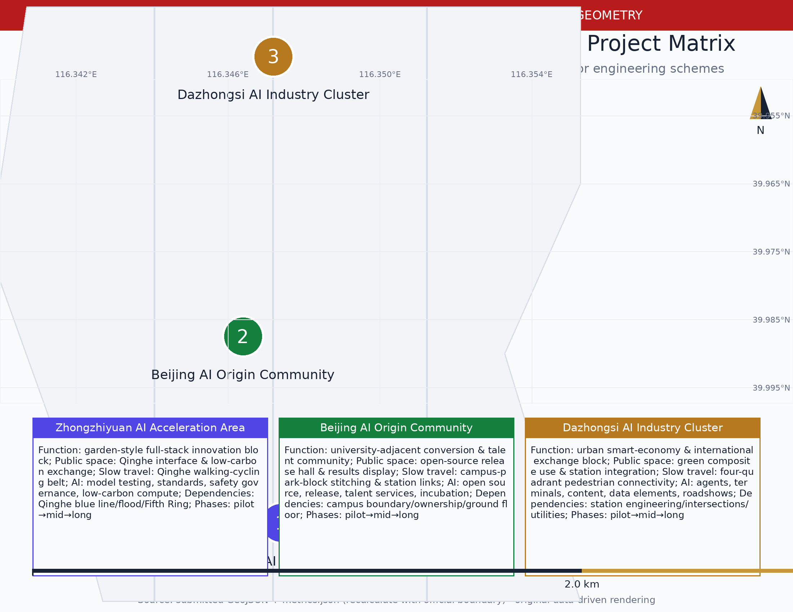
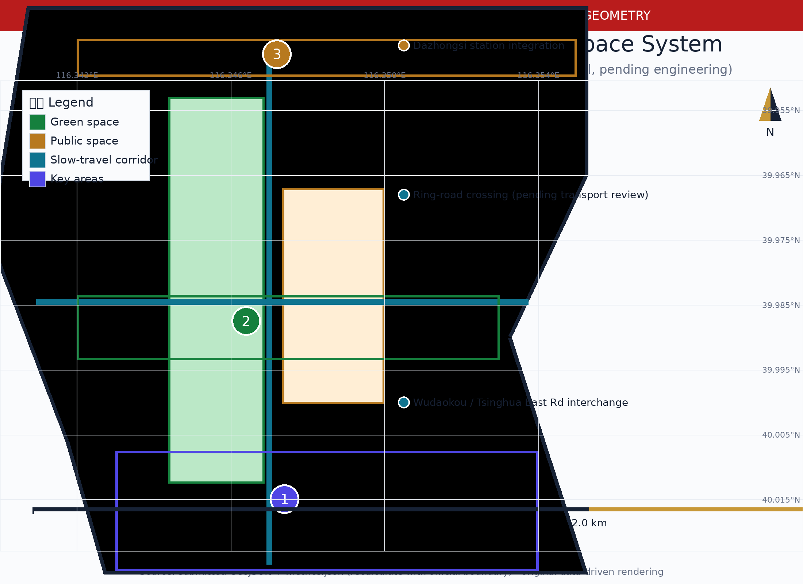
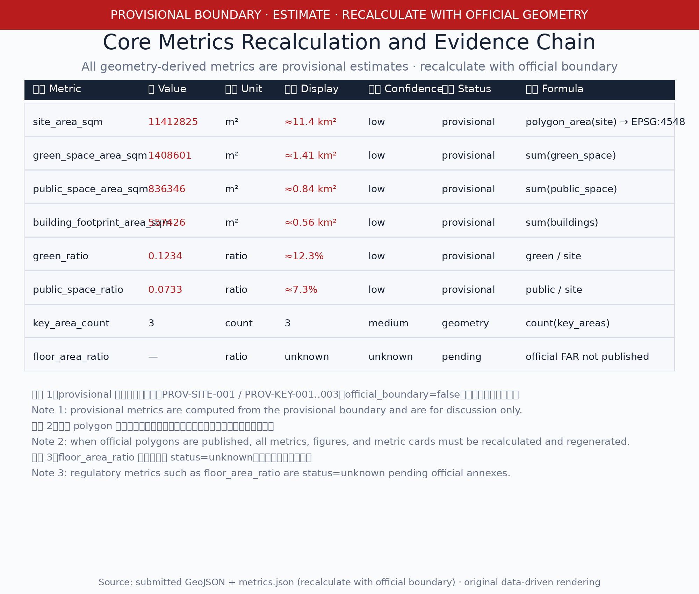

# Centennial Jing-Zhang · First Track — the Urban Spine from Self-Built Railway to Self-Built AI

## Design Basis and Source List

This formal proposal takes the Qualification Announcement for the Centennial Jing-Zhang AI Innovation Belt International Urban Design Open Call, issued by the Haidian Branch of the Beijing Municipal Commission of Planning and Natural Resources, as its primary basis [source:OFFICIAL-ANNOUNCEMENT] [standard:PROJECT-OFFICIAL-ANNOUNCEMENT], and the provisional rough boundaries, key areas, enums, metrics, and source lists registered by maintainers in brief/site-package/ as machine-readable basis. Before generation, the AI agent reads design_brief.json, allowed_design_space.json, sources.json, enums/, ranges/, schemas/, data/source_registry.json and data/processed/agent_fact_pack.md, and uses project_scope_summary.csv, agent_task_requirements.csv, source_use_matrix.csv and missing_data_checklist.csv to build task, scope, source-use and gap lists [source:PROCESSED-FACT-PACK] [source:SITE-PACKAGE]. All design judgments are decomposed into traceable sources, recomputable metrics, verifiable layers, and human-reviewable assumptions [depth:metrics_recalculation] [depth:risk_missing_data].

> Provisional boundary statement (provisional estimate): no official SITE_BOUNDARY or KEY_AREA polygons are available in the public site package. geometry/site_boundary.geojson (PROV-SITE-001) and geometry/key_areas.geojson (PROV-KEY-001..003) in this package are provisional rough polygons inferred from the announcement text bounds and approximate areas [source:BOUNDARY-SOURCE] [source:KEY-AREA-SOURCE], with official_boundary=false. All areas, ratios, maps, drawings, and metrics in this document are labelled as provisional estimates for generation, display, self-check, and design discussion only; they must not be treated as redlines, approval bases, precise-area bases, or statutory conclusions. When the organizer publishes official polygons, all geometry-derived metrics and drawings must be recalculated and regenerated as a whole [data:geometry/site_boundary.geojson#SITE-001] [metric:site_area_sqm].

The three scope levels are mapped one-by-one in compliance_matrix.json [metric:key_area_count] [data:geometry/key_areas.geojson#PROV-KEY-001], ensuring that every mandatory task of Announcement clauses 1.3, 1.4, 1.5 and agent.1-agent.6 has chapter, layer, metric, drawing and HTML evidence; the three-level framework depth is governed by [depth:three_level_scope_framework], and existing conditions and data gaps by [depth:existing_conditions_diagnosis].

## Three-Level Scope Framework

The proposal organizes work in the three levels determined by the announcement: the coordinated research area addresses the approx. 43.6 km² AI industry ecosystem, strategic positioning, innovation chain, and future city form; the overall design area addresses approx. 11.4 km² of urban districts and industry zones within 1–2 km around the Jing-Zhang Heritage Park, requiring an urban renewal framework, industry-space layout, transport/municipal support, and urban character control; the key areas address approx. 368.4 ha of three detailed design areas, requiring functional mix, building scale, retain-renovate-demolish classification, public space connectivity, and transport organization [data:geometry/key_areas.geojson#PROV-KEY-002] [metric:key_area_count]. The three levels are not disjoint drawing sets: the coordinated research decides the industry chain and city form; the overall design implements judgments into renewal projects, spatial structure, and facility capacity; the key area detailed design verifies implementability of specific plots, buildings, transport, public space, and AI scenarios [depth:three_level_scope_framework] [depth:overall_spatial_structure].

| Level | Design question | Proposal answer | Data anchor |
| --- | --- | --- | --- |
| Coordinated research area | How to organize the AI industry ecosystem and future city form | Three positionings, five functions, three areas-two wings, and spatial-industry-operations mapping | compliance_matrix.json, standard_matrix.json |
| Overall design area | How to map industry space, urban renewal, transport/municipal, and character | Land use, buildings, roads, green space, public space, and phasing layers together | [data:geometry/land_use.geojson#LU-001], [data:geometry/roads.geojson#ROAD-001] |
| Key areas | How to reach detailed design depth for three areas | Conceptual spatial design + project matrix: function/public space/slow-travel links/AI scenarios/dependencies and phases | [data:geometry/key_areas.geojson#PROV-KEY-001], [data:geometry/key_areas.geojson#PROV-KEY-003] |

The overall concept is "First Track": the Jing-Zhang Railway built under Zhan Tianyou in 1909 was China's first trunk railway designed and built independently; its spiritual origin — independence — is the cultural origin of today's Haidian AI Innovation Belt [source:HISTORY-JINGZHANG-RAILWAY]. The proposal transforms the Jing-Zhang Heritage Park corridor into an urban spine "from self-built railway to self-built AI", with Zhongzhiyuan, the Beijing AI Origin Community, and Dazhongsi as innovation anchors, and universities, enterprises, communities, and rail stations as the everyday network, forming a "one track, three cores, multi-point scenarios, blue-green slow-travel composite loop" spatial organization [source:AGENT-TASKBOOK] [standard:PROJECT-AGENT-OPEN-CALL-TASKBOOK]. The "one track" is not a new redline but a cultural-innovation-life composite spine translated from the announcement's Jing-Zhang Heritage Park corridor; the "three cores" correspond to the three key areas; "multi-point scenarios" correspond to operable nodes of AI+ public services, industry services, and urban life; the "composite loop" connects slow travel, green space, public space, and event routes [depth:overall_spatial_structure].

## Coordinated Research Area: Industry and Future City Research

### Naming System and Logo/Visual Identity (agent.1 deliverable)

The primary name "First Track" refers both to the Jing-Zhang Railway as China's first independently built trunk line and to the starting line of AI-era independent innovation; the English name "First Track" keeps the double meaning. The naming system has three layers: the overall project name "Centennial Jing-Zhang · First Track"; the spatial spine "First Track Cultural Spine"; and event/operation brands such as "First Track Open Week". The naming and logo serve the overall recognizability of the three positionings — the Centennial Jing-Zhang Cultural Belt, the Urban AI Life Experience Belt, and the AI Convergence Innovation Belt [source:AGENT-TASKBOOK] [standard:PROJECT-AGENT-OPEN-CALL-TASKBOOK].

The logo direction is an isomorphic graphic of a rail section and a circuit trace: using the 1435 mm standard gauge as the motif, a single continuous curve expresses both a steel rail cross-section and a printed-circuit trace — starting from an "origin node" (the AI Origin Community), with a "two parallel rails" middle section (independent innovation and open-source collaboration), ending in "signal divergence" (global communication). The visual system defines: primary colors as a gradient from the slate grey of the historic Jing-Zhang stations to the tech blue of the AI Innovation Belt; auxiliary colors as signal orange (events/communication) and rail gold (history/culture); auxiliary graphics as a geometric background derived from Zhan Tianyou's engineering drawings; typography for CJK figures uses an open-source black typeface (WenQuanYi Zen Hei [source:FONT-WQY-ZENHEI]) and for Latin an open-source sans (DejaVu Sans [source:FONT-DEJAVU]). The logo is the submitting agent's original graphic with no third-party trademark, image, or font-glyph reuse; rights clearance per the unified boundary clause is required before formal use [depth:logo_visual_identity] [source:ASSET-LOGO-ORIGINAL].

### Three Positionings, Five Functions, and Three Areas-Two Wings (agent.1 deliverable)

The agent-facing taskbook requires responding to the three positionings (Centennial Jing-Zhang Cultural Belt; Urban AI Life Experience Belt; AI Convergence Innovation Belt), the five functions (AI full-stack independent innovation system; world-class AI innovation ecosystem; AI+ scenario empowerment paradigm; intelligent vibrant AI city; global discourse in AI governance), and the three areas-two wings synergy [source:AGENT-TASKBOOK]. The mapping is as follows:

| Positioning | Functional support | Spatial anchor | Operation anchor |
| --- | --- | --- | --- |
| Centennial Jing-Zhang Cultural Belt | Intelligent vibrant AI city | Jing-Zhang Heritage Park vitality belt, signage and cultural symbol system, landmarks | First Track cultural narrative, Jing-Zhang memory route, international communication |
| Urban AI Life Experience Belt | AI+ scenario empowerment paradigm | Xiaoyue River scenario wing, 10 scenario cards, public experience routes | Scenario open days, public experience operations, accessibility and safety boundaries |
| AI Convergence Innovation Belt | AI full-stack independent innovation; world-class ecosystem; global governance discourse | Zhongzhiyuan, AI Origin Community, Dazhongsi, Zhongguancun technology-service wing | Developer community, open-source collaboration, test/validation scenarios, honor display system |

Three areas-two wings synergy loop: the AI Origin Community (world-class AI innovation ecosystem), Zhongzhiyuan (full-stack independent system and governance discourse), and Dazhongsi (AI-native new business formats) form the "three areas" innovation spine; the Zhongguancun technology-service wing (global factor allocation, Zhongguancun IP and capital empowerment) and the Xiaoyue River scenario wing (AI scenario empowerment and vibrant AI city) form the "two wings". The synergy loop is source—incubate—validate—serve—re-source: universities and open-source communities source ideas; the Origin Community incubates and converts; Dazhongsi and the scenario wing validate on the ground; Zhongzhiyuan feeds back standards and safety governance; the Zhongguancun wing provides capital and global factors — feeding back into sourcing [depth:spatial_industry_operations_mapping]. Innovation synergy with the Beiwei community, Future Science City, Huairou Science City, the Economic-Technological Development Area, and the Beijing-Tianjin-Hebei region is recorded as regional innovation relations (conceptual proposal, not a government commitment) [source:PROCESSED-FACT-PACK].

### AI Innovation Ecosystem Map (agent.2 deliverable)

The AI innovation ecosystem map uses the innovation chain "university sourcing—open-source collaboration—enterprise conversion—public experience—international communication" as its skeleton [depth:ai_innovation_ecosystem_map], overlaid with a compute layer (edge compute stations, distributed energy, compute service points), a data layer (data-elements lounge, authorization and compliance), a scenario layer (10 scenario cards), and a governance layer (safety governance sandbox, standards workshops, global AI governance discourse). The map is delivered both as the figure assets/figures/ecosystem-map.png and as tables; all elements are conceptual proposals — no enterprise lists, investment figures, or policy commitments are fabricated.

### International Case Studies (agent.2 deliverable)

Six global AI innovation ecosystem cases are used as benchmarks (desk research from public sources with recorded license/reuse boundaries; see sources.json and report/copyright_statement.md) [depth:international_case_studies] [metric:case_study_count]:

| Case | Type | Transferable mechanism | Source and license record |
| --- | --- | --- | --- |
| Toronto Waterfront/Quayside | Waterfront innovation-district governance | Public data trust, public-interest-first governance, pilot exit mechanisms | [source:CASE-TORONTO-WATERFRONT], [source:CASE-TORONTO-QUAYSIDE]; project ended 2021, used only as a governance lesson |
| Singapore Punggol Digital District | Smart sustainable district | Digital twin, community-level smart services, open standards | [source:CASE-SINGAPORE-PUNGGOL] |
| Helsinki Kalasatama | Open smart-city innovation | Open data catalogue, city-as-a-platform, citizen co-creation | [source:CASE-HELSINKI-KALA] |
| Paris Station F | Large startup campus | Community operations, event calendar, capital-enterprise-university matching | [source:CASE-PARIS-STATION-F] |
| Tel Aviv innovation ecosystem | Urban innovation cluster | City services as APIs, cyber cluster, global talent attraction | [source:CASE-TEL-AVIV-CYBER] |
| Jing-Zhang Railway history (benchmark) | Culture-industry fusion | Converting a linear heritage into an urban cultural innovation spine | [source:HISTORY-JINGZHANG-RAILWAY] |

### Eight Support Mechanisms (agent.2 deliverable)

The land, space, industry, capital, talent, compute, data, and scenario support mechanisms each propose mechanism, spatial carrier, and responsible boundary (conceptual) [depth:ecosystem_support_mechanisms]:

| Mechanism | Proposed content | Spatial carrier | Responsibility boundary |
| --- | --- | --- | --- |
| Land | Urban renewal coordination, mixed-use proposals, interim land activation | Renewal project list, phasing layer | Pending official controls and ownership |
| Space | Tiered innovation carrier supply, public space reservation, slow-travel links | Land use/public space/roads layers | Conceptual, not redlines |
| Industry | Full-stack independent system, AI-native formats, scenario economy | Three areas-two wings | Requires enterprise/institution confirmation |
| Capital | Public-social capital cooperation pathway, incubation/VC matching proposals | Zhongguancun technology-service wing | No investment figures committed |
| Talent | Talent-zone services, international talent community, developer community | AI Origin Community, talent service nodes | Pending policy confirmation |
| Compute | Edge compute stations, distributed energy, compute service standards | New-infrastructure nodes | Pending engineering conditions |
| Data | Data-elements lounge, authorization and compliance, data minimization | Dazhongsi area | Follows Generative AI Measures and privacy boundaries |
| Scenario | Scenario open admission, test/validation scenarios, public experience | 10 scenario cards | Organizer approval and safety review |

### Future City Form Research

The future city form research answers how AI changes work, life, socializing, learning, transport, and public services, anchoring AI transport systems, continuous green space, innovation service facilities, and an international living-working atmosphere into locatable function zones, nodes, corridors, and scenarios [depth:overall_spatial_structure]. Industry strategy metrics, AI innovation indices, talent density, spatial supply types, and AI+ vertical application priority areas are written into the metrics system, marked as official, design-proposal, or pending calibration [metric:scenario_count]. Global AI events, developer communities, open scenarios, and pilgrimage routes are all stated as conceptual proposals/reference schemes/available for professional deepening — not as confirmed government events or implementation arrangements.
## Overall Design Area: Urban Renewal and Regulatory-Plan-Level Urban Design

The overall design area requires regulatory-plan-level urban design depth. The proposal provides the overall urban renewal spatial structure, inefficient-space identification, a renewal project list, implementation policy recommendations, industry-function ratios, spatial organization patterns, and a comprehensive capacity assessment framework [depth:land_use_layout]. geometry/land_use.geojson fully covers the provisional design boundary without overlap; geometry/buildings.geojson expresses renewal/retained building footprints (conceptual placeholders); geometry/roads.geojson expresses microcirculation, slow travel, and rail interchanges; metrics.json recalculates core areas, ratios, and layer counts [data:geometry/land_use.geojson#LU-001] [data:geometry/buildings.geojson#BLDG-001] [metric:building_footprint_area_sqm].

This section decomposes regulatory-plan-level content into reviewable objects per [standard:MOHURD-CONTROL-DETAILED-PLANNING] and uniformly distinguishes three statuses: (1) spatial metrics directly recomputable from submitted geometry (areas, ratios); (2) control metrics requiring official regulatory plans or taskbook annexes (FAR, building height, density, setbacks, road redlines, facility standards) — uniformly registered as status=unknown with prerequisites [metric:floor_area_ratio]; (3) performance metrics requiring continuous operation/industry calibration. Where no official control conditions exist for building height, development intensity, road redlines, setbacks, or facility standards, they are written as "pending official regulatory-plan confirmation" and never replaced by speculative values [depth:development_intensity_controls].

Around rail-station integration, road microcirculation, non-motorized parking, parking supply, innovation service platforms, talent living services, new infrastructure, distributed energy, and edge compute, the proposal provides spatial layouts and implementation pathways (conceptual); where road redlines, utilities, fire, and municipal conditions are missing, assumptions record them as pending, and strategies are not written as approved conditions [depth:traffic_rail_slow_parking] [depth:municipal_new_infrastructure].

## Detailed Design of Key Areas

Detailed design of the three key areas is mandatory. This package delivers readable conceptual spatial design and a project matrix (function, public space, slow-travel links, AI scenarios, implementation dependencies and phases), making explicit that the provisional geometry is placeholder illustration only — not redlines or precise areas [depth:three_key_area_detailed_design] [data:geometry/key_areas.geojson#PROV-KEY-001] [data:geometry/key_areas.geojson#PROV-KEY-002] [data:geometry/key_areas.geojson#PROV-KEY-003].

### Zhongzhiyuan AI Independent-Innovation Acceleration Area (conceptual)

- Function: garden-style full-stack independent-innovation block; national AI platform display, full-stack independent innovation, standards development, safety governance, industry exhibition, and external transport services (conceptual intention, pending official positioning).
- Public space: Qinghe innovation interface, low-carbon green innovation exchange environment, green space hosting open testing and standards-governance display.
- Slow-travel links: walking and cycling along the Qinghe interface, strengthened connection with the northern section of the Jing-Zhang Heritage Park vitality belt.
- AI scenarios: independent model testing, standards workshops, safety governance display, low-carbon compute experience (scenario cards 02/08).
- Dependencies and phases: depends on Qinghe blue-line, ecological/flood conditions, and Fifth Ring external transport confirmation; pilot with green space and display nodes near-term, consolidate industry carriers mid-term, deepen with regulatory conditions long-term.

### Beijing AI Origin Community (conceptual)

- Function: university-adjacent conversion and talent community; university sourcing, open-source collaboration, results release, talent-zone services, residential living support.
- Public space: open-source release hall, public code wall, results display/release space, night collaboration and community exchange nodes.
- Slow-travel links: stitching campuses—parks—blocks, rail-station integration (Wudaokou, Tsinghua East Road West interchange related).
- AI scenarios: open-source community, results release, talent services, university-adjacent incubation (scenario cards 01/06/07).
- Dependencies and phases: depends on campus boundaries, ownership, and ground-floor uses; pilot open-source events and release hall near-term, advance the conversion street mid-term, deepen retain-renovate-demolish with regulatory and ownership conditions long-term.

### Dazhongsi AI Industry Cluster (conceptual)

- Function: urban smart-economy and international-exchange block; leading enterprises, agents, smart terminals, content consumption, data elements, and commercial services.
- Public space: composite use of planned green space, Dazhongsi station integration, and four-quadrant pedestrian connectivity at the intersection.
- Slow-travel links: stitching the blocks cut by roads via four-quadrant pedestrian connectivity, strengthening interchange with the station and commercial services.
- AI scenarios: agent and terminal display, content consumption, data elements, and international roadshows (scenario cards 05/08).
- Dependencies and phases: depends on rail-station engineering interfaces, road intersections, and utility conditions; pilot the roadshow lounge and pedestrian connectivity near-term, consolidate industry carriers and data-elements services mid-term, deepen with engineering conditions long-term.

### Key Areas Project Matrix

| Key area | Project | Function | Public space | Slow-travel link | AI scenario | Dependency | Phase |
| --- | --- | --- | --- | --- | --- | --- | --- |
| Zhongzhiyuan | JZ-02 Qinghe innovation interface | Industry display + blue-green | Qinghe low-carbon innovation corridor | Qinghe walking-cycling belt | Low-carbon compute experience | Qinghe blue line, flood control | Near-term pilot |
| Zhongzhiyuan | JZ-05 AI public service node | New infrastructure + services | Green test field | Park north connection | Safety governance sandbox | Energy, compute, safety | Mid-term |
| Origin Community | JZ-03 University-adjacent conversion street | Industry services + renewal | Open-source release hall | Campus-park stitching | Open-source collaboration and release | Campus boundary, ownership | Near-term pilot |
| Origin Community | JZ-06 Global AI event-week route | Operations + brand | Results display corridor | Station-block connection | Event-week scenarios | Public space permit | Near-term |
| Dazhongsi | JZ-04 Four-quadrant pedestrian connectivity | Rail integration + slow travel | Station plaza | Four-quadrant connectivity | Roadshow and consumption scenarios | Station engineering interface | Mid-term |
| Dazhongsi | JZ-08 Data-elements lounge | Data services + business | Composite green space use | Commercial block links | Data-elements display | Compliance authorization mechanism | Mid-term |

The matrix above is a conceptual proposal and constitutes no plot-level retain-renovate-demolish, road redline, engineering scheme, or precise-area conclusion.
## AI Innovation Ecosystem, Personas, and AI+ Scenarios

### Personas (5+, agent.3 deliverable)

| Persona | Typical needs | Spatial response | Self-check boundary |
| --- | --- | --- | --- |
| Open-source developer | Release, collaborate, test, community reputation | Origin Community open-source release hall, public code wall, night collaboration space | No personal behavior tracking; activity data aggregated only |
| Startup team | Low-cost office, compute entry, product testbed | Zhongzhiyuan shared test field, edge compute service point, standards-governance consulting | Compute and data services require separate authorization |
| Head-enterprise visitor | Display, business, international reception, recruitment | Dazhongsi international roadshow lounge, rail interchanges, public space around key enterprises | Enterprise marks and cases require rights clearance |
| Nearby resident | Commuting, leisure, community services, low-disturbance renewal | Jing-Zhang Heritage Park slow-travel loop, embedded community services, graded night lighting and events | Resident profiles never used for commercial targeting |
| University faculty/student | Results conversion, cross-campus collaboration, daily slow travel | Campus-park slow-travel stitching, conversion stations, AI education experience points | Campus data and research results require authorization |
| Elderly and mobility-impaired | Accessible travel, equivalent non-AI service | Accessible ramps, voice/manual dual channels, slow-travel rest points | Follows Barrier-Free Environment Law design boundaries |

### Ten Complete Scenario Cards (agent.3 deliverable)

Each scenario card covers target users, spatial location, data sources, privacy boundary, human review mechanism, and operating entity [depth:scenario_cards] [metric:scenario_count].

**01 Open-Source Release Hall (test/validation scenario)**: target users are universities, open-source communities, and startups; located in the Beijing AI Origin Community; data from public code repositories and registration information; privacy boundary: no personal behavior tracking, contribution data aggregated only; human review: published content is manually reviewed; operating entity: community operator + organizer. Test/validation content: the open process for model evaluation and code-contribution display, content review mechanism, venue capacity and safety plan.

**02 Safety Governance Sandbox (test/validation scenario)**: target users are standards bodies, safety evaluation institutions, and model developers; located in Zhongzhiyuan; data from test datasets and model outputs; privacy boundary: test data desensitized, outputs controlled; human review: red-team results manually reviewed; operating entity: organizer + third-party evaluation institution. Test/validation content: standards-workshop workflow, safety-evaluation display workflow, visitor booking and regulatory interface.

**03 Edge Compute Station (test/validation scenario)**: target users are developers, enterprises, and public service institutions; located at new-infrastructure nodes in the overall design area; data from edge compute usage applications and energy data; privacy boundary: compute services require separate authorization, energy data aggregated only; human review: compute quotas manually approved; operating entity: operating company + energy service provider. Test/validation content: edge-compute/public-service fusion prototype, distributed energy coordination, service reliability.

**04 AI Slow-Travel Navigation**: target users are visitors and residents; located along the Jing-Zhang Heritage Park vitality belt; data from public map data and a manually verified gap list; privacy boundary: no individual location tracking; human review: gap identification results confirmed manually; operating entity: public space operator.

**05 Dazhongsi International Roadshow Lounge**: target users are agent, smart-terminal, and content-consumption enterprises; located in the Dazhongsi AI Industry Cluster; data from enterprise registration and public project information; privacy boundary: enterprise information used for event organization only; human review: roadshow content and speaker information reviewed; operating entity: event operator.

**06 Qinghe Low-Carbon Innovation Corridor**: target users are park enterprises and the public; located on the Zhongzhiyuan Qinghe interface; data from public environment and energy data; privacy boundary: environment data displayed aggregated only; human review: display content reviewed; operating entity: park operator.

**07 University-Adjacent Results Conversion Street**: target users are university research teams; located in the Beijing AI Origin Community; data from authorized results information and public policy; privacy boundary: unpublished research results are not displayed; human review: results information reviewed; operating entity: conversion-service operator.

**08 Data-Elements Lounge**: target users are data-elements and digital-asset service providers; located in the Dazhongsi area; data from authorized and compliant product demonstrations; privacy boundary: demonstration data desensitized, transaction process auditable; human review: compliance review; operating entity: data-service operator.

**09 AI Daily-Life Service Demonstration Street**: target users are residents, the elderly, and children; located at community-commerce intersections; data from public service information; privacy boundary: no personal health/behavior data collected; human review: AI suggestions confirmed by humans, equivalent non-AI services retained; operating entity: sub-district/community operator.

**10 Global AI Event-Week Route**: target users are global developers, enterprises, and the public; located in the belt's public space system; data from event registration and public schedules; privacy boundary: registration data minimized; human review: event content and safety plan reviewed; operating entity: organizer + event operator.

The 3 test/validation scenarios (01/02/03) are conceptual proposals: any real pilot requires organizer approval, site licensing, safety review, and compliance with the Generative AI Interim Measures and the Barrier-Free Environment Law [source:STANDARD-GENAI-MEASURES] [source:STANDARD-BARRIER-FREE-LAW] [standard:GENERATIVE-AI-INTERIM-MEASURES] [standard:BARRIER-FREE-ENVIRONMENT-LAW]; they are not stated as approved operations [depth:test_validation_scenarios] [metric:test_validation_scenario_count].

### Scenario-Space-Operation Mapping (agent.3 deliverable)

Scenarios map by space: the Origin Community hosts 01/06/07; Zhongzhiyuan hosts 02/06; Dazhongsi hosts 05/08; the park vitality belt hosts 04/10; new-infrastructure nodes host 03; community-commerce intersections host 09 [depth:scenario_cards]. Operations split into three types: community operations (01/07), event operations (05/10), and public-service operations (03/04/09), all observing data minimization, explainability, and human review [standard:ELDERLY-SMART-TECH-PLAN-2020-45]. The Xiaoyue River scenario wing hosts low-intensity trials of 04/09, connected with the public experience route.

## Land Use, Building Scale, and Retain-Renovate-Demolish Strategy

Land use follows public standards of territorial survey, planning, and use-control classification [standard:MNR-LAND-USE-CLASSIFICATION-GUIDE], forming complete, closed, seamless land-use zones [data:geometry/land_use.geojson#LU-001]. The building strategy distinguishes retained, renovated, renewed, new, or pending objects, with conceptual function and scale recommendation levels [data:geometry/buildings.geojson#BLDG-001] [metric:building_footprint_area_sqm]. Because existing building, ownership, regulatory, and engineering conditions are missing, the proposal provides only method and calibration checklist, without fabricating retain-renovate-demolish conclusions [depth:retain_renovate_demolish] [depth:height_massing_character]. Building scale and intensity metrics are consistent with metrics.json: where total building scale, FAR, height, density, green ratio, setbacks, and building control lines lack official conditions, status=unknown is used uniformly with recalculation paths [metric:floor_area_ratio].

## Transport, Rail, Municipal Infrastructure, and Public Services

The transport proposal responds to announcement requirements for rail-station integration, road microcirculation, slow-travel gaps, external transport, parking, non-motorized parking, and green transport, covering the North Fifth Ring, Jing-Zhang Heritage Park crossing points, Wudaokou, Tsinghua East Road West interchange, Dazhongsi station, and transport links around key enterprises [depth:traffic_rail_slow_parking] [data:geometry/roads.geojson#ROAD-001] [data:geometry/constraints.geojson#CONSTRAINTS]. Road and slow-travel layers stay within the submitted boundary and are cross-checked with public space, green space, industry nodes, and key areas; as the boundary is provisional, transport conclusions are temporary design discussion only [metric:public_space_area_sqm]. Municipal and public services cover AI industry service facilities, innovation service platforms, talent living services, new infrastructure, distributed energy, edge compute, and fusion with traditional municipal facilities [depth:municipal_new_infrastructure]; missing utility, energy, drainage, flood, and fire engineering data are listed as formal deepening prerequisites, with no engineering conclusions.

## Blue-Green Network, Public Space, and Urban Character

### Blue-Green Network and Public Space

The blue-green proposal uses the Jing-Zhang Heritage Park vitality belt as its skeleton, coordinating Qinghe, Xiaoyue River, and the travel needs of surrounding universities, enterprises, and communities, proposing a north-south through, east-west connected system of walkways, cycleways, and green space [depth:blue_green_public_space] [data:geometry/green_space.geojson#GREEN-001] [data:geometry/public_space.geojson#PUBLIC-001]. It identifies slow-travel gaps, elevated ring-road crossings, and landscape nodes at the park's south and north ends, proposing composite strategies for parking, sports, innovation exchange, technology testing, application display, and public services; green and public space ratios are labelled as provisional estimates pending recalculation [metric:green_ratio] [metric:public_space_ratio].

### AI Pilgrimage Landmarks (3, agent.4 deliverable)

The landmarks are conceptual designs, not engineering schemes, subject to heritage, safety, accessibility, and approval review [depth:ai_pilgrimage_landmarks] [metric:landmark_count]:

| Landmark | Intended location | Cultural narrative | Boundary |
| --- | --- | --- | --- |
| First Track Monument Pavilion | Jing-Zhang Heritage Park vitality belt (intended point) | Dialogue between the 1909 independent-rail spirit and AI independent innovation | Heritage scope and landscape review; no engineering scheme |
| Open-Source Contribution Star Wall | AI Origin Community (intended point) | Honor display for developers and co-creators | Honor content review; portrait and mark clearance |
| Origin Model Pod | Zhongzhiyuan/Origin Community boundary (intended point) | Display pod for AI models and scenarios from the "origin" | Safety and structural review; no heritage-space occupation |

### Honor Display System (agent.4 deliverable)

The honor display system includes: the contributor star wall (long-term record of developers/co-creators), the co-creation gallery (iterative co-created proposals), and the annual AI contribution ranking (annual selection and release) [depth:honor_display_system]. Display content follows public compliance: no personal privacy, no unauthorized portraits or trademarks, clear submitted/reviewed/selected/implemented status, and human review before publication.

### Public Space Component Library (12 items, agent.4 deliverable)

The component library is a conceptual design reference; each item states safety, heritage, accessibility, and operation & maintenance boundaries [depth:public_space_component_library] [metric:component_count] [standard:BARRIER-FREE-ENVIRONMENT-LAW]:

| Component | Description | Safety boundary | Heritage/accessibility/O&M boundary |
| --- | --- | --- | --- |
| C01 Gauge-themed seating | 1435 mm motif seating groups | Structural safety review | Accessible seating height; routine inspection |
| C02 Smart light pole | Lighting + information screen + sensors | Electrical safety | No individual data collection; energy-efficient O&M |
| C03 Station-sign wayfinding | Railway station-sign style signage | Wind load and installation safety | Braille and voice; multilingual |
| C04 Rail-pattern manhole cover | Cultural symbol manhole cover | Anti-slip and fall protection | Heritage-style review; municipal maintenance agreement |
| C05 Movable test fence | Temporary scenario-test fence | Tip-over prevention, warning signs | No heritage-space occupation; removed outside events |
| C06 Information screen (dual channel) | AI information + human service entry | Electrical safety | Accessible height; readable offline |
| C07 Accessible ramp module | Temporary/permanent ramps | Slope and slip compliance | Barrier-Free Law requirements; periodic inspection |
| C08 Drinking fountain | Public water | Water quality safety | Child and wheelchair reachable; hygiene O&M |
| C09 Shade and weather canopy | Rest and shade | Structural safety | Character review; weather-resistant O&M |
| C10 Movable planter | Street greening | Secured against toppling | No blind-path obstruction; seasonal care |
| C11 Event power outlet | Temporary event power | Leakage protection | Event permit; power off when unattended |
| C12 Community service kiosk | Human + AI services | Fire safety | 24h staffed or remote monitoring; accessible entrance |

### Signage and Cultural Symbol System (agent.5 deliverable)

The signage and cultural symbol system uses "First Track" as its motif: level-1 signage is regional/station-level (station-sign style, multilingual, accessible); level-2 is place-level (scenario card and landmark entrances); level-3 is information-level (components and facilities). The symbol system includes the gauge motif, rail patterns, signal-color language, and hand-drawing geometric background [depth:signage_cultural_symbol_system]. The system is distinguished from the overall Logo system: the Logo represents the overall brand; signage symbols carry place narrative and wayfinding, sharing colors and motifs but with separate uses.

### International Communication Copy (agent.5 deliverable, ready for review)

Brand proposition (Chinese): 百年京张·第一轨——从自主铁路到自主AI的城市脊柱. Brand proposition (English): "First Track: the urban spine from China's first self-built railway to self-built AI." Urban temperament: independent, open-source, modest yet confident; the order of a railway and the precision of code; open to global developers and citizens. Communication points: (1) the independence narrative (1909→today); (2) three areas-two wings and open scenarios; (3) a governance posture of human final judgment and human review; (4) public experience rather than display windows. Publishing discipline: all communication distinguishes submitted/reviewed/selected/implemented status and never claims approval or completion; external publication requires account-owner authorization; sources, licenses, and alt text are attached [depth:international_communication_copy].
## Renewal Projects, Implementation Policy, and Phasing

### Renewal Project List

| Project ID | Project name | Type | Key dependency | Phase | Evidence |
| --- | --- | --- | --- | --- | --- |
| JZ-01 | Jing-Zhang Heritage Park slow-travel gap stitching | Public space/transport | Road redlines, under-bridge space, transport review | Near-term pilot | [data:geometry/roads.geojson#ROAD-001] |
| JZ-02 | Zhongzhiyuan Qinghe innovation interface | Blue-green/industry display | River blue line, ecology and flood conditions | Near-term pilot | [data:geometry/green_space.geojson#GREEN-001] |
| JZ-03 | Origin Community conversion street | Urban renewal/industry services | Campus boundary, ownership, ground-floor uses | Near-term pilot | [data:geometry/buildings.geojson#BLDG-001] |
| JZ-04 | Dazhongsi four-quadrant pedestrian connectivity | Rail integration/slow travel | Rail station, road intersections, utilities | Mid-term | [data:geometry/public_space.geojson#PUBLIC-001] |
| JZ-05 | AI public service and edge compute node | New infrastructure/public services | Energy, compute, safety, operating entity | Mid-term | [data:geometry/constraints.geojson#CONSTRAINTS] |
| JZ-06 | Global AI event-week public route | Operations/brand | Public space permit, event safety, rights clearance | Near-term | [data:geometry/phasing.geojson#PHASE-001] |

Phasing follows near-term pilot, mid-term renewal, and long-term governance frameworks [depth:phasing_implementation]; the proposal distinguishes the 100-day call design cycle from implementation phasing — lightweight facilities, events, and service platforms may start first, while engineering delivery is not promised before official regulatory, municipal, transport, and ownership conditions are confirmed [depth:renewal_project_list].

### Annual Event Calendar (12 items, agent.6 deliverable)

The annual event calendar is a conceptual operations design, not a confirmed schedule; organizer confirmation is required [depth:annual_event_calendar]:

| Month | Event | Audience | Responsibility boundary |
| --- | --- | --- | --- |
| Jan | First Track · Annual AI Contribution Ranking release | Developers/enterprises | Content review, honor clearance |
| Feb | Developer Spring co-creation meetup | Developer community | Community charter and anti-abuse |
| Mar | Scenario open admission application window | Enterprises/teams | Admission evaluation workflow |
| Apr | AI governance standards workshop | Standards and evaluation bodies | Third-party evaluation boundary |
| May | Open-source release hall monthly roadshow | Universities/startups | Release content review |
| Jun | Jing-Zhang culture memory season | Public | Heritage and event safety |
| Jul | Edge compute and low-carbon open day | Public/enterprises | Electrical and safety plans |
| Aug | International AI communication week | Global developers | Multilingual, accessibility, authorized publishing |
| Sep | First Track · Developer Festival | Global developers | Event safety, capacity plan |
| Oct | Scenario open day (public experience) | Public | Human review and equivalent non-AI services |
| Nov | Dazhongsi data-elements forum | Data service providers | Compliance and auditability |
| Dec | Year-end co-creation review and next-year admission | Community/enterprises | Data sedimentation and knowledge base |

### Developer Community Governance (agent.6 deliverable)

Developer community governance follows the ten co-creation principles [source:AGENT-TASKBOOK]: admission (contribution record and code-of-conduct confirmation); charter (open-source license, attribution, conflict resolution); honor (star wall and annual contribution ranking); incentives (event resources, test slots, communication support); anti-abuse (penalties for flooding, impersonation, unattributed copying); arbitration (organizer + community representatives + external experts, with human final judgment) [depth:developer_community_governance].

### Scenario Open Admission and Public Experience Operations (agent.6 deliverable)

Scenario open admission mechanism: apply—evaluate (safety/data/compliance/public interest)—pilot (time- and volume-limited)—scale (upon evaluation)—exit (on risk trigger) [depth:scenario_open_operation]. Public experience operations: booking, human review, data minimization, equivalent non-AI channels (phone/manual counter), accessibility and safety plans, and post-event evaluation [standard:ELDERLY-SMART-TECH-PLAN-2020-45]. Any test scenario requires organizer approval and safety evaluation and is not stated as an approved operation.

### Cooperation Conversion Pathway (agent.6 deliverable)

Conversion pathway: identify (event/scenario/community touchpoints)—engage (dedicated matchmaking)—pilot (scenario admission)—sign (business and legal)—sediment (cases and knowledge base) [depth:cooperation_conversion_pathway]. Responsible roles (organizer/operator/community/enterprise/third-party institutions) and conversion metrics (touchpoints, pilots, contracts, implementations, satisfaction) are given for enterprise landing and talent attraction; no investment attraction, policy, or investment is promised.

### Responsible Roles and KPIs (agent.6 deliverable)

| Role | Responsibility | Suggested KPIs |
| --- | --- | --- |
| Organizer | Approval, resources, policy coordination | Scenario admission pass rate; event safety incidents = 0 |
| Operator | Scenario/event/space operations | Scenario usage frequency, event participation, satisfaction |
| Developer community | Content, honor, anti-abuse | Community activity, contributions, complaint resolution time |
| Enterprise | Pilots and landing | Pilot conversion rate, implemented project count |
| Third-party institutions | Evaluation, audit, accessibility review | Evaluation report count, compliance audit pass rate |

KPIs are suggested indicators requiring organizer confirmation before entering the operations baseline [depth:responsible_roles_kpis].

## Metrics, Area Recalculation, and Compliance Matrix

The metrics system covers the overall design area, key-area areas, green and public space ratios, building footprints, renewal project count, AI scenario nodes, international cases, landmarks, component counts, and self-check status; all known metrics are recomputable from GeoJSON or content counts, and unknown metrics state reasons and formal-submission prerequisites [depth:metrics_recalculation] [metric:site_area_sqm] [metric:green_ratio] [metric:public_space_ratio]. All geometry-derived metrics are labelled as provisional estimates with reduced significant figures (e.g., site ≈ 11.4 km²) and a prominent note: when official boundaries are published, all metrics and drawings must be recalculated and regenerated as a whole. Results of scripts/spatial_review.py, scripts/visual_review.py and scripts/professional_review.py are key formal self-check evidence [data:geometry/green_space.geojson#GREEN-001].

The compliance matrix is the master file for task responsiveness: each announcement task and agent task maps to report sections, layers, metrics, drawings, HTML pages, sources, assumptions, and self-check items, with per-item compliance_status, deliverables, and constraints; transport/municipal items such as 1.5.2.3 are delivered as conceptual strategies with engineering prerequisites registered [source:SOURCE-REGISTRY]. Three metric classes enter metrics.json, assumptions.json, and compliance_matrix.json respectively, avoiding operational visions being miswritten as approved planning conditions [depth:metrics_recalculation] [metric:case_study_count].

## Risk, Copyright, and Compliance

Bilingual and accessibility: the primary language of this proposal is Chinese, with a complete translation in proposal.en.md; A3/A0, HTML, and text-bearing figures all provide Chinese/English counterparts, preferring the competition glossary in docs/terminology-glossary.md. HTML pages load no remote scripts, remote map tiles, remote fonts, iframes, forms, or external APIs; figures provide alt text and descriptions following Barrier-Free Environment Law design boundaries [standard:BARRIER-FREE-ENVIRONMENT-LAW].

Asset-level copyright and source proof: the source and license record of every figure, font, map/data, historical material, logo, code dependency, and generation tool is registered item-by-item in sources.json and report/copyright_statement.md [source:ASSET-FIGURES-ORIGINAL] [source:ASSET-LOGO-ORIGINAL] [source:FONT-WQY-ZENHEI] [source:FONT-DEJAVU] [source:TOOL-PILLOW] [source:TOOL-REPORTLAB]: all figures are data-driven renderings generated by the submitting agent from GeoJSON, metrics.json, and proposal text with Pillow; no external images, map tiles, or copyrighted diagrams are reused; the logo is the agent's original work; fonts are open-source with recorded licenses; historical facts come from public sources with provenance. Assets whose provenance cannot be verified are not retained; this package contains none.

Unified boundary clause: this proposal claims no official approval, approved regulatory plan, final land ownership, final building scale, or guaranteed implementation; all spatial-landing proposals are phrased as conceptual proposals/reference schemes/available for professional deepening. The AI agent is responsible for facts, sources, copyright, spatial data, metrics, and expression; maintainers and professional reviewers may require revision or rejection based on self-check results, spatial review, and the compliance matrix [source:AGENT-TASKBOOK].

Review boundary: this package's generation is constrained by the local deterministic gate (four checks) and the structured AI professional review; model output cannot override local failure items and does not constitute real-world copyright or approval proof [depth:risk_missing_data] [data:geometry/constraints.geojson#CONSTRAINTS].

## References

- brief/public-brief.md
- brief/site-package/design_brief.json
- brief/site-package/allowed_design_space.json
- brief/site-package/agent_taskbook.json
- brief/site-package/geometry/provisional_boundaries.geojson
- brief/site-package/geometry/provisional_boundaries_basis.md
- brief/site-package/standards/standards.json
- data/source_registry.json
- data/processed/agent_fact_pack.md
- data/processed/project_scope_summary.csv
- data/processed/agent_task_requirements.csv
- data/processed/source_use_matrix.csv
- data/processed/missing_data_checklist.csv
- Full machine index: sources.json, metrics.json, compliance_matrix.json, standard_matrix.json and design_depth_matrix.json
