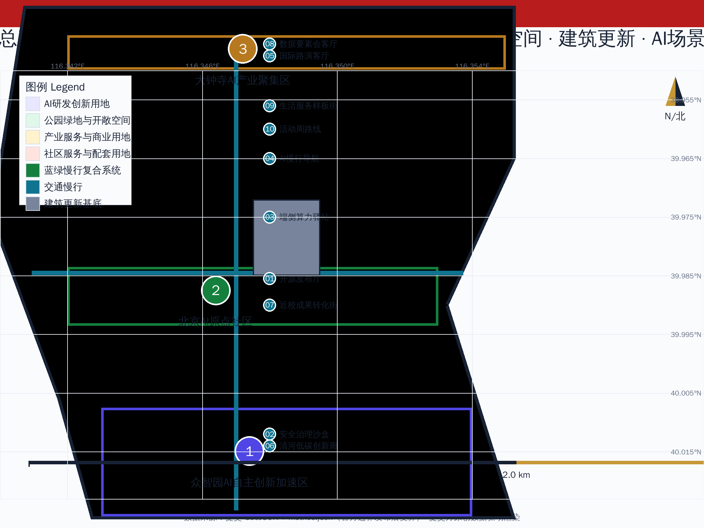
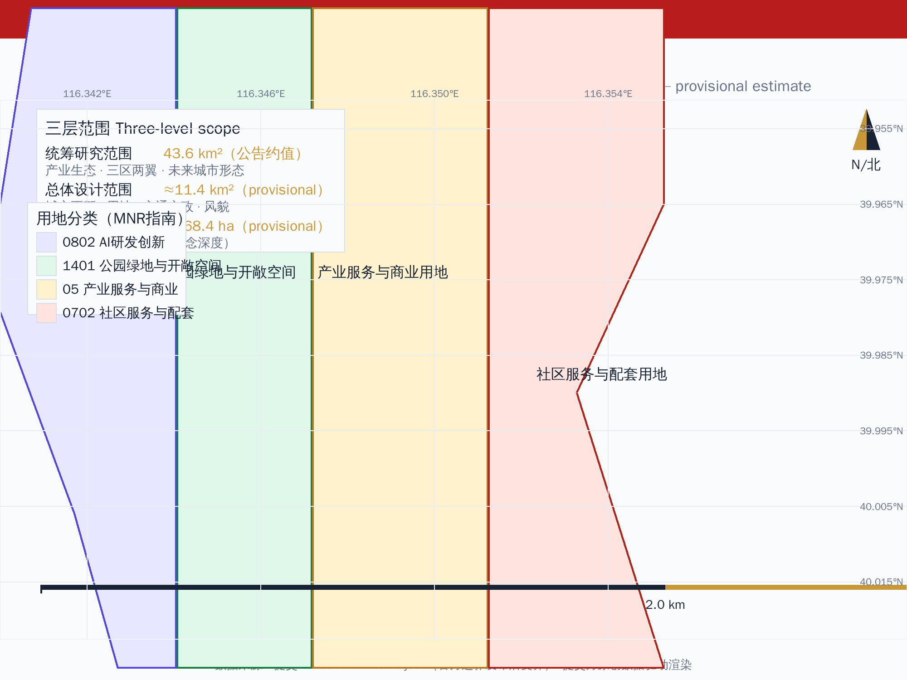
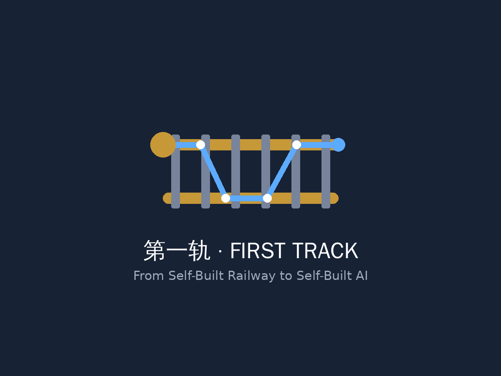
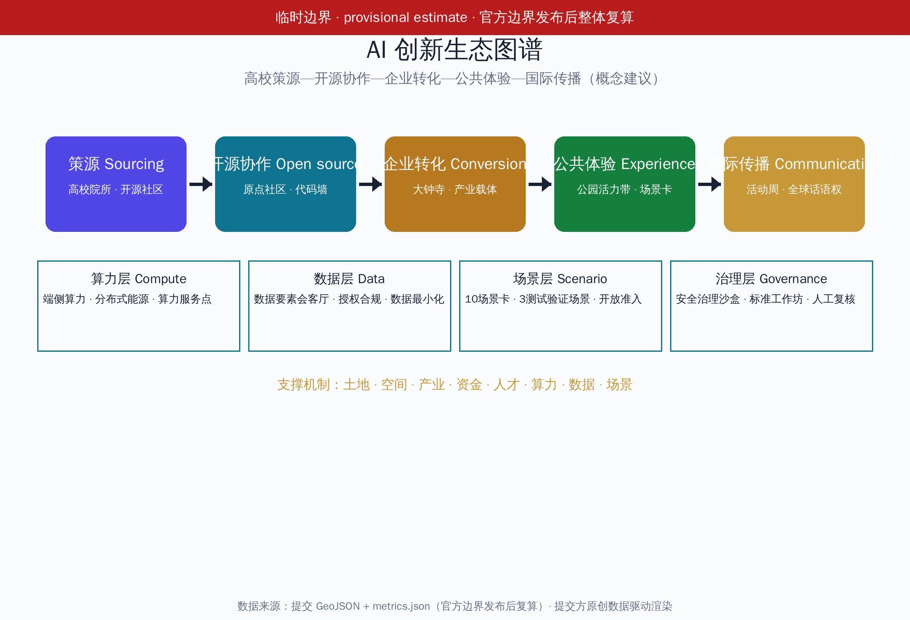
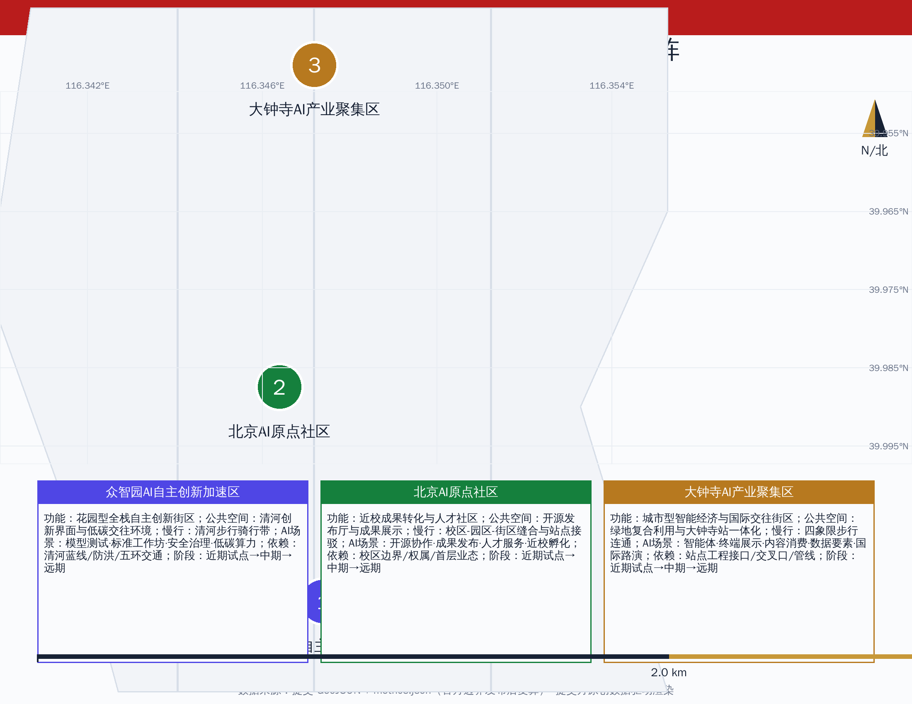
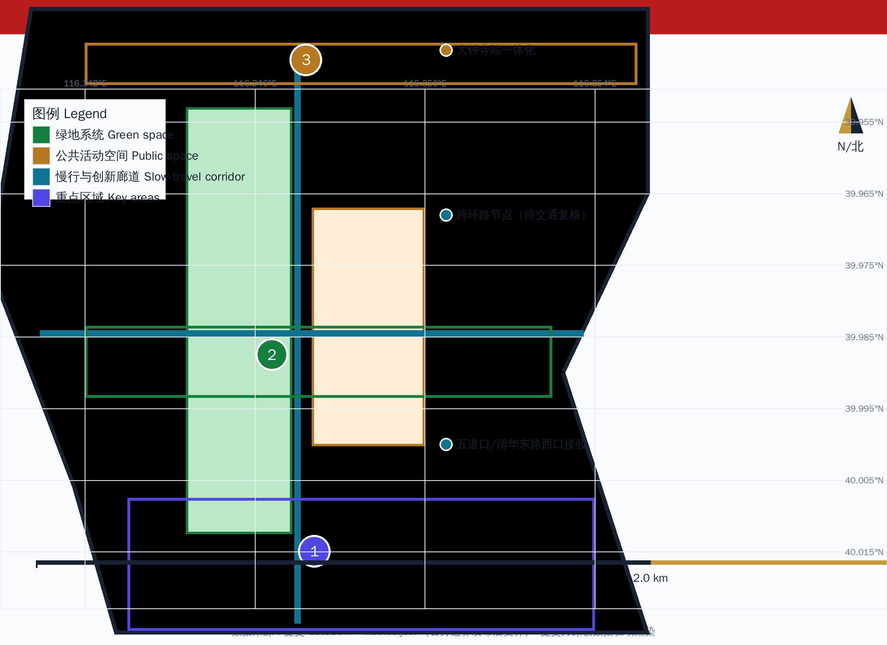
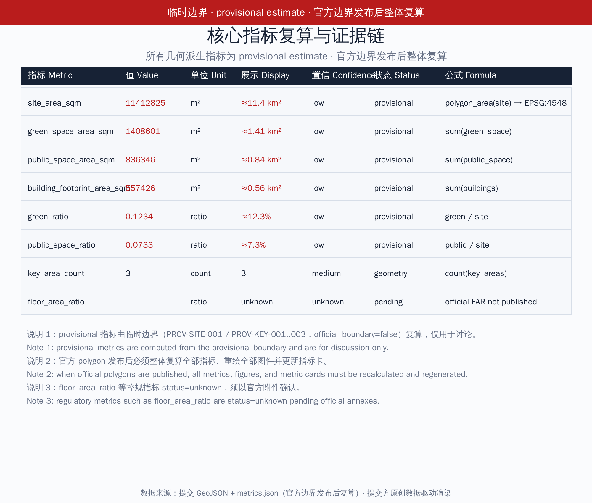

# 百年京张·第一轨——从自主铁路到自主AI的城市脊柱

## 设计依据与资料清单

本 formal 方案以北京市规划和自然资源委员会海淀分局发布的《百年京张AI创新带城市设计国际方案征集资格预审公告》为第一依据 [source:OFFICIAL-ANNOUNCEMENT] [standard:PROJECT-OFFICIAL-ANNOUNCEMENT]，并以 brief/site-package/ 中经维护者登记的临时粗略边界、重点区域、枚举、指标和来源清单为机器可读依据。AI agent 在生成方案前读取 design_brief.json、allowed_design_space.json、sources.json、enums/、ranges/、schemas/、data/source_registry.json 和 data/processed/agent_fact_pack.md，并用 project_scope_summary.csv、agent_task_requirements.csv、source_use_matrix.csv、missing_data_checklist.csv 建立任务、范围、资料用途和缺口清单 [source:PROCESSED-FACT-PACK] [source:SITE-PACKAGE]。所有设计判断拆分为可追溯来源、可复算指标、可校验图层和可人工复核假设 [depth:metrics_recalculation] [depth:risk_missing_data]。

> 临时边界声明（provisional estimate）：公开资料中尚无官方 SITE_BOUNDARY 与三处 KEY_AREA 精确 polygon。本包 geometry/site_boundary.geojson（PROV-SITE-001）与 geometry/key_areas.geojson（PROV-KEY-001..003）均为依据公告文字四至与约面积推定的临时粗略范围 [source:BOUNDARY-SOURCE] [source:KEY-AREA-SOURCE]，official_boundary=false。正文所有面积、比例、地图、图纸与指标均按临时估算（provisional estimate）标注，只用于生成、展示、自检与设计讨论；不得作为红线、审批依据、精确面积依据或法定控制结论。组织方发布官方 polygon 后，必须整体复算全部几何派生指标并重绘图件 [data:geometry/site_boundary.geojson#SITE-001] [metric:site_area_sqm]。

三层范围在 compliance_matrix.json 中逐条映射 [metric:key_area_count] [data:geometry/key_areas.geojson#PROV-KEY-001]，保证公告 1.3、1.4、1.5 与 agent.1-agent.6 的必选任务都有章节、图层、指标、图纸和 HTML 证据；三层框架深度由 [depth:three_level_scope_framework] 约束，现状与缺资料由 [depth:existing_conditions_diagnosis] 约束。

## 三层范围工作框架

方案按照公告确定的三个层次组织工作：统筹研究范围关注 43.6 平方公里（公告约值）的 AI 产业生态、战略定位、创新链和未来城市形态；总体设计范围关注约 11.4 平方公里京张遗址公园周边 1—2 公里城市地区和产业区，要求形成城市更新总体框架、产业空间布局、交通市政支撑和城市风貌控制；重点区域范围关注约 368.4 公顷三处详细设计地区，要求明确功能业态、建筑规模、拆改留分类、公共空间连通和交通组织 [data:geometry/key_areas.geojson#PROV-KEY-002] [metric:key_area_count]。三层范围不是互相割裂的图纸集合：统筹研究决定产业链和城市形态判断，总体设计把判断落实到更新项目、空间结构和设施承载，重点区域详细设计验证具体地块、建筑、交通、公共空间和 AI 应用场景的可实施性 [depth:three_level_scope_framework] [depth:overall_spatial_structure]。

| 层级 | 设计问题 | 方案回答 | 数据落点 |
| --- | --- | --- | --- |
| 统筹研究范围 | AI产业生态和未来城市形态如何组织 | 三大定位、五大功能、三区两翼与空间-产业-运营映射 | compliance_matrix.json、standard_matrix.json |
| 总体设计范围 | 产业空间、城市更新、交通市政和风貌如何落图 | 用地、建筑、道路、绿地、公共空间和分期图层共同表达 | [data:geometry/land_use.geojson#LU-001]、[data:geometry/roads.geojson#ROAD-001] |
| 重点区域范围 | 三处片区如何达到详细设计深度 | 概念空间设计+项目矩阵，功能/公共空间/慢行联系/AI场景/实施依赖与阶段 | [data:geometry/key_areas.geojson#PROV-KEY-001]、[data:geometry/key_areas.geojson#PROV-KEY-003] |

总体概念为第一轨（First Track）：1909 年詹天佑主持修建的京张铁路是中国人自主设计建造的第一条干线铁路，其精神原点——自主——正是百年后海淀 AI 创新带的文化原点 [source:HISTORY-JINGZHANG-RAILWAY]。方案把京张遗址公园走廊转化为从自主铁路到自主AI的城市脊柱，以众智园、北京AI原点社区、大钟寺三处重点片区为创新锚点，以高校、企业、社区和轨道站点为日常网络，形成一轨三核、多点场景、蓝绿慢行复合环的空间组织 [source:AGENT-TASKBOOK] [standard:PROJECT-AGENT-OPEN-CALL-TASKBOOK]。一轨不是额外画出的新红线，而是把公告中的京张遗址公园走廊转译为文化—创新—生活复合主轴；三核对应三处重点区域；多点场景对应 AI+公共服务、产业服务和城市生活的可运营节点；复合环对应慢行、绿地、公共空间和活动路线的联动 [depth:overall_spatial_structure]。

## 统筹研究范围产业与未来城市研究

### 命名体系与 Logo/视觉系统（agent.1 交付）

主名称第一轨既指京张铁路作为中国人自主建造的第一条干线轨道，也喻指 AI 时代自主创新的起跑线；英文名 First Track 保留双关。命名体系分三层：项目总称百年京张·第一轨；空间主轴第一轨文化脊柱（First Track Cultural Spine）；活动与运营品牌第一轨·开源周（First Track Open Week）等。命名与 Logo 服务于百年京张文化带、都市AI生活体验带、AI融合创新带三大定位的整体辨识度 [source:AGENT-TASKBOOK] [standard:PROJECT-AGENT-OPEN-CALL-TASKBOOK]。

Logo 方向为轨道剖面与电路走线的同构图形：以 1435mm 标准轨距为母题，用一条连续曲线同时表达钢轨断面与印刷电路走线，起点为原点节点（对应AI原点社区），中段为双轨并行（对应自主创新与开源协作），末端为信号发散（对应全球传播）。视觉系统规定：主色取京张铁路旧站青灰与 AI 创新带科技蓝的渐变过渡；辅助色为信号橙（活动/传播）与轨道金（历史/文化）；辅助图形为詹天佑手稿工程图的几何化底纹；字体规定中文图件使用开源黑体（文泉驿正黑 [source:FONT-WQY-ZENHEI]），英文使用开源无衬线（DejaVu Sans [source:FONT-DEJAVU]）。Logo 为提交方原创图形（不含第三方商标、图片或字体重绘），正式使用前按统一边界条款完成清权确认 [depth:logo_visual_identity] [source:ASSET-LOGO-ORIGINAL]。

### 三大定位、五大功能与三区两翼（agent.1 交付）

面向智能体任务书要求回应三大定位（百年京张文化带、都市AI生活体验带、AI融合创新带）、五大功能（AI全栈自主创新体系、世界级AI创新生态、AI+场景赋能新范式、智能化AI活力城市、AI治理全球话语权）与三区两翼协同 [source:AGENT-TASKBOOK]。方案建立如下映射：

| 定位 | 功能支撑 | 空间落点 | 运营落点 |
| --- | --- | --- | --- |
| 百年京张文化带 | 智能化AI活力城市 | 京张遗址公园活力带、导视与文化符号系统、朝圣地标 | 第一轨文化叙事、京张记忆线路、国际传播 |
| 都市AI生活体验带 | AI+场景赋能新范式 | 小月河场景赋能翼、10场景卡、公共体验路径 | 场景开放日、公共体验运营、无障碍与安全边界 |
| AI融合创新带 | AI全栈自主创新体系、世界级AI创新生态、AI治理全球话语权 | 众智园、AI原点社区、大钟寺、中关村科技服务翼 | 开发者社区、开源协作、测试验证场景、荣誉展示体系 |

三区两翼协同回路：AI原点社区（世界级AI创新生态）、众智园（全栈自主体系与治理话语权）、大钟寺（智能原生新业态）构成三区创新主轴；中关村科技服务翼（要素全球化配置、中关村IP与资本赋能）与小月河场景赋能翼（AI场景赋能与活力城市）构成两翼支撑。协同回路为策源—转化—场景—服务—再策源：高校与开源社区策源，原点社区孵化转化，大钟寺与场景翼落地验证，众智园标准与安全治理反馈，中关村翼提供资本与全球要素，反哺策源 [depth:spatial_industry_operations_mapping]。与北纬社区、未来科学城、怀柔科学城、经开区及京津冀的创新协同写入区域创新关系（概念建议，非政府承诺）[source:PROCESSED-FACT-PACK]。

### AI 创新生态图谱（agent.2 交付）

AI 创新生态图谱以高校策源—开源协作—企业转化—公共体验—国际传播创新链为骨架 [depth:ai_innovation_ecosystem_map]，叠加算力层（端侧算力、分布式能源、算力服务点）、数据层（数据要素会客厅、授权与合规）、场景层（10场景卡）与治理层（安全治理沙盒、标准工作坊、AI治理全球话语权）。图谱以图件 assets/figures/ecosystem-map.png 与正文表格共同交付，全部要素为概念建议，不编造企业名单、投资额或政策承诺。

### 国际案例研究（agent.2 交付）

选取 6 个全球 AI 创新生态案例作为基准参考（desk research，均来自公开来源并记录许可/复用边界，详见 sources.json 与 report/copyright_statement.md）[depth:international_case_studies] [metric:case_study_count]：

| 案例 | 类型 | 可借鉴机制 | 来源与许可记录 |
| --- | --- | --- | --- |
| 多伦多滨水区/Quayside | 滨水创新区治理 | 公共数据信托、公共利益优先治理、试点退出机制 | [source:CASE-TORONTO-WATERFRONT]、[source:CASE-TORONTO-QUAYSIDE]；2021年项目终止仅作治理教训 |
| 新加坡榜鹅数字区 | 智慧可持续城区 | 数字孪生、社区级智能服务、开放标准 | [source:CASE-SINGAPORE-PUNGGOL] |
| 赫尔辛基 Kalasatama | 智慧城市开放创新 | 开放数据目录、城市即平台、市民共创 | [source:CASE-HELSINKI-KALA] |
| 巴黎 Station F | 大型创业园区 | 社区运营、活动日历、资本-企业-高校对接 | [source:CASE-PARIS-STATION-F] |
| 特拉维夫创新生态 | 城市创新集群 | 城市服务API化、网络安全集群、全球人才吸引 | [source:CASE-TEL-AVIV-CYBER] |
| 京张铁路历史（对照案例） | 文化-产业融合 | 线性遗产转化为城市文化创新主轴 | [source:HISTORY-JINGZHANG-RAILWAY] |

### 八类支撑机制（agent.2 交付）

土地、空间、产业、资金、人才、算力、数据、场景八类支撑机制分别给出机制建议、空间载体与责任主体（概念建议）[depth:ecosystem_support_mechanisms]：

| 机制 | 建议内容 | 空间载体 | 责任边界 |
| --- | --- | --- | --- |
| 土地 | 城市更新统筹、混合用地建议、临时用地活化 | 更新项目清单、phasing 图层 | 待正式控规与权属确认 |
| 空间 | 创新载体梯度供给、公共空间预留、慢行联系 | 用地/公共空间/道路图层 | 概念层，非红线 |
| 产业 | 全栈自主体系、智能原生新业态、场景经济 | 三区两翼 | 需企业与机构确认 |
| 资金 | 公共-社会资本合作路径、孵化与风投对接建议 | 中关村科技服务翼 | 不承诺投资额 |
| 人才 | 人才特区服务、国际人才社区、开发者社区 | AI原点社区、人才服务节点 | 需政策确认 |
| 算力 | 端侧算力驿站、分布式能源、算力服务标准 | 新基建节点 | 待工程条件 |
| 数据 | 数据要素会客厅、授权合规、数据最小化 | 大钟寺片区 | 遵循生成式AI办法与隐私边界 |
| 场景 | 场景开放准入、测试验证场景、公共体验 | 10场景卡 | 组织方审批与安全评估 |

### 未来城市形态研究

未来城市形态研究回答人工智能如何改变工作、生活、社交、学习、交通和公共服务，并把 AI 交通系统、连续绿色空间、创新服务设施和国际化生活工作氛围落实为可定位的功能区、节点、廊道和场景 [depth:overall_spatial_structure]。产业战略指标、AI创新指数、人才密度、空间供给类型和 AI+垂直应用重点区域写入指标体系，并标明哪些是官方、哪些是设计建议、哪些仍待正式数据校准 [metric:scenario_count]。全球AI创新活动、开发者社区、开放场景与朝圣路线均表述为概念建议/参考方案/可供专业团队深化研究，不写成已确定的政府活动或实施安排。
## 总体设计范围城市更新与控规深度城市设计

总体设计范围要求达到控制性详细规划的城市设计深度。方案提出城市更新总体空间结构、低效空间识别、更新项目清单、实施政策建议、产业功能比例、空间组织模式与综合承载能力评估框架 [depth:land_use_layout]。geometry/land_use.geojson 完整覆盖临时设计边界且无重叠，geometry/buildings.geojson 表达更新/保留建筑基底（概念占位），geometry/roads.geojson 表达微循环、慢行和轨道接驳关系，metrics.json 复算核心面积、比例和图层数量 [data:geometry/land_use.geojson#LU-001] [data:geometry/buildings.geojson#BLDG-001] [metric:building_footprint_area_sqm]。

本节按照 [standard:MOHURD-CONTROL-DETAILED-PLANNING] 把控规深度内容拆成可审查对象，并统一区分三类状态：第一类为可由提交几何直接复算的空间指标（面积、比例）；第二类为需要官方控规或任务书附件支撑的管控指标（容积率、建筑高度、建筑密度、退线、道路红线、设施标准），本包统一登记为 status=unknown 并给出前置条件 [metric:floor_area_ratio]；第三类为需要运营或产业数据持续校准的绩效指标。涉及建筑高度、开发强度、道路红线、退线和设施标准的内容，若无官方控制条件，一律写为待正式控规条件确认，不得以推测值冒充审定指标 [depth:development_intensity_controls]。

围绕轨道站点一体化、道路微循环、非机动车停放、停车供给、创新服务平台、人才生活服务、新型基础设施、分布式能源和端侧算力提出空间布局和实施路径（概念层）；道路红线、管线、消防和市政条件缺失时通过 assumptions 说明待补，不把策略写成审定条件 [depth:traffic_rail_slow_parking] [depth:municipal_new_infrastructure]。

## 重点区域详细设计

三处重点区域详细设计是必选项。本包交付可读的概念空间设计与项目矩阵（功能、公共空间、慢行联系、AI场景、实施依赖与阶段），并明确临时几何只是占位示意、不是红线或精确面积 [depth:three_key_area_detailed_design]；三处重点区图层分别以 [data:geometry/key_areas.geojson#PROV-KEY-001]、[data:geometry/key_areas.geojson#PROV-KEY-002] 与 [data:geometry/key_areas.geojson#PROV-KEY-003] 为证据。

### 众智园AI自主创新加速区（概念设计）

- 功能：花园型全栈自主创新街区；国家人工智能平台展示、全栈自主创新、标准制定、安全治理、产业展示与对外交通服务（概念意向，待官方定位确认）。
- 公共空间：清河创新界面、低碳绿色创新交往环境、绿色空间承载开放测试与标准治理展示。
- 慢行联系：沿清河界面组织步行骑行，强化与京张遗址公园活力带北段衔接。
- AI场景：自主模型测试、标准制定工作坊、安全治理展示、低碳算力体验（对应场景卡 02/08）。
- 实施依赖与阶段：依赖清河蓝线、生态与防洪条件、五环路对外交通条件确认；近期以绿色空间和展示节点试点，中期完善产业载体，远期配合控规条件深化。

### 北京AI原点社区（概念设计）

- 功能：近校型成果转化与人才社区；高校策源、开源协作、成果发布、人才特区服务、居住生活配套。
- 公共空间：开源发布厅、公共代码墙、成果展示发布空间、夜间协作与社区交往节点。
- 慢行联系：校区—园区—街区慢行缝合，轨道站点一体化接驳（五道口、清华东路西口相关联系）。
- AI场景：开源社区、成果发布、人才服务、近校孵化（对应场景卡 01/06/07）。
- 实施依赖与阶段：依赖校区边界、权属与首层业态确认；近期以开源活动与发布厅试点，中期推进成果转化街，远期随控规与权属条件深化拆改留。

### 大钟寺AI产业聚集区（概念设计）

- 功能：城市型智能经济与国际交往街区；领军企业、智能体、智能终端、内容消费、数据要素与商业服务。
- 公共空间：规划绿地复合利用、大钟寺站一体化、路口四象限步行连通。
- 慢行联系：以四象限步行连通缝合被道路切分的街区，强化与站点和商业服务的接驳。
- AI场景：智能体与终端展示、内容消费、数据要素与国际路演（对应场景卡 05/08）。
- 实施依赖与阶段：依赖轨道站点工程接口、道路交叉口与市政管线条件确认；近期以路演客厅与步行连通试点，中期完善产业载体与数据要素服务，远期随工程条件深化。

### 重点区域项目矩阵

| 重点区 | 项目 | 功能 | 公共空间 | 慢行联系 | AI场景 | 实施依赖 | 阶段 |
| --- | --- | --- | --- | --- | --- | --- | --- |
| 众智园 | JZ-02 清河创新界面 | 产业展示+蓝绿 | 清河低碳创新廊 | 清河步行骑行带 | 低碳算力体验 | 清河蓝线、防洪 | 近期试点 |
| 众智园 | JZ-05 AI公共服务节点 | 新基建+服务 | 绿色测试场 | 公园北段接驳 | 安全治理沙盒 | 能源、算力、安全 | 中期 |
| 原点社区 | JZ-03 近校成果转化街 | 产业服务+更新 | 开源发布厅 | 校区-园区缝合 | 开源协作与发布 | 校区边界、权属 | 近期试点 |
| 原点社区 | JZ-06 全球AI活动周路线 | 运营+品牌 | 成果展示廊 | 站点-街区接驳 | 活动周场景 | 公共空间许可 | 近期 |
| 大钟寺 | JZ-04 四象限步行连通 | 轨道一体化+慢行 | 站点广场 | 四象限连通 | 路演与消费场景 | 站点工程接口 | 中期 |
| 大钟寺 | JZ-08 数据要素会客厅 | 数据服务+商务 | 绿地复合利用 | 商业街区联系 | 数据要素展示 | 合规授权机制 | 中期 |

以上矩阵为概念建议，不构成地块拆改留、道路红线、工程方案或精确面积结论。
## AI 创新生态、人才画像与 AI+ 场景

### 用户画像（5类+，agent.3 交付）

| 用户画像 | 典型需求 | 空间响应 | 自检边界 |
| --- | --- | --- | --- |
| 开源开发者 | 发布、协作、测试、社区声誉 | 原点社区开源发布厅、公共代码墙、夜间协作空间 | 不采集个人行为轨迹；活动数据只做聚合统计 |
| 初创团队 | 低成本办公、算力入口、产品试验场 | 众智园共享测试场、端侧算力服务点、标准治理咨询 | 算力和数据服务需另行授权 |
| 头部企业访客 | 展示、商务、国际接待、人才招聘 | 大钟寺国际路演客厅、轨道站点接驳、重点企业周边公共空间 | 企业标识和案例须清权 |
| 周边居民 | 通勤、休闲、社区服务、低扰动更新 | 京张遗址公园慢行环、社区服务嵌入、夜间照明和活动分级 | 不将居民画像用于商业推荐 |
| 高校师生 | 成果转化、跨校协作、日常慢行 | 校区-园区慢行缝合、成果转化驿站、AI教育体验点 | 校园数据和科研成果需授权 |
| 老年与行动不便者 | 无障碍出行、等效非AI服务 | 无障碍坡道、语音/人工双通道、慢行休憩点 | 遵循无障碍环境建设法设计边界 |

### 10 张完整场景卡（agent.3 交付）

每张场景卡包含服务对象、空间位置、数据来源、隐私边界、人工复核机制与运营主体 [depth:scenario_cards] [metric:scenario_count]。

**01 开源发布厅（测试验证场景）**：服务对象为高校、开源社区与初创团队；位于北京AI原点社区；数据来源为公开代码仓库与报名信息；隐私边界为不采集个人行为轨迹、贡献数据仅聚合展示；人工复核为发布内容人工审核；运营主体为社区运营方+主办方。测试验证内容：模型评测与代码贡献展示的开放流程、发布内容审核机制、场地容量与安全预案。

**02 安全治理沙盒（测试验证场景）**：服务对象为标准制定者、安全评测机构与模型开发方；位于众智园；数据来源为测试数据集与模型输出；隐私边界为测试数据脱敏、输出记录受控；人工复核为红队测试结果人工评审；运营主体为主办方+第三方评测机构。测试验证内容：标准制定工作坊流程、安全评测展示流程、观众预约与监管接口。

**03 端侧算力驿站（测试验证场景）**：服务对象为开发者、企业与公共服务机构；位于总体设计范围新基建节点；数据来源为端侧算力使用申请与能耗数据；隐私边界为算力服务需另行授权、能耗数据仅聚合；人工复核为算力配额人工审批；运营主体为运营公司+能源服务方。测试验证内容：端侧算力与公共服务融合原型、分布式能源协同、服务可靠性。

**04 AI慢行导航**：服务对象为游客与居民；位于京张遗址公园活力带；数据来源为公开地图数据与人工核查的断点清单；隐私边界为不追踪个体位置；人工复核为断点识别结果人工确认；运营主体为公共空间运营方。

**05 大钟寺国际路演客厅**：服务对象为智能体、智能终端与内容消费企业；位于大钟寺AI产业聚集区；数据来源为企业报名与公开项目信息；隐私边界为企业信息仅用于活动组织；人工复核为路演内容与嘉宾信息审核；运营主体为活动运营方。

**06 清河低碳创新廊**：服务对象为园区企业与公众；位于众智园临清河界面；数据来源为公开环境与能耗数据；隐私边界为环境数据仅聚合展示；人工复核为展示内容审核；运营主体为园区运营方。

**07 近校成果转化街**：服务对象为高校科研团队；位于北京AI原点社区；数据来源为成果信息（经授权）与公开政策；隐私边界为未公开科研成果不展示；人工复核为成果信息审核；运营主体为转化服务运营方。

**08 数据要素会客厅**：服务对象为数据要素与数字资产服务商；位于大钟寺片区；数据来源为授权合规的数据产品演示；隐私边界为演示数据脱敏、交易流程可审计；人工复核为合规审查；运营主体为数据服务运营方。

**09 AI生活服务样板街**：服务对象为社区居民与老人儿童；位于社区与商业交汇处；数据来源为公开服务信息；隐私边界为不采集个人健康/行为数据；人工复核为AI建议人工确认、保留非AI等效服务；运营主体为街道/社区运营方。

**10 全球AI活动周路线**：服务对象为全球开发者、企业与公众；位于一带公共空间系统；数据来源为活动报名与公开日程；隐私边界为报名信息最小化；人工复核为活动内容与安全预案审核；运营主体为主办方+活动运营方。

3 个测试验证场景（01/02/03）均为概念提案：任何真实试点须经组织方批准、场地许可、安全评估，并遵循生成式AI办法 [source:STANDARD-GENAI-MEASURES] 与无障碍法 [source:STANDARD-BARRIER-FREE-LAW] 的治理边界 [standard:GENERATIVE-AI-INTERIM-MEASURES] [standard:BARRIER-FREE-ENVIRONMENT-LAW]；未表述为已批准运营 [depth:test_validation_scenarios] [metric:test_validation_scenario_count]。

### 场景-空间-运营映射（agent.3 交付）

场景按空间归属映射：原点社区承载 01/06/07；众智园承载 02/06；大钟寺承载 05/08；公园活力带承载 04/10；新基建节点承载 03；社区商业交汇承载 09 [depth:scenario_cards]。运营上分三类：社区运营（01/07）、活动运营（05/10）、公共服务运营（03/04/09），并统一遵守数据最小化、可解释与人工复核原则 [standard:ELDERLY-SMART-TECH-PLAN-2020-45]。小月河场景赋能翼承接 04/09 等低强度场景试验，与公共体验路径串联。
## 用地、建筑规模与拆改留方案

用地方案依据国土空间调查、规划、用途管制分类等公开标准表达 [standard:MNR-LAND-USE-CLASSIFICATION-GUIDE]，形成完整、闭合、无缝的用地分区 [data:geometry/land_use.geojson#LU-001]。建筑方案区分保留、改造、更新、新建或待确认对象，明确概念级功能与规模建议层级 [data:geometry/buildings.geojson#BLDG-001] [metric:building_footprint_area_sqm]；建筑深度按 [standard:MOHURD-ARCH-DESIGN-DEPTH-2016] 登记为待官方文件启用。因缺少现状建筑、权属、控规和工程条件，方案只提供方法与待校准清单，不编造拆改留结论 [depth:retain_renovate_demolish] [depth:height_massing_character]。建筑规模与强度指标与 metrics.json 一致：总建筑规模、容积率、高度、密度、绿地率、退线和建筑控制线缺少官方条件时统一 status=unknown 并说明复算路径 [metric:floor_area_ratio]。

## 交通、轨道、市政与公共服务设施

交通方案回应公告对轨道站点一体化、道路微循环、慢行断点、对外交通、停车、非机动车停放和绿色交通系统的要求，重点覆盖北五环、京张遗址公园跨环路节点、五道口、清华东路西口、大钟寺站及重点企业周边交通联系 [depth:traffic_rail_slow_parking] [data:geometry/roads.geojson#ROAD-001] [data:geometry/constraints.geojson#CONSTRAINTS]。道路和慢行图层保持在提交边界内，并与公共空间、绿地、产业节点和重点片区相互校核；提交边界为 provisional，交通结论仅为临时设计讨论 [metric:public_space_area_sqm]。市政和公共服务设施覆盖 AI 产业服务设施、创新服务平台、人才生活服务设施、新型基础设施、分布式能源、端侧算力和传统市政设施融合 [depth:municipal_new_infrastructure]；缺少管线、能源、排水、防洪、消防等工程资料时列为正式深化前置条件，不给出工程结论。

## 蓝绿空间、公共空间与城市风貌

### 蓝绿系统与公共空间

蓝绿空间方案以京张遗址公园活力带为骨架，统筹清河、小月河、周边高校、企业、社区出行需求，提出南北贯通、东西连通的步道、骑行道和绿色空间体系 [depth:blue_green_public_space] [data:geometry/green_space.geojson#GREEN-001] [data:geometry/public_space.geojson#PUBLIC-001]。方案识别慢行断点、上跨环路节点、公园南端和北端景观节点，提出停车、体育、创新交往、科技测试、应用展示和公共服务复合利用策略；绿地与公共空间比例按 provisional estimate 标注并待复算 [metric:green_space_area_sqm] [metric:green_ratio] [metric:public_space_ratio]，风貌统筹遵循城市设计管理办法 [standard:MOHURD-URBAN-DESIGN-MEASURES]。

### AI 朝圣地标（3个，agent.4 交付）

朝圣地标为概念设计，非工程方案，须通过文保、安全、无障碍与审批审查 [depth:ai_pilgrimage_landmarks] [metric:landmark_count]：

| 地标 | 位置意向 | 文化叙事 | 边界 |
| --- | --- | --- | --- |
| 第一轨纪念碑亭 | 京张遗址公园活力带（意向点位） | 1909 年自主建路精神与 AI 自主创新对话 | 文保范围与景观审查；不做工程方案 |
| 开源贡献星墙 | AI原点社区（意向点位） | 开发者与共创贡献者荣誉展示 | 荣誉内容审核；肖像与标识清权 |
| 原点模型舱 | 众智园/原点社区交界（意向点位） | 从原点出发的 AI 模型与场景展示舱 | 安全与结构审查；不占用文保空间 |

### 荣誉展示体系（agent.4 交付）

荣誉展示体系包括：贡献者星墙（开发者/共创者长期记录）、方案共创展廊（历次共创方案与迭代展示）、年度 AI 贡献榜（年度评选与发布）[depth:honor_display_system]。展示内容遵循公开合规：不展示个人隐私、不展示未经授权肖像与商标、区分投稿/评审/入选/落地状态、内容由人工审核后发布。

### 公共空间组件库（12项，agent.4 交付）

组件库为概念设计参考，每项标注安全、文保、无障碍与运维边界 [depth:public_space_component_library] [metric:component_count] [standard:BARRIER-FREE-ENVIRONMENT-LAW]：

| 组件 | 说明 | 安全边界 | 文保/无障碍/运维边界 |
| --- | --- | --- | --- |
| C01 轨距主题座椅 | 1435mm 母题座椅组 | 结构安全审查 | 无障碍就坐高度；日常巡检 |
| C02 智能灯杆 | 照明+信息屏+传感器 | 电气安全 | 不采集个体数据；节能运维 |
| C03 站牌式导视 | 铁路站牌风格导视 | 抗风与安装安全 | 盲文与语音；多语言 |
| C04 轨道纹样井盖 | 文化符号井盖 | 防滑防坠 | 文保风格审查；市政维护协议 |
| C05 可移动测试围栏 | 场景测试临时围栏 | 防倾倒、警示标识 | 不占用文保空间；活动期外移除 |
| C06 信息屏（等效双通道） | AI信息+人工服务入口 | 用电安全 | 无障碍高度；断网可读 |
| C07 无障碍坡道模块 | 临时/永久坡道 | 坡度与防滑合规 | 无障碍法要求；定期检测 |
| C08 直饮水点 | 公共饮水 | 水质安全 | 儿童与轮椅可达；卫生运维 |
| C09 遮阳与风雨廊架 | 休憩遮阳 | 结构安全 | 风貌审查；耐候运维 |
| C10 可移动绿植容器 | 街道绿化 | 固定防倒 | 不遮挡盲道；季节养护 |
| C11 活动电源插座 | 临时活动供电 | 漏电保护 | 活动许可；人离断电 |
| C12 社区服务亭 | 人工+AI服务 | 消防安全 | 24h人工值守或远程值守；无障碍入口 |

### 导视与文化符号系统（agent.5 交付）

导视与文化符号系统以第一轨为母题：一级导视为区域/站点级（站牌式、多语言、无障碍）；二级导视为场所级（场景卡与地标入口）；三级为信息级（组件与设施）。符号系统包括轨距母题、轨道纹样、信号灯色彩语言与手稿几何底纹 [depth:signage_cultural_symbol_system]。系统与一带整体 Logo 系统区分层级：Logo 代表整体品牌，导视符号承载场所叙事与寻路功能，二者共用色彩与母题但用途分离。

### 国际传播文案（agent.5 交付，可直接审校）

品牌主张（中文）：百年京张·第一轨——从自主铁路到自主AI的城市脊柱。品牌主张（英文）：First Track: the urban spine from China's first self-built railway to self-built AI. 城市气质：自主、开源、谦逊而自信；铁路般的秩序感与代码般的精确感；面向全球开发者与市民的开放姿态。传播要点：①自主文脉（1909→今天）；②三区两翼与场景开放；③人类最终判断与人工复核的治理姿态；④公共体验而非展示橱窗。发布纪律：所有传播区分投稿/评审/入选/落地，不表述为已批准或已建成；对外发布前须账号所有者授权；附来源、许可与替代文本 [depth:international_communication_copy]。
## 更新项目清单、实施政策与分期计划

### 更新项目清单

| 项目编号 | 项目名称 | 类型 | 主要依赖 | 阶段 | 证据引用 |
| --- | --- | --- | --- | --- | --- |
| JZ-01 | 京张遗址公园慢行断点缝合 | 公共空间/交通 | 道路红线、桥下空间、交通组织复核 | 近期试点 | [data:geometry/roads.geojson#ROAD-001] |
| JZ-02 | 众智园清河创新界面 | 蓝绿空间/产业展示 | 河道蓝线、生态和防洪条件 | 近期试点 | [data:geometry/green_space.geojson#GREEN-001] |
| JZ-03 | 原点社区近校成果转化街 | 城市更新/产业服务 | 校区边界、权属、首层业态 | 近期试点 | [data:geometry/buildings.geojson#BLDG-001] |
| JZ-04 | 大钟寺站四象限步行连通 | 轨道一体化/慢行 | 轨道站点、道路交叉口、市政管线 | 中期 | [data:geometry/public_space.geojson#PUBLIC-001] |
| JZ-05 | AI公共服务与端侧算力节点 | 新基建/公共服务 | 能源、算力、安全和运营主体 | 中期 | [data:geometry/constraints.geojson#CONSTRAINTS] |
| JZ-06 | 全球AI活动周公共路线 | 运营/品牌 | 公共空间许可、活动安全、版权清权 | 近期 | [data:geometry/phasing.geojson#PHASE-001] |

分期以近期试点、中期更新和长期治理框架组织 [depth:phasing_implementation]；方案区分 100 天征集设计周期与实施分期，轻量设施、运营活动和服务平台可先行启动，正式控规、市政、交通和权属条件确认前不承诺工程落地 [depth:renewal_project_list]。

### 年度活动日历（12项，agent.6 交付）

年度活动日历为概念运营设计，非已确定安排，需主办方确认 [depth:annual_event_calendar]：

| 月份 | 活动 | 对象 | 责任边界 |
| --- | --- | --- | --- |
| 1月 | 第一轨·年度AI贡献榜发布 | 开发者/企业 | 内容审核、荣誉清权 |
| 2月 | 开发者新春共创会 | 开发者社区 | 社区章程与反滥用 |
| 3月 | 场景开放准入申请窗口 | 企业/团队 | 准入评估流程 |
| 4月 | AI治理标准工作坊 | 标准与评测机构 | 第三方评测边界 |
| 5月 | 开源发布厅月度路演 | 高校/初创 | 发布内容审核 |
| 6月 | 京张文化记忆季 | 公众 | 文保与活动安全 |
| 7月 | 端侧算力与低碳开放日 | 公众/企业 | 用电与安全预案 |
| 8月 | 国际AI传播周 | 全球开发者 | 多语言、无障碍、授权发布 |
| 9月 | 第一轨·开发者节 | 全球开发者 | 活动安全、容量预案 |
| 10月 | 场景开放日（公共体验） | 公众 | 人工复核与等效非AI服务 |
| 11月 | 大钟寺数据要素论坛 | 数据服务商 | 合规与可审计 |
| 12月 | 年终共创回顾与下年准入 | 社区/企业 | 数据沉淀与知识库 |

### 开发者社区治理（agent.6 交付）

开发者社区治理遵循共创十条原则 [source:AGENT-TASKBOOK]：准入（提交贡献记录与行为守则确认）；章程（开源许可、署名、冲突解决）；荣誉（星墙与年度贡献榜）；激励（活动资源、测试名额、传播支持）；反滥用（刷屏、冒充、无署名复制处罚）；仲裁（主办方+社区代表+外部专家，人类最终判断）[depth:developer_community_governance]。

### 场景开放准入与公共体验运营（agent.6 交付）

场景开放准入机制：申请—评估（安全/数据/合规/公共利益）—试点（限时限量）—扩展（评估通过）—退出（风险触发）[depth:scenario_open_operation]。公共体验运营：预约制、人工复核、数据最小化、等效非AI通道（电话/人工窗口）、无障碍与安全预案、活动后评估 [standard:ELDERLY-SMART-TECH-PLAN-2020-45]。任何测试场景须经组织方批准与安全评估，未表述为已批准运营。

### 合作转化路径（agent.6 交付）

合作转化路径：识别（活动/场景/社区触点）—接触（专场对接）—试点（场景准入）—签约（商务与法务）—沉淀（案例与知识库）[depth:cooperation_conversion_pathway]。面向企业落地与人才引进给出责任角色（主办方/运营方/社区/企业/第三方机构）与转化指标（触点数、试点数、签约数、落地数、满意度）；不承诺招商、政策或投资。

### 责任角色与 KPI（agent.6 交付）

| 角色 | 责任 | KPI 建议 |
| --- | --- | --- |
| 主办方 | 审批、资源、政策协调 | 场景准入通过率、活动安全事件=0 |
| 运营方 | 场景/活动/空间运营 | 场景使用频次、活动参与度、满意度 |
| 开发者社区 | 内容、荣誉、反滥用 | 社区活跃度、贡献数、投诉处理时长 |
| 企业 | 试点与落地 | 试点转化率、落地项目数 |
| 第三方机构 | 评测、审计、无障碍审查 | 评测报告数、合规审计通过率 |

KPI 为建议指标，需组织方确认后进入运营基线 [depth:responsible_roles_kpis]。

## 指标体系、面积复算与合规矩阵

指标体系覆盖总体设计范围面积、重点区域面积、绿地与公共空间比例、建筑基底、更新项目数量、AI场景节点、国际案例、朝圣地标、组件数量与自检状态；所有 known 指标可从 GeoJSON 或内容计数复算 [depth:metrics_recalculation]，unknown 指标给出原因与正式提交前置条件；场地面积、绿地比例与公共空间比例分别由 [metric:site_area_sqm]、[metric:green_ratio]、[metric:public_space_ratio] 复算。所有几何派生指标按 provisional estimate 标注（减少有效数字，例如场地≈11.4 km²），并显著提示：官方边界发布后必须整体复算全部指标并重绘图件。scripts/spatial_review.py、scripts/visual_review.py 与 scripts/professional_review.py 的结果是 formal 自检的重要证据 [data:geometry/green_space.geojson#GREEN-001]。

合规矩阵是任务响应性的主控文件：每条公告任务和 agent 任务对应报告章节、图层、指标、图纸、HTML 页面、来源、假设和自检项，并逐条给出 compliance_status、交付物与限制条件；1.5.2.3 交通市政等以概念策略交付并登记工程前置条件 [source:SOURCE-REGISTRY]。三类指标分别进入 metrics.json、assumptions.json 与 compliance_matrix.json，避免把运营愿景误写成审定规划条件 [depth:metrics_recalculation] [metric:case_study_count]。

## 风险、版权与合规说明

双语言与无障碍：本方案主文件为中文，通过 proposal.en.md 提供完整对照译文；A3/A0、HTML 和含文字图件均提供中英副本，优先使用 docs/terminology-glossary.md 的赛事推荐译法。HTML 页面不加载远程脚本、远程地图瓦片、远程字体、iframe、表单或外部 API；图件提供替代文本与说明文字，遵循无障碍环境建设法设计边界 [standard:BARRIER-FREE-ENVIRONMENT-LAW]。

资产级版权与来源证明：每张图、字体、地图与数据、历史素材、Logo、代码依赖与生成工具的来源与许可记录在 sources.json 与 report/copyright_statement.md 中逐项登记。所有图件为提交方基于 GeoJSON、metrics.json 与正文用 Pillow 数据驱动生成 [source:ASSET-FIGURES-ORIGINAL]，未复用外部图片、地图瓦片或受版权示意图；Logo 为提交方原创 [source:ASSET-LOGO-ORIGINAL]；图件字体为开源字体并记录许可 [source:FONT-WQY-ZENHEI] [source:FONT-DEJAVU]；生成工具版本与许可见工具登记 [source:TOOL-PILLOW] [source:TOOL-REPORTLAB]；历史事实来自公开资料并注明出处。无法核验来源的资产一律不保留，本包不含此类资产。

统一边界条款：本方案不声称官方批准、审定控规、最终土地权属、最终建设规模或保证实施；所有空间落地建议表述为概念建议/参考方案/可供专业团队深化研究。AI agent 对事实、来源、版权、空间数据、指标和表达负责；维护者和专业评审可依据自检结果、空间复核和合规矩阵要求返修或拒绝 [source:AGENT-TASKBOOK]。

本评论边界：本包生成过程受本地确定性 gate（四项检查）与结构化 AI 专业评审约束；模型输出不能覆盖本地失败项，也不构成现实世界版权或审批证明 [depth:risk_missing_data] [data:geometry/constraints.geojson#CONSTRAINTS]。

## 参考资料

- brief/public-brief.md
- brief/site-package/design_brief.json
- brief/site-package/allowed_design_space.json
- brief/site-package/agent_taskbook.json
- brief/site-package/geometry/provisional_boundaries.geojson
- brief/site-package/geometry/provisional_boundaries_basis.md
- brief/site-package/standards/standards.json
- data/source_registry.json
- data/processed/agent_fact_pack.md
- data/processed/project_scope_summary.csv
- data/processed/agent_task_requirements.csv
- data/processed/source_use_matrix.csv
- data/processed/missing_data_checklist.csv
- 完整机器索引：见 sources.json、metrics.json、compliance_matrix.json、standard_matrix.json 与 design_depth_matrix.json [source:SITE-PACKAGE]
