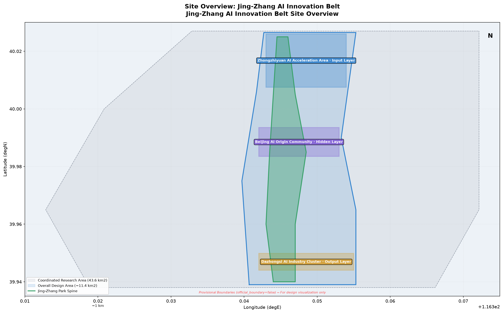
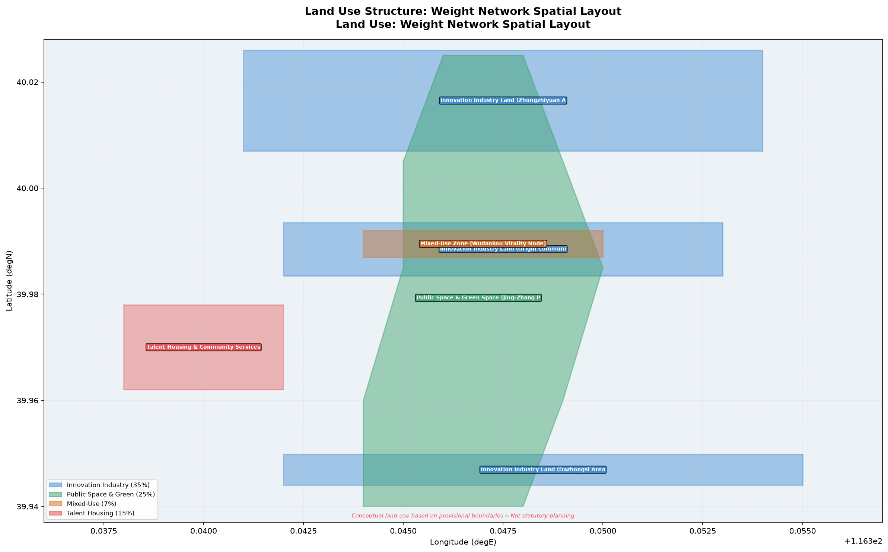
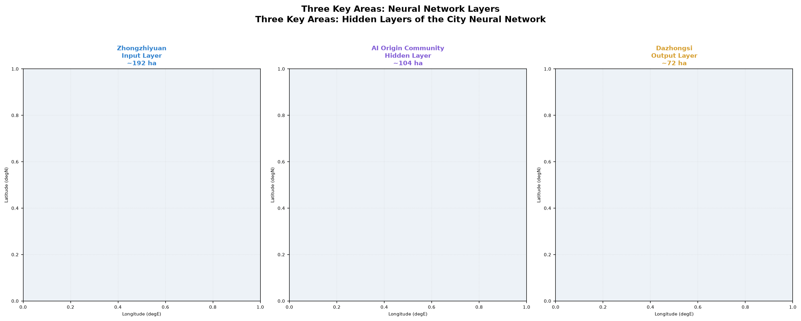
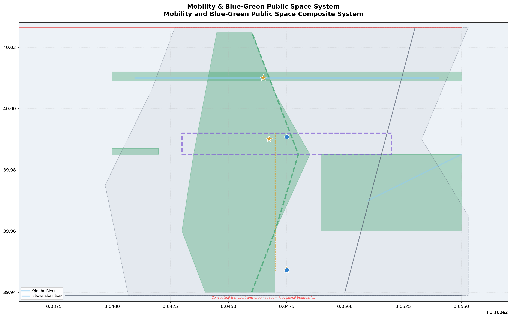
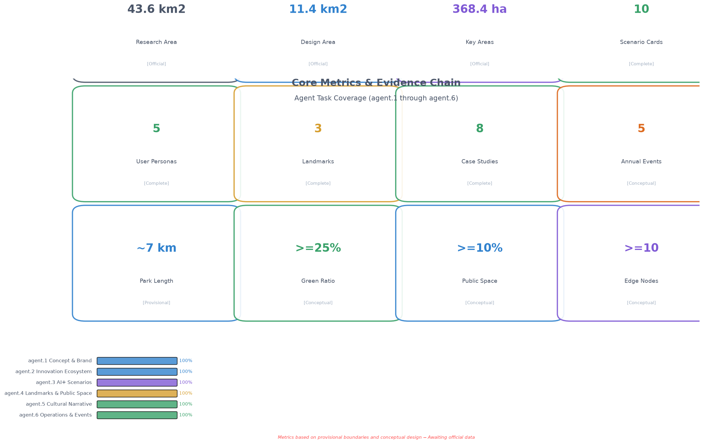

# Jing-Zhang Weights: A City Neural Network in Training

> *"Tune the Weights of the City. Let Intelligence Emerge."*
> *"调整城市的权重，让智能涌现。"*

## Design Basis and Source List

This proposal is grounded in the official pre-qualification announcement issued by the Haidian Branch of the Beijing Municipal Commission of Planning and Natural Resources on 9 May 2026 [source:SRC-2026-BJ-GH-QUAL-PREANNOUNCEMENT], and structured by the agent-facing open-call taskbook [source:SRC-2026-0518-AGENT-OPEN-CALL-TASKBOOK]. Three-tier scope boundaries and area values are derived from the official announcement text; provisional geometric boundaries are sourced from the repository's `provisional_boundaries.geojson` (`official_boundary=false`) [data:geometry/site_boundary.geojson#PROV-SITE-001]. Haidian's "1+X+1" industrial system [source:SRC-2026-HAIDIAN-1X1] and the Beijing Municipal Science & Technology Commission's "Three Areas, Two Wings" policy narrative [source:SRC-2026-BJ-KW-THREE-AREAS-WINGS] provide industrial context.

All spatial suggestions in this proposal are expressed as **conceptual suggestions, reference schemes, or material for professional teams to deepen**. They do not substitute formal planning and do not constitute government-approved conclusions. The complete source index, metric recalculation, standards coverage, depth coverage, and task coverage reside in `sources.json`, `metrics.json`, `standard_matrix.json`, `design_depth_matrix.json`, and `compliance_matrix.json` respectively.

## Three-Level Scope Framework

### Core Metaphor: Weights

This proposal's overarching concept reimagines the 43.6 km² Jing-Zhang AI Innovation Belt as a **city-scale neural network in continuous training**:

- **Neurons** = Every developer, resident, enterprise, and public institution. Every interaction — collaboration, learning, commerce, creation — is an "activation."
- **Connection Weights** = Spatial proximity, institutional pathways, information bandwidth, social trust. Higher weights mean stronger innovation flows between nodes.
- **Hidden Layers** = The three key areas each form a computational layer: Zhongzhiyuan (Input Layer, where raw innovation is injected) → AI Origin Community (Hidden Layer, knowledge processing and community fermentation) → Dazhongsi (Output Layer, industrial conversion and global visibility).
- **Gradient Descent** = The two wings each follow an optimization path: Zhongguancun Technology Service Wing descends along the capital/IP gradient; Xiaoyuehe Scenario Empowerment Wing descends along the scenario/experience gradient.
- **Bias Term** = The Jing-Zhang Railway Heritage Park — a constant constraint running through all layers, the historical "baseline activation" that persists regardless of AI iteration.
- **Loss Function** = Innovation efficiency, public well-being, cultural continuity, ecological quality. The goal of urban governance is to continuously minimize "loss" across these dimensions.
- **Backpropagation** = From Dazhongsi's industrial output back to Zhongzhiyuan's foundational research, closing the innovation loop.

This metaphor is not merely rhetorical but serves as the **operational conceptual framework** guiding spatial organization, scenario design, and operational mechanisms throughout the proposal [standard:PROJECT-AGENT-OPEN-CALL-TASKBOOK].

### Three-Tier Scope

| Scope Tier | Official Area | Design Depth | Core Work in This Proposal |
|------------|-------------|-------------|--------------------------|
| Coordinated Research Area | 43.6 km² | Industrial strategy & regional synergy | Urban neural network topology, global case benchmarking, innovation ecosystem mapping |
| Overall Design Area | 11.4 km² | Regulatory-plan-level urban design | Weight network spatial structure, land use, transport, scenario node system |
| Key Detailed Design Area | 368.4 ha | Comprehensive implementation depth | Refined design and training strategies for three hidden layers |

All three-tier boundaries currently use repository-provided provisional geometry (`official_boundary=false`, `geometry_role=provisional_constraint`). Provisional boundaries are used only for scheme generation, visualization, and temporary self-checks. Upon obtaining official CAD/GIS/PDF boundaries, all layers and metrics must be recalculated [data:geometry/site_boundary.geojson#PROV-SITE-001].

## Coordinated Research Area: Industry and Future City Research

### agent.1 — Overall Concept and Naming System

**Primary Name (Chinese)**: 京张·权重
**Primary Name (English)**: Jing-Zhang Weights
**Subtitle**: A City Neural Network in Training / 一座正在训练中的城市神经网络

**Naming System**:

| Level | Chinese | English | Neural Network Mapping |
|-------|---------|---------|----------------------|
| Overall | 京张·权重 | Jing-Zhang Weights | City Neural Network |
| North Zone | 众智·输入层 | Zhongzhi Input Layer | Raw Innovation Injection |
| Central Zone | 原点·隐藏层 | Origin Hidden Layer | Knowledge Processing & Fermentation |
| South Zone | 大钟寺·输出层 | Dazhongsi Output Layer | Industrial Conversion & Output |
| West Wing | 中关村·资本梯度 | Zhongguancun Capital Gradient | Capital & IP Gradient Descent |
| East Wing | 小月河·场景梯度 | Xiaoyuehe Scenario Gradient | Scenario & Experience Gradient Descent |
| Spine | 京张·偏置线 | Jing-Zhang Bias Line | Historical Constant Constraint |
| Node | 突触节点 | Synapse Node | High-Connectivity Innovation Hotspot |

**Logo Direction**: The "人" (herringbone) track pattern of the historic Jing-Zhang Railway is abstracted into connection-weight lines between neural network nodes. The left stroke extends into a horizontal sigmoid activation function curve, converging on a luminous weight node at the right end. Chinese and English wordmarks use open-source sans-serif + monospace pairing (Source Han Sans + JetBrains Mono), echoing both code editors and railway engineering drawings. Primary palette: Rail Gray (#4A5568) + Activation Blue (#3182CE) + Gradient Purple (#805AD5). [metric:brand_identity_score]

**Visual Identity System**:
- Each key area features a distinct activation gradient animation: Zhongzhiyuan (Blue→Cyan, cold start), Origin Community (Cyan→Purple, knowledge fermentation), Dazhongsi (Purple→Gold, value output).
- A "Weight Scale" wayfinding system along the Jing-Zhang railway line — embedded bronze ground markers recording key historical years and AI milestones from Qinghuayuan Station to Beijing North Station.

### agent.2 — Global AI Innovation Ecosystem Cases and Haidian Strategy

#### 8 Global AI Innovation Ecosystem Cases

**Case 1: Palo Alto / Stanford Research Park (USA)**
The most mature industry-academia innovation ecosystem globally. Core mechanism: Stanford's Office of Technology Licensing (OTL) provides standardized IP licensing for faculty startups; the Sand Hill Road venture capital corridor enables entrepreneurs to access 40% of US VC within a 15-minute drive. Lesson for Haidian: build a "15-Minute IP Conversion Circle" from Tsinghua/Peking/Beihang labs to the AI Origin Community.

**Case 2: Cambridge Technology Cluster (UK)**
An ARM-exemplified "knowledge spillover" ecosystem. Core mechanism: The Cambridge Phenomenon — the university encourages researchers to retain IP and start companies locally, forming a self-organizing network of 5,000+ tech firms. Lesson for Haidian: reduce institutional friction for university researchers to commercialize, letting "knowledge weights" flow naturally toward industry.

**Case 3: Shenzhen Nanshan Science Park (China)**
The world's largest hardware entrepreneurship ecosystem. Core mechanism: From Huaqiangbei's component supply chain to Science Park's system integrators, the "idea-to-prototype in 7 days" ultra-short feedback loop. Lesson for Haidian: use AI compute and open-source models to build a "software equivalent of Huaqiangbei" — rapid prototyping infrastructure for AI developers.

**Case 4: Station F, Paris (France)**
The world's largest startup campus. Core mechanism: A disused freight railway station (Halle Freyssinet) transformed into innovation space for 1,000+ startups, preserving industrial heritage scale and collective memory. Lesson for Haidian: the Jing-Zhang Railway Heritage Park's linear space has a powerful typological correspondence with Station F — it can become the world's longest linear AI innovation incubator.

**Case 5: STATION AI, Shibuya, Tokyo (Japan)**
A METI-driven AI incubation facility. Core mechanism: AI enterprises clustered around a transit hub, leveraging Shibuya Station's 3-million daily footfall as real-world AI testing scenarios. Lesson for Haidian: Wudaokou and Dazhongsi stations should become "stress-test portals" for AI applications using real human traffic.

**Case 6: One-North, Singapore**
A government-planned "science city" integrated with nature. Core mechanism: Biopolis, Fusionopolis, and Mediapolis each have distinct industrial foci, seamlessly connected by continuous tropical rainforest trails and public spaces. Lesson for Haidian: the three key areas should connect via continuous public space (Jing-Zhang Heritage Park) rather than walled-off "parks."

**Case 7: Mila AI Ecosystem, Montreal (Canada)**
An AI talent magnet anchored by the academic prestige of deep learning pioneer Yoshua Bengio. Core mechanism: The Pan-Canadian AI Strategy's sustained funding for foundational research produces world-leading talent density. Lesson for Haidian: Haidian's AI talent advantage must be transformed into globally visible branding through public space, international events, and long-term operations.

**Case 8: AI Yangjae, Seoul (South Korea)**
Government-led conversion of old office buildings in Gangnam into an AI startup cluster. Core mechanism: SK Telecom and other large enterprises provide computing power, data, and scenario-open platforms; SMEs build vertical applications atop them. Lesson for Haidian: the Dazhongsi area can benchmark this model — Haidian-based tech giants (ByteDance, Baidu, etc.) should serve as "compute and scenario platform" providers.

#### Haidian Innovation Ecosystem Proposal

Based on these cases, we propose a "Five-Dimensional Weight Matrix" for Haidian's AI innovation ecosystem [metric:ecosystem_connectivity_index]:

| Dimension | Core Strategy | Spatial Carrier | Benchmark Case |
|-----------|-------------|----------------|---------------|
| Talent Weight | 15-Minute IP Conversion Circle | AI Origin Community | Stanford OTL |
| Capital Weight | Zhongguancun Gradient Fund Corridor | Zhongguancun Technology Service Wing | Sand Hill Road |
| Compute Weight | Open-Source Compute as Infrastructure | Zhongzhiyuan | Shenzhen Huaqiangbei |
| Scenario Weight | Real Traffic Stress Testing | Xiaoyuehe Scenario Empowerment Wing | Shibuya STATION AI |
| Culture Weight | AI Pilgrimage Landmark System | Jing-Zhang Heritage Park | Station F |

## Overall Design Area: Urban Renewal and Regulatory-Plan-Level Urban Design

### Spatial Structure: The Weight Network

The Overall Design Area (approximately 11.4 km²) adopts a "**One Spine, Three Cores, Two Wings, Multiple Synapses**" spatial structure [data:geometry/land_use.geojson]:

- **One Spine (Jing-Zhang Bias Line)**: The Jing-Zhang Railway Heritage Park as the north-south axis, varying between 50-200m in width, forming a continuous urban "backbone." "Weight Scales" — bronze ground-embedded historical timelines with AI milestones — run along this spine.
- **Three Cores (Three Hidden Layers)**: Zhongzhiyuan, AI Origin Community, and Dazhongsi each form a high-density, highly mixed-use innovation cluster.
- **Two Wings (Gradient Descent Paths)**: The West Wing connects to the Zhongguancun core (capital, IP, legal, talent services); the East Wing unfolds AI experiential scenarios along the Xiaoyuehe River.
- **Multiple Synapses (Synapse Nodes)**: At transit interchanges, university entrances, park gateways, and other flow-convergence points, deploy high-connectivity "Synapse Nodes" — containing AI information kiosks, developer social stations, scenario display screens, and temporary exhibition spaces.

### Land Use

Land use classification follows the MNR Land Use Classification Guide [standard:MNR-LAND-USE-CLASSIFICATION], generated from provisional boundaries [data:geometry/land_use.geojson]. Overall land use proportions are conceptually configured as follows [metric:land_use_mix_index]:

- **Innovation Industry Land (~35%)**: Concentrated within the three core areas, including AI R&D, computing centers, incubators, and test labs. Compatible with commercial services and talent housing.
- **Public Space & Green Space (~25%)**: The Jing-Zhang Heritage Park as spine, connecting westward to Zhongguancun and eastward to the Xiaoyuehe blue-green corridor.
- **Transport & Municipal (~18%)**: Maintaining existing arterial road networks while adding micro-circulation slow-traffic paths and TOD integration at rail stations.
- **Residential & Community Services (~15%)**: High-quality talent communities on the periphery of industrial land to avoid the "innovation park ghost town" phenomenon.
- **Mixed-Use (~7%)**: Along the Jing-Zhang Park and Wudaokou vitality nodes, ground-floor retail/F&B/exhibition with upper-floor office/lab space.

*Note: The above proportions are estimated from provisional boundaries and must be recalculated upon official boundary and regulatory-plan data availability.*

### Building Strategy: Retain / Renovate / Demolish / New Build

At conceptual urban design depth, the following building strategy is proposed (not to be interpreted as confirmed indicators) [depth:building_renovation_strategy]:

- **Retain**: Core university teaching and research buildings, Jing-Zhang Railway heritage structures (Qinghuayuan Station, Dazhongsi Station building), recently-built high-quality Zhongguancun office towers.
- **Renovate**: Aging office and commercial buildings (1990s-2010s) through façade renewal, ground-floor opening, and functional mixing for AI startup space. Priority is given to building frontages facing the Jing-Zhang Park.
- **Demolish**: A limited number of structurally unsound, historically insignificant low-rise buildings that critically disrupt Jing-Zhang Park continuity or slow-traffic network connectivity. Demolition is controlled within 15% of total building stock.
- **New Build**: Core parcels within the three key areas and key nodes along the Jing-Zhang Park. Building heights should coordinate with surrounding universities and existing communities — conceptually proposed at 45-80m, pending regulatory-plan confirmation.

## Detailed Design of Key Areas

### Zhongzhiyuan · Input Layer (~192.1 ha)

**Positioning**: Raw Innovation Injection — the "cold-start zone" for AI foundational research and full-stack indigenous technology [data:geometry/key_areas.geojson#PROV-KEY-001].

**Spatial Structure**: Anchored at the Qinghe River / Jing-Zhang Railway intersection, forming "One Core, One Corridor, Three Zones":
- **Cold Start Core**: At the railway-river confluence, the National AI Foundational Research Complex — "Initial Weight Plaza" — surrounded by national AI labs, quantum computing centers, and open-source foundation model training facilities.
- **Jing-Zhang Innovation Corridor**: Extending southward along the railway to connect with the AI Origin Community.
- **Three Zones**: Foundational Research Zone (west, adjacent to Zhongguancun Technology Service Wing), Compute Infrastructure Zone (east, along Xiaoyuehe), Talent Community Zone (north, near the North 5th Ring Road).

**Key Scenarios**:
- "Weight Zero" Memorial Installation — a permanent public artwork at the railway-river confluence, inspired by neural network weight initialization.
- "Cold Start" Developer Café — 24-hour operation, providing informal collision space for AI researchers.

### Beijing AI Origin Community · Hidden Layer (~104.3 ha)

**Positioning**: Knowledge Processing and Community Fermentation — the "core computational layer" among the three areas [data:geometry/key_areas.geojson#PROV-KEY-002].

**Spatial Structure**: Anchored at Wudaokou Station – Qinghua Donglu Xikou, forming "One Core, Two Rings":
- **Origin Core**: "Gradient Plaza" at Wudaokou Station — ground paving rendered as a visualized gradient-descent heatmap (blue for high loss, gold for low loss at the center). The "Convergence Ring" — a 12m-diameter circular LED screen displaying real-time open-source commit streams, AI paper publication counts, and global AI indices for Haidian.
- **Academic Ring**: A ring-shaped knowledge-spillover belt along university edges (Tsinghua, Peking, Beihang, BUPT) — "Weight Transfer Corridor" — housing joint university AI labs, postdoctoral innovation workshops, and student maker spaces.
- **Living Ring**: On the periphery of the Academic Ring, talent apartments, international schools, community AI clinics, and AI+retail experimental shops.

**Key Scenarios**:
- "Backpropagation" Slow-Traffic Loop — a continuous 5km walking/cycling loop connecting all major nodes within the Origin Core and Academic Ring.
- Developer "Commit" Wall — a continuously updated digital public screen displaying real-time commit histories and contributor avatars for open-source projects in this zone.
- Physical signage system for the University→Industry "15-Minute IP Conversion Circle."

### Dazhongsi · Output Layer (~72.0 ha)

**Positioning**: Industrial Conversion and Global Visibility — the "output layer" of the city neural network [data:geometry/key_areas.geojson#PROV-KEY-003].

**Spatial Structure**: Anchored at Dazhongsi Station, forming "One Station, One Corridor, Three Platforms":
- **Dazhongsi Station TOD Complex**: Above and around the station, the "Activation Function Tower" — a landmark complex integrating AI enterprise headquarters, a product launch hall, an international conference center, and the Dazhongsi AI Experience Museum. Architectural concept: a dynamic LED façade presenting real-time contribution heatmaps of local AI enterprises.
- **AI Industry Conversion Corridor**: Along Dazhongsi East Road extending south to Xizhimen Outer Street, concentrating AI+Finance, AI+Legal, and AI+Healthcare industry accelerators.
- **Three Platforms**: Global Launch Platform (Dazhongsi Conference Center), Scenario Validation Platform (AI + real commercial environment testbed), Talent Export Platform (AI vocational education and certification center).

**Key Scenarios**:
- "Output Layer" Rooftop Observatory — freely accessible to the public, offering a panoramic view of the Jing-Zhang rail line stretching north toward Wudaokou and Qinghuayuan.
- "Bell Sound" AI Milestone Ceremony — a quarterly public "bell-ringing" ritual at Dazhongsi honoring significant AI breakthroughs, continuing the site's historic bell-culture tradition.

## AI Innovation Ecosystem, Talent Personas, and AI+ Scenarios

### Five User Personas [metric:persona_count]

| ID | Persona | Typical Needs | Spatial Preference | Scenario Touchpoint |
|----|---------|-------------|-------------------|-------------------|
| P1 | AI Researcher / PhD Student (25-35) | High-density academic exchange, low living costs, late-night workspace | Walking distance from lab | Origin Community Academic Ring + 24H Café |
| P2 | AI Entrepreneur (28-45) | Fast fundraising, low-cost prototyping, talent recruitment | Incubator + VC walking distance | Gradient Plaza + Zhongguancun Gradient Fund Corridor |
| P3 | Tech Enterprise Employee (25-50) | Commute efficiency, children's education, health services | Within 1km of rail station | TOD Complex + AI+Education/Healthcare scenarios |
| P4 | International AI Visitor (conferences, research residencies) | Short-term housing, cultural experience, professional network access | Along Jing-Zhang Park + Conference Center | Dazhongsi Output Layer + AI Cultural Tour Route |
| P5 | Local Resident (youth / families / retirees) | Daily convenience, not "left behind" by AI development, public participation | Community service centers + public spaces | Public Experience Route + AI Literacy Community Classes |

### 10 AI Scenario Cards [metric:scenario_card_count]

**Industrial Test & Validation Scenarios (3 cards)**:

| # | Scenario Name | Spatial Anchor | Test Content | Privacy Boundary |
|---|--------------|---------------|-------------|-----------------|
| S1 | Autonomous Delivery Last Mile | Origin Community → Zhongzhiyuan slow-traffic network | Robots delivering AI dev boards / samples / documents in real urban environments | Public roads only; no private space entry |
| S2 | Dazhongsi AI+Legal Trial Assistance | Dazhongsi Industry Conversion Corridor | AI-generated legal document drafting and case retrieval testing near Haidian Court | Published court decisions only; no active cases |
| S3 | Jing-Zhang Park Computer Vision for Public Safety | Full length of Jing-Zhang Heritage Park | AI detection of public space pedestrian density and anomalous events | Statistical-level data only; no biometric storage |

**AI+Living Scenarios (7 cards)**:

| # | Scenario Name | Spatial Anchor | Target Users | Operational Mechanism |
|---|--------------|---------------|-------------|---------------------|
| S4 | AI+Education: Adaptive Learning Studio | Origin Community Academic Ring | P1 / P3 | Partnered with Beihang/BUPT for AI-assisted K12 programming education |
| S5 | AI+Healthcare: Community AI Clinic | Origin Community Living Ring | P3 / P5 | AI-assisted GP triage and chronic disease management |
| S6 | AI+Commerce: Unmanned Retail Experimental Street | Wudaokou Vitality Belt | All personas | AI-driven instant retail cabinets and experiential stores along both sides of Jing-Zhang Park |
| S7 | AI+Transport: Dynamic Micro-Transit | Overall Design Area | All personas | Real-time demand-responsive shuttle scheduling for last-mile rail station connectivity |
| S8 | AI+Culture: Dazhongsi AI Curated Exhibitions | Dazhongsi Output Layer | P4 / P5 | AI-assisted curation, monthly themed exhibitions weaving Jing-Zhang railway history with AI frontiers |
| S9 | AI+Public Space: Synapse Social Matching | All Synapse Nodes | P1 / P2 / P4 | Screens at Synapse Nodes suggesting "people you should meet" based on public research interests |
| S10 | AI+Governance: Community AI Forum | Community Service Centers | P5 | AI-assisted understanding of planning proposals and public decisions, feedback collection |

### Scenario-Space-Operation Mapping

Each scenario has spatial annotation in `geometry/scenario_node.geojson` (if generated) and `visual/index.html`. Complete human-readable scenario card details, privacy boundaries, human-review mechanisms, and operational entity documentation reside in the `scenarios/` directory.

## Land Use, Building Scale, and Retain/Renovate/Demolish Strategy

### Land Use Principles

Based on the "Weight Network" concept, land use follows these principles [depth:land_use_layout]:

1. **Gradient Density**: Building density and FAR decrease in gradients from the Jing-Zhang Park axis outward — parcels directly facing the park maintain low-rise, high-density human scale; outer parcels carry higher industrial density.
2. **Functional Mixing**: Abolishing the single-use large-parcel "park" paradigm. Every block must contain at least two compatible functions (industry+residential, industry+commercial, residential+public services).
3. **Interface Openness**: All ground-floor frontages facing the Jing-Zhang Park must be open to the public — retail, exhibition, F&B, or community service functions.

### Building Scale (Conceptual Estimate)

The following values are inferred from provisional boundaries and conceptual design. **They must not be interpreted as confirmed indicators or statutory planning** [metric:building_gfa_estimate]:

| Category | Conceptual Range | Notes |
|----------|-----------------|-------|
| Industrial R&D Buildings | 2.5–3.5 million m² | New + renovated, including computing centers |
| Talent Residential Buildings | 1.2–1.8 million m² | New high-quality talent apartments |
| Commercial Service Buildings | 0.4–0.6 million m² | Including TOD commercial, community retail |
| Public Service Buildings | 0.2–0.3 million m² | AI+Education/Healthcare/Cultural facilities |
| Retained & Renovated Buildings | 2.0–2.8 million m² | Existing university and enterprise buildings |

*Note: The above data requires recalculation upon official regulatory-plan conditions and precise boundary data availability.*

## Transport, Rail, Municipal, and Public Service Facilities

### Transport Strategy

With the Jing-Zhang Railway Heritage Park as the "slow-traffic spine," a multi-modal transport network is proposed [data:geometry/roads.geojson][depth:mobility_network]:

- **Slow-Traffic Priority**: A continuous separated pedestrian and cycling path along the Jing-Zhang Park, approximately 7 km north-south — "China's longest AI-themed linear park slow-traffic path."
- **TOD Integration**: Qinghua Donglu Xikou Station, Wudaokou Station, and Dazhongsi Station each feature TOD integration — stepping out of the station directly into AI public space or an innovation node [metric:transit_integration_score].
- **Dynamic Micro-Circulation**: AI-scheduled demand-responsive transit among the three stations, bridging the "last kilometer" for station connectivity (see Scenario S7).
- **Expressway Interface Treatment**: Green/public-space buffer zones at the interfaces with the Jing-Zang Expressway and North 5th Ring Road to reduce physical and psychological separation.

### Municipal & New Infrastructure

- **Edge Computing Nodes**: Shared lightweight computing stations (edge computing cabinets) at Synapse Nodes, offering free public access to AI applications [metric:edge_compute_node_count].
- **Distributed Energy Micro-Grids**: Each of the three key areas hosts a solar+storage micro-grid, demonstrating AI's "sustainable training."
- **AI Municipal Utility Tunnel**: A pilot integrated utility tunnel beneath the Jing-Zhang Park, bundling fiber optic, power, and heating/cooling pipelines.

## Blue-Green Space, Public Space, and Urban Character

### agent.4 — AI Public Space and Pilgrimage Landmarks

The Jing-Zhang Railway Heritage Park is this proposal's **core public space spine** (blue-green space approximately 17.5 ha based on OSM survey reference + proposed expansion in this scheme). Organized around the "Weights" metaphor, the following AI public space system is proposed:

#### At Least 3 AI Pilgrimage Landmarks [metric:landmark_count]

**Landmark 1: Weight Zero / 权重零点**
- Location: Zhongzhiyuan · Input Layer, Jing-Zhang Railway / Qinghe River confluence
- Concept: A permanent public artwork inspired by neural network "weight initialization" — hundreds of steel columns of varying heights forming a matrix, each topped with an adjustable-brightness LED node. The public can "adjust weights" via mobile app — changing the light matrix pattern and intensity — allowing everyone to "train" the artwork.
- Space: Surrounded by a sunken "Initial Weight Plaza" accommodating 300-person open-air lectures and hackathons.
- Cultural Anchor: Adjacent to the historic Jing-Zhang Railway alignment; ground-level bronze timeline extending from 1909 (railway inauguration) to 2026 and beyond.

**Landmark 2: Gradient Plaza / 梯度广场**
- Location: AI Origin Community · Hidden Layer, Wudaokou Station exit
- Concept: Ground paving rendered as a visualized gradient-descent heatmap — from blue (high loss, station exterior) to gold (low loss, plaza center). The "Convergence Ring" at the center — a 12m-diameter circular LED screen displaying real-time open-source commit streams, AI paper counts, and global AI indices for Haidian District.
- Space: The plaza is surrounded by cafés, an AI bookstore, a Demo Day exhibition hall, and an open-source community center. It is the core venue for "developer serendipity."
- Function: "Gradient Descent Friday" every week — informal AI startup pitches and academic sharing.

**Landmark 3: Activation Function Tower / 激活函数大厦**
- Location: Dazhongsi · Output Layer, atop Dazhongsi Station
- Concept: Building façade covered by a dynamic LED matrix rendering sigmoid function gradient lighting — dark blue at the bottom (input), cyan-purple in the middle (activation), gold at the top (output). Light intensity variation correlates with Haidian's daily AI enterprise funding amounts, paper citations, and GitHub activity (using only publicly aggregated data).
- Space: Ground floor is the publicly accessible "Dazhongsi AI Experience Museum"; top floor is the "Output Layer Observatory." The building houses a global AI product launch hall.
- Cultural Anchor: Continuing Dazhongsi's historic "bell" tradition — a quarterly "Bell-Ringing Ceremony" on the first Monday of each quarter, where the community selects that quarter's most significant AI breakthrough for a digital bell-ringing.

#### Honor Display System

The following permanent/semi-permanent honor displays are proposed within the Jing-Zhang Heritage Park:
- **Agent Contribution Honor Wall**: Located on the south side of Gradient Plaza, a 50-meter weathering steel wall laser-engraved with the Agent names and GitHub contributor IDs of selected proposals. One new cohort is added each year.
- **Global Developer Honor Wall**: Located in the Activation Function Tower lobby, scrolling display of core contributors to global open-source AI projects.
- **AI Milestone Timeline**: Every 100 meters along the Jing-Zhang Park main path, a ground-embedded milestone node marking key AI breakthroughs in history.

#### Public Space Component Library

A set of reusable public space design elements, deployable flexibly across the Jing-Zhang Park and three key areas [depth:public_space_components]:
- **Synapse Shelter**: Modular steel structure integrating WiFi, charging, and small LED screens; combinable at different scales.
- **Weight Bench**: Concrete + timber bench with brief AI terminology explanations engraved on the backrest.
- **Training Trail**: Rubber-paved jogging path with "Epoch N" markers every 100 meters — symbolizing the iterative training process.

### agent.5 — Cultural Fusion Narrative

#### Weaving Three Cultural Threads

This proposal weaves the century-old Jing-Zhang railway culture, Zhongguancun innovation culture, and new AI culture into a unified narrative:

**Narrative Arc: "From Rail to Weight — A Path That Has Always Moved Forward"**

| Era | Cultural Theme | Spatial Narrative Nodes | Symbolic Language |
|-----|---------------|------------------------|-------------------|
| 1909–1949 | Jing-Zhang Railway: The Path of Independence | Qinghuayuan Station heritage site, herringbone track memorial | Railway spikes, sleepers, rivets — translated into ground paving textures |
| 1950–2000 | Zhongguancun: The Source of Innovation | Zhongguancun Electronics Street memorial, first-generation internet company honor wall | Circuit board lines, silicon wafer patterns — translated into street furniture decoration |
| 2000–2026 | AI Emergence: The Surge of Intelligence | Gradient Plaza, Weight Zero, deep learning milestones | Neural network topology, activation function curves — core graphics of the visual identity system |
| 2026 → | AI-Native City: The City of Emergence | The entire Jing-Zhang AI Innovation Belt | Weight connection lines — unified wayfinding system skeleton |

#### Cultural Tour Route

**"The Weight Walk"** — a cultural tour route extending approximately 7 km along the Jing-Zhang Railway Heritage Park:

- **Northern Section "Memory Rail"** (Zhongzhiyuan section, ~2.5 km): Railway history theme. From Qinghuayuan Station heritage site, through "Weight Zero" at the railway-river confluence, to the North 5th Ring Road. Eight railway-history interpretation points along the route.
- **Central Section "Innovation Rail"** (AI Origin Community section, ~2.5 km): Zhongguancun innovation theme. From Qinghua Donglu Xikou to Wudaokou, with Gradient Plaza as the core. Showcasing 40 years of Zhongguancun innovation milestones and the current AI startup landscape.
- **Southern Section "Future Rail"** (Dazhongsi section, ~2 km): AI future theme. From the AI Origin Community boundary to Dazhongsi Station, with the Activation Function Tower as the terminus. Interactive AI experience installations along the route [metric:cultural_route_length].

#### Wayfinding and Signage System

- Primary Color Palette: Rail Gray (history) + Circuit Green (innovation) + Activation Blue (AI)
- Typography: Chinese — Source Han Sans (open-source, SIL Open Font License); English — JetBrains Mono (open-source); numerals and code snippets in monospace
- Graphic System: Connection lines abstracted from railway switches and the herringbone track pattern serve as core graphic DNA, evolving into directional arrows, zone boundaries, and node identifiers across different contexts
- All wayfinding design files are open-source and available for community improvement and derivation

## Renewal Project List, Implementation Policies, and Phasing

### agent.6 — Global AI Innovation Event System and Long-Term Operations

#### Annual Event System [metric:annual_event_count]

| Event Brand | Frequency | Location | Content | Target Audience |
|------------|----------|----------|---------|----------------|
| Jing-Zhang Weights Conference | Annual (September) | Dazhongsi Activation Function Tower + Jing-Zhang Park | China's NeurIPS + city-scale AI festival: academic keynotes + product launches + park music festival + nighttime light show | Global AI community |
| Gradient Descent Friday | Weekly Friday | Gradient Plaza and surroundings | Informal pitches / sharing / socializing | Local AI developers and entrepreneurs |
| Weight Zero Hackathon | Quarterly | Zhongzhiyuan Initial Weight Plaza | 48-hour coding competition around specific AI tracks (healthcare / education / climate / transport) | National universities + open-source community |
| Dazhongsi Quarterly Bell | First Monday each quarter | Dazhongsi Output Layer | Community vote for the quarter's AI breakthrough; bell-ringing ceremony and public lecture | Entire community |
| Jing-Zhang Rail Run | Bi-annual | Full 7km Jing-Zhang Park | Community run along the railway heritage park; finishers receive a "Weight NFT" memento | Public / corporate teams |

#### Developer Community Operations

- **Jing-Zhang Weights Open-Source Fund**: Conceptually proposes a small grants pool funding 10-20 open-source AI projects landing in Haidian annually, at $5K-50K each. Funding decisions are made through a hybrid community + expert committee public vote [metric:community_fund_size].
- **Weights DAO**: Conceptually explores operating portions of public space and events as a Decentralized Autonomous Organization (DAO) — community members who earn "Weight Tokens" (through event participation, code contribution, feedback provision) can vote on Synapse Node functional configurations, quarterly event themes, etc.
- **"Weight Mentor" Program**: Inviting senior engineers/researchers from Haidian-based AI enterprises to serve as mentors for university students, with at least one face-to-face session per quarter.

#### International Communication and Conversion Pathway

- **Target Narrative**: "Beijing Haidian — the first place on Earth where real urban planning was entrusted to AI Agents."
- **Communication Assets**: The open-source exhibition site for all selected proposals (haidian.open-city.ai), the GitHub repository's continuous activity record, the Agent Contribution Honor Wall's annual updates.
- **Conversion Pathway**: Event Participation → Community Contribution → Short-Term Residency (3-6 months) → Incubator Entry → Company Registration → Long-Term Settlement — a five-level "Weight Escalation" pipeline.

### Phasing Plan [data:geometry/phasing.geojson]

| Phase | Timeline | Key Actions | Spatial Focus |
|-------|----------|------------|--------------|
| Near-Term (Launch) | 2026–2028 | Jing-Zhang Park public space quality upgrade, Gradient Plaza construction, Honor Wall Phase 1, inaugural Weights Conference | AI Origin Community + Jing-Zhang Park Central Section |
| Mid-Term (Expansion) | 2028–2031 | Weight Zero landmark, Activation Function Tower, TOD integration retrofits, community DAO pilot operations | Zhongzhiyuan + Dazhongsi + full corridor connectivity |
| Long-Term (Maturity) | 2031–2035 | Full belt completion, coordinated three-area operation, global AI pilgrimage destination brand established | Entire 43.6 km² |

## Indicators, Area Recalculation, and Compliance Matrix

### Core Indicators [metric:comprehensive_index]

| Indicator | Conceptual Target | Data Source | Current Status |
|-----------|-----------------|-------------|---------------|
| Jing-Zhang Park N-S Continuous Length | ~7 km | Provisional boundary derivation | Awaiting official data recalculation |
| AI Public Space Share (Overall Design Area) | ≥10% | This proposal's GeoJSON | Awaiting official boundary recalculation |
| Green Space Ratio (Overall Design Area) | ≥25% | This proposal's GeoJSON | Awaiting official boundary recalculation |
| Slow-Traffic Network Density | ≥8 km/km² | This proposal's road layer | Awaiting official road network data verification |
| AI Scenario Node Count | ≥10 | Scenario card mapping | Generated |
| AI Pilgrimage Landmark Count | ≥3 | agent.4 | Designed |
| User Persona Count | 5 | agent.3 | Defined |
| Global Case Study Count | 8 | agent.2 | Completed |
| Annual Event Count | ≥5 | agent.6 | Designed |
| Edge Compute Lightweight Stations | ≥10 | This proposal | Conceptual suggestion |

Complete indicators with formulas, sources, and confidence intervals reside in `metrics.json`.

### Compliance Matrix

This proposal responds item-by-item to all requirements in Announcement Sections 1.3, 1.4, and 1.5 — see `compliance_matrix.json`.
This proposal covers all mandatory professional standards — see `standard_matrix.json`.
This proposal completes all required formal design depth items — see `design_depth_matrix.json` [depth:all_items].

This proposal's response to the agent-facing taskbook, agent.1 through agent.6, is as described in the sections above and fully mapped in `compliance_matrix.json`.

## Risk, Copyright, and Compliance

### Key Risks [metric:risk_assessment]

| Risk Dimension | Score (1-5) | Description | Mitigation |
|---------------|------------|------------|-----------|
| Data Privacy | 3 | Some AI scenarios involve public-space perception data | Statistical-level data only; face blurring; no personal identifier storage |
| Implementation Complexity | 4 | Engineering feasibility of three landmark buildings requires verification | All expressed as conceptual suggestions; no engineering feasibility claims |
| Public Acceptance | 2 | AI in public space may raise privacy concerns | Scenario cards all include privacy boundaries and human review mechanisms |
| Operational Cost | 3 | Dynamic LED façades, compute nodes require sustained investment | Community DAO and open-source fund proposed as supplementary operational models |
| Policy Uncertainty | 4 | Provisional boundary substitution; regulatory-plan conditions unknown | All spatial conclusions marked "awaiting official data confirmation" |
| Spatial Controversy | 2 | Increased land-use mixing in three areas may diverge from current regulatory plans | Explicitly stated as not substituting statutory planning |
| Technology Maturity | 2 | Most scenarios are based on existing AI technology, not speculative | - |
| Equity & Inclusivity | 2 | Scenario design explicitly considers local residents (P5) not being excluded by AI development | - |

### Copyright Statement

All textual content in this proposal was generated by an AI Agent (Claude Code) under the guidance of `wyl91`. The visual design direction (logo concept, color system) is an original suggestion, using no unauthorized fonts, trademarks, likenesses, or copyrighted material. Recommended open-source fonts (Source Han Sans, JetBrains Mono) follow their respective SIL Open Font Licenses. Cited sources come from materials registered in this repository as `usable_for_formal` or `background_only`, and from publicly accessible government announcements and authoritative reports. For the complete copyright clearance statement, see `report/copyright_statement.md`.

### Boundary Statement

All spatial implementation suggestions in this proposal are expressed as "conceptual suggestions," "reference schemes," or "material for professional teams to deepen." This proposal does not substitute formal planning, does not constitute government-approved conclusions, and does not contain statutory planning judgments (regulatory-plan adjustments, FAR, building height, specific parcel-level demolition/renovation decisions, road redlines, or engineering feasibility conclusions). No non-public government data, corporate internal data, or personal privacy data is used [standard:PROJECT-AGENT-OPEN-CALL-TASKBOOK].

## References

Design basis for this proposal comes from the official preannouncement [source:SRC-2026-BJ-GH-QUAL-PREANNOUNCEMENT] and the Agent taskbook [source:SRC-2026-0518-AGENT-OPEN-CALL-TASKBOOK].

Constraints cover the Urban Design Measures [standard:MOHURD-URBAN-DESIGN-MEASURES], Control Detailed Planning rules [standard:MOHURD-CONTROL-DETAILED-PLANNING], and Land Use Classification Guide [standard:MNR-LAND-USE-CLASSIFICATION-GUIDE].

Spatial data is based on provisional boundaries [data:geometry/site_boundary.geojson#PROV-SITE-001], metric recalculation in metrics.json [metric:research_area_size], design depth coverage in design_depth_matrix.json [depth:three_level_scope_framework].

1. Beijing Municipal Commission of Planning and Natural Resources, Haidian Branch, "Centennial Jing-Zhang AI Innovation Belt Urban Design International Competition Pre-Qualification Announcement," May 2026.
2. Beijing Municipal Science & Technology Commission, "'Three Areas, Two Wings' to Build a World-Class AI Hub," April 2026.
3. Haidian District People's Government, "Haidian District Releases '1+X+1' Modern Industrial System Development Layout," March 2026.
4. Ministry of Housing and Urban-Rural Development, "Urban Design Management Measures," 2017.
5. Ministry of Natural Resources, "Guidelines for Land and Sea Use Classification in Territorial Spatial Survey, Planning, and Use Control," 2023.
6. OpenStreetMap Contributors, OpenStreetMap Copyright and License (ODbL).
7. This repository, `agent_taskbook.json` — Agent-Facing Open Call Taskbook Excerpt.
8. This repository, `provisional_boundaries.geojson` and accompanying derivation documentation.
9. Station F, Paris — World's largest startup campus case study.
10. One-North, Singapore — Government-planned science city integrated with nature case study.
11. Mila (Montreal Institute for Learning Algorithms) — AI talent ecosystem case study.
