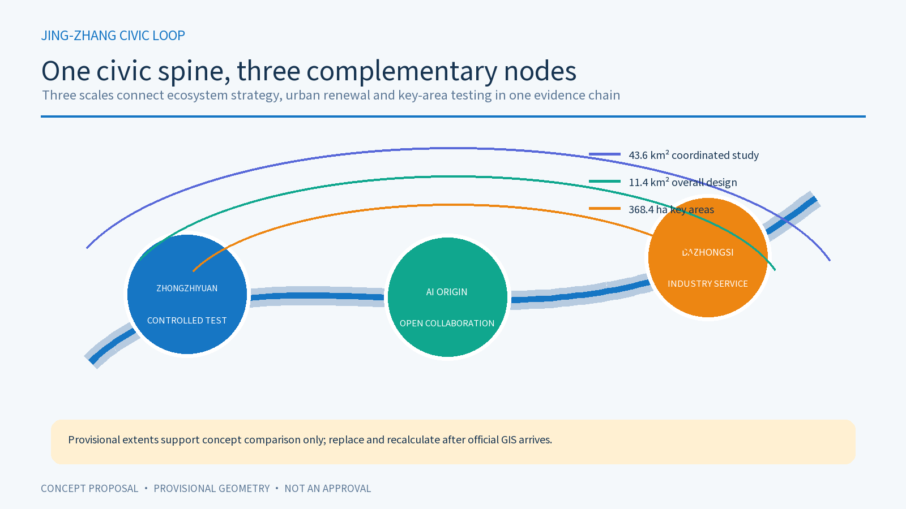
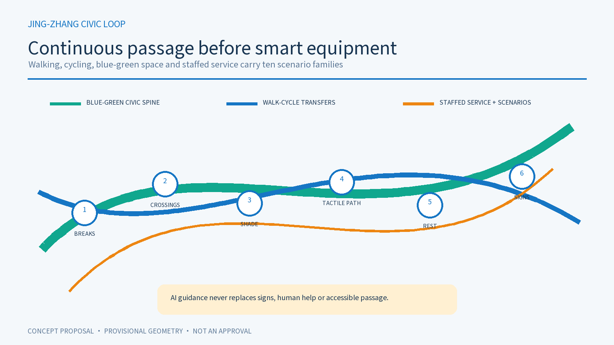
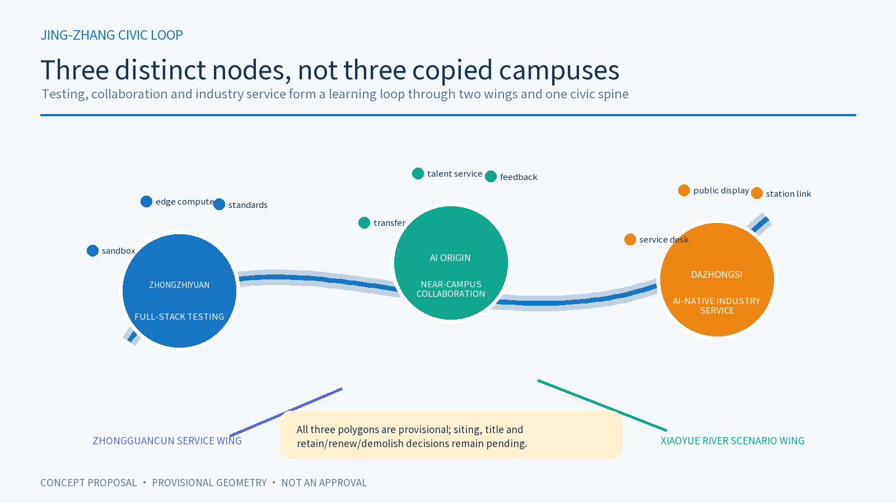
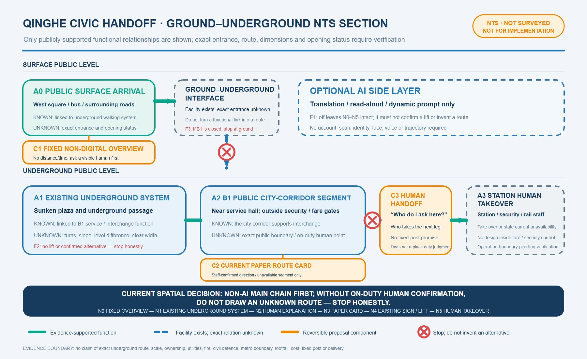
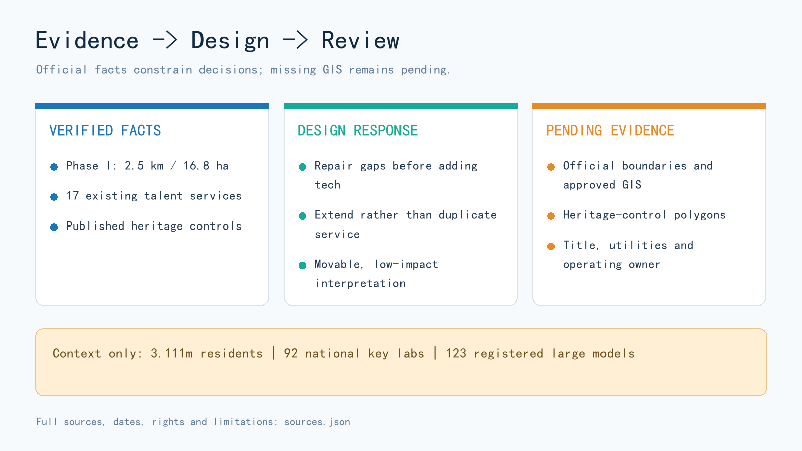

# Jing-Zhang Civic Loop: an AI innovation belt for everyday public services

## 0. One-sentence proposition

This proposal does not treat AI as a decorative “smart layer.” It organises AI as an everyday civic-service loop: continuous passage, human explanation, a no-account alternative, exit and appeal come first; explainable AI assistance comes second. Jing-Zhang Railway Heritage Park is the civic spine. Zhongzhiyuan, Beijing AI Origin Community and the Dazhongsi AI cluster are three differentiated nodes connected by blue-green walking, cycling and public-service transfers. [source:OFFICIAL-ANNOUNCEMENT] [source:AGENT-TASKBOOK] [depth:overall_spatial_structure]

This is a concept and reference scheme. It is not a statutory plan, government approval, construction permit, investment commitment, procurement plan or operating authorisation. The public package does not contain official SITE_BOUNDARY or KEY_AREA polygons, so all submitted geometry is provisional and must be replaced and recalculated when official data arrives. [data:geometry/site_boundary.geojson#SITE-001] [data:geometry/key_areas.geojson#PROV-KEY-001] [metric:site_area_sqm]

All five core figures use one coordinate system to combine package geometry with OpenStreetMap road, rail, water, park and station context. OSM helps a reviewer recognise urban fabric only; it does not define boundaries, parcels, road redlines, engineering or approvals. Provisional extents remain faint and dashed, while retrieval time, extent, licence, and query/response hashes are recorded in the source register. [source:OSM-CONTEXT-20260818]

## 1. Evidence base, limits and scope

Facts, inferences, design recommendations and items awaiting professional confirmation are kept separate. Registered official facts enter `sources.json` and `metrics.json`; design judgements remain in the narrative and matrices; missing statutory boundaries, ownership, utilities, heritage GIS and delivery responsibility remain in `assumptions.json`. Provisional geometry supports concept comparison and package checks only. [source:SITE-PACKAGE] [source:SOURCE-REGISTRY]

The proposal is based on the official call, Agent taskbook, registered public sources, the site package, provisional constraints and local snapshots of professional standards. Only registered public or rights-cleared material is treated as factual evidence; provisional geometry is never used as a statutory redline, precise-area basis or approved regulatory control. [source:SITE-PACKAGE] [source:AGENT-TASKBOOK] [standard:PROJECT-OFFICIAL-ANNOUNCEMENT]

### 1.1 New official facts and their design consequences

| Evidence type | Verified fact | Design response | Explicit non-inference |
| --- | --- | --- | --- |
| District statistics | At end-2025 Haidian reported 3.111 million residents, 92 national key laboratories and 123 registered large models; the bulletin marks 2025 figures as preliminary. [source:HD-STATS-2025] | Make services legible to residents, researchers, founders and mobile talent, with universal and human-assisted access. | Do not allocate district totals to the provisional site or use them to forecast users, floor area or returns. [metric:haidian_resident_population_2025] |
| Existing park | Phase I of Jing-Zhang Railway Heritage Park, from Qinghua East Road to Zhichun Road, was reported as 2.5 km and 16.8 ha, with heritage retention, functional stitching and public-space goals. [source:JZ-PARK-PHASE1] | Plug into and repair an existing civic spine; audit breaks, entrances, rest points and service gaps before adding technology. | Do not combine Phase I area with the provisional proposal area or label unopened segments as complete. [metric:jingzhang_park_phase1_length_m] |
| Planning procedure | A street-level regulatory-plan draft was displayed from December 2024 to January 2025. The response notice records revised or still-to-be-detailed road-junction treatment. [source:JZ-CONTROL-DRAFT-RESPONSE] | Treat major crossings as connectivity problems with alternative interfaces, not approved bridges, tunnels or redlines. | Do not treat the consultation response as the approved plan or reverse-engineer legal boundaries from webpage text. [assumption:A-CONTROL-PLAN-006] |
| Existing service | AI Origin Community has a mobile talent-service station covering 17 high-frequency items, digital Q&A and human service officers. [source:AI-ORIGIN-TALENT-SERVICE-2026] | Retain it as an existing service reference for no-account access, paper guidance, human referral and failure review. | Do not claim the 17 services as proposal outputs. Public evidence does not establish the station's exact building, floor, capacity, hours or system access. [metric:ai_origin_high_frequency_talent_services_2026] |
| Qinghe Station civic interface | An official axonometric diagram separates 2F, 1F, B1 and B2 and marks accessible lifts, underpasses and sunken squares/corridors. A current official page also states that the northern municipal underground walking passage connects buses, the west square and surrounding roads. [source:QH-STATION-MAP-2026] [source:QH-UNDERGROUND-WALK-2026] | Use the arrival—underground passage—B1 city corridor outside fare/security control as the sole small-site prototype, limited to a fixed overview, paper route card and human handoff. | The diagram is not a survey or building plan. Do not infer dimensions, levels, exact entrance, lift route, opening hours or operating boundary. [assumption:A-QH-MAP-009] |
| Heritage control | The Beijing Municipal Cultural Heritage Bureau publishes protected and construction-control zones for the former Qinghuayuan Station, including restrictions on unrelated new construction. [source:QINGHUAYUAN-HERITAGE-CONTROLS-2026] | Turn the “First Railway” landmark into a movable, low-impact interpretation route; fix no new site near the station before official heritage GIS screening. | Do not digitise textual offsets as an authoritative polygon or propose excavation, fixed equipment or structures. [assumption:A-HERITAGE-005] |
| Walking and greenways | Beijing’s programmes emphasise continuous walking/cycling rights, accessibility, shade and water-road-green integration. [source:BEIJING-SLOW-MOBILITY-2024] [source:BEIJING-GREENWAY-GUIDE-2025] | Audit six essentials first: network breaks, crossings, shade, tactile-paving conflict, stopping places and non-AI wayfinding. | Do not present citywide guidance as an approved site project or substitute it for professional road, landscape or accessibility design. |

Where an official webpage shows no explicit open-reuse licence, this package uses short factual paraphrases and links only. It copies no source photograph, map, logo or interface asset. [assumption:A-RIGHTS-008]

## Three-level scope framework

The three scales form one evidence chain rather than three unrelated maps. The coordinated study area frames the innovation ecosystem and cultural narrative; the overall urban-design area translates those judgements into the civic spine, blue-green system, mobility and renewal work; the three key areas test differentiated service interfaces. These provisional extents support concept comparison only. Any official boundary change requires coordinated recalculation of scope, land-use layers, metrics and drawings. [source:OFFICIAL-ANNOUNCEMENT] [depth:three_level_scope_framework] [data:geometry/key_areas.geojson#PROV-KEY-001]

### 1.2 Three connected scales

| Scale | Publicly described magnitude | Spatial judgement in this proposal | Evidence still required |
| --- | --- | --- | --- |
| Coordinated study area | about 43.6 km² | Link universities, firms, compute, talent, culture and civic services as an innovation network | official study boundary and current industry/transport base data |
| Overall urban-design area | about 11.4 km² | Use the heritage park as a civic spine for renewal, industry services and blue-green mobility | official boundary, ownership, utilities and road data |
| Key areas | about 368.4 ha across three areas | Differentiate safe testing, open collaboration and industry-facing service | three official polygons plus heritage and statutory controls |

The overall-design polygon remains a provisional working constraint: its package area is recalculated only to keep dependent layers internally consistent, not to assert a precise official boundary. [data:geometry/site_boundary.geojson#SITE-001] [metric:site_area_sqm] [depth:three_level_scope_framework]

## 2. Overall concept, naming and identity

“Jing-Zhang” keeps the memory of railway engineering and regional connection. “Civic” centres public value. “Loop” requires every service to have an entrance, alternative path, human handoff, stop condition and feedback route. The spatial identity is one civic spine, three nodes, two collaborative wings and multiple small scenarios. The visual identity is a line that can return to its origin and three open nodes, using deep blue, cyan-green, warm orange and paper white. It uses no third-party logo, portrait or unauthorised railway imagery. [source:AGENT-TASKBOOK]

The three positionings are a century-old Jing-Zhang cultural belt, an urban AI living-experience belt and an AI-integrated innovation belt. The five functions are full-stack independent innovation, a global AI ecosystem, AI+ scenario enablement, an AI-enabled liveable city and globally relevant AI governance. AI Origin Community leads open collaboration; Zhongzhiyuan leads independent innovation and controlled testing; Dazhongsi provides industry-facing service and public explanation; the two wings connect science services and Xiaoyue River everyday scenarios.

## Core concept and original mechanisms

The original proposition is not another smart-equipment corridor but a **reversible civic-service loop**. AI enters only after an ordinary service baseline can complete the task independently, and every scenario has a visible boundary, human handoff, stop, appeal, withdrawal and restoration path. Three linked mechanisms make the concept operational. First, a **baseline mechanism** combines paper, staff, offline service and optional AI so that an account, scan or model never becomes the civic-service gate. Second, the **four-state mechanism** - OPEN, PILOT, PAUSE and RESTORE - binds spatial components, data authority and accountable roles into one operating system. Third, a **question-evidence-reuse-handoff mechanism** lets communities, firms, universities, professionals and regional exchange nodes share failure and repair rather than copy an unverified technical pattern. The nodes are intentionally different: Zhongzhiyuan tests isolation and recovery, AI Origin tests ordinary-user accessibility, and Dazhongsi tests whether industry display can become an auditable and withdrawable civic interface. “Loop” is therefore a name, spatial network, visual symbol, governance model and planning innovation that can be reviewed.

## 3. Coordinated study: innovation ecosystem and future city

The ecosystem is organised by capability, spatial carrier and public return—not by unverified rankings, company lists or investment claims. Its elements are research, open-source collaboration, compute and data, product and industry services, daily talent life, civic scenarios and international exchange. [standard:MOHURD-URBAN-DESIGN-MEASURES]

### 3.1 Five global cases: transferable method and non-transferable context

| Official case | Transferable method | Application here | Not imported |
| --- | --- | --- | --- |
| Punggol Digital District, Singapore | Co-locate academia, industry and community with an open digital test platform. [source:CASE-PUNGGOL-DIGITAL-DISTRICT] | Zhongzhiyuan testing requires authorisation, isolation, purpose limits and a stop path. | Sensor scale, platform governance, finance and operations. |
| Barcelona 22@ | Embed innovation, creative production, care and urban technology in a lived-in district. [source:CASE-BARCELONA-22AT] | Dazhongsi ground floors combine industry explanation with public service and accessible space. | Barcelona planning instruments, land economics, brands and quotas. |
| Amsterdam Nieuwe Meer | Combine transit, housing, work, services, knowledge institutions and digital infrastructure. [source:CASE-AMSTERDAM-NIEUWE-MEER] | Connect the three nodes by transit and walking, and treat daily services as innovation infrastructure. | Amsterdam’s local programme ratios and controls. |
| Cambridge Kendall Square / Volpe | Plan research, housing, community facilities, pedestrian links and open space together after engagement. [source:CASE-KENDALL-VOLPE-2026] | Make public space and community benefit preconditions for every test project. | Approved quantities, real-estate agreements and funding. |
| Paris-Saclay Gif-sur-Yvette | Combine research and education with housing, neighbourhood services, parks, public space and district infrastructure. [source:CASE-PARIS-SACLAY-GIF-2026] | Test each key area for research, daily life, public realm and infrastructure together. | French statutory procedures, transit schedules and delivery institutions. |

Across the cases, innovation must be usable in everyday life; testing needs governance and exit; public space, mobility and community services should be designed with research facilities. The cases do not prove equivalent institutions, budgets, data or delivery capacity in Haidian.

The proposed structure is one civic spine + three innovation nodes + two collaborative wings + ten reusable scenarios. Every service uses an evidence card recording user, purpose, data boundary, non-AI alternative, stop condition and review owner.

## 4. Overall urban design: renewal, land, buildings and infrastructure

The 1–2 km urban scale is treated as a civic-service loop, not as isolated AI compounds. Land use, buildings, roads, green space, public space and phasing layers show how space can carry service. FAR, height, setbacks, redlines, ownership, station interfaces, utilities, fire access and parking remain pending official data and professional verification. [data:geometry/land_use.geojson#LU-001] [data:geometry/roads.geojson#ROAD-001] [depth:overall_spatial_structure]

## Land use, building scale and retain/renovate/demolish strategy

### 4.1 Land use and retain/renovate/demolish logic

The land-use concept combines civic innovation, blue-green mobility, community life, industry service and retain/renew nodes. It does not create another closed campus. The submitted land-use layer covers the provisional boundary through auditable design categories, but its areas and proportions do not replace statutory planning. [data:geometry/land_use.geojson#LU-001] [standard:MNR-LAND-USE-CLASSIFICATION-GUIDE] [depth:land_use_layout]

Buildings follow “retain first, reversible retrofit, cautious new build, demolition pending evidence.” Existing structures with heritage, community or public-service value are retained first and their ground-floor accessibility improved. No demolition, new-build capacity or height conclusion is made without title, structure, heritage and statutory data. [data:geometry/buildings.geojson#BLDG-001] [depth:retain_renovate_demolish]

FAR, gross floor area, building height, setbacks, road redlines, parking provision and engineering utilities remain pending official data. Urban-design depth is used to explain spatial relationships, character guidance and the review path, not to present concept metrics as approved controls. [metric:floor_area_ratio] [standard:MOHURD-CONTROL-DETAILED-PLANNING] [depth:development_intensity_controls]

The overall spatial structure is therefore a reversible coordination framework for later professional deepening, not a parcel-level approval conclusion. [depth:overall_spatial_structure]

## Transport, rail, municipal and public-service facilities

### 4.2 Mobility and blue-green public space

Continuous passage comes first. Rail transfers, ring-road crossings, community entrances and industry-service nodes form a walking and cycling network. The first audit covers breaks, crossings, shade, tactile-paving conflict, stopping places and non-AI wayfinding. AI navigation may explain options but never replaces signs, human help or accessible passage. Parking, fire access and utility corridors require formal base data. [source:BEIJING-SLOW-MOBILITY-2024] [data:geometry/roads.geojson#ROAD-001] [depth:traffic_rail_slow_parking]

### 4.3 Municipal and digital infrastructure

The reference principle is edge-first, tiered compute, auditable public interfaces and graceful offline operation. Low-risk information uses local cache; any data exchange is purpose-limited and logged. No camera, voice collection or production-system link is proposed without site authority. Energy, fire, communications, drainage, compute and plant rooms require professional verification. [depth:municipal_new_infrastructure]

## Blue-green space, public realm and urban character

The heritage park, Xiaoyue River, community open spaces and industry edges form the everyday base of the civic-service loop. They connect walking, rest, shade, quiet wayfinding and staffed help points, while industry edges provide publicly accessible explanation and reception. Water-road-green continuity is a review criterion, and the public realm is not a “screen plaza”: it remains useful without AI. [source:BEIJING-GREENWAY-GUIDE-2025] [data:geometry/green_space.geojson#GREEN-001] [depth:blue_green_public_space]

Urban character should draw on the scale of railway engineering, open collaborative frontages, continuous ground floors and recognisable but quiet node markers. No unapproved redline, height or heritage conclusion is introduced. Green-space and public-space ratios are provisional design-layer calculations and require recalculation when official boundaries, sections, utilities, accessibility and heritage data arrive. [data:geometry/public_space.geojson#PUBLIC-001] [metric:green_ratio] [metric:public_space_ratio]

The mobility figure reads the green and public-space layers together so continuity, everyday use and professional review remain visible as one design judgement. [data:geometry/green_space.geojson#GREEN-001] [data:geometry/public_space.geojson#PUBLIC-001] [depth:blue_green_public_space]

## 5. Three key areas

### 5.1 Zhongzhiyuan: test before scaling

Zhongzhiyuan is a controlled sandbox for trustworthy testing and edge compute. Staffed benchmarks, isolated test rooms, a low-disturbance explanation gallery, maintenance space and human help form an outside-to-inside permission gradient. Visitors who never enter a test zone can still understand the purpose through paper notes, staffed explanation and offline exhibits. AI operates only in authorised units isolated from production. Purpose, data, device, energy/latency baseline, responsible person and recovery drill must be fixed before entry; a permission breach, inexplicable output or failed recovery stops the system, disconnects the interface and triggers human review. No compute supply, investment, tenant or procurement commitment is implied. [data:geometry/key_areas.geojson#PROV-KEY-001] [depth:three_key_area_detailed_design]

### 5.2 Beijing AI Origin Community: participation in ordinary life

The Origin Community is a civic living room for open-source release, resident feedback and intergenerational collaboration. Public evidence confirms a mobile talent-service station covering 17 high-frequency items with digital and human support, but not its exact building, floor or spatial interface. This iteration therefore attaches no desk or B1 route to a specific building. It retains one principle only: paper and human routes complete the task before explainable AI is compared with them; if any group is blocked, the alternative fails, collection exceeds notice or an appeal cannot be handled, AI triage stops. [source:AI-ORIGIN-TALENT-SERVICE-2026] [data:geometry/key_areas.geojson#PROV-KEY-002] [depth:three_key_area_detailed_design]

Its provisional polygon is used only to locate this concept for comparison and must be replaced before any site-specific implementation judgement. [data:geometry/key_areas.geojson#PROV-KEY-002]

### 5.3 Dazhongsi: industry display as a public interface

Dazhongsi remains a conceptual civic interface for industry service, explainable data governance and international exchange. Because neither an exact key-area polygon nor a station interface is public, this iteration no longer assigns a continuous station-to-ground-floor route, fixed desk or scaled section. It retains paper rights notes, human explanation, rights-cleared synthetic demonstrations and withdrawable exhibits as governance requirements. Every company case, brand, product, dataset and partnership must be cleared item by item; unclear provenance, failed withdrawal or a broken audit chain removes the exhibit. Nothing is presented as a confirmed tenant or investment outcome. [data:geometry/key_areas.geojson#PROV-KEY-003] [assumption:A-BOUNDARY-002] [depth:three_key_area_detailed_design]

### 5.4 Cross-scale civic-service prototype: “Transfer without a smartphone” at Qinghe Station

One real small site now tests the whole-belt principle: west-square/bus arrival, the existing underground walking system, the B1 city corridor, and a human handoff outside fare/security control. Official evidence supports the multi-level relationship, underpass and B1 service-hall elements. [source:QH-STATION-MAP-2026] [source:QH-B1-SERVICE-HALL-2024] Official review also covers accessibility elements and a real human-handoff case, but not an exact entrance, turn, distance, level or post. [source:QH-ACCESS-AUDIT-2025] [source:QH-HUMAN-HANDOFF-2026] Every drawing is therefore NTS: not to scale and not positioned. Without an authorised base or survey, no 1:200 or 1:100 drawing follows. [assumption:A-QH-SCALE-012]

The sole task is for a first-time passenger without a smartphone, or choosing not to use one, to say “I need a step-free route to Line 13,” receive a paper explanation and reach a human handoff outside security/fare control. The ordinary chain is fixed overview—existing underground passage—B1 human inquiry—paper route card—existing lift—human handoff. Completion also includes a clear limitation and real human alternative when a lift or B1 is unavailable; AI may never invent a route. [data:spatial.json#qinghe-ground-arrival] [data:spatial.json#qinghe-human-handoff]

The proposal adds only a fixed non-electronic overview, a writable paper route card and a human-handoff marker. It adds no camera, voice capture, location tracking, account, fixed digital display or rail/metro-system interface. AI may assist translation, reading or dynamic prompts, but the chain is unchanged when AI is off. Network failure changes nothing; lift failure requires an honest “step-free transfer unavailable” message; B1 closure stops descent at ground level. Actual placement still requires lawful authority, which is not placed on a project timetable. [data:spatial.json#qinghe-fixed-overview] [data:spatial.json#qinghe-paper-route-card] [data:spatial.json#qinghe-handoff-marker]

## AI innovation ecosystem, talent profiles and AI+ scenarios

The spatial aim is not a fully automated city but a learning loop among research, open source, testing, industry services, daily talent life and public experience. Five user profiles and ten scenario cards turn abstract functions into services that people can experience, ask humans to explain, pause and review. Key areas, the civic spine, blue-green links and rail transfers carry these scenarios; participation, service performance and tenant outcomes remain subject to real operating evidence. [source:AGENT-TASKBOOK] [data:geometry/key_areas.geojson#PROV-KEY-001] [metric:ai_scenario_cards]

## 6. AI+ scenario cards, user profiles and validation

### 6.1 Ten scenario cards

1. **Open-source release hall** — publish code, model notes and failure reviews; collect no identity trail.
2. **Trustworthy test sandbox** — show protocol, red-team result and stop condition; connect to no production system.
3. **Edge-compute station** — offer low-risk local inference; retain ordinary information when offline.
4. **Qinghe non-AI transfer interface** — fixed overview, paper route card and human handoff complete the task first; AI is optional translation or read-aloud assistance.
5. **Heritage oral-history workshop** — use authorised contributions; never label synthetic voices as archival originals.
6. **Qinghe low-carbon learning corridor** — explain drainage, shade, cycling and energy; make no invented performance claim.
7. **Research-transfer station** — connect university work with professional help; promise no patent, finance or transfer outcome.
8. **Data-governance living room** — explain consent, purpose and audit; display no personal or sensitive data.
9. **Community service sample street** — keep life services small-scale and human-processable; require no QR code.
10. **Global AI civic route** — link the three nodes with public programmes; dates and participants remain unconfirmed.

### 6.2 Five user profiles

Open-source developers need reproducible collaboration; start-ups need low-cost testing and human compliance help; residents need mobility, leisure and a non-AI option; university communities need transfer and quiet learning; established firms and international visitors need auditable display, transit access, human reception and clear public rules. These profiles are design tools, not population findings.

### 6.3 Three industry tests

| Test and location | Non-AI baseline | AI increment and minimum data | Entry gate | Stop, takeover and exit | Evidence produced |
| --- | --- | --- | --- | --- | --- |
| **T1 civic-service accessibility / Qinghe interface outside fare control** | Fixed overview, paper route card and human handoff require no phone, account or AI | AI may translate or read aloud only; retain no identity, voice or precise trail | Public evidence supports an NTS flow; any on-site test still needs site management and accessibility-user agreement | Stop honestly when a lift/B1 is unavailable or staff cannot confirm; a model may not fill route gaps | If testing is authorised, record completion/stop reason and repairs; report no completion rate without real tests |
| **T2 edge model and low-carbon operation / Zhongzhiyuan** | Staffed benchmark, offline explanation and ordinary information work independently | Isolated comparison of local inference, delay, energy and recovery; no production data | Rights holder, professional and test owner sign purpose, boundary, baseline and recovery drill | Disconnect on permission breach, predeclared energy/latency ceiling breach or failed recovery; staff record and seal logs | Reproducible record, failure modes and continue/stop advice; not deployment permission or certification |
| **T3 data authority and industry display / Dazhongsi** | Staffed rights check, paper note and in-person explanation support the visit | Item-cleared synthetic data demonstrates permission, withdrawal and audit | Provenance, licence, brand, purpose, retention and withdrawal are signed item by item | Remove the exhibit if withdrawal fails, provenance is unclear, audit breaks or viewers mistake data for real records; explain and delete manually | Rights register, withdrawal record and audit gaps; not compliance certification or tenant outcome |

The shared grammar is baseline first, bounded entry, human watch, stop on failure and annual retain/revise/retire. The three tests keep different baselines, data, spatial carriers and stopping reasons. A result only determines whether another review cycle is worthwhile; it never triggers procurement, deployment, expansion or construction automatically. [metric:industry_validation_scenarios] [data:geometry/key_areas.geojson#PROV-KEY-001] [depth:three_key_area_detailed_design]

## 7. AI public space, pilgrimage landmarks and culture

The three conceptual landmarks are the **First Railway memory route**, using movable low-impact interpretation; the **Collective Correction code wall**, displaying authorised open-source contributions and failure reviews; and the **Return-to-Origin civic-loop square**, connecting the nodes and annual programmes. The former Qinghuayuan Station has published heritage-control requirements but no official GIS in this package, so no new structure, fixed equipment or excavation is sited near it before heritage overlay and authority review. [source:QINGHUAYUAN-HERITAGE-CONTROLS-2026] [assumption:A-HERITAGE-005] [depth:blue_green_public_space]

The cultural narrative moves from Zhan Tianyou and independent railway engineering, through Zhongguancun’s open innovation, to public co-creation in the AI era. It does not recreate people, companies, voices or community stories without rights. Every exhibit can be understood without scanning, registration or data provision.

## Renewal project list, implementation policies and phasing

The project list translates the overall concept into reviewable work packages. Each package has a spatial carrier, public value, dependencies, pause conditions and a later review object. The list is not project approval or a construction schedule; `phasing.geojson` expresses sequence only, while `assumptions.json` records missing title, budget, responsibility, heritage, utilities and approvals. Policy recommendations focus on data minimisation, parallel human service, open failure review, rights-cleared display and an annual retain/revise/retire decision. [data:geometry/phasing.geojson#PHASE-001] [depth:renewal_project_list] [depth:phasing_implementation]

Reference work packages are: JZ-01 repair heritage-park mobility breaks; JZ-02 Qinghe non-AI transfer interface outside fare control; JZ-03 Origin Community research-transfer street; JZ-04 Dazhongsi data-rights explanation interface; JZ-05 civic-service and edge-compute nodes; JZ-06 global AI civic route. These depend on official boundaries, title, professional design and authority; they are review packages, not implementation commitments. [depth:renewal_project_list]

## 8. Global activities, community operation and phasing

Long-term programmes include quarterly Problem Season, quarterly Open-source Season, annual City Beta Season and annual Proof Week. Ordinary days, quiet periods and failure states are designed as carefully as festivals.

- **P0 evidence and authority:** obtain official boundaries, ownership, heritage, transport, utilities and operating responsibility.
- **P1 lightweight civic experience:** paper wayfinding, human help, reversible exhibits and open discussion.
- **P2 controlled validation:** run T1–T3 only after professional and rights-holder approval, with pause, appeal and incident review.
- **P3 deepen or retire:** retain long-term infrastructure only when evidence shows public value; otherwise preserve learning and retire the function.

`phasing.geojson` expresses sequence only, not dates, budget, owner or commitment. [data:geometry/phasing.geojson#PHASE-001] [depth:phasing_implementation]

### 8.1 Responsibility, measurement and regional exchange

Operations use explicit handoff rather than an undefined multi-party promise. The public-service operator runs the ordinary route, reception and appeal; the space steward is accountable for access; the AI operator is responsible only for a switchable assistive layer; the site safety lead has immediate stop authority; accessibility users and transport, fire and privacy professionals are consulted at stage gates. These are roles awaiting assignment, not claims that Qinghe Station or any existing organisation has agreed.

Paper self-service, staffed service and optional AI assistance are compared only after on-site testing is authorised. The sample, period and user stratification are then set with the actual operator, accessibility users and relevant professionals; this proposal sets no threshold. Records include incomplete, aborted, fallback and complaint cases, and technical failures may not be removed. Without authorised testing, the proposal reports no completion rate, average delay or service performance. A blocked ordinary route, forced account or scan, undisclosed collection, model-invented route or unresolved safety event triggers PAUSE immediately.

Regional collaboration is framed as question-evidence-reuse exchange, not invented partnership. North Latitude Community contributes founder and user questions; Future Science City contributes enterprise and research tasks; Huairou Science City contributes instrument and public-science cases; Beijing E-Town contributes engineering and pilot-verification questions; Jing-Jin-Ji cities contribute cross-city replication comparisons. A case enters annual Proof Week only after its relevant party confirms participation. International communication uses the same bilingual state words, evidence card and failure note, and never labels a proposed node as a partner. [source:AGENT-TASKBOOK]

Four handoff packages close the loop. Planning and design receive the Qinghe evidence diagram, NTS path, component registry and missing official layers. Public-service operations receive the non-AI chain, failure branches, paper-card mock-up and responsibility list. Data and rights receive only the no-personal-data content list and prohibitions for optional AI. Communications receive bilingual signs, state language and limitation notes. If a recipient is unassigned, its work package may not move from P1 to P2.

## Metrics system, area recalculation and compliance matrix

The metrics system turns the spatial narrative into a recalculable, explainable and challengeable evidence chain. Area metrics are read from GeoJSON and projected to EPSG:4548; scenarios, user profiles, industry tests and task coverage come from structured records. FAR, height, statutory green ratio, road redlines, service performance and participation are calculated only after official data and authority exist. Every metric records status, value, unit, formula, source files, confidence and assumptions. Replacing the official boundary must update geometry, figures, PDFs, HTML, matrices and manifest hashes together. [metric:site_area_sqm] [metric:green_ratio] [depth:metrics_recalculation]

## 9. Metrics, recalculation and compliance

Within the provisional geometry, the submitted area recalculates to about 11,412,825 m²; green-space ratio is about 12.34%; public-space ratio is about 7.33%; and there are three key areas [metric:key_area_count]. These values describe only package geometry and are not statutory planning indicators.

Projected in EPSG:4548, the conceptual partition contains 2,674,562 m² of 0802 research land [metric:land_use_0802_area_sqm], 2,589,339 m² of 1401 park green space [metric:land_use_1401_area_sqm], 3,366,138 m² of 09 commercial and service land [metric:land_use_09_area_sqm], and 2,782,793 m² of 0702 community-service support [metric:land_use_0702_area_sqm]. These zones only complete the provisional package partition. Industry support is a programme mix within code 09; it is no longer mislabeled 05 (wetland), and none of the areas implies approved land use.

| Additional recalculation | Result and limit |
| --- | --- |
| Concept building footprints | 310,807 m² [metric:building_footprint_area_sqm], about 2.72% of the provisional extent [metric:building_density]; neither existing nor statutory building coverage. |
| Blue-green and public space | 1,408,601 m² in the green design layer [metric:green_space_area_sqm] and 836,346 m² in the public-space layer [metric:public_space_area_sqm]; both recalculate with official geometry. |
| Reference phasing | 4,587,014 m² in reference work packages [metric:phasing_area_sqm]; sequence only, not construction scale or investment. |
| Three key areas | Zhongzhiyuan 1,929,202 m² [metric:key_area_zhongzhiyuan_area_sqm]; AI Origin 1,043,237 m² [metric:key_area_ai_origin_area_sqm]; Dazhongsi 720,454 m² [metric:key_area_dazhongsi_area_sqm]. All come from provisional polygons and do not replace announced approximate areas or official redlines. |

The road layer is a conceptual centreline without official redlines or sections, so road-area ratio remains unknown [metric:road_area_ratio]. Total floor area also remains unknown without an existing survey and approved conditions [metric:total_floor_area_sqm]. Each unknown is an explicit trigger for the next evidence update.

Six official context metrics are recorded separately: Haidian population, national key laboratories and registered large models [metric:haidian_registered_large_models_2025]; Phase I park length and area; and high-frequency talent-service items at Origin Community. They explain the need for mixed public service, real testing and connection to existing services. They do not size land, buildings, users or performance. [metric:haidian_national_key_labs_2025] [metric:jingzhang_park_phase1_area_sqm] [metric:ai_origin_high_frequency_talent_services_2026]

`metrics.json` records status, value, unit, formula, source files, confidence and assumptions. The compliance, standard and design-depth matrices connect announcement requirements to report sections, layers, metrics, drawings and review checks. Replacing official boundaries requires coordinated updates to geometry, metrics, figures, PDFs, HTML, matrices and manifest hashes. [depth:metrics_recalculation]

The compliance matrix covers call sections 1.3, 1.4 and 1.5 plus `agent.1`–`agent.6`, connecting naming, spatial structure, ecosystem, scenarios, public space, landmarks, cultural narrative and long-term operation to readable and machine-auditable evidence. The standards response separates official requirements, design recommendations and pending conditions. The architectural-design-depth document remains a missing reference and is not presented as a formal basis. [source:AGENT-TASKBOOK] [standard:MOHURD-ARCH-DESIGN-DEPTH-2016] [depth:risk_missing_data]

## Risk, copyright and compliance statement

Risk controls are designed so that an AI scenario can fail without excluding anyone from public service. Provisional boundaries use low-contrast dashed styling, while Qinghe is represented only through NTS functional relationships. Every service keeps no-account and human paths; no identity, face, voice or precise trajectory is required; operations include stop, appeal, correction, withdrawal and retirement. [data:geometry/constraints.geojson#CONSTRAINTS] [depth:risk_missing_data] The official station diagram is used for verification and linking only, not copied into the proposal. Evidence gaps now also include Qinghe's exact public/operating boundary, entrance-to-lift route, opening state and staffed post. [source:SOURCE-REGISTRY] [assumption:A-QH-BOUNDARY-011]

## 10. Risk, copyright, legal boundaries and next actions

The largest risk is precision theatre caused by provisional boundaries and missing base data. Other risks are treating concept services as deployed, generated figures as existing conditions, and proposed partners or programmes as commitments. Mitigation is explicit provisional styling, recalculable formulas, human and non-AI paths, stop/appeal/retirement rules, and professional review of roads, utilities, title, heritage, fire, accessibility, data security and operations. [data:geometry/constraints.geojson#CONSTRAINTS] [depth:risk_missing_data]

This package uses no personal data, private map, unauthorised corporate mark, portrait, voice, music or third-party image. Its figures, HTML, GeoJSON and PDFs are proposal artefacts and do not represent official positions. The next action is local v0.1.5 consistency and visual review; any submission or push is a separate decision.

## References

Primary local evidence comes from official Haidian/Beijing statistics, landscape, planning, transport, station-area management, heritage and human-resources pages. [source:HD-STATS-2025] [source:JZ-PARK-PHASE1] The Qinghe station diagram and Qinghuayuan heritage controls use their own dedicated entries. [source:QH-STATION-MAP-2026] [source:QINGHUAYUAN-HERITAGE-CONTROLS-2026]

Comparative cases come from official Singapore, Barcelona, Amsterdam, Cambridge and Paris-Saclay project pages. Complete titles, dates, retrieval dates, use and rights limits are recorded in `sources.json`. [source:SOURCE-REGISTRY]

The reading order is the official call and Agent taskbook first, followed by the site package, allowed design space, public-source registry and provisional geometry, then this package's metrics, assumptions, matrices and drawings. Source and rights boundaries remain in structured records rather than unsupported narrative. [source:OFFICIAL-ANNOUNCEMENT] [source:AGENT-TASKBOOK]

## 11. Submission status

The target remains `package_type=professional_design_package`, `package_state=ready_for_review`, `proposal_format_version=2` and `bilingual_contract_version=1`. A merged GitHub PR would not constitute professional approval, service launch or implementation authorisation. [source:SITE-PACKAGE]
