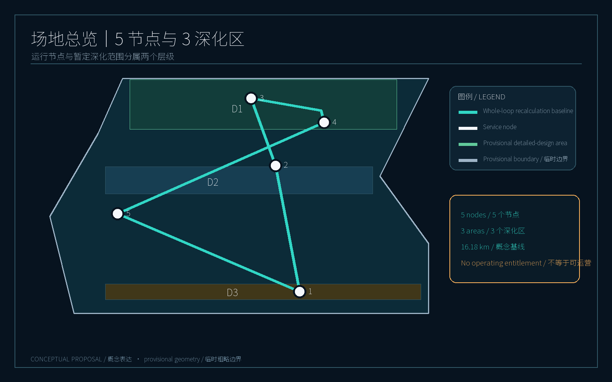
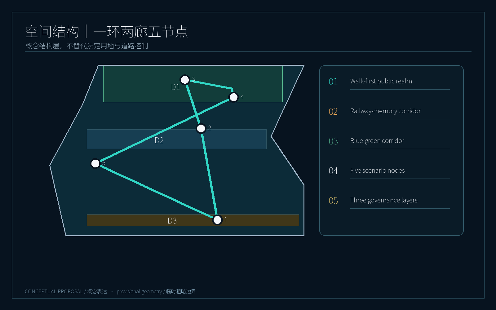
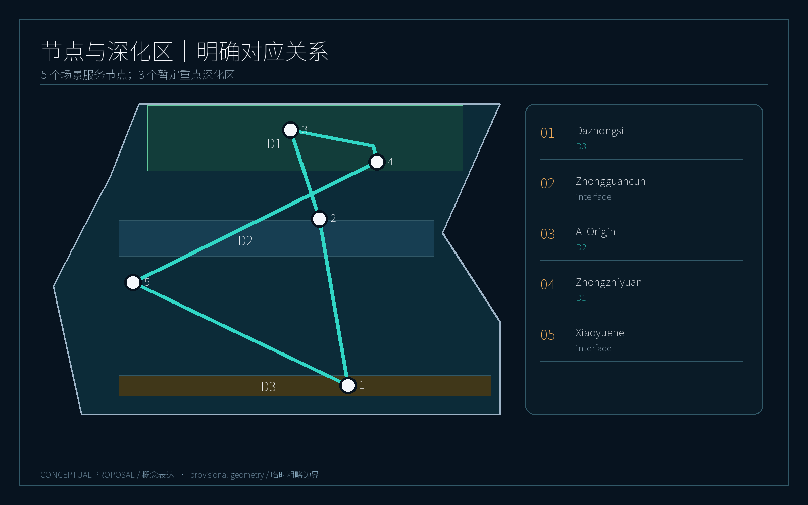
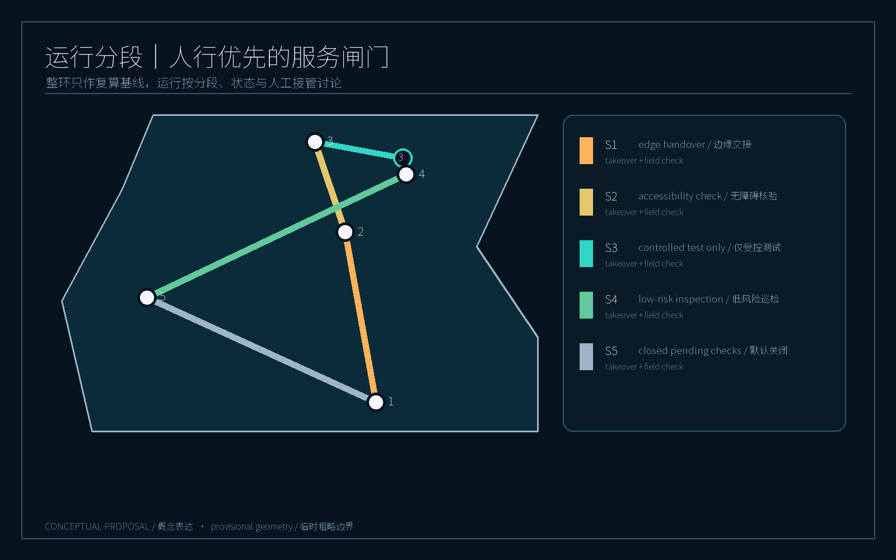
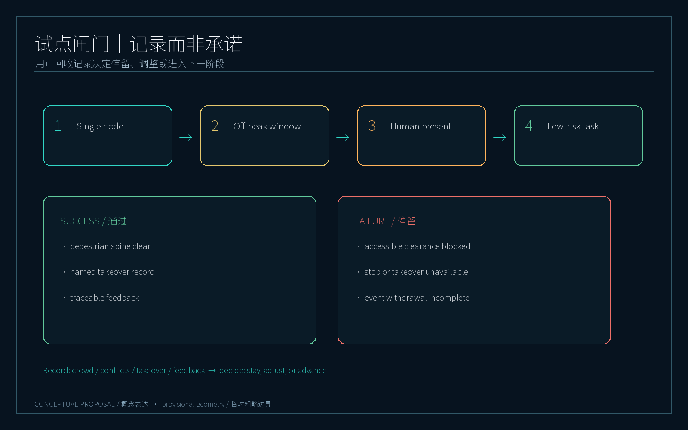

# Jingzhang Intelligent Mobility Loop: A Walk-First Robotic Mobility Belt

> **Core proposition: place robots inside an auditable, human-takeover, walk-first public-space system—not make pedestrians adapt to machines.**

This proposal treats the Jingzhang Railway Heritage Park and its surrounding urban districts as a conceptual working area. It creates a “Jingzhang Intelligent Mobility Loop” linking public space, AI innovation nodes and managed service nodes. It is not a robot-only road and does not replace statutory road lines, land boundaries or approvals. All alignments, nodes, capacities, speeds, operating windows and phases are conceptual recommendations for professional teams to deepen. [source:OFFICIAL-ANNOUNCEMENT] [source:AGENT-TASKBOOK] [data:geometry/site_boundary.geojson#SITE-001]

## Design basis and data register

The formal package uses only public repository materials and the repository-registered provisional geometry. The announcement, agent taskbook, site package and source register form the evidence base; `sources.json` records purpose, licence status and limitations, while `assumptions.json` records items requiring human confirmation. [source:SOURCE-REGISTRY] [source:SITE-PACKAGE] [source:PROCESSED-FACT-PACK]

The overall boundary and the **three registered key detailed-design areas** are temporary rough geometries with `official_boundary=false` and `geometry_role=provisional_constraint`. The approximately 11.4 km² area and three area figures support discussion, drawings and self-check only; they are not official redlines or survey results. All spatial metrics should be recalculated when official geometry is supplied. The five service nodes in this proposal are operational scenario interfaces, not five key detailed-design areas or statutory districts. [source:BOUNDARY-SOURCE] [data:geometry/key_areas.geojson#PROV-KEY-001]

## Three-level spatial framework

**Level 1 | Public walking and accessibility.** Continuous walking, cycling, accessible movement, shade and public staying space come before robot operation. Robots yield to people, slow at crossings and accept temporary closure, detours or human guidance on event days. [data:geometry/green_space.geojson#GREEN-001] [data:geometry/public_space.geojson#PUBLIC-001] [standard:MOHURD-URBAN-DESIGN-MEASURES]

**Level 2 | Low-speed robotic services.** Managed service nodes, temporary stopping points and human-takeover boundaries support shuttle assistance, time-window delivery, inspection, interpretation and park operations. Robots enter shared space only within service windows; during peaks they return to nodes or are dispatched by a human supervisor.

**Level 3 | City-agent governance.** Each task has dispatch, trajectory audit, incident escalation, remote emergency stop, human takeover, public complaint and data-minimisation mechanisms. The agent produces an understandable task record, responsible operator and resolution log; the model recommends but does not own an unexplainable public-space decision. [source:AGENT-TASKBOOK] [depth:robotic_governance]

Together these levels form a “continuous human surface—robot service line—visible governance layer”. In addition to the existing slow-movement concept centreline, `geometry/roads.geojson` uses identifiable `SCENARIO_NODE` and `ROAD_CENTERLINE` features to express five service nodes and the loop. Both remain design concepts, not statutory roads or approved robot routes. [data:geometry/roads.geojson#ROAD-001] [data:geometry/roads.geojson#NODE-ZHONGZHIYUAN] [data:geometry/roads.geojson#ROBOT-NETWORK-001]

## Coordinated research area, industry and future city

The five task areas operate as scenario service nodes rather than isolated campuses: AI Origin Community hosts public robot demonstrations, dispatch and experience; Zhongzhiyuan AI Autonomous Innovation Acceleration Area hosts R&D, open interfaces and safety validation; Dazhongsi AI Industry Cluster hosts enterprise services, campus delivery and mixed work-living scenes; Zhongguancun Technology Services Wing hosts cross-area connections and service networks; Xiaoyuehe Scenario Enablement Wing hosts park interpretation, inspection, event-day and public-space trials.

The three provisional detailed-design areas correspond only to Zhongzhiyuan, AI Origin and Dazhongsi. Zhongguancun Services Wing and Xiaoyuehe Scenario Wing are cross-area scenario interfaces; the proposal does not claim additional key-area boundaries. Drawings place “five nodes / three detailed-design areas” together to avoid reading an operating concept as statutory scope expansion. [data:geometry/key_areas.geojson#PROV-KEY-001] [data:geometry/roads.geojson#NODE-ZHONGGUANCUN]

The ecosystem is organised as visible trials, reviewable operations and transferable interfaces: public experience stations, enterprise digital-twin testbeds and a city-management audit desk. No investment, operator or implementation commitment is implied; those conditions require later verification. [standard:PROJECT-AGENT-OPEN-CALL-TASKBOOK] [depth:ai_ecosystem_and_talent]

## Overall spatial structure and urban-design depth

The structure is “one loop, two corridors, five nodes and three governance layers”:

- **One loop:** a walk-first conceptual ring around the heritage park, with shade, rest and legible slow-mobility edges;
- **Two corridors:** a railway-memory corridor and the Xiaoyuehe blue-green corridor;
- **Five nodes:** AI Origin Community, Zhongzhiyuan, Dazhongsi, Zhongguancun Technology Services Wing and Xiaoyuehe Scenario Enablement Wing;
- **Three governance layers:** pedestrian priority, robotic service and auditable city-agent operation.

Land-use layers use the repository’s checkable classification codes as conceptual districts, not planning controls. The building layer shows indicative footprints and public interfaces, not demolition, FAR or approval conclusions. The road layer shows conceptual slow-mobility/service centre lines to be checked through accessibility and traffic studies. [standard:MNR-LAND-USE-CLASSIFICATION-GUIDE] [data:geometry/land_use.geojson#LU-001] [data:geometry/buildings.geojson#BLDG-001]

The public-realm rule is “enterable ground floors, visible corners and places to pause”. Robot stops must not occupy continuous accessible routes. Service cabinets, charging and maintenance are small, removable and relocatable modules; any fixed construction requires property, fire, traffic and municipal review.

## Scenario service nodes and detailed-design areas

### 1. AI Origin Community | Public experience and dispatch origin

A walk-first origin plaza, visible task wall and compact robot service station are suggested. Visitors can see active interpretation, delivery and inspection tasks and submit pause, yield and accessibility feedback. Robots use low speed outside the node and require human dispatch confirmation in dense crowds. This is an experience and demonstration concept, not an approved operations centre.

### 2. Zhongzhiyuan AI Autonomous Innovation Acceleration Area | R&D and safety validation

Controlled or semi-controlled space supports navigation, perception, remote takeover and multi-robot tests. Open interfaces expose anonymised event types and performance metrics, not identifiable movement traces. A “failure-visible” test window can demonstrate emergency stop, detour, loss of connection and human takeover. [depth:industry_test_validation]

### 3. Dazhongsi AI Industry Cluster | Enterprise services and campus delivery

For mixed work-living conditions, robots operate file, food and small-parcel delivery during off-peak service windows. Each job has a responsible department, time window and stop. Handover occurs at building forecourts or edge nodes rather than across the main pedestrian axis.

### 4. Zhongguancun Technology Services Wing | Cross-area connection and innovation services

Walking links connect transit, technology services and loop nodes. Robots can provide information, accessible escort and small-item connection, but do not replace regular buses, taxis, fire access or emergency response. A unified wayfinding family marks pedestrian priority, temporary stops and human assistance.

### 5. Xiaoyuehe Scenario Enablement Wing | Park interpretation, inspection and event days

Low-risk interpretation, lighting inspection, overflowing-bin alerts and event-day assistance are suggested first. On event days a “close the loop” command stops shared-space tasks, retains human inspection, clears temporary stops and publishes a restart time. Sensing follows minimum data, short retention and appeal principles.

The five nodes support at least ten scenario cards: park interpretation, accessible escort, waste inspection, night-light inspection, event crowd alerts, campus parcels, food delivery, cross-node connection, test window, complaint follow-up, heritage interpretation and emergency drills. Three priority industry-validation scenes are remote takeover, multi-robot yielding and privacy-minimisation audit. [depth:scenario_cards] [depth:personas] [depth:ai_landmarks]

## AI ecosystem, personas and AI+ scenarios

People are co-calibrators, not traffic to be served. Five core personas are a commuting researcher, a weekend family, a wheelchair or low-vision user, a campus operator, and nearby residents or shopkeepers. Each has an exit from robotic service, human assistance and anonymous feedback.

The identity system uses a loop line, a three-point takeover symbol, blue-green node colours and a common task-status sign. Three AI pilgrimage or honour-display nodes may be placed at the Origin Community, the Zhongzhiyuan test window and the railway-memory corridor. They display open-source contributions, failure reviews and public co-creation without exposing personal data or implying official certification.

Long-term operation may include an annual AI urban-walking festival, quarterly safety drills, monthly public-audit days and open-interface challenges. Success is measured by walking continuity, human-takeover response, complaint closure and public understandability—not robot count. [depth:global_ai_event_operation] [metric:walk_priority_coverage] [metric:governance_audit_rate]

## Land use, buildings and reversible renewal

This package does not propose statutory land-use changes, building heights, FAR, demolition or parcel-level renovation. `land_use.geojson`, `buildings.geojson` and `public_space.geojson` describe spatial relationships and design intent; all figures require official boundary, survey, property and control data. The preferred strategy is retain–embed–reverse: place wayfinding, stops and maintenance modules in existing edge spaces rather than building continuous robot pavement. [data:geometry/land_use.geojson#LU-002] [data:geometry/public_space.geojson#PUBLIC-001]

## Transport, rail, municipal and public-service systems

The mobility rule is “people continue, services retreat, anomalies are taken over”. The concept network does not change existing road functions. Crossings, fire routes, accessible ramps and station entrances are protected from occupation. Four operating states are suggested: green (pedestrian priority), amber (crowd growth and dispatch limits), red (event/incident withdrawal), and black (system failure, human takeover and manual inspection).

The `ROBOT-NETWORK-001` centreline is a whole-loop recalculation baseline; actual discussion is segmented. Segment 1 is edge handover only; Segment 2 requires human presence and accessibility checks; Segment 3 is controlled testing only; Segment 4 is low-peak blue-green inspection; Segment 5 is closed by default pending walking continuity, road-rail conflict and management-interface checks. Each segment records its service window, takeover node, event-day action and field-check list; the whole-loop length must not be read as an operating entitlement. [data:geometry/roads.geojson#SERVICE-SEGMENT-01] [data:geometry/roads.geojson#SERVICE-SEGMENT-05] [metric:robot_service_node_count] [metric:robot_loop_length_m] [standard:PROJECT-OFFICIAL-ANNOUNCEMENT]

Nodes may include removable stops, low-power charging, task-status boards and human-service boxes, subject to municipal, power, fire, traffic and park-management review. Only minimum event logs needed for task completion are retained; raw video and audio are not included in this package.

## Blue-green space, public realm and character

Green and public space are not leftover robot corridors: they are the continuous everyday surface for people. The proposal links the railway heritage, Xiaoyuehe and pocket spaces with shade, seating, drinking water, night lighting and legible accessible edges. Robot service lines sit at the edge, preserving an uninterrupted pedestrian spine. `green_ratio` and `public_space_ratio` are derived from submitted geometry only. [data:geometry/green_space.geojson#GREEN-001] [data:geometry/roads.geojson#ROAD-001] [metric:green_ratio]

## Projects, policy gates and phasing

**Phase 1 (discussable demonstration segment):** pedestrian-priority markings, two feedback points, one human-takeover desk and low-risk park inspection. It corresponds to the conceptual `phasing.geojson` area, not a construction boundary. [data:geometry/phasing.geojson#PHASE-001]

**Phase 2 (cross-node coordination):** limited service windows between Origin Community, Zhongzhiyuan, Dazhongsi and Xiaoyuehe, with enterprise testing and event-day closure protocols; complaints and safety reviews are prerequisites.

**Phase 3 (networked operation):** evaluate cross-area connection and open interfaces only after official spatial data, traffic organisation, privacy impact assessment and accountable operators are confirmed. If any gate is missing, remain at single-node human-supervised operation.

The policy gate is “rules before equipment, human before automation, disclosure before expansion”. Safety responsibility, data minimisation, accessibility, event-day withdrawal and public appeal come before procurement or scale-up. [depth:implementation_phasing] [standard:PROJECT-OFFICIAL-ANNOUNCEMENT]

### Minimum pilot and phase gate

The minimum pilot changes one variable only: under a **single node, fixed off-peak window and human presence**, whether one low-risk task may enter shared space. The proposal does not pre-set observation duration, task count or device model. Success signals are an uninterrupted pedestrian spine, a named person able to take over every exception and traceable public feedback. Failure signals are blocked accessible clearance, unavailable emergency stop or takeover, incomplete event-day withdrawal, or a complaint without an accountable resolver. Any failure keeps the system at the current phase while crowd, conflict, takeover and feedback records are recovered; it does not advance the phase. This experiment verifies rules, not automation superiority. [metric:pilot_gate_pass_rate] [metric:human_takeover_record_rate] [depth:implementation_phasing]

## Metrics, evidence and compliance

Metrics are divided into spatial recalculation, operating-structure and pilot-gate metrics. The first must be computed from GeoJSON; the second describes segment and takeover relationships; the third defines records and gate conditions without claiming measured performance. Current provisional geometry supports site area, building footprint, green ratio, public-space ratio and key-area count. Full values are in `metrics.json`, rather than hand-entered here. Node count and loop length are reproducible concept values, not operational conclusions. [metric:pilot_gate_pass_rate] [metric:human_takeover_record_rate]

The compliance matrix covers announcement tasks, agent-taskbook requirements, professional standards and design-depth items. The A3 booklet, A0 boards, bilingual HTML and five bilingual figures form a readable evidence chain. [standard:PROJECT-OFFICIAL-ANNOUNCEMENT] [depth:metrics_recalculation] [metric:site_area_sqm]

## Risk, copyright and compliance

No personal data, non-public planning material, commercial basemap, satellite imagery, unauthorised photograph or uncleared external generation is used. Figures are drawn locally from submitted GeoJSON, metrics and task materials and labelled “概念表达 / Conceptual proposal”. Source licences and limitations are in `sources.json`; display and copyright terms are in `report/copyright_statement.md`.

Official boundaries, cadastral data, current traffic, utilities, fire conditions, property, operating responsibility, algorithm performance and privacy impact assessment remain data gaps. This package is not official planning, traffic approval, construction commitment or safety certification. Any future implementation requires professional design, statutory process, public communication and field trials. [source:SOURCE-REGISTRY] [depth:risk_missing_data] [data:geometry/constraints.geojson]

## References

See `sources.json`, `assumptions.json`, `standard_matrix.json`, `design_depth_matrix.json` and `compliance_matrix.json`. These registers connect announcement tasks, public-source use, provisional boundaries, spatial layers, formulas and human review responsibility. GeoJSON is authoritative for spatial content, GeoJSON-derived `metrics.json` for metrics, and visual figures for human-readable discussion only. Because official boundaries, cadastral, traffic, municipal and operator data are incomplete, every implementation conclusion must return to cleared data, professional design and statutory process. [source:SOURCE-REGISTRY] [standard:PROJECT-OFFICIAL-ANNOUNCEMENT] [depth:risk_missing_data] [metric:site_area_sqm]
