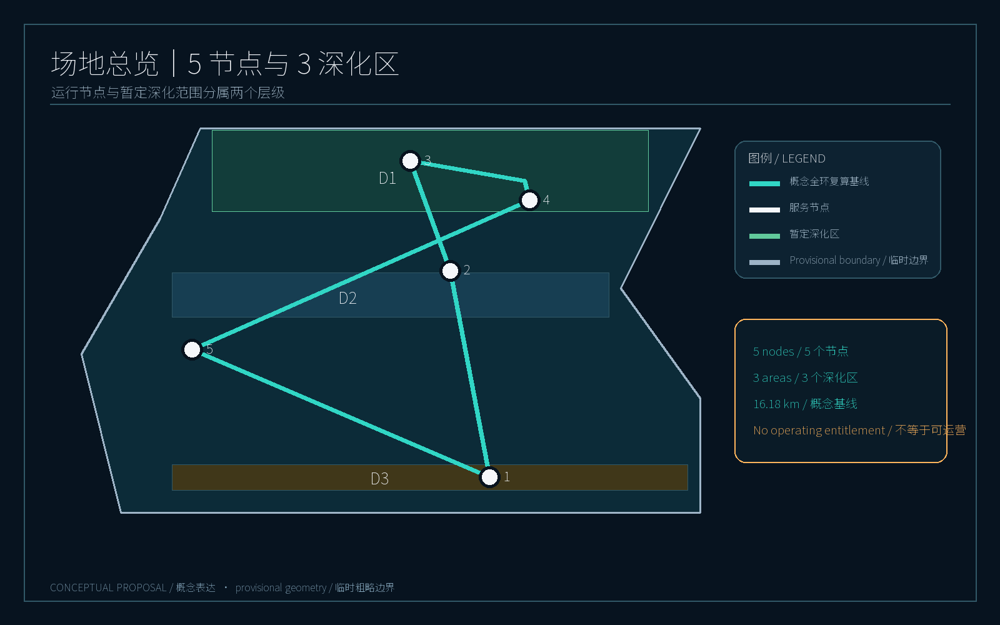
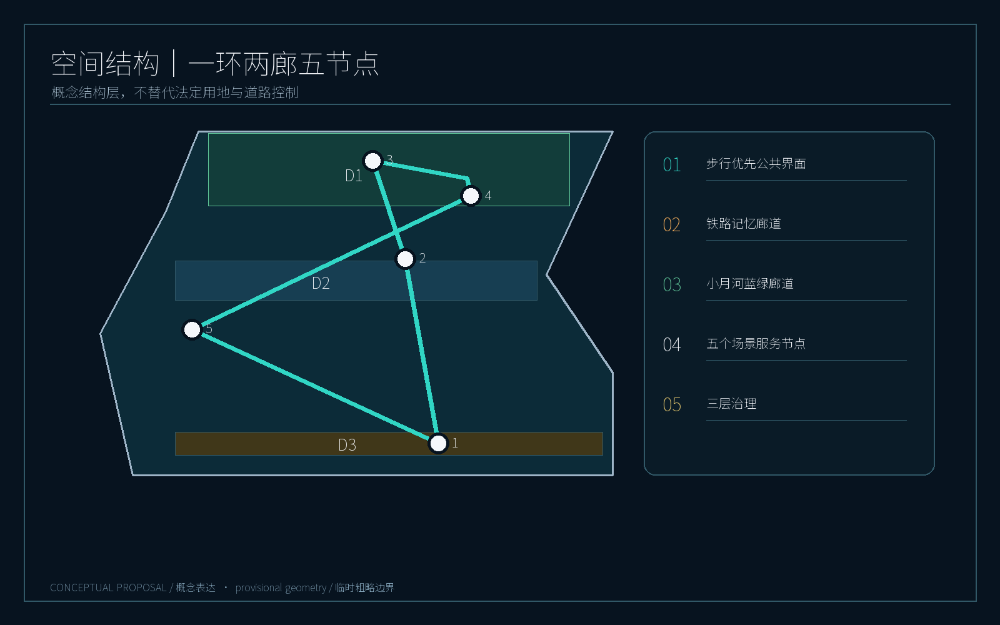
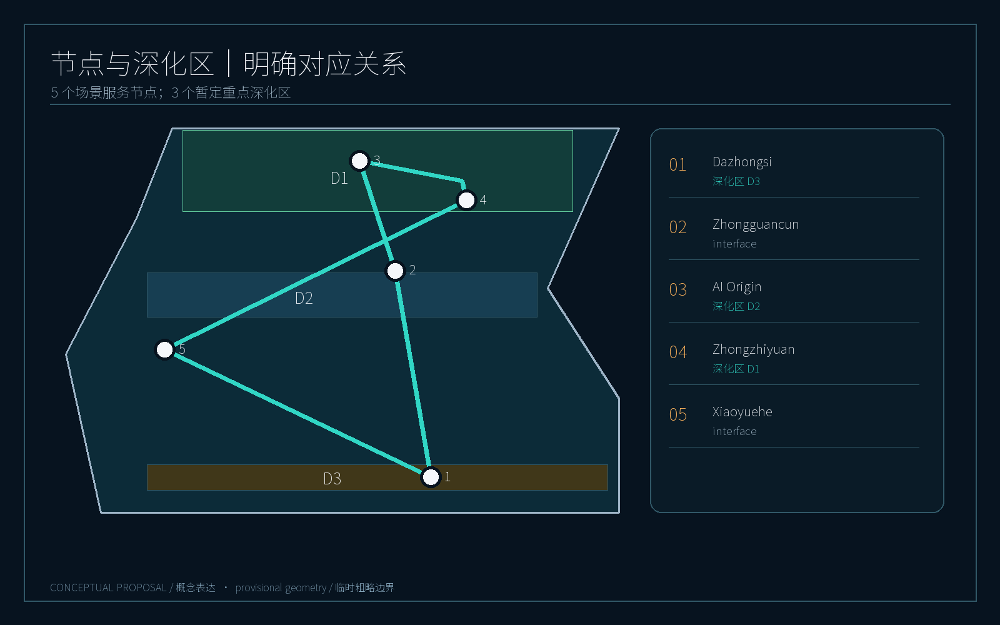
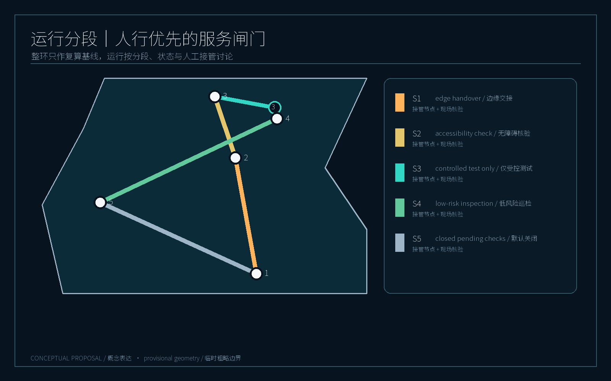
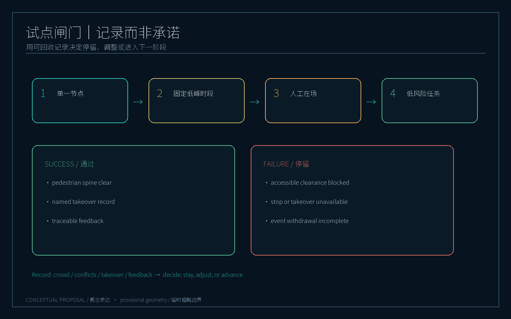

# 京张智行环：步行优先的机器人慢行协同带

> **核心主张：让机器人进入可审计、可接管、步行优先的公共空间系统，而不是让行人迁就机器。**

本方案以京张铁路遗址公园及其周边城市地区为概念性工作范围，提出一条连接公共空间、AI创新节点和园区服务节点的“京张智行环”。它不是机器人专用道路，也不是对既有道路红线、用地边界或审批结论的替代；所有线位、站点、容量、速度、运营时段和分期均为供专业团队深化的概念建议。[source:OFFICIAL-ANNOUNCEMENT] [source:AGENT-TASKBOOK] [data:geometry/site_boundary.geojson#SITE-001]

## 设计依据与资料清单

正式稿只使用仓库公开资料与仓库登记的 provisional geometry。公告、智能体任务书、站点包和来源登记共同构成任务依据；`sources.json` 记录每项资料的用途、许可状态与局限，`assumptions.json` 记录需要人工确认的事项。[source:SOURCE-REGISTRY] [source:SITE-PACKAGE] [source:PROCESSED-FACT-PACK]

当前总体范围和**三个已登记重点深化区**均为 `official_boundary=false`、`geometry_role=provisional_constraint` 的临时粗略边界。约 11.4 平方公里及三个片区面积只用于空间讨论、图件表达和自检，不代表官方红线或精确测绘结果；正式边界补齐后应重新计算全部面积指标。本文另设的五个服务节点是运行场景接口，不等同于五个重点深化区或法定片区。[source:BOUNDARY-SOURCE] [data:geometry/key_areas.geojson#PROV-KEY-001]

## 三层范围工作框架

**第一层｜公共步行与无障碍层。** 连续步行、骑行、无障碍通行、遮荫和公共停留先于机器人运行。机器人必须避让行人、在交叉口低速通过，并在活动日接受临时禁行、绕行或人工引导。空间依据为连续绿地、公共空间和慢行廊道图层。[data:geometry/green_space.geojson#GREEN-001] [data:geometry/public_space.geojson#PUBLIC-001] [standard:MOHURD-URBAN-DESIGN-MEASURES]

**第二层｜低速机器人服务层。** 以固定服务节点、临时停靠点和可人工接管的运行边界组织接驳、配送、巡检、导览和园区运维。建议机器人仅在“服务窗”内进入共享空间；高峰期退回节点或由人工调度，严禁以视觉识别结果替代现场安全判断。

**第三层｜城市智能体治理层。** 设立任务派发、轨迹审计、异常上报、远程急停、人工接管、公众申诉和数据最小化机制。每一次任务均生成可读的任务单、责任人和处理记录；模型只提供建议，不拥有不可解释的公共空间决策权。[source:AGENT-TASKBOOK] [depth:robotic_governance]

三层叠合为“人行连续面—机器人服务线—治理可视面”。`geometry/roads.geojson` 在既有慢行概念中心线之外，以可识别的 `SCENARIO_NODE` 和 `ROAD_CENTERLINE` 要素表达五个服务节点与闭环；二者均为设计概念，不构成法定道路或获批机器人路线。[data:geometry/roads.geojson#ROAD-001] [data:geometry/roads.geojson#NODE-ZHONGZHIYUAN] [data:geometry/roads.geojson#ROBOT-NETWORK-001]

## 统筹研究范围产业与未来城市研究

京张智行环把五个任务区域当作“场景服务节点”而不是孤立园区：AI 原点社区承担机器人服务展示、调度和公众体验；众智园 AI 自主创新加速区承担研发测试、开放接口和安全验证；大钟寺 AI 产业集聚区承担企业服务、园区配送和职住混合场景；中关村科技服务翼承担跨片区接驳、创新资源和服务网络；小月河场景赋能翼承担公园导览、巡检、活动日和公共空间试验。五节点之间以步行和公共交通可达性为主，机器人只补足短途服务和运维。

三个暂定重点深化区只对应众智园、AI 原点和大钟寺三个已登记空间范围；中关村服务翼与小月河服务翼是跨片区场景接口，暂不主张新增重点区边界。图面以“5 个节点 / 3 个深化区”并置表达，避免把运营构想误读为法定范围扩大。[data:geometry/key_areas.geojson#PROV-KEY-001] [data:geometry/roads.geojson#NODE-ZHONGGUANCUN]

建议形成“可见的试验—可复盘的运营—可迁移的接口”三类产业生态：面向公众的机器人体验站、面向企业的数字孪生测试台、面向城市管理的安全审计台。该生态不承诺投资或运营主体，需由后续专业团队、产权人和管理部门核实并深化。[standard:PROJECT-AGENT-OPEN-CALL-TASKBOOK] [depth:ai_ecosystem_and_talent]

## 总体设计范围城市更新与控规深度城市设计

总体空间结构为“一环、两廊、五节点、三层治理”：

- **一环**：以京张铁路遗址公园周边公共空间为骨架的步行优先概念环，采用连续遮荫、可休息、可识别的慢行界面；
- **两廊**：铁路遗址记忆廊与小月河蓝绿廊，分别承载文化叙事和生态降温；
- **五节点**：AI 原点社区、众智园、大钟寺、中关村科技服务翼、小月河场景赋能翼；
- **三层治理**：步行优先、机器人服务、城市智能体审计叠加运行。

土地利用层采用仓库登记的可校验分类编码作为概念分区，不替代控规。建筑层仅表达示范性基底和公共界面，不表达拆迁、容积率或建筑审批结论。路网层以中心线表示慢行和服务廊道，必须在后续交通组织和无障碍专项中复核。[standard:MNR-LAND-USE-CLASSIFICATION-GUIDE] [data:geometry/land_use.geojson#LU-001] [data:geometry/buildings.geojson#BLDG-001]

城市界面以“首层可进入、转角可看见、节点可停留”为基本控制建议。机器人停靠点不占用连续无障碍带，服务柜、充电和维护设施采用可撤除、可迁移的小型模块；任何固定化建设需重新取得产权、消防、交通和市政条件。

## 重点区域详细设计：场景服务节点与重点深化区

### 1. AI 原点社区｜公众体验与调度原点

建议设置步行优先的“原点广场”、可视化任务墙和小型机器人服务站。公众可查看当天开放的导览、配送和巡检任务，并通过二维码或现场按钮提出暂停、避让和无障碍反馈。机器人在站点外采用低速模式，进入人群密集区时由人工调度确认。该节点是展示和体验建议，不是已批准的运营中心。

### 2. 众智园 AI 自主创新加速区｜研发测试与安全验证

以封闭或半封闭可控空间进行导航、感知、远程接管和多机协同测试；开放接口只共享经过脱敏的事件类型和性能指标，不上传个人可识别轨迹。建议设置“失败也能被看见”的测试橱窗，展示急停、绕行、失联和人工接管演示，建立公众对系统边界的理解。[depth:industry_test_validation]

### 3. 大钟寺 AI 产业集聚区｜企业服务与园区配送

围绕职住混合和企业服务场景，机器人在非高峰服务窗执行文件、餐饮和小件配送；每一单绑定责任部门、时段和停靠点。物流不得穿越连续步行主轴，优先在楼宇前场或边缘节点完成交接，避免“最后十米”侵占公共空间。

### 4. 中关村科技服务翼｜跨片区接驳与创新资源

在公共交通站点、科技服务设施和智行环节点之间形成可换乘的步行网络。机器人可承担信息导览、无障碍陪行和小件接驳，但不取代常规公交、出租车、消防和急救通道。建议用统一导视系统标出人行优先边界、临时停靠位和人工服务入口。

### 5. 小月河场景赋能翼｜公园导览、巡检与活动日

在公园和蓝绿空间中优先开展低风险导览、夜间照明巡检、垃圾满溢提示和活动日秩序辅助。活动日采用“一键收环”：关闭共享空间机器人任务、保留人工巡检、清空临时停靠点，并由现场管理者发布恢复时间。任何摄像、录音和环境感知仅以最小化、短周期、可申诉为原则。

五节点共同支撑至少十类场景卡：公园导览、无障碍陪行、垃圾巡检、夜间照明巡检、活动日客流提示、园区小件配送、餐饮配送、跨节点接驳、测试橱窗、公众投诉回访、文化遗产讲解和应急演练。建议至少三类产业测试场景先行：远程接管、多机避让、隐私最小化审计。[depth:scenario_cards] [depth:personas] [depth:ai_landmarks]

## AI 创新生态、人才画像与 AI+ 场景

人才与使用者不是“被服务的流量”，而是共同校准系统的人。五类核心画像包括：通勤研发人员、带儿童的周末家庭、轮椅或低视力使用者、园区运维人员、附近居民与小店经营者。每类画像都有退出机器人服务、人工求助和匿名反馈的路径。

建议建立“京张智行环”识别系统：环形步行线、三点式接管标志、蓝绿节点色带和统一的任务状态牌。三个 AI 朝圣/荣誉展示节点可分别设置在原点社区、众智园测试橱窗和铁路遗址记忆廊，展示开源贡献、失败复盘和公众共创成果，不设置个人隐私展示，也不暗示官方认证。

长期运营建议以年度 AI 城市步行节、季度安全演练、月度公众审计日和开放数据接口挑战赛为载体；指标由“机器人数量”转向“步行连续性、人工接管响应、投诉闭环时间和公众可理解性”。[depth:global_ai_event_operation] [metric:walk_priority_coverage] [metric:governance_audit_rate]

## 用地、建筑规模与拆改留方案

本轮不提出法定用地调整、建筑高度、容积率、拆迁或地块级改造结论。`land_use.geojson`、`buildings.geojson` 和 `public_space.geojson` 用于表达空间关系和设计意图；具体指标必须在官方边界、现状测绘、产权和控规条件补齐后复核。建筑策略优先是“保留—嵌入—可逆”：利用现有首层灰空间和边角空间嵌入导视、停靠与维修模块，避免为机器人新建连续硬化道路。[data:geometry/land_use.geojson#LU-002] [data:geometry/public_space.geojson#PUBLIC-001]

## 交通、轨道、市政与公共服务设施

智行环的交通原则是“人行不断、服务可退、异常可接管”。概念网络不改变既有道路功能；交叉口、消防通道、无障碍坡道和地铁出入口均视为不可侵占空间。建议设置四级运行状态：绿色（步行优先、机器人低速）、黄色（人群增多、调度限流）、红色（活动/事故、机器人退出）、黑色（系统故障、人工接管与人工巡检）。

`ROBOT-NETWORK-001` 仅为全环复算基线；实际讨论应按五个候选服务分段进行。第 1 段只讨论边缘交接，第 2 段须完成人工在场与无障碍核验，第 3 段只用于受控测试，第 4 段只讨论低峰蓝绿巡检，第 5 段默认关闭并等待连续步行、道路轨道冲突与管理界面核验。每段均记录服务窗、接管节点、活动日动作和现场核验清单；不得以整环长度推定可运营范围。[data:geometry/roads.geojson#SERVICE-SEGMENT-01] [data:geometry/roads.geojson#SERVICE-SEGMENT-05] [metric:robot_loop_length_m]

节点设施包括可撤除停靠位、低功耗充电、任务显示牌和人工服务箱，均须经市政、电力、消防、交通和公园管理条件核验。网络运行只保存完成任务所需的最小事件日志；原始视频或声学数据不进入本投稿包。

## 蓝绿空间、公共空间与城市风貌

绿地和公共空间不是机器人通道的剩余用地，而是人群优先的连续生活面。方案以蓝绿网络串联铁路遗址、小月河和口袋空间，提供遮荫、坐凳、饮水、夜间照明和可辨识的无障碍边界。机器人服务线沿公共空间边缘布置，保留至少一条不被站点、标线和设备打断的步行主轴；`green_ratio` 与 `public_space_ratio` 仅为提交几何推导值。[data:geometry/green_space.geojson#GREEN-001] [data:geometry/roads.geojson#ROAD-001] [metric:green_ratio]

## 更新项目清单、实施政策与分期计划

**一期（可讨论的示范段）**：完成步行优先标识、两个公众反馈点、一个人工接管台和低风险公园巡检；对应 `phasing.geojson` 的概念范围，不代表施工边界。[data:geometry/phasing.geojson#PHASE-001]

**二期（跨节点协同）**：在原点社区、众智园、大钟寺和小月河之间开展有限时段服务窗，接入企业测试与活动日收环机制；以投诉闭环和安全事件复盘为前置条件。

**三期（网络化运营）**：在正式空间数据、交通组织、隐私影响评估和责任主体明确后，再评估跨片区接驳和开放接口。若任何一项条件未满足，系统停留在单节点人工监督状态。

政策建议采用“先规则、后设备；先人工、后自动；先公开、后扩展”的闸门：安全责任、隐私最小化、无障碍优先、活动日退出和公众申诉先于设备采购或规模扩张。[depth:implementation_phasing] [standard:PROJECT-OFFICIAL-ANNOUNCEMENT]

### 最小试点与阶段闸门

最小试点只改变一个变量：在**单一节点、固定低峰时段、人工在场**条件下，是否允许一项低风险任务进入共享空间。观察周期、任务数量和设备型号不在本方案预设。成功信号是：步行主轴未被占用、每次异常可由指定责任人完成接管、公众反馈可追溯处理；失败信号是：无障碍净空受阻、急停或接管不可用、活动日退出未完成、投诉无责任人闭环。出现任一失败信号即停留在当前阶段并回收人流、冲突点、接管记录和反馈数据，不进入下一期。该实验用于核验规则，不用于证明自动化优越性。[metric:pilot_gate_pass_rate] [metric:human_takeover_record_rate] [depth:implementation_phasing]

## 指标体系、面积复算与合规矩阵

指标分为**空间复算指标**、**运行结构指标**和**试点闸门指标**。前者必须从 GeoJSON 计算；运行结构指标只说明服务分段与接管关系；试点闸门指标只定义应收集的记录和通过条件，均不冒充实测绩效。当前 provisional geometry 推导的空间指标为：总体范围面积、建筑基底面积、绿地率、公共空间率和重点区域数量；完整数值见 `metrics.json`，不在正文重复手填。机器人节点数量与环线长度是概念网络的复算值，不能替代现场运营结论。[metric:pilot_gate_pass_rate] [metric:human_takeover_record_rate]

合规矩阵覆盖公告任务、智能体任务书、专业标准和设计深度；每一章均以来源、标准、深度、空间数据或指标锚点支撑。A3 文册、A0 展板、双语 HTML 和五张双语图件共同构成可读证据链。[standard:PROJECT-OFFICIAL-ANNOUNCEMENT] [depth:metrics_recalculation]

## 风险、版权与合规说明

本方案不使用个人隐私、非公开规划资料、商业底图、卫星图、未授权照片或外部生成素材。图件由本地代码从提交 GeoJSON、指标和任务说明绘制，均标注“概念表达 / Conceptual proposal”。仓库公开资料的许可与用途以 `sources.json` 为准，版权和展示范围以 `report/copyright_statement.md` 为准。

正式边界、地籍、现状交通、地下管线、消防条件、产权、运营责任、算法性能和隐私影响评估均待正式资料补齐；这不是官方规划、交通审批、建设承诺或安全认证。任何后续实施均需经过专业设计、法定程序、公众沟通和现场试验。[source:SOURCE-REGISTRY] [depth:risk_missing_data] [data:geometry/constraints.geojson]

## 参考资料

详见 `sources.json`、`assumptions.json`、`standard_matrix.json`、`design_depth_matrix.json` 和 `compliance_matrix.json`。这些登记表把公告任务、公开资料用途、provisional 边界、空间图层、复算公式和人工复核责任串成一条证据链。空间权威性以允许的 GeoJSON 图层为准，指标权威性以从 GeoJSON 复算的 `metrics.json` 为准，视觉图件只用于人类阅读和讨论。由于正式边界、地籍、交通、市政和运营责任尚未完整公开，任何实施结论都必须回到正式数据、专业设计和法定程序复核；本节的引用用于让评审和后续智能体定位证据，而不把登记表误读成官方批准。[source:SOURCE-REGISTRY] [standard:PROJECT-OFFICIAL-ANNOUNCEMENT] [depth:risk_missing_data]
