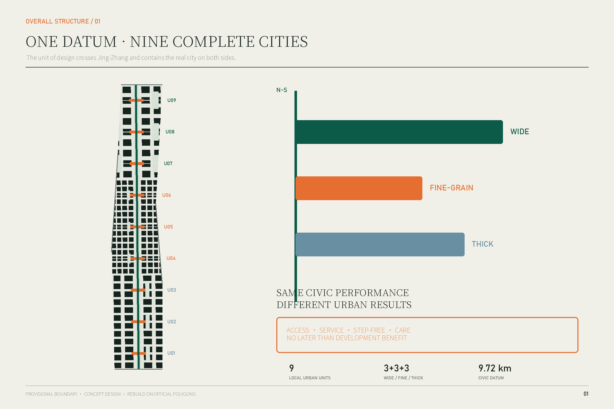
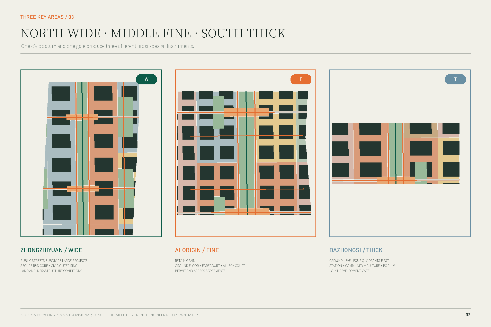
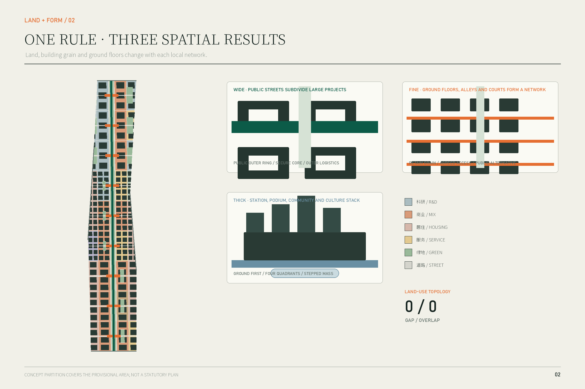
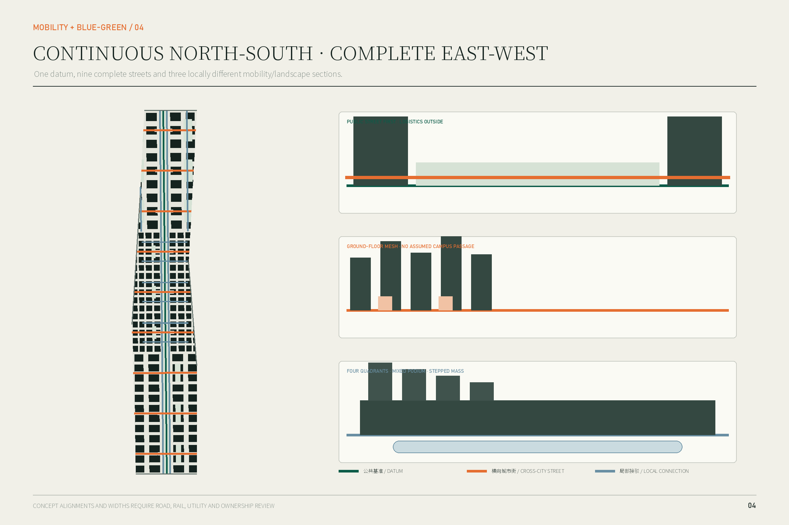
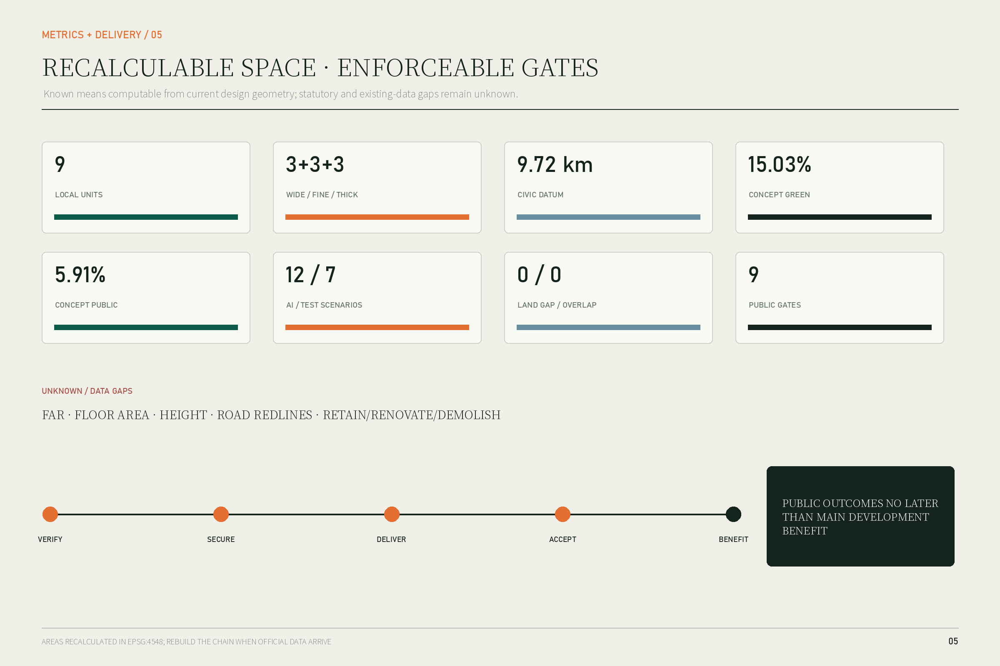

# Jing-Zhang Local Urban Units

## Abstract: the design object is not one line but nine pieces of complete city

The Jing-Zhang railway legacy gives Haidian an unusual continuous north-south public ground, yet the corridor passes through very different cities. The north consists of large R&D compounds, comprehensive renewal projects and river landscapes. The middle is a fine-grain, existing district where universities, business parks, communities and transit stations sit close together. The south overlays a station, established communities, cultural heritage, conventional commerce and underused buildings. A landscape axis or a sequence of nodes could improve the corridor itself, but it would not determine how land on both sides is organized, how buildings meet the public ground, or when public services are delivered.

The proposal therefore fixes one spatial judgment: **the basic unit of Jing-Zhang urban design is a local urban unit that crosses the corridor and contains the real city on both sides, not a node located on the line.** Nine units share an approximately 9.72-kilometre civic datum without adopting one form. Wide units in the north subdivide large projects into permeable urban districts. Fine-grain units in the middle assemble ground floors, forecourts, alleys and courtyards into a dense public network. Thick units in the south organize four station quadrants, mixed podiums, community services and cultural spaces as a three-dimensional station-city section.[data:geometry/phasing.geojson#PHASE-U08] [metric:local_unit_count]

The shared implementation rule is: **public outcomes shall not be delivered later than the main development benefit.** Each unit has a public-delivery gate. Its route, service space, step-free continuity and maintenance duty must be completed and verified before the main development reaches leasing, sale, occupation or the defined contractual payment milestone. The rule is translated into land and infrastructure conditions in the north, renewal permits and access/maintenance agreements in the middle, and station joint-development and comprehensive-renewal gates in the south.[depth:phasing_implementation]

### Status and limitation

Every spatial proposal in this package is a conceptual recommendation for professional development. It is not a statutory plan, government approval, engineering design, ownership determination or implementation commitment. The repository does not yet contain official precise boundaries, existing buildings, parcels and ownership, road redlines, station engineering, heritage control polygons or approved development controls. Geometry is therefore built on the repository provisional polygons. Current areas, lengths and ratios test internal consistency only and must be regenerated when official data arrive.[source:BOUNDARY-SOURCE] [assumption:A-BOUNDARY-001]

## Design basis and source list

The controlling sources are the official qualification announcement, the agent taskbook, the repository site package, the 2023 national land-use classification guide and the relevant urban-design and regulatory-planning measures. The announcement defines the three scales, three key areas and tasks from the innovation ecosystem to renewal, mobility, the heritage park and detailed design. The taskbook adds three positions, five functions, six agent tasks, scenario cards and long-term operations.[source:OFFICIAL-ANNOUNCEMENT] [standard:PROJECT-AGENT-OPEN-CALL-TASKBOOK]

Three public 2026 records directly shape the detailed design:

- Zhongzhiyuan is a district-scale comprehensive renewal group involving underused industrial parks, public-safety facilities, commerce, municipal systems and the Qinghe/Xiaoyue rivers. The published coordination body is the Dongsheng Town Government. The north therefore cannot be treated as one private campus plan.[source:ZHONGZHIYUAN-UPDATE-20260713]
- AI Origin already has a concentrated enterprise ecosystem, while public-realm work has focused on Chengfu Road, Zhongguancun East Road and Shuangqing Road. The spatial priority is to connect existing ground floors and public spaces, not to clear and rebuild the district.[source:AI-ORIGIN-ECOSYSTEM-20260401] [source:AI-ORIGIN-PUBLIC-REALM-20250325]
- Dazhongsi is a comprehensive renewal area across three subdistricts. Its published scope explicitly joins public and commercial space, cost and return, public services and near/mid/long-term sequencing. This provides a real implementation object for the thick unit and the public-benefit gate.[source:DAZHONGSI-UPDATE-20260713]

Official facts are separated from provisional intake geometry and agent-generated design. Precise station exits, access rights, demolition, building height, FAR and engineering alignments remain unknown.[source:SOURCE-REGISTRY] [depth:risk_missing_data]

## Three-scale working framework

### Coordinated research area: read local networks, do not blanket-design them

The approximately 43.6-square-kilometre research area identifies the urban networks crossed by Jing-Zhang: universities and institutes, business parks, communities, stations, waterways and civic services. It is not recast as one homogeneous industry district, and the three key areas are not required to prove a single quantified industrial dependency. What is unified is their relation to the civic datum, not their local problems.[source:OFFICIAL-ANNOUNCEMENT]

### Overall design area: nine complete local units

The approximately 11.4-square-kilometre overall area is divided into nine units. Each includes land on both sides, ground-floor edges, a complete east-west public street, the north-south civic datum, public services and one delivery gate. Three southern thick units, three middle fine-grain units and three northern wide units are implementation and design frameworks, not new statutory parcels.[data:geometry/site_boundary.geojson#SITE-001] [data:geometry/phasing.geojson#PHASE-U01]

### Three key areas: detailed prototypes for three mechanisms

Zhongzhiyuan, AI Origin and Dazhongsi test wide, fine-grain and thick prototypes. They are not formal variants of one template; they show how one civic datum and one delivery rule create different outcomes under large-project renewal, low-disruption existing-district renewal and station-centred comprehensive renewal.[data:geometry/key_areas.geojson#PROV-KEY-001] [depth:three_key_area_detailed_design]

The provisional overall polygon recalculates to about 1,141.28 hectares. It cannot support redline, acquisition, precise parcel or approval decisions. Official polygons trigger a rebuild of all nine geometry layers, drawings and metrics.[metric:site_area_sqm] [assumption:A-GEOGRAPHY-010]

## Industry and future-city research at the coordinated scale

### Put a complete innovation cycle into suitable urban units

The official brief asks the belt to link original innovation with industrialization and to respond to “three zones and two wings.” The proposal translates this into differentiated city space rather than an abstract industrial axis. Wide units host controlled R&D, shared instruments, prototype validation and separate logistics. Fine-grain units host frequent contact among university work, start-ups, professional services and daily community life. Thick units host AI-native services, content and terminal industries, international exchange, station services and public-facing presentation. The two wings connect through the real streets, waterways and services of the local units; no unproven closed internal supply chain is assumed.[source:AI-DISTRICT-STRUCTURE-20240428] [depth:three_level_scope_framework]

### Six international cases: transfer mechanisms, not images

| Case | Verifiable mechanism | Jing-Zhang translation | What is not copied |
| --- | --- | --- | --- |
| Kendall Square, Cambridge | Public-space network, finer streets, active ground floors and development contributions change an inward R&D district | Make streets and neighbourhood access delivery conditions in the north | Biotech imagery and foreign ownership rules |
| MaRS Centre, Toronto | Four buildings connect through a common atrium inside an urban university-health-government network | Join knowledge and service uses through shared ground floors in the middle | One giant atrium as a corridor-wide prototype |
| one-north LaunchPad, Singapore | Work, living, startup support and testing are placed close together | Put R&D, daily talent services and validation close while retaining public streets | A gated “AI village” |
| Paris-Saclay Campus Urbain | Commerce, third places, prototype platforms and daily services urbanize separate campuses | Use public ground floors and short routes to reduce campus-community separation | Low-density new-town form |
| Barcelona 22@ | Innovation space is renewed with housing, transit, green space and established communities | Account for industry, housing, service and public realm in one local unit | Displacement in the name of innovation |
| London King’s Cross | Railway heritage, stations, mixed uses, public streets, squares and community facilities advance together | Treat arrival, memory, community service and development podium as one thick section | Commercialized heritage scenery |

The common lesson is that urbanity is produced by public streets, reachable ground floors, mixed daily life and enforceable development duties—not by the number of firms.[source:CASE-KENDALL-PUBLIC-SPACE] [source:CASE-KINGS-CROSS]

### Name and identity

“Jing-Zhang Local Urban Units” describes the method and does not use AI as a slogan. Its original symbol combines one vertical line with three horizontal rectangles of different breadth and depth: the line is the civic datum and the rectangles are the three unit types. No corporate mark, historic portrait or uncleared railway image is used.[source:AGENT-TASKBOOK]

## Urban renewal and control-oriented urban design in the overall area

### One civic datum, nine local units, three urban outcomes

The datum is continuous in performance, not uniform in form. It guarantees:

1. continuous north-south walking and cycling connected to an east-west public street in every unit;
2. step-free ground routes with static signs and human alternatives to digital guidance;
3. continuous Jing-Zhang interpretation with locally different materials, planting and programs;
4. legible public entrances, places to stop and essential services on both sides;
5. routes, services, lighting, drainage and maintenance no later than the main development benefit.

Those five matters remain the same. Block size, building type, access arrangement, traffic organization and delivery instrument deliberately differ.[data:geometry/roads.geojson#ROAD-DATUM-001] [depth:urban_design_framework]

### The nine units

| Unit | Type | Complete cross-corridor relation | Land/building action | Public gate |
| --- | --- | --- | --- | --- |
| U09 North Fifth Ring gateway | Wide | City gateway—R&D—datum—ecology/services | Public streets first; stage large R&D parcels | Gateway street, active travel and drainage landscape open first |
| U08 Zhongzhiyuan R&D-validation | Wide | R&D—shared service—visible validation—community/ecology | Conceptual 120–180 m blocks, public outer ring and secure courts | Two cross-project streets and research commons complete |
| U07 Qinghe living-research | Wide | R&D—daily services—river/ecology interface | Logistics outside; public services face streets | River/park interface and daily services first |
| U06 AI Origin | Fine | University/R&D—firms—community services—transit | Retain grain; retrofit ground floors, courts and forecourts | Continuous public ground floor and two independent public routes |
| U05 Wudaokou everyday network | Fine | Campus edge—commercial street—community—station | Timed kerbs, cycling and daily services | Step-free route, kerb plan and maintenance agreement operational |
| U04 Campus-community interface | Fine | External public road—knowledge services—community learning | Never assume passage through campus | Learning service and external public alternative open first |
| U03 Southern mixed gateway | Thick | Arrival—employment—housing—services | Mixed podium and layered arrival | Arrival space and public services verified before occupation |
| U02 Juesheng Temple culture-community | Thick | Heritage—community—commerce—datum | Step down massing toward heritage and housing | Cultural public space, community route and maintenance first |
| U01 Dazhongsi station-city | Thick | Four station quadrants—community—industry—datum | Station-city podium and ground network | Four-quadrant accessibility and community service before main leasing |

All dimensions are conceptual controls. Legal parcels, heights and street widths await official information and professional review.[assumption:A-CONTROLS-002]

### Six spatial systems

#### 1. Land-use relations

The land-use layer partitions the provisional area with research, business, housing, community service, education, health, culture, roads, parks and squares. Recalculation returns zero gap and zero overlap. Research dominates the north with services near the datum; research, education, housing and community service mix in the middle; business, housing, community service and culture form the station-city mix in the south. The partition proves a complete design relationship and is not a statutory land-use plan.[data:geometry/land_use.geojson#LU-U08-INNER_W] [metric:land_use_gap_ratio]

#### 2. Buildings and ground floors

The 184 conceptual footprints test grain, courts, setbacks and ground-floor orientation only; they are neither surveyed buildings nor a demolition plan. Wide units use a four-stage threshold: public forecourt, shared service, secure lobby and controlled R&D court. Fine-grain units combine small frontage, shared entrance, courtyard and upper-level research or housing. Thick units layer station/city ground, public podium, shared terrace and stepped upper mass. Numeric height remains unknown; relative massing, street-wall continuity and heritage transition guide later work.[data:geometry/buildings.geojson#BLDG-001] [metric:building_height_m]

#### 3. Public and blue-green space

The civic datum, nine public halls and side green rooms create a line-hall-room system. Conceptual green space is about 171.55 hectares or 15.03% of the provisional area; public-space polygon union is about 67.44 hectares or 5.91%. Northern rooms manage stormwater and controlled testing, middle rooms provide shade and small courts, and southern rooms combine station arrival, cultural transition and neighbourhood squares. These are design values, not existing or approved ratios.[metric:green_ratio] [metric:public_space_ratio]

#### 4. Mobility

One north-south greenway, two datum-side streets, nine complete cross-city streets and local networks form the system. Wide units divert laboratory freight to outer edges. Fine-grain units add six alleys but do not assume passage through private or campus land. Thick units give priority to station quadrants and ground-level services. Alignments and widths require traffic, utility, fire and ownership evidence.[data:geometry/roads.geojson#ROAD-U06-CROSS] [assumption:A-TRANSPORT-005]

#### 5. Public services and new infrastructure

Services are distributed through each unit’s ground floors rather than isolated in one specialist facility. The north provides shared equipment, compliance, dining and emergency support. The middle provides community service, learning, medical referral, legal/startup support and everyday commerce. The south provides station help, accessible transfer, integrated community service and heritage interpretation. Maintainable utility reserves, distributed-energy interfaces, drainage, public charging and edge-compute locations should be coordinated when public streets are rebuilt, but capacities are not promised without engineering evidence.[depth:municipal_new_infrastructure]

#### 6. Delivery units

The nine phase polygons are both spatial and responsibility units. Each stores a gate, benefit trigger, legal instrument, early action and review record. The masterplan therefore states not only what form is intended but who must deliver what before which benefit milestone.[data:geometry/phasing.geojson#PHASE-U01] [metric:public_delivery_gate_count]

## Detailed design of the three key areas

### North: the Zhongzhiyuan wide unit—turn large projects into city districts

The official record defines a district-scale renewal involving industrial parks, safety facilities, commerce, municipal systems and river landscapes. U08 therefore uses two east-west public streets and the datum to frame a research commons. The streets begin and end at public destinations rather than project gates. Conceptual 120–180-metre blocks combine public outer edges with secure R&D courts.[source:ZHONGZHIYUAN-UPDATE-20260713] [data:geometry/public_space.geojson#PUBLIC-U08-HALL]

Ground floors along public streets host shared instruments, visible validation, food, meeting, compliance and talent services. Controlled research remains behind a layered threshold. Freight and secure laboratory access use outer service routes; walking, cycling and public transport approach the middle. Side green rooms connect the datum to the Qinghe and Xiaoyue river directions and serve drainage and public open space.

Existing buildings are surveyed before any retain/renovate/demolish decision. Reusable research buildings are retained; ground floors, access, fire safety and energy systems are retrofitted; demolition is considered only after safety and statutory review. The public gate requires two continuous routes, step-free inspection, lighting and drainage, an operating public service, and recorded maintenance responsibility before the main R&D leasing, occupation or contractual-benefit milestone.[data:geometry/phasing.geojson#PHASE-U08] [depth:retain_renovate_demolish]

### Middle: the AI Origin fine-grain unit—make existing ground floors a public network

AI Origin already contains a dense enterprise ecology and incremental public-realm projects. Its scarce resource is not another large building but a legible and maintainable network among entrances, forecourts, alleys and courts under different ownership. U06 retains the fine grain. Two independent public routes avoid reliance on uncertain campus passage; six pedestrian alleys join forecourts and courts through access agreements.[source:AI-ORIGIN-PUBLIC-REALM-20250325] [data:geometry/roads.geojson#ROAD-U06-ALLEY-A]

Nine ground-floor interfaces include shared lobbies, startup services, community desks, learning rooms, medical referral, public toilets, affordable food, bicycle service and night-safety points. Existing buildings follow a retain-and-retrofit strategy. If a campus boundary cannot open, an equivalent external public route must be provided.

Kerbs can change between commuting, delivery and event periods, but the arrangement must return safely to a fixed schedule and manual enforcement. AI assists reservations, routes and conflict warnings; static rules and staffed service remain valid. The U06 gate requires two continuous public routes, essential ground-floor services, step-free access and night-safety checks before new leasing or use benefits from renewal.[data:geometry/public_space.geojson#SCN-08] [data:geometry/phasing.geojson#PHASE-U06]

### South: the Dazhongsi thick unit—design the station, community and development as one section

The public renewal scope crosses three subdistricts and includes old housing, factories, offices, commercial facilities, municipal systems and public space. It explicitly joins public and commercial space, costs, services and phasing. U01 therefore includes all four station quadrants, the Jing-Zhang datum, community services and mixed development podiums.[source:DAZHONGSI-UPDATE-20260713]

Three public grounds form the thick section: legible arrival at station/concourse level; a continuous, step-free civic street and community services at city ground; and a shared upper terrace only where engineering allows. No bridge, tunnel or station modification is assumed approved. Ground-level four-quadrant continuity is the base condition. Massing steps down from the station/industry node toward communities and from large development toward Juesheng Temple and its heritage setting. Exact heights and view corridors remain unknown.[data:geometry/roads.geojson#ROAD-U01-CROSS] [assumption:A-HERITAGE-006]

Mixed podiums can host station services, everyday commerce, community functions, international exchange and shared AI-business space. Upper floors are allocated only after approved controls clarify offices, housing and talent apartments. “Jing-Zhang Centennial Arrival Hall” is a public ground rather than a monument: it explains railway heritage, points to community services, supports waiting and step-free transfer. The U01 gate makes four-quadrant ground access, the arrival hall, community services and maintenance agreements precede main office/retail leasing or occupation.[data:geometry/public_space.geojson#PILGRIMAGE-S] [data:geometry/phasing.geojson#PHASE-U01]

## AI innovation ecology, personas and AI-enabled scenarios

AI does not justify the masterplan. The masterplan comes from railway continuity and local urban difference. AI is introduced only after spatial rights and operating duties are clear, to support reservation, navigation, testing, referral and operations. Every scenario requires data minimization, no default biometric identification, human review, a safe static fallback and a separate impact assessment.[standard:GENERATIVE-AI-INTERIM-MEASURES]

Seven personas guide the design: controlled-environment researchers; low-cost-service-seeking startup teams; students and teachers moving among institutions; long-term residents and older people who need staffed services; people who rely on step-free routes; delivery, maintenance and laboratory-logistics workers; and visitors or international talent who need to understand the district without entering private compounds.

### Twelve scenario cards

| ID | Space and users | AI role | Data and human fallback | Operator and principal risk |
| --- | --- | --- | --- | --- |
| SCN-01 Shared equipment booking | U08 research commons | Match slots, equipment and training | Account/booking data only; staffed desk confirms | Park operator; unequal resource access |
| SCN-02 Low-speed delivery corridor* | U08 outer logistics | Conflict warning and time windows | No face recognition; safety marshal can stop | Road manager; unsafe automation |
| SCN-03 Visible embodied-system validation* | U08 controlled test edge | Record conditions and incidents | Anonymous counts; third-party review and emergency stop | Test owner; uninformed public testing |
| SCN-04 Model compliance clinic | U07 service ground floor | Assist document checking and navigation | Voluntary documents; professional signs advice | Professional provider; AI must not replace legal judgment |
| SCN-05 Step-free route assistant* | U06 public routes | Report temporary barriers and alternatives | No identity tracking; signs and staff remain | District operator; wrong routing |
| SCN-06 Lifelong-learning match | U06 learning frontage | Match public courses and rooms | Registration data only; community worker review | Education/community institutions; exclusion by profiling |
| SCN-07 Community-service referral | U05 staffed desk | Direct people to appropriate in-person service | No medical diagnosis; staff accepts case | Community service; vulnerable users need priority staff help |
| SCN-08 Reversible kerb schedule* | U05 street | Forecast conflicts and suggest periods | Edge-processed observation; manual enforcement | Transport authority; fall back to fixed schedule |
| SCN-09 Vacant ground-floor match | U04 adaptable frontage | Match need, lease and spatial conditions | Minimum ownership/application data; manual review | Owners’ consortium; rent discrimination |
| SCN-10 Four-quadrant transfer assistant* | U01 station ground | Step-free and crowd-aware alternatives | No default location retention; station staff and signs | Transit operator; engineering/fire rules prevail |
| SCN-11 Multilingual Jing-Zhang guide | U02 culture-community | Explain traceable public archives | Sources displayed; cultural review | Cultural institution; fabricated history |
| SCN-12 Crowd/weather response* | U01 public hall | Warn of congestion, flooding and heat | Necessary environmental/anonymous flow only; staffed command | Local government; no automatic coercive decision |

Seven starred scenarios are testing/validation pilots, exceeding the minimum three. All twelve are mapped in GeoJSON.[metric:ai_scenario_node_count] [metric:testing_validation_scenario_count]

## Land use, building scale and retain/renovate/demolish strategy

The conceptual land-use structure is encoded with the project subset of the national classification and fully covers the provisional polygon. Conceptual footprints total about 395.77 hectares or 34.68% of the provisional area. That number tests urban form only; it is neither existing building density nor a planning limit. FAR, total floor area, numeric height, underground space and parking remain unknown.[standard:MNR-LAND-USE-CLASSIFICATION-GUIDE] [metric:conceptual_building_footprint_ratio]

Retain/renovate/demolish decisions begin with a survey. Retain safe buildings with continued use and social memory. Renovate ground floors, entrances, fire safety, step-free access, energy and courts. Consider demolition only for safety or an otherwise impossible public facility after statutory process. Use new infill to complete services, mixed ground floors and street edges. Current retain, renovate and demolish counts remain null rather than being fabricated from conceptual footprints.[metric:retain_building_count] [assumption:A-EXISTING-003]

## Mobility, rail, municipal systems and public services

Nine cross-city streets form the unit skeleton. “Complete” means that each connects public roads, stations, communities or publicly accessible park entrances on both sides and is secured by legal and operating instruments. The datum provides north-south active-travel legibility. Freight moves outward in the north, kerbs are timed in the middle, and ground-level station quadrants lead in the south.[metric:complete_cross_unit_route_count]

Station design gives priority to a step-free ground network, visible routes from exits to services and the datum, and non-conflicting transfer, bicycle and service movement. No engineering coordinate is offered without station and underground information.[assumption:A-TRANSPORT-005]

Municipal and new infrastructure follows “one public-street construction, separate system approvals.” Drainage, power, fire and gas safety capacities are verified first; energy, charging, edge-compute and test interfaces are then reserved. AI hardware must never occupy tactile paving, fire access, tree pits or public seating. Staffed offline services remain available.[standard:BARRIER-FREE-ENVIRONMENT-LAW]

## Blue-green space, public realm and townscape

The datum is ecologically broad in the north, narrows to shade, alleys and courts in the middle, and thickens into station, cultural and community ground in the south. Side green rooms bring river directions, campus/community courts and station public spaces into the local units.[data:geometry/green_space.geojson#GREEN-U08-ROOM]

Three pilgrimage/honor nodes are proposed: the Open Validation Ground in the north, the Origin Open-Source Commons in the middle and the Jing-Zhang Centennial Arrival Hall in the south. They gain significance through long-term public access, credible content and repeated civic activity, not monumental size. All remain conceptual and require approval.[metric:pilgrimage_node_count]

The cultural narrative moves from independent railway construction, through open contemporary collaboration, to public validation. Northern materials are durable and ecological; the middle retains small signs, courts and everyday scale; the south uses restrained materials, quieter edges and stepped massing near railway and temple heritage. The corridor rejects fake railway objects, giant screens and one “technology blue” aesthetic.[depth:height_massing_character]

## Renewal project list, policy and phasing

### Public delivery gate

The “main development benefit” is the earliest of main leasing/sale opening, main-building occupation, or 30% of the contractual development payment. Before that milestone, the unit must secure a legally effective public-access instrument; complete a connected, step-free, lit and drained route; open the promised staffed service; and record maintenance, budget, hours, complaints and fallback. The 30% trigger is a design recommendation, not an existing regulation or signed term.[assumption:A-IMPLEMENTATION-008]

Twelve actions deliver the proposal: the continuous datum; nine complete cross-city streets; Zhongzhiyuan public streets and utilities; its research commons; the AI Origin ground-floor network; its daily-service package; the Dazhongsi four-quadrant ground; its community-service podium; the Juesheng Temple cultural buffer; a standard public-delivery covenant; reversible-AI governance; and a public unit-performance ledger.

Near term confirms boundaries, ownership, buildings and traffic and pilots U08, U06 and U01 with low-risk public works. Mid term extends tested tools to U02, U05 and U07. Long term completes U03, U04, U09 and connection areas while allowing post-occupancy evidence to modify unit edges and prototypes.[data:geometry/phasing.geojson#PHASE-U09]

Annual operations use four seasons rather than one festival: a spring accessibility walk audit; a summer open-validation week in the north; an autumn Origin open-source week; and a winter Jing-Zhang urban-memory month. Each event must generate a spatial repair list and a decision for the next year. Names, funding and operators are proposals for later confirmation.[source:AGENT-TASKBOOK]

## Metrics, recalculation and compliance

Metrics distinguish verified design structure, conceptual design geometry and unknown statutory/existing quantities. “Known” does not mean existing fact or approved control.[depth:metrics_recalculation]

| Metric | Current value | Evidence class | Meaning |
| --- | ---: | --- | --- |
| Provisional overall area | 11,412,825 m² | Provisional constraint | Internal recalculation only |
| Land-use gap / overlap | 0 / 0 | Conceptual topology | Complete spatial relationship |
| Conceptual green space | 1,715,513 m² / 15.03% | Conceptual design | Datum and side-room scale |
| Conceptual public space | 674,369 m² / 5.91% | Conceptual design | Halls, interfaces and nodes |
| Civic datum | 9,716 m | Conceptual alignment | Corridor continuity |
| Local units | 9: 3 wide, 3 fine, 3 thick | Verified structure | Design and delivery unit |
| Complete cross-city streets | 9 | Conceptual route | One complete relation per unit |
| Public-delivery gates | 9 | Verified structure | One responsibility loop per unit |
| AI / validation scenarios | 12 / 7 | Verified structure | Taskbook coverage |
| Pilgrimage/honor nodes | 3 | Verified structure | North-middle-south civic nodes |

FAR, total floor area, numeric height, real building density, road area and retain/renovate/demolish counts remain null. Official boundaries, controls and existing-base data trigger a rebuild in this order: site and key areas; constraints; land use; buildings; roads; public space; phasing; EPSG:4548 recalculation.[metric:floor_area_ratio] [metric:road_area_sqm]

## Risk, copyright and compliance

Provisional polygons cannot support redline, acquisition or engineering decisions. No unapproved FAR, height, density, setback or parking conclusion is made. Conceptual footprints are not demolition decisions. Public routes require roads, easements, opening hours and maintenance agreements. Station, bridge/tunnel, water, utility and heritage conditions require professional studies. AI scenarios avoid default face recognition and persistent identity tracking, and coercive decisions remain with authorized people.[assumption:A-BOUNDARY-001] [assumption:A-AI-DATA-009]

Drawings, identity, text and code are original work by the participant and agent. No external map screenshot or uncleared visual asset is included. The full statement is in `report/copyright_statement.md`.

The proposal responds to urban-design requirements for the overall area, key places, public realm, built form and implementation guidance without claiming to replace statutory planning or approval.[standard:MOHURD-URBAN-DESIGN-MEASURES] [standard:MOHURD-CONTROL-DETAILED-PLANNING]

## References

All references are registered in the machine-readable source index and linked to factual statements in the proposal. [source:OFFICIAL-ANNOUNCEMENT] [source:SOURCE-REGISTRY] [standard:MNR-LAND-USE-CLASSIFICATION-GUIDE]

1. Beijing Municipal Commission of Planning and Natural Resources, *Qualification Announcement for the Centennial Jing-Zhang AI Innovation Belt Urban Design International Call*, 9 May 2026.
2. *Taskbook Extract for the Centennial Jing-Zhang AI Innovation Belt Open Call to Global Agents*, 18 May 2026.
3. Beijing Urban Renewal Service Platform, *Zhongzhiyuan AI Autonomous Innovation Acceleration Area Comprehensive Renewal Group*, 13 July 2026.
4. Beijing Urban Renewal Service Platform, *Southern Dazhongsi AI Industry Cluster Renewal Area*, 13 July 2026.
5. Beijing Municipal Government, *Origin Burst: Centennial Jing-Zhang AI Innovation Belt Series*, 1 April 2026.
6. Beijing Public Resources Trading Service Platform, *AI Origin Community Surroundings Improvement Project*, 25 March 2025.
7. Ministry of Natural Resources, *Classification Guide for Land and Sea Use in Territorial Survey, Planning and Control*, 2023.
8. City of Cambridge, *Connect Kendall Square Framework Report*.
9. MaRS Discovery District, *MaRS Centre*.
10. JTC Singapore, *Refreshed Masterplan for LaunchPad @ one-north*, 2026.
11. EPA Paris-Saclay, *Campus Urbain Commerce and Animation Strategy*.
12. Islington Council, *King’s Cross Planning and Neighbourhood Framework*.
