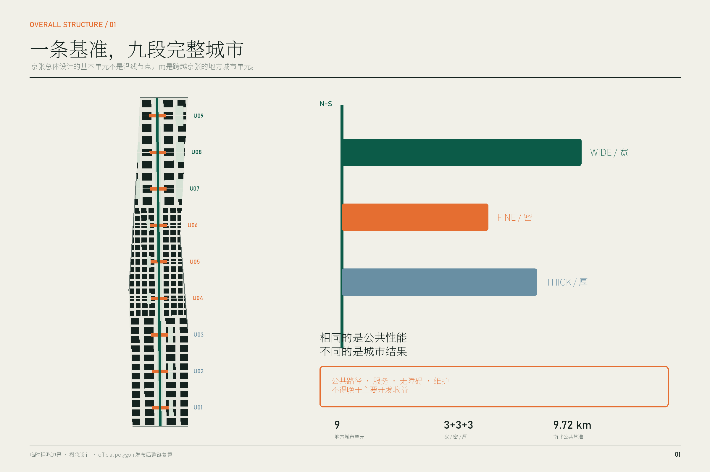
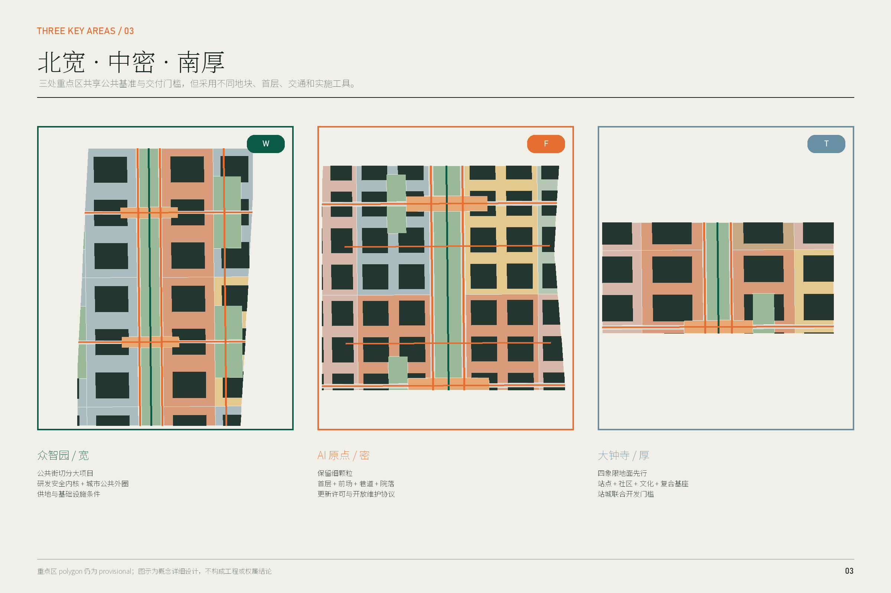
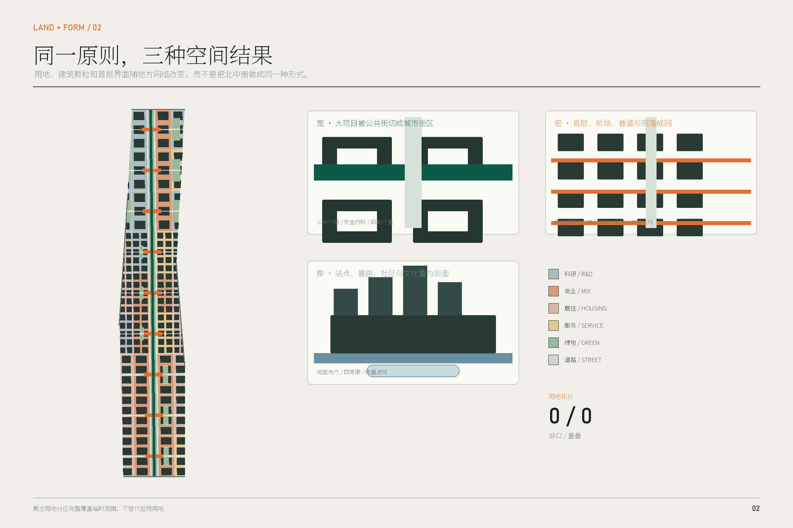
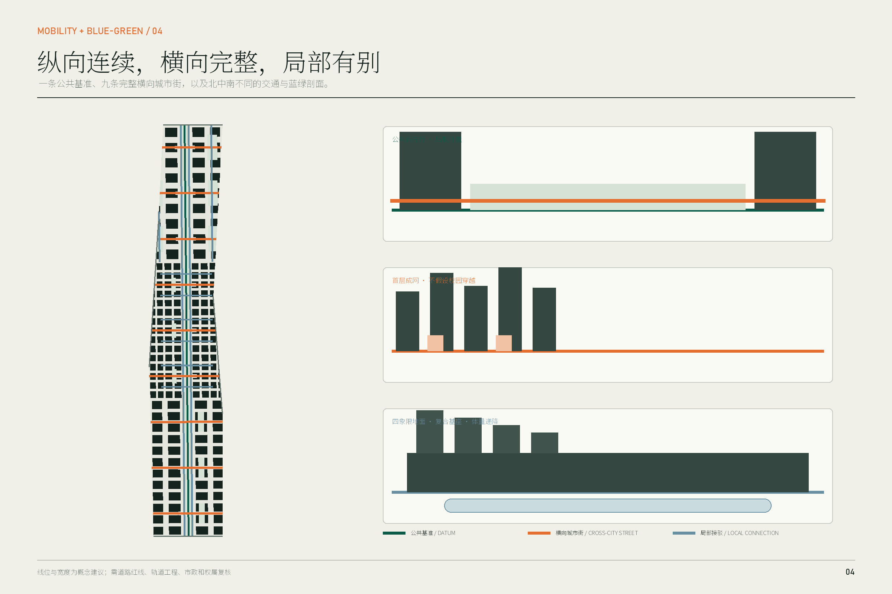
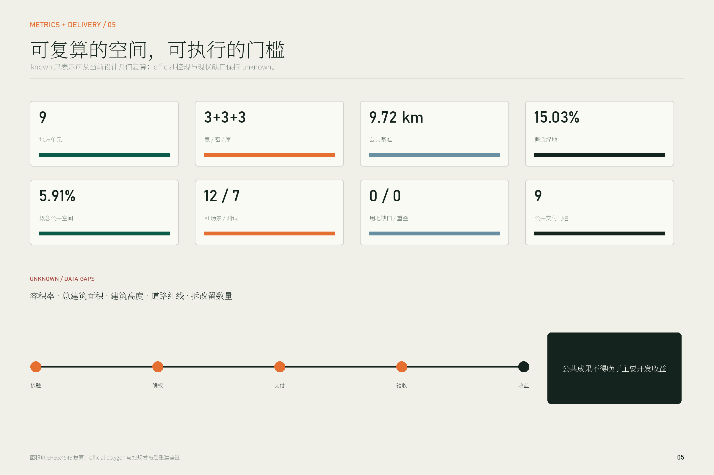

# 京张地方城市单元

## 摘要：设计的对象不是一条线，而是九段完整城市

京张铁路遗产使海淀拥有一条罕见的南北连续公共地表，但它穿过的并不是同一种城市：北段是正在综合更新的大尺度研发园区和生态河道，中段是高校、园区、社区与轨道站点彼此贴近的细密存量街区，南段则是站城、社区、文化遗产、传统商业和低效楼宇叠合的综合更新地区。若把京张只设计成一条景观轴或一串节点，设计只能改善走廊自身，不能决定两侧土地怎样组织、建筑怎样面向公共空间、公共服务何时交付。

本方案据此锁定一个空间判断：**京张总体城市设计的基本单元，是跨越京张并包含两侧真实城市关系的地方城市单元，而不是沿线节点。** 九个地方单元共同使用一条约 9.72 公里的南北公共基准，但不采用同一种形式。北段以“宽单元”把大项目切分为可穿行城市街区；中段以“密单元”通过首层、前场、巷道和院落形成细密公共网络；南段以“厚单元”把站点四象限、复合基座、社区服务和文化空间组织成有垂直深度的站城单元。[data:geometry/phasing.geojson#PHASE-U08] [metric:local_unit_count]

共同实施原则是：**公共成果不得晚于主要开发收益。** 每个单元设置一个公共交付门槛；公共路径、公共服务空间、无障碍连续性和维护责任完成并核验之前，主要开发不得先行进入租售、使用或合同收益兑现。它不是一句价值宣言，而是分别转译为北段的供地和基础设施条件、中段的更新许可与开放维护协议、南段的站城联合开发和综合更新节点。[depth:phasing_implementation]

### 成果边界

本方案全部空间建议均为概念建议、参考方案，可供专业团队深化研究，不替代法定规划、政府审定、工程设计、权属判断或实施承诺。仓库截至本方案生成时仍未提供官方精确红线、现状建筑、地块权属、道路红线、站点工程、文保控制线和经批准控规指标；所有几何使用仓库临时粗略 polygon。当前面积、长度和比例仅用于检验方案内部一致性，官方数据发布后必须整链替换和复算。[source:BOUNDARY-SOURCE] [assumption:A-BOUNDARY-001]

## 设计依据与资料清单

方案的主控依据是官方资格预审公告、面向智能体任务书、仓库 site package、2023 年国土空间调查规划用地用海分类指南，以及城市设计和控制性详细规划相关管理规定。公告明确三层范围、三处重点区和从产业生态到城市更新、交通、遗产公园与重点区详细设计的任务；任务书补充三大定位、五大功能、六项智能体任务、场景卡和长期运营要求。[source:OFFICIAL-ANNOUNCEMENT] [standard:PROJECT-AGENT-OPEN-CALL-TASKBOOK]

三条 2026 年公开资料对重点区深化尤其关键：

- 众智园已被列为区域综合性更新组团，更新对象同时包括低效产业园、公共安全设施、商业、市政和清河、小月河环境，实施单元统筹主体为东升镇政府。这说明北段不能只做单个园区总图。[source:ZHONGZHIYUAN-UPDATE-20260713]
- AI 原点社区已有高度集聚的企业生态，并已开展成府路、中关村东路、双清路等周边环境提升。这说明中段的首要动作是把存量首层和公共空间接成网络，而非整体推倒重建。[source:AI-ORIGIN-ECOSYSTEM-20260401] [source:AI-ORIGIN-PUBLIC-REALM-20250325]
- 大钟寺是跨北下关、北太平庄和中关村街道的区域综合性更新，公开任务已要求统筹公益性与经营性空间、成本收益、公共服务和近中远期时序。这为“厚单元”和公共收益门槛提供了现实实施对象。[source:DAZHONGSI-UPDATE-20260713]

资料使用分为三类：官方事实只来自正式公开来源；仓库临时边界只用于概念 intake；本方案几何、指标和空间机制均标注为 agent-generated design。任何涉及精确站口、现状通行权、拆迁、楼高、容积率和工程线位的结论均保持 unknown。[source:SOURCE-REGISTRY] [depth:risk_missing_data]

## 三层范围工作框架

### 统筹研究范围：判断地方网络，不满铺设计

约 43.6 平方公里统筹范围用于判断京张穿过哪些城市网络：高校与科研机构、产业园、社区、轨道站点、河道和城市服务。它不被设计成一个均质产业圈，也不强求三区形成可量化的产业互赖。总体层面统一的是不同地区与京张公共基准的关系，而不是统一每个地区的问题。[source:OFFICIAL-ANNOUNCEMENT]

### 总体设计范围：九个完整地方单元

约 11.4 平方公里总体设计范围被划为九个跨越京张的地方城市单元，每个单元都包含两侧用地、首层界面、横向公共街、南北公共基准、公共服务和一个实施门槛。九个单元按城市状态分成南部三厚、中部三密、北部三宽；边界是概念性实施框架，不是新的法定地块。[data:geometry/site_boundary.geojson#SITE-001] [data:geometry/phasing.geojson#PHASE-U01]

### 三处重点区：三种机制的详细原型

众智园、AI 原点和大钟寺分别用宽、密、厚原型达到详细城市设计深度。三处不是同一空间模板的复制，而是检验同一公共基准与同一交付原则如何在大项目更新、低扰动存量更新和综合站城更新中产生不同结果。[data:geometry/key_areas.geojson#PROV-KEY-001] [depth:three_key_area_detailed_design]

临时边界的面积复算为总体约 1,141.28 公顷，三处重点区仍采用公告的约数进行文字说明。临时 polygon 不能用于红线、征拆、精确地块面积或审批；取得 official polygon 后，九类几何、全部图件和 metrics 必须重算。[metric:site_area_sqm] [assumption:A-GEOGRAPHY-010]

## 统筹研究范围产业与未来城市研究

### 产业空间判断：用地方单元承载完整创新周期

公告要求贯通“0—1”原始创新与“1—100”产业化，并提出三区两翼。方案不把这一要求翻译成一条抽象产业轴，而是把不同创新活动放进适合其城市条件的空间单元：北段宽单元容纳受控研发、共享仪器、中试验证和独立后勤；中段密单元容纳高校成果、初创团队、专业服务与社区日常的高频接触；南段厚单元容纳智能体、内容消费、智能终端、国际交往、站城服务和面向公众的展示。两翼通过各地方单元的真实公共街、河道接口和服务接口接入，而不是要求全线形成封闭内部循环。[source:AI-DISTRICT-STRUCTURE-20240428] [depth:three_level_scope_framework]

### 六个国际案例：借鉴空间机制，不复制形象

| 案例 | 可核验机制 | 对京张的转译 | 明确不复制的部分 |
| --- | --- | --- | --- |
| Cambridge Kendall Square | 公共空间网络、细密街道、活跃首层和开发贡献共同改变封闭研发区 | 北段把公共街和社区可达性写入大项目交付条件 | 不复制生物医药园区风貌或产权制度 |
| Toronto MaRS Centre | 四栋建筑由公共中庭连接，并嵌入高校、医院和政府机构网络 | 中段用首层共同空间连接分属不同主体的知识与服务 | 不把一个大中庭当作全线原型 |
| Singapore one-north LaunchPad | 工作、居住、创业服务与测试接近布置 | 宽单元配置研发、人才日常和验证服务，但保持城市街道公共性 | 不复制封闭创业园或“AI村”包装 |
| Paris-Saclay Campus Urbain | 商业、第三空间、原型平台和日常服务补足分散校园 | 密单元以公共首层和短路径减轻校园—社区割裂 | 不复制低密新城尺度 |
| Barcelona 22@ | 创新空间与住房、公共交通、绿地和既有社区共同更新 | 将产业增量与居住、服务和公共空间放进同一地方单元核算 | 不以产业置换居民生活 |
| London King’s Cross | 铁路遗产、站点、混合功能、公共街道广场和社区服务同步更新 | 厚单元把到达、文化记忆、社区服务和开发基座视为一个剖面 | 不复制商业化遗产景观 |

这些案例共同证明，创新区的城市性不是由企业数量自动产生，而是由公共街道、可达首层、混合日常和开发责任形成。[source:CASE-KENDALL-PUBLIC-SPACE] [source:CASE-KINGS-CROSS]

### 命名与标识

方案名称“京张地方城市单元”直接说明设计方法，不把 AI 当作修辞。标识由一条连续竖线和宽、密、厚三种横向矩形组成：竖线代表公共基准，三种横向厚度代表地方城市单元。标识只使用原创几何和开源/系统字体；不使用企业商标、历史人物肖像或未清权铁路图像。[source:AGENT-TASKBOOK]

## 总体设计范围城市更新与控规深度城市设计

### 总体结构：一条公共基准、九个地方单元、三种城市结果

公共基准不是一条形式统一的景观带，而是一组全线不变的公共性能：

1. 南北慢行连续，并在每个地方单元接入东西公共街；
2. 地表无障碍连续，任何数字导航均有静态标识和人工替代；
3. 京张遗产叙事连续，但允许北、中、南采用不同材料、植被和活动；
4. 单元两侧首层提供可识别公共入口、可停留界面和必要服务；
5. 路径、服务、照明、排水和维护责任不得晚于主要开发收益。

这五项构成“相同”；街区大小、建筑类型、开放方式、交通组织和实施工具构成“不同”。[data:geometry/roads.geojson#ROAD-DATUM-001] [depth:urban_design_framework]

### 九个地方单元

| 单元 | 类型 | 横向完整关系 | 用地与建筑动作 | 公共成果门槛 |
| --- | --- | --- | --- | --- |
| U09 北五环创新门户 | 宽 | 城市门户—研发园—公共基准—生态/服务界面 | 公共街先行，研发大地块分段 | 门户街、慢行和雨洪绿地先开放 |
| U08 众智园研发验证 | 宽 | 研发—共享服务—公开验证—社区/生态 | 120—180 米量级概念街坊，安全内院、公共外圈 | 两条跨项目公共街和研发公共厅完成 |
| U07 清河生活研发 | 宽 | 研发园—生活配套—河道生态接口 | 后勤外置，公共服务临街 | 河道/公园接口与人才日常服务先完成 |
| U06 AI 原点细密 | 密 | 高校/研发—原点企业—社区服务—轨道接驳 | 保留细颗粒，改造首层、院落和前场 | 连续公共首层和至少两条独立公共路径生效 |
| U05 五道口日常网络 | 密 | 校园边缘—商业街—社区—站点 | 时段共享路缘、骑行和生活服务 | 无障碍路线、路缘和维护协议先运行 |
| U04 高校—社区接合 | 密 | 校园外公共路—知识服务—社区学习 | 不假设校园内通行，建立外部公共替代线 | 学习服务与外部公共路径先开放 |
| U03 南部门户复合 | 厚 | 到达—就业—居住—公共服务 | 复合基座和分层到达 | 到达空间与公共服务核验后开发使用 |
| U02 觉生寺文化社区 | 厚 | 遗产—社区—商业—公共基准 | 体量向文化遗产和住宅递降 | 文化公共空间、社区路径和维护先完成 |
| U01 大钟寺站城 | 厚 | 站点四象限—社区—产业—公共基准 | 站城复合基座、四象限地表网络 | 四象限无障碍和社区服务先于主要租售 |

表中尺度均为概念控制。地块红线、建筑高度和具体街宽须待官方资料和专业论证确认。[assumption:A-CONTROLS-002]

### 六个空间系统

#### 1. 用地关系

`land_use.geojson` 将临时总体范围完整划分为科研、商业服务、居住、社区服务、教育、医疗、文化、道路、公园和广场用地，拓扑复算为零缺口、零重叠。北段科研占主导并在公共基准附近配置服务；中段混合科研、教育、居住和社区服务；南段以商业服务、居住、社区服务和文化构成站城混合。该分类用于证明关系完整，不替代控规用地。[data:geometry/land_use.geojson#LU-U08-INNER_W] [metric:land_use_gap_ratio]

#### 2. 建筑与首层界面

184 个概念建筑基底用于检验街坊颗粒、院落、退让和首层朝向；它们不代表现状建筑或拟拆建筑。宽单元形成“公共前场—共享服务—安全门厅—受控研发内院”的四层阈值；密单元形成“小店/服务—共用门厅—院落—楼上研发或居住”的细密界面；厚单元形成“站点/城市地面—公共基座—共享平台—递降上部体量”的立体界面。数值高度保持 unknown，风貌以相对体量、街墙连续和遗产递降关系控制。[data:geometry/buildings.geojson#BLDG-001] [metric:building_height_m]

#### 3. 公共空间与蓝绿系统

连续公共基准、九个公共厅和各单元侧向绿室构成“线—厅—室”体系。概念绿地约 171.55 公顷，占临时范围 15.03%；公共空间面状并集约 67.44 公顷，占 5.91%。北段绿室兼顾清河/小月河方向雨洪与测试景观，中段提供树荫、口袋院落和街角停留，南段组织站前到达、文化缓冲与社区广场。比例是概念设计值，不是现状绿地率或审定指标。[metric:green_ratio] [metric:public_space_ratio]

#### 4. 交通结构

交通由一条南北绿道、两条公共基准侧街、九条完整横向城市街以及局部网络组成。宽单元把研发后勤放到外缘，公共街承担步行、骑行、公交接驳和共享服务；密单元增加六条细巷但不假设穿越校园或私产；厚单元优先连接站点四象限和地面公共服务。道路中心线是概念线位，路网复核必须补充现状流量、红线、轨道工程、市政管线和消防条件。[data:geometry/roads.geojson#ROAD-U06-CROSS] [assumption:A-TRANSPORT-005]

#### 5. 公共服务与新型基础设施

公共服务不集中成一个专项设施，而嵌入每个单元首层：北段为共享仪器、合规、人才餐厅与应急服务；中段为社区服务、终身学习、医疗转介、创业法务与日常商业；南段为站务、无障碍换乘、社区综合服务和文化导览。市政层面建议在公共街施工时同步预留可维护管廊、分布式能源接口、雨洪设施、公共充电和边缘算力机柜位置，但不在缺少容量资料时承诺系统规模。[depth:municipal_new_infrastructure]

#### 6. 实施单元

九个 PHASE polygon 同时是空间单元和责任单元，每个均登记 `public_gate_id`、收益触发点、法律工具、近期动作和复核记录。总体设计因此不仅给出形态，也给出“谁在什么节点必须先交付什么”的空间化实施框架。[data:geometry/phasing.geojson#PHASE-U01] [metric:public_delivery_gate_count]

## 重点区域详细设计

### 北段：众智园“宽单元”——把大项目变成城市街区

#### 真实条件与定位

官方更新公示把众智园片区定义为区域综合性改造，范围涉及学院路、清河、东升镇，以众智园、腾讯学知园和东升三期 604 为锚点，同时处理低效产业园、公共安全、商业、市政和清河/小月河环境。由此，重点区不是一个新建 AI 园总图，而是多个项目、生态边界和公共责任的组合。[source:ZHONGZHIYUAN-UPDATE-20260713]

#### 空间结构：两街一厅、公共外圈、安全内核

U08 作为主要宽单元，用两条东西公共街和公共基准围合“研发公共厅”。公共街从两侧既有城市目的地出发，穿过重点区而不止抵达园区门口；研发、共享仪器和中试建筑按约 120—180 米量级概念街坊组织。安全研发内院保留受控入口，外圈首层安排共享服务、展示、餐饮、会议和人才服务，使研发安全与城市公共性不再互相排斥。[data:geometry/public_space.geojson#PUBLIC-U08-HALL]

#### 建筑、首层与风貌

建筑采用中等高度的院落、条形和可分期模块，沿公共街形成连续但不封闭的街墙；靠清河、小月河和公共基准方向以较低、较疏的共享服务体量过渡。所有“留、改、拆、新”必须在建筑普查后决定：优先保留可用研发楼，改造首层和入口；只有结构安全、消防或公共街确需且履行法定程序时才讨论拆除。[assumption:A-EXISTING-003] [depth:retain_renovate_demolish]

#### 交通、公共空间与服务

公共交通、步行和骑行使用中部公共街；货运、设备和受控车流沿重点区外缘分流。两侧雨洪绿室把清河、小月河生态方向与公共基准接合；研发公共厅提供共享仪器预约、合规咨询、可观察验证窗和公共卫生/应急服务。测试场景必须在明确边界内运行，并设物理隔离、现场安全员和人工停机。[data:geometry/roads.geojson#ROAD-NORTH-LOGISTICS-W] [data:geometry/public_space.geojson#SCN-03]

#### 实施

东升镇政府作为公开资料中的实施单元统筹主体，可在后续深化中把公共街、管线、绿室和公共厅写入片区更新与项目条件。`GATE-U08` 的通过证据至少包括：两条连续公共路径、无障碍验收、照明排水运行、首层公共服务开门、维护主体和预算备案。其后才进入主要研发楼租赁、使用或相应合同收益节点。此机制是设计建议，须经政府、产权方和专业法律团队确认。[data:geometry/phasing.geojson#PHASE-U08]

### 中段：AI 原点“密单元”——让存量首层组成公共网络

#### 真实条件与定位

AI 原点社区已有密集企业生态，周边提升项目沿成府路、中关村东路、双清路等存量道路和建筑界面展开。这里最稀缺的不是新的大体量，而是分属校园、园区、楼宇和社区的入口、前场、巷道、院落能否形成可读、可达、可维护的日常网络。[source:AI-ORIGIN-PUBLIC-REALM-20250325]

#### 空间结构：两条公共主路、六条细巷、九类首层接口

U06 保留细颗粒街区，不新建贯穿式大路。两条独立公共路径绕开不确定校园内部通行，六条步行巷道以开放协议接入前场和院落；公共基准两侧布置小尺度服务界面。九类首层接口包括共享门厅、创业服务、社区窗口、学习空间、医疗转介、公共卫生间、低价餐饮、非机动车服务和夜间安全点。[data:geometry/roads.geojson#ROAD-U06-ALLEY-A]

#### 建筑、首层与风貌

既有楼宇优先采用“保留主体、打开首层、补充连廊、共享院落、屋顶轻量化利用”的低扰动更新。任何画出的概念建筑基底都不能被当成拆建清单。建筑界面控制关注 5—20 米的步行体验：入口可见、首层透明或有活动、设备与后勤不占主界面、骑行停车不堵塞无障碍路径。校园边界若不能开放，必须在公共道路一侧提供等效路线，而不是把可达性建立在未授权穿越上。[assumption:A-PUBLIC-ACCESS-007]

#### 交通、公共空间与服务

路缘采用可回退的分时管理：通勤时段保障步行与骑行，配送时段设置短停，活动时段在人工管理下转换。AI 只辅助预约、路径和冲突预警，静态规则与人工执法始终有效。AI 原点公共厅把企业服务和居民服务放在同一首层公共空间，但采用不同数据、权限和人工窗口。[data:geometry/public_space.geojson#PUBLIC-U06-HALL] [data:geometry/public_space.geojson#SCN-08]

#### 实施

中段不依赖一次性土地重组，而使用“更新许可＋公共通行/时段开放协议＋维护协议＋租约条款”。`GATE-U06` 要求至少两条独立连续公共路径、关键首层服务、无障碍和夜间安全核验先运行；主要楼宇更新后的新增租赁或使用收益不得早于这些公共成果。每六个月复核开放时段、投诉、维护和无障碍失效点，达不到标准则退回静态路线和人工服务。[data:geometry/phasing.geojson#PHASE-U06]

### 南段：大钟寺“厚单元”——把站点、社区和开发做成一个剖面

#### 真实条件与定位

大钟寺公开更新范围跨三个街道，包含平房院落、危旧楼、老旧小区、厂房、低效楼宇、传统商业、市政与公共空间；实施内容明确要求公益性与经营性空间、成本收益、公共服务和分期统筹。它天然需要一个比“站前广场”更厚的城市设计单元。[source:DAZHONGSI-UPDATE-20260713]

#### 空间结构：四象限、三层公共地面、两条递降关系

U01 把轨道站点四象限、京张公共基准、社区公共服务和产业复合基座放进同一单元。三层公共地面分别是：站厅与换乘层的清晰到达、城市地面的无障碍公共街与社区服务、经工程允许的上盖/屋顶共享平台。任何高架连桥、地下通道或站体改造均不被假定已可实施；方案优先保证地面四象限连续，再把立体连接作为专业论证后的增强。[data:geometry/roads.geojson#ROAD-U01-CROSS] [assumption:A-TRANSPORT-005]

两条递降关系控制体量：从轨道和产业节点向现状社区递降；从主要开发体量向觉生寺等文化遗产及其控制环境递降。具体高度、视廊和退界在文保控制线发布前保持 unknown。[assumption:A-HERITAGE-006]

#### 用地、建筑与首层

站点附近采用混合基座，容纳站务、便民商业、社区服务、国际交往和 AI 原生企业共享空间；上部体量根据批准控规再分配办公、居住和人才公寓。靠社区一侧首层优先布置卫生、照护、学习和低价日常服务，靠文化遗产一侧形成低强度文化空间与安静步行界面。停车和后勤从外缘进入，避免切断四象限地表公共路线。[data:geometry/land_use.geojson#LU-U01-OUTER_E]

#### 公共空间、文化与服务

“京张百年到达厅”不是纪念性大建筑，而是站点到城市的公共厅：同一地面同时解释铁路遗产、指向社区和公共服务、提供等候休息与无障碍转乘。与 U02 的觉生寺文化社区单元共同形成“铁路自主创新—当代开放协作—日常社区记忆”的三段叙事。[data:geometry/public_space.geojson#PILGRIMAGE-S]

#### 实施

`GATE-U01` 嵌入站城联合开发和区域综合更新：四象限至少一条连续地面无障碍路线、站前公共厅、社区综合服务和维护协议须先于主要办公商业租售或投入使用。经营性开发可承担公共空间和设施成本，但公共性不能只以“可进入”表述，必须明确开放时段、禁止行为边界、维护、投诉与人工服务。[data:geometry/phasing.geojson#PHASE-U01]

## AI 创新生态、人才画像与 AI+ 场景

AI 不是总体结构的理由。总体结构来自场地的铁路连续性与地方城市差异；AI 只在已有空间和公共责任明确后，承担预约、导航、测试、转介和运营辅助。所有场景遵循数据最小化、默认不使用生物识别、人工复核、可安全退回静态模式和独立影响评估。[standard:GENERATIVE-AI-INTERIM-MEASURES]

### 七类使用者

1. 需要受控环境、设备后勤和短路径协作的科研人员；
2. 需要低成本首层服务、展示和合规支持的初创团队；
3. 在高校、社区和企业间频繁移动的学生与教师；
4. 需要连续日常服务、安静空间和人工窗口的长期居民与老年人；
5. 依赖无障碍路线、清晰换乘和可预期开放时间的行动不便者；
6. 需要不与公共人流冲突的配送、维护、物业和实验后勤人员；
7. 需要快速理解地方关系而不进入封闭园区的访客、投资者与国际人才。

### 十二张场景卡

| ID | 空间与服务对象 | AI 作用 | 数据与人工兜底 | 运营与风险 |
| --- | --- | --- | --- | --- |
| SCN-01 共享仪器预约 | U08 研发公共厅；科研与初创团队 | 匹配时段、设备与培训 | 只用账号和预约数据；人工服务台确认 | 园区运营；防止资源歧视与过度收集 |
| SCN-02 低速配送走廊* | U08 外缘后勤线；维护与配送人员 | 冲突预警和时窗调度 | 不做人脸识别；现场安全员可停机 | 道路管理；测试失败退回人工调度 |
| SCN-03 具身系统公开验证窗* | U08 受控测试边界；企业与公众 | 记录测试条件和风险事件 | 匿名计数；第三方和人工急停 | 测试主体；不得把公众当无知情测试对象 |
| SCN-04 模型合规门诊 | U07 首层服务；中小企业 | 辅助材料检查与法规导航 | 企业自愿提交；专业人员签署结论 | 专业机构；AI 不替代法律判断 |
| SCN-05 无障碍路径助手* | U06 公共路径；行动不便者 | 报告临时障碍和替代线 | 不追踪个人身份；静态标识和人工导航常驻 | 街区运营；错误路线立即下线 |
| SCN-06 终身学习匹配 | U06 学习首层；居民、学生、教师 | 匹配公开课程和空间 | 只用报名信息；社区工作者复核 | 教育与社区机构；避免画像排除 |
| SCN-07 社区服务分诊 | U05 社区窗口；居民 | 辅助识别应去的线下服务 | 不作医疗诊断；人工柜台最终受理 | 社区服务机构；特殊人群优先人工 |
| SCN-08 路缘时段管理* | U05 街道；骑行、配送、商户 | 预测冲突并建议时段 | 摄像数据边缘处理；人工执法 | 交通管理；失效退回固定时段 |
| SCN-09 首层空置匹配 | U04 可改造首层；小微企业与公共服务 | 匹配需求、租期和空间条件 | 产权与申请材料最小化；人工审核 | 产权方联合体；防止租金歧视 |
| SCN-10 四象限换乘助手* | U01 站城地面；通勤者与访客 | 提供无障碍和拥挤替代路线 | 不默认定位留存；站务员和固定导视兜底 | 轨道运营；工程和消防优先 |
| SCN-11 京张多语导览 | U02 文化社区；公众 | 多语种解释公开史料 | 内容引用可追溯；文化机构审校 | 防止伪史与商业广告挤占 |
| SCN-12 客流与极端天气响应* | U01 公共厅；所有使用者 | 预警拥挤、积水、热风险 | 只用必要环境和匿名客流；人工应急指挥 | 属地政府；不可自动作出强制决定 |

带 * 的七项为测试/验证场景，超过任务书不少于三项的要求；全部 12 个节点已映射到 GeoJSON。[metric:ai_scenario_node_count] [metric:testing_validation_scenario_count]

## 用地、建筑规模与拆改留方案

方案的用地结构已按国家用地分类子集编码，并以 EPSG:4548 复算覆盖临时范围。概念建筑基底面积约 395.77 公顷，占临时范围约 34.68%；该比例只用于形态检验，不是现状建筑密度或规划上限。总体建筑规模、容积率、楼高、地下空间和停车规模均为 unknown，因为缺少官方控规和现状建筑底数。[standard:MNR-LAND-USE-CLASSIFICATION-GUIDE] [metric:conceptual_building_footprint_ratio]

拆改留采用“调查先于分类”：

- **留**：有继续使用价值、承载社区记忆、符合安全且不妨碍必要公共路径的建筑优先保留；
- **改**：重点改造首层、入口、消防、无障碍、能源和院落，尤其适用于中段；
- **拆**：仅在结构安全、依法认定的公共设施需求或无法替代的连通条件下讨论，并履行法定程序；
- **新**：优先补充公共服务、混合首层和能完成街区界面的增量体量。

因此 `retain_building_count`、`renovate_building_count`、`demolish_building_count` 当前均保持 null，而不是用概念基底伪造清单。[metric:retain_building_count] [assumption:A-EXISTING-003]

## 交通、轨道、市政与公共服务设施

九条完整横向城市街构成单元骨架，但“完整”不是指画穿边界，而是须连接两侧公共道路、站点、社区或园区公共入口，并以法律和运营文件确认。南北公共基准提供全线慢行识别；汽车只在需要处跨越或到达，不能占用公共厅。北段货运外置，中段路缘分时，南段四象限地面先行。[metric:complete_cross_unit_route_count]

轨道站点深化遵循三条规则：地面无障碍网络优先于昂贵连桥；站口到公共服务和公共基准的路径可见；换乘、非机动车和后勤不互相阻断。站体、出入口和地下线位资料缺失，因此不提出工程口、隧道和连桥坐标。[assumption:A-TRANSPORT-005]

市政与新基建采用“随公共街一次施工、分系统复核”的策略：先核雨污水、供电、消防和燃气等传统安全容量，再预留共享能源、充电、边缘计算和测试接口。任何 AI 设施不得挤占树池、盲道、消防登高面和公共停留空间。公共服务实行首层分布式配置，并保留线下人工窗口。[standard:BARRIER-FREE-ENVIRONMENT-LAW]

## 蓝绿空间、公共空间与城市风貌

南北公共基准在性能上连续，在形态上变化：北段更宽、更生态，允许雨洪和研发验证；中段收窄为树荫、院落和街角连续；南段增厚为站前、文化与社区共享地面。侧向绿室不是走廊装饰，而是把清河、小月河方向、校园/社区院落和站城公共空间引入地方单元。[data:geometry/green_space.geojson#GREEN-U08-ROOM]

### 三个朝圣/荣誉节点

1. **自主创新公开验证场（北）**：展示可复核的研发与安全测试过程，而非企业广告；
2. **原点开源会客厅（中）**：承载开发者、居民、学生和公共服务的开放协作；
3. **京张百年到达厅（南）**：把铁路自主创新史、当代城市更新和日常换乘放在同一公共地面。

三者不追求地标体量，而通过长期开放、可信内容和重复发生的公共活动形成荣誉感。位置均为概念节点，建设须另行批准。[metric:pilgrimage_node_count]

### 文化叙事与风貌

文化叙事是“从自主修筑，到开放协作，再到公共验证”：铁路遗产不是背景皮肤，而是公共技术如何被社会看见、使用和检验的历史线索。北段材料偏向耐久工业构件和生态地表，中段保留细碎招牌、院落与日常尺度，南段以铁路和寺院文化环境的克制材料、递降体量和安静界面为主。全线不使用仿古铁路构件、巨型屏幕或统一“科技蓝”覆盖地方差异。[depth:height_massing_character]

## 更新项目清单、实施政策与分期计划

### 公共成果门槛

“主要开发收益”取最早发生的以下节点：主体开发开始租售；主体建筑投入使用；或实施合同约定开发付款达到 30%。在此之前，至少完成四类公共成果：

1. 有法律效力的公共通行或开放文件；
2. 接到既有公共道路的连续、无障碍、照明和排水路径；
3. 方案承诺的公共服务空间实际开放并有人工服务；
4. 维护主体、预算、开放时段、投诉与失效回退记录可查。

30% 是方案建议的合同触发定义，不是现行法规或已签署条款；实施主体可采用更严格的正式节点。[assumption:A-IMPLEMENTATION-008]

### 十二项更新行动

| 编号 | 项目 | 空间对象 | 实施工具 | 先行公共成果 |
| --- | --- | --- | --- | --- |
| P01 | 公共基准连续工程 | 全线 | 公共空间与慢行专项 | 连续、无障碍、照明、排水和遗产解释 |
| P02 | 九条完整横向城市街 | U01—U09 | 道路/地役权/更新协议 | 连接两侧真实公共目的地 |
| P03 | 众智园公共街与管线先行 | U08 | 片区更新与项目条件 | 两街、绿室、基础市政先交付 |
| P04 | 研发公共厅与验证窗 | U08 | 公共服务配建与运营协议 | 人工服务、安全边界和公众观察界面 |
| P05 | AI 原点首层开放网络 | U06 | 更新许可、租约和开放协议 | 两条公共路径、六条细巷分级生效 |
| P06 | AI 原点日常服务包 | U05—U06 | 楼宇更新与社区合作 | 学习、医疗转介、餐饮、无障碍服务 |
| P07 | 大钟寺四象限地面网络 | U01 | 站城联合开发条件 | 四象限至少一条连续无障碍路线 |
| P08 | 大钟寺社区服务基座 | U01—U02 | 综合更新与配建 | 社区窗口、卫生、照护和文化服务 |
| P09 | 觉生寺文化缓冲与慢行 | U02 | 文保专项和公共空间更新 | 控制线复核、安静步行和内容审校 |
| P10 | 公共交付契约模板 | 九单元 | 供地/许可/合同附件 | 统一 gate、证据和回退格式 |
| P11 | 可回退 AI 场景治理 | 三重点区 | 场景许可和影响评估 | 数据最小化、人工兜底和停机测试 |
| P12 | 单元绩效公开台账 | 全线 | 年度运营和公众参与 | 开放、维护、无障碍和投诉记录公开 |

### 近、中、远期

- **近期：确认与先行。** U08、U06、U01 作为三类原型，先完成官方边界/权属/建筑/交通核验、公共交付文件和低风险临时公共空间；不以大型新建启动作为“开工”。
- **中期：按单元实施。** U02、U05、U07 扩展经过验证的机制；每个单元的公共路径、服务和维护先于或同步于建筑垂直开发。
- **远期：连续而不统一。** U03、U04、U09 和衔接段补齐，并依据使用后评估调整单元边界和空间原型，不冻结一种形式。[data:geometry/phasing.geojson#PHASE-U09]

### 年度活动与长期运营

长期运营采用四季而非一次性节庆：春季“公共基准步行审计”检查无障碍与维护；夏季“开放验证周”在北段展示可复核测试；秋季“原点开源周”连接开发者、学生和社区；冬季“京张城市记忆月”更新口述史和公共档案。活动品牌、经费和主办方均为建议，须由后续实施主体确认。每项活动必须产生一份空间问题清单和下一年度维修/更新决定，避免活动与城市维护脱节。[source:AGENT-TASKBOOK]

## 指标体系、面积复算与合规矩阵

当前 metrics 分为三种证据等级：`verified_design_structure` 表示九单元、十二场景、三节点等设计结构；`conceptual_design_geometry` 表示从概念图层复算的面积和长度；`unknown` 表示缺少官方或现状数据，不能闭合。known 不等于现状真实或规划批准。[depth:metrics_recalculation]

| 指标 | 当前值 | 证据性质 | 设计意义 |
| --- | ---: | --- | --- |
| 临时总体范围 | 11,412,825 m² | provisional constraint | 只用于内部复算 |
| 用地缺口/重叠率 | 0 / 0 | conceptual topology | 证明方案空间关系完整 |
| 概念绿色空间 | 1,715,513 m² / 15.03% | conceptual design | 检验公共基准与侧向绿室规模 |
| 概念公共空间 | 674,369 m² / 5.91% | conceptual design | 检验公共厅、首层界面和节点 |
| 南北公共基准 | 9,716 m | conceptual alignment | 检验全线连续性 |
| 地方单元 | 9（3 宽、3 密、3 厚） | verified structure | 总体设计的实施与空间单元 |
| 完整横向城市街 | 9 | conceptual route | 每个单元至少一条完整关系 |
| 公共交付门槛 | 9 | verified structure | 一单元一责任闭环 |
| AI 场景/测试场景 | 12 / 7 | verified structure | 任务书场景覆盖 |
| 朝圣/荣誉节点 | 3 | verified structure | 北中南文化公共节点 |

容积率、总建筑面积、建筑高度、真实建筑密度、道路面积、拆改留数量均为 null。正式边界、控规和现状底图到位后，依次重建 site/key areas、现状约束、用地、建筑、道路、公共空间和分期，再运行 EPSG:4548 面积与拓扑复算。[metric:floor_area_ratio] [metric:road_area_sqm]

## 风险、版权与合规说明

- **边界与位置风险：** 所有 polygon 为临时粗略替代，不可用于红线、征拆或工程坐标。[assumption:A-BOUNDARY-001]
- **法定指标风险：** 不给出未经批准的容积率、高度、密度、退界和停车结论。[assumption:A-CONTROLS-002]
- **拆改留风险：** 概念基底不代表现状或拆除，须先完成普查、结构、消防和权属评估。[assumption:A-EXISTING-003]
- **公共性风险：** 图示通道须由道路、地役权、开放时段和维护协议闭合，不能以“可进入”代替公共权利。[assumption:A-PUBLIC-ACCESS-007]
- **工程与文保风险：** 站体、桥隧、河道、管线和文保环境须由专业专项确认。[assumption:A-HERITAGE-006]
- **AI 风险：** 场景不默认采用人脸识别或持续身份追踪；强制决定必须由有权人工主体作出。[assumption:A-AI-DATA-009]
- **版权：** 图纸、标识、文字和代码由参与者与智能体原创生成；公共底图不使用外部截图或未清权素材。完整声明见 `report/copyright_statement.md`。

方案符合城市设计对总体与重点地区设计、公共空间、建筑形态和实施引导的要求，但不越权替代控规与审批。[standard:MOHURD-URBAN-DESIGN-MEASURES] [standard:MOHURD-CONTROL-DETAILED-PLANNING]

## 参考资料

以下来源均登记于机器可读来源清单，并与正文事实判断逐项关联。[source:OFFICIAL-ANNOUNCEMENT] [source:SOURCE-REGISTRY] [standard:MNR-LAND-USE-CLASSIFICATION-GUIDE]

1. 北京市规划和自然资源委员会海淀分局：《百年京张 AI 创新带城市设计国际方案征集资格预审公告》，2026-05-09。
2. 《面向全球智能体开展“百年京张 AI 创新带城市设计开源征集”的任务书摘录》，2026-05-18。
3. 北京市城市更新服务平台：《众智园 AI 自主创新加速区更新片区综合化城市更新组团市级重点项目谋划》，2026-07-13。
4. 北京市城市更新服务平台：《百年京张 AI 创新带—南部大钟寺 AI 产业集聚区更新片区》，2026-07-13。
5. 首都之窗：《让顶级资源浇灌创新土壤——百年京张 AI 创新带系列报道之“原点爆发”》，2026-04-01。
6. 北京市公共资源交易服务平台：《海淀区 AI 原点社区周边环境整治提升项目》，2025-03-25。
7. 自然资源部：《国土空间调查、规划、用途管制用地用海分类指南》，2023。
8. City of Cambridge, *Connect Kendall Square Framework Report*.
9. MaRS Discovery District, *MaRS Centre*.
10. JTC Singapore, *Refreshed Masterplan for LaunchPad @ one-north*, 2026.
11. EPA Paris-Saclay, *Campus Urbain commerce and animation strategy*.
12. Islington Council, *King’s Cross Planning and Neighbourhood Framework*.
