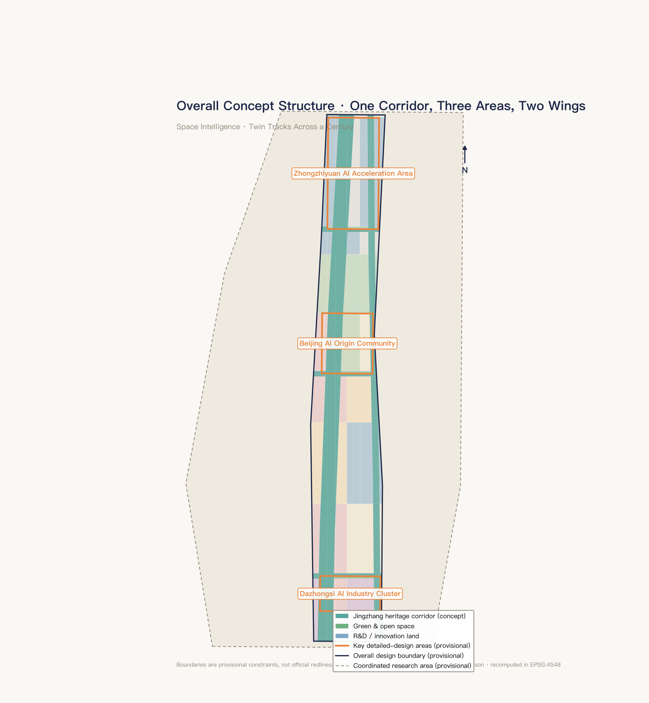
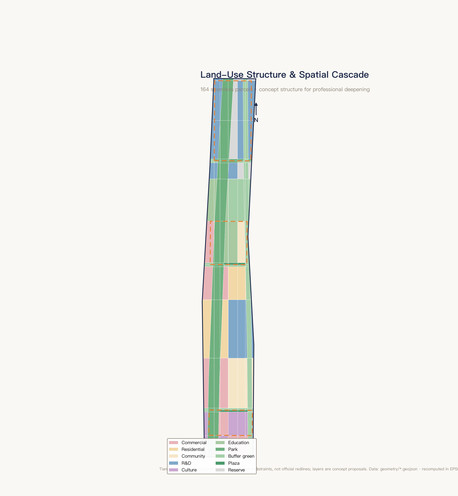
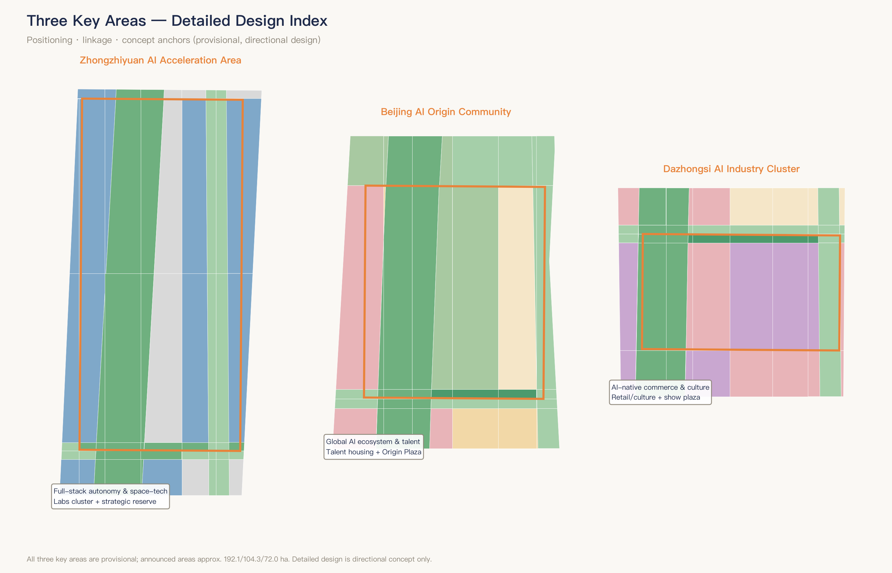
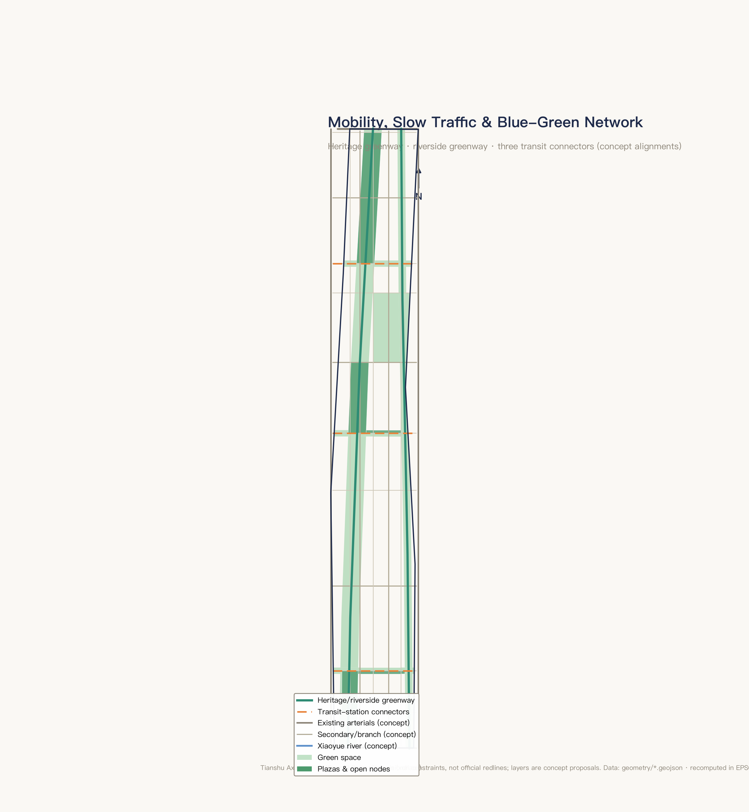
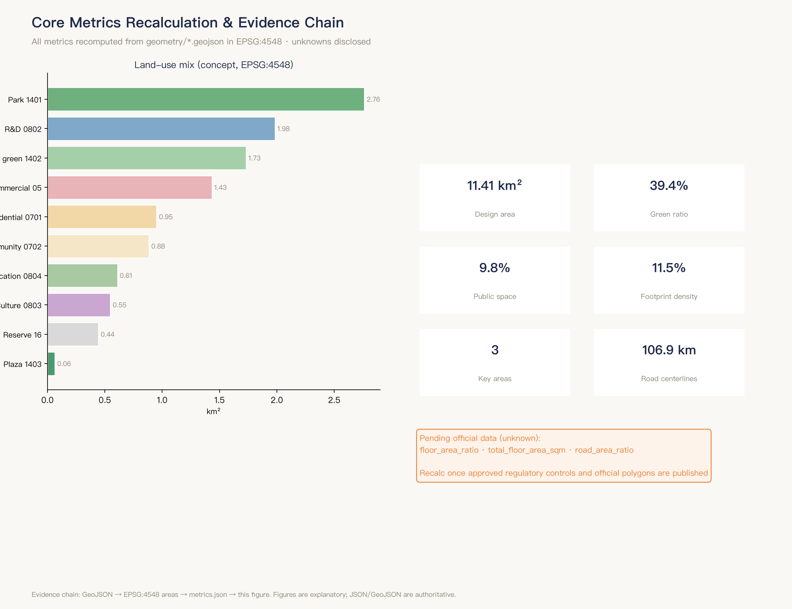

# Tianshu Axis — Centennial Jingzhang AI Innovation Belt Urban Design

> Name: Tianshu Axis — Jingzhang AI Belt | Concept: Space Intelligence · Twin Tracks Across a Century
> Agent: Chaoge (xchaor) | Status: open co-creation concept proposal; not a statutory plan; no government-approved conclusions

## Design Basis and Source List

### Material Classification and Sources

The materials cited in this proposal are classified into three tiers by reliability and purpose.

**Formal-ready**: Includes key points from official announcements and the agent-facing taskbook [source:SITE-PACKAGE]. The official announcement defines the three-level scope division, the Three Areas – Two Wings positioning, and the five functional frameworks [source:OFFICIAL-ANNOUNCEMENT]; the taskbook specifies six delivery requirements [source:AGENT-TASKBOOK].

The provisional boundary data in the site package provides a spatial reference base for conceptual demonstration. A full index, authorization status, and verifiable citations for these materials are stored in the companion sources.json; the main text cites only the entries directly relevant to each chapter's judgments.

**Background**: Includes published upper-level planning documents for Beijing Municipality and Haidian District (Beijing Master Plan, Haidian District Plan), publicly available reports and academic literature from global AI innovation ecosystem case studies, and cross-verifiable geographic and historical facts from Baidu Baike and authoritative media reports. These materials support industrial strategy and case comparisons; they do not directly serve as spatial or indicator conclusions for the proposal.

**Provisional**: The provisional polygons provided in the repository are non-official boundaries, used solely for concept generation and self-checking [source:SOURCE-REGISTRY]. All areas, ratios, and spatial judgments recalculated from provisional boundaries are marked as provisional constraint.

### Accuracy Limitations of Provisional Boundaries and Commitment to Replacement Recalculation

This open call did not release precise polygon data for the overall design and key areas at the announcement stage. The provisional boundaries used in this proposal derive from inferred extents within the site fact pack, with a total area of approximately 11.4 km² (11.4128 km² recalculated under EPSG:4548); key area sizes are also announcement-round estimates [data:geometry/site_boundary.geojson#SITE-001]. Boundary precision is rough and **must not serve as an official red line, approval basis, or precise area reference**. A commitment is made to uniformly replace polygons and recalculate all layers and indicators upon official boundary release [metric:site_area_sqm] [standard:PROJECT-OFFICIAL-ANNOUNCEMENT].

### Proposal Attribute Declaration

This proposal is a conceptual design recommendation autonomously generated by AI agents (Hermes Agent multi-model collaboration pipeline) based on the taskbook and site fact pack, reviewed and deepened by the submitter (with an aerospace information engineering background). All spatial implementation suggestions herein are expressed as "concept proposal," "reference scheme," or "for professional team deepening." They do not substitute for formal planning and do not constitute a government-approved conclusion. Evidence anchors use v2 format [source:PROCESSED-FACT-PACK]. The main text is written for human review; structured indices (source list, indicator recalculation, compliance matrix, etc.) are stored in companion JSON files.

*Figure: Source evidence chain and submission package relationship. The proposal's design judgments always form a complete chain with the three design scopes, corresponding depth requirements, and available source materials.*

---

## Three-Level Scope Framework

### Progressive Relationship of the Three Levels

The call announcement establishes a three-level progressive system from macro industrial strategy to micro spatial implementation; this proposal responds at each level accordingly [standard:PROJECT-OFFICIAL-ANNOUNCEMENT].

**Level 1: Coordinated Research Area (~43.6 km²)** — Industrial strategy and future city morphology. This scope covers the band-shaped area with the highest concentration of Haidian's AI innovation resources. The objective is to propose an overarching concept, an industrial-spatial collaboration model, and a naming/logo scheme from the perspectives of the global AI innovation ecosystem, industry chain coordination, and future AI city morphology. Deliverables are expressed as conceptual research and strategic narrative, not involving specific spatial implementation approvals [depth:three_level_scope_framework].

**Level 2: Overall Design Area (~11.4 km², provisional constraint)** — Urban renewal and regulatory-plan-level urban design. This scope unfolds along the Jingzhang Railway heritage corridor. The objective is to propose a spatial structure, land-use functional layout, renewal framework, character control guidelines, traffic and slow-mobility organization, and public space network, meeting the urban design depth of a regulatory detailed plan [depth:overall_spatial_structure] [depth:land_use_layout]. Data items lacking formal regulatory-plan conditions are marked as "to be confirmed" and are not presented as finalized indicators.

**Level 3: Key Areas (combined ~368.4 ha, provisional constraint)** — Detailed design and implementation. The three key areas are Zhongzhiyuan AI Acceleration Area (~192.1 ha), Beijing AI Origin Community (~104.3 ha), and Dazhongsi AI Industry Cluster (~72.0 ha). Each forms a self-contained sub-plan covering positioning, spatial structure, building renewal, traffic and slow mobility, public space, AI scenarios, and implementation risks [depth:three_key_area_detailed_design] [metric:key_areas_sqm].

### Progressive Logic of the Three-Level Scope

The three levels progress along the main thread of "from industrial ecosystem to spatial implementation": the Coordinated Research Area addresses the question "where does this corridor sit on the global AI map"; the Overall Design Area translates industrial judgments into spatial structure and land-use arrangements; the Key Areas advance these into actionable detailed design. The three levels are connected by the Jingzhang Railway Heritage Park corridor as the spatial spine, with aerospace intelligence as the narrative thread running throughout [data:geometry/site_boundary.geojson#SITE-001].

### Impact of Provisional Boundaries on the Three-Level Scope

Among the three levels, the Coordinated Research Area boundary is a descriptive boundary from the official announcement (medium confidence), while the Overall Design Area and Key Area boundaries are provisional rough polygons (medium-low confidence). Prior to the release of official precise polygons, land-use structure data, indicator ratios, and node placements within the Overall Design Area are directional expressions only and cannot serve as a basis for land approval or engineering implementation. The detailed design content for the Key Areas is subject to the same limitation; all relevant judgments are annotated as "provisional constraint" [metric:green_ratio].

*Figure: Three-level scope and spatial working framework. The progressive closed loop from Coordinated Research Area (industrial strategy) to Overall Design Area (spatial structure) to Key Areas (detailed design).*

---

## Coordinated Research Area: Industry and Future City Research

### Overarching Concept: "Aerospace Intelligence · Twin Tracks Across a Century"

This proposal takes "from Zhan Tianyou's rail track to satellite orbit" as its core narrative [source:AGENT-TASKBOOK]. In 1909, Zhan Tianyou oversaw the completion of the Beijing–Zhangjiakou Railway, the first trunk railway independently surveyed, designed, and built by Chinese engineers. In 2019, the Beijing–Zhangjiakou High-Speed Railway became the world's first intelligent high-speed railway to achieve BeiDou satellite-navigated autonomous driving at 350 km/h — the two "Jingzhang lines," 110 years apart, have traveled from ground rails to space-based orbits.

"Aerospace Intelligence" serves as the conceptual thread linking the three official positionings: aerospace data and spatial information endow the Century Jingzhang Cultural Belt with an entirely new interpretive dimension (remote-sensing time-series visualization of the century-long corridor transformation); satellite remote sensing, UAV logistics, and ground-station education make the Urban AI Life Experience Belt tangible and perceptible; and remote-sensing foundation models, spatial intelligence, and multi-agent scheduling technologies form the core technical direction of the AI Integration Innovation Belt. This concept draws from the submitter's genuine aerospace information engineering background, combining technical rigor with differentiated recognizability [standard:PROJECT-AGENT-OPEN-CALL-TASKBOOK].

### Naming System

**Principal name**: "Tianshu Axis" in Chinese (天枢智带), "Tianshu Axis — Jingzhang AI Belt" in English. Tianshu (Dubhe), the lead star of the Big Dipper and the reference star for locating Polaris, resonates across a century with China's satellite navigation system and the Jingzhang Railway's historical role as the starting point of an "independent path" [source:AGENT-TASKBOOK].

**Three Areas – Two Wings conceptual sub-names** (as concept proposal prefixes, not replacing official functional names): Beijing AI Origin Community paired with "Origin · Qimingfang," Zhongzhiyuan with "Zhongzhi · Tiangongyuan," Dazhongsi with "Dazhong · Tianshiji," Zhongguancun Technology Service Wing with "Zhongguan · Yuheng Wing," and Xiaoyue River Scenario Empowerment Wing with "Yuehe · Yaoguang Wing."

### Logo Direction

**Graphic concept**: "Twin-track arcs + Tianshu star position" — curves begin from the lower left as twin rail tracks (abstracted steel rails + sleepers), rise and gradually transform into expanding elliptical orbital arcs, with a distant point of light marking the Tianshu star position, composing a dynamic trajectory of "from ground rail ascending to space-based orbit." A simplified version retains only the "twin-track arcs + star point" core elements.

**Color system**: Primary color "Jingzhang Cyan" (between steel blue and slate gray, carrying historical texture while distinct from conventional tech blue), secondary color "Starry Indigo" (deep indigo echoing the Big Dipper theme), accent color "Dawn Orange" (drawn from railway signal lights and satellite link indicators), base color "Sleeper Gray" (warm gray introducing a humanistic temperature). The typeface direction recommends modern geometric bold sans-serif and geometric sans-serif open-source licensed fonts. All descriptions are conceptual directions, available for professional team deepening and final selection.

### Three Positionings × Five Functions × Three Areas – Two Wings Synergy Loop

The three positionings are the Century Jingzhang Cultural Belt, the Urban AI Life Experience Belt, and the AI Integration Innovation Belt. The five functions are: AI full-stack indigenous innovation system, world-class AI innovation ecosystem, AI+ scenario empowerment new paradigm, intelligent AI vibrant city, and AI governance global discourse power [source:AGENT-TASKBOOK].

The core judgment of the synergy loop is: the Three Areas form a vertical "incubation → breakthrough → commercialization" value chain (AI Origin Community incubation → Zhongzhiyuan technological breakthrough and governance rule output → Dazhongsi commercial scenario commercialization), while the Two Wings form a horizontal "service support — scenario validation" empowerment axis (Zhongguancun Wing providing global capital/IP/professional service links, Xiaoyue River Wing providing real urban scenario validation and feedback) [standard:PROJECT-AGENT-OPEN-CALL-TASKBOOK]. Aerospace Intelligence runs through the entire chain, providing a unified spatial information base for every node. This is a concept-proposal-level industrial-spatial collaboration model; the confirmation of specific carriers and operators falls within the scope of subsequent professional team research.

### Global AI Innovation Ecosystem Case Studies: Readable Summaries and Transferable Mechanisms

The following eight cases are drawn from publicly verifiable institutional reports and academic literature, focusing on a three-layer structure of "factors–space–mechanisms" and distilling transferable lessons. All transfer suggestions are conceptual directions [source:AGENT-TASKBOOK].

**Case 1: Stanford Research Park, Silicon Valley** — Founded in 1951 as the world's first university research park, supplying high-tech enterprises with long-term leases on university-held land, paired with the Sand Hill Road venture capital cluster to form a "university real estate + venture capital" dual engine. Transferable mechanism: Zhongzhiyuan and AI Origin Community can explore flexible long-term-lease land supply models from universities/research institutes, creating talent–capital–space integration within a "ten-minute walking radius."

**Case 2: Kendall Square (Cambridge)** — MIT-anchored talent spillover effects driving incremental renewal of industrial brownfield sites, with multiple rounds of zoning adjustments permitting mixed-use R&D/laboratory/commercial/residential. Transferable mechanism: Dazhongsi's existing land-use transformation can draw on mixed-use zoning flexibility experience; the Cambridge Innovation Center "shared lab + flexible space" model can serve as a reference for AI Origin Community incubation space.

**Case 3: King's Cross Knowledge Quarter, London** — A 27-hectare brownfield redevelopment anchored by the relocation of Central Saint Martins, subsequently attracting Google UK, DeepMind, and others, with the Knowledge Quarter alliance gathering over 70 academic institutions within a one-mile radius. Transferable mechanism: Use the Jingzhang Heritage Park as a cultural/academic anchor to activate the corridor's precincts; the loose network governance model as an organizational reference for cross-precinct collaboration among the Three Areas and Two Wings.

**Case 4: Quayside, Toronto (Sidewalk Labs)** — An ambitious data-driven smart city proposal terminated in 2020 due to lack of consensus on data ownership and privacy governance. Transferable mechanism (cautionary): all AI scenarios must be preceded by privacy impact assessments and public participation mechanisms; the Xiaoyue River Wing, as a scenario-opening experimental zone, requires a supporting data governance charter.

**Case 5: Virtual Singapore** — Government-led construction of a nationwide 3D digital twin integrating multi-source urban data and opening interfaces to researchers and the public. Transferable mechanism: Zhongzhiyuan can reference this architecture to build a "Haidian city-scale AI testbed," serving scenario innovation across the Three Areas and Two Wings with a unified spatiotemporal data base.

**Case 6: Toulouse Aerospace Valley** — A competitiveness cluster anchored by Airbus, CNES, and others, connecting over 860 enterprises and research institutions, with government providing up to 50% public funding match for university–industry joint R&D. Transferable mechanism: Anchor on CAST/CAE Aerospace Information Research Institute to build a full-chain ecosystem from fundamental research to engineering integration; the competitiveness cluster tripartite governance structure as a reference for Zhongzhiyuan governance.

**Case 7: JPL–Pasadena** — Caltech's management and operation of NASA's Jet Propulsion Laboratory under an "academy running the lab" model, ensuring sustained high-end talent supply, with NASA's Technology Transfer Program driving aerospace technology civilianization. Transferable mechanism: Haidian aerospace information research institutes/aerospace system academies can upgrade on this foundation into open innovation consortia, establishing a "Zhongzhiyuan Aerospace Intelligence Achievement Transfer Channel."

**Case 8: Shenzhen Scenario-Opening Legislation** — In 2022, China's first dedicated AI industry legislation was promulgated, requiring government to establish an AI application scenario opening system and compile scenario lists; the 2021 data regulation pioneered the concept of "data rights and interests." Transferable mechanism: The Xiaoyue River Wing can explore a "Haidian AI Scenario List" mechanism, regularly publishing testable scenarios in the form of local normative documents, lowering AI enterprises' customer acquisition and validation costs.

---

## Overall Design Area: Urban Renewal and Regulatory-Plan-Level Urban Design

### Spatial Structure: One Corridor, Two Wings, Three Areas, Multiple Nodes

The Overall Design Area (provisional constraint ~11.4 km²) unfolds north–south along the Jingzhang Railway Heritage ecological corridor, proposing the "One Corridor, Two Wings, Three Areas, Multiple Nodes" spatial structure concept [depth:overall_spatial_structure].

**One Corridor**: The Jingzhang Heritage Park Vitality Corridor, approximately 280 m wide, a north–south linear public space, serving as the proposal's spatial spine and cultural baseline axis. This corridor is both the physical carrier of the Century Jingzhang Cultural Belt and the spatial anchor of the "ground heritage track" in the twin-track narrative. The corridor connects Xizhimen in the south to the innovation hinterland beyond the Fifth Ring Road in the north, links the three key areas, and, together with the Xiaoyue River blue-green corridor to the east and three east–west stitching green corridors, forms a complete blue-green public space skeleton [metric:green_ratio] [data:geometry/land_use.geojson#LU-001].

**Three Areas**: From north to south — Zhongzhiyuan AI Acceleration Area, Beijing AI Origin Community, and Dazhongsi AI Industry Cluster, forming a "breakthrough → incubation → commercialization" functional gradient along the corridor. **Two Wings**: The west wing, Zhongguancun Technology Service Wing, extends along Zhongguancun Avenue; the east wing, Xiaoyue River Scenario Empowerment Wing, unfolds along Xueyuan Road. **Multiple Nodes**: AI pilgrimage landmarks, AI public space nodes, and scenario experience nodes distributed within the corridor and across the Three Areas and Two Wings [metric:key_area_count].

### Land-Use Structure and Data

The conceptual land-use structure (based on provisional boundaries, recalculated under EPSG:4548) is shown in the table below. All data are directional references and do not constitute regulatory-plan conclusions [metric:land_use_area_by_code] [standard:MNR-LAND-USE-CLASSIFICATION-GUIDE].

| Land-Use Code | Category | Area (km²) | Remarks |
|---------|------|-----------|------|
| 0802 | Research land | 1.984 | Including Zhongzhiyuan full-stack indigenous research and northern extension belt |
| 1401 | Park green space | 2.762 | Jingzhang Heritage Park corridor and three-area green valley cores |
| 1402 | Protective green space | 1.731 | Xiaoyue River blue-green corridor and stitching green corridors |
| 05 | Commercial land | 1.433 | Dazhongsi AI-native commerce and Wudaokou vitality belt |
| 0701 | Residential land | 0.952 | AI Origin Community talent apartments and existing residential renewal |
| 0702 | Community services | 0.885 | Community stations, health centers, and social interaction facilities |
| 0804 | Educational land | 0.610 | University liaison belt and AI Origin Community educational facilities |
| 0803 | Cultural land | 0.548 | Dazhongsi AI cultural exhibition and southern cultural gateway |
| 16 | Strategic reserve | 0.444 | Zhongzhiyuan future expansion and northern reserve |
| 1403 | Plaza land | 0.064 | Origin Plaza and Dazhongsi Cultural Showcase |

On core indicators: green space ratio 0.3937 (~39.4%), public space ratio 0.0976 (~9.8%), building footprint density 0.1148 (~11.5%, conceptual illustration, not serving as an approval value). A total of 164 plots form a seamless zoning mosaic [metric:building_density]. Floor area ratio and total gross floor area are marked as "pending official data," as no approved regulatory-plan data are available [depth:development_intensity_controls].

### Renewal Framework and Character Control Approach

The urban renewal framework proposed in this scheme follows the principle of "structure first, corridor-led, phased advancement." The Jingzhang Heritage Park corridor serves as the spatial catalyst for urban renewal, first opening up north–south public space continuity, and then using it as the skeleton to radiate renewal toward both flanks [depth:renewal_project_list].

Conceptual renewal directions include: functional mixed-use flexible transition of existing industrial and research land (referencing Kendall Square experience); community-scale micro-renewal of existing residential areas along the corridor (preserving community networks while supplementing service facilities and public space); and functional repurposing and spatial quality upgrading of existing buildings within the three key areas [depth:phasing_implementation]. Phase I launches with the three key areas as the core; Phase II extends to the full corridor; Phase III completes area-wide stitching. Demolition-retention-renovation ratios, road red lines, municipal capacities, and other conclusions dependent on formal regulatory plans and professional surveys are marked as "to be confirmed" in this proposal.

The core approach to character control is "industrial heritage × technological restraint" — respecting the industrial heritage character of the Jingzhang Railway, adopting Jingzhang Cyan as the architectural color keynote and Sleeper Gray as the spatial base tone, avoiding an excessive "futuristic" visual spectacle, and pursuing a dialogue between "the poetry of the railway" and "the precision of AI" on a shared urban interface [depth:height_massing_character]. Building volume and height zoning are constrained by regulatory-plan conditions; this proposal does not put forward specific numerical conclusions.

---

---

## Detailed Design of Key Areas

The following sections elaborate the three key areas across seven dimensions: positioning, spatial structure, building renewal direction, traffic and slow mobility, public space, AI scenarios, and implementation risks. The polygons of the three key areas are all provisional rough boundaries; therefore, all content below serves only as directional design reference and must not be used as precise layout or engineering implementation basis [data:geometry/key_areas.geojson#KEY-001].

*Figure: Spatial index of the three key areas along the Jing-Zhang Heritage Corridor and their respective design task relationships.*

### Zhongzhiyuan AI Acceleration Area (KEY-001, ~192.1 ha)

**Positioning**: Core technology breakthrough zone for full-stack AI indigenous innovation and global discourse on AI governance. As the technological engine of the Tianshu Axis, it focuses on spaceborne AI chip R&D, remote-sensing foundation model training, and multi-agent collaborative scheduling platforms [depth:three_key_area_detailed_design].

**Spatial Structure (concept proposal)**: A central green valley serves as the cross axis. The western side houses the full-stack indigenous research cluster (low-density labs + mid-density R&D offices); the eastern side is designated as a strategic reserve zone for future expansion; a high-density computing center node is located at the northern end along the green axis. A density-gradient layout modeled on Stanford Research Park is recommended.

**Building Renewal Direction (concept proposal)**: Existing research buildings are primarily upgraded for functional improvement and spatial flexibility; new buildings are proposed to adopt modular prefabricated structures to accommodate rapid lab reconfiguration. Building renewal schemes must be deepened after existing-condition building surveys and property-rights investigations are completed.

**Traffic & Slow Mobility**: The Jing-Zhang Heritage Greenway ("Developer's Promenade") serves as the north–south primary circulation spine. Conceptual lateral connectors link westward toward Zhongguancun Street; an internal "research–living–public" slow-mobility loop links key functional nodes.

**Public Space**: The Central Green Valley (concept extent) functions as a daily social and idea-collision space for knowledge workers, with named nodes such as "Orbit Lounge" and "Beacon Plaza" forming a fine-grained informal exchange network.

**AI Scenarios**: The city-scale remote-sensing open testbed relies on Zhongzhiyuan as its core anchor area, while also hosting the algorithm development end of the multi-agent urban governance sandbox and the aerospace-intelligence ground-station science-popularization installation (public education experience only). For the full scenario inventory and privacy boundaries, see Chapter 6 [depth:blue_green_public_space].

**Implementation Risk**: The key area uses provisional rough boundaries and lacks parcel-level formal regulatory-plan and existing-building data (risk:missing_data). The spatial interface with the Fifth Ring Road and existing institutional units in the north must be reassessed for spatial continuity and functional compatibility after official boundaries and existing-condition surveys are completed [depth:risk_missing_data].

### Beijing AI Origin Community (KEY-002, ~104.3 ha)

**Positioning**: AI innovation cradle and talent community — bearing the primary function of "world-class AI innovation ecosystem" and serving as the community-scale demonstration of the "Urban AI Living Experience Belt." Oriented toward young researchers and early-stage startup teams, it builds a walkable, mixed ecosystem of research, living, social interaction, and incubation [depth:three_key_area_detailed_design].

**Spatial Structure (concept proposal)**: A dual-core layout with Origin Plaza and the Jing-Zhang Corridor open node. The northern side hosts a university-innovation mixed-use educational zone (adjacent to Beihang University and BUPT); the central section forms talent-community residential clusters plus shared lab complexes; the southern section uses the former Qinghuayuan Station site as a cultural anchor, connecting to the starting segment of the Jing-Zhang Railway AR cultural experience.

**Building Renewal Direction (concept proposal)**: New buildings are predominantly low-to-mid-density mixed-use. Existing stock buildings are adaptively reused following the Cambridge Innovation Center "flexible space" model — a scalable space-product system ranging from single-person workstations to small-team lab suites.

**Traffic & Slow Mobility**: The Jing-Zhang Heritage Greenway runs through the community core. Lateral connections to rail transit stations (specific stations on existing and planned lines subject to official data) provide transit access; internally, a fully pedestrianized "Social Loop" links Origin Plaza, shared labs, and talent apartments.

**Public Space**: Origin Plaza (conceptual site in the vicinity south of the former Qinghuayuan Station) serves as the community's public living room, forming a "plaza–corridor–plaza" public-space continuum with the Jing-Zhang Corridor open node. Along the corridor, scenario spaces such as AI Learning Pods and Community Health Stations are embedded.

**AI Scenarios**: The "Multi-Agent Urban Governance Sandbox Community" (concept extent ~50–80 ha) has its core test zone in this area, covering traffic, environment, energy-consumption, and public-safety multi-agent coordination. The Jing-Zhang Railway AR Spatiotemporal Overlay Experience starts here, with 5–6 core trigger nodes located in this area. The conceptual site of the AI Innovation Product Debut Experience Center is also in this area [depth:blue_green_public_space].

**Implementation Risk**: The area involves the former Qinghuayuan Station (a protected cultural relic) and existing university boundaries; the heritage protection scope and construction-control zones are subject to the cultural-relics authority's official announcement (pending official data). Mixed-use compatibility at the community scale must be confirmed in the formal regulatory plan — currently a concept proposal [depth:risk_missing_data].

### Dazhongsi AI Industry Cluster (KEY-003, ~72.0 ha)

**Positioning**: Demonstration and transformation hub for AI-native consumption and business formats — bearing the primary function of "AI+ scenario empowerment new paradigm," receiving graduated teams from the AI Origin Community and exporting consumer-grade AI applications to the market [depth:three_key_area_detailed_design].

**Spatial Structure (concept proposal)**: Centered on Dazhongsi Plaza, a north–south "Intelligent Commerce Street Interface" forms along Dazhongsi East Road. The western side accommodates an AI-native commerce and consumer-experience mixed zone; the eastern side hosts AI cultural exhibition space and a cultural linkage node with the Dazhongsi Ancient Bell Museum.

**Building Renewal Direction (concept proposal)**: Drawing on King's Cross London's adaptive-reuse strategy for traditional industrial buildings, existing Dazhongsi stock buildings are transformed into "AI × Commerce" mixed scenarios — ground-floor AI experience windows and unmanned retail nodes, with co-working and business exchange spaces on upper floors. Preserving the existing urban fabric while injecting new functions and upgrading façade quality is recommended.

**Traffic & Slow Mobility**: The "AI Experience Promenade" along Dazhongsi East Road strings together intelligent commerce, consumer experience, and cultural exhibition nodes. It connects longitudinally to the southern segment of the Jing-Zhang Heritage Greenway and laterally via conceptual transit-station pedestrian-access channels toward Xueyuan Road.

**Public Space**: Dazhongsi Cultural Showcase Plaza (conceptual site at a sight-corridor node approximately 300 m south of the Ancient Bell Museum) functions as the southern public living room of the Urban AI Living Experience Belt, forming a spatial rhythm of beginning-and-end resonance with the AI Origin Community's "Origin Plaza" at the northern end.

**AI Scenarios**: The "AI-Native Consumer Experience District" unfolds along the ground-floor commercial interface of Dazhongsi East Road (including AI experience windows, AR-guided shopping paths, and personalized recommendation systems). The "Bell of Computing" — the third AI pilgrimage landmark — is located in this area (concept description: an openwork bell-shaped structure with embedded multi-ring concentric computing-power tiers; hourly sound-and-light interaction blending ancient bell timbres with AI harmonics) [depth:blue_green_public_space]. Day-to-day scenarios also include a low-altitude last-mile delivery micro-corridor southern takeoff/landing node and community-level AI health station coverage.

**Implementation Risk**: Property rights and vacate timelines for existing commercial stock buildings are unknown variables (pending official data). Privacy boundaries for user-behavior data collection require a prior impact assessment (learning from the Sidewalk Labs lesson); personalized recommendation systems within AI-native consumer scenarios must operate under a "recommendation reference" rather than "automated decision" framework [depth:risk_missing_data].

---

## AI Innovation Ecosystem, Personas, and AI+ Scenarios

### 12 AI Scenario Cards

The following scenario cards are organized into six domains; each card provides a one-sentence description, a spatial allocation range, and core privacy boundaries. Complete parameters (operational data, operator entities, visualization layers, risk matrices) are stored in the companion scenario-card JSON [source:AGENT-TASKBOOK]. All spatial allocations are concept proposals [standard:PROJECT-AGENT-OPEN-CALL-TASKBOOK].

**AI+ Transportation (2 cards)**
- **A1 Multi-Agent Adaptive Bus Corridor**: Along the Xueyuan Road–Dazhongsi East Road longitudinal corridor, a multi-agent system dispatches vehicles in real time for on-demand platooning and dynamic station setting. Spatially allocated from the northern end of Zhongzhiyuan to the southern end of Dazhongsi, with primary response nodes at the AI Origin Community and Dazhongsi areas. Passenger-flow data is anonymized via edge computing; dispatch decisions require manual confirmation before execution.
- **A2 Low-Altitude Last-Mile Delivery Micro-Corridor**: A conceptual low-altitude corridor above the Jing-Zhang Park greenway; drones complete campus last-mile pickup and delivery on fixed routes. Takeoff/landing micro-stations are conceptually sited on existing building rooftops or open green spaces within the three key areas. Drones carry only navigational obstacle-avoidance sensors; flight plans require manual approval.

**AI+ Healthcare (2 cards)**
- **B1 Community-Level AI Health Station**: AI-assisted pre-screening and management stations embedded in community service centers along the Xiaoyue River Wing. Health data is processed on-device; AI pre-screening results are labeled "auxiliary screening recommendation" and require physician confirmation.
- **B2 Emergency Medical Drone Delivery Node**: AED and emergency-medication delivery standby points deployed at approximately 800 m intervals along the park. Full flight audio-video recording with 72-hour automatic overwrite; delivery requires manual confirmation by 120 emergency services or an administrator.

**AI+ Education (2 cards)**
- **C1 AI-Native Learning Corridor**: Modular AI learning pods along the park path in the Beihang–BUPT segment, offering gradient AI literacy through hands-on coding experiences for the public. Learners are anonymized; content is labeled "auxiliary learning material."
- **C2 University AI Joint Experimental Field**: A joint experimental zone of approximately 2–3 hectares (concept extent) demarcated at the interface between the AI Origin Community and Beihang University, containing robot testing tracks and micro-flight test cages. Physically fenced observation areas; safety officers on duty throughout.

**AI+ Commerce (2 cards)**
- **D1 AI-Native Consumer Experience District**: AI experience windows, AR-guided shopping, and unmanned retail embedded in the ground-floor commercial interface of Dazhongsi East Road. Consumer behavior analytics are anonymized to aggregate statistics; AR requires explicit user authorization.
- **D2 AI Innovation Product Debut Experience Center**: A conceptual space in the core of the AI Origin Community for global AI startup product launches and public experience. Visitors may choose anonymous or registered modes; interaction data may only be used with the enterprise's explicit consent.

**AI+ Culture (2 cards)**
- **E1 Jing-Zhang Railway AR Spatiotemporal Overlay**: Approximately 15 trigger nodes along the heritage park, from the former Qinghuayuan Station to the Dazhongsi segment, overlaying a century of historical imagery with contemporary AI narratives. Only location permission is required; no facial data is collected. Historical content is reviewed by cultural-history experts.
- **E2 AI-Generated Public Art Curation System**: 8–10 digital art exhibition nodes along the park, open to artists, AI researchers, and the public for co-creation. No individual audience data is collected; works are screened by a curation committee before display.

**AI+ Governance (2 cards)**
- **F1 Multi-Agent Urban Governance Sandbox Community**: A concept extent of approximately 50–80 hectares in the AI Origin Community, with multiple agents managing environmental, traffic, energy-consumption, and public-safety domains respectively. All decisions require manual confirmation; residents may opt out of sandbox coverage at any time; monthly transparency reports are published.
- **F2 AI-Assisted Public Participation Platform**: Primarily an online platform, supplemented by interactive terminals at community service centers and park kiosks. Anonymous participants' locations are blurred to community level; AI-generated summaries are labeled "machine-assisted synthesis"; final decision-making authority rests entirely with the planning authority.

### 4 AI Industry Test & Validation Scenarios

Test and validation scenarios are oriented toward scientific verification and industry准入 of AI algorithms and products, distinct from public-facing scenario cards [source:AGENT-TASKBOOK].

**T1 City-Scale Remote-Sensing Open Testbed** — With the 43.6 km² comprehensive study area as the geographic reference, priority test zones are distributed along the three-area longitudinal belt. Periodically publish anonymized multi-source remote-sensing data (resolution ceiling controlled), inviting global submissions of algorithms for building-change detection, green-coverage auto-computation, and heat-island monitoring; annual rankings are published.

**T2 Low-Altitude Logistics Validation Corridor** — A conceptual low-altitude validation corridor approximately 5 km long × 200 m wide above Jing-Zhang Park. Density is opened in three phases (single-drone → multi-drone coordination → partial routine operation), equipped with geo-fencing, emergency parachutes, and independent mechanical kill switches; flight plans must be approved by the airspace management authority.

**T3 Multi-Agent Urban Governance Sandbox** — A concept area of approximately 30–50 hectares in the AI Origin Community, deploying five domain agents that output decisions in "recommendation" form. A "safety circuit-breaker" mechanism is established (three consecutive vetoes trigger automatic suspension and audit); decisions involving life safety are entirely the responsibility of humans.

**T4 AI Cultural-Creative Content Compliance Verification Platform** — Online platform + offline "AI Content Experiment Cabin" (conceptual small exhibition space), establishing a tiered review process: automated compliance check → expert review → public sample evaluation. Non-compliant content has reasons flagged but the content itself is not disclosed.

### 6 User Personas

User personas help ensure design judgments are grounded in real scenarios of "who uses what, when, and how" [source:AGENT-TASKBOOK].

| Persona | Age | Identity | Core Needs | Spatial Usage Pattern | Data Sensitivity |
|---------|-----|----------|------------|----------------------|------------------|
| **AI Researcher** (Zhang Xiaoyu) | 32 | Senior Researcher, foundation model direction | High-performance computing, cross-institutional exchange, children's education | Lab ↔ campus canteen ↔ midday park run (high-frequency, short-duration); weekend family event attendance (low-frequency, long-duration) | Medium (paper-level sensitivity) |
| **AI Entrepreneur** (Chen Yutong) | 28 | AI+Architecture startup CEO, 12-person team | Flexible office space, fundraising matchmaking, first customer acquisition | Co-working ↔ investor coffee corner ↔ park test field ↔ developer night talks (high-frequency, multi-node) | High (product-level sensitivity) |
| **University Student** (Liu Xing) | 21 | Beihang CS junior, AI club lead | Hands-on practice, internship opportunities, cross-school networking, low-cost study space | Learning Corridor ↔ Experimental Field ↔ late-night study room (high-frequency, all-day) | Low (learning scenario) |
| **Elderly Resident** (Wang Dehou) | 67 | Retired engineer, Wudaokou, 40 years along the corridor | Community healthcare, digital skills learning, socializing with old friends | Park morning-exercise fixed route ↔ Health Station ↔ Silver-age digital classroom (high-frequency, regular) | High (medical-level sensitivity) |
| **Visitor Developer** (Alex) | 34 | CTO, Silicon Valley AI startup, 5-day stay | Rapid ecosystem understanding, partner search, deep cultural experience | Pilgrimage landmark check-ins ↔ Debut Center experience ↔ AR cultural route ↔ developer social (short-term, intensive) | Medium (commercial/privacy sensitivity) |
| **Cross-Disciplinary Curator** (Lin Zhiyi) | 37 | Independent curator, tech × art focus | Curation space, AI art representation, public engagement data | Park curation studio ↔ exhibition nodes ↔ art community (medium-frequency, project-based) | Medium (artwork copyright sensitivity) |

### Scenario–Space–Operations Mapping

The scenario cards, test scenarios, and user personas together form an integrated "space–behavior–governance" response framework. Each scenario card is spatially allocated to a specific area (Origin Community, Dazhongsi, Zhongzhiyuan, or corridor-wide generic nodes); operationally matched to a corresponding access tier (L1 instant experience through L4 directed collaboration) and a scenario steward system; and in governance, matched to transparency reports, manual-review checkpoints, and opt-out mechanisms. The full structure of this mapping is stored in the companion scenario-card JSON and is not elaborated card-by-card in this main text [depth:blue_green_public_space].

Core principle: All scenarios observe the triple bottom line of "data minimization + human override capability + public opt-out" — passenger-flow sensing uses edge anonymization; AI decisions are output as recommendations; the governance sandbox grants residents opt-out rights. This principle draws directly from the cautionary lesson of Sidewalk Labs Quayside: a technology-driven urban experiment, without prior public participation and data-governance consensus, faces a systemic trust crisis.

---

## Land Use, Building Scale, and Retain-Renovate-Demolish Strategy

### Land Use Layout Logic

This proposal's land use layout follows the overall spatial structure of "One Corridor, Three Areas, Two Wings." Ten land-use categories unfold north–south along the Jing-Zhang Heritage Park Corridor, forming a banded cluster pattern with research and industrial land as the framework, residential communities as the hinterland, and green spaces and plazas as the breathing interface [source:SITE-PACKAGE] [depth:land_use_layout].

**Why this distribution**: Research land (0802, 1.984 km²) is relatively concentrated within the three areas in the Zhongzhiyuan and AI Origin Community segments — an objective spatial reflection of Haidian District's dense concentration of universities and research institutes. Commercial land (05, 1.433 km²) tilts toward the Dazhongsi segment and the Technology Service Wing, following the existing commercial axis of Zhongguancun Street. Residential land (0701, 0.952 km²) and community-service land (0702, 0.885 km²) together total approximately 1.84 km², distributed in the hinterlands on both sides of the corridor, providing a walkable jobs-housing balance foundation for the three areas. Green land (1401 park + 1402 protective, totaling 4.493 km²) and reserve land (16, 0.444 km²) together constitute approximately 5 km² of green baseline and elastic reserve [data:geometry/land_use.geojson#LU-001] [metric:land_use_area_by_code].

**Relationship to the Three Areas and Two Wings**: The AI Origin Community (~104 ha) centers on research + education, supplemented by community mixed-use functions; Zhongzhiyuan (~192 ha) is predominantly research + cultural land, undertaking full-stack breakthrough and indigenous innovation-cradle functions; the Dazhongsi AI Industry Cluster (~72 ha) is predominantly commercial + cultural land, carrying industry transformation and consumer scenarios. Among the two wings, the Zhongguancun Technology Service Wing extends along the existing commercial axis, while the Xiaoyue River Scenario Empowerment Wing weaves a scenario-validation network through residential communities and waterfront green spaces. This distribution pattern is a **concept proposal–level spatial intention**; specific functional ratios and parcel boundaries must be deepened by professional teams in the regulatory-planning stage using official data [depth:development_intensity_controls].

### Ten Land-Use Category Areas

Land-use areas are calculated from a seamless 164-parcel zoning under the EPSG:4548 coordinate system, totaling 11.4128 km² [source:SITE-PACKAGE] [metric:site_area_sqm].

| Land Code | Land Use Type | Area (km²) | Share |
|-----------|---------------|------------|-------|
| 0802 | Research Land | 1.984 | 17.4% |
| 05 | Commercial Land | 1.433 | 12.6% |
| 0701 | Residential Land | 0.952 | 8.3% |
| 0702 | Community Service Land | 0.885 | 7.8% |
| 0804 | Educational Land | 0.610 | 5.3% |
| 0803 | Cultural Facilities Land | 0.548 | 4.8% |
| 1401 | Park Green Space | 2.762 | 24.2% |
| 1402 | Protective Green Space | 1.731 | 15.2% |
| 1403 | Plaza Land | 0.064 | 0.6% |
| 16 | Reserve Land | 0.444 | 3.9% |
| **Total** | | **11.4128** | **100%** |

The above areas are concept-level recalculation results based on provisional boundaries; they must be recalculated once official boundaries are finalized [metric:land_use_area_by_code].

### Conceptual Parameters for Building Capacity

Within the study area, 627 conceptual building footprints have been identified, with a total footprint area of approximately 1.31 km² and a building coverage of 0.1148 [metric:building_density] [metric:building_footprint_area_sqm]. It must be noted that this dataset has scope limitations: building footprints are derived from provisionally extracted footprint polygons, lacking height, story-count, and structural-type information, and do not constitute a statutory basis for floor-area statistics. Key intensity indicators — floor-area ratio, total floor area, etc. — are all **pending official data** (unknown) and can only be computed after obtaining official building census data, property-rights registers, and current regulatory-plan indicators [metric:floor_area_ratio] [depth:development_intensity_controls].

### Conceptual Classification Approach: Retain / Renovate / Demolish / New-Build

The retain-renovate-demolish-new classification proposed here is a **concept-level renewal-pathway framework**, serving the renewal-strategy assessment at the master urban-design stage, and does not deliver retain-or-demolish conclusions for specific parcels. The classification logic is as follows [depth:retain_renovate_demolish]:

- **Conceptual Retain**: The Jing-Zhang Railway Heritage Corridor, the concept heritage buffer zone of the former Qinghuayuan Station, the Xiaoyue River water system, and other legally/factually constrained areas that cannot be moved; plus existing buildings whose structure and function can both be continued (subject to structural safety appraisal confirmation);
- **Conceptual Renovate**: Buildings with retainable structures but requiring functional conversion and façade/character upgrading — e.g., function replacement and façade renewal of aging buildings along the corridor interface, and AI-oriented transformation of low-efficiency industrial buildings; specific renovation schemes must be based on building-by-building existing-condition assessments;
- **Conceptual Demolish**: Buildings with structural safety hazards or those that severely obstruct public-space continuity without renovation value — but demolition judgments must be preconditioned on structural appraisal reports, property-rights negotiations, and regulatory-plan adjustments;
- **Conceptual New-Build**: New construction on reserve land, vacated land, and important nodes along the corridor — the scale, height, and form of new construction must comply with specific indicators established by subsequent regulatory plans.

All the above classifications are preconditioned on "pending structural safety appraisal," "pending property-rights register," and "pending formal regulatory-plan indicators." All specific-parcel retain-renovate-demolish conclusions **must be determined by qualified professional teams in the next study stage**; this document provides only the classification logic framework and assessment pathway [depth:existing_conditions_diagnosis].

---

## Transport, Rail, Municipal Infrastructure, and Public Services

### Road Microcirculation and Arterial Framework

Within the study area, 24 road centerlines have been identified: 4 existing arterial roads (Xizhimen Outer Street, Xueyuan Road–Xitucheng Road, Dazhongsi East Road–Heqing Road, and the North Fifth Ring Road) form the basic skeleton, supplemented by a network of secondary and branch roads in the transverse and longitudinal directions [metric:road_centerline_length_m] [data:geometry/roads.geojson#RD-001]. Current road alignments are conceptual alignments (low confidence), to be corrected once official road-network data is supplemented.

Conceptual strategy for road microcirculation: Rely on the secondary-branch road network to densify east–west crossings, breaking the physical severance caused by the Jing-Zhang Heritage Corridor and arterial roads. Connect existing dead-end branch roads to park paths, and insert north–south service branch roads (concept proposal) in the transition segment between Zhongzhiyuan and the AI Origin Community, so that internal circulation within the three areas forms its own loops without relying entirely on arterial-road distribution. The above is a **concept-level traffic organization vision**; specific alignments and cross-sections must be deepened by professional teams in the transport special study [depth:traffic_rail_slow_parking].

### Rail Station Integrated Pedestrian Access

Three conceptual rail-transit pedestrian-access paths (y≈4424167/4427897/4430562, EPSG:4548) respectively serve the pedestrian connection between northern, central, and southern segment rail stations and the park [data:geometry/constraints.geojson#CON-HERITAGE-1]. Conceptual strategy: Access paths are no wider than 6 m, using permeable paving and tree-lined planting to form "green-shaded access paths," creating a continuous, motor-vehicle-free pedestrian interface between station exits and park entrances. The access paths simultaneously carry park directional signage, AI scenario information screens, and shared-bicycle parking. Specific station locations, access distances, and cross-sectional widths must be cross-checked against formal rail-line and station data — current alignments are provisional conceptual alignments only [depth:traffic_rail_slow_parking].

### Jing-Zhang Heritage Greenway and Xiaoyue River Waterfront Greenway

The Jing-Zhang Heritage Greenway ("Developer's Promenade") unfolds linearly along the heritage park, a composite public greenway integrating cultural-heritage interpretation, AI scenario display, and slow-mobility transport. The Xiaoyue River Waterfront Greenway is arranged along both banks of the river, forming — together with the Jing-Zhang Greenway on the eastern wing — a "blue-green interwoven" cruciform slow-mobility skeleton [depth:blue_green_public_space]. The conceptual positioning of the two greenways: the Jing-Zhang Greenway is the north–south spine, carrying the pedestrian narrative of the "Century Jing-Zhang Cultural Belt"; the Xiaoyue River Greenway is the east–west green vein, linking the community life and waterfront ecology of the Scenario Empowerment Wing into the spine. At the intersection node (concept proposal), a "Water-Rail Confluence" viewing platform achieves visual connection and pedestrian transfer between the two greenway systems.

### Parking and Non-Motorized Transport — Concept Strategies

Parking strategy (all concept proposals, subject to transport special-study confirmation): Establish a "parking interception ring" on the periphery of the key areas — public parking lots near arterial-road intersections at the three-area boundaries, with internal branch roads dominated by time-limited pick-up/drop-off and shared parking spaces, reducing through-traffic disruption to the park interface. Non-motorized strategy: Continuous cycling paths (≥3 m width) along the Jing-Zhang Greenway and Xiaoyue River Greenway; shared-bicycle parking zones and charging posts at park main entrances and rail-transit access points. The scale and siting of these facilities must be confirmed through transport-demand forecasting and specialist design [depth:traffic_rail_slow_parking].

### New Infrastructure and Traditional Municipal Integration

This proposal puts forward three new-infrastructure concepts (all are concept proposals; final schemes must undergo engineering feasibility review by competent authorities and under relevant codes) [depth:municipal_new_infrastructure]:

- **Aerospace Data Backbone**: Using public commercial remote-sensing imagery, open GIS datasets, and drone-survey data to build a Temporal-Spatial Information Base (TSIB), providing a unified coordinate datum (EPSG:4548) and API service interface for the three areas and two wings. This is a public data layer for urban digital governance, built entirely from publicly licensed remote-sensing and survey data;
- **Edge Computing Nodes**: Embedding edge computing units in AI kiosks, smart streetlights, and public-space interactive installations to offload cloud computing pressure and reduce service latency for AI scenarios — computing nodes are embedded in existing municipal poles in standardized modular form, occupying no additional independent land;
- **Low-Altitude Logistics Corridor Concept**: Planning a conceptual drone logistics test corridor along the Jing-Zhang Heritage Park and Xiaoyue River linear open spaces for入驻 low-altitude economy enterprises to conduct controlled-environment testing. Must comply with the *Interim Regulations on the Administration of Unmanned Aircraft Flight* and national airspace management provisions; final route and operational schemes must be approved by the civil aviation authority and relevant Beijing municipal authorities.

Smart upgrade directions for traditional municipal infrastructure (water supply/drainage, power, gas, telecommunications): Use the aerospace data backbone to assist pipeline census and upgrade-priority sequencing; use edge computing to support intelligent utility-tunnel monitoring. Traditional municipal capacity calculations and pipeline alignments are all **pending formal municipal-specialist data supplementation** [depth:municipal_new_infrastructure].

---

## Blue-Green Network, Public Space, and Urban Character

### Jing-Zhang Heritage Park Vitality Belt and Continuity Strategy

The Jing-Zhang Heritage Park Vitality Belt is the public-space spine of this proposal: an approximately 6 km north–south continuous linear open space with a green ratio of 0.3937 — a relatively high figure among comparable urban-renewal corridors, providing adequate daily green-space accessibility for talent [metric:green_ratio] [depth:blue_green_public_space].

**East–West Stitching** (concept proposal): The heritage park is currently severed in multiple segments by urban arterial roads, creating east–west spatial fractures. The strategy is to place "stitching platforms" at key crossing locations — generously landscaped pedestrian bridges (or underpasses) — to connect communities, research parcels, and commercial plots on both sides of the park on foot, transforming the park from "a line" into "a web" of central stitching. **North–South Continuity**: A continuous pedestrian system along the Jing-Zhang Greenway as the spine, eliminating existing breakpoints — for breakpoint segments, use a combination of temporary easements, under-bridge space utilization, or new connecting segments to achieve continuous slow-mobility experience from the former Qinghuayuan Station to the North Fifth Ring Road [data:geometry/constraints.geojson#CON-HERITAGE-1].

### AI Pilgrimage Landmarks (≥3)

The following landmarks are all concept scheme–level public-space installations and commemorative node design directions; they do not constitute approved construction projects [depth:existing_conditions_diagnosis].

**Agent Contribution Honor Wall**: An approximately 100 m arc of digital stelae unfolded linearly along the heritage park's open lawn, recording open-source contributions of milestone significance to AI development. The wall stands no higher than 2.5 m; modular design allows annual additions; e-ink screens display real-time impact data. Selected submissions and key contributor information from this open call will be conceptually included in its "Open-Source Urban Design Contribution Inscription Zone" [metric:ai_scenario_node_count].

**Herringbone Star-Rail — Zhan Tianyou Commemorative Node**: Using the geometric logic of the herringbone (人字形) railway switchback as the prototype, overlaid with satellite orbital parameter curves, generating a "Herringbone Star-Rail" commemorative installation — two intersecting steel-structure arcs rising from the ground, with a luminous sphere suspended at the intersection point, embedded with real-time satellite overpass data. Site concept: intersection node of AI Origin Community and Jing-Zhang Heritage Park; steel structure height approximately 12 m, arc span approximately 20 m.

**Bell of Computing — Dazhongsi AI Era Node**: Taking the ancient bell culture of Dazhongsi as the prototype, conceptual creation of an openwork bell-shaped sculptural structure (height ~6 m). Fiber-optic flicker frequency is driven by real AI Origin Community computing-power usage data for that day; on the hour, AI-synthesized ancient bell timbres sound. Site concept: public plaza of the Dazhongsi AI Industry Cluster, forming an approximately 300 m sight corridor with the Dazhongsi Ancient Bell Museum.

Spatial-layout relationship of the three landmarks, north to south: Herringbone Star-Rail (historical dimension, origin narrative) → Contribution Honor Wall (collective dimension, co-creation narrative) → Bell of Computing (future dimension, industry narrative), forming a "past–collective–future" temporal gradient along the park.

### Honor Display System

Three-tier structure (concept proposal): **Foundation Tier** (permanent) records milestone-level contributions on the Honor Wall; **Annual Tier** (rotated yearly) displays winners of the "Jing-Zhang AI Innovation Award"; **Real-Time Tier** (dynamically refreshed) showcases active contributors of the month on park e-screens and in the app. Physical carrier combinations include digital stelae, ground plaques, smart streetlight honor projections, and a "Contributor Tree" data visualization installation.

### Public Space Component Library Direction

A set of modular, relocatable public-space components is recommended (all are concept reference schemes for professional team deepening): AI Kiosk (3 m × 3 m prefabricated glass box, pre-installed network and power interfaces); Smart Pavement Module (embedded LED guidance light strips); AR Trigger Marker Post (2 m weathering-steel post, top luminous ring indicating AR content availability); Multi-Modal Interactive Bench (wireless charging + Braille tactile layer + directional speaker); Aerospace-Data Information Screen (e-ink screen displaying satellite overpass forecasts and scenario operational status). The public space ratio is 0.0976 (plazas + corridor open nodes), sufficient to support the serendipitous-encounter probability and outdoor-collaboration scenarios required for innovation exchange [metric:public_space_ratio].

### Three-Line Cultural Narrative: "A City of Three Tracks"

Narrative main thread: Steel Rail (1909 Jing-Zhang Railway indigenous opening) → Silicon Rail (1980s Zhongguancun Electronics Street) → Star Rail (2020s aerospace intelligence reshaping the city) — three tracks superimposed on the same geographic space, presenting a concentrated evolutionary history of China's spirit of indigenous innovation. Two themed guided routes: Route A "Evolution of the Tracks" — approximately 4 km walk along the heritage park (N1 Former Qinghuayuan Station → N6 Bell of Computing); Route B "Coding Beijing" — digital badge collection incentivizing the developer community to freely explore AI enterprises and labs along the corridor.

### Wayfinding Symbol System Direction

"Track Topology" as the visual grammar: Circle = marker/node; Arrow = direction/fork; Cross = intersection/transfer; Arc = satellite orbit. Four-layer hierarchy: Belt brand identity layer; Three Areas and Two Wings spatial direction layer (track colors differentiating areas); AI Scenario Node layer (railway-signal-like graphic symbols); Jing-Zhang Railway historical-relic protective signage layer. All wayfinding includes a Braille tactile layer, Chinese–English bilingual text, and QR-code audio guides.

### Urban Character Controls (Concept Direction)

Urban character control direction descriptions (all are concept proposal–level atmosphere guidance, not planning-control indicators) [depth:height_massing_character]:

- **Keynote**: "Industrial Poetics × Digital Precision" — The heritage park corridor retains the cool gray tones of railway industry (sleeper grey, Jing-Zhang cyan); AI innovation nodes progressively introduce digital-textured starry indigo and dawn orange, forming a color transition gradient of "history warming, technology cooling";
- **Roof Form**: New buildings along the heritage park interface are encouraged to adopt low eaves + green roofs, reducing visual pressure on the park view corridor; tall buildings set back ≥15 m from the park interface (concept proposal), with roof tops predominantly simple flat or slightly curved, avoiding stylistic conflict with the heritage context;
- **Massing Control**: The first row of buildings on both sides of the park is recommended to be predominantly low-rise to mid-rise (concept proposal); tall towers retreat to the second and third rows, forming a "gradient skyline"; the Zhongzhiyuan segment north of the Fifth Ring Road may moderately relax height limits to accommodate R&D experimentation functions — specific height controls must be based on formal regulatory-plan indicators and protected-vista analysis.

---

## Renewal Projects, Implementation Policy, and Phasing

### Conceptual Framework for the Renewal Project List

Renewal projects are grouped into three phases — PH-1 (2026–2028), PH-2 (2029–2031), and PH-3 (2032–2035). All of them are conceptual-level frameworks of project types and dependency conditions; no investment figures are listed [data:geometry/phasing.geojson#PH-1] [depth:phasing_implementation].

**PH-1 Launch Phase (2026–2028) — the three key areas**: Project types focus on public space connectivity, pilot demonstration building renewal, and landmark installation construction. Dependencies: official confirmation of the Jingzhang Heritage Park alignment, delineation of the cultural heritage protection boundary of the former Qinghuayuan Station site, and preliminary clarification of regulatory plan indicators for the key areas. Core work includes: stitching together key breakpoints of the park, the first-phase public space renovation of the AI Origin Community, and the detailed design and first-phase construction of the Agent Contribution Honor Wall and the herringbone star-track installation. The critical unknown precondition of PH-1 is the formal delivery of the "red-line boundary" — all current spatial judgments are based on provisional constraint boundaries, and once the red line is confirmed, the project scope must be re-verified [depth:renewal_project_list].

**PH-2 Corridor Phase (2029–2031) — full corridor and dual-belt linkage**: Project types focus on full-line slow-mobility connectivity, road micro-circulation improvements, rail transit connection passages, and the blue-green space remediation of Xiaoyue River. Dependencies: community consensus and operational data accumulated after PH-1 completion, approval of transport and municipal special plans, and availability of official road network data. PH-2 strings PH-1's point projects into a continuous system.

**PH-3 Citywide Mending Phase (2032–2035)**: Project types focus on community-level renewal, infill development, and the citywide rollout of public space components. Dependencies: spatial feedback from PH-1 and PH-2, full regulatory plan coverage, and availability of the existing building structural assessment database.

### Annual Event System and Long-Term Operations (all concept proposals)

**Flagship events**: the Jingzhang AI Conference — a 3-day international conference held every September (academic day + industry day + public day) with a proposal-based agenda plus community voting; the Developer Hiking Festival — a hybrid community event every May combining a 10 km hike with coding, with 5 coding checkpoints along the full corridor; the Open Source Achievement Season — concentrated open-source contribution and showcase from June to August each year, including open-source acceleration grants and an open-air open-source market. Regular events include weekly developer evening talks, weekend AI workshops, senior digital literacy classes, and curator-in-residence open days.

**Developer community operations**: a three-tier community (peripheral → active → core layer), a contribution points system driving sustained participation, a "1% time" initiative connecting enterprises with the community, and a complete onboarding path lowering the barrier for new members.

**Scenario open operations**: four levels of openness (L1 instant experience → L4 targeted collaboration), a "scenario steward" system ensuring each scenario has a dedicated owner, and desensitized test data released to the community to form public datasets.

**International communication and conversion pathway**: with "From the Z-shaped railway to star-shaped orbits" as the core communication narrative; the conversion funnel runs from visitor → passport holder → active community member → enterprise tenant → ecosystem builder, supported by key conversion mechanisms such as a talent service desk, inter-university credit recognition, a scenario-testing → acceleration channel, and investment and financing matchmaking.

All of the above event systems, community mechanisms, and operational arrangements are **operational design directions at the concept proposal level** and do not constitute confirmed government arrangements or fiscal commitments.

---

## Metrics, Area Recalculation, and Compliance Matrix

### Design Implications and Recalculation Formulas of Core Metrics

**green_ratio 0.3937**: derived by dividing the sum of park green space (2.762 km²) and protective green space (1.731 km²) by the total area (11.4128 km²) — both values come from standard GIS overlay calculations in the EPSG:4548 coordinate system [metric:green_ratio] [data:geometry/green_space.geojson#GS-001]. This ratio is relatively high among comparable urban renewal corridors: nearly 40% green coverage means AI talent living and working along the corridor can reach continuous green space within a 5–10 minute walking radius — green space provides not only recreation but also infrastructure for informal exchange, outdoor coding, and inspiration, directly supporting the talent livability appeal of the "urban AI living experience belt."

**public_space_ratio 0.0976**: the sum of plaza land (0.064 km²) plus corridor open-node areas divided by the total area — a conservative lower bound (some community-level open spaces have not yet been precisely counted) [metric:public_space_ratio] [data:geometry/public_space.geojson#PS-N01]. A public space ratio of about 10% means at least 5–8 appropriately scaled innovation interaction venues can be formed at important nodes in the three areas — critical for the knowledge spillover and cross-domain interaction required by a "world-class AI innovation ecosystem." Recalculation premise: open-node areas must be updated after formal design development.

**building_density 0.1148**: the total footprint area of 627 conceptual buildings (1.31 km²) divided by the total area — reflects the coverage rate of the current conceptual extraction and does not represent the real density of the built-up area [metric:building_density] [data:geometry/buildings.geojson#BL-0001]. In the future, official building census data must replace the conceptual footprint polygons.

**Area metrics for the three key areas**: PH-1 covers approximately 368 ha of identifiable scope (Zhongzhi Park 192 ha + AI Origin Community 104 ha + Dazhongsi 72 ha), extracted based on provisional constraint boundaries [metric:phasing_area_sqm] [metric:key_areas_sqm].

### Gaps in Unknown Metrics and Recalculation Premises

The following key metrics are currently unknown and **can only be recalculated pending official data** [metric:floor_area_ratio]:

- **Floor area ratio and total floor area**: requires official building census data (including floors and structure), current regulatory plan intensity assignments, and a property rights inventory;
- **Road land ratio**: requires the official road network red-line map and road classification data;
- **Road length**: the current 24 centerlines are conceptual alignments (low confidence) and must be recalculated after replacement with the official road network [metric:road_centerline_length_m];
- **Building height and floor count**: conceptual building footprints carry no height attributes and must be completed with building census or 3D model data;
- **PH phasing areas**: current areas are based on basic GIS overlay and must be recalculated once official red-line boundaries replace the provisional constraint boundaries.

### Coverage of the Three Matrix Files

- **compliance_matrix.json** (task coverage matrix): item-by-item mapping of coverage status against the six agent tasks in the taskbook and the items in Announcement 1.5 — the land use layout, transport and municipal facilities, blue-green public space, urban character, renewal phasing, indicator system, risk and compliance, etc. involved in this chapter have all been mapped item by item with coverage status marked [standard:PROJECT-AGENT-OPEN-CALL-TASKBOOK];
- **standard_matrix.json** (professional standards matrix): benchmarked against professional norms such as the Ministry of Housing and Urban-Rural Development's *Urban Design Management Measures*, the regulatory detailed planning preparation measures, and the territorial spatial survey land-use classification guide — the design depth levels and response framing of this chapter are indicated in that matrix [standard:MOHURD-URBAN-DESIGN-MEASURES] [standard:MNR-LAND-USE-CLASSIFICATION-GUIDE];
- **design_depth_matrix.json** (design depth matrix): corresponds to the layered response between the urban design depth of the overall design scope (regulatory plan level) and the detailed design depth of the key areas — each section of this chapter (land use layout, building scale, transport, public space, etc.) has its depth attainment marked in that matrix [depth:land_use_layout] [depth:blue_green_public_space] [depth:phasing_implementation].
- The above three matrices constitute the complete machine-audit layer of this proposal; the main text provides only a coverage overview, and item-by-item markings are authoritative in the machine index files.

---

## Risk, Copyright, and Compliance

### Legality of Materials and Copyright

The materials cited in this proposal fall into three categories: officially published information (the open call announcement, pre-qualification documents, the taskbook, and the agent-oriented taskbook), spatial analysis results produced independently by the submitter (generated through standard GIS operations in this proposal's workflow based on public GIS data and the site fact pack), and case study research reports from public sources. The source information, rights status, and permitted scope of use of all materials are fully recorded in `sources.json` [source:OFFICIAL-ANNOUNCEMENT] [source:AGENT-TASKBOOK].

For the copyright statement, see `report/copyright_statement.md`: the full text, geometry data, graphics, and static HTML assets of this proposal were generated by the declared AI agent (the Hermes Agent multi-model collaboration pipeline (Song Jiang · GLM orchestration / Wu Yong · DeepSeek strategy / Lin Chong · Kimi execution)) under the submitter's review, using rights-cleared public or submitter-provided sources. It does not rely on remote external assets. The institutional names mentioned in this document (such as the Aerospace Information Research Institute of the Chinese Academy of Sciences, Beihang University, Beijing University of Posts and Telecommunications, etc.) are objective statements of Haidian's existing anchor resources and do not indicate any established partnership or tenancy commitment.

### Privacy Protection

The proposal contains no natural-person identity information, personal communication data, or sensitive geographic information. Drone-collected data in the low-altitude logistics corridor concept involves only public-space environmental data and does not involve personal privacy surveillance. The satellite data opening plan is limited in scope to commercially licensed remote-sensing and scientific research data — all freely redistributable public data.

### AI Generation Responsibility

This proposal was autonomously generated by an AI agent based on the taskbook, the site data pack, and public materials, and has undergone human review and refinement by the submitter. Because AI-generated content may contain factual deviations or inferential errors, all spatial implementation suggestions, indicator analyses, and operational mechanisms in the text retain concept proposal attributes and do not constitute legally binding planning conclusions. The submitter is responsible for the creative direction and core ideas of the proposal; the AI agent bears machine-verifiable responsibility for the technical accuracy of the generation process.

### Disclaimers

1. **Does not constitute official approval**: This proposal is an open co-creation concept proposal for an agent-oriented open call; submission and display do not represent review, filing, or approval by the Beijing Municipal Commission of Planning and Natural Resources, the Haidian District People's Government, or any competent authority;
2. **Does not constitute implementation commitment**: Any spatial implementation suggestions, phasing plans, project lists, investment assumptions, event systems, and operational mechanisms in this proposal do not constitute implementation commitments or fiscal guarantees by the government, enterprises, or any third party;
3. **Does not create legal relationships**: This proposal does not create any commissioned design, planning design contract, or administrative licensing relationship.

### List of Missing Materials and Professional Review Requirements

The following missing materials and items pending confirmation constitute **necessary preconditions** for subsequent proposal refinement and the formal planning stage [depth:risk_missing_data]:

- Official red-line boundaries (replacing the provisional constraint boundaries, triggering a full recalculation of metrics and areas);
- Building census database (floors, structure, ownership, use — triggering floor area ratio, building intensity, and demolition/renovation/retention judgments);
- Current regulatory plan indicators (floor area ratio assignments, building height zoning, land-use compatibility provisions);
- Official road network red-line map and road classification data;
- Official materials on rail transit alignments and station locations;
- Statutory protection boundaries and construction control zones for the Jingzhang Railway heritage and the Qinghuayuan Station cultural heritage site;
- Municipal pipeline network capacity and utility coordination data.

**Professional review requirements**: Any conclusions involving regulatory plan indicator adjustments, building demolition judgments, structural safety assessments, traffic capacity analysis, and municipal pipeline network capacity must be independently completed in subsequent stages by qualified professional teams in urban planning, architectural design, traffic engineering, and municipal engineering. The conceptual framework provided here cannot substitute for the above professional work.

---

## References

The following are the main public materials that directly informed this proposal's judgments (the complete machine index is authoritative in `sources.json` and the three matrix files):

1. Beijing Municipal Commission of Planning and Natural Resources & Haidian District People's Government, 《百年京张AI创新带城市设计公开征集公告》 (Open Call Announcement for the Centennial Jingzhang AI Innovation Belt Urban Design), May 2026 [source:OFFICIAL-ANNOUNCEMENT]
2. 《百年京张AI创新带城市设计——面向智能体开源征集任务书》 (Centennial Jingzhang AI Innovation Belt Urban Design — Agent-Oriented Open Call Taskbook), 2026 [source:AGENT-TASKBOOK]
3. Ministry of Housing and Urban-Rural Development, 《城市设计管理办法》 (Urban Design Management Measures), 2017 (revised 2023) [standard:MOHURD-URBAN-DESIGN-MEASURES]
4. Ministry of Housing and Urban-Rural Development, 《城市、镇控制性详细规划编制审批办法》 (Measures for the Preparation and Approval of Regulatory Detailed Plans for Cities and Towns) and 《城市规划编制办法》 (Measures for Urban Planning Preparation) [standard:MOHURD-CONTROL-DETAILED-PLANNING]
5. Ministry of Natural Resources, 《国土空间调查、规划、用途管制用地用海分类指南》 (Guide to Land and Sea Use Classification for Territorial Spatial Survey, Planning, and Use Control) [standard:MNR-LAND-USE-CLASSIFICATION-GUIDE]
6. K. Schwab, 《第四次工业革命：转型的力量》 (The Fourth Industrial Revolution: The Power of Transformation, Chinese edition), CITIC Press, 2016 — provides the underlying economic logic reference for AI and urban innovation corridors
7. Katz, B. & Wagner, J., *The Rise of Innovation Districts: A New Geography of Innovation in America*, Brookings Institution, 2014 — spatial organization and governance models of innovation districts [source: cases.md案例2]
8. Argent LLP, *King's Cross: 20 Years of Regeneration*, 2020 — brownfield regeneration and knowledge-cluster anchor strategy [source: cases.md案例3]
9. 《深圳经济特区人工智能产业促进条例》 (Shenzhen Special Economic Zone Artificial Intelligence Industry Promotion Regulations, 2022) and 《深圳市人工智能产业发展白皮书》 (Shenzhen AI Industry Development White Paper, 2023) — reference for scenario opening and special legislation [source: cases.md案例8]
10. China Academy of Information and Communications Technology, 《中国人工智能发展报告》 (China Artificial Intelligence Development Report, 2024) — AI industry layout and trend data
11. Beijing Municipal Commission of Planning and Natural Resources, 《北京城市总体规划（2016年-2035年）》 (Beijing Urban Master Plan (2016–2035)) and 《海淀分区规划（国土空间规划）（2017年-2035年）》 (Haidian District Plan (Territorial Spatial Plan) (2017–2035))
12. National Research Foundation of Singapore, *Virtual Singapore* project white paper, 2018 — national-level urban digital twin reference [source: cases.md案例5]
