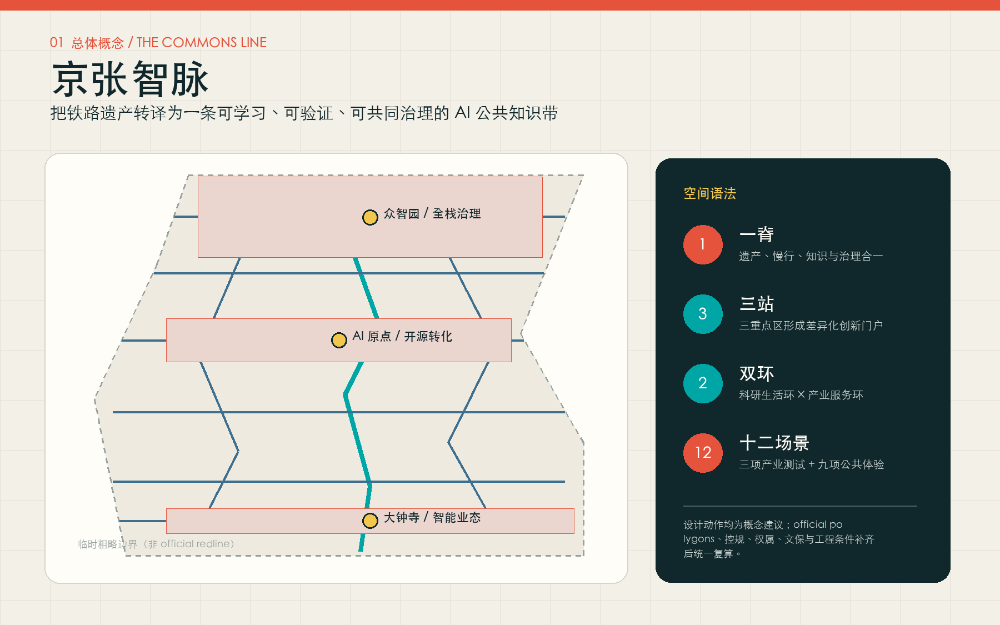
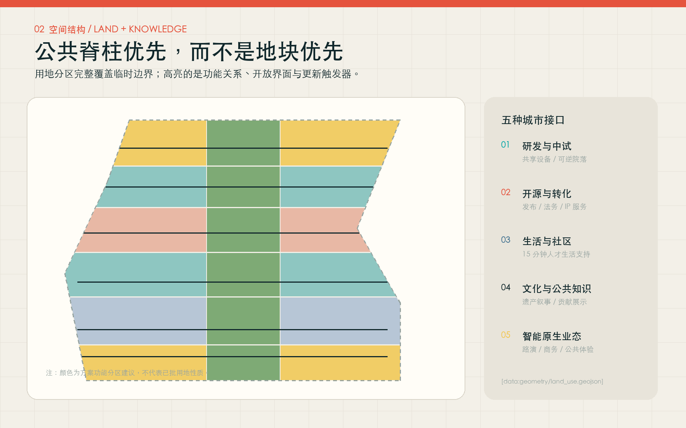
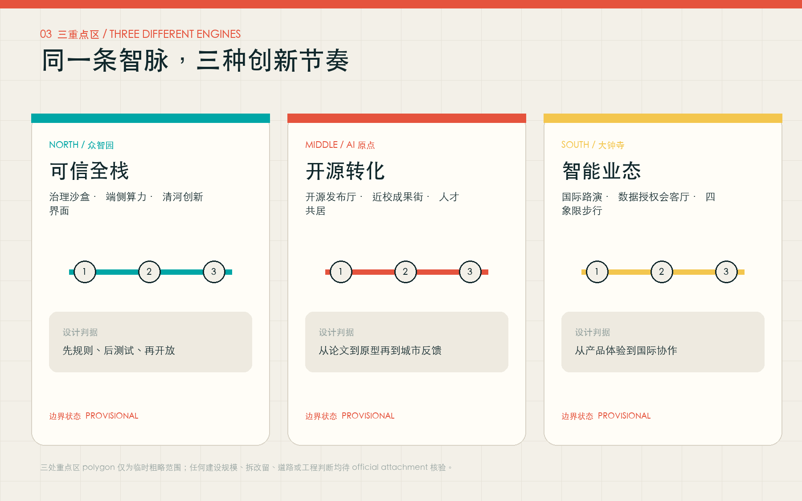
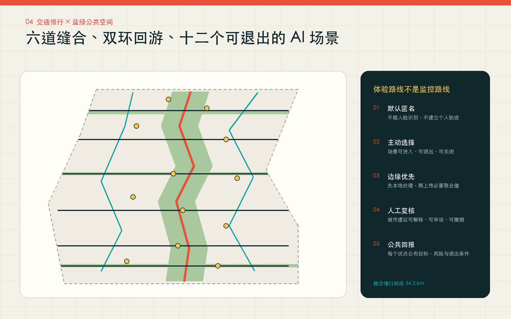
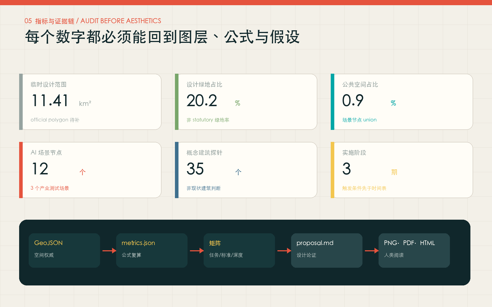

# Jing-Zhang Zhi Mai: A Learning, Verifiable, and Co-governable AI Public Knowledge Path

## Design Basis and Source List

This proposal participates in the open-source gathering for independent community AI Agent initiated by open-city.ai, not the official registration or submission channel for the original government-hosted international scheme gathering. The proposal is based primarily on the project name, three-layer scope, design purpose, and tasks as determined by the official pre-qualification announcement. It also draws on the three major positioning, five major functions, Three Zones and Two Wings, and six tasks as outlined in the agent task book for co-creation. Evidence navigation is provided by the standard snapshot of the warehouse, Source Registry, and processed fact package. [source:OFFICIAL-ANNOUNCEMENT] [source:AGENT-TASKBOOK] [source:SITE-PACKAGE] [source:SOURCE-REGISTRY] [source:PROCESSED-FACT-PACK] [standard:PROJECT-OFFICIAL-ANNOUNCEMENT] [standard:PROJECT-AGENT-OPEN-CALL-TASKBOOK]

The current documentation has a decisive spatial precision limitation: the warehouse has not yet obtained the official `SITE_BOUNDARY` and three official `KEY_AREA` polygons. This package uses the warehouse's temporary rough polygon in its original form, solely for structural generation, topological self-check, Content Review, and design discussions; it is not an official redline and does not support approval, ownership, legal control, or precise area conclusions. [source:BOUNDARY-SOURCE] [source:KEY-AREA-SOURCE] [data:geometry/site_boundary.geojson#SITE-001] [data:geometry/key_areas.geojson#PROV-KEY-001]. The temporary extent recalculated projection value is [metric:site_area_sqm], which only indicates the calculated area for this submission; the announcement "approximately 11.4 square kilometers" remains the official textual area at the task level. official polygons After the official polygons are in place, the land use, building probes, roads, green spaces, Public Spaces, phased and overall indicators must be recalculated as a whole.

The current condition diagnosis adopts a three-column method of "confirmed facts—design assumptions—pending data": confirmed facts include the three work scopes, names, and announced areas, key tasks, and professional principles; concept suggestions can be made for the public spine, functional interfaces, scenario nodes, and operational agreements; road red lines, land ownership, current buildings, control indicators, cultural relic control lines, municipal capacity, and engineering feasibility cannot be confirmed. The gaps are uniformly entered into `assumptions.json` and the constraint layers [data:geometry/constraints.geojson#CONSTRAINTS-001], managed by [depth:existing_conditions_diagnosis] and [depth:risk_missing_data]. The principles of Urban Design adhere to the requirements of people-oriented design, cultural heritage preservation, Public Space shaping, and clear planning boundaries. [standard:MOHURD-URBAN-DESIGN-MEASURES] [standard:MOHURD-CONTROL-DETAILED-PLANNING] (Conceptual Recommendation)

## Three-Level Scope Framework

The proposal understands the three scales as a continuous decision chain rather than three unrelated sets of drawings. The 43.6 square kilometers of the Coordinated Research Area address "how to form a world-class AI Innovation Ecosystem and future city mechanisms"; the approximately 11.4 square kilometers of the Overall Design Area address "how to translate these mechanisms into spatial structures, update projects, transportation infrastructure, and public life"; and the three key areas address "how to validate these mechanisms through visible, operational, and assessable nodes." The three levels are transmitted through a single task matrix, sources, assumptions, and indicators. [depth:three_level_scope_framework] [depth:overall_spatial_structure] [data:geometry/site_boundary.geojson#SITE-001]

The overall concept is "One Ridge, Three Stations, Two Loops, Six Seams, and Twelve Scenarios." "One Ridge" is the Jing-Zhang AI Public Knowledge Ridge, which integrates railway heritage, continuous active transportation, trustable full-stack demonstration, public learning, and auditable AI services on a single public interface; "Three Stations" are the Zhongzhiyuan Trustworthy Full-Stack Station, AI Origin Open Source Transformation Station, and Dazhongsi Intelligent Business Station; "Two Loops" are the West Side Research and Living Loop and the East Side Industry Service Loop; "Six Seams" are the six public connections spanning the Jing-Zhang Corridor, linking communities, parks, and campuses; "Twelve Scenarios" are enterable, exitable, and auditable AI scenario nodes. Spatial relationships are recorded in [data:geometry/roads.geojson#ROAD-001], [data:geometry/public_space.geojson#SCENARIO-001], and [metric:scenario_node_count].

Brand name is "Jing-Zhang Zhimai", with the English name **Jing-Zhang AI Commons**. The name emphasizes that a "commons" is not a "technological park," but a public institution for collectively producing knowledge, validating technology, and governing risks. The identifying symbol is suggested to be composed of "two parallel railway lines + a pair of open-source curly braces": the parallel lines point to the century-old Jing-Zhang, while the curly braces represent open-source code and common rules; red is the railway signal, cyan is the public validation status, and yellow marks the participatory nodes. The naming sub-system includes Commons Line (space), Commons Lab (testing), Commons Walk (public route), Commons Week (annual event), and Commons Mark (contribution/honor record). This visual direction uses an original geometric language, avoiding corporate trademarks, personal likenesses, or unauthorized graphics, which can be further developed by a professional branding team.

## Coordinated Research Area: Industry and Future City Research

The industrial logic within the coordinated scope is not simply about "congregating enterprises on a single line," but rather organizing six cycles: universities and research institutions generating knowledge, open-source communities lowering collaboration barriers, pilot testing and validation turning knowledge into verifiable prototypes, enterprises and public sectors forming real-world problems, urban experiences collecting anonymous and aggregated feedback, and contributions being fed back into talent reputation and the next round of research. Zhongzhiyuan is responsible for "rules—testing—governance," AI Origin for "research—open-source—transformation," and Dazhongsi for "products—experience—international collaboration." The two wings provide technological services and urban scenarios, respectively. All industrial suggestions are mechanism and spatial interface recommendations, without including enterprise residency, output value, investment, or fiscal commitments. [source:AGENT-TASKBOOK] [standard:PROJECT-AGENT-OPEN-CALL-TASKBOOK]

The six global cases are provided only as a reference for `background_only` mechanisms and are not used for the project boundaries, land use, or control indicators: 1) Cambridge Kendall Square demonstrates that an innovation core requires housing, dining, streets, and neighborhood public benefits to support it, translated as "innovation districts must have public returns"; 2) Singapore one-north/LaunchPad shows that modular spaces, incubators, capital, and test beds can be integrated in the same area, translated as "space supply changes with growth stages"; 3) Paris-Saclay connects research, incubation, open innovation, and annual events into a network, translated as "events are not for promotion but for continuous matchmaking mechanisms"; 4) Helsinki Maria 01 repurposes an old hospital into an entrepreneurial community, translated as "existing buildings can be operated first and then built upon"; 5) Seoul AI Hub combines talent, computing power, startup support, validation, and global collaboration into a public platform, translated as "public sector provides verifiable foundational capabilities." The Toronto Vector Institute connects research, talent, and corporate adoption, translating to "talent services must lead to real projects rather than remain in training." [source:CASE-KENDALL] [source:CASE-ONE-NORTH] [source:CASE-PARIS-SACLAY] [source:CASE-MARIA01] [source:CASE-SEOUL-AI-HUB] [source:CASE-VECTOR]

Future-oriented urban forms are defined by three performance lines: "learnable, verifiable, and co-governable." Learnable means that Public Spaces, ground-level interfaces, and activity systems allow cross-institutional exchanges; verifiable means that industrial experiments have boundaries, metrics, exit conditions, and Human Review; co-governable means that residents, developers, businesses, and professional teams can view goals, risks, data uses, and interim results. The proposal uses open spaces rather than closed campuses as infrastructure, reversible updates rather than one-time major demolition and reconstruction as adaptation methods, and scenario operation agreements rather than unverified hardware stacking as AI-Native characteristics. This framework is available for subsequent industrial planning, land use planning, and operational teams to deepen, without replacing any statutory plans.

## Overall Design Area: Urban Renewal and Regulatory-Plan-Level Urban Design

Organize the overall design around a public spine that organizes space: a central `1401` concept public green space connects north to south, with research and testing, open-source transformation, community services, cultural public knowledge, and smart indigenous activities configured along the six urban interfaces on either side. The land use areas are generated by the same boundary, fully covering the temporary submission range and seamless without overlap; the land use codes follow the spatial classification subset provided by the repository, but are only functional suggestions for the scheme and do not represent approved land use nature. [standard:MNR-LAND-USE-CLASSIFICATION-GUIDE] [depth:land_use_layout] [data:geometry/land_use.geojson#LU-001] [metric:land_use_area_0802_sqm] [metric:land_use_area_05_sqm] [metric:land_use_area_0702_sqm] [metric:land_use_area_1401_sqm]

Urban Renewal adopts a "three-layer reversibility." The first layer consists of operational and light facilities that can be discussed without changing the legal conditions, such as temporary exhibitions, contribution markers, activity routes, and appointment-based testing; the second layer includes first-floor openings, courtyard sharing, and adaptive reuse that require verification of ownership, current building conditions, and fire safety; the third layer involves architectural, bridge, or large-scale engineering projects that must be deepened after obtaining official control plan, road, municipal, cultural heritage, and approval conditions. The 35 Building Footprints in `buildings.geojson` are volume and public interface probes, not a current building survey, demolish–renovate–retain conclusions, or approved scale. [data:geometry/buildings.geojson#BLDG-001] [metric:building_probe_count] [metric:building_footprint_area_sqm] [metric:building_density] (Demolish–Renovate–Retain Strategy)

Buildings and blocks are recommended to adhere to the principles of "small units, shared ground floors, flexible interiors, and clear service cores." Research and pilot production units require modular spaces, shared equipment, and secure zoning; transformation and community units need open ground floors, legal/IP/talent services; cultural and commercial units should maintain the scale and walkable interface of the former railway industrial district. Height, Floor Area Ratio, Building Coverage Ratio, setback, sunlight exposure, fire safety, and parking requirements are to be kept as unknowns. The massing and form should only express the principle of "minimal disturbance, continuous street walls, roof accessibility, and heritage node retention." [depth:development_intensity_controls] [depth:height_massing_character] [depth:retain_renovate_demolish] [standard:MOHURD-ARCH-DESIGN-DEPTH-2016]

## Detailed Design of Key Areas

Three key areas are expressed using a "rules—space—operations—trigger conditions" four-box framework, and are all indexed with provisional polygons. [depth:three_key_area_detailed_design] [data:geometry/key_areas.geojson#PROV-KEY-001] [data:geometry/key_areas.geojson#PROV-KEY-002] [data:geometry/key_areas.geojson#PROV-KEY-003] [metric:key_area_count]

**Zhongzhiyuan / Trusted Full Stack Station.** The concept recommendation forms three nodes: "Governance Sandbox—Edge Side Computing Power Station—Qinghe Innovation Interface." The Governance Sandbox focuses on model security, standards, and red team testing, emphasizing booking, isolation, and the transparent disclosure of results; the Edge Side Computing Power Station showcases the auditable relationships between energy, computing power, and privacy; the Qinghe Interface integrates low-carbon living, walking, interaction, and technology displays. Spatially, public green fingers and shared test courtyards are first formed, followed by discussions on building updates. Deepening trigger conditions include official district boundaries, river blue lines, flood protection, existing buildings, ownership, and external transportation data; in the absence of these conditions, no construction scale or engineering lines are provided. (Conceptual Recommendation)

**Beijing AI Origin Community / Open Source Conversion Station.** The Conceptual Recommendation forms "Open Source Exhibition Hall—Near-School Conversion Street—Talent Co-Residence Services." The Exhibition Hall records code, data sets, standards, and social contributions; the Conversion Street links prototype displays, intellectual property, legal affairs, ethics, and product validation; and the talent services are oriented towards researchers, developers, entrepreneurs, families, and surrounding residents. Spatially, the six east-west connections are used to stitch the campus, park, and neighborhood, with priority given to improving the pedestrian interface. Any campus boundary, building reuse, and Transit-Station Integration suggestions must be refined by professional teams after the necessary ownership, fire safety, traffic, and control plan documentation is completed.

**Dazhongsi / Intelligent Industry Station.** Conceptual Recommendation forms "International Roadshow Living Room—Data Authorization Living Room—Four Quadrant Pedestrian Interface." The Roadshow Living Room serves intelligent entities, smart terminals, content, and urban service prototypes. The Data Authorization Living Room enables the public and enterprises to see the purpose, duration, revocation, and audit mechanisms of data use. The Four Quadrant Pedestrian Interface only expresses the connectivity relationships that need to be addressed, without constituting a bridge, tunnel, road, or rail engineering solution. Initial testing of needs will be conducted with the first-floor public interface, non-motorized vehicle order, and activity scheduling, followed by further refinement based on official road boundaries, station conditions, and municipal utility lines.

## AI Innovation Ecosystem, Personas, and AI+ Scenarios

Six user personas determine the space and operations: Open-source developers require trusted releases, collaboration, and contribution reputation; university faculty and students need research outcomes, cross-institutional exchanges, and low-barrier prototype testing; startup teams need flexible spaces, computational access points, legal/IP support, and real-world scenarios; growing enterprises need talent, international collaborations, and compliance validation; nearby residents and frontline service personnel need accessible Public Spaces, low-disturbance activities, and clear complaint channels; international visitors need a public route that understands the Jing-Zhang history, Haidian innovation, and AI governance. Any user persona is not generated through individual tracking or commercial profiling; operations only use active participation and anonymous aggregated data. [data:geometry/public_space.geojson#SCENARIO-001]

Twelve scene cards and their spaces are mapped as follows. SC-02, SC-03, and SC-07 are three industrial Testing and Validation Scenarios; the rest are public learning, transportation, cultural, service, and governance scenarios. All scenarios must have a clear operational entity, data owner, Human Reviewer, pilot period, and exit conditions, and must not include immature technologies as fully deployed. [metric:industry_test_scenario_count]

| ID | Scenario | Service Target | Spatial Carrier | Operational and Governance Boundaries |
| --- | --- | --- | --- | --- |
| SC-01 | Open Release Hall | Students, Developers | AI Origin Community | Public Results, Authorization Verification, Manual Editing |
| SC-02 | Model Safety Governance Sandbox | Development Team, Governance Researchers | Zhongzhiyuan | Isolated Testing, Risk Stratification, Audit-able Results |
| SC-03 | End-Side Computing Hub | Startup Team, Public Service Provider | Zhongzhiyuan | Purpose Restriction, Energy Consumption Disclosure, Data In-Site Priority |
| SC-04 | Explainable Pedestrian Navigation | Residents, Visitors | Jing-Zhang Public Spine | Anonymous Aggregation, Toggleable, No Facial Recognition |
| SC-05 | International Roadshow Living Room | Enterprises, Partner Organizations | Dazhongsi | Clear Rights Materials, Non-Promotional Commitments, Bilingual Explanation |
| SC-06 | Qinghe Low-Carbon Innovation Corridor | Residents, Research Teams | Zhongzhiyuan | Ecological Constraints Prioritized, Not Replacing Environmental Assessment |
| SC-07 | Neighborhood for Near-School Innovation Transfer | Students, Start-up Teams | AI Origin Community | IP Licensing, Authentic Problems, Human Professional Services |
| SC-08 | Data Authorization Lounge | Businesses, Public | Dazhongsi | Explicit Consent, Purpose/Lifetime Limitation, Revocable |
| SC-09 | AI-Living Service Sample Street | Residents, Service Staff | Adjacent Communities | No Personal Business Recommendations, Retain Manual Windows |
| SC-10 | Jing-Zhang Centennial Contribution Station | Public, Developers | Heritage Spine | Traceable Source, Appeal and Correction Channel |
| SC-11 | Barrier-Free Co-Creation Workshop | Persons with Disabilities, Caregivers | Origin Community | Participatory Design, Assistive Technology Shall Not Replace Care |
| SC-12 | Urban Operations Transparency Window | Residents, Maintenance Personnel | Along-line Nodes | Only aggregate indicators are disclosed; it is suggested that there be an appeal and revocation mechanism |

## Land Use, Building Scale, and Retain-Renovate-Demolish Strategy

The land use structure is not aimed at "maximum development volume," but rather at forming a balanced arrangement of five types of urban interfaces on both sides of the public spine: research and testing stages integrate full-stack R&D, open-source conversion connects universities with enterprises, community services support the daily needs of talents, cultural and public knowledge preserve the memories of Jing-Zhang and Zhongguancun, and smart native business forms link product experiences and international exchanges. Each zone maintains a convertible ground floor and courtyard interface to avoid cutting off public life with a single closed campus. The land area is recalculated based on a unified topological partitioning, and the plan does not express these concepts as proportional indicators in the legal standards. [data:geometry/land_use.geojson#LU-001] [metric:land_use_area_0802_sqm]

The architectural strategy is not a case-by-case assessment of the current state, but rather a decision tree for subsequent investigations: first verify cultural heritage and safety, then structural integrity and energy consumption, followed by property rights and usage needs, and finally compare the full lifecycle costs of retention, restoration, adaptive reuse, partial additions, and new construction. Without any one of these elements, no conclusion should be drawn about "demolition" or "construction." The current 35 reversible courtyards only test the proportion of open spaces, continuity of public interfaces, and functional distribution; the conceptual Building Footprint area [metric:building_footprint_area_sqm] and conceptual density [metric:building_density] do not represent the current state or approved controls. [data:geometry/buildings.geojson#BLDG-001]

Morphological suggestions establish "three layers of temporal texture": railway heritage uses restrained red-brown steel, brick, and legible construction; Zhongguancun innovation culture uses adaptable modules, open workshops, and contribution displays; AI new culture uses transparent interfaces that show data sources and operational status, rather than neonized "futurism". Building Height and skyline only propose the concept direction of "heritage node blank spaces, rhythmic low-to-mid-scale interfaces along the public spine, and identifiable gateway nodes". Formal height, massing, and roof control must come from the official control plan, conservation, landscape, and safety documentation.

## Transport, Rail, Municipal Infrastructure, and Public Services

The transportation concept consists of a main line, two circulation loops, and six east-west connectors: the Jing-Zhang heritage pedestrian and cycling main line carries continuous walking, cycling, cultural, and scene experiences; the west loop connects research, community, and university daily activities; the east loop connects industry, business, and rail services; the six east-west connectors elevate "to the park" to "through the park to daily destinations." The total length of the submitted concept centerline is [metric:conceptual_mobility_length_m], which is only a quantification of the connectivity and task volume, not a road boundary or engineering alignment. [depth:traffic_rail_slow_parking] [data:geometry/roads.geojson#ROAD-001]

The transit station strategy adopts the approach of "walk first, transfer second, then build." It involves reducing transfer friction through signposting, open first floors, shaded resting areas, and orderly non-motorized traffic. It then uses public and anonymous pedestrian observations to assess needs. Only after official station, road, municipal, and safety documentation are complete, will discussions on station-city integration or engineering improvements take place. The names of the Dazhongsi Quadrants, Wudaokou, and Tsinghua East Road West Mouth come from the task requirements, but this plan does not provide bridge and tunnel structures, entrance and exit designs, or construction conclusions.

Municipal and New Infrastructure adopt a "visible service stack": the bottom layer includes traditional guarantees such as power supply, communication, drainage, fire safety, and accessibility, the middle layer encompasses edge-side computing power, equipment sharing, scheduling, and identity authorization, and the upper layer covers public scenarios and operations; each layer should display the responsible party, service level, failure modes, and human fallback. Computational hubs should prioritize research on residual heat, energy consumption disclosure, and edge processing, but energy load and capacity remain to be verified. Public service facilities should follow the principle of "composite sharing with retained human windows," with service lists to be formed first, and the scale and service radius to be determined by professional teams after the facility count is complete. [depth:municipal_new_infrastructure]

## Blue-Green Network, Public Space, and Urban Character

The blue-green system incorporates the Jing-Zhang corridor as a continuous ecological and pedestrian spine, forming three horizontal "knowledge green fingers" at Zhongzhiyuan, AI Origin, and Dazhongsi. The green fingers are not merely decorative green spaces but integrate Qinghe/city ecology, open testing, community rest, and public exchange into a single cross-section. The submitted design includes green space area and ratio of [metric:green_space_area_sqm] and [metric:green_ratio], which are calculated only from the conceptual layer and Provisional Boundary, and do not equal the statutory green space ratio; the final scheme must overlay river courses, green lines, cultural heritage protection, sponge city measures, and tree surveys. [depth:blue_green_public_space] [data:geometry/green_space.geojson#GREEN-001]

Twelve AI Commons nodes form a network of small and dense Public Spaces, with an area and proportion of [metric:public_space_area_sqm] and [metric:public_space_ratio]. Each node uses the same component library: low-power display that can be closed, physical descriptions that can be read without a phone, human service buttons, data use notices, accessible seating, movable shading, and interchangeable exhibits. Components are first piloted in a lightweight, reversible manner, and then retained, moved, or removed based on usage feedback. [data:geometry/public_space.geojson#PUBLIC-001]

Culture is narrated in three chapters: "Tracks—Computations—Community." The first chapter explores how the Jing-Zhang Railway organized speed, time, and modern urban development. The second chapter examines how Zhongzhiyuan has organized innovation through research, education, and entrepreneurship. The third chapter delves into how the AI era can reposition models, data, and human judgment under public rules. Three AI pilgrimage/honor nodes are proposed as Conceptual Recommendations: Zhongzhiyuan's "Gate of Trust" showcases open standards and testing methods, AI Origin's "Station Zero" records verifiable open-source and public contributions, and Dazhongsi's "Centennial—Future Signal Tower" translates railway signaling language into a display of technical status, responsibility, and international collaboration. Honor displays only record authorized, traceable, and correctable contributions, without commercial rankings or personal worship.

## Renewal Projects, Implementation Policy, and Phasing

The project list is based on the principle of "triggers conditions preceding the timeline." JZ-01 Public Spine Light Pilot requires Public Space permits and data governance rules; JZ-02 Zhongzhiyuan Trustworthy Full-Stack Garden requires official district, waterways, and transportation conditions; JZ-03 Origin Community Open Source Transformation Street requires ownership, campus boundaries, and control plan conditions; JZ-04 Dazhongsi Pedestrian Weaving requires road redlines, rail, and utility revalidation; JZ-05 Along-line Reversible Update Courtyards require current building surveys and professional safety assessments; JZ-06 Global AI Commons Operation requires public collaboration mechanisms, event permits, and performance evaluation. Each project can be broken down into "research—light pilot—separate evaluation—professional deepening—rolling revisions," with no commitment to construction, investment, or government arrangements. [depth:renewal_project_list]

Phasing is expressed by [data:geometry/phasing.geojson#PHASE-001], comprising [metric:phase_count] phases. In the near term, prioritize the public spine, signage, contribution displays, and exitable scenarios to validate public value and operational capacity; in the medium term, deepen the three key areas after the official polygons, control plan, ownership, cultural heritage, and municipal documentation are complete. In the long term, based on actual performance and public engagement, weave the streetscapes along the route. Each phase's polygon serves as a management zone for the plan, not an administrative implementation boundary or a definitive development timeline. [depth:phasing_implementation]

Long-term operational recommendations suggest establishing a **Commons Protocol**: all scenarios should publicly disclose issues, data, models, human responsibilities, exit conditions, and evaluation results; the developer community should continue to operate through monthly open questions, quarterly prototype reviews, and annual contribution archives; an annual **Jing-Zhang AI Commons Week** should be composed of open experiments, urban experiences, governance forums, developer maintenance days, and international collaboration days; public walkways and professional access routes should be formed between the three stations; and a recruitment and conversion mechanism should be formed through the process of "issue release—prototype validation—public feedback—compliance review—space/industrial transformation." It is a reference framework for operational teams to deepen, not a predetermined set of activities or policy commitments.

## Metrics, Area Recalculation, and Compliance Matrix

Metrics are divided into three categories. The first category consists of "package metrics" that can be recalculated directly from the submitted geometry: temporary design area [metric:site_area_sqm], land use area for research, commercial, community service, and public green spaces [metric:land_use_area_0802_sqm] [metric:land_use_area_05_sqm] [metric:land_use_area_0702_sqm] [metric:land_use_area_1401_sqm], building footprint area and concept density [metric:building_footprint_area_sqm] [metric:building_density], designed green spaces and Public Spaces [metric:green_space_area_sqm] [metric:green_ratio] [metric:public_space_area_sqm] [metric:public_space_ratio]. Conceptual Slow-Travel Network [metric:conceptual_mobility_length_m], scenarios, test cases, building probes, key areas, and phase counts [metric:scenario_node_count] [metric:industry_test_scenario_count] [metric:building_probe_count] [metric:key_area_count] [metric:phase_count]. These values are all recalculated using the same set of GeoJSON in the EPSG:4548 projection. [depth:metrics_recalculation]

The second category are the statutory/engineering indicators that must be preserved: total floor area, Floor Area Ratio, Building Height, Building Coverage Ratio, setback, road right-of-way, municipal capacity, fire and cultural heritage controls; they should not be "reasonably inferred" when there are no official attachments. The third category are operational performance indicators: participation coverage, accessibility satisfaction, scene exit rate, Human Review response, open-source contribution, prototype transformation, and public problem resolution rate; these must be disclosed before the pilot, and collected post-operation in accordance with privacy principles, and cannot be fabricated at this time.

`compliance_matrix.json` has been comprehensively covered for announcements 1.3, 1.4, 1.5, and agent.1—agent.6, `standard_matrix.json` covers the mandatory professional standards, and `design_depth_matrix.json` maps fifteen design depths to the main text, layers, drawings, indicators, sources, assumptions, and self-inspection. The graphics, HTML, and PDF files are the explanation layers, while GeoJSON, metrics, and matrices are the verifiable evidence layers; any discrepancies between the two should be resolved by the structured evidence and corrected accordingly.

## Risk, Copyright, and Compliance

Conceptual Recommendation: The greatest risk is not that the proposal is "not precise enough," but that it creates a false sense of precision with temporary data. This package explicitly retains nine categories of gaps: official boundaries, key areas, control plans, roads, parcels, buildings, cultural heritage sites, municipal, and public facilities. Any spatial implementation suggestions are conceptual recommendations, reference proposals, or topics for further research by professional teams. They do not replace statutory planning, nor do they constitute government approval, ownership, investment, construction, or activity commitments. [data:geometry/constraints.geojson#CONSTRAINTS-001] [depth:risk_missing_data]

AI risks are controlled by five lines of defense: do not perform facial recognition or track individual trajectories, do not default to collecting personal data, do not use black-box scores to replace public service qualifications, do not let models replace planning approvals or professional safety judgments, and do not lock in pilots to specific suppliers. Each scenario must support active choice, minimal data collection, edge processing prioritization, Human Review, appeals, and revocation; and it must preserve non-digital channels for children, elderly individuals, persons with disabilities, and digital vulnerable groups. Suggestions involving public safety should only serve as auxiliary prompts, with responsibility still borne by qualified human entities and institutions.

This proposal text, original diagram, structured design data, and offline display are released under the `CC-BY-4.0` license; the official announcements, standard snapshots, repository provisional geometry, and external case pages are subject to the conditions of their respective sources. Five PNG, PDF, and HTML files are generated by Codex based on this package's GeoJSON, metrics, matrices, and text; no remote map tiles, commercial map screenshots, company logos, portraits, or third-party renderings are used. The generation method, fonts, and asset boundaries are detailed in `report/copyright_statement.md`. Submitters are responsible for the facts, citations, copyright, and final expression.

## References

- Project Tasks and Rules: [source:OFFICIAL-ANNOUNCEMENT], [source:AGENT-TASKBOOK], [source:SITE-PACKAGE], [source:SOURCE-REGISTRY], [source:PROCESSED-FACT-PACK].
- Temporary Space Documentation: [source:BOUNDARY-SOURCE], [source:KEY-AREA-SOURCE]; for generation, self-inspection, and visualization only.
- Professional Basis: [standard:PROJECT-OFFICIAL-ANNOUNCEMENT], [standard:PROJECT-AGENT-OPEN-CALL-TASKBOOK], [standard:MOHURD-URBAN-DESIGN-MEASURES], [standard:MOHURD-CONTROL-DETAILED-PLANNING], [standard:MNR-LAND-USE-CLASSIFICATION-GUIDE], [standard:MOHURD-ARCH-DESIGN-DEPTH-2016].
- Global mechanisms references (only background): [source:CASE-KENDALL], [source:CASE-ONE-NORTH], [source:CASE-PARIS-SACLAY], [source:CASE-MARIA01], [source:CASE-SEOUL-AI-HUB], [source:CASE-VECTOR].
- Readable evidence index: [data:geometry/site_boundary.geojson#SITE-001], [data:geometry/key_areas.geojson#PROV-KEY-001], [data:geometry/land_use.geojson#LU-001], [data:geometry/buildings.geojson#BLDG-001], [data:geometry/roads.geojson#ROAD-001], [data:geometry/green_space.geojson#GREEN-001], [data:geometry/public_space.geojson#PUBLIC-001], [data:geometry/constraints.geojson#CONSTRAINTS-001], [data:geometry/phasing.geojson#PHASE-001].
- Design Depth Index: [depth:existing_conditions_diagnosis] [depth:three_level_scope_framework] [depth:overall_spatial_structure] [depth:land_use_layout] [depth:development_intensity_controls] [depth:height_massing_character] [depth:retain_renovate_demolish] [depth:traffic_rail_slow_parking] [depth:municipal_new_infrastructure] [depth:blue_green_public_space] [depth:three_key_area_detailed_design] [depth:renewal_project_list] [depth:phasing_implementation] [depth:metrics_recalculation] [depth:risk_missing_data].
