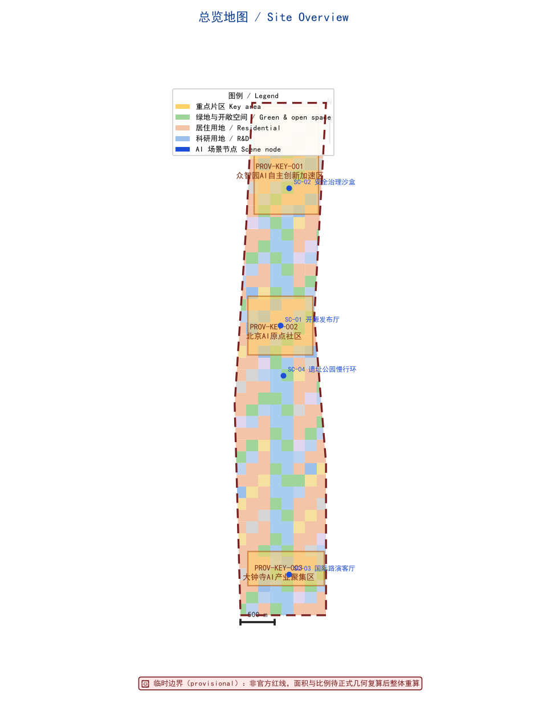
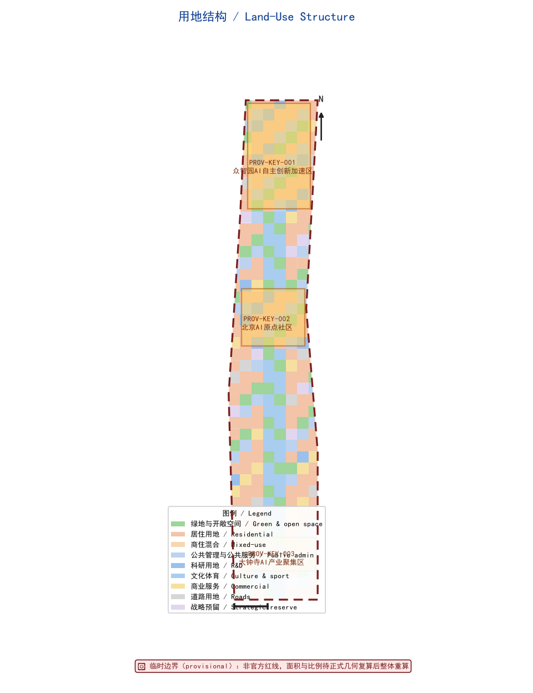
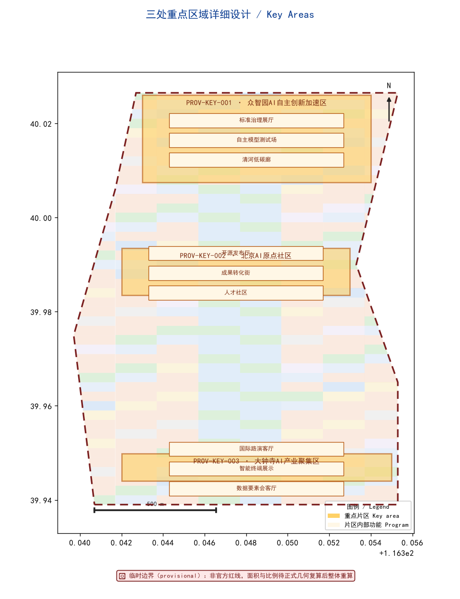
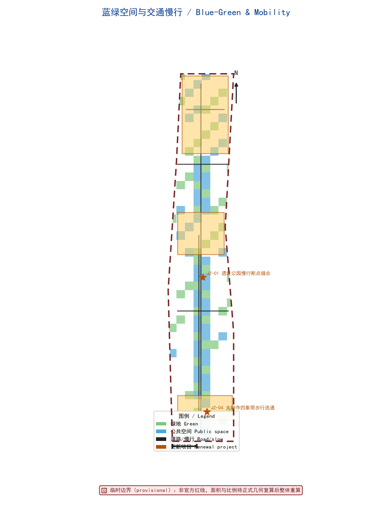
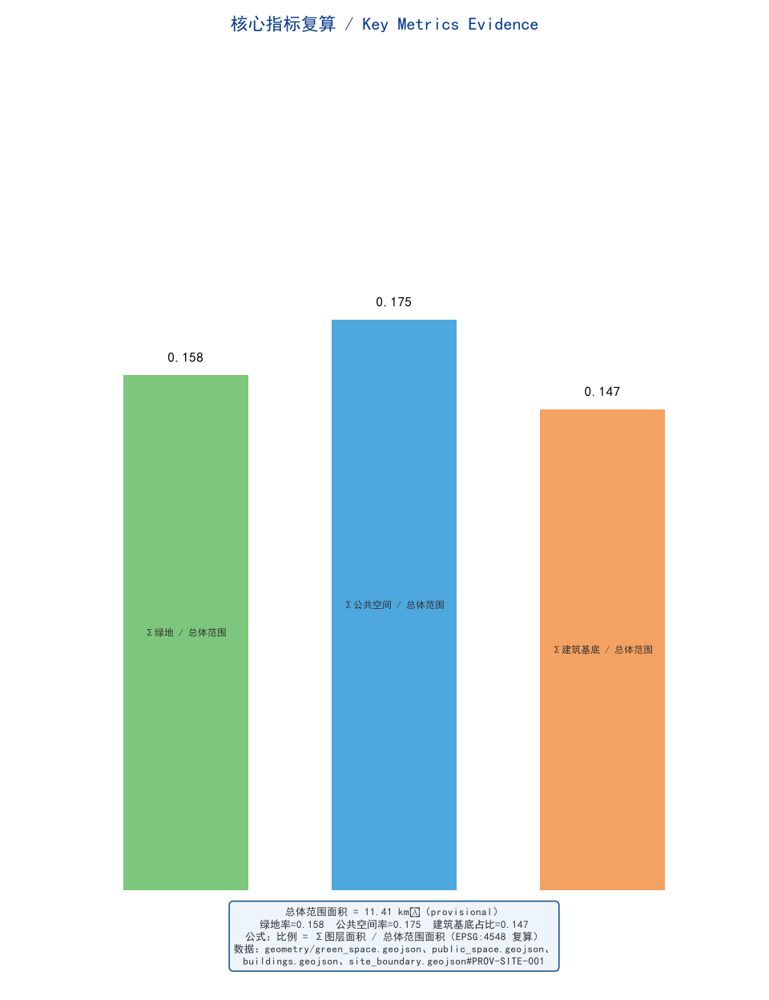

# Centennial Jing-Zhang AI Innovation Belt: From Railway Heritage to an AI-Native Living Corridor

> Every spatial recommendation in this proposal is framed as a "concept proposal," "reference scheme," or "material for professional teams to deepen." All outputs are open co-creation suggestions; they do not replace formal planning and do not constitute government-approved conclusions [standard:PROJECT-OFFICIAL-ANNOUNCEMENT] [source:AGENT-TASKBOOK].

## Design Basis and Source List

This formal proposal takes the Pre-Qualification Announcement for the International Urban Design Competition of the Centennial Jing-Zhang AI Innovation Belt, issued by the Haidian Branch of the Beijing Municipal Commission of Planning and Natural Resources, as its primary basis, and uses the maintainer-registered provisional rough boundary, key areas, enumerations, metrics, and source inventory under `brief/site-package/` as machine-readable evidence [source:OFFICIAL-ANNOUNCEMENT]. Before generation we read `design_brief.json`, `allowed_design_space.json`, `sources.json`, `enums/`, `ranges/`, `schemas/`, `data/source_registry.json`, and `data/processed/agent_fact_pack.md`, and used `project_scope_summary.csv`, `agent_task_requirements.csv`, `source_use_matrix.csv`, and `missing_data_checklist.csv` to build the task–scope–source-use–gap inventory.

Source-use boundaries [source:SOURCE-REGISTRY]:
- `data/source_registry.json` separates sources into formal-ready, background-only, provisional-only, and needs-review.
- Current registry summary: 7 formal-ready sources, 1 background-only, 1 provisional-only.
- The agent must not upgrade background-only or provisional-only material into an official boundary, statutory control plan, formal scoring evidence, or government implementation commitment.

`data/processed/agent_fact_pack.md` is a navigation layer, not a new authority [source:PROCESSED-FACT-PACK]; factual judgments return to the registered primary material, and the full source relationships are kept in `sources.json`.

### 1.1 Provisional Boundary Discipline and Recomputation Convention

The official `SITE_BOUNDARY` and the three `KEY_AREA` polygons are not yet available; this package uses `brief/site-package/geometry/provisional_boundaries.geojson` to generate a provisional formal package. `geometry/site_boundary.geojson` (`PROV-SITE-001`) and `geometry/key_areas.geojson` (`PROV-KEY-001/002/003`) are both marked `provisional_constraint`, `official_boundary=false`, and may be used only for generation, self-check, visualization, and design discussion — never as an official redline, approval basis, precise-area basis, or statutory control conclusion [data:geometry/site_boundary.geojson#PROV-SITE-001] [data:geometry/key_areas.geojson#PROV-KEY-001].

The scorable status is: **provisional boundary, precision caveats retained, full recomputation pending official data; the organizer's data gap does not block content scoring**. Once official boundaries and key-area polygons are updated, the agent must re-run the scaffold, self-check, and figure/HTML generation — not merely swap a single file. Every conclusion constrained by the provisional boundary is labeled "pending official-data recomputation" in the text.

## Three-Level Scope Framework

The proposal organizes work along the three levels set by the announcement: the **coordination-research scope** (43.6 km²) addresses the AI industry ecosystem, strategic positioning, innovation chain, and future-city form; the **overall-design scope** (11.4 km²) around the Jing-Zhang Heritage Park (1–2 km) requires an urban-renewal framework, industry-space layout, transport/municipal support, and urban-character control; the **key-area scope** (368.4 ha) requires functional programming, building scale, retain/renovate/demolish classification, public-space connectivity, and transport organization [source:OFFICIAL-ANNOUNCEMENT].

The three levels are not disjoint drawing sets: coordination research sets the industry-chain and city-form judgments, overall design turns them into renewal projects, spatial structure, and facility capacity, and key-area detailed design validates specific parcels, buildings, transport, public space, and AI application scenarios [depth:three_level_scope_framework].

The proposed overarching concept is the **"Jing-Zhang Symbiotic AI Corridor"**, using the Jing-Zhang Heritage Park as the historical and public-space spine, the three key areas (Zhongzhiyuan, Beijing AI Origin Community, Dazhongsi) as innovation anchors, and universities, enterprises, communities, and rail stations as the daily network, forming a "one belt, three cores, multiple scenarios, and a blue-green slow-mobility composite ring" [data:geometry/key_areas.geojson#PROV-KEY-001].

| Level | Design question | Proposal answer | Data anchor |
| --- | --- | --- | --- |
| Coordination-research | How to organize the AI ecosystem and future-city form | Build an innovation chain of "university origination — open-source collaboration — enterprise translation — public experience — international dissemination" | compliance_matrix.json, agent.2 cases |
| Overall-design | How industry space, renewal, transport, municipal, and character land on maps | Land-use, buildings, roads, green, public-space, and phasing layers express it together | [data:geometry/land_use.geojson#LU-00-01], [data:geometry/roads.geojson#ROAD-SPINE] |
| Key-area | How the three areas reach detailed-design depth | Each gets positioning, spatial moves, AI scenarios, and implementation dependencies | [data:geometry/key_areas.geojson#PROV-KEY-001], [data:geometry/key_areas.geojson#PROV-KEY-002], [data:geometry/key_areas.geojson#PROV-KEY-003] |

## Coordinated Research Area: Industry and Future City Research

### 3.1 Overarching Concept and Naming System (responds to agent.1)

"Jing-Zhang Symbiotic AI Corridor" is a working method spanning the three levels, not a new redline. The naming system has three tiers:
- **Primary name**: 京张智脉共生带 (ZH) / Jing-Zhang Symbiotic AI Corridor (EN);
- **Sub-identity**: Centennial Jing-Zhang Culture Belt · Urban AI Living-Experience Belt · AI Fusion Innovation Belt (the three positionings) [source:AGENT-TASKBOOK];
- **Node names**: the three key areas keep the taskbook's internal identifiers `zhongzhiyuan_ai_acceleration_area`, `beijing_ai_origin_community`, `dazhongsi_ai_industry_cluster`, avoiding unauthorized renaming.

**Visual identity and Logo direction (conceptual, not final)**: the "rail — pulse — node" motif translates the linear railway heritage into a "smart vein" curve threading stations and blocks; a low-saturation industrial grey-blue (heritage) and signal cyan (AI) form an extensible identity, wayfinding, and event visual language. All fonts, icons, images, and enterprise marks must be rights-cleared; unauthorized trademarks or portraits are forbidden [standard:PROJECT-AGENT-OPEN-CALL-TASKBOOK].

**Territorial-spatial-planning innovation**: the proposal treats "integrated planning" as putting industry strategy, spatial supply, facility capacity, and operating mechanisms into one recomputable layer system rather than disjoint text. Land-use, buildings, roads, green, public space, and phasing all derive from the same `PROV-SITE-001` boundary, enabling professional teams to recompute the whole after swapping in official boundaries [depth:overall_spatial_structure].

### 3.2 Three-Area Two-Wing Synergy Loop (responds to agent.1)

The taskbook's "three areas, two wings" is the spatial backbone. This proposal gives its synergy loop, emphasizing factor flows among "areas — service wing — scenario wing" [source:AGENT-TASKBOOK]:

| Unit | Role | Synergy partner | Synergy loop |
| --- | --- | --- | --- |
| Zhongzhiyuan AI Acceleration Area (PROV-KEY-001) | Full-stack autonomy & governance voice | Zhongguancun tech-service wing | Autonomous models/standards → Zhongguancun IP & capital → Origin Community incubation |
| Beijing AI Origin Community (PROV-KEY-002) | World-class AI innovation ecosystem | Xiaoyuehe scenario-empowerment wing | University origination → near-campus incubation → Xiaoyuehe public-experience path |
| Dazhongsi AI Industry Cluster (PROV-KEY-003) | AI-native new formats | Zhongguancun tech-service wing | Leading enterprises/smart terminals → international roadshow → talent & capital回流 |
| Zhongguancun Tech-Service Wing | Global factor allocation, IP & capital | Three areas | Cross-area scheduling of capital/compute/data factors |
| Xiaoyuehe Scenario-Empowerment Wing | AI scenario empowerment & living city | Three areas | Scenario open-days/public experience linking the three areas |

### 3.3 Global AI Innovation Ecosystem Cases (responds to agent.2, 5–8 real public cases)

The following are publicly documented city- or nation-scale AI ecosystem practices, used to extract transferable mechanisms — **not investment or fiscal commitments of this project** [source:AGENT-TASKBOOK]:

| Case | Location | Publicly documented mechanism | Transferable to this belt | Source nature |
| --- | --- | --- | --- | --- |
| Vector Institute & MaRS | Toronto, Canada | Academic–industry joint institute + innovation district | Short "research → incubation" loop from university origination to enterprise translation | Public reports / institute sites |
| Mila (Quebec AI Institute) | Montreal, Canada | Academic cluster + open-source & LLM ecosystem | Open-source collaboration and talent-special-zone organization | Public reports / institute sites |
| AI Singapore (National AI Strategy) | Singapore | "100 Experiments" government–enterprise AI deployment | "Scenario opening + co-built trials" to lever industry services | Government public strategy |
| Helsinki AI Register & City AI Strategy | Helsinki, Finland | Public-sector AI registry & transparency | Auditable, trustworthy governance of city-scale AI | City government public docs |
| Station F & Lab Ose | Paris, France | Large startup campus + public AI experiments | International roadshow and developer-community operating space | Public reports / institute sites |
| Shenzhen Nanshan–Guangming AI Cluster | Shenzhen, China | Hardware–AI integration & supply-chain support | Industry-space organization for smart terminals & edge compute | Public reports / government info |
| Amsterdam Responsible AI & City AI Center | Amsterdam, NL | Responsible-AI civic pilots | Ethical and human-review boundaries for public-space AI | City government public docs |
| Seoul AI Hub & Digital City | Seoul, Korea | City-scale AI service platform | Public-experience and citizen-service scenario continuity | Government public strategy |

> Note: cases are for mechanism reference only; no investment, output, or enterprise lists are cited, and no industry recruitment, funding, or policy arrangement is presented as decided [source:AGENT-TASKBOOK].

### 3.4 AI Ecosystem Map and Factor Safeguards (responds to agent.2)

Factor safeguards are organized across eight categories — land, space, industry, capital, talent, compute, data, and scenarios. Land and space are carried by the overall-design land-use and building layers; industry by the three-area two-wing positioning; capital and talent by the Zhongguancun tech-service wing's international IP/capital and the Origin Community talent zone; compute by the edge-compute station prototype (to be deepened, not a decided facility); data on a compliance-authorization basis; scenarios by agent.3's cards and open-operation mechanism [depth:land_use_layout] [data:geometry/land_use.geojson#LU-00-01].

## Overall Design Area: Urban Renewal and Regulatory-Plan-Level Urban Design

The overall-design scope must reach regulatory-detailed-plan urban-design depth: overall spatial structure, low-efficiency-space identification, renewal project list, implementation-policy suggestions, industry-function ratio, spatial organization, building total scale, and comprehensive carrying-capacity assessment [standard:MOHURD-CONTROL-DETAILED-PLANNING].

- Land-use structure: `geometry/land_use.geojson` fully covers `PROV-SITE-001` with no gaps/overlaps (674 units, e.g. `LU-00-01`) [data:geometry/land_use.geojson#LU-00-01].
- Building footprints: `geometry/buildings.geojson` (e.g. `BLD-00-01`) expresses renewal/retained footprints [data:geometry/buildings.geojson#BLD-00-01].
- Transport: `geometry/roads.geojson` (`ROAD-SPINE` heritage-park spine, `ROAD-TC` Dazhongsi, `ROAD-GW` North 5th Ring, `ROAD-H1/H2` connectors) expresses micro-circulation and rail interface [data:geometry/roads.geojson#ROAD-SPINE].
- Metric recomputation: `metrics.json` recomputes core areas, ratios, and layer counts [metric:site_area_sqm].

Where official control conditions for building height, intensity, road redlines, setbacks, or facility standards are absent, they are uniformly stated as "pending official regulatory-plan conditions" and never presented as approved figures from agent estimates [depth:development_intensity_controls].

## Detailed Design of Key Areas

The three key-area detailed designs are mandatory and expressed in `geometry/key_areas.geojson` as `PROV-KEY-001/002/003` [data:geometry/key_areas.geojson#PROV-KEY-001] [data:geometry/key_areas.geojson#PROV-KEY-002] [data:geometry/key_areas.geojson#PROV-KEY-003].

| Key area | Positioning | Spatial move (concept) | AI industry & operation scenarios | Evidence |
| --- | --- | --- | --- | --- |
| Zhongzhiyuan AI Acceleration Area (PROV-KEY-001) | Garden-type full-stack autonomy block | Strengthen Qinghe interface, low-carbon innovation exchange, external transport; use green space for open testing and standards-governance display | Autonomous-model testbed, standards workshops, safety-governance display, low-carbon compute experience | [data:geometry/key_areas.geojson#PROV-KEY-001], [depth:three_key_area_detailed_design] |
| Beijing AI Origin Community (PROV-KEY-002) | Near-campus translation & talent community | Campus–park–block slow-mobility stitching; add release, talent, living, and open-source collaboration space | Open-source community, result release, talent-zone services, near-campus incubation | [data:geometry/key_areas.geojson#PROV-KEY-002], [source:AGENT-TASKBOOK] |
| Dazhongsi AI Industry Cluster (PROV-KEY-003) | Urban smart-economy & international-exchange block | Dazhongsi-station integration, four-quadrant walk connectivity, commercial service and key-enterprise public-environment renewal | Agent & smart-terminal display, content consumption, data factors & international roadshow | [data:geometry/key_areas.geojson#PROV-KEY-003], [metric:key_area_count] |

Each area includes functional programming, building scale (design suggestion, pending regulatory plan), building form, retain/renovate/demolish classification (pending ownership and existing conditions), public-space system, transport organization, slow-mobility connectivity, and implementation projects, switchable in the A3/A0 and HTML [depth:retain_renovate_demolish].

## AI Innovation Ecosystem, Personas, and AI+ Scenarios

### 6.1 User Personas (≥5)

| Persona | Typical needs | Spatial response | Self-check boundary |
| --- | --- | --- | --- |
| Open-source developer | Release, collaborate, test, community reputation | Origin Community open-release hall, public code wall, night collaboration space | No individual trajectory; activity data aggregated only |
| Startup team | Low-cost office, compute access, product testbed | Zhongzhiyuan shared test field, edge-compute service point, standards consulting | Compute/data services need separate authorization |
| Leading-enterprise visitor | Showcase, business, international reception, recruitment | Dazhongsi international roadshow lounge, rail interface, enterprise public space | Enterprise marks/cases must be rights-cleared |
| Nearby resident | Commute, leisure, community service, low-disturbance renewal | Heritage-park slow ring, community embedding, graded night lighting | No resident profiling for commercial recommendation |
| University faculty/student | Translation, cross-campus collaboration, daily slow mobility | Campus–park stitching, translation station, AI-education point | Campus data and research need authorization |

### 6.2 Ten AI Scenario Cards (responds to agent.3, ≥10)

Each card carries: target, spatial carrier, data source, privacy boundary, human review, operator, and KPI.

| # | Scenario | Carrier | Target/Data/Privacy/Review/Operator/KPI |
| --- | --- | --- | --- |
| 01 Open-Release Hall | Release & collaboration | Origin Community (PROV-KEY-002) | Target: developers; Data: public contribution records; Privacy: aggregated only; Review: community self-governance + human arbitration; Operator: open-source foundation (concept); KPI: monthly releases, collaboration PRs |
| 02 Safety-Governance Sandbox | Model red-teaming & standards eval | Zhongzhiyuan (PROV-KEY-001) | Target: model teams; Data: desensitized test sets; Privacy: isolated env; Review: expert committee; Operator: standards alliance (concept); KPI: eval coverage, red-team findings |
| 03 Edge-Compute Station | New-infra prototype | Overall-design nodes | Target: startups/residents; Data: usage stats; Privacy: no content capture; Review: ops human; Operator: third-party (TBD); KPI: served visits, availability |
| 04 AI Slow-Mobility Navigation | Gap identification | Heritage-park spine (ROAD-SPINE) | Target: all-age travelers; Data: anonymous heat; Privacy: edge, no retention; Review: planner sampling; Operator: municipality (concept); KPI: gaps found, accessibility rate |
| 05 Dazhongsi International Roadshow Lounge | Showcase & exchange | Dazhongsi (PROV-KEY-003) | Target: enterprises/visitors; Data: event sign-up (authorized); Privacy: minimal real-name; Review: human audit; Operator: operating co. (concept); KPI: sessions, negotiation conversion |
| 06 Qinghe Low-Carbon Innovation Corridor | Green + AI display | Zhongzhiyuan Qinghe interface (GRN-00-00) | Target: public; Data: environmental sensing; Privacy: zone-level; Review: human check; Operator: park (concept); KPI: carbon-monitoring points, participation |
| 07 Near-Campus Translation Street | Incubation–legal–VC | Origin Community (PROV-KEY-002) | Target: faculty/startups; Data: result registry (authorized); Privacy: desensitized; Review: human; Operator: university TTO (concept); KPI: landed projects |
| 08 Data-Factor Reception Lounge | Compliant data circulation | Dazhongsi (PROV-KEY-003) | Target: enterprises; Data: authorized catalog; Privacy: auditable; Review: compliance officer; Operator: data exchange (concept); KPI: compliant circulation volume |
| 09 AI Living-Service Model Street | Medical/edu/legal/life | Community–commercial interface | Target: residents; Data: authorized services; Privacy: minimized; Review: human; Operator: service provider (TBD); KPI: coverage, satisfaction |
| 10 Global AI Event-Week Route | Walkable experience | Belt public-space system (PHASE-1) | Target: public/visitors; Data: footfall stats; Privacy: aggregated; Review: human; Operator: event office (concept); KPI: participation, dissemination |

### 6.3 Three Industry Test-Validation Scenarios (responds to agent.3, ≥3, distinct from operation)

Test-validation scenarios are evaluable, terminable experiments, explicitly "tests" not "approved operations" [source:AGENT-TASKBOOK]:
1. **T1 Autonomous-Model Open Testbed (Zhongzhiyuan PROV-KEY-001)**: red-team and safety evaluation of autonomous LLMs in an isolated environment; 6-month term; methodology published afterward; no personal data retained.
2. **T2 Slow-Mobility Gap & Accessibility AI Validation (Heritage Park ROAD-SPINE + PUB-03-01)**: computer vision identifies slow-mobility gaps and accessibility deficits; results human-sampled by planners for design advice; edge processing, no individual imagery retained.
3. **T3 Open-Source Contribution & Reputation Validation (Origin Community PROV-KEY-002)**: aggregate community contribution and reputation from public repo metadata; aggregated statistics only, no individual trajectory; validates the "contribution memorable" mechanism's credibility.

### 6.4 Scenario–Space–Operation Mapping and Privacy/Human-Review Boundary

All scenarios land in structured layers or the compliance matrix so reviewers see their relationship to industry, space, and public interest. Governance principles: data minimization, public sources, explainability, human review. City agents may assist in identifying slow-mobility gaps, public-space heat, facility maintenance, and enterprise-service demand, but **cannot replace planning approval, cannot output unauthorized personal profiles, and cannot claim official implementation commitments** [depth:risk_missing_data].

### 6.5 Accessibility and Inclusive Design (responds to public interest & inclusion)

Inclusion is a hard constraint for public-space and scenario design, covering five groups [data:geometry/public_space.geojson#PUB-03-01]:

| Group | Spatial response | AI support | Privacy/boundary |
| --- | --- | --- | --- |
| Older adults | Continuous accessible slow ring, rest nodes, large-type wayfinding | Voice guidance, fall-risk alert (zone-level) | No individual trajectory |
| Children | Near-campus safe paths, play spaces | Crowding预警 (aggregated) | No face recognition |
| Persons with disabilities | Accessible ramps, tactile guidance, low-height service | Navigation & booking aid | Data minimization |
| Low-digital-literacy | Offline service desk, human-assist points, non-digital alternative | Human-review fallback, no forced digitalization | Non-digital channel retained |
| Night-shift / night workers | Graded night lighting, night-reachable public space | Night-safety sensing (zone-level) | Anonymous aggregation |

## Land Use, Building Scale, and Retain-Renovate-Demolish Strategy

Land use follows territorial-survey and use-control classifications, forming a complete, gap-free, overlap-free partition [standard:MNR-LAND-USE-CLASSIFICATION-GUIDE]. Buildings distinguish retained, renovated, renewed, new, or to-be-confirmed, with footprint, function, scale, character, and height-control suggestion tiers [depth:height_massing_character] [depth:retain_renovate_demolish].

Building-scale and intensity metrics must match `metrics.json` and the layers. Where total building scale, FAR, building height, density, green ratio, or setbacks lack official conditions, they use `status=unknown` with the pending conditions and recomputation path recorded in `assumptions.json` [metric:building_footprint_area_sqm]. Building footprint area is 1,680,831.603 m² (0.147 of the overall scope, design suggestion pending regulatory plan), together with green ratio 0.158 and public-space ratio 0.175 in the metric table [metric:green_ratio] [metric:public_space_ratio].

## Transport, Rail, Municipal Infrastructure, and Public Services

Transport responds to the announcement's requirements for rail-station integration, road micro-circulation, slow-mobility gaps, external transport, parking, non-motorized parking, and green transport, covering the North 5th Ring (`ROAD-GW`), the heritage-park cross-ring node, Wudaokou, Qinghua East Road West Exit, Dazhongsi Station (`ROAD-TC`), and key-enterprise surroundings [data:geometry/roads.geojson#ROAD-GW] [data:geometry/roads.geojson#ROAD-TC]. Road and slow-mobility layers stay within `PROV-SITE-001` and cross-check with public space, green, and industry nodes [depth:traffic_rail_slow_parking].

Municipal and public-service facilities cover AI industry services, innovation platforms, talent living, new infrastructure, distributed energy, edge compute, and traditional municipal integration; missing pipeline, energy, drainage, flood, or fire engineering data are listed as formal deepening prerequisites [depth:municipal_new_infrastructure] [data:geometry/constraints.geojson#CONSTRAINT-RAIL].

## Blue-Green Network, Public Space, and Urban Character

### 9.1 Blue-Green Public Space (agent.4)

Using the Jing-Zhang Heritage Park spine (`ROAD-SPINE` + `GRN-00-00`) as the backbone, the proposal coordinates Qinghe, Xiaoyuehe, universities, enterprises, and community travel needs, proposing north–south and east–west connected trails, cycling paths, and green-space systems, and identifying slow-mobility gaps, cross-ring nodes, and landscape nodes [data:geometry/green_space.geojson#GRN-00-00] [data:geometry/public_space.geojson#PUB-03-01] [depth:blue_green_public_space].

**AI pilgrimage landmarks (≥3, responds to agent.4)**:
1. Qinghuayuan Station railway-heritage landmark (adjacent to `CONSTRAINT-HERITAGE`) — turns the Jing-Zhang railway origin station into a public-memory node;
2. Jing-Zhang Heritage Park slow-mobility landmark (ROAD-SPINE) — the experiential spine of linear heritage and AI public space;
3. Dazhongsi International Roadshow Lounge (PROV-KEY-003) — a showcase window for AI-native consumption and international exchange;
4. Zhongzhiyuan Standards-Governance Exhibition Hall (PROV-KEY-001) — a visitable node for AI safety and standards governance.

**Honor-display system and public-space component library (agent.4)**: a "contribution wall / honor node" records contributors, proposals, and knowledge assets (echoing charter.9 "contribution memorable"); the component library includes wayfinding posts, explainable screens, accessible rest nodes, and low-carbon displays — all self-drawn or rights-cleared [source:AGENT-TASKBOOK].

### 9.2 Cultural Narrative and Wayfinding Symbols (agent.5)

Centennial Jing-Zhang culture, Zhongguancun innovation culture, and AI new culture form a three-layer narrative: Jing-Zhang railway heritage (Qinghuayuan Station etc., `CONSTRAINT-HERITAGE`) as root, Zhongguancun innovation as trunk, AI new culture as leaves [source:AGENT-TASKBOOK]. The spatial cultural system follows a "heritage — innovation — intelligence" timeline; the wayfinding/signage/symbol system is separate from but stylistically consistent with the belt-wide Logo system, avoiding confusion (agent.5 prohibition); international communication centers on "from railway heritage to AI-native," providing English key visuals and city-character copy that are licensable and translatable.

## Renewal Projects, Implementation Policy, and Phasing

The implementation plan forms a reviewable project list with location, type, responsible entity, dependencies, phase, risk, and evaluation metrics [depth:renewal_project_list] [depth:phasing_implementation]. The table binds JZ-01–JZ-06 to explicit GeoJSON `feature_id`s with entity type, prerequisites, phase, cost level, approval dependencies, risks, and KPIs [data:geometry/phasing.geojson#PHASE-1]:

| ID | Project | Type | feature_id | Entity type | Prerequisites | Phase | Cost | Approval deps | Risk | KPI |
| --- | --- | --- | --- | --- | --- | --- | --- | --- | --- | --- |
| JZ-01 | Heritage-Park slow-gap stitching | Public space/transport | PUB-03-01, ROAD-SPINE | Public space + slow corridor | Road redline, under-bridge space | PHASE-1 | Medium | Transport + parks | Cross-ring engineering uncertainty | Gap-closure rate |
| JZ-02 | Zhongzhiyuan Qinghe innovation interface | Blue-green/showcase | GRN-00-00, PROV-KEY-001 | Green + interface | River blue-line, flood conditions | PHASE-1 | Medium | Water + parks | Blue-line constraint | Interface connectivity length |
| JZ-03 | Origin Community near-campus translation street | Renewal/industry service | PROV-KEY-002, BLD-00-01 | Block + building | Campus boundary, ownership, ground-floor use | PHASE-2 | Medium | Planning + education | Ownership uncertainty | Landed projects |
| JZ-04 | Dazhongsi four-quadrant walk connectivity | Rail integration/slow | PROV-KEY-003, PUB-03-01 | Station + public space | Station, intersection, municipal pipes | PHASE-2 | High | Rail + transport | Pipe relocation | Walk-connectivity index |
| JZ-05 | AI public service & edge-compute node | New infra/public service | CONSTRAINT-RAIL, BLD-00-05 | Facility node | Energy, compute, safety, operator | PHASE-2 | Medium | Reform + urban-mgmt | Operator undecided | Served visits |
| JZ-06 | Global AI Event-Week public route | Operation/brand | PHASE-1, ROAD-SPINE | Event route | Public-space permit, event safety, rights | PHASE-3 | Low | Culture + police | Event safety | Participation |

Phasing is distinct from the 100-day competition period: the competition period is the deliverable deadline; implementation phasing is the urban-renewal and construction path. Near-term pilots (PHASE-1) start with light facilities, operating activities, and service desks; mid-term (PHASE-2) awaits official regulatory plan, municipal, transport, and ownership conditions; long-term (PHASE-3) shifts to governance and event operation [data:geometry/phasing.geojson#PHASE-2] [data:geometry/phasing.geojson#PHASE-3].

### Global AI Event System and Long-Term Operation (responds to agent.6)

The annual event system, event brand and communication visuals, developer-community operation, AI scenario open-operation, public-experience and landmark operation, and international dissemination and recruitment-conversion mechanism are all framed as "concept proposals / reference schemes," never as decided government arrangements [source:AGENT-TASKBOOK].

**Annual event system (agent.6)**:
- Spring: Global AI Innovation Event Week (route JZ-06, linking heritage—open-source—industry—international roadshow);
- Summer: open-source hackathon and standards workshops (Origin Community / Zhongzhiyuan);
- Autumn: AI Scenario Open Day and public experience (Xiaoyuehe scenario-empowerment wing);
- Winter: annual governance and honor release (contribution-wall update).

**Brand/IP system**: extend the "Jing-Zhang Symbiotic AI Corridor" key visual to event KV, badges, and an honor system; all assets self-drawn or rights-cleared.
**Developer-community operation**: the open-release hall (card 01) and testbeds (T1/T3) accumulate a contributor network with a continuous collaboration entry.
**Scenario open-operation**: cards 09/10 and the event week form an "apply – evaluate – exit" open mechanism.
**Conversion pathway**: talent (Origin) → enterprise (Dazhongsi) → capital (Zhongguancun wing) → international dissemination (event week), explicitly "no recruitment/policy/funding presented as decided commitments."
**International dissemination & recruitment**: English key visuals and city-character copy raise global recognition; the conversion pathway targets public-knowledge accumulation (charter.8).

## Metrics, Area Recalculation, and Compliance Matrix

The metric system covers overall-design area, key-area area, green and public-space ratios, building footprint, renewal-project count, AI scenario nodes, slow-mobility connectivity, industry space, talent service, and self-check status. Core area and building footprint are recomputed by [metric:site_area_sqm] [metric:building_footprint_area_sqm]; green and public-space ratios are in [metric:green_ratio] [metric:public_space_ratio]; key-area count is in [metric:key_area_count].

Metrics are managed in three classes to avoid mistaking operational vision for approved conditions [depth:metrics_recalculation]:
- **Spatially recomputable** (derivable from `PROV-SITE-001`): boundary area, green ratio, public-space ratio, building-footprint ratio, phasing area;
- **Control pending** (needs official regulatory plan / taskbook appendix): FAR, building height, density, setbacks, road redlines, facility standards (mostly `status=unknown`);
- **Performance calibration** (needs ongoing operational/industry data): AI innovation index, talent density, slow-mobility accessibility, event participation, scenario usage frequency.

The compliance matrix `compliance_matrix.json` is the master file for task responsiveness: every announcement task and agent.1–agent.6 mandatory task maps to report sections, layers, metrics, drawings, HTML, sources, assumptions, and self-check items, and this revision gives **differentiated** evidence per task (not a generic template) [standard:PROJECT-OFFICIAL-ANNOUNCEMENT].

## Risk, Copyright, and Compliance

**Bilingual requirement**: the primary file provides a complete English translation via `proposal.en.md`; A3/A0, HTML, and text-bearing figures all provide language counterparts [bilingual_contract_version: "1"]. All images, drawings, icons, data, and code assets are itemized for source, license, and authorization status in `sources.json` and `report/copyright_statement.md`; the HTML loads no remote scripts, map tiles, fonts, iframes, forms, or external APIs [standard:PROJECT-AGENT-OPEN-CALL-TASKBOOK].

Risks and the missing-data list are cross-checked by `depth:risk_missing_data`, `geometry/constraints.geojson`, and the site package [data:geometry/constraints.geojson#CONSTRAINT-HERITAGE] [data:geometry/constraints.geojson#CONSTRAINT-RAIL]. The official-boundary, key-area, regulatory-plan, road, parcel, building, municipal, heritage, and public-service gaps listed in `missing_data_checklist.csv` all enter `assumptions.json`, the self-check, and the risk section; any conclusion lacking official conditions is downgraded to pending confirmation [assumption:A-CONTROLS-001].

This proposal does not claim official approval, approved regulatory plans, final land ownership, final construction scale, or guaranteed implementation. The AI agent is responsible for facts, sources, copyright, spatial data, metrics, and expression; maintainers and professional reviewers may request revisions or reject based on self-check, spatial review, and the compliance matrix.

## References

- brief/public-brief.md
- brief/site-package/design_brief.json
- brief/site-package/allowed_design_space.json
- brief/site-package/enums/
- brief/site-package/ranges/planning_limits.json
- brief/site-package/agent_taskbook.json
- brief/site-package/standards/standards.json
- data/processed/agent_fact_pack.md, project_scope_summary.csv, agent_task_requirements.csv, source_use_matrix.csv, missing_data_checklist.csv
- Full machine index: sources.json, metrics.json, compliance_matrix.json, standard_matrix.json, design_depth_matrix.json

All these packages and the machine-readable index are registered in sources.json with their use boundaries, licenses, and authorization status [source:SITE-PACKAGE] [source:OFFICIAL-ANNOUNCEMENT].
