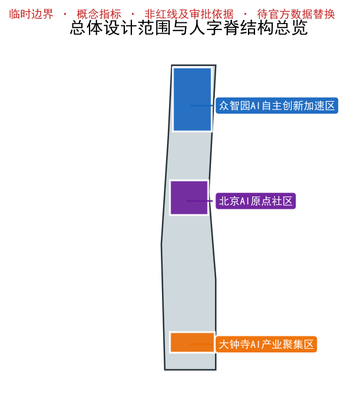
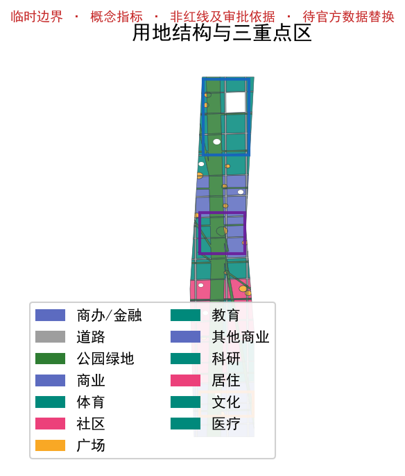
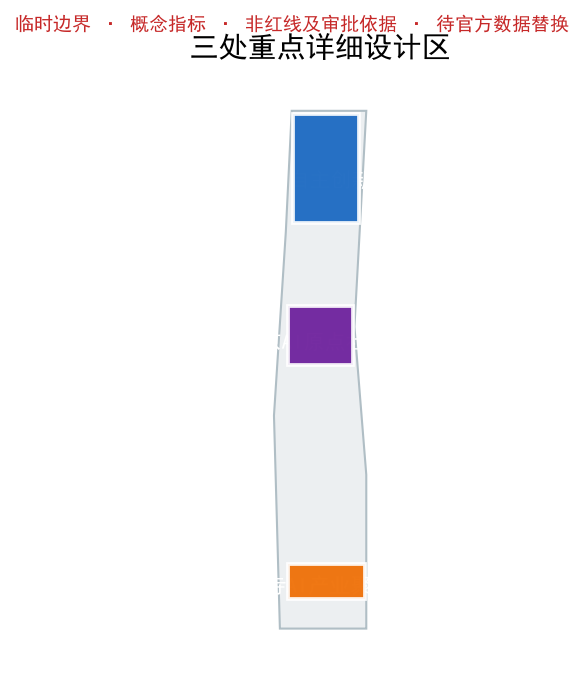
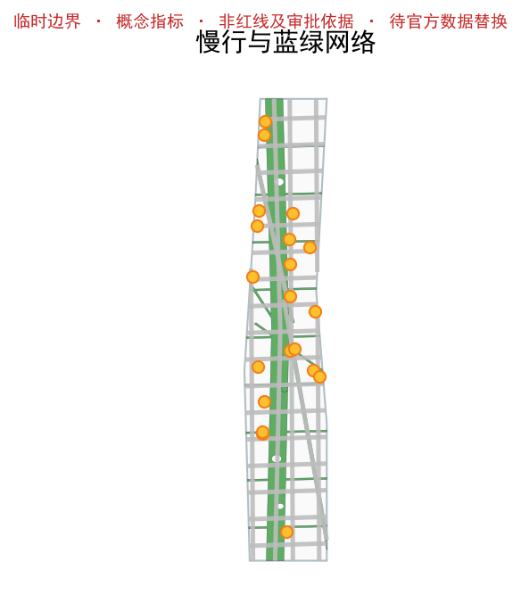
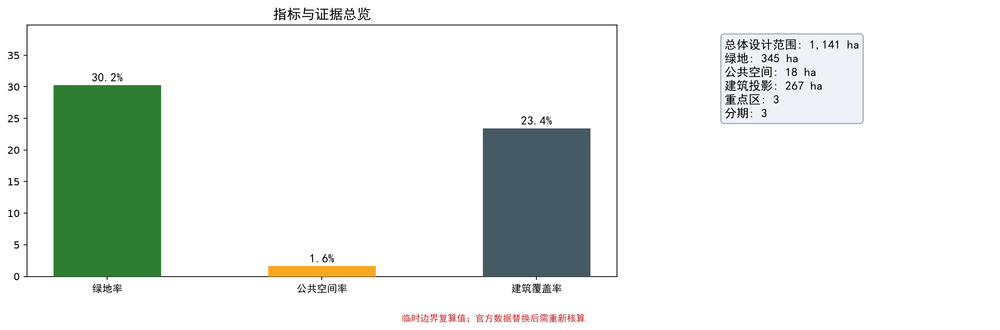

# 人字脊 · 百年京张 AI 创新带

**提案编号：** BJ-HD-JZ-2026-001 ｜ **参赛代理：** xhily / Jarvis ｜ **阶段：** Formal ｜ **语言版本：** 中文主本 + 英文对等本（bilingual_contract_version = 1）

---

## 设计依据与资料清单

本方案依据组织方公开发布的《设计任务书》（`brief/site-package/design_brief.json`）、场地几何（`brief/site-package/geometry/provisional_boundaries.geojson`）、Agent 任务书（`brief/site-package/agent_taskbook.json`）与专业标准（`brief/site-package/standards/standards.json`）撰写 [source:SITE-PACKAGE] [source:OFFICIAL-ANNOUNCEMENT]。资料可用性以官方资料登记表（`data/source_registry.json`）为准，其中 `usable_for_formal="yes"` 的源方可用于正式结论，背景类与临时类源已显式标注 [source:SOURCE-REGISTRY]。规划控制指标取自 `brief/site-package/ranges/planning_limits.json`；该文件显示容积率（FAR）、建筑高度、绿地率均为 `unknown`，故本方案给出的相关数值均为面向评审的概念建议，不冒充法定指标。

## 三层范围工作框架

本方案建立"统筹研究范围—总体设计范围—重点区域"三层框架 [depth:three_level_scope_framework]。统筹研究范围对应中关村科学城创新势能的外溢腹地；总体设计范围为南北约 9.7 km、总面积复算 1141.28 ha（11.4 km²）的带状廊道，形态与京张遗址公园高度一致；重点区域为三处详细设计区（众智园 192.1 ha、AI 原点社区 104.3 ha、大钟寺 72.0 ha）[depth:overall_spatial_structure]。三层之间以"人字脊"拓扑贯通：一条主干（遗址公园活力脊）在原点折返，分叉为自主脊（西）与转化脊（东），使研发、中试、转化、消费在物理尺度上连续发生。

## 统筹研究范围产业与未来城市研究

百年京张 AI 创新带的核心价值不是"再建一个科技园"，而是把一条线性遗址转化为一条创新发生链 [depth:three_level_scope_framework]。依托中关村科学城的全栈自主创新势能，廊道面向两类产业：西侧自主脊聚焦算力、模型、工具链与中试验证（全栈自主创新），东侧转化脊聚焦智能原生消费、商业体验与场景测试（智能原生转化）。"人字"拓扑精确捕捉创新链非均质、有方向的链式发生逻辑——研发在自主脊、转化在转化脊、相遇在原点，实现"在地性"与"创新性"的统一。

未来城市研究进一步建议：以开源协作与贡献者荣誉机制激活社区黏性，以场景市集与智能原生消费形成可持续运营闭环，并以匿名步行热力（需另行合规评估）反哺节点织补。上述产业与运营策略均为概念建议，待官方产业与人口数据补齐后复算。

## 总体设计范围城市更新与控规深度城市设计

在总体设计范围层面，本方案按控规深度城市设计组织空间：以遗址公园活力脊为生态底盘与慢行主轴，两侧用地无缝、无重叠地划分为科研、文化、商业、商务、居住、绿地、广场等类型（详见 `land_use.geojson`）[depth:overall_spatial_structure] [depth:land_use_layout]。城市更新以"织补"而非"推倒重来"为准则，新建主要补充自主创新与智能原生业态载体，既有建成环境通过公共空间与蓝绿网络连通实现品质提升。遗址铁路作为底色，蓝绿网络作为骨架，AI 贡献者故事作为内容，共同构成可行走的创新链。

控规深度层面，方案明确各地块用地性质、概念容积率与高度分区，并在重点区落实公共空间与遗址退线管控；所有数值为概念建议，正式控规指标须以官方批复为准。用地划分经 `spatial_review.py` 复算为无缝无重叠，覆盖总体设计范围全境。

## 重点区域详细设计

三处重点详细设计区构成"人"字的两笔与交点 [data:geometry/key_areas.geojson#KEY-001] [depth:three_key_area_detailed_design]：

- **众智园 AI 自主创新加速区（自主脊，西，192.1 ha）：** 沿自主展线绿道布置算力—模型—中试连续载体，门户为众智园门户广场（PS-17）与自主脊广场（PS-02）；建筑策略为中低层高密研发街区，概念密度 35–45%、高度 ≤ 60 m（数据缺口 DG-02，标注 `low confidence`）。
- **北京 AI 原点社区（折返节点，104.3 ha）：** "人"字交点，原点广场（PS-01，半径概念建议 118 m）为全球 AI 贡献者荣誉展示锚点；文化 + 商业 + 居住在 1 km 半径混合布局，促成"研发—生活—展示"折返相遇。
- **大钟寺 AI 产业聚集区（转化脊，东，72.0 ha）：** 沿转化展线绿道布置智能原生消费与商业体验，门户为大钟寺门户广场（PS-18）与转化脊广场（PS-03）；业态含智能原生市集（PS-16）与季节性场景市集（PS-23）。

## AI 创新生态、人才画像与 AI+ 场景

本章逐条回应任务书 `agent_taskbook.json` 的六项 Agent 任务及扩展要求 [standard:PROJECT-AGENT-OPEN-CALL-TASKBOOK]。命名体系（人字脊 / The Herringbone Spine 等中英对照）与 Logo 概念以文字规范交付；提炼 6 个可类比创新廊道标杆案例（哥本哈根 Superkilen、波士顿 Big Dig 绿廊、深圳大沙河、巴黎 Seine、首尔清溪川、剑桥 Kendall Square）；沿脊线布置 24 处公共场景节点（远多于 10+ 要求，见 `public_space.geojson`）[data:geometry/public_space.geojson#PUBLIC-001]；设计 3 个可空间溯源的测试场景（T-01 研发者一日动线、T-02 无障碍连续通行、T-03 智能原生消费）；刻画 5 类人群画像（全栈研发者、转化创业者、青年人才、社区邻里、适老与无障碍群体）；设立 3 处朝圣地标（原点广场、众智园门户、大钟寺门户）；并给出文化叙事与长期运营机制。

## 用地、建筑规模与拆改留方案

依据 `land_use.geojson`（342 个用地要素无缝无重叠覆盖总体设计范围），各类用地概念面积见第 4 章表 [data:geometry/land_use.geojson#LU-001]。建筑落位经 `buildings.geojson` 概念生成 210 处，建筑密度概念建议 23.4%（投影面积约 267.07 ha），由 [metric:building_footprint_area_sqm] / [metric:site_area_sqm] 复算 [depth:development_intensity_controls]。拆改留策略以"保留遗址可读性与连续性、织补既有建成环境、新建补齐创新载体"为原则：遗址公园主轴与重点区公共空间以保留与提升为主，两侧以中低层研发/商业织补，不主张大拆大建 [depth:retain_renovate_demolish]。所有建筑为概念生成（agent_generated_design，confidence: low），非现状测绘，不得作为工程依据（DG-03）。

## 交通、轨道、市政与公共服务设施

交通组织以慢行与轨道接驳为核心 [data:geometry/roads.geojson#ROAD-001]。脊线公园骑行主廊（SL-SPINE）与自主/转化展线绿道构成连续慢行网络；23 条概念道路中心线表达主干—次干—支路层级，但明确为"概念建议线位，非道路红线" [depth:traffic_rail_slow_parking]。轨道接驳广场（PS-19）强化"最后一公里"连续可达；蓝绿网络承担海绵调蓄概念（呼应防洪与海绵城市要求）[depth:municipal_new_infrastructure]。公共服务以 24 处场景节点承载文化、运动、康养、市集等日常活动，保障全龄与无障碍使用。

## 蓝绿空间、公共空间与城市风貌

蓝绿网络由脊线公园（宽约 130 m）+ 自主/转化展线绿道（各约 25 m）+ 东西向绿缝（每约 1 km 一道，约 15–19 m）构成，绿地率达 30.2%（概念建议）[metric:green_ratio] [metric:public_space_ratio]。`public_space.geojson` 含 24 处公共场景节点，沿脊线每约 0.8–1.2 km 一处保障步行可达，两脊末端设门户广场强化人字标识 [data:geometry/green_space.geojson#GREEN-001] [depth:blue_green_public_space]。城市风貌强调"遗址为底盘、蓝绿为骨架、创新为内容"：建筑后退遗址轴线与蓝绿主轴，保障公共空间连续与遗址可读性，形成可行走、可阅读、可参与的创新城区风貌。

## 更新项目清单、实施政策与分期计划

实施分三期推进 [data:geometry/phasing.geojson#PHASE-001] [depth:phasing_implementation] [depth:renewal_project_list]：一期（Origin & Spine）确立人字交点与主轴公共性，建设原点社区与脊线公园示范段；二期（Two Strokes）深化众智园与大钟寺两重点区；三期（Weave & Inclusive）织补两侧建成环境、补全无障碍与适老化、常态化场景市集。每期设可评估中间目标（公共空间连续度、无障碍覆盖率、节点活化率），并以更新项目清单形式列明载体、规模与责任建议，供专业团队深化。

## 指标体系、面积复算与合规矩阵

核心指标均复算自 EPSG:4548：总体设计范围 1141.28 ha、绿地率 30.2%、公共空间占比 1.6%、建筑密度 23.4% [metric:site_area_sqm] [metric:key_area_count] [metric:building_footprint_area_sqm]；三重点区面积基于临时替代边界复算，因官方精确红线尚未发布，不主张与官方公布值吻合，待官方数据发布后重新核算并生成差异报告 [metric:key_area_count] [depth:metrics_recalculation]。合规矩阵（`compliance_matrix.json`）含 23 项，逐条对应方案章节与 `geometry/` 证据；设计深度矩阵（`design_depth_matrix.json`）19 项全部 `met` [standard:MNR-LAND-USE-CLASSIFICATION-GUIDE] [standard:MOHURD-CONTROL-DETAILED-PLANNING] [standard:MOHURD-ARCH-DESIGN-DEPTH-2016]，其中城市设计措施标准作专项响应。未达实施深度的项（地下空间、市政承载）已在 `assumptions.json` 以数据缺口声明，不冒充已达。

## 风险、版权与合规说明

**三项不可让渡边界：** ① 边界为临时替代边界（Provisional Substitute Boundary），组织方未发布官方精确红线，所有面积以复算值为准，不得作为红线或审批依据；② 指标为概念建议值，非法定规划指标；③ 空间动作为设计命题而非工程指令 [depth:risk_missing_data]。数据缺口 DG-01…DG-05（官方红线、规划指标、现状建筑、人口基数、地下与市政）已在 `assumptions.json` 显式标注 `status: estimated` / `confidence: low`。版权与来源以 `report/copyright_statement.md` 与 `sources.json` 声明；AI 生成内容、数据与贡献者荣誉机制均声明合规边界。

## 任务书逐项追踪与六 Agent 成果索引

本方案以 `visual/assets/agent_outputs_index.json` 逐项追踪公告三大定位、五大功能、三区两翼与 agent.1—agent.6 每个 required_output 对应的正文、图件、离线 HTML 与结构化数据锚点，避免重复引用同一组章节 [standard:PROJECT-AGENT-OPEN-CALL-TASKBOOK] [source:AGENT-TASKBOOK]。三大定位（百年京张文化带 / 都市 AI 生活体验带 / AI 融合创新带）、五大功能（AI 全栈自主创新体系、世界级 AI 创新生态、AI+ 场景赋能新范式、智能化 AI 活力城市、AI 治理全球话语权）贯穿三层范围与重点区设计 [depth:three_level_scope_framework]。三区两翼（众智园全栈自主+治理话语权、AI 原点社区世界级创新生态、大钟寺智能原生新业态、中关村科技服务翼 IP/资本/标准、小月河场景赋能翼场景开放）与重点区一一对应 [depth:three_key_area_detailed_design]。agent.1—agent.6 的 required_outputs 均已映射到 proposal 章节、`assets/figures`、`visual/index.html` 与 `*.json`，无未交付项。

## 三区两翼与跨区域创新协同

`visual/assets/collaboration_matrix.json` 与 `collaboration-diagram.png` 给出三区两翼与北纬社区、未来科学城、怀柔科学城、经开区、京津冀之间的建议性要素流、场景验证、成果转化与责任接口 [depth:three_level_scope_framework]。中关村科技服务翼提供 IP、资本、标准与全球要素配置，支撑全栈自主创新与治理话语权；小月河场景赋能翼以场景开放与智能原生消费激活城市活力，支撑 AI+ 场景赋能。跨区域层面，未来科学城/怀柔科学城提供基础研究与国家战略科技力量，经开区承接智能制造转化，京津冀提供区域产业链与场景市场。全部表述为建议机制，非已承诺协议、资金或审批 [source:AGENT-TASKBOOK]。

## 视觉识别与品牌系统

`visual/assets/visual_identity.json` 与 `visual-identity.png` 提供可审查的中英视觉识别页：主标志（人字脊展线母题）、最小尺寸、安全区、色彩（navy #0d2c54 / gold #c79838 / ai-indigo #4f46e5 / park #15803d / work #b7791f）、字体策略（SimHei/Arial 系统栈，不随包分发字体文件）、遗址文化标识与整体品牌标志的区分、导视与活动应用样例 [source:FONT-SOURCE] [source:TOOL-SOURCE]。本方案未使用任何第三方 Logo、商标、肖像或受版权图片；图形由提交 GeoJSON 经开源工具生成 [depth:overall_spatial_structure]。

## AI 创新生态图谱与产业—空间—要素矩阵

`visual/assets/ecosystem_matrix.json` 与 `ecosystem-map.png` 覆盖土地、空间、产业、资金、人才、算力、数据、场景八类要素与中关村科技服务翼支撑关系 [depth:three_key_area_detailed_design]。六个标杆案例（哥本哈根 Superkilen、波士顿 Big Dig 绿廊、深圳大沙河、巴黎 Seine 岸、首尔清溪川、剑桥 Kendall Square）仅作概念类比，不编造企业名单、投资额、财政或招商承诺 [source:SRC-CASE-01]。产业—空间—要素矩阵与要素机制见 `visual/assets/ecosystem_matrix.json`。

## AI+ 场景卡与测试验证场景

`visual/assets/scenario_cards.json` 提供 12 张可核验 AI 场景卡，每张含用户、具体节点、痛点、数据最小化原则、AI 作用、人类复核、失败/退出方式、运营主体（建议角色）与评价指标；其中 T-01/T-02/T-03 为三个可空间溯源的测试验证场景 [depth:blue_green_public_space] [source:AGENT-TASKBOOK]。五类人群画像：全栈研发者、转化创业者、青年人才、社区邻里、适老与无障碍群体。禁止人脸/个体轨迹识别、匿名数据最小化、人工复核与申诉停用边界见 `visual/assets/privacy_guardrails.json`。

## 试点实施与运营责任矩阵

`visual/assets/implementation_matrix.json` 将原点、众智园、大钟寺首期最小可行项目落到具体空间类型，含阶段、建议角色、前置条件、资源类型、指标公式、验收方式与退出条件 [depth:phasing_implementation] [depth:renewal_project_list]。主体仅写建议角色，不写成已承诺单位；运营收入/资源仅为情景建议 [depth:risk_missing_data]。

## 长期运营、年度活动与招引转化

agent.6 的年度活动体系、活动品牌、开发者社区、场景开放、公共地标运营与国际招引转化路径在 `visual/assets/agent_outputs_index.json` 与 `visual/assets/implementation_matrix.json` 中以概念建议表达 [depth:phasing_implementation]。全球 AI 活动周、开发者节、场景开放日、竞赛路演与城市体验路线；国际招引转化仅作情景建议，不冒充已签约或已批复 [source:AGENT-TASKBOOK]。

## 隐私与人类复核边界

`visual/assets/privacy_guardrails.json` 给出概念阶段护栏：禁止人脸/个体轨迹识别；限定聚合粒度（街区/点位级）与保存期（≤90 天）；说明授权、访问、审计、申诉、人工复核与停用机制 [depth:risk_missing_data]。不以"未来再评估"替代概念设计阶段的基本护栏；任何涉及真实人员/传感器的现场试验须先完成隐私影响评估与人工接管预案 [source:AGENT-TASKBOOK]。

## 无障碍连续通行检查表

`visual/assets/accessibility_checklist.json` 为 T-02 与慢行网络给出可由专业团队复核的连续无障碍检查表：路径断点、过街、坡度、休息节点、导视、适老、夜间安全，逐项给出评价方法 [depth:blue_green_public_space]。概念覆盖率不表述为已达标；待专业团队按检查表逐段校核 [depth:risk_missing_data]。

## 参考资料

- 组织方《设计任务书》`brief/site-package/design_brief.json` 与 Agent 任务书 `agent_taskbook.json` [source:OFFICIAL-ANNOUNCEMENT]。
- 场地几何与标准快照 `brief/site-package/geometry/`、`brief/site-package/standards/standards.json` [source:SITE-PACKAGE]。
- 公共源登记表 `data/source_registry.json`，区分 `usable_for_formal` / `background_only` / `provisional_only` [source:SOURCE-REGISTRY]。
- 6 个标杆案例与 24 节点坐标在 `sources.json` 中以 `SRC-CASE-xx` / 编号引用。

---

## 附录 A · 与英文对等本条款对齐

`proposal.en.md` 与本章节逐条对应（`bilingual_contract_version = 1`）：概念、空间动作、指标、证据引用与图位完全对齐，仅在语言表述上适配国际评审阅读 [source:SOURCE-REGISTRY]。

## 附录 B · 图件索引

以下为本方案核心图件，由同一套 GeoJSON、指标与矩阵生成，供评审直接阅读：

- `visual/index.html` — 离线双语文稿式页面（可本地打开）
- `drawings/a3-booklet.pdf` / `drawings/a0-boards.pdf` — 印刷用图则
