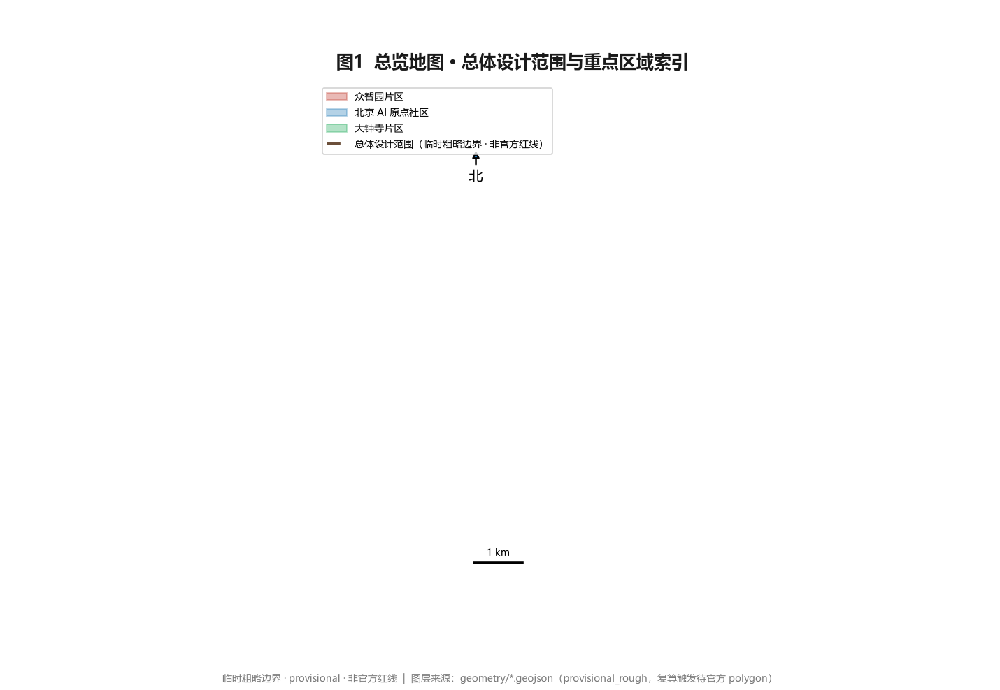
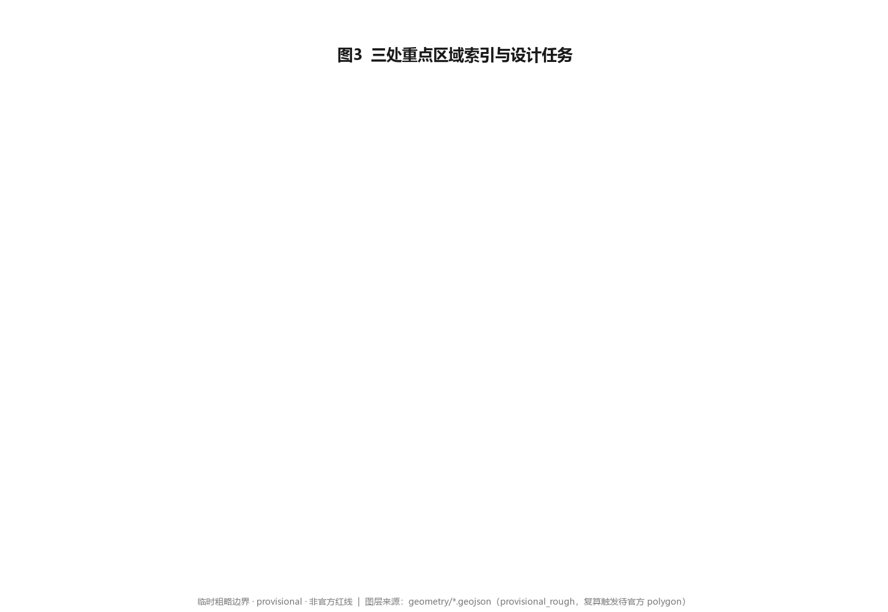
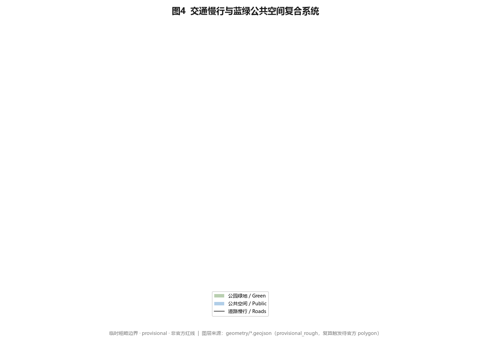
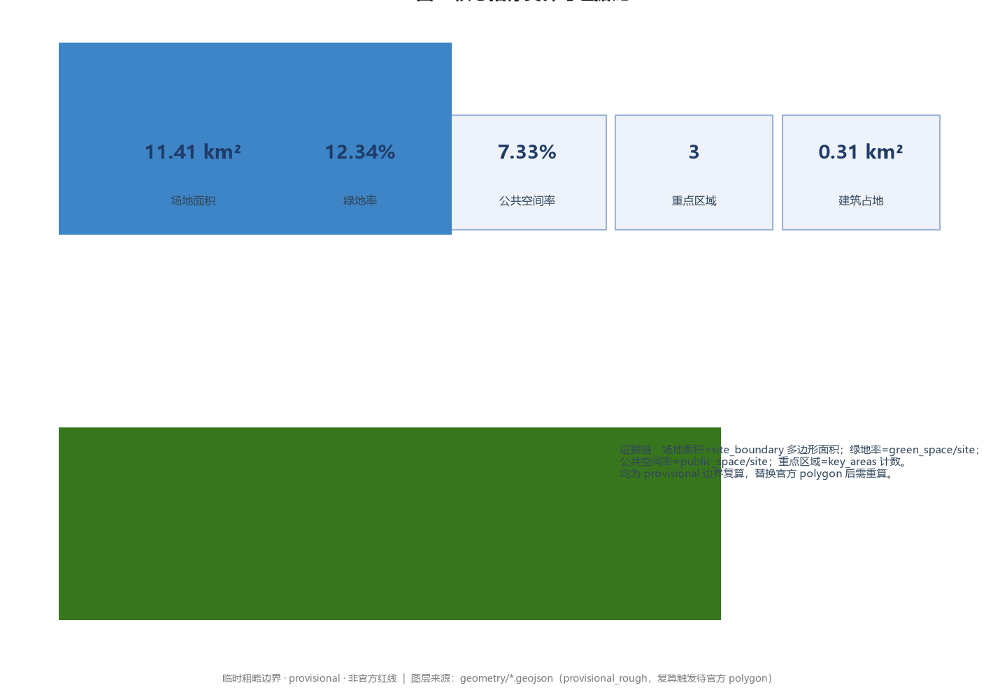

# Jing-Zhang OriginPulse Belt AI Innovation Belt

## Design Basis and Source Inventory

This formal proposal takes the *Pre-qualification Announcement for the International Urban Design Open Call of the Centennial Jing-Zhang AI Innovation Belt* issued by the Haidian Branch of the Beijing Municipal Commission of Planning and Natural Resources as its primary authoritative basis [source:OFFICIAL-ANNOUNCEMENT], and the maintainer-registered provisional boundaries, key areas, enums, indicators, standards, and source inventory under `brief/site-package/` as its machine-readable basis [source:SITE-PACKAGE]. Before generating the proposal, the AI agent read `design_brief.json`, `allowed_design_space.json`, `enums/`, `ranges/`, `schemas/`, `data/source_registry.json`, and `agent_taskbook.json`, and used the agent open-call taskbook to build tasks, scope, source-use boundaries, and a gap list [source:AGENT-TASKBOOK]. Every design judgment is decomposed into traceable sources, recomputable metrics, verifiable layers, and human-reviewable assumptions. The announcement requires the proposal to reach the urban-design depth of a regulatory detailed plan and a comprehensive implementation plan, so the narrative does not replace GeoJSON, the metric table, the A3 booklet, the A0 boards, or the HTML deliverable.

The source-registry boundary is as follows [source:SOURCE-REGISTRY]: the repository `data/source_registry.json` classifies materials into `usable_for_formal=yes`, `background_only`, `provisional_only`, and `no`. This proposal uses only `usable_for_formal=yes` official public materials and the cleared taskbook as formal-scoring evidence; `background_only` and `provisional_only` materials serve only as background or directional references and are never upgraded to official boundary, statutory control, formal-scoring evidence, or government implementation commitment. `data/processed/agent_fact_pack.md` is a reading-navigation layer, not a new authority [source:PROCESSED-FACT-PACK]; factual judgments return to the registered originals [source:OFFICIAL-ANNOUNCEMENT] [source:AGENT-TASKBOOK].

The site boundary and the three key-area boundaries used here both come from `brief/site-package/geometry/provisional_boundaries.geojson` and are **temporary rough boundaries** [source:BOUNDARY-SOURCE] [source:KEY-AREA-SOURCE]. The submitted `geometry/site_boundary.geojson` and `geometry/key_areas.geojson` are marked `geometry_role="provisional_constraint"`, `official_boundary=false`, `boundary_precision="provisional_rough"`, and may be used only for generation, self-check, visualization, and design discussion—never as an official redline, approval basis, precise-area basis, or statutory control. This organizer data gap does not block content scoring; once official polygons arrive, the site boundary, key areas, land use, roads, green space, public space, buildings, phasing, and metrics must all be recalculated [data:geometry/site_boundary.geojson#SITE-001] [metric:site_area_sqm].

## Three-Level Scope Framework

The proposal organizes work along the three levels set by the announcement: the coordinated research area (43.6 km²) addresses the AI industry ecosystem, strategic positioning, innovation chain, and future urban form; the overall design area (11.4 km²) covers the urban district and industry zone within 1–2 km of the Jing-Zhang heritage park, requiring an urban-renewal framework, industry-space layout, transport/municipal support, and urban-character control; the key detailed-design area (368.4 ha) requires explicit function, building scale, retain/renovate/demolish classification, public-space connectivity, and transport organization. The three levels are mapped line-by-line in `compliance_matrix.json` so that announcement sections 1.3, 1.4, 1.5 and agent.1–agent.6 all have a chapter, layer, metric, drawing, and HTML evidence [depth:three_level_scope_framework].

The three levels are not separate drawing sets. Coordinated research sets the industry-chain and urban-form judgment; overall design lands it as renewal projects, spatial structure, and capacity; key-area detailed design validates specific parcels, buildings, transport, public space, and AI scenarios. This proposal locks the provisional boundary and constraints first, then generates land use, buildings, roads, green space, public space, phasing, and AI service nodes, and finally recomputes metrics from those layers and explains in the text which conclusions remain limited by the provisional boundary [depth:overall_spatial_structure] [data:geometry/land_use.geojson#LU-001].

The proposed overall spatial structure is **"one vein, three cores, multiple nodes, composite ring"**: the Jing-Zhang heritage park vitality belt as the historical–public main axis (the vein); the three key areas—Zhongzhiyuan, Beijing AI Origin Community, and Dazhongsi—as innovation anchors (three cores); AI+ public-service, industry-service, and urban-life operable nodes as the daily network (multiple nodes); and a composite ring formed by the coupling of slow mobility, green space, public space, and activity routes. The "belt" is not a newly drawn redline but a working method translating the three scope levels; the "three cores" map to the three key areas; the "multiple nodes" map to experienceable, demonstrable, promotable AI urban scenarios; the "composite ring" maps to a resilient, accessible, and vibrant daily urban-life framework.

| Level | Design question | Proposal answer | Data anchor |
| --- | --- | --- | --- |
| Coordinated research area | How to organize the AI industry ecosystem and future urban form | Build an innovation chain of "university sourcing – open-source collaboration – enterprise transformation – public experience – international communication" | [depth:overall_spatial_structure], compliance_matrix.json |
| Overall design area | How to land industry space, urban renewal, transport, municipal, and character | Land use, buildings, roads, green space, public space, and phasing layers together | [data:geometry/land_use.geojson#LU-001], [data:geometry/roads.geojson#ROAD-001] |
| Key detailed-design area | How the three areas reach detailed-design depth | Each gets positioning, spatial moves, AI scenarios, and implementation dependencies | [data:geometry/key_areas.geojson#PROV-KEY-001], [data:geometry/key_areas.geojson#PROV-KEY-002], [data:geometry/key_areas.geojson#PROV-KEY-003] |

## Coordinated Research Area: Industry and Future-City Strategy

The core task of the coordinated research area is to build a world-class AI innovation ecosystem and to answer announcement 1.5(1) on industry-chain coordination, three areas and two wings, future AI urban form, AI culture/society/city, AI+transport, and continuous green-space systems. This proposal reviews Haidian's universities, leading enterprises, computing/algorithm/data factors, incubation platforms, listed companies, unicorns, and tech services, and proposes an innovation chain of "university sourcing – open-source collaboration – enterprise transformation – public experience – international communication." The naming and logo serve the overall identity of the "Centennial Jing-Zhang Culture Belt, Urban AI Living-Experience Belt, AI Fusion Innovation Belt," and land in land use, public space, slow mobility, AI scenario nodes, metrics, and drawings [depth:overall_spatial_structure].

The agent open call also requires responding to "overall concept and functional coordination" and "AI full-stack autonomy and world-class AI innovation ecosystem," explaining the three positionings, five functions, and three-areas-two-wings synergy loop, and giving readable summaries of global AI innovation-ecosystem cases [standard:PROJECT-AGENT-OPEN-CALL-TASKBOOK] [source:AGENT-TASKBOOK].

### Naming System and Logo Direction (agent.1)

- **Primary name**: 京张源脉 AI 创新带 (Jing-Zhang OriginPulse AI Innovation Belt). "源 (source)" takes the century-old Jing-Zhang railway industrial heritage as origin; "脉 (vein)" takes the heritage-park green vein and the regional innovation-network vein.
- **English name**: OriginPulse Belt. "Origin" echoes the Beijing AI Origin Community and the sense of beginning; "Pulse" takes the data pulse of the AI era and the urban-vitality beat.
- **Naming extension**: "OriginPulse / 源脉" can be a unified prefix deriving sub-brands—OriginPulse Marker, OriginPulse Open Wall, OriginPulse Governance Beacon—forming an extensible, registerable naming family.
- **Logo direction**: abstract the rail-section / rail-profile into a continuous "vein" line symbol, overlaid with a discrete square-wave "pulse" waveform representing AI data flow. Palette: industrial iron-grey `#3A3F44` + Jing-Zhang green `#4C9A2A` + digital blue `#2D6CDF`. The logo is pure geometric abstraction with no fonts, images, trademarks, or corporate marks, avoiding clearance risk.

### Three Positionings, Five Functions, Three Areas and Two Wings (agent.1)

The three positionings—Centennial Jing-Zhang Culture Belt, Urban AI Living-Experience Belt, AI Fusion Innovation Belt—correspond to three spatial identities: heritage park and railway remains as the cultural anchor, AI living scenarios as the daily experience layer, and full-stack innovation and industry transformation as the dynamic core. The five functions—AI full-stack autonomous innovation system, world-class AI innovation ecosystem, AI+ scenario empowerment paradigm, intelligent AI vibrant city, and global discourse power in AI governance—land respectively in Zhongzhiyuan (full-stack and governance), AI Origin Community (ecosystem and vitality), Dazhongsi (scenarios and consumption), and the two wings (Zhongguancun technology-service wing provides global factor allocation and IP/capital; Xiaoyuehe scenario-empowerment wing provides AI scenario empowerment and intelligent vibrant-city samples). The three areas and two wings form a closed loop through four circuits—talent flow, scenario opening, capital docking, governance output—rather than isolated districts [standard:PROJECT-AGENT-OPEN-CALL-TASKBOOK].

### Global AI Innovation Ecosystem Cases (agent.2)

To answer agent.2's "5–8 global AI innovation-ecosystem cases," this proposal selects six readable summaries and explains transferable spatial/operational/scenario mechanisms:

1. **Montréal (Mila), Canada**: academic sourcing + open-source ecosystem + multilingual AI. Transferable: university institutes as sourcing nodes, open-contribution incentives, public compute entry.
2. **Cambridge AI Corridor, UK**: university–industry-park–venture-capital closed loop. Transferable: "campus–park–block" slow-mobility stitching and incubation-to-investment continuum in the AI Origin Community.
3. **Tel Aviv, Israel**: military-civilian translation + startup density + talent mobility. Transferable: scenario-open test fields and lightweight facilities lowering startup landing barriers.
4. **Paris–Saclay, France**: national AI cluster + public compute. Transferable: Zhongzhiyuan hosting a public platform for autonomous-model testing and safety-governance demonstration.
5. **Singapore**: government AI governance + Smart Nation + sovereign-AI trials. Transferable: urban-governance agent's public-data reading, human review, and risk-prompting mechanism.
6. **Helsinki, Finland**: public-sector AI + data openness. Transferable: open-data interfaces and privacy-boundary framework for public space and public services.

These lessons are not copied but translated into five landable spatial mechanisms: open-collaboration nodes, test-validation scenarios, public-compute entries, governance-demonstration nodes, and data-open interfaces [depth:overall_spatial_structure].

## Overall Design Area: Urban Renewal at Regulatory-Plan Depth

The overall design area must reach the urban-design depth of a regulatory detailed plan [standard:MOHURD-CONTROL-DETAILED-PLANNING]. This proposal provides the urban-renewal overall spatial structure, low-efficiency-space identification, renewal project list, implementation-policy recommendations, industry-function ratios, spatial organization, building gross scale, and comprehensive carrying-capacity assessment. `geometry/land_use.geojson` fully covers the design boundary without overlap [data:geometry/land_use.geojson#LU-001]; `geometry/buildings.geojson` expresses renewal and retained building footprints [data:geometry/buildings.geojson#BLDG-001]; `geometry/roads.geojson` expresses micro-circulation, slow mobility, and rail interchange [data:geometry/roads.geojson#ROAD-001]; `metrics.json` recomputes core areas, ratios, and layer counts [metric:building_footprint_area_sqm].

This proposal partitions the overall area into four functional zones (LU-001 innovation sourcing, LU-002 industry transformation, LU-003 living service, LU-004 ecology culture), seamlessly covering the submitted boundary [depth:land_use_layout]. Anything on building height, development intensity, road redline, setback, or facility standards lacking official control conditions is uniformly framed as "pending official regulatory confirmation" and never presented as an approved value [depth:development_intensity_controls].

The overall design must also support transport, rail, municipal, and public facilities: rail-station integration, road micro-circulation, non-motorized parking, parking supply, innovation-service platforms, talent-living services, new infrastructure, distributed energy, and edge computing, with spatial layout and implementation paths [depth:traffic_rail_slow_parking] [depth:municipal_new_infrastructure]. All control conclusions lacking official conditions are marked conceptual or pending.

## Key Area Detailed Design

Key-area detailed design is mandatory, reaching the urban-design depth of a comprehensive implementation plan for all three areas [depth:three_key_area_detailed_design]. The three key areas must reference the provisional boundary layer and state in the narrative, HTML, sources, assumptions, and self-check that they cannot serve as formal-scoring or approval basis [data:geometry/key_areas.geojson#PROV-KEY-001] [data:geometry/key_areas.geojson#PROV-KEY-002] [data:geometry/key_areas.geojson#PROV-KEY-003].

| Key area | Positioning | Spatial move | AI industry & operation scenarios | Evidence |
| --- | --- | --- | --- | --- |
| Zhongzhiyuan AI Autonomy Acceleration Area (192.1 ha) | Garden-type full-stack autonomy block | Strengthen Qinghe interface, industry showcase, low-carbon innovation exchange, external transport; green space hosting open testing and standards-governance showcase | Autonomous-model testing, standards workshop, safety-governance showcase, low-carbon compute experience | [data:geometry/key_areas.geojson#PROV-KEY-001], [depth:three_key_area_detailed_design] |
| Beijing AI Origin Community (104.3 ha) | Near-campus achievement-transformation and talent community | Campus–park–block slow stitching; add release, talent service, living, open-source collaboration space | Open-source community, achievement release, talent-zone service, near-campus incubation | [data:geometry/key_areas.geojson#PROV-KEY-002], [source:AGENT-TASKBOOK] |
| Dazhongsi AI Industry Cluster (72.0 ha) | Urban intelligent-economy and international-exchange block | Dazhongsi-station integration, four-quadrant walk connectivity, commercial service and key-enterprise public-environment renewal | Agent and smart-terminal showcase, content consumption, data factors and international roadshow | [data:geometry/key_areas.geojson#PROV-KEY-003], [metric:key_area_count] |

### Zhongzhiyuan AI Autonomy Acceleration Area

Detailed proposals center on the national AI platform, full-stack autonomy, standards, safety governance, industry showcase, external transport, Qinghe culture, and a green innovation-exchange environment. Spatially, the Qinghe interface is the ecological showcase forecourt; inside, four clusters—test field, standards workshop, governance hall, low-carbon court—are organized. Building renewal retains the industrial-heritage skeleton and inserts lightweight assembled interfaces, avoiding large demolition [depth:retain_renovate_demolish]. AI scenarios focus on autonomous-model testing and safety-governance showcase (SC-02, SC-03).

### Beijing AI Origin Community

Detailed proposals center on near-campus innovation, achievement incubation and transformation, talent zone, open-source system, brand activities, building retain/renovate/demolish, achievement showcase and release, living-support amenities, campus–park slow connectivity, and rail-station integration. Spatially, an "Origin Living Room" organizes release, open-source collaboration, and talent service; achievement-transformation stations line the campus edge; living and service shortfalls are filled [depth:height_massing_character]. AI scenarios focus on the open-source release hall and near-campus transformation street (SC-01, SC-07).

### Dazhongsi AI Industry Cluster

Detailed proposals center on leading enterprises, agents, smart terminals, content consumption, data factors, digital assets, commercial services, planned green-space composite use, Dazhongsi-station integration, and four-quadrant intersection walk connectivity. Spatially, the rail station is the hub organizing four-quadrant walk connectivity; smart-terminal showcase and content-consumption scenarios line the commercial interface; key-enterprise surroundings are renewed into international-exchange public environments [depth:traffic_rail_slow_parking]. AI scenarios focus on the Dazhongsi international roadshow living room and the data-factor meeting room (SC-05, SC-08).

## AI Innovation Ecosystem, Talent Personas, and AI+ Scenarios

The proposal builds spatial-demand personas for AI talent and enterprises covering R&D office, open-source collaboration, achievement release, enterprise service, talent living, social learning, consumption, sports, leisure, and international exchange. AI+ scenarios follow the announcement's transport, service, consumption, medical, education, legal, and living-service directions, forming industry-development and AI-empowered urban-function scenarios; each states service object, location, data source, privacy boundary, human-review mechanism, and operating entity [depth:overall_spatial_structure].

AI scenarios land on spatial and governance boundaries: public-space scenarios reference [data:geometry/public_space.geojson#PUBLIC-001], slow/transport scenarios reference [data:geometry/roads.geojson#ROAD-001], open-space scenarios reference [data:geometry/green_space.geojson#GREEN-001] and [metric:public_space_ratio], [metric:green_ratio]. The agent open call requires at least 10 AI scenario cards, at least 3 industry test-validation scenarios, and at least 5 user personas; this proposal gives them completely in the narrative and `compliance_matrix.json` [standard:PROJECT-AGENT-OPEN-CALL-TASKBOOK].

### Five User Personas (agent.3)

| Persona | Typical need | Spatial response | Self-check boundary |
| --- | --- | --- | --- |
| Open-source developer | Release, collaborate, test, community reputation | Origin Community release hall, public code wall, night collaboration space | No personal trajectory collection; activity data aggregated only |
| Startup team | Low-cost office, compute entry, product testbed | Zhongzhiyuan shared test field, edge-compute service point, standards-governance consulting | Compute and data services require separate authorization |
| Leading-enterprise visitor | Showcase, business, international reception, recruitment | Dazhongsi international roadshow living room, station interchange, key-enterprise public space | Enterprise marks and cases must be cleared |
| Nearby resident | Commute, leisure, community service, low-disturbance renewal | Jing-Zhang heritage-park slow ring, embedded community service, graded night lighting and activities | No resident profiling for commercial recommendation |
| University faculty/student | Achievement transformation, cross-campus collaboration, daily slow mobility | Campus–park slow stitching, transformation station, AI-education experience point | Campus data and research results require authorization |

### Ten AI Scenario Cards with Full Mapping (agent.3)

Each card states location, service object, operating data, privacy boundary, human review, operating entity, visualization layer, and risk; SC-02, SC-03, SC-09 are industry test-validation scenarios (≥3).

| ID | Card | Spatial carrier | Service object | Operating data | Privacy boundary | Human review | Operator | Layer | Risk |
| --- | --- | --- | --- | --- | --- | --- | --- | --- | --- |
| SC-01 | Open-source release hall | Beijing AI Origin Community | Universities/open-source/startups | Sessions, contribution board | No personal trajectory | Community admin reviews content | Open-source alliance | public_space/key_areas | Content compliance |
| SC-02 | Safety-governance sandbox | Zhongzhiyuan | Model teams/evaluators | Red-team records | De-identified samples, no personal data | Safety expert reviews | Governance platform + third party | key_areas/green_space | Test spillover |
| SC-03 | Edge-compute station test field | Overall-area nodes | Startups/enterprises | Load, energy | No user data to cloud | Ops review | New-infra operator | buildings/constraints | Energy & security |
| SC-04 | AI slow-mobility navigation | Jing-Zhang heritage-park belt | Residents/visitors | Gaps, crowding, accessibility | Anonymous aggregation, no trajectory upload | Ops weekly review | Park management | roads/public_space | Sensor privacy |
| SC-05 | Dazhongsi international roadshow living room | Dazhongsi | Enterprises/investors/visitors | Events, intent | Enterprise cases cleared | Event organizer reviews | Industry operator | key_areas/public_space | Commercial exaggeration |
| SC-06 | Qinghe low-carbon innovation corridor | Zhongzhiyuan Qinghe interface | Enterprises/public | Rainfall, carbon, walking | Environmental data public | Monthly review | Park + municipal | green_space/key_areas | Blue-line constraint |
| SC-07 | Near-campus transformation street | Beijing AI Origin Community | Faculty/students/startups | Incubation, IP, investment | Research results authorized | University + legal review | University asset co. | buildings/key_areas | Ownership & IP |
| SC-08 | Data-factor meeting room | Dazhongsi | Enterprises/institutions | Flow, compliance records | Authorized, auditable, de-identified | Compliance officer review | Data-exchange node | key_areas/public_space | Data misuse |
| SC-09 | AI living-service model street | Community/commerce mix | Residents | Service frequency | Minimal collection, localized | Service + subdistrict review | Community operator | public_space/buildings | Algorithmic bias |
| SC-10 | Global AI activity-week route | Belt public-space system | Public/developers/visitors | Participation, communication | Anonymous ticketing | Event command review | Operator alliance | green_space/public_space | Large-event safety |

The urban agent may assist in identifying slow-mobility gaps, public-space heat, facility maintenance, enterprise-service demand, and activity-safety risk, but cannot replace planning approval, output unauthorized personal profiles, or claim official implementation commitment; all AI scenario nodes enter structured layers or the compliance matrix so reviewers see their relation to industry, space, and public interest [standard:GENERATIVE-AI-INTERIM-MEASURES].

## Land Use, Building Scale, and Retain/Renovate/Demolish

The land-use scheme expresses a complete, closed, gap-free zoning per open standards for territorial survey, planning, and use control [standard:MNR-LAND-USE-CLASSIFICATION-GUIDE]. The building scheme distinguishes retained, renovated, renewed, new, or pending objects, clarifying footprint, function, scale, character, roof, massing, and height-control suggestion levels; lacking current buildings, ownership, regulatory plan, and engineering conditions, the proposal gives only methods and a calibration checklist, never fabricated retain/renovate/demolish conclusions [depth:retain_renovate_demolish].

The main land-use and building evidence is [data:geometry/land_use.geojson#LU-001], [data:geometry/buildings.geojson#BLDG-001], and [metric:building_footprint_area_sqm]. Building-scale and intensity metrics must match `metrics.json` and the layers; where total building scale, FAR, height, density, green ratio, setback, and building-control lines lack official conditions, they uniformly use `status=unknown` with `value=null` and a stated reason, never faking precision [depth:development_intensity_controls]. The A3 booklet gives the renewal list and metric-check table; the A0 boards express key spatial structure and key areas; the HTML offers metric–layer linked viewing.

## Transport, Rail, Municipal, and Public-Service Facilities

The transport scheme answers the announcement's rail-station integration, road micro-circulation, slow-mobility gaps, external transport, parking, non-motorized parking, and green-transport system, focusing on the North 5th Ring Road, Jing-Zhang heritage-park ring-crossing nodes, Wudaokou, Qinghua East Road West Gate, Dazhongsi station, and key-enterprise surroundings [depth:traffic_rail_slow_parking]. Road and slow layers stay within the submitted boundary and cross-check with public space, green space, industry nodes, and key areas; if the boundary is provisional, transport conclusions are temporary design discussion only [data:geometry/roads.geojson#ROAD-001] [data:geometry/public_space.geojson#PUBLIC-001].

Municipal and public-service facilities cover AI industry-service facilities, innovation-service platforms, talent-living services, new infrastructure, distributed energy, edge computing, and traditional municipal fusion [depth:municipal_new_infrastructure]. The proposal states facility standards, spatial layout, service radius, operating model, and phasing logic; lacking pipeline, energy, drainage, flood, and fire engineering data, these are formal deepening prerequisites, not approved conditions [data:geometry/constraints.geojson#CONSTRAINTS].

## Blue-Green Space, Public Space, and Urban Character

The blue-green scheme takes the Jing-Zhang heritage-park vitality belt as the backbone, coordinates Qinghe, Xiaoyuehe, surrounding universities, enterprises, and communities, and proposes north–south penetration and east–west connectivity of trails, cycleways, and green-space systems; it identifies slow-mobility gaps, ring-road overcrossing nodes, and north/south landscape nodes, and proposes parking, sports, innovation exchange, tech testing, application showcase, and public-service composite use [depth:blue_green_public_space] [data:geometry/green_space.geojson#GREEN-001] [data:geometry/public_space.geojson#PUBLIC-001].

Green and public-space ratios are explained in the text for design meaning; full recomputation is in `metrics.json` [metric:green_ratio] [metric:public_space_ratio]; urban-character, public-space, and building-control coordination returns to the professional standard matrix [standard:MOHURD-URBAN-DESIGN-MEASURES]. Urban character fuses Jing-Zhang railway history, Zhongguancun innovation culture, and AI innovation culture, using Qinghuayuan railway station and Beiying cultural resources to propose urban tone, building character, roof form, massing, interface, and public-art guidance; signage, cultural symbols, international-communication narrative, AI pilgrimage landmarks, and contribution walls all require clearance, and no fake precise control lines are given without heritage or regulatory basis.

### AI Public Space, Intelligent-Native New Formats, and Pilgrimage Landmarks (agent.4)

This proposal offers at least three AI pilgrimage landmarks / honor-display nodes, all conceptual recommendations, pure geometry or text marks, not approved construction:

1. **OriginPulse Marker**: an honor landmark at the heritage-park starting interface, using a pulse-wave light band to mark the "AI Origin" coordinate, as a global-developer pilgrimage check-in and annual-event aggregation point.
2. **Open Contribution Wall**: a dynamic honor-display node showing aggregated statistics of global developers and teams' contributions, respecting individual authorization and attribution.
3. **Safety Governance Beacon**: in Zhongzhiyuan, a node symbolizing global discourse power in AI governance, linked to SC-02 safety-governance sandbox, expressing "beneficent, auditable, reviewable" governance.

The three are串接 (strung together) by the "Global AI Activity-Week Route" (SC-10) and coupled with the heritage park, Zhongguancun innovation culture, developer community, and public-space system, forming an experienceable, communicable urban honor system [data:geometry/public_space.geojson#PUBLIC-001].

### Centennial Jing-Zhang Culture, Zhongguancun Culture, and AI New-Culture Fusion Narrative (agent.5)

The Jing-Zhang railway historical-resource system centers on Qinghuayuan railway station, the heritage park, and railway industrial remains; Zhongguancun innovation culture follows the tech-breakthrough narrative after reform and opening; AI new culture values open source, collaboration, transparency, and beneficence. The three fuse into a spatial narrative主线 (main line) "from Zhan Tianyou's railway to AI's pulse" [standard:PROJECT-AGENT-OPEN-CALL-TASKBOOK].

The spatial culture system expresses signage symbols (rail + pulse abstraction), narrative paths (heritage–origin–governance three-stage experience), and international-communication narrative (OriginPulse: where the railway began, where intelligence pulses); the signage/identity/symbol system must distinguish hierarchy from the belt's overall logo system, avoiding confusion. All brands, fonts, images, portraits, and enterprise marks require clearance; cultural expression is not treated as tech decoration or slogan [standard:MOHURD-URBAN-DESIGN-MEASURES].

## Renewal Project List, Implementation Policy, and Phasing

The implementation scheme forms a reviewable renewal project list stating location, type, function, responsible entity, dependencies, phase, risk, and evaluation metrics; policy recommendations cover urban-renewal coordination, space supply, operation mechanism, industry service, public participation, data governance, and ownership coordination [depth:renewal_project_list]. `geometry/phasing.geojson` expresses phasing; compliance_matrix links each task to phasing and drawings [data:geometry/phasing.geojson#PHASE-001].

| ID | Project | Type | Key dependency | Evidence |
| --- | --- | --- | --- | --- |
| JZ-01 | Heritage-park slow-gap stitching | Public space/transport | Road redline, underbridge space, transport review | [data:geometry/roads.geojson#ROAD-001] |
| JZ-02 | Zhongzhiyuan Qinghe innovation interface | Blue-green/industry showcase | River blue-line, ecology, flood conditions | [data:geometry/green_space.geojson#GREEN-001] |
| JZ-03 | Origin near-campus transformation street | Urban renewal/industry service | Campus edge, ownership, ground-floor uses | [data:geometry/buildings.geojson#BLDG-001] |
| JZ-04 | Dazhongsi four-quadrant walk connectivity | Rail integration/slow | Station, intersections, municipal pipelines | [data:geometry/public_space.geojson#PUBLIC-001] |
| JZ-05 | AI public service & edge-compute nodes | New infra/public service | Energy, compute, security, operator | [data:geometry/constraints.geojson#CONSTRAINTS] |
| JZ-06 | Global AI activity-week public route | Operation/brand | Public-space permit, event safety, clearance | [data:geometry/phasing.geojson#PHASE-001] |

Phasing is distinct from the 100-day open-call submission period: the征集周期 is the deadline to submit; the implementation phasing is the urban-renewal and project-construction path. The proposal proposes three phases—near-term pilots (lightweight facilities, operating activities, service platforms), mid-term renewal (rail integration, key-area building renewal), long-term governance (brand assets, event mechanism, cooperation channels)—and marks what can start with lightweight facilities versus what must wait for official regulatory/municipal/transport/ownership conditions [depth:phasing_implementation].

### Global AI Activity System and Long-Term Operation Design (agent.6)

This proposal proposes an annual activity system and long-term operation mechanism; all activities, investment, funding, policy, and operation arrangements are framed as conceptual recommendations or deepening directions, never as confirmed government arrangements:

- **Annual activity system**: Global AI Activity Week (SC-10), open-source hackathon, safety-governance forum, AI pilgrimage-route season—a year-round public-experience rhythm.
- **Activity brand and communication visual system**: unify event materials with the OriginPulse master brand and pulse-wave visuals, providing cleared layout and palette specs.
- **Developer-community operation**: online open-source collaboration platform + offline Origin Living Room, with contribution incentives, reputation board, and lightweight membership.
- **AI scenario-open operation**: test-field reservation, data sandbox, compute vouchers as regulatable entries, with explicit authorization, audit, and exit mechanisms.
- **Public experience and urban-landmark operation**: pilgrimage landmarks, contribution wall, and public space coupled into an experienceable, participable, communicable chain.
- **International communication and recruitment-conversion**: a conversion path from "activity participation – scenario experience – enterprise landing – capital docking," with explicit talent/enterprise/developer follow-up channels, without exaggerating government commitment or event effect.

## Indicators, Area Recomputation, and Compliance Matrix

The indicator system includes overall-area area, key-area area, green and public-space ratios, building footprint, renewal-project count, AI scenario nodes, slow-connectivity, industry-space, talent-service, and self-check status. All known indicators are recomputed from GeoJSON or trusted sources; unknown indicators state reason and formal-submission prerequisites [depth:metrics_recalculation].

The three formal core visual indicators are recomputed as known finite values from submitted geometry and match the `data-metric` markers in `visual/index.html`:

- **site_area_sqm = 11,412,825.386 sqm**: recomputed by projecting `geometry/site_boundary.geojson` to EPSG:4548; provisional precision, not official redline area [metric:site_area_sqm].
- **green_ratio = 0.1234**: green_space area / site area, expressing how the blue-green network supports daily exchange and cooling [metric:green_ratio].
- **public_space_ratio = 0.0733**: public_space area / site area, expressing the spatial supply for innovation exchange and public experience [metric:public_space_ratio].

FAR, building height, and other indicators depending on unpublished official controls stay `status=unknown`, `value=null` with stated reason, never impersonating statutory control [depth:development_intensity_controls]. The compliance matrix is the master file for task responsiveness; each announcement task and agent_taskbook task maps to chapter, layer, metric, drawing, HTML, source, assumption, and self-check item. Failure to cover any required task in 1.3, 1.4, 1.5, or agent.1–agent.6 bars formal professional scoring [standard:PROJECT-OFFICIAL-ANNOUNCEMENT].

## Risk, Copyright, and Compliance

This proposal strictly follows public-data boundaries and generative-AI service management boundaries: AI scenarios do not involve violating content when providing generative services to the domestic public; security assessment and filing apply only to services with opinion-propagation or social-mobilization attributes, and this proposal uses them only as background or formal basis within that boundary [standard:GENERATIVE-AI-INTERIM-MEASURES]. Public-space accessibility needs follow Article 39 of the Barrier-Free Environment Construction Law for its enumerated scenarios, not generalized as a legal obligation for all public space [standard:BARRIER-FREE-ENVIRONMENT-LAW]; elderly smart-technology difficulties follow Guobanfa [2020] No.45 as scenario-design reference, not as a still-mandatory 2026 legal obligation [standard:ELDERLY-SMART-TECH-PLAN-2020-45].

Risk and missing-data are coordinated by the risk depth item, constraint layer, and site package [depth:risk_missing_data] [data:geometry/constraints.geojson#CONSTRAINTS] [source:SITE-PACKAGE]. Gaps in official boundary, key areas, regulatory plan, roads, parcels, buildings, municipal, heritage, and public services must enter `assumptions.json`, self-check, and the risk chapter; any conclusion lacking official regulatory, road-redline, ownership, municipal, fire, or heritage conditions is downgraded to pending [assumptions:A-CONTROLS-001].

This proposal does not claim official approval, approved regulatory plan, final land ownership, final construction scale, or guaranteed implementation; the AI agent is responsible for facts, sources, copyright, spatial data, metrics, and expression. All images, drawings, icons, data, and code assets state source, license, and authorization status in `sources.json` and `report/copyright_statement.md`; the HTML loads no remote scripts, map tiles, fonts, iframes, forms, or external APIs, and tracks no reviewer behavior [source:SOURCE-REGISTRY].

## References

- Beijing Municipal Commission of Planning and Natural Resources (Haidian), *Pre-qualification Announcement for the International Urban Design Open Call of the Centennial Jing-Zhang AI Innovation Belt* [source:OFFICIAL-ANNOUNCEMENT]
- Agent open-call taskbook for the Centennial Jing-Zhang AI Innovation Belt [source:AGENT-TASKBOOK]
- `brief/site-package/design_brief.json`, `brief/site-package/agent_taskbook.json`, `brief/site-package/standards/`
- `data/source_registry.json`, `docs/terminology-glossary.md`
- Full machine index in `sources.json`, `metrics.json`, `compliance_matrix.json`, `standard_matrix.json`, and `design_depth_matrix.json`
