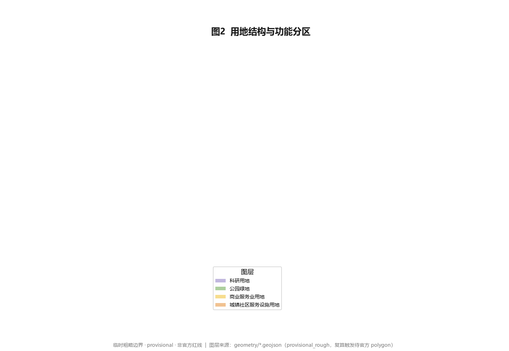

# 京张源脉 AI 创新带 OriginPulse Belt

## 设计依据与资料清单

本 formal 方案以北京市规划和自然资源委员会海淀分局发布的《百年京张AI创新带城市设计国际方案征集资格预审公告》为第一权威依据 [source:OFFICIAL-ANNOUNCEMENT]，并以 `brief/site-package/` 中经维护者登记的临时粗略边界、重点区域、枚举、指标、标准与来源清单为机器可读依据 [source:SITE-PACKAGE]。AI agent 在生成方案前已读取 `design_brief.json`、`allowed_design_space.json`、`enums/`、`ranges/`、`schemas/`、`data/source_registry.json` 与 `agent_taskbook.json`，并用面向智能体任务书建立任务、范围、资料用途与缺口清单 [source:AGENT-TASKBOOK]。所有设计判断都拆分为可追溯来源、可复算指标、可校验图层与可人工复核假设；公告要求方案达到控制性详细规划的城市设计深度与规划综合实施方案的城市设计深度，因此文本叙述不替代 GeoJSON、指标表、A3 文册、A0 展板与 HTML 电子展示成果。

资料登记表的使用边界如下 [source:SOURCE-REGISTRY]：当前仓库 `data/source_registry.json` 将资料分为 `usable_for_formal=yes`、`background_only`、`provisional_only` 与 `no` 四类。本方案坚持只把 `usable_for_formal=yes` 的官方公开材料与已清权任务书作为正式评分依据；`background_only` 与 `provisional_only` 材料仅作为背景或方向性参考，绝不上调为 official boundary、法定控规、正式评分依据或政府实施承诺。`data/processed/agent_fact_pack.md` 是阅读导航层而非新权威来源 [source:PROCESSED-FACT-PACK]，事实判断仍回到已登记原始材料 [source:OFFICIAL-ANNOUNCEMENT] [source:AGENT-TASKBOOK]，完整来源关系保存在 `sources.json`。

本方案采用的 site boundary 与三处重点区边界均来自 `brief/site-package/geometry/provisional_boundaries.geojson`，属于**临时粗略边界** [source:BOUNDARY-SOURCE] [source:KEY-AREA-SOURCE]。提交包中的 `geometry/site_boundary.geojson` 与 `geometry/key_areas.geojson` 已标注 `geometry_role="provisional_constraint"`、`official_boundary=false`、`boundary_precision="provisional_rough"`，只能用于方案生成、自检、可视化和设计讨论，不能作为 official redline、审批依据、精确面积依据或法定控制结论。该组织方数据缺口本身不阻断内容评分；替换 official polygons 后，site boundary、key areas、land use、roads、green space、public space、buildings、phasing 与 metrics 均需重算 [data:geometry/site_boundary.geojson#SITE-001] [metric:site_area_sqm]。

边界解释可回到总体范围图层与面积复算；三处重点区则由独立图层与数量指标核对 [data:geometry/key_areas.geojson#PROV-KEY-001] [data:geometry/key_areas.geojson#PROV-KEY-002]。其中 PROV-KEY-003 与重点区数量指标单独核对 [data:geometry/key_areas.geojson#PROV-KEY-003] [metric:key_area_count]。读者可从正文进入证据，不必先读一串机器编号。

## 三层范围工作框架

方案按公告确定的三个层次组织工作：统筹研究范围关注 43.6 平方公里的 AI 产业生态、战略定位、创新链与未来城市形态；总体设计范围关注 11.4 平方公里京张遗址公园周边 1–2 公里城市地区与产业区，要求形成城市更新总体框架、产业空间布局、交通市政支撑与城市风貌控制；重点区域范围关注 368.4 公顷三处详细设计地区，要求明确功能业态、建筑规模、拆改留分类、公共空间连通与交通组织。三层范围在 `compliance_matrix.json` 中逐条映射，保证公告 1.3、1.4、1.5 与 agent.1–agent.6 的必选任务都有章节、图层、指标、图纸与 HTML 证据 [depth:three_level_scope_framework]。

三层工作不是互相割裂的图纸集合。统筹研究决定产业链与城市形态判断，总体设计把判断落实到更新项目、空间结构与设施承载，重点区域详细设计验证具体地块、建筑、交通、公共空间与 AI 应用场景的可实施性。本方案先锁定当前提交采用的 provisional 边界与约束，再生成用地、建筑、道路、绿地、公共空间、分期与 AI 服务节点，最后从这些图层复算指标并在正文解释哪些结论仍受 provisional boundary 限制 [depth:overall_spatial_structure] [data:geometry/land_use.geojson#LU-001]。

用地布局以 LU-001 至 LU-004 四类分区无缝覆盖总体设计范围，承载产业、居住、混合与生态功能 [data:geometry/land_use.geojson#LU-002] [data:geometry/land_use.geojson#LU-003]。

本方案提出的总体空间结构为「**一脉三核多点复合环**」：以京张遗址公园活力带为历史—公共主轴（一脉），以众智园、北京 AI 原点社区、大钟寺三处重点片区为创新锚点（三核），以 AI+ 公共服务、产业服务与城市生活的可运营节点为日常网络（多点），以慢行、绿地、公共空间与活动路线联动形成的复合环（复合环）。这里的「一带」不是额外画出的新红线，而是把公告三层范围转译为工作方法；「三核」对应三处重点区域；「多点」对应可体验、可展示、可推广的 AI 城市场景；「复合环」对应韧性、可达与活力并重的日常城市生活框架。

| 层级 | 设计问题 | 方案回答 | 数据落点 |
| --- | --- | --- | --- |
| 统筹研究范围 | AI 产业生态与未来城市形态如何组织 | 建立「高校策源—开源协作—企业转化—公共体验—国际传播」的创新链 | [depth:overall_spatial_structure]、compliance_matrix.json |
| 总体设计范围 | 产业空间、城市更新、交通市政与风貌如何落图 | 用地、建筑、道路、绿地、公共空间与分期图层共同表达 | [data:geometry/land_use.geojson#LU-001]、[data:geometry/roads.geojson#ROAD-001] |
| 重点区域范围 | 三处片区如何达到详细设计深度 | 分别提出定位、空间动作、AI 场景与实施依赖 | [data:geometry/key_areas.geojson#PROV-KEY-001]、[data:geometry/key_areas.geojson#PROV-KEY-002]、[data:geometry/key_areas.geojson#PROV-KEY-003] |

## 统筹研究范围产业与未来城市研究

统筹研究范围的核心任务是构建世界级 AI 创新生态体系，并回应公告 1.5（1）关于产业链协同、三区两翼、未来 AI 城市形态、AI 文化/社会/城市、AI+交通与连续绿色空间体系的要求。本方案梳理海淀高校院所、头部企业、算力算法数据要素、孵化平台、上市企业、独角兽与科技服务资源，提出「高校策源—开源协作—企业转化—公共体验—国际传播」的创新链；命名与 Logo 设计服务于「百年京张文化带、都市 AI 生活体验带、AI 融合创新带」的整体辨识度，并落到用地、公共空间、交通慢行、AI 场景节点、指标与图纸 [depth:overall_spatial_structure]。

面向智能体任务书还要求回应「一带总体概念与功能统筹方案设计」和「AI 全栈自主创新体系与世界级 AI 创新生态设计」，必须解释三大定位、五大功能、三区两翼协同回路，给出全球 AI 创新生态案例的可读摘要 [standard:PROJECT-AGENT-OPEN-CALL-TASKBOOK] [source:AGENT-TASKBOOK]。

### 命名体系与 Logo 方向（agent.1）

- **主名称**：京张源脉 AI 创新带。「源」取京张铁路百年工业遗产之源，「脉」取遗址公园绿脉与区域创新网络脉络。
- **英文名称**：OriginPulse Belt。「Origin」呼应北京 AI 原点社区与起源之意，「Pulse」取 AI 时代的数据脉动与城市活力节拍。
- **命名延展**：「源脉」可作为统一前缀衍生子品牌——源脉脉冲塔、源脉开源墙、源脉治理灯塔，形成可延展、可注册的命名族。
- **Logo 方向**：以钢轨断面/铁轨截面抽象为「源脉」连续线条符号，叠加一条由离散方波构成的「脉冲」波形（代表 AI 数据流脉动）；色彩采用「工业铁灰 #3A3F44 + 京张绿 #4C9A2A + 数字蓝 #2D6CDF」三色体系。Logo 为纯几何抽象，不引用任何字体、图片、商标或企业标识，规避清权风险。

### 三大定位、五大功能与三区两翼协同回路（agent.1）

三大定位「百年京张文化带、都市 AI 生活体验带、AI 融合创新带」对应三种空间身份：遗址公园与铁路遗产构成文化锚，AI 生活场景构成日常体验层，全栈创新与产业转化构成动力核心。五大功能「AI 全栈自主创新体系、世界级 AI 创新生态、AI+场景赋能新范式、智能化 AI 活力城市、AI 治理全球话语权」分别落到众智园（全栈与治理）、AI 原点社区（生态与活力）、大钟寺（场景与消费）与两翼（中关村科技服务翼提供要素全球化配置与 IP/资本，小月河场景赋能翼提供 AI 场景赋能与智能化活力城市样本）。三区两翼通过「人才流动—场景开放—资本对接—治理输出」四条回路形成闭环，而非孤立片区 [standard:PROJECT-AGENT-OPEN-CALL-TASKBOOK]。

### 全球 AI 创新生态案例（agent.2）

为回答 agent.2 的「5–8 个全球 AI 创新生态案例」，本方案选取 6 个可读摘要，并说明可转化的空间/运营/场景机制：

1. **加拿大蒙特利尔（Mila）**：学术策源 + 开源生态 + 多语言 AI。可转化：以高校院所为策源节点，建立开源贡献激励机制与公共算力入口。
2. **英国剑桥 AI 走廊**：大学—产业园—风险资本闭环。可转化：在 AI 原点社区组织「校区—园区—街区」慢行缝合与孵化—投资连续体。
3. **以色列特拉维夫**：军民转化 + 初创密度 + 人才流动。可转化：建立场景开放测试场与轻量设施，降低初创团队落地门槛。
4. **法国巴黎—萨克雷**：国家级 AI 集群 + 公共算力。可转化：众智园承载自主模型测试与安全治理展示的公共平台。
5. **新加坡**：政府 AI 治理 + 智慧国 + 主权 AI 试验。可转化：城市治理智能体的公开资料读取、人工复核与风险提示机制。
6. **芬兰赫尔辛基**：公共部门 AI + 数据开放。可转化：公共空间与公共服务的开源数据接口与隐私边界框架。

这些经验不是照搬，而是转化为「开源协作节点、测试验证场景、公共算力入口、治理展示节点、数据开放接口」五类可落空间机制 [depth:overall_spatial_structure]。

## 总体设计范围城市更新与控规深度城市设计

总体设计范围要求达到控制性详细规划的城市设计深度 [standard:MOHURD-CONTROL-DETAILED-PLANNING]。本方案提出城市更新总体空间结构、低效空间识别、更新项目清单、实施政策建议、产业功能比例、空间组织模式、建筑总规模与综合承载能力评估。`geometry/land_use.geojson` 完整覆盖设计边界且无重叠 [data:geometry/land_use.geojson#LU-001]，`geometry/buildings.geojson` 表达更新与保留建筑基底 [data:geometry/buildings.geojson#BLDG-001]，`geometry/roads.geojson` 表达微循环、慢行与轨道接驳 [data:geometry/roads.geojson#ROAD-001]，`metrics.json` 复算核心面积、比例与图层数量 [metric:building_footprint_area_sqm]。

本方案将总体范围用地划分为四类功能分区（LU-001 创新策源、LU-002 产业转化、LU-003 生活服务、LU-004 生态文化），四类分区无缝隙覆盖 submitted boundary [depth:land_use_layout]。涉及建筑高度、开发强度、道路红线、退线与设施标准的内容，若尚无官方控制条件，一律表述为「待正式控规条件确认」，绝不以推测值冒充审定指标 [depth:development_intensity_controls]。

总体设计还必须支撑交通、轨道、市政与配套设施：围绕轨道站点一体化、道路微循环、非机动车停放、停车供给、创新服务平台、人才生活服务、新型基础设施、分布式能源与端侧算力提出空间布局与实施路径 [depth:traffic_rail_slow_parking] [depth:municipal_new_infrastructure]。所有管控性结论在有官方条件前均标注为概念建议或待确认事项。

## 重点区域详细设计

重点区域详细设计是必选项，对三处片区分别达到规划综合实施方案深度 [depth:three_key_area_detailed_design]。三处重点区必须引用 provisional 边界图层，并在正文、HTML、sources、assumptions 与 self_check 中说明其不能作为正式评分或审批依据 [data:geometry/key_areas.geojson#PROV-KEY-001] [data:geometry/key_areas.geojson#PROV-KEY-002] [data:geometry/key_areas.geojson#PROV-KEY-003]。

| 重点片区 | 设计定位 | 空间动作 | AI 产业与运营场景 | 证据引用 |
| --- | --- | --- | --- | --- |
| 众智园 AI 自主创新加速区（192.1 ha） | 花园型全栈自主创新街区 | 强化清河界面、产业展示、低碳创新交往、对外交通；以绿色空间承载开放测试与标准治理展示 | 自主模型测试、标准制定工作坊、安全治理展示、低碳算力体验 | [data:geometry/key_areas.geojson#PROV-KEY-001]、[depth:three_key_area_detailed_design] |
| 北京 AI 原点社区（104.3 ha） | 近校型成果转化与人才社区 | 校区—园区—街区慢行缝合；补足成果发布、人才服务、居住生活与开源协作空间 | 开源社区、成果发布、人才特区服务、近校孵化 | [data:geometry/key_areas.geojson#PROV-KEY-002]、[source:AGENT-TASKBOOK] |
| 大钟寺 AI 产业聚集区（72.0 ha） | 城市型智能经济与国际交往街区 | 大钟寺站一体化、四象限步行连通、商业服务与重点企业公共环境更新 | 智能体与智能终端展示、内容消费、数据要素与国际路演 | [data:geometry/key_areas.geojson#PROV-KEY-003]、[metric:key_area_count] |

### 众智园 AI 自主创新加速区

围绕国家人工智能平台、全栈自主创新、标准制定、安全治理、产业展示、对外交通、清河文化与绿色创新交往环境提出详细方案。空间上以清河界面为生态展示前厅，内部组织「测试场—标准坊—治理厅—低碳苑」四类组团；建筑更新以保留工业遗存骨架、植入轻量装配界面为主，避免大拆大建 [depth:retain_renovate_demolish]。AI 场景重点落在自主模型测试与安全治理展示（详见场景卡 SC-02、SC-03）。

### 北京 AI 原点社区

围绕近校创新、成果孵化转化、人才特区、开源体系、品牌活动、建筑拆改留、成果展示发布、居住生活配套、校区园区慢行联系与轨道站点一体化提出详细方案。空间上以「原点客厅」为核心组织成果发布、开源协作与人才服务，沿校区边界设置成果转化驿站，补足居住与生活服务短板 [depth:height_massing_character]。AI 场景重点落在开源发布厅与近校成果转化街（SC-01、SC-07）。

### 大钟寺 AI 产业聚集区

围绕领军企业、智能体、智能终端、内容消费、数据要素、数字资产、商业服务、规划绿地复合利用、大钟寺站一体化与路口四象限步行连通提出详细方案。空间上以轨道站点为枢纽组织四象限步行连通，沿商业界面植入智能终端展示与内容消费场景，重点企业周边更新为国际交往公共环境 [depth:traffic_rail_slow_parking]。AI 场景重点落在大钟寺国际路演客厅与数据要素会客厅（SC-05、SC-08）。

## AI 创新生态、人才画像与 AI+ 场景

方案建立面向 AI 人才与企业的空间需求画像，覆盖研发办公、开源协作、成果发布、企业服务、人才居住、社交学习、消费生活、运动休闲与国际交往。AI+ 场景围绕公告提出的交通、服务、消费、医疗、教育、法律、生活服务等方向，形成产业发展场景与 AI 赋能城市功能场景；每个场景说明服务对象、空间位置、数据来源、隐私边界、人工复核机制与运营主体 [depth:overall_spatial_structure]。

AI 场景落到空间与治理边界：公共空间场景引用 [data:geometry/public_space.geojson#PUBLIC-001]，慢行与交通场景引用 [data:geometry/roads.geojson#ROAD-001]，开放空间场景引用 [data:geometry/green_space.geojson#GREEN-001] 与 [metric:public_space_ratio]、[metric:green_ratio]。面向智能体任务书要求不少于 10 张 AI 场景卡、不少于 3 个产业测试验证场景与不少于 5 类用户画像，本方案在正文与 `compliance_matrix.json` 中完整给出 [standard:PROJECT-AGENT-OPEN-CALL-TASKBOOK]。

### 五类用户画像（agent.3）

| 用户画像 | 典型需求 | 空间响应 | 自检边界 |
| --- | --- | --- | --- |
| 开源开发者 | 发布、协作、测试、社区声誉 | 原点社区开源发布厅、公共代码墙、夜间协作空间 | 不采集个人行为轨迹；活动数据只做聚合统计 |
| 初创团队 | 低成本办公、算力入口、产品试验场 | 众智园共享测试场、端侧算力服务点、标准治理咨询 | 算力和数据服务需另行授权 |
| 头部企业访客 | 展示、商务、国际接待、人才招聘 | 大钟寺国际路演客厅、轨道站点接驳、重点企业周边公共空间 | 企业标识和案例须清权 |
| 周边居民 | 通勤、休闲、社区服务、低扰动更新 | 京张遗址公园慢行环、社区服务嵌入、夜间照明和活动分级 | 不将居民画像用于商业推荐 |
| 高校师生 | 成果转化、跨校协作、日常慢行 | 校区—园区慢行缝合、成果转化驿站、AI 教育体验点 | 校园数据和科研成果需授权 |

### 十张 AI 场景卡与完整映射（agent.3）

以下场景卡均标注空间位置、服务对象、运行数据、隐私边界、人工复核、运营主体、可视化图层与风险；其中 SC-02、SC-03、SC-09 为产业测试验证场景（≥3）。

| 编号 | 场景卡 | 空间载体 | 服务对象 | 运行数据 | 隐私边界 | 人工复核 | 运营主体 | 可视化图层 | 风险 |
| --- | --- | --- | --- | --- | --- | --- | --- | --- | --- |
| SC-01 | 开源发布厅 | 北京 AI 原点社区 | 高校/开源社区/初创 | 发布场次、贡献榜 | 不采集个人轨迹 | 社区管理员审核内容 | 开源社区联盟 | public_space/key_areas | 内容合规 |
| SC-02 | 安全治理沙盒 | 众智园 | 模型团队/评测机构 | 红队测试记录 | 脱敏样本、无个人数据 | 安全专家复核 | 治理平台+第三方 | key_areas/green_space | 测试外溢 |
| SC-03 | 端侧算力驿站测试场 | 总体范围节点 | 初创/企业 | 算力负载、能耗 | 无用户数据上云 | 运维复核 | 新基建运营商 | buildings/constraints | 能耗与安全 |
| SC-04 | AI 慢行导航 | 京张遗址公园活力带 | 居民/游客 | 断点、拥挤、无障碍 | 匿名聚合、不上传轨迹 | 运维周复核 | 公园管理方 | roads/public_space | 传感隐私 |
| SC-05 | 大钟寺国际路演客厅 | 大钟寺片区 | 企业/投资者/访客 | 活动、签约意向 | 企业案例须清权 | 活动方审核 | 产业运营公司 | key_areas/public_space | 商业夸大 |
| SC-06 | 清河低碳创新廊 | 众智园临清河界面 | 企业/公众 | 雨洪、碳、步行 | 环境数据公开 | 月度复核 | 园区+市政 | green_space/key_areas | 蓝线约束 |
| SC-07 | 近校成果转化街 | 北京 AI 原点社区 | 师生/初创 | 孵化、IP、投融资 | 科研成果需授权 | 校方+法务复核 | 高校资产公司 | buildings/key_areas | 权属与 IP |
| SC-08 | 数据要素会客厅 | 大钟寺片区 | 企业/机构 | 流通量、合规记录 | 授权、可审计、脱敏 | 合规官复核 | 数据交易所节点 | key_areas/public_space | 数据滥用 |
| SC-09 | AI 生活服务样板街 | 社区与商业交汇 | 居民 | 服务使用频次 | 最小化采集、本地化 | 服务方+街道复核 | 社区运营 | public_space/buildings | 算法歧视 |
| SC-10 | 全球 AI 活动周路线 | 一带公共空间系统 | 公众/开发者/游客 | 参与、传播 | 匿名票务 | 活动指挥复核 | 运营联盟 | green_space/public_space | 大型活动安全 |

城市智能体可辅助识别慢行断点、公共空间热力、设施维护、企业服务需求与活动安全风险，但不能替代规划审批、不能输出未经授权的个人画像、不能声称获得官方实施承诺；所有 AI 场景节点进入结构化图层或合规矩阵，便于评审者看到它们与产业、空间和公共利益之间的关系 [standard:GENERATIVE-AI-INTERIM-MEASURES]。

## 用地、建筑规模与拆改留方案

用地方案依据国土空间调查、规划、用途管制分类等公开标准表达，形成完整、闭合、无缝的用地分区 [standard:MNR-LAND-USE-CLASSIFICATION-GUIDE]。建筑方案区分保留、改造、更新、新建或待确认对象，明确建筑基底、功能、规模、风貌、屋顶、体量与高度控制建议层级；若缺少现状建筑、权属、控规与工程条件，方案只提方法与待校准清单，不编造拆改留结论 [depth:retain_renovate_demolish]。

用地与建筑的主要证据是 [data:geometry/land_use.geojson#LU-001]、[data:geometry/buildings.geojson#BLDG-001] 与 [metric:building_footprint_area_sqm]。建筑规模和强度指标必须与 `metrics.json` 和图层一致；若总建筑规模、容积率、建筑高度、建筑密度、绿地率、退线与建筑控制线缺少官方条件，统一使用 `status=unknown`，并在 `reason`/`assumptions` 中说明待补条件、当前假设与正式数据到位后的复算路径，绝不用固定数值制造精确感 [depth:development_intensity_controls]。A3 文册给出更新项目清单与指标复核表，A0 展板把关键空间结构与重点片区表达清楚，HTML 页面提供指标与图层联动查看。

## 交通、轨道、市政与公共服务设施

交通方案回应公告对轨道站点一体化、道路微循环、慢行断点、对外交通、停车、非机动车停放与绿色交通系统的要求，重点覆盖北五环、京张遗址公园跨环路节点、五道口、清华东路西口、大钟寺站及重点企业周边交通联系 [depth:traffic_rail_slow_parking]。道路与慢行图层保持在 submitted boundary 内，并与公共空间、绿地、产业节点和重点片区相互校核；若 boundary 为 provisional，交通结论只能作为临时设计讨论 [data:geometry/roads.geojson#ROAD-001] [data:geometry/public_space.geojson#PUBLIC-001]。

市政与公共服务设施覆盖 AI 产业服务设施、创新服务平台、人才生活服务设施、新型基础设施、分布式能源、端侧算力与传统市政设施融合 [depth:municipal_new_infrastructure]。方案说明设施标准、空间布局、服务半径、运营模式和分期实施逻辑；缺少管线、能源、排水、防洪、消防等工程资料时，列为正式深化前置条件而非审定条件 [data:geometry/constraints.geojson#CONSTRAINTS]。

## 蓝绿空间、公共空间与城市风貌

蓝绿空间方案以京张遗址公园活力带为骨架，统筹清河、小月河、周边高校、企业、社区出行需求，提出南北贯通、东西连通的步道、骑行道与绿色空间体系，识别慢行断点、上跨环路节点、公园南端与北端景观节点，提出停车、体育、创新交往、科技测试、应用展示与公共服务复合利用策略 [depth:blue_green_public_space] [data:geometry/green_space.geojson#GREEN-001] [data:geometry/public_space.geojson#PUBLIC-001]。

绿地与公共空间比例在正文解释设计意义，完整复算保存在 `metrics.json` [metric:green_ratio] [metric:public_space_ratio]；城市风貌、公共空间与建筑控制的统筹回到专业标准矩阵 [standard:MOHURD-URBAN-DESIGN-MEASURES]。城市风貌融合京张铁路历史文化、中关村创新文化与 AI 创新文化，利用清华园火车站、北影等文化资源，提出城市基调、建筑风貌、屋顶形态、体量、界面与公共艺术引导；导视标识、文化符号、国际传播叙事、AI 朝圣地标与贡献墙均需清权，严禁在没有文保或控规依据时给出伪精确控制线。

### AI 公共空间、智能原生新业态与朝圣地标（agent.4）

本方案提出不少于 3 个 AI 朝圣地标/荣誉展示节点，均为概念建议、纯几何或文字标识，不构成已批准建设：

1. **源脉脉冲塔（OriginPulse Marker）**：位于京张遗址公园起点界面的荣誉地标，以脉冲波形光带标识「AI 原点」坐标，作为全球开发者「朝圣」打卡与年度活动聚合点。
2. **开源贡献墙（Open Contribution Wall）**：动态展示全球开发者与团队贡献的荣誉展示节点，数据来自开源协作平台的聚合统计，尊重个人授权与署名。
3. **安全治理灯塔（Safety Governance Beacon）**：位于众智园，象征 AI 治理全球话语权的展示节点，与 SC-02 安全治理沙盒联动，表达「向善、可审计、可复核」的治理主张。

三者通过「全球 AI 活动周路线」（SC-10）串联，并与京张遗址公园、中关村创新文化、开发者社区和公共空间系统耦合，形成可体验、可传播的城市荣誉体系 [data:geometry/public_space.geojson#PUBLIC-001]。

### 百年京张文化、中关村文化与 AI 新文化融合叙事（agent.5）

京张铁路历史文化资源系统以清华园火车站、京张遗址公园与铁路工业遗存为核心；中关村创新文化以改革开放后的科技突围为脉络；AI 新文化以开源、协作、透明、向善为价值。三者融合为「从詹天佑的铁路到 AI 的脉冲」的空间叙事主线 [standard:PROJECT-AGENT-OPEN-CALL-TASKBOOK]。

空间文化系统以导视符号（钢轨+脉冲抽象）、叙事路径（遗址—原点—治理三段式体验动线）、国际传播叙事（OriginPulse：where the railway began, where intelligence pulses）表达；导视、标识、符号系统必须与一带整体 Logo 系统区分层级，避免混淆。所有品牌、字体、图像、肖像与企业标识均须清权，文化表达不被当作科技装饰或口号 [standard:MOHURD-URBAN-DESIGN-MEASURES]。

## 更新项目清单、实施政策与分期计划

实施方案形成可审查的更新项目清单，说明位置、类型、功能、责任主体、依赖条件、实施阶段、风险与评估指标；政策建议覆盖城市更新统筹实施、空间供给、运营机制、产业服务、公共参与、数据治理与产权协同 [depth:renewal_project_list]。`geometry/phasing.geojson` 表达分期范围，compliance_matrix 把每个任务与分期和图纸挂接 [data:geometry/phasing.geojson#PHASE-001]。

| 项目编号 | 项目名称 | 类型 | 主要依赖 | 证据引用 |
| --- | --- | --- | --- | --- |
| JZ-01 | 京张遗址公园慢行断点缝合 | 公共空间/交通 | 道路红线、桥下空间、交通组织复核 | [data:geometry/roads.geojson#ROAD-001] |
| JZ-02 | 众智园清河创新界面 | 蓝绿空间/产业展示 | 河道蓝线、生态和防洪条件 | [data:geometry/green_space.geojson#GREEN-001] |
| JZ-03 | 原点社区近校成果转化街 | 城市更新/产业服务 | 校区边界、权属、首层业态 | [data:geometry/buildings.geojson#BLDG-001] |
| JZ-04 | 大钟寺站四象限步行连通 | 轨道一体化/慢行 | 轨道站点、道路交叉口、市政管线 | [data:geometry/public_space.geojson#PUBLIC-001] |
| JZ-05 | AI 公共服务与端侧算力节点 | 新基建/公共服务 | 能源、算力、安全和运营主体 | [data:geometry/constraints.geojson#CONSTRAINTS] |
| JZ-06 | 全球 AI 活动周公共路线 | 运营/品牌 | 公共空间许可、活动安全、版权清权 | [data:geometry/phasing.geojson#PHASE-001] |

分期与 100 天征集设计周期区分：征集周期是提交成果的时间要求，实施分期是城市更新与项目建设的推进路径。方案提出近期试点（轻量设施、运营活动、服务平台）、中期更新（轨道一体化、重点区建筑更新）、长期治理（品牌资产、活动机制、合作通道）三阶段，并标明哪些可先以轻量设施启动、哪些必须等待正式控规/市政/交通/权属条件确认 [depth:phasing_implementation]。

### 全球 AI 创新活动体系与长期运营设计（agent.6）

本方案提出年度活动体系与长期运营机制，所有活动、招商、资金、政策与运营安排均表述为概念建议或深化方向，不表述为已确定政府安排：

- **年度活动体系**：全球 AI 活动周（SC-10）、开源黑客松、安全治理论坛、AI 朝圣路线季，形成四季不断的公共体验节奏。
- **活动品牌与传播视觉系统**：以 OriginPulse 主品牌与脉冲波形视觉统一活动物料，提供清权的版式与配色规范。
- **开发者社区运营机制**：线上开源协作平台 + 线下原点客厅，建立贡献激励、声誉榜与轻量会员体系。
- **AI 场景开放运营机制**：测试场预约、数据沙盒、算力券等可监管入口，明确授权、审计与退出机制。
- **公共体验与城市地标运营**：朝圣地标、贡献墙与公共空间联动，形成可参观、可参与、可传播的体验链。
- **国际传播与招引转化机制**：从「活动参与—场景体验—企业落地—资本对接」的转化路径，明确人才、企业、开发者后续转化通道，不夸大政府承诺或活动效果。

## 指标体系、面积复算与合规矩阵

指标体系包含总体设计范围面积、重点区域面积、绿地与公共空间比例、建筑基底、更新项目数量、AI 场景节点、慢行连通指标、产业空间指标、人才服务指标与自检状态。所有 known 指标从 GeoJSON 或可信来源复算；unknown 指标给出原因与正式提交前置条件 [depth:metrics_recalculation]。

三项 formal 核心视觉指标已由提交几何复算为 known 有限值，并与 `visual/index.html` 的 `data-metric` 标记一致：

- **site_area_sqm = 11,412,825.386 sqm**：由 `geometry/site_boundary.geojson` 投影至 EPSG:4548 复算，provisional 精度，非官方红线面积 [metric:site_area_sqm]。
- **green_ratio = 0.1234**：green_space 面积 / site 面积，表达蓝绿网络对日常交往与降温的支撑 [metric:green_ratio]。
- **public_space_ratio = 0.0733**：public_space 面积 / site 面积，表达创新交往与公共体验的空间供给 [metric:public_space_ratio]。

容积率、建筑高度等依赖未公开官方控制条件的指标保持 `status=unknown`、`value=null` 并说明原因，不冒充法定控制值 [depth:development_intensity_controls]。合规矩阵是任务响应性的主控文件，每条公告任务与 agent_taskbook 任务对应到报告章节、图层、指标、图纸、HTML、来源、假设与自检项；未能覆盖公告 1.3、1.4、1.5 或 agent.1–agent.6 任一必选任务，方案不得进入 formal professional scoring [standard:PROJECT-OFFICIAL-ANNOUNCEMENT]。

## 风险、版权与合规说明

本方案严格遵循公开资料边界与生成式 AI 服务管理边界：AI 场景不涉及向境内公众提供生成式服务时的违规内容，安全评估、备案等仅针对具有舆论属性或社会动员能力的服务，本方案仅在此边界内作为背景或 formal 依据 [standard:GENERATIVE-AI-INTERIM-MEASURES]。公共空间无障碍需求按《无障碍环境建设法》第 39 条列举场景理解，不泛化为所有公共空间的法律义务 [standard:BARRIER-FREE-ENVIRONMENT-LAW]；老年人智能技术困难按国办发〔2020〕45 号作为场景设计参照，不写成 2026 年仍强制的法律义务 [standard:ELDERLY-SMART-TECH-PLAN-2020-45]。

风险与缺资料清单由风险深度项、约束图层与场地包共同校核 [depth:risk_missing_data] [data:geometry/constraints.geojson#CONSTRAINTS] [source:SITE-PACKAGE]。official boundary、key area、控规、道路、地块、建筑、市政、文保与公共服务缺口必须进入 `assumptions.json`、自检与正文风险章节；任何缺少官方控规、道路红线、权属、市政、消防或文保条件的结论都降级为待确认事项 [assumptions:A-CONTROLS-001]。

本方案不声称官方批准、审定控规、最终土地权属、最终建设规模或保证实施；AI agent 对事实、来源、版权、空间数据、指标与表达负责。所有图片、图纸、图标、数据与代码资产均在 `sources.json` 与 `report/copyright_statement.md` 中说明来源、许可与授权状态；HTML 页面不加载远程脚本、远程地图瓦片、远程字体、iframe、表单或外部 API，不跟踪评审者行为 [source:SOURCE-REGISTRY]。

## 参考资料

- 北京市规划和自然资源委员会海淀分局《百年京张AI创新带城市设计国际方案征集资格预审公告》[source:OFFICIAL-ANNOUNCEMENT]
- 面向全球智能体开展百年京张AI创新带城市设计开源征集任务书 [source:AGENT-TASKBOOK]
- `brief/site-package/design_brief.json`、`brief/site-package/agent_taskbook.json`、`brief/site-package/standards/`
- `data/source_registry.json`、`docs/terminology-glossary.md`
- 完整机器索引见 `sources.json`、`metrics.json`、`compliance_matrix.json`、`standard_matrix.json` 与 `design_depth_matrix.json`
