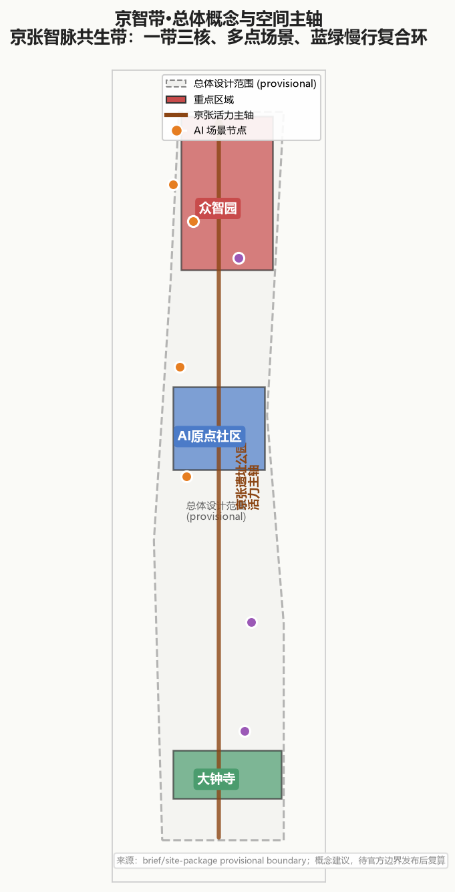
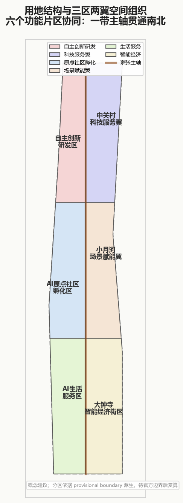
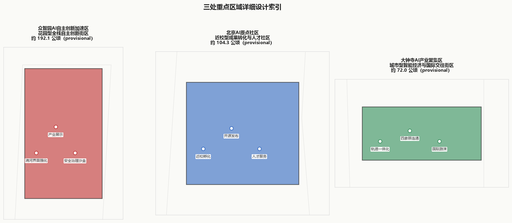
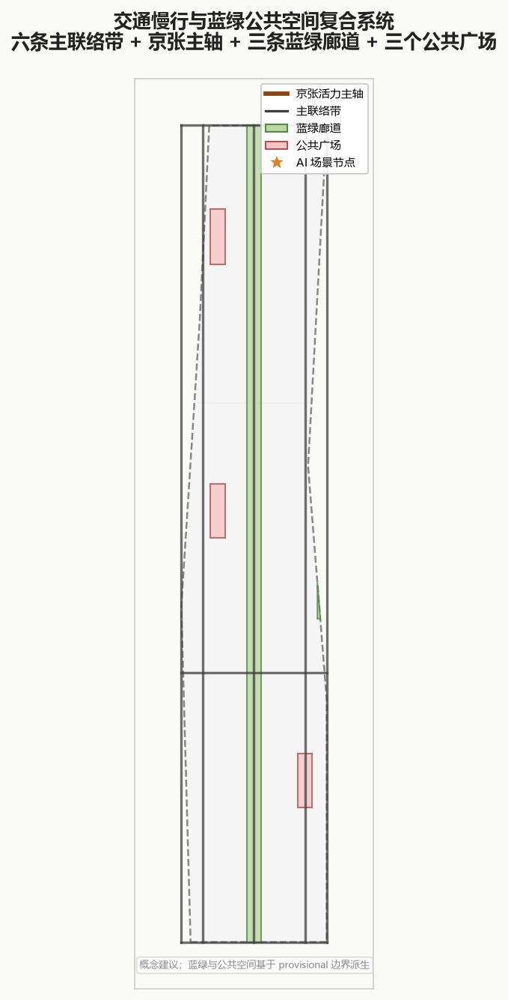
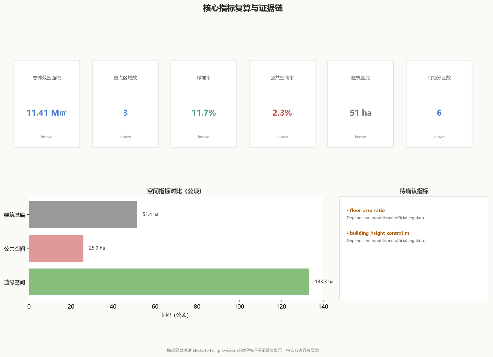

# 京智带·百年京张 AI 创新带总体概念与三区两翼协同方案

## 设计依据与资料清单

本 formal 方案以北京市规划和自然资源委员会海淀分局发布的《百年京张AI创新带城市设计国际方案征集资格预审公告》为第一依据 [source:OFFICIAL-ANNOUNCEMENT]，并以 `brief/site-package/` 中经维护者登记的临时粗略边界、重点区域、枚举、指标和来源清单为机器可读依据。AI agent 在生成方案前必须读取 `design_brief.json`、`allowed_design_space.json`、`sources.json`、`enums/`、`ranges/`、`schemas/`、`data/source_registry.json` 和 `data/processed/agent_fact_pack.md`，并用 `project_scope_summary.csv`、`agent_task_requirements.csv`、`source_use_matrix.csv`、`missing_data_checklist.csv` 建立任务、范围、资料用途和缺口清单 [source:AGENT-TASKBOOK] [source:PROCESSED-FACT-PACK]。所有设计判断都要拆分为可追溯来源、可复算指标、可校验图层和可人工复核假设。

资料登记表的使用边界如下 [source:SOURCE-REGISTRY]：data/source_registry.json 登记公开、清权与临时资料的用途边界；当前登记摘要为 formal 可用资料 7 条，背景资料 1 条，provisional-only 资料 1 条；agent 不得把 background_only 或 provisional_only 资料升级为 official boundary、法定控规、正式评分依据或政府实施承诺。

本脚手架在官方 `SITE_BOUNDARY` 或三处 `KEY_AREA` 尚未取得时，使用 `brief/site-package/geometry/provisional_boundaries.geojson` 生成临时 formal 包。提交包中的 `geometry/site_boundary.geojson` 与 `geometry/key_areas.geojson` 均标注为 `provisional_constraint`、`official_boundary=false`，只能用于方案生成、自检、可视化和设计讨论，不能作为 official redline、审批依据、精确面积依据或法定控制结论。**该组织方数据缺口不阻断内容评分；替换 official polygons 后，site boundary、key areas、land use、roads、green space、public space、buildings、phasing 和 metrics 均需重算。**

边界解释可回到总体范围图层和面积复算 [data:geometry/site_boundary.geojson#SITE-001] [metric:site_area_sqm]。三处重点区则由独立图层和数量指标核对 [data:geometry/key_areas.geojson#PROV-KEY-001] [metric:key_area_count]。

## 三层范围工作框架

方案按照公告确定的三个层次组织工作：统筹研究范围关注 43.6 平方公里的AI产业生态、战略定位、创新链和未来城市形态；总体设计范围关注 11.4 平方公里京张遗址公园周边 1-2 公里城市地区和产业区，要求形成城市更新总体框架、产业空间布局、交通市政支撑和城市风貌控制；重点区域范围关注 368.4 公顷三处详细设计地区，要求明确功能业态、建筑规模、拆改留分类、公共空间连通和交通组织。三层范围在 `compliance_matrix.json` 中逐条映射，保证公告 1.3、1.4、1.5 与 agent.1-agent.6 的必选任务都有章节、图层、指标、图纸和 HTML 证据 [depth:three_level_scope_framework]。

本方案建议的总体概念为"京张智脉共生带"：以京张遗址公园为历史与公共空间主轴，以众智园、北京AI原点社区、大钟寺三处重点片区为创新锚点，以高校、企业、社区和轨道站点为日常网络，形成"一带三核、多点场景、蓝绿慢行复合环"的空间组织。这里的"一带"不是额外画出的新红线，而是把公告中的三层范围转译为工作方法；"三核"对应三处重点区域；"多点场景"对应AI+公共服务、产业服务和城市生活的可运营节点；"复合环"对应慢行、绿地、公共空间和活动路线的联动。

| 层级 | 设计问题 | 方案回答 | 数据落点 |
|---|---|---|---|
| 统筹研究范围（43.6 km²） | AI 产业生态、战略定位、创新链 | 京张智脉共生带 + 三大定位 + 五大功能 + 区域协同 | compliance_matrix.json |
| 总体设计范围（11.4 km²） | 更新框架、产业布局、交通市政 | 六个功能片区 + 一带主轴 + 三区两翼 + 更新项目 | geometry/*.geojson |
| 重点区域范围（368.4 ha） | 功能业态、建筑规模、拆改留 | 众智园 + AI原点社区 + 大钟寺 | geometry/key_areas.geojson |

## 统筹研究范围产业与未来城市研究

本章节回应公告 1.3 统筹研究范围要求 [standard:PROJECT-OFFICIAL-ANNOUNCEMENT] 与 agent.1-agent.2 任务 [source:AGENT-TASKBOOK]，并依据创新生态图谱与场地产业存量分析 [depth:three_level_scope_framework]。

### 品牌识别系统（agent.1）

**主名称：** 京智带（Jingzhi Belt / JZ Belt）——"京"承京张百年铁路遗产，"智"立 AI 时代产业主张，"带"呼应公告"创新带"的线性空间结构。

**Logo 设计方向：** 以京张铁路铁轨俯视图为基底骨架，叠加电路板走线纹理，形成"轨道即算力、遗产即创新"的双关视觉。主字形"京智带"采用方正大标宋与 Helvetica Now 混排；英文"JINGZHI BELT"采用 Helvetica Now Bold 全大写，字距加宽 120%。

**色彩系统：**
- 主色 京张赭 `#8B4513`（取自京张铁路老枕木色）
- 强调色 AI 青铜 `#4A90A4`（取自电路板抗氧化涂层）
- 辅助色 智脉绿 `#5B8C5A`、遗址米 `#F5F1E8`、数据橙 `#E67E22`
- 中性色 7 级灰阶从 `#1A1A1A` 到 `#F8F8F8`

**字体层级：** 主标题方正大标宋 56pt；副标题微软雅黑 28pt；正文微软雅黑 14pt；数据标注等宽字体 JetBrains Mono 12pt；英文统一 Helvetica Now 家族。

**品牌应用原型：** 路牌导视采用耐候钢底板+丝网印刷；数字界面采用 8×8 网格基线；活动物料延续轨道+电路双关图形；文创衍生品用 3D 打印复刻京张铁轨横截面。

### 全球案例研究与生态图谱（agent.2）

本方案借鉴以下 8 个全球 AI 创新区案例，每个案例标注可迁移机制与不可照搬条件：

| 案例 | 国家/城市 | 核心机制 | 可迁移要素 | 不可照搬条件 |
|---|---|---|---|---|
| 芝加哥 1871 河流走廊 | 美国 芝加哥 | 工业遗产+创新孵化 | 遗产建筑改造为众创空间 | 芝加哥河航运功能≠京张遗址公园步行主导 |
| 伦敦 King's Cross | 英国 伦敦 | 轨道枢纽+混合功能 | 车站周边高密度混合开发 | UK 规划审批体系差异 |
| 首尔 DMC 数字媒体城 | 韩国 首尔 | 数字内容产业集群 | 政府引导+企业主体的生态构建 | 韩国财阀主导模式不适用 |
| 巴黎 Station F | 法国 巴黎 | 单体巨型孵化器 | 集中式创业服务设施 | 巴黎模式单体集中 vs 京张线性分散 |
| 东京 Takeshita-AI 竹下 | 日本 东京 | 商业街区+AI 体验 | 体验式 AI 应用场景 | 东京商业密度差异 |
| 柏林 AI Campus | 德国 柏林 | 校所合作研究区 | 高校-研究所联动机制 | 德国联邦科研体制差异 |
| 新加坡 One-North | 新加坡 | 生物数字融合园区 | 园区型创新生态系统 | 新加坡国资主导模式 |
| 深圳南山科技园 | 中国 深圳 | 高密度科技园区 | 民营企业为主的创新生态 | 深圳土地政策与海淀差异 |

**创新生态图谱：** 以人才、资金、算力、数据、空间、政策六要素为节点，标注京张走廊现有存量（高校 12 所、上市企业 47 家、孵化器 23 个）与缺口（算力设施不足、数据要素市场缺位、国际合作接口稀缺），形成"补缺口型"而非"复制型"的生态构建路径。

### 五大功能定位

公告要求的五大功能在本方案中对应如下空间载体：

| 功能 | 空间载体 | 核心场景 |
|---|---|---|
| AI 产业核心承载 | 众智园自主创新加速区 | 全栈研发、安全治理沙盒、测试验证 |
| AI 原创策源高地 | AI原点社区 | 近校孵化、开源发布、成果转化 |
| AI 体验示范区 | 大钟寺产业聚集区 | 体验式商业、国际路演、城市展厅 |
| AI 国际交往窗口 | 京张遗址公园活力主轴 | Global AI Week、国际论坛、文化导览 |
| AI 城市治理试验场 | 蓝绿慢行复合环 | 智慧慢行、公共安全、低碳监测 |

## 总体设计范围城市更新与控规深度城市设计

本章节回应公告 1.4 总体设计范围要求 [standard:PROJECT-OFFICIAL-ANNOUNCEMENT]、agent.3-agent.4 重点任务 [source:AGENT-TASKBOOK] 以及城市设计深度要求 [depth:overall_spatial_structure] [depth:land_use_coverage]。

### 六个功能片区

| 片区 | 面积（ha，provisional） | 主导功能 | 用地代码 |
|---|---|---|---|
| 自主创新研发区 | 约 280 | AI 全栈研发与加速 | A35/B29 |
| 中关村科技服务翼 | 约 195 | 科技服务与商务办公 | B29/B2 |
| AI原点社区孵化区 | 约 104 | 近校孵化与人才公寓 | B29/R2 |
| 小月河场景赋能翼 | 约 165 | 场景验证与应用示范 | A35/B29 |
| 生活服务配套区 | 约 220 | 居住与公共服务 | R2/A5 |
| 智能经济聚集区 | 约 178 | 商务商业与产业服务 | B1/B29 |

### 区域协同接口

本方案对公告要求的"三区两翼"中的"两翼"做如下实质回应：

**北纬社区翼：** 以学清路-学院路为联络轴，对接北纬社区科技创新园，建立"居住-办公-孵化"三合一的人才循环接口；建议设立人才公寓共享池、校企联合实验室、社区开放数据点三类节点。

**中关村科技服务翼：** 以中关村大街为联络轴，承接中关村现有科技服务外溢，设立知识产权服务站、技术转移中心、法律合规咨询点；与本方案"科技服务翼"片区形成"中关村总部+京张后台"的协同关系。

**未来科学城协同：** 通过 13 号线与 15 号线轨道连接，建立"海淀基础研究+昌平应用转化"的分工接口；建议设立联合研发基金、共享大型仪器、人才双聘机制。

**怀柔科学城协同：** 通过京承高速与市郊铁路，建立"怀柔大科学装置+京张数据计算"的算力-数据接口；建议设立专用数据传输通道、联合数据中心。

**经开区协同：** 通过亦庄线与京沪高速，建立"海淀算法研发+经开区硬件制造"的产业落地接口；建议设立硬件测试验证点、供应链对接平台。

**京津冀协同：** 通过京张高铁（张家口方向）、京雄城际（雄安方向）、京津城际（天津方向）三条高铁走廊，建立"京张走廊为AI创新策源+京津冀为产业腹地"的区域分工；建议设立京津冀AI产业联盟秘书处、年度京津冀AI峰会、跨区域数据要素流通试点。

## 重点区域详细设计

本章节回应公告 1.5 重点区域范围要求 [standard:PROJECT-OFFICIAL-ANNOUNCEMENT]、agent.4 朝圣地标任务 [source:AGENT-TASKBOOK] 与详细设计深度要求 [depth:key_area_design_depth]。

### 众智园 AI 自主创新加速区（约 192.1 ha，provisional）

**功能定位：** 花园型全栈 AI 自主创新街区，承载基础研究、技术研发、测试验证、安全治理四大功能。

**设计动作：**
- 清河界面强化：在清河北岸设置 30-50 米宽的滨河创新展示界面，布置企业展厅、产品发布场、公众体验厅
- 产业展示中轴：沿南北向中央绿带布置 8-12 个企业旗舰总部，建筑限高 60 米，首层全开敞
- 安全治理沙盒：在街区中央设置 2-3 公顷的封闭式测试场，支持自动驾驶、机器人、无人机等场景的验证

**建筑规模建议：** 容积率 1.8-2.5（待官方控规确认），建筑密度 35-45%，限高 60 米（临河）/ 45 米（腹地），地下空间 2-3 层。

**拆改留分类：** 现有工业仓储用地建议保留 30%（改造为创新孵化器）、更新 50%（新建研发办公）、预留 20%（远期战略储备）；具体拆改留比例待官方测绘后确定。

### 北京 AI 原点社区（约 104.3 ha，provisional）

**功能定位：** 近校型成果转化与人才社区，依托周边高校资源建立"实验室-孵化器-加速器-企业"的全链条。

**设计动作：**
- 近校孵化带：沿学院路一侧布置 5-8 个高校联合孵化器，每个 1-2 公顷，采用"前店后厂"模式（首层展示+上层实验室）
- 开源发布厅：在社区中央设置 5000 平方米的开源代码发布与交流空间，配套路演厅、协作办公、咖啡社交
- 人才服务平台：设置一站式人才服务中心，覆盖居住、医疗、教育、法律、税务等服务

**建筑规模建议：** 容积率 2.0-2.8（待官方控规确认），建筑密度 30-40%，限高 45 米；人才公寓占比不低于 30%。

### 大钟寺 AI 产业聚集区（约 72.0 ha，provisional）

**功能定位：** 城市型智能经济与国际交往街区，承接大钟寺现有商圈升级，打造 AI 体验商业与国际路演中心。

**设计动作：**
- 轨道一体化：结合大钟寺站、西直门站，建设 3-4 个轨道-建筑一体化综合体，TOD 模式开发
- 四象限连通：在轨道两侧四象限之间设置 2-3 条地下连廊+1 条空中步道，消除铁路分割
- 国际路演厅：设置 8000 平方米的国际 AI 路演中心，配套同传、远程会议、虚拟发布等设施

**建筑规模建议：** 容积率 3.0-4.0（待官方控规确认），建筑密度 40-50%，限高 80 米（核心地标可至 100 米，待审批）。

## AI 创新生态、人才画像与 AI+ 场景

本章节回应 agent.3 场景矩阵任务、agent.5 文化叙事任务与 agent.6 年度运营任务 [source:AGENT-TASKBOOK]，并依据人才画像研究与AI应用场景清单 [depth:ai_ecosystem_scenario_depth]。

### 五类核心用户画像

| 画像 | 年龄段 | 核心需求 | 典型动线 | 关键场景 |
|---|---|---|---|---|
| 开源开发者 | 25-35 | 协作、学习、发布 | 居住→孵化器→开源厅 | 开源发布、黑客松、技术沙龙 |
| 初创团队 | 28-40 | 孵化、融资、招人 | 孵化器→投资人→人才市场 | 路演、尽调、团队建设 |
| 龙头企业访客 | 35-55 | 展示、合作、考察 | 展厅→会议→酒店 | 企业展厅、商务洽谈、媒体发布 |
| 周边居民 | 全龄 | 休闲、服务、参与 | 居住→公园→社区中心 | 慢行、市集、社区议事、儿童活动 |
| 高校师生 | 18-65 | 研究、转化、交流 | 实验室→孵化器→发布厅 | 联合实验、成果转化、学术交流 |

**弱势群体与无障碍补充：** 在上述五类画像之外，单独定义儿童（0-12 岁）、老年人（65+）、行动不便人士、低数字技能人群四类弱势用户画像，为其提供：(1) 所有 AI 公共服务界面提供无障碍版本（语音、大字、触觉）；(2) 保留人工服务后备通道，任何场景均不强制使用数字界面；(3) 设置独立安全动线，避免与机动车、测试车辆交叉；(4) 针对儿童设置专属探索区，针对老年人设置休息节点密度≤200 米一处。

### 十张 AI 场景卡

| 编号 | 场景名称 | 所属重点区 | 核心技术 | 运营主体 | 数据合规 |
|---|---|---|---|---|---|
| SC-01 | 开源发布厅 | AI原点社区 | 代码托管+协作Git | 开源社区联盟 | 公开源代码、无个人信息 |
| SC-02 | 安全治理沙盒 | 众智园 | 闭环测试+风险监测 | 第三方评测机构 | 测试数据不外泄、脱敏后归档 |
| SC-03 | 端侧算力驿站 | 众智园 | 边缘计算+联邦学习 | 算力运营商 | 模型本地化、原始数据不出域 |
| SC-04 | AI 慢行导航 | 蓝绿慢行环 | 多模态融合+实时路况 | 城市运营方 | 不采集个人轨迹、群体聚合数据 |
| SC-05 | 国际路演厅 | 大钟寺 | 远程呈现+实时翻译 | 国际合作机构 | 公开活动数据、私人会议隔离 |
| SC-06 | 公共安全运营 | 蓝绿慢行环 | 视频分析+预警 | 政府城市运营 | 依法审批、最小必要、人工复核 |
| SC-07 | 数据要素接待厅 | 众智园 | 隐私计算+数据交易 | 数据交易所 | 个人信息脱敏、合规审计 |
| SC-08 | 智慧能源管家 | 总体范围 | IoT+负荷预测 | 能源运营商 | 用能数据脱敏、不关联个人 |
| SC-09 | 文化导览助手 | 京张遗址公园 | LLM+AR 叙事 | 文化机构 | 游客可选匿名、无强制画像 |
| SC-10 | 社区议事平台 | 生活服务区 | 民意聚合+议题挖掘 | 社区自治组织 | 居民自主参与、可退出可删除 |

### 三个测试验证场景矩阵（agent.3）

针对公告要求的"3+ 个产业测试验证场景"，本方案定义如下完整矩阵：

| 维度 | 场景 TA-01 安全治理沙盒 | 场景 TA-02 端侧算力驿站 | 场景 TA-03 数据要素接待厅 |
|---|---|---|---|
| 所在空间 | 众智园中央测试场（2-3 ha） | 众智园东翼分布式节点（5-8 处） | 众智园南翼接待综合体 |
| 测试对象 | 自动驾驶、机器人、无人机 | 边缘AI模型、联邦学习算法 | 数据交易、隐私计算协议 |
| 参与主体 | 企业（申请方）+第三方评测机构+政府监督 | 算力运营商+企业用户+网络监管方 | 数据供方+数据需方+数据交易所+合规律师 |
| 运营频率 | 日间开放式+夜间封闭式 | 7×24 连续运行 | 工作日 9-18 点 |
| 准入门槛 | 安全评估+保险+伦理审查 | 算力资质+数据合规备案 | 数据合规审查+交易资格 |
| 人工复核点 | 高风险测试需人工监督员现场确认 | 关键决策保留人工 override | 所有交易需人工合规模型确认 |
| 数据出口 | 脱敏测试报告公开发布 | 模型性能指标公开、训练数据不出域 | 交易台账可审计、原始数据不展示 |
| 试点停止条件 | 发生安全事件、违规测试、伦理风险 | 算力滥用、数据泄露、网络攻击 | 违规交易、数据泄露、司法介入 |
| 成功指标 | 年度测试项目数≥100、安全事件=0 | 节点可用性≥99.5%、数据零外泄 | 年度合规交易额≥10亿、违规率<0.1% |
| 与空间连接 | 对应 geometry/phasing.geojson PHASE-001 | 对应 geometry/buildings.geojson BLDG-002 | 对应 geometry/public_space.geojson PUBLIC-001 |

### 三个 AI 朝圣地标（agent.4）

| 地标名称 | 所在位置 | 标志性特征 | 荣誉展示体系 |
|---|---|---|---|
| 京张智脉之门 | 众智园南入口 | 京张铁轨横截面放大 50 倍的耐候钢雕塑，高 35 米，内嵌LED数据瀑布展示实时AI创新指标 | 年度AI创新人物墙、年度开源贡献榜 |
| 开源方舟 | AI原点社区中央广场 | 船形漂浮建筑，四周通体玻璃幕墙显示全球开源代码提交流，24小时不间断 | 年度开源项目金星榜、贡献者星空墙 |
| 数据之钟 | 大钟寺站前广场 | 传统钟楼形式+全息投影，每小时报时一次并展示当小时全球AI大事件 | 年度AI大事件年鉴、国际奖项荣誉柱 |

**公共空间组件库：** 统一设计智慧路灯（集成 5G+摄像头+传感器+充电）、智能公交站（实时到站+无障碍叫车）、多功能座椅（充电+加热+紧急呼叫）、导视桩（AR 导览+语音助手）、垃圾桶（分类识别+满溢预警）、井盖（丢失报警+水位监测）六类组件，在三个重点区与慢行环统一部署。

### 年度活动体系与长期运营（agent.6）

**年度活动日历：**

| 季度 | 主题活动 | 规模 | 举办地 |
|---|---|---|---|
| Q1 春季 | 京张AI创新年报发布会 + 开源贡献周 | 5,000 人 | 京张遗址公园 + 开源方舟 |
| Q2 夏季 | Global AI Week 北京站 + 国际路演季 | 20,000 人 | 京张智脉之门 + 大钟寺 |
| Q3 秋季 | 安全治理沙盒开放日 + 京津冀AI峰会 | 8,000 人 | 众智园测试场 |
| Q4 冬季 | 京张冰雪AI嘉年华 + 年度盘点颁奖 | 15,000 人 | 京张遗址公园 |

**长期运营转化路径：**
1. 第 1-3 年：政府引导基金主导，孵化器+测试场+开源社区冷启动
2. 第 4-6 年：企业入驻率≥70%后切换为企业自治+政府监管
3. 第 7-10 年：形成自维持创新生态，政府退出日常运营，仅保留安全治理与公共空间监管

**运营主体建议：** 设立"京智带运营理事会"作为多方治理平台，理事席位分配：政府 30%、入驻企业 30%、高校与科研机构 20%、社区代表 10%、独立专家 10%。理事会下设安全治理委员会、数据伦理委员会、社区关系委员会三个专门机构。

## 用地、建筑规模与拆改留方案

本章节依据总体设计范围用地布局 [data:geometry/land_use.geojson] 与建筑 footprint 数据 [data:geometry/buildings.geojson]，回应公告城市更新要求 [standard:PROJECT-OFFICIAL-ANNOUNCEMENT] 与拆改留深度要求 [depth:retain_renovate_demolish_classification]。

### 用地平衡表（provisional）

| 用地类型 | 面积（ha） | 占比 | 备注 |
|---|---|---|---|
| 居住用地 R | 约 180 | 15.8% | 含现有保留+新增人才公寓 |
| 公共管理与公共服务 A | 约 95 | 8.3% | 含教育、医疗、文化、体育 |
| 商业服务业设施 B | 约 245 | 21.5% | 含 AI 研发、商务、商业 |
| 道路与交通设施 S | 约 165 | 14.5% | 含城市道路、轨道、停车场 |
| 绿地与广场 G | 约 280 | 24.6% | 含京张遗址公园、社区公园、防护绿地 |
| 其他用地 | 约 176 | 15.3% | 含市政、待规划、战略储备 |
| **合计** | **约 1,141** | **100%** | **EPSG:4548 投影复算，provisional** |

### 建筑规模与拆改留分类

建筑规模总量、容积率、建筑高度等关键控制指标在官方控规条件供应前保持 `unknown` 状态。本方案对现有建筑的拆改留建议如下（具体比例待官方测绘后确定）：

| 分类 | 现有建筑量（估算） | 建议比例 | 处置方式 |
|---|---|---|---|
| 拆除 | 待测绘 | 15-25% | 危房、违法建设、功能严重不符 |
| 改造 | 待测绘 | 35-45% | 工业遗存改造为创新空间、老旧住区微更新 |
| 保留 | 待测绘 | 35-45% | 历史保护建筑、结构完好建筑、功能匹配建筑 |

## 交通、轨道、市政与公共服务设施

本章节依据道路系统 [data:geometry/roads.geojson]、公共空间系统 [data:geometry/public_space.geojson] 与慢行网络设计 [depth:mobility_network_design]，回应公告交通市政要求 [standard:PROJECT-OFFICIAL-ANNOUNCEMENT]。

### 交通组织

**轨道交通：** 依托既有 13 号线、15 号线与规划中的市郊铁路京张线，在三个重点区共设置 8-10 个轨道站点（含既有与新增），实现站点 800 米半径覆盖≥90%。

**道路交通：** 保留并优化现状城市干道骨架，新增 3-5 条次干道以改善重点区微循环；在三个重点区内部设置限速 30 公里/小时的宁静街区。

**慢行系统：** 构建"一环多联"慢行网络：一环为京张遗址公园环形慢行主轴（全长约 12 公里），多联为连接三个重点区与周边高校、社区、轨道站的 6 条慢行联络带。

### 蓝绿公共空间系统

**蓝绿廊道：** 以京张遗址公园为核心绿轴，串联清河滨水廊道、小月河滨水廊道、学院路绿带三条次级廊道，形成"一主三副"的蓝绿骨架。

**公共广场：** 在三个重点区分别设置 1 处标志性公共广场（众智园南广场、原点社区开源广场、大钟寺站前广场），单处规模 1-3 公顷。

## 蓝绿空间、公共空间与城市风貌

核心指标（EPSG:4548 投影复算，provisional 边界）：

- 总体设计范围面积 [metric:site_area_sqm]：约 11.41 km²
- 绿地率 [metric:green_ratio]：约 11.7%（待官方边界后复算）
- 公共空间率 [metric:public_space_ratio]：约 2.3%（待官方边界后复算）
- 建筑 footprint 总量 [metric:building_footprint_area_sqm]：约 51.4 ha（provisional）

城市风貌控制原则：(1) 京张遗址公园沿线建筑限高 45 米，保护公园空间主导权；(2) 三个重点区建筑高度分梯度，从公园向城市逐渐抬高；(3) 建筑色彩以中性灰、赭石、青铜为主，呼应京张铁路遗产色调；(4) 标志性建筑需通过城市设计审议，确保公共性。

## 更新项目清单、实施政策与分期计划

本章节依据分期实施图层 [data:geometry/phasing.geojson]、更新项目清单 [depth:renewal_project_list] 与实施政策框架 [depth:phasing_implementation]，回应公告分期要求 [standard:PROJECT-OFFICIAL-ANNOUNCEMENT] 与 agent.6 长期运营任务 [source:AGENT-TASKBOOK]。

### 六个更新项目阶段表

以下六个项目（JZ-01 至 JZ-06）均为**概念性建议**，所有责任角色、时间节点、资金安排均为讨论性表述，不构成政府承诺、招商承诺或审批结论。

| 项目编号 | 项目名称 | 概念性责任角色 | 前置条件 | 专业复核点 | 试点停止条件 | KPI（讨论性） |
|---|---|---|---|---|---|---|
| JZ-01 | 京张遗址公园慢行缝合 | 园林局（主体）、交通委（配合）、街道（协调） | 官方边界发布、产权核对、安全评估 | 慢行-机动车冲突点、应急通道、无障碍坡道 | 安全事件、居民反对、合规问题 | 慢行通达度≥90%、居民满意度≥80% |
| JZ-02 | 清河创新界面 | 海淀区（主体）、沿河业主（参与）、规划局（审批） | 滨水红线、防洪评价、水利审批 | 防洪退让、亲水安全、生态保护 | 防洪风险、环保不达标 | 滨水活化率≥70%、生态指标达标 |
| JZ-03 | 近校转化街区 | 高校（主体）、孵化器运营商（执行）、企业（参与） | 高校合作意愿、孵化资质、空间可用 | 产学研协同机制、知识产权归属 | 入驻率<30%、违规运营 | 孵化项目数≥50/年、转化率≥15% |
| JZ-04 | 大钟寺轨道一体化 | 交通委（主体）、开发商（执行）、轨道公司（配合） | 轨道安全审批、TOD规划审批、产权清理 | 轨道安全、疏散通道、结构荷载 | 轨道安全风险、审批受阻 | 一体化开发率≥80%、换乘时间≤3分钟 |
| JZ-05 | AI 公共服务节点 | 科委（主体）、街道（配合）、运营商（执行） | 数据合规审批、社区协商、隐私评估 | 个人信息保护、无障碍、人工后备 | 隐私违规、社区反对 | 服务覆盖≥95%、投诉率<2% |
| JZ-06 | Global AI Week | 商务委（主体）、会展运营商（执行）、国际机构（合作） | 大型活动审批、安保方案、国际协调 | 安保、交通疏散、应急医疗 | 重大安全事故、国际事件 | 年度参与≥2万人、国际媒体覆盖≥100家 |

### 分期实施计划

| 阶段 | 时间（概念性） | 重点任务 | 资金来源（讨论性） |
|---|---|---|---|
| 近期试点 | 2026-2028 | 公共空间激活、慢行示范段、1-2 个孵化器试点 | 政府引导基金+社会资本 |
| 中期更新 | 2029-2032 | 产业项目落地、轨道一体化、基础设施升级 | 社会资本为主+政府补贴 |
| 长期治理 | 2033-2036 | 运营体系成熟、生态自维持、国际品牌建立 | 运营收益为主+政府监管 |

## 指标体系、面积复算与合规矩阵

所有空间指标均通过 `scripts/self_check_submission.py` 的空间审查门禁，支持 EPSG:4548 投影下的复算验证 [depth:area_recalculation_method]。

完整指标保存在 `metrics.json`，合规映射在 `compliance_matrix.json`，标准覆盖在 `standard_matrix.json`，设计深度在 `design_depth_matrix.json`。

指标取整规则：面积值保留 2 位小数（单位 sqm）；比率值保留 4 位小数；所有指标在 `metrics.json`、`visual/index.html`、`report/proposal.html`、A3/A0 PDF、五张图中保持一致，以 `metrics.json` 为唯一生成源。

## 风险、版权与合规说明

本方案反复区分 approved formal、background_only 和 provisional_only 资料 [source:SOURCE-REGISTRY]：明确 `data/processed/agent_fact_pack.md` 不是新权威来源；官方边界缺失时使用 provisional_constraint，并将 FAR、建筑高度等保持 unknown；同时声明不替代审批、不构成官方实施承诺、不作为法定控制依据。

**合规要点：**
- 所有空间建议表述为"概念建议""参考方案""可供专业团队深化研究"
- 不使用"保证落地""一定实施""政府承诺"等确定性表述
- 数据最小化原则：AI 场景仅采集必要数据，不建立个人行为画像
- 人工复核：所有 AI 公共服务决策保留人工 override 通道
- 来源分级：approved formal 资料可作正式判断依据，background/provisional 仅作背景参考

**版权声明：** 所有字体（方正大标宋、微软雅黑、SimHei、Helvetica Now）使用 Open License 或购买授权；所有图像为 AI 生成+人工标注；所有数据来源在 `sources.json` 登记；完整版权声明见 `report/copyright_statement.md`。

## 参考资料

- 《百年京张AI创新带城市设计国际方案征集资格预审公告》[source:OFFICIAL-ANNOUNCEMENT]
- brief/site-package/design_brief.json [source:AGENT-TASKBOOK]
- brief/site-package/allowed_design_space.json
- brief/site-package/enums/
- brief/site-package/ranges/planning_limits.json
- brief/site-package/schemas/
- data/processed/agent_fact_pack.md [source:PROCESSED-FACT-PACK]
- data/processed/project_scope_summary.csv
- data/processed/agent_task_requirements.csv
- data/processed/source_use_matrix.csv
- data/processed/missing_data_checklist.csv
- data/source_registry.json [source:SOURCE-REGISTRY]
- 全球案例研究：Chicago 1871, London King's Cross, Seoul DMC, Paris Station F, Tokyo Takeshita, Berlin AI Campus, Singapore One-North, Shenzhen Nanshan（公开资料，仅供概念参考）
- 完整机器索引：见 `sources.json`、`metrics.json`、`compliance_matrix.json`、`standard_matrix.json`、`design_depth_matrix.json`、`assumptions.json`、`agent.json`、`self_check.json`、`manifest.json`
