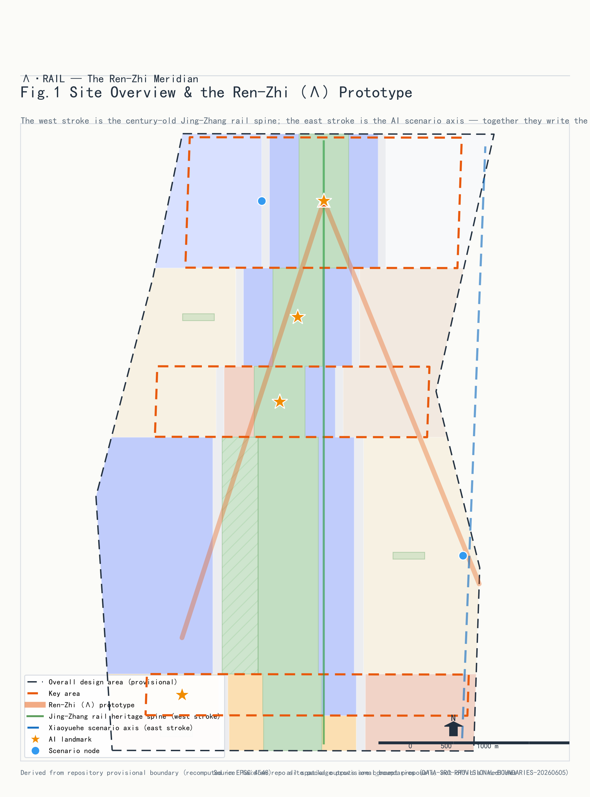
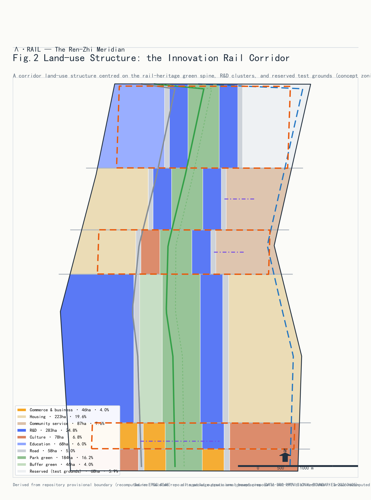
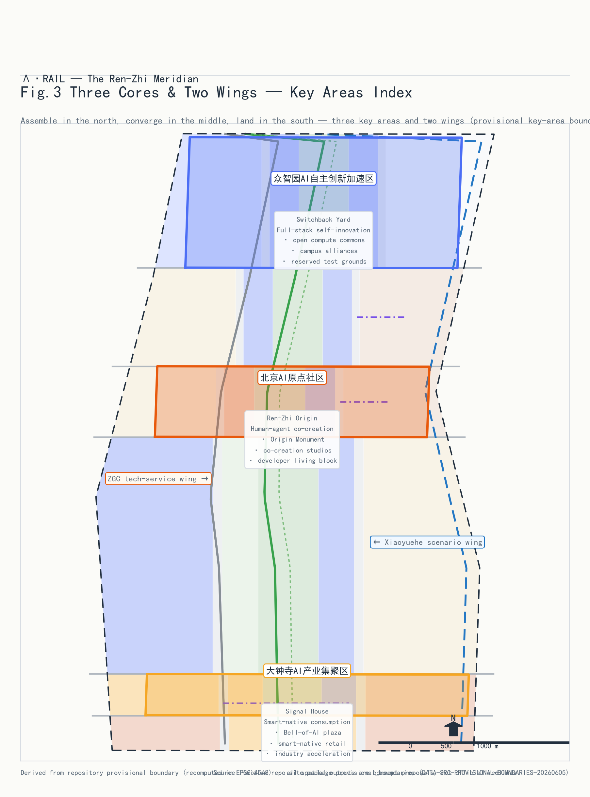
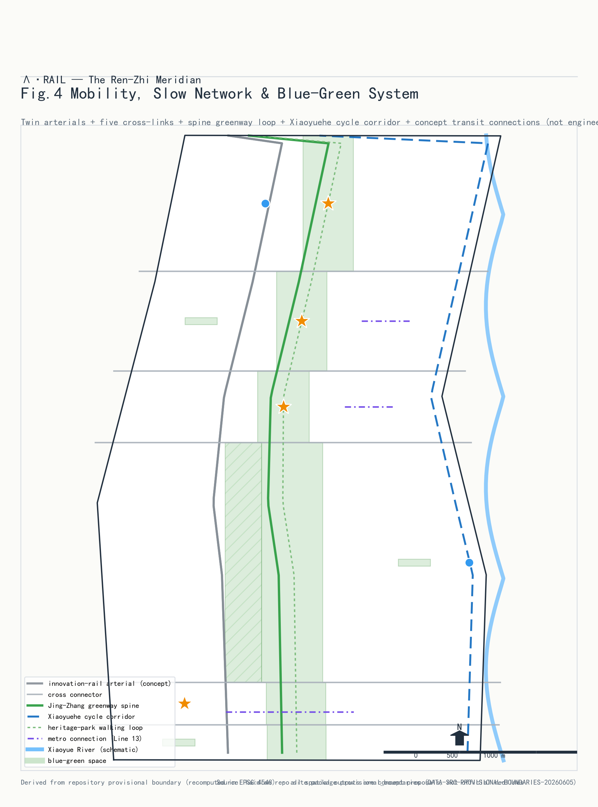
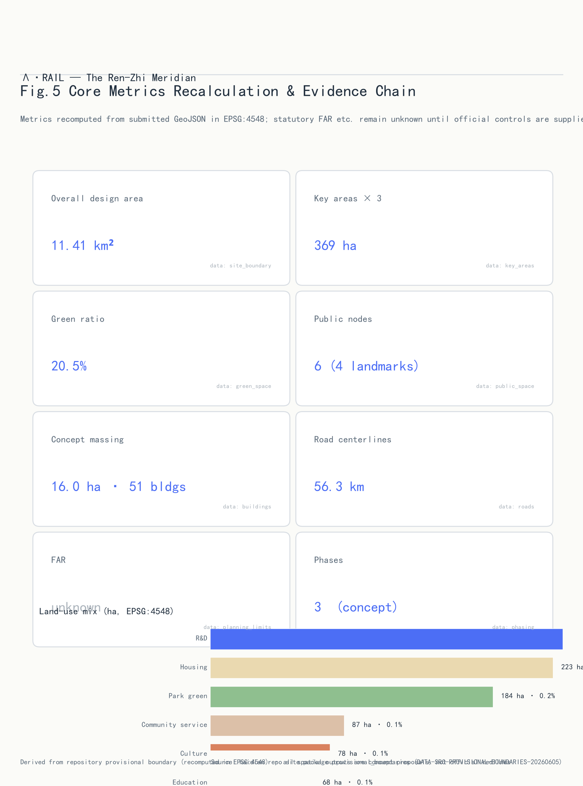

# Ren-Zhi Intelli-Rail - Centennial Jing-Zhang AI Innovation Belt

## Design Basis and Source List

This proposal draws its authority exclusively from the official announcement, the agent-facing taskbook, and the site package, each checked against the repository source registry before use [source:SOURCE-REGISTRY]. Formal-ready materials cover the announcement, taskbook, three-level scope definitions, and provisional boundary geometry [source:SITE-PACKAGE]; the six agent tasks (naming and logo, global ecosystem cases, scenario cards, test scenarios, personas, landmarks and long-term operations) structure the body of this document [source:AGENT-TASKBOOK]. Case studies use only public reports and institutional websites as background, never as evidence. Where regulatory plans, existing-building surveys, ownership, or engineering studies are missing, items are logged as pending assumptions rather than presented as approved indicators. No uncleared non-public material and no external map screenshots are used; every drawing is generated programmatically from this package's GeoJSON layers and metrics.

## Three-Level Scope Framework

The submission follows the three-level scope: a 43.6 km2 coordinated research area for strategy, an 11.4 km2 overall design area at regulatory-plan depth, and a 369.3 ha key-area tier at detailed implementation depth [source:BOUNDARY-SOURCE]. The submitted boundary recalculates to 11412825 sqm (about 1141.28 ha), matching the announced 11.4 km2 [metric:site_area_sqm]; the three key areas recalculate to 192.92, 104.32 and 72.05 ha (369.29 ha total), the small delta against the official 368.4 ha reflecting provisional-boundary coarseness. Each tier narrows and deepens the last: research answers where the belt sits in the world AI ecosystem, overall design organizes land use, mobility and renewal, and key areas answer block-level questions. All boundaries are provisional geometry supporting intake display only - never official red lines or certified areas; once official polygons arrive, site_boundary, key_areas, every derived layer, and all area-ratio metrics must be recomputed through the same pipeline [depth:three_level_scope_framework].

## Coordinated Research Area: Industry and Future City Research

**Core concept: Ren-Zhi Intelli-Rail.** In 1909 Zhan Tianyou solved a steep-grade engineering problem at Qinglongqiao with a switchback shaped like the character 'Ren' (person). A century later the corridor answers a different question - how humans and machines coexist - and this proposal writes the answer with the same character: the first stroke is the Jing-Zhang railway heritage park cultural axis carrying a century of rail memory and Zhongguancun innovation culture; the second stroke is the Xiaoyue River scenario-growth axis where AI scenarios grow along a blue-green corridor; the strokes cross near the Qinghuayuan station heritage site to form the Beijing AI Origin Community [standard:PROJECT-AGENT-OPEN-CALL-TASKBOOK]. The mark "Lambda-RAIL" abstracts 'Ren' into Lambda, also the geometry of a rail switch: technology and humanity meeting.

**Logo note:** a negative-space logo leaves the character 'Ren' between two Lambda rails with chamfered switch ends, in rail grey and Jing-Zhang bronze; the wordmark pairs the naming system for wayfinding, event branding, and digital interfaces (concept draft below). It is a concept requiring trademark search and rights clearance before deployment.

**Regional synergy - from the Haidian corridor to the Beijing-Tianjin-Hebei innovation network:** the belt is not an isolated corridor. Northward, Zhongzhiyuan's open compute and test fields serve the computing and data needs of Future Science City (energy, life sciences) and Huairou Science City (major scientific facilities) - 'instruments in Huairou, conversion in Zhongzhiyuan'. Southward, Dazhongsi's intelligent-native economy links to Beijing E-Town's scale-up strength in autonomous driving and robotics - 'validated in Haidian, mass-produced in E-Town'. Eastward, the Origin Community's open-source culture connects with the Beiwei community's digital living and governance practice. At the Beijing-Tianjin-Hebei scale, the Jing-Zhang railway was itself the region's first cross-regional infrastructure - the proposal casts Zhangjiakou's data-center clusters and green energy as the belt's 'west-wing compute barn', writing the East-Data-West-Compute division of labor into the belt's narrative [source:AGENT-TASKBOOK].

**Three positions and the three-area two-wing loop:** responding to announcement 1.5(1) [standard:PROJECT-OFFICIAL-ANNOUNCEMENT], the belt positions itself as the origin of global open-source innovation (Zhongzhiyuan), the sample of human-machine community (Origin Community), and the living room of the intelligent-native economy (Dazhongsi); the two wings (Xiaoyue scenario wing and Zhongguancun service wing) supply scenarios and professional services, closing the loop of research in Zhongzhiyuan, validation along Xiaoyue, conversion at the Origin, industrialization at Dazhongsi [source:AGENT-TASKBOOK].

**Six global ecosystem cases and their transfer:** Stanford Research Park - the campus-shared research community behind Zhongzhiyuan's low-density garden blocks; London King's Cross - railway heritage turned into Google UK and Central Saint Martins, behind the 'station as living room' strategy; Paris Station F - one building holding a whole ecosystem, behind the vertical ecosystem of origin-community workshops; Cornell Tech - the Bridge building's academia-industry interface behind the open test interface of the computing commons; Berlin Adlershof - institutes and firms growing together, behind the reserved-land elasticity mechanism; Shenzhen Nanshan - living-cost sensitivity of developers, behind the small-unit talent blocks of the Origin Community. Cases are background research, not evidence.

## Overall Design Area: Urban Renewal and Regulatory-Plan-Level Urban Design

The structure is 'one belt, two axes, three areas, multiple clusters' [depth:overall_spatial_structure]. Land use follows the national land-use classification guide [standard:MNR-LAND-USE-CLASSIFICATION-GUIDE]: research land 282.67 ha (24.8%) is the largest single category, concentrated in Zhongzhiyuan and the Origin Community [data:geometry/land_use.geojson#LU-001]; residential 223.49 ha (19.6%); park green 184.36 ha (16.1%); culture 78.03 ha (6.8%); education 68.00 ha (6.0%); reserved white land 67.78 ha (5.9%) held for unforeseeable AI formats [depth:land_use_layout]. Renewal follows retain-renovate-demolish: railway remains and parks are retained, aging office blocks are renovated into R&D and conversion space, a few inefficient plots are cleared for 51 concept masses totalling 15.96 ha of footprint [depth:retain_renovate_demolish]. Height and FAR controls lack official regulatory conditions and are recorded as unknown; the 51 masses are low-confidence design quantities, not statutory values [depth:development_intensity_controls]. Mobility prioritizes pedestrians and transit with the heritage-park green spine threading the corridor; distributed energy and edge-computing posts compound along the spine [standard:MOHURD-CONTROL-DETAILED-PLANNING]. The character palette is 'rail grey, bronze gold, innovation blue', continuing Jing-Zhang engineering aesthetics [standard:MOHURD-URBAN-DESIGN-MEASURES].

## Detailed Design of Key Areas

**Zhongzhiyuan AI Innovation Acceleration Area (192.92 ha, opening stroke):** origin of global open-source innovation; 'one core two wings' structure around the Computing Commons (PS-006) with university-synergy and culture clusters; concept masses favour low-rise high-density garden R&D and large-span test sheds; interfaces to the North Fifth Ring and Qinghuayuan heritage; risks include university land ownership and lab environmental review, both pending [data:geometry/key_areas.geojson#PROV-KEY-001].

**Beijing AI Origin Community (104.32 ha, crossing):** where the strokes meet; retain the Qinghuayuan station heritage and mature blocks, renovate street buildings into human-machine co-creation workshops and developer living blocks, confine new iconic construction to small masses around the Ren Origin Monument (PS-001); small-unit talent housing is embedded rather than concentrated; risk is resident coordination in existing communities [data:geometry/key_areas.geojson#PROV-KEY-002].

**Dazhongsi AI Industry Cluster (72.05 ha, closing stroke):** living room of the intelligent-native economy; mainly intelligent retrofit of existing office towers; the Zhiming Plaza (PS-003) steps down toward the Juesheng Temple heritage control belt (CT-001); four-quadrant underpasses fix crossing continuity; risks are the pending official heritage boundary and fragmented tower ownership [data:geometry/key_areas.geojson#PROV-KEY-003].

All three reach concept depth of an implementation plan; controls await official conditions [depth:three_key_area_detailed_design]. Key-area boundaries are provisional, so conclusions are directional.

## AI Innovation Ecosystem, Personas, and AI+ Scenarios

**Six personas:** research scientists (quiet labs, cross-campus interfaces, stable compute); AI founders and engineers (affordable space, test sites, investor access); students and open-source developers (community, events, affordable living); elderly residents (accessibility and digital inclusion); commuters and visitors (efficient transfers, perceivable AI experiences); city governors and operators (controllable, auditable public agents) [source:PROCESSED-FACT-PACK].

**Twelve scenario cards** (SC-05, SC-07, SC-09, SC-12 are industry test/validation scenarios): SC-01 Jing-Zhang spacetime guide (PS-004) - AR overlay of rail and Zhongguancun history on public archives, content human-reviewed; SC-02 human-machine co-creation at the Origin Monument (PS-001) - community models trained on de-localized community data, outputs human-reviewed; SC-03 open-source contribution gallery (PS-002) - public repository metadata visualization; SC-04 slow-mobility gap diagnosis - public imagery plus sensors, human-verified repair lists (ai-traffic-walkability); SC-05 robot low-speed delivery test zone (PS-005, TEST) - closed segment with safety officers and e-stops, no pedestrian imaging; SC-06 AI health service navigation - on-device health data, human fallback (ai-health-service-navigation) [standard:ELDERLY-SMART-TECH-PLAN-2020-45]; SC-07 computing commons open benchmark (PS-006, TEST) - volunteered evaluation tasks, human-reviewed leaderboards; SC-08 Zhiming Plaza cultural agent (PS-003) - generative sound-light art, no facial capture; SC-09 open-street autonomy test (TEST) - geofenced shuttles and service robots with remote takeover (robot-delivery-low-speed); SC-10 enterprise service copilot corridor - policy and space service agent with human agents (enterprise-service-copilot); SC-11 barrier-free and age-friendly mobility assistant [standard:BARRIER-FREE-ENVIRONMENT-LAW]; SC-12 public-safety and event operations rehearsal sandbox (TEST) - simulation and anonymous counting with human command decisions (public-safety-operations-review). Cards anchor to the public_space layer [data:geometry/public_space.geojson#PS-001]; each declares data sources, privacy boundaries, human review, and an operating body.

## Land Use, Building Scale, and Retain-Renovate-Demolish Strategy

The land ledger closes seam-free and overlap-free: research 282.67 ha (24.8%), residential 223.49 ha (19.6%), park green 184.36 ha (16.1%), community facilities 87.27 ha (7.6%), culture 78.03 ha (6.8%), education 68.00 ha (6.0%), reserved 67.78 ha (5.9%), commercial 45.96 ha (4.0%), protective green 46.12 ha (4.0%), roads 57.61 ha (5.1%) [depth:land_use_layout]. Retain: railway remains, parks, mature communities. Renovate: aging office and commercial blocks along both axes into R&D, conversion, and intelligent-native retail. Demolish: a few inefficient industrial and temporary plots for 51 concept masses. Footprints total 15.96 ha [metric:building_footprint_area_sqm]. The recalculated green ratio is 20.5% [metric:green_ratio], supporting a garden research campus. FAR, heights and intensity are unknown pending regulatory conditions; concept masses are low-confidence design quantities to be recalculated through the same pipeline once controls arrive [depth:development_intensity_controls].

## Transport, Rail, Municipal Infrastructure, and Public Services

The principle: streets around the AI origin belong to people. 'Two arterials, many branches': West Intelli-Rail arterial (RD-001) and East arterial (RD-002) carry through traffic while blocks rely on fine local loops; road centrelines total 56.28 km [metric:road_centerline_length_m]. Rail integration anchors on existing Line 13 and Jing-Zhang HSR stations via pedestrian links rather than new vehicular entrances. Three slow-mobility lines: the Jing-Zhang greenway spine (RD-010) threading the whole heritage park [data:geometry/roads.geojson#RD-010], the Xiaoyue River cycle corridor (RD-011), and the heritage-park promenade loop (RD-012) chaining the four landmarks. Parking is capped with shared bays; cycle parking pairs with stations [depth:traffic_rail_slow_parking]. Distributed energy, storage, and edge-computing posts compound along the green spine into a compute-energy-service corridor [depth:municipal_new_infrastructure]. Talent services (childcare, community canteens, sports) line the Origin Community and Dazhongsi living wing. All are concept suggestions pending red lines and utility capacity confirmation.

## Blue-Green Network, Public Space, and Urban Character

The blue-green skeleton is 'one belt, one river, many parks': the Jing-Zhang heritage belt, the Xiaoyue corridor, and parks totalling 184.36 ha plus 46.12 ha protective green [data:geometry/green_space.geojson#GS-001]; green space totals 234.10 ha, a green ratio of 20.5% [metric:green_ratio]. The linear railway protection belt (CT-002) hard-constrains the cultural spine [data:geometry/constraints.geojson#CT-002]. Six plaza-type nodes total 6.86 ha [metric:public_space_ratio]; four are AI landmarks [depth:blue_green_public_space]: PS-004 Qinghuayuan Spacetime Platform (waiting, for a century, for the next train to the future); PS-001 Ren Origin Monument (a bronze Lambda inscribed with 1909 and now); PS-002 Open-Source Contribution Gallery (a facade written in contribution graphs); PS-003 Dazhongsi Zhiming Plaza (an ancient bell and new algorithms resonating in generative light). The character palette is rail grey, bronze gold, innovation blue; roofs along the park slope and green; formal massing controls await the regulatory plan. Landmarks are concepts, not approved construction; signage fonts and images require clearance.

## Renewal Projects, Implementation Policy, and Phasing

Projects phase in three stages [data:geometry/phasing.geojson#PH-01]: Phase 1 'Origin first' (0-3 yrs, concept) - Origin Community and the green spine, including the monument plaza, workshop retrofits, and spine completion; Phase 2 'North-south unfold' (3-6 yrs, concept) - Zhongzhiyuan and Dazhongsi with test sites and industry services; Phase 3 'Wings into network' (6-10 yrs, concept) - both wings complete into long-term operations [depth:phasing_implementation]. Dependencies: official regulatory conditions, red lines, ownership checks, heritage determination; suggested delivery via district platform company, sub-districts, community foundations, and developer communities [depth:renewal_project_list]. Policy suggestions: flexible use conversion for stock renewal, pre-approval for reserved land, regulatory sandboxes for test scenarios.

**Long-term operations and annual programmes (concept suggestions):** the Ren-Marathon Lambda Hackathon each autumn, finishing at the Origin Monument; Intelli-Rail Open-Source Week each spring opening all test scenarios to the public; the annual Zhiming concert at Dazhongsi connecting bell heritage with AI creation. Developer-community operations run a contribution-points system redeemable for test compute; international storytelling follows 'from the Ren railway to the Ren intelli-rail'; attraction converts through open testing rather than rent discounts. None of these constitutes a confirmed government arrangement.

## Metrics, Area Recalculation, and Compliance Matrix

Core metrics recalculate from submitted geometry and are programmatically verifiable [depth:metrics_recalculation]: site area 11412825 sqm [metric:site_area_sqm]; green ratio 20.5% (234.10 ha / 1141.28 ha) supporting a garden research campus; plaza-type public space ratio 0.6% (6.86 ha) counting only hard plaza nodes, with parks counted separately - about 21.1% combined [metric:public_space_ratio]; research land 282.67 ha (24.8%) anchoring AI industry supply; 51 concept masses, 15.96 ha footprint [metric:building_footprint_area_sqm]; road centrelines 56.28 km [metric:road_centerline_length_m]; 3 key areas [metric:key_area_count]; 4 landmarks, 6 scenario nodes; 3 phases. Formulas, source files, and confidence are registered per metric in metrics.json; compliance_matrix.json covers all 17 announcement clauses and agent tasks 1-6; standard_matrix.json covers 9 standards; design_depth_matrix.json covers 15 depth items. Intensity metrics will be recalculated once controls arrive.

## Risk, Copyright, and Compliance

Key risks and responses: (1) provisional boundaries - intake display only, full recomputation after official polygons; (2) missing controls - FAR, heights, and statutory retain-renovate-demolish recorded as unknown with assumptions; (3) data gaps - existing buildings, utility capacity, and traffic surveys missing, conclusions directional [depth:risk_missing_data]; (4) AI-scenario risks - all scenarios declare data sources and privacy boundaries, public-sensing scenarios anonymized with human review; (5) heritage uncertainty - the Juesheng Temple protection range follows official designation, heights conservatively stepped. Copyright: all text, geometry, figures, and PDFs are agent-generated from cleared public sources (see sources.json); AI content complies with the generative-AI interim measures, responsibility resting with the submitter [standard:GENERATIVE-AI-INTERIM-MEASURES]; see report/copyright_statement.md. Nothing here is an official approval or implementation commitment; all suggestions await professional review.

## References

1. Centennial Jing-Zhang AI Innovation Belt open-call announcement and attachments (brief/).
2. Agent taskbook agent_taskbook.json (six agent tasks, ten co-creation principles).
3. Site package (three-level scope, provisional boundaries, design guidance).
4. Guidelines for Land-use Classification of Territorial Space (MNR, 2023).
5. Urban Design Measures (MOHURD, 2017).
6. Depth Provisions for Architectural Design Documents (2016 edition).
7. Interim Measures for Generative AI Services (2023).
8. Barrier-Free Environment Construction Law (2023).
9. Implementation Plan on Helping the Elderly with Smart Technology (2020-45).
10. Public materials on Stanford Research Park, King's Cross, Station F, Cornell Tech, Adlershof, and Shenzhen Nanshan (background) [source:SOURCE-REGISTRY].
