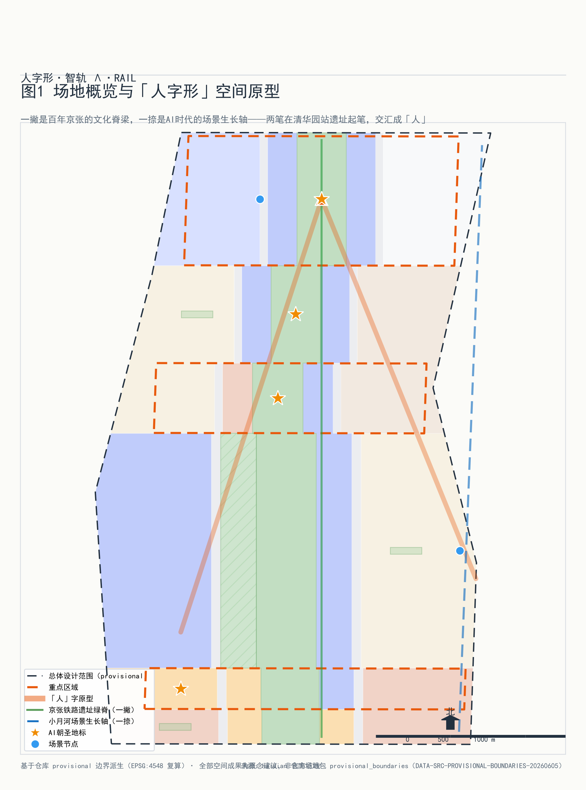
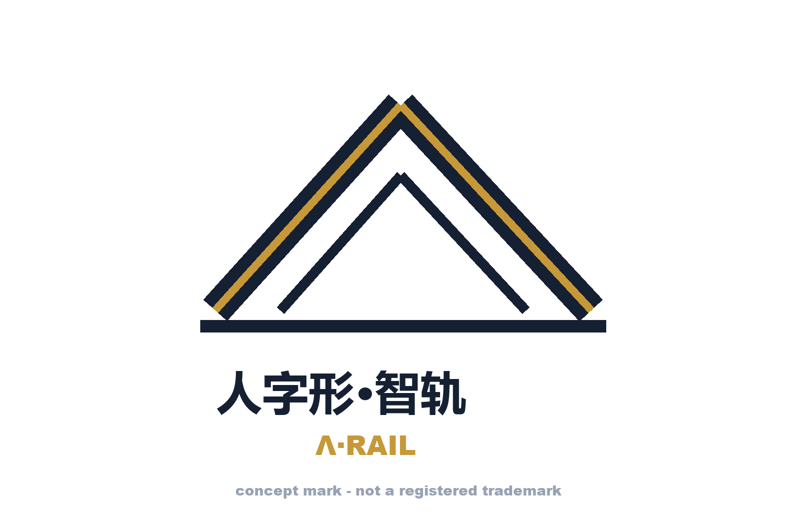
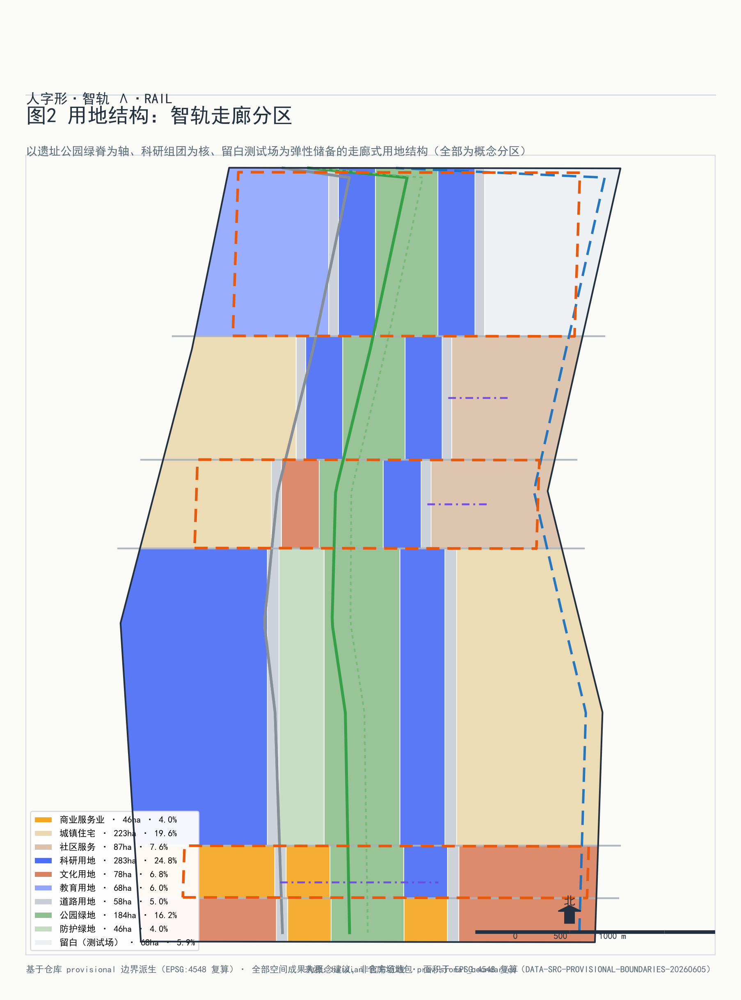
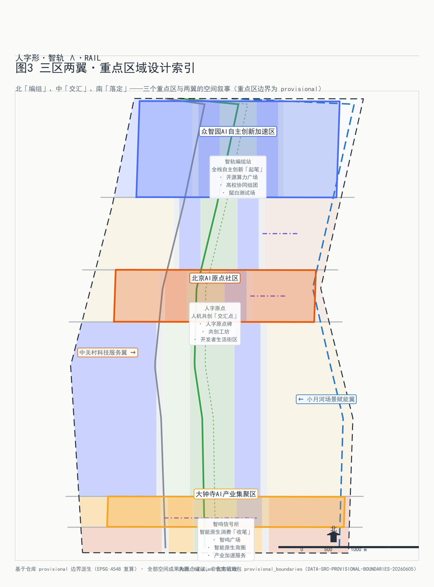
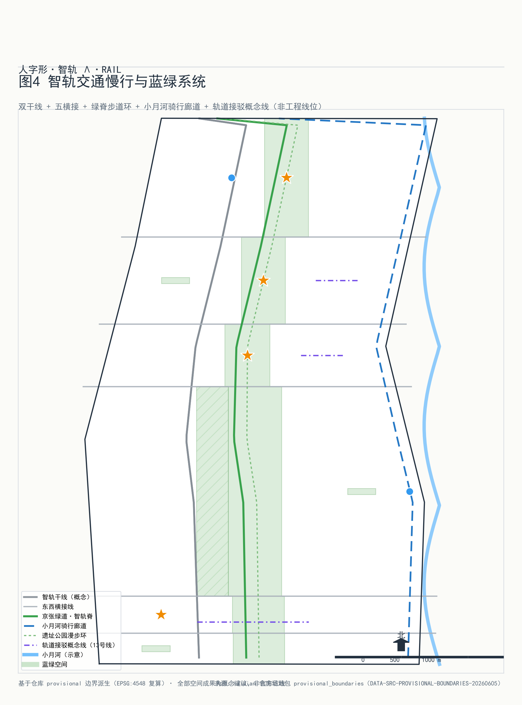
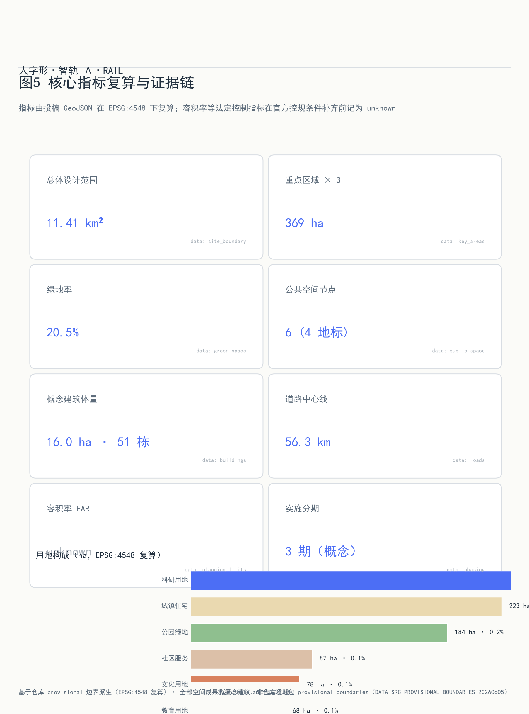

# 人字形·智轨（Λ·RAIL）—— 百年京张AI创新带总体城市设计与重点区域详细设计

## 设计依据与资料清单

本方案的权威依据来自征集方发布的官方公告、面向智能体的任务书和站点资料包，全部通过仓库内的来源登记表核对可用性之后使用 [source:SOURCE-REGISTRY]。其中 formal-ready 的材料包括项目公告、任务书、三层范围定义与 provisional 边界几何 [source:SITE-PACKAGE]；智能体任务书的六项任务（命名与Logo、全球生态案例、场景卡、测试验证场景、用户画像、朝圣地标与长期运营）构成本方案正文的必答题 [source:AGENT-TASKBOOK]。案例研究只使用公开报道与机构官网的背景性信息，不作为证据使用；凡是缺少控规条件、现状建筑、权属或工程勘察的内容，一律按待确认事项写入假设清单，不在正文中伪装为审定指标。本方案不引用任何未清权的非公开资料，不使用外部地图截图，全部图纸由本包 GeoJSON 与指标数据程序化生成。

## 三层范围工作框架

方案遵循征集设定的三层范围：统筹研究范围 43.6 平方公里，面向产业生态与未来城市形态提出战略判断；总体设计范围 11.4 平方公里，开展控规深度的城市设计；重点区域 369.3 公顷，开展规划综合实施方案深度的详细设计 [source:BOUNDARY-SOURCE]。本包提交的场地边界复算面积为 11412825 平方米（约 1141.28 公顷），与公告口径的 11.4 平方公里一致 [metric:site_area_sqm]；三处重点区按提交几何复算分别为 192.92、104.32、72.05 公顷，合计 369.29 公顷，与官方 368.4 公顷口径的差异来自 provisional 边界的粗略性。三层范围逐级收窄、逐级加深：研究范围回答『AI 创新带在世界级生态中的位置』，总体范围回答『用地、交通、蓝绿与更新如何组织』，重点区域回答『具体地块怎么落』。全部边界均为 provisional 几何，只支持 intake 展示与讨论，不能用于官方红线或精确面积核定；一旦官方 polygon 替换，site_boundary、key_areas 两个图层及全部派生图层（land_use、roads、green_space、public_space、buildings、phasing）与依赖面积比的指标需要整体重算 [depth:three_level_scope_framework]。

## 统筹研究范围产业与未来城市研究

**总体概念：人字形·智轨。** 1909 年詹天佑在京张铁路青龙桥段写出『人』字形折返线，用最朴素的几何解决了工程难题；一百多年后，这条铁路所在的走廊要回答另一个问题——AI 时代的人机关系。方案把这个答案写成同一个字：一撇是京张铁路遗址公园文化轴，承载百年铁路文脉与中关村创新记忆；一捺是小月河场景生长轴，让 AI 场景沿蓝绿廊道自然生长；两笔在清华园站遗址一带交汇，构成『人』字的捺点——北京 AI 原点社区。概念命名『人字形·智轨』，英文名 Λ·RAIL，Λ 即『人』字的几何抽象，也是铁轨道岔的辙叉符号：技术（轨）与人文（人）在此交汇 [standard:PROJECT-AGENT-OPEN-CALL-TASKBOOK]。

**Logo 设计说明：** 标识以负空间手法在 Λ 形双线（两笔轨道）之间留出『人』字，笔画端头做辙叉式斜切，配色取铁轨深灰与京张青铜金；字体组合『人字形·智轨 / Λ·RAIL』水平排布，用于导视、活动品牌与数字界面（概念稿见下图）。Logo 为概念设计，投放前需商标检索与清权。

**区域协同——从海淀走廊到京津冀创新网络：** 人字形·智轨不把创新带当作孤立走廊。向北，众智园以开源算力与测试场地对接未来科学城（能源、生命科学）与怀柔科学城（大科学装置）的算力和数据需求，形成『装置在怀柔、转化在众智园』的接力；向南，大钟寺以智能原生商业与企业服务对接北京经济技术开发区在高级别自动驾驶、机器人量产上的场景放大需求，实现『海淀验证、亦庄量产』；向东，原点社区以开源社区文化对接北纬社区的数字人居与数字治理实践；在京津冀尺度上，京张高铁本身就是最早的跨区域协同基础设施——方案让张家口的数据中心集群与绿色能源成为创新带的『西翼算力仓』，把『东数西算』的区域分工写进创新带的叙事结构 [source:AGENT-TASKBOOK]。

**三大定位与三区两翼协同回路：** 面向公告 1.5（1）提出的世界级 AI 创新生态体系 [standard:PROJECT-OFFICIAL-ANNOUNCEMENT]，方案确立三大定位——全球开源创新的原点（众智园）、人机共生社区的样板（原点社区）、智能原生经济的客厅（大钟寺）；三区构成『研发—转化—产业』主链，两翼（小月河场景翼、中关村服务翼）提供场景供给与专业服务，形成『研发在众智园、验证在小月河、转化在原点、产业化在大钟寺』的闭环回路 [source:AGENT-TASKBOOK]。

**六个全球 AI 创新生态案例及其转化：**（1）斯坦福研究园区——大学与产业共享校园的『研发社区』原型，转化为众智园的高校协同组团与低密度花园街区；（2）伦敦国王十字街区——铁路遗产（King's Cross 车站与谷仓）改造为 Google UK 园区与中央圣马丁学院，转化为京张遗址的『站房即客厅』策略；（3）巴黎 Station F——世界最大创业园区以『一座建筑装下生态』著称，转化为原点社区人机共创工坊的垂直生态组织；（4）纽约康奈尔科技校区——从零建造的『city of ideas』，其桥接岛（Bridge Building）产学研界面转化为众智园算力广场的开放测试界面；（5）柏林阿德勒斯霍夫科学城——『城中有园、园中有城』的产学研一体空间，其 16 个研究所与 1200 家企业共生结构转化为本方案留白用地弹性机制；（6）深圳南山科技园——高密度产业社区与城中村共生，其对开发者生活成本敏感性的回应转化为原点社区的小户型人才街区。上述案例仅作背景研究，不构成证据来源。

## 总体设计范围城市更新与控规深度城市设计

总体设计范围的结构逻辑是『一带两轴三区多组团』：一带为京张遗址公园活力带；两轴即人字形的两笔；三区为三处重点区；多组团为沿两轴分布的科研、生活、服务组团 [depth:overall_spatial_structure]。用地布局按《国土空间调查、规划、用途管制用地用海分类指南》编码 [standard:MNR-LAND-USE-CLASSIFICATION-GUIDE]：科研用地 282.67 公顷占比 24.8%，为第一大用地类型，集中于众智园与原点社区 [data:geometry/land_use.geojson#LU-001]；城镇住宅用地 223.49 公顷（19.6%）；公园绿地 184.36 公顷（16.1%）；文化用地 78.03 公顷（6.8%）；教育用地 68.00 公顷（6.0%）；留白用地 67.78 公顷（5.9%），沿两轴战略性预留为 AI 未预见业态的弹性空间 [depth:land_use_layout]。城市更新框架按『留改拆』分类推进：铁路遗址本体与既有公园全部保留，成规模老旧楼宇改造为研发与转化空间，少量低效用地拆除新建概念体量 51 处、基底面积 15.96 公顷 [depth:retain_renovate_demolish]。建筑高度与强度管控缺官方控规条件，全部按 unknown 处理并列入待确认事项，本包的 51 处概念体量为低置信度设计量，不代表法定控制值 [depth:development_intensity_controls]。交通组织以慢行与公交优先，铁路遗址公园绿脊贯通全线，市政与新型基础设施（分布式能源、端侧算力驿站）沿绿脊复合布置 [standard:MOHURD-CONTROL-DETAILED-PLANNING]。城市风貌以『铁路灰、青铜金、创新蓝』为基调，延续京张铁路的工程美学 [standard:MOHURD-URBAN-DESIGN-MEASURES]。

## 重点区域详细设计

**众智园 AI 自主创新加速区（192.92 公顷，起笔）**：定位全球开源创新原点。空间结构为『一核两翼』——算力广场为核心（PS-006），高校协同组团与文化展示组团为两翼；概念体量以研发办公（低层高密度花园街区）与测试中试（大跨低层）为主；对外接口为北五环与清华园站遗址；实施风险在于高校用地产权与实验设施环评，需待确认 [data:geometry/key_areas.geojson#PROV-KEY-001]。

**北京 AI 原点社区（104.32 公顷，交汇）**：人字两笔的交汇处，定位人机共生社区样板。保留清华园站遗址及周边成熟街区，改造沿街楼宇为人机共创工坊与开发者生活街区，新建仅限人字原点碑广场（PS-001）周边的小体量标志性建筑；小户型人才住宅嵌入街区而非集中成团；实施风险在于既有社区改造的居民协调 [data:geometry/key_areas.geojson#PROV-KEY-002]。

**大钟寺 AI 产业聚集区（72.05 公顷，收笔）**：定位智能原生经济客厅。以既有商务楼宇的智能化改造为主，智鸣广场（PS-003）衔接觉生寺文保控制带（CT-001），建筑高度与风貌从文保视角退让；路口四象限地下连通提升慢行连续性；实施风险在于文保范围以文物部门公布为准、商务楼宇权属分散 [data:geometry/key_areas.geojson#PROV-KEY-003]。

三个重点区均达到规划综合实施方案的概念深度，具体管控指标待官方控规条件补齐后复算 [depth:three_key_area_detailed_design]。重点区边界为 provisional，上述结论均为方向性设计建议。

## AI 创新生态、人才画像与 AI+ 场景

**六类用户画像：**（1）基础研究科学家——需要安静实验室、跨校协作界面与稳定算力；（2）AI 创业者与工程师——需要低成本空间、测试场地与投资接口；（3）高校学生与开源开发者——需要社区、活动与可负担的生活；（4）老龄社区居民——需要无障碍服务与数字包容；（5）通勤白领与访客——需要高效的交通接驳与可感知的 AI 体验；（6）城市治理者与运营方——需要可控、可审计的公共智能体 [source:PROCESSED-FACT-PACK]。

**十二张 AI 场景卡**（其中 SC-05、SC-07、SC-09、SC-12 为 AI 产业测试验证场景）：

- **SC-01 京张时空导览**（PS-004 清华园时空站台）：AR 叠加百年铁路史与中关村创新史；服务对象为游客与居民；数据为公开史料；无个人数据采集；人工复核导览内容；运营主体为遗址公园管理方；图层 public_space；风险为内容准确性。
- **SC-02 人字原点人机共创**（PS-001）：开发者与居民共同训练社区模型；隐私边界为数据不出社区、脱敏训练；人工复核模型输出；运营主体为社区基金会；风险为算法偏见。
- **SC-03 开源贡献长廊展示**（PS-002）：以贡献图谱可视化开源生态，全部使用公开仓库元数据；运营主体为开发者社区；风险为信息过载。
- **SC-04 慢行断点诊断**：用公开街景与传感器识别遗址公园慢行断点，人工复核后生成改造清单；对应官方场景 ai-traffic-walkability；风险为数据时效性。
- **SC-05 机器人低速配送测试段**（PS-005 小月河场景实验段）【测试验证场景】：在封闭段测试配送机器人，配备安全员与急停机制；数据为设备遥测；隐私边界为不采集行人影像；运营主体为园区运营公司；风险为混行安全。
- **SC-06 AI 健康服务导航**：连接周边医疗资源与养老服务的导航智能体，对应官方场景 ai-health-service-navigation；健康数据仅在用户终端处理；人工客服兜底；风险为服务准确性 [standard:ELDERLY-SMART-TECH-PLAN-2020-45]。
- **SC-07 算力广场开放测试**（PS-006）【测试验证场景】：为初创团队提供端侧算力与模型评测沙盒；数据为自愿提交的评测任务；人工复核榜单；运营主体为众智园平台公司；风险为算力滥用。
- **SC-08 智鸣广场文化智能体**（PS-003）：钟声与光环境的生成式艺术，实时数据驱动；不采集人脸；运营主体为大钟寺运营方 [standard:GENERATIVE-AI-INTERIM-MEASURES]。
- **SC-09 众智园开放街区测试**【测试验证场景】：限定街区开放测试自动驾驶接驳与服务机器人，配备远程接管与保险机制；对应官方场景 robot-delivery-low-speed 与 public-safety-operations-review；风险为极端天气。
- **SC-10 企业服务 Copilot 走廊**：面向创新带企业的政策、空间、供应链智能客服，对应官方场景 enterprise-service-copilot；人工坐席复核；风险为政策解读偏差。
- **SC-11 无障碍与适老出行助手**：全带无障碍路径规划与陪同呼叫 [standard:BARRIER-FREE-ENVIRONMENT-LAW]；运营主体为街道；风险为设施维护。
- **SC-12 公共安全与活动运营复核沙盘**【测试验证场景】：大型活动人流仿真与应急预案推演的测试场，数据为仿真数据与匿名计数；人工指挥决策；对应官方场景 public-safety-operations-review。

场景卡与空间节点通过 public_space 图层锚定 [data:geometry/public_space.geojson#PS-001]，全部场景声明数据来源、隐私边界、人工复核与运营主体，未覆盖的运行细节列入假设清单。

## 用地、建筑规模与拆改留方案

用地布局在总体城市设计章节已述，本节聚焦规模与拆改留账本 [depth:land_use_layout]。用地平衡：科研 282.67 公顷（24.8%）、住宅 223.49 公顷（19.6%）、公园绿地 184.36 公顷（16.1%）、社区设施 87.27 公顷（7.6%）、文化 78.03 公顷（6.8%）、教育 68.00 公顷（6.0%）、留白 67.78 公顷（5.9%）、商服 45.96 公顷（4.0%）、防护绿地 46.12 公顷（4.0%）、道路 57.61 公顷（5.1%），合计与场地面积闭合（无缝无重叠，拓扑校验 gap≈0）。拆改留分类：留——铁路遗址本体、既有公园绿地与成片成熟社区；改——沿两轴的老旧商务与商业楼宇，改造为研发、转化与智能原生商业；拆——少量低效工业与临时用地，拆除后新建概念体量。建筑基底合计 15.96 公顷 [metric:building_footprint_area_sqm]，51 处概念体量按研发办公、测试中试、智能原生商业、文化展示、教育协同五类组织。绿地率复算为 20.5% [metric:green_ratio]，高于全市基准，支撑花园式研发街区定位。容积率、建筑高度、开发强度因缺少官方控规条件全部记为 unknown [depth:development_intensity_controls]；概念体量为低置信度设计量，官方控制条件补齐后按同一几何管线复算。

## 交通、轨道、市政与公共服务设施

交通组织的原则是『让 AI 原点的街道属于人』。道路系统为『两干多支』：智轨西干线（RD-001）与智轨东干线（RD-002）承担过境与货运疏解，街区内部以支路网与微循环为主，合计道路中心线 56.28 公里 [metric:road_centerline_length_m]。轨道一体化以 13 号线与京张高铁既有站点为锚点，重点区通过慢行接驳而非新增车行入口连接站点。慢行系统三条主线：京张绿道·智轨脊步道（RD-010）贯通遗址公园全线 [data:geometry/roads.geojson#RD-010]；小月河骑行廊道（RD-011）提供连续骑行路权；遗址公园漫步环（RD-012）串联四大朝圣地标。停车策略为总量控制与共享泊位，非机动车停放结合轨道站点与地块退线布置 [depth:traffic_rail_slow_parking]。市政与新型基础设施融合布置：分布式能源与储能沿绿脊布置，端侧算力驿站结合公共服务设施复合建设，形成『算力—能源—服务』三网合一的基础设施走廊 [depth:municipal_new_infrastructure]。人才生活服务（托幼、社区食堂、运动社交）沿原点社区与大钟寺生活翼布置。以上均为概念建议，红线与市政容量待官方条件确认。

## 蓝绿空间、公共空间与城市风貌

蓝绿系统的骨架是『一带一河多园』：京张遗址公园活力带（一撇）、小月河蓝绿廊道（一捺）、以及沿两轴分布的公园绿地 184.36 公顷与防护绿地 46.12 公顷 [data:geometry/green_space.geojson#GS-001]，绿地空间合计 234.10 公顷、绿地率 20.5% [metric:green_ratio]。铁路遗址线性保护带（CT-002）作为文化绿脊的硬约束 [data:geometry/constraints.geojson#CT-002]。广场型公共空间节点 6 处、合计 6.86 公顷 [metric:public_space_ratio]，其中 4 处为 AI 朝圣地标 [depth:blue_green_public_space]：

- **PS-004 清华园时空站台**：以站台候车的空间原型，让百年铁路与今天的 AI 在同一屋檐下候车——候的是下一班开往未来的列车；
- **PS-001 人字原点碑**：两轴交汇处的青铜 Λ 碑，镌刻 1909 与当下两个年份，是创新带的精神原点；
- **PS-002 开源贡献长廊**：以代码贡献谱系为立面语言的长廊，向公众解释『开源如何改变世界』；
- **PS-003 大钟寺智鸣广场**：古钟与新算法同频共振的声光广场，晚间以生成式声光艺术致敬『中国声音』的传统。

城市风貌基调为『铁路灰、青铜金、创新蓝』：建筑以灰白色系为主，公共空间与标识系统以青铜金点缀呼应京张时代，AI 界面元素使用创新蓝；屋顶形态沿遗址公园一侧做缓坡与绿化屋顶，体量控制的正式指标待控规确认。全部地标均为概念设计，不构成已批准建设安排，标识字体与图像投放前需清权。

## 更新项目清单、实施政策与分期计划

更新项目清单按三期组织 [data:geometry/phasing.geojson#PH-01]：一期『原点先行』（0-3 年，概念）——AI 原点社区与遗址公园绿脊启动，形成可感知的人机共创原点，包括人字原点碑广场、人机共创工坊改造、智轨脊步道贯通；二期『南北展开』（3-6 年，概念）——众智园加速区与大钟寺产业区梯次展开，完善测试验证场地与产业服务；三期『两翼成网』（6-10 年，概念）——小月河场景翼与中关村服务翼全面成网，进入长效运营 [depth:phasing_implementation]。项目依赖条件：官方控规条件、道路红线、权属核查与文保认定；实施主体建议为区级平台公司 + 街道 + 社区基金会 + 开发者社区的多方共治结构 [depth:renewal_project_list]。政策建议包括存量更新的用途转换弹性、留白用地的预审批机制、测试场景的监管沙盒。

**长期运营与年度活动体系（概念建议）：**（1）**人字马拉松 Λ Hackathon**——每年秋季沿人字两轴举办开发者马拉松与路演，终点设在人字原点碑；（2）**智轨开源周**——每年春季的全球开源生态峰会 + 场景开放日，向公众开放全部测试场景；（3）**京张智鸣音乐会**——大钟寺智鸣广场的年度声光艺术活动，连接古钟文化与 AI 创作。开发者社区运营依托开源贡献长廊与算力广场建立贡献积分体系，积分可兑换测试算力与活动权益；国际传播以『从人字形铁路到人字形智轨』为叙事主线；招引转化以场景开放（先测试、后落地）替代传统租金优惠。以上活动、招商与运营安排均为概念建议，不表述为已确定的政府安排。

## 指标体系、面积复算与合规矩阵

核心指标全部由提交几何复算、可程序化验证 [depth:metrics_recalculation]：场地面积 11412825 平方米 [metric:site_area_sqm]；绿地率 20.5%（绿地 234.10 公顷 / 场地 1141.28 公顷），高于常规城市建成区基准，支撑『花园里的研发社区』定位，服务人才的日常休憩与跨团队交往；广场型公共空间率 0.6%（6.86 公顷），该指标仅计硬质广场节点层，公园绿地另计——两者合计约 21.1%，保障创新交往空间的供给 [metric:public_space_ratio]；科研用地 282.67 公顷占 24.8%，是第一大用地类型，直接支撑 AI 产业空间供给；概念体量 51 处、基底 15.96 公顷 [metric:building_footprint_area_sqm]；道路中心线 56.28 公里 [metric:road_centerline_length_m]；重点区 3 处 [metric:key_area_count]；朝圣地标 4 处、场景节点 6 处；分期 3 期。全部指标公式、来源文件与置信度在 metrics.json 中逐项登记，compliance_matrix.json 覆盖公告 1.3—1.5 全部 17 项条款与智能体任务 agent.1—agent.6，standard_matrix.json 覆盖 9 项标准，design_depth_matrix.json 覆盖 15 个深度项。待官方控规条件补齐后，强度类指标将按同一管线复算并升级置信度。

## 风险、版权与合规说明

主要风险与应对：（1）**边界 provisional**——全部边界为临时几何，仅支持 intake 展示，正式评分前必须替换官方 polygon 并整体重算派生图层；（2）**控制条件缺失**——容积率、高度、拆改留的法定判断缺控规、权属与工程勘察支撑，一律记 unknown 并列入假设；（3）**数据缺口**——现状建筑、市政容量、交通量调查缺失，相关结论为方向性建议 [depth:risk_missing_data]；（4）**AI 场景风险**——全部场景声明数据来源与隐私边界，涉及公共空间感知的场景一律匿名化并保留人工复核；（5）**文保不确定性**——觉生寺文保范围以文物部门公布为准，大钟寺高度退让为保守概念。版权方面：本包全部文本、几何、图件与 PDF 由声明的智能体程序化生成或使用已清权公开资料（详见 sources.json），未使用任何未清权素材；AI 生成内容按《生成式人工智能服务管理暂行办法》合规使用，生成责任由提交者承担 [standard:GENERATIVE-AI-INTERIM-MEASURES]；版权声明见 report/copyright_statement.md。本方案不构成官方批准、审批或实施承诺，所有概念建议待专业复核。

## 参考资料

1. 百年京张AI创新带城市设计公开征集公告及附件（项目官方公告，仓库 brief/）。
2. 面向智能体的任务书 agent_taskbook.json（六项 agent 任务与十条共创原则）。
3. 站点资料包 site-package（三层范围、provisional 边界、设计导则）。
4. 《国土空间调查、规划、用途管制用地用海分类指南（试行）》（自然资源部，2023）。
5. 《城市设计管理办法》（住建部，2017）。
6. 《建筑工程设计文件编制深度规定（2016 年版）》（住建部）。
7. 《生成式人工智能服务管理暂行办法》（2023）。
8. 《无障碍环境建设法》（2023）。
9. 《关于切实解决老年人运用智能技术困难的实施方案》（国办发〔2020〕45 号）。
10. 斯坦福研究园区、伦敦国王十字街区、巴黎 Station F、纽约康奈尔科技校区、柏林阿德勒斯霍夫、深圳南山科技园的公开报道与机构官网（背景研究）[source:SOURCE-REGISTRY]。
