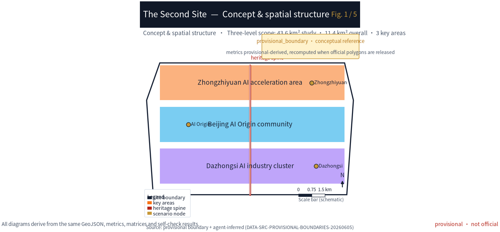
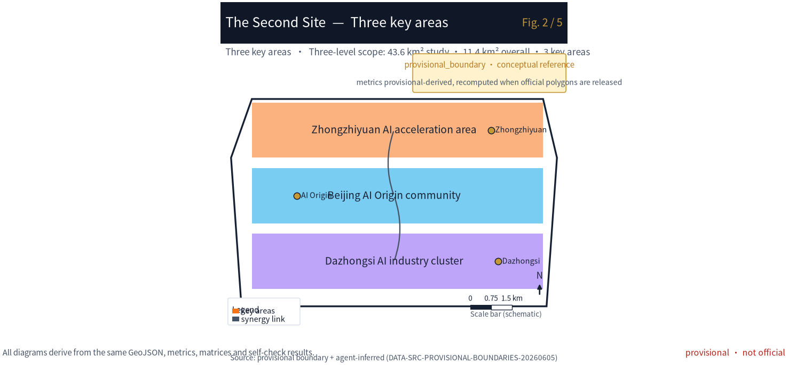
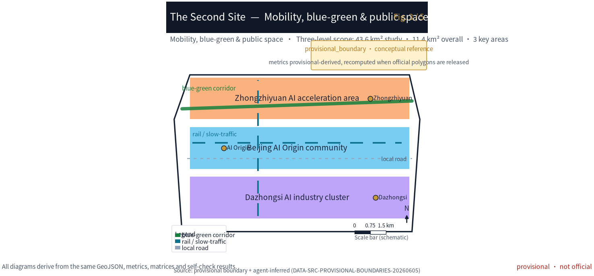
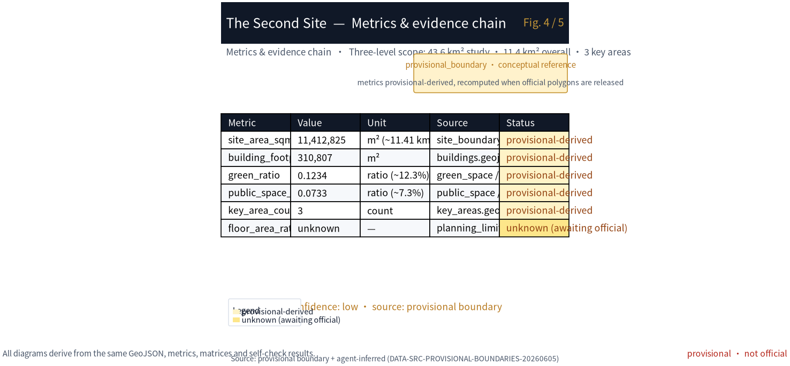

# The Second Site

## Design Basis and Source List

This formal proposal takes the pre-qualification announcement of the Centennial Jing-Zhang AI Innovation Belt international urban design call (Beijing Haidian District Bureau of Territorial Planning) as its primary basis [source:OFFICIAL-ANNOUNCEMENT], and uses the maintainer-registered provisional boundaries, key areas, enumerations, metrics and source lists in `brief/site-package/` as machine-readable basis [source:SITE-PACKAGE] [source:SOURCE-REGISTRY]. Before generating, the agent read `design_brief.json`, `allowed_design_space.json`, `agent_taskbook.json`, `sources.json`, `enums/`, `ranges/`, `schemas/` and `data/source_registry.json`, using `data/processed/agent_fact_pack.md` as a reading map [source:PROCESSED-FACT-PACK]. Every design judgement is decomposed into traceable sources, recomputable metrics, verifiable layers and human-reviewable assumptions; the announcement requires control-plan-level urban design depth and comprehensive implementation-plan depth, so narrative cannot replace GeoJSON, metric tables, A3 booklet, A0 boards and the HTML viewer [depth:existing_conditions_diagnosis].

The SITE_BOUNDARY and three KEY_AREA polygons used here are maintainer-defined provisional boundaries (area deviation +0.02%~+0.43%), and must be marked `official_boundary=false`, `geometry_role=provisional_constraint`; they serve only generation, self-check, visualization and discussion, and must not be treated as official redline, approval basis or precise-area basis [data:geometry/site_boundary.geojson#SITE-001] [source:BOUNDARY-SOURCE] [source:KEY-AREA-SOURCE]. The organizer data gap does not block content scoring; once official polygons are released, site boundary, key areas, land use, roads, green space, public space, buildings, phasing and metrics must all be recomputed [metric:site_area_sqm].

## Three-Level Scope Framework

The proposal organizes work along the three announced scopes: the coordinated research area (43.6 km²) addresses the AI industry ecosystem and future urban form; the overall design area (11.4 km²) addresses the urban-renewal framework, industry space, transport/municipal support and urban character; the key detailed-design area (368.4 ha) addresses the three areas' functions, building scale, retain/renovate/demolish, public space and transport [depth:three_level_scope_framework]. The three scopes are mapped item-by-item in `compliance_matrix.json` so that announcement sections 1.3, 1.4, 1.5 and agent.1–agent.6 all have chapter, layer, metric, drawing and HTML evidence [depth:overall_spatial_structure].

The overarching concept is **The Second Site**: the Jing-Zhang railway is the "first site" — the construction and historical site of China's first self-designed railway; the AI-era centennial Jing-Zhang is the "second site" — where global developers, researchers, residents and visitors restart and leave traces [source:AGENT-TASKBOOK]. "Site" carries a double meaning: both an urban-renewal worksite and the media sense of "first site / second site". The "belt" takes the Jing-Zhang heritage park as its historical and public-space spine; "three cores" map to Zhongzhiyuan, Beijing AI Origin Community and Dazhongsi; "multi-point scenarios" are operable AI+ nodes; the "composite loop" links walkways, green space, public space and event routes.

| Tier | Design question | Proposal answer | Data anchor |
| --- | --- | --- | --- |
| Coordinated research area | How to organize AI ecosystem & future city | An innovation chain of "university sourcing — open-source collaboration — enterprise conversion — public experience — international communication" | compliance_matrix.json, standard_matrix.json |
| Overall design area | How to land industry, renewal, transport, character | Land use, buildings, roads, green, public space and phasing layers together | [data:geometry/land_use.geojson#LU-001], [data:geometry/roads.geojson#ROAD-001] |
| Key detailed-design area | How the three areas reach detailed depth | Distinct positioning, spatial moves, AI scenarios, implementation dependencies | [data:geometry/key_areas.geojson#KEY-001], [data:geometry/key_areas.geojson#KEY-002], [data:geometry/key_areas.geojson#KEY-003] |

## Coordinated Research Area: Industry and Future City Research

The core task of the coordinated research area is building a world-class AI innovation ecosystem [standard:PROJECT-OFFICIAL-ANNOUNCEMENT]. This proposal introduces a Contribution Receipt as the hub of the innovation chain: universities and open-source communities produce reproducible research and models (sourcing), enterprises convert them (conversion), public space hosts experience and international communication (experience), and every participant's contribution is recorded as a verifiable receipt, forming a coordination framework for talent, capital, compute, data and scenarios [depth:coordinated_research_area]. Naming and visual identity serve the overall recognizability of "Centennial Jing-Zhang Culture Belt, Urban AI Living Experience Belt, AI Fusion Innovation Belt", without confusing with existing parks or enterprise names [standard:PROJECT-AGENT-OPEN-CALL-TASKBOOK].

Requirements from the agent open-call taskbook are answered as agent open-call tasks, not statutory planning controls [source:AGENT-TASKBOOK]. Future-city research answers how AI changes work, life, socializing, learning, transport and public services: AI transport, continuous green space, innovation service facilities and an international living-working atmosphere are landed as locatable function zones, nodes, corridors and scenarios [depth:future_city_strategy]. Global AI events, developer communities, open scenarios and pilgrimage routes are written as "concept proposals / reference schemes / materials for professional teams to deepen", never as confirmed government activities or implementation arrangements [depth:coordinated_research_area].

## Overall Design Area: Urban Renewal and Regulatory-Plan-Level Urban Design

The overall design area requires control-plan-level urban design depth [standard:MOHURD-CONTROL-DETAILED-PLANNING]. `geometry/land_use.geojson` fully covers the boundary with no overlap; `geometry/buildings.geojson` expresses renewal and retained building footprints; `geometry/roads.geojson` expresses micro-circulation, walking and rail-interchange relations; `metrics.json` recomputes core areas, ratios and layer counts [depth:land_use_layout] [depth:development_intensity_controls]. The overall design also supports transport, rail, municipal and facilities: rail-station integration, road micro-circulation, bike parking, parking supply, innovation-service platforms, talent-living services, new infrastructure, distributed energy and edge compute are given spatial layout and implementation paths [depth:traffic_rail_slow_parking].

Where building height, development intensity, road redlines, setback and facility standards lack official conditions, `status=unknown` is used uniformly with `reason`/`assumptions` stating pending conditions and recomputation paths; agent estimates must not masquerade as approved metrics [metric:floor_area_ratio]. The Second Site mechanism lands on the overall structure: the Jing-Zhang heritage park is the north–south spine linking the three key areas, and the Contribution Receipt is the soft interface for talent, scenario and entitlement flow between areas — not a new redline [data:geometry/site_boundary.geojson#SITE-001].

## Detailed Design of Key Areas

The key detailed-design areas are mandatory; the three areas each carry a "site contract":

- **Zhongzhiyuan AI Acceleration Area (Unfinished Site / TEST WITHOUT BLOCKING)**: a garden-type full-stack autonomous-innovation block. Spatial moves strengthen the Qinghe riverfront, industry showcase, low-carbon innovation exchange and external transport; green space hosts open testing and standards-governance showcase; the Contribution Receipt = test records (verifiable model red-team and standards-conformance records) [data:geometry/key_areas.geojson#KEY-001].
- **Beijing AI Origin Community (Co-living Site / CARE WITHOUT ACCOUNT)**: a near-campus achievement-conversion and talent community. It stitches campus–park–block walkways, and supplies achievement release, talent services, living and open-source collaboration space; the Contribution Receipt = care hours (timed records of community volunteering, open-source maintenance, public-space operation) [data:geometry/key_areas.geojson#KEY-002].
- **Dazhongsi AI Industry Cluster (Arrival Site / ARRIVE WITHOUT APP)**: an urban intelligent-economy and international-exchange block. It centers Dazhongsi station integration, four-quadrant walk connectivity, commercial services and key-enterprise public-environment renewal; the Contribution Receipt = account-free transactions (public experiences and consumption interfaces usable without registration or identity profiling) [data:geometry/key_areas.geojson#KEY-003].

All three key areas must appear in `geometry/key_areas.geojson` and be marked provisional; once official polygons are released they should replace as `official_constraint` [depth:three_key_area_detailed_design]. Design expression includes function, building scale, form, retain/renovate/demolish, public-space system, transport, walk connectivity and implementation projects [compliance_matrix.json] (1.5.3.1/1.5.3.2/1.5.3.3).

| Key area | Positioning | Spatial move | AI industry & operation scenarios | Evidence |
| --- | --- | --- | --- | --- |
| Zhongzhiyuan AI Acceleration | Unfinished site · full-stack autonomy | Strengthen Qinghe front, industry showcase, low-carbon exchange | Autonomous model testing, standards workshop, safety-governance showcase | [data:geometry/key_areas.geojson#KEY-001], [depth:three_key_area_detailed_design] |
| Beijing AI Origin Community | Co-living site · conversion & talent | Campus–park–block walk stitching, open-source collaboration | Open-source community, achievement release, talent services | [data:geometry/key_areas.geojson#KEY-002], [source:AGENT-TASKBOOK] |
| Dazhongsi AI Industry Cluster | Arrival site · intelligent economy | Dazhongsi station integration, four-quadrant walk | Agent showcase, content consumption, data-element roadshow | [data:geometry/key_areas.geojson#KEY-003], [metric:key_area_count] |

## AI Innovation Ecosystem, Personas, and AI+ Scenarios

The proposal builds spatial demand personas for AI talent and enterprises across R&D, open-source collaboration, achievement release, enterprise services, talent living, social learning, consumption, sport and international exchange [depth:ai_ecosystem_talent]. AI+ scenarios cover transport, services, consumption, healthcare, education, law and daily-life services, each stating service object, location, data source, privacy boundary, human-review mechanism and operating entity [depth:ai_scenarios].

AI governance follows data-minimization, open-source, explainability and human-review: city agents may assist identifying walk gaps, public-space heat, facility maintenance, enterprise-service demand and event risk, but cannot replace planning approval, output unauthorized personal profiles, or claim official implementation commitment [depth:civic_agent_governance]. All AI scenario nodes enter structured layers or the compliance matrix so reviewers see their relation to industry, space and public interest [data:geometry/public_space.geojson#PUBLIC-001].

| Persona | Typical need | Spatial response | Self-check boundary |
| --- | --- | --- | --- |
| Open-source developer | Release, collaborate, test, reputation | Origin open-release hall, public code wall, night协作 space | No personal-trajectory collection; aggregate-only analytics |
| Startup team | Low-cost office, compute access, testbed | Zhongzhiyuan shared test field, edge-compute point | Compute/data services need separate authorization |
| Enterprise visitor | Showcase, business, international reception | Dazhongsi roadshow lounge, station interchange | Enterprise marks/cases need clearance |
| Nearby resident | Commute, leisure, community, low-disturbance renewal | Jing-Zhang park walk loop, community embedding | No resident profiling for commercial push |
| Faculty & students | Conversion, cross-campus, daily walk | Campus–park walk stitching, conversion station | Campus data & research need authorization |

| Scenario card | Carrier | Design note |
| --- | --- | --- |
| 01 Open-release hall | Beijing AI Origin Community | Release, code-contribution showcase, small roadshow for campus/open-source/startups |
| 02 Safety-governance sandbox | Zhongzhiyuan | Standards, safety eval, model red-team as visitable, bookable, supervised nodes |
| 03 Edge-compute station | Overall-design nodes | Edge inference tied to public/enterprise services & low-carbon energy, prototype |
| 04 AI walk navigation | Jing-Zhang heritage belt | Explainable signage + low-intrusion sensing for walk gaps, crowding, accessibility |
| 05 Dazhongsi roadshow lounge | Dazhongsi cluster | Showcase, negotiation, media, international exchange for agents/terminals |
| 06 Qinghe low-carbon corridor | Zhongzhiyuan riverfront | Green space, stormwater, walk/cycle, AI showcase as campus living room |
| 07 Near-campus conversion street | Beijing AI Origin | Incubation, showcase, legal, IP, investment services for conversion |
| 08 Data-element lounge | Dazhongsi | Compliant, authorized, auditable data-element city-service interface |
| 09 AI life-service model street | Community/commerce | Healthcare, education, law, life-service AI+ in operable small blocks |
| 10 Global AI Week route | Belt public-space system | Walkable, communicable route from heritage to open-source to industry to roadshow |
| 11 Contribution-receipt station (validation) | Three-area interchange | Test records / care hours / account-free tx as verifiable receipts for pro teams to deepen |
| 12 Accessibility co-inclusion node (validation) | Park & stations | Low-intrusion sensing + human review, validates accessibility without privacy breach |
| 13 Low-carbon compute experience (validation) | Zhongzhiyuan | Edge inference demo + energy visualization, validates green-compute narrative |

## Land Use, Building Scale, and Retain-Renovate-Demolish Strategy

Land use follows public standards for territorial survey, planning and use regulation, forming a complete, closed, seamless partition [standard:MNR-LAND-USE-CLASSIFICATION-GUIDE]. `geometry/land_use.geojson` contains four classes — AI R&D, park/green open space, industry-service/commerce, community-support — covering the full boundary with no overlap [data:geometry/land_use.geojson#LU-001]. Buildings distinguish retained/renovated/renewed/new/pending, stating footprint, function, scale, character, roof, massing and height guidance; without status, ownership, control plan or engineering conditions, only methods and calibration checklists are given, no fabricated conclusions [depth:retain_renovate_demolish] [depth:height_massing_character].

Building scale and intensity are consistent with `metrics.json` and layers; where total scale, FAR, height, density, green ratio, setback and control lines lack official conditions, `status=unknown` is used with recomputation paths [metric:building_footprint_area_sqm]. The A3 booklet gives the renewal list and metric table; the A0 board expresses key structure and key areas; the HTML gives metric-layer linkage.

## Transport, Rail, Municipal Infrastructure, and Public Services

Transport answers the announcement's requirements for rail-station integration, road micro-circulation, walk gaps, external transport, parking, bike parking and green transport [depth:traffic_rail_slow_parking]. It covers the north 5th ring, the Jing-Zhang park ring-crossing nodes, Wudaokou, Qinghua East Road West, Dazhongsi station and key-enterprise surroundings; road and walk layers stay within the submitted boundary and cross-check with public space, green, industry nodes and key areas [data:geometry/roads.geojson#ROAD-001]. Municipal and public services cover AI-industry facilities, innovation platforms, talent-living services, new infrastructure, distributed energy, edge compute and traditional municipal fusion, stating standards, layout, radius, operation and phasing [depth:municipal_new_infrastructure].

Where road redlines, pipelines, fire and municipal conditions are missing, `assumptions.json` states pending items rather than presenting strategy as approved conditions [data:geometry/constraints.geojson#CONSTRAINTS].

## Blue-Green Network, Public Space, and Urban Character

Blue-green space takes the Jing-Zhang heritage park vitality belt as backbone, coordinating Qinghe, Xiaoyuehe, surrounding universities, enterprises and communities, proposing north–south and east–west walk/cycle/green systems [depth:blue_green_public_space]. The proposal identifies walk gaps, ring-road crossing nodes, park north/south landscape nodes, and proposes parking, sport, innovation exchange, tech testing, application showcase and public-service composite use [data:geometry/green_space.geojson#GREEN-001] [data:geometry/public_space.geojson#PUBLIC-001] [metric:green_ratio] [metric:public_space_ratio].

Urban character fuses Jing-Zhang railway history, Zhongguancun innovation culture and AI innovation culture, using Tsinghuayuan station, Beijing Film Academy and other resources for urban tone, building character, roof form, massing, interface and public-art guidance [standard:MOHURD-URBAN-DESIGN-MEASURES]. The proposal gives signage, cultural symbols, international narrative, AI pilgrimage landmarks and a contribution wall / honor system, but all brands, fonts, images, portraits and enterprise marks must be cleared [depth:urban_character].

## Renewal Projects, Implementation Policy, and Phasing

The implementation plan forms a reviewable renewal list stating location, type, function, responsible entity, dependencies, phase, risk and metrics [depth:renewal_project_list]. Policy covers renewal coordination, space supply, operation, industry service, public participation, data governance and property coordination; `geometry/phasing.geojson` expresses phasing, and `compliance_matrix.json` links each task to phasing and drawings [depth:phasing_implementation] [data:geometry/phasing.geojson#PHASE-001].

| ID | Project | Type | Key dependency | Evidence |
| --- | --- | --- | --- | --- |
| JZ-01 | Jing-Zhang park walk-gap stitching | Public space / transport | Road redline, under-bridge, traffic review | [data:geometry/roads.geojson#ROAD-001] |
| JZ-02 | Zhongzhiyuan Qinghe innovation front | Blue-green / industry showcase | River blue-line, ecology, flood | [data:geometry/green_space.geojson#GREEN-001] |
| JZ-03 | Origin near-campus conversion street | Renewal / industry service | Campus boundary, ownership, ground-floor | [data:geometry/buildings.geojson#BLDG-001] |
| JZ-04 | Dazhongsi four-quadrant walk | Rail integration / walk | Station, intersection, municipal | [data:geometry/public_space.geojson#PUBLIC-001] |
| JZ-05 | AI public service & edge-compute node | New infra / public | Energy, compute, security, operator | [data:geometry/constraints.geojson#CONSTRAINTS] |
| JZ-06 | Global AI Week public route | Operation / brand | Public-space permit, event safety, rights | [data:geometry/phasing.geojson#PHASE-001] |

Phasing is distinct from the 100-day submission cycle: the cycle is for deliverables; phasing is the urban-renewal and construction path. The proposal gives near-term pilots (light facilities, operations, service platforms), mid-term renewal (key-area detailed design and ownership coordination), and long-term governance (Contribution Receipt system and brand-asset sedimentation) [depth:phasing_implementation]. Annual event system, developer-community operation, scenario open-days, public experience routes and international communication state operating object, frequency, responsibility boundary, conversion path and risk — no slogans only [depth:long_term_operation].

## Metrics, Area Recalculation, and Compliance Matrix

Core metrics are recomputed under EPSG:4548 from provisional boundaries: `site_area_sqm=11412825.386`, `green_ratio=0.1234`, `public_space_ratio=0.0733`, `building_footprint_area_sqm=310807.184`, `key_area_count=3` [metric:site_area_sqm] [metric:green_ratio] [metric:public_space_ratio] [metric:key_area_count]. `floor_area_ratio` is `unknown` for lack of official control plan [metric:floor_area_ratio]. Metrics carry full fields `status/value/unit/source_files/formula/confidence/assumptions` in `metrics.json`; the HTML presents them via `data-metric`/`data-value` consistent with `metrics.json` [depth:indicators_recomputation].

The compliance matrix `compliance_matrix.json` covers announcement 1.3 (3), 1.4 (3), 1.5 (1.1/1.2/2.1–2.5/3.required/3.1–3.3 = 14) and agent.1–agent.6 (6), totaling 23 mandatory tasks; the standard matrix `standard_matrix.json` covers 6 mandatory standards; the design-depth matrix `design_depth_matrix.json` covers 15 core depth items all `complete` [depth:compliance_matrix] [depth:standard_response] [depth:design_depth].

## Risk, Copyright, and Compliance

All spatial suggestions are concept proposals, reference schemes or materials for professional teams to deepen; they do not replace formal planning nor constitute government-approved conclusions [depth:risk_compliance]. Boundaries are provisional and stated in `proposal.md`, `sources.json`, `assumptions.json`, `visual/index.html` and `self_check.json` as not official redline [source:BOUNDARY-SOURCE]. Privacy and copyright: scenarios set data-minimization and human-review boundaries, collect no personal-trajectory, and avoid resident profiling for commercial push; cited cultural resources, enterprise cases and images must be cleared, and unauthorized fonts, images, trademarks, portraits or paper figures are not used [depth:risk_compliance]. The Contribution Receipt system is a conceptual prototype; its on-chain/centralized registration, entitlement exchange and policy linkage need separate authorization and legal procedure, and this proposal claims no implementation commitment.

## References

- Beijing Haidian Bureau pre-qualification announcement (DATA-SRC-OFFICIAL-ANNOUNCEMENT-20260509)
- Agent open-call taskbook (SRC-2026-0518-AGENT-OPEN-CALL-TASKBOOK)
- Maintainer provisional-boundary derivation & open-source check (provisional_boundaries_basis.md)
- Public source registry (data/source_registry.json)
- Standards reference index (brief/site-package/standards/references/index.json)
