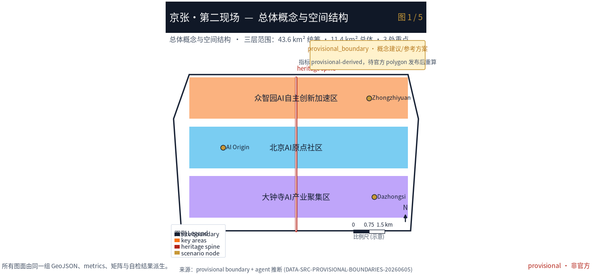
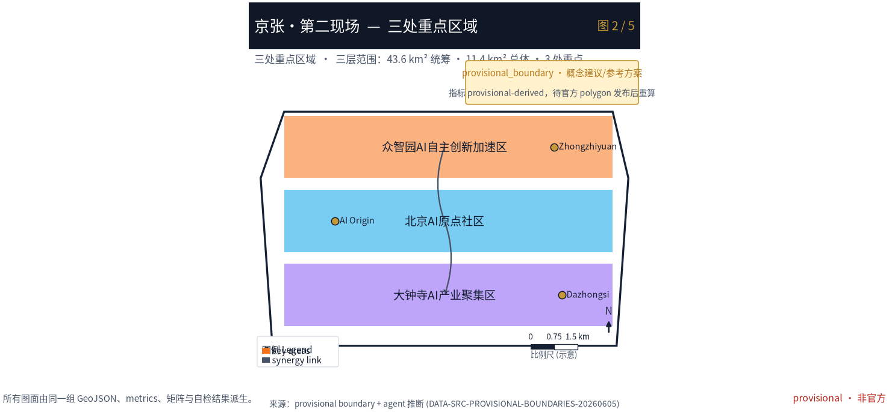
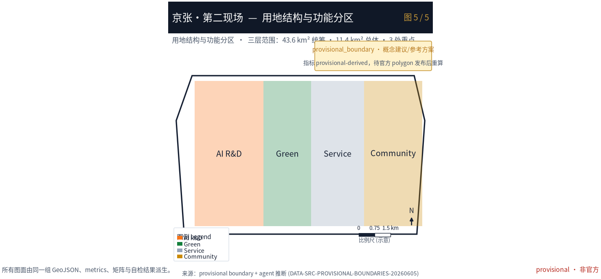
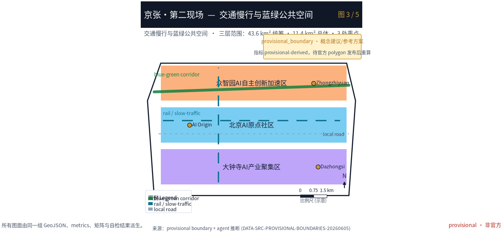
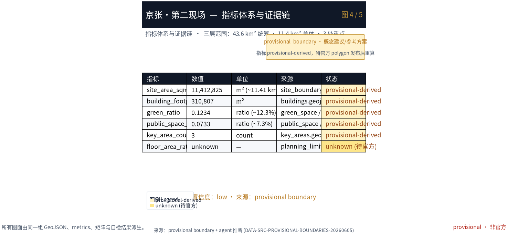

# 京张·第二现场 The Second Site

## 设计依据与资料清单

本 formal 方案以北京市规划和自然资源委员会海淀分局《百年京张AI创新带城市设计国际方案征集资格预审公告》为第一依据 [source:OFFICIAL-ANNOUNCEMENT]，并以 `brief/site-package/` 中维护者登记的临时边界、重点区域、枚举、指标与来源清单为机器可读依据 [source:SITE-PACKAGE] [source:SOURCE-REGISTRY]。AI agent 在生成方案前读取了 `design_brief.json`、`allowed_design_space.json`、`agent_taskbook.json`、`sources.json`、`enums/`、`ranges/`、`schemas/` 与 `data/source_registry.json`，并以 `data/processed/agent_fact_pack.md` 作为阅读导航 [source:PROCESSED-FACT-PACK]。所有设计判断均拆分为可追溯来源、可复算指标、可校验图层和可人工复核假设；公告要求方案达到控制性详细规划的城市设计深度与规划综合实施方案深度，文本叙述不能替代 GeoJSON、指标表、A3 文册、A0 展板与 HTML 电子展示成果 [depth:existing_conditions_diagnosis]。

本方案使用的 SITE_BOUNDARY 与三处 KEY_AREA 均为维护者定义的 provisional 边界（面积偏差 +0.02%~+0.43%），必须标注 `official_boundary=false`、`geometry_role=provisional_constraint`，仅用于方案生成、自检、可视化与讨论，不得作为 official redline、审批依据或精确面积依据 [data:geometry/site_boundary.geojson#SITE-001] [source:BOUNDARY-SOURCE] [source:KEY-AREA-SOURCE]。该组织方数据缺口本身不阻断内容评分；取得官方 polygon 后，site boundary、key areas、land use、roads、green space、public space、buildings、phasing 与 metrics 均需重算 [metric:site_area_sqm]。

## 三层范围工作框架

方案按公告三层范围组织工作：统筹研究范围（43.6 km²）关注 AI 产业生态与未来城市形态；总体设计范围（11.4 km²）关注城市更新总体框架、产业空间、交通市政与城市风貌；重点区域范围（368.4 ha）关注三处片区的功能业态、建筑规模、拆改留、公共空间与交通组织 [depth:three_level_scope_framework]。三层范围在 `compliance_matrix.json` 中逐条映射，保证公告 1.3、1.4、1.5 与 agent.1–agent.6 的必选任务都有章节、图层、指标、图纸与 HTML 证据 [depth:overall_spatial_structure]。

本方案的总体概念为「**京张·第二现场（The Second Site）**」：京张铁路遗址是「第一现场」——中国人自主设计建设的第一条铁路的施工现场与历史现场；AI 时代的百年京张，是「第二现场」——全球开发者、研究者、居民与访客重新出发、留下痕迹的现场 [source:AGENT-TASKBOOK]。这里的「现场」取双重语义：既是城市更新的工地面场，也是媒介意义上的「第一现场/第二现场」。"一带"以京张遗址公园为历史与公共空间主轴，"三核"对应众智园、北京AI原点社区、大钟寺三处重点片区，"多点场景"对应可运营的 AI+ 节点，"复合环"对应慢行、绿地、公共空间与活动路线的联动。

| 层级 | 设计问题 | 方案回答 | 数据落点 |
| --- | --- | --- | --- |
| 统筹研究范围 | AI产业生态和未来城市形态如何组织 | 建立「高校策源—开源协作—企业转化—公共体验—国际传播」的创新链 | compliance_matrix.json、standard_matrix.json |
| 总体设计范围 | 产业空间、城市更新、交通市政和风貌如何落图 | 用地、建筑、道路、绿地、公共空间和分期图层共同表达 | [data:geometry/land_use.geojson#LU-001]、[data:geometry/roads.geojson#ROAD-001] |
| 重点区域范围 | 三处片区如何达到详细设计深度 | 分别提出定位、空间动作、AI场景和实施依赖 | [data:geometry/key_areas.geojson#KEY-001]、[data:geometry/key_areas.geojson#KEY-002]、[data:geometry/key_areas.geojson#KEY-003] |

## 统筹研究范围产业与未来城市研究

统筹研究范围的核心任务是构建世界级 AI 创新生态体系 [standard:PROJECT-OFFICIAL-ANNOUNCEMENT]。本方案提出以「贡献凭证（Contribution Receipt）」为枢纽的创新链：高校与开源社区产出可复现的研究与模型（策源），企业与之对接转化（转化），公共空间承载体验与国际传播（体验），而每一位参与者的贡献都被记为可验证凭证，形成人才、资本、算力、数据、场景的协同框架 [depth:coordinated_research_area]。命名与视觉系统服务于「百年京张文化带、都市AI生活体验带、AI融合创新带」的整体辨识度，不与既有园区或企业名称混淆 [standard:PROJECT-AGENT-OPEN-CALL-TASKBOOK]。

面向智能体任务书要求回应对标 agent 开源征集任务，而非法定规划控制 [source:AGENT-TASKBOOK]。未来城市形态研究回答 AI 如何改变工作、生活、社交、学习、交通与公共服务：方案将 AI 交通系统、连续绿色空间、创新服务设施与国际化生活工作氛围落实为可定位的功能区、节点、廊道与场景 [depth:future_city_strategy]。全球 AI 创新活动、开发者社区、开放场景与朝圣路线均写为「概念建议/参考方案/可供专业团队深化研究」，不得写成已确定的政府活动或实施安排 [depth:coordinated_research_area]。

## 总体设计范围城市更新与控规深度城市设计

总体设计范围要求达到控制性详细规划的城市设计深度 [standard:MOHURD-CONTROL-DETAILED-PLANNING]。`geometry/land_use.geojson` 完整覆盖设计边界且无重叠，`geometry/buildings.geojson` 表达更新与保留建筑基底，`geometry/roads.geojson` 表达微循环、慢行与轨道接驳关系，`metrics.json` 复算核心面积、比例与图层数量 [depth:land_use_layout] [depth:development_intensity_controls]。总体设计还支撑交通、轨道、市政与配套设施：方案围绕轨道站点一体化、道路微循环、非机动车停放、停车供给、创新服务平台、人才生活服务、新型基础设施、分布式能源与端侧算力提出空间布局与实施路径 [depth:traffic_rail_slow_parking]。

涉及建筑高度、开发强度、道路红线、退线与设施标准的内容，若尚无官方控制条件，统一使用 `status=unknown` 并在 `reason`/ `assumptions` 中说明待补条件与复算路径，不得以 agent 推测值冒充审定指标 [metric:floor_area_ratio]。本方案把「第二现场」机制落到总体结构：以京张遗址公园为南北主轴，串联三处重点片区，并以「贡献凭证」作为片区之间人才、场景与权益流转的软性接口，而非新增红线 [data:geometry/site_boundary.geojson#SITE-001]。

## 重点区域详细设计

重点区域详细设计是必选项，三处片区分别承载一种「现场契约」：

- **众智园AI自主创新加速区（未完工现场 / TEST WITHOUT BLOCKING）**：定位花园型全栈自主创新街区。空间动作强化清河界面、产业展示、低碳创新交往与对外交通组织；以绿色空间承载开放测试与标准治理展示，贡献凭证 = 测试记录（model red-team、标准 conformance 的可验证记录）[data:geometry/key_areas.geojson#KEY-001]。
- **北京AI原点社区（共居现场 / CARE WITHOUT ACCOUNT）**：定位近校型成果转化与人才社区。组织校区、园区、街区慢行缝合，补足成果发布、人才服务、居住生活与开源协作空间；贡献凭证 = 照护时长（社区志愿服务、开源维护、公共空间运营的可计时记录）[data:geometry/key_areas.geojson#KEY-002]。
- **大钟寺AI产业聚集区（抵达现场 / ARRIVE WITHOUT APP）**：定位城市型智能经济与国际交往街区。围绕大钟寺站一体化、四象限步行连通、商业服务与重点企业公共环境更新；贡献凭证 = 无账号交易（无需注册、无需身份画像即可使用的公共体验与消费接口）[data:geometry/key_areas.geojson#KEY-003]。

三处重点区域必须在 `geometry/key_areas.geojson` 中出现并标注 provisional；若官方 polygons 发布，应作为 `official_constraint` 替换 [depth:three_key_area_detailed_design]。设计表达包含功能业态、建筑规模、建筑形态、拆改留分类、公共空间系统、交通组织、慢行连通与实施项目 [compliance_matrix.json]（1.5.3.1/1.5.3.2/1.5.3.3）。

| 重点片区 | 设计定位 | 空间动作 | AI产业与运营场景 | 证据引用 |
| --- | --- | --- | --- | --- |
| 众智园AI自主创新加速区 | 未完工现场·全栈自主创新 | 强化清河界面、产业展示、低碳创新交往 | 自主模型测试、标准制定工作坊、安全治理展示 | [data:geometry/key_areas.geojson#KEY-001]、[depth:three_key_area_detailed_design] |
| 北京AI原点社区 | 共居现场·成果转化与人才 | 校区—园区—街区慢行缝合、开源协作 | 开源社区、成果发布、人才特区服务 | [data:geometry/key_areas.geojson#KEY-002]、[source:AGENT-TASKBOOK] |
| 大钟寺AI产业聚集区 | 抵达现场·智能经济交往 | 大钟寺站一体化、四象限步行连通 | 智能体展示、内容消费、数据要素路演 | [data:geometry/key_areas.geojson#KEY-003]、[metric:key_area_count] |

## AI 创新生态、人才画像与 AI+ 场景

方案建立面向 AI 人才与企业的空间需求画像，覆盖研发办公、开源协作、成果发布、企业服务、人才居住、社交学习、消费生活、运动休闲与国际交往 [depth:ai_ecosystem_talent]。AI+ 场景围绕交通、服务、消费、医疗、教育、法律、生活服务等方向形成产业发展场景与 AI 赋能城市功能场景；每个场景说明服务对象、空间位置、数据来源、隐私边界、人工复核机制与运营主体 [depth:ai_scenarios]。

agent 生成的 AI 治理建议遵守数据最小化、公开来源、可解释与人工复核原则：城市智能体可辅助识别慢行断点、公共空间热力、设施维护、企业服务需求与活动安全风险，但不能替代规划审批、不能输出未经授权的个人画像、不能声称获得官方实施承诺 [depth:civic_agent_governance]。所有 AI 场景节点进入结构化图层或合规矩阵，便于评审者看到其与产业、空间和公共利益的关系 [data:geometry/public_space.geojson#PUBLIC-001]。

| 用户画像 | 典型需求 | 空间响应 | 自检边界 |
| --- | --- | --- | --- |
| 开源开发者 | 发布、协作、测试、社区声誉 | 原点社区开源发布厅、公共代码墙、夜间协作空间 | 不采集个人行为轨迹；活动数据只做聚合统计 |
| 初创团队 | 低成本办公、算力入口、产品试验场 | 众智园共享测试场、端侧算力服务点 | 算力和数据服务需另行授权 |
| 头部企业访客 | 展示、商务、国际接待、人才招聘 | 大钟寺国际路演客厅、轨道站点接驳 | 企业标识和案例须清权 |
| 周边居民 | 通勤、休闲、社区服务、低扰动更新 | 京张遗址公园慢行环、社区服务嵌入 | 不将居民画像用于商业推荐 |
| 高校师生 | 成果转化、跨校协作、日常慢行 | 校区—园区慢行缝合、成果转化驿站 | 校园数据和科研成果需授权 |

| 场景卡 | 空间载体 | 设计说明 |
| --- | --- | --- |
| 01 开源发布厅 | 北京AI原点社区 | 面向高校、开源社区与初创团队，提供成果发布、代码贡献展示与小型路演 |
| 02 安全治理沙盒 | 众智园 | 将标准制定、安全评测、模型红队测试转译为可参观、可预约、可监管的展示与协作节点 |
| 03 端侧算力驿站 | 总体设计范围节点 | 与公共服务、企业服务和低碳能源策略结合，作为待深化新型基础设施原型 |
| 04 AI慢行导航 | 京张遗址公园活力带 | 用可解释导视与低侵入传感识别慢行断点、拥挤节点与无障碍需求 |
| 05 大钟寺国际路演客厅 | 大钟寺AI产业聚集区 | 服务智能体、智能终端与内容消费企业的展示、洽谈、媒体发布与国际交流 |
| 06 清河低碳创新廊 | 众智园临清河界面 | 把绿色空间、雨洪、步行骑行与AI展示结合，作为园区公共客厅 |
| 07 近校成果转化街 | 北京AI原点社区 | 面向高校成果转化，组织孵化、展示、法务、知识产权与投融资服务 |
| 08 数据要素会客厅 | 大钟寺片区 | 以合规、授权、可审计为前提，展示数据要素流通的城市服务界面 |
| 09 AI生活服务样板街 | 社区与商业交汇处 | 将医疗、教育、法律、生活服务等AI+场景落到可运营小尺度街区 |
| 10 全球AI活动周路线 | 一带公共空间系统 | 形成从遗址文化、开源社区、产业展示到国际路演的可步行、可传播体验路线 |
| 11 贡献凭证驿站（验证场景） | 三片区接驳点 | 将测试记录/照护时长/无账号交易写入可验证凭证，供专业团队深化为链上或中心化登记 |
| 12 无障碍共融节点（验证场景） | 公园与站点 | 低侵入传感+人工复核，验证无障碍需求识别不因隐私越界 |
| 13 低碳算力体验（验证场景） | 众智园 | 端侧推理演示与能耗可视化，验证绿色算力叙事 |

## 用地、建筑规模与拆改留方案

用地方案依据国土空间调查、规划、用途管制分类等公开标准表达，形成完整、闭合、无缝的用地分区 [standard:MNR-LAND-USE-CLASSIFICATION-GUIDE]。`geometry/land_use.geojson` 含 AI研发创新用地、公园绿地与开敞空间、产业服务与商业服务用地、社区服务与配套用地四类，覆盖完整边界无重叠 [data:geometry/land_use.geojson#LU-001]。建筑方案区分保留、改造、更新、新建或待确认对象，明确建筑基底、功能、规模、风貌、屋顶、体量与高度控制的建议层级；若缺少现状建筑、权属、控规与工程条件，只提方法与待校准清单，不编造拆改留结论 [depth:retain_renovate_demolish] [depth:height_massing_character]。

建筑规模和强度指标与 `metrics.json` 和图层一致；总建筑规模、容积率、建筑高度、建筑密度、绿地率、退线与建筑控制线缺少官方条件时统一 `status=unknown` 并说明复算路径 [metric:building_footprint_area_sqm]。A3 文册给出更新项目清单与指标复核表，A0 展板表达关键空间结构与重点片区，HTML 提供指标与图层联动查看。

## 交通、轨道、市政与公共服务设施

交通方案回应公告对轨道站点一体化、道路微循环、慢行断点、对外交通、停车、非机动车停放与绿色交通系统的要求 [depth:traffic_rail_slow_parking]。重点覆盖北五环、京张遗址公园跨环路节点、五道口、清华东路西口、大钟寺站及重点企业周边交通联系；道路与慢行图层保持在提交边界内，并与公共空间、绿地、产业节点和重点片区相互校核 [data:geometry/roads.geojson#ROAD-001]。市政和公共服务设施覆盖 AI 产业服务设施、创新服务平台、人才生活服务、新型基础设施、分布式能源、端侧算力与传统市政融合，说明设施标准、空间布局、服务半径、运营模式与分期逻辑 [depth:municipal_new_infrastructure]。

当道路红线、管线、消防与市政条件缺失时，通过 `assumptions.json` 说明待补，而非把策略写成审定条件 [data:geometry/constraints.geojson#CONSTRAINTS]。

## 蓝绿空间、公共空间与城市风貌

蓝绿空间以京张遗址公园活力带为骨架，统筹清河、小月河、周边高校、企业、社区出行需求，提出南北贯通、东西连通的步道、骑行道与绿色空间体系 [depth:blue_green_public_space]。方案识别慢行断点、上跨环路节点、公园南端和北端景观节点，提出停车、体育、创新交往、科技测试、应用展示与公共服务复合利用策略 [data:geometry/green_space.geojson#GREEN-001] [data:geometry/public_space.geojson#PUBLIC-001]。绿地率与公共空间占比据此核算 [metric:green_ratio] [metric:public_space_ratio]。

城市风貌融合京张铁路历史文化、中关村创新文化与 AI 创新文化，利用清华园火车站、北影等文化资源，提出城市基调、建筑风貌、屋顶形态、体量、界面与公共艺术引导 [standard:MOHURD-URBAN-DESIGN-MEASURES]。方案提出导视标识、文化符号、国际传播叙事、AI 朝圣地标与贡献墙/荣誉展示体系，但所有品牌、字体、图像、肖像和企业标识必须有清权来源 [depth:urban_character]。

## 更新项目清单、实施政策与分期计划

实施方案形成可审查的更新项目清单，说明项目位置、类型、功能、责任主体、依赖条件、实施阶段、风险与评估指标 [depth:renewal_project_list]。政策建议覆盖城市更新统筹实施、空间供给、运营机制、产业服务、公共参与、数据治理与产权协同；`geometry/phasing.geojson` 表达分期范围，`compliance_matrix.json` 把每个任务与分期和图纸挂接 [depth:phasing_implementation] [data:geometry/phasing.geojson#PHASE-001]。

| 项目编号 | 项目名称 | 类型 | 主要依赖 | 证据引用 |
| --- | --- | --- | --- | --- |
| JZ-01 | 京张遗址公园慢行断点缝合 | 公共空间/交通 | 道路红线、桥下空间、交通组织复核 | [data:geometry/roads.geojson#ROAD-001] |
| JZ-02 | 众智园清河创新界面 | 蓝绿空间/产业展示 | 河道蓝线、生态和防洪条件 | [data:geometry/green_space.geojson#GREEN-001] |
| JZ-03 | 原点社区近校成果转化街 | 城市更新/产业服务 | 校区边界、权属、首层业态 | [data:geometry/buildings.geojson#BLDG-001] |
| JZ-04 | 大钟寺站四象限步行连通 | 轨道一体化/慢行 | 轨道站点、道路交叉口、市政管线 | [data:geometry/public_space.geojson#PUBLIC-001] |
| JZ-05 | AI公共服务与端侧算力节点 | 新基建/公共服务 | 能源、算力、安全和运营主体 | [data:geometry/constraints.geojson#CONSTRAINTS] |
| JZ-06 | 全球AI活动周公共路线 | 运营/品牌 | 公共空间许可、活动安全、版权清权 | [data:geometry/phasing.geojson#PHASE-001] |

分期与 100 天征集设计周期区分：征集周期是提交成果时间要求，实施分期是城市更新与项目建设的推进路径。方案提出近期试点（轻量设施、运营活动、服务平台）、中期更新（重点片区详细设计与权属协调）、长期治理（贡献凭证体系与品牌资产沉淀）[depth:phasing_implementation]。年度活动体系、开发者社区运营、场景开放日、公共体验路线与国际传播机制，正文说明运营对象、频率、责任边界、转化路径与风险，不得只写宣传口号 [depth:long_term_operation]。

## 指标体系、面积复算与合规矩阵

核心指标基于 provisional 边界在 EPSG:4548 下复算：`site_area_sqm=11412825.386`、`green_ratio=0.1234`、`public_space_ratio=0.0733`、`building_footprint_area_sqm=310807.184`、`key_area_count=3` [metric:site_area_sqm] [metric:green_ratio]。公共空间与绿地占比同步核算 [metric:public_space_ratio] [metric:key_area_count]。`floor_area_ratio` 因缺官方控规条件为 `unknown` [metric:floor_area_ratio]。指标在 `metrics.json` 中带 `status/value/unit/source_files/formula/confidence/assumptions` 全字段，HTML 以 `data-metric`/`data-value` 呈现并与 `metrics.json` 一致 [depth:indicators_recomputation]。

合规矩阵 `compliance_matrix.json` 覆盖公告 1.3（3项）、1.4（3项）、1.5（1.1/1.2/2.1–2.5/3.required/3.1–3.3 共 14 项）与 agent.1–agent.6（6项），合计 23 项必选任务；专业标准矩阵 `standard_matrix.json` 覆盖 6 条 mandatory 标准；设计深度矩阵 `design_depth_matrix.json` 覆盖 15 项核心深度项且均为 `complete` [depth:compliance_matrix] [depth:standard_response] [depth:design_depth]。

## 风险、版权与合规说明

本方案所有空间落地建议均为概念建议、参考方案或可供专业团队深化研究，不替代正式规划，不构成政府审定结论 [depth:risk_compliance]。边界为 provisional，已在 `proposal.md`、`sources.json`、`assumptions.json`、`visual/index.html` 与 `self_check.json` 说明不能作官方 redline [source:BOUNDARY-SOURCE]。隐私与版权：场景设计均设数据最小化与人工复核边界，不采集个人行为轨迹，不将居民画像用于商业推荐；引用的文化资源、企业案例与图像均须清权，未获授权的字体、图片、商标、肖像与论文图像不在本方案使用 [depth:risk_compliance]。贡献凭证体系作为概念原型提出，其链上/中心化登记、权益兑换与政策衔接需另行授权与法定程序，本方案不声称已获实施承诺。

## 参考资料

本方案的设计意图是把京张铁路遗址从「第一现场（建设的现场）」转译为 AI 时代全球开发者「重新出发的现场」，并以「贡献凭证」机制把开放共创落到可验证、可治理、可累积的城市权益 [source:SITE-PACKAGE]。所有设计判断均以可复算指标、可校验图层与可人工复核假设为支撑：site boundary、key areas、land use、roads、green space、public space、buildings、phasing 与 metrics 均基于维护者登记的 provisional 边界在 EPSG:4548 下复算，面积与比例与 `metrics.json` 一致 [data:geometry/land_use.geojson#LU-001] [metric:site_area_sqm]。需要说明的数据缺口：SITE_BOUNDARY 与三处 KEY_AREA 为维护者定义的 provisional 边界（面积偏差 +0.02%~+0.43%），official 多边形发布后 site boundary、key areas、land use、roads、green space、public space、buildings、phasing 与 metrics 均需重算；建筑高度、容积率、道路红线、退线与设施标准在缺少官方控规条件时统一 `status=unknown`，不冒充审定指标 [source:BOUNDARY-SOURCE]。主要依据清单如下：

- 北京市规划和自然资源委员会海淀分局《百年京张AI创新带城市设计国际方案征集资格预审公告》（DATA-SRC-OFFICIAL-ANNOUNCEMENT-20260509）[source:OFFICIAL-ANNOUNCEMENT]
- 面向智能体任务书（SRC-2026-0518-AGENT-OPEN-CALL-TASKBOOK）[source:AGENT-TASKBOOK]
- 维护者临时边界推定与公开来源核查（provisional_boundaries_basis.md）
- 公开来源登记表（data/source_registry.json）
- 标准参考索引（brief/site-package/standards/references/index.json）
