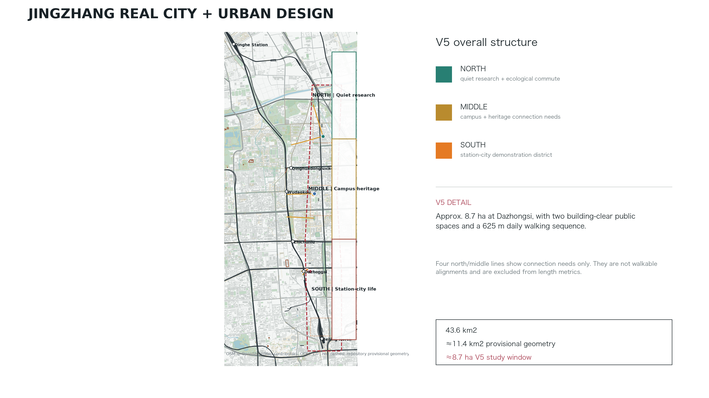
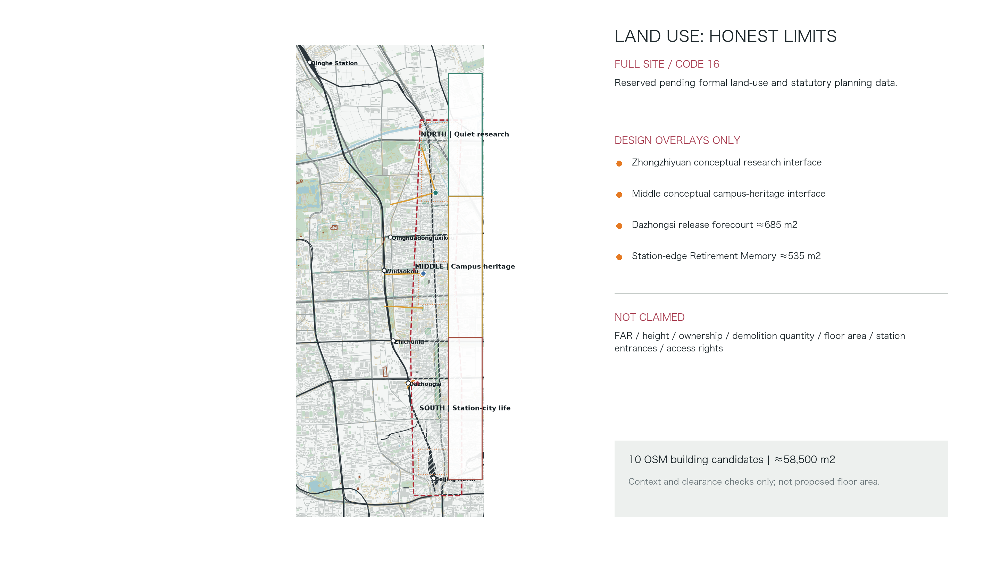
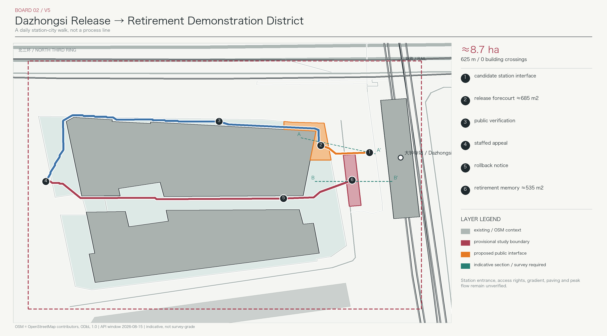
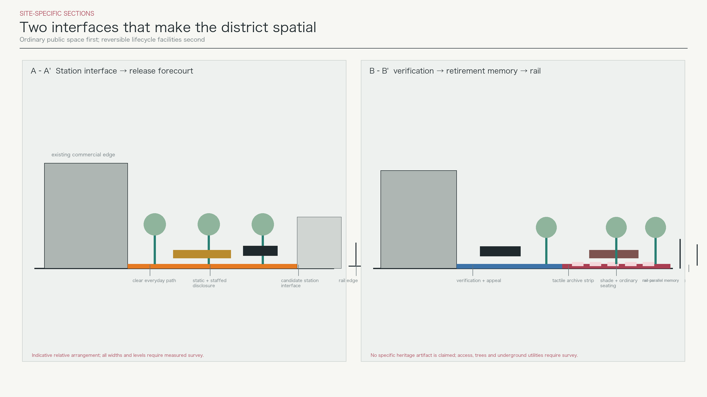
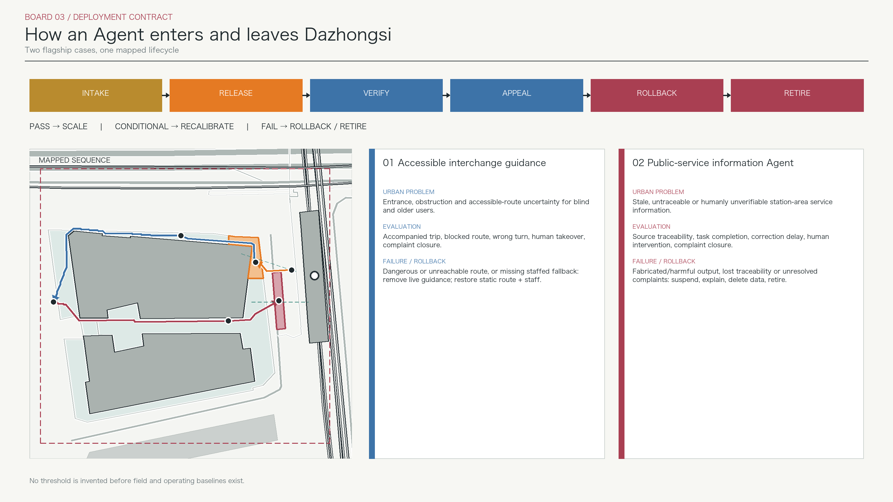

# Jingzhang Civic Calibration Grounds

The proposal begins with a more fundamental test: would this remain a coherent Jingzhang urban design without AI? Its answer is a legible real-city sequence. The north connects Qinghe, the Fifth Ring, innovation gardens and quiet research commuting. The middle foregrounds Jingzhang Railway Heritage Park, Qinghuayuan station memory, university research edges and east-west slow-mobility stitching. The south foregrounds Dazhongsi station, North Third Ring daily life, the Beijing North direction and intensive public interchange. The AI lifecycle overlays only four small public interfaces; it does not replace streets, parks, commuting or ordinary life. [source:JZ-PARK-PHASE2-PLAN] [source:OSM-BBBIKE-BEIJING-20260808] [depth:overall_spatial_structure]

## Design Basis and Source List

The formal task basis is the official announcement, site package, agent taskbook, source registry, schemas and local validators. The overall basemap continues to use the 2026-08-08 OpenStreetMap Beijing extract; the Dazhongsi demonstration district is additionally checked against a 2026-08-15 OSM Map API window for the station, pedestrian precinct, roads and buildings. Both are used under ODbL 1.0 as public background only, not as official survey, road redline, cadastre, station engineering or complete building inventory. [source:SITE-PACKAGE] [source:OSM-BBBIKE-BEIJING-20260808] [source:OSM-API-DAZHONGSI-20260815]

Public data exposes a conflict that must be visible: the OSM-mapped middle Jingzhang Railway Heritage Park sits west of the repository provisional site geometry, with a nearest separation of roughly 0.4 km; the provisional “Dazhongsi key area” is also not the physical Dazhongsi station area. The drawings show real context and the dashed provisional geometry together. Recomputable design polygons remain clipped to repository geometry, while detailed insets use real station and urban-fabric context. This does not erase the conflict; it tells reviewers what must be replaced by organizer data. [data:geometry/site_boundary.geojson#SITE-001] [assumption:A-BOUNDARY-MISMATCH-001] [assumption:A-DAZHONGSI-REALITY-001]

Evidence is separated into official/formal task constraints, background site or policy evidence, provisional computation geometry, and design assumptions. Missing statutory planning, road redlines, ownership, building height and condition, utilities, heritage controls, station engineering and pedestrian surveys are recorded as data gaps and are not inferred from OSM or diagrams. [assumption:A-CONTROLS-001] [depth:risk_missing_data]

## Three-Level Scope Framework

The public 43.6 km² figure is treated as the coordinated research area for industry, ecology, transport and university networks. Approximately 11.4 km² is the projected area of the repository provisional polygon used for GeoJSON topology, clipping and machine recomputation. The former is not a correction of the latter, and the latter is not a statutory redline. Key-area identities come from the taskbook, while their polygons remain provisional; all metrics and layers must be rebuilt when organizer CAD/GIS arrives. [source:OFFICIAL-ANNOUNCEMENT] [assumption:A-SCOPE-436-001] [data:geometry/key_areas.geojson]

The research level reads the relationships among Qinghe and the Fifth Ring, Wudaokou and universities, Dazhongsi and the North Third Ring, and Beijing North. The overall-design level organizes linear heritage, park segments, stations, cross-links and public-space sequence into north, middle and south. The detailed level retains Zhongzhiyuan and the middle segment as conceptual interfaces, but completes a verifiable route design only in the station-west commercial pedestrian area and station-edge walk at Dazhongsi. Four legacy north and middle lines now denote connection needs only, not walkable alignments or length metrics. [data:geometry/roads.geojson] [data:geometry/constraints.geojson#DISTRICT-DZ-STUDY-001] [depth:three_level_scope_framework]

## Coordinated Research Area: Industry and Future City Research

Jingzhang is site-specific because linear infrastructure, university research and multi-station everyday urban life coexist. The railway translated technology into tracks, stations, timetables, maintenance and public travel. Heritage-park renewal then translated retired infrastructure into walking, running, cycling, green space and cultural memory. This design continues that infrastructure-update chain: research interfaces sit in the north and near universities, limited release occurs at a complex station-city transition such as Dazhongsi, and public verification and retirement happen in Jingzhang public space that people already traverse. [source:JZ-PARK-PHASE2-COMPLETE] [source:AI-ORIGIN-COMMUNITY] [depth:existing_conditions_diagnosis]

The Qinghe-Fifth Ring north serves researchers, innovation-park workers and residents through low-noise continuity, ecological buffering and small scheduled pilots. The Wudaokou-Tsinghua East Road-Zhichun Road middle serves students, teachers, residents and visitors through heritage learning, campus-neighborhood stitching, small courtyards and accessibility. The Dazhongsi-North Third Ring-Beijing North south serves commuters, shoppers, residents and visitors through short station access, active ground-floor interfaces, disclosure, appeal and public memory. Intensity increases southward, but every segment first serves ordinary non-AI use. [source:JZ-PARK-PHASE2-PLAN] [data:geometry/green_space.geojson] [depth:overall_spatial_structure]

## Overall Design Area: Urban Renewal and Regulatory-Plan-Level Urban Design

The spatial structure is one real heritage spine, three urban rhythms, three key interfaces and multiple east-west connection needs. The spine follows actual rail and park context rather than being forced into a provisional polygon; the north and middle connections await formal route surveys. V5 resolves only Dazhongsi against mapped buildings, the North Third Ring, station, railway and OSM pedestrian precinct, with two building-clear public spaces and three verifiable walking links. This is competition-level conceptual urban design, not statutory planning, survey-grade detailed design or a construction masterplan. [source:OSM-API-DAZHONGSI-20260815] [data:geometry/roads.geojson#ROAD-DZ-002] [depth:overall_spatial_structure]

Land use uses an honest “full-site blank plus design overlay” method. The entire provisional geometry is code 16, reserved pending formal base data; Zhongzhiyuan research, university learning, Dazhongsi public service and retirement memory appear only in public-space and lifecycle-node layers. The package does not fabricate existing or statutory use. FAR, height, demolition, basement and floor area remain unknown until formal data arrive. [data:geometry/land_use.geojson#LU-RESIDUAL-DATA-GAP] [assumption:A-BUILDING-CONTEXT-001] [depth:land_use_layout]

## Detailed Design of Key Areas

**Zhongzhiyuan Calibration Core.** The official Chinese name is corrected throughout to 众智园. OSM shows candidate research-transfer, mechanical-research and innovation-service buildings, supporting a short sequence from research entrance to shared courtyard and controlled street. The intervention is one courtyard-scale indicative zone with bookable space, human observation, accessibility comparison routes, temporary equipment connections and research-commute links. It is not a new mega-campus. Ownership, condition and exact entrances require building-by-building survey. [data:geometry/buildings.geojson#BLDG-ZZ-001] [data:geometry/constraints.geojson#PUBLIC-ZZ-CAL-001] [assumption:A-BUILDING-CONTEXT-001]

**Dazhongsi Release Gate.** Line 12 opened in 2024, and Dazhongsi links commerce and public services along the North Third Ring with the existing Line 13 setting. V5 therefore derives an approximately 8.7 ha pedestrian study window from the real station-city transition rather than from the lifecycle diagram. Its limits are explained by the North Third Ring south edge, the OSM commercial pedestrian precinct, the station/rail edge and the southern block interface; ownership, formal entrances and all-hours access remain unverified. An approximately 685 m² release forecourt sits within mapped pedestrian space west of the station without covering a building and publishes service scope, operator type, data date, human fallback and appeal location. [source:BJ-LINE12-OPEN-20241215] [data:geometry/public_space.geojson#PUBLIC-DZ-RELEASE-001] [assumption:A-DAZHONGSI-REALITY-001]

**Release → Verification → Appeal → Rollback → Retirement.** An approximately 625 m everyday walking sequence enters the release forecourt from a candidate station public interface, follows mapped commercial pedestrian space around two large buildings to public verification and staffed appeal, then returns along an open edge between buildings to rollback and an approximately 535 m² station-edge retirement-memory walk. It crosses no OSM building, but access rights, gradients, paving and station entrances require field verification. The memory walk uses rail-parallel order, continuous shade, ordinary seating, tactile durable archive strips and non-screen notice slots as an everyday waiting place; no specific heritage artifact is invented. [data:geometry/roads.geojson#ROAD-DZ-003] [data:geometry/public_space.geojson#PUBLIC-RETIRE-001] [assumption:A-RETIREMENT-SPACE-001]

## AI Innovation Ecosystem, Personas, and AI+ Scenarios

Calibration is not testing. A Testing Ground asks whether a system works. Civic Calibration Grounds asks for whom, where and under what public-risk conditions it deserves to run; who verifies it; and when it scales, recalibrates, pauses or retires. The single lifecycle is Problem Intake, Zhongzhiyuan Calibration, Dazhongsi Release Gate, Jingzhang Civic Verification, then PASS/Scale, CONDITIONAL/Recalibrate or FAIL/Rollback/Retirement. [data:geometry/constraints.geojson#NODE-CAL-001] [data:geometry/constraints.geojson#NODE-RELEASE-001] [depth:municipal_new_infrastructure]

V5 details only two Dazhongsi flagship cases. Bounded low-speed service at Zhongzhiyuan and middle-segment heritage interpretation remain in a secondary scenario library and do not occupy the core drawings.

| Calibration field | Dazhongsi accessible interchange guidance | Public-service information Agent release-to-retirement review |
|---|---|---|
| Urban problem and users | Blind and low-vision users, older people, carers and unfamiliar visitors face uncertainty about entrances, temporary obstructions and accessible paths | Commuters, commercial-space users and visitors without an app face stale, untraceable or humanly unverifiable service information |
| Agent action | Compare verified accessible routes, display uncertainty and transfer to staffed support; never replace on-site safety judgment | Answer location, opening and service questions only from an approved, date-stamped directory, show sources and provide paper/staff equivalents |
| Data tiers | Available: OSM station, pedestrian precinct and buildings; potential: obstacle audit; operator-required: entrances, lifts, closures and service desk; missing: gradients, tactile paving, footfall and access rights | Available: public notices and OSM background; potential: verified service directory; operator-required: live availability, closures and complaint handling; prohibited: profiling, payment evidence and unrelated traces |
| Evaluation | Accompanied-trip completion, blocked route, wrong turn/human takeover, failure reporting and complaint closure; no invented threshold before a field baseline | Source traceability, task completion, human intervention, correction delay and complaint closure; no invented threshold before an operating baseline |
| Responsibility and limited release | Registered mobility-information operator + station/public-space manager + staffed fallback; release only after entrance verification, equivalent static route and uncertainty disclosure | Registered public-information operator + site manager + staffed service desk + independent complaint handling; release only with an approved bounded directory, no profiling and a non-digital equivalent |
| Public verification, failure and rollback | Users correct the service at release, verification and appeal points; dangerous/unreachable routes or absent human fallback remove live guidance and restore static routes and staffed service | Users challenge sources at the verification point; fabricated/harmful information, lost traceability or repeated unresolved complaints suspend service, publish reasons at rollback and trigger data deletion and retirement review |

Both cards map one-to-one to the masterplan nodes, but remain discussable deployment contracts rather than evidence of an existing operator, data authorization, site permission or measured performance. [data:geometry/constraints.geojson#CASE-DZ-ACCESS-001] [metric:detailed_flagship_case_count] [assumption:A-AI-DATA-001]

## Land Use, Building Scale, and Retain-Renovate-Demolish Strategy

The spatial model uses no abstract copied masses and retains ten selected OSM existing-context candidates, together approximately 58,500 m². `buildings.geojson` counts only six candidates inside the provisional site, approximately 23,100 m². Four Dazhongsi station-area candidates sit outside that machine boundary and remain in `constraints.geojson` as map context for route and public-space clearance; they do not enter the site-wide building-area metric. They are neither a complete inventory nor proposed construction. Retain, repair, adapt or selectively remove decisions require ownership, use, structure, fire safety, heritage value and ground-floor-publicness surveys. [data:geometry/buildings.geojson] [data:geometry/constraints.geojson#BLDG-DZ-001] [metric:building_footprint_area_sqm]

The renewal rule is to retain fabric, open interfaces and add small pieces instead of replacing the district with large objects. V5 proposes no demolition of mapped Dazhongsi buildings; it organizes routes through open inter-building and station-edge interfaces. Retirement Memory uses reversible paving, seating, shade, archive strips and a staffed service table rather than an isolated landmark building. Height, FAR and above or below-ground floor area remain unknown. [depth:retain_renovate_demolish] [depth:height_massing_character] [metric:floor_area_ratio]

## Transport, Rail, Municipal Infrastructure, and Public Services

The proposal separates daily commuting, commercial walking and the lifecycle route overlaid on them. The formal length metric counts only three designed Dazhongsi pedestrian links, together approximately 625 m; they avoid four selected building footprints and have zero intersections within the downloaded OSM building window. Four north and middle lines are only conceptual network relations, not walkable alignments and not counted in length. Formal entrances, access rights, gradients, tactile paving, crossings and footfall still require field and engineering evidence. [data:geometry/roads.geojson] [metric:road_centerline_length_m] [assumption:A-DAZHONGSI-REALITY-001]

Municipal design avoids a generic smart-pole array. Near-term facilities are ordinary urban essentials: accessible surfaces, lighting, shade, seating, bicycle parking, staffed service, static wayfinding and fallback during power or network failure. Sensors, edge computing or Agent interfaces enter only as removable layers after need, authorization, maintenance and exit are established. Power, communication, drainage, fire safety and underground engineering remain data gaps. [depth:traffic_rail_slow_parking] [depth:municipal_new_infrastructure] [assumption:A-CONTROLS-001]

## Blue-Green Network, Public Space, and Urban Character

The green layer selects only six traceable OSM candidates, together about 208,000 m²; it does not claim total district green area or a 31% ratio. The north uses Xiaoyuehe and Qinghe-direction green space for quiet commuting and thermal buffering. The middle uses Chendu Garden, Weishi Garden and heritage-park context for learning and crossing. The south uses Yuandadu heritage-park context for station-city daily life. Any edge clipped by the provisional polygon is explicitly not a statutory park boundary. [data:geometry/green_space.geojson] [metric:green_space_area_sqm] [assumption:A-OSM-BASE-001]

Public space is not a homogeneous AI corridor: the north is quiet, the middle is for learning and crossing, and the south is for arrival, disclosure and memory. Machine area counts only the two V5 designed public spaces cleared of buildings, together approximately 1,220 m². Legacy Zhongzhiyuan and middle polygons are downgraded to conceptual intervention zones and no longer pose as public-space boundaries or enter the ratio. Retirement Memory uses rail-parallel paving rhythm, continuous shade, ordinary seating, tactile plates, physical archive slots and public tables so residents uninterested in AI can still sit, walk, wait and read. [data:geometry/public_space.geojson] [metric:public_space_area_sqm] [depth:blue_green_public_space]

## Renewal Projects, Implementation Policy, and Phasing

The near-term package contracts to the Dazhongsi demonstration district: verify entrances, access rights and gradients first; then conduct accompanied accessibility audits, mark a temporary release forecourt, install a staffed appeal table and build a 1:1 reversible Retirement Memory sample. If any site or operating condition fails, the project remains on paper. Medium- and long-term phases retain only data-completion tasks for Zhongzhiyuan, the middle and north, without presenting undesigned alignments as projects. Triggers are formal base data, field survey, operator responsibility, public deliberation and funding. [data:geometry/phasing.geojson#PHASE-001] [depth:phasing_implementation] [assumption:A-COST-001]

Responsibilities are operator types, not invented commitments: district coordination protects public interest; station, street, park and campus operators manage sites; registered service operators own system performance; third-party evaluators and accessibility representatives join calibration; residents retain feedback, appeal and human alternatives. Cost remains unknown until survey, quantities, ownership, procurement and operations are defined. [metric:construction_cost_cny] [assumption:A-COST-001] [depth:renewal_project_list]

## Metrics, Area Recalculation, and Compliance Matrix

Structured metrics use EPSG:4548 and retain three decimals for machine verification; human materials use sensible significant figures. Approximately 11.4 km² is provisional site geometry. Six selected OSM building candidates inside it total about 23,100 m², while four Dazhongsi station-area buildings are out-of-boundary map context only. Six selected green candidates total about 208,000 m²; two V5 building-clear public spaces about 1,220 m²; and three Dazhongsi pedestrian links about 625 m. These are totals of selected layer objects, not district-wide statistics, statutory controls or construction commitments. [metric:site_area_sqm] [metric:building_footprint_area_sqm] [metric:public_space_area_sqm]

In `design_depth_matrix.json`, complete means only that a formal task has an evidenced response or an explicit, located data-gap response. The honest current depth is **competition-level conceptual urban design based on a public basemap, not statutory planning or survey-grade detailed design**. For intensity, height, municipal systems, ownership, heritage and cost, the deliverable is a transparent limit and recalculation path, not a fabricated conclusion. [assumption:A-DESIGN-DEPTH-V5-001] [depth:metrics_recalculation] [depth:risk_missing_data]

## Risk, Copyright, and Compliance

The highest spatial risks are misalignment between provisional geometry and real Jingzhang space, plus unverified access rights, entrances, gradients and peak footfall in the Dazhongsi commercial pedestrian precinct. Implementation risks are missing road redlines, station engineering, building ownership, heritage controls and utilities. Governance risks are unmandated operators, personal-data misuse, unanswered appeals and unavailable human fallback. Building-conflict audit, small reversible design, non-digital equivalence, release conditions and rollback reduce but cannot remove these data gaps. [assumption:A-BOUNDARY-MISMATCH-001] [assumption:A-DAZHONGSI-REALITY-001] [assumption:A-AI-DATA-001]

Original text, layout and design layers follow the package license. OSM context is attributed © OpenStreetMap contributors and used under ODbL 1.0. No commercial map tile or uncleared site photograph is used. Public-source facts are summarized with attribution; no copyright claim is made over underlying third-party data. [source:OSM-BBBIKE-BEIJING-20260808] [source:SOURCE-REGISTRY]

## References

The full index is in `sources.json`. Core references are the official call and site package; public materials on Jingzhang Railway Heritage Park; Line 12 opening and Dazhongsi station-city integration; Beijing AI Origin Community; urban-renewal and accessibility policy; and the ODbL OpenStreetMap extract and Dazhongsi API window. Background sources never replace official redlines, cadastre, survey, station engineering, access rights or heritage-control data. [source:OFFICIAL-ANNOUNCEMENT] [source:HD-LINE12-STATION-CITY-202411] [source:OSM-API-DAZHONGSI-20260815]
