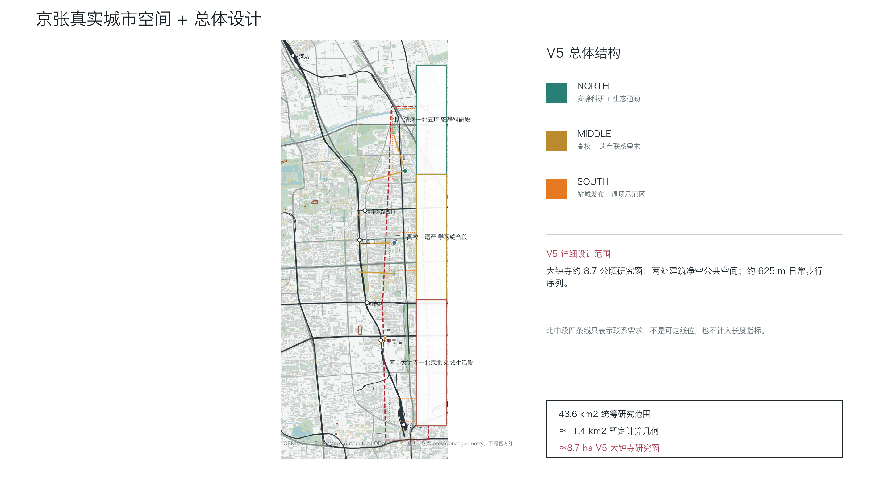
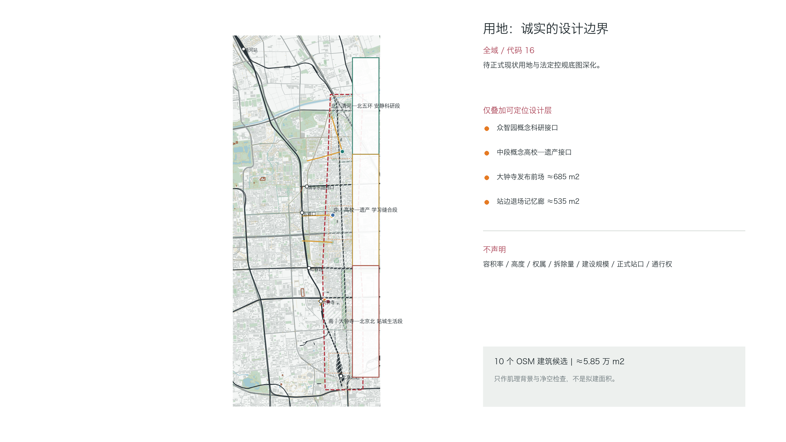
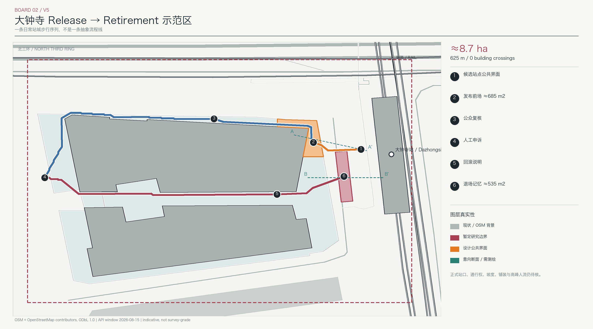
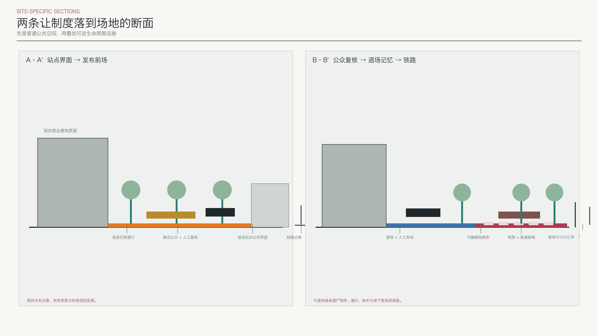
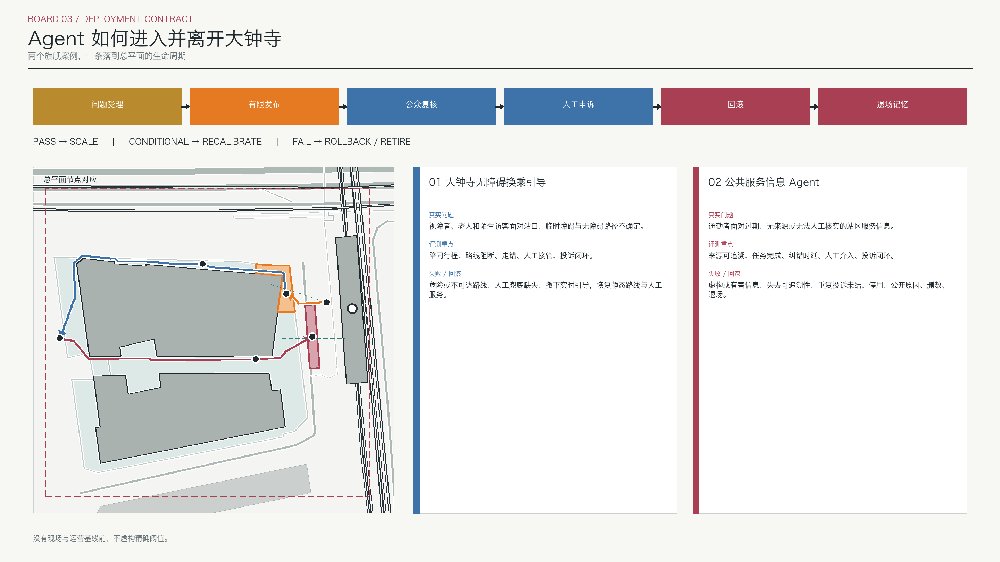

# 京张城市校准场

方案先回答一项更基本的问题：即使拿掉 AI，这是否仍是一份成立的京张城市设计？答案建立在一条真实可读的城市空间序列上：北段把清河、北五环、园区与安静科研通勤连接起来；中段以京张铁路遗址公园、清华园站记忆、高校科研界面和东西慢行缝合为主体；南段以大钟寺站、北三环生活界面、北京北站方向和高强度公共转换为主体。AI 校准生命周期只在四处小尺度公共界面叠加，不取代街道、公园、通勤与日常生活。[source:JZ-PARK-PHASE2-PLAN] [source:OSM-BBBIKE-BEIJING-20260808] [depth:overall_spatial_structure]

## 设计依据与资料清单

正式任务依据是官方公告、site package、agent taskbook、source registry、schema 与本地校验脚本。总体底图继续使用 2026-08-08 OpenStreetMap 北京提取；大钟寺示范区另以 2026-08-15 OSM Map API 小窗口复核站点、步行空间、道路和建筑。两者遵循 ODbL 1.0，只作公共背景，不是官方测绘、道路红线、地籍、站点工程图或完整建筑普查。[source:SITE-PACKAGE] [source:OSM-BBBIKE-BEIJING-20260808] [source:OSM-API-DAZHONGSI-20260815]

公开数据揭示了一项必须正面表达的矛盾：OSM 所示京张铁路遗址公园中段位于仓库 provisional site geometry 西侧，最近约 0.4 km；仓库暂定“大钟寺重点区”也不等于真实大钟寺站区。图件同时画出真实城市背景与虚线暂定边界，正式可复算设计面仍裁切在仓库暂定几何内，但重点区放大以真实站点和城市肌理为认知基线。这不是消除数据冲突，而是让评委看见冲突并知道哪些判断需要正式资料替换。[data:geometry/site_boundary.geojson#SITE-001] [assumption:A-BOUNDARY-MISMATCH-001] [assumption:A-DAZHONGSI-REALITY-001]

资料分四级使用：official/formal 约束任务；background 解释场地与政策；provisional 支撑暂时复算；design assumption 表达建议。缺失的正式控规、道路红线、权属、建筑高度与状况、市政、文保控制线、站点工程图和人流调查均登记为 data gap，不从 OSM 或示意图反推。[assumption:A-CONTROLS-001] [depth:risk_missing_data]

## 三层范围工作框架

43.6 km² 是公开公告中的统筹研究范围，用于产业、生态、交通和高校科研网络判断；≈11.4 km² 是仓库 provisional polygon 的投影面积，用于本包 GeoJSON 拓扑、设计层裁切和机器复算。前者不是后者的“官方真实面积”，后者也不是法定红线。三处重点区身份来自任务书，其多边形仍是 provisional；取得组织方正式 CAD/GIS 后，所有面积、位置和图层必须重算。[source:OFFICIAL-ANNOUNCEMENT] [assumption:A-SCOPE-436-001] [data:geometry/key_areas.geojson]

总体研究层看北部清河—北五环、五道口与高校科研区、大钟寺—北三环、北京北站方向之间的创新与公共生活联系；总体设计层把京张线性遗产、公园分段、站点、东西跨越和公共空间序列组织为北—中—南三段；重点设计层保留众智园与中段概念接口，但只在大钟寺站西侧商业步行空间和站边步道完成可核查路线设计。北部和中部四条旧线现仅表示联系需求，不再作为可走线位或长度指标。[data:geometry/roads.geojson] [data:geometry/constraints.geojson#DISTRICT-DZ-STUDY-001] [depth:three_level_scope_framework]

## 统筹研究范围产业与未来城市研究

京张的场地特异性来自“线性基础设施 + 高校科研 + 多站点日常城市”的共存。铁路曾把技术变成线路、车站、时刻、维护和公共出行；遗址公园又把退役基础设施转化为步行、慢跑、骑行、绿地和文化记忆。今天的设计不复制科技园区，而是继续这条基础设施更新链：研发在北部和近校界面发生，有限发布在大钟寺这样的复杂站城转换处发生，公众复核与技术退场在每天有人经过的京张公共空间中发生。[source:JZ-PARK-PHASE2-COMPLETE] [source:AI-ORIGIN-COMMUNITY] [depth:existing_conditions_diagnosis]

北部清河—北五环段面向研究者、园区员工与周边居民，空间策略是低噪、连续慢行、生态缓冲和预约式小规模试用；中部五道口—清华东路—知春路段面向学生、教师、社区居民和访客，空间策略是遗产学习、校园—街区东西缝合、可停留小院与日常无障碍；南部大钟寺—北三环—北京北方向面向通勤者、消费者、居民和游客，空间策略是短距离站点进入、首层公共界面、发布公示、反馈申诉和公共记忆。三段强度递增，但都首先服务非 AI 的日常使用。[source:JZ-PARK-PHASE2-PLAN] [data:geometry/green_space.geojson] [depth:overall_spatial_structure]

## 总体设计范围城市更新与控规深度城市设计

总体空间结构是“一条真实遗产脊柱、三段城市节奏、三处重点接口、多条东西联系需求”。遗产脊柱沿实际铁路和公园背景读取，不强行压入 provisional polygon；北部与中部的联系需求等待正式路径调查。V5 只在大钟寺以现状建筑、北三环、站点、铁路和 OSM 商业步行空间为底，落实两处建筑净空公共空间和三段可复核步行线；这是 competition-level conceptual urban design，不是法定控规、测绘级详细设计或施工总平面。[source:OSM-API-DAZHONGSI-20260815] [data:geometry/roads.geojson#ROAD-DZ-002] [depth:overall_spatial_structure]

用地采用“全域留白 + 设计层叠加”的诚实表达。整个 provisional geometry 使用代码 16 记录“待正式底图深化”，不虚构全域现状用地或法定用途；众智园科研接口、高校学习界面、大钟寺站城公共服务和退场记忆仅在公共空间与生命周期节点图层中表达。开发强度、建筑高度、容积率、拆改留和地下空间在正式资料到位前不量化，只提出首层开放、庭院共享、边界透化、存量优先和逐栋调查的更新原则。[data:geometry/land_use.geojson#LU-RESIDUAL-DATA-GAP] [assumption:A-BUILDING-CONTEXT-001] [depth:land_use_layout]

## 重点区域详细设计

**众智园 Calibration Core。** 官方名称统一为“众智园”。OSM 显示其周边存在科研转化、机电研究和创新服务类现状建筑候选，适合形成从科研楼入口、共享庭院到受控街道的一组短距离接口。设计不是新建巨型园区，而是以约一个院落尺度的 indicative zone 组织可预约庭院、人工观察点、无障碍对照路线、设备临时接入和从清华东路西口、北部公园到园区的科研通勤。建筑权属、状况和精确入口必须逐栋调查后决定。[data:geometry/buildings.geojson#BLDG-ZZ-001] [data:geometry/constraints.geojson#PUBLIC-ZZ-CAL-001] [assumption:A-BUILDING-CONTEXT-001]

**大钟寺 Release Gate。** 12 号线已于 2024 年开通，大钟寺站连接北三环沿线商业、公共服务与既有 13 号线场景；V5 因此从真实站城转换条件，而非生命周期图，推导约 8.7 公顷步行研究窗。设计边界由北三环南缘、OSM 商业步行空间、站点/铁路边缘和南侧街坊界面解释；产权、正式站口和全天开放仍待核。约 685 m² 发布前场位于站西侧已映射步行空间内，不覆盖建筑，用于公开服务范围、责任类型、数据日期、人工兜底和申诉位置。[source:BJ-LINE12-OPEN-20241215] [data:geometry/public_space.geojson#PUBLIC-DZ-RELEASE-001] [assumption:A-DAZHONGSI-REALITY-001]

**Release → Verification → Appeal → Rollback → Retirement。** 一条约 625 m 的日常步行序列从候选站点公共界面进入发布前场，沿既有商业步行空间绕开两栋大体量建筑，到达公众复核点和人工申诉点，再沿建筑间开放边缘返回回滚点与约 535 m² 站边退场记忆廊。路线不穿越 OSM 建筑，但通行权、坡度、铺装和站口必须现场复核。记忆廊以平行铁路的线性秩序、连续遮荫、普通座椅、可触摸耐久档案条和无屏公告槽形成日常等候空间；不虚构具体遗产构件。[data:geometry/roads.geojson#ROAD-DZ-003] [data:geometry/public_space.geojson#PUBLIC-RETIRE-001] [assumption:A-RETIREMENT-SPACE-001]

## AI 创新生态、人才画像与 AI+ 场景

Calibration 不等于测试。Testing Ground 只问系统能否工作；Civic Calibration Grounds 询问它针对什么人、在什么地点、在何种风险和公共条件下值得运行，由谁验证，何时扩大、重新校准、暂停或退场。唯一生命周期是：Problem Intake → 众智园 Calibration → 大钟寺 Release Gate → 京张 Civic Verification → PASS/Scale、CONDITIONAL/Recalibrate 或 FAIL/Rollback/Retirement。[data:geometry/constraints.geojson#NODE-CAL-001] [data:geometry/constraints.geojson#NODE-RELEASE-001] [depth:municipal_new_infrastructure]

V5 只深化两个大钟寺旗舰案例；众智园低速服务与中段遗产解释保留为 secondary scenario library，不进入核心图面。

| 校准字段 | 大钟寺无障碍换乘引导 | 公共服务信息 Agent 发布—退场复核 |
|---|---|---|
| 城市问题与用户 | 视障者、老人、照护者和陌生访客面对站点入口、临时障碍与无障碍路径不确定 | 通勤者、商业空间使用者和不使用 App 的访客面对过期、无来源或无法人工核实的服务信息 |
| Agent 动作 | 比较经核无障碍路线，显示不确定性并转接人工服务；不替代现场安全判断 | 只依据获批且标日期的目录回答地点、开放与服务问题，显示来源并提供纸本/人工等价 |
| 数据分级 | 已有：OSM 站点、步行空间、建筑；潜在：障碍审计；需运营者：入口、电梯、关闭和服务台；缺失：坡度、盲道、人流、通行权 | 已有：公开通知与 OSM 背景；潜在：经核服务目录；需运营者：实时可用性、关闭与投诉处置；禁止：画像、支付凭证和无关轨迹 |
| 评测 | 陪同行程完成、路线阻断、走错/人工接管、失败报告与投诉闭环；无现场基线前不设伪阈值 | 来源可追溯、任务完成、人工介入、纠错时延和投诉闭环；无运营基线前不设伪阈值 |
| 责任与有限发布 | 注册出行信息运营者 + 站点/公共空间管理者 + 有人值守兜底；核实入口、等价静态路线和不确定性公示后才限时限区发布 | 注册公共信息运营者 + 场地管理者 + 人工服务台 + 独立投诉处理；仅在目录获批、范围受限、无画像和非数字等价成立时发布 |
| 公众复核、失败与回滚 | 使用者在发布门、复核点和申诉点纠错；危险/不可达路线或人工兜底缺失即撤下实时引导，恢复静态路线与人工服务 | 使用者在复核点质询来源；虚构/有害信息、失去可追溯性或重复投诉未结即停用，在回滚点说明原因并进入数据删除与退场复核 |

两张卡都与总平面节点一一对应，但仍是可讨论的部署契约，不代表已有运营者、数据授权、场地许可或实测绩效。[data:geometry/constraints.geojson#CASE-DZ-ACCESS-001] [metric:detailed_flagship_case_count] [assumption:A-AI-DATA-001]

## 用地、建筑规模与拆改留方案

空间模型不使用抽象复制体块，共保留 10 个 OSM 现状候选基底，合计约 5.85 万㎡。其中 `buildings.geojson` 只统计 provisional site 内 6 个候选，约 2.31 万㎡；大钟寺四个站区候选位于该机器范围之外，作为地图上下文保存在 `constraints.geojson`，用于检验路线与公共空间净空，不进入全域建筑面积指标。它们不是完整建筑普查或拟建面积。任何拆改留决策均须完成权属、使用、结构、消防、历史价值和首层公共性调查。[data:geometry/buildings.geojson] [data:geometry/constraints.geojson#BLDG-DZ-001] [metric:building_footprint_area_sqm]

更新原则是“保留存量肌理优先、补小不造大”。V5 不提出拆除大钟寺现状建筑，而在建筑之间与站边开放界面组织路线；退场记忆采用可逆铺装、座椅、遮荫、档案条和人工服务桌，不以独立地标建筑占用公共空间。建筑高度、容积率、地上地下规模均为 unknown，不生成伪精确。[depth:retain_renovate_demolish] [depth:height_massing_character] [metric:floor_area_ratio]

## 交通、轨道、市政与公共服务设施

方案区分日常通勤、商业步行与叠加其上的生命周期路径。正式长度指标只计算大钟寺三段设计步行线，合计约 625 m；路线绕行四个选定建筑基底，并在已下载的 OSM 建筑窗口内复核为零穿越。北部和中部四条线仅为 conceptual network relation，不是步行线位，也不计入长度。正式站口、通行权、坡度、盲道、过街和人流仍需现场与工程资料深化。[data:geometry/roads.geojson] [metric:road_centerline_length_m] [assumption:A-DAZHONGSI-REALITY-001]

市政层不新造“智慧杆阵列”。短期设施是普通城市也需要的：连续无障碍面、夜间照明、遮荫座椅、自行车停放、人工服务点、清晰静态导向和应急断电/网络失效下的替代流程。传感器、边缘计算或 Agent 接口只有在必要性、授权、维护责任和退出方案成立时，才作为可拆卸附加层进入；供电、通信、排水、消防和地下工程仍是 data gap。[depth:traffic_rail_slow_parking] [depth:municipal_new_infrastructure] [assumption:A-CONTROLS-001]

## 蓝绿空间、公共空间与城市风貌

`green_space.geojson` 只选择 6 处 OSM 可追溯绿地候选，合计约 20.8 万㎡，不宣称全域绿地总量或 31% 绿地率。北段利用小月河与清河方向的绿地承担安静通勤、雨热缓冲和低互动停留；中段利用晨读园、唯实园和遗址公园背景承担学习与穿越；南段利用元大都城垣遗址公园等城市绿地背景承接站城生活。被 provisional boundary 裁切的边缘明确标注不等于公园法定边界。[data:geometry/green_space.geojson] [metric:green_space_area_sqm] [assumption:A-OSM-BASE-001]

公共空间不是均质 AI 长廊：北段“静”，中段“学与穿”，南段“到达、公开与记忆”。机器面积只计算 V5 两处已排除建筑的设计公共空间，合计约 1,220 m²；众智园和中段旧多边形降级为概念介入范围，不再冒充公共空间边界或进入比例。退场记忆使用平行铁路的铺装节奏、连续树荫、普通座椅、可触摸铭牌、实体档案槽和公共桌面，让不关心 AI 的居民也能坐、走、等候和阅读。[data:geometry/public_space.geojson] [metric:public_space_area_sqm] [depth:blue_green_public_space]

## 更新项目清单、实施政策与分期计划

近期项目包收缩为大钟寺示范区：先核站口、通行权和坡度，再做无障碍同行审计、发布前场临时标记、人工申诉台与退场记忆廊 1:1 可逆样段；任一场地或运营条件不成立即停在纸面。中期和远期仍保留众智园、中段与北段的数据补齐任务，但不把未设计线位包装成工程。每一期的触发条件是正式底图、场地调查、运营责任、公共协商和资金机制到位。[data:geometry/phasing.geojson#PHASE-001] [depth:phasing_implementation] [assumption:A-COST-001]

责任主体采用类型而非虚构机构承诺：区级统筹部门负责规则与公共利益；站点/街道/园区/公园运营者负责场地；注册服务运营者负责系统；第三方评估与无障碍代表参与校准；社区与使用者拥有反馈、申诉和人工替代入口。成本保持 unknown，只在测绘、工程量、权属、采购和运维模式明确后估算。政策工具可包括城市更新项目库、公共空间微更新、存量建筑适应性利用、政府采购中的退出条款和运营绩效公开。[metric:construction_cost_cny] [assumption:A-COST-001] [depth:renewal_project_list]

## 指标体系、面积复算与合规矩阵

结构化指标使用 EPSG:4548 复算并保留三位小数；人读材料采用合理有效数字。≈11.4 km² 是 provisional site geometry；其内 6 个选择性 OSM 建筑候选约 2.31 万㎡，另有 4 个大钟寺站区建筑仅作范围外地图上下文；6 处选择性绿地背景约 20.8 万㎡；V5 两处建筑净空公共空间约 1,220 m²；三段大钟寺步行线约 625 m。它们都是当前图层对象，不是全域现状统计、法定指标或建设承诺。[metric:site_area_sqm] [metric:building_footprint_area_sqm] [metric:public_space_area_sqm]

`design_depth_matrix.json` 中的 complete 仅表示“该正式任务项已经由实际成果或明确 data-gap 回应并可定位证据”。当前诚实深度是 **competition-level conceptual urban design based on a public basemap, not statutory planning or survey-grade detailed design**。开发强度、建筑高度、市政、权属、文保和成本的成果是数据缺口与后续计算路径，不是伪造结论。[assumption:A-DESIGN-DEPTH-V5-001] [depth:metrics_recalculation] [depth:risk_missing_data]

## 风险、版权与合规说明

最高空间风险是 provisional geometry 与真实京张空间错位，以及大钟寺商业步行区的通行权、站口、坡度和高峰人流未核；最高实施风险是道路红线、站点工程、建筑权属、文保控制和市政资料缺失；最高治理风险是运营者未授权、个人数据滥用、投诉无回应和人工兜底缺失。方案通过建筑冲突审计、小尺度可逆设计、非数字等价、发布条件和回滚机制降低风险，但不能消除数据缺口。[assumption:A-BOUNDARY-MISMATCH-001] [assumption:A-DAZHONGSI-REALITY-001] [assumption:A-AI-DATA-001]

原创文本、图件排版与设计图层按本包声明许可；OSM 背景数据署名 © OpenStreetMap contributors，依 ODbL 1.0 使用。图件不使用商业地图瓦片和未清权现场照片。公共资料中的文字与事实均以摘要引用，不主张对第三方底层数据的版权。[source:OSM-BBBIKE-BEIJING-20260808] [source:SOURCE-REGISTRY]

## 参考资料

正式与背景来源完整索引见 `sources.json`。核心依据包括官方征集公告与 site package、京张铁路遗址公园公开资料、12 号线开通及大钟寺站城融合公开资料、北京 AI 原点社区、城市更新政策、无障碍法规，以及 ODbL 许可的 OpenStreetMap 提取与大钟寺 API 小窗口。任何背景源都不替代正式红线、地籍、测绘、站点工程、通行权和文保控制资料。[source:OFFICIAL-ANNOUNCEMENT] [source:HD-LINE12-STATION-CITY-202411] [source:OSM-API-DAZHONGSI-20260815]
