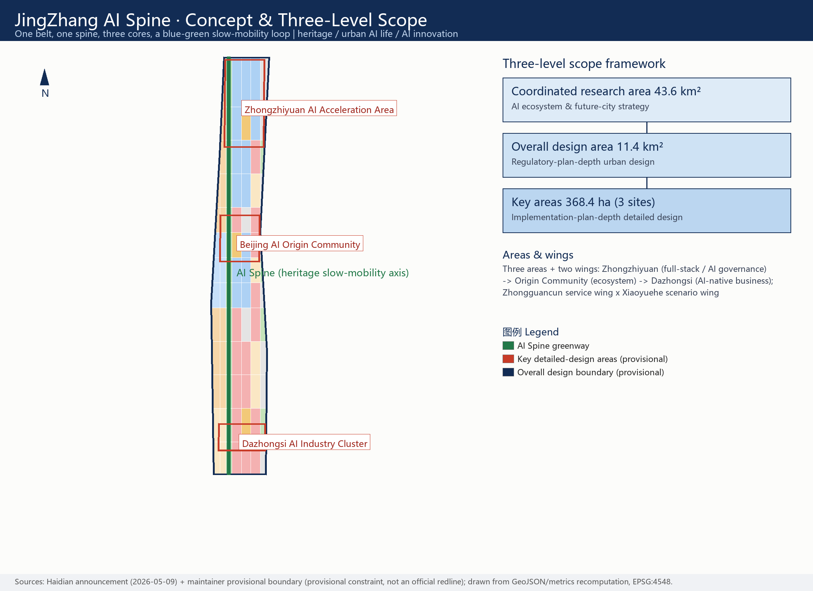
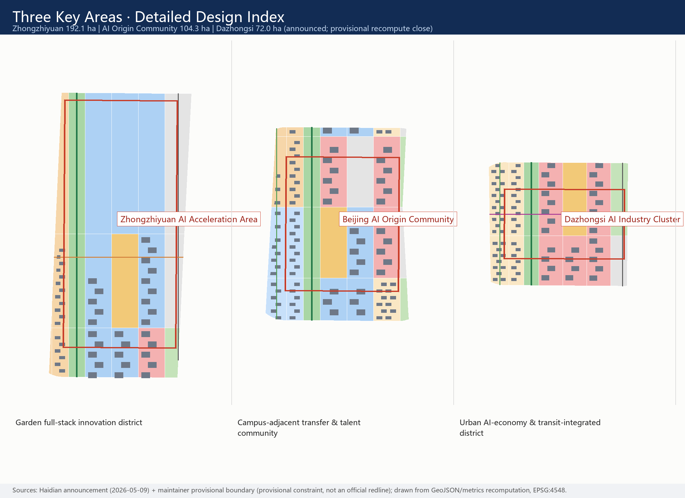
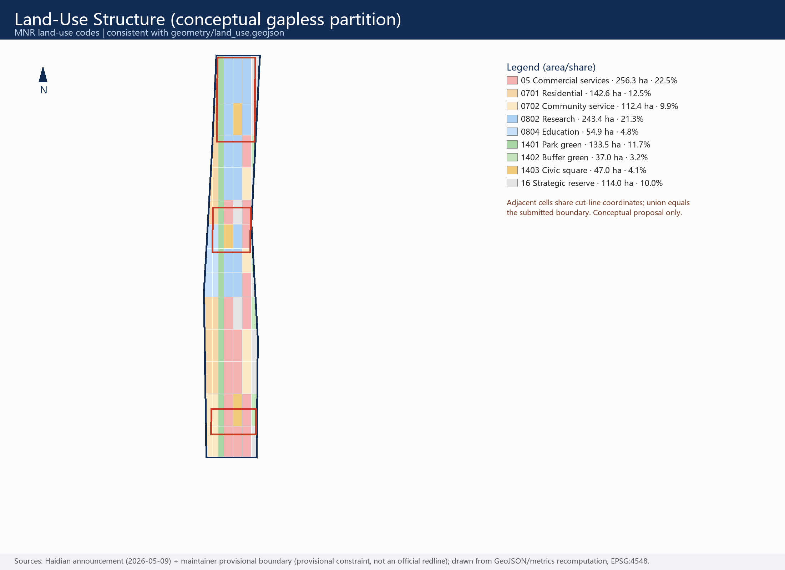
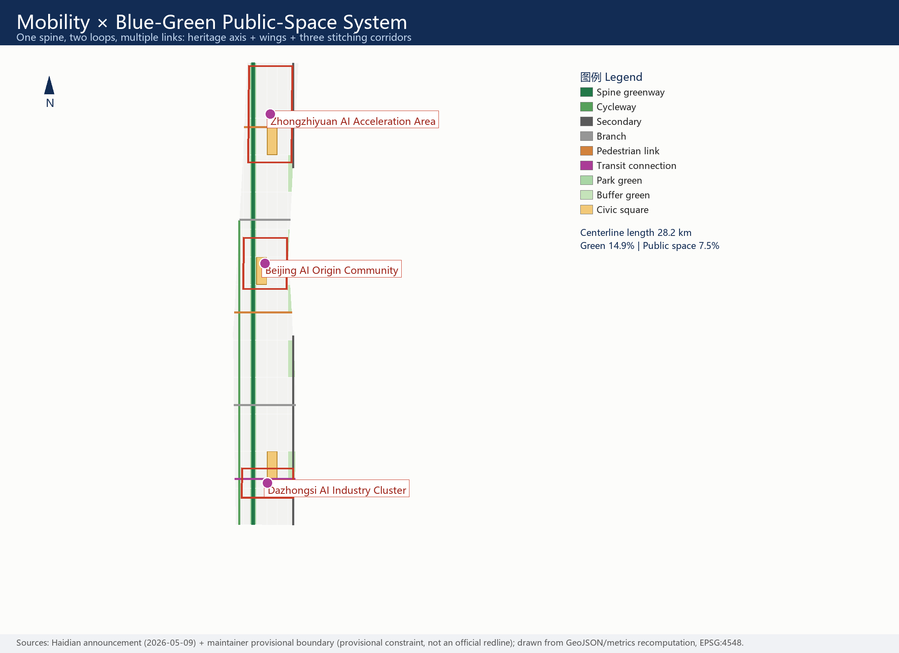
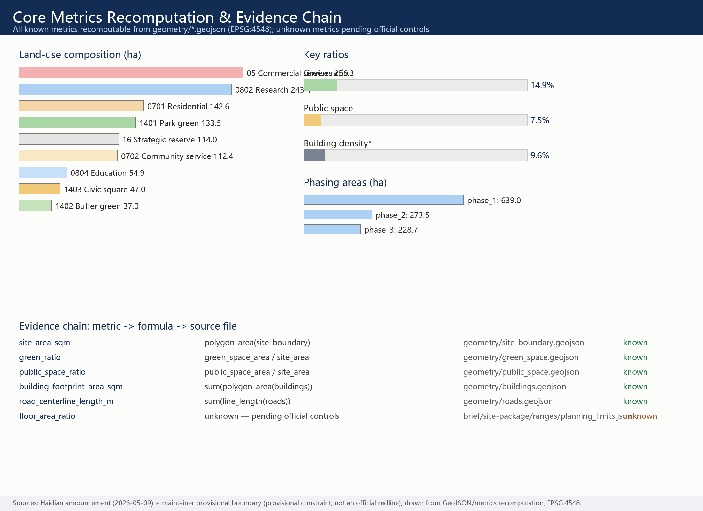

# JingZhang AI Spine: An AI Innovation Community on a Century-old Rail Corridor

**Primary name: 京张智脊 (JingZhang AI Spine)**

One-sentence concept: turn the urban corridor left by the first railway independently built by Chinese engineers in 1909 into the first "AI Spine" co-built by agents and humans from 2026 onward — heritage as the root, open source as the pulse, scenarios as the leaves, and operation as the fruit.

## Design Basis and Source Inventory

This proposal takes the prequalification announcement issued by the Haidian Branch of the Beijing Municipal Commission of Planning and Natural Resources as its primary basis [source:OFFICIAL-ANNOUNCEMENT] [standard:PROJECT-OFFICIAL-ANNOUNCEMENT], and fully responds to the agent open-call taskbook: ten co-creation principles, three positionings, five functions, three areas plus two wings, and six agent tasks [source:AGENT-TASKBOOK] [standard:PROJECT-AGENT-OPEN-CALL-TASKBOOK]. Machine-readable inputs come from the site package [source:SITE-PACKAGE]; source-use boundaries follow the public source registry [source:SOURCE-REGISTRY].

Source-use statement: only public or cleared materials are used; `data/processed/agent_fact_pack.md` serves only as a reading-navigation layer, not a new authority [source:PROCESSED-FACT-PACK]. Background-only and provisional-only materials are never promoted into statutory evidence; every area figure is recomputed from this package's GeoJSON in EPSG:4548, never copied from narrative text.

**Honest boundary statement (affects the whole document):** when this package was generated, no official precise boundary or key-area polygons had been published by the organizer. The proposal therefore uses the maintainer's provisional rough boundary [data:geometry/site_boundary.geojson#SITE-001] [data:geometry/key_areas.geojson#PROV-KEY-001]. It is a provisional constraint — not an official redline, approval basis, or precise-area basis; the organizer's data gap does not block content scoring. Once official geometry is published, land use, roads, green space, public space, buildings, phasing and all metrics will be recomputed as a whole, not patched piecemeal.

## Three-Level Scope Framework

The work follows the three scope levels defined by the announcement [standard:PROJECT-OFFICIAL-ANNOUNCEMENT] [depth:three_level_scope_framework]:

| Level | Size | Core question answered | Evidence anchor |
| --- | --- | --- | --- |
| Coordinated research area | 43.6 km² | How the AI ecosystem and future-city form are organized | Innovation-chain framework, case studies, mechanism proposals |
| Overall design area | 11.4 km² | How renewal structure, land use, mobility, blue-green and character are mapped | [data:geometry/land_use.geojson#LU-001] [metric:site_area_sqm] |
| Key detailed-design areas | 368.4 ha (3 sites) | How the three sites reach detailed-design depth | [data:geometry/key_areas.geojson#PROV-KEY-001] [depth:three_key_area_detailed_design] |

The three levels are not three isolated drawings: research decides the industry-chain and urban-form judgments; the overall design translates them into a gapless land-use partition, slow-mobility network, blue-green system and phasing; key-area design verifies implementability of functions, buildings, traffic, public space and AI scenarios. All levels share one spatial skeleton — **one spine, three cores, two wings, multiple nodes** [depth:overall_spatial_structure]:

- **One spine**: the JingZhang AI Spine — a heritage slow-mobility axis (greenway) along the old rail corridor, running north-south through the whole design area [data:geometry/roads.geojson#ROAD-001];
- **Three cores**: Zhongzhiyuan AI Acceleration Area (full-stack autonomy / AI governance), Beijing AI Origin Community (innovation ecosystem), Dazhongsi AI Industry Cluster (AI-native business);
- **Two wings**: the Zhongguancun technology-service wing (global factor allocation, IP and capital empowerment) and the Xiaoyuehe scenario-empowerment wing (scenarios and vibrant city), as a conceptual synergy loop that draws no new redlines;
- **Multiple nodes**: operable nodes corresponding to the 12 AI scenario cards, distributed along the spine, cores and corridors.

Planning-innovation idea (for professional deepening): use the "scenario unit" as the space-industry fusion interface of comprehensive planning — each scenario card binds a spatial carrier, an operating body and a governance boundary, so that industrial indicators and territorial land-use codes can converse on the same unit instead of a two-step "zone first, attract later" logic [standard:MNR-LAND-USE-CLASSIFICATION-GUIDE].

## Research-Area Industry and Future-City Strategy

### Global AI Ecosystem Case Studies (8)

All cases are compiled from publicly available sources and are used to distill spatial and institutional lessons; nothing here is a commitment about local investment attraction [source:AGENT-TASKBOOK]:

| Case | Core mechanism | Lesson for the AI Spine |
| --- | --- | --- |
| Silicon Valley–Stanford (US) | University wellspring + venture density + open-source culture | Campus-adjacent tech transfer at the Origin Community is the scarcest asset |
| Kendall Square, Boston (US) | Mixed campus-industry interface, public ground floors | Slow-mobility stitching matters more than new towers |
| King's Cross Knowledge Quarter (UK) | Rail-heritage regeneration + institutional anchors | Heritage is not a backdrop; it is the ecosystem's trust anchor |
| MaRS–Waterfront, Toronto (CA) | Neutral incubation platform + data-governance pilots | Data-element scenarios need a neutral "compliance salon" |
| Tel Aviv (IL) | Dense startups + technology transfer + global roadshows | An international roadshow lounge is standard for outward ecosystems |
| Nanshan, Shenzhen (CN) | Hardware piloting + supply-chain speed | Dazhongsi can host smart-device piloting and display |
| Zhangjiang, Shanghai (CN) | Full-stack layout + big-science facilities + institutional innovation | Zhongzhiyuan's full-stack system needs a standards-and-governance showcase |
| Station F, Paris (FR) | Mega-incubator + event operation | The event system itself is spatial productivity |

The shared conclusion of the eight cases: the spatial formula of an AI ecosystem is not "a bigger park" but "denser interfaces" — campus-industry, industry-city, culture-industry and domestic-international interfaces. The AI Spine lands this formula on a 9-km linear corridor.

### Ecosystem Map and Factor Mechanisms

The innovation chain is organized as five loops: "campus wellspring → open-source collaboration → pilot acceleration → scenario validation → international communication", matching spine, cores and wings [depth:overall_spatial_structure]. Factor-mechanism proposals (conceptual advice, not policy commitments): land and space rely mainly on stock renewal; capital relies on the existing Zhongguancun technology-service network rather than new promises; talent is answered by the Origin Community talent-service package; compute explores new-infrastructure prototypes such as edge-compute posts; data uses a compliant, authorized and auditable data-element salon as its interface; scenarios are provided as public goods through belt-wide open test-validation scenarios.

Future-city judgment: AI changes not a single function but the "folding of time" — research, testing, display, consumption and daily life switch at high frequency within the same block. The proposal therefore emphasizes fine-grained mixed use and slow-mobility reachability rather than single-function zoning [data:geometry/land_use.geojson#LU-001] [metric:green_ratio].

## Overall Design Area: Renewal and Regulatory-Plan-Depth Urban Design

The overall design area is organized at the urban-design depth of a regulatory detailed plan [standard:MOHURD-CONTROL-DETAILED-PLANNING] [depth:land_use_layout]. Spatial generation follows a strict protocol: lock the provisional boundary and constraints first [data:geometry/constraints.geojson#CONSTRAINTS]; then split the boundary into 90 land-use cells with one cut-line network (adjacent cells share boundary coordinates; their union equals the submitted boundary); derive green space, public space, building footprints, roads and phasing from that partition; finally recompute all metrics in EPSG:4548 [depth:metrics_recalculation].

**Overall renewal structure:** one spine (heritage slow-mobility axis), three cores (key areas), two belts (west campus-community belt, east industry-service belt), multiple nodes (scenario nodes). Underused-space identification uses three conceptual criteria — corridor breakpoints, inactive frontages, closed ground floors — as leads for professional teams, not demolition conclusions [depth:retain_renovate_demolish].

**Land-use structure (conceptual proposal):** research approx. 243.4 ha (21.3%), commercial services approx. 256.3 ha (22.5%), residential and community service approx. 255.0 ha (22.4%), park and buffer green approx. 170.5 ha (14.9%), civic squares approx. 47.0 ha (4.1%), strategic reserve approx. 114.0 ha (10.0%) [data:geometry/land_use.geojson#LU-001] [metric:land_use_area_by_code_sqm]. The reserve land is deliberate: elasticity for the unforeseeable forms of the AI industry.

**Building scale and intensity:** 600 concept building footprints totaling approx. 1.092 million sqm express the intent of "retain first, renovate preferred, new-build pointwise" [data:geometry/buildings.geojson#BLDG-001] [metric:building_footprint_area_sqm]. Statutory indicators — FAR, building height, density control, setback — are missing from the public site package and are uniformly marked "pending official data" (unknown); no guessed value is posed as an approved control [metric:floor_area_ratio].

**Carrying capacity:** mobility, municipal and new-infrastructure strategies are given in the facilities chapter; all engineering conclusions (pipelines, capacity, load) are listed as preconditions for formal deepening.

## Key Areas Detailed Design

The three key areas are developed at the urban-design depth of a comprehensive implementation plan [depth:three_key_area_detailed_design], with spatial evidence from the three provisional key-area boundaries [data:geometry/key_areas.geojson#PROV-KEY-001] [data:geometry/key_areas.geojson#PROV-KEY-002] [data:geometry/key_areas.geojson#PROV-KEY-003].

**Zhongzhiyuan AI Acceleration Area (announced approx. 192.1 ha) — a garden-type full-stack innovation district.** Spatial moves: strengthen the Qinghe waterfront interface with a low-carbon innovation gallery; take Zhongzhi Square (AI-governance showcase) as the civic core; arrange small- and medium-scale courtyard research units around the Spine. Industry and operation scenarios: open testing of self-developed models, standards workshops, safety-governance showcase, low-carbon compute experience. Dependencies: river blueline, ecology, flood control and external traffic review — all pending official data.

**Beijing AI Origin Community (announced approx. 104.3 ha) — a campus-adjacent transfer and talent community.** Spatial moves: a campus-park-block slow-mobility stitch; Origin Square (open-source release) as the spiritual landmark; ground floors tilted toward release, talent services and open-source collaboration; housing supplemented by talent apartments and community services. Scenarios: open-source release hall, transfer street, talent-zone services, campus-adjacent incubation. Dependencies: campus boundaries, ownership and existing-building conditions.

**Dazhongsi AI Industry Cluster (announced approx. 72.0 ha) — an urban AI-economy and international-exchange district.** Spatial moves: station integration and four-quadrant pedestrian connection at Dazhongsi (concept lines); Zhongsi Square (international roadshow) as the core public node; ground floors open to smart-device display, content consumption and data-element services. Scenarios: agent and smart-device showcase, data-element salon, international roadshow lounge. Dependencies: station, junction and municipal pipeline review.

The retain/renovate/demolish classification in all three key areas is conceptual advice (intent is written into building-layer attributes), not parcel-level conclusions [data:geometry/buildings.geojson#BLDG-001].

## AI Ecosystem, Talent Personas and AI+ Scenarios

### User Personas (6)

| Persona | Typical needs | Spatial response | Governance boundary |
| --- | --- | --- | --- |
| Open-source developers | release, collaboration, testing, reputation | Origin release hall, public code wall, night collaboration spaces | no personal trajectory collection; aggregate statistics only |
| Startup teams | low-cost offices, compute access, testbeds | shared test field at Zhongzhiyuan, edge-compute posts | compute/data services require separate authorization |
| Corporate visitors | showcase, business, international reception | Dazhongsi roadshow lounge, station connections | corporate marks and cases must be rights-cleared |
| Nearby residents | commuting, leisure, low-disturbance renewal | heritage-park slow loop, embedded community services | resident profiles never used for commercial recommendation |
| University members | tech transfer, cross-campus collaboration | transfer street, campus-park stitch | campus data and research results require authorization |
| International visiting scholars | short stays, cross-cultural work, city experience | roadshow lounge, multilingual guides, event weeks | entry/residence services follow existing regulations |

### AI Scenario Cards (12)

| Card | Spatial carrier | Core design |
| --- | --- | --- |
| 01 Open-source Release Hall | Origin Community · Origin Square | releases, contribution showcase, small roadshows |
| 02 AI Governance Sandbox | Zhongzhiyuan · Zhongzhi Square | visitable collaboration node for standards, safety eval, red-teaming |
| 03 Edge-compute Post | nodes along the Spine | new-infrastructure prototype tied to public service and low-carbon energy |
| 04 AI Slow-mobility Guide | heritage park vitality belt | explainable wayfinding, low-intrusion sensing for breakpoint detection |
| 05 Global Roadshow Lounge | Dazhongsi · Zhongsi Square | showcase, negotiation, media release, international exchange |
| 06 Qinghe Low-carbon Gallery | Zhongzhiyuan riverfront | green space, stormwater, cycling and AI display combined |
| 07 Campus Transfer Street | Origin Community | incubation, legal, IP and funding services |
| 08 Data-element Salon | Dazhongsi area | compliant, authorized, auditable data-element interface |
| 09 AI Life-service Street | community retail junction | fine-grained AI+ pilots in health, education, legal and daily services |
| 10 Global AI Week Route | belt public-space system | walkable route from heritage to open source, industry and roadshows |
| 11 Heritage Night-light Run | Jing-Zhang heritage park | night vitality with graded lighting safety |
| 12 Accessible AI Tour | belt-wide | multilingual accessible guide with human-service fallback |

Scenario-card and persona counts are registered in the metrics system [metric:scenario_card_count] [metric:persona_count]. All scenarios follow one governance boundary: data minimization, public sources, explainability and human review; no unauthorized personal profiling; no test scenario is described as approved operation. Where generative-AI services are offered to the public, the Interim Measures for generative AI services are cited only within their applicable scope [standard:GENERATIVE-AI-INTERIM-MEASURES]; accessible scenarios keep the human-service boundary [standard:BARRIER-FREE-ENVIRONMENT-LAW] and the policy direction that traditional and smart services run in parallel for the elderly [standard:ELDERLY-SMART-TECH-PLAN-2020-45].

**Industry test-validation scenarios (3):** (1) open testing ground for self-developed models (Zhongzhiyuan); (2) smart-device pilot street (Dazhongsi); (3) compliant data-element circulation sandbox (Dazhongsi). All three are conceptual advice and constitute no operating approval; privacy and human-review boundaries are published together with the scenario cards for professional and regulatory deepening.

## Land Use, Building Scale and Retain/Renovate/Demolish

Land use adopts the national territorial-space classification codes; no self-invented categories are used [standard:MNR-LAND-USE-CLASSIFICATION-GUIDE]. The partition is complete, closed and seamless: 90 cells generated by one cut-line network share boundary coordinates with their neighbors, leaving no unlabeled space [data:geometry/land_use.geojson#LU-001].

The building strategy is "retain first, renovate preferred, new-build pointwise": residential and education cells carry mainly retention intent; research and commercial cells carry renovation intent; new-build intent appears only around squares and corridor nodes. Every concept footprint records its type and renewal intent in layer attributes [data:geometry/buildings.geojson#BLDG-001]. Height, massing, frontage and character guidance follow the depth items [depth:height_massing_character], but with official height controls missing, only character directions are given — no numeric claims [depth:development_intensity_controls].

Recomputation anchors: total concept footprint and building density are directly checkable from layers [metric:building_footprint_area_sqm] [metric:building_density]; total floor area and FAR are pending official data [metric:total_floor_area_sqm].

## Traffic, Rail, Municipal and Public-Service Facilities

The mobility strategy is "one spine, two loops, multiple links" [depth:traffic_rail_slow_parking]: the Spine greenway runs north-south; the west cycleway links campuses and communities; the east secondary road carries industrial micro-circulation; three east-west stitching corridors serve the Dazhongsi station quadrant links, the Origin Community campus-park stitch and the Zhongzhiyuan Qinghe walk gallery [data:geometry/roads.geojson#ROAD-001]. All roads are concept centerlines whose total length is recomputable [metric:road_centerline_length_m]; no redline, alignment or engineering-feasibility conclusions are made. Rail-station integration proposes only functional and pedestrian organization; station engineering conditions await official material.

Municipal and new infrastructure [depth:municipal_new_infrastructure]: edge-compute posts, distributed-energy interfaces and stormwater-composite green spaces are proposed as prototypes; conventional municipal capacity and routing (water, power, gas, fire) are all listed as preconditions for formal deepening, with no engineering calculation. Public-service facilities are arranged around the talent-service package (housing, education, health, international services); service-radius suggestions await official population and facility data.

## Blue-Green Space, Public Space and Urban Character

The blue-green system takes the heritage-park vitality belt as its skeleton [depth:blue_green_public_space]: continuous park green along the Spine, buffer green along the eastern edge, three civic squares (Zhongzhi, Origin, Zhongsi) as public cores, and the Spine slow-mobility public corridor tying them into a walkable, rideable network [data:geometry/green_space.geojson#GREEN-001] [data:geometry/public_space.geojson#PUBLIC-001]. Green ratio and public-space ratio are recomputable [metric:green_ratio] [metric:public_space_ratio]. Blueline/greenline data for Qinghe and Xiaoyuehe are missing; waterfront strategies are conceptual and pending official data.

**AI pilgrimage landmarks (3, conceptual advice):** (1) the "Herringbone Rail" origin monument — public art derived from Zhan Tianyou's switchback at the historic Qinghuayuan station; (2) the Zhongzhiyuan "Governance Lighthouse" — a tower-pavilion translating AI standards and governance results into a visitable exhibit; (3) the Dazhongsi "Intelligent Bell" — a sound installation where the traditional bell resonates with live open-source data streams. The landmarks link to a "contributor honor wall" system that keeps a writable honor interface for global developers and builders [metric:ai_landmark_count]. Landmarks must not be over-entertaining and must pass heritage and public-art professional review.

**Cultural fusion narrative (agent.5):** the Jing-Zhang Railway stands for the first century of "independent engineering" — in 1909 Chinese engineers crossed the mountains with their own herringbone solution; Zhongguancun stands for the second wave of "independent innovation" — from electronics street to mass entrepreneurship; AI new culture should be the third wave — open, co-governed, human-centered. The spatial storyline runs along the Spine: heritage memory (south) → open-source present (middle) → future governance (north). Signage direction: rail bronze-green plus neural indigo, station-sign wayfinding echoing railway language; international communication line: "Where the First Railway Meets the Next Intelligence". Cultural expression must not distort history or use portraits, trademarks or copyrighted material without authorization; the cultural signage system and the belt Logo system are managed in separate layers.

**Visual identity and Logo direction (agent.1):** the master mark concept combines the herringbone rail and a neuron — the switchback angle is simultaneously a link between neural nodes; the extended system covers wayfinding, scenario cards, event visuals and the honor wall. This proposal offers directional description only and uses no unauthorized fonts, images or trademarks; the final Logo should be completed by a professional team on rights-cleared fonts and original graphics.

Urban character coordination follows the Urban Design Management Measures for public space and building height, massing, style and color [standard:MOHURD-URBAN-DESIGN-MEASURES]; where heritage control lines are missing, no pseudo-precise expression is made [data:geometry/constraints.geojson#CONSTRAINTS].

## Renewal Project List, Policies and Phasing

Renewal project list (conceptual advice; dependencies marked) [depth:renewal_project_list]:

| No. | Project | Type | Concept phase | Main dependencies |
| --- | --- | --- | --- | --- |
| JZ-01 | Heritage-park slow-link stitching | public space / traffic | Phase 1 | redlines, underpass space, traffic review |
| JZ-02 | Zhongzhiyuan Qinghe innovation interface | blue-green / showcase | Phase 3 | river blueline, ecology, flood control |
| JZ-03 | Origin Community campus transfer street | renewal / industry service | Phase 1 | campus boundary, ownership, ground-floor uses |
| JZ-04 | Dazhongsi station quadrant walk links | transit integration / slow | Phase 1 | station, junctions, utilities |
| JZ-05 | AI public-service and edge-compute nodes | new infrastructure | Phase 2 | energy, compute, safety, operator |
| JZ-06 | Global AI week public route | operation / brand | ongoing | space permits, event safety, cleared IP |

Phasing advice is "south start — middle upgrade — north completion" in three bands; spatial extents are in the phasing layer [data:geometry/phasing.geojson#PHASE-001] [metric:phasing_area_sqm]; phasing is conceptual and actual sequencing follows formal approval and implementing bodies [depth:phasing_implementation]. Near-term actions can start with light facilities, operations and service platforms (JZ-01, JZ-06); capital-heavy projects must wait for formal regulatory, municipal, traffic and ownership conditions.

**Global AI event system and long-term operation (agent.6):** annual calendar proposal — spring "Global AI Open-source Developer Conference", summer "AI Scenario Open Days", autumn "JingZhang AI Innovation Week" (flagship), winter "Spine Light Run" community event; brand IP runs in layers with the "JingZhang AI Spine" master brand plus event sub-brands; the developer community takes the release hall as its physical anchor, the honor wall as its reputation mechanism and open days as its conversion entry; scenario open-operation follows a four-step "apply — evaluate — open — review" loop with published test boundaries and human-review rules; conversion pathways cover talent (events → community → settlement intent), enterprises (roadshow → scenario validation → service matching) and developers (contribution → honor → incubation). All of the above are operation-mechanism proposals, not government commitments or confirmed arrangements.

## Indicators, Area Recomputation and Compliance Matrix

Indicators are managed in three classes [depth:metrics_recalculation]:

- **Class one — spatial indicators directly recomputable from submitted geometry**: overall design area approx. 11.41 km² [metric:site_area_sqm], green ratio approx. 14.9% [metric:green_ratio], public-space ratio approx. 7.5% [metric:public_space_ratio];
- concept building footprints approx. 1.092 million sqm [metric:building_footprint_area_sqm], road/slow-mobility centerlines approx. 28.2 km [metric:road_centerline_length_m], key-area count 3 [metric:key_area_count];
- **Class two — control indicators needing official regulatory plans or brief annexes** (FAR, height, setback), uniformly marked "pending official data" [metric:floor_area_ratio] [metric:building_height_m];
- **Class three — performance indicators needing continuous operational calibration** (scenario usage, event participation), written as operation advice outside any approval scope.

The compliance matrix is the master file of task responsiveness: every mandatory announcement task in sections 1.3, 1.4 and 1.5 and every agent task agent.1–agent.6 is mapped to chapters, layers, metrics, drawings, HTML, sources, assumptions and self-check items; see `compliance_matrix.json` for full coverage, `standard_matrix.json` for professional-standard responses and `design_depth_matrix.json` for design-depth evidence.

## Risk, Copyright and Compliance Statement

**Boundary statement:** this proposal is entirely open co-creation advice; it does not replace formal planning and constitutes no government approval conclusion. All spatial suggestions are "conceptual advice / reference schemes / material for professional deepening". No claim of official approval, approved regulatory plan, final land ownership, final construction scale or guaranteed implementation is made.

**Main risks and gaps** [depth:risk_missing_data]: (1) official boundary and key-area polygons are not public — provisional geometry is used and labeled throughout; (2) statutory controls (FAR, height, density, setback, green-ratio control) are missing — listed as unknown in the metrics file [metric:floor_area_ratio]; (3) road redlines, municipal, heritage and ownership data are missing — related conclusions are downgraded to pending items [data:geometry/constraints.geojson#CONSTRAINTS]; (4) case studies are second-hand compilations from public sources, used for lessons, not investment forecasts.

**Copyright and assets:** all figures, HTML and PDFs are generated programmatically by this agent from its own GeoJSON and metrics; no third-party images, font files or trademarks are used; Chinese glyph rendering uses the operating-system bundled font (Microsoft YaHei) for display only; the full asset and license statement is in `report/copyright_statement.md`. The visual style follows a technical-schematic / blueprint professional direction [source:SITE-PACKAGE].

**Bilingual and accessibility:** this file is the English counterpart of the Chinese primary `proposal.md`; the A3 booklet, A0 boards, visualization page and every text-bearing figure provide paired language versions, following the event terminology glossary.

## References

- Prequalification announcement, Haidian Branch of Beijing Municipal Planning and Natural Resources Commission (2026-05-09) [source:OFFICIAL-ANNOUNCEMENT]
- Agent open-call taskbook excerpt (user-provided, cleared) [source:AGENT-TASKBOOK]
- Site package and public source registry [source:SITE-PACKAGE] [source:SOURCE-REGISTRY]
- Provisional boundary geometry and derivation notes [source:BOUNDARY-SOURCE] [source:KEY-AREA-SOURCE]
- Reading-navigation layer (non-authoritative) [source:PROCESSED-FACT-PACK]
- Full machine indexes: `sources.json`, `metrics.json`, `compliance_matrix.json`, `standard_matrix.json`, `design_depth_matrix.json`, `assumptions.json`
