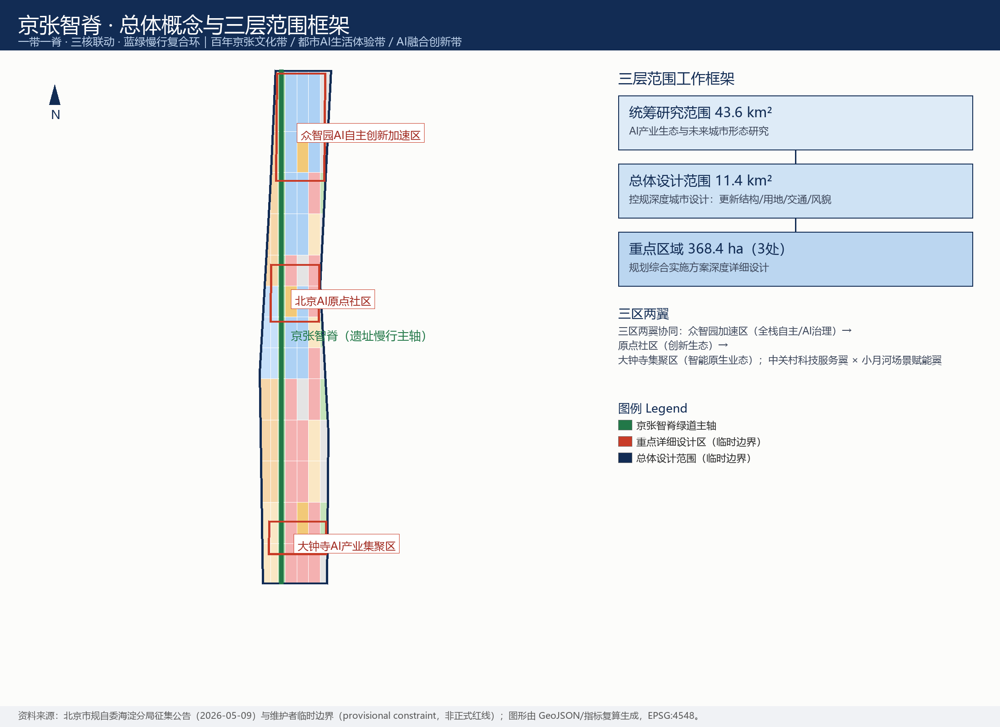
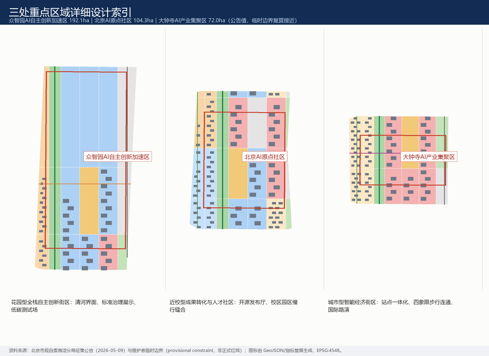
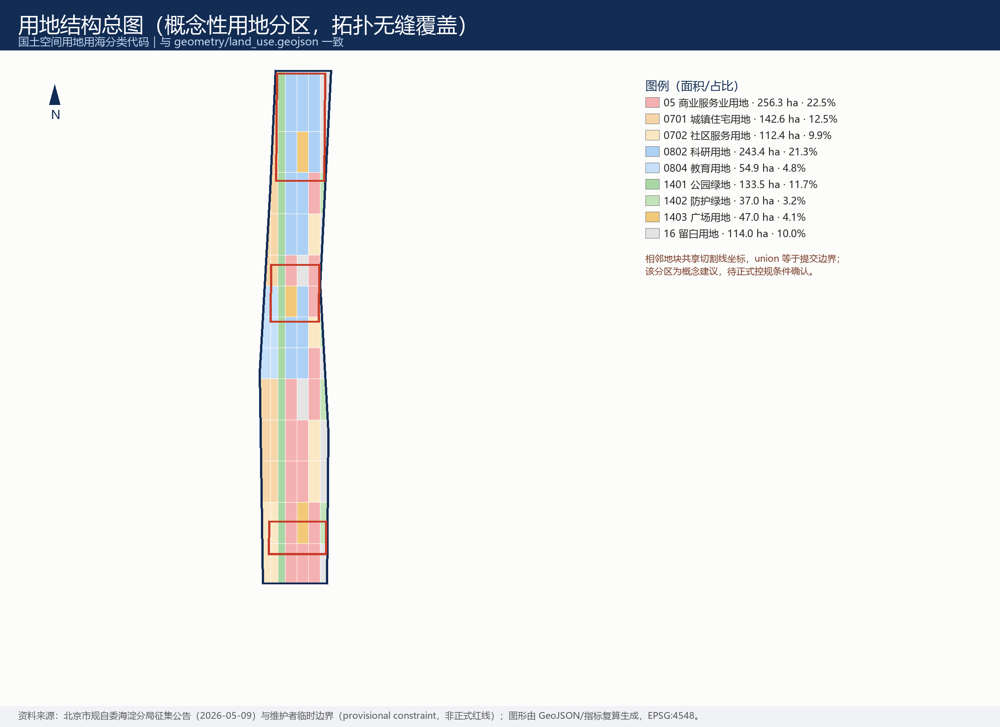
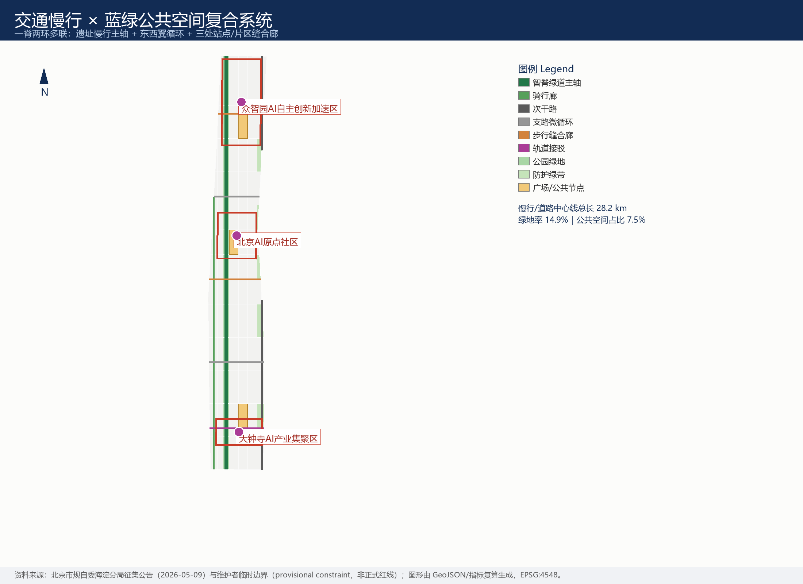
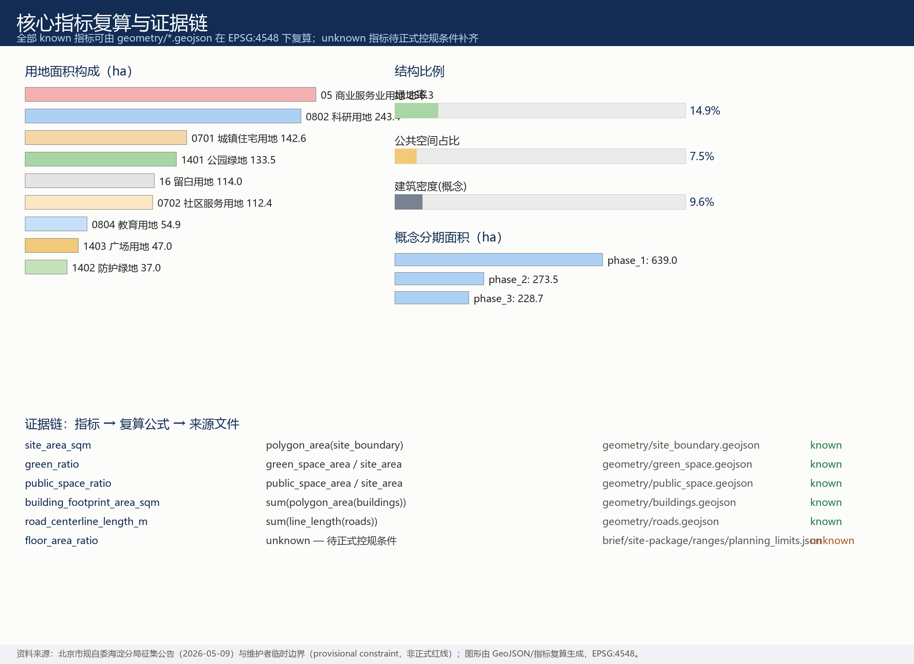

# 京张智脊：百年轨廊上的AI创新共同体

**主名称：京张智脊｜英文名称：JingZhang AI Spine**

一句话概念：把1909年中国人自主修建的第一条铁路留下的城市廊道，变成2026年起全球智能体与人类共建AI城市的第一条"智脊"——遗址是根，开源是脉，场景是叶，运营是果。

## 设计依据与资料清单

本方案以北京市规划和自然资源委员会海淀分局发布的《百年京张AI创新带城市设计国际方案征集资格预审公告》为第一依据 [source:OFFICIAL-ANNOUNCEMENT] [standard:PROJECT-OFFICIAL-ANNOUNCEMENT]，并完整响应面向全球智能体开源征集任务书的十条共创原则、三大定位、五大功能、三区两翼与六项 agent 任务 [source:AGENT-TASKBOOK] [standard:PROJECT-AGENT-OPEN-CALL-TASKBOOK]。机器可读依据来自 `brief/site-package/` 的场地包 [source:SITE-PACKAGE]，公开资料用途边界以来源登记注册表为准 [source:SOURCE-REGISTRY]。

资料使用边界声明：本方案只使用公开或清权资料；`data/processed/agent_fact_pack.md` 仅作为阅读导航层，不构成新的权威来源 [source:PROCESSED-FACT-PACK]。背景级与临时级资料未被升级为法定依据；所有面积类数值均从本包 GeoJSON 在 EPSG:4548 下复算，不从叙述文本抄录。

**边界状态的诚实声明（影响全篇）：** 截至本包生成时，组织方尚未公开官方精确边界与重点区 polygon，本方案采用维护者提供的临时粗略边界 [data:geometry/site_boundary.geojson#SITE-001] [data:geometry/key_areas.geojson#PROV-KEY-001]。该边界为临时约束范围（provisional constraint），不得作为正式红线、审批依据或精确面积依据；组织方数据缺口本身不阻断内容评分。一旦官方边界发布，用地、道路、绿地、公共空间、建筑、分期与全部指标将整体复算，而非局部替换。

## 三层范围工作框架

方案按公告确定的三层范围组织 [standard:PROJECT-OFFICIAL-ANNOUNCEMENT] [depth:three_level_scope_framework]：

| 层级 | 规模 | 本方案回答的核心问题 | 证据落点 |
| --- | --- | --- | --- |
| 统筹研究范围 | 43.6 km² | AI产业生态与未来城市形态如何组织 | 创新链框架、案例研究、机制建议（本章与下一章） |
| 总体设计范围 | 11.4 km² | 更新结构、用地、交通、蓝绿、风貌如何落图 | [data:geometry/land_use.geojson#LU-001] [metric:site_area_sqm] |
| 重点区域范围 | 368.4 ha（3处） | 三处片区如何达到详细设计深度 | [data:geometry/key_areas.geojson#PROV-KEY-001] [depth:three_key_area_detailed_design] |

三层不是三张孤立的图：统筹研究层决定产业链与城市形态判断；总体设计层把判断转译为拓扑无缝的用地分区、慢行网络、蓝绿系统与分期；重点区域层验证具体片区中功能、建筑、交通、公共空间与AI场景的可实施性。三层的空间骨架是同一个结构——**一脊三核两翼多点** [depth:overall_spatial_structure]：

- **一脊**：京张智脊——沿京张旧线廊道的遗址慢行主轴（绿道），南北贯通总体设计范围 [data:geometry/roads.geojson#ROAD-001]；
- **三核**：众智园AI自主创新加速区（全栈自主/AI治理）、北京AI原点社区（创新生态）、大钟寺AI产业集聚区（智能原生业态）；
- **两翼**：中关村科技服务翼（要素全球化配置、IP与资本赋能）× 小月河场景赋能翼（场景赋能与活力城市），作为概念性协同回路，不新增红线；
- **多点**：12张AI场景卡对应的可运营节点，分布在脊、核、廊道之上。

规划创新思路（供专业团队深化研究）：以"场景单元"作为综合规划的空间-产业融合接口——每个场景卡同时绑定空间载体、运营主体与治理边界，使产业规划指标与国土空间用地代码可以在同一单元上对话，而不是先画地、后招商的两段式逻辑 [standard:MNR-LAND-USE-CLASSIFICATION-GUIDE]。

## 统筹研究范围产业与未来城市研究

### 全球AI创新生态案例研究（8例）

以下案例均来自公开可查资料，用于提炼空间与机制经验，不涉及对本地招商结果的任何承诺 [source:AGENT-TASKBOOK]：

| 案例 | 核心机制 | 对京张智脊的启示 |
| --- | --- | --- |
| 硅谷-斯坦福（美国） | 大学策源+风投密度+开源文化 | 原点社区的"近校成果转化"是最稀缺资产 |
| 肯德尔广场（波士顿） | 校企界面混合、首层公共化 | 校区-园区慢行缝合比新建楼宇更重要 |
| 国王十字知识区（伦敦） | 铁路遗产再生+机构锚定 | 遗址不是背景板，而是生态的信任锚点 |
| 多伦多 MaRS- Waterfront | 中立孵化平台+数据治理试验 | 数据要素场景需要"合规会客厅"式中立空间 |
| 特拉维夫（以色列） | 高密度初创+军队技术转化+全球路演 | 国际路演客厅是外向型生态的标配 |
| 深圳南山（中国） | 硬件中试+供应链速度 | 大钟寺可承接智能终端中试与展示 |
| 上海张江（中国） | 全栈布局+大科学装置+制度创新 | 众智园的全栈自主体系需要标准与治理展示界面 |
| 巴黎 Station F（法国） | 单体巨型孵化器+活动运营 | 活动体系本身就是空间生产力 |

八例的共同结论是：AI生态的空间公式不是"更大的园区"，而是"更密的界面"——校企界面、产城界面、文产界面、国内外界面。京张智脊把这条公式落在一条9公里级的线性廊道上。

### 创新生态图谱与要素机制

创新链组织为"高校策源 → 开源协作 → 中试加速 → 场景验证 → 国际传播"五环，与空间结构的脊、核、翼一一对应 [depth:overall_spatial_structure]。要素机制建议（概念建议，非政策承诺）：土地与空间以城市更新存量挖潜为主；资金依托中关村既有科技服务网络而非新设承诺；人才以"原点社区"人才服务包回应；算力以端侧算力驿站等新型基础设施原型探索；数据以合规授权、可审计的数据要素会客厅为界面；场景以全域开放的测试验证场景为公共品。

未来城市形态判断：AI改变的不是单一功能，而是"时间的折叠"——研发、测试、展示、消费、生活在同一街区内高频切换。因此本方案在总体设计范围强调小尺度混合用地与慢行可达性，而非单一功能分区 [data:geometry/land_use.geojson#LU-001] [metric:green_ratio]。

## 总体设计范围城市更新与控规深度城市设计

总体设计范围按控制性详细规划的城市设计深度组织成果 [standard:MOHURD-CONTROL-DETAILED-PLANNING] [depth:land_use_layout]。空间生成遵循严格协议：先锁定临时边界与约束 [data:geometry/constraints.geojson#CONSTRAINTS]，再以切割线把边界拓扑无缝地划分为90个用地单元（相邻单元共享边界坐标，union 等于提交边界），随后从用地分区派生绿地、公共空间、建筑基底、道路与分期图层，最后在 EPSG:4548 下复算全部指标 [depth:metrics_recalculation]。

**城市更新总体结构：** 一脊（遗址慢行主轴）三核（重点区）两带（西翼校园社区带、东翼产业服务带）多点（场景节点）。低效空间识别以"廊道断点、界面消极、首层封闭"三类概念判据提出，作为专业团队深化的线索而非拆改结论 [depth:retain_renovate_demolish]。

**用地结构（概念建议）：** 科研用地约243.4 ha（21.3%）、商业服务业约256.3 ha（22.5%）、居住与社区服务约255.0 ha（22.4%）、公园绿地与防护绿地约170.5 ha（14.9%）、广场约47.0 ha（4.1%）、留白用地约114.0 ha（10.0%） [data:geometry/land_use.geojson#LU-001] [metric:land_use_area_by_code_sqm]。留白用地的设置是有意的：为AI产业不可预见的形态变化预留弹性。

**建筑规模与强度：** 概念建筑基底600处、合计约109.2万㎡，表达"保留为主、改造优先、新建点状"的规模意向 [data:geometry/buildings.geojson#BLDG-001] [metric:building_footprint_area_sqm]。容积率、建筑高度、建筑密度控制、退线等法定指标在公开场地包中缺失，一律标注为"待正式数据补齐"（unknown），不以推测值冒充审定指标 [metric:floor_area_ratio]。

**综合承载：** 交通、市政与新型基础设施策略见"交通、轨道、市政与公共服务设施"章；所有工程性结论（管线、容量、负荷）均列为正式深化前置条件。

## 重点区域详细设计

三处重点区域按规划综合实施方案的城市设计深度展开 [depth:three_key_area_detailed_design]，空间证据为三处临时重点区边界 [data:geometry/key_areas.geojson#PROV-KEY-001] [data:geometry/key_areas.geojson#PROV-KEY-002] [data:geometry/key_areas.geojson#PROV-KEY-003]。

**众智园AI自主创新加速区（公告约192.1 ha）——花园型全栈自主创新街区。** 空间动作：强化清河临水界面，组织"低碳创新廊"；以众智广场（AI治理展示）为公共核心；研发单元以中小尺度院落式布局围绕智脊展开。产业与运营场景：自主模型开放测试场、标准制定工作坊、安全治理展示、低碳算力体验。实施依赖：河道蓝线、生态防洪与对外交通条件复核，全部待正式数据补齐。

**北京AI原点社区（公告约104.3 ha）——近校型成果转化与人才社区。** 空间动作：校区-园区-街区慢行缝合廊；以原点广场（开源发布）为精神地标；首层功能向成果发布、人才服务、开源协作倾斜；居住以人才公寓与社区服务配套补足。产业与运营场景：开源发布厅、成果转化街、人才特区服务、近校孵化。实施依赖：校区边界、权属与既有建筑条件确认。

**大钟寺AI产业集聚区（公告约72.0 ha）——城市型智能经济与国际交往街区。** 空间动作：大钟寺站一体化与路口四象限步行连通（概念线）；钟寺广场（国际路演）为核心公共节点；首层向智能终端展示、内容消费与数据要素服务开放。产业与运营场景：智能体与智能终端展示、数据要素会客厅、国际路演客厅。实施依赖：轨道站点、交叉口与市政管线条件复核。

三处重点区的建筑拆改留分类均为概念建议（保留/改造/新建意向已写入建筑图层属性），不构成地块级拆改结论 [data:geometry/buildings.geojson#BLDG-001]。

## AI 创新生态、人才画像与 AI+ 场景

### 用户画像（6类）

| 画像 | 典型需求 | 空间响应 | 治理边界 |
| --- | --- | --- | --- |
| 开源开发者 | 发布、协作、测试、社区声誉 | 原点发布厅、公共代码墙、夜间协作空间 | 不采集个人行为轨迹，活动数据仅聚合统计 |
| 初创团队 | 低成本办公、算力入口、产品试验场 | 众智园共享测试场、端侧算力驿站 | 算力与数据服务需另行授权 |
| 头部企业访客 | 展示、商务、国际接待 | 大钟寺国际路演客厅、站点接驳 | 企业标识与案例须清权 |
| 周边居民 | 通勤、休闲、低扰动更新 | 遗址公园慢行环、社区服务嵌入 | 居民画像不用于商业推荐 |
| 高校师生 | 成果转化、跨校协作 | 成果转化街、校区园区缝合廊 | 校园数据与科研成果需授权 |
| 国际访问学者 | 短期驻留、跨文化协作、城市体验 | 国际路演客厅、多语种导览、活动周 | 出入境与居留服务按既有法规办理 |

### AI场景卡（12张）

| 场景卡 | 空间载体 | 核心设计 |
| --- | --- | --- |
| 01 开源发布厅 | 北京AI原点社区·原点广场 | 成果发布、代码贡献展示、小型路演 |
| 02 安全治理沙盒 | 众智园·众智广场 | 标准制定、安全评测、红队测试的可参观协作节点 |
| 03 端侧算力驿站 | 智脊沿线节点 | 与公共服务、低碳能源结合的新基建原型 |
| 04 AI慢行导航 | 遗址公园活力带 | 可解释导视与低侵入传感识别慢行断点 |
| 05 国际路演客厅 | 大钟寺·钟寺广场 | 展示、洽谈、媒体发布与国际交流 |
| 06 清河低碳创新廊 | 众智园临清河界面 | 绿色空间、雨洪、骑行与AI展示复合 |
| 07 近校成果转化街 | 原点社区 | 孵化、法务、知识产权与投融资服务 |
| 08 数据要素会客厅 | 大钟寺片区 | 合规、授权、可审计的数据要素流通界面 |
| 09 AI生活服务样板街 | 社区商业交汇处 | 医疗、教育、法律、生活服务的AI+小尺度样板 |
| 10 全球AI活动周路线 | 一带公共空间系统 | 遗址文化-开源社区-产业展示-国际路演步行路线 |
| 11 遗址公园夜光跑道 | 京张遗址公园 | 夜间活力与分级照明的运动场景 |
| 12 无障碍AI导览 | 全带 | 多语种无障碍导览，保留人工服务兜底 |

场景卡数量与画像数量已进入指标体系 [metric:scenario_card_count] [metric:persona_count]。所有场景遵循统一治理边界：数据最小化、公开来源、可解释、人工复核；不输出未经授权的个人画像；不把测试场景写成已批准运营。涉及向公众提供生成式AI服务的场景，仅在《生成式人工智能服务管理暂行办法》适用边界内作背景引用 [standard:GENERATIVE-AI-INTERIM-MEASURES]；无障碍场景保留人工办理边界 [standard:BARRIER-FREE-ENVIRONMENT-LAW]，并兼顾老年人高频服务场景中传统方式与智能方式并行的政策导向 [standard:ELDERLY-SMART-TECH-PLAN-2020-45]。

**产业测试验证场景（3个）：** ①自主模型开放测试场（众智园）；②智能终端中试街（大钟寺）；③数据要素合规流通沙盒（大钟寺）。三者均为概念建议，不构成运营批准；隐私与人工复核边界随场景卡一并公开，供专业团队与监管部门深化。

## 用地、建筑规模与拆改留方案

用地分类采用国土空间用地用海分类代码，不使用自造分类 [standard:MNR-LAND-USE-CLASSIFICATION-GUIDE]。用地分区为完整、闭合、无缝的拓扑划分：90个单元由同一切割线网络生成，相邻单元共享边界坐标，不存在未标注空间 [data:geometry/land_use.geojson#LU-001]。

建筑策略按"保留为主、改造优先、新建点状"组织：居住与教育单元以现状保留意向为主；科研与商业单元以改造更新意向为主；新建意向仅出现在广场周边与廊道节点。每处概念建筑基底都在图层属性中标注类型与拆改留意向 [data:geometry/buildings.geojson#BLDG-001]。建筑高度、体量、界面与风貌控制建议按深度项管理 [depth:height_massing_character]，但在官方高度控制缺失时只给风貌引导方向，不给具体数值 [depth:development_intensity_controls]。

复算锚点：建筑基底总面积与建筑密度（概念）可由图层直接复核 [metric:building_footprint_area_sqm] [metric:building_density]；总建筑规模与容积率为待正式数据补齐项 [metric:total_floor_area_sqm]。

## 交通、轨道、市政与公共服务设施

交通策略为"一脊两环多联" [depth:traffic_rail_slow_parking]：智脊绿道主轴南北贯通；西翼骑行廊联系高校与社区；东翼次干路承载产业微循环；三条东西向缝合廊分别服务大钟寺站四象限步行连通、原点社区校区-园区缝合与众智园清河步行廊 [data:geometry/roads.geojson#ROAD-001]。全部道路为概念中心线，总长可由图层复算 [metric:road_centerline_length_m]；不涉及道路红线、线位与工程可行性结论。轨道站点一体化仅提出功能与步行组织建议，站点工程条件待正式资料。

市政与新型基础设施 [depth:municipal_new_infrastructure]：端侧算力驿站、分布式能源接口、雨洪复合绿地作为原型提出；传统市政（给排水、电力、燃气、消防）的容量与管线路由全部列为正式深化前置条件，不作工程测算。公共服务设施围绕人才服务包（居住、教育、医疗、国际化服务）布局，服务半径建议待正式人口与设施数据校核。

## 蓝绿空间、公共空间与城市风貌

蓝绿系统以京张遗址公园活力带为骨架 [depth:blue_green_public_space]：公园绿地沿智脊连续布局，防护绿带沿东侧边缘缓冲，三处广场（众智广场、原点广场、钟寺广场）作为公共核心节点，智脊慢行公共走廊把三者串成可步行、可骑行的公共网络 [data:geometry/green_space.geojson#GREEN-001] [data:geometry/public_space.geojson#PUBLIC-001]。绿地率与公共空间占比可由图层复算 [metric:green_ratio] [metric:public_space_ratio]。清河、小月河的蓝线绿线数据缺失，滨水策略为概念策略，待正式数据校核。

**AI朝圣地标（3处，概念建议）：** ①"人字轨"原点纪念碑——依托清华园火车站历史意象，以詹天佑人字形线路为母题的公共艺术；②众智园"治理灯塔"——把AI标准与治理成果转译为可参观的塔式展亭；③大钟寺"智能钟"——传统钟声与实时开源数据流共鸣的声音装置。三处地标与"贡献者荣誉墙"体系联动：为全球开发者与建设者保留可续写的荣誉展示界面 [metric:ai_landmark_count]。地标设计不得过度娱乐化，须通过文保与公共艺术专业审查。

**文化融合叙事（agent.5）：** 京张铁路代表"自主工程"的第一次百年——1909年中国工程师用自己的人字形方案翻越燕山；中关村代表"自主创新"的第二次浪潮——从电子一条街到大众创业万众创新；AI新文化应当是第三次浪潮——开放、共治、人本。空间叙事线沿智脊展开：遗址记忆段（南）→ 开源当下段（中）→ 未来治理段（北）。导视与标识系统方向：铁轨青铜绿+神经网络靛蓝双色，站牌式导视致敬铁路语言；国际传播口号建议："Where the First Railway Meets the Next Intelligence（第一铁路，遇见下一代智能）"。文化表达不得歪曲历史事实，不得未经授权使用肖像、商标与版权材料；文化标识系统与一带Logo系统分层管理、互不混用。

**视觉识别与Logo方向（agent.1）：** 主标识概念为"人字轨+神经元"的复合图形——人字形线路的折角同时是神经网络节点的连线；延展系统覆盖导视、场景卡、活动视觉与贡献墙。本方案仅提供方向性描述，不提供未经授权的字体、图片或商标；Logo终稿应由专业团队在清权字体与原创图形基础上完成。

城市风貌统筹遵循城市设计管理办法对公共空间、建筑高度体量风格色彩的统筹要求 [standard:MOHURD-URBAN-DESIGN-MEASURES]；文保控制线缺失处不作伪精确表达 [data:geometry/constraints.geojson#CONSTRAINTS]。

## 更新项目清单、实施政策与分期计划

更新项目清单（概念建议，实施依赖均已标注） [depth:renewal_project_list]：

| 编号 | 项目 | 类型 | 概念分期 | 主要依赖 |
| --- | --- | --- | --- | --- |
| JZ-01 | 京张遗址公园慢行断点缝合 | 公共空间/交通 | 一期 | 道路红线、桥下空间、交通组织复核 |
| JZ-02 | 众智园清河创新界面 | 蓝绿/产业展示 | 三期 | 河道蓝线、生态与防洪条件 |
| JZ-03 | 原点社区近校成果转化街 | 更新/产业服务 | 一期 | 校区边界、权属、首层业态 |
| JZ-04 | 大钟寺站四象限步行连通 | 轨道一体化/慢行 | 一期 | 轨道站点、交叉口、市政管线 |
| JZ-05 | AI公共服务与端侧算力节点 | 新基建/公共服务 | 二期 | 能源、算力、安全与运营主体 |
| JZ-06 | 全球AI活动周公共路线 | 运营/品牌 | 持续 | 公共空间许可、活动安全、版权清权 |

分期建议为"南部启动—中部提升—北部完善"三段，空间范围见分期图层 [data:geometry/phasing.geojson#PHASE-001] [metric:phasing_area_sqm]；分期为概念建议，实施时序以正式审批与实施主体安排为准 [depth:phasing_implementation]。近期可以轻量设施、运营活动与服务平台先行（JZ-01、JZ-06），重资产项目必须等待正式控规、市政、交通与权属条件。

**全球AI创新活动体系与长期运营（agent.6）：** 年度活动体系建议——春季"全球AI开源开发者大会"、夏季"AI场景开放日"系列、秋季"京张AI创新周"（主活动）、冬季"智脊灯光跑"社区活动；品牌IP以"京张智脊"主品牌+活动子品牌分层运营；开发者社区以开源发布厅为物理锚点、以贡献墙为荣誉机制、以场景开放日为转化入口；场景开放运营机制为"申请-评估-开放-复盘"四步，公开测试边界与人工复核规则；转化路径覆盖人才（活动→社区→入驻意向）、企业（路演→场景验证→服务对接）、开发者（贡献→荣誉→项目孵化）。以上均为运营机制建议，不构成政府承诺或已确定安排。

## 指标体系、面积复算与合规矩阵

指标分三类管理 [depth:metrics_recalculation]：

- **第一类：可由提交几何直接复算的空间指标**——总体设计范围约11.41 k㎡ [metric:site_area_sqm]、绿地率约14.9% [metric:green_ratio]、公共空间占比约7.5% [metric:public_space_ratio]；
- 概念建筑基底约109.2万㎡ [metric:building_footprint_area_sqm]、道路/慢行中心线总长约28.2 km [metric:road_centerline_length_m]、重点区数量3处 [metric:key_area_count]；
- **第二类：需要官方控规或任务书附件支撑的管控指标**（容积率、建筑高度、退线等），一律标注“待正式数据补齐” [metric:floor_area_ratio] [metric:building_height_m]；
- **第三类：需要运营数据持续校准的绩效指标**（场景使用频次、活动参与度等），作为运营建议写入，不进入审定口径。

合规矩阵是任务响应性的主控文件：公告 1.3、1.4、1.5 全部必选任务与 agent.1—agent.6 六项任务均逐条映射到章节、图层、指标、图纸、HTML、来源、假设与自检项；完整覆盖记录见 `compliance_matrix.json`，专业标准响应见 `standard_matrix.json`，设计深度证据见 `design_depth_matrix.json`。

## 风险、版权与合规说明

**边界声明：** 本方案全部为开放共创建议，不替代正式规划，不构成政府审定结论；所有空间落地建议均为"概念建议/参考方案/可供专业团队深化研究"。不声称官方批准、审定控规、最终土地权属、最终建设规模或保证实施。

**主要风险与缺口** [depth:risk_missing_data]：①官方边界与重点区 polygon 未公开——已用临时边界并全程标注；②法定控制指标（容积率、高度、密度、退线、绿地率控制）缺失——指标文件中列为 unknown [metric:floor_area_ratio]；③道路红线、市政、文保、权属资料缺失——相关结论全部降级为待确认事项 [data:geometry/constraints.geojson#CONSTRAINTS]；④案例研究基于公开资料的二手整理，用于经验提炼，不构成招商预测。

**版权与资产：** 全部图件、HTML、PDF 由本 agent 基于自有 GeoJSON 与指标数据程序生成，未使用任何第三方图片、字体文件或商标；图件中文渲染使用操作系统随附字体（微软雅黑），仅作显示用途；详细资产与许可声明见 `report/copyright_statement.md`。视觉风格遵循技术图解/蓝图式专业风格 [source:SITE-PACKAGE]。

**双语与可访问性：** 本文件为中文主文件，英文对照见 `proposal.en.md`；A3文册、A0展板、可视化页面与全部含文字图件均提供英文对应版本，译法遵循赛事术语表。

## 参考资料

- 北京市规划和自然资源委员会海淀分局《百年京张AI创新带城市设计国际方案征集资格预审公告》（2026-05-09） [source:OFFICIAL-ANNOUNCEMENT]
- 面向全球智能体开展百年京张AI创新带城市设计开源征集任务书摘录（用户提供清权） [source:AGENT-TASKBOOK]
- 场地包与公开来源注册表 [source:SITE-PACKAGE] [source:SOURCE-REGISTRY]
- 临时边界几何与推导说明 [source:BOUNDARY-SOURCE] [source:KEY-AREA-SOURCE]
- 阅读导航层（非权威来源） [source:PROCESSED-FACT-PACK]
- 完整机器索引：`sources.json`、`metrics.json`、`compliance_matrix.json`、`standard_matrix.json`、`design_depth_matrix.json`、`assumptions.json`
