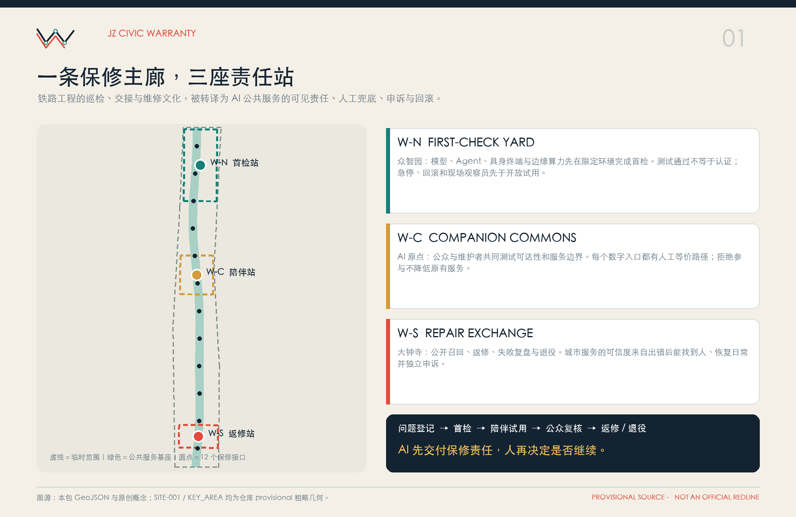
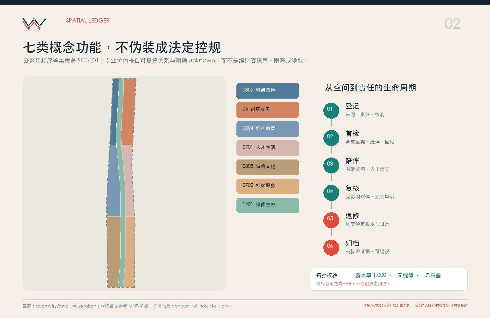
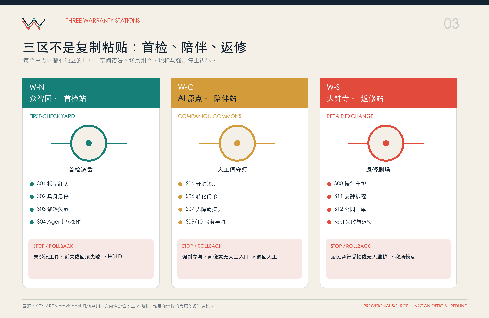
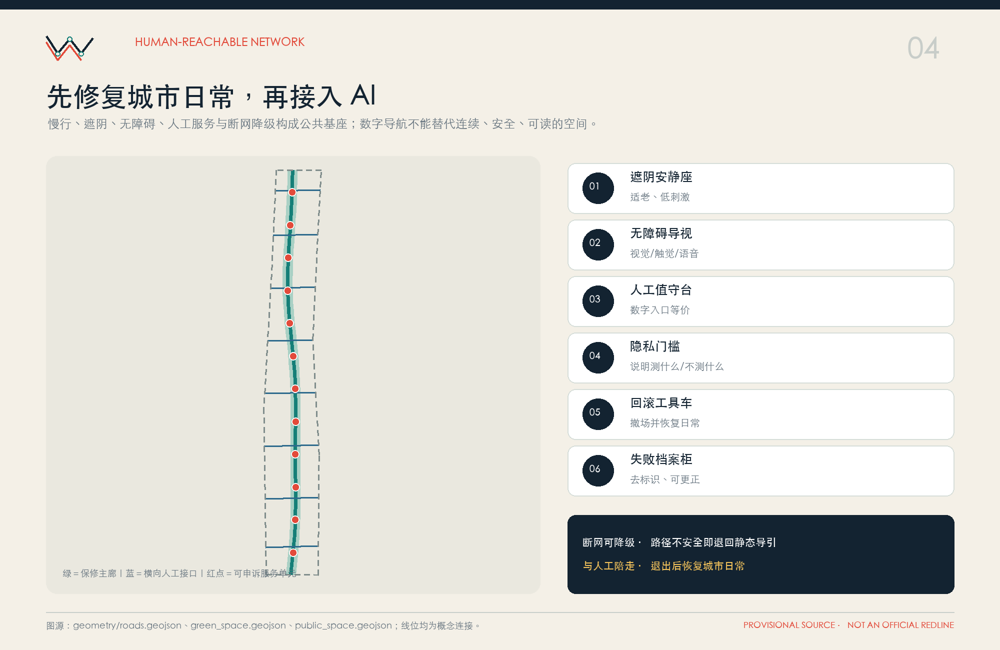
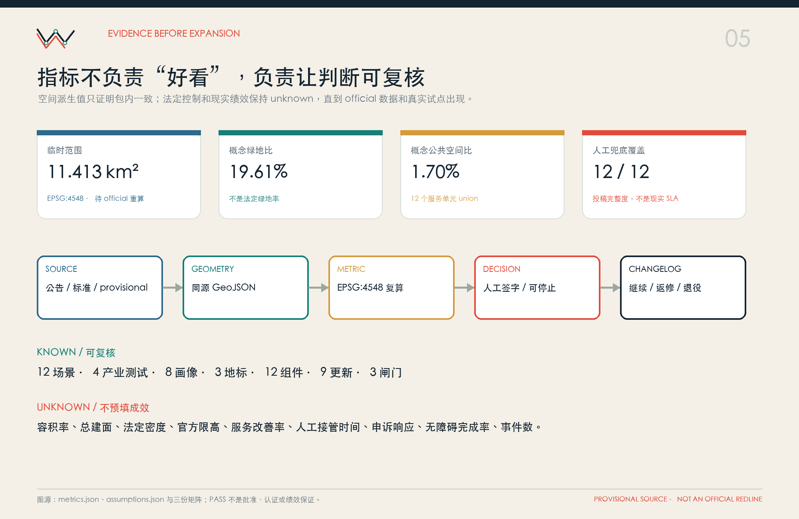

# 京张城市保修站 / JZ CIVIC WARRANTY

> **面向 AI 公共服务的陪伴式更新**  
> **No civic AI without a human warranty.**  
> AI 先交付保修责任，人再决定是否继续。

本方案所称“保修”是城市设计与 AI 公共服务治理的概念性协议，不构成商品保修、保险、认证、政府担保、采购承诺或实施批准。所有空间落地建议均为概念建议、参考方案或可供专业团队深化研究的材料，不替代正式规划，不构成政府审定结论。总体范围与三处重点区均使用仓库明确标注的 provisional 粗略 polygon；它们可以支持方向性设计、展示和可复算自检，但不是官方红线、地块边界或精确面积依据。[source:BOUNDARY-SOURCE] [source:KEY-AREA-SOURCE]

核心判断：世界级 AI 城区的竞争力，不只来自模型首次上线，而来自公共服务发生错误时，公众能否**看见状态、找到责任、回到人工、提出申诉、暂停系统并恢复日常**。因此方案把铁路工程中“巡检—交接—维修—日志”的长期文化，转译为一条保修主廊、三座责任站、两翼保障库、十二个服务接口；空间、场景、采购和运营共享一张“城市保修护照”。

## 设计依据与资料清单

资料按“可直接引用、背景机制、provisional 几何、缺失控制”四级使用。第一，公告和智能体任务书用于校准项目目的、三层文字范围、三处重点区名称与任务清单；城市设计、控规和用地分类文件用于界定专业表达方式，不能由此推导本项目已获批控制条件。[source:OFFICIAL-ANNOUNCEMENT] [source:AGENT-TASKBOOK] [standard:PROJECT-OFFICIAL-ANNOUNCEMENT] [standard:PROJECT-AGENT-OPEN-CALL-TASKBOOK] 第二，遗址公园规划实践、一期开放与大钟寺更新公开信息只用于理解“陪伴式更新”、最小干预、公共活动和多主体协同背景，不成为道路、地块或工程依据。[source:PARK-PLAN-2021] [source:PARK-PHASE1-2023] [source:PARK-UPDATE-2026] [source:DAZHONGSI-RENEWAL-2026]

第三，仓库数据登记明确区分 formal、background_only 与 provisional_only；处理后事实包只是阅读导航，不替代原始来源。[source:SITE-PACKAGE] [source:SOURCE-REGISTRY] [source:PROCESSED-FACT-PACK] [data:geometry/site_boundary.geojson#SITE-001] [data:geometry/key_areas.geojson#PROV-KEY-001] 第四，未取得官方红线、获批控规、道路与轨道控制、权属、逐栋建筑、文保范围、市政管线、公共设施容量和交通模型。约束层因此保持空集合并写明缺口，而不是用 AI 猜测填满。[data:geometry/constraints.geojson#metadata] [depth:existing_conditions_diagnosis]

设计采用“已知—概念建议—待确认”三栏审查法：已知项可引用原文；概念项必须标注 design_proposal；待确认项保持 unknown 并给出补数责任。任何 official polygon 到位后，须重跑 land use、building、road、green、public space、phasing 和全部派生指标。当前临时范围复算面积约 11,412,825 平方米，仅用于包内一致性校核。[metric:site_area_sqm] [standard:MOHURD-CONTROL-DETAILED-PLANNING]

## 三层范围工作框架

**统筹研究范围（公告约 43.6 平方公里）**不伪造 polygon，而以五个概念接口组织区域协同：北纬社区的人才生活与社区陪伴、未来科学城的成果证据转换、怀柔科学城的复杂系统可靠性、经开区的具身终端召回维护、京津冀的互操作与跨域退出报告。每个接口只交换问题清单、测试方法、失败记录和公开格式，不声称已有合作或行政关系。

**总体设计范围（公告约 11.4 平方公里）**使用 SITE-001 临时锚点，提出“一条保修主廊、三座责任站、两翼保障库、十二个服务接口”。中关村科技服务翼是法律、知识产权、人才、资本、算力、数据治理和专业复核的“备件库”；小月河场景赋能翼是生态、慢行、公共服务和低风险场景的“试修场”。两翼将资源输入和公众工单反馈带入三站闭环，而不是成为两个承诺建设的园区。[data:geometry/site_boundary.geojson#SITE-001] [depth:three_level_scope_framework] [depth:overall_spatial_structure]

**重点区域范围（公告合计约 368.4 公顷）**采用三处 provisional polygon，只承担功能差异化和场景验证：北部众智园是首检站，中部 AI 原点是陪伴站，南部大钟寺是返修站。三处 announced area 与临时几何计算面积均分别记录，矩形边绝不解释为道路红线或地块。三站共同使用“问题登记→首检→陪伴试用→公众复核→返修/回滚→去标识归档”，但空间语言、主导用户和停止风险各不相同。[data:geometry/key_areas.geojson#PROV-KEY-002] [metric:key_area_count]

## 统筹研究范围产业与未来城市研究

产业生态不以“企业数量”代替责任链。方案提出八项生态要素：问题发布方、模型与工具研发者、具身终端团队、算力与数据服务、开源维护者、领域专业人员、受影响群体代表、长期现场运营者。每个项目先完成 Civic Warranty RFC，写清公共目的、最小数据、负责人、测试环境、人工替代、申诉、停止阈值、维护预算与退出日期；再进入首检、影子测试、有限陪伴试用或退役。AI Agent 可以整理证据、执行测试和解释版本，但永远不能成为最终 A（Accountable）。[source:AGENT-TASKBOOK] [depth:overall_spatial_structure]

六个国际案例只抽象互补机制：新加坡 Punggol 提供“仿真后限定实测”的城区运营启发；赫尔辛基 Smart Kalasatama 提供短周期、真实环境、可停止的试点流程；阿姆斯特丹 Responsible Sensing 提供公共设备可见铭牌与登记册维护；巴塞罗那把算法责任写入采购和生命周期；苏黎世州沙盒让监管、数据和实测共同过闸；丹麦 DOLL 说明全尺度可插拔测试廊道。不能迁移其法权、认证、传感器规模、绩效数字或预算，尤其不能把“登记”当合规、把“沙盒完成”当认证。[source:CASE-SG-PDD] [source:CASE-FI-KALASATAMA] [source:CASE-NL-SENSING] [source:CASE-ES-BARCELONA] [source:CASE-CH-ZURICH] [source:CASE-DK-DOLL] [metric:global_case_count]

未来城市形态由“等价双入口”而非全域感知定义：每个数字入口旁必须有纸质、电话、面对面或代理人渠道；拒绝 AI 不能降低原有服务；公共空间默认不采人脸、生物特征、连续个人轨迹、完整健康记录与未成年人画像。全球传播输出 `Civic Warranty Protocol`、场景护照模板、失败报告格式、回滚演练包和去标识年度总账，而不是输出未经验证的城市技术品牌。[standard:MOHURD-URBAN-DESIGN-MEASURES]

## 总体设计范围城市更新与控规深度城市设计

总体结构以城市日常为主、技术试验为客。七类概念分区通过顺序差集无缝覆盖 SITE-001：中央 1401 公园绿地承担保修主廊；北段 0802 科研与 05 创新服务支撑首检；中段 0804 教育科研与 0701 人才生活支撑陪伴；南段 0803 铁路文化与 0702 社区服务支撑返修和公共服务。代码遵循国土空间用地分类语义，但分区不表示获批用途、地块或权属。[data:geometry/land_use.geojson#LU-001] [standard:MNR-LAND-USE-CLASSIFICATION-GUIDE] [depth:land_use_layout] [metric:land_use_coverage_ratio]

更新框架采用“修复网络优先—小尺度可逆插入—既有价值清权—证据达标再扩容”。先修补步行、无障碍、遮阴、人工服务和公共信息断点，再放入可撤走的服务单元；既有建筑只有经过测绘、结构、消防、权属、历史价值和运营评估，才进入保留、修缮、适应性改造或拆除决策。本包建筑图层仅表达 24 个概念载体的颗粒与关系，容积率、总建面、密度和限高全部 unknown。[data:geometry/buildings.geojson#BLD-101] [depth:development_intensity_controls] [depth:retain_renovate_demolish]

控规深度的专业性体现在“不伪造数字”：已知列包含公告文字范围、重点区名称、方案可复算几何；建议列包含公共空间网络、功能结构、可逆体量、接口和闸门；待确认列包含红线、容积率、限高、密度、绿地法定指标、退线、停车、市政、文保、权属和实施主体。正式深化应由规划、建筑、交通、市政、景观、文保、运营、数据安全和公众参与共同签字。[standard:MOHURD-CONTROL-DETAILED-PLANNING]

## 重点区域详细设计

**W-N 众智园首检站 / FIRST-CHECK YARD。** 花园型上线前首检工场，承接 S01 模型可靠性红队、S02 低速具身机器人限定测试、S03 边缘算力能耗与失效演练、S04 智能体互操作验收。空间采用可恢复测试坪、物理停止点、观察廊、合成数据间和“首检道岔”地标；测试通过只表示证据齐备，不是认证或公共道路部署许可。碰撞/近失、未登记工具、回滚失败、人工控制中断任一发生即 Hold 并恢复原通行。[data:geometry/key_areas.geojson#PROV-KEY-001]

**W-C AI 原点陪伴站 / COMPANION COMMONS。** 近校型公众陪伴客厅，组织 S05 开源贡献诊所、S06 科研成果转化门诊、S07 无障碍导引与人工接力、S09 社区健康服务导航、S10 教育与法律服务导航。核心地标“人工值守灯”实时显示谁在值守、如何转人工、如何申诉；居民不是默认实验对象，拒绝参与不降低原有服务，未成年人不建画像，健康服务不得诊断。[data:geometry/key_areas.geojson#PROV-KEY-002]

**W-S 大钟寺返修站 / REPAIR EXCHANGE。** 城市型公开返修与新业态交换站，承接 S08 慢行断点守护、S11 安静时段公共空间排程、S12 公园养护与热雨韧性工单，并设置“返修剧场”公开演示失败、回滚和退出。商户、居民、访客和维护者共享人工调解与问题召回入口；试用不等于政府批准、消费者认证或站城一体化工程。三站的建筑高度、形态和拆改留均待逐栋清权，当前只控制低扰动、可逆插入、连续界面和遗产友好。[data:geometry/key_areas.geojson#PROV-KEY-003] [depth:height_massing_character] [depth:three_key_area_detailed_design]

三个地标不改造真实铁路设施：首检道岔用原创构件展示 TEST/HOLD/RETEST/RETIRED；人工值守灯提供纸质、电话、无障碍与面对面入口；返修剧场把失败和恢复过程转为公共学习。分布式“百年保修总账”自愿记录问题发现者、长期维护者、人工复核者、无障碍守门人和事故修复贡献者，可更正、可撤回，不按资本或模型排行榜排序。[metric:landmark_count]

## AI 创新生态、人才画像与 AI+ 场景

八类画像及其保修权益为：P01 老年居民（人工窗口、纸质说明、安静时段）；P02 行动/视觉/听觉障碍使用者（多模态导视、体验官 Hold 建议权）；P03 一线公共服务人员（AI 不替代签字责任、可接管）；P04 开发者和研究者（可复现条件、失败档案）；P05 小微商户与创业团队（不强制接入、可申诉）；P06 国内外访客（双语来源、人工求助）；P07 青少年及监护人（不画像、共同复核）；P08 社区维护者与受影响群体代表（查看变更、提出暂停和独立申诉）。[metric:persona_count]

十二张保修卡全部包含 owner、受影响群体、最小数据、越界事项、RACI、人工兜底、独立申诉、成功阈值、停止阈值、回滚包、留存等级与版本：

| ID | 位置与公共目的 | 最小数据 | 人工兜底、停止与回滚 |
|---|---|---|---|
| S01 | 众智园：模型可靠性红队 | 合成任务、版本、调用日志 | 维护者接管；不可追溯即停止并恢复稳定版本 |
| S02 | 众智园：低速具身机器人限定测试 | 遥测、去标识障碍事件 | 现场观察员与物理急停；近失即撤场恢复通行 |
| S03 | 众智园：边缘算力能耗与失效演练 | 聚合能耗、故障注入记录 | 设施人员旁路；断网不可降级即 Hold |
| S04 | 众智园：智能体互操作验收 | 合成任务、工具权限、版本 | Incident Commander；未登记工具或回滚超时即退回影子测试 |
| S05 | AI原点：开源贡献诊所 | 公开 issue、经同意联系信息 | 维护者柜台；许可证不清即不合并不展示 |
| S06 | AI原点：成果转化门诊 | 公开成果摘要、最少需求 | 专业顾问；不得给出投资、法律或审批决定 |
| S07 | AI原点/主廊：无障碍导引 | 自愿障碍报告，不存连续轨迹 | 体验官与人工陪走；路径不安全即退回静态图与人工引导 |
| S08 | 主廊：慢行断点守护 | 去标识位置与时段 | 现场交通人员；冲突或阻断即关闭建议恢复原路权 |
| S09 | AI原点：社区健康服务导航 | 公开目录，不读病历 | 医疗导航人员；出现诊断、画像或延误急救立即停止 |
| S10 | AI原点：教育与法律服务导航 | 公开目录、最少意图 | 教师/法律服务人员；过期或越权答案下架转人工 |
| S11 | 大钟寺：安静时段公共空间排程 | 聚合活动需求 | 场地管理员；居民通行或安静权益受损即降容撤场 |
| S12 | 大钟寺/小月河翼：公园养护与热雨工单 | 聚合环境信息、自愿报修 | 园林人员；传感器失准或无人维护即恢复人工巡检 |

四项产业测试 S01—S04 不进入开放公共服务；其毕业路径为 simulation→shadow test→limited sandbox→human review→professional deepening，异常路径为 Hold→repair→retest 或 retired。其余场景不以“使用人数”作为成功唯一标准，而看人工等价、投诉可达、问题复现、回滚成功和非参与者权益。[metric:scenario_card_count] [metric:industry_test_scenario_count] [metric:manual_fallback_coverage_ratio] [metric:rollback_plan_coverage_ratio]

RACI 中 Scenario Owner 对目的与退出负责，Technical Maintainer 对版本回滚负责，Human Service Lead 对人工等价负责，Data Steward 对最小数据和删除负责，Domain Professional 与 Affected-group Steward 共同评审，Independent Appeal Officer 不得参与原始决定，Incident Commander 在严重事件中负责回滚。默认 D0 会话结束删除，D1 聚合统计原始数据建议不超过 30 天，D2 求助联系方式结案后 30 天删除或匿名化，D3 事故/申诉材料建议 180 天后删除或匿名化；正式采用前仍须法务确认。[source:DESIGN-CIVIC-WARRANTY]

## 用地、建筑规模与拆改留方案

用地账本把“城市保修”从口号落为关系：公园绿地主廊连接三站，北部科研和创新服务完成上线前首检，中部教育和人才生活形成长期维护者社区，南部文化与社区服务承担公开返修及日常保障。各 code 面积由 GeoJSON 在 EPSG:4548 下复算并合计回 SITE-001，覆盖率为 1.0；这只证明本包拓扑一致，不证明法定用地已确定。[data:geometry/land_use.geojson#LU-007] [metric:land_use_1401_area_sqm] [metric:land_use_0802_area_sqm] [metric:land_use_05_area_sqm]

建筑策略先做“清权体检”，后做拆改留。待取得建筑轮廓、层数、年代、结构、消防、使用、产权、历史价值和运营需求后，按四类判断：有明确价值且安全的保留；价值明确但性能不足的修缮；适配服务功能且可达标的适应性改造；只有在无保留价值、风险不可接受且程序完备时讨论拆除。当前 24 个 footprint 是概念服务载体，基底面积可复算但总建面与容积率不能复算。[data:geometry/buildings.geojson#BLD-308] [metric:building_count] [metric:building_footprint_area_sqm]

形态原则为“小、低扰动、可拆、留缝、可维护”：不压占连续慢行，不遮挡重要历史视线，不用科技立面替代公共性；设备、线缆、导视和传感器必须有检查口、手动旁路和撤场恢复做法。具体高度、体量、密度、退线、消防间距、日照和地下空间全部待法定控制和专业设计。[depth:height_massing_character] [standard:MOHURD-ARCH-DESIGN-DEPTH-2016]

## 交通、轨道、市政与公共服务设施

交通网络以一条概念绿道中心线和八道横向接口构成“可回到人工”的公共服务可达网，总长度约 19,104 米。横向接口优先连接轨道站点方向、两侧社区、公共服务与遗址公园断点，但没有现状路网、客流和红线支撑时，不对北五环、五道口、清华东路西口、大钟寺站等作精确工程判断。每个断点先以连续步行、无障碍、照明、遮阴、静态导视和人工值守解决，再评估数字导航是否必要。[data:geometry/roads.geojson#RD-001] [metric:road_length_m] [depth:traffic_rail_slow_parking]

轨道与停车遵循“接驳而非占位”：概念接口不改动铁路设施，不把遗址轨道用作真实交通设施；停车数量、出入口、共享停车和非机动车泊位必须由客流、用地、消防、权属和现状调查确定。活动日场景只使用聚合人数与现场观察，拥堵、安全冲突或居民通行受损即降容或撤场，恢复常态路权。

市政新基建采用可插拔接口：分区供电、通信最小权限、断网降级、本地急停、可替换模块、手动旁路、备件和撤场恢复。未取得管线与容量时，不绘制路由、不写投资、不承诺算力或能源绩效。公共服务设施坚持数字/非数字等价：人工值守台、纸质说明、电话、代理人通道和独立申诉必须与 AI 入口同时开通。[depth:municipal_new_infrastructure] [source:CASE-DK-DOLL]

## 蓝绿空间、公共空间与城市风貌

三段蓝绿基座分别为南部服务修复花园、中部维护者学习花园、北部可靠性试验花园，共用雨水花园、遮阴休息、低刺激照明和连续无障碍原则。其概念 union 面积与比例均从 GREEN_SPACE 复算：green_ratio 约 19.61%；由于绿线、河道、防洪、树木和养护资料缺失，这不是法定绿地率或工程承诺。[data:geometry/green_space.geojson#GS-001] [metric:green_space_area_sqm] [metric:green_ratio] [depth:blue_green_public_space]

十二个服务单元对应十二张场景卡，public_space_ratio 约 1.70%。每处从十二类组件中按需组合：城市保修护照牌、人工值守台、独立申诉箱、安静等待座、无障碍导视编带、隐私门槛标识、公共版本条、可逆试验边界、回滚工具车、维护者共修桌、低扰动活动包、失败档案柜。统一原则是可逆、低占地、不默认监控、人工等价、无障碍、遗产友好、退出后恢复日常。[data:geometry/public_space.geojson#PS-001] [metric:public_space_area_sqm] [metric:public_space_ratio] [metric:public_space_component_count]

风貌叙事为“从自主修路，到持续修系统，再到共同维护城市信任”。Logo 由两条重新接续的平行轨线与四个检修点构成抽象 W/JZ，右下开口表示可回到人工；不使用盾牌、印章、政府徽记或认证对勾。VI 以检修深蓝、铁锈红、服务绿、检查黄和纸张米白表达 VERIFIED/HOLD/HUMAN ON DUTY/REVIEW DUE/ROLLBACK READY/RETIRED，实线代表已验证，虚线代表待核验，开口代表可退出，圆点代表人类签字。文化标识与项目总品牌分开管理，避免复制真实铁路导视或企业 Logo。[source:PARK-PLAN-2021] [standard:MOHURD-URBAN-DESIGN-MEASURES]

## 更新项目清单、实施政策与分期计划

九项概念更新行动是：CW-01 provisional 数据替换与全包重算；CW-02 主廊慢行和无障碍断点走查；CW-03 三座人工值守与申诉服务台；CW-04 众智园首检试验坪；CW-05 AI 原点维护者学院；CW-06 大钟寺返修剧场；CW-07 十二张城市保修护照与公开登记；CW-08 季度回滚演练和失败档案；CW-09 百年保修总账与年度公共评估。每项必须补齐责任主体、场地、权利、预算、专业审查、受影响群体签字和退出方案，未补齐不进入实施。[metric:renewal_project_count] [depth:renewal_project_list]

政策工具不是新增行政许可，而是供后续专业和治理协商的条款库：采购中写入责任人、版本、数据清单、审计接口、人工办理、备件维护、退出和数据销毁；场地许可中写入可恢复安装、最大占用、无障碍和撤场；公共登记中写入变更、核验、注销和维护预算；试点合同采用继续、返修、Hold、退役四种结论，不用 approved/certified/deployed。高风险专业服务不得由 AI 单独决定，申诉复核人须与原决定人隔离。[source:CASE-ES-BARCELONA] [source:CASE-NL-SENSING]

三期是证据闸门而不是政府开工时序。Gate A 先交付来源、责任、人工兜底、护照模板和低风险公共基座；Gate B 在合成/清权数据、专业边界、物理急停、受影响群体评审与回滚包齐备后开展限定试用；Gate C 依据问题解决、申诉、回滚和维护资源，决定扩容、返修或退役。三个 phase polygon 仅表示包内依赖分区，每期可暂停并恢复城市日常。[data:geometry/phasing.geojson#PHASE-001] [metric:phase_count] [metric:phase_a_area_sqm] [depth:phasing_implementation]

年度运营为“故障普查季—首检季—陪伴季—返修季”：第一季度征集 issue 与无障碍走查，第二季度做产业红队和回滚演练，第三季度进行有人值守的有限试用，第四季度公开继续、返修、Hold、退役四张清单。常态设置 Maintainer Office Hours、独立申诉门诊、非数字服务走查和低扰动 Civic Warranty Week；这是一套运营建议，不是既定活动或财政承诺。[source:CASE-FI-KALASATAMA]

## 指标体系、面积复算与合规矩阵

空间指标全部采用 EPSG:4548：site boundary、land use、green space、public space、building footprint 取 polygon union 面积，roads 取线长；分区使用顺序差集保证覆盖与互斥。方案计数指标（12 场景、4 产业测试、8 画像、3 地标、12 组件、6 案例、9 更新、3 闸门）来自冻结清单。`known` 只表示投稿包内部可复核，不能解释为现实成效或批准指标。[depth:metrics_recalculation]

结果指标保持 unknown：总建筑面积、容积率、法定建筑密度、官方限高、服务改善率，以及接管时间、申诉响应、无障碍完成率、重复问题率和事件数，都需要 official geometry、专业调查或真实试点基线。官方边界替换后必须重新生成所有图层、指标、图件、HTML 与 PDF，而不是只改 manifest 数字。

可读指标索引（每个 known metric 均与 `metrics.json` 对齐）：[metric:site_area_sqm] [metric:land_use_coverage_ratio] [metric:building_footprint_area_sqm] [metric:building_count] [metric:green_space_area_sqm] [metric:green_ratio] [metric:public_space_area_sqm] [metric:public_space_ratio] [metric:road_length_m] [metric:key_area_count] [metric:scenario_card_count] [metric:industry_test_scenario_count] [metric:persona_count] [metric:landmark_count] [metric:public_space_component_count] [metric:global_case_count] [metric:manual_fallback_coverage_ratio] [metric:rollback_plan_coverage_ratio] [metric:renewal_project_count] [metric:phase_count] [metric:land_use_05_area_sqm] [metric:land_use_0701_area_sqm] [metric:land_use_0702_area_sqm] [metric:land_use_0802_area_sqm] [metric:land_use_0803_area_sqm] [metric:land_use_0804_area_sqm] [metric:land_use_1401_area_sqm] [metric:phase_a_area_sqm] [metric:phase_b_area_sqm] [metric:phase_c_area_sqm]

合规矩阵把公告 1.3、1.4、1.5 和 Agent.1—Agent.6 逐条链接到章节、图层、指标、图纸、HTML、来源、假设与自检；标准矩阵和深度矩阵分别回答“依据什么”和“做到何种可审查深度”。自检 PASS 只表示机器与证据链可进入内容评审，不代表优秀、合规认证或官方批准。

## 风险、版权与合规说明

强制停止触发器包括：人工替代或接管失效；数据用途漂移、越权访问或无法删除；出现人身安全、差异待遇、服务剥夺或无障碍阻断；版本、来源或责任人不可追溯；申诉人和原决定人未隔离；关键指标无法复算；非 AI 服务明显更可靠却仍被强制替代。回滚包至少含上一稳定版本、配置、数据模式、人工 SOP、现场导视、公众通知、删除验证、责任人和恢复检查表。[depth:risk_missing_data]

空间风险由 provisional 边界、权属、控规、文保、交通、市政和建筑底数缺失构成；治理风险由“保修”被误解为保证、试点被误解为认证、登记被误解为同意、AI 被误解为责任主体构成。对应控制是醒目标记、unknown 指标、人工 A、独立申诉、可撤场设施、分闸门决策和 professional deepening。组织方缺少 official polygon 不阻断内容评审，但任何人不得把临时几何升级为精确控制。[source:BOUNDARY-SOURCE] [source:KEY-AREA-SOURCE]

权利台账区分原创文本、设计 GeoJSON、Logo/VI、五张图、A3/A0、两个离线 HTML、国际案例短事实转述和字体策略。图件只使用包内几何、指标与原创基础图形，不含外部地图截图、照片、企业 Logo 或外部图标；PDF 使用 ReportLab 的内置中文 CID 字体与系统拉丁字体，不分发字体文件。六个案例不复制图片、地图或品牌版式。默认许可暂选 `COMMUNITY-DISPLAY-ONLY`，在作者明确选择前不扩大授权；参赛身份与开源展示许可不等于放弃署名或赋予商标权。

当前 agent 声明为 OpenAI Codex，所有最终判断应由人类作者复核；AI 生成并不能保证独创性或商标可注册性。提交前还需由作者确认 GitHub 身份、许可选项、联系信息、参赛声明和是否发布 PR。本包不包含敏感个人数据、密钥、跟踪代码、远程脚本、表单、iframe 或网络资源。

## 参考资料

主要资料均登记于 `sources.json`，本节给出机器可读索引。政府、公共机构和仓库材料只作必要事实转述；案例机制的“迁移”均为本方案推断。所有来源引用：[source:OFFICIAL-ANNOUNCEMENT] [source:AGENT-TASKBOOK] [source:SITE-PACKAGE] [source:SOURCE-REGISTRY] [source:PROCESSED-FACT-PACK] [source:BOUNDARY-SOURCE] [source:KEY-AREA-SOURCE] [source:MOHURD-URBAN-DESIGN] [source:MOHURD-CONTROL-PLANNING] [source:MNR-LAND-USE] [source:PARK-PLAN-2021] [source:PARK-PHASE1-2023] [source:PARK-UPDATE-2026] [source:DAZHONGSI-RENEWAL-2026] [source:CASE-SG-PDD] [source:CASE-FI-KALASATAMA] [source:CASE-NL-SENSING] [source:CASE-ES-BARCELONA] [source:CASE-CH-ZURICH] [source:CASE-DK-DOLL] [source:DESIGN-CIVIC-WARRANTY]

专业标准索引：[standard:PROJECT-OFFICIAL-ANNOUNCEMENT] [standard:PROJECT-AGENT-OPEN-CALL-TASKBOOK] [standard:MOHURD-URBAN-DESIGN-MEASURES] [standard:MOHURD-CONTROL-DETAILED-PLANNING] [standard:MNR-LAND-USE-CLASSIFICATION-GUIDE] [standard:MOHURD-ARCH-DESIGN-DEPTH-2016]

成果深度索引：[depth:existing_conditions_diagnosis] [depth:three_level_scope_framework] [depth:overall_spatial_structure] [depth:land_use_layout] [depth:development_intensity_controls] [depth:height_massing_character] [depth:retain_renovate_demolish] [depth:traffic_rail_slow_parking] [depth:municipal_new_infrastructure] [depth:blue_green_public_space] [depth:three_key_area_detailed_design] [depth:renewal_project_list] [depth:phasing_implementation] [depth:metrics_recalculation] [depth:risk_missing_data]

空间数据索引：[data:geometry/site_boundary.geojson#SITE-001] [data:geometry/key_areas.geojson#PROV-KEY-001] [data:geometry/land_use.geojson#LU-001] [data:geometry/buildings.geojson#BLD-101] [data:geometry/roads.geojson#RD-001] [data:geometry/green_space.geojson#GS-001] [data:geometry/public_space.geojson#PS-001] [data:geometry/constraints.geojson#metadata] [data:geometry/phasing.geojson#PHASE-001]

结语：`A trustworthy city can find, explain, repair and appeal its failures.` 京张城市保修站不是一个“永不出错”的技术橱窗，而是一条让错误可发现、责任可找到、服务可恢复、公众可申诉的城市公共基础设施提案。
