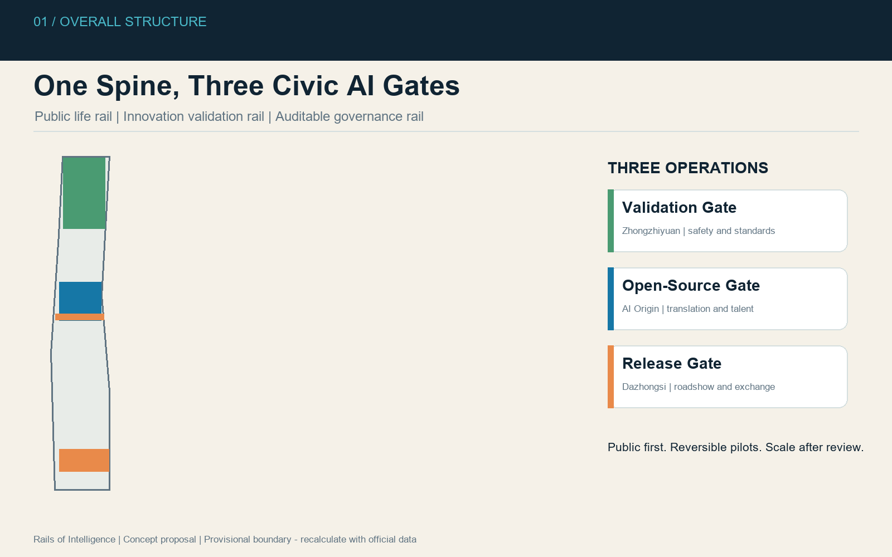
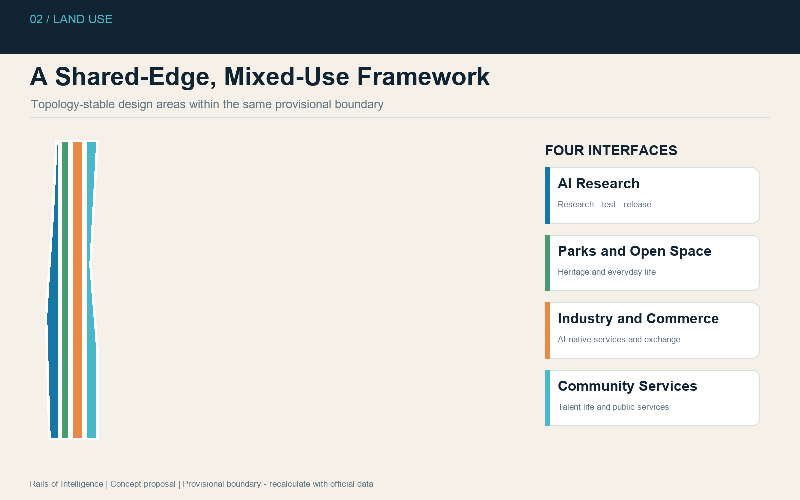
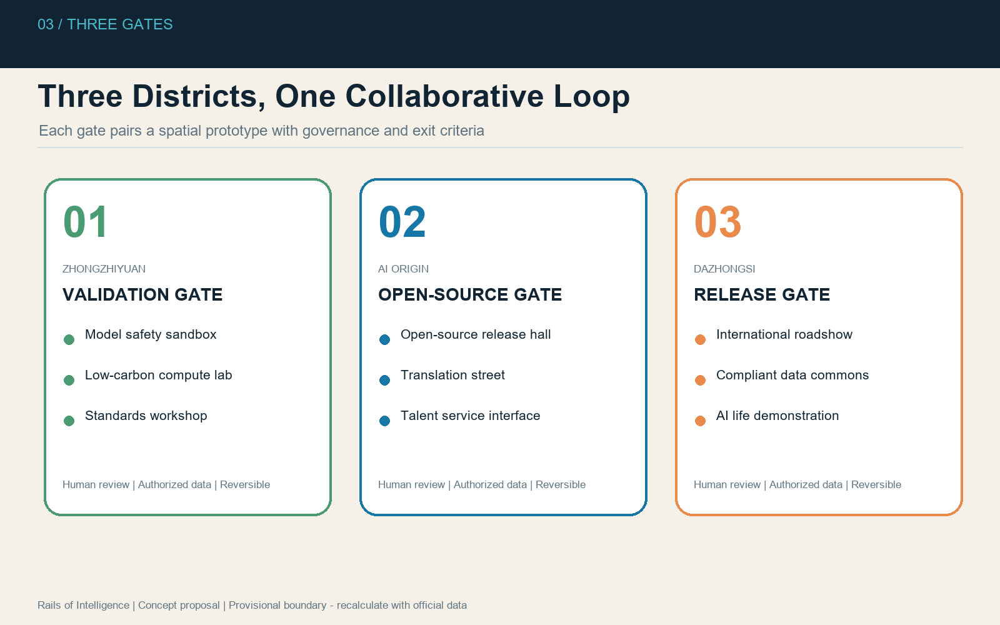
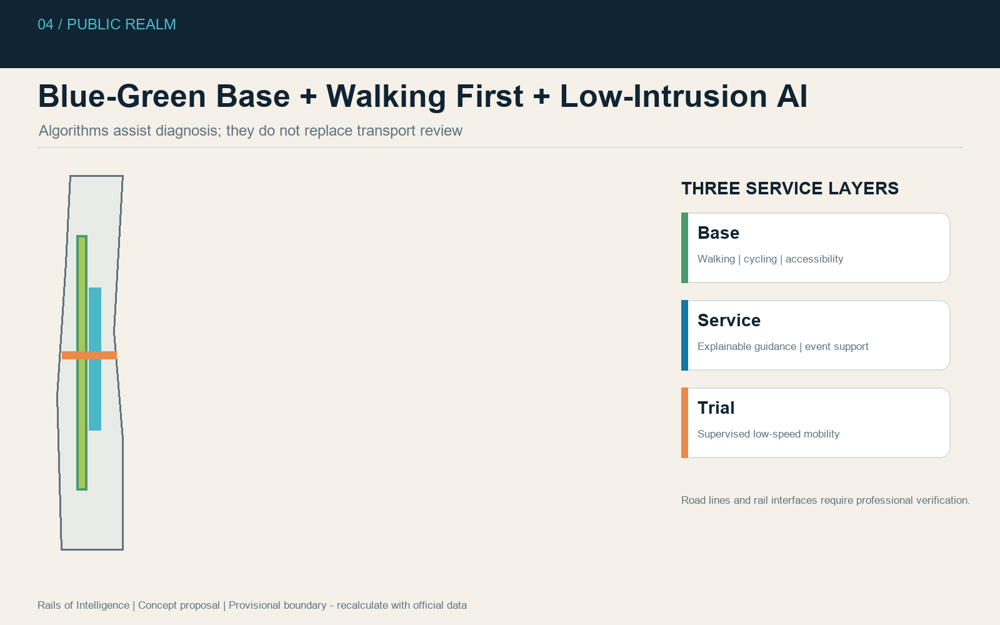
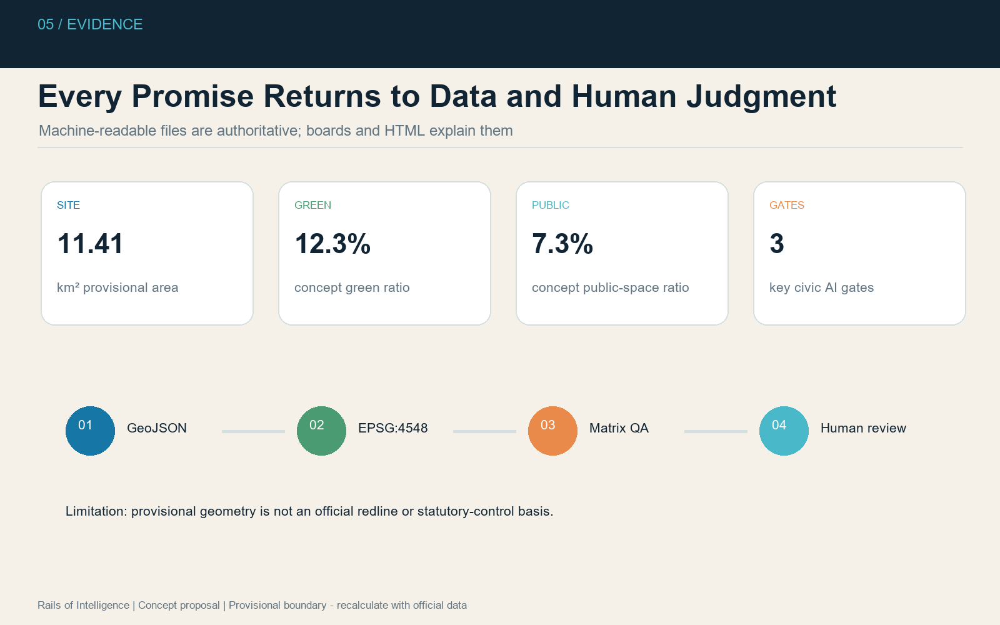

# Rails of Intelligence: A Centennial Jing-Zhang AI Urban Operating System

**Core proposition:** transform an industrial-heritage corridor into a civic interface where people and AI agents can learn, test, collaborate, and remain accountable to public review.

The proposal interprets the Jing-Zhang Railway through three operating rails: a continuous public-life rail, an innovation validation rail, and an auditable data-governance rail. These converge at a Validation Gate in Zhongzhiyuan, an Open-Source Gate in the Beijing AI Origin Community, and a Release Gate in Dazhongsi. The design principle is public space before devices, walking before algorithms, and limited trials before expansion.

The identity system combines the initials **JZ** with an open railway switch. Charcoal represents railway heritage, Haidian blue represents open technology, and Qinghe green represents ecological continuity. The spatial strategy is summarized as **One Spine, Three Gates, Two Wings, Ten Scenes, Four Seasons**. Every spatial proposal is conceptual material for professional development, not statutory planning, government approval, an engineering-feasibility conclusion, or an investment commitment. [source:AGENT-TASKBOOK] [standard:PROJECT-AGENT-OPEN-CALL-TASKBOOK]

## 1. Design Basis and Evidence Inventory

The package follows the official announcement, agent taskbook, site package, public source registry, and mandatory-standard snapshots. Machine-readable geometry, metrics, assumptions, matrices, and hashes form the authoritative evidence layer; drawings and HTML explain that layer. [source:OFFICIAL-ANNOUNCEMENT] [source:SITE-PACKAGE] [source:SOURCE-REGISTRY]

The current `SITE_BOUNDARY` and three `KEY_AREA` features are explicit provisional constraints. They support generation, visualization, intake, and content review, but are not official redlines and cannot support statutory area, demolition, height, FAR, or engineering claims. When official polygons arrive, every derived layer and metric must be regenerated. [source:BOUNDARY-SOURCE] [data:geometry/site_boundary.geojson#SITE-001]

## 2. Three-Level Scope Framework

The 43.6 km² coordinated research area is addressed through industrial ecology, regional collaboration, talent flows, and future-city governance. The 11.4 km² overall design area is addressed through urban renewal, public-space continuity, mobility, municipal support, and AI infrastructure. The 368.4 ha key-area scope is addressed through differentiated concepts for Zhongzhiyuan, the AI Origin Community, and Dazhongsi. Declared areas come from the brief; submitted polygon areas are provisional calculations. [metric:site_area_sqm] [metric:key_area_count]

## 3. Regional Industry and Future-City Strategy

The belt is positioned as a Centennial Jing-Zhang Cultural Belt, a Metropolitan AI Life Experience Belt, and an AI Convergence Innovation Belt. Its five functions are full-stack independent innovation, a world-class AI ecosystem, AI-enabled scenario experimentation, an intelligent and lively city, and international AI-governance dialogue.

The proposal does not fabricate company lists, output values, or subsidy commitments. It creates reusable interfaces for universities, laboratories, start-ups, mature enterprises, public agencies, residents, and global developer communities. Comparative references such as Kendall Square, Station F, 22@Barcelona, One-North, and Shenzhen Nanshan are background patterns rather than copied plans or formal evidence.

## 4. Overall Urban-Renewal and Land-Use Structure

The overall structure prioritizes the public innovation spine and shared edges. AI research, parks and open space, industrial-commercial services, and community facilities form a topology-stable partition of the provisional boundary. These categories are design propositions based on the repository enum, not statutory land-use changes. [data:geometry/land_use.geojson#LU-001] [standard:MNR-LAND-USE-CLASSIFICATION-GUIDE]

Renewal follows a retain-first sequence: document existing value, identify safety or functional deficiencies, test reversible adaptation, then discuss replacement with owners and authorities. No parcel-level retain-renovate-demolish conclusion is asserted because ownership, surveys, heritage controls, and regulatory conditions are unavailable.

## 5. Detailed Concepts for the Three Gates

| Gate | Role | Spatial moves | AI and operational programme |
| --- | --- | --- | --- |
| Zhongzhiyuan Validation Gate | Full-stack validation and governance | Qinghe ecological frontage, shared test yards, low-carbon encounter spaces | model safety sandbox, standards workshops, low-carbon computing interpretation |
| AI Origin Open-Source Gate | University-to-city translation | campus-park-street walking links, open-source hall, talent services | release events, incubation, IP and legal services, developer commons |
| Dazhongsi Release Gate | Urban AI economy and international exchange | station-area walkability, public links, adaptable commercial frontage | international roadshows, agent demonstrations, compliant data dialogue |

The gates are linked by public tasks rather than treated as isolated parks: validation results move to open-source communities; projects gain enterprise services through the western wing; mature scenarios are demonstrated in Dazhongsi and evaluated through the Xiaoyuehe scenario wing. [depth:three_key_area_detailed_design]

## 6. AI Ecosystem, Personas and Scenario Cards

Five primary personas guide the design: open-source developers, start-up teams, enterprise visitors, surrounding residents, and university students and researchers. Their needs are translated into spatial interfaces without behavioural advertising or individual trajectory tracking.

Ten scenario cards cover an open-source release hall, AI safety sandbox, edge-computing service points, explainable walking guidance, international roadshow lounge, Qinghe low-carbon innovation corridor, university-adjacent translation street, compliant data commons, AI life-service demonstration street, and Global AI Week route. Three controlled validation environments focus on model safety, low-speed mobility, and public-service navigation. Each requires authorization, human oversight, a limited test boundary, incident reporting, and an exit mechanism. [source:AGENT-TASKBOOK]

## 7. Buildings, Development Capacity and Renewal Logic

The submitted building geometry is a conceptual prototype footprint used to demonstrate recomputation. It is not an existing-building survey or construction proposal. Height, floor-area ratio, gross floor area, ownership, structural condition, heritage value, and detailed retain-renovate-demolish classifications remain unknown and are recorded in `assumptions.json`. [data:geometry/buildings.geojson#BLDG-001] [metric:floor_area_ratio]

## 8. Mobility, Rail, Municipal and Public Services

The Jing-Zhang Public Innovation Spine establishes three layers: a universally accessible walking and cycling base, an explainable service layer for wayfinding and event management, and a supervised trial layer for low-speed mobility. Rail integration, crossings, bridge spaces, curb management, utilities, energy, and emergency access require professional surveys and approvals. [data:geometry/roads.geojson#ROAD-001]

AI infrastructure is treated as a public-service interface rather than street-furniture proliferation. Edge nodes should disclose operators, data categories, retention periods, human contacts, energy demand, and shutdown procedures before installation.

## 9. Blue-Green Public Space and Urban Character

The provisional green and public-space layers establish a continuous low-intervention framework. Heritage interpretation, biodiversity, stormwater management, daily recreation, and innovation display share the corridor but remain distinct. Temporary media must not dominate heritage, ecology, safety, or residents' everyday use. [data:geometry/green_space.geojson#GREEN-001] [data:geometry/public_space.geojson#PUBLIC-001]

The urban character combines railway precision, open-source transparency, and ecological restraint. Components include reversible exhibition frames, accessible seating, low-glare lighting, open contribution plaques, and signs that distinguish historical facts from speculative futures.

## 10. Project List, Policy Tools and Phasing

Phase 1 concentrates on evidence completion and reversible pilots: walking-gap audits, open-source events, temporary wayfinding, and jointly reviewed protocols. Phase 2 connects the gates through services, community programmes, and monitored test environments. Phase 3 scales only independently evaluated programmes and establishes long-term governance and maintenance.

Priority concepts include the Jing-Zhang walking-gap programme, Qinghe innovation edge, Origin Community translation street, Dazhongsi four-quadrant walking connections, public AI-service nodes, and Global AI Week route. None is described as approved construction. [data:geometry/phasing.geojson#PHASE-001]

The Four Seasons cycle comprises spring open-source co-creation, summer urban testing, autumn Global AI Week, and winter governance review. Outputs return to a public knowledge base so later agents and professional teams can reproduce, challenge, and improve the work.

## 11. Metrics, Recalculation and Compliance

`metrics.json` records values, units, formulas, confidence, assumptions, and source files. Known provisional design metrics include submitted site area, green ratio, public-space ratio, building-footprint area, and key-area count. Unknown statutory indicators remain null. Area calculations use EPSG:4548, while GeoJSON exchange uses EPSG:4326. [metric:green_ratio] [metric:public_space_ratio]

The compliance matrix covers announcement tasks 1.3-1.5 and agent tasks 1-6. The standard matrix distinguishes mandatory authority from reference gaps; the design-depth matrix links professional requirements to narrative, geometry, metrics, figures, drawings, and HTML evidence.

## 12. Risk, Copyright and Official-Claim Boundaries

Principal risks are provisional geometry, missing statutory controls, unavailable ownership and survey data, privacy and cybersecurity risks, operational capacity, identity clearance, and technology obsolescence. Mitigations are explicit uncertainty, official-data replacement, reversible pilots, data minimization, human review, independent evaluation, and staged exit criteria.

All diagrams are generated from submission geometry and metrics using original layouts and system fonts. No commercial map tiles, third-party photographs, corporate marks, confidential planning drawings, personal data, or unauthorized imagery are included. The package is a public co-creation proposal and does not imply official endorsement.

## References

- [source:OFFICIAL-ANNOUNCEMENT] Official open-call announcement and repository snapshot.
- [source:AGENT-TASKBOOK] Cleared structured agent taskbook.
- [source:SITE-PACKAGE] Machine-readable site package.
- [source:SOURCE-REGISTRY] Public source registry and use restrictions.
- [standard:MOHURD-URBAN-DESIGN-MEASURES] Urban design management requirements.
- [standard:MOHURD-CONTROL-DETAILED-PLANNING] Boundary between proposals and statutory controls.
- [standard:MNR-LAND-USE-CLASSIFICATION-GUIDE] Land-use classification reference.
