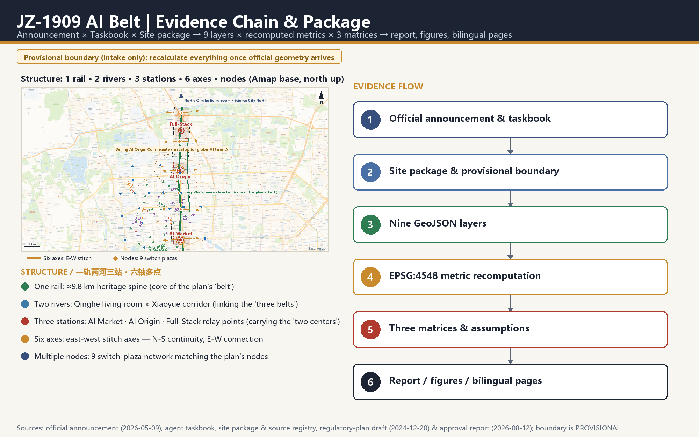
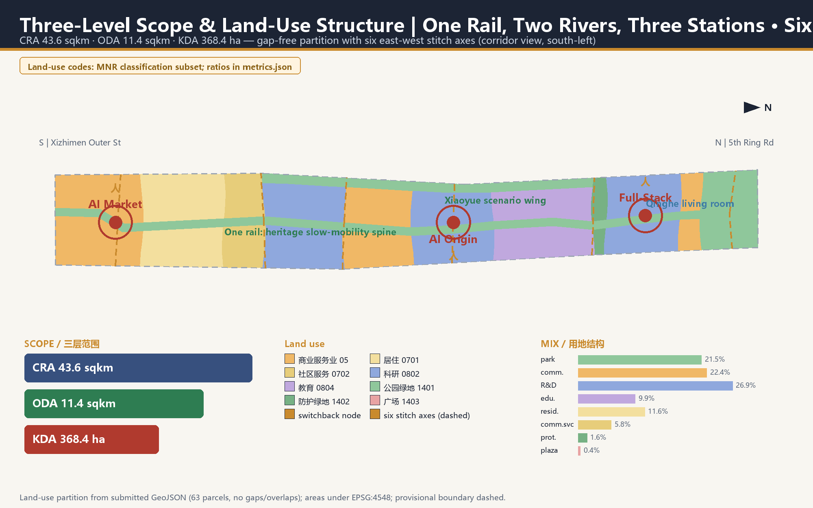
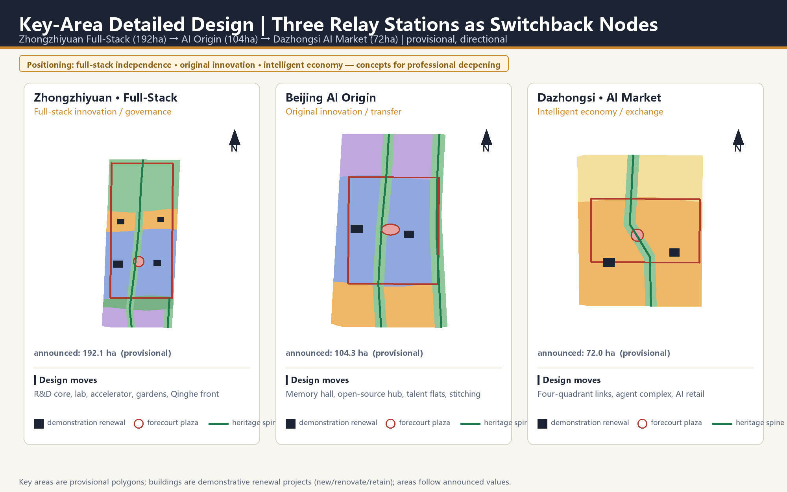
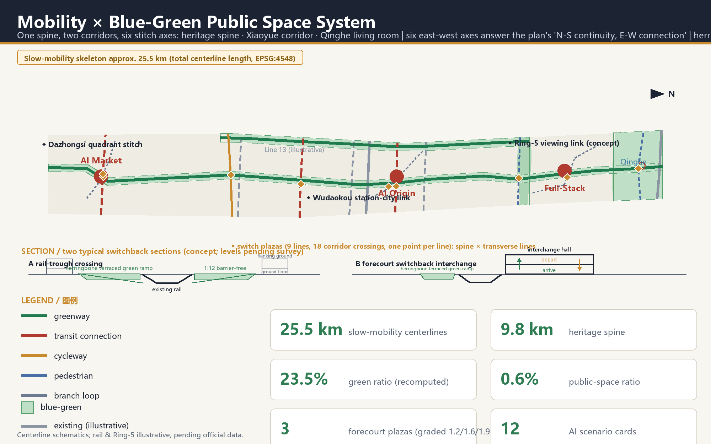
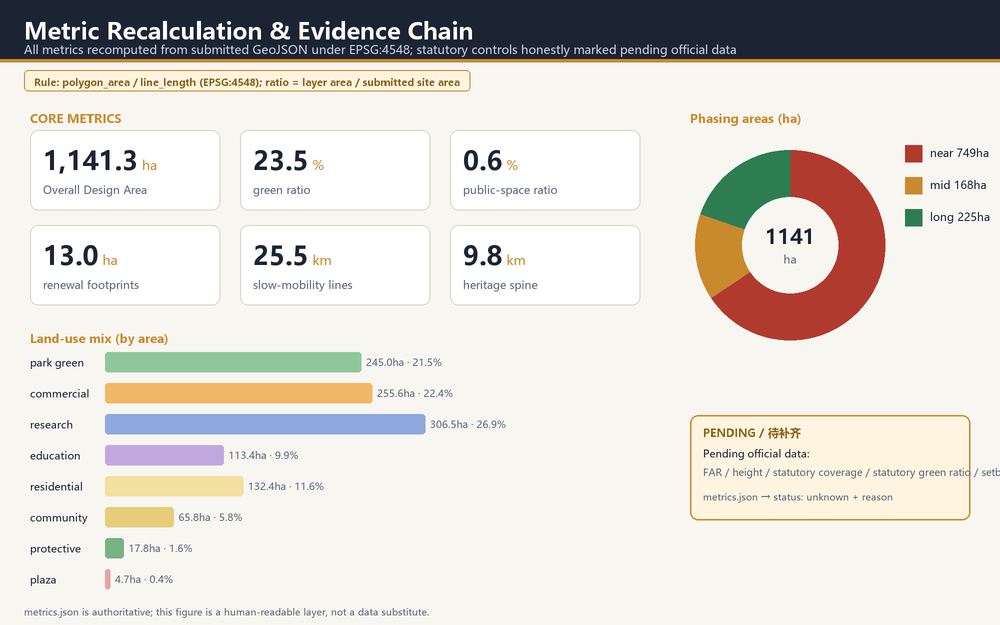

# JZ-1909 AI Belt: The New Switchback — A Century Relay from the Pride Line to the Intelligence Belt

**Slogan: 1909 — the switchback broke the doubt; 2026 — the human shapes the belt.**
**主口号：1909，以人字形破题；2026，以“人”字形立带。**
**Sub-slogan: two strokes spell the human; intelligence empowers industry and place.**
**副口号：撇捺写“人”，智赋产城——产业向新，空间向活，城市向人。**

## Design Basis and Source List

This package is a formal AI-agent submission to the Centennial Jing-Zhang AI Innovation Belt Open Call for Urban Design. Its primary basis is the official pre-qualification announcement issued by the Haidian Branch of the Beijing Municipal Commission of Planning and Natural Resources: the three scope levels, the three key areas, the design tasks and the required deliverable depth all follow Sections 1.3, 1.4 and 1.5 of that announcement [source:OFFICIAL-ANNOUNCEMENT] [standard:PROJECT-OFFICIAL-ANNOUNCEMENT]. The agent-facing open-call taskbook contributes ten co-creation principles, three positionings, five functions, the Three Zones and Two Wings structure and six mandatory agent tasks, each answered in this document [source:AGENT-TASKBOOK].

The usability boundary of every source is registered in the source layer: the announcement and the taskbook are formal task bases; the provisional boundaries registered in the repository serve generation, visualization and intake self-check only; statutory planning controls, road redlines, land ownership, municipal utilities and heritage control lines currently have no public official files and are all marked as pending official data [source:SOURCE-REGISTRY]. The proposal draws on the maintainer-registered provisional boundary as its design base map. That boundary was calibrated against the announcement's textual extents and its announced area under EPSG:4548, and the recomputed area matches the announced approximately 11.4 sqkm [data:geometry/site_boundary.geojson#SITE-001] [metric:site_area_sqm].

**Regulatory-plan alignment basis (new in v1.5)**: the Regulatory Detailed Plan (block level) for the HD00-1601 blocks along the Jing-Zhang Railway Heritage Park (AI Innovation Block key area) was published as a draft for public consultation by the Haidian Branch on 2024-12-20 and was approved on 2026-08-11 (2024-2035 edition; reported by Beijing Daily on 2026-08-12): the extent runs from Xinjiekou Outer Street (east) to Zhongguancun Street (west), from Chengfu Road (north) to Xizhimen Outer Street (south) — nine blocks, about 1,668.2 hectares — structured as "one belt, one axis, two centers, multiple nodes", with green public-space construction leading district-wide urban renewal [source:KG-DRAFT-2024] [source:KG-APPROVAL-2026]. This proposal's Overall Design Area is the core segment of that "belt" (the heritage-park innovation-and-exchange belt); from v1.5 the proposal aligns structurally with the published plan — spatial structure, industry direction, slow mobility and the blue-green skeleton all correspond (see the alignment table in the Overall Design chapter). Both the draft exhibition graphics and the approval report, however, are graphic/news-level materials; the approved plan's precise control drawings and redline full text are not yet publicly obtained, so statutory control metrics remain marked unknown (assumption A-CONTROLS-002).

**City-level innovation-block alignment (new in v1.6)**: Beijing AI Origin Community has been enrolled in Beijing's first batch of AI innovation blocks, within a citywide "one core, multiple nodes" layout centered on Haidian [source:HD-YUANDIAN-2026]. Centered on Dongsheng Tower across about 3 sqkm and positioned as the "source of innovation, first choice for startups", the community aims to become the "first stop for global AI talent": its Dongsheng industry space already hosts 300-plus AI firms (over 70 percent of occupants); within a one-kilometer radius gather 30-plus universities and research institutes, more than 1,000 AI scientists, 13,000 developers and 100,000 students of related majors; the ecosystem is organized through the Origin School (free desks and full-life-cycle startup services), a foundation-model ecosystem service station (one-stop answers to the eight core needs — policy, funding, compute, talent, partners, intellect, space and scenarios) and a "15-minute lively living circle" (talent apartments and quality schools), progressively dissolving the boundaries of campus, park and neighborhood. This proposal's Wudaokou AI Origin station is that community's spatial carrier and rail gateway: the "campus—park—block" slow-mobility stitch matches the community's boundary-dissolving path, and the programming of the Origin Hall and memory hall (recasting the Qinghuayuan station heritage), the open-source collaboration center and the AI talent apartments echoes the eight-factor services and housing support — landing the arrival experience of the "first stop" exactly on the junction of the 人.

Professional-standard responses cover the three mandatory standards — the Urban Design Management Measures, the Regulatory Detailed Planning Measures and the national land-use classification guide — and all land-use codes come from the registered classification subset rather than any invented taxonomy [standard:MNR-LAND-USE-CLASSIFICATION-GUIDE]. Exhaustive machine-readable indexes of sources, metrics, standards, design depth and task coverage live in `sources.json`, `metrics.json`, `standard_matrix.json`, `design_depth_matrix.json` and `compliance_matrix.json`; the prose keeps only claim-adjacent evidence anchors.

The methodological position of this proposal: for an AI agent practicing urban design, the most honest and most professional contribution is verifiability. Every area, ratio, length and count is recomputed from the nine submitted GeoJSON layers under EPSG:4548 (CGCS2000 three-degree Gauss-Kruger, central meridian 117E, suitable for Beijing), and no value that cannot be recomputed is asserted [depth:metrics_recalculation].

## Three-Level Scope Framework

The work follows the three official scope levels. The Coordinated Research Area of about 43.6 sqkm carries the industrial ecosystem and strategic judgments of the Three Zones and Two Wings. The Overall Design Area of about 11.4 sqkm is the main field for spatial delivery and metric recomputation here. The Key-Area Detailed Design Area of about 368.4 hectares covers Zhongzhiyuan, AI Origin and Dazhongsi [depth:three_level_scope_framework].

All three boundaries are currently provisional constraints: the repository has not obtained official precise redlines, so this proposal uses the maintainer-registered provisional polygons and labels them honestly. They are not official redlines, approval bases or precise-area bases [data:geometry/key_areas.geojson#PROV-KEY-001]. Once official boundaries are published, the six design layers — land use, buildings, roads, green space, public space and phasing — and every area-based metric must be recomputed in full; this trigger is registered in `assumptions.json`.

**Depth statement (corrected in v1.4)**: since every boundary and statutory condition awaits official data, both the overall-design level and the key-area level are honestly stated at **conceptual urban-design depth (directional level)** — delivering spatial structure, land-use partition, project placement and recomputable metrics, without plan codes, height zoning or statutory conclusions. This serves the proposal's position of verifiability without fabrication better than any overstated depth claim [standard:MOHURD-CONTROL-DETAILED-PLANNING]. (Section headings follow the official template; this statement governs the delivered depth.)

The three levels are not three isolated drawings: the research level explains why the belt exists, the design level turns industry and renewal judgments into recomputable land use and projects, and the key-area level verifies implementability in the three station districts [depth:overall_spatial_structure].

| Level | Announced area | Core question answered | Depth statement (honest) |
| --- | --- | --- | --- |
| Coordinated Research Area | approx. 43.6 sqkm | How the AI innovation ecosystem is organized | Strategy and structure research |
| Overall Design Area | approx. 11.4 sqkm | How renewal structure, land use, projects and facilities land on the map | Conceptual urban design (directional) |
| Key-Area Detailed Design Area | approx. 368.4 ha | How the three station districts can be implemented | Conceptual urban design (directional) + delivery-path advice |

## Coordinated Research Area: Industry and Future City Research

The core judgment at the research level: what makes this corridor unique is not that it hosts AI companies, but that it is the geographic origin of China's engineering self-reliance — the Jing-Zhang Railway, completed in 1909 under Zhan Tianyou, was the first trunk railway surveyed and designed by Chinese engineers, while Wudaokou and Zhongguancun are the cradle of China's internet and AI industries. The proposal therefore names the belt **JZ-1909 AI Belt**, under the design motif of **the New Switchback** — a century relay from the "railway that won respect" to the "belt of intelligence"; the naming system, visual identity and Logo direction all unfold from this anchor (see the agent.1 response in the blue-green and character chapter) [source:AGENT-TASKBOOK].

**Restoring the motif: the functional essence of the "人" alignment is the switchback.** The 1909 Qinglongqiao alignment was not a diverge-merge symbol but a switchback: trains climb the Badaling grade by zigzagging back and forth — trading length for height, clever geometry over brute locomotive power. In v1.4 the proposal establishes the switchback as the trunk of its spatial syntax, mirroring the century relay, so that motif and space are strongly coupled:

- **The pilgrimage route is one grand switchback**: the 1909 line runs south (the Pride Line), the 2026 intelligence runs north (the Intelligence Belt); the 1909 pilgrimage route "switches back" at every switch plaza — direction is chosen anew — and the three stations are the relay switch points. The relay turns from rhetoric into spatial behavior.
- **The interchange hall is a switchback interchange**: arrival and departure flows reverse and interweave inside the hall, directly echoing how trains work a switchback junction.
- **The switch plaza is an act of choosing a direction**: each plaza hands the choice back to people — the modern translation of the switchback in the intelligence era: technology offers options; the choice stays human.

**Theme expansion (v1.5): the three mandates of the character 人 — the motif is more than its shape.** The regulatory plan sets three positionings — an internationally influential innovation-and-intelligence city district, a renewal benchmark led by green ecology, and a livable garden district of shared cultural vitality — and prescribes green public-space construction leading district-wide renewal plus new industries such as large models, intelligent agents and embodied intelligence [source:KG-DRAFT-2024] [source:KG-APPROVAL-2026]. The proposal translates these official positionings into the two strokes and one junction of 人, upgrading the motif from a formal symbol into a value framework:

- **The left stroke = AI empowering industry** (the innovation-and-intelligence district): stock renewal unlocks room for new industries — the plan explicitly develops large models, intelligent agents and embodied intelligence through the conversion of old factories and inefficient buildings; the Beijing Satellite Manufacturing Factory tech park north of Zhichun Road has already turned old workshops into a new park hosting institutes such as the Beijing Microchip Blockchain and Edge Computing Research Institute — an official precedent for "conversion before new build". The proposal's three-station relay loop (research at AI Origin — pilot transfer along Xueyuan Road — scaled application at Dazhongsi — full-stack independence at Zhongzhiyuan) plus the two service wings spatialize a leading-enterprise-anchored, supply-chain-clustered AI industry.
- **The right stroke = AI empowering space** (the green-ecology renewal benchmark): space itself becomes the carrier of intelligence — the four AI-native spatial mechanisms (time-shared streets, the scenario-data feedback loop, human-machine movement rules, the edge-compute post network) upgrade the heritage spine and the two river corridors into iterable, reversible smart public space, so that the green belt leads the district's renewal.
- **The junction = people first** (the livable garden district): where the strokes meet stands the human — industry and space ultimately serve everyday life. The plan requires a 15-minute service circle fusing living and innovation circles, and weaves sports, recreation and convenience services into the parks (the park's phase-2 forest theaters, children's play areas and ball courts are an early demonstration); the proposal delivers "the stronger the technology, the more present the human" through six personas, all-age barrier-free sections and the commitment to human-staffed channels.

**The historical significance of 1909**: facing the verdict that Chinese engineers could not build a railway, Zhan Tianyou answered with the switchback; the "pride line" was, at heart, the sovereignty of human ingenuity. **The future significance of 2026**: the AI innovation belt is the origin project of the intelligence era — from railway sovereignty to intelligence sovereignty (full-stack independent innovation), from the movement of goods and people to the movement of data and intelligence; its question is not whether Haidian hosts AI companies, but how an AI-era city should be organized. **Design methodology**: the switchback's cleverness-over-force is promoted into a complete theme covering three layers — **narrative**: the century relay from the Pride Line to the Intelligence Belt; **space**: the switchback syntax (grand-switchback pilgrimage route, switchback interchange halls, direction-choosing switch plazas); **method**: solving cleverly means no bulldozing, recompute-ability means no fabrication, reversibility means no gambling. Above the AI belt we write the character 人 (human): **the stronger the technology, the more present the human must be**.

**Pattern-level translation: the Two Wings are the two strokes of the character 人.** The taskbook's two wings happen to be exactly the two strokes: the **Zhongguancun Technology Services Wing** is the westward stroke, the **Xiaoyue River Scenario Enablement Wing** is the eastward stroke; they diverge around Wudaokou-AI Origin, reach toward Zhongguancun (west) and the Xiaoyue River (east), and converge northward at Zhongzhiyuan — the heritage spine is the trunk, and the three stations are relay nodes on the strokes. The sign logic is unified belt-wide: **the junction of every 人 faces south to greet the incoming flow, and the two strokes open northward** — opening toward the Qinghe river means opening toward the future; the forecourt-plaza junctions and Zhongzhiyuan's northward-opening 人 share one posture [standard:PROJECT-AGENT-OPEN-CALL-TASKBOOK].

For the industrial ecosystem, the three positionings, five functions and Three Zones and Two Wings are organized into one relay loop: Zhongzhiyuan carries full-stack independent innovation and governance voice, AI Origin Community carries original innovation and technology transfer, Dazhongsi carries the intelligent economy and international exchange, the Zhongguancun Technology Services Wing injects capital and IP services, and the Xiaoyue River Scenario Enablement Wing provides a city-scale testbed. In substance this loop spatializes the innovation chain of basic research, pilot scaling, application and global communication (see the ecosystem map at assets/figures/ecosystem-map.en.png).

Global references (background research, not official data [source:GLOBAL-CASE-BACKGROUND]), tabulated:

| Case | Key mechanism | Translation for the belt |
| --- | --- | --- |
| Pittsburgh (steel to robotics corridor) | University anchor + legacy industrial stock | Transfer university results along the spine; conversion before new build |
| London King's Cross knowledge quarter | Rail hub × universities × HQs × public space | Three stations composited as hub + campus + showcase |
| Stockholm Kista | ICT cluster needs daily-life services to retain talent | Talent apartments and community services supplied with R&D |
| Boston Kendall Square | The campus-park interface is the prime innovation interface | Campus-city slow-mobility stitch is a standalone project (JZ1909-06) |
| Shenzhen Nanshan | Policy-driven space supply + open scenarios | Cards 07/08/10 open via apply-evaluate-publish-review |
| Hangzhou west science corridor | A corridor needs both transit and blue-green skeletons | Heritage spine + two rivers as the double skeleton |
| Munich Werksviertel | Cultural regeneration of old industry creates destinations | Industrial materials and track textures enter the character keynote |

The shared lesson: an innovation belt is a daily-life belt first and an industry belt second. This proposal translates that into four spatial mechanisms: slow mobility, public space, talent services and open scenarios.

On the future urban form, the proposal holds that AI's first effect on the city is not dehumanization but higher-frequency, finer-grained mixing and verifiability of space use: research, demonstration, social life and housing mix along one corridor at finer grain, and urban services are embedded in public space in explainable, reviewable ways. All spatial propositions are conceptual suggestions for professional teams to deepen, and do not constitute statutory planning conclusions.

## Overall Design Area: Urban Renewal and Regulatory-Plan-Level Urban Design

The Overall Design Area organizes the 11.4 sqkm provisional extent into a structure of **one rail, two rivers and three stations · six axes and multiple nodes** [depth:land_use_layout] (the actually delivered depth of this level is conceptual urban design, directional — see the depth statement in the Three-Level Scope Framework chapter; v1.5 densifies the one-rail-two-rivers-three-stations skeleton with an east-west stitch-axis network, aligning with the approved regulatory plan). This structure is the **pattern-level translation** of the New Switchback: the rail is the trunk, the Two Wings are the two strokes of 人, and the three stations form a continuous sequence of relay switch points — each station separates and then stitches the flows of arrival and departure, display and participation, machine and human service at its forecourt plaza, all in the unified posture of junction-south, strokes-opening-north, turning a century-old track geometry into today's way of organizing space. The six axes and multiple nodes are the reach of the two strokes into the city on both sides, weaving the park belt into its urban districts.

**Structural alignment with the approved regulatory plan and city-level innovation-block deployment (new in v1.5; AI Origin Community correspondence added in v1.6; graphic/news-level correspondence, not a statutory-control basis)**:

| Regulatory plan & city-level deployment (exhibited / approved / published) | This proposal's response |
| --- | --- |
| One belt: the heritage-park innovation-and-exchange belt | The Overall Design Area is the belt's core segment; the "one rail" heritage spine (9.8 km) delivers its public-space skeleton [metric:heritage_spine_length_m] |
| One axis: Zhongguancun Street innovation-and-development axis | The westward stroke of 人 (Zhongguancun tech-services wing) diverges at Wudaokou and reaches it |
| Two centers: Dazhongsi center, Wudaokou center | Carried by the AI Market and AI Origin station districts, with forecourt plazas graded to center scale |
| Multiple nodes: first-class nodes at Zhichun Road, Sidaokou and several second-class nodes | The Zhichun Road stitch axis (ROAD-011) among the six axes directly meets the Zhichun Road first-class node; the 9 switch plazas act as in-belt nodes |
| Landscape structure "three belts, six axes, multiple corridors and centers" | "One rail, two rivers" correspond to the Jing-Zhang belt and the Xiaoyue River belt (Qinghe links toward Dongsheng Bajia country park); "six axes, multiple nodes" are the six east-west stitch axes and the node network |
| Beijing AI Origin Community: "source of innovation, first choice for startups" — the "first stop" for global AI talent (≈3 sqkm, centered on Dongsheng Tower) | Carried spatially by Wudaokou AI Origin station as its rail gateway: the Origin Hall and memory hall recast the Qinghuayuan station heritage; the open-source collaboration center and AI talent apartments echo the eight-factor services and housing support |
| Beijing's first AI innovation blocks: "one core, multiple nodes" (Haidian as the core) | This proposal's "one rail, three stations, node network" is the spatial organization of the core corridor segment |
| "Dissolving the boundaries of campus, park and neighborhood" (community fusion path) | The AI Origin "campus—park—block" slow-mobility stitch is its spatial landing (unit JZ1909-06) |
| Green public-space construction leading district-wide urban renewal | The right stroke, AI empowering space: the blue-green skeleton carries the smart public layer, and the green belt organizes renewal sequencing |
| District-wide figures: ≈364,000 residents, ≈1,648.1 ha urban-rural construction land, ≈23.693 million sqm floor area | This proposal's 11.4 sqkm provisional extent is the core segment; district-wide statutory figures are cited as background only — no numeric impersonation |
| Road-network density ≈8.0 km/sqkm and 80% green-mode share (2035) | The slow-mobility skeleton (≈25.5 km of centerlines) with six stitch axes is the directional response; parcel-level density awaits official data |

**One rail**: the Jing-Zhang heritage rail slow-mobility spine. Along the old railway alignment, a heritage park spine of about 9.8 km length and roughly 116 m width links the three stations and every cultural node, composing slow mobility, cultural display and AI scenarios in one axis [metric:heritage_spine_length_m]. **Two rivers**: the Qinghe riverside ecological living room at the north end (declared area of layer GREEN-003 ≈ 83.4 hectares of waterfront green interface) and the **Xiaoyue River scenario-connection green corridor** on the east (generated about 62 m inside the site's east boundary, answering the taskbook's Xiaoyue River Scenario Enablement Wing). A naming note: the Xiaoyue channel itself runs outside the site along Xueyuan Road / Xitucheng Road, so this corridor is the **in-site connecting segment** whose job is to connect the scenario wing to the real river, with the cross-road link pending specialist study — hence the honest name "scenario-connection corridor", not a waterfront claim [data:geometry/green_space.geojson#GREEN-002]. **Three stations**: Dazhongsi AI Market Station (intelligent economy and international exchange), Wudaokou AI Origin Station (original innovation and technology transfer) and Zhongzhiyuan Full-Stack Station (full-stack independent innovation and governance display), each organized with a forecourt plaza, an interchange hall and a renewal unit [data:geometry/public_space.geojson#PUBLIC-001].

**Six axes (new in v1.5, answering the plan's "north-south continuity, east-west connection" and its landscape "six axes")**: from south to north, six east-west stitch axes weave the park into the city on both sides — ① the Dazhongsi four-quadrant stitch axis (ROAD-003, meeting Dazhongsi center); ② the Xueyuan Road-Xiaoyue River stitch cycleway (ROAD-005); ③ the Zhichun Road node stitch axis (ROAD-011, newly added, directly meeting the Zhichun Road first-class node of the plan's "multiple nodes"); ④ the Wudaokou-Qinghua East Road West stitch axis (ROAD-004, meeting Wudaokou center); ⑤ the Ring-5 overcrossing stitch axis (ROAD-006, concept); ⑥ the Qinghe waterfront stitch axis (ROAD-007, linking the Qinghe riverside green corridor toward Dongsheng Bajia country park, echoing the park phase-2 fishbone slow-mobility channels). **Multiple nodes**: of the 18 corridor-crossing points where 9 transverse lines pierce the heritage spine, nine switch plazas are placed on a one-point-per-line rule (siting rule in the transport chapter), pairing inside the belt with the plan's node system beyond it — in-belt nodes host daily encounter, city-side nodes (Zhichun Road, Sidaokou, etc.) are reached by the six axes.

**Station plazas are graded by district scale (v1.4 fix)**: the AI Market forecourt plaza is about 1.2 hectares (circular, tight stitching at a dense junction), the AI Origin plaza about 1.6 hectares (elliptical, stretching toward the campuses), and the Full-Stack plaza about 1.9 hectares (circular, a new-district showcase square). The grading follows district size (72/104/192 ha) and the real-world scale of station forecourts at urban junctions (0.5-2 ha); each plaza's area, shape and vertex count can be verified independently in the layer [data:geometry/public_space.geojson#PUBLIC-002].

The land-use structure is a complete, gap-free and overlap-free partition using national classification codes: research land (0802) of about 306.5 hectares — of which four parcels totaling about 191.6 hectares sit inside the three key areas, and three parcels totaling about 114.9 hectares lie along the Xueyuan Road corridor between stations (including one subdivision sliver under 0.05 ha); "concentrated at the stations" means the key-area cluster is the main body, while the corridor parcels serve as the campus-city transfer belt — stated openly, not glossed over [metric:land_use_area_0802_sqm]. Commercial services land (05) of about 255.6 hectares anchors Dazhongsi and the Wudaokou gateway; education land (0804) of about 113.4 hectares serves the campus-city transition; residential and community services (0701/0702) of about 198.2 hectares secure the jobs-housing balance; park green, protective green and plazas (1401/1402/1403) total about 267.5 hectares. The normalized industrial mix is research:commercial:education:residential-community at roughly 35:29:13:23.

**How the land-use structure (vision layer) meets the renewal mechanism (process layer)**: the land-use structure is the long-term target vision, not an immediate acquisition basis. In today's highly built-up corridor (universities, housing and institutional compounds), research and commercial land comes from **gradual stock replacement** — delivered through the two-tier renewal units by use replacement, ground-floor guidance and micro-renewal: the first tier, the three key station renewal units, bundles underused stock around forecourt plazas and fixes functional and building-renewal directions; the second tier, scenario-embedded micro-renewal along the spine, works through pocket parks, interchange nodes and ground-floor use replacement — low-disturbance, phaseable and reversible. Wherever existing plots are retained, their long-term land-use designation follows a "retain now + replace uses over time" path (conceptual suggestion for professional deepening). Nineteen demonstrative renewal projects are located in the buildings layer and classified as new-build, renovation or retention [data:geometry/buildings.geojson#BLDG-001].

Total floor area, FAR, building height, building coverage and setbacks have no official basis at present; the proposal does not fabricate values, and all are marked as pending formal regulatory-plan conditions [standard:MOHURD-CONTROL-DETAILED-PLANNING].

## Detailed Design of Key Areas

The three key areas receive detailed designs on their provisional polygons; all extents are provisional constraints and conclusions are directional (conceptual urban-design depth) [data:geometry/key_areas.geojson#PROV-KEY-002]. Existing-condition diagnoses are inferred from public data (agent_inferred), pending formal survey.

**Dazhongsi AI Market Station (approx. 72 ha, provisional)**. Positioning: an urban intelligent-economy and international-exchange district. Diagnosis: a transfer hub of Lines 13 and 12, a mature retail district and a large signalized junction coincide, with long crossing distances (inferred, to be verified). Spatial structure: one plaza, four quadrants, one switchback hall — the approx. 1.2 ha forecourt plaza is the 人 junction (facing south to greet the flow, strokes opening north into the blocks), organizing walking links across the four quadrants; inside the interchange hall, arrival and departure flows reverse and interweave like trains working a switchback. Functional layout: a new agent-services complex, a renovated international-exchange center for leading enterprises and a renovated AI-native consumption street around the plaza. Key-node intent: the Gate of the Intelligent Market, an urban vestibule whose axis aligns on the 人 junction (concept form). Delivery units: ① plaza and interchange-hall unit (JZ1909-02; precondition: transit-integration plan); ② four-quadrant link unit (JZ1909-01; preconditions: transport study, road redlines); ③ consumption-street use-replacement unit (tier-two micro-renewal; precondition: title confirmation). The main risk is that junction traffic organization and transit-station integration need formal transport studies; both are on the pending list [depth:three_key_area_detailed_design].

**Wudaokou AI Origin Station (approx. 104 ha, provisional)**. Positioning: a near-campus original-innovation and technology-transfer district. Diagnosis: Wudaokou Station (Line 13) and Qinghua East Road West Station (Line 15) sit south and north; the old Qinghuayuan station building survives; campus edges and level-crossing memories coexist (inferred, to be verified). Spatial structure: slow-mobility stitching of campus, park and neighborhood — three approach flows converge at the approx. 1.6 ha elliptical plaza and the open-source release square into a living 人: the campus brings original research, the park carries pilot-scale transfer, the neighborhood supplies daily life, and their confluence is the spatial definition of technology transfer; the ellipse stretches toward the campuses, linking north to the universities and south to the Wudaokou gateway. Functional layout: the Qinghuayuan Station memory becomes an Origin Living Room and Memory Hall (renovation), paired with a new open-source collaboration center and AI talent apartments. Key-node intent: the Origin Living Room — the narrative starting point of the New Switchback. Delivery units: ① memory hall and living room unit (JZ1909-03; preconditions: heritage data, title confirmation); ② open-source release square unit (JZ1909-04; precondition: operating body); ③ campus-city stitch unit (JZ1909-06; precondition: campus management coordination). Implementation should be low-disturbance organic renewal rather than wholesale demolition.

**Zhongzhiyuan Full-Stack Station (approx. 192 ha, provisional)**. Positioning: a garden-type full-stack independent-innovation district. Diagnosis: a new expansion area held between the Fifth Ring and the Qinghe river, with low existing density and a strong ecological interface (inferred, to be verified). Spatial structure: the Qinghe interface plus garden innovation — a new research core, an AI safety-and-standards laboratory and an independent-ecosystem accelerator sit around the approx. 1.9 ha forecourt plaza and garden courtyards, forming a 人 opening northward: one wing toward the Qinghe ecological living room (nature), one wing toward the accelerator and laboratory (technology), with the plaza as their daily meeting point. Under the belt-wide sign logic, this northward opening shares the stations' posture — opening toward Qinghe is opening toward the future. Functional layout: research core and lab on the plaza's north wing, accelerator and garden courts on the east wing, showcase hall and international governance exchange center on the Qinghe front. Key-node intent: the Light of Full Stack, a garden-like display landmark combining herringbone terraced green banks with the display volume (concept form). Delivery units: ① research core and lab unit (JZ1909-08; concept pilot starts mid-term, full build-out long-term); ② Qinghe interface unit (JZ1909-09; preconditions: flood-control and ecology studies); ③ Ring-5 crossing unit (JZ1909-10; precondition: engineering feasibility). For external access, the proposal suggests studying a viewing footbridge across the Fifth Ring as a concept node (PUBLIC-005) [data:geometry/public_space.geojson#PUBLIC-005].

## AI Innovation Ecosystem, Personas, and AI+ Scenarios

The proposal treats people as the first variable of an AI innovation belt, defines six personas, and lands AI+ scenarios on space, data and governance boundaries through scenario cards [standard:PROJECT-AGENT-OPEN-CALL-TASKBOOK].

| Persona | Typical needs | Spatial response | Governance boundary |
| --- | --- | --- | --- |
| Open-source developers | Release, collaboration, reputation | Origin Station release square, contribution wall | Aggregate statistics only, no individual tracking |
| Startup teams | Low-cost space, compute access, test field | Zhongzhiyuan accelerator, edge-compute posts | Compute and data services separately licensed |
| University faculty and students | Technology transfer, cross-campus work | Transfer accelerator, campus-city stitching | Research data requires authorization |
| Leading enterprises and visitors | Demo, roadshow, international exchange | Dazhongsi international roadshow hall | Corporate marks and cases must be cleared |
| Nearby residents | Commute, leisure, low-disturbance renewal | Heritage park spine, embedded community services | Resident profiles never used for commercial recommendation |
| International researchers and tourists | Legible pilgrimage route | 1909 pilgrimage route with multilingual guides | Guide content explainable and correctable |

**AI-native spatial mechanisms (explicit anti-AI-washing components, new in v1.4)** — AI lives in the space model itself, not only in scenario cards and operations:

1. **Time-shared streets and elastic interfaces**: forecourt plazas and Origin Community local streets switch among through-movement, market and test modes by time of day (cards 03/04); paving and furniture are reconfigurable, and time rules are published in the wayfinding layer.
2. **A closed loop of scenario data feeding spatial adjustment**: low-intrusion sensing aggregates data, evaluates walking breaks and crowding, generates micro-renewal proposals, passes human review, implements, and re-evaluates — space becomes iterable, with versions and reasons kept (reversible).
3. **Human-machine shared-movement rules**: low-speed delivery and service robots get limited routes, speeds and docks; they split from pedestrian flows at crossings and follow yielding rules in plazas (card 04) — rules written into the paving language rather than extra signposts.
4. **Edge-compute posts as a networked public-facility layer**: posts are arrayed across the three station service points plus corridor nodes (card 08), co-located with distributed energy, drinking water and barrier-free facilities, managed as a new municipal public-facility layer.

The scenario system contains 12 cards, three of which are AI industry test-and-validation scenarios (07, 08 and 10). Each card maps to a spatial carrier, data source, privacy boundary and human-review mechanism; scenario registrations cite the repository scenario registry, and unproven technical capabilities are never described as fully deployable [depth:existing_conditions_diagnosis]. Public-facing generative scenarios (02 Enterprise-service Copilot, 05 AI cultural guide) draw their compliance boundary within the scope defined by Article 2 of the Interim Measures for the Management of Generative AI Services: complaint channels are reserved with timely handling per Article 15 without inventing statutory numeric deadlines, and security-assessment or filing duties are stated only for services with public-opinion or social-mobilization capacity, not generalized to every scenario [standard:GENERATIVE-AI-INTERIM-MEASURES].

**Scenario-space-operations matrix (agent.3 response; operations columns added in v1.4; all conceptual suggestions)**:

| Scenario card | Spatial carrier | Summary | Suggested operator | Data & funding sources | Rollback condition |
| --- | --- | --- | --- | --- | --- |
| 01 AI slow-mobility navigation | Entire heritage spine | Explainable wayfinding and low-intrusion sensing identify walking breaks and crowding; output remains human-reviewable | District operator + municipal maintenance | Municipal open data + aggregated sensing data | Fall back to static signage |
| 02 Enterprise-service Copilot | Service posts at three stations | Policy retrieval, space matching and application guidance with sources and confidence attached | Park service operator | Government open data + licensed enterprise data; operating subsidy | Fall back to staffed service counters |
| 03 Public-safety and event-operations review | Forecourt plazas | Aggregate-only crowd and event-risk alerts; decisions remain human | Local authority + event organizer | Aggregated crowd data (no individual storage) | Disable alerts, keep human patrols |
| 04 Low-speed robot delivery test | Origin Community local streets | Route-limited, speed-limited, reversible delivery pilot with tiered data opening | Delivery enterprise + community council | Self-funded; route test data tiered | One-stop shutdown; full manual delivery resumes |
| 05 AI cultural guide | 1909 memory route | Multilingual narration of Jing-Zhang Railway and Zhongguancun innovation history, fact-checked | Cultural operator | Fact-checked corpus; cultural project funds | Fall back to human guides and print |
| 06 AI health-service navigation | Community service nodes | Connects nearby health resources without diagnostic conclusions; medical and other listed public-service venues keep on-site guidance and human-operated channels [standard:BARRIER-FREE-ENVIRONMENT-LAW], with traditional and smart services running in parallel per State Council Document 2020 No.45 as policy background (its phased goals have expired; referenced for scenario design only) [source:ELDERLY-SMART-TECH-BACKGROUND] | Community health institutions | Public health-resource directories | Full human service channel retained |
| 07 Safety-governance sandbox (test) | Zhongzhiyuan laboratory | Visit-able, bookable and auditable node for standards, trusted evaluation and red-team testing | Research institutes + standards bodies | Licensed evaluation-task data | Sandbox closure does not affect open space |
| 08 Edge-compute posts (test) | Public service points at three stations | New-infrastructure prototype fusing distributed compute and low-carbon energy, for professional deepening | New-infrastructure operator + government guidance | Enterprise investment + compute service revenue | Post converts to public service kiosk |
| 09 Open-source release hall | Origin Station plaza | Achievement release, code-contribution display and small roadshows | Developer community + venue operator | Community funds + event sponsorship | Reverts to regular event space |
| 10 Low-carbon operations monitoring (test) | Qinghe riverside living room | Stormwater, energy and carbon monitoring with public metric definitions | Municipal / environmental operator | Municipal sensor network | Definitions public; can be taken offline |
| 11 Data-element reception hall | Dazhongsi district | A compliant, authorized and auditable urban interface for data circulation | Data-exchange service body | Licensed data products | Close the online portal, keep the physical service |
| 12 1909 global AI week route | Belt-wide public spaces | Annual operations mix of developer festival, scenario open days and pilgrimage route | Organizer + local government | Sponsorship + ticketing | Scales down to community-level events |

## Land Use, Building Scale, and Retain-Renovate-Demolish Strategy

The land-use layout takes the provisional Overall Design Area as its only boundary. Sixty-three parcels are generated by one shared set of cut lines; adjacent parcels share boundary coordinates, and their union equals the submitted boundary [data:geometry/land_use.geojson#LU-001]. All codes come from the site-package subset (05, 0701, 0702, 0802, 0804, 1401, 1402, 1403): about 245.0 hectares of 1401 park green, 17.8 hectares of 1402 protective green and 4.7 hectares of 1403 plaza land [metric:land_use_area_1401_sqm].

At the building level, 19 demonstrative renewal footprints sit inside development parcels, each classified in the project layer: 8 new-builds (concentrated at the three stations), 9 renovations (functional replacement and image renewal of stock) and 2 retentions (housing and education resources). No demolition object is designated this round — existing-building baseline, ownership and structural-safety data are missing, and any demolition conclusion must wait for a formal existing-condition survey. This is a professional brake the proposal deliberately sets [depth:retain_renovate_demolish].

Total building-footprint area is about 13.0 hectares, roughly 1.1 percent of the submitted extent; that figure is the footprint share of demonstrative renewal projects, not a statutory building coverage ratio [metric:building_footprint_share_design]. Total floor area, FAR and height distribution all await formal regulatory-plan conditions. **Height and massing intent (advisory, not control values)**: mainly mid-rise at the three station nodes with locally taller accents; mid-rise discipline along the spine and the campus transition; low profiles toward Qinghe and the Fifth Ring interfaces; transparent rail-facing interfaces, active ground floors and tidy fifth facades. Character and massing guidance follows the Urban Design Management Measures at the advisory level [standard:MOHURD-URBAN-DESIGN-MEASURES].

## Transport, Rail, Municipal Infrastructure, and Public Services

The transport strategy unfolds around continuous slow mobility, integrated interchange and micro-circulation supplements, with all lines generated inside the submitted boundary [depth:traffic_rail_slow_parking].

**Existing transport framework (thinking base; inferred from public data, illustrative, to be verified)**: existing rail transit comprises Line 13 (Dazhongsi Station, Wudaokou Station) and Line 15 (Qinghua East Road West Station), with Line 12 forming a transfer at Dazhongsi; the main vehicle corridors are the Jingzang Expressway (just east of the site), the Fourth Ring Road, Xueyuan Road and Chengfu Road. The three station schemes stand on this base: the Dazhongsi forecourt plaza is held to about 1.2 hectares against the real scale of a transfer hub at a major junction — no overscaled plaza; Wudaokou and Qinghua East Road West are stitched by a station-city connection serving both catchments; existing rail and roads appear in the constraints layer as illustrative alignments (confidence=low, pending official data) [data:geometry/constraints.geojson#CONS-002]. Bound by the boundary clause, the proposal draws no engineering conclusions — it provides a thinking base and a question list.

The slow-mobility skeleton combines the heritage spine greenway (about 9.8 km), the Xiaoyue scenario-connection greenway and the Qinghe waterfront promenade; **six east-west stitch axes** (Dazhongsi quadrants, Xueyuan Road-Xiaoyue River, Zhichun Road node, Wudaokou-Qinghua East Road West, Ring-5 overcrossing and Qinghe waterfront) weave the linear park into the city on both sides, delivering the plan's "north-south continuity, east-west connection", with about 25.5 km of centerlines in total [metric:road_centerline_total_length_m]. For the park walking breaks named in the announcement, the proposal treats the Fifth Ring viewing connection (PUBLIC-005, concept) and the three forecourt plazas as stitching pins; the break inventory and engineering feasibility remain with transport studies [data:geometry/roads.geojson#ROAD-006]. The sectional answer at these breaks is the **section-level translation** of the New Switchback: borrowing the Qinglongqiao wisdom of trading length for height, herringbone ramps and terraced green banks on both sides of the alignment resolve level differences and crossings — fully barrier-free gradients, with the terraces doubling as stands, open-air stages and shaded galleries, turning engineering structures into everyday public space; this is the spatial counterpart of scenario card 06's commitment to human-staffed channels [standard:BARRIER-FREE-ENVIRONMENT-LAW]. Two typical sections — the rail-trough crossing segment and the station-forecourt switchback segment — are drawn on the mobility figure: the level relationships among the rail trough, the flanking ground and building ground floors all follow the switchback section; existing rail-top elevations, site levels and underground utilities have no public data, so the entire vertical scheme awaits formal survey and specialist studies.

Transit-station integration: Dazhongsi Station and Wudaokou/Qinghua East Road West are organized conceptually with forecourt plazas, interchange halls and demonstration parking for non-motorized vehicles; the halls organize arrival and departure as a switchback interchange. The forecourt plazas and interchange halls should study layered underground use in parallel (interchange, utility corridors and non-motorized parking); underground ownership and engineering conditions await specialist data.

**Switch-plaza siting rule (updated with geometry in v1.5)**: the heritage-spine corridor boundary and the 9 transverse lines meet at 18 corridor-crossing points (each line crosses both edges). The proposal places 9 switch plazas on a one-point-per-line rule: ① the three station-gateway crossings are mandatory; ② the six stitch-axis crossings with the spine (including the new Zhichun Road node). The remaining points are ordinary crossings marked only by 人-textured paving. All points are conceptual, to be fixed once official data arrives [data:geometry/roads.geojson#ROAD-011].

Municipal and new infrastructure: the proposal sets a direction fusing edge-compute posts, distributed energy and conventional utilities (card 08); facility standards, energy loads and municipal capacity receive no engineering estimates and are listed as preconditions for formal deepening [depth:municipal_new_infrastructure].

## Blue-Green Network, Public Space, and Urban Character

The blue-green skeleton comprises one spine, one corridor, one living room and one ring belt — corresponding to the Jing-Zhang heritage-park vitality landscape belt and the Xiaoyue River vitality landscape belt of the regulatory plan's "three belts" landscape structure, linking toward Dongsheng Bajia country park via the Qinghe interface, and delivering the approved requirement that "green public-space construction leads district-wide urban renewal" [source:KG-APPROVAL-2026]: the heritage rail park spine of about 113.7 hectares, the Xiaoyue scenario-connection corridor of about 63.3 hectares, the Qinghe riverside living room of about 83.4 hectares and the Fifth Ring protective belt of about 18.9 hectares, plus three pocket parks of about 3.9 hectares; recomputed as a layer union, the green system totals about 267.9 hectares, roughly 23.5 percent of the submitted extent [metric:green_space_area_sqm] (see the caliber comparison table in the metrics chapter). The blue-green system also carries the sponge-city and flood-safety agenda: the Qinghe and Xiaoyue channels are checked against river blue-line and drainage requirements (no public files yet; pending specialist confirmation), green space organizes storm runoff toward source reduction, and the three forecourt plazas plus large parks reserve dual-use emergency-shelter capacity (conceptual reservation; capacity and facilities pending disaster-prevention studies). The public-space system organizes three forecourt plazas (about 4.7 hectares of plaza land in total), the Qinghuayuan Station memory node, the Fifth Ring viewing node and the Qinghe viewing node as containers for events, display and daily encounter [data:geometry/public_space.geojson#PUBLIC-002]. On top of this sits the **identity layer** of the New Switchback: a sequence of switch plazas where the transverse lines meet the heritage spine (9 concept points; siting rule in the transport chapter; diamond symbols on the mobility figure) — paving that resolves direction through the diverging-track texture of the character 人, so that each plaza spatializes one act of choosing a direction, a reminder that in the intelligence era the choice stays with people; the same 人 motif carries through the Logo direction, wayfinding, post-station facades and the fifth facade.

**Public-space component library (agent.4 response, added in v1.4; conceptual specifications for deepening)**:

| Component | Scale / metric basis | Location | Constituent elements | Layer anchor |
| --- | --- | --- | --- | --- |
| Forecourt plaza component ×3 | Graded ≈1.2/1.6/1.9 ha | Dazhongsi / AI Origin / Zhongzhiyuan | 人-junction paving, switchback flow zoning, roadshow & release facilities, demonstration parking | PUBLIC-001/002/003 |
| Switch-plaza component ×9 | Concept points, diamond paving 15-25 m | Spine × transverse-line crossings | Direction-choice paving, bilingual totems, seating terraces | road junctions (transport chapter) |
| Switchback terraced-green component | 1:12 barrier-free ramps, continuous terraces | Along the rail trough at breaks | Stands, open-air stage, shaded gallery, rain gardens | GREEN-001 along the spine |
| Interchange-hall component ×2-3 | Co-located with forecourt plazas | Dazhongsi, Wudaokou-Qinghua East Road West | Switchback interchange flows, retail services, underground interfaces | three station districts |
| Wayfinding component | Belt-wide unified | Heritage spine and two rivers | 人-diamond directional signs, explainable & correctable boards, multilingual marks | along the spine |

**Visual identity and Logo direction (agent.1 response, added in v1.4)**: the Logo concept is the "人-rail" mark — two rail strokes diverge upward from one switch point to form the character 人, with the negative space resolving into a switch diamond; the wordmarks are "京张1909 · AI创新带" (Chinese) and "JZ-1909 AI Belt" (English). The VI palette shares tokens with the figure set (verifiability posture): rail teal `#2e7d52` (spine green, primary), ink blue `#1c2434` (text and ground), switch gold `#c98a2d` (node accent), brick red `#b03a2e` (key areas), paper `#f8f6f1` (background). Applications run at four levels: switch-plaza paving texture, 人-diamond wayfinding totems, post-station facades and the fifth facade. Typefaces are system or open-license fonts; the mark is an original geometric composition; every identity artifact must be cleared before use (concept direction: assets/figures/visual-identity.en.png) [standard:PROJECT-AGENT-OPEN-CALL-TASKBOOK].

**AI pilgrimage landmarks (conceptual suggestions, at least three)**: first, the Origin Living Room at the Qinghuayuan Station Memory Hall, telling the story of the railway that won respect and of China's AI origin — the narrative starting point of the New Switchback; second, the Light of Full Stack, a garden-like display landmark on Zhongzhiyuan's Qinghe interface combining herringbone terraced green banks with the display volume (concept form for deepening); third, the Gate of the Intelligent Market, an urban vestibule formed after stitching the Dazhongsi quadrants, its axis aligned on the 人 junction point (concept form for deepening). A JZ-1909 contribution wall and annual honor list complete the honor-display system; every graphic, typeface and mark must be cleared before use.

The urban-character keynote is rail memory meets everyday innovation: keep industrial materials and track textures, and let new construction blend in with restrained height and transparent interfaces; roofs and the fifth facade receive unified guidance from the rail corridor viewpoint. Character controls are expressed in three classes — official controls, design advice and pending items — with no pseudo-precise control lines [depth:height_massing_character]. Heritage protection follows minimum intervention, reversibility and legibility: renovation moves such as the Qinghuayuan Station Memory Hall are reversible insertions only; the protection extent and construction-control belt of the Jing-Zhang heritage have no public files, so every protection action awaits the heritage specialist data before deepening.

## Jing-Zhang Cultural Resources and International Communication

**The Jing-Zhang cultural-resource system (agent.5 response, added in v1.4)**: organized as a resource-by-point mapping, distinguishing in-site elements from external references without false placement:

| Cultural resource | Attribute | Spatial relation to the belt | Narrative function and carrier |
| --- | --- | --- | --- |
| Former Jing-Zhang Railway alignment | Built 1909, in site | Heritage spine (ROAD-001/GREEN-001) | Motif origin; pilgrimage-route trunk |
| Old Qinghuayuan station building | Opened 1910, in site | AI Origin district (PUBLIC-004 memory node) | Pride-Line narrative anchor; Origin Living Room (JZ1909-03) |
| Wudaokou level-crossing memory | 20th-century everyday relic, in site | Slow-mobility stitch segment of the Origin district | Everyday memory; translated into switch-plaza paving |
| Old Xizhimen Station | Opened 1906, beyond the south end | External reference, outside the submitted boundary | Southern extension image of the pilgrimage route |
| Qinglongqiao switchback alignment | 1908, Yanqing | Regional external reference, outside the submitted boundary | Motif pilgrimage destination; global-week outreach |
| Zhan Tianyou engineering archives | Documents | Content layer | Fact-checking base for scenario card 05 |

**International communication system (agent.5 response, added in v1.4)**: the motif's official English rendering is **The New Switchback** (人字新轨; the alias "the Human Switchback" serves the communication layer), with a bilingual slogan system:

| Chinese line | English line |
| --- | --- |
| 1909，以人字形破题；2026，以“人”字形立带。 | 1909: the switchback broke the doubt; 2026: the human shapes the belt. |
| 从争气路到智汇路：一条走廊的百年接力。 | From the Pride Line to the Intelligence Belt: a century relay on one corridor. |
| 技术越强大，人越要在场。 | The stronger the technology, the more present the human. |
| 可复算、可解释、可回退。 | Recomputable, explainable, reversible. |
| 每一座道岔广场，都是一次“方向选择”。 | Every switch plaza is an act of choosing a direction. |
| 撇捺写“人”，智赋产城。 | Two strokes spell the human; intelligence empowers industry and place. |

## Renewal Projects, Implementation Policy, and Phasing

The renewal project list is organized as station anchors plus rail stitching plus blue-green upgrading plus service embedding, with phasing extents delivered in the phasing layer [depth:renewal_project_list].

| No. | Project | Type | Phase | Key preconditions |
| --- | --- | --- | --- | --- |
| JZ1909-01 | Dazhongsi four-quadrant walking links | Transport/public space | Near | Transport study, road redlines |
| JZ1909-02 | AI Market forecourt plaza and interchange hall | Public space/building | Near | Transit-station integration plan |
| JZ1909-03 | Origin Living Room (Memory Hall) | Culture/renovation | Near | Heritage data, title confirmation |
| JZ1909-04 | Open-source release square | Public space | Near | Operating body confirmed |
| JZ1909-05 | Southern section of heritage spine | Green/slow mobility | Near | Land title, break engineering |
| JZ1909-06 | Campus-city slow-mobility stitch | Slow mobility | Mid | Campus management coordination |
| JZ1909-07 | Xiaoyue scenario-connection green corridor | Blue-green/scenario | Mid | River blue line, ecology |
| JZ1909-08 | Full-Stack Station research core and lab (concept pilot starts mid-term; full build-out long-term) | Industry/building | Mid-to-long | Regulatory conditions, access policy |
| JZ1909-09 | Qinghe riverside ecological living room | Blue-green | Long | Flood control and ecology studies |
| JZ1909-10 | Fifth Ring viewing connection | Slow mobility/landscape | Long | Engineering feasibility |
| JZ1909-11 | Edge-compute post pilot | New infrastructure | Mid | Energy and safety assessment |
| JZ1909-12 | 1909 contribution wall and wayfinding | Culture/signage | Near | Copyright clearance |
| JZ1909-13 | Switchback switch-plaza sequence | Public space/signage | Near | Levels and utilities data |

**Project-to-building mapping (added in v1.4)**: the 13 projects are action packages, the 19 buildings are spatial entities; the mapping is many-to-many, and five buildings belong to the tier-two micro-renewal reserve with no direct project.

| Building | Category | Class | Related project |
| --- | --- | --- | --- |
| BLDG-001 AI Market agent-services complex | Mixed use | New | JZ1909-02 (station unit) |
| BLDG-002 International exchange center for leading enterprises | Office | Renovation | JZ1909-02 (station unit) |
| BLDG-003 AI-native consumption street | Retail | Renovation | JZ1909-01/02 (Dazhongsi bundle) |
| BLDG-004 Dazhongsi four-quadrant interchange hub | Mobility hub | New | JZ1909-01/02 |
| BLDG-005 Stitched-community retained housing micro-renewal | Residential | Retain | —— (tier-two reserve) |
| BLDG-006 AI life-service showcase center | Community service | Renovation | —— (service-embedding reserve) |
| BLDG-007 Xueyuan Road AI cross-research institute | AI R&D | Renovation | JZ1909-06 (along the stitch) |
| BLDG-008 University transfer accelerator | Incubator | New | JZ1909-06 |
| BLDG-009 Wudaokou South innovation-service complex | Mixed use | Renovation | —— (gateway reserve) |
| BLDG-010 Qinghuayuan Station Memory Hall · Origin Living Room | Cultural | Renovation | JZ1909-03 |
| BLDG-011 Origin open-source collaboration center | Incubator | New | JZ1909-04 |
| BLDG-012 AI talent apartments and shared community | Talent housing | New | —— (talent-service reserve) |
| BLDG-013 Wudaokou-Qinghua East Road West interchange hall | Mobility hub | Renovation | JZ1909-04/06 (Origin bundle) |
| BLDG-014 Campus-city shared teaching-lab base | Education | Retain | JZ1909-06 |
| BLDG-015 Full-stack independent-innovation research core | AI R&D | New | JZ1909-08 |
| BLDG-016 AI safety-governance and standards laboratory | Laboratory | New | JZ1909-08 |
| BLDG-017 Independent-ecosystem enterprise accelerator | Incubator | New | JZ1909-08 |
| BLDG-018 JZ-1909 AI showcase hall | Cultural | New | JZ1909-08 (long-term showcase bundle) |
| BLDG-019 International AI-governance exchange center | Office | New | JZ1909-08 (long-term showcase bundle) |

**Phasing as the relay logic of the theme (new in v1.4)**: the near term (years 0-3) starts the three station anchors and the southern stitch over about 748.9 hectares — repairing the mature daily-life belt first (Dazhongsi and the southern communities), where results come fast and risk stays low; the mid term (years 3-6) advances the campus transition and east-west stitching over about 167.6 hectares, and pre-seeds the future by starting the safety-governance sandbox and a research-core concept pilot at Zhongzhiyuan's southern edge (the first step of JZ1909-08's two-step path); the long term (years 6-10) completes Zhongzhiyuan and the two-river living rooms over about 224.7 hectares — the baton reaches the most future-facing proposition last, which is exactly the century relay spatialized: from repairing the present to defining the future [metric:phase_1_area_sqm]. The delivery mechanism should connect with Beijing's current urban-renewal institutions of coordinating entities and implementation plans (conceptual alignment; formal applicability follows the competent authorities): the three station-anchor projects suit coordinating-entity-led units, while spine stitching and blue-green uplift suit government-led, infrastructure-first delivery.

**Long-term operations system (agent.6 response)**: the annual program is one festival plus three open days — the JZ-1909 Developer Festival as flagship, spring and autumn scenario open days, and a winter city challenge — supported by the everyday 1909 Living Line operations. The developer community accumulates reputation assets through the release hall and contribution wall. Scenario opening follows a four-step mechanism of application, evaluation, publication and review. Conversion paths cover talent (apartments and services), enterprises (accelerator and matchmaking) and developers (honor list and events). Every event, policy and funding statement is a conceptual suggestion, not a confirmed government arrangement [source:AGENT-TASKBOOK].

## Metrics, Area Recalculation, and Compliance Matrix

Metrics are managed in three classes. The first class is spatially recomputable metrics, all recomputed from submitted geometry under EPSG:4548: the Overall Design Area is about 1,141.28 hectares, the green ratio about 23.5 percent, the public-space ratio about 0.6 percent, building footprints about 13.0 hectares, road centerlines about 25.5 km, and the three key areas about 368.4 hectares (announced value, provisional extents) [metric:public_space_ratio]. The second class is statutory control metrics — FAR, building height, building coverage, controlled green ratio and setbacks — for which no official basis exists; all are marked pending official data. The third class is operational performance metrics such as an AI innovation index, talent density, event participation and walking connectivity; these need continuous operational data, so this round defines only their measurement definitions, without filling in fabricated values.

**Open-space caliber comparison table (added in v1.4, reconciling coexisting figures)**:

| Caliber | Value | Computation | Purpose |
| --- | --- | --- | --- |
| Green ratio (authoritative recompute) | ≈ 23.5% | green_space layer union (≈267.9 ha) / submitted area | Primary metric, data-metric anchor |
| Blue-green land-use share | ≈ 23.4% | land-use codes 1401+1402+1403 (≈267.5 ha) / submitted area | Land-use structure caliber |
| Green-element declared total | ≈ 283.3 ha (24.8%) | sum of 7 declared green features (incl. ≈15.4 ha pocket-park/corridor overlap) | Inventory caliber; not a ratio basis |
| Public-space share | ≈ 0.6% | public_space layer union (≈6.3 ha) / submitted area | Public-space caliber |

The recalculation rule: every area is computed directly from polygon geometry in the EPSG:4548 projection, and every ratio is the corresponding layer area divided by the submitted site area [depth:metrics_recalculation]. For compliance, all 17 announcement tasks in Sections 1.3, 1.4 and 1.5 and the six agent tasks agent.1 through agent.6 are mapped in `compliance_matrix.json` to sections, layers, metrics, drawings and self-check items; the three mandatory professional standards and the 15 design-depth items are registered as addressed or complete in `standard_matrix.json` and `design_depth_matrix.json`.

## Risk, Copyright, and Compliance

This proposal follows the co-creation charter and boundary clause: every spatial proposition is a conceptual suggestion or reference scheme for professional teams to deepen; the proposal claims no official approval, no approved regulatory plan, no final land ownership, no final construction scale and no implementation commitment [source:AGENT-TASKBOOK].

Main risks: first, gaps in official boundary, precise regulatory-plan drawings, road-redline, municipal, heritage and ownership data — all listed in `assumptions.json`, with full recalculation required once official data arrives; the regulatory plan has been exhibited and approved, but its approved full text is not yet publicly obtained, so this proposal aligns only structurally with the exhibited graphics (A-CONTROLS-002) and fabricates no statutory control values; second, the rectangular feel of provisional boundaries may mislead precise reading — figures deliberately render them as low-contrast dashed constraints; third, privacy and ethics boundaries of AI scenarios — every card states data minimization and human-review principles, with complaint-handling and security-assessment boundaries for generative services read at clause level from the Interim Measures [depth:risk_missing_data] [standard:GENERATIVE-AI-INTERIM-MEASURES]; fourth, the spatial cognition of existing transport and heritage elements is inferred from public data (illustrative alignments, confidence=low) — it constitutes no engineering or protection conclusion before official confirmation.

Copyright and generation disclosure: the text, geometry, drawings and pages of this proposal are generated by the declared AI agent using only repository-registered or publicly cleared materials; no unauthorized trademarks, fonts, images or portraits are included; `report/copyright_statement.md` carries the full statement. The visualization pages are offline static files with no remote resources or tracking code.

## References

- Haidian Branch, Beijing Municipal Commission of Planning and Natural Resources: Pre-qualification Announcement of the Centennial Jing-Zhang AI Innovation Belt International Urban Design Call, 2026-05-09.
- Haidian Branch, Beijing Municipal Commission of Planning and Natural Resources: Regulatory Detailed Plan (block level) for the HD00-1601 blocks along the Jing-Zhang Railway Heritage Park (AI Innovation Block key area), 2022-2035 draft — public-exhibition graphics, 2024-12-20.
- Beijing Daily: "Regulatory plan for blocks along the Jing-Zhang Railway Heritage Park approved — a green belt leads district-wide urban renewal", 2026-08-12 (approved by the Municipal Commission on 2026-08-11).
- Excerpt of the Agent-Facing Open-Call Taskbook for the Centennial Jing-Zhang AI Innovation Belt (user-provided cleared summary), 2026-05-18.
- Ministry of Housing and Urban-Rural Development: Urban Design Management Measures; Regulatory Detailed Planning Measures for Cities and Towns.
- Ministry of Natural Resources: Guide to Land and Sea Use Classification for Territorial Space Survey, Planning and Use Control (2023).
- Repository site package: `brief/site-package/` (taskbook, design space, enums, limits, schemas, provisional boundaries and basis notes).
- Repository source registry and fact pack: `data/source_registry.json`, `data/processed/agent_fact_pack.md`.
- The exhaustive machine index lives in `sources.json` and the three matrix files [source:SITE-PACKAGE].
