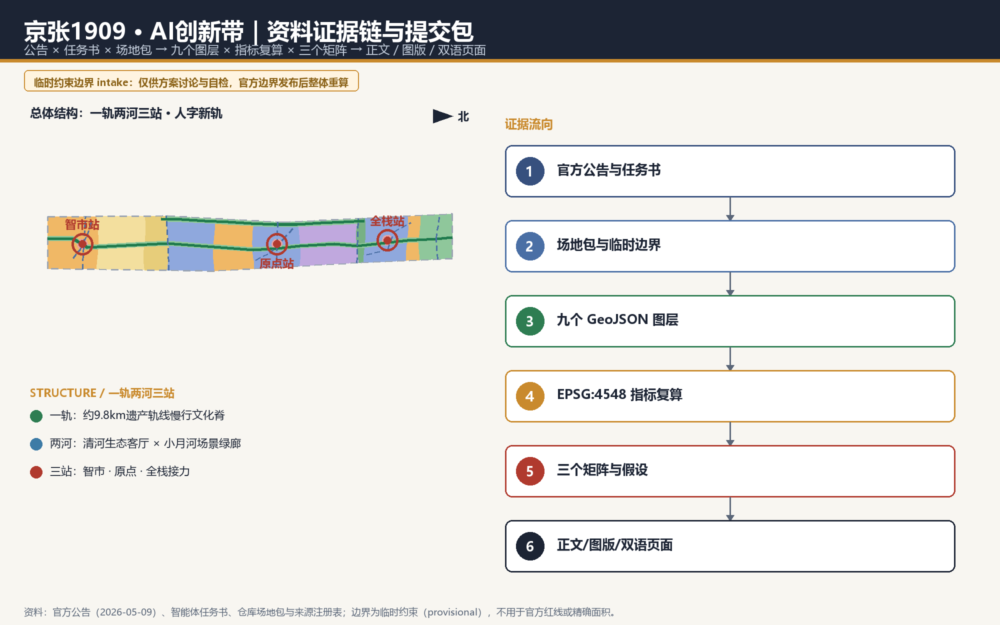
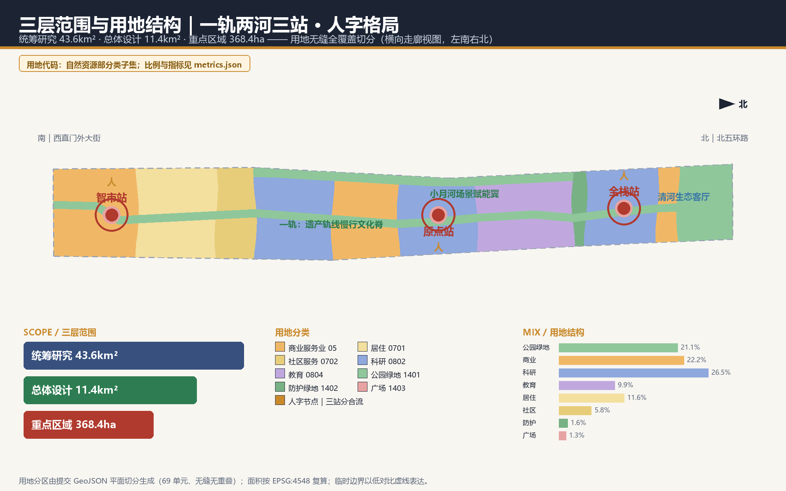
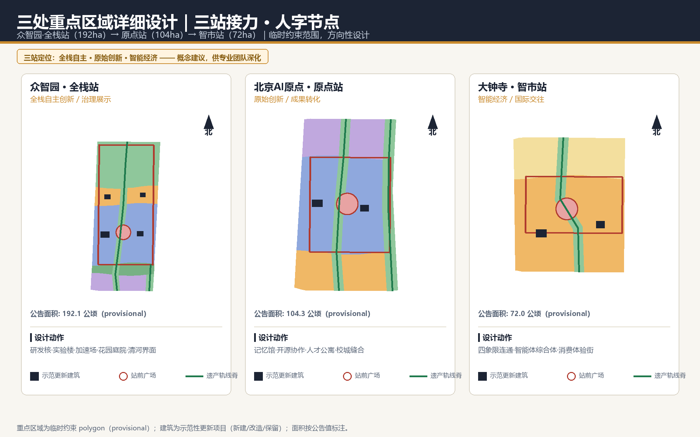
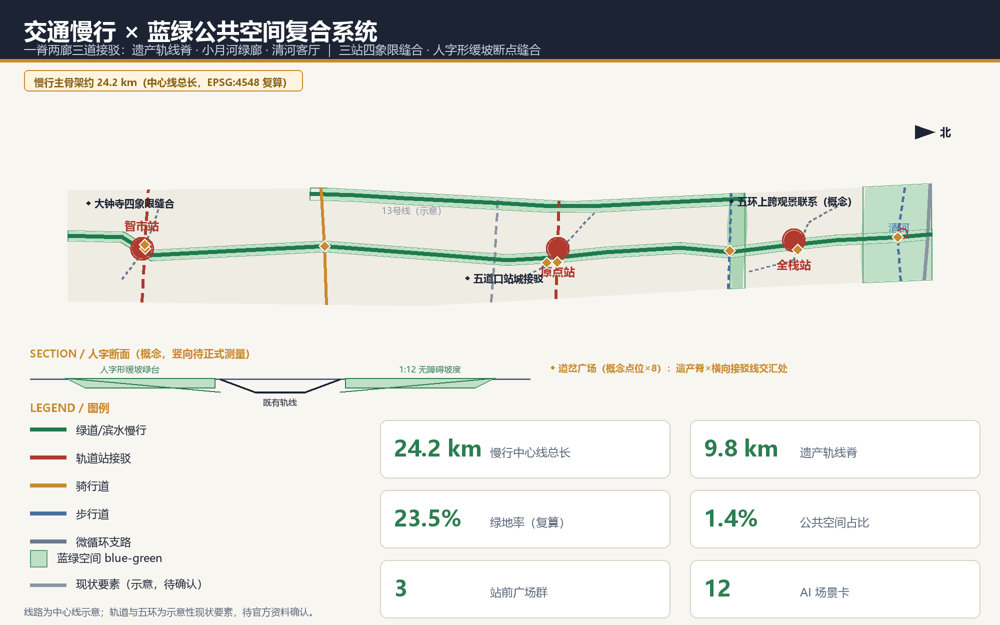
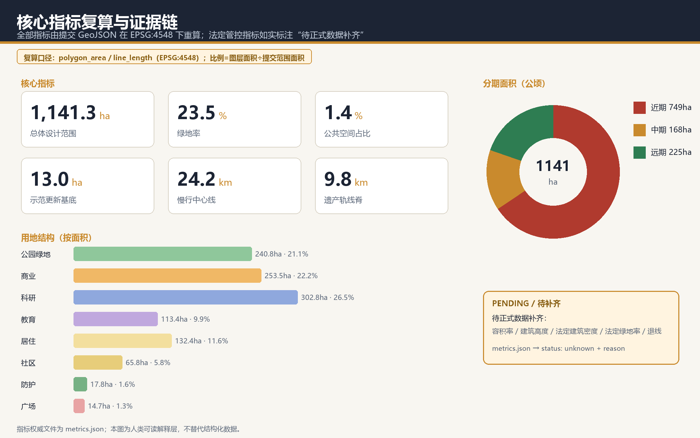

# 京张1909 · AI创新带：人字新轨——从争气路到智汇路的百年接力

## 设计依据与资料清单

本方案是面向“百年京张AI创新带城市设计国际方案征集”的 AI 智能体正式投稿，第一依据是北京市规划和自然资源委员会海淀分局发布的资格预审公告：三层范围、三处重点区域、设计任务与成果深度均按公告 1.3、1.4、1.5 组织 [source:OFFICIAL-ANNOUNCEMENT] [standard:PROJECT-OFFICIAL-ANNOUNCEMENT]。面向智能体的开源征集任务书提供了十条共创原则、三大定位、五大功能、三区两翼与六项必答任务，本方案逐条响应并写入正文 [source:AGENT-TASKBOOK]。

资料使用边界已在来源登记层区分：公告与任务书可作为正式任务依据；仓库登记的临时范围线仅用于方案生成、可视化与临时自检；控规指标、道路红线、权属、市政与文保控制线目前均无公开正式文件，全部标注为待正式数据补齐 [source:SOURCE-REGISTRY]。本方案采用仓库维护者登记的临时粗略边界作为设计底图，其按公告文字四至与公告面积在 EPSG:4548 下校核，面积复算结果与公告约 11.4 平方公里一致 [data:geometry/site_boundary.geojson#SITE-001] [metric:site_area_sqm]。

专业标准响应覆盖城市设计管理办法、控规编制审批办法与国土空间用地用海分类指南三项强制标准，用地代码全部采用场地包登记的分类子集，不自造分类 [standard:MNR-LAND-USE-CLASSIFICATION-GUIDE]。完整的来源、指标、标准、深度与任务覆盖机器索引分别保存在 `sources.json`、`metrics.json`、`standard_matrix.json`、`design_depth_matrix.json` 与 `compliance_matrix.json`，正文只保留与判断相邻的证据锚点。

本方案的方法立场：AI 智能体做城市设计，最诚实也最专业的贡献是“可复算”。所有面积、比例、长度、数量均从提交的九个 GeoJSON 图层在 EPSG:4548（CGCS2000 三度带，中央经线 117°E，适用于北京地区）下重新计算，不引用任何无法复核的数值 [depth:metrics_recalculation]。

## 三层范围工作框架

方案按公告确定的三层递进组织。统筹研究范围约 43.6 平方公里，承载“三区两翼”产业生态与战略判断；总体设计范围约 11.4 平方公里，是本方案空间落图与指标复算的主战场，达到控制性详细规划的城市设计深度；重点区域范围约 368.4 公顷，对众智园、原点社区、大钟寺三处片区达到规划综合实施方案的城市设计深度 [depth:three_level_scope_framework]。

三层范围的边界目前均为临时约束范围（provisional constraint）：仓库尚未取得官方精确红线，本方案使用维护者登记的临时 polygon 并如实标注，不将其作为官方红线、审批依据或精确面积依据 [data:geometry/key_areas.geojson#PROV-KEY-001]。待官方边界发布后，用地、建筑、道路、绿地、公共空间、分期六个设计图层与全部面积类指标需要整体重算，这一触发条件已登记在 `assumptions.json`。

在空间结构上，三层不是三张孤立的图：统筹研究层回答“一带为什么成立”，总体设计层把产业与更新判断落为可复算的用地与项目，重点区域层验证三处站区的可实施性 [depth:overall_spatial_structure]。

| 层级 | 公告面积 | 本层回答的核心问题 | 深度要求 |
| --- | --- | --- | --- |
| 统筹研究范围 | 约43.6平方公里 | AI创新生态如何组织、三区两翼如何协同 | 战略与结构研究 |
| 总体设计范围 | 约11.4平方公里 | 更新结构、用地、项目、设施如何落图 | 控规的城市设计深度 |
| 重点区域范围 | 约368.4公顷 | 三处站区如何实施 | 综合实施方案的城市设计深度 |

## 统筹研究范围产业与未来城市研究

统筹研究层的核心判断：海淀这条走廊的独特性不在于“有 AI 企业”，而在于它是中国工程自主创新精神的地理原点——1909 年詹天佑主持建成的京张铁路是中国人自行勘测设计的第一条干线铁路，五道口—中关村则是中国互联网与人工智能产业的策源地。本方案据此提出一带总体概念：**京张1909 · AI创新带（JZ-1909 AI Belt）**，设计母题为“**人字新轨**”——从“争气路”到“智汇路”的百年接力，命名体系、视觉识别与 Logo 方向均由此展开（详见 agent.1 响应） [source:AGENT-TASKBOOK]。

“人字新轨”是一座意义之桥，连接两个原点时刻。**1909 年的历史意义**：在“中国人不能自建铁路”的论断中，詹天佑以青龙桥“人字形线路”破题——面对八达岭段的大坡度硬约束，不靠更大功率的蛮力，而靠“以线换高”的几何智慧，以巧破题；京张铁路由此成为中国人完整掌握现代工程技术主权的原点宣言，“争气路”的本质是人的智慧主权。**2026 年的未来意义**：AI 创新带是智能时代的原点工程——从铁路主权到智能主权（全栈自主创新），从人员物资的流动到数据智能的流动；它要回答的不是“海淀有没有 AI 企业”，而是“AI 时代的城市如何组织”。正如 1909 年的铁路定义了工业时代的城市走廊，这条带要定义下一个百年的创新城市范式。**设计方法论**：“人字形”的以巧破题就是本方案的方法——面对存量权属、竖向高差、慢行断点与治理风险，不用大拆大建的蛮力，用精巧的空间组织；并且在 AI 创新带的头上写一个“人”字：技术越强大，人越要在场。

产业生态上，方案把“三大定位、五大功能、三区两翼”组织为一个接力回路：众智园承载全栈自主创新与治理话语权，原点社区承载原始创新与成果转化，大钟寺承载智能经济与国际交往，中关村科技服务翼注入资本与知识产权服务，小月河场景赋能翼提供城市级试验场 [standard:PROJECT-AGENT-OPEN-CALL-TASKBOOK]。这一回路的实质是“基础研究—中试转化—规模应用—全球传播”的创新链在空间上的连续化。

全球经验比照（背景研究，非官方数据）：匹兹堡从钢铁走廊到机器人走廊的转型证明“大学锚点+存量厂房”模式可行；伦敦国王十字知识街区证明轨道枢纽可以与高校、企业总部和公共空间复合；斯德哥尔摩 Kista 证明 ICT 集群需要生活服务才能留住人才；波士顿 Kendall Square 证明校区—园区界面是最重要的创新界面；深圳南山证明“政策性空间供给+场景开放”可以加速产业集聚；杭州城西科创大走廊证明廊道式布局需要轨道与蓝绿双骨架；慕尼黑 Werksviertel 证明旧工业区的文化再生能形成城市级目的地。七项经验的共同启示是：创新带首先是日常生活带，其次才是产业带。本方案将其转译为慢行、公共空间、人才服务与场景开放四类空间机制。

未来城市形态方面，方案判断 AI 对城市的首要改变不是“无人化”，而是空间使用的高频化、混合化与可验证化：研发、展示、交往、居住在同一条走廊上以更小颗粒度混合，城市服务以可解释、可复核的方式嵌入公共空间。所有空间落地表述均为概念建议，可供专业团队深化研究，不构成法定规划结论。

## 总体设计范围城市更新与控规深度城市设计

总体设计层把 11.4 平方公里的临时范围组织为“**一轨两河三站**”结构，并按控规的城市设计深度落实到六个设计图层 [depth:land_use_layout]。这一结构同时是“人字新轨”母题的**格局层转译**：一轨为干，两河为支，三站是连续的三个“人字节点”——每个站点都按分合流组织，把到达与出发、展示与参与、机器与人工的流线在站前广场交汇处分清、缝合，让“人字形”从百年前的线路智慧变成今天的空间组织方式。

**一轨**：京张遗产轨线慢行文化脊。沿旧京张铁路线位设置约 9.8 公里、宽约 116 米的遗产公园脊，串联三站与全部文化节点，是慢行、文化展示与 AI 场景的复合轴 [metric:heritage_spine_length_m]。**两河**：北端清河滨水生态客厅（约 72 公顷水面绿廊界面）与东侧小月河场景赋能绿廊（沿场地东边线内缩约 62 米生成，呼应任务书“小月河场景赋能翼”）。**三站**：大钟寺·智市站（智能经济与国际交往）、五道口·原点站（原始创新与成果转化）、众智园·全栈站（全栈自主创新与治理展示），每站以站前广场+接驳厅+更新单元组织 [data:geometry/public_space.geojson#PUBLIC-001]。

用地结构按国土空间分类代码完整切分、无缝无重叠全覆盖：科研用地（0802）约 302.8 公顷集中三站，商业服务业用地（05）约 253.5 公顷锚定大钟寺与五道口门户，教育用地（0804）约 113.4 公顷服务校城过渡，居住与社区服务（0701/0702）约 198.2 公顷保障职住平衡，公园绿地与广场（1401/1402/1403）合计约 273.3 公顷 [metric:land_use_area_0802_sqm]。产业功能比例为科研:商业:教育:居住社区≈34:28:13:22（按面积归一化），绿地与开敞空间占比约 24%，支撑“工作—生活—社交—学习”一体化 [metric:green_ratio]。

城市更新总体框架采用**双层更新单元**机制（概念建议，可供专业团队深化）：第一层是三站重点更新单元，以站前广场为锚捆绑周边低效空间，明确功能业态与建筑更新方向；第二层是沿轨线的场景嵌入式微更新，以口袋公园、接驳节点、首层业态置换为主，低扰动、可分期、可回退。19 个示范性更新项目已在建筑图层落位并区分新建/改造/保留三类 [data:geometry/buildings.geojson#BLDG-001]。

建筑总规模、容积率、建筑高度、建筑密度与退线等法定控制指标目前无任何官方依据，本方案不作数值伪装，全部标注为待正式控规条件确认 [standard:MOHURD-CONTROL-DETAILED-PLANNING]。

## 重点区域详细设计

三处重点区域按临时 polygon 分别开展详细设计，范围均为临时约束，结论为方向性设计 [data:geometry/key_areas.geojson#PROV-KEY-002]。

**大钟寺·智市站（约72公顷，临时范围）**。定位：城市型智能经济与国际交往街区。空间结构以“四象限步行连通”为第一动作，它正是“人字节点”的分合流组织：以站前广场（约4.9公顷）为人字交点，到达与出发、通勤与访客、机器服务与人工窗口在此分清再缝合，组织路口四象限的步行接驳，配建接驳厅与非机动车停放示范区；产业动作以智能体、智能终端与内容消费为主线，落位智能体服务综合体（新建）、领军企业国际交往中心（改造）、AI原生消费体验街（改造）三个示范建筑；风险点是路口交通组织与轨道一体化方案需要正式交通专项支撑，已列入待确认清单 [depth:three_key_area_detailed_design]。

**五道口·原点站（约104公顷，临时范围）**。定位：近校型原始创新与成果转化街区。第一动作是“校区—园区—街区”三区慢行缝合：三条来向在原点站前广场与开源发布广场汇成“人”字——校区带来原始创新、园区承接中试转化、街区供给日常生活，三路合流即“成果转化”的空间定义；向北连接高校方向、向南连接五道口南门户；核心文化动作是把清华园站记忆转译为“原点会客厅+记忆馆”（改造类示范建筑），配套开源协作中心与AI人才公寓（新建）；实施上建议低扰动有机更新，避免大拆大建。

**众智园·全栈站（约192公顷，临时范围）**。定位：花园型全栈自主创新街区。第一动作是“清河界面+花园创新”：研发核、安全治理与标准实验楼、自主生态加速场三个新建示范建筑围绕全栈站前广场与花园庭院布置，三个建筑与广场构成向北张开的“人”字——一翼接清河生态客厅（自然），一翼接加速场与实验楼（技术），广场是二者每日相遇的交点；向北衔接清河滨水生态客厅；对外交通方面，建议结合五环区域一体化规划研究跨五环步行观景联系（概念节点 PUBLIC-005），工程可行性待专业论证 [data:geometry/public_space.geojson#PUBLIC-005]。

## AI 创新生态、人才画像与 AI+ 场景

方案把“人”作为 AI 创新带的第一变量，建立六类用户画像，并以场景卡方式把 AI+ 落到空间、数据与运营边界上 [standard:PROJECT-AGENT-OPEN-CALL-TASKBOOK]。

| 用户画像 | 典型需求 | 空间响应 | 治理边界 |
| --- | --- | --- | --- |
| 开源开发者 | 发布、协作、声誉沉淀 | 原点站开源发布广场、贡献墙 | 仅聚合统计，不追踪个体轨迹 |
| 初创团队 | 低成本空间、算力入口、试验场 | 众智园加速场、端侧算力驿站 | 算力与数据服务另行授权 |
| 高校师生 | 成果转化、跨校协作 | 成果转化加速器、校城慢行缝合 | 科研成果数据需授权 |
| 头部企业与访客 | 展示、路演、国际交往 | 大钟寺国际路演客厅 | 企业标识与案例须清权 |
| 周边居民 | 通勤、休闲、低扰动更新 | 遗产公园脊、社区服务嵌入 | 不将居民画像用于商业推荐 |
| 国际研究者与游客 | 可理解的朝圣路线 | 1909朝圣路线与多语导览 | 导览内容可解释、可纠错 |

场景体系共 12 张场景卡，其中 3 张为 AI 产业测试验证场景（编号 07、08、10），每张卡映射空间载体、数据来源、隐私边界与人工复核机制；场景登记引用仓库场景注册表，未经核实的技术能力不写成可全面部署 [depth:existing_conditions_diagnosis]。面向公众的生成式场景（02 企业服务 Copilot、05 AI 文化导览）按《生成式人工智能服务管理暂行办法》第 2 条界定的适用范围设计合规边界：投诉举报按第 15 条预留及时处理渠道，但不虚构法定数字响应期限；安全评估与备案义务仅对应具有舆论属性或社会动员能力的服务，不泛化到全部场景 [standard:GENERATIVE-AI-INTERIM-MEASURES]。

| 场景卡 | 空间载体 | 卡片摘要 |
| --- | --- | --- |
| 01 AI慢行导航 | 遗产轨线脊全线 | 以可解释导视与低侵入传感识别慢行断点与拥挤节点，输出人工可复核的优化建议 |
| 02 企业服务Copilot | 三站服务驿站 | 为企业提供政策检索、空间匹配与申报导航，结论附来源与置信度 |
| 03 公共安全与活动运营复核 | 站前广场群 | 人流与活动风险只做聚合预警，处置决定由人工作出 |
| 04 低速无人配送测试 | 原点社区内街 | 限定路线、限速、可回退的配送试点，测试数据分级开放 |
| 05 AI文化导览 | 1909记忆线路 | 多语导览讲述京张铁路与中关村创新史，史实经文献校核 |
| 06 AI健康服务导航 | 社区服务节点 | 连接周边医疗与健康资源，不提供诊断结论；医疗等公共服务场所保留现场指导与人工办理通道 [standard:BARRIER-FREE-ENVIRONMENT-LAW]，传统服务与智能服务并行按国办发〔2020〕45号政策背景把握（其阶段性目标已到期，仅作场景设计参照） [source:ELDERLY-SMART-TECH-BACKGROUND] |
| 07 安全治理沙盒（测试） | 众智园实验楼 | 标准制定、可信评测与模型红队测试的可参观协作节点 |
| 08 端侧算力驿站（测试） | 三站公共服务点 | 分布式算力与低碳能源融合的新基建原型，供专业团队深化 |
| 09 开源发布厅 | 原点站广场 | 成果发布、代码贡献展示与小型路演 |
| 10 低碳运行监测（测试） | 清河滨水客厅 | 雨洪、能耗与碳排监测展示，指标口径公开 |
| 11 数据要素会客厅 | 大钟寺片区 | 以合规、授权、可审计为前提的数据流通城市界面 |
| 12 1909全球活动周路线 | 一带公共空间 | 开发者节、场景开放日与朝圣路线的年度运营组合 |

## 用地、建筑规模与拆改留方案

用地布局以临时总体设计范围为唯一边界，69 个用地单元由同一组切割线平面切分生成，相邻单元共享边界坐标，并集与提交边界完全重合 [data:geometry/land_use.geojson#LU-001]。用地代码全部采用场地包分类子集（05/0701/0702/0802/0804/1401/1402/1403），其中 1401 公园绿地约 240.8 公顷、1403 广场约 14.7 公顷、1402 防护绿地约 17.8 公顷，蓝绿开敞空间合计约 24% [metric:land_use_area_1401_sqm]。

建筑层面，19 个示范性更新建筑基底落位于开发类单元内，全部在项目图层中区分拆改留类别：新建 8 处（集中于三站）、改造 9 处（存量功能置换与形象更新）、保留 2 处（居住与教育资源）；“拆除”类本次不指定具体对象——现状建筑底数、权属与结构安全资料缺失，任何拆除结论都必须等待正式现状调查，这是本方案主动设置的专业刹车 [depth:retain_renovate_demolish]。

建筑基底总面积约 13.0 公顷，占提交范围约 1.1%，该值是示范性更新项目的建筑基底占比，不是法定建筑密度 [metric:building_footprint_share_design]。总建筑面积、容积率与高度分布全部待正式控规条件确认；风貌与体量引导按城市设计管理办法以“建议层级”表达：三站节点适度集聚、轨线两侧控制尺度、临清河与五环界面放低姿态 [standard:MOHURD-URBAN-DESIGN-MEASURES]。

## 交通、轨道、市政与公共服务设施

交通策略围绕“慢行连续、接驳一体、微循环补足”展开，全部线路在提交边界内生成 [depth:traffic_rail_slow_parking]。

慢行主骨架是遗产轨线脊绿道（约9.8公里）+小月河滨水绿道+清河滨水漫步道，三条 E-W 向接驳线分别缝合大钟寺四象限、五道口—清华东路西口、学院路—小月河，路网中心线总长约 24.2 公里 [metric:road_centerline_total_length_m]。针对公告点名的公园慢行断点，方案建议以五环上跨观景联系（PUBLIC-005，概念）与三处站前广场为“缝合针脚”，断点清单与工程可行性留待交通专项 [data:geometry/roads.geojson#ROAD-006]。断点缝合的断面做法是“人字新轨”的**断面层转译**：转译青龙桥“以线换高”的智慧，在轨线两侧以人字形缓坡绿台处理高差与穿越——坡度全段满足无障碍通行，坡台本身是看台、剧场与遮荫绿廊，把工程构造物变成日常公共空间；这与场景卡 06 保留人工通道的承诺互为表里 [standard:BARRIER-FREE-ENVIRONMENT-LAW]。竖向策略上，轨线凹槽、两侧地坪与建筑首层的高差关系统一按人字断面把握；现状轨顶标高、场地竖向与地下管线均无公开资料，竖向方案全部待正式测量与专项论证。

轨道站点一体化：大钟寺站、五道口/清华东路西口按“站前广场+接驳厅+非机动车停放示范区”组织概念方案，轨道线位以示意图层表达并标注待官方资料确认 [data:geometry/constraints.geojson#CONS-002]。站前广场与接驳厅建议同步研究地下空间分层利用（接驳换乘、市政廊道与非机动车停放），地下权属与工程条件待专项资料确认。

市政与新型基础设施：方案提出“端侧算力驿站+分布式能源+传统市政”的融合方向（场景卡08），设施标准、能源负荷与市政容量不作工程测算，列为正式深化前置条件 [depth:municipal_new_infrastructure]。

## 蓝绿空间、公共空间与城市风貌

蓝绿骨架由“一脊一廊一客厅一环带”构成：遗产轨线公园脊约 118 公顷、小月河绿廊、清河滨水生态客厅、五环生态防护绿带，绿地系统总面积约 267.9 公顷，占提交范围约 23.5% [metric:green_space_area_sqm]。蓝绿系统同时承担海绵城市与防洪安全方向：清河、小月河按河道蓝线与防洪排涝要求校核（暂无公开文件，待专项确认），绿地按源头减排组织雨水径流；三处站前广场与大型公园绿地按平灾结合预留应急避难功能（概念预留，容量与设施待防灾专项）。公共空间体系以三处站前广场（合计约 14.7 公顷广场用地）+清华园站记忆节点+五环上跨观景节点+清河观景节点组织，是活动、展示与日常交往的容器 [data:geometry/public_space.geojson#PUBLIC-002]。在此之上叠加“人字新轨”的**标识层**：遗产脊与八条横向接驳线的交汇处设“道岔广场”序列（8 处概念点位，图面以菱形符示意见 mobility 图，待正式资料落位）——铺地以两轨分合的“人”字肌理收束方向，每一座道岔广场都是一次“方向选择”的空间化，隐喻智能时代选择权在人；同一“人”字母题贯穿 Logo 方向、导向系统、驿站立面与第五立面。

**AI 朝圣地标群（概念建议，不少于3处）**：①**原点会客厅**——清华园站记忆馆，讲述“争气路”与中国 AI 原点故事，是“人字新轨”的叙事起点；②**全栈之光**——众智园临清河界面的花园式展示地标，人字形缓坡绿台与展示体量结合（概念形态，供深化）；③**智市之门**——大钟寺四象限缝合后的城市门厅，门厅轴线对人字交点（概念形态，供深化）。配套“京张1909贡献墙+年度荣誉榜单”荣誉展示体系，所有图形、字体与标识须清权后使用 [standard:PROJECT-AGENT-OPEN-CALL-TASKBOOK]。

城市风貌基调定为“轨道记忆、日常创新”：保留工业遗存材质与线路肌理，新建部分以克制的高度与通透的界面融入；屋顶与第五立面在轨线视角下统一引导；风貌控制分官方管控、设计建议与待确认三类表达，不输出伪精确控制线 [depth:height_massing_character]。遗产保护按最小干预、可逆性与可识别性原则把握：清华园站记忆馆等改造类动作只做可逆嵌入；京张铁路遗产的保护范围与建设控制地带暂无公开文件，全部保护动作待文保专项资料确认后深化。

## 更新项目清单、实施政策与分期计划

更新项目清单按“三站锚点+轨线缝合+蓝绿提升+服务嵌入”组织，分期与空间范围已在分期图层落位 [depth:renewal_project_list]。

| 编号 | 项目 | 类型 | 分期 | 主要前置条件 |
| --- | --- | --- | --- | --- |
| JZ1909-01 | 大钟寺四象限步行连通 | 交通/公共空间 | 近期 | 交通专项、道路红线 |
| JZ1909-02 | 智市站前广场与接驳厅 | 公共空间/建筑 | 近期 | 轨道一体化方案 |
| JZ1909-03 | 原点会客厅（记忆馆） | 文化/改造 | 近期 | 文保资料、产权确认 |
| JZ1909-04 | 开源发布广场 | 公共空间 | 近期 | 运营主体确定 |
| JZ1909-05 | 遗产轨线脊南段贯通 | 绿地/慢行 | 近期 | 用地权属、断点工程论证 |
| JZ1909-06 | 校城慢行缝合线 | 慢行 | 中期 | 校区管理协同 |
| JZ1909-07 | 小月河场景绿廊 | 蓝绿/场景 | 中期 | 河道蓝线与生态要求 |
| JZ1909-08 | 全栈站研发核与实验楼 | 产业/建筑 | 远期 | 控规条件、产业准入 |
| JZ1909-09 | 清河滨水生态客厅 | 蓝绿 | 远期 | 防洪与生态专项 |
| JZ1909-10 | 五环上跨观景联系 | 慢行/景观 | 远期 | 工程可行性论证 |
| JZ1909-11 | 端侧算力驿站试点 | 新基建 | 中期 | 能源与安全评估 |
| JZ1909-12 | 1909贡献墙与导视系统 | 文化/标识 | 近期 | 版权清权 |
| JZ1909-13 | 人字道岔广场序列 | 公共空间/标识 | 近期 | 竖向与管线资料 |

分期建议（概念，供专业团队深化）：近期（0—3年）启动三站锚点与南段缝合约 748.9 公顷，中期（3—6年）推进校城过渡与东西缝合约 167.6 公顷，远期（6—10年）完成众智园与两河客厅约 224.7 公顷 [metric:phase_1_area_sqm]。实施机制建议衔接北京市城市更新现行的统筹主体与实施方案制度（概念衔接，正式适用以主管部门要求为准）：三站锚点项目宜作为统筹主体牵头单元，轨线缝合与蓝绿提升类宜政府主导、基础设施先行。

**长期运营体系（agent.6 响应）**：年度活动组合建议为“一节三日”——京张1909开发者节（年度旗舰）、春秋两场场景开放日、冬季城市挑战赛，配合“1909生活线”日常运营；开发者社区以开源发布厅与贡献墙沉淀声誉资产；场景开放采取“申请—评估—公示—复核”四步机制；转化路径覆盖人才（人才公寓与服务）、企业（加速场与对接会）、开发者（榜单与活动）三条线。所有活动、政策与资金表述均为概念建议，不构成已确定的政府安排 [source:AGENT-TASKBOOK]。

## 指标体系、面积复算与合规矩阵

指标体系分三类管理。第一类是**空间复算指标**，全部由提交几何在 EPSG:4548 下重算：总体设计范围约 1141.28 公顷、绿地率约 23.5%、公共空间占比约 1.4%、建筑基底约 13.0 公顷、路网中心线约 24.2 公里、三站用地约 368.4 公顷（公告值、临时范围） [metric:public_space_ratio]。第二类是**法定管控指标**：容积率、建筑高度、建筑密度、绿地率管控值、退线等，现状无官方依据，全部标注待正式数据补齐。第三类是**运营绩效指标**：AI 创新指数、人才密度、活动参与度、慢行连通度等，需运营数据持续校准，本次只定义口径、不填伪值。

面积复算口径：所有面积在 EPSG:4548 投影下由 polygon 几何直接计算，比例类指标为相应图层面积与提交范围面积之比 [depth:metrics_recalculation]。合规覆盖上，公告 1.3、1.4、1.5 全部 17 项任务与 agent.1—agent.6 六项任务在 `compliance_matrix.json` 逐条映射到章节、图层、指标、图纸与自检项；三项强制专业标准与 15 项设计深度分别在 `standard_matrix.json` 与 `design_depth_matrix.json` 登记为已响应/已完成。

## 风险、版权与合规说明

本方案遵守共创宪章与边界条款：全部空间落地建议均为概念建议、参考方案，可供专业团队深化研究；不声称官方批准、审定控规、最终权属、最终建设规模或实施承诺 [source:AGENT-TASKBOOK]。

主要风险：①官方边界、控规、道路红线、市政、文保与权属资料缺口——全部列入 `assumptions.json` 待补清单，替换官方数据后需整体重算；②临时边界的矩形感可能误导精确解读——图面已按要求以低对比虚线表达；③AI 场景的隐私与伦理边界——场景卡均标注数据最小化与人工复核原则，生成式服务的投诉处置与安全评估边界按暂行办法条款级口径把握 [depth:risk_missing_data] [standard:GENERATIVE-AI-INTERIM-MEASURES]。

版权与生成披露：本方案文本、几何、图版与页面由声明的 AI 智能体生成，仅使用仓库登记或公开清权资料；不含未经授权的商标、字体、图片与人物肖像；`report/copyright_statement.md` 提供完整声明。可视化页面为离线静态文件，不加载任何远程资源或追踪代码。

## 参考资料

- 北京市规划和自然资源委员会海淀分局：《百年京张AI创新带城市设计国际方案征集资格预审公告》，2026-05-09。
- 《面向全球智能体开展百年京张AI创新带城市设计开源征集任务书摘录》（用户提供清权摘要），2026-05-18。
- 住房和城乡建设部：《城市设计管理办法》；《城市、镇控制性详细规划编制审批办法》。
- 自然资源部：《国土空间调查、规划、用途管制用地用海分类指南》（2023）。
- 仓库场地包：`brief/site-package/`（任务书、设计空间、枚举、限值、模式、临时边界与依据说明）。
- 仓库来源注册表与事实包：`data/source_registry.json`、`data/processed/agent_fact_pack.md`。
- 完整机器索引以 `sources.json` 与三个矩阵文件为准 [source:SITE-PACKAGE]。
