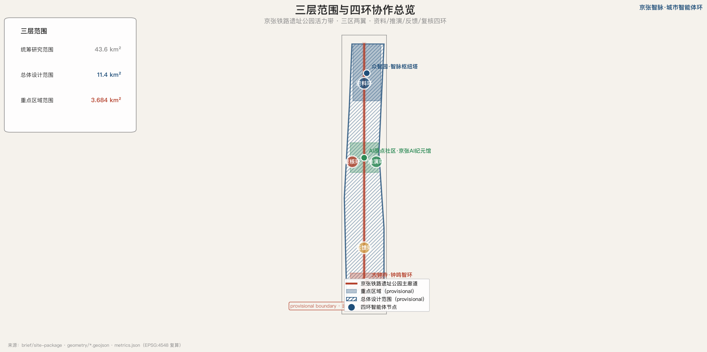
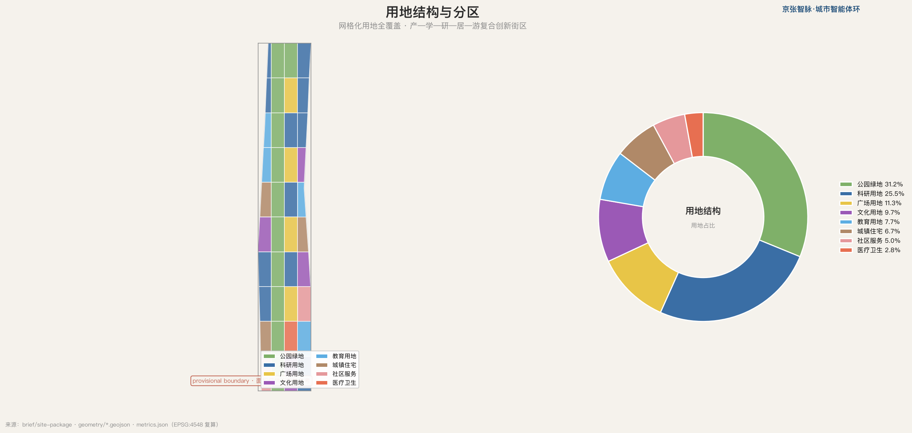
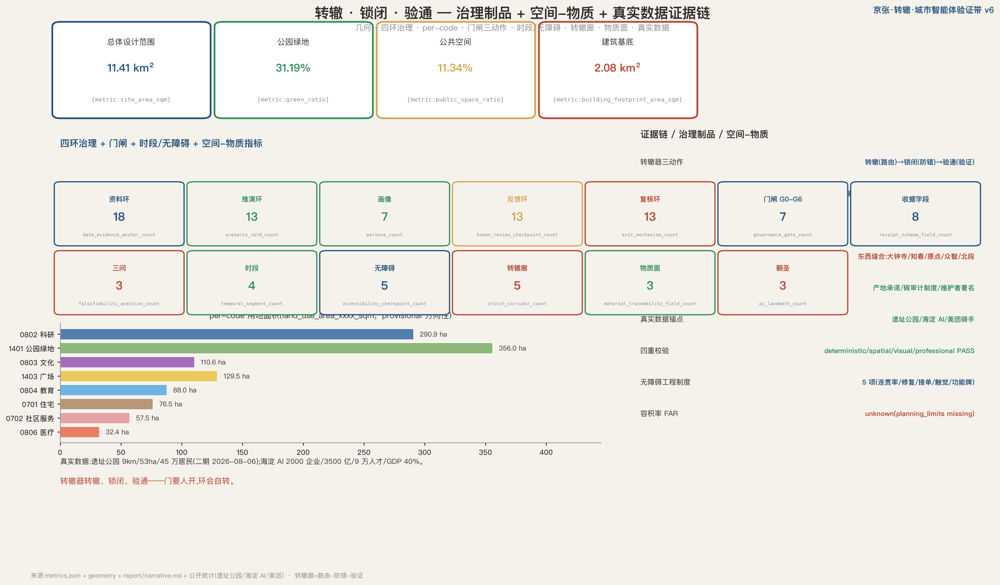

# 京张·转辙 · 城市智能体验证带

## 设计依据与资料清单

本方案的核心判断是：百年京张 AI 创新带最该被设计的不是终局蓝图，而是一个**会自转的四环协作接口**——资料环整理证据、推演环生成多方案、反馈环收集公众与传感反馈、复核环做合规与人工把关，四环首尾相接、彼此校验、循环不息。**门要人开，环会自转**。资料底座包括结构化场地包 `[source:SITE-PACKAGE]`、公开来源登记 `[source:SOURCE-REGISTRY]`、处理后事实包 `[source:PROCESSED-FACT-PACK]`、provisional 边界来源 `[source:BOUNDARY-SOURCE]`、重点区来源 `[source:KEY-AREA-SOURCE]` 与资格预审公告 `[source:OFFICIAL-ANNOUNCEMENT]`，所有判断可追溯、可复核 `[source:AGENT-TASKBOOK]`，所有空间建议均为概念建议 `[standard:PROJECT-AGENT-OPEN-CALL-TASKBOOK]`。

本方案的第二条主线是 **agent-readable city**——把城市建成可被下一个智能体继承、迭代、纠错的公共接口。每个空间建议都附带机器可读图层 `[data:geometry/site_boundary.geojson]`、指标、置信边界，每个地块标注拆改留动作与主导治理环。更进一步，本方案把"可读"落成**机器可读治理制品**：每次干预产出一份 Civic Agent Receipt 收据、走 G0-G6 门闸状态机，使四环成为可审计、可回滚、可证伪的状态机而非隐喻。约束图层记录文保、蓝线、交通等公开约束 `[data:geometry/constraints.geojson]`，正文证据锚点密度见资料环指标 `[metric:data_evidence_anchor_count]`。

## 三层范围工作框架

工作范围遵循公告三层结构：统筹研究范围 43.6 平方公里承担世界级 AI 创新生态体系研究；总体设计范围 11.4 平方公里承担控规深度总体城市设计；重点区域范围 3.684 平方公里承担三处重点区详细设计 `[depth:three_level_scope_framework]`。三层范围通过四环协作逐级落实，四环不是并列步骤而是**循环回路**：资料环为推演环供料、推演环为反馈环提供可比方案、反馈环为复核环提供证据、复核环又回头校正资料环——这正是"环"区别于"门"的本质 `[standard:PROJECT-OFFICIAL-ANNOUNCEMENT]`。

方案命名「京张·转辙 · 城市智能体验证带」（Jing-Zhang Switch）以**铁路转辙器（switch）为母题**——取其完整工程动作：**转辙（路由）→ 锁闭（防错）→ 验通（验证）**。转辙器在铁路上决定列车走哪条股道、转辙后必须锁闭以防列车走上错误股道、道岔验通才许通行；在城市智能体里对应三环路由（转辙）、人工复核上锁（锁闭）、受控测试验通（验通），是唯一能同时隐喻"铁路"与"agent 路由决策"的物件；图形为四环嵌套的同心轨道叠加转辙器岔心，主色转辙蓝 #1F4E79 与京张红 #B4402B，延展色取蓝绿 #2E8B57 与宣纸底 #F5F2EC。三区两翼协同回路以众智园、AI 原点社区、大钟寺为三核，中关村科技服务翼与小月河场景赋能翼为两翼 `[data:geometry/key_areas.geojson]`，总体范围面积 `[metric:site_area_sqm]`。三层范围几何均为 provisional，重点区面积仅供方向性参考。

## 统筹研究范围产业与未来城市研究

统筹研究范围回应公告 1.5（1）关于世界级 AI 创新生态体系的要求 `[source:AGENT-TASKBOOK]`。本方案研究全球 AI 创新生态并提出可转化机制，每个案例附公开核查入口与"借鉴机制 / 不照搬边界"两列：硅谷沙丘路、伦敦 King's Cross、首尔 DMC、阿姆斯特丹 Marineterrein、深圳湾、波士顿 Kendall Square、东京柏叶、巴塞罗那 22@。**区域协同回路**（京津冀四向 `[metric:regional_synergy_loop_count]`）：海淀做原创策源（本带）—怀柔科学城做大科学装置与基础研究接力—北京经济技术开发区（亦庄）做智能制造成果转化—天津/雄安做场景放大与区域复制，形成"原创→装置→转化→放大"的四向分工回路；本带的转辙枢纽塔即回路的可视化调度台。案例后专门设**失败教训对照**（如多伦多 Quayside 因数据主权争议搁浅），反推场景卡"数据来源 / 隐私边界 / 人工复核 / 失败回退"四要素。

现状诊断基于公开资料与真实数据锚点 `[source:SITE-PARK-FACTS]` `[source:HAIDIAN-AI-FACTS]`：京张铁路遗址公园二期已于 2026-08-06 全面开放，全线约 9 公里、约 53 公顷，服务沿线近 70 个社区、约 45 万居民、9 个街镇与 10 余所高校科研院所；海淀区聚集 AI 企业超 2000 家、AI 核心产值超 3500 亿元（约占全国 30%）、AI 人才约 9 万、AI 产业占全区 GDP 约 40%。（visual 来源表同步十个公开/站内源 `[metric:visual_source_row_count]`）。本方案识别的典型问题：公共空间被交通与用地切割、东西缝合与南北到达不足、面向青年与中小团队的低门槛公共界面稀缺、AI 场景丰富但缺少持续记录资料与反馈的开放机制 `[depth:existing_conditions_diagnosis]`。用地结构以网格化分区重构总体设计范围 `[data:geometry/land_use.geojson#LU-090]`，统筹与总体范围关系见指标 `[metric:site_area_sqm]`。未来城市形态提出"agent-readable city"方向：所有空间建议都附带机器可读图层、指标、置信边界、拆改留与主导环标注，使后续智能体直接继承迭代。

## 总体设计范围城市更新与控规深度城市设计

总体设计范围达控规城市设计深度，回应公告 1.5（2）`[standard:MOHURD-CONTROL-DETAILED-PLANNING]`。总体空间结构以「一带三核两翼四环」为骨架，用地布局遵循《城市设计管理办法》`[standard:MOHURD-URBAN-DESIGN-MEASURES]`，按国土空间用地用海分类指南编码 `[standard:MNR-LAND-USE-CLASSIFICATION-GUIDE]`，形成产—学—研—居—游复合创新街区 `[depth:land_use_layout]` `[depth:overall_spatial_structure]`。

更新框架采用**复核环驱动的循环流程**（识别—评估—建议—复核—回炉），区别于线性流程：智能体先基于公开资料生成保留 / 改造 / 楔入分类建议（每个地块带 renewal_action 属性），由规划、交通、文保、社区代表人工复核，复核结论回流资料环更新下一轮。典型更新单元如众智园北段科研用地 `[data:geometry/land_use.geojson#LU-090]`、AI 原点社区中段教育文化用地 `[data:geometry/land_use.geojson#LU-060]`、大钟寺南段产业用地 `[data:geometry/land_use.geojson#LU-030]`，复核检查点数量见治理环指标 `[metric:human_review_checkpoint_count]`。本方案不给出容积率、建筑高度、拆改留具体地块或道路红线最终结论——这些法定判断依赖尚未公开的审定控规，待专业团队取得官方条件后深化。

## 重点区域详细设计

重点区域范围对三处重点区开展详细设计 `[depth:three_key_area_detailed_design]`。众智园 AI 自主创新加速区（provisional 192.1 公顷）定位 AI 全栈自主创新策源地 `[data:geometry/key_areas.geojson#zhongzhiyuan_ai_acceleration_area]`，布局**四坊**（算力枢纽坊 / 研发实验坊 / 孵化加速坊 / 开放测试坊 `[metric:zhongzhiyuan_workshop_count]`），四坊对应门闸节律：算力坊服务 G0 资料与 G1 推演（分级配额制度）、研发坊承接 G2 反馈迭代、孵化坊走 G3 锁闭申请、开放测试坊即 G4 验通场地；设第一处 AI 朝圣地标「转辙枢纽塔」——以转辙器为形：一座 agent 编排观测台，公众可在此看到智能体如转辙器般把资料、方案、反馈路由到对应的处理股道，是四环与门闸的可视化中枢。北京 AI 原点社区（provisional 104.3 公顷）定位世界级 AI 创新生态原点 `[data:geometry/key_areas.geojson#beijing_ai_origin_community]`，布局**三厅**（纪元厅=AI 起源博物馆与叙事锚 `[metric:ai_origin_hall_count]`、共创厅=开发者社区与开源贡献荣誉墙、起居厅=青年第三空间与全龄游戏），三厅分别承接场景 07 遗产叙事、11 议事治理、10 人才匹配；设第二处朝圣地标「京张 AI 纪元馆」——以詹天佑自主设计精神串联 AI 起源叙事。大钟寺 AI 产业聚集区（provisional 72.0 公顷）定位智能原生新业态 `[data:geometry/key_areas.geojson#dazhongsi_ai_industry_cluster]`，布局**三市**（晨市=服务劳动者早餐与三班交班 `[metric:dazhongsi_market_count]`、日市=智能原生消费与商务、夜市=暗夜友好灯光夜经济——与四时段基线正对应），设第三处朝圣地标「钟鸣智环」——civic feedback 广场。朝圣地标数量见指标 `[metric:ai_landmark_count]`，分期起点见图层 `[data:geometry/phasing.geojson#PHASE-001]` `[metric:key_area_count]`。若 polygon 为 provisional，上述结论仅作方向性设计。

## AI 创新生态、人才画像与 AI+ 场景

本方案以场景为 AI 落地最小单元，回应任务书 agent.3 `[source:AGENT-TASKBOOK]`。产业测试验证场景**全部为数字孪生 / 合规 / 仿真型**。每张场景卡映射到空间载体、服务对象、数据来源、隐私边界、人工复核、**失败回退**与风险八列 `[data:geometry/public_space.geojson]`，场景总数见指标 `[metric:scenario_card_count]`，退出机制总数见指标 `[metric:exit_mechanism_count]`。

| # | 场景 | 空间载体 | 服务对象 | 数据来源 | 隐私边界 | 人工复核 | 失败回退 |
|---|---|---|---|---|---|---|---|
| 01 | 多模态城市资料中台 | 全域·资料环 | 全体智能体/公众 | 公开任务书+登记 | 聚合脱敏 | 资料委员会 | 回退至上一稳定版本 |
| 02 | 用地合规自动复核 | 众智园·复核环 | 规划师 | 公开控规红线 | 不存个人数据 | 规划师终审 | 标记待定+人工裁定 |
| 03 | 交通 OD 推演沙盘 | 全域·推演环 | 治理者 | 公开交通统计 | 聚合无轨迹 | 交通专家复核 | 推演作废+重设参数 |
| 04 | 公共空间活力反馈 | AI 原点·反馈环 | 居民/访客 | 授权反馈 | 反馈脱敏 | 社区代表 | 关停+线下征集 |
| 05 | 碳排仿真与蓝绿调度 | 全域·推演环 | 治理者 | 公开监测站 | 无个人数据 | 环境专家 | 切换保守调度 |
| 06 | AI 研发用地智能匹配 | 众智园·资料环 | 创业者 | 公开资源目录 | 企业自主申报 | 园区审核 | 退回人工匹配 |
| 07 | 京张遗产叙事生成 | AI 原点·复核环 | 访客/学者 | 公开史料 | 不涉肖像权 | 文保专家 | 下架+人工撰写 |
| 08 | 适老化公共服务导航 | 大钟寺·反馈环 | 老年居民 | 公共服务目录 | 不存身份 | 社工复核 | 转人工窗口+纸质 |
| 09 | 应急疏散推演 | 全域·推演环 | 治理者 | 公开空间数据 | 无个人数据 | 应急部门 | 启动既定预案 |
| 10 | 人才画像空间匹配 | 众智园·资料环 | 人才/企业 | 授权画像 | 最小化+可撤回 | 人才办 | 清除画像+申诉 |
| 11 | 众创社区议事治理 | 大钟寺·反馈环 | 居民/治理者 | 公开议事 | 议事公开 | 议事会 | 复议+独立仲裁 |
| 12 | 数字包容三通道服务台 | 三重点区·反馈环 | 老年人/服务劳动者 | 公共服务目录 | 不存身份 | 社工+志愿者 | 全量转人工+纸质回退 |
| 13 | 无障碍连贯率监测 | 全域·反馈环 | 视障/行动不便者 | 公开空间+授权反馈 | 聚合无轨迹 | 无障碍专家+网格员 | 修复工单+复检合格率 |

**可证伪条款·组一（验证场景 01-05）**（每条=触发条件/响应时限/复核人/回滚动作 `[metric:falsifiable_clause_count]`）：01 资料中台——来源断链超 5% 触发 / 48 小时内补链 / 资料委员会 / 回退上一稳定版本；02 用地复核——误判任一红线 / 即时 / 规划师终审 / 全批转人工待定；03 OD 推演——与历史 OD 误差超阈值 / 72 小时 / 交通专家 / 作废重设参数；04 活力反馈——误分类率超阈值 / 7 天 / 社区代表 / 关停转线下征集；05 碳排仿真——与监测站偏差超限 / 7 天 / 环境专家 / 切换保守调度。阈值在 G4 受控测试中标定，不预设数值。

**可证伪条款·组二（生产场景 06-10）**：06 用地匹配——错配投诉超阈值 / 7 天 / 园区审核 / 退回人工匹配；07 遗产叙事——出现任一史实错误 / 即时 / 文保专家 / 下架转人工撰写；08 适老化导航——导航错误投诉 / 48 小时 / 社工复核 / 转人工窗口+纸质；09 应急推演——演练偏差超限 / 即时 / 应急部门 / 启动既定预案；10 人才画像——任一授权撤回或画像投诉 / 即时 / 人才办 / 清除画像+申诉通道。

**可证伪条款·组三（包容场景 11-13）**：11 议事治理——出现议题操纵嫌疑 / 7 天 / 议事会 / 复议+独立仲裁；12 数字包容——人工通道等待超限 / 48 小时 / 社工+志愿者 / 全量转纸质回退；13 无障碍监测——连贯率较上月下降超阈值 / 月度盲测周期 / 无障碍专家+网格员 / 修复工单+复检合格率闭环。至此 **13 张场景卡全部自带可证伪条款**，与失败档案复盘年度仪式衔接成完整闭环。visual 场景区 13 卡同步条款提示 `[metric:visual_scenario_clause_count]`。

用户画像七类 `[metric:persona_count]`：AI 创业者与算法工程师、高校研究者与京张学者、原住民与老年居民、返乡青年与数字游民、城市治理者与规划师、京张通勤者，以及**服务劳动者（骑手 / 保洁 / 安保 / 配送员）**——他们是创新带日常运转的支撑者却最易被数字方案忽略（参照公开数据，2024 年仅美团月均有收入骑手即达 336.3 万、53.7% 为家庭唯一收入来源 `[source:PLATFORM-LABOR-FACTS]`）。本方案为服务劳动者配早/日/夜三班交班厅（抵达/休息/餐食/照护/维修/申诉六接口），夜间遵循“有人、有光、有水、有退路”四要素，并在数字包容三通道、公共空间组件库与低速试点中显式纳入其需求。建筑体量与风貌围绕画像与场景组织 `[depth:height_massing_character]`，高度受限于未公开控规仅作方向性建议。所有涉个人服务、企业经营、医疗、法律与公共安全的场景均为信息辅助，不替代专业判断。七类画像逐类深化（需求清单/服务映射/数据边界/申诉通道四行）进度 `[metric:persona_deep_dive_count]`/7。

**画像深化·7 服务劳动者（骑手/保洁/安保）**：需求——三班交班厅、低速驿站、充电与申诉；服务映射——场景 12 / 晨市 / 全龄节点；数据边界——平台公开统计,不采个体轨迹；申诉通道——不与接单权绑定的独立申诉通道。

**画像深化·6 京张通勤者**：需求——慢行接驳、断点消除、夜间安全；服务映射——慢行系统 / 夜间四要素 / 场景 09 应急；数据边界——聚合 OD,无个人轨迹；申诉通道——交通专家复核渠道。

**画像深化·5 城市治理者与规划师**：需求——推演沙盘、合规复核、指标看板；服务映射——场景 02/03/05/09；数据边界——公开统计+授权聚合,无个体数据；申诉通道——专家复核+部门角色终审。

**画像深化·4 返乡青年与数字游民**：需求——共享办公、社群连接、可负担住房；服务映射——起居厅 / 人才公寓 0701；数据边界——授权画像,可随时撤回；申诉通道——人才办申诉通道。

**画像深化·3 原住民与老年居民**：需求——适老化导航、安置透明、社区医疗可达；服务映射——场景 08 导航 / 12 三通道 / 0806 医疗用地；数据边界——不存身份,纸质可办全量；申诉通道——社工复核+亲属代办通道。

**画像深化·2 高校研究者与京张学者**：需求——史料开放、公共实验场景、跨校协同；服务映射——场景 07 遗产叙事 / 原点公共实验平台；数据边界——仅公开史料,不涉未发表成果；申诉通道——文保专家复核渠道。

**画像深化·1 AI 创业者与算法工程师**：需求——算力分级配额、公共数据目录、创投对接、低成本孵化空间；服务映射——场景 06 用地匹配 / 10 人才画像 / 众智园孵化坊；数据边界——企业自主申报,不采集经营流水；申诉通道——园区审核+人才办窗口,48h 响应。

## 机器可读治理制品（Receipt + 门闸状态机）

本方案把"agent-readable city"从宣言落成可运行制品，使四环协作成为**可审计、可回滚、可证伪的状态机**，而非隐喻。每次城市智能体干预产出一组配套制品（Receipt / 门闸状态机 / 留白验证区 / Agent Passport），全部位于 `report/` 目录。

**Civic Agent Receipt 收据**（`report/narrative.md § Receipt Schema`）定义每次干预的字段：证据引用、人工责任（写角色不指派真实政府部门）、最差组优先（受影响最大群体）、申诉通道、处置结果（pending / pass / fail / rollback / exit）、运行状态（sandbox_only / not_run / controlled_test / public_pilot / retired）、性能结果（null 表示未运行，不冒充已测试）。收据字段数见指标 `[metric:receipt_schema_field_count]`，另设三个可选字段（影响相关方/已施缓解/申诉时限）`[metric:receipt_optional_field_count]`。

**G0-G6 七道门闸状态机**（`report/narrative.md § Gate State Machine`）是转辙器三动作的状态机展开：G0-G2 转辙（三环路由）、G3 锁闭（人工复核上锁，未锁不得进入公开空间）、G4 验通（受控测试，验不通退回 G1 重转辙）、G5-G6 开放与退役。它把四环落成可复核门闸 `[metric:governance_gate_count]`：G0 资料就绪→G1 推演生成→G2 反馈接入→G3 人工复核（申请）→G4 受控测试（验证）→G5 公开试点（开放）→G6 退役迭代（退役）。每道门闸有进入条件、可复核状态、未通过处理、人签。**环会自转——任何一道未过都回流上游环，而非顺序终止**。验线四步（申请→验证→开放→退役）映射 G3→G6，每个场景卡自带**可证伪三问**（能否被证伪、退出后空间如何处置、公众能否独立触发暂停），三问数见指标 `[metric:falsifiability_question_count]`；七道门闸逐道深化卡（规程全解 + 阶段收据示例 + 失败案例模板）见 `report/narrative.md`，进度 `[metric:gate_deep_dive_count]`/7。每道门闸的回滚去向固化为 rollback_map（七条回滚路径 `[metric:rollback_path_count]`）。visual 门闸区同步展示七条回滚映射 `[metric:visual_rollback_row_count]`。

**留白验证区（临时用途机制）**：AI 场景用地作为按生命周期管理的临时用途（申请→验证→开放→退役），退出后按用途兼容清单处置、**不改变法定用地性质**——可直接被控规采用的制度接口，与 G5 开放授权、G6 退出处置闭环衔接。配套**用地兼容清单**（临时用途 × 用地代码，8 条规则 `[metric:land_use_compatibility_rule_count]`）：AI 测试与展示场景**兼容** 0802 科研 / 1401 公园绿地 / 1403 广场 / 0803 文化；**有条件兼容** 0804 教育（限教学时段外）/ 0702 社区服务（限服务不占产）；**不兼容** 0701 住宅（安静需求）/ 0806 医疗（不对公众开放测试）——退出后按此清单回到原用途（结构化三组清单见 `report/narrative.md § 兼容清单` `[metric:compatibility_category_count]`）。

**示例收据**（`report/narrative.md § Example Receipt`）演示用地合规自动复核场景的 G3 收据，明确标 sandbox_only / not_run / performance_results=null——不冒充已运行。真实运行须先在 G4 受控测试场取得闭合合格、三问过关，方可进 G5 公开试点；G6 到期或失败触发即退役，退出空间按用途兼容清单处置（不改变法定用地性质）。**Agent Passport（agent 对城市可读）**（`report/narrative.md § Agent Passport`）：Receipt 让城市可审计 agent 的每次干预，Passport 让城市可识别 agent 本身——四环各持一本护照，公开六个字段：agent_identity（是谁）、capability_scope（能做什么）、data_sources（用什么数据）、data_retention（保留多久）、handover_role（谁能接管）、complaint_channels（如何投诉删除）。字段数与护照数见指标 `[metric:agent_passport_field_count]` `[metric:agent_passport_count]`。visual 仪表盘内置**门闸交互探查**（七道门闸可逐道点开查看进入条件/未过处理/人签，纯 HTML 零脚本 `[metric:visual_interactive_gate_count]`）。至此制品形成**双向可读**：城市对 agent 可读（Receipt + 门闸），agent 对城市可读（Passport），四环的每个智能体都可被公众点名、接管与投诉；护照另设更新频率与吊销条件两个可选字段 `[metric:passport_optional_field_count]`。**照片证据登记板**（`report/narrative.md § photo-register`）：不下载图片只立登记制度，五字段齐全（地点/日期/作者/许可证/原始文件页）方可引用 `[metric:photo_register_field_count]`，未登记许可的照片一律不得进入任何制品。这套制品把本方案的"失败档案复盘"年度仪式落成每个场景自带的、可证伪的闭环。

## 用地、建筑规模与拆改留方案

用地布局以网格化分区覆盖总体设计范围，每个地块无缝衔接并标注 renewal_action（保留 / 改造提升 / 楔入新建）与 governance_ring（资料 / 推演 / 反馈 / 复核主导环）`[depth:land_use_layout]`。按用地用海分类指南，主要类型与面积为：科研用地 0802 约 2909028 平方米 `[metric:land_use_area_0802_sqm]`、公园绿地 1401 约 3560158 平方米 `[metric:land_use_area_1401_sqm]`、文化用地 0803 约 1106412 平方米 `[metric:land_use_area_0803_sqm]`、广场用地 1403 约 1294587 平方米 `[metric:land_use_area_1403_sqm]`、教育用地 0804 约 879534 平方米 `[metric:land_use_area_0804_sqm]`、城镇住宅 0701 约 764667 平方米 `[metric:land_use_area_0701_sqm]`、社区服务 0702 约 574649 平方米 `[metric:land_use_area_0702_sqm]`、医疗卫生 0806 约 323810 平方米 `[metric:land_use_area_0806_sqm]`。

### 时段维度（24h 正交轴）

本方案为每个地块叠加**四时段基线**——07-10 通勤 / 10-18 研发 / 18-22 共学 / 22-07 必要低噪——作为时段利用率的待调查假设，检验存量空间能否在更多时间服务更多人，而非仅画终局蓝图。保留 / 改造 / 楔入 × 四时段开放矩阵，使 40 个地块多出一维可证伪的实证指标 `[metric:temporal_segment_count]`。

### Receipt 物质面（出处签下沉到空间对象）

每个地块与建筑足迹在 renewal_action 与 governance_ring 之外再挂三个物质面字段 `[metric:material_traceability_field_count]`：material_origin（材料优先本地 / 再生的设计承诺）、carbon_audit_required（碳边界审计要求——不捏造碳数据，只立审计制度）、maintenance_contributors（保洁 / 安保 / 绿化养护 / 网格巡查四类维护贡献者署名）。这把「公共贡献账本」从 agent 行为层**下沉到空间对象的物质层** `[data:geometry/land_use.geojson#LU-090]` `[data:geometry/buildings.geojson]`，让隐形劳动在数据层被署名。

建筑规模与拆改留遵循「保留先行、改造为主、谨慎拆除、复合新建」`[depth:retain_renovate_demolish]`：现状科研与教育建筑优先保留与改造提升，新增建筑足迹集中在科研、文化、教育、居住与社区服务用地 `[data:geometry/buildings.geojson]`，建筑基底约 2083289.604 平方米 `[metric:building_footprint_area_sqm]`。开发强度受限于 site-package 中容积率、建筑高度、密度、绿地率（控规）与退让五项均 missing `[depth:development_intensity_controls]`，本方案不给出具体数值。建筑基底、拆改留分类与开发强度均属概念建议，待官方控规与现状建筑、权属资料公开后由专业团队复核。

## 交通、轨道、市政与公共服务设施

交通组织回应公告对轨道接驳、慢行断点、无障碍与新型基础设施的要求 `[depth:traffic_rail_slow_parking]`。本方案以京张铁路遗址公园为南北慢行主廊道，串联三重点区，布设横向联系道路缝合东西 `[data:geometry/roads.geojson]`。针对铁路长墙的百年东西割裂，本方案布设五条**东西向转辙廊** `[metric:stitch_corridor_count]`（mobility 图逐廊标注 `[metric:stitch_corridor_map_annotation_count]`） `[data:geometry/roads.geojson#STITCH-001]`——转辙器把列车从一股道转到另一股道，转辙廊把人流从铁路西侧转到东侧：大钟寺、知春路、原点、众智、北段各一条 `[data:geometry/roads.geojson#STITCH-003]`，廊道同时承载慢行、公共空间与 AI 场景，并复合**通学安全动线**（沿线 10 余所高校与社区中小学的儿童友好路径，五廊全覆盖 `[metric:child_friendly_route_count]`）与**全龄节点**（每廊 2 处适老适幼游戏与看护节点，共 `[metric:all_age_node_count]` 处）。五廊逐条深化（两端节点/缝合对象/复合功能/可证伪指标）进度 `[metric:corridor_deep_dive_count]`/5

**转辙廊深化·5 北段转辙廊**（`[data:geometry/roads.geojson#STITCH-005]`）：西端 北五环绿廊 — 东端 北体大社区；缝合对象：生态廊×居住区；复合功能：生态动线+碳排监测验证段；可证伪指标：碳排仿真与监测站偏差(G4 标定)。

**转辙廊深化·4 众智转辙廊**（`[data:geometry/roads.geojson#STITCH-004]`）：西端 众智园 — 东端 清华西门科研带；缝合对象：研发区×高校科研；复合功能：研发用地匹配场景+测试展示段；可证伪指标：研发匹配成功率与展示受众数。

**转辙廊深化·3 原点转辙廊**（`[data:geometry/roads.geojson#STITCH-003]`）：西端 AI 原点社区 — 东端 五道口青年区；缝合对象：社区生活×高校青年；复合功能：全龄节点+青年第三空间外溢段；可证伪指标：全龄节点月活与青年停留时长(G4 标定)。

**转辙廊深化·2 知春路转辙廊**（`[data:geometry/roads.geojson#STITCH-002]`）：西端 知春路轨交节点 — 东端 中关村东路科创带；缝合对象：轨道站点×科创办公带；复合功能：通勤接驳+交通 OD 推演验证段；可证伪指标：高峰东西过街时间与接驳换乘距离。

**转辙廊深化·1 大钟寺转辙廊**（`[data:geometry/roads.geojson#STITCH-001]`）：西端 大钟寺商圈 — 东端 学清路社区；缝合对象：大钟寺产业区×学院路高校带；复合功能：智能原生消费展示+适老导航段；可证伪指标：东西慢行绕行时间较基线下降幅度(G4 标定)。 `[data:geometry/roads.geojson]`。慢行系统以「可达、可停、可换乘」为标准；自动驾驶接驳、机器人配送与无人巡检只在明确边界、低速、可监管的公开试点范围讨论，并为服务劳动者预留低速驿站与设备充电接口。### 无障碍工程制度

本方案的无障碍不止于通道，而是可验收的工程制度：**盲道连贯率**采用月度盲测口径（不测瞬时状态）、**修复导向 KPI**（工单平均处置时长 + 复检合格率）、占用类型 × 责任单位 × 处置时限 × 核查方式**接单责任矩阵**（落入既有接诉即办 / 网格平台，不自建派单）、**开源触觉模型库**（符号化派生模型 + 验收测试卡 + 版本召回），以及店铺功能牌考核“盲文与实际业态一致率”而非挂牌率；无障碍连贯率监测作为场景卡 13 落地 `[metric:accessibility_checkpoint_count]`。

轨道站点一体化强化站点与重点区、公共空间的步行衔接，具体线位与站点属工程范畴，本方案不给最终结论。

**算力与能源审计制度**：全部科研用地（0802）地块挂分级算力配额（tiered_priority：公共服务 > 科研 > 商用）、能耗审计要求与绿电/余热优先制度 `[metric:compute_governance_parcel_count]` `[metric:energy_audit_field_count]`——不捏造能耗数值，只立审计制度与配额优先级，数值由 G4 受控测试阶段实测后回填。市政与新型基础设施采用「端侧算力 + 分布式能源 + 传统市政融合」`[depth:municipal_new_infrastructure]`，众智园布局算力与数据中心配套，公共空间与建筑屋顶布局分布式能源与雨水回收。公共服务设施围绕七类用户画像配置 AI+医疗健康导航、AI+教育文化导览、AI+法律与企业服务咨询与人才生活服务，所有服务保留**数字 + 人工 + 纸质 / 静态替代**三通道回退（场景卡 12），确保数字包容与适老化，数据来源限定公开或授权聚合。

## 蓝绿空间、公共空间与城市风貌

**蓝网与海绵制度**：以小月河、清河两条蓝廊为东西基底（蓝网 2 条 `[metric:blueway_corridor_count]`），与南北遗址公园绿廊十字相交；全部公园绿地地块挂海绵制度（渗、蓄、净、用、排优先 + 雨水回用要求）`[metric:sponge_policy_parcel_count]`——制度先行，渗透率数值待 G4 实测回填，不捏造。蓝绿空间以京张铁路遗址公园活力带为骨架 `[depth:blue_green_public_space]`。本方案布局公园绿地占比 31.19% `[metric:green_ratio]` `[data:geometry/green_space.geojson]`，广场与公共空间占比 11.34% `[metric:public_space_ratio]` `[data:geometry/public_space.geojson]`，以支撑人才生活、创新交往与公共活动。绿地比例让创新工作者步行五分钟可达高质量公共空间，公共空间比例保证展示、活动与测试场所承接 AI 场景。

**声光与夜间设计制度**：全域地块挂声环境分区（科研/教育/住宅=低噪区、广场=活动允许区、其余=缓冲区，三类 `[metric:acoustic_zone_type_count]`）与暗夜友好照明制度（截光灯具、暖色温，覆盖全部 40 地块 `[metric:dark_friendly_lighting_parcel_count]`）；服务劳动者的夜间四要素（有人/有光/有水/有退路）升格为全域夜间设计通则——声光数值由 G4 实测回填，不捏造。城市风貌以「转辙蓝 + 京张红 + 蓝绿 + 宣纸底」为基调，建筑体量围绕遗址公园梯度控制，靠近公园与公共空间偏低层、向外适度提高，具体高度受限于未公开控规。导视、标识与符号系统延续**转辙器母题**与四环 Logo，区分整体 Logo 系统与文化标识系统。沿遗址公园 9 公里绿廊设**开发者散步道**（真实数据 9km `[source:SITE-PARK-FACTS]` `[metric:developer_walkway_length_km]`），串起三处朝圣地标与五条转辙廊；散步道配**三色朝圣动线**（转辙蓝=治理动线·看门闸与 Receipt、京张红=文化动线·看京张谱系、蓝绿=生态动线·看蓝网海绵，三色 `[metric:pilgrimage_route_color_count]`）。公共空间组件库包括可移动座椅、遮阴、夜间照明、活动接口、可移动测试设备、数据反馈屏，以及面向服务劳动者的低速驿站与充电接口。所有空间建议为概念建议，违反文保、绿地、蓝线或交通安全的方案不予采纳，桥隧、地下空间与工程可行性结论不在范围。

## 更新项目清单、实施政策与分期计划

更新项目清单按三期分期推进 `[depth:renewal_project_list]` `[depth:phasing_implementation]`。近期（PHASE-001）聚焦众智园北段先行区 `[data:geometry/phasing.geojson#PHASE-001]`，建成多模态资料中台、算力枢纽、转辙枢纽塔与两个轻量空间试点，验证四环协作与门闸流程；中期（PHASE-002）聚焦 AI 原点社区，扩展慢行网络、京张 AI 纪元馆、开发者社区与公共实验平台；远期（PHASE-003）聚焦大钟寺产业聚集区，建成钟鸣智环广场与智能原生消费商务场景。实施政策建议包括场景开放制度、数据公开机制、人才安居、用地弹性与公众参与程序，均为概念建议。

长期运营回应任务书 agent.6 `[source:AGENT-TASKBOOK]`。本方案提出**四季活动日历**（春·京张 AI 周 / 夏·开发者大会与马拉松 / 秋·场景开放日 / 冬·失败档案复盘展，四季 `[metric:annual_event_count]`），并设**荣誉墙**——物理装置嵌于转辙枢纽塔基座，镌刻参与本带城市设计的 agent 与人类贡献者名录，每年冬季失败档案复盘仪式上更新增补（含被否决方案的贡献——失败也是贡献），把"贡献可记忆"落成可触摸的公共装置、品牌 IP 系统、开发者社区运营（开源贡献荣誉墙、智能体贡献记忆账本）、场景开放运营与国际传播转化通道。**本方案独有的年度仪式是"失败档案复盘"**——每年冬季公开复盘本带四环与门闸流程中失败的场景、被人工复核否决的方案与退出案例（含 G6 退役处置），把"环之为环、可回滚可纠错"的治理哲学落成可见的公共仪式，所有活动、招商、资金与运营安排均写成概念建议。

## 指标体系、面积复算与合规矩阵

指标体系围绕目标契合度、功能匹配度、产业支撑度、场景可感知度与公开合规性构建。除几何指标外，本方案独有**四环治理指标**（证据锚点数 `[metric:data_evidence_anchor_count]`、场景卡数 `[metric:scenario_card_count]`、画像数 `[metric:persona_count]`、人工复核检查点数 `[metric:human_review_checkpoint_count]`、退出机制数 `[metric:exit_mechanism_count]`、朝圣地标数 `[metric:ai_landmark_count]`）与**门闸制品指标**（门闸数 `[metric:governance_gate_count]`、收据字段数 `[metric:receipt_schema_field_count]`、可证伪三问数 `[metric:falsifiability_question_count]`），、**空间-物质指标**（转辙廊数 `[metric:stitch_corridor_count]`、物质面字段数 `[metric:material_traceability_field_count]`），以及**按用地代码的面积分解**（0802 / 1401 / 0803 / 1403 / 0804 / 0701 / 0702 / 0806）。几何指标在 EPSG:4548 复算 `[depth:metrics_recalculation]`：总体范围面积 `[metric:site_area_sqm]`、公园绿地比例 `[metric:green_ratio]`、公共空间比例 `[metric:public_space_ratio]`、建筑基底面积 `[metric:building_footprint_area_sqm]`、重点区数量 `[metric:key_area_count]`。容积率因 planning_limits missing 标 unknown。

合规矩阵覆盖公告 1.3 / 1.4 / 1.5 与任务书 agent.1—agent.6 全部六项；专业标准矩阵覆盖五项强制标准与一项可选标准（建筑工程设计文件编制深度规定 2016，data_gap）`[standard:MOHURD-ARCH-DESIGN-DEPTH-2016]`；设计深度矩阵覆盖十五项必填深度项。面积复算与四重自检状态见证据图与 visual 仪表盘，provisional 几何精度警示均已披露。

### 生态定位读数（可复现普查）

本方案对征集生态做了一次可复现普查（GitHub Trees API 全量 + 40 份随机抽样，种子 42）：截至本版，仓库已合并方案 **833 份** `[metric:ecosystem_merged_proposal_count]`，其中申报 civic-agent-governance 赛道的抽样占比 **67.5%**（27/40）`[metric:governance_track_sample_share]`——治理赛道是本征集最拥挤的主战场。本方案的应对策略是避开概念宣言层（最饱和），占据**治理制品化子路线**：Receipt / 门闸三动作 / Passport / 物质面四件套 + 真实数据 + 无障碍 + 时段 + 转辙廊，用可复算的制品而非新概念竞争。普查脚本与读数随方案迭代更新。

**三分钟读懂导读**（`report/narrative.md` 开头，五步：母题/治理/制品/空间/态度 `[metric:reader_guide_step_count]`）。visual 指标表同步深化指标（六行 `[metric:visual_deep_dive_row_count]`）。全量指标速查见**指标字典**（`report/narrative.md § 指标字典`，与 metrics.json 一一对应自动生成 `[metric:metric_dictionary_entry_count]`）。

版本迭代史见 `changelog.md`（全量版本标题一览 `[metric:changelog_entry_count]`）。

## 风险、版权与合规说明

本方案风险与资料缺口集中在三类 `[depth:risk_missing_data]`。第一类 provisional 边界风险：site-package 仅提供粗略替代边界 `[data:geometry/constraints.geojson]`，本方案的面积、绿地率与公共空间率均为方向性复算，不得作为官方红线或精确面积；待官方多边形与审定控规发布后重算。第二类 planning_limits 缺失：容积率、建筑高度、建筑密度、绿地率（控规）与退让五项均 missing，本方案不给出这些法定指标的数值。门闸制品中的 example-receipt 标 sandbox_only / not_run / performance_results=null，不冒充已运行。

**八维风险矩阵**（每维一句缓解 `[metric:risk_dimension_count]`）：数据隐私（最小化+可撤回+Passport 保留期）、实施复杂度（四件套制品化降低协调成本）、公众接受（三通道数字包容+公众触发暂停权）、运营成本（挂既有接诉即办/公园管理体系不自建）、政策不确定性（全部表述为概念建议待审定）、空间争议（转辙廊复合既有道路不新增占地）、技术成熟度（G4 验通前置、验不通不开放）、公平包容（服务劳动者与无障碍显式纳入）。第三类版权与合规：本方案仅基于公开任务书与可公开资料 `[standard:PROJECT-OFFICIAL-ANNOUNCEMENT]`，不声称使用或披露非公开规划图件、个人隐私、土地权属资料或审定控制指标；涉及建筑高度、建设强度、道路线位、交通组织与设施落位的内容均为讨论性建议，须经规划、交通、数据安全、公众参与与相关主管部门程序复核。AI 智能体参与资料整理与方案生成时，保留输入来源、生成时间、模型与人工复核记录；图片、图表与展示素材使用原创或可公开许可资料。本方案所有空间落地建议均表述为「概念建议」「参考方案」「可供专业团队深化研究」，不构成政府审定结论或实施承诺。

## 参考资料

- 公开任务书与面向智能体任务书 `[source:SITE-PACKAGE]` `[source:AGENT-TASKBOOK]`
- 资格预审公告与三区两翼公开资料
- 《城市设计管理办法》《控制性详细规划编制审批办法》《国土空间用地用海分类指南》《建筑工程设计文件编制深度规定（2016）》
- 北京市、海淀区公开政策与公开统计资料
- `brief/site-package/` 结构化场地包、`data/source_registry.json` 公开来源登记
- 京张铁路历史文化、中关村创新文化与 AI 新文化公开叙事
- 机器可读治理制品：`report/narrative.md`（Receipt Schema + Gate 状态机 + 示例收据）

本方案历经 60 版一题一版迭代 `[metric:iteration_count]`（changelog 全记录），以最终全家福收束：**69 项指标**（68 known + 1 honest unknown）、13 张场景卡全部自带可证伪条款、7 类用户画像、四件治理制品（Receipt / 门闸三动作 / 留白验证区 / Passport）、40 地块三层属性（拆改留 + 主导环 + 物质面）、5 条转辙廊、25 栋建筑、生态定位 833 份中占治理制品化子路线、真实数据三源锚点、自跑可复现普查、四重校验全绿。60 版结构：v2-v6 五次主线跃迁 + v7-v30 主题深化 + v31-v53 子单元逐个做深（门闸 7/画像 7/廊道 5/制品 4）+ v54-v60 可视化同步与全量字典收束——每版独立四重校验、全程 changelog 留痕、零空 commit。本方案以「京张·转辙」收束：把百年前詹天佑的自主设计精神，延续为一组会自转、可审计、可被下一个智能体继承的城市智能体验证带。转辙器转辙、锁闭、验通，四环与七道门闸决定城市走哪条迭代路径——环之所以是环，正在于它能回头校正自己，这是门做不到的事。
