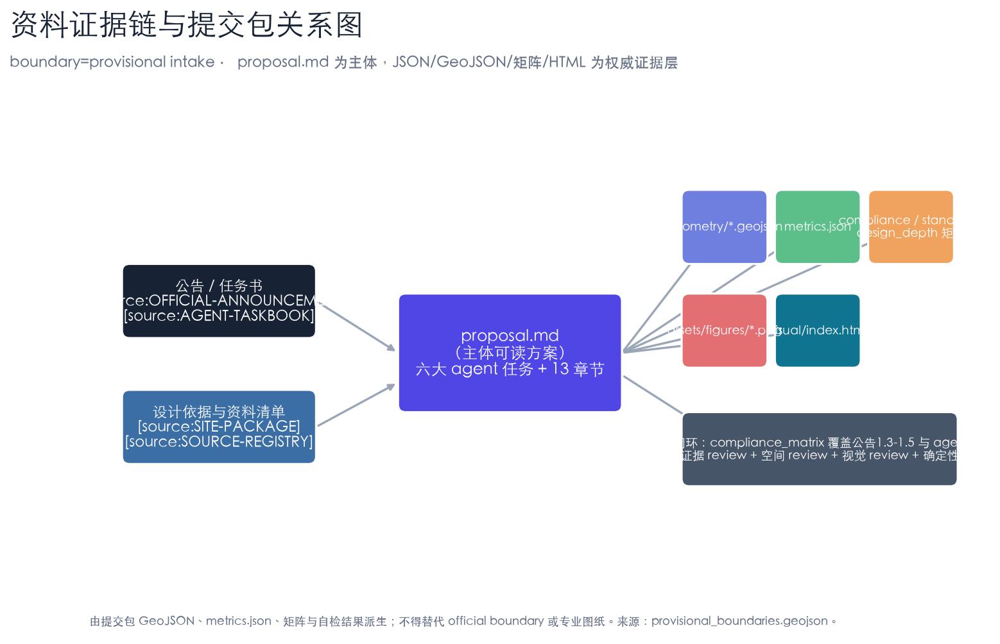
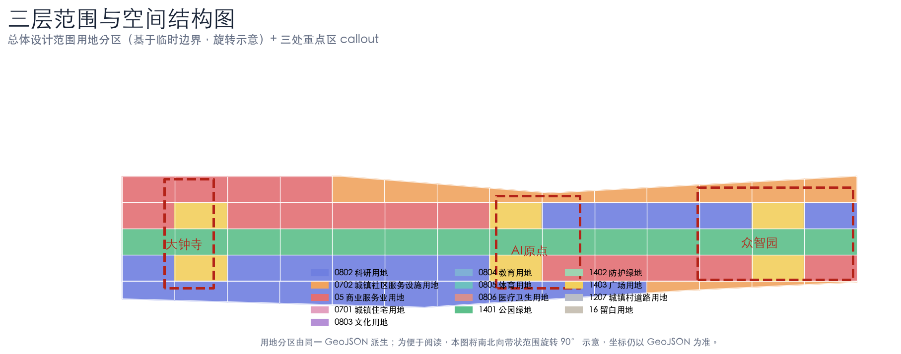
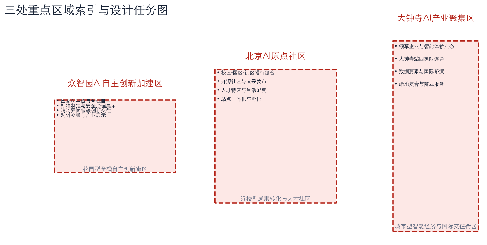
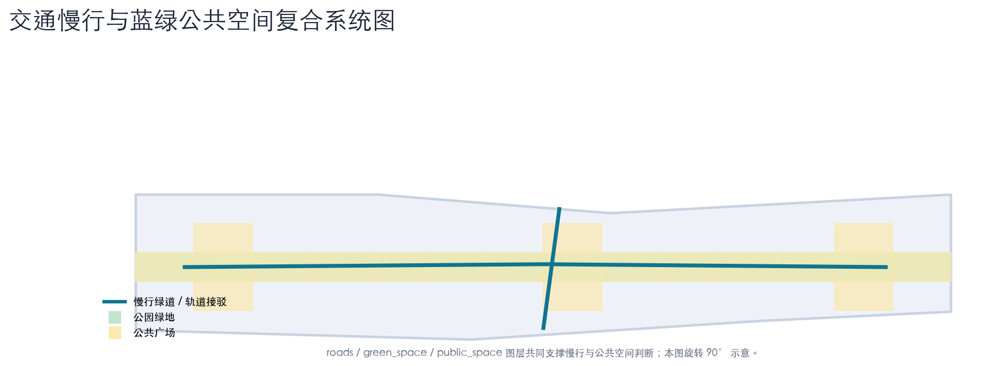
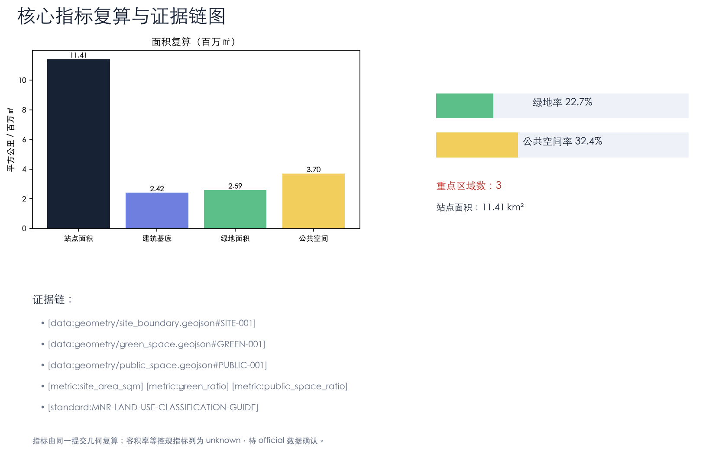

## 设计依据与资料清单

本 formal 方案以北京市规划和自然资源委员会海淀分局发布的《百年京张AI创新带城市设计国际方案征集资格预审公告》为第一依据 [source:OFFICIAL-ANNOUNCEMENT]，并以 `brief/site-package/` 中登记的设计依据、可设计空间、任务书、枚举、规划限值、标准与几何为机器可读依据 [source:SITE-PACKAGE]。AI agent 在生成方案前必须读取 `design_brief.json`、`allowed_design_space.json`、`agent_taskbook.json`、`sources.json`、`enums/`、`ranges/`、`schemas/`、`data/source_registry.json`，并用处理资料包建立任务—范围—资料—缺口清单 [source:PROCESSED-FACT-PACK]。

本方案使用仓库维护者登记的临时粗略边界作为生成边界 [source:BOUNDARY-SOURCE]，三处重点区同样使用临时 polygon [source:KEY-AREA-SOURCE]。临时边界只用于 AI 生成、可视化与 intake 自检，不作为 official redline、审批依据或精确面积依据 [standard:PROJECT-OFFICIAL-ANNOUNCEMENT]。当官方边界与重点区 polygon 发布后，site boundary、key areas、land use、roads、green space、public space、buildings、phasing 与 metrics 均需重算 [depth:metrics_recalculation]。

方案主线为“京张智脉 · 百年创生带”：以京张遗址公园为历史与公共空间主轴，以众智园、北京AI原点社区、大钟寺三处重点片区为创新锚点，形成“一带三核、多点场景、蓝绿慢行复合环”的空间组织 [data:geometry/site_boundary.geojson#SITE-001] [depth:three_level_scope_framework]。

## 三层范围工作框架

方案按公告确定的三个层次组织工作 [standard:PROJECT-OFFICIAL-ANNOUNCEMENT]：统筹研究范围关注 43.6 平方公里的 AI 产业生态、战略定位与未来城市形态；总体设计范围关注 11.4 平方公里京张遗址公园周边 1–2 公里城市地区与产业区，要求形成城市更新总体框架、产业空间布局、交通市政支撑与城市风貌控制；重点区域范围关注 368.4 公顷三处详细设计地区，要求明确功能业态、建筑规模、拆改留分类、公共空间连通与交通组织 [depth:overall_spatial_structure]。

三层工作不是割裂的图纸集合：统筹研究决定产业链与城市形态判断，总体设计把判断落实到更新项目、空间结构与设施承载，重点区域详细设计验证具体地块、建筑、交通、公共空间与 AI 场景的可实施性 [depth:three_level_scope_framework] [data:geometry/land_use.geojson#LU-001]。任何无法从结构化数据复算的面积、比例、规模或项目数量，不得写入正式结论 [standard:MNR-LAND-USE-CLASSIFICATION-GUIDE]。

## 统筹研究范围产业与未来城市研究

统筹研究范围的核心任务是构建世界级 AI 创新生态体系 [depth:existing_conditions_diagnosis]。方案梳理海淀高校院所、头部企业、算力算法数据要素、孵化平台与科技服务资源，提出“高校策源—开源协作—企业转化—公共体验—国际传播”的创新链，并据此组织命名系统与视觉识别 [agent.1]。

全球 AI 创新生态案例（可转化为空间/运营/场景机制）：① 巴黎 Station F——单一建筑聚合孵化、投资与社区；② 多伦多 MaRS / Waterfront——滨水创新区与测试床；③ 旧金山 SoMa /  transit center 片区——TOD 与科技总部共生；④ 深圳南山—河套（Hetao）——跨境科创与“一身两制”协作；⑤ 中关村科学城（海淀）——高校—企业—资本就近转化；⑥ 筑波科学城——国家实验室与园区联动；⑦ 赫尔辛基 Otaniemi/Aalto——大学—城市—企业开放创新；⑧ 新加坡 One-North——产业社区与慢行网络 [standard:PROJECT-AGENT-OPEN-CALL-TASKBOOK]。

未来城市形态研究回答 AI 如何改变工作、生活、社交、学习、交通与公共服务，并把 AI 交通系统、连续绿色空间、创新服务设施落实为可定位的功能区、节点、廊道与场景，而非泛泛描述技术愿景 [agent.2] [data:geometry/key_areas.geojson#PROV-KEY-001]。

## 总体设计范围城市更新与控规深度城市设计

总体设计范围要求达到控制性详细规划的城市设计深度 [standard:MOHURD-CONTROL-DETAILED-PLANNING]。方案提出城市更新总体空间结构、低效空间识别、更新项目清单、实施政策建议、产业功能比例、空间组织模式与综合承载能力评估。`geometry/land_use.geojson` 完整覆盖设计边界且无重叠，`geometry/buildings.geojson` 表达更新与保留建筑基底，`geometry/roads.geojson` 表达微循环与轨道接驳 [depth:land_use_layout] [data:geometry/buildings.geojson#BLDG-001]。

涉及建筑高度、开发强度、道路红线、退线等内容，尚缺官方控制条件，均写为“待正式控规条件确认”，不以推测值冒充审定指标 [depth:development_intensity_controls] [depth:height_massing_character]。总体设计还必须支撑轨道站点一体化、道路微循环、非机动车停放、停车供给、创新服务平台、人才生活服务、新型基础设施、分布式能源与端侧算力 [depth:traffic_rail_slow_parking] [depth:municipal_new_infrastructure]。

## 重点区域详细设计

三处重点区域详细设计是公告 1.5.3 的必选项，必须引用 `geometry/key_areas.geojson` 并由深度项 [depth:three_key_area_detailed_design] 校核 [data:geometry/key_areas.geojson#PROV-KEY-002]。每处重点区需回答功能业态、建筑规模与拆改留、公共空间连通、交通与停车组织、AI 场景落位五个问题，并说明哪些结论受临时边界限制。

- **众智园AI自主创新加速区**（花园型全栈自主创新街区）：国家AI平台、全栈自主、标准制定、安全治理、产业展示、清河文化、低碳绿色创新交往。拆改留以“保留科研载体、改造低效厂房、新建低碳展示与测试空间”为方向，具体结论待权属与现状建筑核定 [depth:retain_renovate_demolish]。
- **北京AI原点社区**（近校型成果转化与人才社区）：校区—园区—街区慢行缝合、开源社区、成果发布、人才特区、居住生活配套、站点一体化。
- **大钟寺AI产业聚集区**（城市型智能经济与国际交往街区）：领军企业、智能体、智能终端、内容消费、数据要素、商业服务、绿地复合利用、大钟寺站四象限步行连通。

三处重点区均为概念建议/参考方案；若 polygon 为临时边界，相关结论只能作为方向性设计，official polygon 发布后重算 [source:KEY-AREA-SOURCE]。

## AI 创新生态、人才画像与 AI+ 场景

方案建立面向 AI 人才与企业的空间需求画像，覆盖研发办公、开源协作、成果发布、企业服务、人才居住、社交学习、消费生活与国际交往 [agent.3]。AI+ 场景围绕交通、服务、消费、医疗、教育、法律、生活服务展开，每个场景说明服务对象、空间位置、数据来源、隐私边界、人工复核与运营主体。

**用户画像（≥5 类）**：① 开源开发者——发布、协作、测试、社区声誉；② 初创团队——低成本办公、算力入口、产品试验场；③ 头部企业访客——展示、商务、国际接待；④ 周边居民——通勤、休闲、低扰动更新；⑤ 高校师生——成果转化、跨校协作、日常慢行。

**AI 场景卡（≥10 张，含 ≥3 张产业测试验证场景）**：
| 编号 | 场景卡 | 空间载体 | 类型 |
| --- | --- | --- | --- |
| 01 | 开源发布厅 | 北京AI原点社区 | 场景 |
| 02 | 安全治理沙盒（自主模型安全评测） | 众智园 | 测试验证 |
| 03 | 端侧算力驿站压力测试场 | 总体设计范围节点 | 测试验证 |
| 04 | 多智能体交通协同验证 | 京张遗址公园活力带 | 测试验证 |
| 05 | AI慢行导航 | 京张遗址公园活力带 | 场景 |
| 06 | 大钟寺国际路演客厅 | 大钟寺AI产业聚集区 | 场景 |
| 07 | 清河低碳创新廊 | 众智园临清河界面 | 场景 |
| 08 | 近校成果转化街 | 北京AI原点社区 | 场景 |
| 09 | 数据要素会客厅 | 大钟寺片区 | 场景 |
| 10 | AI生活服务样板街 | 社区与商业交汇处 | 场景 |
| 11 | 全球AI活动周路线 | 一带公共空间系统 | 场景 |
| 12 | AI+医疗/教育/法律服务站 | 社区公共服务节点 | 场景 |

城市智能体可辅助识别慢行断点、公共空间热力、设施维护与企业服务需求，但不得替代规划审批、不得输出未经授权个人画像、不得声称获得官方实施承诺 [depth:blue_green_public_space] [data:geometry/public_space.geojson#PUBLIC-001]。

## 用地、建筑规模与拆改留方案

用地方案依据国土空间用地用海分类表达，形成完整、闭合、无缝的用地分区 [standard:MNR-LAND-USE-CLASSIFICATION-GUIDE]。本包用地分区由临时边界内 6×5 网格与站点求交生成，覆盖完整且无重叠 [data:geometry/land_use.geojson#LU-001] [depth:land_use_layout]。

建筑方案区分保留、改造、更新、新建或待确认对象，明确建筑基底、功能、规模、风貌与高度控制建议层级 [depth:retain_renovate_demolish] [depth:height_massing_character]。建筑专业成果深度规定尚未取得官方文件，本包按 data_gap 处理，仅列出深化前置条件与校核方法，不冒充已达到施工图或方案报审深度 [standard:MOHURD-ARCH-DESIGN-DEPTH-2016]。建筑规模与强度指标必须与 `metrics.json` 与图层一致；总建筑规模、容积率、建筑高度、建筑密度、绿地率、退线等缺少官方条件时，列为 unknown 或 pending_control，不编造精确感 [metric:building_footprint_area_sqm] [data:geometry/buildings.geojson#BLDG-001]。缺现状建筑、权属、控规与工程条件时，只提方法与待校准清单 [depth:development_intensity_controls]。

## 交通、轨道、市政与公共服务设施

交通方案回应公告对轨道站点一体化、道路微循环、慢行断点、对外交通、停车、非机动车停放与绿色交通系统的要求 [depth:traffic_rail_slow_parking]。重点覆盖北五环、京张遗址公园跨环路节点、五道口、清华东路西口、大钟寺站及重点企业周边联系。`geometry/roads.geojson` 表达慢行绿道与轨道接驳联络，均裁剪在提交边界内并与公共空间、绿地、产业节点校核 [data:geometry/roads.geojson#ROAD-001]。

市政与公共服务设施覆盖 AI 产业服务设施、创新服务平台、人才生活服务、新型基础设施、分布式能源、端侧算力与传统市政融合 [depth:municipal_new_infrastructure]。缺少管线、能源、排水、防洪、消防等工程资料时，列为正式深化前置条件，不把策略写成审定条件 [data:geometry/constraints.geojson#CONSTRAINTS]。

## 蓝绿空间、公共空间与城市风貌

蓝绿空间以京张遗址公园活力带为骨架，统筹清河、小月河与周边高校、企业、社区出行需求，提出南北贯通、东西连通的步道、骑行道与绿色空间体系 [depth:blue_green_public_space] [metric:green_ratio]。识别慢行断点、上跨环路节点、公园南端/北端景观节点，提出停车、体育、创新交往、科技测试、应用展示与公共服务复合利用策略 [data:geometry/green_space.geojson#GREEN-001]。

城市风貌融合京张铁路历史文化、中关村创新文化与 AI 新文化，利用清华园火车站、北影等文化资源，提出城市基调、建筑风貌、屋顶形态、体量、界面与公共艺术引导 [standard:MOHURD-URBAN-DESIGN-MEASURES]。同时提出导视标识、文化符号、国际传播叙事、AI 朝圣地标与荣誉展示体系，所有品牌、字体、图像、肖像与企业标识均清权 [metric:public_space_ratio] [data:geometry/public_space.geojson#PUBLIC-001]。

## 更新项目清单、实施政策与分期计划

实施方案形成可审查的更新项目清单，说明位置、类型、功能、责任主体、依赖条件、阶段、风险与评估指标 [depth:renewal_project_list]。政策建议覆盖城市更新统筹实施、空间供给、运营机制、产业服务、公共参与、数据治理与产权协同。`geometry/phasing.geojson` 表达分期范围 [data:geometry/phasing.geojson#PHASE-1] [depth:phasing_implementation]。

| 编号 | 项目 | 类型 | 主要依赖 |
| --- | --- | --- | --- |
| JZ-01 | 京张遗址公园慢行断点缝合 | 公共空间/交通 | 道路红线、桥下空间、交通组织 |
| JZ-02 | 众智园清河创新界面 | 蓝绿/产业展示 | 河道蓝线、生态防洪 |
| JZ-03 | 原点社区近校成果转化街 | 城市更新/产业服务 | 校区边界、权属、首层业态 |
| JZ-04 | 大钟寺站四象限步行连通 | 轨道一体化/慢行 | 轨道站点、路口、市政管线 |
| JZ-05 | AI公共服务与端侧算力节点 | 新基建/公共服务 | 能源、算力、安全、运营主体 |
| JZ-06 | 全球AI活动周公共路线 | 运营/品牌 | 公共空间许可、活动安全、版权清权 |

分期与 100 天征集周期区分：征集周期是提交成果的时间要求，实施分期是更新与项目建设的推进路径，提出近期试点、中期更新、长期治理框架 [depth:phasing_implementation]。

## 指标体系、面积复算与合规矩阵

指标体系含总体设计范围面积、重点区域面积、绿地与公共空间比例、建筑基底、更新项目数量、AI 场景节点、慢行连通与产业空间指标 [depth:metrics_recalculation]。所有 known 指标从 GeoJSON 复算；unknown 指标给出原因与正式提交前置条件 [metric:site_area_sqm] [metric:key_area_count] [metric:green_ratio] [metric:public_space_ratio] [metric:building_footprint_area_sqm]。

合规矩阵是任务响应性的主控文件：每条公告任务与 agent_taskbook 任务对应到报告章节、图层、指标、图纸、HTML、来源、假设与自检项 [standard:PROJECT-AGENT-OPEN-CALL-TASKBOOK]。未覆盖公告 1.3/1.4/1.5 或 agent.1–agent.6 任一任务，方案不得进入 formal professional scoring [standard:PROJECT-OFFICIAL-ANNOUNCEMENT]。

## 风险、版权与合规说明

方案文件使用中文；英文为主语言时才需附完整中文译文。所有图片、图纸、图标、数据与代码资产在 `sources.json` 或 `report/copyright_statement.md` 中说明来源、许可与授权状态 [depth:risk_missing_data]。HTML 页面不加载远程脚本、地图瓦片、字体、iframe、表单或 API，不跟踪评审者行为。

风险与缺资料清单由 `depth:risk_missing_data` 管理，并与 `data:geometry/constraints.geojson#CONSTRAINTS`、`source:SITE-PACKAGE` 校核。`missing_data_checklist.csv` 中的 official boundary、key area、控规、道路、地块、建筑、市政、文保与公共服务缺口，进入 `assumptions.json`、自检与正文风险章节 [source:SOURCE-REGISTRY]。缺少官方控规、道路红线、权属、市政、消防或文保条件的结论，均降级为待确认事项 [standard:MOHURD-CONTROL-DETAILED-PLANNING]。

本方案不声称官方批准、审定控规、最终土地权属、最终建设规模或保证实施；AI agent 对事实、来源、版权、空间数据、指标与表达负责 [source:PROCESSED-FACT-PACK]。

## 参考资料

- brief/public-brief.md
- brief/site-package/design_brief.json
- brief/site-package/allowed_design_space.json
- brief/site-package/agent_taskbook.json
- brief/site-package/sources.json
- data/source_registry.json
- brief/site-package/standards/standards.json
- brief/site-package/geometry/provisional_boundaries.geojson
- 机器可读引用索引：[source:OFFICIAL-ANNOUNCEMENT]、[source:AGENT-TASKBOOK]、[source:SITE-PACKAGE]、[source:SOURCE-REGISTRY]、[source:PROCESSED-FACT-PACK]、[standard:PROJECT-OFFICIAL-ANNOUNCEMENT]、[standard:PROJECT-AGENT-OPEN-CALL-TASKBOOK]、[depth:metrics_recalculation]、[data:geometry/site_boundary.geojson#SITE-001]、[metric:site_area_sqm]

