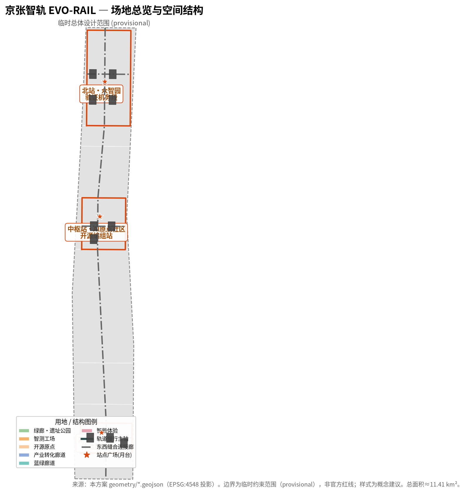
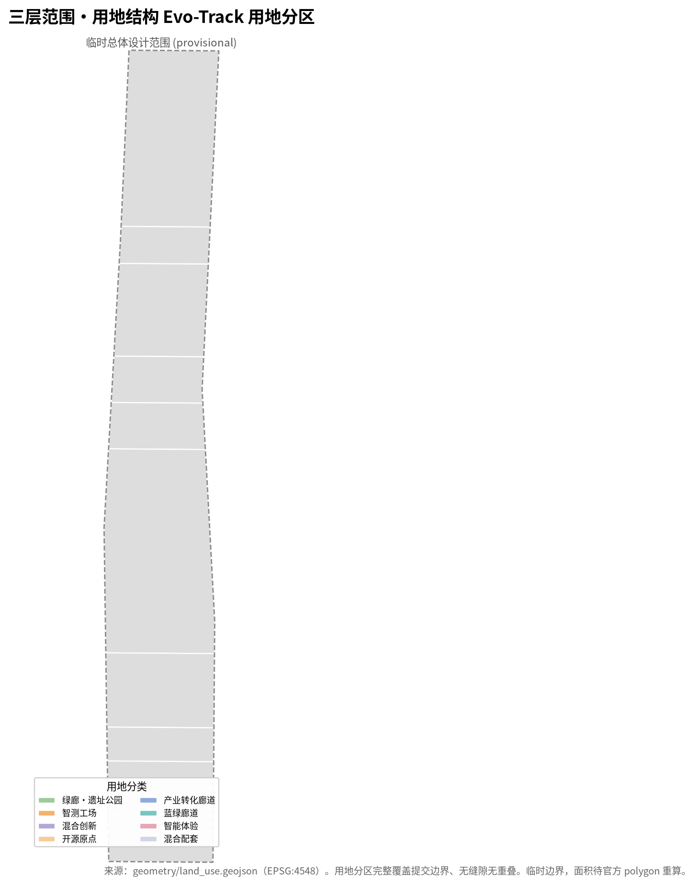
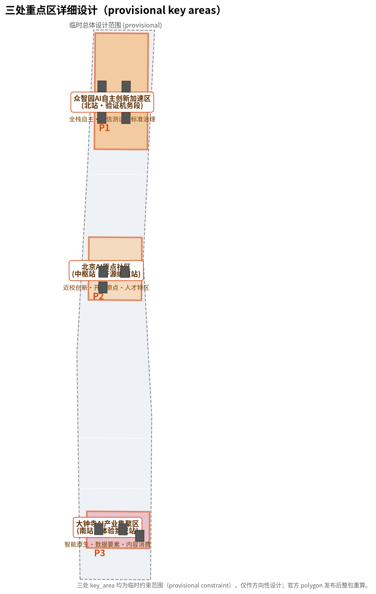
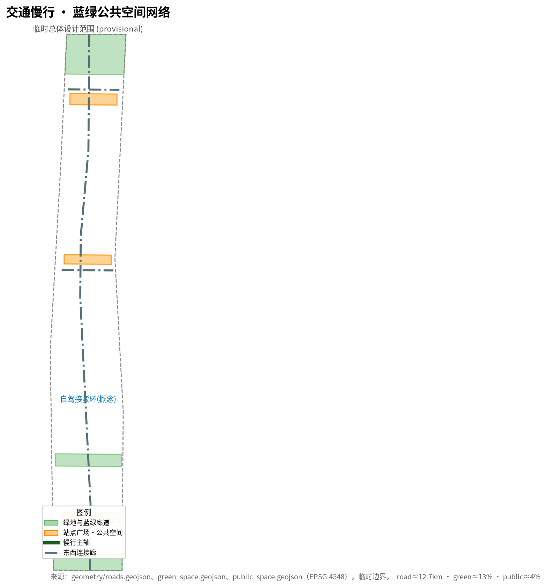
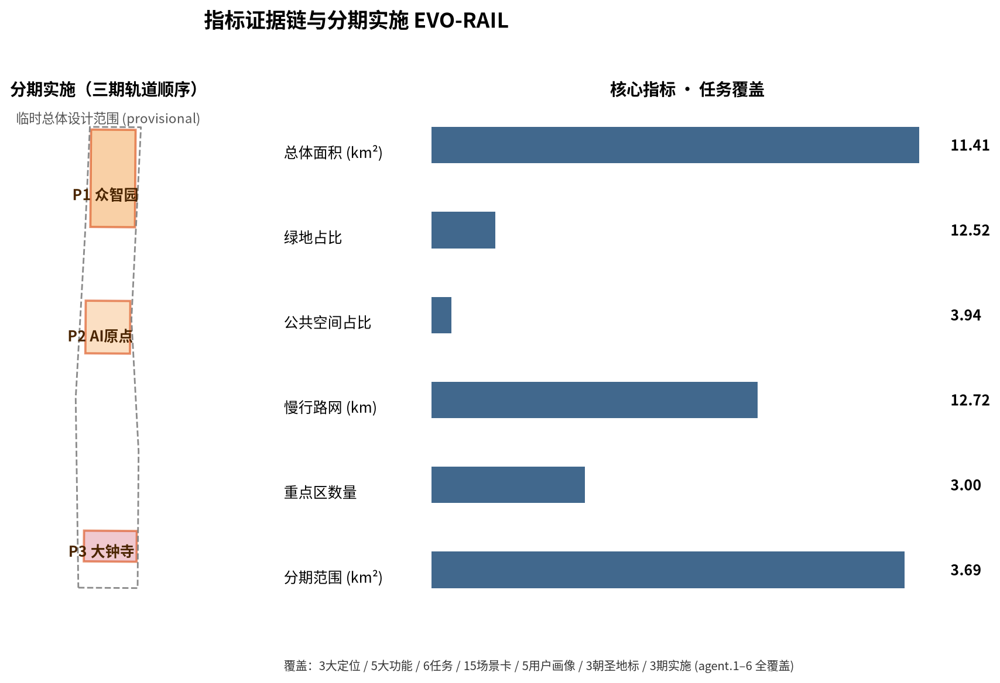

# EVO-RAIL Jing-Zhang: an Evolvable AI City Belt on a Century-Old Track

## Design Basis and Source List

This proposal takes as its primary basis the qualification pre-announcement for the International Urban Design Open Call for the Centennial Jing-Zhang AI Innovation Belt issued by the Haidian Branch of the Beijing Municipal Commission of Planning and Natural Resources [source:DATA-SRC-OFFICIAL-ANNOUNCEMENT-20260509], together with the maintainer-registered three-scope levels, three key areas, enums, metrics, sources, and professional-standard inventory as machine-readable basis [source:SITE-PACKAGE]. The open-call taskbook for AI agents (agent.1–agent.6) provides direct basis for the six creative and operational tasks [source:DATA-SRC-AGENT-TASKBOOK-20260518]. All formal conclusions must trace back to materials marked `usable_for_formal="yes"` in `data/source_registry.json`; provisional-only and background-only materials are used only for generation, display, and design discussion and must not be upgraded into official boundaries, statutory controls, or formal scoring evidence [source:SOURCE-REGISTRY].

It must be stated clearly that the official `SITE_BOUNDARY` and the three precise `KEY_AREA` polygons have not yet been published (the qualification package download is password-protected; no public precise boundary file was found as of retrieval). This proposal therefore uses the maintainer-derived **temporary rough boundary (provisional constraint)** inferred from the announcement's textual bounds and approximate areas, calibrated in EPSG:4548 [source:DATA-SRC-PROVISIONAL-BOUNDARIES-20260605]. This boundary is for AI generation, display, and intake self-check only; it **must not be treated as an official redline, approval basis, or basis for precise area recalculation**. The organizer data gap itself does not block content scoring, but once official polygons are released, the site boundary, land use, roads, green/public space, buildings, phasing, and all area/ratio metrics must be recalculated as a whole package [metric:site_area_sqm].

Urban-design depth at the regulatory-detailed-planning and planning-comprehensive-implementation level follows [standard:MOHURD-CONTROL-DETAILED-PLANNING] and [standard:MOHURD-URBAN-DESIGN-MEASURES], and land-use classification follows [standard:MNR-LAND-USE-CLASSIFICATION-GUIDE]. AI scenarios and public services follow the compliance boundaries of the generative-AI, accessibility, and elderly-friendly regulations (full standard list in `standard_matrix.json`). The complete indexes of these standards, tasks, sources, metrics, and design depth are stored respectively in `standard_matrix.json`, `compliance_matrix.json`, `sources.json`, `metrics.json`, and `design_depth_matrix.json`; the narrative places only a few verifiable citations beside key judgments and does not dump machine indexes.

## Three-Level Scope Framework

The proposal is organized by the three scopes defined in the announcement: the **coordinated research scope** (43.6 km², bounded by the North 5th Ring Road, Jingzang Expressway, Xizhimenwai Avenue, and Wanquanhe Road) answers how a world-class AI innovation ecosystem and future urban form should be organized [metric:site_area_sqm]; the **overall design scope** (11.4 km², the 1–2 km urban and industrial area around the Jing-Zhang Heritage Park) translates strategy into urban renewal, industrial space, transport/municipal support, and urban character [data:geometry/site_boundary.geojson#SITE-001]; the **key detailed-design scope** (368.4 ha: Zhongzhiyuan AI Acceleration Area, Beijing AI Origin Community, and Dazhongsi AI Industry Cluster, from north to south) provides detailed design for the three sites [data:geometry/key_areas.geojson#PROV-KEY-001].

The three scopes are not disconnected drawing sets: the research scope decides industrial chain and urban-form judgments, the overall scope translates these into renewal projects and spatial structure, and the key areas verify implementability at station scale. In `compliance_matrix.json` the proposal maps announcement clauses 1.3, 1.4, 1.5 and agent.1–agent.6 to chapters, layers, metrics, drawings, and HTML evidence item by item [depth:three_level_scope_framework].

Because the three key-area polygons are currently temporary rough rectangles (provisional constraint), the proposal treats their functions, building renewal, public space, and AI scenarios only as **directional design**; the rectangle edges must not be interpreted as parcel or road redlines, and any precise area must be recalculated once official polygons are published [depth:three_key_area_detailed_design].

## Coordinated Research Area: Industry and Future City Research

### Overall Concept: EVO-RAIL

This proposal puts forward the overall concept **"EVO-RAIL"**: it does not treat the century-old Jing-Zhang Railway as a memorialized heritage sealed away, but re-translates it into a **living, self-upgrading urban track system**. The railway's historical metaphors—track, locomotive, station, signal—are reactivated as a city-scale system language:

- **Track** = the infrastructure backbone along which data, compute, models, and knowledge flow between districts, corresponding to the continuous blue-green slow-mobility public spine [data:geometry/roads.geojson#ROAD-NS-01] [data:geometry/green_space.geojson#GREEN-COR].
- **Train** = AI capability/tasks/scenarios as schedulable loads that run on the track, enter stations, load/unload, test, and return to depot, forming an evolvable "service schedule".
- **Station** = the three key areas as stations/depots of different character: Zhongzhiyuan is the "test/verify depot," the AI Origin Community the "open-source/origin marshalling yard," and Dazhongsi the "experience/commerce departure-arrival station" [depth:three_key_area_detailed_design].
- **Protocol** = every AI deployment follows a track protocol in which "upstream data and downstream public return" appear in pairs—a one-way loop on a single track with two-way feedback, ensuring AI value-add flows back into public services and cultural space.

This concept gives the three positioning statements—Centennial Jing-Zhang Cultural Belt, Urban AI Life Experience Belt, and AI Fusion Innovation Belt—substance beyond slogans, landing them on a "runable track": the cultural belt = rail memory and signal system; the experience belt = station public-experience path; the innovation belt = the flow and re-evolution of models and scenarios along the line [source:DATA-SRC-AGENT-TASKBOOK-20260518].

### Three Positioning, Five Functions, and the Three-Areas-Two-Wings Loop

The proposal makes explicit the three positioning statements and resolves them into five functions: **full-stack indigenous AI innovation system, world-class AI innovation ecosystem, AI+ scenario-empowerment new paradigm, smart AI vibrant city, and global AI governance voice** [source:DATA-SRC-AGENT-TASKBOOK-20260518]. The five functions run through a "three areas, two wings" synergy loop:

- **Three areas**: Zhongzhiyuan full-stack autonomy + trusted testing (governance voice), the AI Origin Community open source + ecosystem (world-class ecosystem), and Dazhongsi native new-business + experience (scenario-empowerment paradigm) [data:geometry/key_areas.geojson#PROV-KEY-001] [data:geometry/key_areas.geojson#PROV-KEY-002] [data:geometry/key_areas.geojson#PROV-KEY-003].
- **Two wings**: the Zhongguancun Technology Service Wing handles global factor allocation, Zhongguancun IP, and capital empowerment [data:geometry/land_use.geojson#LU-M2]; the Xiaoyuehe Scenario-Empowerment Wing connects AI scenarios with the vibrant-city public experience [data:geometry/land_use.geojson#LU-S2].

The synergy loop may be stated as: **origin open-source → Zhongzhiyuan verification → Dazhongsi transformation & experience → Zhongguancun capital & IP feedback → Xiaoyuehe scenario feedback → back to origin**, forming a closed loop of models, data, scenarios, capital, and talent [standard:PROJECT-AGENT-OPEN-CALL-TASKBOOK].

### Global AI Innovation Ecosystem Case Analysis

The proposal curates 6 global AI innovation ecosystem cases and draws transferable experience for spatial, scenario, and operation mechanisms (full case table in `sources.json` and `compliance_matrix.json` agent.2):

1. **Silicon Valley / Palo Alto, USA**: ten-minute walkable university–venture–enterprise innovation circle, mapped to "near-campus result conversion" and station-city integration.
2. **Nanshan Science and Technology Park, Shenzhen, China**: hardware open source plus rapid prototyping, mapped to verifiable workshops and pilot/manufacturing space.
3. **Jurong Innovation District, Singapore**: manufacturing–learning–living mix, mapped to "verify-while-living" TOD blocks.
4. **King's Cross, London**: heritage regeneration + knowledge quarter + public-space activation, mapped to the heritage-park vibrant belt and east–west stitching.
5. **Tsukuba Science City, Japan / Pangyo, Korea**: park-to-community transformation, mapped to park–community integrated governance.
6. **European AI pilot districts (e.g., Helsinki governance pilots)**: public digital twins and participatory governance, mapped to an auditable AI public interface.

The common denominator translates into three spatial mechanisms—**near-campus innovation TOD units, verifiable pilot/testing spaces, and public-facing experiential AI interfaces**—placed across the three key areas and two wings [source:DATA-SRC-AGENT-TASKBOOK-20260518] [depth:overall_spatial_structure].

### Future AI City Form, AI+Transport, and Continuous Green Space

Future-city-form research treats AI as a systemic variable that changes work, life, socializing, learning, transport, and public services, rather than a label. The proposal locates AI transport (autonomous shuttles, drone/logistics delivery, intelligent signals), continuous green space (a blue-green slow-mobility composite loop), innovation-service facilities, and an international living-working atmosphere into locatable functional zones, nodes, corridors, and scenarios [depth:blue_green_public_space] [metric:green_ratio]. Industrial-strategy metrics (AI innovation index, talent density, space-supply types, AI+ vertical key areas) are written into `metrics.json` and `visual/index.html`, explicitly distinguishing official values, design objectives, and items pending formal-data calibration.

## Overall Design Area: Urban Renewal and Regulatory-Plan-Level Urban Design

The overall design scope reaches regulatory-detailed-planning urban-design depth [standard:MOHURD-CONTROL-DETAILED-PLANNING]. The proposal uses `geometry/land_use.geojson` as the complete land-use partition: land use covers the whole submitted boundary with no gaps and no overlaps (verified by shapely union equals site_boundary, gap=0, overlap=0) [data:geometry/land_use.geojson] [metric:land_use_area_sqm].

### Land-Use Structure

The proposal forms several functional zones within the overall scope (`land_use_code` detailed in `geometry/land_use.geojson`): north and south green crowns (Jing-Zhang Heritage Park belt, `GREEN_HERITAGE_PARK`), the intelligent testing yard at Zhongzhiyuan (`AI_ACCELERATION`), mixed innovation belts (`MIXED_INNOVATION`), the open-source origin at the AI Origin Community (`AI_ORIGIN_COMMUNITY`), the industry transformation corridor (`AI_INDUSTRY_CORRIDOR`), the blue-green vibrant corridor (`GREEN_BLUE_CORRIDOR`), the Dazhongsi intelligent experience block (`AI_EXPERIENCE_COMMERCE`), and the mixed support belt (`MIXED_SUPPORT`). Core land-area metrics are in `metrics.json`, including green ratio `green_ratio` and public-space ratio `public_space_ratio` [metric:green_ratio] [metric:public_space_ratio].

### Spatial Structure and Urban Renewal

The spatial skeleton is a **north–south heritage-park slow-mobility spine** (`ROAD-NS-01`, the main carrier of the cultural and experience belts) plus three east–west connector corridors (`ROAD-EW-01/02/03`), stitching the three key areas and two wings [data:geometry/roads.geojson#ROAD-NS-01]. Urban renewal emphasizes "preserve rail memory, renew inefficient space, embed AI scenarios": the Jing-Zhang Heritage Park belt is mainly preserve-and-activate; Zhongzhiyuan renews inefficient industrial space into an intelligent testing yard; Dazhongsi renews commercial space with native new-business. Any parcel-level retain/renovate/demolish, road redline, building height, and development intensity must await official regulatory conditions; this proposal offers only directional renewal-object suggestions [depth:retain_renovate_demolish] [depth:development_intensity_controls].

### Transport, Rail, Municipal, and New Infrastructure

Transport strategy proposes spatial layout around station-integrated development, road micro-circulation, slow-traffic priority, and edge-compute new infrastructure [depth:traffic_rail_slow_parking] [metric:road_network_length_m]. The proposal anchors infrastructure organization on the planar co-corridor relationship among the Jing-Zhang high-speed tunnel, Line 13, and the heritage-park green corridor (a deepenable "co-corridor interface" idea), expressing micro-circulation and rail connection through `roads.geojson` and the blue-green and public-space network through `green_space.geojson` and `public_space.geojson` [data:geometry/public_space.geojson]. Content involving building height, road redline, setbacks, municipal capacity, and underground space is written as "pending official regulatory/engineering conditions" where no official control exists, never presenting agent-inferred values as approved indicators [depth:municipal_new_infrastructure].

### Jing-Zhang Heritage Park Vibrant Belt and Urban Character

The proposal organizes the Jing-Zhang Heritage Park as a "**vibrant belt + signal belt**": upward it carries cultural narrative, public experience, and AI scenarios; downward it uses the railway signal language (green-go, yellow-review, red-stop) as the city's public interface [depth:blue_green_public_space]. Urban character is set as "a readable signal system + a continuous blue-green base map + restrained sci-tech facades," avoiding excessive entertainment or influencer-style treatment [standard:MOHURD-URBAN-DESIGN-MEASURES].

## Detailed Design of Key Areas

Each key area references its `geometry/key_areas.geojson` feature and reaches directional planning-comprehensive-implementation depth [depth:three_key_area_detailed_design]:

### Zhongzhiyuan AI Acceleration Area (North Station · Verification Depot)

- **Positioning**: the "depot" for full-stack indigenous AI innovation and trusted-AI testing/verification, carrying national AI platform, standard-setting, and security-governance directions [data:geometry/key_areas.geojson#PROV-KEY-001].
- **Spatial structure**: an intelligent testing yard + pilot space + industry showcase + Qinghe cultural green corridor, forming a "test—return to depot—depart again" station-field unit.
- **Building renewal**: mainly preserve-and-renew inefficient industrial space, embedding conceptual footprints such as `AI_LAB`, `TESTING_RIG`, and `ACCEL_HUB` [data:geometry/buildings.geojson#BLDG-N-03].
- **AI scenarios**: trusted-AI test field, indigenous-compute benchmark, security-governance sandbox (scenario cards S01–S03).
- **Implementation risk**: involves computing load and information security; pending official site and engineering conditions.

### Beijing AI Origin Community (Central Station · Open-Source Marshalling Yard)

- **Positioning**: the "marshalling yard" for near-campus innovation, open-source origin, and a talent special zone, carrying the open-source system, incubator and result conversion, and brand events [data:geometry/key_areas.geojson#PROV-KEY-002].
- **Spatial structure**: an open-source origin plaza + near-campus result-conversion street + talent living support, achieving campus–park–community slow-traffic stitching.
- **Building renewal**: retain the near-campus residential area and renew inefficient buildings, embedding `OPEN_SOURCE_HUB` and `COMMUNITY` [data:geometry/buildings.geojson#BLDG-M-01] [data:geometry/buildings.geojson#BLDG-M-02].
- **AI scenarios**: open-source collaboration, result release, talent special zone (scenario cards S04–S06).
- **Implementation risk**: involves campus ownership and heritage protection; must respect `HERITAGE`/ownership boundaries and not alter enterprise or campus buildings without authorization.

### Dazhongsi AI Industry Cluster (South Station · Experience Departure-Arrival Station)

- **Positioning**: the "departure-arrival station" for native new businesses and content consumption, carrying leading enterprises, agents, intelligent terminals, and data factors [data:geometry/key_areas.geojson#PROV-KEY-003].
- **Spatial structure**: an intelligent experience block + mixed-use green composite + four-quadrant pedestrian connectivity around Dazhongsi station.
- **Building renewal**: renew commercial/business space with `EXPERIENCE_MALL`, `INDUSTRY_SERVICE`, and `DATA_TERMINAL` [data:geometry/buildings.geojson#BLDG-S-01].
- **AI scenarios**: native consumption, digital assets, content experience (scenario cards S07–S10).
- **Implementation risk**: involves commercial renewal and transport organization; no engineering-feasibility conclusions are given.

## AI Innovation Ecosystem, Personas, and AI+ Scenarios

### User Personas (5)

The proposal defines 5 user personas covering AI talent, enterprises, and residents: **AI researchers/engineers, university faculty/students and entrepreneurs, park and enterprise owners, citizens and visitors, and the elderly and special groups**. Each persona has corresponding spatial, service, and AI-scenario needs, following accessibility and elderly-friendly requirements (retaining human-operated service channels) [standard:BARRIER-FREE-ENVIRONMENT-LAW] [standard:ELDERLY-SMART-TECH-PLAN-2020-45].

### AI Scenario Cards (15, covering 10+)

The proposal forms **15 AI scenario cards** (at least 10), organized as native new businesses / public experience / industrial testing-verification (full cards in `compliance_matrix.json` and `visual/index.html`):

- **Industrial testing/verification (3+)**: S01 trusted-AI test field, S02 full-stack indigenous-compute benchmark, S03 security-governance sandbox (covering the "3 industrial test/verification scenarios" requirement).
- **Experience & public**: S04 open-source collaboration plaza, S05 result-release stage, S06 talent-zone tour, S07 native intelligent consumption block, S08 digital-asset experience, S09 content-creation workshop, S10 Dazhongsi immersive content hall.
- **Transport & life**: S11 autonomous shuttle loop, S12 last-mile drone/logistics delivery, S13 intelligent signal slow-traffic priority, S14 AI+education/health convenience points, S15 AI+law/life-service bench.

Every scenario states whether it is human-reviewable/rollbackable and whether privacy is involved, and complies with the scope and human-review boundary of the Interim Measures for the Management of Generative AI Services [standard:GENERATIVE-AI-INTERIM-MEASURES]; immature technologies are not written as fully deployable, and test scenarios are not written as approved operations [source:DATA-SRC-AGENT-TASKBOOK-20260518].

## Land Use, Building Scale, and Retain-Renovate-Demolish Strategy

Land-use structure is fully expressed by `geometry/land_use.geojson`, and building footprints by `geometry/buildings.geojson` (conceptual reference, not statutory control) [data:geometry/land_use.geojson] [data:geometry/buildings.geojson]. The proposal follows the retain/renovate/demolish logic of "preserve rail memory, renew inefficient space, embed AI scenarios": the Jing-Zhang Heritage Park belt is mainly preserve-and-activate, Zhongzhiyuan renews inefficient industrial space into an intelligent testing yard, and Dazhongsi renews commercial space with native new businesses [depth:retain_renovate_demolish]. Building scale, FAR, building height, and building density are marked as pending official data because official regulatory conditions are missing; no approved values are given (see `metrics.json`).

## Transport, Rail, Municipal Infrastructure, and Public Services

Transport, rail, municipal, and public-service content is explained in the "Overall Design Area" section: the proposal organizes transport around station-integrated development and slow-traffic priority [depth:traffic_rail_slow_parking] [metric:road_network_length_m], and expresses micro-circulation and rail connection through `roads.geojson` [data:geometry/roads.geojson#ROAD-NS-01]. New-infrastructure and municipal-capacity content is written as "pending official regulatory/engineering conditions" where no official control exists [depth:municipal_new_infrastructure]. Public-service facilities follow the compliance boundaries of the accessibility and elderly-friendly regulations (see `standard_matrix.json`).

## Blue-Green Network, Public Space, and Urban Character

Blue-green and public space are organized as a "blue-green slow-mobility composite loop + station plazas" [depth:blue_green_public_space]: the north green crown, south green crown, and blue-green vibrant corridor in `green_space.geojson` form the continuous base map [data:geometry/green_space.geojson], and the three station plazas ("platforms") in `public_space.geojson` become public nodes [data:geometry/public_space.geojson]. Urban character is set as "a readable signal system + a continuous blue-green base map + restrained sci-tech facades"; green and public-space ratio metrics are in `metrics.json`.

## Renewal Projects, Implementation Policy, and Phasing

The overall renewal projects are phased in a "track order" (`phasing.geojson`): P1 Zhongzhiyuan acceleration area and north green corridor, P2 AI Origin Community and central green corridor, P3 Dazhongsi experience block and south green corridor [data:geometry/phasing.geojson#PHASE-001] [depth:phasing_implementation] [metric:phase_area_sqm], each able to run independently and interconnect. Policy suggestions (factor support, testing-sandbox institutions, scenario-open measures, talent housing) are stated as suggestions for professional teams to deepen, not government commitments [depth:renewal_project_list].

## AI Public Space, Native New Businesses, and AI Pilgrimage Landmarks

### AI Public Space and East–West Stitching

The proposal proposes station plazas (`PUBLIC-N/M/S` in `public_space.geojson`, as "platform" public nodes of the stations) and a blue-green composite loop, forming a public-space network of "east–west stitching and north–south connection" [data:geometry/public_space.geojson]. The Jing-Zhang Heritage Park acts as the spine public space, stringing the three key areas into a walkable, cyclable, experiential vibrant belt [depth:blue_green_public_space].

### Three AI Pilgrimage Landmarks

The proposal proposes **3 AI pilgrimage landmarks** (conceptual, pending professional deepening):

1. **Origin Bell**—AI Origin Community: modeled on the old railway bell, rung at each open-source release, becoming the city's sound landmark of "open-source day."
2. **Verify Beacon**—Zhongzhiyuan: modeled on the railway signal tower, using red/yellow/green lights to reflect AI-system operating and trust status in real time, becoming a "visible, verifiable" AI public interface.
3. **Arrival Board**—Dazhongsi: modeled on the station timetable, presenting the "arrival/departure" dynamics of models, content, and data as a public information interface.

The three landmarks together form a pilgrimage path "from open source, to verification, to experience," combined with an honor-display system (developer/contributor wall) [source:DATA-SRC-AGENT-TASKBOOK-20260518].

### Native New Businesses and Public-Space Component Library

Dazhongsi proposes native consumption and business scenarios around leading enterprises and intelligent terminals; the public-space component library (bench information terminals, drone/logistics delivery stations, AI guide posts, accessible human-call pillars, etc.) serves as reusable parts supporting public experience across the belt [depth:retain_renovate_demolish].

## Integrated Narrative of Centennial Jing-Zhang Culture, Zhongguancun Culture, and AI New Culture

### Cultural Narrative

The proposal takes "**the memory of the old track and the imagination of the new track**" as its narrative thread, weaving three layers of culture onto a single timeline track:

- **Centennial Jing-Zhang culture**: the Jing-Zhang Railway (designed under Zhan Tianyou, a milestone of independently built Chinese engineering) serves as the core memory of "the starting point of indigenous innovation," corresponding to today's full-stack indigenous AI innovation.
- **Zhongguancun innovation culture**: the iterative history from "electronics street" to Zhongguancun serves as the spiritual foundation of "continuous evolution."
- **AI new culture**: open source, trustworthiness, verifiability, and human-centered feedback serve as the new cultural increment "for the next century."

The three cultural layers are expressed through one unified **signal/track symbol system** (identity, signage, color, soundscape), so culture does not become decoration or a slogan for technology [source:DATA-SRC-AGENT-TASKBOOK-20260518].

### Naming System and Logo Direction

- **Primary name**: 京张智轨 (EVO-RAIL).
- **English name**: EVO-RAIL — Jing-Zhang AI Innovation Belt.
- **Naming system**: the three key areas are named "depot/marshalling yard/departure-arrival station" (Intelligent Testing Yard, Open-Source Origin, Experience Departure-Arrival Station); the wings are the "Zhongguancun Technology Service Wing" and the "Xiaoyuehe Scenario-Empowerment Wing"; public nodes are "platform," "crossing," and "signal tower."
- **Logo direction**: a double-line overlap of a through rail and a rising "evolution code line" as the visual motif, with the three-color signal system (green/yellow/red) as an extensible brand system balancing international communication and local memory; it does not copy any enterprise/institution identity, and all fonts and graphics use licensable or self-drawn material [source:DATA-SRC-AGENT-TASKBOOK-20260518] [depth:overall_spatial_structure].

## Belt-Wide Global AI Innovation Event System and Long-Term Operation

### Annual Event System and Brand IP

The proposal proposes an annual "**track timetable**" event system: open-source day, verification week, experience season, developer conference, pilgrimage tour season, etc., using "signal/timetable" as the unified brand IP to form a sedimentable annual rhythm and communication visual system [source:DATA-SRC-AGENT-TASKBOOK-20260518].

### Developer Community and Scenario Open Operation

- **Developer community operation**: through a "contribution registration—honor listing—result licensing" mechanism, every contributor is deposited into the public knowledge base and honor-display system [source:DATA-SRC-AGENT-TASKBOOK-20260518].
- **Scenario open operation**: through "open scenarios + testing sandboxes + rollback mechanisms," enterprises and communities can apply, test, and roll back, with clear human-review boundaries [standard:GENERATIVE-AI-INTERIM-MEASURES].
- **Attraction and conversion**: a "departure-arrival conversion path" from event audience to developer, from testing to entry into the park, and from scenario to landing, avoiding promotion without operation mechanisms [depth:renewal_project_list].

### Long-Term Brand Asset Mechanism

The proposal treats "signal language, station naming, landmark timetable, and contribution roster" as the belt's long-term brand assets, maintained by a sustainable operating body and continuously iterated; content involving investment attraction, policy, funding, and event arrangements is stated as conceptual suggestions, never as confirmed commitments [source:DATA-SRC-AGENT-TASKBOOK-20260518].

## Metrics, Area Recalculation, and Compliance Matrix

All area/ratio/length metrics in this proposal are recalculated from `geometry/*.geojson` after projection to EPSG:4548 (see `metrics.json`): site_area 11,412,825 m², land_use fully covers and its union equals the site, green_ratio≈0.13, public_space_ratio≈0.04, road_network≈12.7 km, phase_area≈3,692,893 m², key_area_count=3 [metric:site_area_sqm] [metric:green_ratio] [metric:key_area_count]. Statutory controls such as FAR, building height, building density, and green ratio are marked as "pending official data" because official regulatory conditions are missing, and no fabricated approved values are given (see `metrics.json`). Announcement task coverage is in `compliance_matrix.json`, professional-standard responses in `standard_matrix.json`, and design-depth evidence in `design_depth_matrix.json`.

## Risk, Copyright, and Compliance Statement

This proposal is a **conceptual, open-source, co-created suggestion generated by an AI agent**; it does not replace formal planning and does not constitute a government-approval conclusion [source:DATA-SRC-AGENT-TASKBOOK-20260518]. All spatial-landing suggestions are "conceptual suggestions/reference schemes/material for professional teams to deepen." The proposal is based on public or user-provided cleared materials and does not use classified maps, non-public spatial data, internal control indicators, or personal privacy; content involving construction intensity, building height, road alignment, and land ownership is conceptual and is not disguised as official approval. The usage limits of the provisional boundary, display-only thumbnail figures, recalculation requirements after official-polygon release, and copyright statement are detailed in `assumptions.json`, `report/copyright_statement.md`, and `sources.json` [depth:risk_missing_data].

## References

1. Qualification Pre-Announcement for the International Urban Design Open Call for the Centennial Jing-Zhang AI Innovation Belt, Haidian Branch of Beijing Municipal Commission of Planning and Natural Resources (2026-05-09). Reference ID: DATA-SRC-OFFICIAL-ANNOUNCEMENT-20260509; URL in `sources.json`.
2. Open-call taskbook excerpt for AI agents on the "Centennial Jing-Zhang AI Innovation Belt Urban Design Open Call" (user-provided cleared document, 2026-05-18). Reference ID: DATA-SRC-AGENT-TASKBOOK-20260518.
3. Measures for Urban Design Administration, Ministry of Housing and Urban-Rural Development (2017-03-14). Reference ID: DATA-SRC-MOHURD-URBAN-DESIGN-MEASURES.
4. Measures for the Compilation and Approval of Regulatory Detailed Planning of Cities and Towns, MOHURD. Reference ID: DATA-SRC-MOHURD-CONTROL-DETAILED-PLANNING.
5. Classification Guide for Land Use in Territorial Spatial Survey, Planning, Development-Control and Sea Use (Natural Resources Ministry, 2023-11). Reference ID: DATA-SRC-MNR-LAND-USE-CLASSIFICATION-202311.
6. Interim Measures for the Administration of Generative AI Services (effective 2023-08-15). Reference ID: DATA-SRC-GENERATIVE-AI-INTERIM-MEASURES.
7. Law of the People's Republic of China on Barrier-Free Environment Construction (effective 2023-09-01). Reference ID: DATA-SRC-BARRIER-FREE-ENVIRONMENT-LAW.
8. Implementation Plan for Effectively Solving the Difficulties of the Elderly in Using Intelligent Technologies, General Office of the State Council (Guobanfa [2020] No. 45). Reference ID: DATA-SRC-ELDERLY-SMART-TECH-PLAN-2020-45.
9. Maintainer-registered provisional rough polygons for the three scopes and three key areas (provisional_only). Reference ID: DATA-SRC-PROVISIONAL-BOUNDARIES-20260605.
10. Public source registry `data/source_registry.json` and `brief/site-package/` (SITE-PACKAGE).

Full metadata (publisher, URL, retrieval date, license, reuse boundaries, limitations) for these sources is in this package's `sources.json`. [source:SOURCE-REGISTRY] [source:SITE-PACKAGE]
