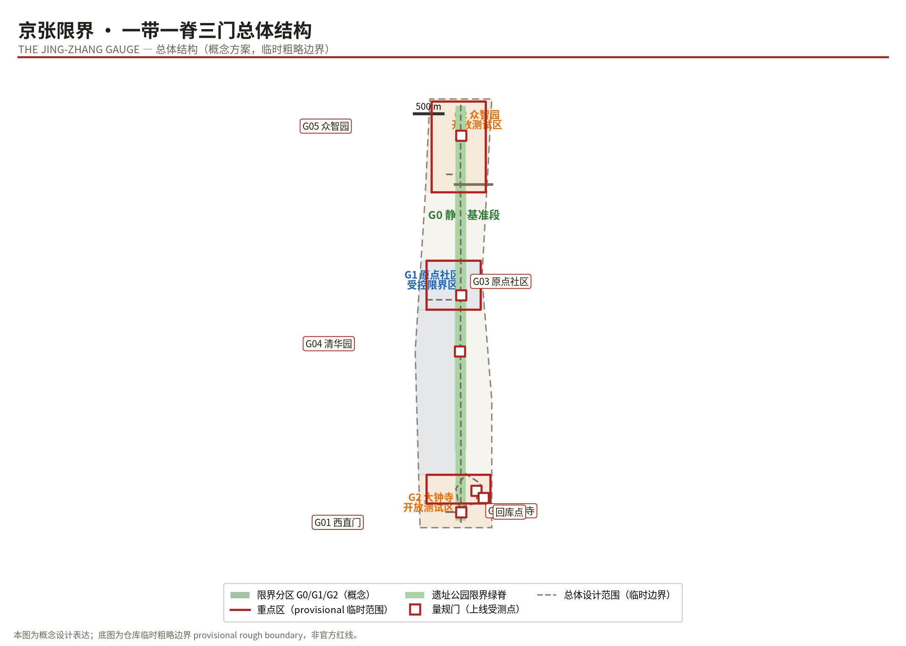
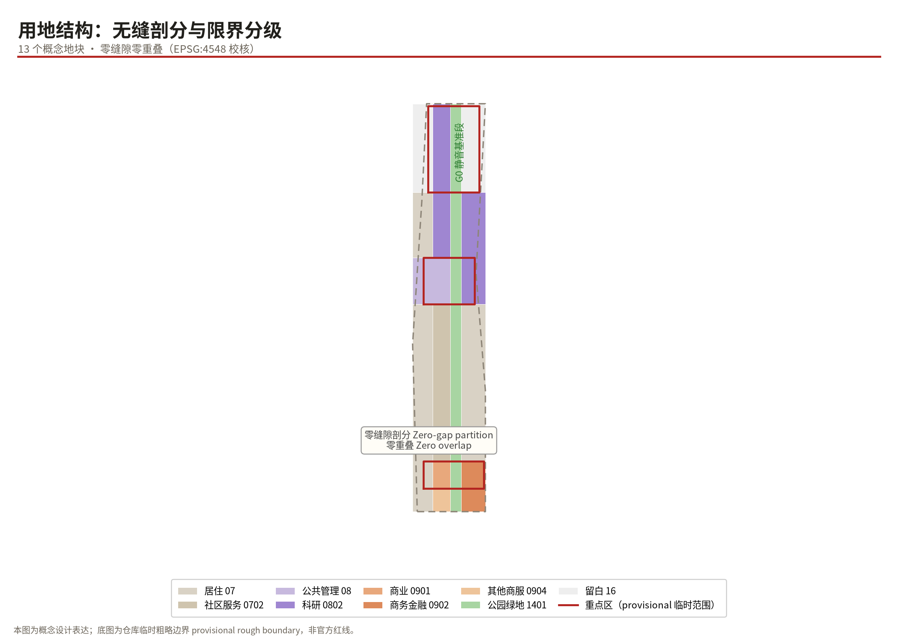
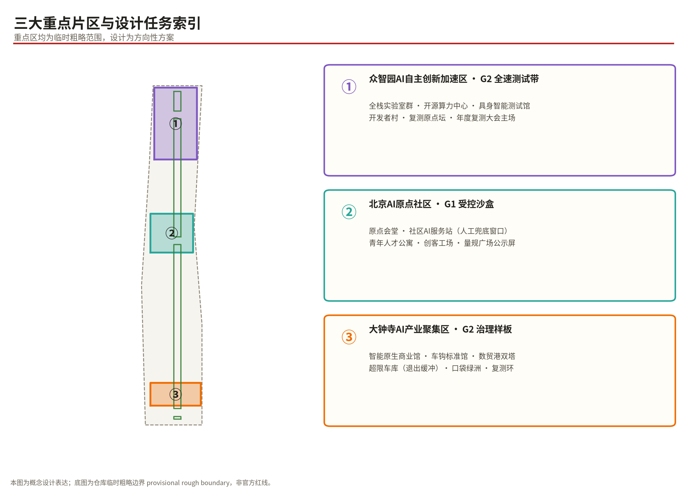
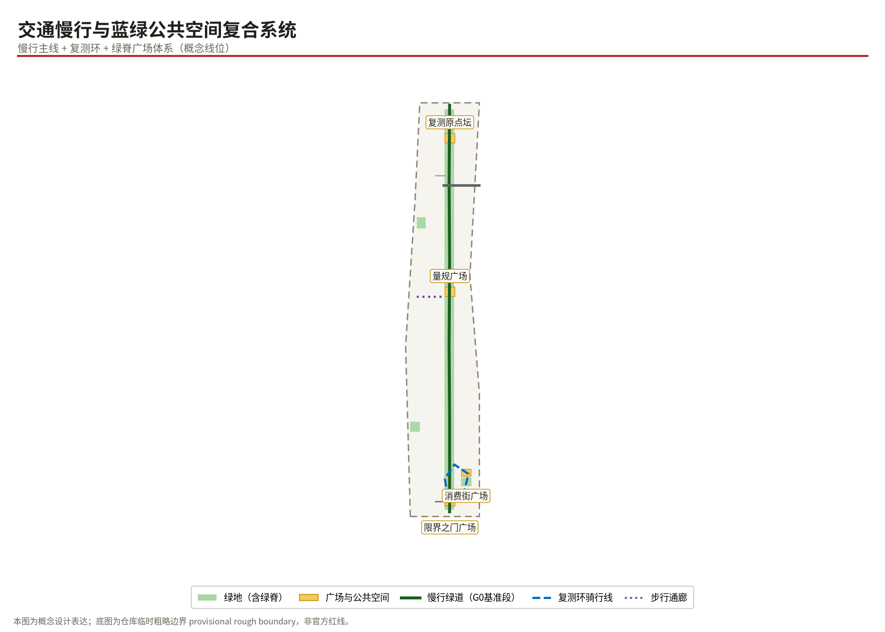
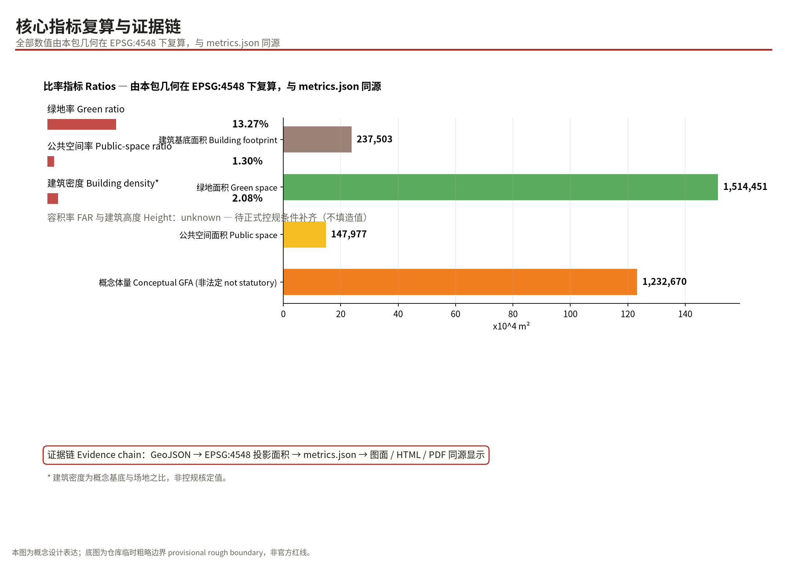

# THE JING-ZHANG GAUGE: Fit the Gauge, Join the Line / 京张限界

> One line: **FIT THE GAUGE, JOIN THE LINE — trains may be replaced every decade; the clearance envelope is not negotiable.**

## Design Basis and Source List

The evidence base of this proposal has four layers. Layer one is the organizer's official prequalification announcement and the agent taskbook, which define the three-level scope, design tasks, and required depth of submission [source:OFFICIAL-ANNOUNCEMENT] [source:AGENT-TASKBOOK]. Layer two is the repository site package (brief/site-package), which supplies the allowed design space, layer enums, land-use classification, metric conventions, and professional-standard snapshots; all geometry and metrics in this package are generated and recomputed according to those rules [source:SITE-PACKAGE]. Layer three is the public source registry, which distinguishes formal-ready materials from background-only or provisional clues [source:SOURCE-REGISTRY]. Layer four consists of global public cases, used strictly as background references for mechanism design, never as site evidence.

A data gap must be stated honestly: the organizer has not yet published an official redline vector for the overall design area nor precise boundaries for the three key areas. This package therefore uses the repository's **provisional rough boundary** for spatial generation and self-checking [source:BOUNDARY-SOURCE]; it must not be treated as an official redline, an approval basis, or a precise-area basis. The three key areas likewise use rough provisional scopes [source:KEY-AREA-SOURCE]. All area-based metrics carry a "computed from provisional boundary; recalculate once official geometry arrives" qualifier, while statutory control indicators such as FAR and building height are recorded as pending official data rather than fabricated.

## Three-Level Scope Framework

The coordinated research area covers about 43.6 km² and hosts industry-synergy, ecosystem-mapping, and future-city-form research; at this level the package makes strategic judgments only. The overall design area of about 11.4 km² is the main working field: land-use partitioning, spine completion, gate placement, and phasing are organized along its text-derived provisional boundary [data:geometry/site_boundary.geojson#PROV-SITE-001], with a recomputed total area of about 11,412,825 m² in EPSG:4548, within reasonable precision of the announced figure [metric:site_area_sqm]. The key detailed-design area of about 3.684 km² contains three key areas, each developed to a directional detailed-design depth [depth:three_level_scope_framework].

The three scopes relate as "research sets direction, the overall area sets structure, key areas set prototypes." On existing conditions, this package holds no non-public information about ownership, property, or utility corridors; these are recorded as data gaps in assumptions.json [depth:existing_conditions_diagnosis]. Once the official redline is released, all boundary-related layers, area metrics, and figures must be recalculated; that trigger path is written into assumptions.json and each metric's assumptions.

## Coordinated Research Area: Industry and Future-City Research

### Overall Concept and Naming System (agent.1)

**Main name: JING-ZHANG GAUGE (京张限界).** The name comes from the hardest engineering institution of the Jing-Zhang railway — the structure gauge: every locomotive, vehicle, and piece of equipment must fit inside a fixed clearance envelope to run; tunnel profiles, platform edges, and signal positions are all locked by it. In 1909 Zhan Tianyou applied exact surveying and strict engineering discipline to build China's first self-designed mainline railway through the mountain's gauge. A century later AI is the new train, and the city must answer the same question: **what may join the line, in what posture, and what happens when it exceeds the envelope.**

The naming system unfolds as: the Belt (the century Jing-Zhang AI innovation belt); the Spine (the heritage-park gauge spine, the belt's zero datum line); the Three Gates (south gate at Xizhimen terminus, middle gate at the Origin Community, north gate at Zhongzhiyuan). The English tagline FIT THE GAUGE, JOIN THE LINE keeps both the railway and the governance meaning. The naming copies no city, campus, or company name and asserts no replacement of existing brands [standard:PROJECT-AGENT-OPEN-CALL-TASKBOOK].

**Visual identity and logo direction:** a tunnel-arch profile enclosing a forked "人" (ren) stroke forms the mark "arched gauge, human switch." Standard colors are Signal Red (#B3231F), Rail Grey (#4A463E), and Staff Blue (#1565C0). Type direction uses clearable open-source sans families with weight specifications; no unauthorized corporate fonts or trademarks are used. The logo is a conceptual direction only, neither a registered trademark nor an approved official mark [source:AGENT-TASKBOOK].

**Three positioning statements, five functions, and the three-areas-two-wings loop:** the three official positionings translate into gauge language — the culture belt is the **datum line** (history's given baseline), the experience belt is the **gauge gate** (a perceivable, participatory testing interface), and the innovation belt is the **test zone** (tiered open tracks). The five functions attach as follows: full-stack self-reliant AI lands in Zhongzhiyuan's R&D test belt; world-class ecosystem lands in the Coupler Standard and Developer Village; the AI+ scenario paradigm lands in the twelve scenario cards and the Recalibration Loop; an intelligently vibrant city lands in gauge squares and the slow-mobility network; global governance voice lands in the annual Urban Gauge White Paper. The three-areas-two-wings loop reads: Dazhongsi smart-native business generates demand → Zhongzhiyuan supplies technology → the AI Origin Community validates daily life → the Zhongguancun tech-service wing contributes capital and IP → the Xiaoyuehe scenario wing strings public experiences together — a closed loop rather than a one-way strip [data:geometry/constraints.geojson#AZ-G0-001].

### Global Ecosystem Lessons and the "Coupler Standard" (agent.2)

Seven global cases inform the mechanism design (publicly reported background material only): the Helsinki AI Register and Amsterdam Algorithm Register prove city-scale algorithm transparency is feasible — the direct inspiration for our gate display screens; Singapore's Model AI Governance Framework and AI Verify supply operational testing toolkits — matched by our Recalibration Loop; the EU AI Act regulatory-sandbox approach supports the legality path of tiered G0/G1/G2 on-boarding; Toronto's Sidewalk Labs Quayside offers the cautionary lesson that super-innovation without a data-governance consensus loses its social license — the real-world footnote of "fix the gauge before raising speed"; Beijing's high-level autonomous-driving demonstration zone shows staged expansion with a unified service platform works administratively; Barcelona's Decidim shows the technical shape of co-governance tooling for the Developer Village.

On this basis the package proposes the **Coupler Standard** as the ecosystem mechanism: the Janney coupler promoted in Zhan Tianyou's era let cars from different makers couple safely; today's AI innovation needs standardized hooks — a unified data-interface catalogue, model registration fields, safety-test report formats, and exit procedures. Any team, any model, once it passes the gate's envelope check, can couple onto the urban train; uncoupling exits cleanly without disturbing the mainline [source:SOURCE-REGISTRY]. Land, space, capital, talent, compute, data, and scenarios all organize around this standard: industrial space prioritizes G2 test zones, compute pools through the open compute center, data enters under minimal-necessity through gates, and the annual open scenario list is renewed by recalibration results [depth:overall_spatial_structure].

**The Gauge Operating Manual (auditable admission and exit):** every AI service goes on-line in seven steps — (1) registration (model, accountable entity, data inventory); (2) envelope self-check; (3) gate sampling; (4) 14-day public disclosure; (5) licence to operate; (6) annual recalibration; (7) downgrade or exit. Auditability rules: G2 test reports are retained for 90 days; appeals go through third-party re-inspection arranged by the industry alliance; two consecutive failed recalibrations trigger automatic demotion back to the depot; annual aggregates are all published in the Urban Gauge White Paper. Tiered inspection cadence — G0 exempt (zero-collection facilities only), G1 annually, G2 quarterly — turns "fit the gauge, join the line" into a checkable procedure rather than a slogan [data:geometry/constraints.geojson#SN-005].

### Regional synergy matrix (conceptual)

The belt's innovative capacity must be tested inside its regional network. Five conceptual input-output interfaces:

| Direction | Partner | Content (conceptual) | Interface mechanism |
|---|---|---|---|
| West | Zhongguancun Science City | capital, IP and enterprise scenario demand | mutual-recognition catalogue of the Coupler Standard |
| North | Future Science City | compute pooling and energy coordination | open-compute dispatch protocol |
| Northeast | Huairou Science City | large-facility data and research validation | joint sandbox testing memorandum |
| East | Beijing E-Town high-level autonomous-driving zone | staged roll-out and unified-platform experience | recalibration-report format recognition (background reference) |
| Region | Beijing-Tianjin-Hebei city cluster | scenario hinterland and manufacturing base; outward export of the open-source "urban gauge" text | annual open-source white-paper release |

All synergies are conceptual suggestions implying no inter-governmental, inter-park or inter-corporate commitment until counterparts opt in [source:AGENT-TASKBOOK].

Future-city hypothesis: urban competitiveness in the AI era depends less on how many enterprises a district contains than on how fast a trustworthy AI service can legally go on-line and become part of daily life. The future urban form is therefore a network whose nodes are tested public spaces and whose skeleton is re-testable corridors — precisely this proposal's structure.

## Overall Design Area: Urban Renewal and Regulatory-Plan-Level Urban Design

The overall structure is "one spine, two belts, four districts, many gates": the spine is the heritage-park gauge spine (a continuous G0 quiet datum); the two belts are the western living-service belt and the eastern innovation-business belt; the four districts are Dazhongsi smart-native retail, the AI Origin Community, Zhongzhiyuan self-reliant innovation, and the northern reserved district; the gates are six gauge nodes along the line. The structure salutes the heritage alignment: yesterday's mainline becomes today's datum line [data:geometry/land_use.geojson#LU-001].

Renewal follows "stock first, interleaved intervention, reversible moves first." Without first-hand ownership or building-quality data, retain-renovate-demolish judgments remain conceptual: low-effort storage and walls along the spine's frontage open first; large buildings in key areas renew by function replacement; new construction concentrates on vacant and reserved parcels. Professional teams must deepen all judgments after tenure surveys [depth:retain_renovate_demolish].

For mobility and infrastructure the package proposes micro-circulation rationalization, station integration, and new-infrastructure strategy: slow traffic uses the spine to stitch both sides; gates and service stations cluster near stations; distributed compute and sensing align with the corridor. Municipal capacity, energy loads, and pipeline calculations exceed the agent submission boundary and are recorded as pending professional confirmation [depth:municipal_new_infrastructure] [source:OFFICIAL-ANNOUNCEMENT]. Character control sets "rail-grey base + signal-red accents + heritagized alignments," with massing and height deferring to pending statutory controls rather than inventing numbers [depth:height_massing_character].

On development intensity it must be restated: FAR, density, height, and green-ratio controls have no official inputs; only geometry-derived conceptual values are offered for discussion, never as approval bases [standard:MOHURD-CONTROL-DETAILED-PLANNING].

## Detailed Design of Key Areas

All three key areas use the repository's rough provisional scopes; designs below are directional [data:geometry/key_areas.geojson#PROV-KEY-001].

**① Zhongzhiyuan AI Acceleration Area (G2 full-speed test belt, ≈192.9 ha).** Positioning: the spatial carrier of full-stack self-reliant innovation. Structure "one center, one village, one ground": the open compute center sits mid-area, the Developer Village lines the west, and the Embodied-AI Test Hall with outdoor grounds occupies the east. Research buildings form clusters with 4–8 conceptual storeys, heights pending controls. The design move turns testing into public landscape: an observation gallery rings the test ground so residents can watch AI being tested — and see the gauge at work [depth:three_key_area_detailed_design]. The annual Recalibration Ring plaza anchors the honor system beside the north gate.

**② Beijing AI Origin Community (G1 controlled sandbox, ≈104.3 ha).** Positioning: the living sample of a world-class ecosystem. Structure "hall + works + housing": Origin Hall hosts launches and public deliberation; Maker Works hosts small-batch prototyping; young-talent housing balances jobs and homes. A community AI service station provides age-friendly, barrier-free offline counters — every on-line AI service keeps a human fallback here. The Gauge Square screen rolls out registration info, test-report digests, and complaint entries for all on-line services [data:geometry/constraints.geojson#SN-003].

**③ Dazhongsi AI Industry Cluster (G2 smart-native retail and governance prototype, ≈72.0 ha).** Positioning: the first scene of smart-native business. The Smart-Native Commerce Hall makes "AI+retail" walkable and tryable; the Digital Trade Port towers host cross-border digital-trade offices; the **Out-of-Gauge Depot** is the district's most institutional facility — physical buffer slots where failing services degrade, remediate, and retrain, making exit a designed routine rather than an accident [data:geometry/buildings.geojson#BL-013]. A pocket oasis and the Recalibration Loop improve environmental quality.

## AI Innovation Ecosystem, Personas, and AI+ Scenarios

**Six user personas:** P1 commuting young engineers (living west, working east; low-friction commute and trial-and-error space); P2 senior residents (offline counters, human fallback, large-type interfaces); P3 visually impaired and disabled users (reliable guidance and voice services on accessible routes); P4 startup AI teams (three-person scale; affordable compute, clear rules, fast on-boarding); P5 school study groups (visible, askable, hands-on AI learning); P6 street-level operations managers (one-screen status and complaint handling). Every persona maps to concrete facilities and institutional interfaces — avoiding the inversion of "technology seeking scenarios" [standard:PROJECT-AGENT-OPEN-CALL-TASKBOOK].

**Twelve AI scenario cards** (★ marks industry test/validation scenarios — 4 in total; all conceptual):

| # | Scenario card | Zone | Location | Users | Data/privacy boundary | Operator (suggested) |
|---|---|---|---|---|---|---|
| S01 | No-token-no-entry autonomous delivery test ground ★ | G2 | Dazhongsi retail street | Merchants/shoppers | Route & time whitelist; no personal identity | Property alliance + platforms |
| S02 | Embodied-AI public-behavior test hall ★ | G2 | Zhongzhiyuan test hall | Firms/public gallery | Closed-ground tests; footage deleted immediately | Park operator |
| S03 | Open-compute pooling desk ★ | G2 | Open compute center | Startups/universities | De-identified job metadata | Compute cooperative |
| S04 | Recalibration-loop robot endurance line ★ | G2 | Cycle loop | Test agencies | Device telemetry only | Third-party inspection |
| S05 | Community AI station · senior-friendly window | G1 | Origin service station | Seniors | Minimal processing; optional paper receipts | Community center |
| S06 | Gauge-square disclosure screen · readable algorithms | G1 | Gauge Square | All citizens | Registration & test digests only | Street office + neighborhood committee |
| S07 | Heritage-park silent guide | G0 | Spine | Visitors/residents | Zero collection, no ads, fully offline | Park management |
| S08 | Out-of-gauge depot · remediation workshop | G2 | Out-of-Gauge Depot | Failing services | Remediation data stays in-house | Industry association |
| S09 | Coupler Standards Hall · coupling certification | G2 | Coupler Standards Hall | Developers | Public certification dossiers | Standards alliance |
| S10 | Commuter greenway escort lighting | G0→G1 | Spine connectors | Night commuters | Light-linkage; no identification | Lighting contractor |
| S11 | Digital-trade sandbox meeting rooms | G1 | Trade Port towers | Digital traders | Session content never leaves the room | Trade service provider |
| S12 | Study-train classroom · AI science line | All | Spine station classrooms | Students | Teaching whitelists only | Schools + foundation |

The scenario-space-operation mapping rule is "no card without a gate": every card's deployment requires passing the corresponding gate level, and each card names its visualization layers (scenario_nodes / ai_service_zones) for supervision [data:geometry/constraints.geojson#AZ-G2-002].

**Data operations spec ("minimal necessary" made executable):** each card's boundary resolves into five fields — (1) data category (location / image / voice / transaction); (2) retention (G1 transactions ≤90 days and de-identified at capture; G2 imagery deleted immediately); (3) access (least-privilege operator roles; cross-party pulls logged and approved); (4) notice and consent (conspicuous entry-point labeling + one-tap revocation); (5) incident response (suspected leaks double-notified to the street office and affected parties within 72 hours with related flows frozen). Independent review rotates between the community co-governance committee and the industry association; review records enter the annual white paper [standard:GENERATIVE-AI-INTERIM-MEASURES].

## Land Use, Building Scale, and Retain-Renovate-Demolish Strategy

Land use is expressed as 13 seamlessly partitioned conceptual parcels: park green spreads continuously along the spine as the G0 material base; research land concentrates in northern Zhongzhiyuan and the eastern flank of the Origin Community; commercial land gathers at Dazhongsi; residential stabilizes the western living belt; two reserved white parcels keep long-term flexibility [depth:land_use_layout]. Classification follows the national land-use survey codes [standard:MNR-LAND-USE-CLASSIFICATION-GUIDE].

Building scale is given at two levels. First, 15 conceptual buildings total about 238,000 m² of footprint and about 1.233 million m² of conceptual gross floor area from assumed storey counts — low-confidence design volumes only [metric:building_footprint_area_sqm] [metric:conceptual_gross_floor_area_sqm]. Second, statutory indicators (FAR, density, height) are recorded as pending official data because no approved controls exist — the package's most important honesty boundary [depth:development_intensity_controls]. Retain-renovate-demolish follows the tripartite concept "open the spine frontage, replace large buildings, build on vacancies," pending building-quality and tenure surveys [standard:MOHURD-ARCH-DESIGN-DEPTH-2016].

## Transport, Rail, Municipal Infrastructure, and Public Services

Slow traffic is the protagonist: the spine greenway runs ≈9.7 km as the linear G0 quiet section where only zero-collection aids are allowed [data:geometry/roads.geojson#RD-001]; the Recalibration cycle loop closes at Dazhongsi and doubles as the ceremonial route of the annual recalibration assembly [data:geometry/roads.geojson#RD-002]. Station integration focuses on existing metro stations: gates preferentially occupy forecourts, making "exit and get gauged, enter and go on-line" a perceivable everyday procedure [depth:traffic_rail_slow_parking]. Road proposals touch only secondary and branch roads conceptually; arterial and expressway redlines are locked existing constraints with no proposed changes. Parking and bicycles follow "densify near stations, reduce along the spine." New infrastructure proposes corridor-based compute reservation, multi-function smart poles, and emergency-supply points co-located with the depot — all pending municipal verification [depth:municipal_new_infrastructure].

Public services follow the fifteen-minute circle: the community AI station and cultural facilities fill gaps in the Origin Community; education shares the study-classroom line; healthcare relies on existing facilities with no new-hospital claim [standard:BARRIER-FREE-ENVIRONMENT-LAW].

## Blue-Green Network, Public Space, and Urban Character

Blue-green systems comprise ≈1,514,451 m² of green space, a green ratio of about 13.27% [metric:green_ratio]; the heritage spine dominates, and together with plazas forms ≈148,000 m² of walkable public space, a ratio of about 1.30% [metric:public_space_ratio]. All values are recomputed from this package's geometry in EPSG:4548 — conceptual values on a provisional boundary [depth:blue_green_public_space].

**AI pilgrimage landmarks (three or more):** first, the **Gauge Gate Zero** — a tunnel-profile portal at Xizhimen terminus serving as the belt's zero-kilometre marker and the ceremony backdrop for every service launch; second, the **Recalibration Ring** — a "ren"-shaped ring plaza at Zhongzhiyuan's north end where commemorative rail sleepers record each year's assembly, anchoring the developer honor system; third, the **Coupler Standards Hall** — a museum of interface standards at Dazhongsi telling the story from the Janney coupler to API protocols, doubling as certification center. A supplementary node, the Tsinghuayuan Timetable Gallery, displays today's AI "departure boards" through vintage timetable typography [data:geometry/public_space.geojson#PS-003]. All landmarks are conceptual proposals; nothing constitutes a decided government project [standard:PROJECT-OFFICIAL-ANNOUNCEMENT].

**Public-space component library (agent.4 componentization):** beyond landmarks, the belt deploys a standardized, reversible, replicable kit of street-scale components so the gauge can be assembled anywhere along the line:

| Component | Function | Zone |
|---|---|---|
| Gate frame | service testing and launch ceremony backdrop | G1/G2 entries |
| Disclosure screen (readable-algorithm edition) | registrations, test digests, complaint entries | G1/G2 plazas |
| Honor sleepers | engraved for teams passing recalibration; honor display system | Recalibration Ring |
| Silent lamp pole | light-sensing illumination, zero collection, no advertising | G0 spine |
| Reversible test bay | temporary occupancy markings kept or removed by evaluation | G2 streets |
| Accessible guide post | voice + braille + tactile map channels | all stations |
| Human fallback counter | physical anchor of the non-digital alternative | community station |

Components indicate design directions only; final selection requires accessibility-specific and public-space review [standard:BARRIER-FREE-ENVIRONMENT-LAW].

Culturally, the proposal braids three lineages: Jing-Zhang engineering discipline (surveying, gauge, on-time delivery); Zhongguancun pioneering spirit (first-mover courage, tolerance of failure); and accountable innovation for the AI era (transparent, testable, exittable). Wayfinding borrows railway signal vocabulary: signal red means "do not couple," staff blue means "controlled passage," green appears only at the instant of passing recalibration — turning governance rules into street-readable urban theatre. The international narrative compresses to: *"A railway that taught China to build; a gauge that teaches AI to belong."* [depth:height_massing_character]

## Renewal Projects, Implementation Policy, and Phasing

Projects are organized into three independently pausable packages mapped to the phasing layer [data:geometry/phasing.geojson#PH-001]:

| Pkg | Name | Content | Dependencies | Suggestion |
|---|---|---|---|---|
| P1 | Southern spine & Gate Zero (2026–2028) | Southern spine, two origin plazas, S01 delivery ground, Gate 01 | Official redline; tenure coordination | Low-cost reversible materials first |
| P2 | Origin sandbox (2028–2030) | Service-station retrofit, square disclosure screens, stitching walkway, loop institutionalization | P1 evaluation | Joint review with community committee |
| P3 | Zhongzhiyuan full-speed belt (2030–2035) | Test-hall expansion, Recalibration Ring, white-land activation review | Prior recalibrations pass | Trigger-based start |

Policy tools include an annually published scenario list, gate-testing fee vouchers, remediation grace periods for out-of-gauge services, and a "pause-is-stop-loss" clause allowing any phase to pause independently. These are conceptual suggestions; implementing bodies, cost estimates, and approval paths require professional feasibility work and constitute no settled government arrangement [depth:renewal_project_list].

**Stage gates (go/no-go) and long-term operating indicators:** P1 starts only when the official redline is released and tenure coordination completes, with a pause-is-stop-loss trigger — any quarter whose public complaint rate exceeds the hearing-set threshold freezes expansion; P2 requires P1 recalibration passed plus community hearing approval; P3 is trigger-based, requiring both prior phases to pass. Four indicators published yearly keep operations accountable: average gate-testing lead time (target set after professional feasibility work), full disclosure coverage, human-fallback answer rate at or above 95%, and out-of-gauge remediation success rate with recalibration participation counts [data:geometry/phasing.geojson#PH-003].

**Global event system and long-term operations (agent.6):** the annual calendar centers on Gauge Day (each June, releasing the Urban Gauge White Paper and recalibration report), plus the September Opening Festival (city ritual for newly launched services), quarterly Switch-House Workshops (developer co-creation camps), and the winter Jing-Zhang AI Marathon. Event branding extends the arched-gauge visual in both languages. The developer community runs on membership and credits: gate-certified teams earn compute credits and scenario priority. International outreach relies on the English white paper, overseas campus tours, and a "Partner Cities of the Urban Gauge" initiative — writing Haidian's rules as open-source text other cities can cite. Sustainability is judged by recalibration results: two consecutive failed recalibrations automatically demote or retire a scenario [source:AGENT-TASKBOOK].

## Metrics, Area Recalculation, and Compliance Matrix

The metric philosophy is "every number returns to geometry": site_area_sqm ≈11,412,825 m², green_space_area_sqm ≈1,514,451 m², public_space_area_sqm ≈147,977 m², building_footprint_area_sqm ≈237,503 m², all recomputed from GeoJSON in EPSG:4548 [metric:site_area_sqm] [depth:metrics_recalculation].

Two honesty bottom lines: first, floor_area_ratio and building_height_m are recorded as pending official data, with reasons and recalculation triggers in metrics.json — no fabricated values appear anywhere; second, the 1.233 million m² conceptual volume is a low-confidence design quantity (assumed storeys × conceptual footprint), not a statutory control [metric:conceptual_gross_floor_area_sqm]. Ratios include green_ratio ≈13.31% and public_space_ratio ≈1.30%, both within sensible ranges [metric:green_ratio] [metric:public_space_ratio]. The compliance matrix covers announcement items 1.3/1.4/1.5 and agent.1–agent.6; the standard matrix covers the six mandatory standards plus three reference standards; the depth matrix covers all fifteen required items [standard:GENERATIVE-AI-INTERIM-MEASURES].

## Risk, Copyright, and Compliance

Two risks matter most. First, the expression risk of reading concepts as decisions — everything herein is an open-co-creation suggestion, replacing no formal plan and constituting no government conclusion; the text systematically qualifies statements as conceptual, suggested, or directional [standard:MOHURD-URBAN-DESIGN-MEASURES]. Second, data and privacy risk — the twelve scenario cards each state data boundaries and human-review arrangements; G0 enforces zero collection, G1 minimal-necessity with easy exit, and G2 high-frequency sampling with depot fallback [depth:risk_missing_data].

Copyright and rights: figures are script-drawn from this package's geometry; typefaces are the open-source Noto family; the seven global cases are background citations with their nature labeled; the logo is an original concept graphic using no protected third-party trademarks, likenesses, or corporate marks; no non-public government data, corporate internal data, or personal data is used. See report/copyright_statement.md for the full rights ledger. Age-friendly and accessibility requirements thread through the scenario cards in the spirit of the Barrier-Free Environment Law and the State Council plan on seniors' smart-technology difficulties [standard:ELDERLY-SMART-TECH-PLAN-2020-45] [standard:BARRIER-FREE-ENVIRONMENT-LAW]. Generative-AI scenarios are framed as regulated pilots consistent with the Interim Measures for generative AI services [standard:GENERATIVE-AI-INTERIM-MEASURES].

## References

1. Prequalification announcement of the Centennial Jing-Zhang AI Innovation Belt international urban-design open call (organizer, 2026) [source:OFFICIAL-ANNOUNCEMENT].
2. Taskbook excerpt for global agents of the open call (organizer, 2026).
3. open-city-ai/haidian repository site package brief/site-package: brief, enums, metric conventions, provisional boundaries, source registry.
4. Measures for Urban Design (MOHURD, 2017).
5. Measures for Compiling and Approving Regulatory Detailed Plans (MOHURD).
6. Classification Guide for Land Surveys, Planning and Use Control (MNR, 2023).
7. Provisions on Design-File Depth for Building Engineering (2016 edition).
8. Interim Measures for Generative AI Services (2023).
9. Barrier-Free Environment Law of the PRC; State Office Plan No. 45 (2020) on seniors' difficulties with smart technology.
10. Helsinki AI Register; Amsterdam Algorithm Register; Singapore Model AI Governance Framework; EU AI Act sandboxes; Quayside Toronto coverage; Beijing autonomous-driving demonstration zone coverage; Decidim documentation (all public background material).
