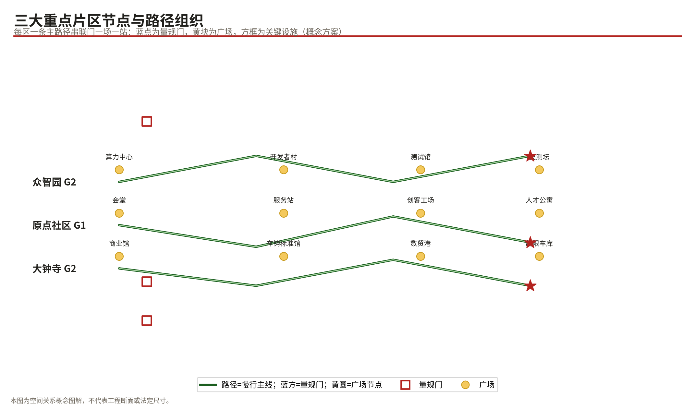
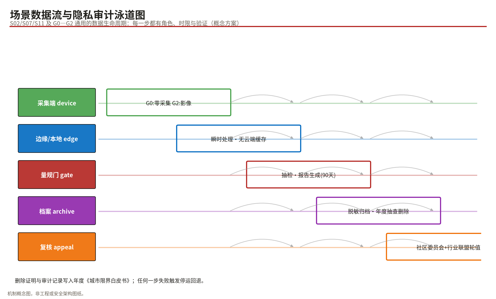
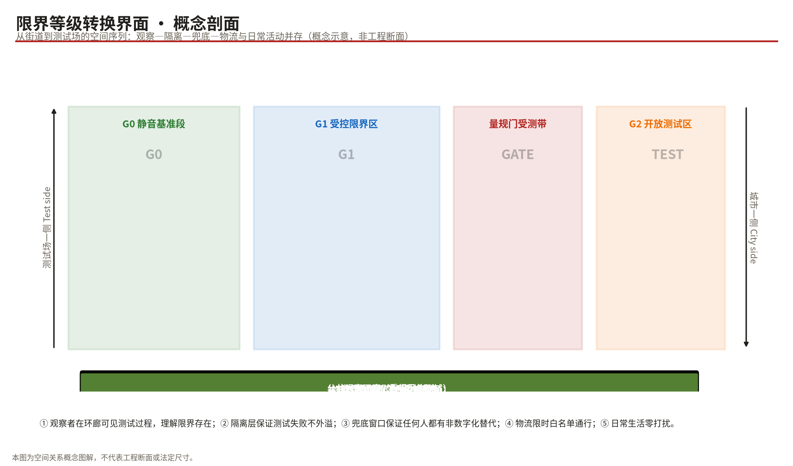

# 京张限界：先入界，再上线 / THE JING-ZHANG GAUGE

> 一句口令：**FIT THE GAUGE, JOIN THE LINE——先入界，再上线；机车常新，限界不改。**

## 设计依据与资料清单

本方案的资料基础分为四层。第一层是征集方发布的官方公告与面向智能体任务书，它们定义了三层范围、设计任务与成果深度，是一切判断的主控依据 [source:OFFICIAL-ANNOUNCEMENT] [source:AGENT-TASKBOOK]。第二层是仓库场地包（brief/site-package），提供设计空间规则、图层枚举、用地分类、指标口径与专业标准快照，本方案的全部几何与指标都按其约定生成与复算 [source:SITE-PACKAGE]。第三层是公共来源注册表，用于区分哪些材料可用于正式成果、哪些仅可作背景或临时线索 [source:SOURCE-REGISTRY]。第四层是全球公开案例，本方案仅将其作为机制借鉴的背景参考，不作为场地证据。

必须如实说明的数据缺口：征集方尚未发布总体设计范围的官方红线矢量与三处重点区的精确边界，本方案使用仓库提供的**临时粗略边界（provisional rough boundary）**进行空间生成与自检 [source:BOUNDARY-SOURCE]。该边界不得作为官方红线、审批依据或精确面积复算依据；三处重点区同样采用临时粗略范围 [source:KEY-AREA-SOURCE]。因此本方案所有面积、比例类指标均标注了"由临时边界复算、待正式数据后重算"的限定语，容积率、建筑高度等控规类指标一律记为"待正式数据补齐"，不填造数值。

## 三层范围工作框架

统筹研究范围约43.6平方公里，承担产业协同、生态图谱与未来城市形态研究，本方案在该层级只做策略判断，不做地块设计。总体设计范围公告面积约11.4平方公里，是本方案的主体工作对象：我们按其文字四至形成的临时粗略边界组织用地剖分、绿脊贯通、量规门布点与分期项目包 [data:geometry/site_boundary.geojson#PROV-SITE-001]，并在 EPSG:4548 下复核得总面积约11,412,825平方米，与公告值偏差在合理精度之内 [metric:site_area_sqm]。重点区域范围约368.4万平方米，包含三处重点片区，各自达到详细设计的表达深度但明确标注为方向性方案 [depth:three_level_scope_framework]。

三层范围的关系可以概括为"研究定方向、总体定结构、重点定样板"。现状诊断层面，本方案不掌握权属、产权与工程管线等非公开条件，统一记为资料缺口并列入假设清单 [depth:existing_conditions_diagnosis]。需要特别强调：一旦官方红线发布，本包中 site/key area 相关图层、全部面积类指标与图件都需要触发重算，这一复算路径已写入 assumptions.json 与各指标的 assumptions 字段。

## 统筹研究范围产业与未来城市研究

### 总体概念与命名体系（回应任务书 agent.1）

**主名称：京张限界（THE JING-ZHANG GAUGE）。** 命名逻辑直接取自京张铁路最硬核的工程制度——限界：铁路上一切机车、车辆、设备都必须装入一个固定的净空包络才能上线运行，隧道断面、站台边缘、信号设备的位置都由此锁定。据公开史料记载，1909年前后詹天佑主持的关沟段工程以精确测量与严格的工程纪律著称，建成中国人自主设计修建的首条干线铁路 [source:BG-HIST-JINGZHANG-RAILWAY]；一百多年后，AI成为新的"列车"，城市必须回答同一个问题：**什么能上线，以什么姿态上线，越界了怎么办。**

命名体系随之展开："一带"为百年京张AI创新带；"一脊"为京张遗址公园限界绿脊，即全带的零号基准线；"三门"为南门（西直门起点）、中门（原点社区）、北门（众智园）三座标志性量规门。英文口号 FIT THE GAUGE, JOIN THE LINE 同时保留了铁路语义与治理语义。该命名不照搬任何城市、园区或企业名称，亦不构成对既有品牌的替代主张 [standard:PROJECT-AGENT-OPEN-CALL-TASKBOOK]。

**视觉识别与Logo方向：** 以隧道断面半圆拱为基本形，内部嵌入"人"字形分岔线条，形成"拱中人字"的图形记号；标准色为信号红（#B3231F）、钢轨灰（#4A463E）与路签蓝（#1565C0）。字体方向选用可清权的开源黑体家族加注字重规范，不使用未经授权的企业字体与商标元素。Logo 仅作为概念方向提案，不代表已注册商标或已获批准的官方标识 [source:AGENT-TASKBOOK]。

**三大定位、五大功能与三区两翼的协同回路：** 本方案将"百年京张文化带、都市AI生活体验带、AI融合创新带"三大定位转译为限界语言——文化带是**基准线**（历史给定的底线与来路）、体验带是**量规门**（公众可感知、可参与的受测界面）、创新带是**测试区**（分级开放的创新轨道）。五大功能分别挂接：全栈自主创新体系落于众智园研发测试区；世界级生态落于车钩标准与开发者村；场景赋能新范式落于十张场景卡与复测环；智能化活力城市落于量规广场与慢行网络；AI治理话语权落于《城市限界白皮书》与年度复测大会。三区两翼回路表达为：大钟寺智能原生业态产生需求 → 众智园供给技术 → AI原点社区承载生活验证 → 中关村科技服务翼输出资本与IP → 小月河场景赋能翼串联公共体验，形成闭环而非单向带 [data:geometry/constraints.geojson#AZ-G0-001]。

### 全球AI创新生态借鉴与"车钩标准"（回应任务书 agent.2）

本方案选取七个全球案例作为机制借鉴（均为公开报道的背景性资料，仅作参考，不构成本方案的证据基础）：赫尔辛基市AI登记册与阿姆斯特丹算法登记册证明了"算法公开可查"在市级尺度可行，这直接启发我们的量规门公示屏；新加坡 Model AI Governance Framework 与 AI Verify 提供了可操作的测试工具箱，对应我们的复测环制度；欧盟AI法案的监管沙盒思路支持"G0/G1/G2 分级上线"的合法性路径；多伦多 Sidewalk Labs Quayside 项目则提供了反面教训——缺乏数据治理共识的超级创新难以获得社会执照，这正是"先定限界、再谈提速"的现实注脚；北京高级别自动驾驶示范区的分阶段扩区与统一服务平台经验，证明"先小后大、逐级放量"在本市行政语境下可行；巴塞罗那 Decidim 开源参与平台启示开发者村共治机制的技术形态。

在此基础上，本方案提出 **"车钩标准"（Coupler Standard）** 作为生态组织机制：据公开史料记载，詹天佑曾推动采用当时先进的自动车钩（Janney coupler），使不同厂家制造的车辆能够安全连挂、快速编组 [source:BG-HIST-JINGZHANG-RAILWAY]；今天的AI创新同样需要一组标准化"挂钩"——统一的数据接口目录、模型登记字段、安全测试报告格式与退出流程。任何团队、任何模型的AI服务，只要通过量规门的包络检查，就能挂上城市列车运营；撤钩即退出，不影响正线运行 [source:SOURCE-REGISTRY]。土地、空间、资金、人才、算力、数据、场景七类要素机制围绕车钩标准展开：产业空间按 G2 测试区优先供给，算力以开源算力中心并网调度，数据以最小必要原则经量规门受控接入，场景清单每年公开发布并以复测结果决定续期 [depth:overall_spatial_structure]。

**限界运行手册（可审计的准入—退出流程）：** 任一AI服务按七步上线——①登记（模型、责任主体、数据清单）②包络自检③量规门抽测④公示14天⑤登记上线（本方案内部治理机制，非行政许可，不免除建设、安全、无障碍、网络与数据等法定检查）⑥年度复测⑦降级或退出。可审计性约定：G2 区测试报告留存90天备查；对结果有异议可经行业联盟申请第三方复检（申诉通道）；连续两次复测不达标自动降级回库；年度汇总全部写入《城市限界白皮书》公开。分级检查频次为 G0 仅允许零采集设施（免于数据类检测、不免除其他法定检查）、G1 每年一测、G2 每季抽检，使"先入界再上线"成为可核对的程序而非口号 [data:geometry/constraints.geojson#SN-005]。

### 区域协同矩阵（概念性）

一带的创新能力必须放在区域网络里检验。本方案按"要素输入—输出"给出五条概念性协同接口：

| 方向 | 协同对象 | 协同内容（概念） | 接口机制 |
|---|---|---|---|
| 西 | 中关村科学城 | 资本、IP 与大企业场景需求输入 | 车钩标准互认目录 |
| 北 | 未来科学城 | 算力并网与能源协同 | 开源算力中心调度协议 |
| 东北 | 怀柔科学城 | 大科学装置数据与科研验证场景 | 沙盒联合测试备忘 |
| 东 | 北京经济技术开发区高级别自动驾驶示范区 | 分级放量、统一服务平台经验互鉴 | 复测报告格式互认（背景借鉴） |
| 区域 | 京津冀城市群 | 场景腹地与制造配套；对外输出开源"限规"标准文本 | 年度白皮书开源发布 |

上述协同一律为概念性建议，不构成任何政府间、园区间或企业间的承诺；待相应主体表达意向后再行深化 [source:AGENT-TASKBOOK]。

对任务书评审维度点名的沿线既有建成社区（如北纬社区）：本包未获得其专项公开资料，不作任何具体断言；统一按"建成社区共治"机制纳入 G1 区协同对象——量规广场听证、投诉阈值设定与年度复测旁听均为其预留席位，待公开资料补齐后逐项深化，不在概念阶段替居民代言。

未来城市形态假设：AI时代的城区竞争力不再取决于"装下了多少企业"，而取决于"能多快让一项可信的AI服务合法上线、被市民日常使用"。因此未来的城市形态是以**受测公共空间**为节点、以**可复测廊道**为骨架的网络结构——这正是本方案总体结构的由来。

## 总体设计范围城市更新与控规深度城市设计

总体层面的空间结构为"一脊两带四片多门"：一脊即遗址公园限界绿脊（南北贯通的G0静音基准段）；两带为西侧宜居生活服务带与东侧科创商务带；四片为大钟寺智能原生消费片、AI原点社区生活片、众智园自主创新片与北部留白发展片；多门即沿线六座量规门节点。整体结构向京张铁路遗产致意：当年的正线成为今天的基准线 [data:geometry/land_use.geojson#LU-001]。

更新框架遵循"存量为主、插花更新、可逆先行"的原则。我们不掌握各地块权属与建筑质量的一手资料，因此拆改留判断全部停留在概念建议层面：沿绿脊第一界面的低效仓储与围墙空间优先打开；重点片区内的成规模楼宇以功能置换为主；新增建设集中在重点片区的空地与预留地上。全部判断需待权属调查与建筑评估后由专业团队深化 [depth:retain_renovate_demolish]。

交通与市政方面，本方案提出微循环梳理、轨道站点一体化与新型基础设施三项策略：慢行系统以绿脊为主线缝合东西两侧；站点周边布局量规门与服务站；分布式算力与感知设施结合廊道带状布置。市政承载、能源负荷与管线容量等专业测算超出智能体提交边界，统一记为待专业确认事项 [depth:municipal_new_infrastructure] [source:OFFICIAL-ANNOUNCEMENT]。风貌控制上确立"钢轨灰基调 + 信号红点睛 + 遗产要素显性化"的总则，建筑体量与高度遵守待补齐的控规条件，不在概念阶段设定具体高度值 [depth:height_massing_character]。

开发强度方面必须再次声明：容积率、建筑密度、建筑高度、绿地率等法定控制值均无官方输入，本方案仅给出由几何复算的概念值供讨论，不作为任何审批依据 [standard:MOHURD-CONTROL-DETAILED-PLANNING]。

## 重点区域详细设计

三处重点区均使用仓库提供的临时粗略范围，以下设计为方向性方案 [data:geometry/key_areas.geojson#PROV-KEY-001]。

**① 众智园AI自主创新加速区（G2 全速测试带，约192.9公顷）。** 定位是全栈自主创新体系的空间载体。空间结构为"一心一村一场"：开源算力中心居中，开发者村沿西侧布局，具身智能测试馆与室外测试场靠东布置。建筑群采用组团式科研楼宇形态，概念层数4—8层，具体高度待控规确认。设计要点是把"测试"变成公共景观：测试场外围设观察环廊，让居民看见AI被测试的过程，理解限界的存在 [depth:three_key_area_detailed_design]。年度复测原点坛设于区内北端量规门旁，是荣誉展示体系的主场。

**② 北京AI原点社区（G1 受控限界沙盒，约104.3公顷）。** 定位是世界级创新生态的生活样本。空间结构为"剧场+工场+公寓"三件套：原点会堂承担发布与公共议事，创客工场承接小批量试制，青年人才公寓补足职住平衡。社区AI服务站提供适老、无碍的线下窗口——任何线上AI服务都在这里保留人工兜底通道。量规广场的公示屏滚动显示区内所有上线AI服务的登记信息、测试报告摘要与投诉入口 [data:geometry/constraints.geojson#SN-003]。

**③ 大钟寺AI产业聚集区（G2 智能原生消费与治理样板，约72.0公顷）。** 定位是智能原生新业态的第一现场。智能原生商业馆把"AI+消费"做成可逛可试的街区；数贸港双塔承载跨境数字贸易办公；**超限车库**是本片区最具制度意义的设施——它为未通过包络检查的服务提供降级、整改、复训的物理缓冲位，让"退出"成为一种被设计好的常规操作而非事故 [data:geometry/buildings.geojson#BL-013]。口袋绿洲与复测环骑行线改善产业区环境品质。

## AI 创新生态、人才画像与 AI+ 场景

**六类用户画像：** P1 通勤型青年工程师（住西侧生活带、就业于科创带，需要低摩擦的通勤与试错环境）；P2 银发居民（需要线下窗口、人工兜底与大字界面）；P3 视障及其他障碍人士（需要无障碍通道上的可靠导盲与语音服务）；P4 初创AI团队（三人规模、需要便宜的算力、清晰的规则与快速的上线通道）；P5 中小学生研学群体（需要可见、可问、可动手的AI科普现场）；P6 街道运营管理员（需要一键查看辖区AI服务状态与投诉处置的工具）。每张画像都对应明确的设施与制度接口，避免"为技术找场景"的倒置 [standard:PROJECT-AGENT-OPEN-CALL-TASKBOOK]。

**十二张AI场景卡**（其中★为产业测试验证场景，共4张；全部为概念提案）：

| # | 场景卡 | 分级 | 空间落位 | 服务对象 | 数据/隐私边界 | 运营主体（建议） |
|---|---|---|---|---|---|---|
| S01 | 无签不进路·无人配送上线测试场 ★ | G2 | 大钟寺商业馆外街 | 商户/消费者 | 路线与时段白名单，不采集个人身份 | 物业联盟+平台方 |
| S02 | 具身智能公共行为测试馆 ★ | G2 | 众智园测试馆 | 企业/公众观察廊 | 封闭场内测试，影像即采即删 | 园区运营方 |
| S03 | 开源算力并网调度台 ★ | G2 | 开源算力中心 | 初创团队/高校 | 作业元数据脱敏入库 | 算力合作社 |
| S04 | 复测环机器人耐候例行线 ★ | G2 | 复测环骑行道 | 检测机构 | 只记录设备状态量 | 第三方检测 |
| S05 | 社区AI服务站·适老窗口 | G1 | 原点社区服务站 | 银发居民 | 业务办理最小化，纸质回执可选 | 社区服务中心 |
| S06 | 量规广场公示屏·算法可读版 | G1 | 量规广场 | 全体市民 | 仅展示登记与测试摘要 | 街道+居委会 |
| S07 | 遗址公园静音导览 | G0 | 绿脊全线 | 游客/居民 | 零采集、无广告、可完全离线 | 公园管理中心 |
| S08 | 超限车库·降级回炉工坊 | G2 | 超限车库 | 未过检服务方 | 整改数据不出库 | 行业协会 |
| S09 | 车钩标准馆·挂接认证中心 | G2 | 车钩标准馆 | 开发者 | 认证档案公开可查 | 标准联盟 |
| S10 | 通勤绿道AI陪走灯 | G0→G1 | 绿脊联络道 | 夜归通勤者 | 光感联动，无身份识别 | 灯具运维方 |
| S11 | 数贸港跨境数据沙盒洽谈室 | G1 | 数贸港双塔 | 数字贸易企业 | 会话内容不出室 | 数贸服务商 |
| S12 | 研学列车课堂·AI科普专线 | 全线 | 绿脊车站课堂 | 中小学生 | 教学白名单应用 | 学校+基金会 |

场景—空间—运营映射的原则是"每卡必有门"：任何一张卡的落地都以通过对应等级量规门为前置条件，且每张卡都标注了可视化图层（scenario_nodes / ai_service_zones）便于监督 [data:geometry/constraints.geojson#AZ-G2-002]。

**数据运营细则（把"最小必要"写成可执行字段）：** 每张场景卡的数据边界进一步落为五个字段——①数据类别（位置 / 影像 / 语音 / 业务办理）；②留存期限（G1 业务类不超过90天且出厂即脱敏，G2 影像即采即删）；③访问权限（运营方最小角色集，跨方调取需留痕审批）；④告知同意（服务入口显著标识 + 一键撤回授权）；⑤事件响应（疑似泄露72小时内向街道与当事人双通报并冻结相关数据流）。独立复核由社区共治委员会与行业协会轮值承担，复核记录纳入年度白皮书。**可用性测试伦理（概念协议）：** 参与者签署知情同意书并可随时无条件退出；为残障参与者提供合理便利（陪同、代步、替代任务路径）；未成年人参与须监护人同意并在场；提供交通补贴等适度补偿而非诱导性报酬；测试全程数据最小化且测试后30天内删除个人记录；发现的缺陷进入公开缺陷清单并限期整改，形成反馈闭环。

**数据治理三栏对照（法律基线 / 方案自设目标 / 待专业确认）：**

| 事项 | 法律基线 | 本方案建议目标（非法定） | 待专业确认 |
|---|---|---|---|
| 留存期限 | 个人信息保护法最小必要原则 | G1 业务类≤90天且出厂即脱敏；G2 影像即采即删 | 各场景期限的合规审查 |
| 泄露通报时限 | 无普遍适用的72小时法定期限 | 本方案自定服务目标：疑似泄露72小时内双通报 | 与网信、公安报告义务的衔接 |
| 缓存与备份 | — | 边缘缓存不留存个人数据；备份加密并随主数据同周期删除 | 备份介质销毁流程 |
| 第三方访问 | — | 白名单+留痕审批 | 检测机构数据安全资质核验 |
| 删除验证 | — | 年度抽查删除有效性并写入白皮书 | 技术验证方案 |

**场景级补充约定（避免运营误读）：** S11"会话内容不出室"的实现含义为——洽谈室内的语音与屏幕内容仅在房间本地设备处理，不设云端缓存；系统日志只记录设备开关机时间与故障码，不含会话内容；第三方（含运维外包）不得访问室内采集链路，进场维护需双人陪同并留存记录。"G2 测试报告留存90天"专指报告文本与元数据档案；原始影像类数据仍执行即采即删，两者不互相覆盖。缓存、备份与删除验证的统一口径见上表。

特别说明："72小时"是本方案自行设定的服务水平承诺，不是对任何现行法规期限的转述或解释；场景数据的法律基线以届时有效的法律法规为准 [standard:GENERATIVE-AI-INTERIM-MEASURES]。

## 用地、建筑规模与拆改留方案

用地布局以13个无缝剖分的概念地块表达：公园绿地沿脊连续铺展形成G0基准段的物质基础，科研用地集中于北部众智园与东部原点社区东翼，商业服务业用地集中于大钟寺，居住用地稳定于西部生活带，北部与东北角保留两处留白用地作为远期弹性 [depth:land_use_layout]。分类体系执行国土空间调查规划用途分类口径 [standard:MNR-LAND-USE-CLASSIFICATION-GUIDE]。

建筑规模给出两个层次：其一，15处概念建筑的基底合计约23.8万平方米、按假定层数推算的概念体量约123.3万平方米，全部标注为低置信度设计量 [metric:building_footprint_area_sqm] [metric:conceptual_gross_floor_area_sqm]；其二，容积率、建筑密度、高度等法定指标因缺官方控规输入而记为"待正式数据补齐"，这是本包最重要的诚实边界之一 [depth:development_intensity_controls]。拆改留在概念层面执行"绿脊第一界面打开、成规模楼宇置换、空地新建"的三分法，最终结论必须等待建筑质量与权属调查 [standard:MOHURD-ARCH-DESIGN-DEPTH-2016]。

## 交通、轨道、市政与公共服务设施

慢行系统是本方案的主角：绿脊慢行道全程约9.7公里，是G0静音基准段的线性空间，仅允许零采集模式的辅助设施存在 [data:geometry/roads.geojson#RD-001]；复测环骑行线在大钟寺段闭环，兼作年度复测活动的仪式路线 [data:geometry/roads.geojson#RD-002]。轨道站点一体化聚焦既有线路的站点周边：量规门优先依托站前空间设置，让"出站即受测、进站即上线"成为可感知的日常程序 [depth:traffic_rail_slow_parking]。道路组织上仅对次干路与支路提出概念性调整线位，主干路与快速路的红线属于不可编辑的现状约束，本方案不提出任何改动主张。停车与非机动车按"轨道站点周边加密、绿脊沿线减量化"的方向给出概念配置。市政与新型基础设施方面，提出算力设施沿廊道带状预控、感知杆件多功能合杆、应急物资点结合超限车库布置三项策略，全部需待市政专业核实 [depth:municipal_new_infrastructure]。

公共服务设施按"十五分钟生活圈"校核：社区AI服务站与文化设施补足原点社区缺口，教育设施结合研学课堂共享设置，医疗资源依赖既有格局不作新建主张 [standard:BARRIER-FREE-ENVIRONMENT-LAW]。

## 蓝绿空间、公共空间与城市风貌

蓝绿系统由约1,514,451平方米绿地构成，绿地率约13.27% [metric:green_ratio]；其中遗址公园绿脊贡献了绝对主体，它与广场共同构成约14.8万平方米的可步行公共空间体系，公共空间率约1.30% [metric:public_space_ratio]。这些数值全部由本包几何在EPSG:4548下复算得出，属临时边界上的概念值 [depth:blue_green_public_space]。

**AI朝圣地标（不少于3个的要求已满足）：** 其一，**限界之门**——西直门起点的隧道断面形门架，是整条带的"零公里"标识，也是每项新服务上线的仪式背景板；其二，**复测原点坛**——众智园北端的人字形年轮广场，地面镶嵌历年复测大会的纪念轨枕，构成开发者荣誉展示体系的实体锚点；其三，**车钩标准馆**——大钟寺的接口标准博物馆，讲述从詹氏车钩到API协议的标准化史，兼具认证中心功能。另设清华园时刻表长廊作为补充节点，以老时刻表的排版美学展示当代AI服务的"发车计划" [data:geometry/public_space.geojson#PS-003]。全部地标均为概念提案，其建设不构成任何既成的政府决策 [standard:PROJECT-OFFICIAL-ANNOUNCEMENT]。

**公共空间组件库（agent.4 组件化要求）：** 地标之外，全线配置一套标准化、可撤回、可复制的城市家具级组件，使"限界"在任何一段街道都可被组装出来：

| 组件 | 功能 | 适用分区 |
|---|---|---|
| 量规门架 | 服务受测与新品上线的仪式背景板 | G1/G2 入口 |
| 公示屏（算法可读版） | 登记信息、测试摘要与投诉入口 | G1/G2 广场 |
| 荣誉轨枕 | 复测达标团队铭刻，构成荣誉展示体系 | 复测原点坛 |
| 静音灯杆 | 光感照明、零采集、无广告投放 | G0 绿脊 |
| 可撤回测试位 | 临时占用的划线与地贴，随评估去留 | G2 街道 |
| 无碍导览桩 | 语音 + 盲文 + 触觉地图三通道 | 全线站点 |
| 人工兜底窗口 | 非数字化替代路径的实体锚点 | 社区服务站 |

组件均为概念设计方向，具体选型需经无障碍专项与公共空间评审后深化 [standard:BARRIER-FREE-ENVIRONMENT-LAW]。

文化叙事上，本方案把三种文脉拧成一股：京张铁路的**工程纪律**（测量、限界、按时交工）、中关村的**首创精神**（敢为人先、容忍失败）、AI时代的**可问责创新**（透明、可测、可退出）。导视符号系统从铁路信号语汇取材：信号红表示"禁止上线"、路签蓝表示"受控通行"、绿灯仅出现在复测通过的瞬间——让治理规则变成街头可读的城市戏剧。国际传播叙事浓缩为一句：*"A railway that taught China to build; a gauge that teaches AI to belong."*（一条教会中国建造的铁路，一副教会AI归属的限规。）[depth:height_massing_character]

## 更新项目清单、实施政策与分期计划

更新项目按三个可独立暂停的项目包组织，对应 phasing 图层 [data:geometry/phasing.geojson#PH-001]：

| 包 | 名称 | 主要内容 | 依赖条件 | 建议 |
|---|---|---|---|---|
| P1 | 绿脊南段与量规之门（2026—2028） | 绿脊南段贯通、两处起点广场、S01配送测试场、量规门01 | 官方红线发布、权属协调 | 低成本可逆材料先行 |
| P2 | 原点社区沙盒（2028—2030） | 社区服务站改造、量规广场公示屏、步行缝合通廊、复测环制度化 | P1经验评估 | 与社区共治委员会联审 |
| P3 | 众智园全速测试带（2030—2035） | 测试馆扩容、复测原点坛、留白用地启动评估 | 前两期复测达标 | 触发式启动 |

政策工具箱建议包括：场景清单年度发布制、量规门检测费用减免券、超限服务的整改辅导期、以及"暂停即止损"条款——任何一期都可独立暂停而不影响已建成部分。上述安排均为概念建议，实施主体、投资测算与审批路径需由专业机构论证，不构成任何确定的政府安排 [depth:renewal_project_list]。

**分期门槛（go/no-go）与长期运营指标：** P1 启动门槛为官方红线发布且权属协调完成，并设"暂停即止损"触发器——任一季度公众投诉率超过听证设定的阈值即冻结扩面；P2 门槛为 P1 复测达标且社区听证通过；P3 为触发式启动，要求前两期复测均达标。长期运营以四个逐年公开的指标接受监督：量规门平均检测周期（目标值在深化阶段经专业论证确定）、公示覆盖率保持全额、人工兜底窗口接通率不低于95%、超限服务整改成功率与复测参与团队数 [data:geometry/phasing.geojson#PH-003]。

**责任与验收台账（RACI 概念版）：** 每个项目包固定四类角色——发起方（属地街道或平台公司）、实施方（设计施工运营联合体）、验收方（第三方检测机构+社区共治委员会联签）、监督方（区主管部门与公众代表）；本表为角色框架，具体单位在深化阶段经法定程序确定。KPI 口径补全：检测周期的分母为当期全部送检服务数并按季度统计；兜底接通率的分母为人工窗口来电与到访总量；整改成功率的分母为当期被判超限的服务总数；各阈值给出方案自设的建议默认值以便试点直接可用（非官方标准，最终以听证确认值为准）：投诉率阈值建议为每千次服务互动投诉不超过2件；量规门检测周期目标≤10个工作日；公示更新延迟≤24小时；整改辅导期建议30天；回退规则为任一指标连续两个季度不达标即触发该包暂停并引入第三方审查；回退规则为任一指标连续两个季度不达标即触发该包暂停并引入第三方审查。

**P1 最小可行试点验收清单与参与式可用性测试协议（概念版）：** 验收按七项执行，每项绑定责任人与证据：①绿脊南段贯通长度与无障碍连通（实施方/竣工测量+轮椅与盲杖实测记录）；②量规门检测功能可用（验收方/检测报告样例）；③公示屏信息完整率100%（监督方/周度截图存档）；④人工兜底窗口接通（社区共治委员会/来电到访台账）；⑤数据零采集核验（第三方/G0段抓包审计）；⑥删除验证（第三方/抽样服务下线后数据清除证明）；⑦运维交接文档完备（发起方/交接清单签署）。可用性测试协议：每季度邀请不少于12名覆盖六类画像的志愿者（含视障与银发参与者）完成既定任务路径，任务失败即记为可用性缺陷并限期整改；任一无障碍失败标准（如盲文桩缺失、坡道中断）即视为该项验收不通过，触发停运条件直至复验合格。以上为机制框架，具体指标值在深化阶段经专业论证确定。

**全球AI创新活动体系与长期运营（回应任务书 agent.6）：** 年度活动体系以"量规日"为核心（每年6月，发布《城市限界白皮书》与年度复测报告），辅以9月"开线节"（新服务集中上线的城市仪式）、季度"扳道房工作坊"（开发者共创营）与冬季"百年京张AI马拉松"。活动品牌延续"拱中人字"视觉，传播视觉系统提供中英双版。开发者社区运营采取"会员制+积分制"：通过量规门认证的团队获得算力积分与场景优先权。国际传播与招引转化依托英文版白皮书、海外高校巡回展与"国际限界伙伴城市"倡议，把海淀规则写成可供其他城市引用的开源文本。所有运营机制的可持续性以复测结果为准绳：连续两次复测不达标的场景自动降级或退出 [source:AGENT-TASKBOOK]。

## 指标体系、面积复算与合规矩阵

本方案的指标体系坚持"每个数都能回到几何"的原则：site_area_sqm 约11,412,825㎡、green_space_area_sqm 约1,514,451㎡、public_space_area_sqm 约147,977㎡、building_footprint_area_sqm 约237,503㎡，全部由 GeoJSON 在 EPSG:4548 投影下复算 [metric:site_area_sqm] [depth:metrics_recalculation]。

诚实披露的两条底线：其一，floor_area_ratio 与 building_height_m 两项状态为"待正式数据补齐"，原因与复算触发条件已写入 metrics.json 的 reason 字段，正文不填造数值；其二，概念体量 123.3万㎡ 是"假定层数×概念基底"的低置信度设计量，不是法定控制值 [metric:conceptual_gross_floor_area_sqm]。比率类指标中 green_ratio 约13.27%、public_space_ratio 约1.30%，均在合理区间 [metric:green_ratio] [metric:public_space_ratio]。合规矩阵覆盖公告1.3、1.4、1.5全部条目与agent.1至agent.6全部任务，标准矩阵覆盖六项强制专业标准及三项参照标准，设计深度矩阵覆盖全部15个必选项 [standard:GENERATIVE-AI-INTERIM-MEASURES]。

## 风险、版权与合规说明

本方案最主要的两类风险：一是**把概念当成决策的表达风险**——全部内容均为开放共创建议，不替代正式规划，不构成政府审定结论，正文已系统性使用"概念""建议""方向性"限定词 [standard:MOHURD-URBAN-DESIGN-MEASURES]；二是**数据与隐私风险**——十二张场景卡逐一标注了数据边界与人工复核安排，G0段执行零采集，G1段执行最小必要与可退出，G2段执行高频抽检与超限回库 [depth:risk_missing_data]。

版权与清权声明：本方案图件由脚本基于本包几何数据绘制，字体使用 OFL 授权开源家族（图件渲染 Noto Sans CJK；PDF 与 HTML 内嵌 JetBrains Maple Mono 子集），两族均允许随包再分发；七个全球案例仅作背景引用并标注来源性质；Logo为原创概念图形，未使用任何受保护的第三方商标、人物肖像或企业标识；未使用任何非公开政府数据、企业内部数据或个人隐私数据。详细权利台账见 report/copyright_statement.md。适老与无障碍要求贯穿场景卡设计，响应无障碍环境建设法与切实解决老年人运用智能技术困难的国办方案精神 [standard:ELDERLY-SMART-TECH-PLAN-2020-45] [standard:BARRIER-FREE-ENVIRONMENT-LAW]。生成式AI相关场景均以受监管试点方式表述，符合生成式人工智能服务管理暂行办法的治理方向 [standard:GENERATIVE-AI-INTERIM-MEASURES]。

## 参考资料

1. 百年京张AI创新带城市设计国际方案征集资格预审公告（征集方，2026）[source:OFFICIAL-ANNOUNCEMENT]。
2. 面向全球智能体开展"百年京张AI创新带城市设计开源征集"的任务书摘录（征集方，2026）。
3. open-city-ai/haidian 仓库场地包 brief/site-package：设计任务书、图层枚举、指标口径、临时边界与来源注册表。
4. 《城市设计管理办法》（住房和城乡建设部，2017）。
5. 《城市、镇控制性详细规划编制审批办法》（住房和城乡建设部）。
6. 《国土空间调查、规划、用途管制用地用海分类指南》（自然资源部，2023）。
7. 《建筑工程设计文件编制深度规定（2016年版）》。
8. 《生成式人工智能服务管理暂行办法》（2023）。
9. 《中华人民共和国无障碍环境建设法》；《关于切实解决老年人运用智能技术困难实施方案的通知》（国办发〔2020〕45号）。
10. 赫尔辛基AI登记册、阿姆斯特丹算法登记册、新加坡Model AI Governance Framework、欧盟AI法案监管沙盒、多伦多Quayside项目报道、北京高级别自动驾驶示范区公开报道、巴塞罗那Decidim平台文档（均为公开背景资料）。
