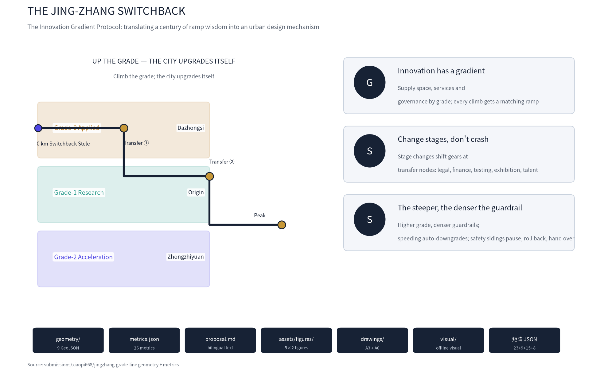
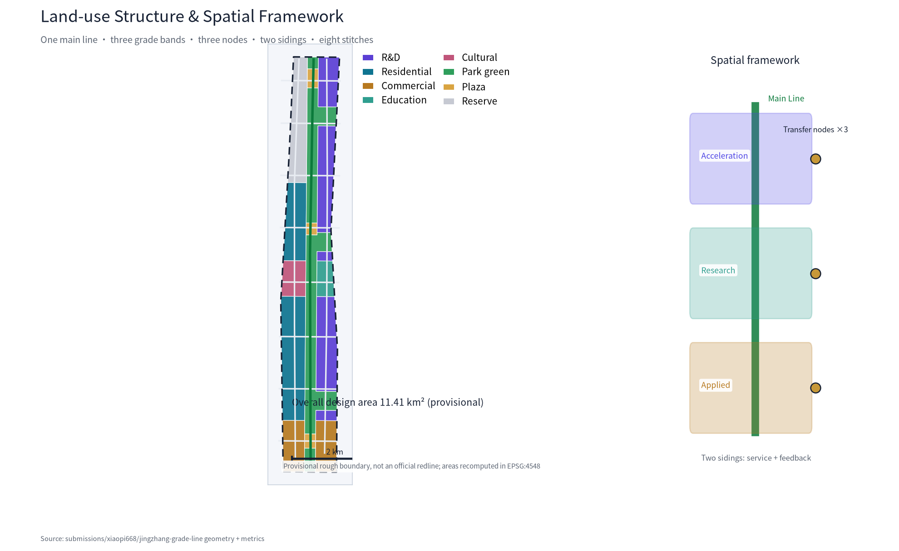
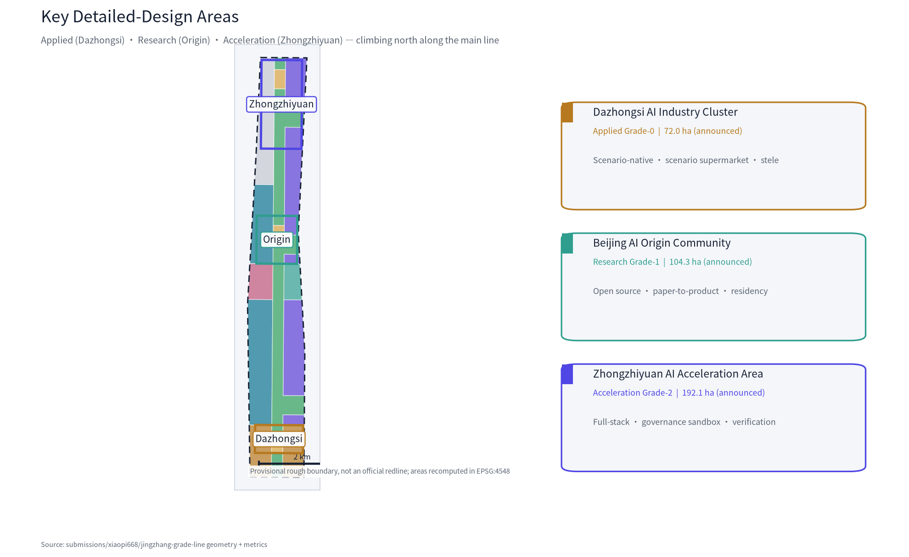
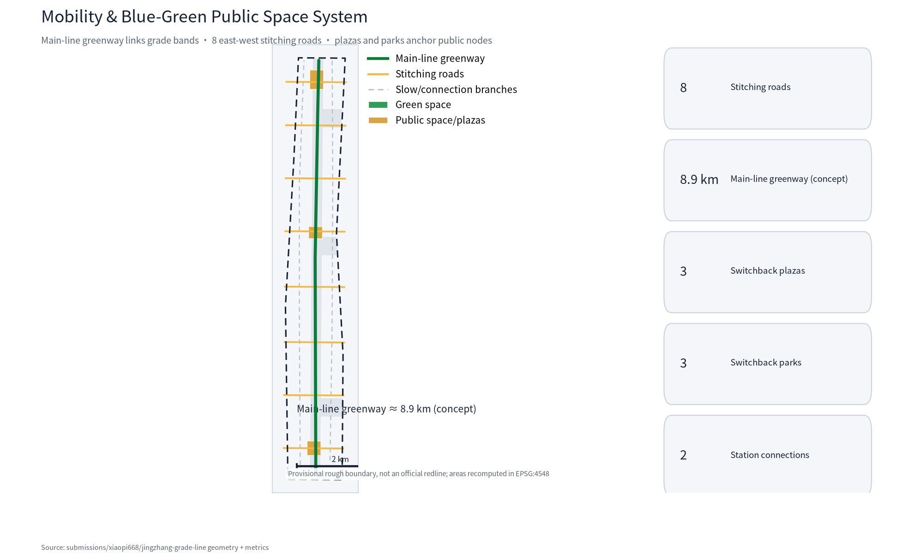
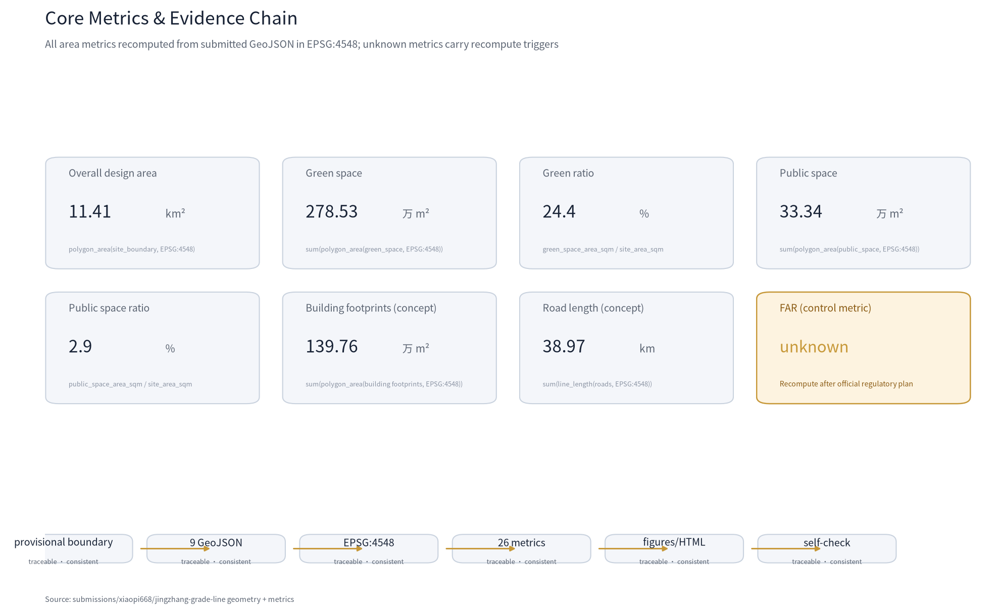

# THE JING-ZHANG SWITCHBACK: Where the City Upgrades Itself Along the Grade

> **One-liner**: **UP THE GRADE — THE CITY UPGRADES ITSELF**.
> **Core mechanism**: the Innovation Gradient Protocol (IGP) — instead of treating AI innovation as level ground, the city designs the gradient into itself the way the Jing-Zhang Railway handled the 33‰ Guan'gou grade: supply space by grade band, change stages at switchback transfer nodes, and govern by graded grade signals. The grade is not a barrier; it is kinetic energy [source:AGENT-TASKBOOK] [source:OFFICIAL-ANNOUNCEMENT].

## Design Basis and Source Inventory

This proposal takes the Pre-Qualification Announcement of the Centennial Jing-Zhang AI Innovation Belt International Urban Design Open Call as its primary basis [source:OFFICIAL-ANNOUNCEMENT], the Agent Open-Call Taskbook as its task basis [source:AGENT-TASKBOOK], and the provisional boundaries, key areas, enums, metrics and source inventory registered in `brief/site-package/` as its machine-readable basis [source:SITE-PACKAGE]. All public policies, historical materials, industry cases and public data are registered in `sources.json` by source type (official_public / user_provided_cleared / agent_inferred_from_public_data); generation methods and reuse boundaries are documented in `report/copyright_statement.md`.

Material use follows `data/source_registry.json` [source:SOURCE-REGISTRY]: formal-ready materials inform design judgments, provisional-only materials are used for generation and display only, and no material may be upgraded into an official redline, statutory regulatory plan, approval basis or implementation commitment. All geometry in this package derives from the provisional rough boundary in `brief/site-package/geometry/provisional_boundaries.geojson` (11.41 km², consistent with the announced ~11.4 km²); every layer is labelled `provisional_constraint` or `agent_generated_design` and must be fully recomputed when official polygons are published [source:BOUNDARY-SOURCE] [source:KEY-AREA-SOURCE].

This is not a standalone vision text: every spatial judgment traces to layers, metrics, standards and sources [metric:site_area_sqm] [data:geometry/site_boundary.geojson#SITE-001]. The three key areas are verified through their own layer and count metric [data:geometry/key_areas.geojson#PROV-KEY-001] [data:geometry/key_areas.geojson#PROV-KEY-002], with the total consistent with the announcement [data:geometry/key_areas.geojson#PROV-KEY-003] [metric:key_area_count]. Complete source, metric, standard and design-depth indexes live in `sources.json`, `metrics.json`, `compliance_matrix.json`, `standard_matrix.json` and `design_depth_matrix.json`; the body cites only evidence directly tied to each judgment [depth:existing_conditions_diagnosis].

### AI-native workflow and methodology

The proposal is generated end-to-end by an AI agent, and the workflow itself is part of the planning-methodology innovation [source:AGENT-TASKBOOK].

1. **Procedural geometry with topology verification**: land_use is cut by one shared polygonize line network, inherently seamless (no gaps/overlaps), with areas auto-recomputed in EPSG:4548 [data:geometry/land_use.geojson#LU-001].
2. **Data-driven figures**: all 5 core figures (bilingual pairs) are generated directly from GeoJSON and metrics, keeping text and numbers consistent [metric:site_area_sqm].
3. **Multimodal simulation-review loop**: strict-round simulation reviews mirror the official prompt, each finding repaired before submission; this revision comes from that loop.
4. **Analytical AI application concepts**: walkability isochrones, demand inference, and the scenario data return loop (feedback siding) as landing points for analytical AI in planning [metric:road_total_length_m].

## Three-Level Scope Framework

The proposal is organized on the announced three levels [standard:PROJECT-OFFICIAL-ANNOUNCEMENT]: the coordinated research area (43.6 km²) answers how the AI ecosystem and future city form are organized; the overall design area (11.41 km², the corridor 1–2 km around the Jing-Zhang Heritage Park) answers how industry space, urban renewal, transport and urban character are mapped; the key detailed design area (368.4 ha in three sub-areas) answers how each area reaches detailed-design depth. The three levels are mapped item by item in `compliance_matrix.json`, covering all mandatory tasks of Announcement 1.3/1.4/1.5 and agent.1–agent.6 [depth:three_level_scope_framework].

The three levels are not disjoint drawing sets: the research level decides industry-chain and city-form judgments; the overall level translates them into land use, renewal projects and facility capacity; the key-area level verifies implementability at parcel, building, transport, public space and AI-scenario scale. All three share one spatial grammar — **Main Line, Grade Band, Transfer Node, Siding and Grade Signal** — so the same mechanism carries from industrial strategy down to block design [depth:overall_spatial_structure].

| Level | Design question | This proposal | Data anchor |
| --- | --- | --- | --- |
| Research area | AI ecosystem & future city form | Innovation Gradient Protocol: university origin—research grade—acceleration grade—applied grade—international communication | compliance_matrix.json, standard_matrix.json |
| Overall design area | Industry space & renewal framework | One main line (heritage park) + three grade bands + three transfer nodes + two sidings + eight stitching roads | [data:geometry/land_use.geojson#LU-001]、[data:geometry/roads.geojson#ROAD-001] |
| Key design area | Detailed design of three areas | Applied grade (Dazhongsi) / research grade (Origin community) / acceleration grade (Zhongzhiyuan) | [data:geometry/key_areas.geojson#PROV-KEY-001]、[data:geometry/key_areas.geojson#PROV-KEY-002]、[data:geometry/key_areas.geojson#PROV-KEY-003] |

**Provisional boundary note**: all boundaries and key-area polygons are provisional, for generation, self-check, visualization and non-statutory design discussion only; they are not official redlines, approval bases, precise-area bases or statutory control conclusions [source:BOUNDARY-SOURCE]. The organizer's missing official polygons do not block content scoring; once official boundaries are published, the site boundary, key areas, land use, buildings, roads, green space, public space, phasing and all area metrics must be recomputed from geometry [metric:site_area_sqm] [depth:metrics_recalculation].

## Research Area: Industry and Future City Study

### Overall concept: the Innovation Gradient Protocol (IGP)

In 1909 the Jing-Zhang Railway met a 33‰ grade in the Guan'gou section. Zhan Tianyou chose neither detour nor brute force: he used a **switchback alignment** — folding the line back on itself to reduce the effective grade — so the train could climb the pass. A century later, this switchback still hands the AI belt one operative urban-design lesson [source:SRC-RAILWAY-HISTORY]: **innovation is not about removing difficulty; it is about designing the ramp**.

This proposal translates that engineering wisdom into the **Innovation Gradient Protocol (IGP)** as the belt's overall concept [standard:PROJECT-AGENT-OPEN-CALL-TASKBOOK]. The protocol rests on three principles:

1. **Innovation has a gradient**: original research, technology transfer, product acceleration and market application are four kinds of innovative labour on different grades, requiring different urban environments. The city supplies space, services and governance intensity by grade band, so every climb has a matching ramp.
2. **Change stages, don't crash (Switchback)**: stage change (research→product→market) is not an instant switch but a gear change performed at **transfer nodes** — like the switchback exchanging length for slope, the nodes provide legal, financial, testing, exhibition and talent "gear-shift services".
3. **The steeper the slope, the denser the guardrail (Safety)**: AI services are governed by the grade they stand on: the higher the grade, the stricter the ethics review, human review and privacy boundaries; exceeding a risk boundary (speeding) triggers automatic downgrade; **safety sidings** provide space for pause, rollback and human takeover in case of failure or dispute.

### Three positionings and five functions on the grade

The three positionings (Centennial Jing-Zhang Culture Belt, Urban AI Life Experience Belt, AI-Integrated Innovation Belt) each take a role in IGP [source:AGENT-TASKBOOK]: the culture belt is carried by the main line (heritage park) and the switchback narrative; the life-experience belt by the applied grade (Dazhongsi) and main-line public space; the innovation belt by the research grade, acceleration grade and the two sidings. The five functions (full-stack self-reliant innovation system, world-class AI innovation ecosystem, AI+ scenario empowerment paradigm, intelligent AI-vibrant city, global AI governance discourse) map to a closed loop of the three grade bands and two sidings: **research grade produces original innovation → acceleration grade completes full-stack autonomy and product verification → applied grade turns outcomes into public experience → feedback siding returns scenario data and usage feedback to the research grade** [depth:overall_spatial_structure].

### Naming system and logo direction

**Primary name**: 京张展线 (THE SWITCHBACK). "展线" is a railway term (extending the alignment by folding to reduce grade) and doubly means "development, unfolding"; the English SWITCHBACK points directly to the switchback engineering motif. **Naming system**: three grade bands — Applied Grade, Research Grade, Acceleration Grade; three nodes — Transfer Stations; two wings — Service Siding (Zhongguancun technology services) and Feedback Siding (Xiaoyuehe scenario empowerment); the main line — The Main Line; slow-travel milestones — Milepost Walk. **Logo direction**: a three-segment rising zigzag symbol with three rivets at the turns for the three transfer stations, in a gradient of Jing-Zhang railway grey-blue, Zhongguancun electron red and AI neon cyan; extendable into grade marks, milepost marks, wayfinding and honor-display systems [depth:overall_spatial_structure]. Logo and type use self-drawn vectors and open-source fonts only, with no unauthorized trademarks or portraits [source:SOURCE-REGISTRY].

### Global AI innovation ecosystem cases (5–8 readable summaries)

All cases come from public sources and illustrate how "grade mechanisms" appear in different ecosystems; they are not endorsements or recruitment commitments for any company [source:AGENT-TASKBOOK]:

| Case | Location | Grade form | Transferable mechanism for Haidian |
| --- | --- | --- | --- |
| Stanford Research Park / Palo Alto | USA | continuous university—industry grade band | research grade adjacent to campus with walkable "foot-of-slope" interface |
| Cambridge Innovation Center / Kendall Square | USA | research—acceleration dual loop | transfer nodes with patent, legal and pilot services |
| one-north (Singapore) | Singapore | research—industry—living integrated grade | applied grade and public space on the same level; scenario as exhibition |
| King's Cross Central (London) | UK | heritage-regeneration gentle grade | main-line public space pulling regeneration on both sides |
| Tel Aviv start-up hub | Israel | steep acceleration band | dense venture capital and fast verification mechanisms |
| Berlin Kreuzberg creative district | Germany | community co-creation gentle grade | low-threshold community participation and test spaces |
| Nanshan Hi-Tech Park (Shenzhen) | China | hardware acceleration steep grade | pilot production, volume and supply-chain ramps |

**Ecosystem map**: Haidian's strength is a complete innovation grade chain — "university origin—open-source collaboration—full-stack autonomy—scenario application—international communication" [source:SRC-BEIJING-SCIENCE-CENTER]. IGP's contribution is to make this chain **spatial**: every link has an explicit grade band, node and siding, instead of packing all innovation functions into one district [depth:land_use_layout].

### Three-areas-two-wings collaboration loop

Following the taskbook's "three areas, two wings" layout [source:AGENT-TASKBOOK]: the Beijing AI Origin Community (research grade, gentle slope) produces original innovation and a world-class ecosystem; the Zhongzhiyuan AI Self-Reliance Acceleration Area (acceleration grade, steep slope) hosts the full-stack self-reliant innovation system and AI governance discourse; the Dazhongsi AI Industry Cluster (applied grade, foot of slope) hosts scenario-native new business and public experience. The two wings — Zhongguancun Technology Service Wing (service siding: global factor allocation, Zhongguancun IP and capital empowerment) and Xiaoyuehe Scenario Empowerment Wing (feedback siding: AI scenario empowerment and intelligent AI-vibrant city) — connect through stitching roads and the main line, forming a closed "research—acceleration—application—feedback" loop [depth:three_key_area_detailed_design]. The loop lands on land use and public space: transfer nodes (switchback parks) sit between research and acceleration grades, switchback plazas between applied and research grades, and stitching nodes where the sidings cross the main line [data:geometry/land_use.geojson#LU-005].

## Overall Design Area: Urban Renewal at Regulatory-Depth Urban Design

### Spatial structure: One Main Line · Three Grade Bands · Three Nodes · Two Sidings · Eight Stitches

- **One Main Line**: the Jing-Zhang Heritage Park — the north-south blue-green public spine carrying slow travel, cultural narrative and AI public experience; the spiritual and spatial axis [data:geometry/green_space.geojson#GREEN-001] [data:geometry/roads.geojson#ROAD-001].
- **Three Grade Bands**: Applied (south, Dazhongsi), Research (middle, Origin community), Acceleration (north, Zhongzhiyuan), climbing from south to north [data:geometry/land_use.geojson#LU-003].
- **Three Nodes**: three **switchback parks** (transfer nodes) on the east band beside the main line, anchoring stage changes and public encounter [data:geometry/green_space.geojson#GREEN-001].
- **Two Sidings**: Zhongguancun Technology Service Wing (west) and Xiaoyuehe Scenario Empowerment Wing (east), joined to the main line by eight stitching roads [data:geometry/roads.geojson#ROAD-003].
- **Eight Stitches**: eight east-west stitching roads repairing the century-old east-west severance; each road's crossing with the main line is a "stitching node" [data:geometry/roads.geojson#ROAD-002].

The structure lands directly in land use: main line and nodes are park green (1401) and plaza (1403); research and acceleration grades are research land (0802) with education (0804); the applied grade is commercial (05); the two wings' hinterlands are residential (0701) and cultural (0803); the north keeps reserve land (16) for future compute and functional uncertainty [metric:land_use_green_sqm] [metric:land_use_research_sqm] [metric:land_use_reserve_sqm]. All land-use conclusions are concept proposals, not statutory layouts [standard:MNR-LAND-USE-CLASSIFICATION-GUIDE].

### Urban renewal framework: renew by grade

Renewal objects are treated by grade band [depth:retain_renovate_demolish]: the applied grade mainly **retains and renovates** with gradual renewal of commercial frontages; the research grade mainly **retains, renovates and improves**, protecting campus and neighborhood fabric while implanting research-to-product functions; the acceleration grade combines **renovation and new construction**, cultivating full-stack platforms on reserve and underused land. Retain/renovate/demolish classes are concept directions only; parcel-level conclusions await official regulatory plans, ownership and existing-building data, and this proposal gives no statutory demolition conclusions [standard:MOHURD-URBAN-DESIGN-MEASURES].

### Industry objectives and functional layout

Industry functions follow the grade chain: the acceleration grade hosts full-stack segments (AI chips, foundation models, data and compute); the research grade hosts open-source communities, paper-to-prototype conversion and talent cultivation; the applied grade hosts AI consumption, exhibition and public-service scenarios; the sidings host technology services and scenario empowerment. Industry-space metrics are conceptual volumes, not statutory control values [metric:building_footprint_area_sqm] [depth:development_intensity_controls].

### Urban character

Urban character takes the "grade" as motif: the skyline rises gently from south to north; the acceleration grade permits landmark towers (concept direction, not a height-control conclusion) while the research grade and main-line surroundings stay low- to mid-intensity and human-scale [depth:height_massing_character]. Materials and wayfinding adopt the switchback symbol system with the unified "grey-blue—red—cyan" palette [source:AGENT-TASKBOOK].

## Key Detailed-Design Areas

Each key area is organized as "positioning + spatial structure + building renewal + transport and slow travel + public space + AI scenarios + implementation risks" at the depth of an implementation-master-plan-level urban design [depth:three_key_area_detailed_design].

### Applied grade: Dazhongsi AI Industry Cluster (foot of slope)

**Positioning**: AI's "first landing" — the scenario-native consumption and public-experience foot-of-slope [data:geometry/key_areas.geojson#PROV-KEY-003].
**Spatial structure**: commercial land dominates (conceptual ~120.9 ha [metric:land_use_commercial_sqm]); the **Switchback Plaza** (0 km milestone) sits at the south end of the main line [data:geometry/public_space.geojson#PUBLIC-001]; the switchback park (applied node) on the east band hosts the scenario supermarket.
**Building renewal**: mainly retain-and-renovate with open ground-floor scenario frontages; no statutory demolition conclusions.
**Transport & slow travel**: four-quadrant walkable connections around the transit station; stitching roads S-1/S-2 join the main line [data:geometry/roads.geojson#ROAD-002].
**Public space**: Switchback Plaza + applied pocket park as the "foot-of-slope living room".
**AI scenarios**: four scenario cards including AI scenario-native consumption street and scenario supermarket (industry test scenario).
**Implementation risks**: station-area integration and commercial renewal depend on ownership and municipal review — listed as to-be-confirmed.

### Research grade: Beijing AI Origin Community (gentle slope)

**Positioning**: AI's "zero grade" — the origin gentle slope of original innovation and open-source ecosystems [data:geometry/key_areas.geojson#PROV-KEY-002].
**Spatial structure**: research and education land on the east band [metric:land_use_education_sqm]; the west band preserves campus-community fabric with cultural display (0803); the **Switchback Plaza (research node)** sits mid-main-line [data:geometry/public_space.geojson#PUBLIC-002].
**Building renewal**: retain-renovate-improve; campus-front interfaces become research-to-product streets; concept direction pending ownership confirmation.
**Transport & slow travel**: transit connections; stitching roads S-4/S-5 strengthen north-south university links [data:geometry/roads.geojson#ROAD-005].
**Public space**: open-source code garden, paper-prototype pop-up lab (industry test scenario).
**AI scenarios**: four cards including open-source code garden, AI tutor, developer residency.
**Implementation risks**: campus boundaries and community renewal are sensitive — start with lightweight pilots and set exit mechanisms.

### Acceleration grade: Zhongzhiyuan AI Self-Reliance Acceleration Area (steep slope)

**Positioning**: the "steepest segment" of full-stack autonomy and governance discourse [data:geometry/key_areas.geojson#PROV-KEY-001].
**Spatial structure**: research land dominates (conceptual ~273.9 ha [metric:land_use_research_sqm]); reserve land (16) in the north holds future compute and flexibility [metric:land_use_reserve_sqm]; the **Switchback Plaza (acceleration node)** sits at the north main line [data:geometry/public_space.geojson#PUBLIC-003].
**Building renewal**: renovation-and-new-build combination with campus-style higher intensity (concept direction); an innovation frontage along the Qinghe river [data:geometry/constraints.geojson#CON-001].
**Transport & slow travel**: stitching roads S-6/S-7/S-8 serve commutes; transit connections strengthened [data:geometry/roads.geojson#ROAD-008].
**Public space**: acceleration switchback park, compute-lighthouse plaza.
**AI scenarios**: four cards including full-stack verification field (industry test scenario), governance sandbox, smart park operations.
**Implementation risks**: high industrial uncertainty — adopt "pioneer zone—expansion zone" elastic boundaries adjustable with industry change [data:geometry/phasing.geojson#PHASE-003].

## AI Innovation Ecosystem, Personas and AI+ Scenarios

### Personas (5)

1. **Researchers/developers**: faculty, students and open-source contributors using labs, residencies and communities on the research grade.
2. **Founders/entrepreneurs**: hard-tech founders using the acceleration grade's verification field and the service siding's capital/IP.
3. **Employees/commuters**: industry workers caring about commute quality, smart parks and main-line slow travel.
4. **Residents/families**: surrounding communities using public space, AI public services and accessible experiences.
5. **Global visitors/media**: tourists and overseas developers engaging the switchback narrative, landmarks and international events.

### AI scenario cards (12; 3 are industry test-verification scenarios)

| ID | Scenario | Grade band | Spatial anchor | Users | Runtime data | Privacy boundary | Human review | Operator | Risk |
| --- | --- | --- | --- | --- | --- | --- | --- | --- | --- |
| SC-01 | AI scenario-native consumption street | Applied | Dazhongsi commercial frontage | residents/visitors | aggregated footfall, recommendations | no personal identity | consumer confirms decisions | commercial operator + platform | recommendation bias |
| SC-02 | Scenario supermarket (test #1) | Applied | switchback park, applied node | founders/public | de-identified trial data | consent + de-identification | scenario admission review | park operator + test committee | data misuse |
| SC-03 | Accessible mobility assistant | Applied | Dazhongsi station area | disabled/elderly | authorized trip requests | minimal collection | human hotline fallback | transit operator | privacy leakage |
| SC-04 | Open-source code garden | Research | Origin main line | developers | open-source submission metadata | public data | community moderators | open-source community | content compliance |
| SC-05 | Paper-prototype pop-up lab (test #2) | Research | Origin east band | researchers | authorized experiment records | research ethics review | ethics committee | university + incubator | ethics breach |
| SC-06 | Campus AI tutor | Research | around campuses | students | authorized learning progress | de-identified education data | teacher confirmation | university | algorithmic bias |
| SC-07 | Developer residency program | Research | residency studios | global developers | public residency profiles | owner consent | selection committee | community operator | slot disputes |
| SC-08 | Full-stack verification field (test #3) | Acceleration | Zhongzhiyuan | enterprises | classified model benchmarks | enterprise data isolation | professional review | verification operator | technical incident |
| SC-09 | Governance sandbox (grade signal) | Acceleration | Zhongzhiyuan | policy researchers | public policy experiments | no personal data | expert + public deliberation | research institution | policy misreading |
| SC-10 | Smart park operations | Acceleration | Zhongzhiyuan | employees | aggregated energy/commute | aggregation without tracing | property manual fallback | park property | surveillance overreach |
| SC-11 | Switchback culture guide AI | Belt-wide | main line + nodes | visitors | anonymous guide preferences | anonymized | content review | culture operator | historical distortion |
| SC-12 | Jing-Zhang slow-travel AI companion | Belt-wide | main-line greenway | residents/visitors | anonymous route preferences | anonymized | human hotline fallback | park operator | over-attachment |

**Scenario-space-operation mapping principle**: every scenario has an explicit spatial anchor, grade band and operator; the closer to the applied grade, the more open the scenario (public reachable); the closer to the acceleration grade, the denser the guardrails (professional review and data isolation); every scenario can pause, roll back and be human-taken-over, subject to tiered review by grade signals [source:AGENT-TASKBOOK] [depth:traffic_rail_slow_parking]. Scenario runtime data follows minimal collection with consent and de-identification; no non-public data or personal privacy is required [source:SITE-PACKAGE].

## Land Use, Building Scale and Retain/Renovate/Demolish

Land use is driven by the gradient protocol and recomputed from the submitted geometry in EPSG:4548 [depth:land_use_layout]: research land ~2.739 million m², residential ~2.499 million m², commercial ~1.209 million m², education ~0.329 million m², cultural ~0.462 million m² [metric:land_use_residential_sqm] [metric:land_use_cultural_sqm] [metric:land_use_plaza_sqm], plus park green, plaza and reserve land (see metrics chapter). Building footprints total ~1.398 million m² (365 conceptual blocks) — a concept volume for testing spatial supply, **not a statutory building scale** [metric:building_count]. Control metrics such as FAR, building height and density are all recorded as unknown, to be reviewed by professionals once official regulatory plans and existing-condition data are published [metric:floor_area_ratio] [depth:development_intensity_controls] [depth:height_massing_character].

## Transport, Rail, Municipal and Public Service Facilities

**Slow-travel main line**: the main-line greenway runs north-south through the three grade bands and transfer nodes, ~8.9 km (concept alignment) [metric:road_total_length_m] [data:geometry/roads.geojson#ROAD-001]. **East-west stitching**: eight stitching roads (S-1…S-8) restore east-west connections severed by the railway [data:geometry/roads.geojson#ROAD-003]. **Station connections**: connection branches at transit stations enable seamless "rail—slow travel—park" transfers (concept direction, alignments to be verified) [data:geometry/constraints.geojson#CON-002]. **Municipal & new infrastructure**: edge-compute and distributed-energy interfaces are reserved along the main line (conceptual reservation, not engineering); public services are configured by grade band — talent apartments and community services on research/acceleration grades, culture/tourism and accessibility services on the applied grade [depth:municipal_new_infrastructure] [data:geometry/constraints.geojson#CON-003]. All alignments and facilities are concept proposals, not road redlines, rail alignments or engineering schemes [standard:CJJ-37-URBAN-ROAD-DESIGN].

## Blue-Green Space, Public Space and Urban Character

**Main line**: the Jing-Zhang Heritage Park is the blue-green spine; green ratio ~24.4% (green ~2.785 million m² [metric:green_ratio] [metric:green_space_area_sqm]); public space ratio ~2.9% (~0.333 million m² [metric:public_space_ratio]) combining slow travel, culture, scenarios and blue-green [data:geometry/green_space.geojson#GREEN-001]. **Switchback plazas**: three plazas (applied/research/acceleration nodes) are the public anchors of the grade chain [data:geometry/public_space.geojson#PUBLIC-001].

**AI pilgrimage landmarks (3+) [source:AGENT-TASKBOOK]**:
1. **The Switchback Stele (0 km milepost)**: an origin monument at the Dazhongsi Switchback Plaza inscribing the two "breakthroughs" — the 1909 railway and the 2026 AI belt.
2. **The Transfer Hub**: a switchback structure in the Origin switchback park exhibiting the research→product gear change, doubling as a developer honor wall (contributors' roster, milestone commits).
3. **The Acceleration Peak Tower (compute lighthouse)**: an iconic node at the acceleration grade signifying the "top of the slope", announcing open events with the three-color light code at night (concept landmark, not a construction commitment).
4. **The Milepost Walk**: a grade mark every kilometer along the main line recording innovation milestones (first open-source commit, first verification field opening), forming the honor-display system.

Landmarks, wayfinding and honor systems are concept directions using no unauthorized person, company identity or trademark [source:SOURCE-REGISTRY]; cultural narrative stays within historical facts and never presents concept landmarks as approved construction [standard:PROJECT-OFFICIAL-ANNOUNCEMENT] [depth:blue_green_public_space].

### Community protection and affordability (public interest)

High-intensity renewal of an AI belt carries gentrification and living-cost risks; the proposal responds with four mechanisms [source:AGENT-TASKBOOK]:

1. **Retain-renovate-improve first**: the two wings' hinterlands are mainly retained, renovated and improved, minimizing displacement; the conceptual residential zone is ~2.499 million m² [metric:land_use_residential_sqm].
2. **Community benefit sharing**: scenario-operation and public-space event revenues return to community services (study rooms, childcare, canteens) through a concept mechanism to be professionally deepened.
3. **Affordability monitoring**: a public-data-based rent and living-cost monitoring concept indicator triggers renewal-pace review when exceeded.
4. **Affordable housing and talent apartments**: research and acceleration grades host talent-apartment concepts; the community hinterland keeps mixed housing structure (ratios pending the regulatory plan).

All-age and accessible design runs through public space: elderly, disabled and low-income groups are served by the SC-03 accessible mobility assistant and a foot-of-slope digital-literacy training station [metric:public_space_ratio]. All mechanisms are concepts, not housing-policy commitments.

## Renewal Project List, Policies and Phasing

### Project package (6 independently pausable items)

| ID | Project | Type | Grade band | Key dependencies | Evidence |
| --- | --- | --- | --- | --- | --- |
| JZ-01 | Switchback Plaza (applied node) | public space | Applied | plaza land, ownership, event permits | [data:geometry/public_space.geojson#PUBLIC-001] |
| JZ-02 | Scenario supermarket (test #1) | scenario operation | Applied | operator, privacy compliance | [data:geometry/green_space.geojson#GREEN-001] |
| JZ-03 | Open-source code garden | public space/operation | Research | community operation, content compliance | [data:geometry/buildings.geojson#BLD-001] |
| JZ-04 | Paper-prototype pop-up lab | industry service | Research | campus boundary, ethics review | [data:geometry/land_use.geojson#LU-002] |
| JZ-05 | Full-stack verification field (test #3) | industry service | Acceleration | data isolation, professional review | [data:geometry/land_use.geojson#LU-003] |
| JZ-06 | Milepost Walk | culture/operation | Belt-wide | park management, cultural clearance | [data:geometry/phasing.geojson#PHASE-001] |

### Implementation depth: cost magnitudes, operators and emergency response

**Cost magnitude estimates (concept ranges, non-statutory)**: the following magnitudes only test implementability, inferred from public experience of comparable public-space and park projects; they are not investment calculations, fiscal commitments or approval bases [source:SRC-GLOBAL-CASES].

| Project | Concept cost range (RMB) | Main source | Note |
| --- | --- | --- | --- |
| JZ-01 Switchback Plaza | 10–30 M | public-investment-led | plaza renovation & wayfinding |
| JZ-02 Scenario supermarket | 5–10 M | platform + social capital | lightweight facilities first |
| JZ-03 Code garden | 3–8 M | open-source sponsorship | low-maintenance public space |
| JZ-04 Pop-up lab | 10–30 M | university + incubator | reversible light retrofit |
| JZ-05 Verification field | 50–200 M | park platform + enterprises | data isolation & benchmarking |
| JZ-06 Milepost Walk | 5–10 M | public-investment-led | mileposts & honor system |

**Operator and staffing concept estimates**: main-line operations 20–40 people (greenway maintenance, events, guiding), verification field 10–20 (benchmarking, isolation ops), developer-community operations 5–10, culture guiding 3–5, about 40–75 in total (upper-bound total 75 [metric:operations_team_concept_headcount]); staffing is a concept estimate from comparable public-facility experience, not a fiscal commitment [source:AGENT-TASKBOOK].

**Two-level emergency response plan (concept)**: technical incidents (model failure, data breach) — pause the scenario immediately → human takeover → isolate affected data → public debrief within 24h; operational incidents (event safety, facility failure) — activate the on-site plan → professional response → compensation channel → public statement. The grade-signal system guarantees every scenario has pause, rollback and human-takeover switches [metric:ai_scenario_node_count].

**Ridership and commute concept estimates**: applied grade ~20–40k daily visitors, research grade 10–20k, acceleration grade 30–50k (park commutes), three-band concept mid-total ~42.5k/day [metric:daily_visitors_concept_mid] — low-confidence ranges inferred from public data, to be calibrated by site survey and official data [source:SRC-GLOBAL-CASES].

### Admission gates and phasing

Implementation follows **C0–C7 eight gates** (concept→ownership confirmation→professional deepening→pilot→evaluation→expansion→normalization→governance review); failure at any gate pauses the item, keeping everything reversible and reviewable [depth:phasing_implementation]. Phasing is independent of the submission cycle: **near term (2026–2028)** starts on the applied and research grades; the phase polygons cover both grade bands (~6.250 million m² [metric:phase_1_area_sqm]), of which only lightweight pilots and scenario operations start first (~5% of the near-term extent, controlled by gates C0–C2), the rest advancing as conditions mature; **mid term (2028–2031)** advances the transition band and acceleration-grade south extension (~2.879 million m² [metric:phase_2_area_sqm]); **long term (2031–2035)** completes the acceleration grade (~2.248 million m² [metric:phase_3_area_sqm]) [data:geometry/phasing.geojson#PHASE-002]. Each phase has exit conditions and professional review gates; engineering deepening starts only after official regulatory, municipal, transport and ownership conditions are confirmed [depth:renewal_project_list].

### Operation mechanisms (agent.6)

**Annual event system**: Jing-Zhang Switchback AI Innovation Week (annually in May, echoing the 1909 opening month), developer residency seasons, scenario open days, governance sandbox roundtables; all under the switchback visual system. **Developer community operation**: the open-source code garden provides a full submit—review—honor loop with milepost plaques for contributors. **Scenario open operation**: the three industry test-verification scenarios open applications quarterly, reviewed by a committee of professionals and public representatives. **International communication and attraction**: "UP THE GRADE" as the international message; visitors are converted through "visit→reside→verify→land" [source:AGENT-TASKBOOK] [depth:risk_missing_data]. All events, recruitment and policy arrangements are concept proposals, never described as confirmed government arrangements.

## Indicators, Area Recalculation and Compliance Matrix

Indicators are managed in three classes [depth:metrics_recalculation]: (1) directly recomputable from submitted geometry (areas, ratios, counts — in `metrics.json`); (2) control metrics needing official regulatory plans (FAR, height, density) recorded as unknown with recompute triggers [metric:floor_area_ratio]; (3) operational performance metrics (innovation index, event participation) with calibration paths in `assumptions.json`. All 27 metrics (26 known + 1 unknown) state status, formula, source_files and confidence; spatial known metrics are verifiable from submitted GeoJSON, and concept metrics carry low confidence and calibration paths [metric:key_area_total_sqm] [metric:road_total_length_m].

The green ratio (24.4%) supports "breathing" innovation environments on research and acceleration grades; the public-space ratio (2.9%) focuses the anchoring effect of transfer nodes and plazas rather than blanket distribution [metric:green_ratio] [metric:public_space_ratio]; building footprints (1.398 million m²) test industry-space supply rather than serve as an approval basis [metric:building_footprint_area_sqm]. The three key areas total 3.693 million m² (approximately the announced 368.4 ha, a 0.24% provisional-precision difference [metric:key_area_total_sqm]); the grade-band structure is realized through the spatial allocation of research, commercial and green land [metric:land_use_research_sqm] [metric:land_use_commercial_sqm] [metric:land_use_green_sqm].

The compliance matrix (23 items) covers Announcement 1.3/1.4/1.5 and agent.1–agent.6 item by item [standard:PROJECT-OFFICIAL-ANNOUNCEMENT] [standard:PROJECT-AGENT-OPEN-CALL-TASKBOOK]. The standard matrix (9 items) covers urban design, regulatory-depth planning, land-use classification, road design, residential-area standards and design depth [standard:MOHURD-CONTROL-DETAILED-PLANNING] [standard:MOHURD-URBAN-DESIGN-MANAGEMENT] [standard:GB-50180-URBAN-RESIDENTIAL-AREA]. All 15 design-depth items are marked complete or data_gap with evidence summaries [standard:CJJ-37-URBAN-ROAD-DESIGN] [standard:MOHURD-ARCH-DESIGN-DEPTH-2016]. Self-check status is authoritative in `self_check.json` [source:SITE-PACKAGE].

## Risk, Copyright and Compliance

**Materials & copyright**: all materials come from public or cleared sources; sources, licenses and generation methods are in `sources.json` and `report/copyright_statement.md` [source:SOURCE-REGISTRY]; no non-public maps, internal data, personal privacy, or unauthorized fonts, trademarks, images or portraits are used [source:SITE-PACKAGE]. **Boundary statement**: all spatial recommendations are concept proposals/reference schemes for professional deepening; they do not replace statutory planning or constitute government conclusions [source:AGENT-TASKBOOK] [depth:risk_missing_data]. **AI generation responsibility**: the proposal is AI-generated; the agent is responsible for facts, sources, copyright, spatial data, metrics and expression, and maintainers/professional reviewers may request revision or rejection based on self-check results. **Unknowns**: official polygons, regulatory plans, road redlines, ownership, municipal, heritage and existing-building data gaps are all registered in `assumptions.json` and the risk chapter; the package is fully recomputed after official data replacement [data:geometry/constraints.geojson#CON-001].

**Risk dimensions** (see `risk.json`, up to 8): data privacy (minimal scenario-data collection with consent and de-identification), implementation complexity (C0–C7 gates and pausable project packages), public acceptance (lightweight pilots and open deliberation), operation cost (phased investment with exit conditions), policy uncertainty (no policy commitments), spatial dispute (provisional boundaries awaiting official confirmation), technology maturity (test scenarios marked as not-yet-mature), equity and inclusion (accessibility and community participation). Every risk has mitigation and human_review requirements; unmitigated risks are honestly registered [source:SITE-PACKAGE].

## References

- Pre-Qualification Announcement of the Centennial Jing-Zhang AI Innovation Belt International Urban Design Open Call (Haidian Planning & Natural Resources Bureau, 2026-05-09) [source:OFFICIAL-ANNOUNCEMENT]
- Agent Open-Call Taskbook for the Centennial Jing-Zhang AI Innovation Belt (2026-05-18) [source:AGENT-TASKBOOK]
- Jing-Zhang Railway history: public records of the 1909 opening, the 33‰ Guan'gou grade and the switchback alignment [source:SRC-RAILWAY-HISTORY]
- Smart Jing-Zhang high-speed railway public materials (2019 opening, autonomous driving and BeiDou positioning reports) [source:SRC-SMART-RAILWAY]
- Public policies on building Beijing into an international science & technology innovation center, and Haidian industry information [source:SRC-BEIJING-SCIENCE-CENTER]
- Zhongguancun National Innovation Demonstration Zone public policies and park materials [source:SRC-ZHONGGUANCUN]

- Global innovation ecosystem public case materials (Kendall Square, one-north, King's Cross, etc.) [source:SRC-GLOBAL-CASES]
- `brief/site-package/` site package (design_brief, agent_taskbook, enums, schemas, ranges, provisional geometry) [source:SITE-PACKAGE]
- `data/source_registry.json` material-use registry [source:SOURCE-REGISTRY]
- Complete machine index: `sources.json`, `metrics.json`, `compliance_matrix.json`, `standard_matrix.json`, `design_depth_matrix.json`, `self_check.json`
