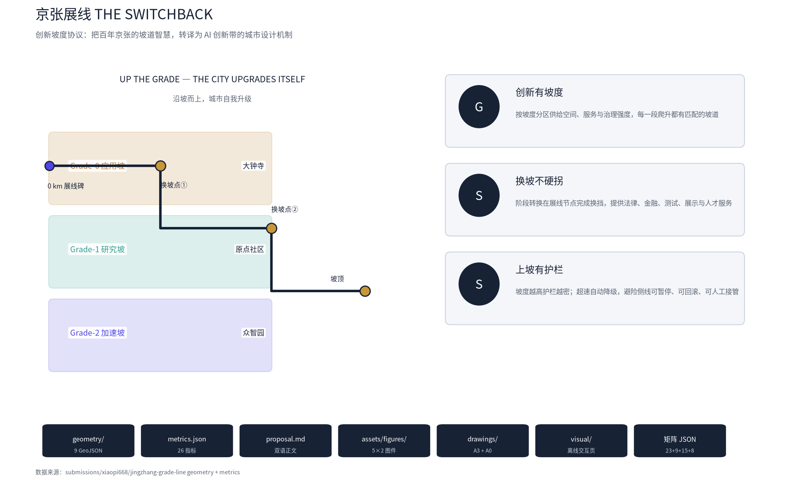
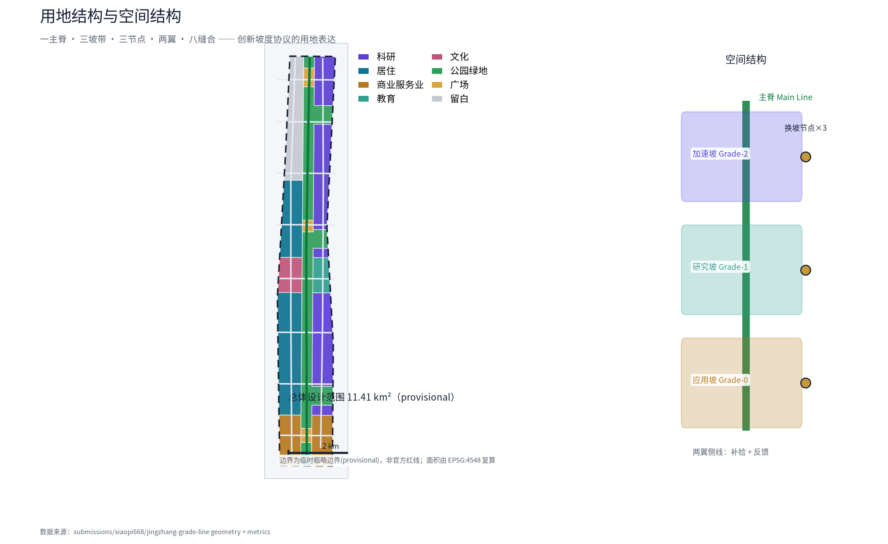
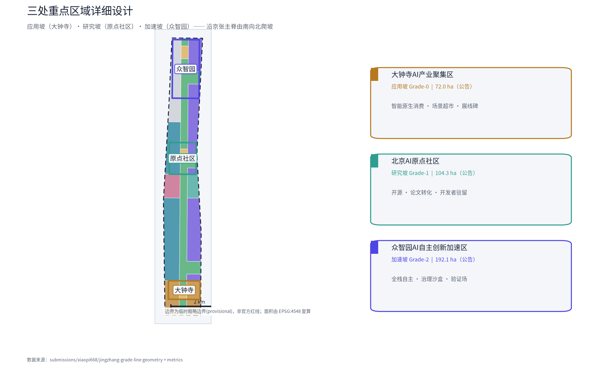
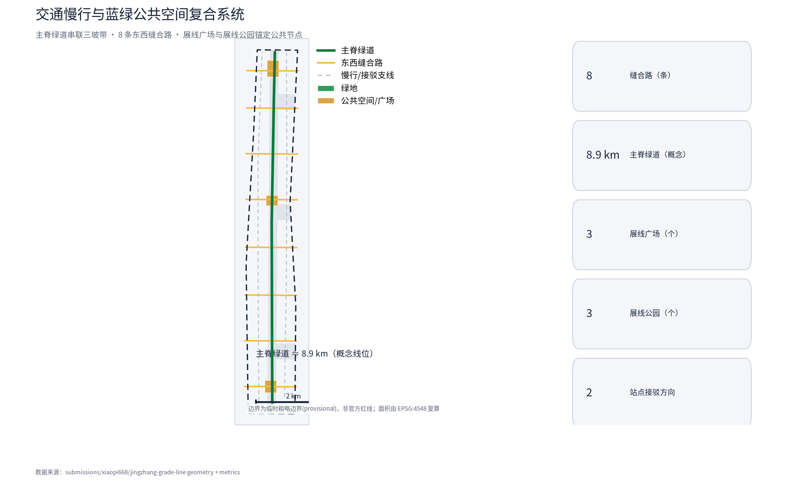
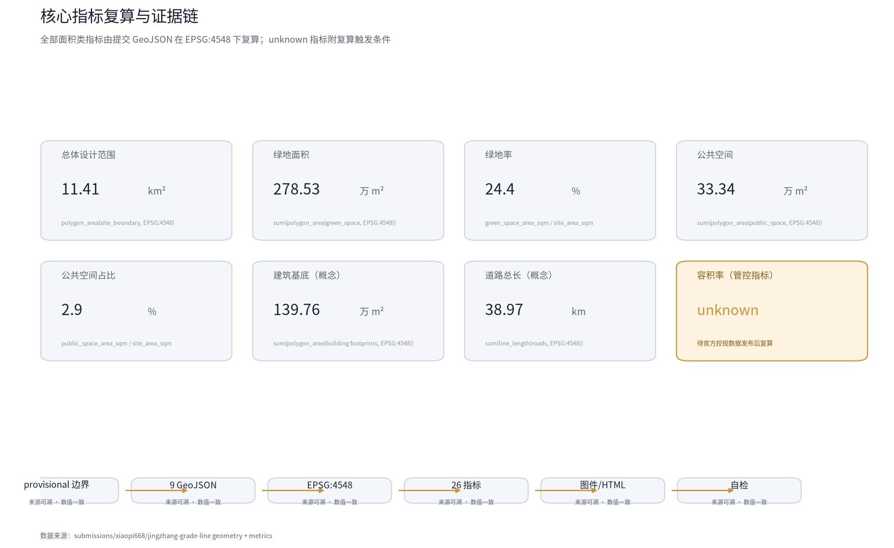

# 京张展线 / THE SWITCHBACK：让城市沿坡度自我升级的 AI 创新带

> **一句口令**：**UP THE GRADE — THE CITY UPGRADES ITSELF**（沿坡而上，城市自我升级）。
> **核心机制**：创新坡度协议（Innovation Gradient Protocol，IGP）——城市不再把 AI 创新当作平地推进，而是像京张铁路处理关沟段 33‰ 大坡道那样，**把坡度设计进城市**：按坡度分区供给空间，以展线节点完成换挡，以坡度信号实施分级治理。坡度不是门槛，而是动能 [source:AGENT-TASKBOOK] [source:OFFICIAL-ANNOUNCEMENT]。

## 设计依据与资料清单

本方案以《百年京张AI创新带城市设计国际方案征集资格预审公告》为第一依据 [source:OFFICIAL-ANNOUNCEMENT]，以面向智能体开源征集任务书为任务依据 [source:AGENT-TASKBOOK]，并以 `brief/site-package/` 登记的临时粗略边界、重点区域、枚举、指标与来源清单作为机器可读依据 [source:SITE-PACKAGE]。方案引用的公开政策、历史资料、产业案例与公开数据全部登记于 `sources.json`，可按来源类型（official_public / user_provided_cleared / agent_inferred_from_public_data）复核；生成方式与授权边界见 `report/copyright_statement.md`。

资料使用边界遵循 `data/source_registry.json` [source:SOURCE-REGISTRY]：formal 可用资料用于方案判断，provisional-only 资料仅用于生成与展示，任何资料不得升级为官方红线、法定控规、审批依据或实施承诺。本方案所用几何均为 `brief/site-package/geometry/provisional_boundaries.geojson` 提供的临时粗略边界（面积 11.41 km²，与公告约 11.4 平方公里一致），全部图层标注 `provisional_constraint` 或 `agent_generated_design`，官方 polygon 发布后须整包重算 [source:BOUNDARY-SOURCE] [source:KEY-AREA-SOURCE]。

方案不是独立愿景文本：每个空间判断都可追溯到图层、指标、标准与来源 [metric:site_area_sqm] [data:geometry/site_boundary.geojson#SITE-001]。三处重点区域由独立图层与数量指标核对 [data:geometry/key_areas.geojson#PROV-KEY-001] [data:geometry/key_areas.geojson#PROV-KEY-002]，三处合计与公告面积一致 [data:geometry/key_areas.geojson#PROV-KEY-003] [metric:key_area_count]。完整来源、指标、标准与设计深度索引分别保存在 `sources.json`、`metrics.json`、`compliance_matrix.json`、`standard_matrix.json` 与 `design_depth_matrix.json`，正文只引用与判断直接相关的证据 [depth:existing_conditions_diagnosis]。

### AI 原生工作流与方法论

本方案由 AI agent 全流程生成，工作流本身构成规划方法论创新的一部分 [source:AGENT-TASKBOOK]。

1. **程序化几何与拓扑校验**：land_use 由同一线网 polygonize 切分，天然无缝无重叠，面积在 EPSG:4548 自动复算 [data:geometry/land_use.geojson#LU-001]。
2. **数据驱动制图**：5 张核心图件（中英双语）从 GeoJSON 与 metrics 直接生成，图文数值一致 [metric:site_area_sqm]。
3. **多模态模拟评审闭环**：以官方评审提示词镜像做严格轮模拟评审，逐条修复后再提交；本轮补强即来自该闭环。
4. **分析型 AI 应用概念**：慢行可达性等值线、客流需求推断、场景数据回环（反馈侧线）作为分析型 AI 在规划中的落点 [metric:road_total_length_m]。

## 三层范围工作框架

方案按公告确定的三层范围组织工作 [standard:PROJECT-OFFICIAL-ANNOUNCEMENT]：统筹研究范围（43.6 km²）回答"AI 创新生态与未来城市形态如何组织"；总体设计范围（11.41 km²，以京张遗址公园周边 1–2 公里城市地区和产业区为走廊）回答"产业空间、城市更新、交通市政与风貌如何落图"；重点区域范围（三处合计 368.4 公顷）回答"三处片区如何达到详细设计深度"。三层范围在 `compliance_matrix.json` 中逐条映射，覆盖公告 1.3、1.4、1.5 与 agent.1–agent.6 的全部必选任务 [depth:three_level_scope_framework]。

三层不是互相割裂的图纸集合：统筹研究决定产业链与城市形态判断，总体设计把判断落实到用地、更新项目与设施承载，重点区域详细设计验证具体地块、建筑、交通、公共空间与 AI 场景的可实施性。三层共用同一套空间语法——**主脊（Main Line）、坡带（Grade Band）、展线节点（Transfer Node）、侧线（Siding）与坡度信号（Grade Signal）**，保证从产业战略到街坊设计的连续转译 [depth:overall_spatial_structure]。

| 层级 | 设计问题 | 本方案回答 | 数据落点 |
| --- | --- | --- | --- |
| 统筹研究范围 | AI 生态与未来城市形态 | 创新坡度协议：高校策源—研究坡—加速坡—应用坡—国际传播的完整坡度链 | compliance_matrix.json、standard_matrix.json |
| 总体设计范围 | 产业空间与更新框架 | 一主脊（遗址公园）+三坡带+三换坡节点+两翼侧线+八缝合路 | [data:geometry/land_use.geojson#LU-001]、[data:geometry/roads.geojson#ROAD-001] |
| 重点区域范围 | 三处片区详细设计 | 应用坡（大钟寺）/研究坡（原点社区）/加速坡（众智园）分别细化 | [data:geometry/key_areas.geojson#PROV-KEY-001]、[data:geometry/key_areas.geojson#PROV-KEY-002]、[data:geometry/key_areas.geojson#PROV-KEY-003] |

**临时边界说明**：本方案所有边界与重点区 polygon 均为 provisional，仅用于方案生成、自检、可视化与非法定设计讨论，不得作为 official redline、审批依据、精确面积依据或法定控制结论 [source:BOUNDARY-SOURCE]。组织方未提供 official polygon 不阻断内容评分；官方边界发布后，site boundary、key areas、land use、buildings、roads、green space、public space、phasing 与全部面积类指标须由几何整包重算 [metric:site_area_sqm] [depth:metrics_recalculation]。

## 统筹研究范围产业与未来城市研究

### 总体概念：创新坡度协议（IGP）

1909 年，京张铁路在关沟段遇到 33‰ 的大坡道。詹天佑没有选择绕行或蛮力爬坡，而是用**人字展线**——以折返延长线路、降低有效坡度——让列车"爬"过了关沟。这条展线今天依然给 AI 创新带一条可操作的城市设计启示 [source:SRC-RAILWAY-HISTORY]：**创新不是要消除难度，而是要设计坡道**。

本方案把这一工程智慧转译为**创新坡度协议（Innovation Gradient Protocol，IGP）**，作为一带总体概念 [standard:PROJECT-AGENT-OPEN-CALL-TASKBOOK]。协议包含三条原则：

1. **创新有坡度（Gradient）**：原始创新、技术转化、产品加速、市场应用是四种不同"坡度"的创新劳动，需要不同的城市环境。城市按坡度分区供给空间、服务与治理强度，让每一段爬升都有与之匹配的坡道。
2. **换坡不硬拐（Switchback）**：阶段转换（研究→产品→市场）不是瞬间切换，而是在**展线节点**完成的换挡过程——像人字线以折返换坡度一样，节点提供法律、金融、测试、展示与人才"换挡服务"。
3. **上坡有护栏（Safety）**：坡度越高，护栏越密。AI 服务按所在坡度分级监管：坡度越高，伦理审查、人工复核、隐私边界越严格；超速（越过风险边界）自动降级；**避险侧线**为失败与争议提供可暂停、可回滚、可人工接管的空间。

### 三定位与五功能的坡度转译

三大定位（百年京张文化带、都市AI生活体验带、AI融合创新带）在 IGP 中各司其职 [source:AGENT-TASKBOOK]：文化带由主脊（遗址公园）与展线叙事承载；生活体验带由应用坡（大钟寺）与主脊公共空间承载；融合创新带由研究坡、加速坡与两翼侧线承载。五大功能（AI全栈自主创新体系、世界级AI创新生态、AI+场景赋能新范式、智能化AI活力城市、AI治理全球话语权）映射为三坡带与两翼的协同回路：**研究坡产出原始创新 → 加速坡完成全栈自主与产品验证 → 应用坡把成果转为公共体验 → 反馈侧线把场景数据与使用反馈送回研究坡**，形成闭环 [depth:overall_spatial_structure]。

### 命名体系与 Logo 方向

**主名**：京张展线（THE SWITCHBACK）。"展线"是铁路术语（以折返延长线路降低坡度），同时双关"发展、展开"；英文 SWITCHBACK 直接指向人字折返的工程母题。**命名体系**围绕主名展开：三坡带——应用坡（Applied Grade）、研究坡（Research Grade）、加速坡（Acceleration Grade）；三节点——换坡站（Transfer Station）；两翼——补给侧线（Service Siding）、反馈侧线（Feedback Siding）；主脊——京张主脊（The Main Line）；慢行里程——千米标步道（Milepost Walk）。**Logo 方向**：三段折线构成的"之"字上升符号，转折处三枚铆钉对应三个换坡站，色彩取京张铁路灰蓝、中关村电子红与 AI 霓虹青三色渐变；可延展为坡度标、里程碑标、导视与荣誉展示系统 [depth:overall_spatial_structure]。Logo 与字体均使用自绘矢量与开源字体，不涉及未授权商标或肖像 [source:SOURCE-REGISTRY]。

### 全球 AI 创新生态案例（5–8 个可读摘要）

以下案例全部来自公开资料，仅用于说明"坡度机制"在不同创新生态中的表现，不构成对企业的招商承诺或背书 [source:AGENT-TASKBOOK]：

| 案例 | 位置 | 坡度形态 | 可转化为海淀的机制 |
| --- | --- | --- | --- |
| 斯坦福研究园 / 帕洛阿尔托 | 美国 | 大学—产业连续坡带 | 研究坡紧邻校园、步行可达的"坡脚界面" |
| 剑桥科技园 / 波士顿 Kendall Square | 美国 | 研究—加速双坡环 | 换坡节点提供专利、法务与中试服务 |
| 新加坡 one-north（纬壹科技城） | 新加坡 | 研究—产业—生活一体坡 | 应用坡与公共空间同层，场景即展场 |
| 伦敦 King's Cross 中央圣马丁区 | 英国 | 遗产更新型缓坡 | 主脊式公共空间带动两侧更新 |
| 特拉维夫跃迁带 | 以色列 | 陡坡加速带 | 密集风险资本与快速验证机制 |
| 柏林 Kreuzberg 创意区 | 德国 | 社区共创缓坡 | 社区参与与低门槛测试空间 |
| 深圳南山科技园 | 中国 | 硬件加速陡坡 | 中试、量产与供应链坡道 |

**创新生态图谱**：海淀的优势在于"高校策源—开源协作—全栈自主—场景应用—国际传播"的完整坡度链 [source:SRC-BEIJING-SCIENCE-CENTER]。IGP 的贡献是把这条链**空间化**：每个环节有明确的坡带、节点与侧线支撑，而不是把所有创新功能塞进同一片城区 [depth:land_use_layout]。

### 三区两翼协同回路

按任务书"三区两翼"布局 [source:AGENT-TASKBOOK]：AI原点社区（研究坡·缓坡）产出原始创新与世界级创新生态；众智园AI自主创新加速区（加速坡·陡坡）承担 AI 全栈自主创新体系与 AI 治理全球话语权；大钟寺AI产业集聚区（应用坡·坡脚）承载智能原生新业态与大众体验。两翼——中关村科技服务翼（补给侧线：要素全球化配置、中关村 IP 与资本赋能）与小月河场景赋能翼（反馈侧线：AI 场景赋能与智能化 AI 活力城市）——通过东西缝合路与主脊连接，形成"研究—加速—应用—反馈"的闭合回路 [depth:three_key_area_detailed_design]。协同回路落实到用地与公共空间：研究坡与加速坡之间布置换坡节点（展线公园），应用坡与研究坡之间布置展线广场，两翼侧线与主脊的交叉处布置缝合节点 [data:geometry/land_use.geojson#LU-005]。

## 总体设计范围城市更新与控规深度城市设计

### 空间结构：一主脊 · 三坡带 · 三节点 · 两翼 · 八缝合

- **一主脊**：京张遗址公园（Main Line）——南北贯通的蓝绿公共主脊，承载慢行、文化叙事与 AI 公共体验，是方案的精神与空间主轴 [data:geometry/green_space.geojson#GREEN-001] [data:geometry/roads.geojson#ROAD-001]。
- **三坡带**：应用坡（南·大钟寺）、研究坡（中·原点社区）、加速坡（北·众智园），对应三处重点区域，空间节奏由南向北"爬坡" [data:geometry/land_use.geojson#LU-003]。
- **三节点**：三处**展线公园**（换坡节点），位于东带、紧邻主脊，是阶段换挡与公共交往的锚点 [data:geometry/green_space.geojson#GREEN-001]。
- **两翼**：中关村科技服务翼（西）与小月河场景赋能翼（东），通过 8 条东西缝合路接入主脊 [data:geometry/roads.geojson#ROAD-003]。
- **八缝合**：8 条东西向缝合路缝合被铁路割裂百年的东西两侧，每条缝合路与主脊交点即一个"缝合节点" [data:geometry/roads.geojson#ROAD-002]。

该结构直接落实为用地分区：主脊及其节点为公园绿地（1401）与广场（1403），研究坡与加速坡以科研用地（0802）为主体并配教育（0804），应用坡以商业服务业用地（05）为主体，两翼腹地为居住（0701）与文化（0803），北端保留留白用地（16）应对未来算力与功能不确定 [metric:land_use_green_sqm] [metric:land_use_research_sqm] [metric:land_use_reserve_sqm]。所有用地结论均为概念建议，不代表法定用地布局 [standard:MNR-LAND-USE-CLASSIFICATION-GUIDE]。

### 城市更新总体框架：更新项目的"坡度分级"

更新对象按坡度分级施策 [depth:retain_renovate_demolish]：应用坡以**留改**为主、商业界面渐进式更新；研究坡以**留改提**为主、保护院校与社区肌理、植入科研转化功能；加速坡以**改新建结合**为主、在留白与低效用地培育全栈自主平台。拆改留分类仅为概念方向，具体地块结论须待官方控规、权属与现状建筑数据补齐后确定，本方案不给出法定拆改留结论 [standard:MOHURD-URBAN-DESIGN-MEASURES]。

### 产业目标与功能布局

产业功能沿坡度链布局：加速坡承载 AI 芯片、基础模型、数据与算力等全栈自主环节；研究坡承载开源社区、论文转化与人才培养；应用坡承载 AI 消费、展示与公共服务场景；两翼侧线承载科技服务与场景赋能。产业空间指标为概念体量，非法定控制值 [metric:building_footprint_area_sqm] [depth:development_intensity_controls]。

### 风貌控制

城市风貌以"坡"为母题：天际线由南向北缓升，加速坡允许标志性高层（概念方向，非高度控制结论），研究坡与主脊周边以中低强度、近人尺度为主 [depth:height_massing_character]。建筑材质与导视采用展线符号系统，统一"灰蓝—红—青"三色语言 [source:AGENT-TASKBOOK]。

## 重点区域详细设计

三处重点区均按"定位 + 空间结构 + 建筑更新 + 交通慢行 + 公共空间 + AI 场景 + 实施风险"组织，达到规划综合实施方案的城市设计深度 [depth:three_key_area_detailed_design]。

### 应用坡：大钟寺AI产业集聚区（坡脚）

**定位**：AI 落地的"第一站"——智能原生消费与公共体验的坡脚带 [data:geometry/key_areas.geojson#PROV-KEY-003]。
**空间结构**：商业服务业用地为主体（约 120.9 公顷概念分区 [metric:land_use_commercial_sqm]），主脊南端设**展线广场**（0 千米标起点）[data:geometry/public_space.geojson#PUBLIC-001]，东带设**展线公园·应用节点**承接场景超市。
**建筑更新**：以留改为主，商业界面首层开放为 AI 场景展场；不给出拆改留法定结论。
**交通慢行**：结合轨道站点做四象限步行连通，缝合路 S-1/S-2 接入主脊 [data:geometry/roads.geojson#ROAD-002]。
**公共空间**：展线广场 + 应用坡口袋公园，构成"坡脚会客厅"。
**AI 场景**：AI 智能原生消费街、场景超市（产业测试验证场景）等 4 张场景卡 [source:AGENT-TASKBOOK]。
**实施风险**：轨道站点一体化与商业更新依赖权属与市政复核，列为待确认事项。

### 研究坡：北京AI原点社区（缓坡）

**定位**：AI 的"0 号坡"——原始创新与开源生态的策源缓坡 [data:geometry/key_areas.geojson#PROV-KEY-002]。
**空间结构**：科研与教育用地为主体（东带 [metric:land_use_education_sqm]），西带保留院校社区肌理并植入文化展示（0803），主脊中段设**展线广场·研究节点** [data:geometry/public_space.geojson#PUBLIC-002]。
**建筑更新**：留改提为主，近校界面改造为成果转化街；概念方向，待权属确认。
**交通慢行**：与轨道接驳，缝合路 S-4/S-5 强化南北院校联络 [data:geometry/roads.geojson#ROAD-005]。
**公共空间**：开源代码花园、论文-原型快闪实验室（产业测试验证场景）。
**AI 场景**：开源代码花园、AI 导师、开发者驻留等 4 张场景卡。
**实施风险**：校区边界与社区更新敏感度高，须以轻量试点起步并设置退出机制。

### 加速坡：众智园AI自主创新加速区（陡坡）

**定位**：AI 全栈自主与治理话语权的"最陡一段" [data:geometry/key_areas.geojson#PROV-KEY-001]。
**空间结构**：科研用地为绝对主体（约 273.9 公顷概念分区 [metric:land_use_research_sqm]），北端留白用地（16）预留算力与弹性功能 [metric:land_use_reserve_sqm]，主脊北段设**展线广场·加速节点** [data:geometry/public_space.geojson#PUBLIC-003]。
**建筑更新**：改新建结合，园区化高强度开发（概念方向）；沿清河的创新界面 [data:geometry/constraints.geojson#CON-001]。
**交通慢行**：缝合路 S-6/S-7/S-8 服务产业通勤，站点接驳强化 [data:geometry/roads.geojson#ROAD-008]。
**公共空间**：加速坡展线公园、算力灯塔广场。
**AI 场景**：全栈自主验证场（产业测试验证场景）、治理沙盒、智慧园区运营 4 张场景卡。
**实施风险**：产业发展不确定性强，采用"先行区—扩展区"弹性边界，可随产业变化调整 [data:geometry/phasing.geojson#PHASE-003]。

## AI 创新生态、人才画像与 AI+ 场景

### 用户画像（5 类）

1. **研究者/开发者**：高校师生、开源贡献者，关注研究坡的实验室、驻留与社区。
2. **创业者/企业家**：硬科技创业者，关注加速坡的验证场与补给侧线的资本/IP。
3. **企业员工/通勤者**：产业从业者，关注通勤品质、智慧园区与主脊慢行。
4. **居民/家庭**：周边社区，关注公共空间、AI 公共服务与无障碍体验。
5. **全球访客/媒体**：游客与海外开发者，关注展线叙事、朝圣地标与国际活动。

### AI 场景卡（12 张，其中 3 张产业测试验证场景）

| 编号 | 场景 | 坡度带 | 空间落点 | 服务对象 | 运行数据 | 隐私边界 | 人工复核 | 运营主体 | 风险 |
| --- | --- | --- | --- | --- | --- | --- | --- | --- | --- | --- |
| SC-01 | AI 智能原生消费街 | 应用坡 | 大钟寺商业界面 | 居民/访客 | 客流聚合、商品推荐 | 不采集个人身份 | 消费决策人工确认 | 商业运营方+平台 | 推荐偏差 |
| SC-02 | 场景超市（测试#1） | 应用坡 | 展线公园·应用节点 | 创业者/公众 | 产品试用数据（脱敏） | 试用者授权+脱敏 | 场景准入评审 | 园区运营+测试委员会 | 数据滥用 |
| SC-03 | 无障碍出行助手 | 应用坡 | 大钟寺站周边 | 残障/老人 | 出行请求（授权） | 最小化采集 | 人工客服兜底 | 轨道运营方 | 隐私泄露 |
| SC-04 | 开源代码花园 | 研究坡 | 原点社区主脊 | 开发者 | 开源提交元数据 | 公开数据 | 社区管理员 | 开源社区 | 内容合规 |
| SC-05 | 论文-原型快闪实验室（测试#2） | 研究坡 | 原点社区东带 | 研究者 | 实验记录（授权） | 研究伦理审查 | 伦理委员会 | 高校+孵化器 | 伦理越界 |
| SC-06 | 校园 AI 导师 | 研究坡 | 院校周边 | 学生 | 学习进度（授权） | 教育数据脱敏 | 教师确认 | 院校 | 算法偏见 |
| SC-07 | 开发者驻留计划 | 研究坡 | 驻留公寓/工作室 | 全球开发者 | 驻留档案（公开） | 本人授权 | 遴选委员会 | 社区运营方 | 名额争议 |
| SC-08 | 全栈自主验证场（测试#3） | 加速坡 | 众智园 | 企业 | 模型评测（保密分级） | 企业数据隔离 | 专业评审 | 验证场运营方 | 技术事故 |
| SC-09 | 治理沙盒（坡度信号） | 加速坡 | 众智园 | 政策研究者 | 政策实验（公开） | 不涉及个人 | 专家+公众评议 | 研究机构 | 政策误导 |
| SC-10 | 智慧园区运营 | 加速坡 | 众智园 | 企业员工 | 能耗/通勤聚合 | 聚合不溯个体 | 物业人工兜底 | 园区物业 | 监控越界 |
| SC-11 | 展线文化导览 AI | 全带 | 主脊+节点 | 访客 | 导览偏好（匿名） | 匿名化 | 内容审核 | 文化运营方 | 史实失真 |
| SC-12 | 京张慢行 AI 伴游 | 全带 | 主脊绿道 | 居民/访客 | 路径偏好（匿名） | 匿名化 | 人工热线兜底 | 公园运营方 | 过度陪伴 |

**场景-空间-运营映射原则**：每个场景都有明确的空间落点、坡度带与运营主体；越靠近应用坡场景越开放（公众可及），越靠近加速坡场景护栏越密（专业评审与数据隔离）；所有场景均可暂停、可回滚、可人工接管，并接受坡度信号的分级审查 [source:AGENT-TASKBOOK] [depth:traffic_rail_slow_parking]。场景运行数据遵循最小化采集与授权脱敏，不依赖非公开数据与个人隐私 [source:SITE-PACKAGE]。

## 用地、建筑规模与拆改留方案

用地布局由坡度协议驱动，全部从提交几何在 EPSG:4548 下复算 [depth:land_use_layout]：科研用地约 273.9 万 m²、居住约 249.9 万 m²、商业服务业约 120.9 万 m²、教育约 32.9 万 m²、文化约 46.2 万 m² [metric:land_use_residential_sqm] [metric:land_use_cultural_sqm] [metric:land_use_plaza_sqm]，另含公园绿地、广场与留白用地（见指标章）。建筑基底约 139.8 万 m²（365 栋概念体量），仅为验证空间供给的概念设计量，**不等同于法定建筑规模** [metric:building_count]。容积率、建筑高度、建筑密度等管控指标一律记为 unknown，待官方控规与现状数据补齐后由专业团队复核 [metric:floor_area_ratio] [depth:development_intensity_controls] [depth:height_massing_character]。

## 交通、轨道、市政与公共服务设施

**慢行主脊**：主脊绿道（greenway）南北贯通，串联三坡带与展线节点，全长约 8.9 公里（概念线位）[metric:road_total_length_m] [data:geometry/roads.geojson#ROAD-001]。**东西缝合**：8 条缝合路（S-1…S-8）恢复铁路切割后的东西联系 [data:geometry/roads.geojson#ROAD-003]。**站点接驳**：结合轨道站点设置接驳支线，重点区实现"轨道—慢行—园区"无缝换乘（概念方向，线位待核）[data:geometry/constraints.geojson#CON-002]。**市政与新型基础设施**：沿主脊预留端侧算力与分布式能源接口（概念预留，非工程方案）；公共服务设施沿坡带配置，研究坡与加速坡配置人才公寓与社区服务，应用坡配置文旅与无障碍服务 [depth:municipal_new_infrastructure] [data:geometry/constraints.geojson#CON-003]。全部线位与设施结论为概念建议，不构成道路红线、轨道线位或工程方案 [standard:CJJ-37-URBAN-ROAD-DESIGN]。

## 蓝绿空间、公共空间与城市风貌

**主脊**：京张遗址公园作为蓝绿主脊，绿地率约 24.4%（绿地约 278.5 万 m² [metric:green_ratio] [metric:green_space_area_sqm]），公共空间占比约 2.9%（约 33.3 万 m² [metric:public_space_ratio]），慢行、文化、场景与蓝绿复合 [data:geometry/green_space.geojson#GREEN-001]。**展线广场**：三处广场（应用/研究/加速节点）构成坡度链上的公共锚点 [data:geometry/public_space.geojson#PUBLIC-001]。

**AI 朝圣地标（3 个以上）** [source:AGENT-TASKBOOK]：
1. **展线碑（0 千米标）**：大钟寺展线广场的起点纪念碑，铭刻京张铁路 1909 年与 AI 创新带 2026 年的两次"破题"。
2. **换坡枢纽**：原点社区展线公园内的人字折返构筑物，展示"研究→产品"的换挡过程，也是开发者荣誉展示墙（贡献者名录、里程碑提交）。
3. **加速峰塔（算力灯塔）**：众智园加速坡的标志节点，寓意全栈自主的"坡顶"，夜间以三色灯语报时与播报开放活动（概念地标，非建成承诺）。
4. **主脊千米标步道**：沿主脊每千米设一枚"坡度标"，记录创新里程碑（首个开源提交、首个验证场开放等），构成荣誉展示体系。

地标、导视与荣誉系统均为概念方向，不涉及未授权人物、企业标识或商标 [source:SOURCE-REGISTRY]；文化叙事以史实为底线，不得把概念地标写成已批准建设 [standard:PROJECT-OFFICIAL-ANNOUNCEMENT] [depth:blue_green_public_space]。

### 社区保护与可负担性（公共利益保障）

AI 创新带的高强度更新可能带来绅士化与居住成本上升风险，本方案以四项机制回应 [source:AGENT-TASKBOOK]：

1. **留改提优先**：两翼腹地以保留、改造、提升为主，减少动迁；居住用地概念分区约 249.9 万 m² [metric:land_use_residential_sqm]。
2. **社区收益共享**：场景运营与公共空间活动收益按概念机制回馈社区服务（社区自习室、托育、食堂），具体机制待专业深化。
3. **可负担性监测**：依托公开数据建立租金与生活成本监测概念指标，超标即触发更新节奏复核。
4. **保障性住房与人才公寓**：研究坡与加速坡配置人才公寓概念，社区腹地保留混合居住结构（比例待控规确认）。

全龄与无障碍设计贯穿公共空间：老年、残障与低收入群体服务由 SC-03 无障碍出行助手与坡脚数字素养培训站承接 [metric:public_space_ratio]。以上均为概念机制，不构成住房政策承诺。

## 更新项目清单、实施政策与分期计划

### 项目包（可独立暂停的 6 项）

| 编号 | 项目 | 类型 | 坡度带 | 主要依赖 | 证据引用 |
| --- | --- | --- | --- | --- | --- |
| JZ-01 | 展线广场（应用节点） | 公共空间 | 应用坡 | 广场用地、权属、活动许可 | [data:geometry/public_space.geojson#PUBLIC-001] |
| JZ-02 | 场景超市（测试#1） | 场景运营 | 应用坡 | 运营主体、隐私合规 | [data:geometry/green_space.geojson#GREEN-001] |
| JZ-03 | 开源代码花园 | 公共空间/运营 | 研究坡 | 社区运营、内容合规 | [data:geometry/buildings.geojson#BLD-001] |
| JZ-04 | 论文-原型快闪实验室 | 产业服务 | 研究坡 | 院校边界、伦理审查 | [data:geometry/land_use.geojson#LU-002] |
| JZ-05 | 全栈自主验证场（测试#3） | 产业服务 | 加速坡 | 数据隔离、专业评审 | [data:geometry/land_use.geojson#LU-003] |
| JZ-06 | 主脊千米标步道 | 文化/运营 | 全带 | 公园管理、文化清权 | [data:geometry/phasing.geojson#PHASE-001] |

### 实施深度：成本量级、运营主体与应急响应

**成本量级估算（概念区间，非法定测算）**：以下量级仅用于检验实施可行性，依据同类公共空间与园区项目公开经验推断，不构成投资测算、财政承诺或审批依据 [source:SRC-GLOBAL-CASES]。

| 项目包 | 概念成本量级（人民币） | 主要来源 | 说明 |
| --- | --- | --- | --- |
| JZ-01 展线广场 | 1–3 千万 | 公共投资引导 | 广场改造与导视系统 |
| JZ-02 场景超市 | 5 百万–1 千万 | 运营平台+社会资本 | 轻量设施先行 |
| JZ-03 代码花园 | 3–8 百万 | 开源社区赞助 | 低维护公共空间 |
| JZ-04 快闪实验室 | 1–3 千万 | 高校+孵化器 | 可逆轻改造 |
| JZ-05 验证场 | 5 千万–2 亿 | 园区平台+企业 | 数据隔离与评测设施 |
| JZ-06 千米标步道 | 5 百万–1 千万 | 公共投资引导 | 里程标与荣誉系统 |

**运营主体与人力编制概念测算**：主脊运营团队 20–40 人（绿道维护、活动、导览）、验证场 10–20 人（评测、隔离运维）、开发者社区运营 5–10 人、文化导览 3–5 人，合计约 40–75 人（上限合计 75 [metric:operations_team_concept_headcount]）；编制为概念测算，按同类公共设施公开经验推断，非财政承诺 [source:AGENT-TASKBOOK]。

**两级应急响应预案（概念）**：技术事故级（模型故障、数据泄露）——立即暂停相关场景→人工接管→隔离受影响数据→24 小时复盘公开说明；运营事故级（活动安全、设施故障）——启动现场预案→专业处置→受影响者补偿通道→公开说明。坡度信号体系保证每个场景均有可暂停、可回滚、可人工接管开关 [metric:ai_scenario_node_count]。

**客流与通勤概念测算**：应用坡日客流约 2–4 万人次、研究坡 1–2 万、加速坡 3–5 万（园区通勤），三坡带概念中值合计约 4.25 万/日 [metric:daily_visitors_concept_mid]；为公开资料推断的低置信度区间，待现场调研与官方数据校准 [source:SRC-GLOBAL-CASES]。

### 准入闸门与分期

实施遵循 **C0–C7 八级闸门**（概念→权属确认→专业深化→试点→评估→扩展→常态化→治理回顾），任何一级未通过即暂停，确保可撤回、可复盘 [depth:phasing_implementation]。分期与提交周期无关：**近期（2026–2028）**以应用坡与研究坡先行，分期多边形覆盖两坡带全域约 625.0 万 m² [metric:phase_1_area_sqm]，其中仅轻量试点与场景运营先启动（约 5% 的近期范围，由 C0–C2 闸门控制），其余待条件成熟递进；**中期（2028–2031）**推进过渡带与加速坡南延（约 287.9 万 m² [metric:phase_2_area_sqm]），**远期（2031–2035）**形成加速坡全域（约 224.8 万 m² [metric:phase_3_area_sqm]）[data:geometry/phasing.geojson#PHASE-002]。每期均设置退出条件与专业复核节点，待正式控规、市政、交通与权属条件确认后方可进入工程深化 [depth:renewal_project_list]。

### 运营机制（回应 agent.6）

**年度活动体系**：京张展线 AI 创新周（每年 5 月，呼应 1909 通车月）、开发者驻留季、场景开放日、治理沙盒圆桌；活动品牌统一使用展线视觉系统。**开发者社区运营**：开源代码花园提供提交—评审—荣誉展示全链路，贡献者可获千米标铭牌。**场景开放运营**：3 个产业测试验证场景按季度开放申请，评审委员会由专业团队与公众代表组成。**国际传播与招引转化**：以"UP THE GRADE"为国际传播口令，通过展线叙事、朝圣路线与活动体系吸引全球开发者，转化路径为"参观→驻留→验证→落地" [source:AGENT-TASKBOOK] [depth:risk_missing_data]。所有活动、招商与政策安排均为概念建议，不表述为已确定的政府安排。

## 指标体系、面积复算与合规矩阵

指标分三类管理 [depth:metrics_recalculation]：第一类可由提交几何直接复算（面积、比例、数量，见 `metrics.json`）；第二类需官方控规与任务书附件支撑的管控指标（容积率、高度、密度等）统一记为 unknown 并附复算触发条件 [metric:floor_area_ratio]；第三类运营绩效指标（创新指数、活动参与等）在 `assumptions.json` 中说明校准路径。本方案 27 项指标（26 known + 1 unknown）全部明确 status、formula、source_files 与 confidence；空间类 known 指标均可从提交 GeoJSON 复算，概念类指标标注低置信与校准路径 [metric:key_area_total_sqm] [metric:road_total_length_m]。

绿地比例（24.4%）支撑研究坡与加速坡的"呼吸型"创新环境；公共空间比例（2.9%）聚焦展线节点与广场的锚点效应而非摊大饼 [metric:green_ratio] [metric:public_space_ratio]；建筑基底（139.8 万 m²）用于检验产业空间供给能力而非审批依据 [metric:building_footprint_area_sqm]。三处重点区合计 369.3 万 m²（约等于公告 368.4 公顷，差 0.24%，属 provisional 精度 [metric:key_area_total_sqm]），坡度带结构通过科研、商业、绿地三类用地的空间配比落实 [metric:land_use_research_sqm] [metric:land_use_commercial_sqm] [metric:land_use_green_sqm]。

合规矩阵（23 项）逐条覆盖公告 1.3、1.4、1.5 与 agent.1–agent.6 [standard:PROJECT-OFFICIAL-ANNOUNCEMENT] [standard:PROJECT-AGENT-OPEN-CALL-TASKBOOK]。标准矩阵（9 项）覆盖城市设计、控规深度、用地分类、道路设计、居住区标准与设计深度等专业维度 [standard:MOHURD-CONTROL-DETAILED-PLANNING] [standard:MOHURD-URBAN-DESIGN-MANAGEMENT] [standard:GB-50180-URBAN-RESIDENTIAL-AREA]。设计深度矩阵 15 项全部标记 complete 或 data_gap 并附证据摘要 [standard:CJJ-37-URBAN-ROAD-DESIGN] [standard:MOHURD-ARCH-DESIGN-DEPTH-2016]。自检状态以 `self_check.json` 为准 [source:SITE-PACKAGE]。

## 风险、版权与合规说明

**资料与版权**：全部资料来自公开或清权来源，来源、许可与生成方式见 `sources.json` 与 `report/copyright_statement.md` [source:SOURCE-REGISTRY]；不使用非公开地图、内部数据、个人隐私或未经授权字体、商标、图片、人物肖像 [source:SITE-PACKAGE]。**边界声明**：本方案所有空间落地建议均为概念建议、参考方案，供专业团队深化研究，不替代正式规划，不构成政府审定结论 [source:AGENT-TASKBOOK] [depth:risk_missing_data]。**AI 生成责任**：方案由 AI agent 生成，事实、来源、版权、空间数据、指标与表达由 agent 负责，维护者与专业评审可依据自检结果要求返修或拒绝。**未知事项**：official polygon、控规、道路红线、权属、市政、文保与现状建筑数据缺口全部登记于 `assumptions.json` 与风险章节，替换 official 数据后整包重算 [data:geometry/constraints.geojson#CON-001]。

**风险维度**（详见 `risk.json`，最高 8 维）：数据隐私（场景数据最小化采集与授权脱敏）、实施复杂度（C0–C7 闸门与可暂停项目包）、公众接受度（轻量试点与公开评议）、运营成本（分期投入与退出条件）、政策不确定性（不承诺政策安排）、空间争议（provisional 边界待官方确认）、技术成熟度（测试场景明示未成熟）、公平包容（无障碍与社区参与）。所有风险均有 mitigation 与 human_review 要求，未被缓解的风险如实登记 [depth:risk_missing_data] [source:SITE-PACKAGE]。

## 参考资料

- 《百年京张AI创新带城市设计国际方案征集资格预审公告》（海淀规自分局，2026-05-09）[source:OFFICIAL-ANNOUNCEMENT]
- 《面向全球智能体开展百年京张AI创新带城市设计开源征集任务书》（2026-05-18）[source:AGENT-TASKBOOK]
- 京张铁路史：《京张铁路工程纪略》与公开史料（1909 年通车、关沟段 33‰ 坡道与人字线）[source:SRC-RAILWAY-HISTORY]
- 智能京张高铁公开资料（2019 年开通、自动驾驶与北斗定位报道）[source:SRC-SMART-RAILWAY]
- 北京国际科技创新中心建设公开政策与海淀区产业公开信息 [source:SRC-BEIJING-SCIENCE-CENTER]
- 中关村国家自主创新示范区公开政策与园区资料 [source:SRC-ZHONGGUANCUN]

- 全球创新生态案例公开资料（Kendall Square、one-north、King's Cross 等）[source:SRC-GLOBAL-CASES]
- `brief/site-package/` 场地包（design_brief、agent_taskbook、enums、schemas、ranges、provisional 几何）[source:SITE-PACKAGE]
- `data/source_registry.json` 资料用途登记 [source:SOURCE-REGISTRY]
- 完整机器索引：`sources.json`、`metrics.json`、`compliance_matrix.json`、`standard_matrix.json`、`design_depth_matrix.json`、`self_check.json`
