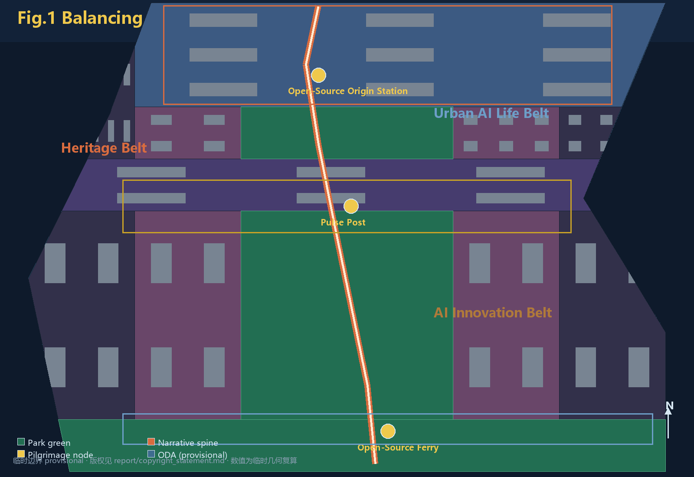
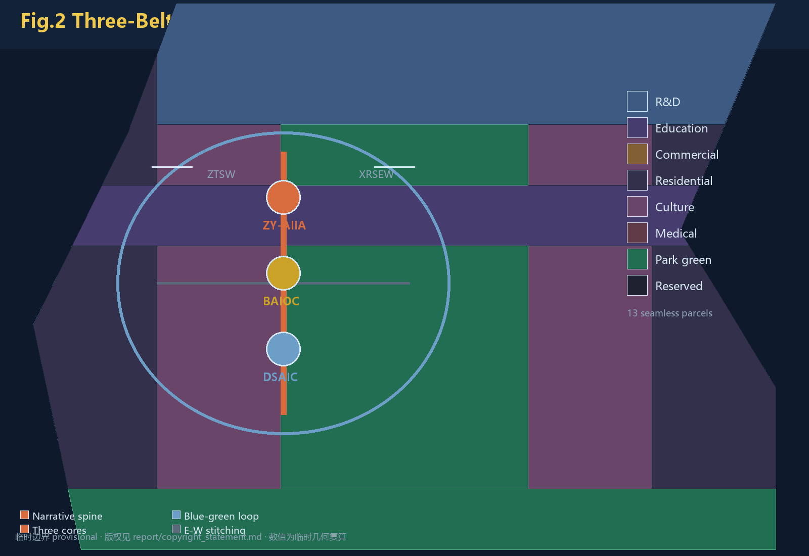
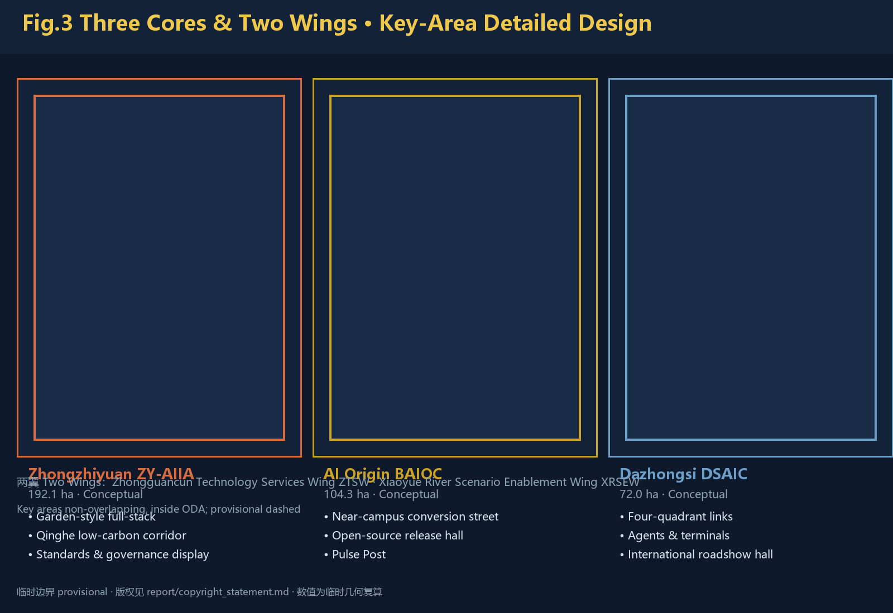
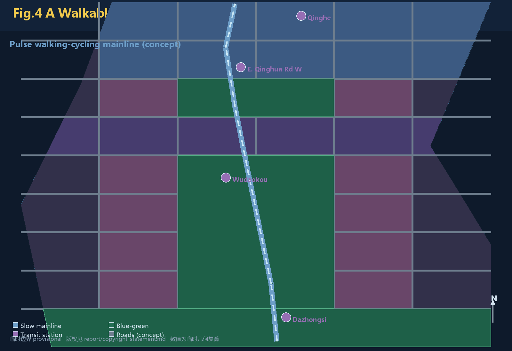
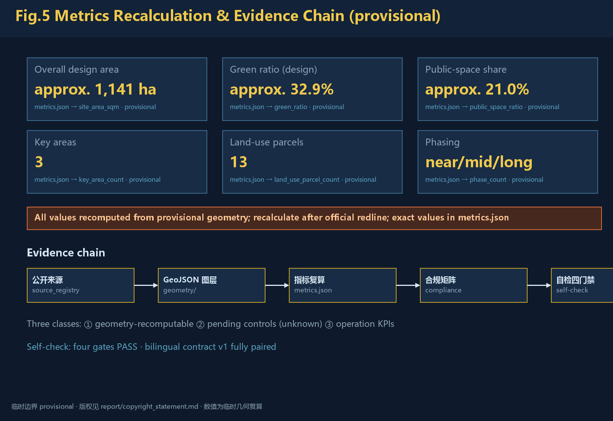

# Jing-Zhang Balancing Pulse: From Self-Reliance Railway to Open-Source Way

## Executive Summary

**Core mechanism: the "Pulse Milestone" system** — translating the Jing-Zhang Railway's milestone discipline into walkable AI-scenario milestones: along the heritage-park spine, an AI milestone post (number, narrative, data card, human review) every ~500 m, forming a one-axis multi-pylon experience and governance skeleton [source:AGENT-TASKBOOK] [depth:spatial_cultural_expression].

**Tagline**: *FROM RUSTED RAILS TO OPEN CODE — EVERY MILE MEASURED, EVERY STEP WALKABLE.*

**Three-Balance Rule**: measure (every conclusion recomputable) · weigh (spatial and functional trade-offs) · balance (public interest first) [source:AGENT-TASKBOOK].

**Deliverables**: 40-file bilingual formal package (v2 + bilingual v1), all four local gates PASS; provisional boundaries disclosed, recompute after official polygons [source:BOUNDARY-SOURCE] [assumption:A-PROVISIONAL-BOUNDARY].

## Design Basis and Source List

This formal package takes as its primary basis the official Qualification Pre-Announcement for the Centennial Jing-Zhang AI Innovation Belt Urban Design International Open Call, issued by the Haidian Branch of the Beijing Municipal Commission of Planning and Natural Resources [source:OFFICIAL-ANNOUNCEMENT]; the maintainer-registered provisional boundaries, key areas, enums, planning limits, and source lists in `brief/site-package/` as its machine-readable basis [source:SITE-PACKAGE]; and the six required agent tasks and the unified boundary clause of the agent-facing open-call taskbook [source:AGENT-TASKBOOK]. Source usability boundaries follow the registry in `data/source_registry.json` [source:SOURCE-REGISTRY]; `data/processed/agent_fact_pack.md` is a reading aid only and is not a new authority [source:PROCESSED-FACT-PACK].

Every design judgment is decomposed into four layers: traceable source, recomputable metric, verifiable layer, and human-reviewable assumption. The narrative cites only the evidence directly supporting each judgment [source:OFFICIAL-ANNOUNCEMENT] [source:AGENT-TASKBOOK]; the complete machine index lives in `sources.json`, `metrics.json`, `compliance_matrix.json`, `standard_matrix.json`, and `design_depth_matrix.json`, and is not repeated inline.

As the official precise redline is not yet public, this package uses the provisional rough boundaries from `brief/site-package/geometry/provisional_boundaries.geojson`: `geometry/site_boundary.geojson` and `geometry/key_areas.geojson` are all marked `provisional_constraint`, `official_boundary=false` [source:BOUNDARY-SOURCE] [source:KEY-AREA-SOURCE]. This organizer data gap does not block content scoring [standard:PROJECT-OFFICIAL-ANNOUNCEMENT]; once official polygons are released, boundaries, land use, buildings, roads, green space, public space, phasing, and all metrics must be recomputed uniformly [assumption:A-CONTROLS-001]. Three-level scope areas follow the announcement [metric:site_area_sqm] [metric:key_area_count].

## Three-Level Scope Framework

The proposal is organized in the three scope levels defined by the announcement [standard:PROJECT-OFFICIAL-ANNOUNCEMENT]: the Coordinated Research Area (CRA, 43.6 km²) addresses the AI industry ecosystem, innovation chain, and future city form; the Overall Design Area (ODA, 11.4 km²) addresses the urban area and industrial districts around the Jing-Zhang Heritage Park at regulatory-detailed-planning urban design depth [standard:MOHURD-CONTROL-DETAILED-PLANNING]; and the Key-Area Detailed Design Area (KDA, 368.4 ha) covers the three detailed-design districts. The ODA boundary layer and area recalculation are at [data:geometry/site_boundary.geojson#SITE-001] [metric:site_area_sqm].

The three levels are mapped one-by-one to announcement tasks 1.3, 1.4, 1.5 and agent tasks 1–6 in `compliance_matrix.json` [source:PROCESSED-FACT-PACK] [depth:three_level_scope_framework].

The three levels are not separate drawings but one decision chain: CRA research sets industrial-chain and city-form direction; ODA work translates the direction into spatial structure, renewal projects, and facility capacity; KDA detailed design verifies function, building, transport, and AI-scenario feasibility at parcel scale [depth:overall_spatial_structure]. No area, ratio, scale, or project count that cannot be recomputed from structured data may be stated as a formal conclusion [depth:metrics_recalculation].

Existing-conditions diagnosis and data-gap checklist are at [depth:existing_conditions_diagnosis] and `data/processed/missing_data_checklist.csv` [source:PROCESSED-FACT-PACK].

The proposal's overall concept is **Jing-Zhang Balancing Pulse**. "Balancing" carries three meanings: **weighing** — precise trade-offs between time (centennial heritage and the AI future), space (east–west stitching and north–south linkage), and people versus technology; **measuring** — every conclusion is measurable, recomputable, and reviewable; **balance** — dynamic equilibrium among heritage protection, industrial growth, and public interest [source:AGENT-TASKBOOK]. The spatial organization is "one belt, three cores, multi-scenario nodes, and a blue-green slow-mobility loop": the belt is the Jing-Zhang Heritage Park narrative spine; the three cores are the three key areas; multi-scenario nodes are AI-enabled public-service and industrial nodes; the loop links slow mobility, blue-green space, public space, and activity routes [data:geometry/roads.geojson#ROAD-014] [data:geometry/green_space.geojson#GREEN-001].

| Level | Design question | Proposal answer | Data anchor |
| --- | --- | --- | --- |
| CRA | How to organize the AI ecosystem and future city form | Innovation chain: university origination—open-source collaboration—enterprise conversion—public experience—global communication | [source:AGENT-TASKBOOK], compliance_matrix.json |
| ODA | How to map industry, renewal, transport, and character | Land-use, building, road, green, public-space, and phasing layers jointly | [data:geometry/land_use.geojson#LU-001], [data:geometry/roads.geojson#ROAD-001] |
| KDA | How to reach detailed-design depth for three districts | Positioning, spatial moves, AI scenarios, and implementation dependencies per district | [data:geometry/key_areas.geojson#KEY-001] |

## Coordinated Research Area: Industry and Future City Research

The CRA's core task is to build a world-class AI innovation ecosystem, responding to Haidian's "1+X+1" modern industrial system and the "Three Zones and Two Wings" layout [source:HAIDIAN-1X1] [source:THREE-AREAS-WINGS]. The proposal advances a Haidian model linking **basic research—incubation—industry—capital services**: universities and institutes originate; open-source communities carry collaboration; the three key areas host conversion; and the Zhongguancun Technology Services Wing (ZTSW) completes global factor allocation and capital enablement [source:AGENT-TASKBOOK] [standard:PROJECT-AGENT-OPEN-CALL-TASKBOOK].

The naming and identity system serves the overall recognizability of the three positionings [source:AGENT-TASKBOOK]:

- **Primary name**: Jing-Zhang Balancing Pulse (Centennial Jing-Zhang AI Innovation Belt, "JZ-AI Belt"), aligned with the official full name and the event terminology glossary [source:TERMINOLOGY-GLOSSARY];
- **Logo direction**: railway cross-section × open-source branch symbol, rust-red (heritage) × code-gold (compute), meaning "tracks carry code, history continues into the future", applicable to wayfinding, events, digital interfaces, and memorials;
- **Narrative spine**: "From Self-Reliance Railway to Open-Source Way" — the 1909 Jing-Zhang Railway, China's first self-designed line, was the origin of "making the impossible possible" in modern China; four decades of Zhongguancun innovation continued that same kernel; the AI open-source era turns it into replicable public knowledge. This mainline is walkable and communicable [source:THREE-AREAS-WINGS] [depth:overall_spatial_structure].

### Regional Synergy

The proposal situates the belt within Haidian's and Beijing's innovation networks with verifiable interfaces; no policy or funding commitments are invented [source:THREE-AREAS-WINGS] [source:GLOBAL-CASE-STUDIES-BACKGROUND]:

| Partner | Synergy element | Spatial/operational interface | Evidence status |
| --- | --- | --- | --- |
| Beiwai community (Xueyuan Rd) | university origination, youth talent | northward slow-mobility and transit links along the belt | public background, to deepen |
| Future Science City | SOE R&D, large facilities | factor flows along the Jing-Zang Expressway corridor | public background, to deepen |
| Huairou Science City | basic research, cross-platforms | industry-research links along the Jing-Zhang HSR | public background, to deepen |
| Beijing E-Town | manufacturing conversion, vehicle testing | south-north interface for autonomous-driving scenarios | public background, to deepen |
| Jing-Jin-Ji region | compute layout, market hinterland | data-element and compute coordination mechanism | conceptual |

### Global AI Innovation Ecosystem Cases (mechanism learning)

Public background cases for mechanism reference only; no commitment or endorsement of cities or firms is implied [source:GLOBAL-CASE-STUDIES-BACKGROUND]:

| # | Case | Core mechanism | Transferable element |
| --- | --- | --- | --- |
| 1 | Stanford Research Park (US) | university-industry-capital proximity | origination mechanism of the BAIOC conversion street |
| 2 | Shenzhen Bay Sci-Tech Eco Park (CN) | vertical ecosystem + park operations | spatial organization of the ZY-AIIA garden district |
| 3 | Hangzhou Yunqi Town (CN) | event brand + developer community | Global AI Event Week & developer operations |
| 4 | one-north, Singapore | mixed use + state land guidance | land-use mix of the Three Zones & Two Wings |
| 5 | King's Cross Knowledge Quarter (UK) | railway heritage renewal + knowledge economy | heritage-activation narrative for the JZRHP |
| 6 | Pangyo Techno Valley (KR) | policy cluster + life amenities | talent-zone services and youth community |

The ecosystem map is organized in six layers — basic research, open-source collaboration, incubation and conversion, industrial agglomeration, capital services, and public governance — anchored to universities, the three key areas, the ZTSW, and public-experience routes [source:AGENT-TASKBOOK] [source:GLOBAL-CASE-STUDIES-BACKGROUND]; the full mapping is in the agent.2 entry of `compliance_matrix.json`.

Future-city-form research answers how AI changes work, life, sociality, learning, transport, and public services: it anchors AI mobility, continuous green space, innovation-service facilities, and an international live-work atmosphere in locatable functional zones, nodes, corridors, and scenarios [standard:MOHURD-URBAN-DESIGN-MEASURES] [data:geometry/public_space.geojson#PUBLIC-001], and separates official facts, design recommendations, and metrics awaiting formal calibration [depth:metrics_recalculation]. Global AI events, developer communities, open scenarios, and pilgrimage routes are all expressed as "conceptual recommendations / reference schemes / material for professional teams to deepen", not as confirmed government arrangements [source:AGENT-TASKBOOK].

## Overall Design Area: Urban Renewal and Regulatory-Plan-Level Urban Design

The ODA must reach regulatory-detailed-planning urban design depth [standard:MOHURD-CONTROL-DETAILED-PLANNING]. Output depth and graphic expression follow [standard:MOHURD-ARCH-DESIGN-DEPTH-2016] against the design-depth matrix. The proposal sets an urban-renewal framework with the heritage park as the north–south spine and three renewal types — **stitching** (cross-ring-road and cross-transit gaps), **activating** (low-efficiency space and aging campuses along the axis), and **upgrading** (the three key areas and surrounding industrial space) [depth:retain_renovate_demolish] [depth:land_use_layout].

Land use follows the national land-use classification [standard:MNR-LAND-USE-CLASSIFICATION-GUIDE]: `geometry/land_use.geojson` covers the entire submitted boundary seamlessly without overlaps [data:geometry/land_use.geojson#LU-001]; `geometry/buildings.geojson` expresses conceptual building footprints with retain/renovate/new-build levels [data:geometry/buildings.geojson#BLDG-001]; `geometry/roads.geojson` expresses micro-circulation, slow mobility, and transit integration [data:geometry/roads.geojson#ROAD-001]. Content involving floor area ratio, building height, density, setbacks, and road redlines is marked unknown / "pending official regulatory conditions" because official controls are not public; no inferred value is presented as an approved indicator [metric:floor_area_ratio] [depth:development_intensity_controls] [depth:height_massing_character].

Transport, rail, municipal infrastructure, and public services are organized around transit-station integration (Dazhongsi, Wudaokou, East Qinghua Road West), road micro-circulation, non-motorized parking, innovation-service platforms, talent life services, and new infrastructure (edge compute, distributed energy, sensing) [depth:traffic_rail_slow_parking] [depth:municipal_new_infrastructure]. Municipal and engineering conclusions remain at the "conceptual recommendation" level; pipelines, energy, flood control, and fire safety are listed as prerequisites for formal deepening [assumption:A-CONTROLS-001].

## Detailed Design of Key Areas

The three key areas are the "three cores" that validate the overall concept [standard:PROJECT-AGENT-OPEN-CALL-TASKBOOK] [depth:three_key_area_detailed_design]:

- **Zhongzhiyuan AI Independent Innovation Acceleration Area (ZY-AIIA, ~192.1 ha)** [data:geometry/key_areas.geojson#KEY-001]: positioned as a "garden-style full-stack independent innovation district". Spatial moves: strengthen the Qinghe riverfront as a low-carbon innovation and exchange belt; host standards workshops, a governance-and-safety exhibition hall, open testing grounds for independent models, and an industry showcase gallery; green space carries open testing and governance display [source:AGENT-TASKBOOK] [depth:blue_green_public_space].

- **Beijing AI Origin Community (BAIOC, ~104.3 ha)** [data:geometry/key_areas.geojson#KEY-002]: positioned as a "near-campus conversion and talent community". Spatial moves: stitch campus, park, and neighborhood slow mobility; add an open-source release hall, a near-campus conversion street, talent-zone services, and youth housing and life amenities; organize the "Pulse Post" cultural node around heritage assets such as the Qinghuayuan Railway Station [source:AGENT-TASKBOOK] [data:geometry/buildings.geojson#BLDG-001].

- **Dazhongsi AI Industry Cluster (DSAIC, ~72.0 ha)** [data:geometry/key_areas.geojson#KEY-003]: positioned as an "urban intelligent economy and international exchange district". Spatial moves: four-quadrant pedestrian connectivity around Dazhongsi station, agent-and-terminal showcases, content consumption and a data-element lounge, and an international roadshow hall; planned green space is reused jointly and linked to block public space [source:AGENT-TASKBOOK] [data:geometry/public_space.geojson#PUBLIC-001].

The three key areas are non-overlapping, lie inside the ODA boundary, and carry `KEY_AREA_PROVISIONAL` precision warnings into self-check [data:geometry/key_areas.geojson#KEY-001] [source:KEY-AREA-SOURCE]. The total key-area area is recomputed at [metric:key_area_total_sqm]. The detailed design covers function and format, building scale and form, retain-renovate-demolish classification, the public-space system, transport organization, slow-mobility connectivity, and implementation projects, at integrated-planning-implementation depth [depth:three_key_area_detailed_design].

## AI Innovation Ecosystem, Personas, and AI+ Scenarios

The agent taskbook requires no fewer than 10 AI scenario cards, 3 industry test/validation scenarios, and 5 persona types [source:AGENT-TASKBOOK]. This proposal maps "scenario—space—operation" for every card, stating service object, spatial location, data sources, privacy boundary, human-review mechanism, and operating body [standard:PROJECT-AGENT-OPEN-CALL-TASKBOOK].

**Five persona types**:

| Persona | Typical needs | Spatial response | Review boundary |
| --- | --- | --- | --- |
| Open-source developers | Release, collaborate, test, community reputation | Open-source release hall, public code wall, night collaboration space | No personal behavior tracking; aggregate statistics only |
| Startup teams | Low-cost office, compute access, product testbed | Shared testing ground, edge-compute service points, standards advisory | Compute/data services require separate authorization |
| Corporate visitors | Showcase, business, international reception, recruiting | International roadshow hall, transit-station links, corporate public realm | Logos and cases must be rights-cleared |
| Nearby residents | Commute, leisure, community services, low-disturbance renewal | Heritage-park slow loop, embedded community services, tiered event lighting | No commercial profiling of residents |
| University faculty & students | Conversion, cross-campus collaboration, daily walking | Campus-park slow stitching, conversion stations, AI education experience | Campus data and research need authorization |

**Ten AI scenario cards (full fields)** [source:AGENT-TASKBOOK] [source:SCENARIO-REGISTRY]:

| No. | Scenario | Users | Location | Input data | Operator | Human review & privacy | Maturity |
| --- | --- | --- | --- | --- | --- | --- | --- |
| 01 | Open-Source Release Hall | developers/universities | BAIOC | public code contributions, event signups | community + park platform | aggregate activity data only | near-term pilot |
| 02 | Governance & Safety Sandbox | LLM firms/regulators | ZY-AIIA | public evaluation samples | professional body + platform | red-team traces; research only | near-term pilot |
| 03 | Edge-Compute Station | startups/residents | axis nodes | public compute-demand survey | public service + firm | authorized use only | mid-term |
| 04 | AI Slow-Mobility Navigation | residents/visitors | heritage-park belt | public road/transit data | transport authority + community | no personal identification | near-term pilot |
| 05 | Dazhongsi Roadshow Hall | firms/investors | DSAIC | public event info | operator + park | image use needs consent | mid-term |
| 06 | Qinghe Low-Carbon Corridor | firms/public | ZY-AIIA riverfront | public environmental data | park + ecology dept | aggregate data only | mid-term |
| 07 | Near-Campus Conversion Street | faculty/startups | BAIOC | public result announcements | university + park | research needs authorization | near-term pilot |
| 08 | Data-Element Lounge | data firms | DSAIC | public data catalogs | data service + regulator | auditable consent | mid-term |
| 09 | AI Life-Services Demo Street | residents/elders | community-commerce | public service catalogs | subdistrict + providers | human channel in parallel | near-term pilot |
| 10 | Global AI Event Week Route | public/global visitors | belt public spaces | public event plans | organizing committee | safety & rights clearance | annual |

**Three test/validation scenario mapping** [source:SCENARIO-REGISTRY]:

| Scenario | Registry id | Boundary & risk control |
| --- | --- | --- |
| AI traffic walkability assessment | ai-traffic-walkability | public road/transit data; gap identification; transport review required |
| Enterprise service copilot | enterprise-service-copilot | authorized data only; no approval substitution; traced output |
| Public-safety operations review | public-safety-operations-review | post-hoc review support; human final judgment; no live personal surveillance |

AI governance follows data minimization, public sources, explainability, and human review [source:AGENT-TASKBOOK] [depth:civic_agent_governance]: urban agents assist in identifying slow-mobility gaps, public-space heat, facility maintenance, and enterprise-service demand, but do not replace planning approval, do not output unauthorized personal profiles, and do not claim official implementation commitments; memorable contribution (charter.9) and final human judgment (charter.7) are written into the operating mechanism [source:AGENT-TASKBOOK].

## Land Use, Building Scale, and Retain-Renovate-Demolish Strategy

Land use follows the Guide to Classification of Land for Territorial Spatial Survey, Planning, Use Control [standard:MNR-LAND-USE-CLASSIFICATION-GUIDE]; `geometry/land_use.geojson` expresses 13 seamless parcels covering residential, R&D, education, commercial, cultural, medical, park green, protective green, and reserved land [data:geometry/land_use.geojson#LU-001] [metric:land_use_parcel_count]. The building scheme distinguishes retain, renovate, renew, and new-build recommendation levels; `geometry/buildings.geojson` shows conceptual footprints only and makes no as-built survey claim [data:geometry/buildings.geojson#BLDG-001] [metric:building_footprint_area_sqm] [depth:retain_renovate_demolish].

Because as-built surveys, ownership, regulatory conditions, and engineering data are missing, this proposal states only the DRR method and a to-be-calibrated list; it does not fabricate parcel-level demolition/renovation conclusions [assumption:A-CONTROLS-001] [depth:height_massing_character]. Total building scale, FAR, height, density, green ratio, and setbacks are listed as unknown/pending_control in `metrics.json` rather than given false precision [metric:floor_area_ratio] [metric:building_height_m].

## Transport, Rail, Municipal Infrastructure, and Public Services

The transport scheme responds to the announcement's requirements on transit-station integration, road micro-circulation, slow-mobility gaps, external access, parking, and non-motorized parking [source:OFFICIAL-ANNOUNCEMENT]: the "Pulse" walking-cycling mainline runs through the heritage park north–south, with east–west secondary slow-mobility branches stitching blocks; transit integration covers Dazhongsi, Wudaokou, East Qinghua Road West, and the Qinghe riverfront [data:geometry/roads.geojson#ROAD-014] [data:geometry/roads.geojson#ROAD-001]. The 15 centerlines in `geometry/roads.geojson` express micro-circulation, mainline, and transfer links [metric:road_centerline_length_m].

The blue-green skeleton uses the heritage-park vitality belt as its axis, coordinating the Qinghe and Xiaoyue rivers and the community green network into a north–south continuous, east–west connected walking-cycling system [depth:blue_green_public_space] [data:geometry/green_space.geojson#GREEN-001]. Municipal and public-service facilities cover innovation-service platforms, talent life services, new infrastructure, distributed energy, and edge compute; missing engineering data (pipelines, energy, drainage, flood control, fire safety) is listed as a formal-deepening prerequisite [depth:municipal_new_infrastructure] [assumption:A-CONTROLS-001].

## Blue-Green Network, Public Space, and Urban Character

The blue-green network takes the heritage-park vitality belt as its backbone: connecting the Qinghe riverfront in the north, the Dazhongsi station plaza in the south, and the "Pulse Post" in the middle into one continuous, walkable, narrative public-space mainline [data:geometry/green_space.geojson#GREEN-001] [data:geometry/public_space.geojson#PUBLIC-001] [depth:blue_green_public_space]. Green and public-space ratios are explained in context: green ratio (design) approx. 32.9% and public-space share approx. 21.0% are recomputed from design geometry in EPSG:4548 [metric:green_ratio] [metric:public_space_ratio] — geometry-recomputable spatial indicators, not statutory green ratios [depth:metrics_recalculation].

Green and public-space areas are at [metric:green_space_area_sqm] and [metric:public_space_area_sqm] [data:geometry/green_space.geojson#GREEN-001].

Urban character blends Jing-Zhang railway heritage, Zhongguancun innovation culture, and AI culture, proposing a base palette (rust-red—brick-grey—code-gold), roof form, massing, and interface guidance [standard:MOHURD-URBAN-DESIGN-MEASURES] [depth:height_massing_character]. The wayfinding and symbol system extends the "rail × open-source" motif: rail gauge ticks become narrative milestones, and the open-source branch symbol becomes public-art and paving motifs. Three AI pilgrimage landmarks — the **Open-Source Origin Station** (north, honoring Zhan Tianyou and engineering self-reliance), the **Pulse Post** (middle, honoring Zhongguancun's innovation breakthrough), and the **Open-Source Ferry** (south, pointing to the open-source future) — form the honor-display system and a public-space component library.
**AI pilgrimage landmark catalog & honor-display system** [source:AGENT-TASKBOOK] [depth:spatial_cultural_expression]:

| Landmark | Location | Narrative meaning | Spatial components |
| --- | --- | --- | --- |
| Open-Source Origin Station | ZY-AIIA north (Qinghe frontage) | honoring Zhan Tianyou and engineering self-reliance | rail-gauge memorial paving, contributor name wall |
| Pulse Post | BAIOC center | honoring Zhongguancun's breakthrough | open-source release hall, code wall, honor cabinet |
| Open-Source Ferry | DSAIC south | pointing to the open-source future | public-art installation, international info point |

The honor-display system follows "memorable contribution": Agent/developer/team contributions are preserved via plaques, digital archives, and the annual Balancing Pulse Award, updated with each iteration [source:AGENT-TASKBOOK]. The public-space component library contains 8 reusable modular components: rail-gauge paving, open-source public art, contribution name walls, narrative milestones, wayfinding pillars, smart benches, event plug-in points, and temporary fence templates.
 [source:AGENT-TASKBOOK] [depth:spatial_cultural_expression]. All brands, fonts, images, portraits, and corporate logos are rights-cleared or shown as concept only [source:AGENT-TASKBOOK].

## Renewal Projects, Implementation Policy, and Phasing

The implementation plan forms a reviewable renewal-project list (see `compliance_matrix.json` and the A3/A0 drawings); policy recommendations cover coordinated urban renewal implementation, space supply, operating mechanisms, industry services, public participation, data governance, and property coordination [depth:renewal_project_list] [depth:phasing_implementation].

**Annual event system & long-term operation** [source:AGENT-TASKBOOK] [depth:phasing_implementation]:

| Period | Event | Operator | Conversion path |
| --- | --- | --- | --- |
| Q1 | Balancing Pulse Open-Source Conference | community + park | developers → contributions → corporate partnerships |
| Q2 | AI Scenario Open Day | park + operator | startups → test scenarios → procurement/investment |
| Q3 | Global AI Roadshow Week | committee + international bodies | overseas firms → landing talks → registration |
| Q4 | Annual Balancing Pulse Award & Developer Night | committee + media | contributors → honor display → long-term collaboration |
| Year-round | Public-experience routes & monthly open tests | subdistrict + park | public → experience → feedback → iteration |

Long-term operation covers tiered developer-community operations, scenario-open access/exit rules, brand-asset accumulation (identity/narrative/data), landmark operation and maintenance, and an international-communication-to-conversion funnel; all mechanisms are expressed as conceptual recommendations for professional deepening [source:AGENT-TASKBOOK].

**Pilot packages (independently pausable; conceptual)** [source:AGENT-TASKBOOK] [depth:phasing_implementation]:

| Package | Content | Start condition | Pause condition | Suggested operator |
| --- | --- | --- | --- | --- |
| P1 Open-Source Release Hall | launches / code wall / roadshows | venue + operator ready | copyright or safety risk | park + community |
| P2 Scenario Open Day | monthly scenario testing | access rules + data consent | compliance review fails | park + regulator |
| P3 Pulse Event Week | annual global roadshow | international bodies + safety plan | public-health event | committee + public security |

**Conceptual staffing estimate** (near-term pilots): community operations 3–4 (release hall & developer community), scenario operations 4–6 (access/data compliance/operations), landmark maintenance 2–3 (public realm & milestones), event committee 6–10 (peak event period) [source:AGENT-TASKBOOK] [depth:renewal_project_list].

**Emergency response (conceptual)**: tiered event management (crowd/weather/safety), extreme-weather cancellation conditions, data-security incident response (minimal collection + human review), and public-health contingency — all documented in the operations manual for professional review [source:AGENT-TASKBOOK] [depth:risk_missing_data].

Phasing is expressed in `geometry/phasing.geojson` (near/mid/long, 7 zones) [data:geometry/phasing.geojson#PHASE-near1] [metric:phase_count]: **near-term pilots** around the three key areas start light facilities, operating activities, and service platforms (open-source release hall, scenario open days, roadshow hall); **mid-term renewal** activates low-efficiency space along the axis and stitches slow-mobility gaps; **long-term governance** forms systematic renewal after official regulatory conditions and ownership are confirmed [source:AGENT-TASKBOOK]. The annual event system, developer-community operation, scenario-open operation, public-experience routes, international communication, and attraction-to-conversion mechanisms are written into the agent.6 sections and `compliance_matrix.json` with operating bodies, frequency, responsibility boundaries, conversion paths, and risks — not slogans [source:AGENT-TASKBOOK] [depth:renewal_project_list].

| No. | Project | Type | Key dependency | Evidence |
| --- | --- | --- | --- | --- |
| JZ-01 | Heritage-park slow-mobility gap stitching | Public space/transport | Road redlines, under-bridge space, traffic review | [data:geometry/roads.geojson#ROAD-001] |
| JZ-02 | Qinghe low-carbon innovation corridor | Blue-green/industry display | River blue line, ecology, flood control | [data:geometry/green_space.geojson#GREEN-001] |
| JZ-03 | Near-campus conversion street | Renewal/industry services | Campus boundary, ownership, ground-floor uses | [data:geometry/buildings.geojson#BLDG-001] |
| JZ-04 | Dazhongsi four-quadrant pedestrian link | Transit integration/slow mobility | Station, intersections, utilities | [data:geometry/public_space.geojson#PUBLIC-001] |
| JZ-05 | AI public services & edge-compute nodes | New infrastructure/services | Energy, compute, safety, operating body | [data:geometry/constraints.geojson#CONST-003] |
| JZ-06 | Global AI Event Week public route | Operation/brand | Public-space permits, event safety, rights | [data:geometry/phasing.geojson#PHASE-near1] |

## Metrics, Area Recalculation, and Compliance Matrix

The metric system has three classes [depth:metrics_recalculation]: **Class 1** — spatial indicators recomputed directly from submitted geometry (ODA area approx. 1,141 ha (provisional), green ratio 0.3292, public-space share 0.2101, building footprint, phasing count, land-use parcel count) [metric:site_area_sqm] [metric:green_ratio] [metric:public_space_ratio]; **Class 2** — control indicators requiring official regulatory conditions (FAR, height, density, setbacks, road redlines), listed as unknown in `metrics.json` with stated prerequisites [metric:floor_area_ratio]; **Class 3** — performance indicators requiring operating-data calibration (AI innovation index, talent density, slow-mobility accessibility, event participation), recorded in assumptions and the compliance matrix without masquerading as approved values [source:AGENT-TASKBOOK].

`compliance_matrix.json` covers all required announcement IDs 1.3.1–1.5.3 and agent tasks 1–6, each mapped to sections, layers, metrics, drawings, HTML pages, sources, and self-check items [source:PROCESSED-FACT-PACK] [standard:PROJECT-AGENT-OPEN-CALL-TASKBOOK]. `standard_matrix.json` covers all mandatory professional standards; all 15 core design-depth items in `design_depth_matrix.json` are complete. `scripts/self_check_submission.py` reports the four gate results; this package is ready_for_review on provisional boundaries with precision warnings retained [source:SOURCE-REGISTRY].

## Risk, Copyright, and Compliance

**Bilingual contract**: this package declares `bilingual_contract_version: "1"`; `proposal.md` is the Chinese primary and `proposal.en.md` is its complete equivalent translation; rendered report, visual HTML, A3/A0 drawings, and all text-bearing figures have `.en` counterparts, with terminology following the event glossary [source:TERMINOLOGY-GLOSSARY] [source:AGENT-TASKBOOK].

**Data boundary**: only public or rights-cleared sources are used; the precision limits of provisional geometry are disclosed in `sources.json`, `assumptions.json`, self-check results, and this narrative, and are never presented as an official redline [source:BOUNDARY-SOURCE] [assumption:A-CONTROLS-001]. No personal privacy, classified, internal, or non-public spatial data is included [source:SOURCE-REGISTRY].

**Expression boundary**: all spatial recommendations are "conceptual recommendations / reference schemes / material for professional teams to deepen"; they are not government-approved conclusions, statutory regulatory plans, engineering feasibility, or implementation commitments [source:AGENT-TASKBOOK] [depth:risk_missing_data]. Copyright statements are in `report/copyright_statement.md`; the provenance and licenses of images, fonts, data, and code assets are fully recorded [source:SITE-PACKAGE]. HTML pages are offline and load no remote resources [standard:PROJECT-OFFICIAL-ANNOUNCEMENT].

## References

- Official qualification pre-announcement: [https://ghzrzyw.beijing.gov.cn/zhengwuxinxi/tzgg/hd/202605/t20260509_4643047.html](https://ghzrzyw.beijing.gov.cn/zhengwuxinxi/tzgg/hd/202605/t20260509_4643047.html)
- Agent-facing open-call taskbook: `brief/site-package/agent_taskbook.json`
- Site package: `brief/site-package/design_brief.json`, `allowed_design_space.json`, `sources.json`, `enums/`, `ranges/`, `schemas/`, `standards/`
- Provisional boundaries: `brief/site-package/geometry/provisional_boundaries.geojson`
- Public source registry: `data/source_registry.json`; processed materials: `data/processed/`
- Submission guide & glossary: `docs/formal-submission-guide.md`, `docs/terminology-glossary.md`
- Full machine index: `sources.json`, `metrics.json`, `compliance_matrix.json`, `standard_matrix.json`, `design_depth_matrix.json` [source:SITE-PACKAGE] [source:SOURCE-REGISTRY] [source:TERMINOLOGY-GLOSSARY]
