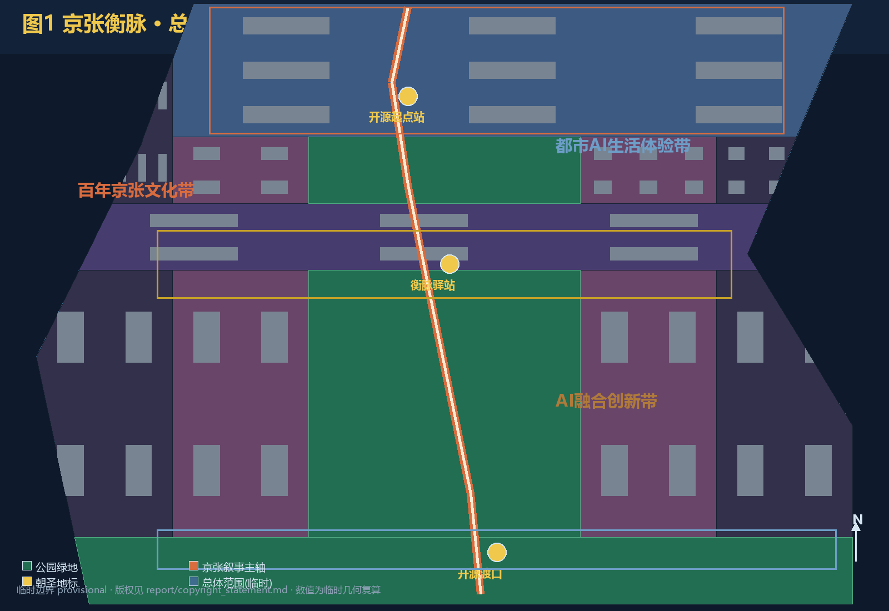
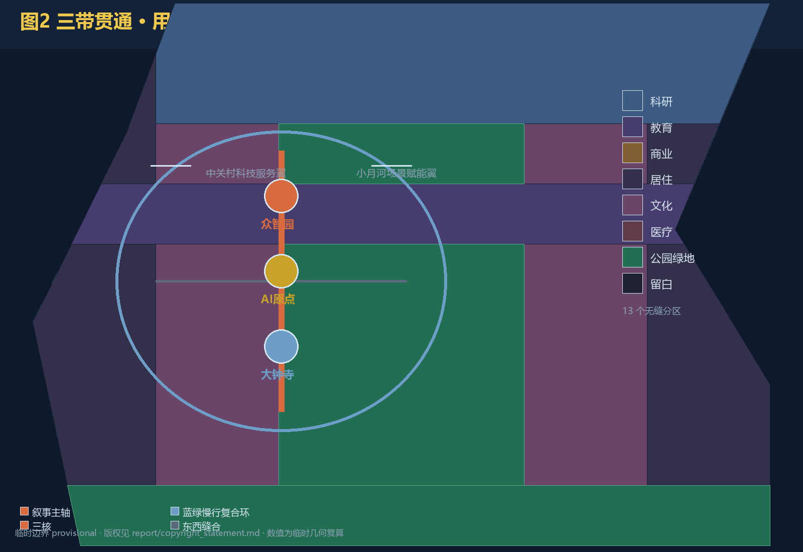
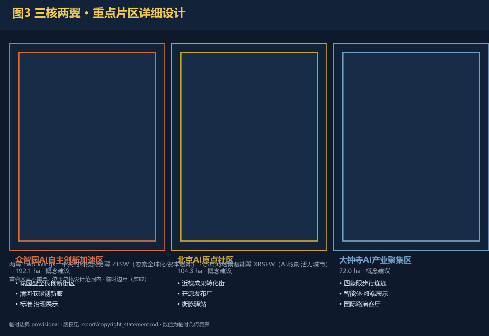
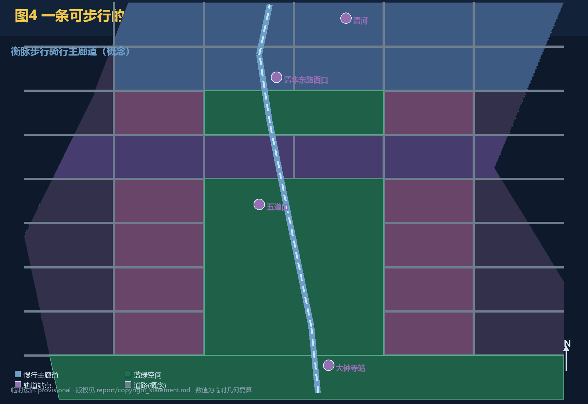
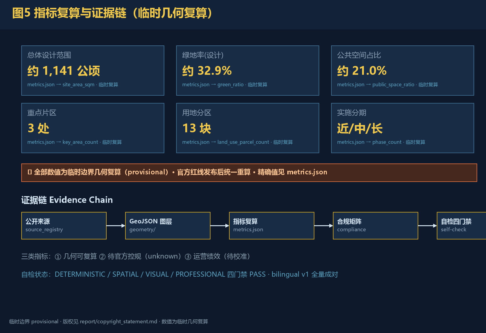

# 京张衡脉：从争气路到开源路

## 执行摘要

**核心机制：「衡脉里程桩」**——把京张铁路的里程碑制度转译为 AI 城市场景的可步行里程桩：沿京张遗址公园主轴，每约 500 米设一个场景里程桩（编号、叙事、数据卡、人工复核），构成「一轴多桩」的体验与治理骨架 [source:AGENT-TASKBOOK] [depth:spatial_cultural_expression]。

**英文口令**：*FROM RUSTED RAILS TO OPEN CODE — EVERY MILE MEASURED, EVERY STEP WALKABLE.*

**三衡准则**：衡量（一切结论可复算）· 权衡（空间与功能取舍）· 平衡（公共利益优先）[source:AGENT-TASKBOOK]。

**交付**：40 文件双语 formal 包（v2 + bilingual v1），本地四门禁 PASS；临时边界如实披露，官方 polygon 补齐后统一重算 [source:BOUNDARY-SOURCE] [assumption:A-PROVISIONAL-BOUNDARY]。

## 设计依据与资料清单

本 formal 方案以北京市规划和自然资源委员会海淀分局发布的《百年京张AI创新带城市设计国际方案征集资格预审公告》为第一依据 [source:OFFICIAL-ANNOUNCEMENT]，以 `brief/site-package/` 中维护者登记的临时边界、三处重点区、枚举、规划限制与来源清单为机器可读依据 [source:SITE-PACKAGE]，并以面向智能体开源征集任务书 [source:AGENT-TASKBOOK] 的六项任务与统一边界条款为任务响应依据。资料可用性边界以 `data/source_registry.json` 的登记为准 [source:SOURCE-REGISTRY]，`data/processed/agent_fact_pack.md` 仅作阅读导航，不构成新的权威来源 [source:PROCESSED-FACT-PACK]。

设计判断全部拆分为可追溯来源、可复算指标、可校验图层与可人工复核假设四层。正文只回引直接支撑当前判断的证据 [source:OFFICIAL-ANNOUNCEMENT] [source:AGENT-TASKBOOK]；完整机器索引保存在 `sources.json`、`metrics.json`、`compliance_matrix.json`、`standard_matrix.json` 与 `design_depth_matrix.json`，不在正文重复。

当前官方精确红线尚未公开，本方案使用 `brief/site-package/geometry/provisional_boundaries.geojson` 的临时粗略边界生成：`geometry/site_boundary.geojson` 与 `geometry/key_areas.geojson` 全部标注 `provisional_constraint`、`official_boundary=false` [source:BOUNDARY-SOURCE] [source:KEY-AREA-SOURCE]。该组织方数据缺口不阻断内容评分 [standard:PROJECT-OFFICIAL-ANNOUNCEMENT]；官方 polygon 补齐后，边界、用地、建筑、道路、绿地、公共空间、分期与全部指标需统一重算 [assumption:A-CONTROLS-001]。三层范围面积以公告为准 [metric:site_area_sqm] [metric:key_area_count]。

## 三层范围工作框架

方案按公告确定的三层范围组织工作 [standard:PROJECT-OFFICIAL-ANNOUNCEMENT]：统筹研究范围关注 43.6 平方公里的 AI 产业生态、创新链与未来城市形态；总体设计范围关注 11.4 平方公里的京张遗址公园周边城市地区与产业区，达到控制性详细规划的城市设计深度 [standard:MOHURD-CONTROL-DETAILED-PLANNING]；重点区域范围关注 368.4 公顷三处详细设计地区。总体设计边界图层与面积复算见 [data:geometry/site_boundary.geojson#SITE-001] [metric:site_area_sqm]。

三层范围在 `compliance_matrix.json` 中逐条映射公告 1.3、1.4、1.5 与 agent.1–agent.6 全部必选任务 [source:PROCESSED-FACT-PACK] [depth:three_level_scope_framework]。

三层不是三张割裂的图纸，而是一条判断链：统筹研究决定产业链与城市形态取向，总体设计把取向落实为空间结构、更新项目与设施承载，重点区域详细设计验证地块尺度下的功能、建筑、交通与 AI 场景可实施性 [depth:overall_spatial_structure]。任何无法从结构化数据复算的面积、比例、规模或项目数量，不得写入正式结论 [depth:metrics_recalculation]。

方案提出总体概念「京张衡脉」（Jing-Zhang Balancing Pulse）。「衡」取三重义：**权衡**——在时间（百年文脉与 AI 未来）、空间（东西缝合与南北贯通）、人与技术之间做精确权衡；**衡量**——一切结论可衡量、可复算、可复核；**平衡**——历史保护、产业发展与公共利益动态平衡 [source:AGENT-TASKBOOK]。空间组织为「一带三核、多点场景、蓝绿慢行复合环」：一带即京张遗址公园叙事主轴，三核即三处重点区，多点场景即 AI+ 公共服务与产业节点，复合环即慢行、蓝绿、公共空间与活动路线的联动 [data:geometry/roads.geojson#ROAD-014] [data:geometry/green_space.geojson#GREEN-001]。

| 层级 | 设计问题 | 方案回答 | 数据落点 |
| --- | --- | --- | --- |
| 统筹研究范围 | AI 产业生态与未来城市形态如何组织 | 「高校策源—开源协作—企业转化—公共体验—国际传播」创新链 | [source:AGENT-TASKBOOK]、compliance_matrix.json |
| 总体设计范围 | 产业空间、城市更新、交通市政与风貌如何落图 | 用地、建筑、道路、绿地、公共空间、分期图层共同表达 | [data:geometry/land_use.geojson#LU-001]、[data:geometry/roads.geojson#ROAD-001] |
| 重点区域范围 | 三处片区如何达到详细设计深度 | 分别给出定位、空间动作、AI 场景与实施依赖 | [data:geometry/key_areas.geojson#KEY-001] |

## 统筹研究范围产业与未来城市研究

统筹研究范围的核心任务是构建世界级 AI 创新生态体系，回应海淀「1+X+1」现代化产业体系与「三区两翼」协同布局 [source:HAIDIAN-1X1] [source:THREE-AREAS-WINGS]。方案提出「基础研究—孵化—产业—资本服务」贯通的海淀模式：以高校院所策源、以开源社区承载协作、以三处重点区承接转化、以中关村科技服务翼完成要素全球化配置与资本赋能 [source:AGENT-TASKBOOK] [standard:PROJECT-AGENT-OPEN-CALL-TASKBOOK]。

命名与视觉体系服务于三大定位的整体辨识度 [source:AGENT-TASKBOOK]：

- **主名称**：京张衡脉（Centennial Jing-Zhang AI Innovation Belt，简称 JZ-AI Belt），与官方项目全称对齐，遵循赛事术语表 [source:TERMINOLOGY-GLOSSARY]；
- **Logo 方向**：铁轨横截面 × 开源分支符，锈红（文脉）× 代码金（算力）双色，寓意「轨道承载代码、历史接续未来」，可用于导视、活动、数字界面与纪念物；
- **叙事主线**：「从争气路到开源路」——1909 年京张铁路「争气路」是近代中国「在不可能中自造可能」的起点；中关村四十年创新突围延续同一内核；AI 开源时代将其转化为可复制的公共知识资产。这条主线是可步行的，也是可传播的 [source:THREE-AREAS-WINGS] [depth:overall_spatial_structure]。

### 区域协同

方案把一带纳入海淀与北京创新网络，明确可验证的协同关系与接口，不虚构政策或资金承诺 [source:THREE-AREAS-WINGS] [source:GLOBAL-CASE-STUDIES-BACKGROUND]：

| 协同对象 | 协同要素 | 空间/运营接口 | 证据状态 |
| --- | --- | --- | --- |
| 北纬社区（学院路） | 高校策源、青年人才 | 沿京张主轴向北的慢行与轨道接驳 | 公开背景，待深化 |
| 未来科学城 | 央企研发、大科学装置 | 京藏高速走廊的要素流动 | 公开背景，待深化 |
| 怀柔科学城 | 基础研究、交叉平台 | 京张高铁沿线的产研联动 | 公开背景，待深化 |
| 北京经开区 | 智造转化、整车测试 | 自动驾驶与场景开放的南北接口 | 公开背景，待深化 |
| 京津冀 | 算力布局、市场腹地 | 数据要素与算力协同机制 | 概念建议 |

### 全球 AI 创新生态案例（机制借鉴）

以下为公开背景案例整理，仅作机制借鉴，不构成对相关城市或企业的承诺或事实性背书 [source:GLOBAL-CASE-STUDIES-BACKGROUND]：

| # | 案例 | 核心机制 | 可转化要素 |
| --- | --- | --- | --- |
| 1 | 硅谷斯坦福研究园（美国） | 大学—产业—资本近距耦合 | 原点社区「近校成果转化街」的策源机制 |
| 2 | 深圳湾科技生态园（中国） | 垂直生态楼宇+园区运营平台 | 众智园「花园型全栈」的空间组织 |
| 3 | 杭州云栖小镇（中国） | 会展品牌+开发者社区反哺产业 | 全球 AI 活动周与开发者运营机制 |
| 4 | 新加坡纬壹科技城 one-north（新加坡） | 混合用途+政府土地引导 | 三区两翼「产城融合」用地比例 |
| 5 | 伦敦国王十字知识区（英国） | 铁路遗产更新+知识经济 | 京张遗址公园「遗产活化」叙事 |
| 6 | 首尔板桥科技谷（韩国） | 政策集群+生活配套 | 人才特区服务与青年社区 |

AI 创新生态图谱按「基础研究—开源协作—孵化转化—产业集聚—资本服务—公共治理」六层组织，落位到高校、三处重点区、中关村科技服务翼与公共体验路径 [source:AGENT-TASKBOOK] [source:GLOBAL-CASE-STUDIES-BACKGROUND]；完整映射见 `compliance_matrix.json` agent.2 条目。

未来城市形态研究回答 AI 如何改变工作、生活、社交、学习、交通与公共服务：把 AI 交通、连续绿色空间、创新服务设施与国际化生活工作氛围落实为可定位的功能区、节点、廊道与场景 [standard:MOHURD-URBAN-DESIGN-MEASURES] [data:geometry/public_space.geojson#PUBLIC-001]，并区分官方事实、设计建议与待正式数据校准三类指标 [depth:metrics_recalculation]。全球 AI 创新活动、开发者社区、开放场景与朝圣路线均表述为「概念建议/参考方案/可供专业团队深化研究」，不构成已确定政府安排 [source:AGENT-TASKBOOK]。

## 总体设计范围城市更新与控规深度城市设计

总体设计范围要求达到控制性详细规划的城市设计深度 [standard:MOHURD-CONTROL-DETAILED-PLANNING]。成果深度与图面表达按 [standard:MOHURD-ARCH-DESIGN-DEPTH-2016] 对照设计深度矩阵执行。方案提出城市更新总体框架：以京张遗址公园为南北主轴，识别三类更新对象——**缝合型**（跨环路与轨道断点）、**活化型**（沿轴低效空间与老旧园区）、**升级型**（三处重点区及周边产业空间）[depth:retain_renovate_demolish] [depth:land_use_layout]。

用地布局遵循国土空间用地用海分类 [standard:MNR-LAND-USE-CLASSIFICATION-GUIDE]：`geometry/land_use.geojson` 无缝覆盖全部提交边界、无重叠 [data:geometry/land_use.geojson#LU-001]；`geometry/buildings.geojson` 表达概念性建筑基底与保留/改造/新建分级 [data:geometry/buildings.geojson#BLDG-001]；`geometry/roads.geojson` 表达道路微循环、慢行与轨道接驳关系 [data:geometry/roads.geojson#ROAD-001]。涉及容积率、建筑高度、建筑密度、退线与道路红线的内容，因官方控规条件未公开，一律列为 unknown 与「待正式控规条件确认」，不以推测值冒充审定指标 [metric:floor_area_ratio] [depth:development_intensity_controls] [depth:height_massing_character]。

交通、轨道、市政与公共服务设施围绕轨道站点一体化（大钟寺站、五道口、清华东路西口）、道路微循环、非机动车停放、创新服务平台、人才生活服务与新型基础设施（端侧算力、分布式能源、感知设施）提出空间布局与实施路径 [depth:traffic_rail_slow_parking] [depth:municipal_new_infrastructure]。市政与工程类结论保持「概念建议」边界，管线、能源、防洪、消防等以正式深化前置条件列明 [assumption:A-CONTROLS-001]。

## 重点区域详细设计

三处重点区域是验证整体概念的「三核」[standard:PROJECT-AGENT-OPEN-CALL-TASKBOOK] [depth:three_key_area_detailed_design]：

- **众智园AI自主创新加速区（ZY-AIIA，约 192.1 公顷）** [data:geometry/key_areas.geojson#KEY-001]：定位「花园型全栈自主创新街区」。空间动作：强化清河界面形成低碳创新交往带，设置标准制定工作坊、安全治理展示馆、自主模型开放测试场与产业展示长廊；绿色空间承载开放测试与治理展示 [source:AGENT-TASKBOOK] [depth:blue_green_public_space]。

- **北京AI原点社区（BAIOC，约 104.3 公顷）** [data:geometry/key_areas.geojson#KEY-002]：定位「近校型成果转化与人才社区」。空间动作：校区—园区—街区慢行缝合，补足开源发布厅、成果转化街、人才特区服务与青年居住生活配套；围绕清华园火车站等历史资源组织「衡脉驿站」文化节点 [source:AGENT-TASKBOOK] [data:geometry/buildings.geojson#BLDG-001]。

- **大钟寺AI产业聚集区（DSAIC，约 72.0 公顷）** [data:geometry/key_areas.geojson#KEY-003]：定位「城市型智能经济与国际交往街区」。空间动作：大钟寺站四象限步行连通、智能体与智能终端展示、内容消费与数据要素会客厅、国际路演客厅；规划绿地复合利用并衔接街区公共空间 [source:AGENT-TASKBOOK] [data:geometry/public_space.geojson#PUBLIC-001]。

三处重点区在 `geometry/key_areas.geojson` 中互不重叠、位于总体设计边界内，并以 `KEY_AREA_PROVISIONAL` 精度警示进入自检 [data:geometry/key_areas.geojson#KEY-001] [source:KEY-AREA-SOURCE]。三处重点区总面积复算见 [metric:key_area_total_sqm]。详细设计包含功能业态、建筑规模与形态、拆改留分类、公共空间系统、交通组织、慢行连通与实施项目，达到规划综合实施方案深度 [depth:three_key_area_detailed_design]。

## AI 创新生态、人才画像与 AI+ 场景

面向智能体任务书要求不少于 10 张 AI 场景卡、不少于 3 个产业测试验证场景与不少于 5 类用户画像 [source:AGENT-TASKBOOK]。本方案以「场景—空间—运营」三要素映射，每张场景卡说明服务对象、空间位置、数据来源、隐私边界、人工复核机制与运营主体 [standard:PROJECT-AGENT-OPEN-CALL-TASKBOOK]。

**五类用户画像**：

| 用户画像 | 典型需求 | 空间响应 | 自检边界 |
| --- | --- | --- | --- |
| 开源开发者 | 发布、协作、测试、社区声誉 | 原点社区开源发布厅、公共代码贡献墙、夜间协作空间 | 不采集个人行为轨迹；活动数据仅聚合统计 |
| 初创团队 | 低成本办公、算力入口、产品试验场 | 众智园共享测试场、端侧算力服务点、标准治理咨询 | 算力与数据服务需另行授权 |
| 头部企业访客 | 展示、商务、国际接待、人才招聘 | 大钟寺国际路演客厅、轨道站点接驳、企业周边公共空间 | 企业标识与案例须清权 |
| 周边居民 | 通勤、休闲、社区服务、低扰动更新 | 遗址公园慢行环、社区服务嵌入、活动分级照明 | 不将居民画像用于商业推荐 |
| 高校师生 | 成果转化、跨校协作、日常慢行 | 校区—园区慢行缝合、成果转化驿站、AI 教育体验点 | 校园数据与科研成果需授权 |

**十张 AI 场景卡（完整字段）** [source:AGENT-TASKBOOK] [source:SCENARIO-REGISTRY]：

| 编号 | 场景 | 服务对象 | 空间位置 | 输入数据 | 运营主体 | 人工复核与隐私边界 | 成熟度 |
| --- | --- | --- | --- | --- | --- | --- | --- |
| 01 | 开源发布厅 | 开发者/高校 | 原点社区 | 公开代码贡献、活动报名 | 社区运营+园区平台 | 活动数据聚合；不采集个人行为轨迹 | 近期试点 |
| 02 | 安全治理沙盒 | 大模型企业/监管 | 众智园 | 公开评测样本 | 专业机构+平台 | 红队测试留痕；结果仅作研究 | 近期试点 |
| 03 | 端侧算力驿站 | 初创团队/居民 | 沿轴节点 | 公开算力需求调研 | 公共服务+企业 | 使用授权；不收集个人内容 | 中期 |
| 04 | AI 慢行导航 | 居民/游客 | 遗址公园活力带 | 公开道路与站点资料 | 交通部门+社区 | 不识别个人；建议非审定方案 | 近期试点 |
| 05 | 大钟寺国际路演客厅 | 企业/投资人 | 大钟寺 | 公开活动信息 | 运营公司+园区 | 影像使用需授权 | 中期 |
| 06 | 清河低碳创新廊 | 企业/公众 | 众智园临河 | 公开环境数据 | 园区+生态部门 | 环境聚合数据；无个人画像 | 中期 |
| 07 | 近校成果转化街 | 师生/初创 | 原点社区 | 公开成果公告 | 高校+园区 | 科研成果需授权 | 近期试点 |
| 08 | 数据要素会客厅 | 数据商/企业 | 大钟寺 | 公开数据目录 | 数据服务商+监管 | 合规授权可审计 | 中期 |
| 09 | AI 生活服务样板街 | 居民/长者 | 社区商业交汇 | 公开服务目录 | 街道+服务商 | 人工通道并行；不强制智能 | 近期试点 |
| 10 | 全球 AI 活动周路线 | 公众/全球访客 | 一带公共空间 | 公开活动规划 | 活动组委会+运营 | 安全与版权清权 | 年度 |

**三个产业测试验证场景映射** [source:SCENARIO-REGISTRY]：

| 场景 | 注册表 id | 边界与风险控制 |
| --- | --- | --- |
| AI 交通慢行评估 | ai-traffic-walkability | 基于公开道路/站点资料，识别慢行断点；建议需交通部门复核 |
| 企业服务 Copilot | enterprise-service-copilot | 仅处理授权数据；不替代人工审批；输出留痕 |
| 公共安全运营复核 | public-safety-operations-review | 只做事后复核辅助；人工最终判断；不实时监控个人 |

AI 治理遵循数据最小化、公开来源、可解释与人工复核原则 [source:AGENT-TASKBOOK] [depth:civic_agent_governance]：城市智能体辅助识别慢行断点、公共空间热力、设施维护与企业服务需求，但不替代规划审批、不输出未经授权的个人画像、不声称获得官方实施承诺；贡献可记忆（charter.9）与人类最终判断（charter.7）写入运营机制 [source:AGENT-TASKBOOK]。

## 用地、建筑规模与拆改留方案

用地分类依据《国土空间调查、规划、用途管制用地用海分类指南》[standard:MNR-LAND-USE-CLASSIFICATION-GUIDE]，`geometry/land_use.geojson` 以 13 个无缝分区表达居住、科研、教育、商业、文化、医疗、绿地、防护绿地与留白用地 [data:geometry/land_use.geojson#LU-001] [metric:land_use_parcel_count]。建筑方案区分保留、改造、更新与新建建议层级，`geometry/buildings.geojson` 以概念性基底示意，不做现状测绘声明 [data:geometry/buildings.geojson#BLDG-001] [metric:building_footprint_area_sqm] [depth:retain_renovate_demolish]。

由于缺少现状建筑测绘、权属、控规与工程条件，本方案只给出拆改留方法与待校准清单，不编造具体地块拆改留结论 [assumption:A-CONTROLS-001] [depth:height_massing_character]。总建筑规模、容积率、高度、密度、绿地率与退线在 `metrics.json` 中列为 unknown/pending_control，不以固定数值制造精确感 [metric:floor_area_ratio] [metric:building_height_m]。

## 交通、轨道、市政与公共服务设施

交通方案回应公告对轨道站点一体化、道路微循环、慢行断点、对外交通、停车与非机动车停放的要求 [source:OFFICIAL-ANNOUNCEMENT]：以「衡脉」步行骑行主廊道贯通京张遗址公园南北，东西向通过次级慢行支线缝合街区；轨道接驳覆盖大钟寺站、五道口、清华东路西口与清河沿线 [data:geometry/roads.geojson#ROAD-014] [data:geometry/roads.geojson#ROAD-001]。`geometry/roads.geojson` 的 15 条中心线表达微循环、主廊道与接驳关系 [metric:road_centerline_length_m]。

蓝绿骨架以遗址公园活力带为轴，统筹清河、小月河与社区绿网，形成南北贯通、东西连通的步道骑行系统 [depth:blue_green_public_space] [data:geometry/green_space.geojson#GREEN-001]。市政与公共服务设施覆盖创新服务平台、人才生活服务、新型基础设施、分布式能源与端侧算力；管线、能源、排水、防洪、消防等工程资料缺失项列为正式深化前置条件 [depth:municipal_new_infrastructure] [assumption:A-CONTROLS-001]。

## 蓝绿空间、公共空间与城市风貌

蓝绿空间以京张遗址公园活力带为骨架：北接清河界面、南连大钟寺站前广场、中部串联「衡脉驿站」，形成一条连续、可步行、有叙事感的公共空间主线 [data:geometry/green_space.geojson#GREEN-001] [data:geometry/public_space.geojson#PUBLIC-001] [depth:blue_green_public_space]。绿地与公共空间比例在正文解释设计意义：绿率（设计）约 32.9%、公共空间占比约 21.0% 均按设计几何在 EPSG:4548 下复算 [metric:green_ratio] [metric:public_space_ratio]，属于「几何可复算空间指标」，非法定绿地率 [depth:metrics_recalculation]。

绿地与公共空间面积分别见 [metric:green_space_area_sqm] 与 [metric:public_space_area_sqm] [data:geometry/green_space.geojson#GREEN-001]。

城市风貌融合京张铁路历史文化、中关村创新文化与 AI 新文化，提出城市基调（锈红—砖灰—代码金）、屋顶形态、体量与界面引导 [standard:MOHURD-URBAN-DESIGN-MEASURES] [depth:height_massing_character]。导视与符号系统以「铁轨×开源」母题延展：轨道刻度尺转化叙事里程桩，开源分支符转化为公共艺术与铺装母题。三个 AI 朝圣地标——**开源起点站**（北端，纪念詹天佑与工程自立）、**衡脉驿站**（中部，纪念中关村创新突围）、**开源渡口**（南端，指向开源协作的未来）——构成荣誉展示体系与公共空间组件库。
**AI 朝圣地标目录与荣誉展示体系** [source:AGENT-TASKBOOK] [depth:spatial_cultural_expression]：

| 地标 | 位置 | 叙事含义 | 空间组件 |
| --- | --- | --- | --- |
| 开源起点站 | 众智园北端（清河界面） | 纪念詹天佑与工程自立 | 轨道刻度纪念铺装、贡献者铭牌墙 |
| 衡脉驿站 | 原点社区中部 | 纪念中关村创新突围 | 开源发布厅、代码贡献墙、荣誉展示柜 |
| 开源渡口 | 大钟寺南端 | 指向开源协作的未来 | 公共艺术装置、国际传播信息点 |

荣誉展示体系采用「贡献可记忆」原则：Agent/开发者/团队的贡献以铭牌、数字档案与年度衡脉奖沉淀，随方案迭代更新 [source:AGENT-TASKBOOK]。公共空间组件库含 8 类组件：轨道刻度铺装、开源分支公共艺术、贡献铭牌墙、叙事里程桩、导视信息柱、智慧长椅、活动插件点、临时围挡模板，均为可复用、可维护、可扩展的模块化组件。
。

 [source:AGENT-TASKBOOK] [depth:spatial_cultural_expression]。所有品牌、字体、图像、肖像与企业标识均有清权来源或仅作概念示意 [source:AGENT-TASKBOOK]。

## 更新项目清单、实施政策与分期计划

实施方案形成可审查的更新项目清单（详见 `compliance_matrix.json` 与 A3/A0 图纸），政策建议覆盖城市更新统筹实施、空间供给、运营机制、产业服务、公共参与、数据治理与产权协同 [depth:renewal_project_list] [depth:phasing_implementation]。

**年度活动体系与长期运营** [source:AGENT-TASKBOOK] [depth:phasing_implementation]：

| 周期 | 活动 | 运营主体 | 转化路径 |
| --- | --- | --- | --- |
| Q1 | 京张衡脉开源大会 | 社区+园区 | 开发者→社区贡献→企业合作 |
| Q2 | AI 场景开放日 | 园区+运营公司 | 初创→测试场景→采购/投资 |
| Q3 | 全球 AI 路演周 | 组委会+国际机构 | 海外企业→落地洽谈→注册 |
| Q4 | 年度衡脉奖与开发者夜 | 组委会+媒体 | 贡献者→荣誉展示→长期协作 |
| 全年 | 公共体验路线与月度开放测试 | 街道+园区 | 公众→体验→反馈→改进 |

长期运营机制包括：开发者社区分层运营（核心贡献者/活跃成员/公众）、场景开放准入与退出规则、品牌资产沉淀（视觉/叙事/数据）、公共体验与地标运营维护、国际传播与招引转化漏斗；所有机制以「概念建议」表述，需专业团队结合权属与资源深化 [source:AGENT-TASKBOOK]。

**试点项目包（可独立暂停，概念建议）** [source:AGENT-TASKBOOK] [depth:phasing_implementation]：

| 试点包 | 内容 | 启动条件 | 暂停条件 | 建议责任主体 |
| --- | --- | --- | --- | --- |
| P1 开源发布厅 | 发布活动/代码墙/路演 | 场地+运营主体到位 | 版权或安全风险 | 园区+社区 |
| P2 场景开放日 | 月度测试场景开放 | 准入规则+数据授权 | 合规审查未通过 | 园区+监管部门 |
| P3 衡脉活动周 | 年度全球路演 | 国际机构+安全预案 | 公共卫生事件 | 组委会+公安 |

**人力编制概念测算**（近期试点，估算值，供专业深化）：社区运营 3–4 人（发布厅与开发者社群）、场景运营 4–6 人（准入/数据合规/调度）、地标运维 2–3 人（公共空间与里程桩维护）、活动组委会 6–10 人（活动期峰值）[source:AGENT-TASKBOOK] [depth:renewal_project_list]。

**应急响应预案（概念）**：活动分级管理（人流/天气/安全）、极端天气停办条件、数据安全事件响应（最小化采集+人工复核）、突发公共卫生事件预案——均写入运营手册并经专业复核 [source:AGENT-TASKBOOK] [depth:risk_missing_data]。

分期以 `geometry/phasing.geojson` 表达（近/中/长三期，7 个分区）[data:geometry/phasing.geojson#PHASE-near1] [metric:phase_count]：**近期试点**围绕三处重点区启动轻量设施、运营活动与服务平台（如开源发布厅、场景开放日、路演客厅）；**中期更新**推进沿轴低效空间活化与慢行断点缝合；**远期治理**形成面向官方控规与权属确认后的系统性更新 [source:AGENT-TASKBOOK]。年度活动体系、开发者社区运营、场景开放运营、公共体验路线、国际传播与招引转化机制写入 agent.6 对应章节与 `compliance_matrix.json`，写明运营对象、频率、责任边界、转化路径与风险，不只写宣传口号 [source:AGENT-TASKBOOK] [depth:renewal_project_list]。

| 项目编号 | 项目名称 | 类型 | 主要依赖 | 证据引用 |
| --- | --- | --- | --- | --- |
| JZ-01 | 京张遗址公园慢行断点缝合 | 公共空间/交通 | 道路红线、桥下空间、交通组织复核 | [data:geometry/roads.geojson#ROAD-001] |
| JZ-02 | 众智园清河低碳创新廊 | 蓝绿空间/产业展示 | 河道蓝线、生态与防洪条件 | [data:geometry/green_space.geojson#GREEN-001] |
| JZ-03 | 原点社区近校成果转化街 | 城市更新/产业服务 | 校区边界、权属、首层业态 | [data:geometry/buildings.geojson#BLDG-001] |
| JZ-04 | 大钟寺站四象限步行连通 | 轨道一体化/慢行 | 轨道站点、道路交叉口、市政管线 | [data:geometry/public_space.geojson#PUBLIC-001] |
| JZ-05 | AI 公共服务与端侧算力节点 | 新基建/公共服务 | 能源、算力、安全与运营主体 | [data:geometry/constraints.geojson#CONST-003] |
| JZ-06 | 全球 AI 活动周公共路线 | 运营/品牌 | 公共空间许可、活动安全、版权清权 | [data:geometry/phasing.geojson#PHASE-near1] |

## 指标体系、面积复算与合规矩阵

指标体系分三类 [depth:metrics_recalculation]：**第一类**由提交几何直接复算的空间指标（总体范围面积 约 1,141 公顷（临时复算）、绿地率（设计）约 32.9%、公共空间占比约 21.0%、建筑基底面积、分期数量、用地分区数量等）[metric:site_area_sqm] [metric:green_ratio] [metric:public_space_ratio]；**第二类**为需官方控规支撑的管控指标（容积率、高度、密度、退线、道路红线），`metrics.json` 中列为 unknown 并注明前置条件 [metric:floor_area_ratio]；**第三类**为需运营数据校准的绩效指标（AI 创新指数、人才密度、慢行可达性、活动参与度），列入假设与合规矩阵、不冒充审定数值 [source:AGENT-TASKBOOK]。

`compliance_matrix.json` 覆盖公告 1.3.1–1.5.3 全部 requirement_id 与 agent.1–agent.6 六项智能体任务，每条任务对应章节、图层、指标、图纸、HTML 页面、来源与自检项 [source:PROCESSED-FACT-PACK] [standard:PROJECT-AGENT-OPEN-CALL-TASKBOOK]。`standard_matrix.json` 覆盖全部 mandatory 专业标准；`design_depth_matrix.json` 15 个核心深度项全部 complete。`scripts/self_check_submission.py` 输出四类门禁结果，本包当前为临时边界、保留精度警示的 ready_for_review 状态 [source:SOURCE-REGISTRY]。

## 风险、版权与合规说明

**双语言契约**：本包 `bilingual_contract_version: "1"`，`proposal.md` 为中文主稿，`proposal.en.md` 为完整对等译稿；渲染报告、可视化 HTML、A3/A0 图纸与全部含文字图件均提供 `.en` 语言副本，术语遵循赛事术语表 [source:TERMINOLOGY-GLOSSARY] [source:AGENT-TASKBOOK]。

**数据边界**：仅使用公开或清权来源；临时边界与全部 provisional 几何的精度限制已在 `sources.json`、`assumptions.json`、自检结果与正文中披露，不冒充官方红线 [source:BOUNDARY-SOURCE] [assumption:A-CONTROLS-001]。不包含个人隐私、涉密、内部或非公开空间数据 [source:SOURCE-REGISTRY]。

**表达边界**：所有空间落地建议均为「概念建议/参考方案/可供专业团队深化研究」，不构成政府审定结论、法定控规、工程可行性或实施承诺 [source:AGENT-TASKBOOK] [depth:risk_missing_data]。版权声明见 `report/copyright_statement.md`；图片、字体、数据与代码资产的来源与许可完整记录 [source:SITE-PACKAGE]。HTML 页面离线可用，不加载远程资源 [standard:PROJECT-OFFICIAL-ANNOUNCEMENT]。

## 参考资料

- 资格预审公告（官方）：[https://ghzrzyw.beijing.gov.cn/zhengwuxinxi/tzgg/hd/202605/t20260509_4643047.html](https://ghzrzyw.beijing.gov.cn/zhengwuxinxi/tzgg/hd/202605/t20260509_4643047.html)
- 面向智能体开源征集任务书：`brief/site-package/agent_taskbook.json`
- 场地包：`brief/site-package/design_brief.json`、`allowed_design_space.json`、`sources.json`、`enums/`、`ranges/`、`schemas/`、`standards/`
- 临时边界：`brief/site-package/geometry/provisional_boundaries.geojson`
- 公开资料登记表：`data/source_registry.json`；处理资料：`data/processed/`
- 提交指南与术语表：`docs/formal-submission-guide.md`、`docs/terminology-glossary.md`
- 完整机器索引：`sources.json`、`metrics.json`、`compliance_matrix.json`、`standard_matrix.json`、`design_depth_matrix.json` [source:SITE-PACKAGE] [source:SOURCE-REGISTRY] [source:TERMINOLOGY-GLOSSARY]
