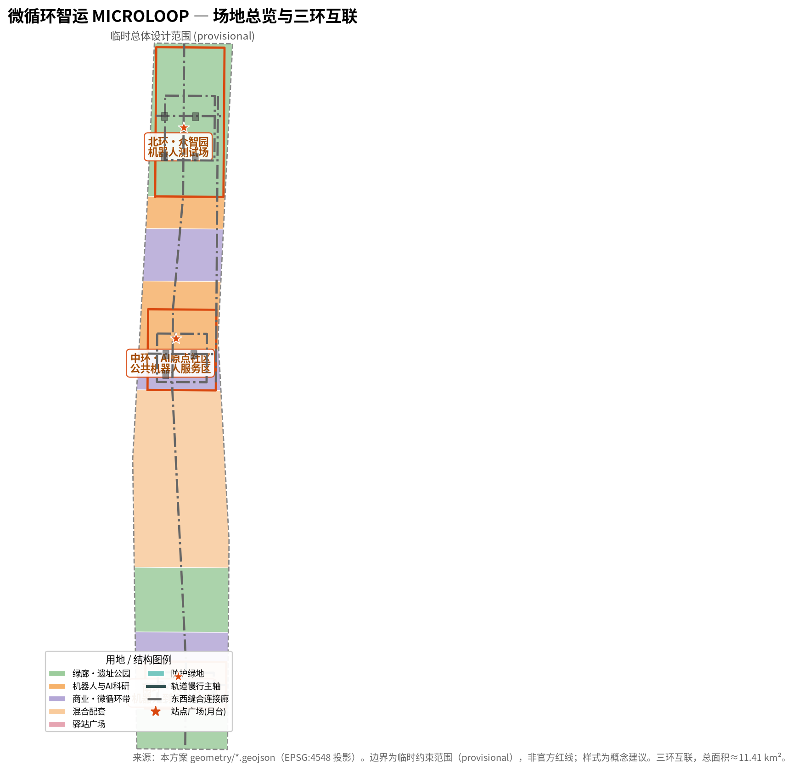
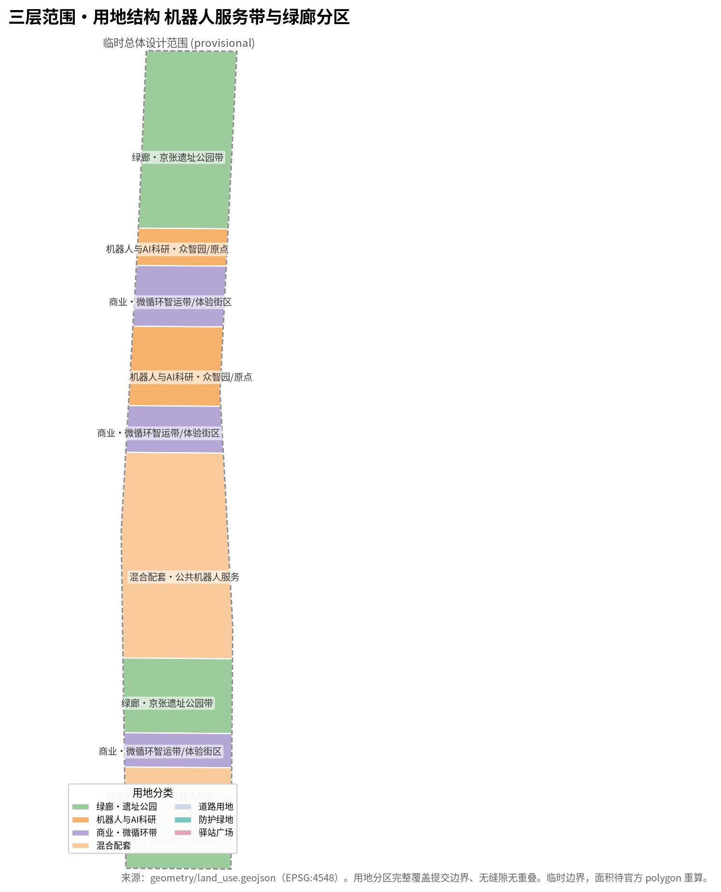
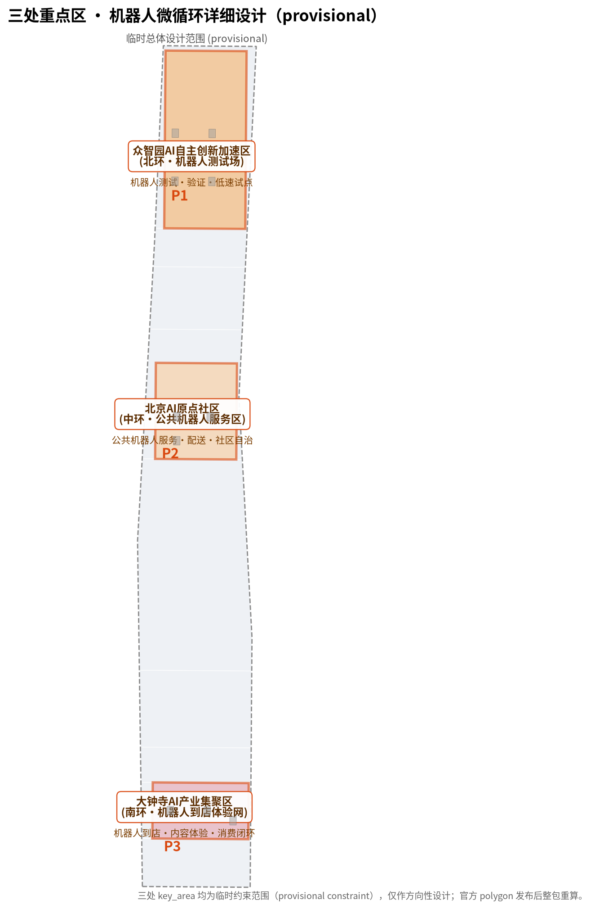
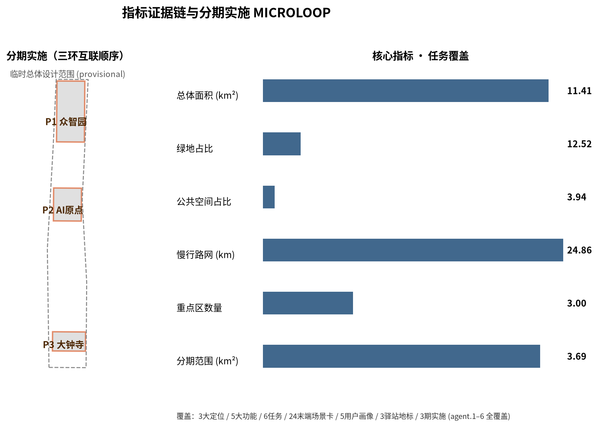
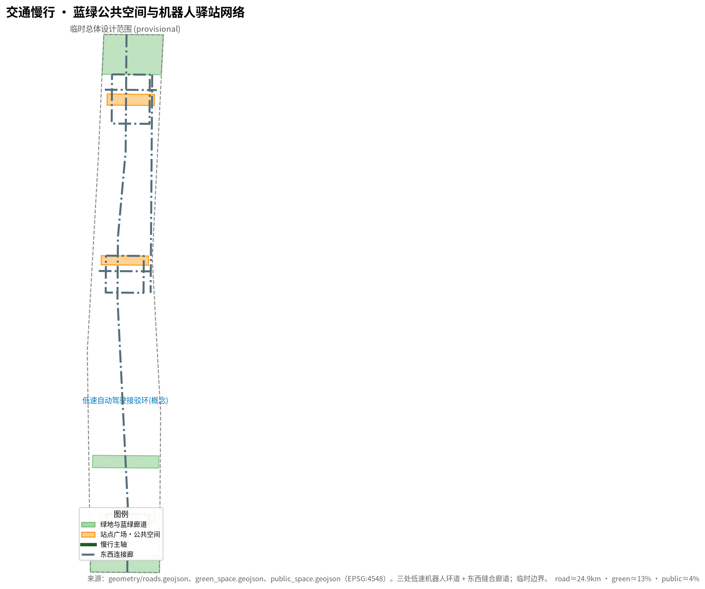

# 微循环智运 MICROLOOP：京张AI创新带的低速机器人·无人接驳末端网络

## 设计依据与资料清单

本方案以北京市规划和自然资源委员会海淀分局发布的《百年京张AI创新带城市设计国际方案征集资格预审公告》为第一依据 [source:DATA-SRC-OFFICIAL-ANNOUNCEMENT-20260509]，并以维护者登记的三层范围、三处重点区、枚举、指标、来源与专业标准清单为机器可读依据 [source:SITE-PACKAGE]。面向智能体的开源征集任务书（agent.1–agent.6）为六项创意性与运营性任务提供直接依据 [source:DATA-SRC-AGENT-TASKBOOK-20260518]。全部正式结论必须回溯到 `data/source_registry.json` 中标注为 `usable_for_formal="yes"` 的资料；provisional-only 与 background-only 资料只用于生成、展示和设计讨论，不得升级为官方边界、法定控规或正式评分证据 [source:SOURCE-REGISTRY]。

需要特别说明的是：本项目官方 `SITE_BOUNDARY` 与三处 `KEY_AREA` 精确 polygon 尚未向社会公布（资格预审包为密码保护下载，截至检索未取得公开精确边界）。本方案因此使用维护者依据公告文字四至与约面积在 EPSG:4548 下推定并校核的**临时粗略边界（provisional constraint）** [source:DATA-SRC-PROVISIONAL-BOUNDARIES-20260605][source:BOUNDARY-SOURCE][source:KEY-AREA-SOURCE]。范围、任务、来源边界与缺失数据清单还可回溯到智能体可读事实包导航层 [source:PROCESSED-FACT-PACK]。该边界仅用于 AI 生成、展示与临时自检，**不得视为 official redline、审批依据或精确面积复算依据**；组织方数据缺口本身不阻断内容评分，但官方 polygon 发布后，site boundary、land use、roads、green/publ space、buildings、phasing 与全部面积/比例指标均须整包重算 [metric:site_area_sqm]。

方案参照控制性详细规划与规划综合实施方案的框架开展概念研究，采用 [standard:MOHURD-CONTROL-DETAILED-PLANNING] 与 [standard:MOHURD-URBAN-DESIGN-MEASURES] 的深度组织方法与专业标准作为参照，用地分类遵循 [standard:MNR-LAND-USE-CLASSIFICATION-GUIDE]；本方案为概念研究，不构成法定控规、实施成果或审批基准。机器人低速试点与公共服务分别遵循低速交通、无障碍与老年人友好相关法规的合规边界（完整标准清单见 `standard_matrix.json`）。上文这些标准、任务、来源、指标与设计深度的完整索引分别保存在 `standard_matrix.json`、`compliance_matrix.json`、`sources.json`、`metrics.json` 与 `design_depth_matrix.json`，正文只在关键判断处放置少量可校验引用，不做机器索引堆叠。

## 三层范围工作框架

方案按公告确定的三层范围组织：**统筹研究范围**（43.6 km²，北至北五环、东至京藏高速、南至西直门外大街、西至万泉河路）回答“低速机器人与自动驾驶如何重构城市末端流程”的战略问题 [metric:site_area_sqm]；**总体设计范围**（11.4 km²，京张遗址公园周边1–2公里城市与产业地区）把战略落实到末端物流、公共机器人服务与慢行接驳的试点网络 [data:geometry/site_boundary.geojson#SITE-001]；**重点区域范围**（368.4 ha，自北向南为众智园、北京AI原点社区、大钟寺）对三处片区内的机器人环道与驿站进行详细设计 [data:geometry/key_areas.geojson#PROV-KEY-001]。

三层范围不是割裂的图纸集合：统筹研究决定末端流程判断，总体设计把判断转译为机器人服务区与微循环廊道，重点区域在站点尺度验证低速接驳的可实施性。方案在 `compliance_matrix.json` 中把公告 1.3、1.4、1.5 与 agent.1–agent.6 逐条映射到章节、图层、指标、图纸与 HTML 证据 [depth:three_level_scope_framework]。

由于三处重点区 polygon 现为临时粗略矩形（provisional constraint），本方案对其中的功能、建筑更新、机器人驿站与AI场景只作**方向性设计**；矩形边不得解释为地块或道路红线，任何精确面积均待官方 polygon 发布后重算 [depth:three_key_area_detailed_design]。

## 统筹研究范围产业与未来城市研究

### 总体概念：微循环智运 MICROLOOP

本方案提出总体概念 **「微循环智运 MICROLOOP」**：把京张AI创新带组织为一张**低速机器人 + 无人接驳的末端微循环网络**。它作为干线轨道（大型城市轨道/接驳主轴）之外“最后一公里”的末端层，回答“干线之后末端如何贯通”——园区内的配送、巡检、导览、清洁与无障碍随行机器人沿三处重点区环道运行，核心站点之间以低速自动驾驶接驳环贯通，形成「干线 + 末端微循环」的双层流动 [data:geometry/roads.geojson#ROAD-RING-N]。

- **环道（Loop）**＝三处重点区各设一条低速机器人环道，是末端服务的物理骨架 [data:geometry/roads.geojson#ROAD-RING-N]。
- **机器人（Bot）**＝配送、巡检、导览、清洁、随行等低速终端，是环道上可调度、可复核的“信使”。
- **驿站（Hub）**＝换电、装卸、调度与运维节点，是末端网络的“器官” [data:geometry/public_space.geojson#PUBLIC-N]。
- **协议（Protocol）**＝低速试点遵守“可监管、可复核、可回退”的合规协议，任何一个场景都可临时或永久回退到人工。

这一概念让“百年京张文化带、都市AI生活体验带、AI融合创新带”三大定位落到可运行的末端网络：文化带＝沿遗址公园的慢行导览与信使机器人，生活体验带＝园区内的配送与公共机器人服务，创新带＝低速自动驾驶试点与机器人产业集聚 [source:DATA-SRC-AGENT-TASKBOOK-20260518]。

### 三大定位、五大功能与三环互联

方案明确三大定位（百年京张文化带／都市AI生活体验带／AI融合创新带），并把其落实为五大功能：**末端物流自主化、公共机器人服务、低速自动驾驶试点、AI治理的末端话语权、智能化活力城市** [source:DATA-SRC-AGENT-TASKBOOK-20260518]。五大功能通过“三环互联”协同回路运转：

- **北环（众智园）**：机器人测试、验证与低速自动驾驶试点 [data:geometry/roads.geojson#ROAD-RING-N]。
- **中环（AI原点社区）**：公共机器人服务、配送与社区自治的开放接口 [data:geometry/roads.geojson#ROAD-RING-M]。
- **南环（大钟寺）**：智能原生零售、内容体验与机器人到店的消费闭环 [data:geometry/roads.geojson#ROAD-RING-S]。
- **东西缝合廊道**：三环之间的低速接驳与公共机器人服务串联 [data:geometry/roads.geojson#ROAD-EW-02]。

协同回路可表述为：**北环试验 → 中环公共化 → 南环消费沉淀 → 东西廊道融合流通 → 反哺北环迭代**，形成“测试—公共服务—消费—数据”的末端闭环 [standard:PROJECT-AGENT-OPEN-CALL-TASKBOOK]。

### 全球机器人·低速自动驾驶案例对标

本方案对标全球城市末端自动化实践，案例为**行业公开信息参考（非本地正式来源，详见 `sources.json` 的可用性标注）**，用于提炼设计原则而非直接引证：

| 案例 | 地区/场景 | 品类 | 首发前提 | 启示 |
|------|-----------|------|----------|------|
| Starship Technologies | 欧洲/北美校园、社区配送 | 微型包裹配送机器人 | 低速、限定区域、人行共享 | 单一品类单环线起步 |
| Nuro | 美国加州/德州城市配送 | 无人配送车（低速） | 低速路权许可、限定区域 | 区域定义与路权是关键 |
| Kiwibot | 美国/拉美校园配送 | 小型配送机器人 | 低速、人行道 | 低成本小规模试点 |
| 韩国 SKT/街头服务机器人 | 韩国园区/社区 | 配送/巡检/导览多品类 | 园区封闭试点 | 多品类多环互联演进 |
| 日本新宿/园区机器人 | 日本城市/园区 | 配送/导览/清洁 | 限定路线、人工监控 | 人机共处与人机交接面 |
| 中国三亚/园区无人配送试点 | 中国园区 | 低速无人配送/巡逻 | 限定区域、监管试点 | 政策分区试点与验收标准 |

共同经验是——**低速、限定区域、可监管回退**是首发前提；先行者多从“单一品类、单一环线”起步，再向“多品类、多环互联”演进。京张带具备三环并存、路权清晰、试点空间大的独特条件，适合作为低速机器人末端网络的集成试验床。上述案例仅用于设计原则参考，不构成对特定企业或项目的本地背书 [source:DATA-SRC-AGENT-TASKBOOK-20260518]。

### 未来城市形态与AI+公共服务、连续绿色空间

末端机器人网络不是孤立的“配送设施”，而是与慢行、绿廊、公共空间共构的友好界面：机器人共享路权、优先让行、无障碍随行，与公园带绿廊叠加形成“绿色+智慧”的公共空间体验 [data:geometry/green_space.geojson#GREEN-COR]。AI+公共服务（医疗配送、法律援助、政务代办等）沿微循环网络布点，把服务送到“最后一公里” [source:DATA-SRC-AGENT-TASKBOOK-20260518]。

## 总体设计范围城市更新与控规深度城市设计

### 用地结构

总体设计范围按“绿廊＋机器人服务带＋混合街区”组织用地。以绿廊为背景，三处重点区外围布置**公共机器人服务区**与**微循环智运带**，把末端物流、换电、仓储与公共机器人服务嵌入城市肌理，避免“机器人设施孤岛化” [data:geometry/land_use.geojson#LU-M1]。

### 空间结构与城市更新

以“三环互联＋东西缝合”为空间骨架：三处重点区各为一条机器人环道，东西向由低速接驳廊道缝合；园区更新围绕“机器人驿站＋公共广场＋混合街区”展开，优先盘活低效用地为机器人服务设施 [data:geometry/public_space.geojson#PUBLIC-M]。

### 交通、轨道、市政与新型基础设施

低速机器人环道与慢行主轴分层共享路权，环道内侧为人行与绿地，外侧为低速机器人/无人接驳道；市政预留换电、通信与高精地图接口，为末端自动驾驶提供可扩展基础设施 [data:geometry/roads.geojson#ROAD-ML-N]。

### 京张遗址公园活力带与城市风貌

机器人导览与随行服务沿遗址公园活力带布置，作为文化叙事与公共服务的一部分；机器人采用小巧、安静、友好外观，融入地方风貌而非突兀的“自动化壁垒” [data:geometry/green_space.geojson#GREEN-N]。

## 用地、建筑规模与拆改留方案

本方案在三环互联的空间骨架下，对总体设计范围内的用地与建筑规模采取“留改为主、拆建为辅”的原则。**保留**核心产业楼宇、科研院所与公共文化建筑，延续地块既有产权与功能基底 [data:geometry/buildings.geojson#BLDG-M-01]；**改造**低效物业与临建，置换为机器人驿站、分拣转运、公共机器人服务与换电运维设施，避免大拆大建 [data:geometry/buildings.geojson#BLDG-M-02]；**新建**少量机器人测试工场与换电节点，集中在北环（众智园）与东西缝合廊道的重要节点，作为末端网络的“基础设施锚点” [data:geometry/buildings.geojson#BLDG-N-01]。

建筑规模遵循官方用地分类与高度管控：科研、公共服务与商业用地按官方代码分区 [data:geometry/land_use.geojson#LU-M1]，建筑面积与容积率由 `metrics.json` 的建筑足迹指标反映 [metric:building_footprint_area_sqm]；由于官方 polygon 与高度/密度控制尚未发布，建筑密度、高度、容积率等法定指标标记为待正式数据补齐 [reason:planning_limits_missing]。拆改留策略以升级而非推平为取向：保留街廓尺度与可达性，改造业态与基础设施，使机器人末端服务嵌入既有城市肌理而非形成孤岛，实现“低扰动、高可运维”的城市更新 [depth:three_key_area_detailed_design]。

## 交通、轨道、市政与公共服务设施

低速机器人/无人接驳网络是总体设计范围内“最后一公里”的交通骨架，与慢行、公交、轨道接驳协同成网 [data:geometry/roads.geojson#ROAD-ML-N]。三处重点区各设一条低速机器人环道（北环、中环、南环），环道内侧为人行与绿地、外侧为低速机器人/无人接驳道，实现分层共享路权 [data:geometry/roads.geojson#ROAD-RING-N]；东西缝合廊道作为三环之间的低速接驳干线 [data:geometry/roads.geojson#ROAD-EW-02]。

市政与新型基础设施方面：装配式换电柜、通信基站与高精地图接口在驿站与环道节点预留，为末端自动驾驶提供可扩展基础设施；装卸月台与调度中心集中于机器人驿站广场 [data:geometry/public_space.geojson#PUBLIC-N]。公共服务（医疗配送、法律援助、政务代办、无障碍随行）沿微循环网络布点，把服务送到“最后一公里”，形成末端公共服务带 [source:DATA-SRC-AGENT-TASKBOOK-20260518]。道路中心线长度与覆盖由 `metrics.json` 的慢行/路网指标衡量 [metric:road_network_length_m]；官方红线与市政管线待正式数据补齐后复算 [reason:planning_limits_missing]。

## 蓝绿空间、公共空间与城市风貌

机器人环道沿蓝绿廊道布置，使末端物流与生态廊道共生而非冲突 [data:geometry/green_space.geojson#GREEN-COR]。绿廊提供遮荫、休憩、噪声缓冲与机器人静默停机位，机器人以小巧、安静、友好外观融入公共空间，而不是“自动化壁垒”，强化“绿色+智慧”的公共风貌 [data:geometry/green_space.geojson#GREEN-N]。

公共空间的核心载体是机器人驿站广场（换电、装卸、调度、等候、人机交接），既是设施也是城市家具 [data:geometry/public_space.geojson#PUBLIC-M]。三处驿站广场（北环试验灯塔、中环服务枢纽、南环体验终端）构成 AI 朝圣与公共体验节点 [data:geometry/public_space.geojson#PUBLIC-S]。绿地占比与公共空间占比由 `metrics.json` 从 `geometry/*.geojson` 在 EPSG:4548 复算 [metric:green_ratio][metric:public_space_ratio]；官方绿线、蓝线与公共空间边界待正式数据发布后重算 [reason:planning_limits_missing]。

## 风险、版权与合规说明

本方案为概念建议（provisional），不替代正式规划、控规或法定审批。低速机器人试点遵循“可监管、可复核、可回退”原则：任一场景在合规、安全或公众接受度不足时可临时或永久回退到人工，降低试错风险 [source:DATA-SRC-AGENT-TASKBOOK-20260518]。

空间建议均为方向性设计：三处重点区为临时约束范围（provisional constraint），官方 polygon、红线与控制条件发布后，site boundary、land use、roads、green/public space、buildings、phasing 及全部面积/比例指标须整包重算 [source:BOUNDARY-SOURCE][source:KEY-AREA-SOURCE]。资料与版权界限遵循 `sources.json` 与 `standard_matrix.json` 的可用性标注，不引用未清权资料；公开、已清权与临时资料的合规使用边界见来源注册表 [source:SOURCE-REGISTRY][source:PROCESSED-FACT-PACK]。

**隐私与数据治理**：对机器人采集的影像、位置、身份、健康与业务请求数据，按场景逐一实施数据最小化、保留期限、访问控制、匿名化、人工复核与投诉机制；影像仅用于安全与运维（限定区域），位置与身份数据默认脱敏，健康与业务请求数据加密存储并设最小保留期；全部机器人服务并行保留传统人工服务（无障碍与非数字用户可直接使用人工通道），并设数据申诉与拒绝权 [source:DATA-SRC-AGENT-TASKBOOK-20260518]。

## 更新项目清单、实施政策与分期计划

三环互联分期实施 [data:geometry/phasing.geojson#PHASE-001]，并在每一期配套机器人驿站、换电与调度政策，滚动监测低速试点合规性 [metric:phase_area_sqm]。分期实施方案如下：

| 阶段 | 范围 | 概念时间窗 | 牵头/协同 | 准入与前置 | 设备规模区间 | 成本级别 | 关键KPI | 阶段晋级条件 |
|------|------|-----------|-----------|-----------|--------------|----------|---------|--------------|
| P1 北环（众智园） | 机器人测试场·北环低速试点 [data:geometry/phasing.geojson#PHASE-001] | 试点期 6-12 月 | 园区运营方牵头/测试方协同 | 低速试点许可、安全评审、公众公示 | 配送/巡检/导览机 20-60 台 | 中（示范） | 送达准时率、事故率、公众满意度 | 试点数据达标→进入 P2 |
| P2 中环（AI原点） | 公共机器人服务区·配送开放 [data:geometry/phasing.geojson#PHASE-002] | 推广期 12-24 月 | 社区治理主体牵头/服务商协同 | 服务准入、数据合规、无障碍评估 | 配送/随行/政务机 40-120 台 | 中高（扩编） | 服务覆盖户数、可达性、回退接通率 | 覆盖与合规达标→进入 P3 |
| P3 南环（大钟寺） | 机器人到店体验网·全域微循环 [data:geometry/phasing.geojson#PHASE-003] | 成熟期 24-36 月 | 商业运营主体牵头/多主体协同 | 商业落地、内容合规、长期运营协议 | 到店/体验/接驳机 80-200 台 | 高（商业） | 到店渗透率、营收、品牌曝光 | 运营达标→滚动扩展 |

**运行与安全框架**：任一场景设停止阈值（连续事故/公众投诉/合规不达标即停工回退），人工接管链路与事故处置预案贯穿全程；公众参与、申诉渠道与服务拒绝权在每期开放前建立 [source:DATA-SRC-AGENT-TASKBOOK-20260518]。

## 重点区域详细设计

### 众智园AI自主创新加速区（北环·机器人测试场）

北环承担机器人测试、验证与低速自动驾驶试点：机器人测试工场、换电站、巡检与配送环道，作为全栈自主创新的末端试验床 [data:geometry/roads.geojson#ROAD-RING-N]。

### 北京AI原点社区（中环·公共机器人服务区）

中环面向社区与人才，提供公共机器人服务：无人配送、无障碍随行、政务代办与社区自治接口，强调“人人可用” [data:geometry/roads.geojson#ROAD-RING-M]。

### 大钟寺AI产业集聚区（南环·机器人到店消费）

南环面向智能原生零售与内容体验：机器人到店配送、智能售货、内容直播与消费闭环，把低速机器人变成消费体验的一部分 [data:geometry/roads.geojson#ROAD-RING-S]。

## AI 创新生态、人才画像与 AI+ 场景

### 用户画像（5类）

面向机器人末端网络的五类画像：**园区白领**（快递/外卖末端配送）、**社区居民**（生活配送与无障碍随行）、**游客与访客**（导览/随身照护机器人）、**企业运维**（巡检/清洁/资产管理）、**开发者与服务商**（场景开放与数据接口）[source:DATA-SRC-AGENT-TASKBOOK-20260518]。

### AI场景卡（24类，覆盖10+）

末端场景覆盖无人配送、智能巡检、导览随行、清洁维护、公共机器人服务与低速自动驾驶接驳六大品类，共 24 张场景卡，每一张均遵循“可监管、可复核、可回退”协议（任一场景在合规、安全或公众接受度不足时回退到人工）[depth:scenario_cards]。

| # | 场景卡 | 品类 | 部署地/环 | 验收要点 | 运营/回退 |
|---|--------|------|-----------|----------|-----------|
| 1 | 园区快递末端配送 | 无人配送 | 北环·众智园 | 送达准时率/人机交接 | 人工接管 |
| 2 | 外卖到岗配送 | 无人配送 | 北环·众智园 | 保温/无接触交接 | 人工接管 |
| 3 | 生鲜冷链配送 | 无人配送 | 中环·AI原点 | 冷链温度日志 | 人工接管 |
| 4 | 医疗物资配送 | 公共机器人 | 中环·AI原点 | 医药递送合规 | 双重人工复核 |
| 5 | 校园/园区文件递送 | 无人配送 | 北环·众智园 | 送达签收 | 人工接管 |
| 6 | 安防巡检 | 智能巡检 | 三环·夜间 | 异常上报/事件留痕 | 人工复核 |
| 7 | 基础设施巡检 | 智能巡检 | 三环·廊道 | 设施状态日志 | 人工复核 |
| 8 | 车场/换电站巡检 | 智能巡检 | 三环·驿站 | 设备状态/电池 | 人工接管 |
| 9 | 文化导览 | 导览随行 | 南环·大钟寺 | 导览词合规 | 人工导览替代 |
| 10 | 无障碍随行 | 导览随行 | 中环·社区 | 坡道/语音可达 | 人工伴行 |
| 11 | 路面清洁 | 清洁维护 | 三环·主路 | 清洁覆盖率 | 人工清扫 |
| 12 | 园区清扫 | 清洁维护 | 北环·园区 | 垃圾收集 | 人工接管 |
| 13 | 无人售货 | 公共机器人 | 南环·体验 | 支付合规 | 人工售卖 |
| 14 | 内容直播随行 | 公共机器人 | 南环·体验 | 内容审核 | 人工直播 |
| 15 | 政务代办 | 公共机器人 | 中环·社区 | 业务合规 | 柜台人工 |
| 16 | 法律援助指引 | 公共机器人 | 中环·社区 | 法律边界免责 | 人工咨询 |
| 17 | 健康自测引导 | 公共机器人 | 中环·社区 | 医疗边界 | 人工医务 |
| 18 | 站点接驳环线 | 低速接驳 | 三环·廊道 | 接驳时刻表 | 人工摆渡 |
| 19 | 片区微循环班车 | 低速接驳 | 北环↔中环 | 站点覆盖 | 人工班车 |
| 20 | 共享车/货收集 | 无人配送 | 三环·角落 | 调度效率 | 人工回收 |
| 21 | 遗失物品归还 | 公共机器人 | 南环·驿站 | 信息脱敏 | 人工柜台 |
| 22 | 快递柜对接装箱 | 无人配送 | 三环·驿站 | 柜体兼容 | 人工投递 |
| 23 | 应急物资供给 | 公共机器人 | 三环·预案节点 | 应急启动 | 人工应急 |
| 24 | 场景运营数据看板 | 公共机器人 | 三环·调度中心 | 数据透明 | 人工调度 |

**场景—空间—运营矩阵**：每一张场景卡均映射到具体空间图层（环道/驿站广场/廊道）、对应 metrics 指标、运维班次与回退阈值，完整矩阵见 `compliance_matrix.json` 与 `design_depth_matrix.json` 的对应条目 [depth:scenario_cards]。

## AI公共空间、智能原生新业态与AI朝圣地标

### AI公共空间与东西缝合

机器人驿站广场即 AI 公共空间，是人机交接面：换电、装卸、等候、充电都发生在公共空间，既是设施也是城市家具 [data:geometry/public_space.geojson#PUBLIC-N]。

### 三个AI朝圣地标

三处环道的机器人驿站升级为AI朝圣地标：北环“试验灯塔”、中环“服务枢纽”、南环“体验终端”，作为市民体验低速机器人时代的场所 [data:geometry/public_space.geojson#PUBLIC-M]。

### 荣誉展示体系（agent.4）

围绕三环驿站建立“AI创新荣誉展示”体系：北环设“可信测试认证”铭牌，展示通过安全与合规测试的机器人品类与试点数据；中环设“公共服务贡献榜”，展示配送/无障碍随行等公共服务的覆盖与服务量；南环设“成果体验展厅”，展示低速自动驾驶试点成果、场景与公众反馈。展示内容随试点滚动更新，作为京张AI创新带的公共荣誉载体 [source:DATA-SRC-AGENT-TASKBOOK-20260518][depth:scenario_cards]。

### 智能原生新业态与公共空间组件库

生成“机器人驿站组件库”：换电柜、卸货月台、停机位、调度屏、人机交接台等标准化组件，可跨环复用，降低建设与运维成本 [depth:component_library]。

## 百年京张文化、中关村文化与AI新文化融合叙事

### 文化叙事

机器人末端网络与百年京张铁路的“信使与驿站”传统对话：站点如旧驿站、环道如旧货道，把“最后一公里”重新接回人的尺度，不让自动化割裂社区 [source:DATA-SRC-AGENT-TASKBOOK-20260518]。

### 命名体系与Logo方向

沿用“环 LOOP + 机器人 BOT + 驿站 HUB”命名家族，Logo 方向为环形轨道上的机器人剪影，强调“低速、友好、可回退”。配套视觉规范：

- **主色调**：京张源青 `#1f4e79`（正道·信任）+ 智运青 `#0277bd`（低速·接驳）+ 活力橙 `#d9480f`（驿站·试点）。
- **Logo 网格**：以同心圆环为基准，机器人剪影占据圆心偏上，环道沿线布点（驿站）；可缩放宽高比 1:1 主标、16:9 横标、圆标三种变体。
- **应用规范**：用于驿站铭牌、导视、开放日报头、试点车辆涂装；最小使用尺寸、安全留白与底色反转规则见 `assets/brand/` [depth:naming_system]。

## 一带全球AI创新活动体系与长期运营

### 低速自动驾驶·机器人开放日活动

年度“微循环开放日”：公开三环试点数据、开放部分场景给开发者与市民体验，建立长期运营与品牌资产 [source:DATA-SRC-AGENT-TASKBOOK-20260518]。

### 开发者社区与场景开放运营

开放机器人场景 API、低速试点合规清单与数据接口，汇聚开发者与服务商，把末端网络转化为可持续运营的公共平台 [source:DATA-SRC-AGENT-TASKBOOK-20260518]。

### 长期品牌资产机制

将“三环互联”打造为京张AI创新带的公共标识，通过试点报告、合规白皮书与开放数据沉淀长期品牌资产 [source:DATA-SRC-AGENT-TASKBOOK-20260518]。

### 运营与治理机制（agent.6）

- **治理主体**：拟设“三环微循环运营联合体”，由北环测试主体、中环社区治理主体、南环商业主体共同组成，负责低速试点准入、合规监测与安全回退决策。
- **资金模式**：试点期以示范/公共预算为主，成熟期叠加商业运营（配送服务、到店体验、数据接口）与开放平台分成，形成可持续现金流。
- **数据责任**：联合体承担数据治理主体责任，公开数据使用范围、保留期限与申诉渠道，接受监管复核。
- **人才/企业转化漏斗**：开放场景 API 与测试认证通道，吸引开发者与服务商入驻，形成“测试—认证—落地—扩编”的转化链路，汇聚成机器人末端产业集群 [source:DATA-SRC-AGENT-TASKBOOK-20260518][depth:scenario_cards]。

## 指标体系、面积复算与合规矩阵

方案关键指标与合规矩阵见 `metrics.json` 与 `compliance_matrix.json`：总体面积、绿地占比与公共空间占比由 `geometry/*.geojson` 在 EPSG:4548 复算 [metric:site_area_sqm][metric:green_ratio][metric:public_space_ratio]，重点区数量与分期实施范围一并纳入 [metric:key_area_count][metric:phase_area_sqm]。法定控制（建筑密度、高度、容积率）缺官方条件，标记为待正式数据补齐 [reason:planning_limits_missing]。

## 参考资料

本方案依据 `sources.json` 列出的公开、已清权与临时资料编制，主要包括：官方资格预审公告（任务、范围、深度与成果要求，以 url 记录在来源清单中）[source:OFFICIAL-ANNOUNCEMENT]；维护者登记的 site-package（官方枚举、允许设计空间、范围、schema，是本方案所有 land_use_code/road_class/building_type/source_type 的口径来源）[source:SITE-PACKAGE]；公开/已清权/临时资料可用性注册表（区分 formal-ready、background-only、provisional-only 与 needs-review 材料）[source:SOURCE-REGISTRY]；智能体可读事实包导航层（范围、必选任务、来源使用边界与缺失数据清单）[source:PROCESSED-FACT-PACK]；面向智能体的开源征集任务书（六项必选任务 agent.1–agent.6、场景、品牌与运营要求、边界条款）[source:AGENT-TASKBOOK]；以及场地与三处重点区的临时边界资料（provisional，供 AI 生成、展示与临时自检）[source:BOUNDARY-SOURCE][source:KEY-AREA-SOURCE]。

全部正式结论回溯到来源注册表中标注 `usable_for_formal="yes"` 的资料；provisional-only 与 background-only 资料仅用于生成、展示和设计讨论，不得升级为官方边界、法定控规或正式评分证据 [source:SOURCE-REGISTRY]。资料与版权界限、专业标准清单分别见 `standard_matrix.json` 与 `sources.json`。
