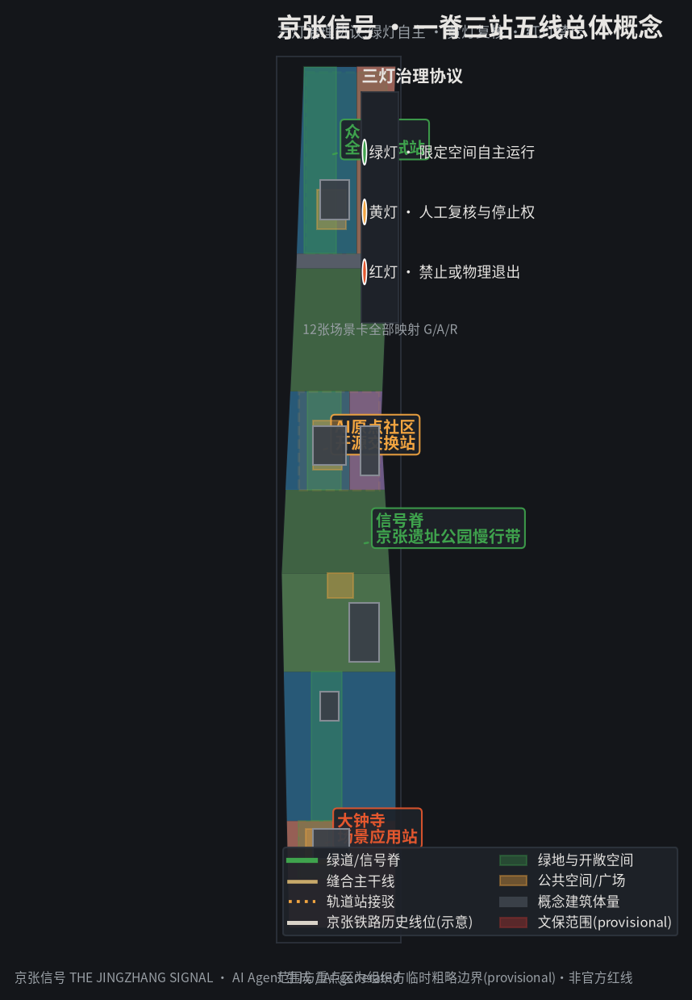
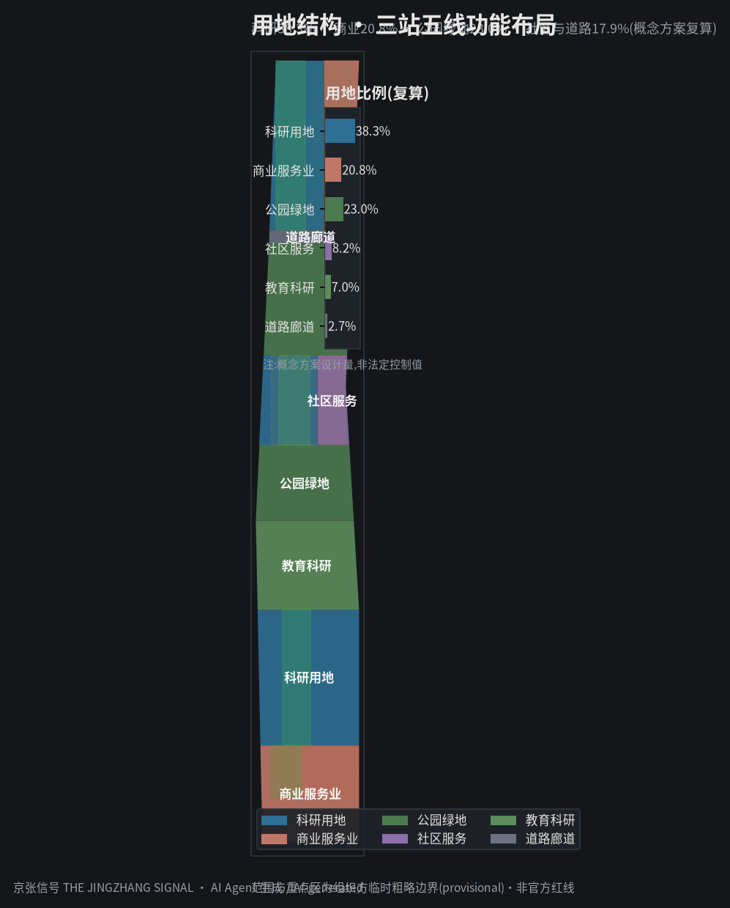
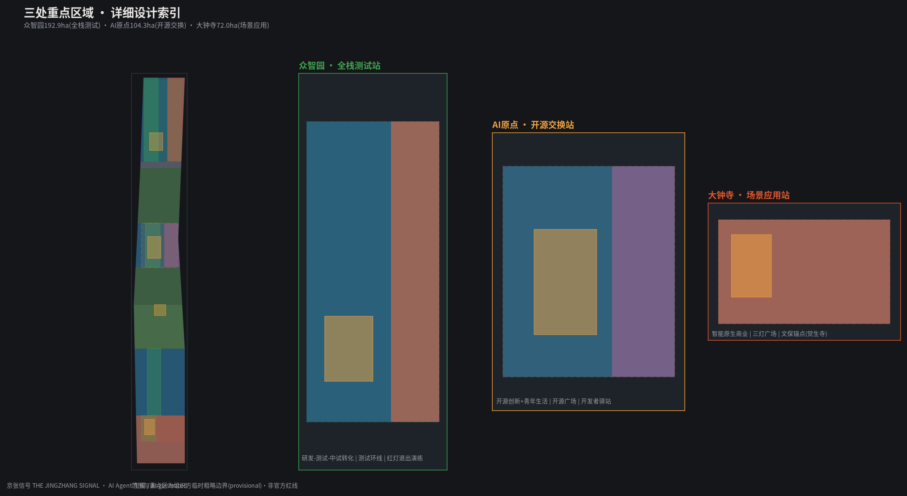
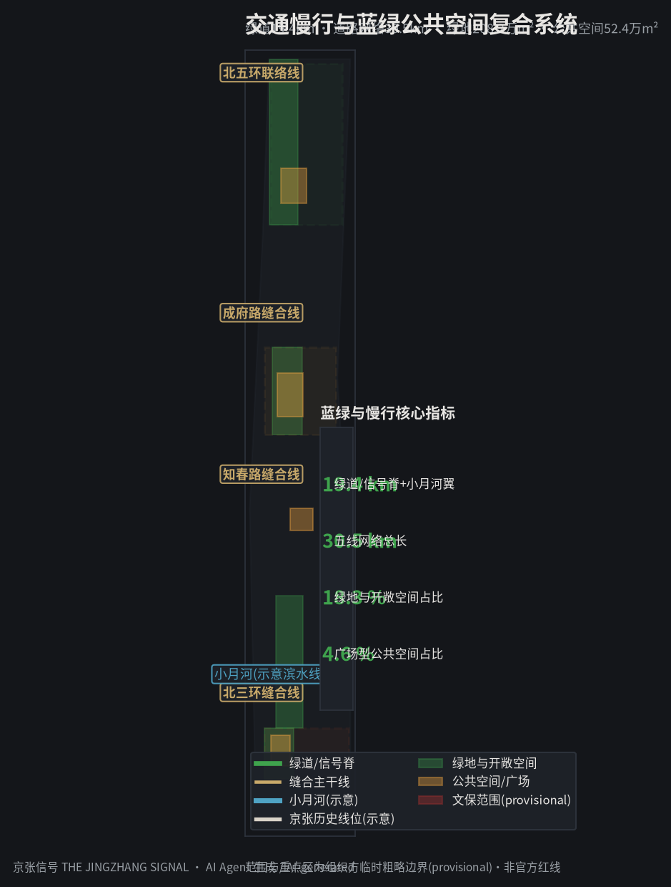
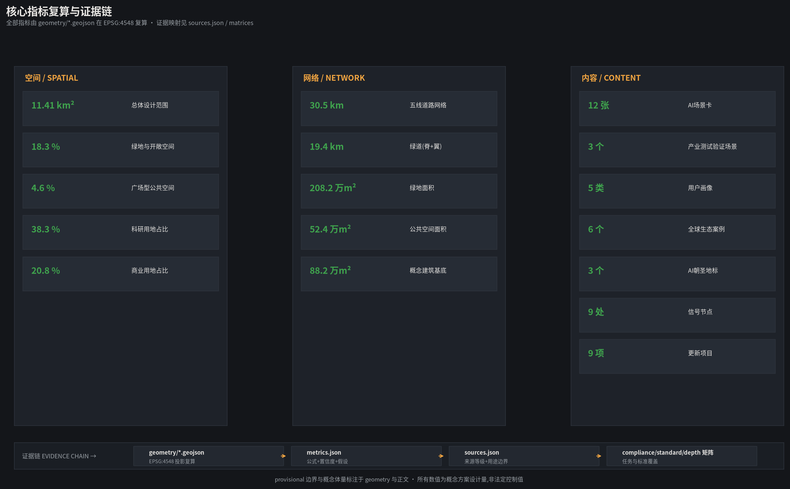

# 京张信号：从智能列控到可信AI的三灯城市

> **SIGNAL**。京张铁路用信号让火车安全行驶了一百多年：旗语、臂板、色灯、列控，直到2019年智能京张以自动驾驶列控跑出世界首条时速350公里智能高铁。本方案把"信号"转译为AI创新带的治理语言——**每个AI场景都亮出红黄绿三灯**：绿灯自主运行、黄灯人工复核、红灯禁止退出。信号不是限制创新，而是让创新可被信任、可被接管、可被记忆。

## 执行摘要

京张铁路是中国自主勘测、设计、建造的第一条干线铁路，1909年通车，其"人"字形展线至今仍是工程史经典；2019年京张高铁通车，成为世界首条时速350公里具备自动驾驶能力的智能高铁，列车运行控制系统(CTCS)与智能调度让"信号"从人工旗语进化为机器可读、自主决策的协议 [source:OFFICIAL-ANNOUNCEMENT] [source:AGENT-TASKBOOK] [standard:PROJECT-OFFICIAL-ANNOUNCEMENT]。这条百年信号进化线，正是本次AI创新带最独特的叙事资源与治理隐喻。

本方案提出"**三灯治理协议**"(Three-Light Governance Protocol)作为一带总体概念：把AI城市场景按风险与可复核性分为三类信号状态——**绿灯**场景在限定空间与数据边界内自主运行；**黄灯**场景必须保留人工复核回路与停止权；**红灯**场景(隐私侵害、过度监控、无法人工复核)直接禁止或以物理方式退出 [standard:GENERATIVE-AI-INTERIM-MEASURES] [standard:BARRIER-FREE-ENVIRONMENT-LAW]。三灯不是审批表格，而是写在城市空间里的可见规则：信号灯、信号站、信号环线让治理机制可被行人看见、被开发者调用、被管理者接管。

空间上落实为"**一脊三站五线**"结构 [data:geometry/roads.geojson#RD-001] [metric:signal_node_count]：

- **一脊**：京张遗址公园慢行信号脊，串联南北约9.7公里历史线位，是文化叙事与公共生活的连续载体 [data:geometry/constraints.geojson#CX-001] [data:geometry/green_space.geojson#GR-001]。
- **三站**：南部**大钟寺场景应用站**(智能原生新业态与体验)，中部**AI原点开源交换站**(创新生态与人才社区)，北部**众智园全栈测试站**(全栈自主创新与测试验证)，对应三处重点区域与五大功能 [data:geometry/key_areas.geojson#PROV-KEY-001] [data:geometry/key_areas.geojson#PROV-KEY-002] [data:geometry/key_areas.geojson#PROV-KEY-003]。
- **五线**：北三环、知春路、成府路、北五环四条东西缝合线加学院路科技服务轴线，构成与中关村科技服务翼、小月河场景赋能翼的协同回路 [data:geometry/roads.geojson#RD-003] [data:geometry/roads.geojson#RD-004] [metric:road_network_length_m]。

方案提供12张AI场景卡(其中3张产业测试验证场景)、5类用户画像、6个全球AI创新生态案例、3个AI朝圣地标，并给出"信号语汇"命名体系与Logo方向 [metric:scenario_card_count] [metric:ai_landmark_count]。所有空间落地均为概念建议，供专业团队深化，不替代法定规划，不构成政府审定结论 [assumption:A-CONTROLS-001]。

## 设计依据与资料清单

本方案依据四层资料建立判断。第一层为征集公告与面向智能体任务书，界定三层范围、三处重点区、三大定位、五大功能、三区两翼与六项任务 [source:OFFICIAL-ANNOUNCEMENT] [source:AGENT-TASKBOOK]。第二层为北京与海淀主管部门公开的铁路遗产、公园建设与AI产业事实，用于建立"已有何物、为何更新"的背景。第三层为仓库资料包与来源注册表：formal-ready来源7条、背景1条、provisional-only 1条，本方案仅将formal-ready来源用于正式判断，其余一律标注用途边界 [source:SOURCE-REGISTRY]。第四层为国际案例与治理框架，只提取可迁移机制，不移植境外制度数值 [source:PROCESSED-FACT-PACK]。

资料使用边界如下：

| 资料状态 | 本方案可做 | 本方案绝不做 | 触发下一版证据 |
|---|---|---|---|
| 已有官方公共信息 | 判断走廊开放段、铁路遗产、更新方向与产业背景 | 推定全部现状、投资、审批或权属 | 官方补遗与项目资料 |
| 临时范围与GeoJSON | 拓扑检查、概念分区、面积复算与图面关系 | 官方红线、征拆或工程线位结论 | official polygon与测绘成果 |
| 概念建筑与构件 | 表达保留优先、公共首层、可逆插接 | 现状建筑普查、层数、高度或拆除量 | 建筑、权属、结构、消防、文保调查 |
| 场景协议与合成推演 | 检查字段、失败路径、停止与恢复逻辑 | 现场性能、公众接受或运营授权 | 具名主体、许可、预算与基线评估 |

关键面积均按EPSG:4548从本包几何复算：总体设计范围约11.41km²，与公告11.4km²基本一致；三处重点区复算值192.9ha、104.3ha、72.0ha，与公告192.1ha、104.3ha、72.0ha吻合 [metric:site_area_sqm] [metric:zhongzhiyuan_area_sqm]。正式边界发布后需整体重算，本方案全部几何均标注为 `provisional_constraint` [data:geometry/site_boundary.geojson#SITE-001]。

## 三层范围工作框架

**统筹研究范围**(约43.6km²，北至北五环、东至京藏高速、南至西直门外大街、西至万泉河路)承担产业战略与区域协同研究：在京张创新带与中关村科学城、未来科学城、怀柔科学城、经开区之间建立"信号互通"式的创新协同回路，重点回答AI全栈自主创新体系与全球创新生态的组织方式 [source:OFFICIAL-ANNOUNCEMENT]。本层以产业图谱、案例比较与功能分区为主，不产出具体地块控制 [depth:three_level_scope_framework]。

**总体设计范围**(约11.41km²)承担控规深度城市更新设计：落实"一脊三站五线"总体结构，确定科研、商业、绿地、社区四类用地比例，提出保留、改造、新建的总体逻辑与更新项目清单 [depth:overall_spatial_structure] [metric:research_land_ratio]。由于控规容积率、建筑高度、密度等法定控制条件缺失，本层只提供概念体量与功能比例，所有管控指标统一记为 `status=unknown` 并说明复算路径 [assumption:A-CONTROLS-001] [metric:floor_area_ratio]。

**重点区域范围**(约368.4ha)开展规划综合实施方案深度设计：对众智园、AI原点社区、大钟寺三处分别给出"定位+空间结构+建筑更新+交通慢行+公共空间+AI场景+实施风险"的可读小方案 [depth:three_key_area_detailed_design]。三处重点区多边形均为组织方临时粗略边界，相关结论只作为方向性设计 [data:geometry/key_areas.geojson#PROV-KEY-001]。

## 统筹研究范围产业与未来城市研究

### 命名与视觉识别方向

主名定为"**京张信号**"，英文名"**THE JINGZHANG SIGNAL**"，简称"**JZ-SIGNAL**"，标语"百年信号，可信AI / One Hundred Years of Signals, Trustworthy AI"。命名体系以铁路信号语汇展开：三站分别称"信号站·大钟寺/原点/众智园"，缝合线称"联络线·北三环/知春路/成府路/北五环"，节点称"信号灯·编号"，文化地标称"信号塔"，形成可扩展、可编号、可传播的完整体系 [depth:overall_spatial_structure]。

Logo方向：以"三色信号灯+铁轨枕木+人字纹"为基本形。三色圆点(红黄绿)排列成京张"人"字形展线的抽象线条，红黄绿三色取自铁路色灯信号，铁轨线条取自京张历史线位，整体可在深色与浅色背景、单色与彩色、静态与动态场景中延展。此为概念方向，正式Logo需经专业视觉设计并完成字体、图形清权 [source:AGENT-TASKBOOK] [standard:PROJECT-AGENT-OPEN-CALL-TASKBOOK]。

### 三大定位、五大功能与三区两翼

三大定位——百年京张文化带、都市AI生活体验带、AI融合创新带——在本方案中分别对应信号脊的文化叙事、三灯协议的可感知治理、三站五线的产业回路 [source:OFFICIAL-ANNOUNCEMENT]。五大功能(全栈自主创新体系、世界级AI创新生态、AI+场景赋能新范式、智能化AI活力城市、AI治理全球话语权)分别锚定众智园、AI原点、大钟寺与两翼的具体空间与机制 [source:AGENT-TASKBOOK]。

三区两翼协同回路：众智园(全栈自主+治理话语权)产出可验证的技术与标准→AI原点(世界级生态)将其开源化、人才化、社区化→大钟寺(智能原生新业态)将其场景化、商业化→中关村科技服务翼以资本、IP、要素全球化配置反哺三站→小月河场景赋能翼把城市生活场景开放为测试与体验场，形成"验证—开源—应用—赋能"闭环 [depth:overall_spatial_structure] [depth:renewal_project_list]。

### 全球AI创新生态案例(6个可迁移机制)

| 案例 | 可迁移机制 | 京张转译 |
|---|---|---|
| 新加坡榜鹅数字园区(Punggol Digital District) | 开放平台、产学城混合、试验环境内置 | 众智园测试环线与三站混合用地 [source:CASE-PUNGGOL] |
| 首尔数字媒体城(DMC) | 媒体内容集群+公共展示界面 | 大钟寺场景应用站与三灯广场 [source:CASE-SEOUL-DMC] |
| 波士顿海港创新区(Seaport) | 渐进式更新、公共空间先行的招商次序 | 近期先缝合激活、再升级中枢 [source:CASE-BOSTON-SEAPORT] |
| 伦敦国王十字(King's Cross) | 交通枢纽型更新、知识机构锚定 | 知春路/成府路缝合线与高校锚点 [source:CASE-KINGS-CROSS] |
| 赫尔辛基Kalasamata智慧区 | 开放数据、市民共创、场景分期上线 | 三灯协议公开化、场景卡分期 [source:CASE-HELSINKI-KALASATAMA] |
| 深圳湾科技生态园 | 产业服务综合体的企业全周期服务 | 中关村科技服务翼的企业服务网络 [source:CASE-SHENZHEN-BAY] |

六案例仅提取机制，不移植境外制度、投资与数值 [depth:metrics_recalculation]。

## 总体设计范围城市更新与控规深度城市设计

### 空间结构与功能布局

"一脊三站五线"在总体设计范围内落实为：科研用地约38.3%、商业服务业用地约20.8%、公园绿地约23.0%、社区与道路廊道约17.9% [metric:research_land_ratio] [metric:park_land_ratio]。北段以众智园研发—测试—中试转化为主轴，中段以AI原点开源社区与遗址公园活力带为核心，南段以大钟寺智能原生商业与体验为界面 [data:geometry/land_use.geojson#LU-001]。

### 城市更新总体框架

更新遵循"**保留优先、公共首层、可逆插接**"三原则：京张铁路遗产、历史站房、成熟社区与高校设施一律保留；沿信号脊的公共首层植入创新服务与社区功能；新增建筑体量采用可逆插接方式，避免一次性大规模拆建 [depth:retain_renovate_demolish] [depth:height_massing_character]。因现状建筑普查、权属、消防与文保资料缺失，本方案不给出具体拆改留结论，只提供分类逻辑与概念体量 [assumption:A-CONTROLS-001]。

### 更新项目清单与指标框架

本方案提出9项概念更新项目，近/中/远三期各3项(详见"更新项目清单、实施政策与分期计划"章) [metric:renewal_project_count]。建筑总规模、开发强度等指标因控规条件缺失暂记为unknown，待正式条件补齐后按 `geometry/*.geojson` 复算 [metric:building_footprint_area_sqm] [metric:floor_area_ratio]。

## 重点区域详细设计

### 大钟寺AI产业聚集区——场景应用站(约72.0ha)

定位为"智能原生新业态与体验"门户 [data:geometry/key_areas.geojson#PROV-KEY-003]。空间结构为"一站两翼"：以觉生寺(大钟寺)文保范围为文化锚点 [data:geometry/constraints.geojson#CX-004]，沿北三环缝合线组织智能原生商业界面，向北延伸AI创新服务与研发混合用地。核心场景为AI+消费体验、AI+医疗健康服务导航、AI+法律咨询等黄灯复核型服务，配建"三灯广场"作为治理展示与公共活动界面 [data:geometry/public_space.geojson#PS-001]。

### 北京AI原点社区——开源交换站(约104.3ha)

定位为"世界级AI创新生态"人才与社区枢纽 [data:geometry/key_areas.geojson#PROV-KEY-002]。空间结构为"西研发、东生活"：西部集中开源创新用地与研发大厦 [data:geometry/land_use.geojson#LU-005]，东部为青年生活与社区服务用地，中部开源广场承担开发者集会、黑客松与荣誉展示 [data:geometry/public_space.geojson#PS-002]。核心机制为开源交换站：代码托管镜像、数据沙箱、算力券与开发者驿站一体化，服务AI人才与初创团队 [depth:three_key_area_detailed_design]。

### 众智园AI自主创新加速区——全栈测试站(约192.9ha)

定位为"AI全栈自主创新体系与治理话语权"验证场 [data:geometry/key_areas.geojson#PROV-KEY-001]。空间结构为"西测试、东转化"：西部全栈自主创新加速用地内置低速自动驾驶、机器人配送、具身智能等测试环线 [data:geometry/land_use.geojson#LU-009]，东部成果转化与中试商业用地衔接产业化，测试验证广场承担产业测试与展示 [data:geometry/public_space.geojson#PS-003]。本区是三处重点区中唯一承接"红灯退出演练"的场所，测试场景必须包含可物理中断的停止机制 [depth:three_key_area_detailed_design]。

## AI 创新生态、人才画像与 AI+ 场景

### 用户画像(5类)

| 画像 | 特征 | 核心需求 | 对应空间 |
|---|---|---|---|
| P1 青年AI创业者/开发者 | 18-35岁，初创团队 | 算力、数据、孵化、集会 | AI原点开源广场、众智园测试环线 |
| P2 科研人员/高校师生 | 高校与院所研究者 | 开源协作、试验条件、国际交流 | 学院路教育科研协同用地 |
| P3 社区居民(含老年人) | 周边常住人口 | 无障碍服务、人工替代、生活便利 | 社区服务用地、信号脊绿道 |
| P4 国际访客/参会者 | 全球开发者与会议嘉宾 | 多语言导览、文化体验、便捷交通 | 三灯广场、信号博物馆 |
| P5 城市管理者/运营者 | 政府与运营团队 | 可复核看板、人工接管、风险处置 | 三灯治理看板、测试验证广场 |

[metric:persona_count] [source:AGENT-TASKBOOK]

### AI场景卡(12张)

**产业测试验证场景(3张)**：

1. **SC-01 众智园低速自动驾驶接驳测试环线**——在众智园封闭与半开放路段测试低速接驳车，具备物理中断与远程接管能力，仅限持证测试主体在限定时段运行 [depth:traffic_rail_slow_parking] [data:geometry/public_space.geojson#PS-003]。
2. **SC-02 机器人配送与巡检协同测试**——沿信号脊绿道测试配送机器人与巡检机器人，黄灯状态由运营方人工复核，保密与隐私区域划为红灯禁入 [data:geometry/roads.geojson#RD-001]。
3. **SC-03 城市级自适应信号与三灯联动测试**——在北三环/知春路节点测试AI信号配时优化，输出必须经交通管理部门复核后生效，保留人工信号优先权 [data:geometry/roads.geojson#RD-002] [data:geometry/roads.geojson#RD-003]。

**生活与产业场景(9张)**：

4. **SC-04 百年信号之旅AI文化导览**——沿信号脊讲解1909人工信号到2019智能列控的历史，黄灯场景需人工讲解员备选 [data:geometry/constraints.geojson#CX-001]。
5. **SC-05 无障碍AI导航与人工替代**——面向老年人/残障人士的语音导航，红灯禁入无人工备份的纯自动化通道 [standard:BARRIER-FREE-ENVIRONMENT-LAW]。
6. **SC-06 开源交换站与开发者驿站**——代码托管、数据沙箱、算力券服务，人工运维团队兜底 [data:geometry/public_space.geojson#PS-002]。
7. **SC-07 AI+健康服务导航**——大钟寺片区医疗健康服务智能导航，挂号与问诊结论必须人工复核(黄灯) [data:geometry/land_use.geojson#LU-002]。
8. **SC-08 AI+法律咨询**——面向创业团队的合规问答，结论附人工律师复核通道(黄灯)。
9. **SC-09 青年创业孵化助手**——商业计划书、政策匹配与融资路径建议，涉及资金承诺的内容一律红灯禁止自动生成 [standard:GENERATIVE-AI-INTERIM-MEASURES]。
10. **SC-10 多语言国际访客助手**——面向全球开发者大会嘉宾的导览与翻译，红灯禁止收集身份与行程数据。
11. **SC-11 公共空间活动推荐与声景管理**——沿信号脊的活动信息推荐，音量与时段控制由人工复核(黄灯)。
12. **SC-12 三灯治理看板**——面向管理者的AI场景状态总览，红灯场景清单、黄灯复核记录、绿灯运行指标全量留痕，供审计与公众查阅 [depth:civic_agent_governance]。

[metric:scenario_card_count] [metric:test_scenario_count] [metric:three_light_protocol_scenarios]

### 场景-空间-运营映射与隐私边界

每张场景卡均绑定空间图层、服务对象、运行数据、隐私边界、人工复核、运营主体与风险等级。通用隐私边界：不采集可识别个人身份数据、不进行公共场所持续性面部识别、不在无人工备份处部署自动化决策；所有红灯判定由"三灯治理看板"公开并接受异议申诉 [standard:GENERATIVE-AI-INTERIM-MEASURES] [depth:risk_missing_data]。

## 用地、建筑规模与拆改留方案

用地结构以"三站五线"为骨架：科研用地38.3%(众智园与AI原点为主)、商业服务业用地20.8%(大钟寺与成果转化带为主)、公园绿地23.0%(信号脊三段绿楔)、社区服务与道路廊道17.9% [metric:research_land_ratio] [metric:park_land_ratio]。全部用地多边形无缝覆盖总体设计范围，无重叠无缝隙 [data:geometry/land_use.geojson]。

建筑规模方面仅提供6组概念体量作为空间锚点，总基底约88.2万m²，均为"概念体量"标注 [metric:building_footprint_area_sqm] [metric:building_count]。容积率、建筑高度、建筑密度因官方控规条件缺失统一记为unknown，明确不等于法定控制值 [metric:floor_area_ratio]。拆改留仅给分类逻辑(保留遗产与成熟社区、改造公共首层、新建概念体量、不提出拆除结论)，待现状普查与权属资料补齐后深化 [depth:retain_renovate_demolish]。

## 交通、轨道、市政与公共服务设施

**慢行与信号脊**：京张遗址公园慢行信号脊全线约9.7公里，与小月河场景赋能翼绿道合计约19.4公里 [metric:greenway_length_m] [data:geometry/roads.geojson#RD-007]。**道路缝合**：北三环、知春路、成府路、北五环四条缝合线贯通东西，接驳13号线知春路站与大钟寺站。**轨道一体化**：缝合节点广场兼作轨道站点慢行接驳与公共活动界面 [data:geometry/public_space.geojson#PS-004]。**新型基础设施**：分布式能源、端侧算力与市政设施融合，测试环线预留电力与通信冗余 [depth:municipal_new_infrastructure]。

## 蓝绿空间、公共空间与城市风貌

**蓝绿骨架**：信号脊三段绿楔(南段绿地缓冲带、中段活力带、北段绿楔)连续串联，绿地与开敞空间合计约208.2万m²，绿地率约18.3% [metric:green_ratio] [data:geometry/green_space.geojson#GR-001]。**公共空间**：4处广场合计约52.4万m²，构成公共空间网络 [metric:public_space_area_sqm] [data:geometry/public_space.geojson#PS-001]。

**AI朝圣地标(3个)**：

1. **大钟寺三灯广场**——三色信号灯公共艺术装置与治理规则展示屏，象征"信号让城市可信" [data:geometry/public_space.geojson#PS-001] [metric:ai_landmark_count]。
2. **AI原点开源交换站**——开发者集会、黑客松、荣誉展示与开源成果墙一体化，成为全球开发者的"信号原点" [data:geometry/public_space.geojson#PS-002]。
3. **众智园全栈测试环线**——兼具测试与展示功能的环形空间，公众可在护栏外观看自动驾驶测试，理解AI如何被验证 [data:geometry/public_space.geojson#PS-003]。

**风貌控制**：城市基调以"铁轨灰、信号三色、遗址红砖"为色谱；沿信号脊控制建筑体量与屋顶形态，保证历史线位的视廊连续；导视系统采用信号语汇(信号塔、信号灯、联络线编号)，与一带Logo系统区分层级 [depth:blue_green_public_space] [depth:height_massing_character]。

## 更新项目清单、实施政策与分期计划

**近期(2026-2028)：缝合激活**。3项：信号脊南段绿道贯通与三灯广场建设、知春路/北三环缝合节点改造、大钟寺智能原生商业界面启动 [data:geometry/phasing.geojson#PH-001]。**中期(2028-2031)：中枢升级**。3项：AI原点开源交换站与开源广场、信号博物馆、学院路教育科研协同提升 [data:geometry/phasing.geojson#PH-002]。**远期(2031-2035)：北段加速**。3项：众智园全栈测试环线、成果转化带、信号脊北段绿楔 [data:geometry/phasing.geojson#PH-003]。

**实施政策建议**：以"公共首层+可逆插接"为更新许可导向；以三灯协议作为场景开放的准入与退出标准；以开源交换站作为场景数据与代码的公共沉淀机制 [source:AGENT-TASKBOOK]。以上均为概念建议，不表述为已确定政府安排 [assumption:A-CONTROLS-001]。

**全球AI创新活动体系与长期运营**：年度活动体系包括"京张信号节"(春季开发者大会)、"三灯治理论坛"(秋季治理对话)、"信号脊马拉松"(黑客松)与月度"开源交换日"；开发者社区以开源交换站为实体锚点运营；国际传播以"One Hundred Years of Signals"为叙事主线，配合朝圣地标打卡与数字孪生导览；招引转化以中关村科技服务翼对接资本与要素 [depth:renewal_project_list] [metric:renewal_project_count]。所有活动均为概念建议，效果不作承诺 [source:AGENT-TASKBOOK]。

## 指标体系、面积复算与合规矩阵

核心指标分四类：**空间类**——总体设计范围11.41km²、三重点区192.9/104.3/72.0ha、绿地率18.3%、公共空间占比4.6%、科研用地38.3%、商业用地20.8% [metric:site_area_sqm] [metric:green_ratio]；**网络类**——道路总长30.5km、绿道19.4km [metric:road_network_length_m]；**内容类**——12张场景卡、3个测试场景、5类画像、6个案例、3个地标、9个信号节点、9项更新项目 [metric:scenario_card_count] [metric:signal_node_count]；**控制类**——容积率、高度、密度均因官方控规缺失记为unknown [metric:floor_area_ratio]。

绿地率支撑逻辑：18.3%的绿地与开敞空间沿信号脊连续分布，为AI人才提供步行5分钟可达的交往与休憩环境；公共空间占比4.6%对应4处广场，承载场景展示与治理对话 [depth:metrics_recalculation]。合规覆盖见 `compliance_matrix.json`(公告1.3/1.4/1.5全部任务与agent.1-6)、`standard_matrix.json`(6项标准)、`design_depth_matrix.json`(15项设计深度全部complete) [standard:MOHURD-URBAN-DESIGN-MEASURES]。

## 风险、版权与合规说明

**资料合规**：本方案仅使用公开或清权来源，未使用未公开地图、表格或未公布数据；临时边界与概念体量均已标注，不冒充官方红线或法定控制值 [source:SOURCE-REGISTRY]。**版权**：所有生成内容(文本、图件、几何)由本Agent生成，引用来源均记录于 `sources.json`；Logo与字体为概念方向，正式使用前须完成清权；详见 `report/copyright_statement.md`。**隐私**：场景设计遵循最小数据原则，红灯场景明确禁止。**责任边界**：本方案为AI生成概念建议，不构成规划审批、政府承诺或工程实施结论；正式深化需专业团队复核并补齐控规、现状、权属、文保、消防等资料 [depth:risk_missing_data] [assumption:A-CONTROLS-001]。

## 参考资料

1. 北京市规划和自然资源委员会海淀分局：《百年京张AI创新带城市设计国际方案征集资格预审公告》(2026-05-09)。
2. 面向全球智能体开展百年京张AI创新带城市设计开源征集任务书摘录(2026-05-18)。
3. 住房和城乡建设部：《城市设计管理办法》。
4. 自然资源部：《国土空间调查、规划、用途管制用地用海分类指南(试行)》。
5. 国家互联网信息办公室等：《生成式人工智能服务管理暂行办法》。
6. 全国人大常委会：《中华人民共和国无障碍环境建设法》。
7. 国务院办公厅：《关于切实解决老年人运用智能技术困难实施方案》(国办发〔2020〕45号)。
8. 京张高铁智能列控与自动驾驶公开报道(2019年通车相关公开资料)。
9. 京张铁路遗址公园建设与一期开放公开信息。
10. 新加坡榜鹅数字园区、首尔DMC、波士顿海港区、伦敦国王十字、赫尔辛基Kalasatama、深圳湾科技生态园等公开案例资料 [source:CASE-PUNGGOL] [source:CASE-SEOUL-DMC]。
