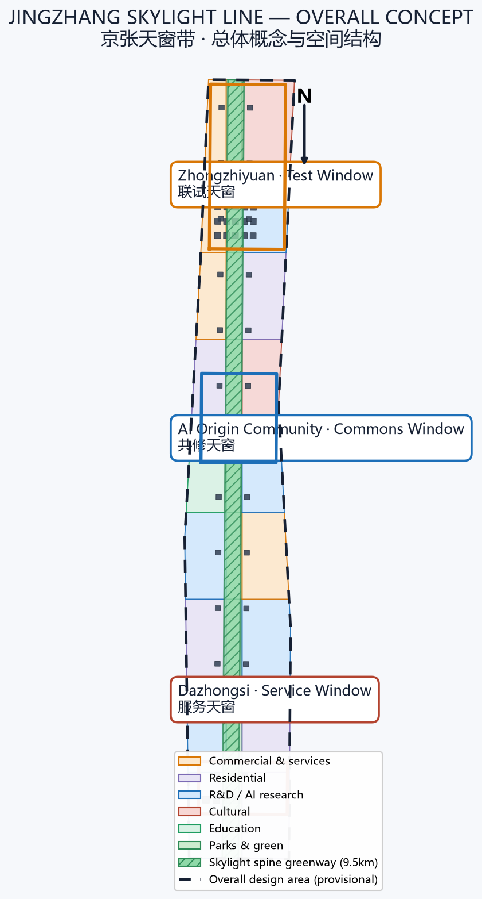
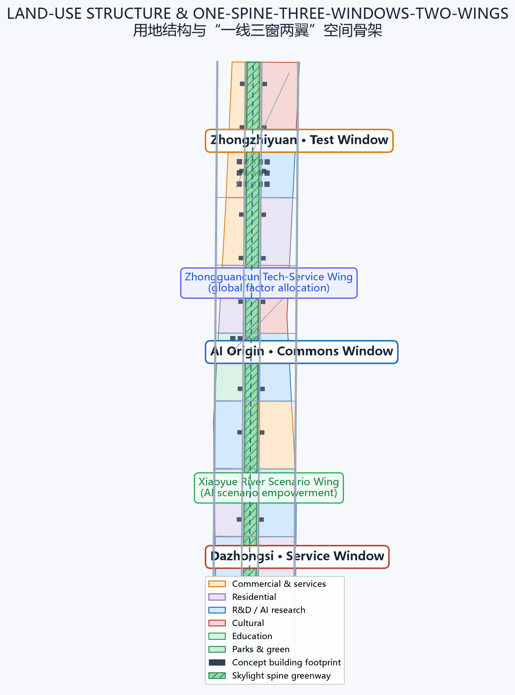
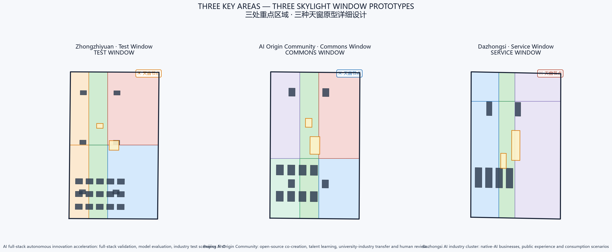
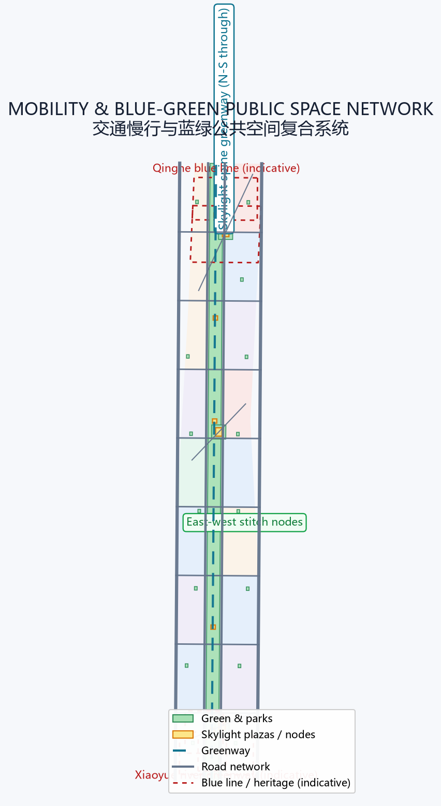
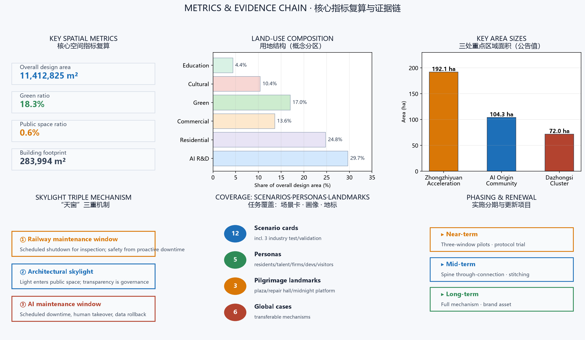

# JINGZHANG SKYLIGHT LINE / 京张天窗带

> **Trade the obsession with "always online" for the confidence of "able to stop".** A century of the Jing-Zhang Railway taught cities one thing: safety does not come from equipment that never stops, but from maintenance that never skips a beat. As AI enters urban public space, this proposal translates the railway's century-old "sky light" (maintenance window) institution - scheduled shutdown, inspection, and restoration - into expected, take-over-able, and rollback-able maintenance windows for every class of AI service. The belt becomes both a showcase of the global AI industry and a public laboratory for how AI responsibly enters the city.

## Executive Summary

The Jing-Zhang Railway was the first trunk railway designed and built independently by China. When it opened in 1909, its famous zigzag (人字形) alignment conquered the Guanguo grade; more than a century later, its heritage corridor is being rewritten as a roughly 9 km urban green corridor and AI innovation belt [source:SRC-2026-BJ-GH-QUAL-PREANNOUNCEMENT]. Public attention often asks "where is AI installed?" This proposal asks a deeper question: **when an AI service needs repair, upgrade, correction, or retirement, has the city reserved the time, space, and institution for it?** The answer is to bring the railway's century-old "sky light" institution into AI city governance.

In railway practice, the "sky light" (天窗) is the scheduled no-traffic window reserved for track and equipment maintenance - the cornerstone of railway safety: stop periodically so the line can run for the long term [source:SRC-2026-BJ-KW-THREE-AREAS-WINGS]. This proposal translates the institution in three ways - **railway maintenance window** (inspection discipline), **architectural skylight** (light entering public space), and **AI maintenance window** (model downtime, human takeover, data rollback) - to form the "Jingzhang Skylight Line": a north-south skylight spine greenway, three key areas each hosting one window prototype (Test / Commons / Service), and two wings forming a loop of factors and scenarios.

The spatial skeleton is "**one spine, three windows, two wings**" [data:geometry/land_use.geojson#LU-001] [data:geometry/green_space.geojson#GREEN-001]: the skylight spine is a roughly 9.5 km, ~200 m wide north-south park greenway connecting three key areas and twelve skylight activity nodes [metric:skylight_spine_length_m]. The three key areas follow the announced polygons - Zhongzhiyuan (~192 ha), AI Origin Community (~104 ha), Dazhongsi (~72 ha) [metric:zhongzhiyuan_area_sqm] [metric:ai_origin_community_area_sqm] [metric:dazhongsi_area_sqm] - hosting full-stack validation, open-source co-creation, and native-AI business respectively. The two wings connect Zhongguancun factor allocation and the Xiaoyue River scenario empowerment into the spine. All spatial conclusions are concept suggestions on provisional boundaries, subject to professional deepening [data:geometry/site_boundary.geojson#SITE-001] [assumption:A-BOUNDARY-001].

On governance, the proposal introduces the "**Skylight Protocol**": any AI scenario entering the belt must declare, before launch, its operating hours, maintenance windows, human takeover plan, data rollback path, and retirement conditions, with green/yellow/red window status made public [metric:skylight_window_count]. Of the 12 AI scenario cards, at least 3 are industry test/validation scenarios covering road mobility, public services, and enterprise services; 5 personas from residents, commuters, developers, enterprises, to visitors ensure public interest first [metric:scenario_card_count] [metric:persona_count]. Three AI pilgrimage landmarks - Skylight Plaza, Maintenance Memory Hall, and Midnight Platform - turn "letting AI stop" into a visitable, participatory, memorable public ritual [metric:pilgrimage_landmark_count].

Implementation proceeds in three steps: near-term pilots of "Test/Commons/Service" windows in the three key areas to verify the protocol and operations; mid-term through-connection of the skylight spine slow-traffic system and east-west stitching; long-term sedimentation of the window mechanism into a lasting brand and governance asset [data:geometry/phasing.geojson#PHASE-002] [data:geometry/phasing.geojson#PHASE-005] [data:geometry/phasing.geojson#PHASE-001]. This is not an "anti-AI" proposal: it gives enterprises a verifiable launch certificate, citizens an expected downtime guarantee, and the city rollback resilience in governance.

## Design Basis and Source Inventory

The proposal is organized on four layers of materials: first, the qualification pre-announcement defining the three scopes, tasks, and deliverable depth [source:SRC-2026-BJ-GH-QUAL-PREANNOUNCEMENT]; second, the agent open-call taskbook defining the three positions, five functions, three areas and two wings, and six agent tasks [source:SRC-2026-0518-AGENT-OPEN-CALL-TASKBOOK]; third, the repository site package enumerations, metrics, source registry, and provisional geometry [source:SRC-PROVISIONAL-BOUNDARIES-2026]; fourth, public policies and international cases from which only transferable mechanisms are extracted, without transplanting specific values or institutions [standard:PROJECT-OFFICIAL-ANNOUNCEMENT] [standard:PROJECT-AGENT-OPEN-CALL-TASKBOOK].

| Data status | This proposal may | This proposal never | Pending data |
|---|---|---|---|
| Official announcement & taskbook | Define scope, tasks, depth, language | Fabricate official redlines or approvals | Official addenda |
| Provisional boundary (11.4 km²) | Concept zoning, metric recomputation, visual discussion | Serve as official redline or precise-area basis | Official polygon |
| Regulatory/ownership/utility conditions | Express conceptual controls and pending lists | Give statutory FAR, height, or demolish/retain conclusions | Official regulatory plan, ownership, engineering data |
| International cases & AI frameworks | Extract transferable mechanisms | Treat foreign values or institutions as Beijing standards | Local professional review |

Source-use boundaries follow `data/source_registry.json`: formal-ready sources support formal judgments; background/provisional materials serve only as context or temporary generation [source:SRC-2026-BJ-KW-THREE-AREAS-WINGS]. Complete indexes of sources, assumptions, metrics, standards, and design depth live in `sources.json`, `assumptions.json`, `metrics.json`, `standard_matrix.json`, and `design_depth_matrix.json`; the narrative cites only at key judgments and does not duplicate machine indexes [depth:three_level_scope_framework].

This proposal currently uses the repository-provided provisional rough boundary (SITE-001) and three provisional key-area polygons [data:geometry/site_boundary.geojson#SITE-001] [data:geometry/key_areas.geojson#PROV-KEY-001]. That temporary geometry serves only generation, self-check, and display; it must not be treated as an official redline, approval basis, or precise-area foundation [assumption:A-BOUNDARY-001]. Organizer data gaps do not block content scoring; all layers and metrics will be recomputed once official polygons arrive. The proposal claims no FAR, building height, demolish/retain, or engineering conclusions; related control metrics are registered as `status=unknown` with a recomputation path [standard:MOHURD-CONTROL-DETAILED-PLANNING] [standard:MNR-LAND-USE-CLASSIFICATION-GUIDE].

## Three-Level Scope Framework

The announcement and taskbook jointly define three progressive levels [source:SRC-2026-BJ-GH-QUAL-PREANNOUNCEMENT] [source:SRC-2026-0518-AGENT-OPEN-CALL-TASKBOOK]:

- **Coordinated research area (43.6 km²)**: bounded by the North 5th Ring Road, Jingzang Expressway, Xizhimen Outer Street, and Wanquanhe Road. Here the proposal answers how a world-class AI innovation ecosystem is organized, how the three areas and two wings collaborate, and how centennial Jing-Zhang culture becomes a future-city narrative [depth:three_level_scope_framework].
- **Overall design area (11.4 km²)**: the urban and industrial areas 1-2 km around the Jing-Zhang Heritage Park. Here the "one spine, three windows, two wings" structure, land-use zoning, mobility, blue-green public space, renewal projects, and phasing are implemented [metric:site_area_sqm] [depth:overall_spatial_structure].
- **Key detailed-design area (368.4 ha)**: from north to south, Zhongzhiyuan, AI Origin Community, and Dazhongsi. Here detailed design makes each window prototype concrete in space and operation [metric:key_area_count] [depth:key_area_detailed_design].

The three levels are not three unrelated drawings but a transmission chain of one "sky light logic": the coordinated level answers how the AI ecosystem is governed; the overall level answers how governance lands in space; the key-area level answers how space is operated. Every level obeys the same acceptance sentence: **the city remains usable without AI; what AI adds; who is responsible for scheduled shutdown and inspection; who takes over during downtime; how data rolls back.**

## Coordinated Research Area: Industry and Future-City Research

### Naming and Visual Identity Direction

The primary name is proposed as "**京张天窗带 / JINGZHANG SKYLIGHT LINE**", with the English name emphasizing the double meaning of "skylight" - an architectural light aperture and a maintenance/management "window". The naming system has three layers [source:SRC-2026-0518-AGENT-OPEN-CALL-TASKBOOK]:

- Belt level: JINGZHANG SKYLIGHT LINE, the unified carrier of the centennial heritage belt, the urban AI living-experience belt, and the AI-integrated innovation belt;
- Window prototypes: Test Window (联试天窗), Commons Window (共修天窗), Service Window (服务天窗), mapped to the three key areas;
- Civic components: Skylight Plaza (天窗广场), Maintenance Memory Hall (检修记忆馆), Midnight Platform (零点站台) and other scenario-based names.

The logo direction uses "an opening skylight" as the motif: an upward-opening trapezoidal window frame and a horizontal rail line form a "window × rail" composite symbol, expressing "let light in, let tracks extend"; supported by a tricolor system of "maintenance green / rail steel-blue / signal yellow" forming an extendable visual identity and wayfinding language. All fonts, graphics, and marks are original concepts; no protected existing marks are used [agent.1].

### Three Positions and Five Functions

| Three positions | This proposal's translation | Five-function anchor |
|---|---|---|
| Centennial Jing-Zhang heritage belt | From "self-built" to "self-maintained" cultural continuity | Global voice in AI governance |
| Urban AI living-experience belt | Daily experience where AI can stop, be taken over, and roll back | Intelligent vibrant AI city |
| AI-integrated innovation belt | The Skylight Protocol as industry test and scenario-open mechanism | Full-stack autonomous innovation, world-class ecosystem, AI+ scenario paradigm |

Three-areas-two-wings loop: Zhongzhiyuan (full-stack autonomy + governance voice) → AI Origin Community (world-class innovation ecosystem) → Dazhongsi (native-AI businesses), while the Zhongguancun Tech-Service Wing (global factor allocation, IP and capital empowerment) and the Xiaoyue River Scenario Wing (scenario opening and vibrant city) connect into the spine, forming a closed loop of "source innovation - factor services - scenario validation - business landing" [source:SRC-2026-0518-AGENT-OPEN-CALL-TASKBOOK].

### Global AI Innovation Ecosystem Cases (6)

The following cases extract only transferable mechanisms; foreign values or institutions are not transplanted as Beijing standards [agent.2]:

1. **Punggol Digital District, Singapore**: from planning, introduced digital twin + open platform, validating "mechanism first, physical later" - corresponding to this proposal's "protocol before device launch" admission mechanism.
2. **Quayside, Toronto (as revised)**: data-governance and privacy controversy teaches that public-space AI must be explainable and exitable - corresponding to the "data minimization + human takeover" clause.
3. **Barcelona Decidim**: open participatory governance proves "letting citizens see decisions" builds trust - corresponding to public green/yellow/red window status.
4. **Futian, Shenzhen AI + government services**: the "launch - pilot - gray-release - review" flow is a real-world prototype of the Service Window.
5. **Kashiwa-no-ha Smart City, Japan**: a "living laboratory" iterating public scenarios - corresponding to the Test Window validation scenarios.
6. **EU AI Act risk-tiered framework**: risk tiers and human oversight align logically with the Skylight Protocol's green/yellow/red tiers; this proposal adopts only tiered-governance thinking, not EU law.

Full sources and limitations of the cases are registered in `sources.json`; the narrative does not expand machine indexes [source:SRC-2026-BJ-KW-THREE-AREAS-WINGS].

## Overall Design Area: Urban Renewal at Regulatory-Plan Urban-Design Depth

The overall design area is about 11.4 km², currently dominated by universities, research institutes, residential communities, and stock industrial space [metric:site_area_sqm] [source:SRC-2026-HAIDIAN-1X1]. The proposal puts forward a "**one spine, three windows, two wings, twelve nodes, multi-type stitching**" renewal framework:

- **One spine (Skylight Spine)**: based on the Jing-Zhang Heritage Park, forming a ~200 m wide, ~9.5 km long north-south greenway [data:geometry/green_space.geojson#GREEN-001] [metric:skylight_spine_length_m] carrying slow-traffic greenways, activity nodes, and skylight installations.
- **Three windows**: Test, Commons, and Service windows formed around Zhongzhiyuan, AI Origin Community, and Dazhongsi [data:geometry/key_areas.geojson#PROV-KEY-001].
- **Two wings**: the Zhongguancun Tech-Service Wing and the Xiaoyue River Scenario Wing, stitched to the spine via cross links and nodes [data:geometry/roads.geojson#ROAD-001].
- **Twelve nodes**: six public activity nodes along the spine + three key-area skylight plazas + a community pocket-park network [data:geometry/public_space.geojson#PUBLIC-004] [data:geometry/green_space.geojson#GREEN-013].

Land use follows the national land-use classification, forming six dominant categories - research, residential, commercial, cultural, education, and green - fully covering the submitted boundary without gaps or overlaps [data:geometry/land_use.geojson#LU-001] [standard:MNR-LAND-USE-CLASSIFICATION-GUIDE]. Green ratio is about 18.3%, public-space ratio about 0.6%, and building footprint about 28.4 ha [metric:green_ratio] [metric:public_space_ratio] [metric:building_footprint_area_sqm]. These are concept zoning metrics for display and discussion; they must be fully recomputed once official boundaries and regulatory conditions arrive [assumption:A-CONTROLS-001].

Renewal logic follows "retain first, stitch as the base, plug in reversibly": railway heritage, heritage elements, and mature communities are primarily retained; low-efficiency stock space is activated through public space and skylight installations; new AI facilities adopt reversible, demountable "plug-in" units to avoid one-time large-scale demolition [depth:retain_renovate_demolish]. Building height, FAR, setback, and other control metrics are registered as `unknown` where official regulatory plans are absent; this proposal offers only conceptual massing direction, not statutory conclusions [standard:MOHURD-CONTROL-DETAILED-PLANNING] [assumption:A-CONTROLS-001].

## Key-Area Detailed Design

### Zhongzhiyuan AI Autonomous Innovation Acceleration Area (~192 ha) - Test Window

**Position**: a "test yard" for full-stack AI autonomous innovation and industrial test validation [data:geometry/key_areas.geojson#PROV-KEY-001] [metric:zhongzhiyuan_area_sqm].

**Spatial structure**: organized as "test loop + validation field + test plaza". The core hosts AI R&D buildings and incubators with an open "model evaluation field"; the Test Plaza serves as the public interface for full-stack joint testing [data:geometry/public_space.geojson#PUBLIC-001].

**Building renewal**: mainly stock industrial-space conversion plus AI R&D additions, covering AI R&D, labs, incubators, and talent apartments [data:geometry/buildings.geojson#BLDG-001].

**Window mechanism**: the Test Window requires all hosted models to enter scheduled "joint-test downtime" - model updates, safety evaluation, and fault drills all occur in expected windows, with results published in red/yellow/green status [agent.3].

**Implementation risk**: involves stock ownership and industrial replacement; official ownership and regulatory conditions are prerequisites; currently all directional design [assumption:A-CONTROLS-001].

### Beijing AI Origin Community (~104 ha) - Commons Window

**Position**: a "commons yard" for university source innovation, open-source co-creation, and talent growth [data:geometry/key_areas.geojson#PROV-KEY-002] [metric:ai_origin_community_area_sqm].

**Spatial structure**: organized around universities and transit stations as "innovation clusters + community gardens + commons plaza". Education and community-service buildings mix, with the Commons Plaza adjacent to the spine [data:geometry/public_space.geojson#PUBLIC-002].

**Building renewal**: mainly education, community-service, and innovation-office buildings with talent apartments and shared facilities [data:geometry/buildings.geojson#BLDG-016].

**Window mechanism**: the Commons Window emphasizes "human review + open-source maintenance" - developers and citizens jointly participate in inspection, repair, and retrospective of AI services, making maintenance itself a public learning scenario [agent.4].

**Implementation risk**: adjacent to universities and heritage elements, spatial increment is constrained; must be rechecked against heritage and regulatory conditions [data:geometry/constraints.geojson#CONSTRAINT-001] [assumption:A-CONTROLS-001].

### Dazhongsi AI Industry Cluster (~72 ha) - Service Window

**Position**: a "service yard" for native-AI businesses, public experience, and consumption scenarios [data:geometry/key_areas.geojson#PROV-KEY-003] [metric:dazhongsi_area_sqm].

**Spatial structure**: organized as "commercial street + cultural green court + service plaza". Smart commercial clusters and cultural facilities mix, with the Service Plaza as the southern gateway [data:geometry/public_space.geojson#PUBLIC-003].

**Building renewal**: mainly commercial-service, cultural-creative, and AI-application buildings; renewal focuses on function conversion and public-space activation [data:geometry/buildings.geojson#BLDG-031].

**Window mechanism**: the Service Window sets "night/off-peak maintenance" windows for native-AI businesses, preventing public consumption space from being occupied without rest by technology, while providing staffed counters and offline paths [agent.3].

**Implementation risk**: rapid iteration of commercial formats; market demand and operator confirmation are prerequisites; currently conceptual [assumption:A-CONTROLS-001].

## AI Innovation Ecosystem, Talent Profiles, and AI+ Scenarios

### Five Personas

1. **Residents and elders**: care that AI does not disturb daily life; need account-free, offline, staffed service paths.
2. **Commuters and tourists**: need predictable, explainable public AI services (navigation, guide, safety alerts) and the right to know when they are down.
3. **Developers and the open-source community**: need commons windows to participate in inspection, evaluation, and model reproduction.
4. **AI enterprises and innovation teams**: need a verifiable launch process, test scenarios, and factor services.
5. **Operators and public-service staff**: need institutional support for human takeover, rollback, and responsibility definition.

### 12 AI Scenario Cards (incl. 3 industry test/validation scenarios)

| # | Scenario card | Spatial anchor | Skylight protocol point |
|---|---|---|---|
| 1 | **Road slow-traffic AI diagnosis** (test) | Skylight spine greenway | Quarterly downtime calibration, human re-measurement |
| 2 | **Heritage park AI guide** | Spine nodes | Daily late-night window to update content |
| 3 | **Accessible AI navigation** | Plazas / transit connections | Biweekly inspection, offline maps backup |
| 4 | **Enterprise service Copilot** (test) | Zhongzhiyuan enterprise services | Gray release + monthly rollback drill |
| 5 | **Public-safety operations review** (test) | Zhongzhiyuan test plaza | Forced downtime evaluation in Test Window |
| 6 | **Talent life steward** | AI Origin Community | Night window, staffed customer support |
| 7 | **Open-source co-repair desk** | Commons Plaza | Synced with community maintenance calendar |
| 8 | **Native-AI consumption experience** | Dazhongsi Service Plaza | Off-peak maintenance window |
| 9 | **Civic AI status tricolor display** | Spine nodes | Public real-time downtime plan |
| 10 | **Low-carbon compute post** | Zhongzhiyuan / spine | Windowed scheduling of compute load |
| 11 | **Jing-Zhang memory AI curation** | Maintenance Memory Hall | Human review of heritage content |
| 12 | **Global AI event AI assistant** | Midnight Platform / venues | Mandatory downtime retrospective post-event |

Each card maps to spatial layers, served users, operating data, privacy boundaries, human review, operating entities, and risks [agent.3]; data follows minimization, public space is not a default data source, and all AI decisions retain a human-review path [standard:GENERATIVE-AI-INTERIM-MEASURES].

## Land Use, Building Scale, and Retain/Renovate/Demolish

Land use forms six dominant categories fully covering the boundary without gaps [data:geometry/land_use.geojson#LU-001]: research/AI R&D ~29.7%, residential ~24.8%, commercial ~13.6%, parks and green ~17.0%, cultural ~10.4%, education ~4.4%. Building footprint is about 28.4 ha, dominated by AI R&D, education, commercial, and cultural buildings; all are conceptual [metric:building_footprint_area_sqm] [data:geometry/buildings.geojson#BLDG-001].

The retain/renovate/demolish strategy follows "retain first, reversible plug-in" [depth:retain_renovate_demolish]: railway heritage and heritage elements are retained and activated; mature communities are retained with improved public environment; low-efficiency stock space is converted to AI innovation and public functions; new AI facilities use reversible units. Lacking official regulatory plans, building surveys, ownership, and engineering conditions, FAR, building height, density, green ratio, and setbacks are all registered as `unknown`, to be recomputed once formal conditions arrive [assumption:A-CONTROLS-001] [standard:MOHURD-CONTROL-DETAILED-PLANNING].

## Transport, Rail, Municipal, and Public-Service Facilities

- **Roads and slow traffic**: the skylight spine forms a north-south slow-traffic main corridor; flanking arterials carry circulation; cross links stitch east-west [data:geometry/roads.geojson#ROAD-001] [data:geometry/roads.geojson#ROAD-005].
- **Transit connection**: strengthen connections around existing rail stations; plazas reserve bus and slow-traffic transfer interfaces [data:geometry/public_space.geojson#PUBLIC-001].
- **Municipal and new infrastructure**: edge computing, distributed energy, and public data interfaces support AI facilities; conventional municipal works are registered pending official conditions [depth:municipal_new_infrastructure].
- **Public services**: along the spine, configure talent-life, community-service, cultural-display, and emergency-service facilities, targeting walkable service radii [data:geometry/green_space.geojson#GREEN-013].

## Blue-Green Space, Public Space, and Urban Character

The blue-green system takes the skylight spine as its backbone: a ~9.5 km north-south park greenway connecting three key areas and twelve nodes [data:geometry/green_space.geojson#GREEN-001] [metric:skylight_spine_length_m]; the Qinghe blue line to the north and the Xiaoyue River greenway to the south provide lateral stitching [data:geometry/constraints.geojson#CONSTRAINT-003] [data:geometry/constraints.geojson#CONSTRAINT-004]; community pocket parks weave the daily green network [data:geometry/green_space.geojson#GREEN-013].

Public space highlights the "skylight" theme: Skylight Plazas use openable canopy installations to let light in and act as "open-air dashboards" of AI status; the Maintenance Memory Hall exhibits railway maintenance history alongside AI inspection logs; the Midnight Platform holds a "shutdown ceremony" at midnight daily, letting citizens witness AI services being properly closed and restarted [agent.4].

### Three AI Pilgrimage Landmarks

1. **Skylight Plaza** (one in each key area): openable skylight installation + tricolor status screens, a public monument to "letting AI stop".
2. **Maintenance Memory Hall** (AI Origin Community): side-by-side exhibition of Jing-Zhang railway maintenance history and AI inspection logs, symbolizing the continuity of "self-maintenance" culture.
3. **Midnight Platform** (mid-spine node): a daily-midnight shutdown ceremony and "skylight hour" check-in point, turning maintenance institution into a civic ritual [metric:pilgrimage_landmark_count].

Urban character uses "rail gray + maintenance green + signal yellow" as the tone; building massing and interfaces emphasize permeability and accessibility; public art and wayfinding extend the "window × rail" symbol [depth:height_massing_character] [standard:MOHURD-URBAN-DESIGN-MEASURES].

## Renewal Project List, Implementation Policy, and Phasing

### Renewal Projects (9)

| # | Project | Location | Phase |
|---|---|---|---|
| 1 | Skylight spine slow-traffic through-connection | Spine | Mid |
| 2 | Zhongzhiyuan Test Plaza | Zhongzhiyuan | Near |
| 3 | AI Origin Commons Plaza | AI Origin Community | Near |
| 4 | Dazhongsi Service Plaza | Dazhongsi | Near |
| 5 | Maintenance Memory Hall | AI Origin Community | Near |
| 6 | Midnight Platform | Mid-spine | Mid |
| 7 | Community pocket-park network | East/west communities | Mid |
| 8 | East-west stitch nodes | Spine cross links | Mid |
| 9 | Skylight Protocol digital platform | Whole belt | Long |

### Phasing

- **Near-term (pilots)**: start Test/Commons/Service window pilots in the three key areas, trialing the protocol, tricolor status, and operations [data:geometry/phasing.geojson#PHASE-002].
- **Mid-term (through-connection)**: complete the skylight spine slow-traffic system, east-west stitching, and the public-space network [data:geometry/phasing.geojson#PHASE-005].
- **Long-term (institutionalization)**: sediment the window mechanism into lasting brand and governance assets, forming an annual event system and global communication [data:geometry/phasing.geojson#PHASE-001].

### Global AI Event System and Long-Term Operations

- **Annual event system**: the flagship "Jingzhang Skylight Week" (inspection open day, joint-test festival, commons hackathon, service experience week) with themed seasons [agent.6].
- **Developer community operations**: the Commons Window as a standing interface, opening inspection tasks, evaluation benchmarks, and data-rollback drills, accumulating reusable public tools.
- **Scenario-open operations**: scenario cards open through the five-step "apply - launch - pilot - window inspection - retrospective" flow, with results public.
- **International communication and attraction**: with "world-class AI pilgrimage site" and "verifiable launch certificate" as the communication thread, making the Skylight Protocol a visitable, participatory, evaluable international public brand.

All events, attraction, funding, and operation arrangements are conceptual suggestions and do not constitute confirmed government arrangements [agent.6] [standard:PROJECT-AGENT-OPEN-CALL-TASKBOOK].

## Indicator System, Area Recomputation, and Compliance Matrix

Core indicators are all recomputable from submitted geometry or clearly registered [depth:metrics_recalculation]:

- Overall design area: 11,412,825 m² [metric:site_area_sqm]
- Three key-area sizes: Zhongzhiyuan ~1.929M m², AI Origin ~1.043M m², Dazhongsi ~0.720M m² [metric:zhongzhiyuan_area_sqm] [metric:ai_origin_community_area_sqm] [metric:dazhongsi_area_sqm]
- Green ratio: 18.3%; public-space ratio: 0.6%; building footprint: ~284,000 m² [metric:green_ratio] [metric:public_space_ratio] [metric:building_footprint_area_sqm]
- Spine length: ~9.5 km; skylight windows: 12; scenario cards: 12; personas: 5 [metric:skylight_spine_length_m] [metric:skylight_window_count] [metric:scenario_card_count]
- Pilgrimage landmarks: 3; global cases: 6 [metric:persona_count] [metric:pilgrimage_landmark_count]

The compliance matrix covers all mandatory tasks in announcement 1.3/1.4/1.5 and agent.1-agent.6; the standard matrix and design-depth matrix prove professional standards and deliverable depth; self-check status and maintainer gate results are in `self_check.json` [compliance_matrix.json] [standard_matrix.json] [design_depth_matrix.json].

## Risk, Copyright, and Compliance

- Provisional-boundary risk: all spatial conclusions rest on provisional geometry; full recomputation is required once official polygons arrive [assumption:A-BOUNDARY-001].
- Regulatory and ownership risk: FAR, height, and retain/renovate/demolish conclusions lack official conditions and are conceptual directions only [assumption:A-CONTROLS-001].
- Copyright compliance: naming, logo, scenarios, and figures are original concepts of this proposal; no unauthorized fonts, images, trademarks, portraits, or enterprise marks are used; sources and licenses are in `report/copyright_statement.md` and `sources.json`.
- Generation disclosure: this proposal is generated by an AI agent from public/cleared materials; generation method, limitations, and authorization status are recorded [agent.json].
- Compliance boundary: the proposal claims no official approval, approved regulatory plan, final ownership, implementation commitment, or government endorsement; all event and policy arrangements are conceptual suggestions [standard:PROJECT-OFFICIAL-ANNOUNCEMENT].

## References

1. Qualification Pre-Announcement of the International Open Call for Urban Design of the Centennial Jing-Zhang AI Innovation Belt (Haidian Branch, Beijing Municipal Commission of Planning and Natural Resources, 2026-05-09)
2. Excerpt of the Open-Call Taskbook for Global AI Agents on the Centennial Jing-Zhang AI Innovation Belt Urban Design (user-provided cleared material, 2026-05-18)
3. "Three Areas, Two Wings" Building a World-Class AI Cluster (Beijing Municipal Science & Technology Commission, Zhongguancun Administrative Committee, 2026-04-03)
4. Haidian "1+X+1" Modern Industrial System Layout (Haidian District, 2026)
5. Urban Design Administration Measures (MOHURD, 2017)
6. Measures for Compilation and Approval of Regulatory Detailed Plans for Cities and Towns (MOHURD/State Council, 2010)
7. Guidelines for Land-Use Classification in Territorial Spatial Survey, Planning, and Use Control (MNR, 2023)
8. Interim Measures for the Administration of Generative AI Services (CAC et al., 2023)
9. Repository site package: design_brief.json, agent_taskbook.json, allowed_design_space.json, source_registry.json
10. Provisional boundary and key-area geometry: brief/site-package/geometry/provisional_boundaries.geojson

The complete machine index is governed by `sources.json`, `metrics.json`, `assumptions.json`, `compliance_matrix.json`, `standard_matrix.json`, and `design_depth_matrix.json`.
