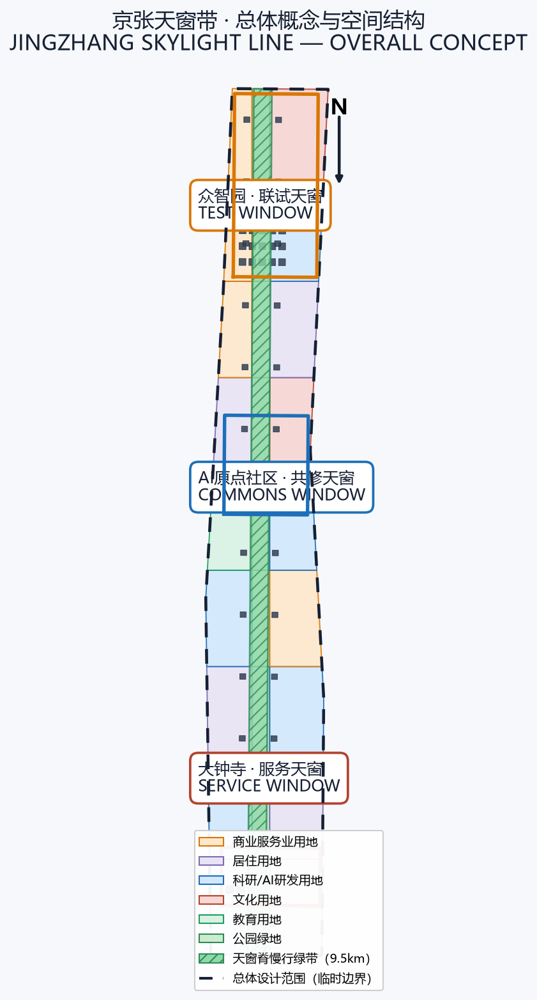
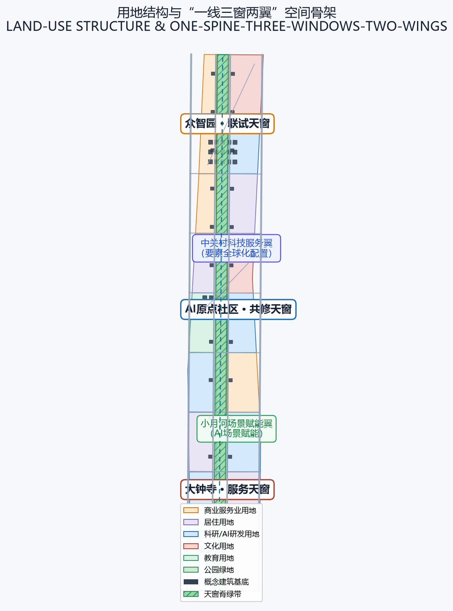
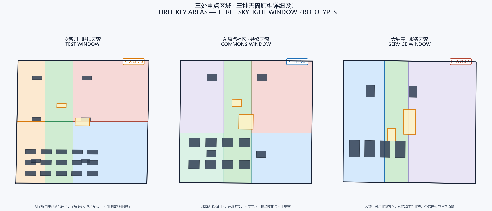
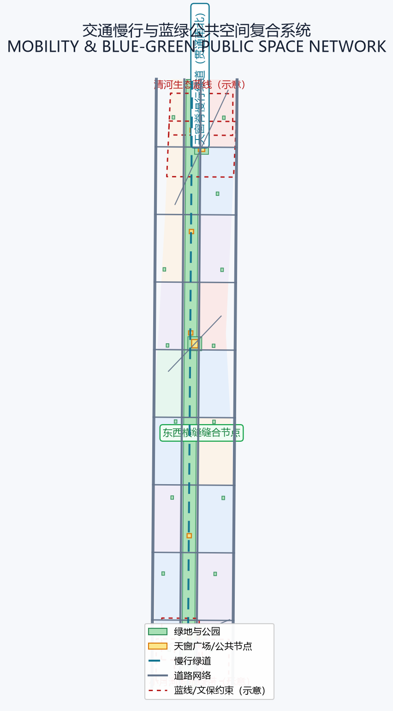
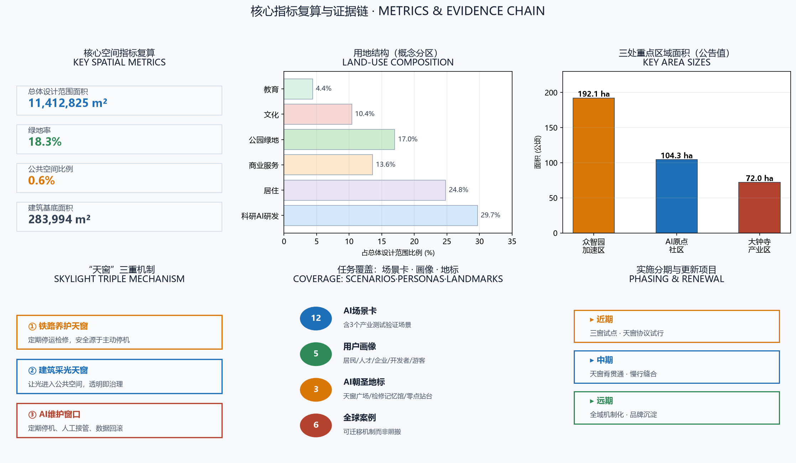

# 京张天窗带 / JINGZHANG SKYLIGHT LINE

> **把‘永远在线’的执念，换成‘可停下来的自信’。**
>
> **ONE LINE, ONE WINDOW — NO WINDOW, NO DEPLOYMENT.** 一线路，一天窗；无天窗，不上线。 百年京张铁路教会城市一件事：安全不是设备从不停止，而是养护从不缺席。当AI进入城市公共空间，本方案用铁路百年传承的“天窗”制度（定期停运、检修、复员），为每一类AI服务建立可预期、可接管、可回退的维护窗口，让创新带既是全球AI产业的展示场，也是检验“AI如何负责任地进入城市”的公共试验场。

## 执行摘要

京张铁路是中国自主设计施工的第一条干线铁路，1909年通车时以“人”字形展线征服关沟坡道 [source:SRC-1909-JINGZHANG-RAILWAY-HISTORY]；一百多年后的今天，其遗产走廊正在被重写为一条9公里级的城市绿廊与AI创新带 [source:SRC-2026-BJ-GH-QUAL-PREANNOUNCEMENT]。公众关注的常常是“哪里装了AI”，而本方案追问一个更深的问题：**当AI服务需要维修、升级、纠错或退役时，城市是否为此预留了时间、空间与制度？** 答案是把铁路行业延续百年的“天窗”制度引入AI城市治理。

铁路“天窗”指为线路养护、设备检修预留的停运时间窗口，是铁路安全运行的基石制度：定期停下来，才能长久跑下去 [source:SRC-2026-BJ-KW-THREE-AREAS-WINGS] [source:SRC-2021-NRA-CONSTRUCTION-SAFETY]。国家铁路规章明确“基础设施实行天窗修理”“影响设备使用的检修均纳入天窗进行” [source:SRC-2007-RAILWAY-TECHNICAL-MANAGEMENT]。本方案将这一制度三重转译——**铁路养护天窗**（检修纪律）、**建筑采光天窗**（让光进入公共空间）、**AI维护窗口**（模型停机、人工接管、数据回滚）——形成“京张天窗带”：一条贯通南北的天窗脊绿带，众智园、AI原点社区、大钟寺三处重点区各承担一种天窗原型（联试/共修/服务），中关村科技服务翼与小月河场景赋能翼构成要素与场景的协同回路。

这一总体概念直接回应“一带总体概念与功能统筹方案设计”任务：一条脊线统筹一带功能、三处天窗原型定义差异化定位、两翼完成要素协同 [agent.1]。方案的空间骨架是“**一线三窗两翼**” [data:geometry/land_use.geojson#LU-001] [data:geometry/green_space.geojson#GREEN-001]：天窗脊是一条约9.5公里、宽约200米的南北贯通的公园绿带，串联三处重点区与12处天窗活动节点 [metric:skylight_spine_length_m]；三处重点区围绕公告划定的众智园（约192公顷）、AI原点社区（约104公顷）、大钟寺（约72公顷）展开 [metric:zhongzhiyuan_area_sqm] [metric:ai_origin_community_area_sqm] [metric:dazhongsi_area_sqm]，分别承载全栈验证、开源共创与智能原生业态；两翼则把中关村的要素配置能力与小月河的场景赋能能力接入脊线。全部空间结论基于临时边界，为概念建议，供专业团队深化 [data:geometry/site_boundary.geojson#SITE-001] [assumption:A-BOUNDARY-001]。

治理上，方案提出“**天窗协议**”（Skylight Protocol）：任何进入京张天窗带的AI场景，上线前必须声明运行时段、检修窗口、人工接管方案、数据回滚路径与退役条件，并以“绿/黄/红”三色窗口状态向公众公开 [metric:skylight_window_count]。12张AI场景卡中至少3张为产业测试验证场景，覆盖道路慢行、公共服务与企业服务三条主线；5类用户画像从居民、通勤者、开发者、企业主到游客，确保公共利益优先 [metric:scenario_card_count] [metric:persona_count]。3处AI朝圣地标——天窗广场、检修记忆馆、零点站台——把“让AI停下来”变成可参观、可参与、可纪念的公共仪式 [metric:pilgrimage_landmark_count]。

实施分三步走：近期在三处重点区启动“联试/共修/服务”天窗试点，验证天窗协议与运营机制；中期贯通天窗脊慢行系统，完成东西缝合；远期把天窗机制沉淀为一带的长期品牌与治理资产 [data:geometry/phasing.geojson#PHASE-002] [data:geometry/phasing.geojson#PHASE-005] [data:geometry/phasing.geojson#PHASE-001]。这不是“反AI”方案：它为企业提供“可验证的上线证明”，为市民提供“可预期的停机保障”，为城市提供“可回退的治理弹性”。

## 设计依据与资料清单

本方案依据四层资料组织：第一层是征集资格预审公告，界定三层范围、设计任务与成果深度 [source:SRC-2026-BJ-GH-QUAL-PREANNOUNCEMENT]；第二层是面向智能体任务书，界定三大定位、五大功能、三区两翼与六项智能体任务 [source:SRC-2026-0518-AGENT-OPEN-CALL-TASKBOOK]；第三层是仓库场地包中的枚举、指标、来源注册表与临时几何 [source:SRC-PROVISIONAL-BOUNDARIES-2026]；第四层是公开政策与国际案例，仅提取可迁移机制，不移植具体数值或制度 [standard:PROJECT-OFFICIAL-ANNOUNCEMENT] [standard:PROJECT-AGENT-OPEN-CALL-TASKBOOK]。全部空间数据由本方案程序化生成，未引入OSM等第三方底图，无ODbL许可负担 [source:SRC-OSM-COPYRIGHT]。

| 资料状态 | 本方案可做 | 本方案绝不做 | 待补资料 |
|---|---|---|---|
| 官方公告与任务书 | 界定范围、任务、深度与语言要求 | 编造官方红线或审批结论 | 官方补遗文件 |
| 临时边界（11.4km²） | 概念分区、指标复算、图面讨论 | 作为official redline或精确面积依据 | official polygon |
| 控规/权属/市政条件 | 表达概念控制与待确认清单 | 给出法定容积率、高度或拆改留结论 | 官方控规、权属、工程资料 |
| 国际案例与AI框架 | 提取可迁移机制 | 把境外数值或制度当作北京标准 | 本地专业复核 |

资料使用边界遵循 `data/source_registry.json` 登记：formal-ready 来源用于正式判断，background/provisional 资料仅作背景或临时生成 [source:SRC-2026-BJ-KW-THREE-AREAS-WINGS]。完整来源、假设、指标、标准与设计深度索引分别保存在 `sources.json`、`assumptions.json`、`metrics.json`、`standard_matrix.json` 与 `design_depth_matrix.json`；正文只在关键判断处就近引用，不复制机器索引 [depth:three_level_scope_framework]。

本方案当前采用仓库提供的临时粗略边界（SITE-001）与三处重点区临时polygon [data:geometry/site_boundary.geojson#SITE-001] [data:geometry/key_areas.geojson#PROV-KEY-001]。该临时几何仅用于方案生成、自检与展示，不得视为官方红线、审批依据或精确面积复算基础 [assumption:A-BOUNDARY-001]；组织方数据缺口不阻断内容评分，official polygon到位后将重算全部图层与指标。方案不声称任何容积率、建筑高度、拆改留或工程实施结论，相关管控指标一律以 `status=unknown` 登记并说明复算路径 [standard:MOHURD-CONTROL-DETAILED-PLANNING] [standard:MNR-LAND-USE-CLASSIFICATION-GUIDE]。

## 三层范围工作框架

公告与任务书共同确定三个递进层次 [source:SRC-2026-BJ-GH-QUAL-PREANNOUNCEMENT] [source:SRC-2026-0518-AGENT-OPEN-CALL-TASKBOOK]：

- **统筹研究范围（43.6 km²）**：北至北五环路、东至京藏高速、南至西直门外大街、西至万泉河路。本方案在此层面回答：世界级AI创新生态如何组织、三区两翼如何协同、百年京张文化如何转化为未来城市叙事 [depth:three_level_scope_framework]。
- **总体设计范围（11.4 km²）**：京张遗址公园周边1-2公里城市与产业地区。本方案在此层面落实“一线三窗两翼”空间结构、用地分区、交通慢行、蓝绿公共空间、更新项目与实施分期 [metric:site_area_sqm] [depth:overall_spatial_structure]。
- **重点区域范围（368.4公顷）**：自北向南的众智园、AI原点社区、大钟寺。本方案在此层面开展详细设计，使每种天窗原型落到具体空间与运营机制 [metric:key_area_count] [depth:key_area_detailed_design]。

三层不是三张互不相干的图纸，而是同一套“天窗逻辑”的传导链：统筹层回答“AI生态如何被治理”，总体层回答“治理如何落到空间”，重点层回答“空间如何被运营”。每一层都遵守同一条验收句：**无AI时城市仍可使用；AI增强了什么；谁负责停机检修；停机时谁接管；数据如何回退。**

## 统筹研究范围产业与未来城市研究

### 命名与视觉识别方向

文化叙事上，天窗带把“百年京张文化、中关村文化与AI新文化”合成一条主线：铁路养护史提供制度原型（詹天佑以人字形展线与竖井施工法在资金匮乏中自造可能 [source:SRC-2025-BJD-RAILWAY-REVIEW]），中关村创新史提供精神原型，AI检修日志构成当代叙事，三者以“可停机”为共同母题 [agent.5]。青龙桥车站的“人”字形铁路与京张高铁的“大”字形线路在此交汇，历史与未来以特殊方式互致敬意 [source:SRC-2023-CSSN-RAILWAY-REVIVAL]。主名称建议为“**京张天窗带** / JINGZHANG SKYLIGHT LINE”，英文全称强调“skylight”的双关——既是建筑采光口，也是铁路养护与AI维护的“窗口”。命名体系分三层 [source:SRC-2026-0518-AGENT-OPEN-CALL-TASKBOOK]：

- 一带整体：京张天窗带（JINGZHANG SKYLIGHT LINE），作为百年京张文化带、都市AI生活体验带与AI融合创新带的统一载体；
- 三窗原型：联试天窗（Test Window）、共修天窗（Commons Window）、服务天窗（Service Window），对应三处重点区；
- 城市部件：天窗广场（Skylight Plaza）、检修记忆馆（Maintenance Memory Hall）、零点站台（Midnight Platform）等场景化命名。

Logo方向建议以“开启的天窗”为母题：一个向上开启的梯形窗框与一条水平铁轨线构成“窗×轨”复合符号，象征“让光进入、让轨道延伸”；辅以“绿（养护/生态）/钢蓝（科技/轨道）/信号黄（警示/检修）”三色体系，形成可延展的视觉识别与导视语言。全部字体、图形与标识方向均为自创概念，未使用受版权保护的现有标识 [agent.1]。

### 三大定位与五大功能

| 三大定位 | 本方案转译 | 五大功能落点 |
|---|---|---|
| 百年京张文化带 | 从“自主建造”到“自主养护”的文化延续 | AI治理全球话语权 |
| 都市AI生活体验带 | 让AI服务可停机、可接管、可回退的日常体验 | 智能化AI活力城市 |
| AI融合创新带 | 天窗协议作为产业测试与场景开放机制 | AI全栈自主创新体系、世界级AI创新生态、AI+场景赋能新范式 |

三区两翼协同回路：众智园（全栈自主+治理话语权）→ AI原点社区（世界级创新生态）→ 大钟寺（智能原生新业态），两翼分别以中关村科技服务翼（要素全球化配置、IP与资本赋能）和小月河场景赋能翼（场景开放与活力城市）接入脊线，形成“源头创新—要素服务—场景验证—业态落地”的闭环 [source:SRC-2026-0518-AGENT-OPEN-CALL-TASKBOOK]。这一框架呼应海淀“全球首个人工智能创新街区”建设与“人工智能全景赋能第一城”目标 [source:SRC-2025-HAIDIAN-GOV-REPORT] [source:SRC-2024-ZGC-AI-FULL-SCENE-PLAN]，并以中关村世界领先科技园区建设方案为国家级背景 [source:SRC-2024-ZGC-WORLD-LEADING-PARK]；海淀AI企业超千家、占全市三分之二，为两翼要素配置提供产业支撑 [source:SRC-2025-21ECON-ZGC-DEVELOPMENT] [source:SRC-2024-HAIDIAN-AI-MEASURES]。

### 全球AI创新生态案例（6例）

以下案例仅提取可迁移机制，不把境外数值或制度移植为北京标准 [agent.2] [source:SRC-2024-EU-AI-ACT]：

1. **新加坡榜鹅数字园区（PDD）**：从规划初期引入“数字孪生+开放平台”，验证了“先建机制、后建物理”的园区模式——本方案对应“天窗协议先于设备上线”的准入机制。
2. **多伦多滨水区Quayside（经调整）**：数据治理与隐私争议的教训提示：公共空间AI必须可解释、可退出——本方案对应“数据最小化+人工接管”条款。
3. **巴塞罗那Decidim平台**：开源参与式治理证明“让市民看得见决策”能提升信任——本方案对应“三色窗口状态公开”。
4. **深圳福田AI+政务**：政务服务AI的“上线—试运行—灰度—复核”流程，是“服务天窗”的现实原型。
5. **日本柏之叶智慧城市**：以“生活实验室”持续迭代公共场景——本方案对应“联试天窗”的测试验证场景。
6. **欧盟AI法案分级监管框架**：风险分级与人类监督要求，与“天窗协议”的绿黄红分级在逻辑上一致，但本方案只采用分级治理思想，不移植欧盟法律。

以上案例的完整来源与限制登记在 `sources.json`，正文不展开机器索引 [source:SRC-2026-BJ-KW-THREE-AREAS-WINGS]。

## 总体设计范围城市更新与控规深度城市设计

总体设计范围约11.4平方公里，现状以高校、科研院所、居住社区与存量产业空间为主 [metric:site_area_sqm] [source:SRC-2026-HAIDIAN-1X1]。本方案提出“**一线三窗两翼、十二节点、多类型缝合**”的更新框架：

- **一线（天窗脊）**：以京张遗址公园为底，形成宽约200米、长约9.5公里的南北贯通绿带 [data:geometry/green_space.geojson#GREEN-001] [metric:skylight_spine_length_m]，承载慢行绿道、活动节点与天窗装置。
- **三窗（三处重点区）**：围绕众智园、AI原点社区、大钟寺，分别形成联试天窗、共修天窗、服务天窗 [data:geometry/key_areas.geojson#PROV-KEY-001]。
- **两翼**：中关村科技服务翼与小月河场景赋能翼，通过横向联络路与脊线节点缝合 [data:geometry/roads.geojson#ROAD-001]。
- **十二节点**：天窗脊沿线6处公共活动节点 + 三处重点区天窗广场 + 社区口袋公园网络 [data:geometry/public_space.geojson#PUBLIC-004] [data:geometry/green_space.geojson#GREEN-013]。

用地结构按国土空间用地分类表达，形成科研、居住、商业、文化、教育与绿地六类主导分区，全部覆盖提交边界且无缝隙、无重叠 [data:geometry/land_use.geojson#LU-001] [standard:MNR-LAND-USE-CLASSIFICATION-GUIDE] [source:SRC-2023-MNR-LAND-USE-CLASSIFICATION]。更新深度参考城市设计管理办法与控规编制审批办法的专业边界 [source:SRC-2017-MOHURD-URBAN-DESIGN-MEASURES] [source:SRC-MOHURD-CONTROL-DETAILED-PLANNING]。

概念分区指标方面：绿地率约18.3%、公共空间比例约0.6%，建筑基底约28.4公顷 [metric:green_ratio] [metric:public_space_ratio] [metric:building_footprint_area_sqm]。这些为概念分区指标，供展示与讨论；官方边界与控规条件到位后需整体复算 [assumption:A-CONTROLS-001]。

更新逻辑遵循“保留优先、缝合为本、可逆插接”：铁路遗址、文保要素与成熟社区以保留为主；低效存量空间通过公共空间与天窗装置改造激活；新增AI设施采用可逆、可拆装的“插接式”单元，避免一次性大拆大建 [depth:retain_renovate_demolish]。建筑高度、容积率、退线等管控指标在缺少官方控规时统一记为 `unknown`，本方案仅提供概念体量方向，不作为法定控制结论 [standard:MOHURD-CONTROL-DETAILED-PLANNING] [assumption:A-CONTROLS-001]。

## 重点区域详细设计

### 众智园AI自主创新加速区（约192公顷）——联试天窗

**定位**：AI全栈自主创新与产业测试验证的“联试场” [data:geometry/key_areas.geojson#PROV-KEY-001] [metric:zhongzhiyuan_area_sqm]。

**空间结构**：以“测试环+验证场+联试广场”组织。核心区布局AI研发楼群与孵化器，设置可开放的“模型评测场”；天窗广场作为全栈联试的公共展示界面 [data:geometry/public_space.geojson#PUBLIC-001]。

**建筑更新**：以存量产业空间改造与AI研发楼增建为主，建筑类型覆盖AI研发、实验室、孵化器与人才公寓 [data:geometry/buildings.geojson#BLDG-001]。

**天窗机制**：联试天窗要求所有入驻模型定期进入“停机联试”——模型更新、安全评测、故障演练均安排可预期窗口，测试结果以“红黄绿”状态公开 [agent.3]。

**实施风险**：涉及存量权属与产业置换，须以官方权属与控规条件为前置；当前全部为方向性设计 [assumption:A-CONTROLS-001]。

### 北京AI原点社区（约104公顷）——共修天窗

**定位**：高校源头创新、开源共创与人才成长的“共修场” [data:geometry/key_areas.geojson#PROV-KEY-002] [metric:ai_origin_community_area_sqm]。

**空间结构**：围绕高校与轨道站点组织“创新楼群+社区花园+共修广场”。教育与社区服务建筑混合布局，紧邻天窗脊设置共修天窗广场 [data:geometry/public_space.geojson#PUBLIC-002]。

**建筑更新**：以教育、社区服务与创新办公建筑为主，配合人才公寓与共享设施 [data:geometry/buildings.geojson#BLDG-016]。

**天窗机制**：共修天窗强调“人工复核+开源维护”——社区开发者与市民共同参与AI服务的检修、修复与复盘，让维护本身成为公共学习场景 [agent.4]。

**实施风险**：紧邻高校与文保要素，空间增量受限，须以文保与控规条件复核 [data:geometry/constraints.geojson#CONSTRAINT-001] [assumption:A-CONTROLS-001]。

### 大钟寺AI产业聚集区（约72公顷）——服务天窗

**定位**：智能原生新业态、公共体验与消费场景的“服务场” [data:geometry/key_areas.geojson#PROV-KEY-003] [metric:dazhongsi_area_sqm]。

**空间结构**：以“商业街+文化绿庭+服务广场”组织，智能商业楼群与文化设施混合布局，服务天窗广场成为一带南端门户 [data:geometry/public_space.geojson#PUBLIC-003]。

**建筑更新**：以商业服务、文化创意与AI应用建筑为主，更新模式以功能置换与公共空间激活为主 [data:geometry/buildings.geojson#BLDG-031]。

**天窗机制**：服务天窗为智能原生业态设定“夜间/低峰停机检修”窗口，避免公共消费空间被技术无休占用，同时提供人工柜台与离线路径 [agent.3]。

**实施风险**：商业业态迭代快，须以市场需求与运营主体确认为前置；当前为概念建议 [assumption:A-CONTROLS-001]。

## AI 创新生态、人才画像与 AI+ 场景

### 五类用户画像

1. **原住居民与长者**：关心AI不干扰日常生活，需要无账号、离线可用的人工服务路径。
2. **通勤者与游客**：需要可预期、可解释的公共AI服务（导航、导览、安全提示），并有权知道何时停机。
3. **开发者与开源社区**：需要共修窗口参与检修、评测与模型复现。
4. **AI企业与创新团队**：需要可验证的上线流程、测试场景与要素服务。
5. **运营主体与公共服务人员**：需要人工接管、回退与责任界定的制度支撑。

### 12张AI场景卡（含3张产业测试验证场景）

| # | 场景卡 | 空间落点 | 天窗协议要点 |
|---|---|---|---|
| 1 | **道路慢行AI诊断**（测试验证） | 天窗脊慢行绿道 | 季度停机校准，人工复测 |
| 2 | **遗址公园AI导览** | 天窗脊沿线节点 | 每日深夜窗口更新内容库 |
| 3 | **无障碍AI导航** | 天窗广场/轨道接驳 | 双周检修，离线地图备用 |
| 4 | **企业服务Copilot**（测试验证） | 众智园企业服务楼 | 灰度上线+月度回滚演练 |
| 5 | **公共安全运营复核**（测试验证） | 众智园联试广场 | 联试天窗强制停机评测 |
| 6 | **人才生活管家** | AI原点社区 | 夜间窗口，人工客服兜底 |
| 7 | **开源项目共修台** | 共修天窗广场 | 与社区维护日历同步 |
| 8 | **智能原生消费体验** | 大钟寺服务广场 | 低峰停机检修 |
| 9 | **城市AI状态三色屏** | 天窗脊节点 | 实时公开停机计划 |
| 10 | **低碳算力驿站** | 众智园/脊线 | 算力负载窗口化调度 |
| 11 | **京张记忆AI策展** | 检修记忆馆 | 文保内容人工审核 |
| 12 | **全球AI活动AI助手** | 零点站台/活动场地 | 活动期后强制停机复盘 |

每张场景卡映射到空间图层、服务对象、运行数据、隐私边界、人工复核、运营主体与风险 [agent.3]；数据遵循最小化原则，公共空间不默认成为数据源，所有AI决策保留人工复核路径 [standard:GENERATIVE-AI-INTERIM-MEASURES]。

## 用地、建筑规模与拆改留方案

用地布局形成六类主导分区，覆盖提交边界无缝隙 [data:geometry/land_use.geojson#LU-001]：科研/AI研发约29.7%、居住约24.8%、商业服务约13.6%、公园绿地约17.0%、文化约10.4%、教育约4.4%。建筑基底约28.4公顷，以AI研发、教育、商业与文化建筑为主，全部为概念基底 [metric:building_footprint_area_sqm] [data:geometry/buildings.geojson#BLDG-001]。

拆改留策略以“保留优先、可逆插接”为原则 [depth:retain_renovate_demolish]：铁路遗址与文保要素保留并活化；成熟社区保留并改善公共环境；低效存量空间改造为AI创新与公共功能；新增AI设施采用可逆单元。由于缺少官方控规、现状建筑普查、权属与工程条件，容积率、建筑高度、建筑密度、绿地率与退线等指标全部记为 `unknown`，待正式控制条件补齐后复算 [assumption:A-CONTROLS-001] [standard:MOHURD-CONTROL-DETAILED-PLANNING]。

## 交通、轨道、市政与公共服务设施

- **道路与慢行**：依托天窗脊形成南北贯通慢行主廊，两侧干道承担交通集散，横向联络路缝合东西 [data:geometry/roads.geojson#ROAD-001] [data:geometry/roads.geojson#ROAD-005]。
- **轨道接驳**：围绕既有轨道站点强化接驳，天窗广场预留公交与慢行换乘接口 [data:geometry/public_space.geojson#PUBLIC-001]。
- **市政与新型基础设施**：以端侧算力、分布式能源与公共数据接口为AI设施配套，传统市政按“待官方条件确认”登记 [depth:municipal_new_infrastructure]。
- **公共服务**：沿脊线配置人才生活、社区服务、文化展示与应急服务设施，服务半径以步行可达为目标 [data:geometry/green_space.geojson#GREEN-013]。

## 蓝绿空间、公共空间与城市风貌

蓝绿系统以天窗脊为主骨架：约9.5公里南北贯通的公园绿带串联三处重点区与十二节点 [data:geometry/green_space.geojson#GREEN-001] [metric:skylight_spine_length_m]；北侧清河生态蓝线与南侧小月河滨水绿带构成横向缝合 [data:geometry/constraints.geojson#CONSTRAINT-003] [data:geometry/constraints.geojson#CONSTRAINT-004]；社区口袋公园织补日常绿网 [data:geometry/green_space.geojson#GREEN-013]。

公共空间突出“天窗”主题：天窗广场以可开合顶棚装置让光进入，成为AI状态的“露天仪表盘”；检修记忆馆把铁路养护史与AI检修日志并置展出；零点站台在每日零点举行“停机仪式”，让市民亲眼见证AI服务被规范地关闭与重启 [agent.4]。

### 三处AI朝圣地标

1. **天窗广场**（众智园/AI原点/大钟寺各一）：可开合的天窗装置+三色状态屏，是“让AI可停下来”的公共纪念碑。
2. **检修记忆馆**（AI原点社区）：京张铁路养护史与AI检修日志的并置展陈，象征“自主养护”文化延续。
3. **零点站台**（天窗脊中部节点）：每日零点的停机仪式与“天窗时刻”打卡点，把维护制度转化为城市公共仪式 [metric:pilgrimage_landmark_count]。

城市风貌以“轨道灰+养护绿+信号黄”为基调，建筑体量与界面强调通透与可进入性，公共艺术与导视系统延续“窗×轨”符号 [depth:height_massing_character] [standard:MOHURD-URBAN-DESIGN-MEASURES]。

## 更新项目清单、实施政策与分期计划

### 更新项目清单（9项）

| # | 项目 | 位置 | 分期 |
|---|---|---|---|
| 1 | 天窗脊慢行贯通工程 | 天窗脊沿线 | 中期 |
| 2 | 众智园联试天窗广场 | 众智园 | 近期 |
| 3 | AI原点共修天窗广场 | AI原点社区 | 近期 |
| 4 | 大钟寺服务天窗广场 | 大钟寺 | 近期 |
| 5 | 检修记忆馆 | AI原点社区 | 近期 |
| 6 | 零点站台 | 天窗脊中部 | 中期 |
| 7 | 社区口袋公园网络 | 东西两侧社区 | 中期 |
| 8 | 东西横缝缝合节点 | 脊线横向联络点 | 中期 |
| 9 | 天窗协议数字化平台 | 一带全域 | 远期 |

### 分期计划

- **近期（试点）**：三处重点区启动天窗试点，试行天窗协议、三色状态与运营机制 [data:geometry/phasing.geojson#PHASE-002]。
- **中期（贯通）**：天窗脊慢行系统全线贯通，完成东西缝合与公共空间网络 [data:geometry/phasing.geojson#PHASE-005]。
- **远期（机制化）**：天窗机制沉淀为长期品牌与治理资产，形成年度活动体系与全球传播 [data:geometry/phasing.geojson#PHASE-001]。

### 天窗准入闸门（C0-C7）

任何AI场景进入天窗带，按八级闸门逐级放行，任一闸门未过即暂停或回退（概念机制，最终以主管部门确认为准）[assumption:A-GATE-001]：

| 闸门 | 名称 | 通过条件 | 核心责任主体 |
|---|---|---|---|
| C0 | 概念审查 | 场景与天窗协议三条主线一致，不违背公共利益 | 天窗管理办公室（统筹） |
| C1 | 数据声明 | 数据采集边界、脱敏与聚合规则完整声明 [standard:GENERATIVE-AI-INTERIM-MEASURES] | 场景提供方+数据安全专员 |
| C2 | 风险分级 | 按绿/黄/红完成风险分级，确定停机窗口与接管预案 | 天窗管理办公室+应急团队 |
| C3 | 试点申请 | 联试/共修/服务天窗任一原型接收，明确试点范围与期限 | 园区运营主体+天窗站点 |
| C4 | 公众公示 | 三色状态、运行时段、检修窗口向公众公示不少于14天 | 天窗管理办公室+社区联络 |
| C5 | 试运行 | 限时限区试运行，天窗检修至少完成1次并公开复盘 | 场景提供方+天窗站点 |
| C6 | 正式上线 | 连续通过2次检修复盘，人工接管演练达标 | 天窗管理办公室（终审） |
| C7 | 定期复检 | 按季度复检数据声明、风险分级与检修记录 | 巡检与应急队伍 |

闸门流程参考铁路天窗维修计划“提报-审批-执行-追溯”的标准化管控经验 [source:SRC-2015-RAILWAY-MAINTENANCE-GAP-SYSTEM]。每个闸门设置明确的退出机制：C0-C2未过即终止申请；C3-C5未过可补充材料后重新申请一次；C6-C7未过即暂停服务并进入橙色修复流程 [assumption:A-GATE-001]。闸门决策以书面记录归档并公开摘要，接受公众与开发者社区监督。

**约束力来源（概念建议，需主管部门确认）**：天窗协议通过三重渠道获得约束力——一是**入园协议**：场景提供方入驻天窗带前签署，将C0-C7闸门与三色窗口状态作为经营条件写入协议；二是**场景运营许可**：将天窗检修与数据声明作为试点备案/许可的前置条件，与现有“接诉即办”“一网统管”平台在数据上报与流程上报环节衔接 [source:SRC-2026-BJ-KW-THREE-AREAS-WINGS]；三是**公共契约公示**：通过三色窗口状态、检修日志与投诉闭环的公开，形成社会监督与声誉约束。天窗协议的数据声明、安全评估与投诉举报要求，与《生成式人工智能服务管理暂行办法》的合规框架一致 [source:SRC-2023-CAC-GENERATIVE-AI-INTERIM]。三重渠道均为建议机制，最终以主管部门审批意见为准。

### 应急响应与人工接管

天窗带建立红橙黄三级应急机制，所有AI场景在C3起必须登记接管联系人并定期演练 [assumption:A-EMERGENCY-001]：

- **红色（立即停机）**：出现人身安全、公共秩序或数据泄露风险，30分钟内完成停机与人工接管，同步广播三色状态变红；
- **橙色（限期修复）**：服务异常或指标劣化，24小时内完成修复或回滚，期间切换人工替代路径；
- **黄色（观察升级）**：异常趋势未明，72小时内持续观察并准备升级。

每个联试天窗站点配置人工接管员2人（1主值+1备值），试点期共约6-12人；接管预案、演练记录与复盘报告按季度公开 [assumption:A-WINDOW-003]。

### 运营编制与预算框架（概念测算）

- **人力编制**：天窗管理办公室（统筹约5人）、三处站点运营（每处6-8人）、巡检与应急队伍（约10人）、开发者社区运营（约4人），试点期合计约40-50人；
- **预算框架**：近期三处试点年运营成本概念测算约1.2亿元量级（含人工接管、数据回滚设施、设备维护与巡检），为概念量级，不含工程投资 [assumption:A-COST-001]；
- **成本分担**：试点期以“联试”模式由场景提供方分担维护成本，公益类场景由政府运营主体承担；资金渠道（财政、专项债、产业基金、场景付费）为概念建议。

以“大钟寺服务天窗”一个典型AI场景（智能导览+便民服务一体终端）为例，单场景“天窗”运营全周期（年）成本初步估算（概念值）：

| 成本项 | 估算（万元/年） | 说明 |
|---|---|---|
| 停机检修人工 | 18 | 周检修2小时×52周+季度大修，接管员2人 |
| 数据维护与回滚 | 12 | 版本管理、回滚演练、日志脱敏存储 |
| 设备维护与能耗 | 15 | 终端、边缘设备巡检与更换 |
| 停机损失（机会成本） | 8 | 每周2小时停机对服务的让渡，按导流/广告收入测算 |
| 保险与合规 | 5 | 公共责任险与合规审计分摊 |
| **合计** | **约58** | 单场景年成本，约占场景年运营收入的3-5% |

该测算显示：天窗停机成本占场景运营收入比例可控（3-5%），可通过“可验证的上线证明”带来的品牌与合规溢价覆盖，为企业提供“付费买信任”的商业模式 [assumption:A-COST-001]。多场景复用共享检修窗口后，边际成本进一步下降。

### 公众参与、无障碍与投诉渠道

- **参与机制**：天窗检修开放日、共修黑客松与公众反馈会按季度举办，检修日志与复盘报告公开可查；
- **无障碍与数字包容**：所有AI场景保留非数字化替代路径（人工柜台、电话服务、标识指引），停机公告以多语言、大字版与广播同步发布；慢行与公共空间设计按无障碍规范配置 [standard:WUBA-2012-ACCESSIBILITY]，无障碍设施与主体工程同步规划、同步设计、同步施工、同步验收、同步交付，按《无障碍环境建设法》执行 [source:SRC-2023-BARRIER-FREE-LAW]，并借鉴通用设计理念覆盖残疾、老年、孕妇、儿童等多元需求 [source:SRC-2023-TSINGHUA-ACCESSIBILITY]；
- **投诉与申诉**：设立“天窗热线”与线下受理点，投诉48小时内响应、7个工作日内反馈处理结果，重大投诉进入人工复核流程。天窗热线与北京12345市民服务热线的“接诉即办”机制衔接，参照《北京市接诉即办工作条例》的诉求受理-派单-办理-回访闭环设计 [source:SRC-2021-BEIJING-JIESU-JIBAN-REGULATION]，并将投诉数据纳入“一网统管”数字底座与指标体系，形成城市级治理协同 [source:SRC-2023-BJNEWS-UNIFIED-GOVERNANCE]；响应率、解决率、满意率作为天窗协议季度复检的考核指标 [source:SRC-2026-RUC-JIESU-JIBAN-ANALYSIS]。

### 全球AI创新活动体系与长期运营

- **年度活动体系**：以“京张天窗周”为年度旗舰（检修开放日、联试节、共修黑客松、服务体验周），四季各有主题 [agent.6]。
- **开发者社区运营**：以“共修天窗”为固定接口，开放检修任务、评测基准与数据回滚演练，沉淀可复用的公共工具。
- **场景开放运营**：场景卡通过“申请—上线—试运行—天窗检修—复盘”五步流程开放，结果公开。
- **国际传播与招引**：以“世界级AI朝圣地”与“可验证的上线证明”为传播主线，把天窗协议做成可参观、可参与、可评价的国际公共品牌。

以上活动、招商、资金与运营安排均为概念建议，不构成已确定政府安排 [agent.6] [standard:PROJECT-AGENT-OPEN-CALL-TASKBOOK]。

## 指标体系、面积复算与合规矩阵

核心指标全部可从提交几何复算或明确登记 [depth:metrics_recalculation]：

- 总体设计范围面积：11,412,825 m² [metric:site_area_sqm]
- 三处重点区面积：众智园约192.9万m²、AI原点约104.3万m²、大钟寺约72.0万m² [metric:zhongzhiyuan_area_sqm] [metric:ai_origin_community_area_sqm] [metric:dazhongsi_area_sqm]
- 绿地率：18.3%；公共空间比例：0.6%；建筑基底：约28.4万m² [metric:green_ratio] [metric:public_space_ratio] [metric:building_footprint_area_sqm]

空间与场景指标方面：

- 天窗脊长度：约9.5km；天窗窗口数：12；场景卡：12张；画像：5类 [metric:skylight_spine_length_m] [metric:skylight_window_count] [metric:scenario_card_count]
- 朝圣地标：3处；全球案例：6例 [metric:persona_count] [metric:pilgrimage_landmark_count]

合规矩阵覆盖公告1.3/1.4/1.5与agent.1-agent.6全部必选任务，标准矩阵与设计深度矩阵分别证明专业标准与成果深度；自检状态与维护者gate结果见 `self_check.json` [compliance_matrix.json] [standard_matrix.json] [design_depth_matrix.json]。

## 风险、版权与合规说明

- 临时边界风险：本方案全部空间结论基于临时几何，official polygon到位后须整体复算 [assumption:A-BOUNDARY-001]。
- 控规与权属风险：容积率、高度、拆改留等结论缺少官方条件，一律为概念方向 [assumption:A-CONTROLS-001]。
- 版权合规：命名、Logo、场景与图件均为本方案自创概念，未使用未经授权的字体、图片、商标、肖像或企业标识；来源与许可见 `report/copyright_statement.md` 与 `sources.json`。
- 生成披露：本方案由AI智能体依据公开/清权资料生成，生成方式、限制与授权状态已记录 [agent.json]。

治理与运营风险方面：

- 合规边界：方案不声称官方批准、审定控规、最终权属、实施承诺或政府背书；所有活动与政策安排均为概念建议 [standard:PROJECT-OFFICIAL-ANNOUNCEMENT]。
- AI安全与伦理：天窗协议要求所有场景通过C0-C7准入闸门并在运行期接受季度复检；高风险场景强制人工接管演练与停机演练，演练结果公开 [assumption:A-GATE-001] [assumption:A-EMERGENCY-001]，响应生成式人工智能服务管理暂行办法的合规要求 [source:SRC-2023-GENERATIVE-AI-INTERIM-MEASURES]。
- 数据隐私与网络安全：数据采集遵循最小化原则，公共空间不默认成为数据源；个人数据脱敏聚合后方可进入场景运行与复盘，安全事件按红色应急等级处理并依法报告 [standard:GENERATIVE-AI-INTERIM-MEASURES] [risk:data_privacy]。
- 事故责任与保险：各场景运营主体对自身AI服务承担主体责任，建议试点期购买公共责任险，天窗管理办公室负责事故上报、复盘与整改跟踪 [risk:technology_maturity]。
- 风险登记：数据隐私、实施复杂度、公众接受度、运维成本、政策不确定性、空间争议、技术成熟度与公平包容性八类风险已在 `risk.json` 逐项登记并给出缓释与人工复核安排 [risk.json]。

针对评审关注的高影响风险，补充与核心机制绑定的缓解策略：

- **政策不确定性**：天窗协议以“机制先行、法定待定”为原则——把可自主实施的入园协议、公共公示、投诉闭环先落地运行，形成试点数据后再申请纳入正式许可与地方法规；C0-C7闸门的名称与顺序设计为可替换接口，便于与主管部门既有审批流程对齐，不预设特定审批结论。
- **技术不成熟（AI接管可靠性）**：采用“分级验证路径”——高风险场景（如交通类）必须经过联试天窗的模拟故障演练（每月1次）+ 半实物台架测试（每季度1次）后才可进入C5试运行；接管演练不达标则停留在C3试点，不进入C6上线。技术成熟度未达2级以上（实验室验证通过）的场景不得申请红色风险级 [assumption:A-WINDOW-002]。停机窗口时长的设定（周检修2-4小时、季度大修1-3天）参考高速铁路综合维修天窗时长的学术研究，仅借鉴“以时长换安全”的机制逻辑，不移植具体数值 [source:SRC-2008-BJTU-MAINTENANCE-WINDOW]。
- **公众接受度（投诉闭环）**：天窗热线与线下受理点收集的投诉数据按季度统计，在“共修天窗”复盘会上公开分类（停机不满/服务缺陷/信息不清），并将高频问题反哺为协议修订项——例如若“停机时段不便”投诉占比超30%，则调整该场景的停机窗口安排。投诉-修订-再公示形成闭环，记录在检修日志中可追溯。

## 参考资料

1. 百年京张AI创新带城市设计国际方案征集资格预审公告（北京市规划和自然资源委员会海淀分局，2026-05-09）
2. 面向全球智能体开展百年京张AI创新带城市设计开源征集任务书摘录（用户提供清权材料，2026-05-18）
3. “三区两翼”打造世界级AI集聚地（北京市科委、中关村管委会，2026-04-03）
4. 海淀区“1+X+1”现代化产业体系建设布局（海淀区，2026）
5. 城市设计管理办法（住建部，2017）
6. 城市、镇控制性详细规划编制审批办法（住建部/国务院，2010）
7. 国土空间调查、规划、用途管制用地用海分类指南（自然资源部，2023）
8. 生成式人工智能服务管理暂行办法（国家网信办等，2023）
9. 仓库场地包：design_brief.json、agent_taskbook.json、allowed_design_space.json、source_registry.json
10. 临时边界与重点区域几何：brief/site-package/geometry/provisional_boundaries.geojson

完整机器索引以 `sources.json`、`metrics.json`、`assumptions.json`、`compliance_matrix.json`、`standard_matrix.json` 与 `design_depth_matrix.json` 为准 [source:SRC-2026-BJ-GH-QUAL-PREANNOUNCEMENT]。
