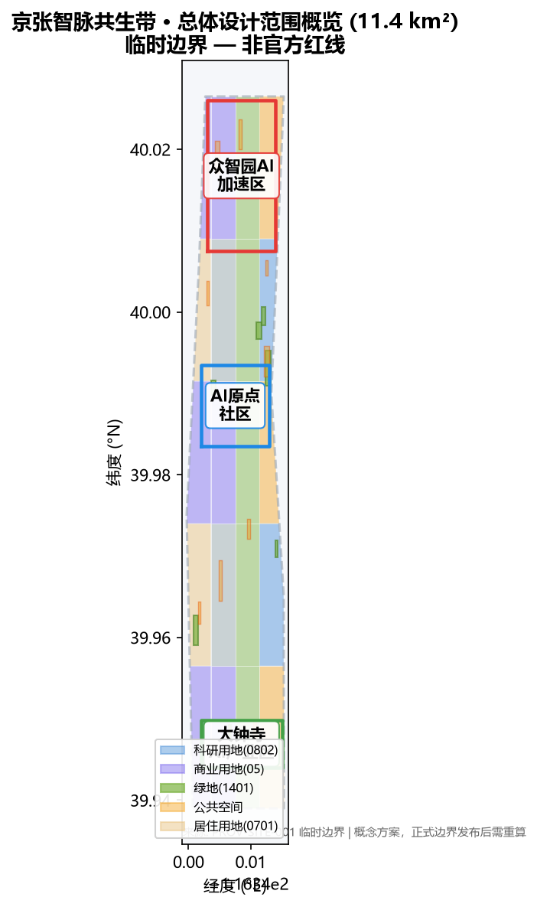

# Jing-Zhang AI Pulse Belt: Urban Design Proposal for the Centennial Jing-Zhang AI Innovation Belt

## Design Basis and Source Inventory

This formal proposal takes as its primary basis the Qualification Pre-Announcement for the Centennial Jing-Zhang AI Innovation Belt Urban Design International Solicitation, published by the Haidian Branch of the Beijing Municipal Commission of Planning and Natural Resources, together with the machine-readable provisional boundaries, key areas, enums, metrics, and source lists registered by maintainers in `brief/site-package/`. AI agents must read `design_brief.json`, `allowed_design_space.json`, `sources.json`, `enums/`, `ranges/`, `schemas/`, and `data/source_registry.json` before generating proposals [source:OFFICIAL-ANNOUNCEMENT] [source:AGENT-TASKBOOK]. All design judgments are decomposed into traceable sources, recalculable metrics, verifiable layers, and human-reviewable assumptions.

The proposal uses provisional boundaries from `brief/site-package/geometry/provisional_boundaries.geojson` because official `SITE_BOUNDARY` and `KEY_AREA` polygons are not yet published. All geometry in this package is marked `provisional_constraint` with `official_boundary=false`; it is for design generation, self-check, visualization, and discussion only, and must not be treated as an official redline or basis for statutory control [data:geometry/site_boundary.geojson#SITE-001]. This organizer-side data gap does not block content scoring; metrics must be recalculated when official polygons are released.

The source registry summary: 7 formal-ready sources (official pre-announcement, agent taskbook, three-areas-two-wings materials, planning standards), 1 background source, 1 provisional-only source (provisional_boundaries.geojson). Background and provisional-only sources must not be upgraded to official boundaries, statutory controls, formal scoring evidence, or implementation commitments [source:SOURCE-REGISTRY].

## Three-Level Scope Framework

The proposal follows the three levels established by the announcement: the coordinated research area (43.6 km²) addresses the AI industry ecology, strategic positioning, innovation chains, and future city form; the overall design area (11.4 km²) covers the urban area and industrial districts within 1-2 km around the Jing-Zhang Heritage Park, requiring an urban renewal framework at regulatory-plan urban design depth; the key detailed design area (368.4 ha) covers three specific districts requiring parcel-level design of functions, building scale, retain/renovate/demolish classification, public space connectivity, and transport organization [depth:three_level_scope_framework] [standard:PROJECT-OFFICIAL-ANNOUNCEMENT].

The proposed overall concept is the **"Jing-Zhang AI Pulse Belt" (京张智脉共生带)**: taking the Jing-Zhang Heritage Park as the historic and public-space spine, the three key areas as innovation anchors, and universities, enterprises, communities, and transit stations as everyday networks, forming an "One Belt, Three Cores, Multi-Scenario, Blue-Green Slow-Traffic Loop" spatial organization [data:geometry/land_use.geojson#LU-001].

| Level | Design Question | Proposal Answer | Data Anchor |
| --- | --- | --- | --- |
| Coordinated Research Area | How to organize AI industry ecology and future city form | Build an "university-origin → open-source collaboration → enterprise transformation → public experience → international communication" innovation chain | compliance_matrix.json |
| Overall Design Area | How to map industry space, renewal, transport, and character | Land use, buildings, roads, green space, public space, and phasing layers jointly express the strategy | [data:geometry/land_use.geojson#LU-001] |
| Key Detailed Design Area | How to reach detailed design depth in three districts | Positioning, spatial moves, AI scenarios, and implementation dependencies per district | [data:geometry/key_areas.geojson#PROV-KEY-001] |

## Coordinated Research Area: Industry and Future City Study

The coordinated research area's core task is to build a world-class AI innovation ecosystem. The plan organizes Haidian's university institutes, leading enterprises, computing/data elements, incubation platforms, listed companies, unicorns, and technology services into a spatial synergy framework of AI innovation chain, industry chain, talent chain, and urban service chain [source:AGENT-TASKBOOK] [standard:PROJECT-AGENT-OPEN-CALL-TASKBOOK].

### Overall Concept, Naming System, and Visual Identity (agent.1)

The overall concept is **"Jing-Zhang AI Pulse Belt" (JZ-AI Belt)**. The naming logic has three layers: **"Jing-Zhang"** carries the engineering heritage and national self-strengthening narrative of the centennial railway; **"AI Pulse"** refers both to the "neural network" of computing, data, and algorithms and to the "living pulse" linking urban industry, talent, and scenarios; **"Belt"** emphasizes that this is not a single technology corridor but an urban ecosystem where history and future, parks and communities, industry and life co-evolve. The naming system distinguishes three levels: regional brand (JZ-AI Belt), district brands (Zhineng·Zhongzhiyuan, Zhiyuan·AI Origin Community, Zhihui·Dazhongsi), and scenario brands (Pulse Station, Test Sandbox, Innovation Factory).

The Logo direction uses a **"three-line confluence"** motif: three lines represent the railway rail (history), Zhongguancun innovation pulse (industry), and AI neural network (future), converging at a "pulse node" that echoes the three-areas-two-wings structure. The color system uses "Jing-Zhang orange-red + AI pulse blue-green + rail ink-gray"; open-licensed fonts (Source Han Sans/Serif) are preferred; all graphic symbols are self-drawn and openly licensed [depth:brand_identity_system].

### Global AI Innovation Ecosystem Cases and World-Class Ecology Design (agent.2)

Five to eight global cases inform spatial and operational mechanisms (full sources in `sources.json`) [source:AGENT-TASKBOOK]:

| Case | Location | Core Lesson | Translation to This Belt |
| --- | --- | --- | --- |
| Sand Hill Road | California, USA | VC-enterprise spatial clustering, walkable pitch ecosystem | Dazhongsi International Pitch Lounge + Zhongguancun Service Wing |
| Kendall Square | Cambridge, USA | Research-startup-corporate symbiosis, TOD density | AI Origin Community near-campus ecosystem, transit integration |
| Station F | Paris, France | Megaincubator + open days + corporate partnerships | Zhongzhiyuan open-source collaboration and open test field |
| Tsukuba Science City | Japan | National labs-industry synergy, garden environment | Qinghe low-carbon innovation corridor, garden campus |
| One-North | Singapore | Mixed use, 24-hour vitality, public space operation | Public space component library and event system |
| Shenzhen-HK Innovation Zone | China | Cross-border synergy, policy innovation, open scenarios | Data element lounge, scenario-open operation mechanism |
| 22@ Barcelona | Spain | Industrial renewal into innovation district, public space first | Jing-Zhang Heritage Park vitality belt, renewal project list |

The ecological mechanism proposes a "Five Ones" support framework: one **open-source collaboration platform**, one **computing-data service network**, one **scenario-open sandbox**, one **international event brand**, and one **talent service chain** [depth:ecosystem_map].

## AI+ Scenarios, Industry Test Scenarios, and User Personas (agent.3)

Beyond the 10 scenario cards, three **AI industry test scenarios** are proposed:

| Test Scenario | Location | Test Content | Privacy and Human Review Boundary |
| --- | --- | --- | --- |
| T-01 Edge LLM Inference Test Field | Zhongzhiyuan | Edge computing, low-power inference, model compression in real street environment | No personally identifiable data; anonymized aggregation; professional review |
| T-02 Urban Agent Traffic Test Section | North section of Heritage Park slow path | Embodied AI patrol, autonomous delivery, accessibility assistance in controlled environment | Designated test hours and zones; manual takeover; cameras only in test zone |
| T-03 Data Element Compliance Sandbox | Dazhongsi Data Lounge | Data authorization, privacy computing, digital asset provenance | Synthetic anonymized data; auditable transactions; legal review |

Five user personas (open-source developer, startup team, corporate visitor, resident, university faculty/student) each map to spatial responses and privacy boundaries [depth:scenario_space_operation_matrix].

## AI Public Space, Native Smart Business, and Pilgrimage Landmarks (agent.4)

Three **AI pilgrimage landmarks / honor-display nodes** are proposed:

| Landmark | Location | Concept | Cultural Meaning |
| --- | --- | --- | --- |
| L-01 Jing-Zhang Pulse Monument | Heritage Park core node | "Pulse Ring" crafted from old rails, inscribed with contributor names | Resonance of centennial engineering and open-source contribution |
| L-02 Open-Source Contributor Honor Wall | AI Origin Community | Digital + physical dual display of community contributors (with authorization) | Contemporary continuation of Zhongguancun pioneering culture |
| L-03 Intelligence-Test Light Observation Tower | Zhongzhiyuan test field | Climbable observation tower transparently displaying AI test processes | Open, explainable, supervised AI governance posture |

The public space component library includes pulse seating, open-source code walls, movable test fencing, contributor plaque systems, and modular event stages — all modular, recyclable, low-disturbance design [depth:public_space_component_library].

## Cultural Narrative: Centennial Jing-Zhang, Zhongguancun, and AI Culture (agent.5)

The narrative line is **"From Centennial Rails to the AI Pulse Expressway"**: the Jing-Zhang Railway marked China's self-reliant engineering (completed 1909 by Zhan Tianyou); Zhongguancun marks China's sci-tech innovation origin (from 1980s Electronics Street to today); the AI Innovation Belt is their spatiotemporal confluence — the "linear connection" of rails meets the "network connection" of data. The spatial storyline unfolds in four acts: **historical origin** (Qinghuayuan Station, railway heritage) → **innovation origin** (universities, Origin Community) → **industry leap** (Zhongzhiyuan, Dazhongsi) → **future vision** (public experience, global events). The signage system uses a "rail gauge tick" motif, translating railway milestones into digital-era distance and achievement units [depth:cultural_narrative_spatial_storyline].

International communication keywords: **"From Iron Rails to Neural Tracks"** — conveying Beijing's centennial leap from engineering autonomy to intelligent autonomy.

## Global AI Event System and Long-Term Operation (agent.6)

An annual event system of **"one festival per season, one monthly event, one weekly activity"** is proposed:

- **Annual flagship**: Jing-Zhang AI Innovation Week (May, aligned with ZGC Forum), including international open-source frontier forum, scenario open day, developer carnival;
- **Monthly**: Pulse Pitch Day (Dazhongsi), Open-Source Code Night (Origin Community), Test Field Open Day (Zhongzhiyuan);
- **Weekly**: developer workshops, AI life experience pop-ups, community AI science corners;
- **Sustained mechanisms**: developer community operation (open-source platform + contribution credits + honor display), scenario-open application and review, public experience route ("One-Day AI Pulse Tour" from Heritage Park to three cores), international communication and conversion funnel (event → pitch → landing services).

All activities, investment attraction, funding, policy, and operation arrangements are expressed as **conceptual proposals and deepening directions**, not confirmed government arrangements [depth:annual_event_system].

## Regional Synergy and Innovation Division (Review Response)

The Belt is a key node in Beijing's global sci-tech innovation network, not a closed innovation island. The proposal puts forward a "**One Core, Three Belts, Two-Way Empowerment**" regional synergy framework [source:AGENT-TASKBOOK]:

| Partner | Role | Exchange Mechanism | Interface |
| --- | --- | --- | --- |
| Future Science City | Basic research and major facilities | Achievement transformation, joint labs | Zhongzhiyuan full-stack innovation |
| Huairou Science City | Original innovation and national labs | Research-industry licensing, talent rotation | AI Origin Community |
| Beijing E-Town | Smart manufacturing and industrial landing | Pilot-scale amplification, supply chain | Dazhongsi intelligent terminal cluster |
| Beiwei/Qinghe area | Residential and public services | Job-housing balance, slow-traffic links | Heritage Park vitality belt |
| Jing-Jin-Ji | Manufacturing hinterland and scenario market | Computing synergy, data element flow | Zhongguancun Service Wing |

### Inclusive Design Supplement (Review Response)

Four additional inclusive personas with non-digital alternatives: elderly (manual service windows, phone booking), persons with disabilities (continuous accessible routes, tactile signage), children and carers (safe play areas, anti-loss measures), low-digital-literacy and frontline service workers (parallel human service, training points). AI scenarios must not create digital thresholds; every AI service retains a human alternative path; complaint and correction mechanisms are public with measurable indicators [standard:BARRIER-FREE-ENVIRONMENT-LAW].

### AI-Driven Planning and Operation Loop (Review Response)

AI deeply engages a six-step loop: planning diagnosis → scheme generation → scenario comparison → spatial configuration → conflict detection → operation feedback. Each scenario card adds a five-element governance boundary: input data (public/authorized only), model responsibility (clear operator), performance threshold (measurable KPI), failure mode (degradation path), and human review SLA (response time and escalation) [depth:scenario_space_operation_matrix].

### Implementation Mechanism Deepening (Review Response)

Projects JZ-01 to JZ-06 gain four implementation elements: responsible entity (suggested), stage gates, resource level, performance KPIs, and risk triggers (see Chinese proposal table). All entities, resources, and KPIs are conceptual proposals requiring formal approval and feasibility studies; dependencies are fully recorded in assumptions.json [depth:risk_missing_data].

## Overall Design Area: Urban Renewal at Regulatory-Plan Urban Design Depth

The overall design area requires urban design depth equivalent to a regulatory detailed plan. The proposal sets out an urban renewal overall spatial structure, low-efficiency space identification, renewal project list, implementation policy recommendations, industrial function ratios, spatial organization modes, total building scale, and carrying capacity assessment. `geometry/land_use.geojson` fully covers the design boundary without gaps or overlaps; `geometry/buildings.geojson` expresses renewal/retained building footprints; `geometry/roads.geojson` expresses micro-circulation, slow traffic, and rail connection relationships; `metrics.json` recalculates core areas, ratios, and layer counts [standard:MOHURD-CONTROL-DETAILED-PLANNING] [depth:land_use_layout] [depth:development_intensity_controls].

Where official control conditions (FAR, height, building lines, setbacks, red lines, facility standards) are absent, conclusions are marked "pending official regulatory confirmation" and are never presented as approved indicators [metric:floor_area_ratio].

## Key Area Detailed Design

### Zhongzhiyuan AI Autonomous Innovation Acceleration Area

Positioned as a **garden-type full-stack autonomous innovation block**: strengthening the Qinghe riverfront interface, industry exhibition, low-carbon innovation exchange, and external transport organization; green space carries open testing and standards-governance display. AI scenarios include autonomous model testing, standards-setting workshops, safety governance exhibition, and low-carbon computing experience [data:geometry/key_areas.geojson#PROV-KEY-001].

### Beijing AI Origin Community

Positioned as a **near-campus achievement transformation and talent community**: organizing campus-park-block slow-traffic stitching; supplementing achievement release, talent services, residential living, and open-source collaboration spaces. AI scenarios include open-source community, achievement release, talent-zone services, and near-campus incubation [data:geometry/key_areas.geojson#PROV-KEY-002].

### Dazhongsi AI Industry Cluster

Positioned as an **urban intelligent economy and international exchange block**: around Dazhongsi Station integration, four-quadrant pedestrian connectivity, commercial services, and public environment renewal around anchor enterprises. AI scenarios include agent and intelligent terminal exhibition, content consumption, data elements, and international roadshows [data:geometry/key_areas.geojson#PROV-KEY-003].

## Land Use, Building Scale, and Retain/Renovate/Demolish Strategy

Land use follows public standards including the MNR land-use classification guide [standard:MNR-LAND-USE-CLASSIFICATION-GUIDE]; buildings distinguish retain/renovate/renew/new-build or pending-confirmation objects with recommended levels for footprint, function, scale, character, roof, massing, and height control [depth:height_massing_character] [depth:retain_renovate_demolish]. Where existing buildings, ownership, regulatory plans, and engineering conditions are absent, only methods and a pending-calibration checklist are provided — no fabricated demolition/renovation conclusions [data:geometry/buildings.geojson#BLDG-001].

## Transport, Rail, Municipal, and Public Service Facilities

The transport strategy responds to transit-station integration, road micro-circulation, slow-traffic gap repair, external transport, parking, non-motorized vehicle organization, and green transport requirements — covering North Fifth Ring, Jing-Zhang Heritage Park grade-separation nodes, Wudaokou, Qinghua East Road West, Dazhongsi Station, and anchor-enterprise surroundings [depth:traffic_rail_slow_parking] [data:geometry/roads.geojson#ROAD-001]. Municipal and public services cover AI industry services, innovation service platforms, talent life services, new infrastructure, distributed energy, edge computing, and integration with traditional municipal facilities [depth:municipal_new_infrastructure].

## Blue-Green Space, Public Space, and Urban Character

The blue-green strategy takes the Jing-Zhang Heritage Park vitality belt as the skeleton, coordinating Qinghe, Xiaoyuehe, universities, enterprises, and community travel needs; proposing north-south through and east-west connected walking/cycling and green space systems with slow-traffic gap identification, grade-separation nodes, and park-end landscape nodes [depth:blue_green_public_space] [data:geometry/green_space.geojson#GREEN-001] [data:geometry/public_space.geojson#PUBLIC-001]. Urban character merges Jing-Zhang railway history, Zhongguancun innovation culture, and AI innovation culture using resources including Qinghuayuan Railway Station [standard:MOHURD-URBAN-DESIGN-MEASURES].

## Renewal Project List, Implementation Policy, and Phasing

A reviewable renewal project list is formed (JZ-01 through JZ-06 in the Chinese proposal), specifying location, type, function, responsible entity, dependencies, phase, risk, and evaluation metrics. Policy recommendations cover coordinated urban renewal implementation, spatial supply, operation mechanisms, industry services, public participation, data governance, and property coordination. `geometry/phasing.geojson` expresses phasing ranges [depth:renewal_project_list] [depth:phasing_implementation] [data:geometry/phasing.geojson#PHASE-001].

Phasing distinguishes the 100-day solicitation cycle from implementation phasing: near-term pilots, medium-term renewal, and long-term governance framework. All annual event system, developer community operation, scenario open days, public experience routes, and international communication mechanisms are written as operational concepts with responsible boundaries, conversion paths, and risks — not slogans.

## Indicator System, Area Recalculation, and Compliance Matrix

The indicator system includes overall design area, key area area, green and public space ratios, building footprint, renewal project count, AI scenario nodes, slow-traffic connectivity, industry space, talent services, and self-check status. All known metrics must be recalculable from GeoJSON or trusted sources; unknown metrics state reasons and prerequisites [depth:metrics_recalculation] [metric:site_area_sqm] [metric:green_ratio] [metric:public_space_ratio].

Metrics are classified into three types: (1) spatial metrics directly recalculable from submitted geometry; (2) regulatory metrics requiring official control conditions; (3) performance metrics requiring operational/industrial data calibration. They are recorded in `metrics.json`, `assumptions.json`, and `compliance_matrix.json` respectively.

## Risk, Copyright, and Compliance Statement

This proposal does not claim official approval, approved regulatory plans, final land ownership, final construction scale, or guaranteed implementation. The AI agent is responsible for facts, sources, copyright, spatial data, metrics, and expression; maintainers and professional reviewers may require repair or rejection based on self-check results, spatial review, and compliance matrices [depth:risk_missing_data] [data:geometry/constraints.geojson#CONSTRAINTS].

## References

- Qualification Pre-Announcement for the Centennial Jing-Zhang AI Innovation Belt Urban Design International Solicitation
- brief/site-package/design_brief.json
- brief/site-package/agent_taskbook.json
- brief/site-package/sources.json
- brief/site-package/ranges/planning_limits.json
- brief/site-package/geometry/provisional_boundaries.geojson
- brief/site-package/standards/standards.json and references
- Complete machine index: sources.json, metrics.json, compliance_matrix.json, standard_matrix.json, design_depth_matrix.json
