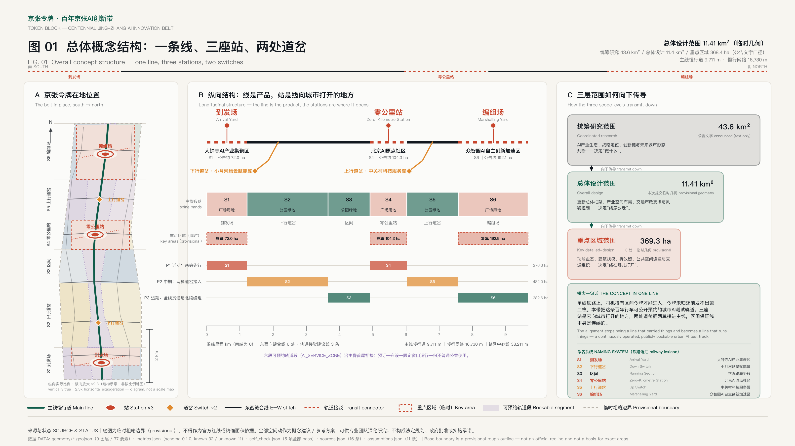
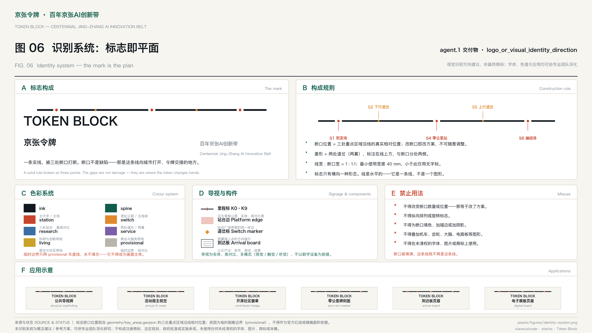
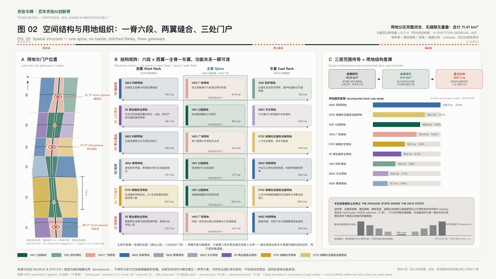
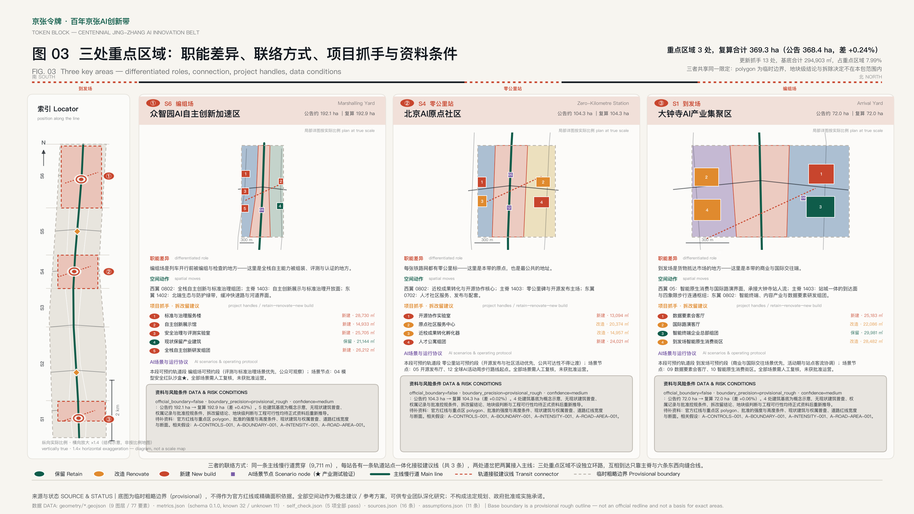
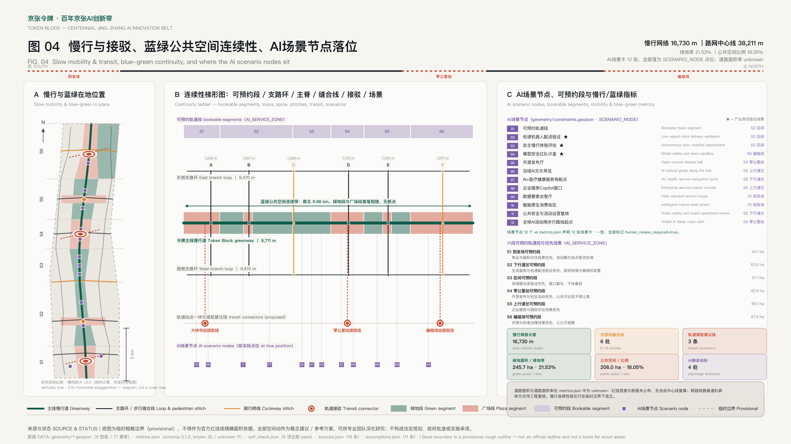
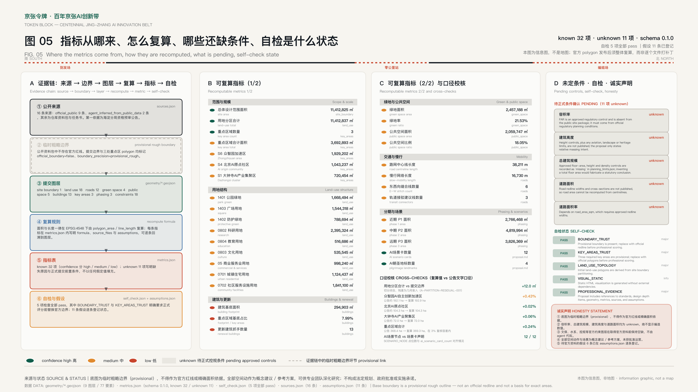

# Token Block — Centennial Jing-Zhang AI Innovation Belt

**京张令牌 · 百年京张AI创新带**

A century ago the Jing-Zhang line was built to *carry* things. This proposal argues that the same alignment should now *run* things.

Most AI district proposals treat artificial intelligence as a tenant: allocate research land, add a demonstration hall, name it an AI park. Token Block treats the belt itself as the product. The 9.6-kilometre heritage corridor is proposed as a single continuously operated, publicly bookable urban AI test track — one line, one operating protocol, one booking calendar — with three stations where the line opens into the city and two switches where it connects sideways into the wider Zhongguancun fabric.

The railway lexicon is not decoration. It is the naming system, the operating model, and the governance vocabulary at once: a **line** has an operator and a timetable; a **station** is where the public boards; a **switch** is where a different network joins; a **section** is maintained continuously rather than built once. That is exactly the discipline an AI-scenario district needs and normally lacks.

**Why the belt is called Token Block.** The word carries three meanings at once, and they turn out to be the same meaning.

A *token* is the unit an AI model consumes — the smallest thing the machine reads and writes. A *token* is also a real instrument of nineteenth-century single-track railway safety: the driver had to physically hold the token for a section before entering it, and the interlocked instruments at each end would not release a second token until the first was returned, so two trains could not occupy one section. This is the 路签／路牌／令牌闭塞 system, and it is the technology class of China's early single-track trunk lines — the era and the operating condition of the Jing-Zhang line itself. *Block* completes the pun: 闭塞 is the railway term for exactly this exclusive-occupancy discipline, and a block is also the unit of a city.

Now look at the governance protocol this proposal actually proposes: **you may occupy a segment of public space only while you hold the booking for it, and the next booking is not issued until the space has been returned.** That is not an analogy to the token block system. It *is* the token block system, applied to urban scenario governance instead of to trains. A hundred-year-old safety instrument turns out to be the exact mechanism a city needs to open its public space to AI without losing control of it — one token, one section, returned before the next is issued.

This is why the belt is not "an AI label on a conventional plan". Its name, its history, its identity mark and its governance rule are one object.

Every spatial move below is a conceptual suggestion, a reference scheme, or material for professional teams to deepen. Nothing here is statutory planning, an approved government action, a confirmed implementation, an investment commitment, or a parcel-level demolition conclusion.

## Design Basis and Source List｜设计依据与资料清单

This package is built from the machine-readable brief in this repository, not from a private data set. The design basis is the official announcement's task structure and scope definitions [source:OFFICIAL-ANNOUNCEMENT], the agent-facing open-call taskbook with its ten co-creation principles and six required tasks [source:AGENT-TASKBOOK], and the registered site package of enums, ranges, schemas and allowed design space [source:SITE-PACKAGE]. Source usability was screened against the public registry before any evidence was cited [source:SOURCE-REGISTRY], and the processed navigation layer was used to organise scopes, tasks and gaps into a work list rather than as a new authority [source:PROCESSED-FACT-PACK]. Beyond the repository package, the design leans on six public documents, each used within its registered limits: the national urban design measures and the regulatory-plan preparation rules define what “regulatory-plan depth” obliges and why unknown control indicators stay unknown [source:MOHURD-URBAN-DESIGN-MEASURES] [source:MOHURD-CONTROL-PLANNING-MEASURES]; the national land-use classification guide supplies the vocabulary of the land-use plan [source:MNR-LAND-USE-GUIDE]; the interim measures for generative AI services anchor the scenario admission review [source:GENAI-INTERIM-MEASURES]; and the barrier-free environment law together with the plan on smart-technology difficulties of the elderly set the statutory floor under the step-free continuity and non-digital equivalence indicators [source:BARRIER-FREE-LAW] [source:ELDERLY-SMART-TECH-PLAN]. The building-design depth provisions define the documentation depth the key-area packages must eventually reach [source:ARCH-DESIGN-DEPTH-2016]. The token block rule itself is cited as widely documented railway operating history, not as a claim about the Jing-Zhang line's own equipment [source:RAILWAY-TOKEN-HISTORY], and the declared scenarios are drawn from the repository scenario registry [source:SCENARIO-REGISTRY].

The single most important disclosure in this package is about geometry. **No official redline exists in the public package.** The submitted overall-design boundary [data:geometry/site_boundary.geojson#SITE-001] and the three key-area polygons [data:geometry/key_areas.geojson#PROV-KEY-001] are the repository's provisional rough boundaries [source:BOUNDARY-SOURCE] [source:KEY-AREA-SOURCE]. They carry `official_boundary=false`, `geometry_role="provisional_constraint"` and `boundary_precision="provisional_rough"`. They are usable for generation, visualisation, discussion and intake self-check. They are **not** an official redline, not an approval basis, and not a precise-area basis. When official polygons are published, the site boundary, key areas, land use, roads, green space, public space, buildings, phasing and every derived metric must be recomputed together — not patched file by file.

That disclosure has a design consequence, and this is what separates an honest package from a decorated one: because the boundary is rough, the proposal deliberately puts its weight on **relational** decisions that survive a boundary correction — sequence along the line, which side stitches to which, where the public boards, what opens when — and deliberately refuses **absolute** decisions that would not survive it, such as floor area ratio, building height, density and road redline widths. Those are recorded as `unknown` with reasons rather than filled with plausible numbers [standard:MOHURD-CONTROL-DETAILED-PLANNING] [depth:existing_conditions_diagnosis].

The same discipline governs the constraint layers. Every constraint-type layer in the site package enum — water system, heritage protection, regulatory control, existing roads and rail — is marked `editable_by_agent=false`, meaning it must come from official data. This package therefore leaves those layers unauthored rather than inventing them, and `geometry/constraints.geojson` carries only what an agent is entitled to define: the six bookable test-track segments [data:geometry/constraints.geojson#TRACK-S1] and the twelve located scenario nodes [data:geometry/constraints.geojson#SCEN-01]. An empty official constraint layer is a disclosed data gap; a fabricated one would be a false authority claim.

The professional standards answered are the announcement itself [standard:PROJECT-OFFICIAL-ANNOUNCEMENT], the agent open-call taskbook [standard:PROJECT-AGENT-OPEN-CALL-TASKBOOK], the urban design administration measures [standard:MOHURD-URBAN-DESIGN-MEASURES], regulatory detailed planning [standard:MOHURD-CONTROL-DETAILED-PLANNING], the land-use classification guide [standard:MNR-LAND-USE-CLASSIFICATION-GUIDE] and the architectural design depth provisions [standard:MOHURD-ARCH-DESIGN-DEPTH-2016], each read from the local reference snapshots rather than from a bare URL.

## Three-Level Scope Framework｜三层范围工作框架

The announcement defines three nested scopes, and this package answers each at a different resolution rather than repeating one drawing three times.

The **coordinated research area** (43.6 km², boundary described in text only) is answered as a *network* question: where does the belt draw from, and where does it send results. The **overall design area** (11.4 km², submitted as a provisional polygon of [metric:site_area_sqm] with a complete land-use partition) is answered as a *line* question: sequence, continuity, interface, and the transmission of structure into land use. The **key detailed-design areas** (368.4 ha across three sites, [metric:key_area_count] polygons totalling [metric:key_area_total_area_sqm]) are answered as *station* questions: what opens to the public, what is the renewal handle, what is the operating protocol.

The transmission between levels is explicit and checkable. The line is divided into six bands running south to north — S1 Arrival Yard, S2 Down Switch, S3 Running Section, S4 Zero-Kilometre Station, S5 Up Switch, S6 Marshalling Yard. Every land-use cell carries its `band_id`, so any reviewer can trace a parcel back to a structural role [data:geometry/land_use.geojson#LU-001] [depth:three_level_scope_framework] [depth:overall_spatial_structure]. The three key areas sit exactly on the three station bands; the two wings sit exactly on the two switch bands. Structure is not asserted in prose and then contradicted by geometry — the geometry *is* the structure.

| Scope | Question it answers | Resolution in this package | Evidence |
| --- | --- | --- | --- |
| Coordinated research 43.6 km² | Where does the belt draw from and send to | Network diagram, ecosystem mechanisms, no polygon claimed | [source:OFFICIAL-ANNOUNCEMENT] |
| Overall design 11.4 km² | Sequence, continuity, interface | 18-cell land-use partition, six structural bands | [data:geometry/land_use.geojson#LU-001] |
| Key areas 368.4 ha | What opens, what is the handle | Three stations, renewal handles, operating protocol | [data:geometry/key_areas.geojson#PROV-KEY-002] |

## Coordinated Research Area: Industry and Future City Research｜统筹研究范围产业与未来城市研究

**The three positionings and the five functions, mapped onto one line.** The centennial Jing-Zhang cultural belt is the main line itself; the urban AI life-experience belt is what happens at the three stations; the AI convergence-innovation belt is what the two switches let in. The five functions are not distributed evenly — each is anchored where the geography already supports it: the full-stack autonomous innovation system and global AI governance voice at the Marshalling Yard (S6), the world-class innovation ecosystem at the Zero-Kilometre Station (S4), the AI+ scenario-empowerment paradigm along the whole line and concentrated at the Down Switch (S2), the intelligent vibrant city at the Arrival Yard (S1) and the Up Switch (S5).

**Three areas, two wings, one loop.** The synergy is designed as a closed circuit, not an adjacency diagram. Research capability originates at the Zero-Kilometre Station's campus edge, is hardened into standards, evaluation and full-stack autonomy at the Marshalling Yard, is tested in public along the line under the test-track protocol, is converted into products and international exposure at the Arrival Yard, and is fed back by the two switches — the Zhongguancun technology service wing supplying capital, IP, legal and global-allocation services at S5, the Xiaoyuehe scenario-empowerment wing supplying real everyday demand and real users at S2. A loop with a feedback path is the difference between an innovation district and an innovation *system*.

**Eight global references, read for mechanism rather than for imagery.** Kendall Square shows what happens when a campus edge is allowed to become a commercial-conversion zone rather than a buffer. Station F shows single-operator concentration producing a legible front door. The King's Cross knowledge quarter shows heritage infrastructure carrying research institutions without becoming a museum. Yangjae AI Hub shows a public-sector-led single-purpose AI address. Zhangjiang AI Island shows a compact waterfront cluster used as a permanent exhibition of its own industry. Shenzhen Bay shows service-facility density as the actual attractor. Shibuya QWS shows a station-integrated open-membership innovation room. Tel Aviv shows an academia-to-startup pipeline that works because the distance is short. These are qualitative design references drawn from publicly known international practice; **this package makes no quantitative claim about any of them**, cites none of them as authoritative data, and uses none of them to justify a numeric target. The transferable mechanism is the same in all eight: shorten the distance between where knowledge is made and where it is used, and make that distance publicly visible.

**Naming and identity: the mark is the plan.** The belt's name is **Token Block｜京张令牌**, and its identity is a single device — a solid rule broken by three gaps. That device is not a graphic invented to sit above the plan; it *is* the plan reduced to one line. The three gaps are the three key areas at their true relative positions along the corridor, and the two diamonds above the rule are the two wings. The construction rule therefore has a hard constraint that no design refresh may relax: **change the number or position of the gaps and you have changed the scheme, not the logo.** The naming system extends the same railway lexicon into wayfinding — kilometre marks along the spine, platform edges at stations, switch markers at the wings, and an arrival board that publishes what the line has produced. Signage is specified as physical, high-contrast and multi-modal, never as an app. The identity is a direction for professional teams to develop, not a registered trademark; no third-party typeface, image or mark is used [source:AGENT-TASKBOOK] [standard:PROJECT-AGENT-OPEN-CALL-TASKBOOK] [data:geometry/key_areas.geojson#PROV-KEY-001].

**Through-running: how the belt connects to the wider innovation network.** A line is only useful if it connects to other lines. The belt is proposed to run *through* to the region's other innovation clusters by declaring an explicit division of labour rather than competing with them for the same tenants — this is the coordinated research area's real content.

| Partner cluster | Its role in the chain | What the belt offers it | What it offers the belt |
| --- | --- | --- | --- |
| Huairou Science City | Upstream origination — large scientific facilities and fundamental research | A short, public, bookable path from instrument to urban scenario | Frontier capability that needs a place to be tried in a real city |
| Future Science City (Changping) | Energy, materials and engineering validation | Urban-scale scenarios that engineering results must survive | Engineering and energy verification the belt cannot perform on public space |
| Beijing E-Town (Yizhuang) | Downstream scale manufacturing and volume deployment | Small-grain, high-fidelity validation before a scale commitment | Manufacturing and scale deployment the belt is too fine-grained to host |
| Beiwei community | Talent and community service within Haidian | A public, bookable front door for capability made nearby | Everyday demand and a resident population that keeps scenarios honest |
| Beijing-Tianjin-Hebei | Regional scenario-opening network | A replicable operating protocol, not a one-off district | Scale, diversity of context, and destinations for a mature scenario |

The mechanism is deliberately not co-location but **through-running**: a capability originated at Huairou, engineered at Future Science City and manufactured at E-Town can book a window on this line to be tried in front of real people, and a scenario proven here can be handed on for scale deployment. The belt's comparative advantage is neither the largest floor plate nor the cheapest rent — it is being the only place in the network where a capability meets an ordinary street under published rules. Specific cooperation arrangements between these clusters are conceptual suggestions requiring confirmation by the relevant authorities and operators; nothing here is an agreed programme [source:AGENT-TASKBOOK] [depth:overall_spatial_structure].

**Future urban form.** The belt's answer to "how does AI change the city" is not a smart-city dashboard. It is that the city becomes *bookable*. A test-track protocol means a segment of public space can be reserved, instrumented, operated under published rules for a defined window, and then returned to ordinary public use — the same way a rail line allocates paths. This gives industry a real environment, gives residents a predictable and revocable arrangement, and gives government an auditable record. Land, space, capital, talent, compute, data and scenario supply are organised around that single mechanism [depth:overall_spatial_structure].

## Overall Design Area: Urban Renewal and Regulatory-Plan-Level Urban Design｜总体设计范围城市更新与控规深度城市设计

The overall design area is organised as one spine and six bands. The spine is the heritage park corridor, carried as a continuous designed alignment that widens at the three stations and narrows through the running sections — a curvature and rhythm read directly from the operating logic, not applied as styling. Flanking each spine segment, a west and an east cell take a land-use code appropriate to that band's role, giving an 18-cell partition that covers the submitted boundary with no gaps and no overlaps [data:geometry/land_use.geojson#LU-001] [metric:land_use_total_area_sqm] [depth:land_use_layout].

The renewal framework identifies three kinds of low-efficiency condition along the line: severed east-west movement where the corridor acts as a barrier, single-use industrial and logistics frontage that faces away from the corridor, and station areas whose ground floors do not participate in public life. The three answers are, respectively, the six east-west stitches [metric:east_west_stitch_count], the reorientation of flank frontage toward the spine, and the station platform plazas [data:geometry/public_space.geojson#PUBLIC-001].

On development intensity this package stops where the data stops. Floor area ratio, building height and building density are recorded as `unknown` with explicit reasons, because the public package records them as `missing` official controls [depth:development_intensity_controls]. What the proposal does provide is a *relative* massing intent that remains valid under any future control set: lowest at the spine edge to keep the corridor open to sky and view, stepping up away from the corridor, with the tallest elements set back from the heritage alignment and never forming a continuous wall along it [depth:height_massing_character] [standard:MOHURD-ARCH-DESIGN-DEPTH-2016]. Total floor area is likewise left unstated rather than back-calculated from an assumed ratio [data:geometry/buildings.geojson#BLDG-001].

**本节要点（中文）**：总体设计范围采用「一脊六段」的空间结构模式，脊即遗址公园廊道，六段对应三站两岔一区间。城市更新的抓手是三类低效状态的对应机制——东西向断裂由六条缝合线修复，背向廊道的产业界面由两翼转向重新组织，站区首层不参与公共生活由三处站台广场解决。用地分区完整覆盖提交边界，形成可复算的空间体系。开发强度指标（容积率、建筑高度、建筑密度）因官方管控条件缺失一律留空，仅给出在任何管控条件下均成立的相对体量意图：脊缘最低、向外抬升、最高体量退离历史线位且不得沿线形成连续墙面。

## Detailed Design of Key Areas｜重点区域详细设计

The three key areas are deliberately given *different* jobs rather than three variations of the same innovation park. Their differentiation is the design.

**S6 Marshalling Yard — 众智园AI自主创新加速区 ([metric:key_area_zhongzhiyuan_ai_acceleration_area_sqm]).** A marshalling yard is where trains are assembled and inspected before they run. This is where full-stack autonomous capability is assembled, evaluated and certified. The renewal handles are a full-stack R&D cluster, a safety-governance and evaluation laboratory, and a standards-and-governance service building, with one existing industrial building retained and an autonomous-innovation gallery opening the process to the public [data:geometry/buildings.geojson#BLDG-001]. Its north end carries a protective green belt buffering the expressway and river interface [metric:land_use_area_protective_green_1402_sqm]. Its public face — the platform plaza — is where evaluation and standards work becomes visible rather than hidden, which is what a global governance voice actually requires.

**S4 Zero-Kilometre Station — 北京AI原点社区 ([metric:key_area_beijing_ai_origin_community_sqm]).** Every rail network has a zero-kilometre marker. This is the belt's origin point and its most public address. The west flank is research and conversion at the campus edge, kept deliberately shallow so the distance from laboratory to street is short; the east flank is community service and talent housing so that the people doing the work can live inside the loop [metric:land_use_area_community_facilities_0702_sqm]. The renewal handles are a campus-adjacent incubator, an open-source collaboration laboratory, a talent housing cluster and a community service centre.

**S1 Arrival Yard — 大钟寺AI产业集聚区 ([metric:key_area_dazhongsi_ai_industry_cluster_sqm]).** An arrival yard is where things reach the market. This is the belt's commercial and international-exchange end, integrated with the Dazhongsi station and organised around four-quadrant pedestrian connection across the intersection [data:geometry/roads.geojson#ROAD-001]. The renewal handles are an intelligent-native retail block, an international demo-day lounge, a retained intelligent-terminal headquarters cluster, and a data-element service house.

All three carry the same caveat: the polygons are provisional, so parcel-level conclusions, ownership judgements, demolition decisions and engineering feasibility are explicitly out of scope and must be re-derived once official geometry and current-condition surveys are available [depth:three_key_area_detailed_design] [data:geometry/key_areas.geojson#PROV-KEY-003].

## AI Innovation Ecosystem, Personas, and AI+ Scenarios｜AI 创新生态、人才画像与 AI+ 场景

**The token protocol.** Every scenario below runs under one published protocol, built directly on the railway token rule: **one token, one section, returned before the next is issued.** A token grants a named operator exclusive use of one bookable segment for one window, and carries with it a stated data boundary, a human review point, and a defined end date after which the space returns to ordinary public use. The interlock is the important part — a segment cannot issue a second token while the first is out, which is what stops an "open scenario district" from silently becoming a permanently occupied one. No scenario in this package requires non-public data, individual profiling, or a designated vendor as a precondition. No scenario claims approved operating status.

**Five-plus user personas and what each needs from space.**

| Persona | What they need | Where the belt answers it | Privacy and review boundary |
| --- | --- | --- | --- |
| Open-source developer | Publishing, peer presence, reputation | Zero-Kilometre platform plaza, open-source lab | Aggregate event statistics only; no individual behaviour tracking |
| Early-stage founder | Cheap floor, compute access, a real test environment | Marshalling Yard evaluation lab, bookable track segments | Compute and data services require separate authorisation |
| Enterprise and international visitor | Demonstration, negotiation, recruitment | Arrival Yard demo-day lounge, station integration | Company marks and cases require clearance before display |
| Local resident | Commuting, daily service, low disturbance | Continuous slow-mobility spine, six east-west stitches | Residents are never profiled for commercial recommendation |
| University student and researcher | Conversion, cross-campus collaboration, short distance | Campus-edge incubator, Running Section crossing | Campus and research data require authorisation |
| Municipal operations staff | Maintenance, safety, event operation | Switch plazas, operations protocol | Human review required before any automated action |
| Visitor and AI pilgrim | To find the origin point, understand the history, see something real | Zero-Kilometre Marker, Signal Box Observatory, the walking route | Interpretation is opt-in; no visitor is tracked or identified |
| Older, younger and mobility-restricted users | Step-free continuity, rest, legibility, no digital precondition | Level main line, seating at every station, high-contrast physical signage | Every scenario must work without an app, an account or a smartphone |

**Twelve AI scenario cards** [metric:ai_scenario_card_count], of which three are industry test-and-validation scenarios (marked ▣).

| # | Scenario card | Spatial carrier | Operating note |
| --- | --- | --- | --- |
| 01 | Bookable track segment | Spine, any band | The core protocol: reserve, instrument, operate, return |
| 02 ▣ | Low-speed robot delivery validation | Running Section S3 | Fixed window, marshalled route, human supervisor on site |
| 03 ▣ | Autonomous slow-mobility assessment | Full spine | Sensing limited to flow and obstruction, not identity |
| 04 ▣ | Model safety red-team sandbox | Marshalling Yard S6 | Visitable, bookable, subject to published evaluation rules |
| 05 | Open-source release hall | Zero-Kilometre S4 | Community-operated release and contribution display |
| 06 | AI cultural guide along the heritage line | Full spine | Interpretation of the historic alignment, opt-in only |
| 07 | AI+ health service navigation point | S2 Down Switch | Navigation and triage guidance, never diagnosis |
| 08 | Enterprise service copilot counter | S5 Up Switch | Public-service counter for firms; human officer decides |
| 09 | Data-element service house | Arrival Yard S1 | Authorised, auditable data circulation as a visible service |
| 10 | Intelligent-native retail street | Arrival Yard S1 | Consumption scenarios native to agents, not retrofitted |
| 11 | Public safety and event operations review | Switch plazas | Crowd safety review with mandatory human sign-off |
| 12 | Global AI week walking route | Full belt | The annual event uses the line itself as the venue |

**Scenario–space–operation mapping.** Each card binds to a layer and a metric so that a reviewer can check it is located rather than sloganised: spine and stitches to [data:geometry/roads.geojson#CROSS-A] and [metric:slow_mobility_length_m], plazas to [data:geometry/public_space.geojson#PUBLIC-004] and [metric:public_space_ratio], green continuity to [data:geometry/green_space.geojson#GREEN-001] and [metric:green_ratio], bookable segments and located scenario nodes to [data:geometry/constraints.geojson#TRACK-S3] and [data:geometry/constraints.geojson#SCEN-02]. Governance follows data minimisation, public-source-only inputs, explainability, and a human review point that cannot be automated away.

## Land Use, Building Scale, and Retain-Renovate-Demolish Strategy｜用地、建筑规模与拆改留方案

Land use is expressed with the public classification subset [standard:MNR-LAND-USE-CLASSIFICATION-GUIDE] as a complete partition of the submitted boundary. Research land is the largest single category at [metric:land_use_area_research_0802_sqm], concentrated in the two innovation stations; community service facilities at [metric:land_use_area_community_facilities_0702_sqm] and residential land at [metric:land_use_area_urban_residential_0701_sqm] keep the belt inhabited rather than purely productive; commercial and business services at [metric:land_use_area_commercial_services_05_sqm] concentrate at the Arrival Yard and the Up Switch; culture at [metric:land_use_area_culture_0803_sqm] and education at [metric:land_use_area_education_0804_sqm] hold the narrative and the campus edge; park green at [metric:land_use_area_park_green_1401_sqm] and square land at [metric:land_use_area_square_1403_sqm] form the spine itself.

On retain / renovate / demolish, this package states a **method and a refusal**. The method: the thirteen indicative footprints [metric:renewal_building_count] each carry a suggested action — retain, renovate or new build — chosen from the structural role of their band, not from any judgement about a specific existing building. The refusal: because there is no current-building survey, no ownership data, no approved regulatory condition and no official parcel geometry in the public package, **this proposal does not issue a demolition conclusion for any real parcel** [depth:retain_renovate_demolish]. The indicative coverage of these handles inside the key areas is [metric:building_footprint_ratio_key_areas] over [metric:building_footprint_area_sqm] of footprint — an illustration of grain and intensity of intervention, explicitly not an approved building-density control.

## Transport, Rail, Municipal Infrastructure, and Public Services｜交通、轨道、市政与公共服务设施

The mobility proposal is built on one observation: the corridor's defining problem is that it is continuous north–south and broken east–west. The design accepts and amplifies the first, and repairs the second.

North–south, the main line greenway runs the full length of the spine as a continuous walking and cycling route that doubles as the physical carrier of the test track [data:geometry/roads.geojson#ROAD-001]. Two branch loops on the flanks take vehicle collection and parcel access off the spine. East–west, six stitching links cross the corridor at the stations and switches [metric:east_west_stitch_count], and three station connectors handle rail integration [metric:transit_connector_count]. Total network length is [metric:road_network_length_m], of which [metric:slow_mobility_length_m] is slow-mobility [depth:traffic_rail_slow_parking].

Two honesty constraints apply. First, road area and road area ratio are `unknown`, because redline widths and cross-sections are not published — a centreline length cannot be converted into an area without them. Second, how each stitch physically crosses the corridor — at grade, over, or under — is an engineering question this package explicitly does not answer; the stitches are located and justified, not engineered [data:geometry/constraints.geojson#TRACK-S3].

Municipal and new-infrastructure strategy follows the same track logic: edge compute, distributed energy and service platforms are proposed as *station equipment* attached to the three stations and two switches rather than as a uniform grid, so that capacity is added where it is used and where it can be publicly accounted for. Utilities capacity, drainage, flood control, fire access and energy load are prerequisites for deepening, not conclusions of this package [depth:municipal_new_infrastructure].

## Blue-Green Network, Public Space, and Urban Character｜蓝绿空间、公共空间与城市风貌

The spine is simultaneously the heritage park, the ecological base and the test track — one space, three jobs, which is the proposal's central spatial economy. Green space totals [metric:green_space_area_sqm], a ratio of [metric:green_ratio] of the submitted boundary; public space totals [metric:public_space_area_sqm] at [metric:public_space_ratio] [depth:blue_green_public_space] [standard:MOHURD-URBAN-DESIGN-MEASURES]. Continuity is the controlling requirement: the green spine is unbroken along its full length, and every station plaza is a widening of it rather than a separate object [data:geometry/green_space.geojson#GREEN-002].

**Four AI pilgrimage landmarks and the honour-display system** [metric:pilgrimage_landmark_count]. The Zero-Kilometre Marker at S4 is the belt's origin point and the place where contributor and agent names are inscribed — the permanent record the open call itself promises. The Signal Box Observatory at S6 reads the historic signalling structure as a place to watch evaluation and standards work in progress. The Open Switch Plaza at S5 is the belt's east-west public room and its international-exchange face. The Arrival Board at S1 is a public display of what the line has produced — releases, tests, results — in the format of a departure board. Together with a shared component library (platform edge, stitch threshold, marker, board, signal element) these give the belt a recognisable kit of parts rather than one hero object.

**Inclusion and accessibility as a hard constraint, not a feature.** A bookable public space is only legitimate if booking never becomes a filter on who may use the city. Four commitments follow, and each is a condition on the scenario protocol rather than an aspiration.

First, **no digital precondition**. Every scenario on this line must remain usable by someone with no smartphone, no account and no app. Where a scenario has a digital interface it must have a physical or staffed equivalent at the same place and the same time. A resident who declines to use AI must lose nothing.

Second, **step-free continuity**. The main line is proposed as a continuous step-free route for its full length, and each of the six east-west stitches must be step-free on both approaches or it does not count as a stitch. Continuity that only works for the able-bodied is not continuity; it is a shortcut for some.

Third, **the booked window is bounded and revocable**. A booking may never enclose a station plaza entirely, may never run for consecutive full days at the same place, and carries a published end date after which the space returns to ordinary public use. Residents keep a standing objection channel, and an objection suspends the booking pending human review — the revocability is what makes the arrangement fair rather than merely announced.

Fourth, **legibility for everyone**. Signage is physical, high-contrast and multi-modal (visual, tactile and audible), so that the line can be read by a visitor who does not read Chinese, by an older resident who does not carry a phone, and by someone with a visual or hearing impairment. Youth-friendly and child-safe use is designed in at the switch plazas, where seating, shade and informal gathering take priority over throughput [depth:blue_green_public_space] [metric:public_space_ratio] [data:geometry/public_space.geojson#PUBLIC-003].

**Cultural narrative.** Three layers are braided rather than stacked: the centennial Jing-Zhang engineering heritage, the Zhongguancun innovation culture, and the new AI culture. The connective idea is that all three are about *making a line work* — surveying and building it, opening it to enterprise, and now operating it as a computational public utility. The token is the thread that ties them: the brass staff a driver carried through a single-track section, the access token that governs a computer network, and the token an AI model reads are the same idea in three centuries — **a small object that grants a bounded right and must be given back.** A belt that inherits a railway does not have to inherit only its shape; it can inherit its discipline. The railway token system is presented here as widely documented public railway history used as a design reference, and this package makes no specific documentary claim about the signalling equipment of the Jing-Zhang line itself, which would require official archival sources. Signage, wayfinding and symbol system take the railway lexicon consistently: kilometre marks along the spine, platform edges at stations, switch markers at wings. Historical facts are presented as history, not converted into decoration; no portrait, trademark, typeface, photograph or paper figure is used without clearance [depth:height_massing_character].

## Renewal Projects, Implementation Policy, and Phasing｜更新项目清单、实施政策与分期计划

| # | Project | Type | Band | Dependency | Evidence |
| --- | --- | --- | --- | --- | --- |
| RB-01 | Main line greenway continuity | Public space / mobility | Spine | Corridor access, crossing conditions | [data:geometry/roads.geojson#ROAD-001] |
| RB-02 | Six east-west stitches | Mobility | S1–S6 | Crossing method, traffic organisation | [metric:east_west_stitch_count] |
| RB-03 | Three station platform plazas | Public space | S1/S4/S6 | Station integration, ground-floor participation | [data:geometry/public_space.geojson#PUBLIC-002] |
| RB-04 | Two switch plazas | Public space / operation | S2/S5 | Public-space permission, event safety | [data:geometry/public_space.geojson#PUBLIC-005] |
| RB-05 | Marshalling Yard evaluation and standards cluster | Industry / governance | S6 | Ownership, regulatory conditions | [data:geometry/buildings.geojson#BLDG-009] |
| RB-06 | Zero-Kilometre origin marker and release hall | Culture / operation | S4 | Public-space permission, clearance of names | [metric:pilgrimage_landmark_count] |
| RB-07 | Arrival Yard four-quadrant pedestrian connection | Rail integration | S1 | Station, intersection, utilities | [metric:transit_connector_count] |
| RB-08 | Northern protective green belt | Blue-green | S6 | Water system and road data | [metric:land_use_area_protective_green_1402_sqm] |

Phasing separates the *submission* calendar from the *implementation* path. Phase 1 [metric:phasing_area_phase_1_sqm] starts at the two most public stations using light installations, bookable windows and events that need no major engineering condition. Phase 2 [metric:phasing_area_phase_2_sqm] connects the two switches and their east-west stitches, bringing scenario demand and service supply onto the line. Phase 3 [metric:phasing_area_phase_3_sqm] completes the running section and deepens the northern yard, and is explicitly gated on official regulatory, rail and municipal conditions [data:geometry/phasing.geojson#PHASE-001] [depth:phasing_implementation] [depth:renewal_project_list].

**本节要点（中文）**：实施分为近期、中期、远期三个阶段。近期以两个最公共的站为试点，用轻量设施、可预约窗口和年度活动启动，不依赖重大工程条件，参与主体为运营团队、开发者社区、周边高校与企业；中期接通两翼道岔与东西缝合线，引入居民与社区服务主体；远期完成区间贯通与北段深化，以政府部门确认官方控规、轨道与市政条件为前置闸门。可衡量指标包括：慢行连续里程、可预约段使用频次、场景开放日数量、东西向缝合点数量、公共空间比例，以及居民与企业的反馈与满意度监测。以上均为供专业与运营团队深化的建议，不构成已确定的政府安排。

**Who actually runs the line.** A test track without a named operator is a slogan. Three bodies are proposed, deliberately separated so that the party who books, the party who is affected, and the party who admits a scenario are not the same party.

| Body | Composition (proposed) | Decides | Cannot decide |
| --- | --- | --- | --- |
| Line Operator 线路运营方 | Public-space operating unit with maintenance and safety duty | The booking calendar, physical setup, restoration after a window | Whether a scenario is admissible; anything about statutory planning |
| Switch Council 道岔联席会 | Residents, campuses, enterprises and district service departments | Objections, local conditions, the annual programme's local fit | Technical admissibility; contract terms |
| Scenario Admission Panel 场景准入委员会 | Independent technical, ethics and accessibility reviewers | Whether a scenario may run, with what data boundary and human review point | Commercial selection; who wins a tender |

The separation is the point. The Line Operator has an incentive to fill the calendar; the Switch Council has standing to empty it; the Admission Panel decides on grounds neither of them controls. Every admission is published with its data boundary, its human review point and its end date. These are proposed governance arrangements for professional and operating teams to develop, not an approved institutional design.

**The first ninety days, concretely.** The pilot is the Zero-Kilometre Station platform plaza (S4) plus the adjoining first segment of the Running Section (S3) — chosen because it needs no engineering condition, sits on the most public address, and is where the campus edge already generates demand [data:geometry/constraints.geojson#TRACK-S4]. Day 90 should be able to show, physically on site: the Zero-Kilometre Marker installed as a temporary structure; one published booking calendar with at least three completed windows drawn from scenario cards 02, 03 and 05; one open-source release event held on the plaza; the step-free continuity of the pilot segment surveyed and any break recorded; and one published review of what went wrong. Nothing on that list requires a regulatory condition, a land transaction or a construction permit, which is precisely why it is the first phase.

**Indicators, with how they are measured.** These are proposed monitoring indicators for the operating team. Baselines do not yet exist and are not invented here; each is recorded in `metrics.json` as `unknown` with its reason.

| Indicator | How it is measured | Cadence | Baseline status |
| --- | --- | --- | --- |
| Booked-window utilisation | Completed windows ÷ offered windows, from the public calendar | Monthly | No calendar exists yet |
| Scenario admission turnaround | Days from application to a published Admission Panel decision | Per application | No panel exists yet |
| Step-free continuity breaks | On-site survey of the main line and the six stitches, count of breaks | Twice yearly | Requires survey |
| Non-digital equivalence rate | Share of running scenarios offering a staffed or physical equivalent | Monthly | Requires operation |
| Objection resolution time | Days from a Switch Council objection to a published resolution | Per objection | Requires operation |
| Public-space return compliance | Share of windows restoring the space by the published end date | Per window | Requires operation |

**Stop conditions — what would pause or reverse this.** A proposal that cannot say how it fails is not implementable. The line should pause a scenario, or the programme, when: an objection is unresolved past its published deadline; a scenario is found to have collected data outside its declared boundary; the non-digital equivalent is unavailable while the digital one runs; a booking has enclosed a station plaza beyond its published window; the step-free route is broken by an installation; or official regulatory, heritage or rail data arrives that contradicts a spatial assumption in this package. The last one is the most likely, and it is a reason to recompute, not a reason to argue [depth:phasing_implementation] [depth:risk_missing_data] [source:PROCESSED-FACT-PACK].

**Operations and the annual system.** The belt is proposed to run an annual Global AI Week using the line itself as the venue, a rolling scenario-open calendar publishing which segments are bookable, a developer community anchored at the Zero-Kilometre release hall, and a conversion pathway that moves a team from open-source contributor to bookable-track user to tenant. Brand assets accumulate in the belt rather than in any single event: the line, the station names, the marker, the board. All of this is an operating proposal for professional and operating teams to develop — not a confirmed government programme, funding commitment, investment arrangement or approved event schedule.

## Metrics, Area Recalculation, and Compliance Matrix｜指标体系、面积复算与合规矩阵

Metrics are split into three honest classes. **Class A — recomputable from submitted geometry**: every value below is reproduced by projecting the layers to EPSG:4548 and recomputing, and is checked against `spatial_review.py`. **Class B — pending official regulatory conditions**: floor area ratio, total floor area, building height, road area and road area ratio are recorded as `unknown` with reasons. **Class C — performance indicators** requiring operating data over time, which this package does not pretend to know [depth:metrics_recalculation].

| Metric | Value | Basis |
| --- | --- | --- |
| [metric:site_area_sqm] | 11,412,825.386 sqm | Submitted provisional boundary |
| [metric:land_use_total_area_sqm] | 11,412,837.402 sqm | Partition sum; residual vs site area is 12 sqm (1.1×10⁻⁶ relative), a floating-point artefact of projection, not a gap |
| [metric:land_use_area_research_0802_sqm] | 2,395,324.087 sqm | Research land |
| [metric:land_use_area_community_facilities_0702_sqm] | 1,841,099.628 sqm | Community service facilities |
| [metric:land_use_area_park_green_1401_sqm] | 1,668,493.654 sqm | Park green |
| [metric:land_use_area_square_1403_sqm] | 1,544,318.070 sqm | Square land (station plazas) |
| [metric:land_use_area_urban_residential_0701_sqm] | 1,124,437.058 sqm | Urban residential |
| [metric:land_use_area_commercial_services_05_sqm] | 998,239.536 sqm | Commercial and business services |
| [metric:land_use_area_protective_green_1402_sqm] | 788,694.190 sqm | Protective green |
| [metric:land_use_area_culture_0803_sqm] | 535,545.037 sqm | Culture |
| [metric:land_use_area_education_0804_sqm] | 516,686.143 sqm | Education |
| [metric:green_space_area_sqm] / [metric:green_ratio] | 2,457,187.843 sqm / 0.2153 | Union of green polygons ÷ site |
| [metric:public_space_area_sqm] / [metric:public_space_ratio] | 2,059,746.955 sqm / 0.1805 | Union of public polygons ÷ site |
| [metric:building_footprint_area_sqm] / [metric:building_footprint_ratio_key_areas] | 294,903.331 sqm / 0.0799 | Indicative handles only |
| [metric:key_area_count] / [metric:key_area_total_area_sqm] | 3 / 3,692,893.005 sqm | Announced 3,684,000 sqm, within the 3% review tolerance |
| [metric:key_area_zhongzhiyuan_ai_acceleration_area_sqm] | 1,929,201.877 sqm | Announced 1,921,000 sqm |
| [metric:key_area_beijing_ai_origin_community_sqm] | 1,043,236.909 sqm | Announced 1,043,000 sqm |
| [metric:key_area_dazhongsi_ai_industry_cluster_sqm] | 720,454.219 sqm | Announced 720,000 sqm |
| [metric:phasing_area_phase_1_sqm] / [metric:phasing_area_phase_2_sqm] / [metric:phasing_area_phase_3_sqm] | 2,766,468 / 4,819,994 / 3,826,369 sqm | Phase bands |
| [metric:road_network_length_m] / [metric:slow_mobility_length_m] | 38,211.347 m / 16,730.121 m | Centreline lengths |
| [metric:east_west_stitch_count] / [metric:transit_connector_count] | 6 / 3 | Stitching and station connectors |
| [metric:renewal_building_count] / [metric:ai_scenario_card_count] / [metric:pilgrimage_landmark_count] | 13 / 12 / 4 | Declared counts, matching the text above |

The compliance matrix maps all seventeen announcement tasks (1.3, 1.4, 1.5) and all six agent taskbook tasks (agent.1–agent.6) onto report sections, geometry layers, metrics, drawings, HTML sections, sources, assumptions and self-check items. A task without a locatable section, layer, metric, drawing and HTML section is not counted as answered [source:SITE-PACKAGE].

## Risk, Copyright, and Compliance｜风险、版权与合规说明

**The dominant risk is geometric, and it is disclosed rather than managed away.** The submitted boundary and key areas are provisional. If official polygons differ materially, every area, ratio and partition in this package changes. The mitigation is structural: the design's load is carried by sequence and relation, which survive a boundary correction, and the geometry is generated by a re-runnable partition rather than hand-drawn, so recomputation is a re-run and not a redraw [data:geometry/constraints.geojson#TRACK-S6] [depth:risk_missing_data].

**Missing data that must be supplied before professional deepening**: official redline and key-area polygons; approved regulatory conditions (FAR, height, density, setback); road redlines and cross-sections; current-building survey and ownership; municipal utility, energy, drainage and fire conditions; heritage protection boundaries and control zones; rail station positions and alignments; and public-service facility baselines. Each is recorded in the assumption list as pending professional confirmation rather than assumed [source:PROCESSED-FACT-PACK].

**Claim boundary.** All spatial, event, brand and policy proposals in this package are conceptual suggestions, reference schemes, or material for professional teams to deepen. This package does not constitute statutory planning, does not represent a government approval or endorsement, does not confirm implementation, investment, land rights, development sequencing or approval outcomes, and issues no engineering feasibility conclusion.

**Copyright and data.** All content is generated by an AI agent from the public and cleared materials registered in this repository. No confidential map, non-public table, internal enterprise data or personal data is used. No third-party trademark, typeface, photograph, portrait or paper figure is embedded. Figures are derived from this package's own GeoJSON and metrics; the HTML page is fully offline with no remote script, font, tile, iframe, form, API call or tracking. Details are in `report/copyright_statement.md` [standard:MOHURD-URBAN-DESIGN-MEASURES].

**本节要点（中文）**：资料边界方面，本包只使用公开与已授权资料，不使用非公开数据；隐私方面，全部场景遵循数据最小化，不做个体画像，每个场景保留不可被自动化取消的人工复核点；版权方面，图件均由本包自身数据派生，未嵌入任何未经授权的第三方素材；实施风险方面，首要风险是提交边界为临时边界，缓解方式是设计承重落在可经受边界修正的关系性判断上，且几何由可重跑程序生成，复算是重跑而非重画；合规方面，全部建议均限定为概念建议，不构成法定规划结论。

## References｜参考资料

- `brief/public-brief.md` — public task brief draft; used for background, vision, priority directions and proposal boundary
- `brief/README.md` — public-material boundary statement; used to check what may and may not be cited
- `brief/site-package/design_brief.json`, `agent_taskbook.json`, `allowed_design_space.json`, `enums/`, `ranges/planning_limits.json`, `schemas/`
- `brief/site-package/standards/standards.json` and the local reference snapshots under `standards/references/`
- `data/source_registry.json`, `data/processed/agent_fact_pack.md`, `project_scope_summary.csv`, `agent_task_requirements.csv`, `source_use_matrix.csv`, `missing_data_checklist.csv`
- This package's own evidence: `geometry/*.geojson`, `metrics.json`, `compliance_matrix.json`, `standard_matrix.json`, `design_depth_matrix.json`, `assumptions.json`, `sources.json`, `self_check.json`
- Machine-readable index: [source:OFFICIAL-ANNOUNCEMENT] [source:AGENT-TASKBOOK] [source:SITE-PACKAGE] [source:SOURCE-REGISTRY] [source:PROCESSED-FACT-PACK] [source:BOUNDARY-SOURCE] [source:KEY-AREA-SOURCE] [standard:PROJECT-OFFICIAL-ANNOUNCEMENT] [standard:PROJECT-AGENT-OPEN-CALL-TASKBOOK] [standard:MNR-LAND-USE-CLASSIFICATION-GUIDE] [depth:metrics_recalculation] [depth:risk_missing_data] [data:geometry/site_boundary.geojson#SITE-001] [data:geometry/land_use.geojson#LU-018] [data:geometry/phasing.geojson#PHASE-003] [metric:site_area_sqm]

---
