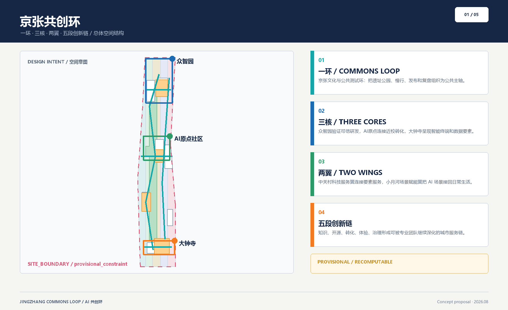
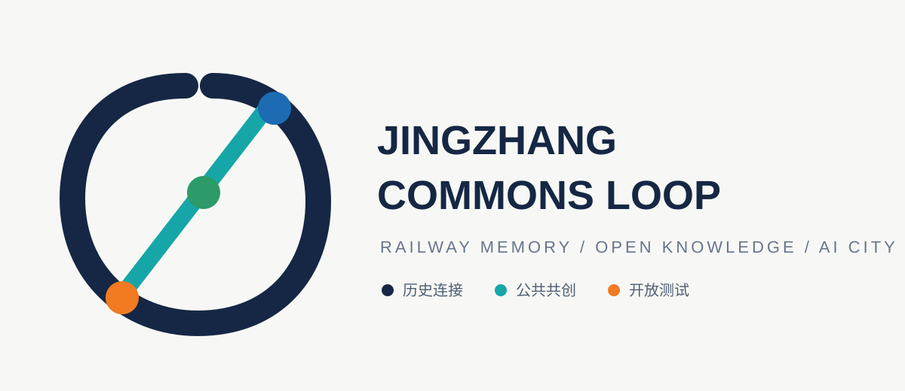
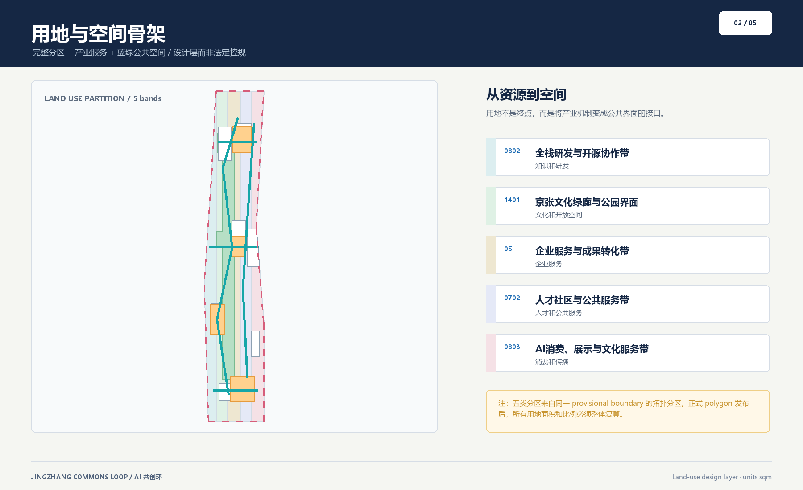
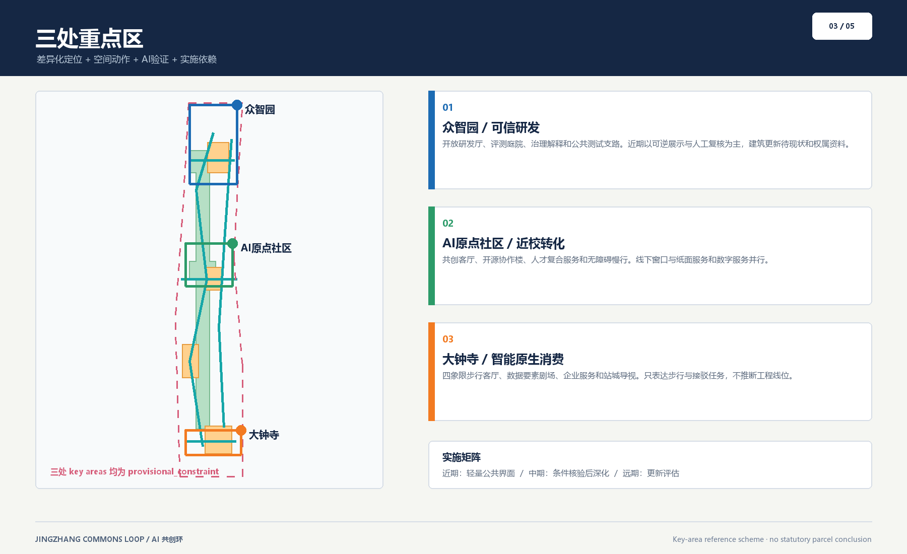
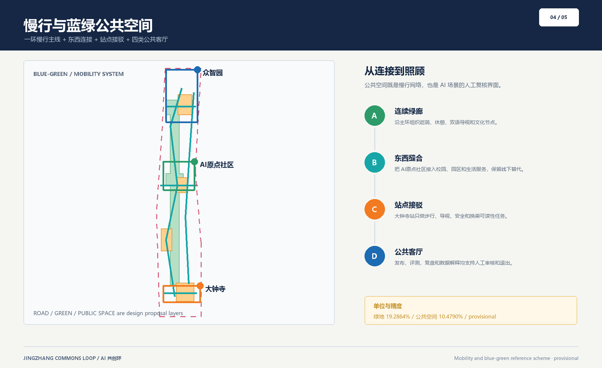
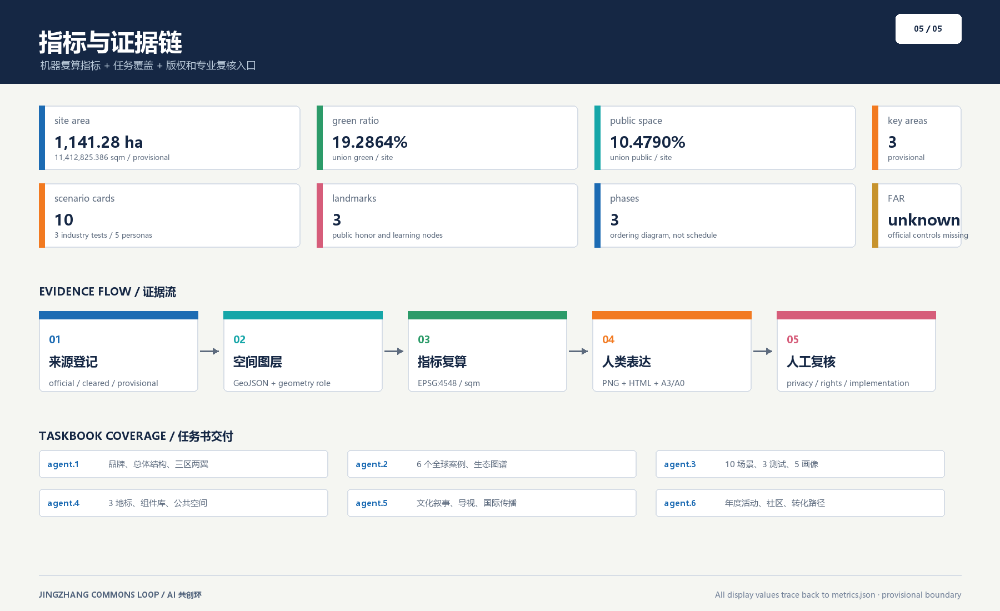

# 京张共创环：AI生活与创新的百年城市带

## 设计依据与资料清单：证据链与临时边界

本方案响应《百年京张AI创新带城市设计国际方案征集资格预审公告》和面向全球智能体的开源征集任务书，目标不是提交一张漂亮的概念图，而是把产业、空间、场景、运营和风险写成可以被专业团队接续复核的证据链。[source:OFFICIAL-ANNOUNCEMENT] [source:AGENT-TASKBOOK] [standard:PROJECT-OFFICIAL-ANNOUNCEMENT] [standard:PROJECT-AGENT-OPEN-CALL-TASKBOOK]

当前公开 site package 尚未提供组织方的 official SITE_BOUNDARY 和三处 KEY_AREA 精确 polygon。本包使用仓库维护的临时粗略 geometry，且在全部相关文件中保留 `official_boundary=false`、`geometry_role=provisional_constraint`、`boundary_precision=provisional_rough`。它只能支持方案生成、空间拓扑自检、离线表达和讨论，不能作为 official redline、审批依据、精确面积依据或建设承诺。[source:BOUNDARY-SOURCE] [source:KEY-AREA-SOURCE] [data:geometry/site_boundary.geojson#SITE-001] [data:geometry/key_areas.geojson#PROV-KEY-001] [metric:site_area_sqm]

面积显示统一采用两级单位：统筹范围使用 `ha`，局部设施和图纸标注使用 `m²`；机器文件的面积字段保持 `sqm`，比例保持 `ratio`。当前提交边界复算为 1,141.28 ha，属于 provisional 结果。官方 polygon 到位后，必须同步重算边界、三区、用地、建筑、道路、绿地、公共空间、分期和所有 metrics，而不能只改摘要值。[source:SITE-PACKAGE] [source:SOURCE-REGISTRY] [source:PROCESSED-FACT-PACK]

## 三层范围工作框架：总体概念、品牌与空间结构

方案名称为“京张共创环”，英文名为 **Jingzhang Commons Loop**，简称 **JCL**。这里的“环”不是新增红线，而是把遗址公园文化线、三处重点区、两翼服务网络、慢行连接和公共测试节点组织成一条可被体验和复核的工作框架。品牌语义分为三层：`JINGZHANG` 保留铁路与百年时间感，`COMMONS` 强调公共知识和公共利益，`LOOP` 表示从研究到测试、从体验到反馈的循环。

Logo 方向是“铁路斜线 + 开放环 + 三点节点”：一条斜线借鉴铁路连接的方向性，未直接复制任何历史图像；开放环表示可进入、可退出、可复算，三点对应三处重点区。主色为京张深蓝 `#152744`、公共青绿 `#16A6A8`、创新橙 `#F27A21`、社区绿 `#2C9B69`，字体使用系统无衬线回退，不嵌入未经授权的商标、人物、论文图像或外部字体。[source:AGENT-TASKBOOK] [data:geometry/roads.geojson#ROAD-001]

三大定位是：**百年京张文化带**、**都市AI生活体验带**、**AI融合创新带**。五大功能是：AI全栈自主创新体系、世界级AI创新生态、AI+场景赋能新范式、智能化AI活力城市、AI治理全球话语权。三处重点区和两翼形成“研发与治理、近校转化、智能原生消费”三核，与“中关村科技服务翼、小月河场景赋能翼”互相支撑。[source:AGENT-TASKBOOK] [standard:PROJECT-AGENT-OPEN-CALL-TASKBOOK] [depth:overall_spatial_structure]

| 空间角色 | 主要动作 | 可承载的服务 | 证据接口 |
| --- | --- | --- | --- |
| 一环：京张文化与公共测试环 | 连续慢行、铁路记忆、公共发布和场景反馈串联 | 文化导视、慢行诊断、活动路线、公共安全人工复核 | [data:geometry/roads.geojson#ROAD-001]、[data:geometry/green_space.geojson#GREEN-001] |
| 三核：众智园、AI原点社区、大钟寺 | 分别承载自主研发、近校转化、智能原生消费 | 测试验证、开源协作、企业服务、公共体验 | [data:geometry/key_areas.geojson#PROV-KEY-001]、[data:geometry/key_areas.geojson#PROV-KEY-002]、[data:geometry/key_areas.geojson#PROV-KEY-003] |
| 两翼：中关村科技服务翼、小月河场景赋能翼 | 把要素服务和日常生活接入三核 | 服务路演、人才生活、绿色场景、国际传播 | [data:geometry/public_space.geojson#PUBLIC-001]、[data:geometry/phasing.geojson#PHASE-001] |

五个可落地为专业深化任务的公共功能是：开放知识发布厅、AI测试与评测庭院、人才生活服务节点、文化叙事与国际传播线路、可退出的公众治理接口。每个功能都同时有空间载体、运营主体候选、人工复核和数据边界，不把活动或招商写成已经确定的政府安排。[depth:three_level_scope_framework] [data:geometry/public_space.geojson#PUBLIC-002] [data:geometry/public_space.geojson#PUBLIC-003]

## 统筹研究范围产业与未来城市研究：AI生态图谱与区域协同

统筹研究范围的任务是建立“知识源 - 开源协作 - 企业服务 - 场景测试 - 公共反馈”的循环。空间上以三核为节点，以两翼为服务关系，以公共环为知识和体验的可见界面；产业上把土地、空间、人才、算力、数据、资本和场景拆成可核对的资源类型，缺少正式规模时不填入虚构产值或投资额。[standard:MOHURD-URBAN-DESIGN-MEASURES] [depth:existing_conditions_diagnosis]

### 全球 AI 生态案例转译

下表只作公开背景案例，不作为本地事实、投资依据或合作承诺；每个案例均保留官方入口，后续应由专业和运营团队再次核对最新状态。[source:CASE-PUNGGOL] [source:CASE-MILA] [source:CASE-MARIA01] [source:CASE-SEOUL-AI-HUB] [source:CASE-AI-CAMPUS-BERLIN] [source:CASE-MARS]

| 案例 | 官方入口 | 可转译的机制 | 对京张共创环的启示 |
| --- | --- | --- | --- |
| Punggol Digital District | JTC 官方项目页 | 校园、企业、公共空间和数字基础设施协同 | AI原点社区可采用“近校创新 + 日常生活”复合界面 |
| Mila | Mila 官方机构页 | 研究机构、人才社区和开放活动形成生态品牌 | 众智园需要研发、评测、交流和人才服务的连续界面 |
| Maria 01 | Maria 01 官方社区页 | 创业社区、共享空间和活动运营结合 | AI原点社区可参考低门槛入驻、共享会议和转化客厅 |
| Seoul AI Hub | 首尔市 AI Hub 官方页 | 公共支持、教育活动和企业培育形成服务节点 | 两翼服务应优先提供公开课程、评测和场景撮合 |
| AI Campus Berlin | AI Campus Berlin 官方页 | 研究者、企业和公共机构在开放园区协作 | 大钟寺可把企业服务和城市体验放在同一公共界面 |
| MaRS | MaRS 官方机构页 | 深科技服务、创业辅导和资本网络连接 | 中关村科技服务翼应形成“问题提出 - 原型 - 评测 - 转化”链路 |

### 生态图谱与三区两翼协同

建议形成五类节点：知识节点包括高校、研究机构和开放资料；研发节点包括开源协作和全栈测试；企业节点包括服务、成果发布和智能终端体验；城市节点包括交通、教育、医疗、法律和生活服务场景；治理节点包括隐私、可解释性、人工复核和申诉退出。数据只使用公开或已清权资料，任何个人数据均不作为必要条件。[depth:overall_spatial_structure]

| 链路 | 众智园 | AI原点社区 | 大钟寺 | 两翼连接 |
| --- | --- | --- | --- | --- |
| 知识到研发 | 全栈自主、标准与安全评测 | 近校共创和成果孵化 | 终端和内容场景反馈 | 科技服务翼提供咨询和路演 |
| 研发到测试 | 开放测试庭院 | 校企转化客厅 | 数据要素剧场 | 小月河翼提供日常公共场景 |
| 测试到公共价值 | 治理展陈和风险说明 | 人才生活服务 | 智能原生消费与商务体验 | 共创环提供公众可见的反馈路径 |

## 重点区域详细设计与实施矩阵

三处重点区均为 provisional polygon。下述建筑、拆改留、道路和业态都是概念建议、参考方案和可供专业团队深化研究的设计任务，不是地块级审批结论。[data:geometry/key_areas.geojson#PROV-KEY-001] [data:geometry/key_areas.geojson#PROV-KEY-002] [data:geometry/key_areas.geojson#PROV-KEY-003] [depth:three_key_area_detailed_design]

### 4.1 众智园 AI 自主创新加速区

**定位。** 以“可信全栈研发 + 公共评测 + 治理解释”为主，连接 AI 全栈自主创新、标准研究、安全治理和绿色开放空间。空间结构建议采用“一厅、一庭院、两条连接”：开放研发厅作为成果发布和公共知识入口，评测庭院作为可控测试界面，东西向慢行连接接入共创环，纵向微循环连接企业服务和轨道/公交换乘点。[data:geometry/buildings.geojson#BLDG-001] [data:geometry/buildings.geojson#BLDG-002] [data:geometry/public_space.geojson#PUBLIC-002]

**建筑和公共空间。** 现状建筑信息和权属条件未在公开包中提供，因此不做拆除结论。建议先以保留和可逆更新为优先，新增内容仅表达为入口、遮荫、可移动展陈、无障碍连续面和设备接口；新建建筑体量、高度、退线和结构均待正式控规与工程条件确认。[standard:MOHURD-CONTROL-DETAILED-PLANNING] [depth:retain_renovate_demolish] [depth:height_massing_character]

**产业测试。** ①可信模型评测：公开基准数据 + 人工复核；②端侧算力和低碳运维：只做设备接口和能耗观测建议；③城市智能体安全演练：模拟事件由授权人员触发，输出只供人工审查。三项都以“可撤回、可解释、无个人必要数据”为前提，不写成已批准运营。[source:AGENT-TASKBOOK] [metric:building_footprint_area_sqm]

### 4.2 北京 AI 原点社区

**定位。** 以“近校创新 + 人才日常 + 开源协作”形成可停留的社区型创新界面。建议把 `PUBLIC-001 AI原点共创客厅` 作为共享会议、课程、成果发布和居民反馈的复合空间；把 `BLDG-003 AI原点开源协作楼` 和 `BLDG-004 人才社区复合服务中心` 作为概念功能载体，具体保留、改造、新建分类必须等待建筑现状、权属、消防和市政条件核对。[data:geometry/public_space.geojson#PUBLIC-001] [data:geometry/buildings.geojson#BLDG-003] [data:geometry/buildings.geojson#BLDG-004]

**空间动作。** 建议形成“共享前厅 - 安静工作 - 社区服务 - 轨道接驳”四段界面：共享前厅承载开源发布和国际交流，安静工作区提供小型协作单元，社区服务节点提供教育、医疗、法律和生活服务的 AI 辅助入口，轨道接驳段优先补齐无障碍和夜间照明。任何人像、门禁和客流数据都不是必要数据，低数字素养用户可以通过线下窗口、纸面材料和人工服务完成同一流程。[depth:traffic_rail_slow_parking] [depth:municipal_new_infrastructure]

### 4.3 大钟寺 AI 产业聚集区

**定位。** 以“智能终端 + 数据要素解释 + 企业服务 + 日常消费”形成面向公众可感知的产业界面。`PUBLIC-003 大钟寺四象限步行客厅` 作为四个路口的公共界面建议，连接 `BLDG-005`、`BLDG-006`、`BLDG-007` 的展示、服务和文化叙事功能；大钟寺站一体化只表达换乘、步行、导视和安全检查的设计任务，不提出轨道线位或工程结论。[data:geometry/public_space.geojson#PUBLIC-003] [data:geometry/buildings.geojson#BLDG-005] [data:geometry/buildings.geojson#BLDG-006] [data:geometry/buildings.geojson#BLDG-007]

**实施矩阵。** 近期优先做可逆的路口导视、无障碍连续面、开放发布和人工服务台；中期由专业团队在权属和控规核验后深化产业服务空间、共享会议和展陈界面；远期再评估建筑更新、能源接口和连续公共空间。每一步都设置“数据和权属不满足则退出”的条件，避免把概念场景包装成招商或建设承诺。[data:geometry/phasing.geojson#PHASE-003] [depth:renewal_project_list] [depth:phasing_implementation]

## AI 创新生态、人才画像与 AI+ 场景：场景卡、产业验证

场景卡是空间和运营的最小单元。每张卡必须回答服务对象、空间载体、输入数据、隐私边界、人工复核、运营主体候选、线下替代和退出条件。运营主体只写“建议由专业团队、场地运营方和公共服务机构共同深化”，不指定供应商。[source:AGENT-TASKBOOK] [depth:overall_spatial_structure]

| 编号 | 场景卡 | 空间载体 | 输入与复核 | 公共价值 |
| --- | --- | --- | --- | --- |
| 01 | 开源发布厅 | AI原点共创客厅 | 公开成果；编辑和人工审核 | 让知识发布可见、可引用 |
| 02 | 可信模型评测 | 众智园评测庭院 | 清权基准；专家复核 | 解释模型边界和失败案例 |
| 03 | 慢行断点诊断 | 京张共创环主绿道 | 匿名计数或人工观察；现场复核 | 改善步行连续性 |
| 04 | 人才生活管家 | 社区服务节点 | 用户主动提交；人工服务兜底 | 连接学习、居住、运动和消费 |
| 05 | 校企转化客厅 | AI原点开源协作楼 | 授权项目资料；双向确认 | 缩短从原型到服务的沟通距离 |
| 06 | 数据要素剧场 | 大钟寺展示界面 | 脱敏样例；内容审查 | 让数据价值和限制同时可见 |
| 07 | 端侧算力驿站 | 共创环公共节点 | 设备状态；运维人员复核 | 展示低碳和边缘计算接口 |
| 08 | 公共安全复盘台 | 三处公共空间 | 事件摘要；人工决定 | 以复盘替代自动处罚和实时监控 |
| 09 | 京张记忆线路 | 遗址公园文化界面 | 公共史料；文化审核 | 串联铁路历史、中关村创新和 AI 新文化 |
| 10 | 全球 AI 活动周路线 | 一环三核公共空间 | 公开报名；活动安全复核 | 把国际传播转译为可参与的城市体验 |

**三项产业测试验证场景。** 众智园的可信模型评测、AI原点社区的校企转化客厅、大钟寺的数据要素剧场分别验证“模型可信度、成果转化效率、公众理解度”。每项先设置小规模、可撤回的开放测试，再依据参与者反馈、人工复核记录、投诉/退出记录和空间使用频次决定是否进入下一轮。测试结果不等于产品认证、规划审批或政府采购结论。[metric:ai_scenario_card_count] [metric:industry_test_scenario_count]

**五类用户画像与空间映射。** 研发者需要安静工作、评测和开源协作；企业服务者需要会议、路演和数据边界说明；学生与青年人才需要课程、低门槛社交和可负担的日常服务；周边居民需要无障碍、线下窗口和不被画像的公共体验；国际访客需要双语导视、可理解的文化叙事和清晰的退出路径。以上画像是服务设计假设，不是个人数据画像。[metric:persona_count] [source:AGENT-TASKBOOK]

## 6. AI 公共空间、朝圣地标与文化叙事

建议建设三类“AI 朝圣地标”，其含义是可持续学习和贡献的公共节点，不是大型标志物或网红装置：

1. **京张记忆发布台**：位于 `PUBLIC-004`，用时间线、材料样片和双语二维码讲述铁路建设、城市更新和 AI 新文化；内容需经史料与版权审核。[data:geometry/public_space.geojson#PUBLIC-004]
2. **众智园可信评测庭院**：位于 `PUBLIC-002`，展示模型基准、失败样例、人工复核流程和贡献者荣誉；不展示个人敏感数据或未经授权的模型权重。
3. **大钟寺数据要素剧场**：位于 `PUBLIC-003`，用可撤回的互动展陈解释数据采集、脱敏、使用和申诉；不做实时人脸识别和自动处罚。[metric:ai_landmark_count]

公共空间组件库建议包含：连续无障碍边界、可移动遮荫座椅、双语导视柱、可关闭的数据展示屏、人工服务台、可审计的活动电源接口。组件应提供材料、维护、夜间关闭、版权和无障碍验收清单，不能把临时装置写成永久工程。文化叙事采用“铁路连接 - 中关村创新 - AI共创”三幕结构，传播文案为：**From Railways to Responsible Intelligence. 从连接出发，让智能回到公共生活。** [source:AGENT-TASKBOOK] [depth:blue_green_public_space]

## 总体设计范围城市更新与控规深度城市设计

本章把总体结构转译为可被专业团队继续深化的城市更新框架：以 `ROAD-001` 公共环慢行主线、连续绿廊和三个 provisional key areas 形成“文化线—创新核—服务翼”的可读空间秩序，以可逆展陈、人工服务和分期项目保持公共利益优先。用地、建筑基底、道路、绿地、公共空间和分期均来自同一临时边界，并分别在 [data:geometry/land_use.geojson#LU-001]、[data:geometry/buildings.geojson#BLDG-001]、[data:geometry/roads.geojson#ROAD-001]、[data:geometry/green_space.geojson#GREEN-001]、[data:geometry/public_space.geojson#PUBLIC-001] 和 [data:geometry/phasing.geojson#PHASE-001] 中保留可复核接口；当前面积与比例仅是 provisional geometry 的 EPSG:4548 复算结果，不替代法定控规指标。[depth:overall_spatial_structure] [depth:land_use_layout] [depth:metrics_recalculation] [metric:site_area_sqm]

建筑规模表达只到概念基底和功能关系，不对 FAR、建筑高度、道路红线、权属、停车、市政容量、文保和工程可行性作正式判断。专业团队取得 official polygon、现状调查、权属和主管部门条件后，应整体复算边界、三处重点区、用地、建筑、交通、绿地、公共空间、分期、图纸和 HTML，并据此深化保留/改造/拆除/新建逻辑；若数据或公共安全条件不满足，则保留可逆方案或退出该阶段。[standard:MOHURD-CONTROL-DETAILED-PLANNING] [depth:development_intensity_controls] [depth:retain_renovate_demolish] [depth:risk_missing_data]

## 用地、建筑规模与拆改留方案

`geometry/land_use.geojson` 是同一 provisional boundary 内的完整用地分区，五类用地面积合计与 site boundary 闭合匹配；机器字段统一为 `sqm`。[data:geometry/land_use.geojson#LU-001] [standard:MNR-LAND-USE-CLASSIFICATION-GUIDE] [depth:land_use_layout]

建筑层只表达概念性建筑基底和功能关系，不表达批准的容积率、建筑高度、建筑密度、拆迁范围或权属判断。当前建筑基底复算为 171.80 ha，即 1,718,027 m²；该数值仅为设计几何的基底面积，不是可建设规模。[data:geometry/buildings.geojson#BLDG-001] [metric:building_footprint_area_sqm] [depth:development_intensity_controls] [standard:MOHURD-ARCH-DESIGN-DEPTH-2016]

保留、改造、拆除、新建采用“先保留、后轻改、再评估”的顺序：现状建筑和权属未知时先不做拆除结论；通过可逆展陈、遮荫、导视、无障碍界面改善公共体验；只有在正式现状、权属、消防、文保、交通和市政资料齐备后，才由专业团队研究建筑更新。高度、体量、色彩和界面控制采用分区导则方向，不填入未经正式控规确认的数值。[depth:retain_renovate_demolish] [depth:height_massing_character] [standard:MOHURD-CONTROL-DETAILED-PLANNING]

## 交通、轨道、市政与公共服务设施

交通建议以慢行为主、换乘可读、机动车可控为原则：`ROAD-001` 作为公共环的慢行主线，`ROAD-002` 作为东西向连接，`ROAD-003` 作为大钟寺站概念接驳轴，`ROAD-004` 和 `ROAD-005` 作为测试支路和服务微循环。它们是设计参考线，不是道路红线、轨道线位或桥隧工程方案；后续需补充交通调查、消防、无障碍、停车和市政容量复核。[data:geometry/roads.geojson#ROAD-001] [depth:traffic_rail_slow_parking] [depth:municipal_new_infrastructure]

## 蓝绿空间、公共空间与城市风貌

绿地与公共空间共同形成“连续绿廊 + 四类客厅 + 可关闭测试界面”。当前绿地比例为 19.2864%，公共空间比例为 10.4790%；两项都由 provisional geometry 复算，不能被理解为法定绿地率或最终开放空间指标。[data:geometry/green_space.geojson#GREEN-001] [data:geometry/public_space.geojson#PUBLIC-001] [metric:green_ratio] [metric:public_space_ratio] [depth:blue_green_public_space]

## 更新项目清单、实施政策与分期计划：实施矩阵与运营

| 项目 | 近期 0-1 年概念试点 | 中期 1-3 年深化条件 | 远期 3 年以后评估 | 退出条件 |
| --- | --- | --- | --- | --- |
| 共创环体验段 | 导视、无障碍、轻量座椅、文化线路 | 正式边界、交通和绿地复核 | 连续公共空间更新评估 | 权属或安全条件不满足 |
| 可信评测庭院 | 公开基准展示、人工复核台 | 评测协议和专业团队确认 | 与开放研发空间协同 | 数据或安全边界不清 |
| AI原点共创客厅 | 线下课程、成果发布、居民反馈 | 运营主体和消防条件确认 | 社区服务网络评估 | 公众投诉或维护不可持续 |
| 大钟寺四象限客厅 | 路口导视、步行连续面、展示样机 | 站城一体和权属条件核验 | 建筑更新与产业界面评估 | 工程、交通或文保冲突 |
| 全球 AI 活动周 | 概念路线和公开议题征集 | 活动安全、版权和合作机制 | 年度品牌资产评估 | 无法满足安全和版权要求 |

三阶段几何与上述项目的先后关系由 `PHASE-001` 至 `PHASE-003` 表达；它是排序图，不是承诺工期。[data:geometry/phasing.geojson#PHASE-001] [depth:renewal_project_list] [depth:phasing_implementation] [metric:implementation_phase_count]

长期运营建议建立“季度公开复盘 + 年度 AI 城市周 + 开发者社区 + 场景开放日 + 国际双语传播”的组合。开发者社区记录公开 issue、评测结果和维护责任；场景开放采用预约、现场人工服务和纸面替代；国际传播只使用已清权的文字、图形和数据；转化路径为“问题征集 - 原型测试 - 专业复核 - 场景开放 - 运营评估”，不预设招商、投资、政策或政府活动承诺。[source:AGENT-TASKBOOK] [metric:global_ecosystem_case_count] [depth:renewal_project_list]

## 指标体系、面积复算与合规矩阵：指标、复算与证据索引

当前 known 指标来自 GeoJSON 或明确的方案计数：site area 1,141.28 ha；building footprint 171.80 ha；green ratio 19.2864%；public space ratio 10.4790%；key area count 3；scenario cards 10；industry test scenarios 3；personas 5；AI landmarks 3；implementation phases 3。机器可复算面积继续使用 `EPSG:4548` 和 `sqm`，HTML、PNG、A3/A0 与本节只展示同一 metrics 值。[metric:site_area_sqm] [metric:building_footprint_area_sqm] [metric:green_ratio] [metric:public_space_ratio] [metric:key_area_count] [metric:ai_scenario_card_count] [metric:industry_test_scenario_count] [metric:persona_count] [metric:ai_landmark_count] [metric:implementation_phase_count]

官方控规指标、建筑高度、最终 FAR、道路红线、权属、停车、市政容量、文保条件和工程可行性目前保持 unknown 或 pending，不用概念数值替代。[metric:floor_area_ratio] [depth:metrics_recalculation] [depth:risk_missing_data]

合规矩阵覆盖公告 1.3、1.4、1.5 和 `agent.1-agent.6`；标准矩阵覆盖六项 mandatory standards；深度矩阵覆盖现状诊断、三层范围、总体结构、用地、开发强度、风貌、拆改留、交通、市政、蓝绿、三处重点区、项目清单、分期、复算与风险。[depth:three_level_scope_framework] [depth:overall_spatial_structure] [depth:land_use_layout] [depth:development_intensity_controls] [depth:height_massing_character] [depth:retain_renovate_demolish] [depth:traffic_rail_slow_parking] [depth:municipal_new_infrastructure] [depth:three_key_area_detailed_design] [depth:renewal_project_list] [depth:phasing_implementation] [depth:metrics_recalculation] [depth:risk_missing_data]

## 10. 公共利益、弱势群体与 AI 治理

方案不要求注册智能手机、不以人脸或个人轨迹作为服务前提。低数字素养人群、老年人、儿童、残障人士和不愿参与数字服务的人可以使用线下窗口、纸面导视、人工讲解、电话或现场退出。公共空间测试默认关闭敏感采集；若未来专业团队提出数据方案，必须先做最小化、告知、授权、保留期限、删除、申诉和人工复核设计。自动推荐不能替代救助、医疗、法律和规划判断；公共安全场景只做复盘辅助，不做自动处罚。[source:AGENT-TASKBOOK] [depth:risk_missing_data]

## 风险、版权与合规说明：许可与官方声明边界

逐资产清单位于 `report/copyright_statement.md`。本包的文字、PNG、SVG、PDF 和 HTML 为本方案原创生成物；系统字体只作为本地渲染回退，不把字体文件打包或再分发；案例名称和官方 URL 仅作背景引用，不复制其 Logo、图片、字体或商标。GeoJSON 仅使用仓库中的公开或已清权资料和方案自生成层。所有空间建议、品牌方向、活动和运营路径均为概念建议、参考方案和可供专业团队深化研究，不构成政府批准、规划审定、土地权属、投资、招商、建设规模、工程可行性或活动承诺。[source:SOURCE-REGISTRY] [source:AGENT-TASKBOOK]

## 参考资料：参考标准与深度索引

本方案按 `standard_matrix.json` 与 `design_depth_matrix.json` 提供完整证据链。对应标准为：[standard:PROJECT-OFFICIAL-ANNOUNCEMENT] [standard:PROJECT-AGENT-OPEN-CALL-TASKBOOK] [standard:MOHURD-URBAN-DESIGN-MEASURES] [standard:MOHURD-CONTROL-DETAILED-PLANNING] [standard:MNR-LAND-USE-CLASSIFICATION-GUIDE] [standard:MOHURD-ARCH-DESIGN-DEPTH-2016]。核心图层为：[data:geometry/site_boundary.geojson#SITE-001] [data:geometry/key_areas.geojson#PROV-KEY-001] [data:geometry/land_use.geojson#LU-001] [data:geometry/buildings.geojson#BLDG-001] [data:geometry/roads.geojson#ROAD-001] [data:geometry/green_space.geojson#GREEN-001] [data:geometry/public_space.geojson#PUBLIC-001] [data:geometry/constraints.geojson#CONSTRAINT-001] [data:geometry/phasing.geojson#PHASE-001]。所有当前 provisional 结论以正式数据替换和全包复算为前置条件。
