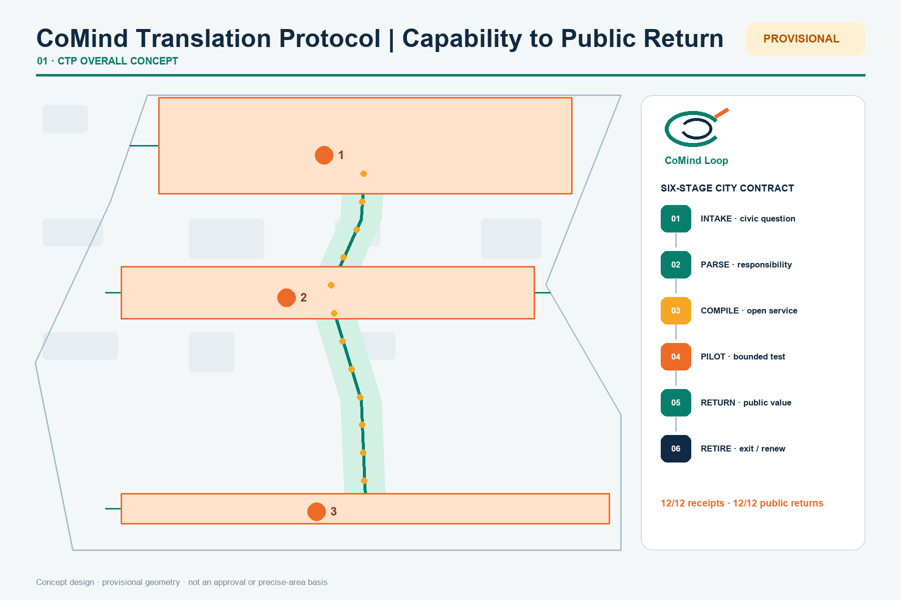
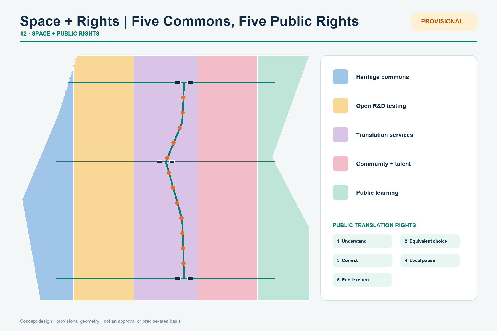
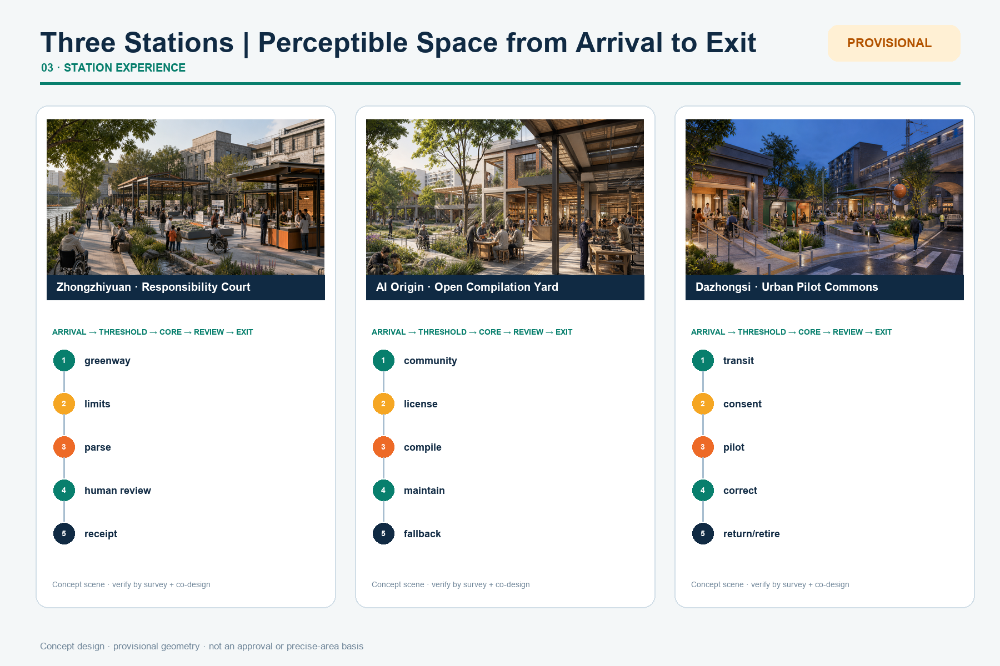
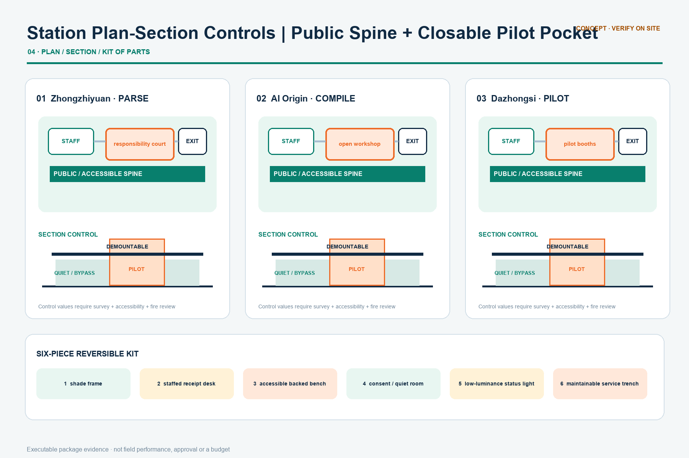
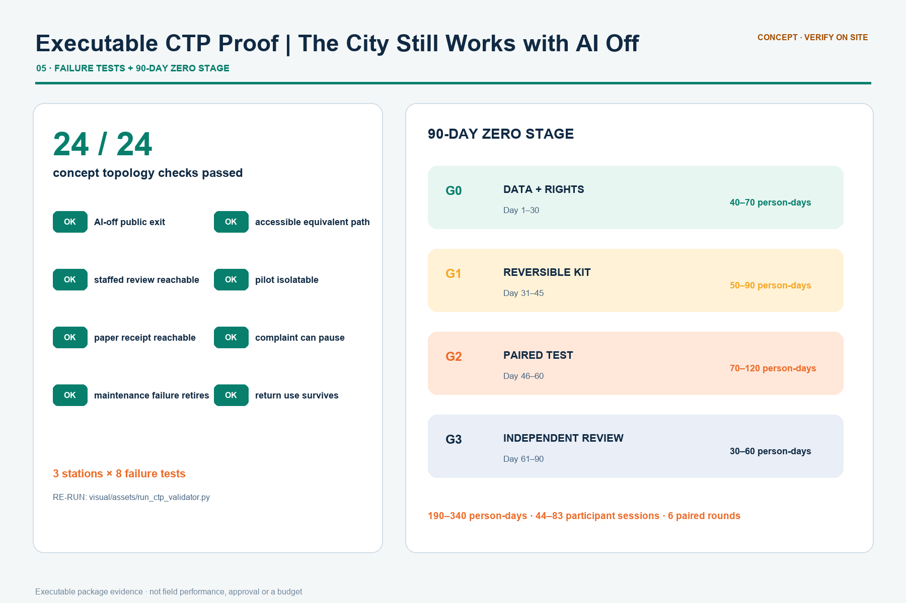

# Jing-Zhang CoMind Loop: Translating Lab Capability into Choice-Preserving Urban Services

## Design Basis and Source List

The CoMind Loop is not a new red line. It is a two-way translation protocol: research capabilities move outward as services that people can understand and choose, while urban problems move inward as open research questions. The official announcement and cleared Agent taskbook define the tasks; GeoJSON, metrics and three matrices form the audit layer [source:OFFICIAL-ANNOUNCEMENT] [source:AGENT-TASKBOOK] [depth:existing_conditions_diagnosis].

This revision names the mechanism the **CoMind Translation Protocol (CTP)**. It is not a software interface but an urban admission contract: before an AI capability enters public space, it must state whose problem it addresses, what data it uses, who is responsible, where it will be piloted, how failure leads to exit, and what it returns to the public. Passing those six questions produces a public **Urban Translation Receipt**. The receipt is not an award; it is a condition for continued operation. Missing fields, absent responsibility or a vanished public return sends the service back to pilot or retirement [depth:overall_spatial_structure].

### One-minute readback: how one protocol becomes a city

| Review question | CoMind answer | Verifiable output |
| --- | --- | --- |
| What is the original idea? | Organize the AI city through translation, not coverage: capability must cross six CTP stages before becoming a public service | Six-stage protocol, Urban Translation Receipt, three station types |
| How does AI change planning? | AI does not decide the city; it orchestrates a two-way loop among capability, problems, space, rights and feedback | 12 protocolized scenarios, three-station roles, two feedback wings |
| What changes for the public? | Every service protects intelligibility, equivalent choice, correction, local pause and public return | 12/12 human fallbacks, 12/12 receipts, local review in 3/3 areas |
| How is it implemented? | Open low-cost interfaces first, adapt buildings and walking second, then run seasonal operations and annual handover | Eight projects with stage gates, owners and exit conditions |
| How does it avoid an "AI showroom"? | Success, failure and withdrawal all enter public return; a service without public return cannot renew | Return archive, failure log and annual handover |
| What is the evidence boundary? | Provisional polygons support concept generation and recalculation only, never red lines or approvals | GeoJSON, metrics, assumptions, risk register and four local gates |

v4 turns “operable” from prose into reproducible evidence. `visual/assets/run-ctp-validator.js` reads each station topology, switches off AI nodes, and tests eight conditions: public exit, accessible equivalent path, staffed review, pilot isolation, paper receipt, complaint pause, retirement on maintenance failure, and surviving public use. The current result is **24/24 PASS**. It proves only that the package topology satisfies its declared rules; it is not evidence of construction, compliance or field performance [metric:ctp_executable_test_pass_ratio] [data:visual/assets/ctp-validator-results.json].

Exact official polygons are unavailable. The submitted site and key areas use repository provisional rough geometry for generation, visualization and intake checks only. They are not official boundaries, approval evidence or precise-area evidence; every layer, metric, figure and PDF must be recalculated when official polygons arrive [data:geometry/site_boundary.geojson#SITE-001] [metric:site_area_sqm].

## Three-Level Scope Framework

The 43.6 km² research scope builds the regional research-open-source-enterprise-public-problem network. The roughly 11.4 km² design scope organizes renewal, slow mobility, public space and urban services. The roughly 368.4 ha key-area scope tests three complementary prototypes. Together they form one loop: regional question intake, corridor translation, key-area testing and public return [standard:PROJECT-OFFICIAL-ANNOUNCEMENT] [depth:three_level_scope_framework] [data:geometry/key_areas.geojson#PROV-KEY-001].

The structure is one spine, three translation stations, two wings and twelve interfaces. The heritage park is the spine; Zhongzhiyuan tests responsibility, the AI Origin Community translates open research, and Dazhongsi hosts urban experience. The Zhongguancun wing provides professional services; the Xiaoyue River wing returns real-life questions and feedback.

CTP writes this chain as six inspectable stages:

| Stage | Urban action | Spatial host | Release question |
| --- | --- | --- | --- |
| 01 INTAKE | Turn resident, enterprise and institutional needs into discussable civic questions | Corridor question desks and Xiaoyue River wing | Does the question come from real use, and are affected people present? |
| 02 PARSE | Decompose capability into data, energy, responsibility, risk and human work | Zhongzhiyuan responsibility court | Are capability limits and failure modes legible? |
| 03 COMPILE | Assemble capability as open, maintainable and replaceable service components | AI Origin open station | Are license, maintainer, accessibility and non-digital paths complete? |
| 04 PILOT | Test at limited places, times and user groups | Dazhongsi hall and 12 interfaces | Can the test be paused, and is it clearly distinct from procurement or operation? |
| 05 RETURN | Send outcomes, failures, complaints and public value back to research and communities | Three public courts and the return archive | What did the public receive, and what must be corrected? |
| 06 RETIRE / RENEW | Exit, hand over to people, revise and retry, or pass to the next stage | Annual handover and passport platform | Is responsibility transferred and is failure public? |

Every scenario's Urban Translation Receipt records eight fields: civic question, input capability, affected people, spatial host, data boundary, named human lead, fallback and pause condition, and public return. Six stages plus eight fields form CTP's minimum operating unit. They are conceptual governance and design proposals, not statutory rights, administrative approvals or operational commitments [data:geometry/constraints.geojson#SCENE-01] [metric:translation_receipt_coverage_ratio] [depth:overall_spatial_structure].

## Coordinated Research Area: Industry and Future City Research

The industry strategy asks how capability becomes shared urban value instead of inventing company lists, investment or output claims. Six districts are background mechanism references only and do not support Haidian regulatory controls [source:CASE-ONE-NORTH] [source:CASE-KENDALL] [source:CASE-22BARCELONA].

| Reference | Transferable mechanism | CoMind use |
| --- | --- | --- |
| Singapore one-north | Mixing research, enterprise, start-ups and daily life | Coordinate test permissions, public space and community operations |
| Cambridge Kendall Square | Connecting dense innovation to adjacent communities | Open closed labs through culture, learning and small-scale innovation space |
| Paris-Saclay | Research-education-industry collaboration | Reduce institutional friction through shared platforms and encounter spaces |
| Barcelona 22@ | Industrial heritage to mixed innovation district | Retain productive memory while adding housing, services, green space and infrastructure |
| Seoul DMC | Digital-media cluster and urban experience | Connect production, display, training and public experience |
| London Knowledge Quarter | Walkable knowledge network | Turn dispersed institutions into a network through shared missions and events |

The resulting five-part chain links foundational research and open-source interpretation at Origin, responsible model, chip, compute and safety testing at Zhongzhiyuan, enterprise services and AI-native experiences at Dazhongsi, legal/IP/capital/international support through the Zhongguancun technology-service wing, and urban questions and feedback through the Xiaoyue River scenario wing. Beijing’s “three areas and two wings” and Haidian’s “1+X+1” industrial system are local policy context, not proof of an approved project. Every proposed deployment receives a six-field passport: problem, data, responsible party, human review, exit condition and public return [source:SRC-2026-BJ-KW-THREE-AREAS-WINGS] [source:SRC-2026-HAIDIAN-1X1] [depth:overall_spatial_structure].

The identity is “Jing-Zhang CoMind Loop.” Its mark is an open double ring: the outer ring represents urban life, the inner ring the research system, and the orange gap their exchange gate. The mark is applied in the concept map, wayfinding and project-passport examples. Railway charcoal and park green are primary colors; orange identifies interfaces that require attention and human confirmation. This makes choice, traceability and exit part of one visible design grammar rather than a slogan [depth:overall_spatial_structure].

## Overall Design Area: Urban Renewal and Regulatory-Plan-Level Urban Design

Five topology-safe conceptual program bands fully partition the provisional site: heritage commons, open R&D testing, translation services, community and talent commons, and cultural public learning. They express functional priorities, not statutory parcels or approved land-use changes [standard:MNR-LAND-USE-CLASSIFICATION-GUIDE] [data:geometry/land_use.geojson#LU-101] [depth:land_use_layout].

Renewal opens public interfaces first, adapts existing buildings second, and considers added floor space last. Without surveys, ownership, controls and structural assessment, no parcel-level demolition conclusion is made. Six concept footprints test service combinations only; FAR, density, height and total floor area remain pending official data [data:geometry/buildings.geojson#BLDG-111] [metric:building_footprint_area_sqm] [depth:development_intensity_controls].

## Detailed Design of Key Areas

All three key-area polygons are provisional and unsuitable for precise area or engineering decisions [data:geometry/key_areas.geojson#PROV-KEY-001] [data:geometry/key_areas.geojson#PROV-KEY-002] [data:geometry/key_areas.geojson#PROV-KEY-003].

1. **Zhongzhiyuan Responsibility Parsing Station** combines a Qinghe green interface, standards co-creation hall and model responsibility court. It performs CTP's PARSE stage by separating model, chip and compute capability into visible data, energy, risk, human work and failure modes. Any published pass applies only to a bounded version and context; transport, flood, energy and compute capacity require professional review.
2. **AI Origin Open Compilation Station** links campus, park and community walking interfaces with open-source release, translation, talent services and public learning. It COMPILES tested capability into licensed, maintained services with non-digital alternatives. Contribution credit may be named, pseudonymous or withdrawn; renewal prioritizes light-touch shared ground floors.
3. **Dazhongsi Urban Pilot-Translation Station** combines an urban-challenge demo, data-consent lounge and AI-native experience hall around transit and four-quadrant walking needs. It PILOTS and RETURNS services in bounded time and space to test whether people understand, use and correct them. Bridges, tunnels and intersection changes remain questions for professional teams.

The three areas share an “open interface—adaptive building—operational audit” method, but their spatial moves and acceptance questions remain distinct:

| Key area | Spatial structure and public realm | Building renewal and active travel | AI scenarios and operation | Main implementation risks |
| --- | --- | --- | --- | --- |
| Zhongzhiyuan | A Qinghe green edge links the responsibility court, standards hall and visible failure log | Reuse ground floors and courtyards first; verify river crossing, transport and flood conditions | Responsible model testing and edge-compute booking; bounded versions, human review and public pause | River, flood, energy, fire safety and responsibility boundaries |
| AI Origin Community | A campus—park—community seam forms a loop for releases, learning and talent services | Prioritize shared ground floors and time-based access; test continuous accessibility before works | Open contribution station and cultural archive guide; named, pseudonymous and withdrawn participation | Campus access, intellectual property, night disturbance and maintenance owner |
| Dazhongsi | A four-quadrant transit walking network organizes the consent lounge, experience hall and urban-question demo | Improve surface crossings, shade and staying space first; bridges and tunnels remain study topics | Data consent, AI retail trials and digital-content co-creation; testing is not procurement | Transit interchange, commercial misreading, consent and crowd safety |

Each area receives a project passport recording location, responsible body, version, open hours, named human lead, pause condition and next review date. When official polygons, building surveys, ownership and engineering evidence arrive, professional teams should restart from geometry and building investigation—not merely replace diagram titles [data:geometry/key_areas.geojson#PROV-KEY-002] [depth:three_key_area_detailed_design].

### One receipt, three fifteen-minute spatial journeys

This iteration turns the protocol into five spatial moments: arrival, threshold, core, review and exit. **Zhongzhiyuan** enters from the Qinghe greenway into a shaded responsibility court: visitors see limits and failure records before reaching a staffed parsing desk, while a quiet route provides a paper receipt without entering the digital process. **AI Origin** enters from both community and campus into a shared ground floor; people choose named, pseudonymous or withdrawn contribution at the license counter, compile at movable workbenches, and hand maintenance to the next operator. **Dazhongsi** enters from a safe surface crossing into a consent lounge, passes small reversible pilot booths to a public correction terrace, and ends in return, staffed fallback or retirement [metric:station_spatial_sequence_coverage_ratio] [depth:three_key_area_detailed_design].

| Spatial moment | Zhongzhiyuan | AI Origin | Dazhongsi |
| --- | --- | --- | --- |
| Arrival edge | Qinghe greenway and rain garden | Campus—park—community porch | Four-quadrant transit crossing |
| Threshold | Limits and failure display | License, credit and withdrawal counter | Consent lounge and quiet waiting room |
| Core | Reversible responsibility court | Open workshop and maintenance library | Time-bounded pilot booths and question bell |
| Public review | Face-to-face human parsing | Contributor—maintainer handover table | Correction and complaint terrace |
| Exit | Paper receipt and non-digital bypass | Equivalent staffed path and withdrawal | Return, pause or complete retirement |
| Day/night | Co-creation by day; verified display at night | Workshop by day; quiet learning at night | Commuter trials; low-luminance evening feedback |

All three begin with six demountable, repairable CoMind components: shade frame, staffed receipt desk, accessible backed bench, consent curtain/quiet room, low-luminance status light, and a maintainable service trench paired with rain gardens. Every component needs a maintenance owner, cleaning/fire/electrical inspection cycle and retirement destination. Continuous equivalent routes, day/night scripts and reversible-component schedules are design acceptance requirements—not claims about current performance [metric:accessible_equivalent_path_key_area_ratio] [metric:day_night_operation_key_area_ratio] [metric:reversible_component_project_ratio].

Three users receive different but equivalent journeys. A resident can pose a question and leave with a paper receipt without installing an app. A developer enters with version, energy and failure evidence and leaves only after naming a maintainer. An international visitor uses a bilingual project passport to understand that testing is not procurement and can find human review and exit. AI-assisted concept scenes express spatial intent only; their people and buildings are not records of existing conditions. Final design requires survey, public co-design, accessibility, transport, flood, fire and structural review.

### Five public translation rights

CTP makes public value inspectable through five spatial rights: **intelligibility** (understand the service without technical documentation), **equivalent choice** (human and non-digital paths remain equally visible), **correction** (errors and objections enter the return archive), **local pause** (affected groups can trigger review and temporary pause), and **public return** (every trial leaves open knowledge, spatial improvement or a reusable service). These are conceptual design principles; formal rights, duties and procedures must be established lawfully by authorities, operators and the public [standard:BARRIER-FREE-ENVIRONMENT-LAW] [depth:three_key_area_detailed_design].

Three pilgrimage landmarks are information infrastructures: the Responsibility Gauge, Open Contribution Ring and Urban Question Bell. Each displays version, source, failure record, responsible human and exit path [depth:three_key_area_detailed_design].

## AI Innovation Ecosystem, Personas, and AI+ Scenarios

Six personas are open-source developers, start-ups and industry teams, university communities, residents and families, older and disabled users, and international visitors. Each maps needs to a place, service, human fallback and privacy limit. Twelve scenario cards become auditable translation tasks rather than an experience menu:

| Card | CTP stage / space | Human and exit boundary | Required public return |
| --- | --- | --- | --- |
| 01 Responsible model test | PARSE / Zhongzhiyuan | Human review of red-team results; withdraw on failure | Failure modes and applicability limits |
| 02 Edge-compute booking | PARSE / Zhongzhiyuan | Publish energy method; human scheduling overrides automation | Comparable energy and queue record |
| 03 Urban challenge demo | INTAKE / Dazhongsi | Testing is not procurement or government commitment | Reusable public problem definition |
| 04 Open contribution station | COMPILE / AI Origin | Voluntary, pseudonymous or withdrawn credit | Cleared component, maintenance note and contribution record |
| 05 Accessible dual channel | COMPILE / corridor stations | Every smart entrance retains staffed service | Accessibility test and repair list |
| 06 Walking-gap diagnosis | PILOT / park nodes | Anonymous counts only; no personal tracking | Gap priorities and manual survey brief |
| 07 Data-consent lounge | PILOT / Dazhongsi | Itemized consent, expiry and withdrawal | Legible consent template and objection log |
| 08 Cultural archive guide | COMPILE / Qinghuayuan and corridor | Separate verified history from generated content | Verified source list and correction channel |
| 09 Digital-content co-creation | PILOT / Dazhongsi | Rights clearance, author credit and human release | Cleared work and creator-return record |
| 10 AI retail test window | PILOT / Dazhongsi | Small trials first; cash and staffed paths remain | Accessibility, complaint and exit report |
| 11 Human public-service fallback | RETURN / community interfaces | No app or biometric submission required | Verification that the human path works |
| 12 Annual CoMind handover | RETIRE / whole corridor | Publish questions, failures and next owner | Annual return package and retirement list |

All twelve points are encoded in `constraints.geojson`; every feature requires human review, can be paused and remains conceptual, never an approved operation [data:geometry/constraints.geojson#SCENE-01] [metric:scenario_node_count] [standard:GENERATIVE-AI-INTERIM-MEASURES].

Each node also records its CTP stage, receipt requirement, public-return type, local-pause trigger and non-digital fallback. AI scenarios therefore become urban translation tasks that can be audited, returned and reused one by one [metric:public_return_scenario_ratio] [depth:professional_standard_response].

## Land Use, Building Scale, and Retain-Renovate-Demolish Strategy

Concept areas are recalculated in EPSG:4548 from the provisional geometry. The building process is: verify official parcels and ownership; survey safety and heritage value; compare continued use, time sharing, light retrofit, structural retrofit and new build; then confirm with professional teams and the public [data:geometry/land_use.geojson#LU-103] [data:geometry/buildings.geojson#BLDG-211] [depth:retain_renovate_demolish].

The proposal does not provide FAR, height, road red lines or final building scale. Known values are limited to provisional geometry, concept footprints and counts; unknown controls remain null with explicit data prerequisites [metric:floor_area_ratio] [depth:height_massing_character].

## Transport, Rail, Municipal Infrastructure, and Public Services

One longitudinal and three cross-corridors express continuous walking, cycling and public experience; they do not replace existing road or engineering alignments. Each interface prioritizes crossing time, cycle parking, shade, continuous accessibility and night legibility [data:geometry/roads.geojson#ROAD-101] [depth:traffic_rail_slow_parking].

Plug-in service cabinets may combine edge compute, sensing, emergency communication, charging and staffed help. Any deployment must verify power, heat, noise, fire safety, cyber security and maintenance. Public services retain a path that requires no smartphone, facial recognition or account binding [standard:BARRIER-FREE-ENVIRONMENT-LAW] [depth:municipal_new_infrastructure].

The plate resolves every station into a permanent public spine, a closable pilot pocket and a staffed review interface. The pilot pocket may stop, isolate and be removed; public passage, continuous accessibility, rest and staffed service must remain. The six reversible components use conceptual bolted/clamped fixing, reachable maintenance faces and replaceable panels. Survey and relevant professionals must determine dimensions, material, foundations, loads, drainage, fire safety and night lighting. These plans, sections and details express control relationships, not existing measurements or construction drawings [metric:station_section_control_coverage_ratio] [depth:traffic_rail_slow_parking].

## Blue-Green Network, Public Space, and Urban Character

The CoMind green loop emphasizes continuous walking, ecological interfaces, three public courts and twelve scenario nodes while keeping the provisional boundary faint and dashed. Green and public-space ratios are internal concept-consistency metrics, not statutory ratios [data:geometry/green_space.geojson#GREEN-101] [metric:green_ratio] [metric:public_space_ratio].

Railway components become an information grammar: rivet rhythms become evidence scales, station signs become version and responsibility panels, and milestones become urban-question numbers. New components are demountable, repairable and low-luminance; heritage controls await official files [standard:MOHURD-URBAN-DESIGN-MEASURES] [depth:blue_green_public_space].

## Renewal Projects, Implementation Policy, and Phasing

Eight concept projects translate the spatial strategy into accountable stage gates:

| ID | Concept project and location | Suggested lead / collaborators | Stage gate | Public KPI and exit condition |
| --- | --- | --- | --- | --- |
| C01 | CoMind translation spine · heritage-park corridor | Park operator / subdistrict, transport and accessibility representatives | Near term: audit walking, ownership and lighting | Close the gap list; pause expansion if continuity or maintenance fails |
| C02 | Zhongzhiyuan responsibility court | Campus property/operator / testing, safety and river teams | Near-term pilot: river, transport, energy and fire review | 100% of tests show version, human lead and pause status |
| C03 | Origin open translation station | Campus–park partnership / community and open-source maintainers | Near-term pilot: confirm shared hours and IP rules | Contributions can be named, pseudonymous or withdrawn; no opening without a maintainer |
| C04 | Dazhongsi urban experience hall | Local and space operator / transit, commerce and data leads | Mid term: surface interchange and crowd-safety review | Testing, procurement and formal operation shown as three separate states |
| C05 | Three public information landmarks · three stations | Public-space operator / heritage, landscape and content editors | Mid term: view, heritage, structure and content review | Meet update and accessible-readability thresholds; remove stale content |
| C06 | Twelve scenario interfaces · corridor nodes | Scenario owners / data, safety and user representatives | Open in batches after data and human review | 12/12 retain human and non-digital paths; complaints can trigger pause |
| C07 | CoMind project-passport platform · online and onsite | Joint operating secretariat / project leads and public observers | Start with first pilots after confirming fields and maintenance budget | Version, source, responsibility, exit and review date all complete |
| C08 | Annual CoMind handover · whole corridor | Community operating alliance / developers, residents and international partners | Long term: event permission and annual audit | Publish failures, feedback and next owner; no renewal without a handover record |

Phasing is not an investment or government commitment. Phase 1 opens low-cost public interfaces and question lists; Phase 2 mends building and mobility networks after professional review; Phase 3 considers additions needing regulatory, engineering and long-term operational support [data:geometry/phasing.geojson#PHASE-101] [metric:renewal_project_count] [depth:phasing_implementation].

### 90-day zero stage: produce evidence before promising construction

The first 90 days create a handover-ready evidence pack only. G0 (days 1–30) verifies data, rights, responsibility and permissions and produces a site-difference register, consent/data protocol and twelve task scripts. G1 (days 31–45) builds six removable prototype types and rehearses installation, maintenance and removal. G2 (days 46–60) runs paired AI-on/off tests in a closed setting and reruns the three-station topology. G3 (days 61–90) is an independent review by professionals not involved in production and participant representatives; outcomes are correction, bounded pilot or stop. No gate advances with incomplete responsibility, equivalent path, objection receipt or recovery evidence [metric:zero_stage_gate_count] [data:visual/assets/zero-stage-90-days.json].

Ranges replace invented budgets: approximately **190–340 person-days, 44–83 participant sessions and six paired rounds** across four gates. These are execution-scale assumptions, not investment estimates or commitments. They must be recalculated from real labor, insurance, reasonable accommodation, site and engineering conditions; participant time and accommodation are not free resources [metric:zero_stage_person_days_max] [depth:phasing_implementation].

### Eight implementation handover contracts

`visual/assets/handover-contracts.json` gives C01–C08 the same twelve fields: site/right evidence, accountable role, required professions, permission/insurance, baseline/sample, capital/operations/maintenance/removal cost classes, acceptance evidence, closure condition and recovery use. Resources use only S (existing people/information), M (demountable components/specialist service) and L (engineering or long-term operation); no unverified money values are stated. Every contract answers what closes, what remains and how the site returns after failure [metric:handover_contract_field_coverage_ratio] [data:visual/assets/handover-contracts.json].

The proposed annual cycle is spring problem intake, summer responsible testing, autumn open translation and winter public handover. Communications distinguish submitted, reviewed, selected and implemented status.

Annual operation produces a **City Return Package** recording which questions were translated accurately, which scenarios failed, which public objections changed research, which services retired, and who takes responsibility next. It turns failure into a civic learning asset and prevents events from leaving equipment without knowledge or accountability. A project without a complete receipt, public failure record and next owner does not advance [metric:stage_gate_project_ratio] [depth:phasing_implementation].

## Metrics, Area Recalculation, and Compliance Matrix

Internal recalculation gives a provisional site area of 11.413 square kilometres, 6.4% concept green coverage, 0.4% coverage by three key public courts, twelve scenario nodes and eight concept renewal projects. These figures describe coverage in the submitted layers, not planning targets or statutory ratios. Public-value conditions require 12/12 fallbacks, receipts and returns, local review in 3/3 areas and gates for 8/8 projects. v4 adds 24/24 package topology checks, four zero-stage gates and complete twelve-field handover contracts for 8/8 projects. These measure package completeness and future acceptance conditions, not built performance [metric:ctp_executable_test_pass_ratio] [metric:handover_contract_field_coverage_ratio] [depth:metrics_recalculation].

The compliance matrix covers announcement sections 1.3-1.5 and Agent tasks 1-6. The standards matrix separates addressed requirements from data gaps; the design-depth matrix records evidence chains. Machines check completeness while the narrative explains design judgment [standard:MOHURD-CONTROL-DETAILED-PLANNING] [depth:professional_standard_response].

## Risk, Copyright, and Compliance

Key risks are mistaking provisional polygons for official boundaries, concept intensity for approved controls, tests for procurement or operation commitments, translation for speaking on behalf of the public, and automated service for an exclusive channel. `risk.json` records eight dimensions with triggers, responsible actor types, mitigations, human review and stop conditions. Every visual keeps the provisional boundary faint and dashed and repeats the limitation in sources, assumptions, HTML and self-check [source:BOUNDARY-SOURCE] [depth:risk_missing_data].

Public-data boundaries, privacy protection, copyright and licensing, and human review form one admission chain. Non-public, sensitive or rights-unclear data does not enter the proposal; personal data follows necessity, itemized consent, expiry and withdrawal; generated content is separated from verified history; release and pause retain a named human lead. If any link cannot be verified, the affected CTP stage stops rather than allowing technical feasibility to substitute for compliance.

Every spatial move is a conceptual suggestion, reference scheme or material for professional teams to deepen. It does not replace formal planning or constitute government approval, investment, recruitment, event or implementation commitment. Figures are programmatically derived from package geometry and metrics; external cases contribute linked mechanisms only, with no copied maps, images or marks.

## References

Complete provenance, access dates, permitted uses and limitations are in `sources.json`. The official announcement and cleared taskbook control the tasks; global cases are background mechanism references only [source:OFFICIAL-ANNOUNCEMENT] [source:AGENT-TASKBOOK] [source:SOURCE-REGISTRY].

Sources serve three distinct roles. Task sources establish the three scopes, three key areas and required responses. Provisional geometry supports generation, visualization and intake checks only. International cases help compare mechanisms through which innovation becomes part of daily urban life; they never enter the site calculation. Figure locations come from package GeoJSON and ratios are recalculated in EPSG:4548. The decisive gaps remain official polygons, regulatory controls, building surveys, ownership, road red lines, utilities, heritage constraints and engineering conditions. When those arrive, revision must begin at the geometry layer rather than by changing narrative numbers alone. Reviewers can follow each claim from readable prose to an evidence marker, structured record and original link, and can request withdrawal whenever a source is stale, unclear in rights or used beyond its recorded purpose.
