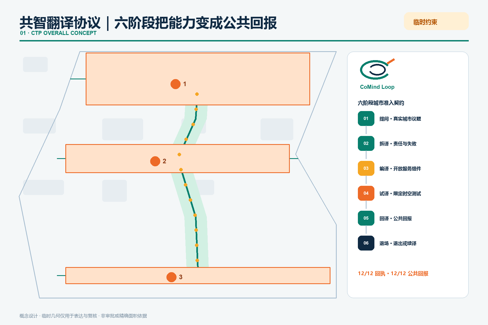
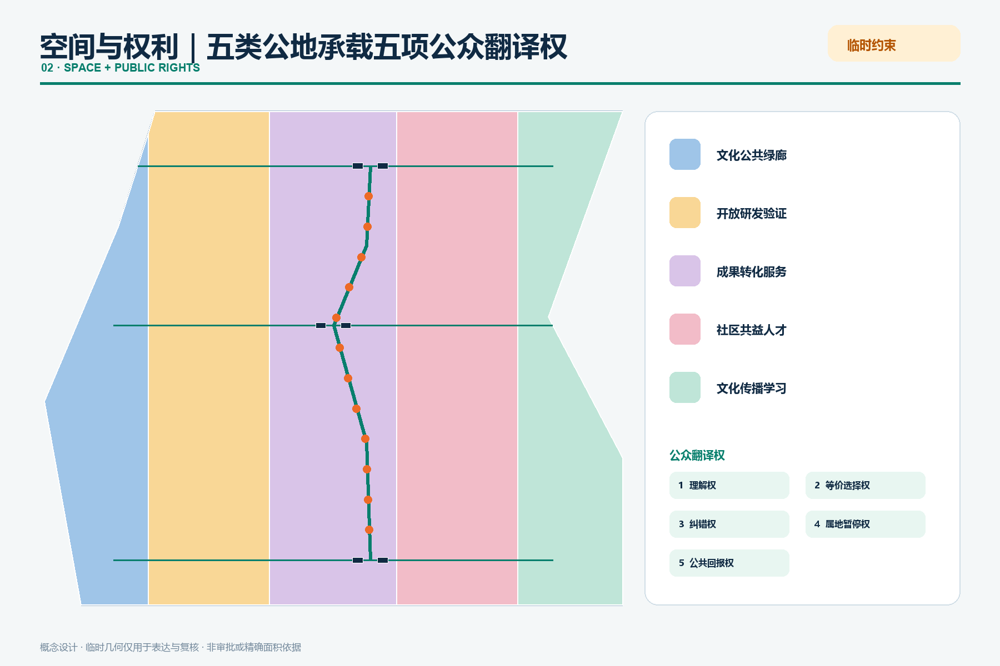
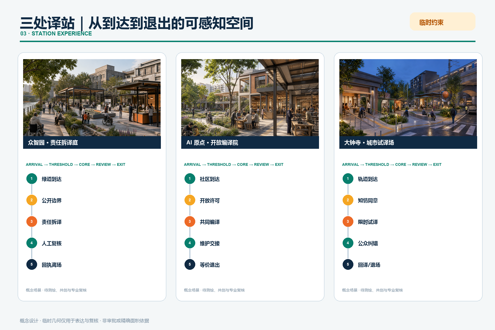
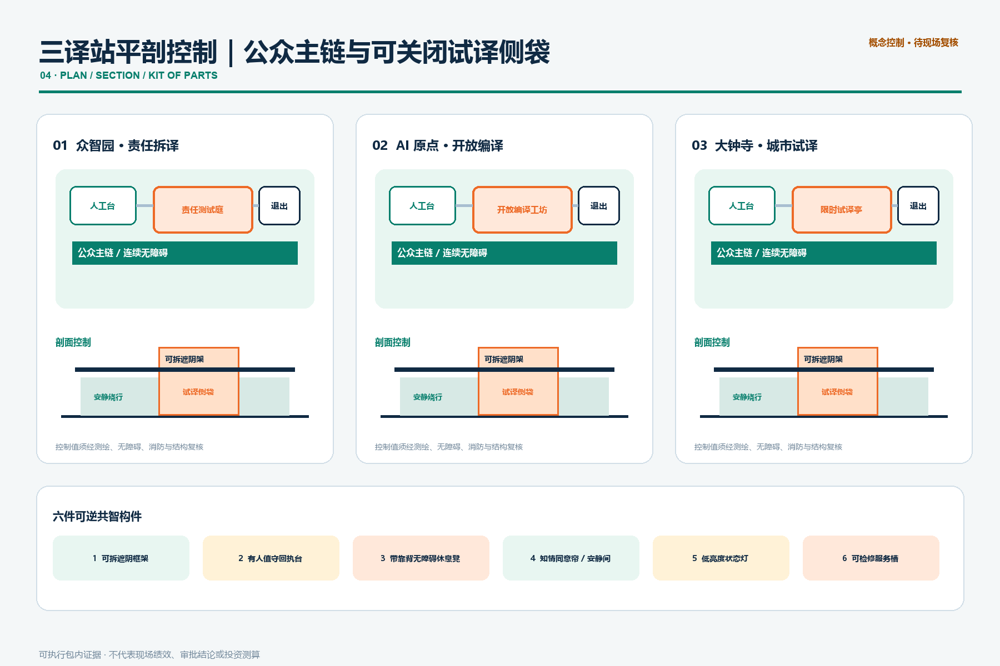

# 京张共智环：把实验室能力翻译成可选择的城市服务

## 设计依据与资料清单

“共智环”不是一条新红线，而是一套双向翻译机制：科研能力向外被翻译成普通人能理解、能选择的服务；居民、开发者和企业遇到的真实问题向内被翻译成公开研发议题。方案以官方公告和面向智能体任务书为任务依据，以仓库 GeoJSON、指标、三类矩阵作为审计层 [source:OFFICIAL-ANNOUNCEMENT] [source:AGENT-TASKBOOK] [depth:existing_conditions_diagnosis]。

本次深化把这套机制正式命名为**共智翻译协议（CoMind Translation Protocol, CTP）**。它不是软件接口，而是城市空间的准入契约：任何 AI 能力要进入公共空间，必须回答“解决谁的问题、用什么数据、由谁负责、在哪里试译、失败怎样退出、给公众留下什么”。完成这六问后，项目才取得一张可公开查阅的**城市翻译回执**。回执不是荣誉证书，而是服务继续运行的条件；字段缺失、责任失联或公共回报消失，服务即退回试译或退场 [depth:overall_spatial_structure]。

### 一分钟读懂：一条协议如何变成一座城市

| 评审问题 | 共智环的回答 | 可核验成果 |
| --- | --- | --- |
| 原创概念是什么 | 用“翻译”而非“覆盖”组织 AI 城市：实验室能力必须经过 CTP 六阶段，才可成为公共服务 | 六阶段协议、城市翻译回执、三类译站 |
| AI 如何改变规划 | AI 不直接决定城市，而是把能力、问题、空间、权利和反馈编排成双向回路 | 12 个协议化场景节点、三译站分工、两翼反馈链 |
| 对公众有什么不同 | 每项服务保障理解权、等价选择权、纠错权、属地暂停权和公共回报权 | 12/12 人工兜底、12/12 回执、3/3 属地复核 |
| 怎样实施 | 先开放低成本接口，再适配建筑与慢行，最后运营季节与年度交接 | 8 项项目、阶段闸门、责任主体和退出条件 |
| 怎样避免“AI 展示园” | 成功、失败和撤回都进入公共回译；没有公共回报的服务不能续期 | 回译档案、失败记录、年度交接礼 |
| 证据边界是什么 | 临时 polygon 只支撑概念生成和复算，不升级为红线或审批结论 | GeoJSON、指标、假设、风险登记和四道自检 |

v4 把“可运行”从文字要求变为可复跑证据：`visual/assets/run-ctp-validator.js` 读取三站拓扑，逐站关闭 AI 节点并检查公众离场、无障碍等价路径、人工复核、试译隔离、纸质回执、投诉暂停、维护失联退场和退场后公共用途八项条件。当前结果为 **24/24 PASS**；该结果只证明本包概念拓扑内部满足所声明规则，不证明现场已建设、合规或达到绩效 [metric:ctp_executable_test_pass_ratio] [data:visual/assets/ctp-validator-results.json]。

当前未取得官方精确总体边界和三处重点区 polygon。`site_boundary.geojson` 与 `key_areas.geojson` 均来自仓库临时粗略边界，仅用于生成、可视化和入口自检，不是官方红线、审批依据或精确面积依据；官方数据到位后，全部用地、建筑、道路、绿地、公共空间、分期、图件和指标必须统一复算 [data:geometry/site_boundary.geojson#SITE-001] [metric:site_area_sqm]。

## 三层范围工作框架

43.6 平方公里统筹研究范围用于建立“科研-开源-企业-公共问题”协同网络；约 11.4 平方公里总体设计范围用于组织更新、慢行、公共空间和城市服务；约 368.4 公顷重点区域用于验证三个互补原型。三层不是三份互不相干的图，而是“区域议题进入-沿线翻译-重点区验证-公共结果返回”的闭环 [standard:PROJECT-OFFICIAL-ANNOUNCEMENT] [depth:three_level_scope_framework] [data:geometry/key_areas.geojson#PROV-KEY-001]。

总体结构为“一线、三译站、两翼、十二接口”：京张遗址公园是共智翻译主线；众智园是责任测试站，AI 原点社区是开源转化站，大钟寺是城市体验站；中关村科技服务翼提供知识、资本与专业服务，小月河场景赋能翼提供真实问题和公共反馈；十二个场景节点贯穿从试验到退出的完整链条。

CTP 把这条链条写成六个可检查阶段：

| 阶段 | 城市动作 | 空间载体 | 放行问题 |
| --- | --- | --- | --- |
| 01 提问 INTAKE | 将居民、企业与公共机构的问题写成可讨论的城市议题 | 沿线问题台、小月河场景翼 | 问题是否来自真实使用情境，受影响者是否在场 |
| 02 拆译 PARSE | 把模型能力拆成数据、能耗、责任、风险与人工任务 | 众智园责任测试庭 | 能力边界和失败方式是否说得清 |
| 03 编译 COMPILE | 把能力组装为开源、可维护、可替代的服务组件 | AI 原点开源译站 | 许可、维护者、无障碍和非数字路径是否齐备 |
| 04 试译 PILOT | 在限定地点、时段和人群中进行小规模测试 | 大钟寺体验厅与 12 个接口 | 测试是否可暂停，是否被误读为采购或正式运营 |
| 05 回译 RETURN | 把效果、失败、投诉和公共收益送回研发与社区 | 三座公共庭、线上线下回译档案 | 公众得到什么，哪些结论需要修正 |
| 06 退场 / 续译 RETIRE | 到期退出、转人工、修订后重试或进入下一阶段 | 年度交接礼、项目护照平台 | 责任是否交接，失败记录是否公开 |

每个场景的“城市翻译回执”固定记录八项：城市问题、输入能力、受影响人群、空间载体、数据边界、人工负责人、兜底与暂停条件、公共回报。六阶段与八字段共同构成 CTP 的最小可运行单元；它们是概念性治理与设计建议，不构成法定权利、行政许可或运营承诺 [data:geometry/constraints.geojson#SCENE-01] [metric:translation_receipt_coverage_ratio] [depth:overall_spatial_structure]。

## 统筹研究范围产业与未来城市研究

产业策略不以虚构企业名单、投资额或产值为起点，而以“能力怎样通过城市被共同使用”为问题。六个全球创新区只作为机制参照，不支撑海淀控规或规模判断 [source:CASE-ONE-NORTH] [source:CASE-KENDALL] [source:CASE-22BARCELONA]。

| 案例 | 可转化机制 | 京张应用 |
| --- | --- | --- |
| 新加坡 one-north | 科研、企业、创业与生活混合 | 把试验许可、公共空间和社区运营放在同一园区系统 |
| 剑桥 Kendall Square | 高密创新与周边社区连接 | 用公共文化、学习和可负担创新空间打开封闭实验室 |
| Paris-Saclay | 科研教育与产业协作 | 以多机构共享平台和开放交流空间降低跨组织摩擦 |
| Barcelona 22@ | 工业遗产更新为混合创新城区 | 保留产业记忆，同时织入住宅、服务、绿地与先进基础设施 |
| Seoul DMC | 数字媒体集群与城市体验 | 把内容生产、展示、培训和公众体验连接成可见链条 |
| London Knowledge Quarter | 步行尺度知识网络 | 通过共同议题和活动把分散机构变成协作网络 |

由此形成五段生态链：基础研究与开源工具在原点社区被解释；模型、芯片、算力和安全能力在众智园被测试；企业服务与智能原生业态在大钟寺被体验；中关村科技服务翼提供法务、知识产权、资本和国际连接；小月河场景翼把城市问题与使用反馈送回研发端。它以北京“三区两翼”和海淀“1+X+1”产业体系为地方政策背景，但不把政策方向误写成已批准项目。每一次场景开放均配“问题、数据、责任人、人工复核、退出条件、公共回报”六栏护照 [source:SRC-2026-BJ-KW-THREE-AREAS-WINGS] [source:SRC-2026-HAIDIAN-1X1] [depth:overall_spatial_structure]。

命名使用“京张共智环 / Jing-Zhang CoMind Loop”。标志采用一枚未闭合双环：外环象征城市日常，内环象征研发系统，橙色缺口形成交换门；它已进入总体概念图、导视牌和项目护照的示意应用。主色“铁路炭灰+公园青绿”，橙色只标识需要公众注意和人工确认的接口；不使用企业商标和未经授权字体。这个识别系统把“可选择、可追溯、可退出”变成同一套视觉语法，而不只是一句口号 [depth:overall_spatial_structure]。

## 总体设计范围城市更新与控规深度城市设计

用地层采用五个共享边界的概念功能带，完整覆盖临时总体边界：文化公共绿廊、开放研发验证、成果转化服务、社区共益人才服务、文化传播公共学习。它们表达功能优先级，不是法定地块或用途调整 [standard:MNR-LAND-USE-CLASSIFICATION-GUIDE] [data:geometry/land_use.geojson#LU-101] [depth:land_use_layout]。

更新遵循“先开放接口、再适配建筑、最后讨论增量”的顺序。没有现状测绘、权属、控规和结构鉴定时，不作具体地块拆除判断；仅把既有建筑分为可继续使用、可轻改共享、待专业评估三类方法。六个概念建筑基底用于说明服务组合，建筑总规模、容积率、密度和高度保持待正式数据补齐 [data:geometry/buildings.geojson#BLDG-111] [metric:building_footprint_area_sqm] [depth:development_intensity_controls]。

## 重点区域详细设计

三处重点区均以临时范围表达，不能用于精确面积或工程判断 [data:geometry/key_areas.geojson#PROV-KEY-001] [data:geometry/key_areas.geojson#PROV-KEY-002] [data:geometry/key_areas.geojson#PROV-KEY-003]。

1. **众智园·责任拆译站**：形成清河绿色测试界面、标准共创馆和模型责任测试庭，承担 CTP 的“拆译”环节——把模型、芯片和算力能力拆成可见的数据、能耗、风险、人工任务与失败方式。任何“通过”只代表限定版本与限定场景；对外交通、河道、防洪、能耗和算力容量待专业复核。
2. **AI 原点社区·开放编译站**：以校区—园区—社区步行接口串联开源发布、成果转化、人才服务和公共学习，承担“编译”环节——把测试过的能力组装为有许可、有维护者、有非数字替代的服务组件。贡献墙允许实名、化名或撤回；空间更新优先轻改首层和共享时段，不预设拆迁。
3. **大钟寺·城市试译站**：围绕轨道站点与四象限步行需求，提出城市问题路演、数据授权会客厅和智能原生体验厅，承担“试译—回译”环节——在限定时空中检验服务是否真的被理解、使用和纠错。桥隧、地下和路口改造仅作为待交通与工程团队深化的问题清单。

三个重点区采用同一套“开放接口—适配建筑—运营审计”方法，但空间动作和验收问题不同：

| 重点区 | 空间结构与公共空间 | 建筑更新与慢行 | AI 场景与运营 | 主要实施风险 |
| --- | --- | --- | --- | --- |
| 众智园 | 清河绿界面串联责任测试庭、标准共创馆和可见失败记录 | 优先复用首层与庭院；跨河、交通及防洪条件待核 | 模型责任测试、端侧算力预约；限定版本、人工复核、公开暂停 | 河道、防洪、能耗、消防和测试责任边界 |
| AI 原点社区 | 校园—园区—社区缝合界面形成开源发布、学习与人才服务环 | 共享首层和分时开放优先，不预设拆迁；连续无障碍接口待测 | 开源贡献译站、文化档案导览；实名/化名/撤回并行 | 校园开放、知识产权、夜间扰动与维护主体 |
| 大钟寺 | 轨道四象限步行网络组织授权会客厅、体验厅和城市问题路演 | 先改善地面过街、遮阴和停留；桥隧地下仅作深化议题 | 数据授权、AI 消费试验、数字内容共创；测试不等于采购 | 轨道接驳、商业误读、数据授权与人流安全 |

每区都以项目护照记录位置、责任主体、版本、开放时段、人工负责人、暂停条件和下一次复核日期；官方 polygon、现状建筑、权属和工程条件到位后，专业团队从几何和建筑调查开始深化，而不是只替换图面标题 [data:geometry/key_areas.geojson#PROV-KEY-002] [depth:three_key_area_detailed_design]。

### 同一张回执，三种十五分钟空间体验

本轮深化把协议落实为“到达—门槛—核心—复核—退出”五段空间序列。**众智园**从清河绿道进入遮阴责任庭，先看能力边界和失败记录，再进入有人值守的拆译台；不愿进入数字流程的人可沿安静路径直接获得纸质回执。**AI 原点**从社区与校园两侧进入共享首层，在开放许可台选择署名、化名或撤回，随后于可移动工作台完成编译并把维护责任交给下一位运营者。**大钟寺**从轨道地面过街进入知情同意会客厅，经小尺度可逆试译亭到公众纠错露台，最后选择回译、人工替代或退场 [metric:station_spatial_sequence_coverage_ratio] [depth:three_key_area_detailed_design]。

| 空间节点 | 众智园责任拆译庭 | AI 原点开放编译院 | 大钟寺城市试译场 |
| --- | --- | --- | --- |
| 到达边 | 清河绿道与雨洪花园 | 校园—公园—社区共享门廊 | 轨道四象限地面过街 |
| 门槛 | 能力边界与失败公开架 | 许可、署名和撤回柜台 | 知情同意与安静等候间 |
| 核心空间 | 可逆责任庭与模型沙盘 | 开源工坊、维修图书馆 | 限时试译亭与城市问题钟 |
| 公共复核 | 人工负责人面对面拆译 | 贡献者—维护者交接桌 | 公众纠错与投诉露台 |
| 退出路径 | 纸质回执与非数字绕行 | 等价人工服务与撤回通道 | 回译、暂停或彻底退场 |
| 昼夜模式 | 日间共创，夜间仅展示已核内容 | 日间工坊，夜间安静学习 | 通勤试译，夜间低亮度反馈 |

三处空间均以六件可拆、可修、可换的“共智构件”起步：遮阴框架、有人值守回执台、带靠背无障碍休息凳、知情同意帘/安静间、低亮度状态灯、与雨洪花园并行的检修槽。构件不依赖永久大拆建；每件均须有维护主体、清洁/消防/电气检查周期和退场去向。方案要求三处重点区都有连续等价路径、昼夜运营脚本和可逆构件清单，这些是设计验收项，不是现状绩效 [metric:accessible_equivalent_path_key_area_ratio] [metric:day_night_operation_key_area_ratio] [metric:reversible_component_project_ratio]。

三类使用者可在同一空间获得不同但等价的旅程：周边居民不下载应用即可提出问题并拿到纸质回执；开发者带着版本、能耗和失败清单进入测试，离开前交接维护人；国际访客通过中英双语项目护照理解“测试不等于采购”，并能找到人工复核和退出位置。概念场景图由 AI 辅助生成，只表达空间意图，人物与建筑均非现状记录，最终设计须经测绘、公众共创、无障碍、交通、防洪、消防和结构专业复核。

### 五项公众翻译权

CTP 把公共利益落实为五项可检查的空间权利：**理解权**（不用读技术文档也能知道服务做什么）、**等价选择权**（人工/非数字路径同时可见）、**纠错权**（错误与异议能进入回译档案）、**属地暂停权**（受影响群体可触发复核和临时暂停）、**公共回报权**（试验必须留下开放知识、空间改善或可复用服务之一）。这些是本方案的概念性设计原则，正式权利义务和程序仍须由主管部门、运营主体与公众依法共同确定 [standard:BARRIER-FREE-ENVIRONMENT-LAW] [depth:three_key_area_detailed_design]。

三座朝圣地标分别是“责任刻度塔”“开源贡献环”“城市问题钟”。它们首先是公共信息设施：显示版本、来源、失败记录、人工负责人和退出方式，不以巨型造型或商业打卡替代内容 [depth:three_key_area_detailed_design]。

## AI 创新生态、人才画像与 AI+ 场景

| 画像 | 核心诉求 | 空间与服务回应 |
| --- | --- | --- |
| 开源开发者 | 协作、测试、贡献被看见 | 原点社区开源译站；只公开自愿署名贡献 |
| 初创与产业团队 | 低成本验证、合规咨询、客户反馈 | 众智园责任测试庭；阶段闸门和人工复核 |
| 高校师生 | 成果转化、跨校协作、夜间学习 | 校区-园区慢行接口与成果转化馆 |
| 周边居民与亲子家庭 | 低扰动休闲、可理解服务、非数字选择 | 共智绿廊、人工服务台、亲子解释路线 |
| 老年人与残障使用者 | 连续无障碍、语音大字、现场协助 | 双通道服务组件；实体导视与人工兜底 |
| 国际访客与投资者 | 快速理解、可信证据、双语接待 | 大钟寺城市体验厅与可核验项目护照 |

| 卡片 | CTP 阶段 / 空间 | 人工与退出边界 | 必须留下的公共回报 |
| --- | --- | --- | --- |
| 01 模型责任测试 | 拆译 / 众智园 | 红队结果由人审；不通过即可撤回 | 失败模式与适用边界清单 |
| 02 端侧算力预约 | 拆译 / 众智园 | 公开能耗口径；人工调度可覆盖算法 | 可比较的能耗与排队记录 |
| 03 城市问题路演 | 提问 / 大钟寺 | 测试不等于采购或政府承诺 | 可公开复用的问题定义 |
| 04 开源贡献译站 | 编译 / 原点社区 | 自愿署名；允许匿名与撤回 | 清权组件、维护说明与贡献记录 |
| 05 无障碍双通道 | 编译 / 沿线驿站 | 所有智能入口保留现场人工方式 | 无障碍测试与修复清单 |
| 06 慢行断点诊疗 | 试译 / 公园节点 | 仅用匿名计数；不追踪个人轨迹 | 断点优先级和人工踏勘任务书 |
| 07 数据授权会客厅 | 试译 / 大钟寺 | 逐项同意、用途到期、可撤回 | 可理解的授权模板与异议记录 |
| 08 文化档案导览 | 编译 / 清华园站与沿线 | 史实与生成内容分层标识 | 已核史料目录与纠错入口 |
| 09 数字内容共创 | 试译 / 大钟寺 | 素材清权、作者署名、人工发布 | 清权内容与作者回报记录 |
| 10 AI 消费试验橱窗 | 试译 / 大钟寺 | 先小规模试用；现金与人工渠道并行 | 可访问性、投诉与退出报告 |
| 11 公共服务人工兜底 | 回译 / 社区接口 | 不要求下载应用或提交生物识别 | 人工路径可用性验证记录 |
| 12 年度共智交接礼 | 退场 / 全线 | 公开问题、失败和下一年责任人 | 年度回译包与退场清单 |

十二个节点已经写入 `constraints.geojson`，其中三项为产业测试场景；每项都要求人工复核、可暂停和概念状态，不得被表述为已批准运营 [data:geometry/constraints.geojson#SCENE-01] [metric:scenario_node_count] [standard:GENERATIVE-AI-INTERIM-MEASURES]。

每个节点还记录 CTP 阶段、回执要求、公共回报类型、属地暂停触发条件与非数字兜底方式。由此，AI 场景不再是一组体验菜单，而是可以逐项审计、退回和复用的城市翻译任务 [metric:public_return_scenario_ratio] [depth:professional_standard_response]。

## 用地、建筑规模与拆改留方案

概念功能带面积由临时边界投影至 EPSG:4548 后复算；建筑基底仅用于检验“测试-转化-体验”服务是否能被空间承载。拆改留流程为：先核对官方地块与权属，再做建筑安全和历史价值调查，随后比较继续使用、分时共享、轻改、结构改造和新建，最后由专业团队与公众确认 [data:geometry/land_use.geojson#LU-103] [data:geometry/buildings.geojson#BLDG-211] [depth:retain_renovate_demolish]。

本方案不提供容积率、建筑高度、道路红线或最终建筑规模。已知值仅包括临时边界派生面积、概念建筑基底面积和节点数量；未知指标在 `metrics.json` 中保持空值并列出补数条件 [metric:floor_area_ratio] [depth:height_massing_character]。

## 交通、轨道、市政与公共服务设施

“一线三横”慢行骨架连接三译站并提供东西接口；它表达步行、骑行和公共体验的连续意图，不替代现状道路或工程线位。每个接口优先处理过街等待、非机动车停放、遮阴休息、无障碍连续和夜间可辨识五件小事 [data:geometry/roads.geojson#ROAD-101] [depth:traffic_rail_slow_parking]。

市政策略采用可插拔服务柜：边缘算力、传感、应急通信、充电与人工服务可按需求组合；任何部署须先核实供电、散热、噪声、消防、网络安全和维护责任。公共服务保留不用手机、不刷脸、不绑定账户的人工路径 [standard:BARRIER-FREE-ENVIRONMENT-LAW] [depth:municipal_new_infrastructure]。

图中把三站统一拆成“永久公众主链 + 可关闭试译侧袋 + 人工复核接口”。试译侧袋可以停机、隔离、撤除，公众主链、连续无障碍路线、休息与人工服务不得随之关闭；六件可逆构件采用螺栓/夹具固定、可达检修面和可替换面板的概念构造，正式尺寸、材料、基础、荷载、排水、消防与夜间照明须由测绘及相应专业确定。平面、剖面和构件表达的是设计控制关系，不是现状测量或施工图 [metric:station_section_control_coverage_ratio] [depth:traffic_rail_slow_parking]。

## 蓝绿空间、公共空间与城市风貌

共智绿廊把临时边界淡化为背景，把连续步行、清河/小月河生态界面、三座公共庭和十二场景节点作为主叙事。绿地和公共空间比例由提交几何复算，只是概念方案内部一致性指标，不是法定绿地率 [data:geometry/green_space.geojson#GREEN-101] [metric:green_ratio] [metric:public_space_ratio]。

风貌使用“铁路构件语法”：铆钉节奏转为信息刻度，站牌转为版本与责任牌，里程牌转为城市问题编号。新设施采用可拆、可修、低亮度和不遮挡历史视线的轻量组件；清华园站等历史资源的保护范围待正式文保资料确认 [standard:MOHURD-URBAN-DESIGN-MEASURES] [depth:blue_green_public_space]。

## 更新项目清单、实施政策与分期计划

| 编号 | 概念项目与位置 | 建议牵头/协作主体 | 阶段闸门 | 公共 KPI 与退出条件 |
| --- | --- | --- | --- | --- |
| C01 | 共智翻译主线·遗址公园沿线 | 公园运营方 / 街道、交通、无障碍代表 | 近期：现状慢行、权属和照明核查 | 断点清单闭环；不连续或不可维护则暂停扩展 |
| C02 | 众智园责任测试庭 | 园区产权运营方 / 测试、安全、河务团队 | 近期试点：河道、交通、能耗、消防复核 | 100% 测试显示版本、人工负责人和暂停状态 |
| C03 | 原点开源译站 | 校园园区协作平台 / 社区、开源维护者 | 近期试点：共享时段与知识产权规则确认 | 贡献可署名、化名、撤回；无维护者则不开放 |
| C04 | 大钟寺城市体验厅 | 属地与空间运营方 / 轨道、商业、数据责任方 | 中期：地面接驳和人流安全评估 | 测试、采购、正式运营三种状态明确分离 |
| C05 | 三座公共信息地标·三译站 | 公共空间运营方 / 文保、景观、内容编辑 | 中期：视线、文保、结构与内容审查 | 信息更新率和无障碍可读性达标；内容失效即下线 |
| C06 | 十二场景接口·沿线节点 | 各场景责任单位 / 数据、安全、用户代表 | 分批开放：每项通过数据与人工复核 | 12/12 保留人工和非数字路径；投诉可触发暂停 |
| C07 | 共智项目护照平台·线上线下 | 联合运营秘书处 / 项目责任人、公众观察员 | 与首批试点同步：公开字段与维护预算确认 | 版本、来源、责任、退出、复核日期五项完整 |
| C08 | 年度共智交接礼·全线 | 社区运营联盟 / 开发者、居民、国际伙伴 | 长期：活动许可与年度审计完成 | 公开失败、反馈、下一责任人；无交接记录则不续期 |

分期不是投资或政府承诺：第一阶段先开放低成本公共接口与问题清单；第二阶段在专业核查后织补建筑和慢行网络；第三阶段才讨论需要控规、工程和长期运营支撑的增量。三段范围保存在 `phasing.geojson` [data:geometry/phasing.geojson#PHASE-101] [metric:renewal_project_count] [depth:phasing_implementation]。

### 90 天零阶段：先形成证据，不承诺开工

首个 90 天只建立可交接证据包。G0（第 1—30 天）核对资料、权属、责任和许可，形成场地差异表、数据/同意协议与十二项任务脚本；G1（第 31—45 天）制作六类可撤除原型，完成安装—检修—撤除演练；G2（第 46—60 天）在封闭环境进行 AI 开/关成对测试和三站拓扑复跑；G3（第 61—90 天）由未参与制作的专业人员与参与者代表独立复核，结论只能是修改、限定试点或停止。任一道门的责任、等价路径、异议回执或恢复证据不完整，均不得升级 [metric:zero_stage_gate_count] [data:visual/assets/zero-stage-90-days.json]。

工作量采用区间而不是虚构预算：四道门合计约 **190—340 人日、44—83 参与人次、6 轮成对测试**。这些是执行量级假设，不是投资测算或主体承诺；取得真实劳务、保险、合理便利、场地和工程条件后必须复算，参与者时间与合理便利不得被当作免费资源 [metric:zero_stage_person_days_max] [depth:phasing_implementation]。

### 八项实施交接合同

`visual/assets/handover-contracts.json` 将 C01—C08 各项目统一拆成十二个交接字段：场地/权属证据、最终负责角色、所需专业、许可与保险、基线与样本、建设/运营/维护/撤除四类成本、验收证据、关闭条件和恢复用途。资源只分 S（既有人员/资料）、M（可拆构件/专项服务）、L（工程或长期运营）三级，不给出未经核定的金额。每项都预先回答“失败后关闭什么、仍开放什么、如何复原”，让专业团队可逐项签注 [metric:handover_contract_field_coverage_ratio] [data:visual/assets/handover-contracts.json]。

年度运营建议包括春季“城市问题征集”、夏季“责任测试季”、秋季“开源转化周”、冬季“共智交接礼”；开发者社区以 issue、开放日和维护轮值运行；国际传播只发布可追溯材料，并明确“投稿、评审、入选、实施”四种状态。

年度运行形成一份“城市回译包”：收录哪些问题被准确翻译、哪些场景失败、哪些公众意见改变了研发方向、哪些服务退场以及下一周期由谁接手。它把失败从负面新闻转成城市学习资产，也防止活动结束后只留下设备、没有责任与知识。若某项目没有完整回执、公开失败记录和下一责任人，则不进入下一阶段 [metric:stage_gate_project_ratio] [depth:phasing_implementation]。

## 指标体系、面积复算与合规矩阵

内部复算得到：临时总体边界约 11.413 平方公里，概念绿地覆盖 6.4%，三个重点公共庭覆盖 0.4%，场景节点 12 个、概念更新项目 8 项。这些比例描述当前提交图层的覆盖，不是规划目标或法定绿地率。公共价值指标要求 12/12 场景保留人工兜底、回执和公共回报，3/3 重点区提供属地复核入口，8/8 项目设置阶段闸门；v4 再加入 **24/24 包内拓扑测试、4 道零阶段证据门和 8/8 项目的十二字段交接合同**。它们衡量的是方案包完整度与未来验收条件，不是建成绩效 [metric:ctp_executable_test_pass_ratio] [metric:handover_contract_field_coverage_ratio] [depth:metrics_recalculation]。

任务覆盖矩阵逐项对应公告 1.3、1.4、1.5 与 agent.1-agent.6；专业标准矩阵区分已响应、资料缺口和非适用；设计深度矩阵记录每项证据链。矩阵完整性由机器检查，正文只解释设计判断 [standard:MOHURD-CONTROL-DETAILED-PLANNING] [depth:professional_standard_response]。

## 风险、版权与合规说明

主要风险是临时边界被误读为官方、概念强度被误读为控规、场景测试被误读为政府采购或正式运营，以及“翻译”变成替公众发言、自动服务排除不会使用智能设备的人。`risk.json` 按八个维度记录触发条件、责任主体类型、缓解动作、人工复核和停止条件；图面统一以淡色虚线标注临时边界，并在正文、来源、假设、HTML 和自检中重复披露 [source:BOUNDARY-SOURCE] [depth:risk_missing_data]。

公开资料边界、隐私保护、版权授权和人工复核被视为同一条准入链：方案仅使用公开、已清权且用途明确的数据；个人数据遵循最小必要、逐项同意、到期退出和可撤回原则；生成内容与史实分层标识；场景放行和暂停均保留具名人工负责人。任何一项无法核验，就停止对应 CTP 阶段，而不是用技术可行性替代合规判断。

所有空间落地内容均为概念建议、参考方案或可供专业团队深化研究，不替代正式规划，不构成政府审定、投资、招商、活动或实施承诺。图件由本包 GeoJSON 和指标程序化生成；字体仅嵌入系统微软雅黑/Arial；外部案例只引用文字机制和链接，不复制图片、地图或标识。

## 参考资料

完整来源、访问日期、许可用途和限制见 `sources.json`。正式任务依据为官方公告与清权任务书；全球案例均是背景机制参照，不支撑海淀空间控制 [source:OFFICIAL-ANNOUNCEMENT] [source:AGENT-TASKBOOK] [source:SOURCE-REGISTRY]。

来源在本方案中承担三种不同角色。第一类是任务依据，用于确认三层范围、三处重点区和必答任务；第二类是临时空间约束，只允许生成、可视化和入口自检；第三类是国际案例背景，只帮助比较“创新能力怎样进入城市日常”的机制。任何来源都不能越过登记的用途边界。图面位置来自本包 GeoJSON，面积和比例来自 EPSG:4548 复算，案例文字不参与空间计算。当前最重要的数据缺口仍是官方精确 polygon、控规、现状建筑、权属、道路、市政、文保和工程条件；它们补齐后，应从几何层开始重算，而不是只修改正文数字。评审者可沿“正文判断—证据标记—结构化记录—原始链接”的路径复核每项主张，并在发现来源过期、许可不清或用途越界时要求撤回相关结论。
