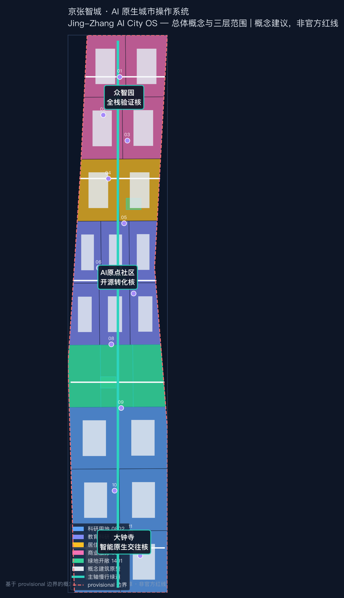
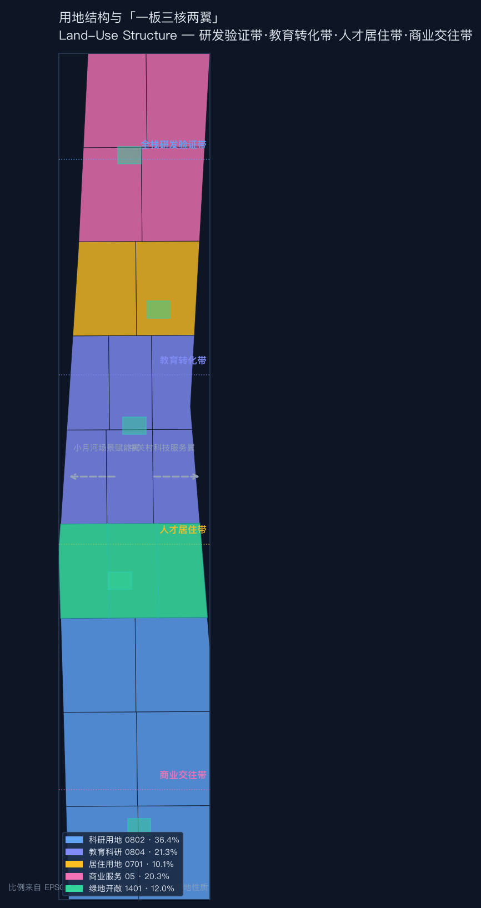
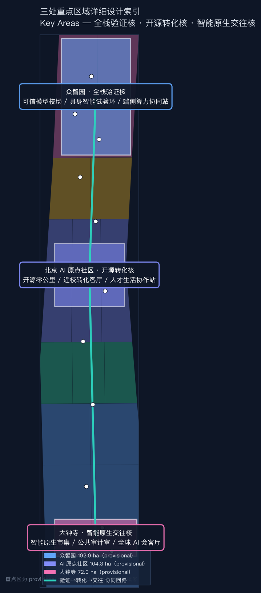
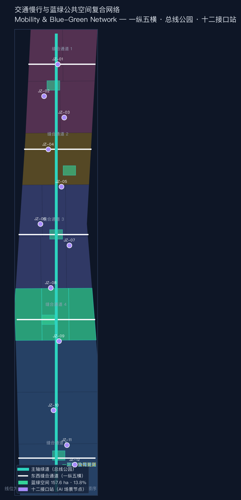
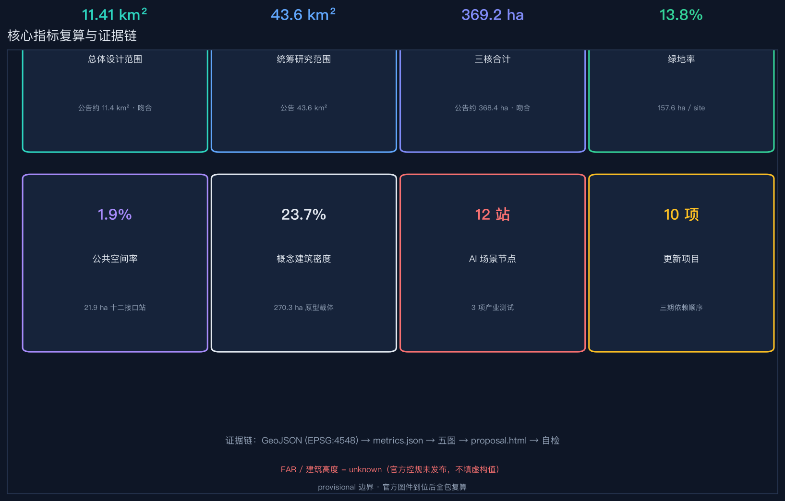

# Jing-Zhang AI City: AI-Native City Operating System | Jing-Zhang AI City OS

The "Jing-Zhang Smart City" does not treat artificial intelligence as a decorative layer slapped onto the city's surface. Instead, it views the 43.6 square kilometers of research scope as an evolvable "city operating system": the Jing-Zhang Railway Heritage Park serves as a shared bus running north to south, while Zhongzhiyuan, Beijing AI Origin Community, and Dazhongsi are three functional cores. The Zhongguancun Technology Services Wing and the Xiaoyue River Scenario Enablement Wing are external expansion slots. The basic principles of the operating system are **minimal core, standardized interfaces, pluggable modules, and full auditability** — corresponding to the city, this means continuous and open Public Spaces, unified access to scenario interfaces, progressive replacement of update modules, and AI participation with full traceability. All spatial actions are Conceptual Recommendations or reference schemes for professional teams to deepen, not replacing formal planning, nor constituting a government review or implementation commitment. [standard:PROJECT-AGENT-OPEN-CALL-TASKBOOK]

## Design Basis and Source List

This plan divides the factual basis into three layers. The first layer is the task and standard basis: the pre-qualification announcement confirms the project name, three layers of scope, and design tasks [source:DATA-SRC-OFFICIAL-ANNOUNCEMENT-20260509]; the task book for intelligent entities confirms three positioning principles, five functional areas, the Three Zones and Two Wings, six tasks, and public compliance boundaries [source:DATA-SRC-AGENT-TASKBOOK-20260518]. The Ministry of Housing and Urban-Rural Development's《Urban Design Management Measures》《Controlled Detailed Planning Compilation and Approval Measures》and the Natural Resources Ministry's《Land and Sea Use Classification Guide》provide professional language and in-depth frameworks [source:DATA-SRC-MOHURD-URBAN-DESIGN-MEASURES] [source:DATA-SRC-MOHURD-CONTROL-DETAILED-PLANNING] [source:DATA-SRC-MNR-LAND-USE-CLASSIFICATION-202311] [standard:MOHURD-URBAN-DESIGN-MEASURES] [standard:MOHURD-CONTROL-DETAILED-PLANNING] [standard:MNR-LAND-USE-CLASSIFICATION-GUIDE]. (Regulatory Detailed Planning) site package, public source registry, and processed fact package provide enumeration, data availability, and navigation of data boundaries [source:SITE-PACKAGE] [source:SOURCE-REGISTRY] [source:PROCESSED-FACT-PACK].

The second layer is spatial constraints: `site_boundary.geojson` comes from provisional polygons in the repository, with `official_boundary=false`, and is only used for generation, visualization, topology, and Content Review, not for official planning boundaries, precise area, or ownership. (Official Planning Boundary) Control or Approval Judgments [source:DATA-SRC-PROVISIONAL-BOUNDARIES-20260605] [source:BOUNDARY-SOURCE] [source:KEY-AREA-SOURCE] [data:geometry/site_boundary.geojson#SITE-001] [data:geometry/key_areas.geojson#PROV-KEY-001] [metric:site_area_sqm]. After the official polygon is in place, the boundary must be replaced in its entirety and all layers, metrics, five maps, HTML, and PDF must be recalculated.

The third layer is the design proposal generated by this scheme: the site is a fully zoned division (uncovered area 15 m², negligible) from the same provisional site geometric topological division; the building is a "reversible update carrier prototype," not the current as-built conditions; the road is a concept line for pedestrian and connection, not the road redline; the green space, Public Space, scene nodes, and phases are all discussable design layers [depth:existing_conditions_diagnosis] [depth:overall_spatial_structure]. The drawings and web pages only explain these machine data, not adding any new facts.

## Three-Level Scope Framework

Coordinated Research Area (approximately 43.6 square kilometers) addresses "how Haidian can form a world-class AI Innovation Ecosystem and future urban form"; Overall Design Area (approximately 11.4 square kilometers, provisional recalculated at 11.41 square kilometers) addresses "how industry, renewal, transportation, utilities, blue-green spaces, and urban appearance are organized into a comprehensive Urban Design"; Key-Area Detailed Design Area (approximately 368.4 hectares, provisional recalculated at a total of 369.2 hectares) addresses "how the three core areas are validated, transformed, and engaged through different mechanisms" [metric:research_area_sqm] [metric:site_area_sqm] [metric:key_area_count] [depth:three_level_scope_framework].

The three levels are hierarchically converged through the logic of "bus-core-slot": the research scope defines the operating system architecture (industrial ecology and future form), the design scope defines the motherboard wiring (spatial structure and update framework), and the key areas define the core micro-architecture (detailed design of the three zones). Provisional boundaries only express the hierarchical relationship and do not define the legal scope. [data:geometry/land_use.geojson#LU-04-SPINE]

## Coordinated Research Area: Industry and Future City Research

### Naming and Visual Identity

Main name: "Jing-Zhang Zhicheng," English name: "Jing-Zhang AI City OS," naming system: "Zhicheng = Bus + Core + Slot": The main axis green vein is called the "Bus Park," the three cores are named the "Verification Core / Transformation Core / Interaction Core," the scene nodes are called the "Interface Station," numbered as `JZ-07`. Logo direction: an abstract graphic with the cross-section of the Jing-Zhang Railway tracks and the circuit board wiring, the track ties metaphorize "standard interfaces," the traffic lights' three colors metaphorize "Human Review Gates," the visual tone is deep space blue + signal green + track gray. [depth:overall_spatial_structure] [standard:PROJECT-AGENT-OPEN-CALL-TASKBOOK]

### Three Key Orientations, Five Major Functions, and the Synergistic Loop of Three Zones and Two Wings

Three key positioning concepts (Centennial Jing-Zhang Cultural Belt, Urban AI Experience Belt, AI Integration Innovation Belt) correspond to three system attributes in the operating system: Cultural Belt = Read-Only Memory (preserving railway memory and Zhongguancun spirit, non-modifiable), Experience Belt = User Interface (residents and visitors can perceive AI-enabled living scenarios), Innovation Belt = Central Processing Unit (R&D, validation, transformation, and iterative computing hub). Five functional areas correspond to five core service kernels: Full-Stack Independent AI Innovation System (validation kernel), World-Class AI Innovation Ecosystem (transformation kernel), AI-Enabled Scenarios Empowering New Paradigms (slot protocol), Intelligent AI-Vibrant City (bus service), AI Governance Global Discourse Power (audit service). [standard:PROJECT-OFFICIAL-ANNOUNCEMENT]

Three Zones and Two Wings Synergistic Loop: Zhongzhiyuan 'Verification Core' produces credible models and test data → AI Origin Community 'Transformation Core' translates the results into products and talent → Dazhongsi 'Interaction Core' completes display, transactions, and international dialogue → Zhongguancun Technology Services Wing supplies capital, intellectual property, and global elements → Xiaoyue River Scenario Enablement Wing transforms Scenario Access into a public test field → Feedback results flow back to Zhongzhiyuan to form an iterative loop. [data:geometry/key_areas.geojson#PROV-KEY-001] [data:geometry/key_areas.geojson#PROV-KEY-002] [data:geometry/key_areas.geojson#PROV-KEY-003]

### Global AI Innovation Ecosystem Case Transliteration

Six Referenced Case Studies and Their Spatial Translations (all from publicly available sources, for background reference only): [depth:overall_spatial_structure] [metric:global_ai_ecosystem_case_count] (Background Only)

| Case | Key Mechanism | Spatial/Operational Translation |
| --- | --- | --- |
| Silicon Valley Sand Hill Road | Walkable Agglomeration of Capital and Legal Services | Within the Dazhongsi Interaction Core is the 'Element Services Street', with a 15-minute walking circle for venture capital, legal services, and intellectual property. |
| London King's Cross | Update the railway heritage area into an innovative district, with Public Space as the priority. | The Jing-Zhang site axis adopts a sequential strategy of "Public Space prioritization and progressive renewal." |
| Singapore one-north | green space continuous innovative community, experimental scenarios legalized | Zhongzhiyuan verifies a clear-bounded low-speed test loop with an application-based system within the nuclear area |
| Boston Kendall Square | Academic-Industrial-Research Pedestrian Linkage and Public Living Room | AI Origin Community Strengthening Campus-Park-Community Three-Circle Pedestrian Seam |
| Hangzhou Yuntai Town | Driving Industry Clusters through Conference Branding | Dazhongsi "Global AI City Week" as an Annual Brand Event |
| Seoul Digital Media City | Mixed Use of Cultural Content and Digital Industries | Digital Narrative and Content Creation Interface Stations Embedded Along the Ruins Park |

The above cases are provided merely to illustrate the transferability of the mechanism and do not constitute endorsement or commitment to any park, company, or policy.

## Overall Design Area: Urban Renewal and Regulatory-Plan-Level Urban Design

The Overall Design Area is structured around a "one board, three cores, and two wings": **one board** is a continuous public bus line along the Jing-Zhang Heritage Park (north-south through, east-west connected), **three cores** are the functional cores of Zhongzhiyuan at the northern end, the AI Origin community in the middle, and Dazhongsi at the southern end, and **two wings** are the technology service wings and scenario empowerment wings extending to the east and west sides. The land use structure runs from north to south as "research and validation belt—education transformation belt—talent residence belt—commercial interaction belt," connected by the main axis green vein, avoiding the closure of industrial functions into separate gardens. [data:geometry/land_use.geojson#LU-01-W] [data:geometry/land_use.geojson#LU-05-C] [metric:land_use_research_sqm] [metric:land_use_green_sqm]

Urban Renewal adopts the framework of "reversible renewal, prioritize Public Space over buildings, and prioritize the ground floor over the whole building": the first step is to open public spaces and ground-floor interfaces (with minimal disturbance), the second step is to conduct a comparative analysis of retention, restoration, adaptive reuse, partial renewal, and new construction after completing investigations on buildings, ownership, cultural heritage, and municipal infrastructure, and the third step is to form a connected network of updates. It does not presuppose large-scale demolition and reconstruction, and does not pre-determine the demolition–renovate–retain strategy for any plot. [depth:retain_renovate_demolish] [depth:development_intensity_controls] (Demolish–Renovate–Retain Strategy)

Functional Proportions (Concept District Recalculation): Research and Development land approximately 415 hectares (36.4%), Education and Research approximately 243 hectares (21.3%), Commercial and Service approximately 231 hectares (20.3%), Residential approximately 115 hectares (10.1%), and Green Spaces approximately 137 hectares (12.0%). These proportions are for internal consistency within the plan and are not indicative of the approved land uses. [metric:land_use_research_sqm] [metric:land_use_education_sqm] [metric:land_use_commercial_sqm] [metric:land_use_residential_sqm] [metric:land_use_green_sqm]

Building Scale and Height Control: The statutory control indicators such as the Floor Area Ratio (FAR), Building Height, and Building Density will remain `unknown` until the official control plan is released; this scheme will use "Public Space solar and wind environment, sightlines to archaeological sites, fire safety and municipal capacity, mixed-use functions, and reversible structures" as comparative dimensions for professional teams to further develop. [depth:height_massing_character] [metric:floor_area_ratio] [metric:building_height_m] [standard:MOHURD-CONTROL-DETAILED-PLANNING] (Building Coverage Ratio)

## Detailed Design of Key Areas

Three key areas use provisional polygons. The following locations, areas, and internal structures are for directional design only and require official key areas, parcels, buildings, and control conditions to be completed and redrawn. [data:geometry/key_areas.geojson#PROV-KEY-001] [data:geometry/key_areas.geojson#PROV-KEY-002] [data:geometry/key_areas.geojson#PROV-KEY-003] [metric:key_area_zhongzhiyuan_sqm] [metric:key_area_origin_community_sqm] [metric:key_area_dazhongsi_sqm] [depth:three_key_area_detailed_design]

### Zhongzhiyuan · Full Stack Validation Core (North End, provisional 192.9 hectares)

Located as a garden-type AI full-stack independent innovation and safety verification district. The spatial organization consists of a three-segment verification chain: 'Trusted Model Arena—Embodied Intelligence Low-Speed Test Loop—Edge Side Computing and Energy Coordination Station', each segment with clear boundaries, safety gates, and public explanation interfaces. Building updates prioritize adaptable separable experimental units and shared evaluation spaces for equipment handling and sharing; traffic only proposes concept connections with the Fifth Ring Road and rail transit stations, awaiting road, flood prevention, and safety condition reviews. The operational lever is a test application system, risk tiering, on-site observation, third-party review, and public summary of results. [data:geometry/public_space.geojson#SCN-01] [data:geometry/public_space.geojson#SCN-02] [data:geometry/public_space.geojson#SCN-03]

### Beijing AI Origin Community · Open Source Transformation Core (middle segment, provisional approximately 104.3 hectares)

Located as a campus-oriented hub for technology transfer and talent living community. The spatial organization comprises three types of public interfaces: the first records open-source contributions and versions, the second connects technology, legal, intellectual property, scenarios, and clients, and the third integrates living, childcare, sports, learning, and nighttime collaboration into the innovative daily routine. Updates are implemented in small steps: starting with the first floor, idle periods, and shared facilities, and then deciding on further actions based on usage evidence; no assumptions are made about the consent of the university, park, or owner for renovation. The focus on pedestrian-friendly design is the seamless continuity between the campus, park, community, and transit nodes. [data:geometry/public_space.geojson#SCN-05] [data:geometry/public_space.geojson#SCN-06] [data:geometry/public_space.geojson#SCN-07]

### Dazhongsi · Intelligent Native Interaction Core (South End, provisional approximately 72.0 hectares)

Located as a city-type smart-native business, consumption, and international exchange district. Spatially, it forms a transition from public experience to professional discussion through the 'Smart-Native Market—Urban Model Public Audit Room—Global AI Lounge'. The quadrants of pedestrian stitching only express the desired relationships without providing conclusions on bridge or construction feasibility. The ground floor of the buildings prioritizes service for pitch sessions, displays, short-term work, community consumption, and non-motorized vehicle parking; the composite use of public green spaces must comply with green space regulations, traffic safety, and activity permits. Operations integrate commercial promotion, model responsibility, data sources, and human appeals through public experience routes. [data:geometry/public_space.geojson#SCN-10] [data:geometry/public_space.geojson#SCN-11] [data:geometry/public_space.geojson#SCN-12]

## AI Innovation Ecosystem, Personas, and AI+ Scenarios

### Six User Persona Categories

1. **Developers and Open Source Maintainers**: Need bookable evaluations, quiet collaboration spaces, contribution recognition, and cross-institutional interfaces; 2. **Startups and Small & Medium Enterprises (SMEs)**: Need prototyping equipment, compliance consulting, early customers, and cost-effective phased spaces; 3. **Large Enterprise Product and Operations Teams**: Need real-world problems, auditable trials, and international exchanges; 4. **Neighborhood Residents and Caregivers**: Need low-impact, barrier-free, child-friendly, daily spaces that clearly allow for the exit of AI services; 5. **Academic Staff and Students**: Need technology transfer, learning showcases, and safe slow travel; 6. **International Visitors and Non-Chinese Speakers**: Need bilingual signage, wayfinding that is usable without an app, and public transportation connections. The personas are not derived from individual tracking but are service design roles, and should be calibrated through voluntary participation in research before actual operation. [metric:user_persona_count]

### Twelve Scene Cards

| Scenario | Type and Space | Minimum Data | Human Review and Exit |
| --- | --- | --- | --- |
| Trustworthy Model Testing Ground | Industrial Testing / Zhongzhiyuan | Public Test Dataset or Authorized Data | Professional Evaluator Signs Results, No Sensitive Samples Released |
| Bodily Intelligence Low-Speed Test Loop | Industrial Testing / Zhongzhiyuan | Equipment Status and Anonymous Events | Safety Officer On-Site Takeover, Clear Physical Stop Button |
| Edge Computing and Energy Synergy Station | Industry Testing / Zhongzhiyuan | Equipment Energy Consumption and Task Queue | Operations and Maintenance Approval, No Collection of Personal Information |
| Jing-Zhang Memory Translation Station | Culture / Heritage Node | Qing Rights Historical Records and Exhibit Labels | Fact Review, Mark Uncertain Content |
| Open-Source Zero Kilometers | Landmark / AI Origin | Project voluntary submitted version with license | Maintainer confirmed, allows retraction of display |
| School Nearby Conversion and Resulting Living Room | Ecology / AI Origin | Team Voluntary Disclosure of Needs | Professional Service Personnel Review, Not a Substitute for Legal Advice |
| Talent Living Collaboration Hub | Community / AI Origin | Public Service Directory | Parallel Artificial Customer Service and Offline Windows |
| AI Pedestrian Guardian Station | Public Services / Main Axis | Public Road Network, Anonymous Obstacle Feedback | Posted After Manual Verification, No Mobile Phone Alternative Route |
| Barrier-Free Path Co-Creation Platform | Public Services / Midsection | Types of barriers submitted by users | Parties may submit anonymously for professional, barrier-free review. |
| Smart Native Market | New Business Model / Dazhongsi | Product Description and On-Site Safety Record | Venue Operator Review, Can Suspend Individual Experience |
| Public Audit Room for Urban Models | Governance / Dazhongsi | Model Cards, Data Cards, Impact Statements | Multi-Stakeholder Review, Release Minority Opinions |
| Global AI Living Room | Landmark / Dazhongsi | Public Agenda and Registration Information | The event organizers have confirmed that no implicit government promises are allowed |

Three Testing and Validation Scenarios for industrial tests are clearly written with `scenario_category=industry_test`; all twelve stations are written with [data:geometry/public_space.geojson#SCN-01] to SCN-12, and set `human_review_required=true` [metric:scenario_node_count] [metric:industry_test_scenario_count] [metric:scenario_card_count]. The scenario design adheres to six bottom lines of data minimization, purpose limitation, explainability, human takeover, offline alternatives, and exit options, without incorporating immature technologies for full-scale deployment. [depth:municipal_new_infrastructure]

## Land Use, Building Scale, and Retain-Renovate-Demolish Strategy

The land structure is organized around continuous open spaces rather than enclosing industries within park walls. At the southern end, enhance smart-native business, culture, and talent living. In the middle, strengthen on-campus research, open-source conversion, and community services. At the northern end, strengthen full-stack R&D, security validation, and low-carbon computing power. Each zone adopts warehouse enumeration codes `05`, `0701`, `0802`, `0804`, and `1401`, but these are design languages, not the approved land uses. [data:geometry/land_use.geojson#LU-02-W] [standard:MNR-LAND-USE-CLASSIFICATION-GUIDE] [depth:land_use_layout]

The built layer consists of concept carrier prototypes (18 prototypes, with a total footprint area of approximately 273 hectares, accounting for about 24.0% of the submitted boundary; see [metric:building_footprint_area_sqm] [metric:building_footprint_ratio]). These footprints are only used to verify the feasibility of the relationships between Public Spaces, ground-level openness, research and development modules, and east-west connections, with a confidence level of low; they do not represent the current number of buildings, construction scale, or potential demolition targets. Formal deepening will require the addition of purposes, years of construction, structural details, safety, property rights, energy consumption, historical value, and user opinions for each building, followed by a multi-scheme comparison for preservation/renovation/demolition. [data:geometry/buildings.geojson#BLDG-001] [depth:retain_renovate_demolish]

## Transport, Rail, Municipal Infrastructure, and Public Services

Traffic structure is "one vertical and five horizontal": one vertical is the Jing-Zhang Smart City Public Experience Greenway (main axis slow-moving total line), and the five horizontal lines serve the Dazhongsi quadrants, the middle segment scene wings, the proximity school connection of the AI Origin, and the external connections of the Zhongzhiyuan and the northern middle segment innovative community [data:geometry/roads.geojson#ROAD-SPINE-001] [metric:road_length_m] [metric:crosslink_count]. The alignment is fully restricted within the provisional site, expressing the relationship of demand rather than the road boundary. Formal deepening must use track entrances and exits, road sections, public transportation, passenger flow, parking, non-motorized vehicles, accessibility, safety, and municipal data for accessibility and safety checks. [depth:traffic_rail_slow_parking]

Pedestrian strategies should address the fundamental question of whether a space can be "continuously, safely, and barrier-free" accessed before discussing smart solutions. AI should only assist in aggregating public voluntary reports of obstacles, generating explainable alternative routes, and scheduling activity days; any recommendations should provide general signage, on-site personnel, and paper maps as fallback options. Parking should first distinguish between commuter, visitor, barrier-free, loading/unloading, and activity peak needs, prioritizing rail connections, shared mobility options, and standardized non-motorized vehicle parking to reduce the occupation of Public Spaces.

Municipal and New Infrastructure adopt 'pluggable service units': edge-side computing processes only explicitly authorized tasks, distributed energy and storage require specialized energy and fire safety measures, public Wi-Fi and sensing devices use minimal data collection and shortest retention, and model outputs retain human appeals. Facility locations, capacities, piping, and engineering feasibility are pending official documentation, and no conceptual nodes are written as confirmed constructions. [data:geometry/constraints.geojson] [depth:municipal_new_infrastructure]

## Blue-Green Network, Public Space, and Urban Character

The blue-green system consists of a continuous main artery and three east-west green fingers, with green space area totaling approximately 157.7 hectares, representing about 13.8% [metric:green_space_area_sqm] [metric:green_ratio]. Public Spaces are defined by a narrower walkable shared interface with twelve interface station squares, covering an area of approximately 21.9 hectares, representing about 1.9% [metric:public_space_area_sqm] [metric:public_space_ratio]. These values are calculated from the design geometry and only indicate internal consistency of the proposal, not the statutory green space ratio or official area. [data:geometry/green_space.geojson#GREEN-SPINE-01] [data:geometry/public_space.geojson#SCN-01] [depth:blue_green_public_space]

Public Spaces have three time scales: the century scale tells the story of the Jing-Zhang Railway and the innovation history of Zhongguancun; the annual scale hosts the Developer Festival, Public Audit Week, and the Urban Experience Season; and the daily scale serves commuting, exercise, care, rest, learning, and small-scale collaboration. Signage is composed of 'track lines + station codes + human confirmation points': for example `JZ-07 / 京张记忆译站` Each station sign indicates the data source, whether AI was involved, and the entrance to non-digital services. [standard:MOHURD-URBAN-DESIGN-MEASURES]

Four 'AI Pilgrimage / Honor' Nodes [metric:ai_pilgrimage_landmark_count]: **Open Source Zero Kilometer** (AI Origin, records verifiable public code and tool contributions), **Centennial Switch** (midsection of the site park, showcases railway technology, urban choices, and version divergences), **Public Audit Room for Urban Models** (Dazhongsi, preserves model cards, failure cases, and minority opinions), **Global AI Grand Hall** (Dazhongsi, hosts cross-linguistic public discussions). They are not monumental sculptures but rather usable, updatable, and question-worthy public components. Any historical content must undergo historical fact review, any person, company, paper image, or trademark must obtain copyright authorization, and any location must undergo cultural heritage, green line, blue line, and traffic safety verification. [standard:PROJECT-AGENT-OPEN-CALL-TASKBOOK]

## Renewal Projects, Implementation Policy, and Phasing

Ten project prototypes form the smallest closed loop from space to operation: JZ-01 Bus Park Continuous Walk and Signage; JZ-02 Dazhongsi Quadrants Seamless Integration; JZ-03 Intelligent Natively Generated Market and Public Audit Room; JZ-04 AI Origin Open Source Zero-Km; JZ-05 Near-School Conversion Demonstration Room; JZ-06 Talent Living Collaboration Station; JZ-07 Zhongzhiyuan Trustworthy Model Training Ground; JZ-08 Embodied Intelligence Low-Speed Test Loop; JZ-09 Edge Side Computing and Energy Coordination Station; JZ-10 Centennial Switch Cultural Node. Each must document spatial requirements, user needs, operational subject suggestions, prerequisite data, safety gates, exit conditions, and review metrics, rather than just listing the construction names. [depth:renewal_project_list] [metric:renewal_project_count]

Phasing is not the sequence of development approval but rather a sequential dependency, consisting of three phases [metric:phase_count] [metric:phase_1_area_sqm] [metric:phase_2_area_sqm] [metric:phase_3_area_sqm]: Phase 1 "Open and Validate" (approximately 325.6 hectares) prioritizes the creation of a public data registry, signage, co-created accessibility features, activity prototypes, and temporary facilities [data:geometry/phasing.geojson#PHASE-001]; Phase 2 "Collaborative Update" (approximately 477.1 hectares) involves comparing and networking update schemes after completing architectural, ownership, transportation, municipal, and cultural heritage investigations [data:geometry/phasing.geojson#PHASE-002]. Phase  "Full Stack Deepening" (approximately 338.6 hectares) incorporates effective scene screening, Human Review, operational responsibilities, and the versioning of public knowledge [data:geometry/phasing.geojson#PHASE-003] [depth:phasing_implementation].

Annual operations follow a seasonal cycle: spring for "public problem submission and scenario recruitment," summer for "low-risk prototyping and public experience," autumn for "Global AI City Week and peer review," and winter for "audit of results, failure exhibition, and release of next version rules." The developer community maintains the issue repository, the scenario operators maintain safety and service, professional teams maintain spatial and engineering judgments, and public representatives have the right to feedback and exit. International communication focuses on releasing reusable rules, lessons from failures, a Public Space data dictionary, and bilingual routes, rather than on the number of enterprises or investment commitments. All activities are subject to the boundary terms of [source:DATA-SRC-AGENT-TASKBOOK-20260518]. [depth:phasing_implementation]

## Metrics, Area Recalculation, and Compliance Matrix

Machine-readable metrics are divided into three categories. The first category is geometric consistency: provisional site area (11,412,825 m²), green space area and ratio, Public Space area and ratio, and concept Building Footprint area and ratio, all recalculated using EPSG:4548. The second category is structural quantities: land use zones (21), key areas (3), scene nodes (12), horizontal connections (5), stages (3), user profiles (6), scene cards (12), pilgrimage landmarks (4), ecological cases (6), and update projects (10). The third category is unknown official controls: FAR, height, road right-of-way, facility capacity, etc., which must wait for official/cleared data. [depth:metrics_recalculation] [metric:site_area_sqm] [metric:green_ratio] [metric:public_space_ratio] [metric:building_footprint_ratio] [metric:land_use_zone_count] [metric:key_area_count] [metric:scenario_node_count] [metric:crosslink_count] [metric:phase_count]

`compliance_matrix.json` covers Notice 1.3, 1.4, 1.5, and agent.1–agent.6, linking each item to the main text, nine categories of GeoJSON, indicators, A3/A0 formats, HTML, sources, assumptions, and self-inspection. `standard_matrix.json` สำหรับห้าข้อกำหนดที่ต้องปฏิบัติตามได้ถูก `addressed` ทั้งหมด แต่เกณฑ์ความลึกของอาคารยังคงอยู่ในสถานะ `data_gap` เนื่องจากขาดเอกสารทางการ. `design_depth_matrix.json` รวมทั้งหมดสิบห้าข้อมูลความลึกที่จำเป็นซึ่งถูกกำหนดให้ `complete`; complete indicates that this phase has provided locatable evidence and identified clear gaps, but does not signify official approval or completion of the project. [depth:risk_missing_data]

## Risk, Copyright, and Compliance

Nine key data gaps have been entered into `assumptions.json`: official overall boundary, official three key areas, control plan, road and traffic, buildings and ownership, cultural protection, municipal safety, statutory blue-green control, and Public Space operation and maintenance. The most critical risk is not "insufficiently precise maps," but misreading the conceptual precision as planning precision; therefore, all map boundaries are expressed using low-contrast dashed lines to indicate provisional boundaries, and all derived numerical values are only used for internal recalculations within the scheme. If official maps are not re-calculated in their entirety after their arrival, the scheme will lose consistency. [data:geometry/site_boundary.geojson#SITE-001] [depth:risk_missing_data]

Conceptual Recommendation for AI Risk Management: Use scenario-level controls; do not employ secret, corporate internal, or personal privacy data; medical, legal, security, and public service outputs are for informational purposes only; high-risk scenarios must be manually approved, taken over on-site, audited with logs, and subject to public appeals; model failures and minority opinions enter the public audit room. Any activities, recruitment, policies, funding, partners, construction, or operations are conceptual recommendations and do not constitute determined government decisions. All original content and external background references are found in `report/copyright_statement.md` and `sources.json`.

The known flaw of this proposal is the lack of official polygons and current professional baseline data. Therefore, it can only serve as a high-fidelity starting point for Content Review and professional deepening, but cannot enter precise area scoring, statutory planning, engineering design, or investment decision-making. Before submission, perform deterministic validation, spatial review, visual packaging check, and professional evidence review; passing through this only represents the completion of machine check and content review, but does not guarantee the excellence, feasibility, or approval of the proposal.

## References

- Announcement and Scope of Work: [source:DATA-SRC-OFFICIAL-ANNOUNCEMENT-20260509]
- Six Tasks of Agents and Boundary Conditions: [source:DATA-SRC-AGENT-TASKBOOK-20260518]
- Urban Design, Control Planning, and Land Use Classification: [standard:MOHURD-URBAN-DESIGN-MEASURES] [standard:MOHURD-CONTROL-DETAILED-PLANNING] [standard:MNR-LAND-USE-CLASSIFICATION-GUIDE]
- Project and Task Standards: [standard:PROJECT-OFFICIAL-ANNOUNCEMENT] [standard:PROJECT-AGENT-OPEN-CALL-TASKBOOK]
- Building Professional Depth Gap: [standard:MOHURD-ARCH-DESIGN-DEPTH-2016]
- All layers indexed: [data:geometry/site_boundary.geojson#SITE-001] [data:geometry/key_areas.geojson#PROV-KEY-001] [data:geometry/land_use.geojson#LU-01-W] [data:geometry/buildings.geojson#BLDG-001] [data:geometry/roads.geojson#ROAD-SPINE-001] [data:geometry/green_space.geojson#GREEN-SPINE-01] [data:geometry/public_space.geojson#SCN-01] [data:geometry/constraints.geojson] [data:geometry/phasing.geojson#PHASE-001]
