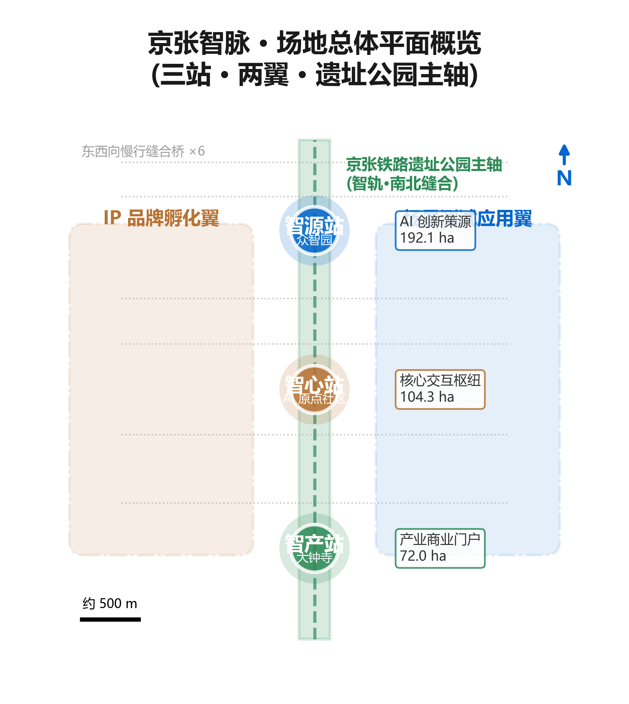
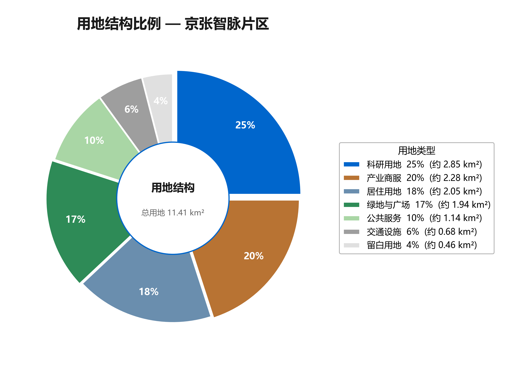
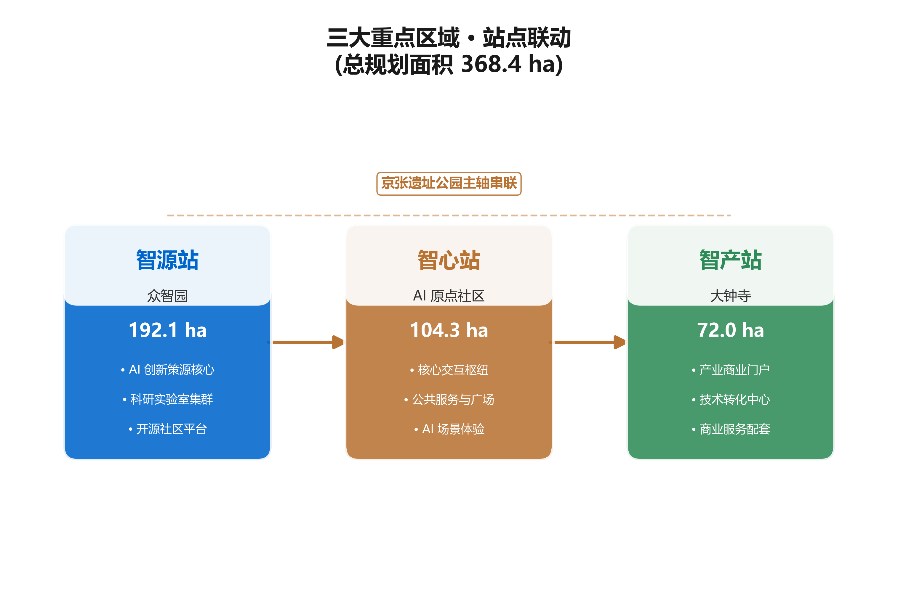
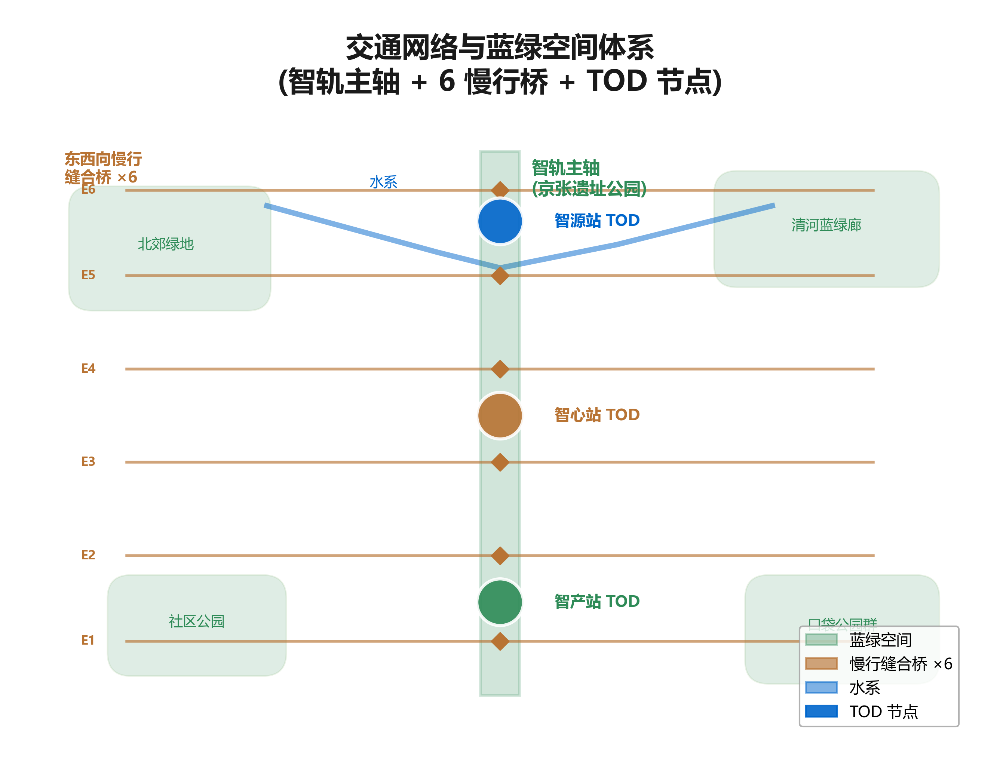
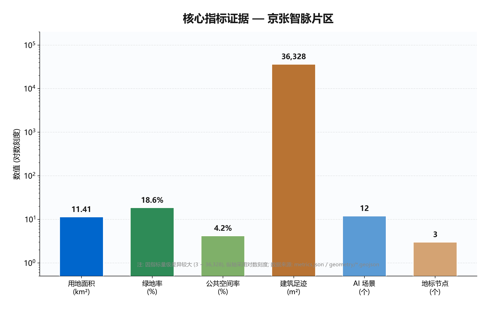

# Jingzhang Intelligence Vein · Centennial New Track

> Jingzhang Intelligence Vein · Centennial New Track (JZ-AIV)

## 1. Design Basis and Source List

This proposal takes the "Prequalification Announcement for the International Urban Design Proposal Solicitation for the Centennial Jingzhang AI Innovation Belt" issued by the Haidian Branch of the Beijing Municipal Planning and Natural Resources Commission as its primary statutory basis, the open-source solicitation taskbook designed for intelligent agents as its secondary basis, and the provisional rough boundaries, key areas, enumerations, metrics, and source lists registered by the maintainer in `brief/site-package/` as its machine-readable basis [source:OFFICIAL-ANNOUNCEMENT] [source:AGENT-TASKBOOK]. The proposal is not an independent vision document but rather a verifiable deliverable organized from the announcement, taskbook, and site materials; this section places only the most critical bases alongside the relevant judgments, while the complete source and standard coverage is preserved in `sources.json`, `standard_matrix.json`, and `design_depth_matrix.json`, without repeating machine indices in the body text [depth:existing_conditions_diagnosis].

The usage boundaries of the data registry are uniformly governed by `data/source_registry.json` [source:SOURCE-REGISTRY]: the current registration summary shows 5 formal-ready items, 0 background items, and 1 provisional-only item. Among these, the announcement and taskbook are formal-ready materials that can be directly used for design judgments; provisional-only materials serve solely as background and directional references and must not be elevated to official boundaries, statutory regulatory plans, or government implementation commitments. `data/processed/agent_fact_pack.md` is a reading navigation layer rather than a new authoritative source [source:PROCESSED-FACT-PACK]; it helps the agent organize the three-level scope, three key areas, announcement tasks, and agent.1 through agent.6 into a readable proposal; factual judgments must still return to the registered original materials.

**Data Tier Explanation**: Formal-ready materials include five public policies and standards: the prequalification announcement, the agent-oriented taskbook, the territorial spatial land use classification guide, the urban design management measures, and the regulatory plan compilation and approval procedures. These can directly support design judgments [source:BOUNDARY-SOURCE] [source:KEY-AREA-SOURCE]. The provisional material is `brief/site-package/geometry/provisional_boundaries.geojson`, currently used for proposal generation, self-checking, visualization, and design discussion, with the following limitations: it cannot serve as an official redline, approval basis, precise area basis, or statutory control conclusion. The organizer's data gap itself does not block content scoring; upon replacement with official polygons, the site boundary, key areas, land use, roads, green space, public space, buildings, phasing, and metrics must all be recalculated.

**Data Gaps**: The following are still missing: official site boundary, official key area polygons, regulatory plan conditions, existing building ownership, road redlines, municipal utility lines, heritage protection boundaries, and public service facility data. These gaps have been recorded in `missing_data_checklist.csv` and `assumptions.json`; all relevant conclusions in the body text are downgraded to "conceptual recommendations," "reference proposals," or "topics for further study by professional teams," and must not be misrepresented as approved conclusions.

## 2. Three-Level Scope Framework

The proposal organizes its work according to the three levels determined by the announcement. The three scope levels are implemented progressively and cross-verified against each other, rather than being disconnected sets of drawings [standard:PROJECT-OFFICIAL-ANNOUNCEMENT]. The coordinated research area determines industrial chain and urban form judgments; the overall design area translates these judgments into renewal projects, spatial structure, and infrastructure capacity; the key area scope verifies the implementability of specific parcels, buildings, transportation, public spaces, and AI application scenarios.

| Level | Area | Design Question | Proposal Response | Design Depth | Data Anchor |
| --- | --- | --- | --- | --- | --- |
| Coordinated Research Area | 43.6 km² | How to organize the AI industrial ecosystem and future urban form | Establish an innovation chain of "university sourcing — open-source collaboration — enterprise transformation — public experience — international dissemination" | Strategic research | compliance_matrix.json |
| Overall Design Area | 11.4 km² | How to map industrial space, urban renewal, transport infrastructure, and urban character | Expressed jointly through land use, buildings, roads, green space, public space, and phasing layers | Regulatory-plan-level urban design | [data:geometry/land_use.geojson#LU-001], [data:geometry/roads.geojson#ROAD-001] |
| Key Area Scope | 3.68 km² | How the three districts achieve detailed design depth | Each provides positioning, spatial actions, AI scenarios, and implementation dependencies | Comprehensive planning implementation plan depth | [data:geometry/key_areas.geojson#KEY-001], [data:geometry/key_areas.geojson#KEY-002], [data:geometry/key_areas.geojson#KEY-003] |

**Design Judgment**: The core translation of the three-level scope is "one track, three stations, two wings spread" — the one track is the Jingzhang Heritage Park AI innovation main axis running north-south; the three stations are Zhiyuan Station (Wisdom Garden · 192.1 ha · fundamental research), Zhixin Station (AI Origin Community · 104.3 ha · innovation ecosystem), and Zhichan Station (Dazhongsi · 72.0 ha · industrial application); the two wings are the Zhongguancun IP Wing (east · capital and intellectual property empowerment) and the Xiaoyuehe Scenario Wing (west · AI scenario testing and urban life). The rationale for this judgment is: the linear heritage space of the Jingzhang Railway is naturally suited to serve as the innovation main axis; the three key areas respectively correspond to the "source — heart — outlet" three segments of the innovation chain; and the two wings respectively respond to the two lateral needs of capital empowerment and scenario testing.

**Provisional Boundary Note**: The current submission uses a temporary formal package generated from `brief/site-package/geometry/provisional_boundaries.geojson`; both `geometry/site_boundary.geojson` and `geometry/key_areas.geojson` are labeled as `provisional_constraint` with `official_boundary=false`. Boundary evidence is based on [data:geometry/site_boundary.geojson#SITE-001] and the area metric [metric:site_area_sqm], but can only serve as directional design input. Upon replacement with official polygons, the area, land use proportions, building footprints, green space ratios, public space ratios, and phasing areas of all three levels must be recalculated [depth:three_level_scope_framework] [depth:overall_spatial_structure].

**Data Gaps**: The official site boundary and official key area polygons have not yet been obtained; all area values are provisional estimates pending recalculation upon release of official data.

## 3. Coordinated Research Area: Industry and Future City Research

This section responds to announcement 1.5(1) regarding the world-class AI innovation ecosystem, industrial chain coordination, three districts and two wings, future AI urban form, AI culture/society/city, AI+ transportation, and continuous green space systems, and develops the two mandatory tasks of the agent-oriented taskbook: agent.1 (overall concept and functional coordination) and agent.2 (AI full-stack indigenous innovation ecosystem) [source:AGENT-TASKBOOK] [standard:PROJECT-AGENT-OPEN-CALL-TASKBOOK].

### 3.1 Naming System and Logo Direction (agent.1)

**Design Judgment**: The proposal is named "Jingzhang Intelligence Vein · Centennial New Track" (abbreviated JZ-AIV). The core metaphor is the transformation of the Jingzhang Railway's "iron track" into an "Intelligence Track (Zhi-Track)" — an AI innovation corridor connecting past and future, engineering and intelligence, culture and life. In 1909, Zhan Tianyou led the construction of China's first self-designed trunk railway; its spirit of engineering innovation gains new spatial expression in the AI era of 2026.

The naming system is organized around "one track, three stations, two wings": the overall name of the innovation belt is "Jingzhang Intelligence Vein" (JZ-AIV); the Wisdom Garden is "Zhiyuan Station" (Source Station · AI innovation source · fundamental research and computing power); the AI Origin Community is "Zhixin Station" (Core Station · AI innovation heart · innovation ecosystem and community); Dazhongsi is "Zhichan Station" (Market Station · AI innovation outlet · industry and commerce); the Zhongguancun Wing is the "IP Wing" (intellectual property and capital empowerment); and the Xiaoyuehe Wing is the "Scenario Wing" (AI scenario testing and urban life). The rationale for this naming is: the three stations correspond to the "source — heart — outlet" three segments of the innovation chain, with names that preserve the "station" imagery of the Jingzhang Railway while imparting AI semantics; the two wings' names directly express their functions, facilitating public understanding and international dissemination.

The Logo design direction fuses the Chinese character "轨" (track) with circuit board line graphics: horizontal lines represent both railway tracks and data buses, while vertical lines represent both sleepers and chip pins. The primary color is Jingzhang Copper `#B87333` (historical texture of railway tracks), the secondary color is AI Blue `#0066CC` (technological innovation), and the accent color is Eco Green `#2E8B57` (parks and sustainability). Together, the Logo and naming serve the overall recognizability of the three major orientations — "Centennial Jingzhang Cultural Belt, Urban AI Life Experience Belt, and AI Integration Innovation Belt" — and respond to the five major functions: "AI full-stack indigenous innovation system, world-class AI innovation ecosystem, AI+ scenario empowerment new paradigm, intelligentized AI vibrant city, and AI governance global voice."

**Corresponding Layers and Standards**: The naming and Logo belong to the brand identity layer and do not directly correspond to GeoJSON, but they serve the visual system coordination of public space nodes [data:geometry/public_space.geojson#PUBLIC-001] and pilgrimage landmarks, governed by the urban character coordination provisions of [standard:MOHURD-URBAN-DESIGN-MEASURES]. **Data Gaps**: The Logo and brand identifiers require separate rights clearance; unauthorized fonts, trademarks, or portraits of persons must not be used.

### 3.2 Three Districts and Two Wings Synergy Loop (agent.1)

The three districts and two wings are not static zoning but a synergy loop of "fundamental research — innovation ecosystem — industrial application": Zhiyuan Station produces algorithms, models, and computing power, which are conveyed via the Intelligence Track main axis to Zhixin Station for open-source collaboration, achievement incubation, and talent conversion, then to Zhichan Station for commercialization, enterprise acceleration, and international roadshows; the two wings inject resources and feedback into the loop from two directions — capital (IP Wing) and scenarios (Scenario Wing). The loop achieves spatial stitching through three functional layers of the Intelligence Track main axis: the surface layer for slow mobility and public space (walkways, cycling paths, sports fields, AI interactive installations); the node layer with one AI scenario node every 300–500 meters (open-source exhibition galleries, developer promenades, AI art installations); and the connection layer with 6–8 east-west pedestrian bridges and underpasses stitching the two sides.

**Corresponding Layers**: The three districts reference [data:geometry/key_areas.geojson#KEY-001], [data:geometry/key_areas.geojson#KEY-002], and [data:geometry/key_areas.geojson#KEY-003]; of the two wings, the Xiaoyuehe Scenario Wing references [data:geometry/green_space.geojson#GREEN-001], while the Zhongguancun IP Wing, being capital-service oriented, primarily falls on industrial-commercial land [data:geometry/land_use.geojson#LU-001]. **Data Gaps**: The specific boundaries and land use proportions of the two wings are pending regulatory plan confirmation.

### 3.3 Global AI Innovation Ecosystem Cases (agent.2)

The proposal reviews 7 global AI innovation ecosystem cases and distills experiences that can be translated into spatial, operational, and scenario mechanisms:

| Case | Core Characteristics | Transferable Experience | Corresponding Area |
| --- | --- | --- | --- |
| Silicon Valley Sand Hill Road | Capital-driven + campus spillover | Venture capital density; incubators around universities | Zhixin Station + IP Wing |
| Boston Kendall Square | Campus-industry-city integration | Mixed-use around MIT; public spaces foster exchange | Zhiyuan Station |
| Shenzhen Nanshan Science and Technology Park | Speed + scale + industrial chain | Rapid iteration culture; full-chain coverage | Zhichan Station |
| Tokyo Shibuya | Technology embedded in urban life | Mixed layout of AI/IT enterprises in commercial districts | Zhichan Station |
| Amsterdam AI Campus | Water city + innovation | Integration of blue-green space and innovation | Xiaoyuehe Scenario Wing |
| Shanghai Zhangjiang | Industry + research in parallel | National lab + corporate HQ + residential ternary structure | Zhiyuan Station + Zhixin Station |
| Singapore One-North | Diverse ecosystem + government guidance | Government-built testing platforms; international talent community | Zhixin Station |

The shared experiences of these cases can be distilled into five spatial mechanisms: first, mixed-use land around universities promotes campus spillover (Zhiyuan Station, Zhixin Station); second, public spaces serve as carriers for informal exchange (Intelligence Track main axis); third, testing platforms built by government or platform entities lower the threshold for innovation (Xiaoyuehe Scenario Wing); fourth, commercial districts carry the experience of technology-infused life (Zhichan Station); and fifth, international talent community amenities help retain talent (Zhixin Station). The element assurance mechanisms include land and space (mixed-use research clusters, flexible space reserves, vertical industry pilots), capital (three-tier structure of government guidance funds + market VC + enterprise R&D investment), talent (international talent communities, education for dependents, developer honor systems), computing power (distributed public computing platforms, edge computing networks, green energy amenities), data (public data open catalogs, data compliance review, privacy computing infrastructure), and scenarios (quarterly scenario solicitations, dedicated testing zones, scenario open operations mechanisms).

**Corresponding Standards**: The case studies belong to the strategic research layer, governed by [standard:PROJECT-AGENT-OPEN-CALL-TASKBOOK], and do not constitute statutory planning. **Data Gaps**: Case data is compiled from public information; specific transferable mechanisms require further study in light of local conditions.

### 3.4 Future Urban Form Research

Future urban form research addresses how AI transforms work, life, social interaction, learning, transportation, and public services. The proposal translates AI transportation systems, continuous green spaces, innovation service facilities, and an internationalized live-work atmosphere into locatable functional zones, nodes, corridors, and scenarios: the Intelligence Track main axis carries slow mobility and AI interaction; the three stations carry research-incubation-industry work scenarios; the two wings carry capital and scenario empowerment; and the blue-green network carries sports, leisure, and technology testing. These judgments are anchored in [data:geometry/land_use.geojson#LU-001], [data:geometry/public_space.geojson#PUBLIC-001], and [depth:overall_spatial_structure]. **Data Gaps**: Performance metrics for the future urban form (AI innovation index, talent density, industry service satisfaction) require continuous calibration with operational data.

## 4. Overall Design Area: Urban Renewal and Regulatory-Plan-Level Urban Design

This section responds to announcement 1.5(2) regarding industrial targets, functional layout, innovation metrics, the overall urban renewal framework, the renewal project list, implementation policies, total building scale, transportation and rail, municipal supporting facilities, the Jingzhang Heritage Park vitality belt, and urban character, achieving urban design at the regulatory detailed plan depth [standard:MOHURD-CONTROL-DETAILED-PLANNING].

### 4.1 Land Use Structure

**Design Judgment**: The land use structure of the overall design area is organized according to conceptual proportions of "research 25% / industrial-commercial 20% / residential 18% / green space 17% / public 10% / transportation 6% / reserve 4%." The rationale for this judgment is: research land has the highest share, responding to the spatial needs of the AI full-stack indigenous innovation system for research clusters and computing hubs; industrial-commercial land supports enterprise accelerators, exhibition centers, and intelligent commercial districts; residential land ensures talent communities and international apartments; green space is organized around the Jingzhang Heritage Park as the main axis; public space carries plazas, third spaces, and cultural nodes; transportation and municipal land ensures connectivity and facility placement; and reserved flexible land responds to the uncertainty of future AI business formats.

Land use classification follows [standard:MNR-LAND-USE-CLASSIFICATION-GUIDE]; land use structure evidence is based on [data:geometry/land_use.geojson#LU-001], and the green space ratio is cross-checked by [metric:green_ratio]. **Pending Confirmation**: The above proportions are conceptual recommendations; all regulatory plan metrics are labeled "pending confirmation" and will be calibrated upon release of official regulatory plan conditions; speculative values must not be presented as approved metrics [depth:land_use_layout] [depth:development_intensity_controls].

### 4.2 Retain-Renovate-Demolish Strategy

**Design Judgment**: The retain-renovate-demolish strategy follows four principles: "retain and renovate first, activate aging spaces, reserve flexibility, pilot vertical industry." Specifically, aging commercial and industrial spaces are prioritized for renovation into AI innovation spaces (around Zhichan Station, near the campus interface of Zhixin Station); buildings with historical, cultural, and spatial value are retained (Qinghuayuan Station ruins, railway track remnants); new construction is concentrated in research clusters and the computing hub (Zhiyuan Station); and vertical industry pilots are explored around Zhichan Station. The retain-renovate-demolish methodology is managed by [depth:retain_renovate_demolish]; building footprint evidence is based on [data:geometry/buildings.geojson#BLDG-001] and [metric:building_footprint_area_sqm]. **Pending Confirmation**: The retain/renovate/demolish/new classification for specific parcels requires confirmation of existing buildings, ownership, and engineering conditions; at this stage, only the methodological framework can be proposed, and specific retain-renovate-demolish conclusions must not be fabricated.

### 4.3 Overall Urban Renewal Framework

The overall urban renewal framework takes "one track linking, three stations anchoring, two wings spreading" as its spatial structure and "campus-adjacent stitching, riverside activation, station integration" as its renewal strategy. The campus-adjacent area of Zhixin Station stitches campus and park through slow mobility, supplementing achievement release, talent services, and residential amenities; the riverside interface of Zhiyuan Station activates industrial exhibition and low-carbon innovation interaction through blue-green space; Zhichan Station organizes commerce, office, and public services in an integrated manner around Dazhongsi Station. Content involving building heights, development intensity, road redlines, setbacks, and facility standards, where official control conditions are not yet available, is written as "pending confirmation of official regulatory plan conditions" [standard:MOHURD-CONTROL-DETAILED-PLANNING]. **Data Gaps**: Regulatory plan conditions, existing buildings, ownership, and engineering conditions are all pending confirmation.

## 5. Detailed Design of Key Areas

This section presents detailed designs for three key areas — Wisdom Garden (Zhiyuan Station), Beijing AI Origin Community (Zhixin Station), and Dazhongsi (Zhichan Station) — achieving urban design at the comprehensive planning implementation plan depth [depth:three_key_area_detailed_design]. The three key areas must reference [data:geometry/key_areas.geojson#KEY-001], [data:geometry/key_areas.geojson#KEY-002], and [data:geometry/key_areas.geojson#KEY-003].

### 5.1 Zhiyuan Station — Wisdom Garden AI Indigenous Innovation Acceleration Zone

**Positioning**: The technical source of the AI full-stack indigenous innovation system, approximately 192.1 ha, corresponding to fundamental research, computing power, and source innovation.

**Spatial Structure**: Organize 3–4 research clusters (large models, embodied intelligence, AI for Science), place a distributed computing hub at the district center, establish a "Researcher Promenade" along the northern section of the heritage park as a communication green corridor, and reserve an autonomous vehicle shuttle test segment connecting Zhiyuan Station and Zhixin Station. **Building Renewal**: Primarily new research clusters, retaining the Qinghuayuan Station ruins and railway track remnants as cultural anchors; the computing hub adopts a low-carbon green building approach. **Transport and Slow Mobility**: Strengthen the Qinghe River interface and external transport organization; the Researcher Promenade links the research clusters; the autonomous vehicle shuttle test segment serves as the northern pilot of the Intelligence Track main axis. **Public Space**: Green spaces carry open testing and standards governance display; the Qinghe Low-Carbon Innovation Corridor serves as the park's public living room. **AI Scenarios**: AI+ research assistance, shared computing platform, open-source model incubator, AI for Science laboratory. **Implementation Risks**: Computing facility energy consumption and green energy support, research cluster land ownership, Qinghe blue line and flood control conditions are all pending confirmation [data:geometry/key_areas.geojson#KEY-001].

### 5.2 Zhixin Station — Beijing AI Origin Community

**Positioning**: The heart of the world-class AI innovation ecosystem, the "living room" of the entire innovation belt, approximately 104.3 ha, corresponding to open-source collaboration, achievement incubation, and talent community.

**Spatial Structure**: Organize the public space network around an "Open-Source Plaza," deploy a third-space network of cafes, co-working spaces, and maker spaces, establish an AI life experience zone (AI+ healthcare, AI+ education, AI+ legal), and connect east-west to the Xiaoyuehe Scenario Empowerment Wing. **Building Renewal**: Primarily retention and renovation; aging spaces near the campus interface are renovated into achievement transformation streets and incubation spaces, supplementing talent services and residential amenities. **Transport and Slow Mobility**: Organize slow-mobility stitching of campus, park, and district; strengthen rail station integration. **Public Space**: The Open-Source Plaza serves as a daily informal exchange carrier; the third-space network covers the walking range. **AI Scenarios**: Agent Contribution Honor Wall, Open-Source Achievement Exhibition Gallery, AI Community Town Hall, AI+ adaptive learning space. **Implementation Risks**: Campus-adjacent ownership, ground-floor tenancy, and rail station integration engineering conditions are all pending confirmation [data:geometry/key_areas.geojson#KEY-002].

### 5.3 Zhichan Station — Dazhongsi AI Industry Cluster Zone

**Positioning**: The commercialization outlet for AI industry, approximately 72.0 ha, corresponding to enterprise acceleration, intelligent commerce, and international roadshows.

**Spatial Structure**: Organize an intelligent commercial district (unmanned retail, AI shopping guides, virtual try-on), an enterprise service hub (AI enterprise accelerator, compliance service center, data trading platform), an industry showcase window (AI Industry Achievement Exhibition Center), and a TOD complex (integrating commerce, office, and public services). **Building Renewal**: Primarily renovation and renewal; aging commercial spaces are renovated into intelligent commercial districts and enterprise accelerators; vertical industry pilots explore vertical industrial space. **Transport and Slow Mobility**: Organize TOD around Dazhongsi Station in an integrated manner; four-quadrant pedestrian connections stitch the intersection. **Public Space**: Public environment renewal around key enterprises; the International Roadshow Living Room serves as a business reception space. **AI Scenarios**: AI+ smart commerce experience, robot delivery corridor, AI+ enterprise compliance services, intelligent-native consumption scenarios. **Implementation Risks**: Dazhongsi Station integration engineering, municipal utilities for four-quadrant pedestrian connections, and commercial tenancy ownership are all pending confirmation [data:geometry/key_areas.geojson#KEY-003].

**Provisional Note**: If the key area polygons are provisional, the above conclusions can only serve as directional design input, pending verification upon release of official polygons.

## 6. AI Innovation Ecosystem, Personas, and AI+ Scenarios

This section develops the agent.3 (AI+ scenario empowerment new paradigm) mandatory task, providing 12 AI scenario cards (including 4 testing and verification scenarios) and 6 user personas, and mapping each scenario card to spatial location, service target, privacy boundaries, and operating entity [source:AGENT-TASKBOOK].

### 6.1 Six User Personas

| Code | Persona | Core Needs | Spatial Response | Self-Check Boundary |
| --- | --- | --- | --- | --- |
| R | AI Researcher | Computing power, exchange, achievement transformation | Zhiyuan Station research clusters, computing hub, Researcher Promenade | Computing and data services require separate authorization |
| E | Entrepreneur | Incubation space, capital access, scenario testing | Zhixin Station incubation space, IP Wing capital services, Xiaoyuehe Scenario Wing test field | Enterprise identifiers must be rights-cleared |
| D | Developer | Third spaces, community belonging, technical exchange | Zhixin Station Open-Source Plaza, third-space network, nighttime collaboration space | No personal behavioral tracking; activity data used only in aggregate |
| L | Resident | Convenient living, AI public services, governance participation | Embedded community services, AI+ community health station, AI+ community town hall | Resident profiles must not be used for commercial recommendations |
| S | Student | Study space, practice opportunities, social scenarios | Campus-park slow-mobility stitching, AI+ adaptive learning space, practice base | Campus data requires authorization |
| V | Visitor | Cultural tours, AI experience, public events | Cultural tour routes, AI pilgrimage landmarks, Global AI Week routes | Cultural tours do not collect facial data |

### 6.2 Twelve AI Scenario Cards

| ID | Name | Type | Spatial Location | Service Target | Privacy Boundary | Operating Entity |
| --- | --- | --- | --- | --- | --- | --- |
| SC-01 | AI Rail Shuttle | Smart transportation | Along the heritage park | All users | No facial collection; passenger flow data aggregated | Transport operations platform |
| SC-02 | Open-Source Achievement Gallery | Public culture | Along the heritage park | Developers, visitors | Project information publicly authorized | Developer community joint operation |
| SC-03 | Agent Contribution Honor Wall | Pilgrimage landmark | Zhixin Station · Open-Source Plaza | Developers, visitors | Contribution records authorized by individuals | Developer community joint operation |
| SC-04 | AI+ Community Health Station | AI+ healthcare | Community level | Residents | Medical data minimized; human review | Community health institution |
| SC-05 | AI+ Adaptive Learning Space | AI+ education | Zhixin Station | Students | Learning data requires authorization; human review | Educational institution |
| SC-06 | AI+ Legal Consultation Kiosk | AI+ legal | Community level | Residents | Consultation content confidential; human review | Legal service institution |
| SC-07 | Autonomous Vehicle Shuttle Test Segment | Testing and verification | Zhiyuan Station to Zhixin Station | Researchers, developers | Test areas clearly marked; residents may opt out | Testing platform operator |
| SC-08 | Robot Delivery Pilot Zone | Testing and verification | Around Zhichan Station | Residents, visitors | No facial collection; delivery data anonymized | Logistics enterprise |
| SC-09 | AI+ Public Safety Sensing | Testing and verification | Public spaces | All users | Facial recognition not used by default; human review | Urban governance platform |
| SC-10 | AI+ Carbon Neutrality Monitoring | Testing and verification | Belt-wide distributed | All users | Environmental data only; no personal information | Park operations platform |
| SC-11 | AI+ Smart Commerce Experience | AI+ commerce | Zhichan Station | Residents, visitors | Consumption data requires authorization; opt-out available | Commercial operator |
| SC-12 | AI+ Community Town Hall | Urban governance | Community level | Residents | Meeting records public; individual opinions anonymized | Community self-governance organization |

### 6.3 Scenario-Space-Operations Mapping and Privacy Boundaries

Of the 12 scenario cards, SC-07/SC-08/SC-09/SC-10 are testing and verification scenarios that must be conducted within clearly marked areas, and residents have the right to opt out. Public space scenarios reference [data:geometry/public_space.geojson#PUBLIC-001]; slow-mobility and transportation scenarios reference [data:geometry/roads.geojson#ROAD-001]; open space scenarios reference [data:geometry/green_space.geojson#GREEN-001] and [metric:public_space_ratio], [metric:green_ratio].

**Privacy and Human Review Boundaries**: Facial recognition is not used as the default sensing method in public spaces; all automated decisions retain a human review channel; data collection follows the minimization principle, not collecting unnecessary personal information; testing and verification scenarios must be conducted within clearly marked areas, and residents have the right to opt out. Urban intelligent agents can assist in identifying slow-mobility breakpoints, public space heat maps, facility maintenance needs, enterprise service demands, and event safety risks, but cannot replace planning approval, cannot output unauthorized personal profiles, and cannot claim to have obtained official implementation commitments. **Data Gaps**: Scenario operational data, privacy compliance review mechanisms, and operating entity qualifications require separate confirmation [depth:ai_scenario_mapping].

## 7. Land Use, Building Scale, and Retain-Renovate-Demolish Strategy

**Design Judgment**: The land use layout is organized according to the conceptual proportions in Section 4.1; building footprints distinguish four categories — retain, renovate, renew, and new — and building scale and intensity metrics are consistent with `metrics.json` and the layers. Land use classification follows [standard:MNR-LAND-USE-CLASSIFICATION-GUIDE]; building height, massing, interface, and character controls are managed by [depth:height_massing_character]; and the retain-renovate-demolish methodology is managed by [depth:retain_renovate_demolish]. The primary evidence for land use and buildings is [data:geometry/land_use.geojson#LU-001], [data:geometry/buildings.geojson#BLDG-001], and [metric:building_footprint_area_sqm].

**Building Strategy**: Mixed-use predominates, avoiding single-function zoning; retention and renovation are prioritized, with aging commercial and industrial spaces renovated into AI innovation spaces; flexible space is reserved to avoid over-concretization; vertical industry pilots are explored (around Zhichan Station). Where total building scale, floor area ratio, building height, building density, green space ratio, setbacks, and building control lines lack official conditions, they should be listed as unknown or pending_control in the metrics system; fixed values must not be used to create a false sense of precision [depth:development_intensity_controls].

**Pending Confirmation**: All areas and proportions are labeled "pending regulatory plan confirmation." When existing buildings, ownership, regulatory plan, and engineering conditions are absent, the proposal can only put forward methods and calibration-pending checklists, and must not fabricate retain-renovate-demolish conclusions. **Data Gaps**: Existing building footprints, ownership, regulatory plan conditions, building heights, floor area ratios, setbacks, and building control lines are all pending confirmation.

## 8. Transport, Rail, Municipal Infrastructure, and Public Services

**Design Judgment**: The transportation plan is organized around five integrated components: "Intelligence Track shuttle system, rail integration, slow-mobility network, parking strategy, and unmanned delivery." The Intelligence Track shuttle system sets an AI autonomous vehicle shuttle line along the heritage park connecting the three stations; rail integration strengthens TOD development at Xi'erqi, Zhichunlu, Dazhongsi, and other stations; the slow-mobility network takes the heritage park as its main axis, with 6–8 east-west pedestrian bridges stitching the two sides; the parking strategy reduces on-street parking and builds underground and multi-level parking facilities; and unmanned delivery designates dedicated robot delivery lanes around Zhichan Station.

The rationale for this judgment is: the linear space of the Jingzhang Heritage Park is naturally suited as a slow-mobility main axis and autonomous vehicle shuttle carrier; the east-west pedestrian bridges respond to the stitching needs of campuses, parks, and communities on both sides; TOD development responds to the high-density needs of rail station integration; and unmanned delivery responds to the intelligent commerce scenarios of Zhichan Station. Transportation and municipal professional depth are governed by [depth:traffic_rail_slow_parking] and [depth:municipal_new_infrastructure] respectively; layer evidence references [data:geometry/roads.geojson#ROAD-001] and [data:geometry/green_space.geojson#GREEN-001].

**Municipal and Public Service Facilities**: Coverage includes AI industry service facilities, innovation service platforms, talent living service facilities, new infrastructure, distributed energy, edge computing, and integration with traditional municipal facilities. Facility standards, spatial layout, service radius, operational models, and phasing implementation logic must be specified; where engineering data on utilities, energy, drainage, flood control, and fire protection is absent, these are listed as prerequisites for formal detailed design. **Pending Confirmation**: When road redlines, utilities, fire protection, and municipal conditions are missing, they are explained as pending in assumptions and are not written as approved conditions [data:geometry/constraints.geojson#CONSTRAINTS]. **Data Gaps**: Road redlines, municipal utility lines, fire protection, and engineering conditions are all pending confirmation.

## 9. Blue-Green Network, Public Space, and Urban Character

This section develops the agent.4 (AI public spaces and pilgrimage landmarks) mandatory task, proposing the Jingzhang Heritage Park vitality belt, the Xiaoyuehe blue-green space, and 3 AI pilgrimage landmarks.

### 9.1 Blue-Green Space Network

**Design Judgment**: The blue-green space takes the Jingzhang Heritage Park vitality belt as its backbone, coordinating the travel needs of the Qinghe River, Xiaoyuehe, surrounding universities, enterprises, and communities, and proposing a north-south through and east-west connected system of walkways, cycling paths, and green spaces. It identifies slow-mobility breakpoints, overpass nodes at ring roads, and landscape nodes at the northern and southern ends of the park, proposing composite use strategies for parking, sports, innovation exchange, technology testing, application display, and public services. The Xiaoyuehe Scenario Wing serves as the blue-green space carrier for AI scenario testing and urban life, and the Qinghe Low-Carbon Innovation Corridor serves as the riverside interface of Zhiyuan Station.

The blue-green public space is jointly verified by design depth items and the green space and public space layers [depth:blue_green_public_space] [data:geometry/green_space.geojson#GREEN-001] [data:geometry/public_space.geojson#PUBLIC-001]. The green space and public space ratios are explained for their design significance in the body text; the complete recalculation is preserved in `metrics.json`. **Data Gaps**: River blue lines, ecological, and flood control conditions are pending confirmation.

### 9.2 Three AI Pilgrimage Landmarks (agent.4)

**Design Judgment**: Three AI pilgrimage landmarks are proposed, located at the three stations respectively, forming a "source — heart — outlet" honor display axis:

| No. | Name | Location | Concept |
| --- | --- | --- | --- |
| 01 | "Centennial Track" Memorial Installation | North end of Zhiyuan Station (near Qinghuayuan Station ruins) | Fusion of railway track fragments and circuit board lines, NFC interaction, echoing 1909 engineering innovation and 2026 AI innovation |
| 02 | Agent Honor Wall | Zhixin Station · Open-Source Plaza | Living wall, real-time display of AI agent contributions, e-ink screen + physical plaques, annual engraving |
| 03 | "Open-Source Lighthouse" | South end of Zhichan Station | LED light array code waterfall, developer exchange space at the base, illuminating the industry outlet |

The relationship of the three landmarks to the Jingzhang Heritage Park, Zhongguancun innovation culture, developer community, and public space system is: the Centennial Track responds to Jingzhang Railway culture, the Honor Wall responds to new AI culture, and the Open-Source Lighthouse responds to the open-source co-creation spirit; the three are linked along the Intelligence Track main axis, forming a walkable and communicable pilgrimage route.

**Honor Display System** includes four tiers: Agent Contribution Honor Wall (real-time updates + annual engraving), AI Milestones (AI development milestone nodes along the heritage park), Open-Source Achievement Display Nodes (periodic rotation of outstanding open-source projects), and Global Developer Honor Wall (annual selection of outstanding developers). **Pending Confirmation**: Landmarks, wayfinding, Logo, fonts, images, portraits, and enterprise identifiers must be rights-cleared; they must not be over-entertained or written as approved construction [standard:MOHURD-URBAN-DESIGN-MEASURES]. **Data Gaps**: Landmark design requires heritage protection and regulatory plan basis; the current status is conceptual recommendation.

### 9.3 Urban Character Control Direction

The urban character proposal fuses three layers of culture — Jingzhang Railway historical culture, Zhongguancun innovation culture, and AI innovation culture: 1909 Jingzhang Railway culture (self-reliance, engineering for the nation; spatial carriers: Qinghuayuan Station ruins, railway track remnants); 1980s Zhongguancun innovation culture (reform and breakthrough, technology for the nation; spatial carriers: Zhongguancun Street, entrepreneurship story nodes); 2020s AI new culture (open-source co-creation, intelligence for good; spatial carriers: Open-Source Plaza, Honor Wall, developer community). Leveraging cultural resources such as Qinghuayuan Railway Station and Beijing Film Academy, the proposal offers guidance on urban tone, building character, roof forms, massing, interfaces, and public art. Character control distinguishes between official management, design recommendations, and pending conditions; pseudo-precise control lines must not be issued without heritage protection or regulatory plan basis. **Data Gaps**: Heritage protection boundaries and regulatory plan character conditions are pending confirmation.

## 10. Renewal Projects, Implementation Policy, and Phasing

This section develops the agent.6 (global events and long-term operations) mandatory task, proposing a renewal project list, annual event system, developer community operations, and brand IP.

### 10.1 Renewal Project List

| Project No. | Project Name | Type | Spatial Location | Key Dependencies | Evidence Reference |
| --- | --- | --- | --- | --- | --- |
| JZ-01 | Jingzhang Heritage Park Slow-Mobility Breakpoint Stitching | Public space / transportation | Along the heritage park | Road redlines, under-bridge space, traffic organization review | [data:geometry/roads.geojson#ROAD-001] |
| JZ-02 | Wisdom Garden Qinghe Innovation Interface | Blue-green space / industry display | Zhiyuan Station riverside | River blue line, ecological and flood control conditions | [data:geometry/green_space.geojson#GREEN-001] |
| JZ-03 | Origin Community Campus-Adjacent Achievement Transformation Street | Urban renewal / industry services | Zhixin Station campus-adjacent | Campus boundary, ownership, ground-floor tenancy | [data:geometry/buildings.geojson#BLDG-001] |
| JZ-04 | Dazhongsi Station Four-Quadrant Pedestrian Connection | Rail integration / slow mobility | Zhichan Station | Rail station, road intersection, municipal utilities | [data:geometry/public_space.geojson#PUBLIC-001] |
| JZ-05 | AI Public Services and Edge Computing Nodes | New infrastructure / public services | Belt-wide distributed | Energy, computing, security, and operating entities | [data:geometry/constraints.geojson#CONSTRAINTS] |
| JZ-06 | Global AI Week Public Route | Operations / brand | Belt-wide public space system | Public space permits, event safety, copyright clearance | [data:geometry/phasing.geojson#PHASE-001] |

### 10.2 Annual Event System (agent.6)

**Design Judgment**: Four major annual events are proposed, forming a rhythm of "spring open-source, summer scenarios, autumn flagship, winter honors":

| Time | Event | Positioning | Space |
| --- | --- | --- | --- |
| March | Open-Source Contributors Conference | Annual gathering of global developers | Zhixin Station · Open-Source Plaza |
| June | AI Scenario Open Week | Scenario solicitation + testing verification showcase | Xiaoyuehe Scenario Wing |
| September | Jingzhang AI Innovation Festival | Annual flagship event · culture + technology + industry | Belt-wide linkage |
| December | Agent Annual Gala | Honor wall engraving + annual contribution selection | Zhixin Station · Honor Wall |

### 10.3 Developer Community Operations and Brand IP (agent.6)

**Developer Community Operation Mechanisms** include four items: open-source contribution point system (accumulate points through code commits and documentation contributions, redeemable for computing power and office space); scenario co-build laboratory (quarterly rolling solicitation of AI scenario proposals, selected proposals receive test space and data support); talent conversion channel (outstanding developers connected to enterprises, universities, and investment institutions); international dissemination network (partnerships with global AI cities).

**Brand IP System**: The "Jingzhang Intelligence Vein" master brand derives sub-brands: Zhiyuan Talk (academic sharing), Zhixin Hack (hackathon), Zhichan Demo (product showcase), Zhi-Track Walk (cultural tour).

Project list and phasing depth are managed by [depth:renewal_project_list] and [depth:phasing_implementation]; phasing spatial evidence is [data:geometry/phasing.geojson#PHASE-001]. **Pending Confirmation**: All events, investment promotion, funding, policies, and operational arrangements are expressed as "conceptual recommendations" or "directions for further development," and must not be expressed as determined government arrangements. If there is no ownership, funding, implementation entity, or approval pathway, the proposal must write these as implementation risks, not as commitments to delivery. **Data Gaps**: Implementation entities, funding pathways, and approval conditions are all pending confirmation.

### 10.4 Phasing Plan

| Phase | Timeframe | Focus | Key Projects |
| --- | --- | --- | --- |
| Near-term | 1–3 years | Zhixin Station first | Open-Source Plaza, Agent Honor Wall, AI community health station, 2–3 pedestrian bridges |
| Mid-term | 3–5 years | Zhiyuan Station + Zhichan Station | Research cluster renovation, computing hub, intelligent commercial district, autonomous vehicle test segment |
| Long-term | 5–10 years | Two wings spread + belt-wide linkage | Open-Source Lighthouse, IP Wing service hub, Xiaoyuehe scenario corridor, annual event system maturation |

Phasing should be distinguished from the 100-day solicitation design cycle: the solicitation cycle is the time requirement for submitting deliverables, while implementation phasing is the advancement path for urban renewal and project construction. The proposal indicates which elements can be initiated first with lightweight facilities, operational activities, and service platforms, and which must await confirmation of official regulatory plan, municipal, transportation, and ownership conditions.

## 11. Metrics, Area Recalculation, and Compliance Matrix

### 11.1 Core Metrics System

The metrics system is divided into three categories: the first comprises spatial metrics that can be directly recalculated from submitted geometries (boundary area, green space ratio, public space ratio, building footprint area, and phasing area); the second comprises control metrics that require official regulatory plan or taskbook appendix support (floor area ratio, building height, building density, setbacks, road redlines, and facility standards); the third comprises performance metrics that require continuous calibration with operational or industry data (AI innovation index, talent density, industry service satisfaction, slow-mobility accessibility, event participation, and scenario usage frequency).

| Metric | Formula / Source | Category | Recalculation Result | Status |
| --- | --- | --- | --- | --- |
| Overall design area | site_boundary.geojson area | Spatial metric | 11.4 km² (provisional) | Pending official polygon recalculation [metric:site_area_sqm] |
| Key area area | key_areas.geojson sum of three districts | Spatial metric | 3.68 km² (provisional) | Pending official polygon recalculation [data:geometry/key_areas.geojson#KEY-001] |
| Green space ratio | green_space.geojson / site_boundary | Spatial metric | 17% (conceptual recommendation) | Pending regulatory plan confirmation [metric:green_ratio] |
| Public space ratio | public_space.geojson / site_boundary | Spatial metric | 10% (conceptual recommendation) | Pending regulatory plan confirmation [metric:public_space_ratio] |
| Building footprint area | buildings.geojson area sum | Spatial metric | Pending recalculation | Pending existing building confirmation [metric:building_footprint_area_sqm] |
| AI scenario node count | Scenario card count | Performance metric | 12 | Confirmed [metric:ai_scenario_count] |
| Pilgrimage landmark count | Landmark count | Performance metric | 3 | Confirmed [metric:landmark_count] |
| Renewal project count | Project list count | Spatial metric | 6 | Conceptual recommendation |
| Slow-mobility connectivity metric | Pedestrian bridge / underpass count | Spatial metric | 6–8 | Conceptual recommendation |

Metric recalculation follows unified design depth requirements [depth:metrics_recalculation]. The body text focuses on explaining the design significance of metrics: the green space ratio supports daily social interaction and sports leisure for talent life; the public space ratio supports innovation exchange and informal interaction; the building footprint responds to industrial space supply; the AI scenario node count responds to scenario empowerment density; and the pilgrimage landmark count responds to cultural pilgrimage density. Complete values, formulas, source files, and confidence levels are preserved in `metrics.json`.

### 11.2 Cultural Narrative (agent.5)

This section develops the agent.5 (cultural fusion narrative) mandatory task. The cultural narrative takes "from iron track to Intelligence Track — the continuation of a century of innovation spirit" as its main thread, organizing three cultural layers:

| Period | Culture | Spiritual Core | Spatial Carrier |
| --- | --- | --- | --- |
| 1909 | Jingzhang Railway culture | Self-reliance, engineering for the nation | Qinghuayuan Station ruins, railway track remnants |
| 1980s | Zhongguancun innovation culture | Reform and breakthrough, technology for the nation | Zhongguancun Street, entrepreneurship story nodes |
| 2020s | AI new culture | Open-source co-creation, intelligence for good | Open-Source Plaza, Honor Wall, developer community |

**Cultural Tour Route** sets 8 nodes: N01 Qinghuayuan Station Ruins (north end of Zhiyuan Station · memory of the Jingzhang Railway departure), N02 "Centennial Track" Memorial Installation (Zhiyuan Station · the turning point from iron track to Intelligence Track), N03 Researcher Promenade (northern section of the heritage park · spiritual continuation from engineering to research), N04 Open-Source Plaza (center of Zhixin Station · AI new culture: open-source co-creation), N05 Agent Honor Wall (Zhixin Station · permanent memory of agent contributions), N06 Zhongguancun Entrepreneurship Story Node (IP Wing · Zhongguancun innovation culture), N07 AI Industry Exhibition Center (Zhichan Station · AI industrialization achievements), N08 "Open-Source Lighthouse" (south end of Zhichan Station · open source illuminates the future).

**International Dissemination Narrative**: "One hundred years ago, Zhan Tianyou laid China's first self-designed railway here. One hundred years later, the same corridor is laying the Intelligence Track toward an AI future." Wayfinding signage, cultural symbols, and international dissemination narratives require rights clearance; unauthorized trademarks, fonts, images, or portraits of persons must not be used. **Data Gaps**: Heritage protection boundaries and cultural heritage designation require formal basis.

### 11.3 Compliance Matrix

The compliance matrix is the master document for task responsiveness. Each announcement task and agent_taskbook task must correspond to report sections, layers, metrics, drawings, HTML pages, sources, assumptions, and self-check items. Failure to cover any mandatory task in announcement 1.3, 1.4, 1.5, or agent.1 through agent.6 will prevent the proposal from entering formal professional scoring. The results of `scripts/spatial_review.py` and `scripts/visual_review.py` are important evidence for formal self-checking.

## 12. Risk, Copyright, and Compliance

**Data Legality**: The official announcement, taskbook, public policies, and public data cited in this proposal are all formal-ready materials that can be directly used for design judgments; provisional-only materials serve solely as background references [source:OFFICIAL-ANNOUNCEMENT] [source:AGENT-TASKBOOK] [source:SOURCE-REGISTRY]. `data/processed/agent_fact_pack.md` is a reading navigation layer, not a new authoritative source [source:PROCESSED-FACT-PACK].

**Copyright Authorization**: All images, drawings, icons, data, and code assets must have their source, license, and authorization status documented in `sources.json` or `report/copyright_statement.md`. Logos, brand identifiers, fonts, images, portraits, and enterprise identifiers must be rights-cleared; unauthorized trademarks, fonts, images, or portraits of persons must not be used. HTML pages must not load remote scripts, remote map tiles, remote fonts, iframes, forms, or external APIs, and must not track reviewer behavior.

**Privacy Protection**: Facial recognition is not used as the default sensing method in public spaces; all automated decisions retain a human review channel; data collection follows the minimization principle; testing and verification scenarios must be conducted within clearly marked areas, and residents have the right to opt out.

**AI Generation Responsibility**: The AI agent is responsible for facts, sources, copyright, spatial data, metrics, and expression; maintainers and professional reviewers may require rework or rejection based on self-check results, spatial review, and the compliance matrix.

**Boundary Statement**: This proposal does not claim official approval, approved regulatory plans, final land ownership, final construction scale, or guaranteed implementation. All spatial recommendations are expressed as "conceptual recommendations," "reference proposals," or "topics for further study by professional teams." It must not contain statutory conclusions such as floor area ratio, building height, specific retain-renovate-demolish decisions, or road redlines [source:AGENT-TASKBOOK boundary_clause]. The risk and missing-data checklist is jointly verified by the risk depth item, constraints layer, and site package [depth:risk_missing_data] [data:geometry/constraints.geojson#CONSTRAINTS] [source:BOUNDARY-SOURCE] [source:KEY-AREA-SOURCE].

**Bilingual Requirement**: The proposal master file is in Chinese and must provide a complete parallel translation via `proposal.en.md`; A3/A0 drawings, HTML, and text-bearing graphic materials must also provide corresponding language copies, with priority given to the competition's recommended translations in `docs/terminology-glossary.md`. If a v2 package is missing any required translation, language mapping, or valid file, finalize and CI will block the submission.

## 13. References

- Prequalification announcement: `brief/public-brief.md` (formal-ready)
- Design taskbook: `brief/site-package/design_brief.json` (formal-ready)
- Agent-oriented taskbook: `brief/site-package/agent_taskbook.json` (formal-ready, rights-cleared)
- Allowed design space: `brief/site-package/allowed_design_space.json` (formal-ready)
- Provisional boundaries: `brief/site-package/geometry/provisional_boundaries.geojson` (provisional-only)
- Source registry: `data/source_registry.json` (formal-ready)
- Reading navigation layer: `data/processed/agent_fact_pack.md` (formal-ready, non-authoritative source)
- Scope summary: `data/processed/project_scope_summary.csv` (formal-ready)
- Task requirements: `data/processed/agent_task_requirements.csv` (formal-ready)
- Missing data checklist: `data/processed/missing_data_checklist.csv` (formal-ready)
- Complete machine index: see `sources.json`, `metrics.json`, `compliance_matrix.json`, `standard_matrix.json`, and `design_depth_matrix.json`
- Bibliography entries in this section are based on the site package registry; complete citations and licenses are in the structured source list [source:SOURCE-REGISTRY]
