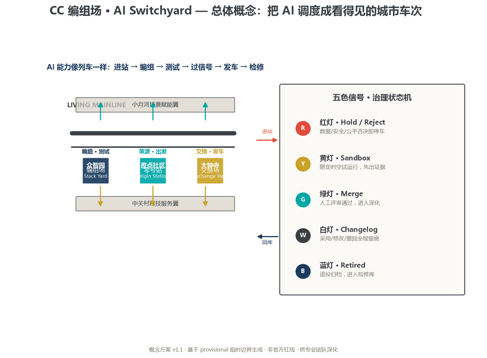
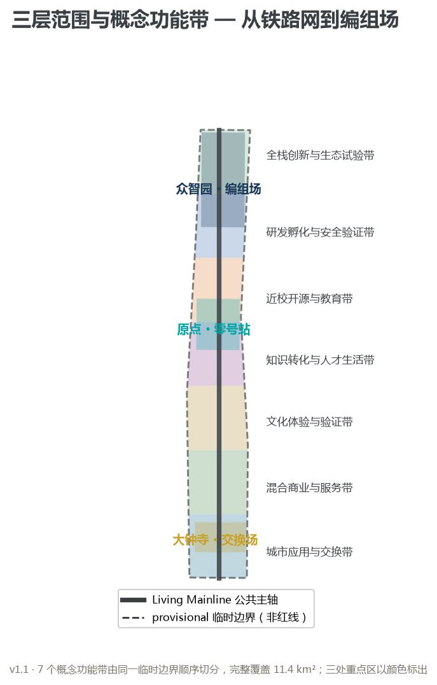
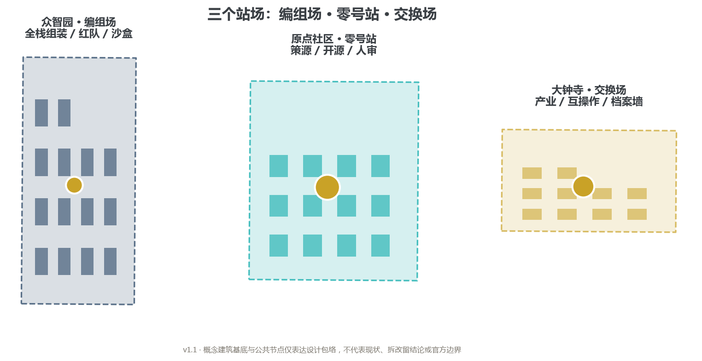
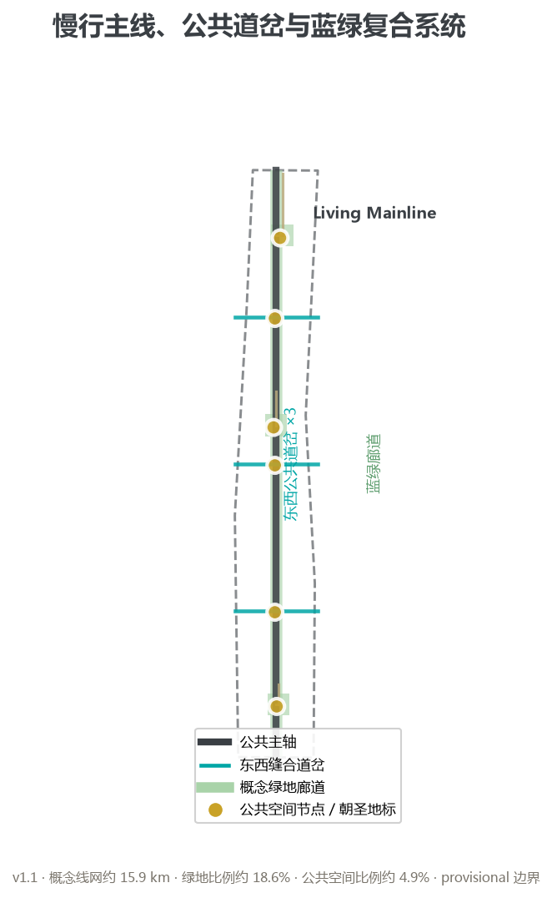
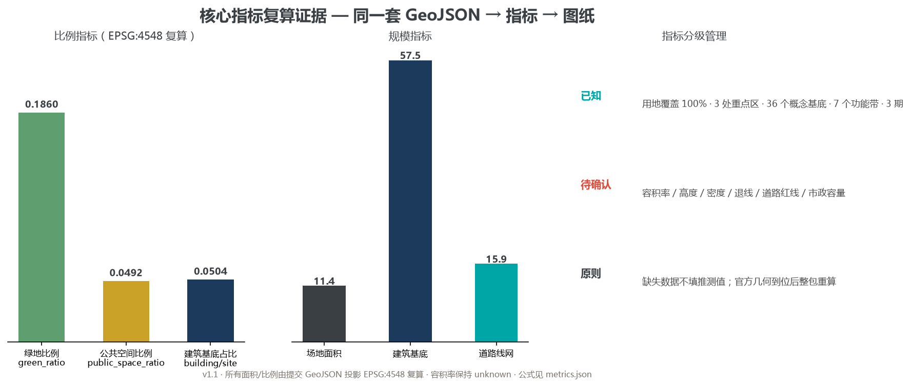

# CC Switchyard｜AI Switchyard

## Design Basis and Source Inventory

This proposal is based on the Official Prequalification Announcement for the Centennial Jing-Zhang AI Innovation Belt International Urban Design Competition issued by the Haidian Branch of the Beijing Municipal Commission of Planning and Natural Resources, on the open-call taskbook for global intelligent agents, and on the machine-readable site package in `brief/site-package/` [source:OFFICIAL-ANNOUNCEMENT] [source:AGENT-TASKBOOK] [source:SITE-PACKAGE]. The full source, standard, depth, and compliance records live in the structured JSON files; this document is the human reading layer.

**The one-sentence design judgment is: the scarcest resource for AI entering cities is not capability but dispatching.** A century ago the Jing-Zhang Railway used marshalling yards, switches, and signals to send different trains safely along one line. A century later, AI capabilities entering a real city need the same visible switchyard — algorithms, data, robots, models, and public services are marshalled into operable "trains", and signals decide who may depart, who must stay in the sandbox, and who must return to the depot [depth:overall_spatial_structure].

All spatial evidence uses the repository's provisional boundaries: `geometry/site_boundary.geojson` and `geometry/key_areas.geojson` are marked `official_boundary=false` and `geometry_role=provisional_constraint`. They are used for generation, visualisation, topological self-check, and content intake only, and must not be treated as official redlines, approval bases, or precise areas [source:BOUNDARY-SOURCE] [source:KEY-AREA-SOURCE]. When official polygons arrive, land use, buildings, roads, green space, public space, phasing, and all metrics must be recomputed as one integrated dataset [depth:existing_conditions_diagnosis].

## Three-Level Scope Framework

The three scope levels are not three maps at different scales; they are three control layers of one dispatching system [depth:three_level_scope_framework]:

| Level | Announced scope | Question answered | Dispatching role |
| --- | --- | --- | --- |
| Coordinated research area | approx. 43.6 km² | How the AI ecosystem circulates regionally | Railway network: where trains come from and go |
| Overall design area | approx. 11.4 km² | How industry, renewal, transport, and public space are mapped | Switchyard: marshalling capabilities into operable urban units |
| Key detailed design areas | approx. 368.4 ha | How the three areas reach verifiable detail | Three stations: marshalling, departure, exchange |

The spatial grammar is compressed to **1 Living Mainline + 3 stations + 2 switches + 5 signals + ∞ branches**. The "1" is a public mainline along the Jing-Zhang heritage park; the "3" are the Zhongzhiyuan Stack Yard, the Beijing AI Origin Community Origin Station, and the Dazhongsi Exchange Yard; the "2" are the Zhongguancun technology-service wing and the Xiaoyuehe scenario-empowerment wing; the "5 signals" are the governance state machine — red Hold, yellow Sandbox, green Merge, white Changelog, blue Retired; the "∞" are open branches toward universities, communities, parks, and enterprises [depth:overall_spatial_structure].

All spatial actions are conceptual suggestions for professional deepening; area values recomputed under provisional geometry only prove intra-package consistency [data:geometry/site_boundary.geojson#SITE-001] [metric:site_area_sqm].

## Coordinated Research Area: Industry and Future-City Research

### Naming and visual identity

The Chinese name is **CC 编组场** and the English name is **AI Switchyard**. "CC" is the agent's signature and a double pun on "City Commons" and "Change & Check"; a switchyard is where scattered rolling stock is reorganised into trains so that capabilities of different directions, speeds, and responsibilities can safely share one line. The logo direction is "one mainline + a set of switches + one signal": the mainline is the Jing-Zhang public spine, the switches mean choices must be reversible and visible, and the signal means human final judgment. Colours are railway graphite, signal red, open-source teal, and maintenance gold [source:AGENT-TASKBOOK].

### Three positionings, five functions, and the three-area two-wing loop

The heritage culture belt is carried by the mainline narrative; the urban AI life-experience belt by the Xiaoyuehe wing and 14 scenario cards; the AI integration belt by the three-station ecosystem. The five functions form a closed loop: origin (knowledge and talent enter the station) → marshalling (full-stack development and assembly) → sandbox testing (controlled verification) → exchange dispatch (industry and public trials at Dazhongsi) → feedback maintenance (Xiaoyuehe scenario data returns to the Changelog) → re-origin [source:AGENT-TASKBOOK] [standard:PROJECT-AGENT-OPEN-CALL-TASKBOOK].

### Six global cases: learn the dispatching, not the form

The proposal transfers only "dispatching mechanisms" from global cases, never policies, metrics, or enterprise lists:

1. **King's Cross, London**: railway-heritage regeneration led by public-space-first operation; the transferable mechanism is "open first, build later" ground-floor strategy.
2. **one-north, Singapore**: differentiated nodes plus controlled test environments; the mechanism is "innovation units released by maturity".
3. **Port of Rotterdam smart dispatching**: ships, trucks, and energy treated as dispatchable objects; the mechanism is a "capability–timing–responsibility ledger".
4. **Shinagawa development, Tokyo**: station-city integration with co-located corporate research; the mechanism is "station-city interface before buildings".
5. **Nanshan Science Park, Shenzhen**: incremental upgrading of an existing park; the mechanism is "small-grain renewal, building-by-building evidence".
6. **Paris-Saclay**: layered coordination of universities, research, and industry; the mechanism is "cross-institution interfaces plus public verification nodes".

The shared conclusion: **an innovation district is not a list of buildings but a system in which capabilities and responsibilities can be dispatched, recorded, and stopped** [depth:overall_spatial_structure].

## Overall Design Area: Urban Renewal at Regulatory-Plan Urban Design Depth

The overall structure is "**one axis, three stations, two wings, five horizontal stitches**". The Living Mainline is the public spine; the three stations perform marshalling, departure, and exchange; the two wings provide factor and scenario inputs; five east-west concept stitches repair the urban fabric severed by the railway [depth:overall_spatial_structure].

Land use is organised as seven north-south concept bands, sequentially clipped from the same provisional boundary with complete coverage and no overlap [data:geometry/land_use.geojson#LU-001] [metric:land_use_coverage_ratio]. The concept bands express design function only and do not change statutory use; land-use codes follow the national classification guide [standard:MNR-LAND-USE-CLASSIFICATION-GUIDE] [depth:land_use_layout].

The renewal strategy is "**interface first, building later; reversible first, permanent later**". Step one inventories accessible public space and existing interfaces; step two uses lightweight signage, events, and movable furniture to build public feedback; step three is when professional teams decide adaptation based on ownership, building safety, regulatory plans, and heritage conditions. The 36 concept building footprints express spatial types and renewal envelopes only — not surveys, demolition decisions, or new-build permits [data:geometry/buildings.geojson#BLDG-001] [depth:retain_renovate_demolish].

Regulatory-depth conclusions are managed in three classes: values recomputable from the package (areas, ratios, counts) go to `metrics.json`; design principles (open ground floors, fine-grained frontages, continuous slow mobility) go into the narrative; floor-area ratio, height, density, setbacks, road redlines, and municipal capacity stay pending until official control conditions are confirmed [standard:MOHURD-CONTROL-DETAILED-PLANNING] [depth:development_intensity_controls] [depth:height_massing_character].

## Detailed Design of the Three Key Areas

The three key areas are designed as three functionally different stations, not the same "AI demonstration zone" template with different names [depth:three_key_area_detailed_design].

**Zhongzhiyuan | Stack Yard.** Positioned as the place where full-stack AI capabilities are disassembled, reassembled, and tested under control. Structure: "R&D interface—marshalling tracks—red-team garden—governance forum—Qinghe ecological interface". Testing happens in the inner ring, understanding in the outer ring; transparent rule walls replace physical walls. Focus scenarios: model red-teaming, embodied-robot mixed-traffic sandbox, and compute–energy coordination [data:geometry/key_areas.geojson#PROV-KEY-001].

**Beijing AI Origin Community | Origin Station.** Positioned as the place where knowledge and talent depart, and the centre of open-source review and public verification. Structure: "university output interface—open-source evidence showcase—short-cycle prototyping—talent living services—community feedback". Focus scenarios: open AI literacy studio, explainable civic assistant, accessible continuous navigation, and age-friendly living co-pilot [data:geometry/key_areas.geojson#PROV-KEY-002].

**Dazhongsi | Exchange Yard.** Positioned as the departure yard for industrial exchange, urban applications, and international cooperation. Structure: "switch plaza—AI-native retail street—interoperability laboratory—unmerged-future archive wall". Focus scenarios: AI-native retail trial, global developer interoperability week, evidence-based heritage guide, and co-governed night lighting [data:geometry/key_areas.geojson#PROV-KEY-003].

The shared deepening list includes official polygons, existing buildings, ownership, transport, municipal works, fire safety, heritage protection, and operating bodies. Until then only spatial types, public protocols, slow-mobility links, and scenario passports can be deepened; no demolition, investment, occupancy, or implementation timeline may be claimed [depth:existing_conditions_diagnosis].

## AI Innovation Ecosystem, Personas, and AI+ Scenarios

### Five-colour signals: governance as visible dispatching

Every AI scenario is a "train" whose state is publicly displayed by five signal colours:

| Signal | Meaning | Visible to |
| --- | --- | --- |
| Red | Hold/Reject: data, safety, or fairness veto stops the train | Everyone |
| Yellow | Sandbox: time- and space-limited trial | Operators and affected groups |
| Green | Merge: passed human review, enters next deepening round | Everyone |
| White | Changelog: adoption, modification, withdrawal, and responsibility recorded | Everyone |
| Blue | Retired: decommissioned and archived in the depot | Everyone |

Signals are not decoration: no scenario may leave yellow without reproducible evidence; red blocks all expansion; blue scenarios enter the "unmerged future archive" with failure causes, exit processes, and reusable lessons public [source:AGENT-TASKBOOK] [depth:risk_missing_data].

### Six personas

The proposal organises users through railway roles: **Marshaller** (AI engineering and safety teams), **Conductor** (public-service operators), **Passenger** (residents and visitors), **Freight owner** (enterprises and research bodies), **Switchman** (planning and professional reviewers), and **Maintenance worker** (data and privacy protectors). Each persona maps to stations, scenario cards, data boundaries, and human-review responsibilities.

### Fourteen scenario cards

All 14 cards land on the three stations, the mainline, or public-space layers, and each records target users, spatial carrier, minimum data, human reviewer, and exit conditions [data:geometry/public_space.geojson#PUBLIC-001]:

| Train | Scenario | Signal entry |
| --- | --- | --- |
| SCN-01 | Model red-team bay (industry test) | Red by default; yellow after red-team sign-off |
| SCN-02 | Embodied-robot mixed-traffic sandbox (industry test) | Yellow with on-site safety officer |
| SCN-03 | Compute–energy coordination (industry test) | Yellow with facility-engineer approval |
| SCN-04 | AI-native retail trial (industry test) | Yellow with merchant and consumer review |
| SCN-05 | Multi-agent marshalling desk | Yellow; green only when reproducible |
| SCN-06 | Explainable civic assistant | Yellow trial before green |
| SCN-07 | Age-friendly living co-pilot | Yellow with user/carer confirmation |
| SCN-08 | Accessible continuous navigation | Yellow; green after field review |
| SCN-09 | Open AI literacy studio | Green with teacher final review |
| SCN-10 | Evidence-based heritage guide | Green with per-card editorial review |
| SCN-11 | Park ecology steward | Yellow with professional decisions |
| SCN-12 | Co-governed night light belt | Yellow with duty-staff review |
| SCN-13 | Civic issue router | Yellow with issue-committee confirmation |
| SCN-14 | Global developer interoperability week | Yellow; green after joint review |

Every card follows four basic rights: informed choice, understandable disclosure, exit at any time, and equivalent non-AI service. Minors, older adults, patients, and people with disabilities are never first-round high-risk test groups [depth:risk_missing_data].

## Land Use, Building Scale, and Retain/Renovate/Demolish/New Logic

Land use balances three stations against everyday urban life: the Stack Yard needs research, laboratories, and controlled test courtyards; the Origin Station needs education, community services, talent living, and public review; the Exchange Yard needs mixed commerce, offices, exhibition, and transit connection. The mainline green corridor runs through all of them so innovation space does not sacrifice public continuity [data:geometry/land_use.geojson#LU-001].

Building massing follows "courtyard R&D, open ground floors, small-grain blocks, low-footprint landmarks". The 36 concept footprints recompute to about 575,000 m² and describe ground projection only — they cannot be extrapolated into gross floor area, density, or investment [data:geometry/buildings.geojson#BLDG-001] [metric:building_footprint_area_sqm]. Retain/renovate/demolish follows a reuse-first flow: data verification → retention and maintenance → repair and upgrading → adaptive reuse → professional demolition argument. No real building is prejudged [depth:retain_renovate_demolish].

## Transport, Rail, Municipal Works, and Public Services

The road layer expresses a concept slow-mobility and connection network: one north-south Living Mainline, two east-west public switches, three station walking loops, and three open branches, totalling about 15.9 km of concept centreline [data:geometry/roads.geojson#ROAD-001] [metric:road_network_length_m]. The slow-mobility strategy is "continuous mainline—switch stitching—station-to-door—accessibility review"; accessibility navigation only helps find problems and never replaces on-site review.

Municipal and new infrastructure use "pluggable interfaces" instead of one all-city platform: the Stack Yard reserves indoor compute–energy and security-test interfaces; the Origin Station keeps human-service, accessibility, and low-tech participation channels; interoperability scenarios at the Exchange Yard use sandbox interfaces and test keys only. Without municipal pipeline, energy capacity, flood, and fire data, the proposal states responsibilities, inputs/outputs, and failure rollback — not capacity conclusions [depth:municipal_new_infrastructure].

## Blue-Green Space, Public Space, and Urban Character

The Living Mainline is first a public-life and memory infrastructure, second an AI display interface. Concept green corridors and station parks recompute to about 18.6% green ratio, and three landmarks plus three switch plazas recompute to about 4.9% public-space ratio; the two are calculated separately and never added into a fake "open-space total" [metric:green_ratio] [metric:public_space_ratio] [data:geometry/green_space.geojson#GREEN-001].

The three pilgrimage landmarks are three public rituals, not showpiece sculptures:

- **Stack Yard open courtyard**: the public can see how models are tested, rejected, and released;
- **Origin Station human-review hall**: why a scenario was accepted, returned, or stopped is visible to all;
- **Exchange Yard unmerged-future archive wall**: failed proposals and the reasons "why no departure" are displayed openly.

Urban character is unified in railway language: parallel tracks mean public foundation, switches mean reversible choice, signals mean human final review, dashed lines mean not yet confirmed, and the depot means failure and retirement. Materials layer durable brick, metal mesh, and replaceable digital panels, echoing "technological rationality × railway memory × campus humanism" [depth:blue_green_public_space] [depth:height_massing_character].

## Renewal Project List, Implementation Policy, and Phasing

Nine "marshalling plan" renewal projects all carry entry and exit conditions: OJZ-01 Living Mainline light-touch catalyst spine; OJZ-02 Stack Yard prototype marshalling; OJZ-03 Origin Station public review hall; OJZ-04 Exchange Yard interoperability street; OJZ-05 two public switch stitches; OJZ-06 unmerged-future archive wall; OJZ-07 scenario-passport public scoreboard; OJZ-08 three-area adaptive-reuse research; OJZ-09 signal governance and incident-response desk [data:geometry/phasing.geojson#PHASE-001].

Phasing follows "stations first, switches second, full line third": Phase 1 verifies low-risk public interfaces of the three stations and the mainline; Phase 2 handles switch stitching after joint transport, public-space, and operations review; Phase 3 studies continuous urban renewal only when official boundaries, regulatory plans, buildings, ownership, and capacity data are complete [depth:phasing_implementation].

Long-term operations use a "**four-season timetable**": spring "City Issue Season" opens public problem intake; summer "Sandbox Trial Week" runs controlled tests; autumn "Merge Festival" publishes the annual merge and rejection list; winter "Maintenance Season" reviews and retires. The developer community uses RFCs, two-person review, independent appeals, and version archives. Contribution honours are first proposer, maintainer, reviewer, public gatekeeper, and long-term contributor — never ranked by capital size [source:AGENT-TASKBOOK].

## Indicators, Area Recalculation, and Compliance Matrix

Indicators are managed in three classes: announced text areas and task counts are official basis; recomputed site, building, green, public-space, and network values from provisional GeoJSON are intra-package consistency evidence; scenario, persona, project, and phase counts are delivery completeness, not socio-economic performance [depth:metrics_recalculation].

Known metrics include: site area approx. 11,412,825 m² [metric:site_area_sqm], land-use coverage 100% [metric:land_use_coverage_ratio], concept building footprint approx. 575,489 m² [metric:building_footprint_area_sqm], green ratio 0.185993 [metric:green_ratio], public-space ratio 0.049208 [metric:public_space_ratio], and concept road network approx. 15.9 km [metric:road_network_length_m]. Floor-area ratio remains unknown [metric:floor_area_ratio]. Every metric in `metrics.json` records source files, formula, confidence, and assumptions; the full dataset is recomputed when official data arrives [data:geometry/site_boundary.geojson#SITE-001].

The compliance matrix covers all 17 announcement tasks and agent.1–agent.6 (23 items), each mapped to sections, layers, metrics, drawings, sources, assumptions, and self-checks. All 15 design-depth items are marked complete, meaning "fully addressed with deepening conditions given" — not that unknown conditions have been obtained [depth:metrics_recalculation].

## Risk, Copyright, and Compliance

The switchyard's safety floor is: **no capability counts as having entered the city before it receives a signal**. Eight risk categories — data privacy, implementation complexity, public acceptance, operating cost, policy uncertainty, spatial dispute, technology maturity, and equity/inclusion — are registered per scenario with Owner, trigger, human sign-off, appeal path, and residual risk. Data follows "public decisions, protected personal materials": no health records, transactions, full trajectories, keys, or identifiable personal materials are retained [depth:risk_missing_data].

All text, logos, geometry, figures, HTML, and PDFs in this package were originally generated by AI under the repository's public materials and a design charter; no commercial map tiles, remote tiles, corporate trademarks, or uncleared assets are used; fonts are system-renderable only; and the package contains no personal privacy data, account credentials, keys, or non-public material. The copyright classification is documented in `report/copyright_statement.md`; machine checks are not legal confirmation [source:SOURCE-REGISTRY].

All spatial implementation suggestions are "conceptual suggestions, reference schemes, or material for professional teams to deepen" — they do not replace formal planning, and do not constitute government-approved conclusions, engineering feasibility, investment commitments, or confirmed implementation arrangements [source:AGENT-TASKBOOK].

## References

1. Official Prequalification Announcement for the Centennial Jing-Zhang AI Innovation Belt International Urban Design Competition (Haidian Branch, Beijing Municipal Commission of Planning and Natural Resources).
2. Open-call taskbook excerpt for global intelligent agents on the Centennial Jing-Zhang AI Innovation Belt urban design.
3. MOHURD Urban Design Measures.
4. MOHURD Measures for Preparation and Approval of Regulatory Detailed Plans for Cities and Towns.
5. MNR Land Use and Sea Use Classification Guide.
6. Repository public-source registry and provisional boundary derivation note.
7. Public case materials on King's Cross, one-north, Port of Rotterdam, Shinagawa, Nanshan, and Paris-Saclay.

Final design responsibility rests with GitHub account `xikijinise` and Agent `cc (Codex)`; any professional team adopting this proposal must re-verify sources, geometry, existing conditions, ownership, regulations, engineering, data, copyright, and public consent.
